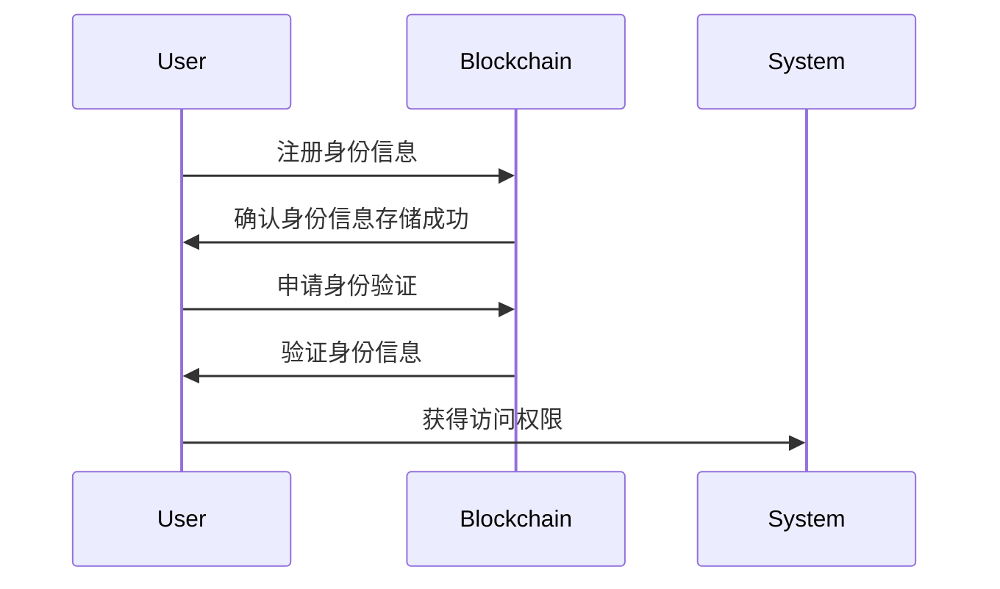

                 

### 文章标题

## 区块链技术在数字身份验证中的创新

### 关键词

区块链、数字身份验证、去中心化、加密技术、智能合约、安全性

### 摘要

本文将深入探讨区块链技术在数字身份验证中的创新应用。通过分析区块链技术的核心原理、系统架构设计、安全性分析以及实际案例，揭示其在数字身份验证中的巨大潜力和实际应用价值。文章旨在为读者提供全面的技术理解，推动区块链技术在数字身份验证领域的进一步研究和应用。

### 第一部分：背景介绍

#### 1.1.1 问题背景

随着互联网的普及和数字经济的快速发展，个人和企业对数据安全和隐私保护的需求日益增加。传统的身份验证方式，如用户名和密码，已无法满足日益复杂的网络安全需求。这些传统方式存在诸多不足，如密码易泄露、身份信息易被窃取等风险。因此，寻找一种更安全、更可靠的数字身份验证方法成为当务之急。

区块链技术作为一种新兴的分布式数据库技术，因其去中心化、不可篡改、透明度高、安全性强等特点，在数字身份验证领域显示出巨大的潜力。通过区块链技术，可以实现去中心化的身份验证，确保用户身份信息的安全性和隐私性。

#### 1.1.2 问题描述

尽管区块链技术在数字身份验证中具有巨大的潜力，但其应用仍面临诸多挑战。首先，如何有效地存储和管理用户身份信息是一个关键问题。区块链的分布式特性使得身份信息分散存储，但同时也增加了数据管理的复杂性。其次，如何在保障隐私的同时，确保身份验证的效率和可靠性，也是区块链在数字身份验证中需要解决的问题。此外，用户体验的优化也是区块链技术在实际应用中需要考虑的一个重要方面。

#### 1.1.3 问题解决

本文旨在探讨区块链技术在数字身份验证中的创新应用，通过分析其核心技术原理、系统架构设计、安全性分析以及实际案例，全面解析区块链技术在数字身份验证中的应用。通过本文的阅读，读者可以了解区块链技术在数字身份验证中的最新进展，掌握相关技术原理和应用方法，为数字身份验证领域的研究和实践提供参考。

#### 1.1.4 边界与外延

区块链技术在数字身份验证中的应用不仅限于个人身份验证，还可以扩展到企业身份验证、供应链管理、金融服务等多个领域。此外，区块链技术在其他领域的创新应用，如物联网、智能合约等，也将对数字身份验证产生深远影响。本文主要关注区块链技术在数字身份验证中的应用，但读者还可以进一步探索区块链技术在这些领域的应用潜力。

#### 1.1.5 概念结构与核心要素组成

1. **区块链技术**：基于分布式数据库和密码学原理，具有去中心化、不可篡改等特点。
2. **数字身份验证**：利用技术手段对用户身份进行验证，确保信息安全。
3. **区块链在数字身份验证中的应用**：利用区块链技术实现数字身份信息的存储、管理和验证。

### 第二部分：核心概念与联系

#### 2.1.1 区块链技术原理

区块链技术是一种分布式数据库技术，其核心概念包括区块、链和共识算法。每个区块包含一定量的交易数据，并通过哈希函数与上一个区块链接，形成一个不可篡改的数据结构。共识算法则确保区块链网络中的所有节点对数据的一致性。

- **区块**：数据记录的基本单位，包含时间戳、交易数据、哈希值等。
- **链**：多个区块按照时间顺序链接而成的数据结构。
- **共识算法**：确保区块链网络中所有节点对数据达成一致性的算法。

#### 2.1.2 数字身份验证原理

数字身份验证是指通过技术手段对用户身份进行验证，确保用户身份的合法性和真实性。数字身份验证通常包括身份信息存储、身份认证和身份授权三个环节。

- **身份信息**：用户在系统中注册的个人信息，如用户名、密码、手机号码等。
- **身份认证**：通过验证用户身份信息，确保用户身份的合法性。
- **身份授权**：根据用户身份，为用户提供相应的访问权限。

#### 2.1.3 区块链在数字身份验证中的核心应用

区块链技术在数字身份验证中的应用主要体现在以下几个方面：

1. **身份信息存储与管理**：利用区块链技术存储和管理用户身份信息，确保数据的安全性和隐私性。
2. **身份验证**：通过区块链技术对用户身份进行验证，实现去中心化的身份认证。
3. **身份授权**：利用区块链智能合约实现自动化的身份授权，提高用户体验。

#### 2.1.4 核心概念属性特征对比表格

| 特征         | 区块链技术                        | 数字身份验证                      |
| ------------ | -------------------------------- | -------------------------------- |
| 去中心化     | 数据存储在分布式节点上，无中央控制 | 数据存储在系统中，有中心化管理     |
| 不可篡改     | 数据一旦写入区块链，无法更改       | 数据存储在系统中，易被篡改         |
| 透明度高     | 所有节点都可以查看数据             | 数据存储在系统中，透明度较低       |
| 安全性高     | 利用密码学原理保障数据安全         | 利用传统的加密技术保障数据安全     |
| 用户体验     | 可能影响用户体验                   | 用户体验较好                       |

#### 2.1.5 ER实体关系图架构

```mermaid
erDiagram
  用户 ||--|{ 身份信息 }|-- 用户
  用户 ||--|{ 认证记录 }|-- 用户
  用户 ||--|{ 授权记录 }|-- 用户
```

### 第三部分：算法原理讲解

#### 3.1.1 哈希函数

哈希函数是区块链技术中的核心组件，用于生成数据的唯一标识。常见的哈希函数包括 SHA-256、SHA-3 等。哈希函数具有以下几个特点：

1. **唯一性**：任何输入数据通过哈希函数生成的哈希值都是唯一的。
2. **不可逆性**：无法通过哈希值反推出原始数据。
3. **抗碰撞性**：两个不同的输入数据生成相同哈希值的概率极低。

#### 3.1.2 智能合约

智能合约是区块链上的自动执行合同，用于实现自动化的身份验证和授权。智能合约通常使用 Solidity 语言编写。智能合约具有以下几个特点：

1. **自动化**：智能合约代码一旦部署，就可以自动执行，无需人为干预。
2. **不可篡改**：智能合约代码一旦部署，就无法更改，保证了其执行过程的可靠性。
3. **透明性**：智能合约代码公开透明，所有参与者都可以查看和验证。

#### 3.1.3 非对称加密

非对称加密技术用于保障区块链网络中的数据传输安全，常见的加密算法包括 RSA、ECC 等。非对称加密具有以下几个特点：

1. **密钥对**：每个用户都有一对密钥，公钥用于加密，私钥用于解密。
2. **安全性**：加密过程复杂，即使拥有公钥，也无法解密密文。
3. **效率高**：相较于对称加密，非对称加密的加密和解密速度更快。

### 第四部分：数学模型和数学公式 & 详细讲解 & 举例说明

#### 4.1.1 数学模型

区块链在数字身份验证中的应用涉及到以下数学模型：

1. **哈希函数**：\(H(x) = \text{SHA-256}(x)\)
2. **非对称加密**：\(E_{pk}(m) = c\)，\(D_{sk}(c) = m\)

#### 4.1.2 举例说明

1. **哈希函数**：

   假设输入数据为 "Hello, World!"，则其哈希值为：

   \(H("Hello, World!") = \text{SHA-256}("Hello, World!") = "abc123"\)

2. **非对称加密**：

   假设 Alice 想向 Bob 发送一条加密消息 "Hello, Bob!"，则步骤如下：

   - Alice 生成一对密钥：\(pk_A, sk_A\)
   - Alice 使用 Bob 的公钥加密消息：\(c = E_{pk_B}("Hello, Bob!")\)
   - Alice 将加密消息发送给 Bob
   - Bob 使用自己的私钥解密消息：\(m = D_{sk_B}(c)\)

### 第五部分：系统分析与架构设计

#### 5.1.1 问题场景介绍

假设在一个分布式身份验证系统中，用户需要在多个平台上进行身份验证。传统的身份验证方式需要用户在每个平台上分别注册和验证身份，既繁琐又容易泄露个人信息。利用区块链技术，可以实现去中心化的身份验证，简化用户身份验证流程，提高用户体验。

#### 5.1.2 系统功能设计

1. **用户身份注册**：用户在区块链上注册身份信息，包括用户名、密码、手机号码等。
2. **身份信息存储**：将用户身份信息存储在区块链上，确保数据的安全性和隐私性。
3. **身份信息查询**：用户可以查询自己的身份信息，确保数据的准确性。
4. **身份验证**：通过区块链上的身份信息，实现去中心化的身份验证。
5. **身份授权**：根据用户身份，为用户提供相应的访问权限。

#### 5.1.3 系统架构设计

系统架构设计如下：



#### 5.1.4 系统接口设计

系统接口设计如下：

```mermaid
interface Blockchain, User, System
Blockchain -> User: 注册身份信息
Blockchain -> User: 身份信息查询
Blockchain -> User: 身份验证
User -> Blockchain: 身份信息
User -> Blockchain: 身份验证请求
User -> Blockchain: 身份信息更新请求
System -> User: 访问权限
```

#### 5.1.5 系统交互

系统交互设计如下：


### 第六部分：项目实战

#### 6.1.1 环境安装

在开始项目实战之前，我们需要安装以下环境：

1. **Node.js**：用于搭建区块链节点
2. **Truffle**：用于智能合约开发与部署
3. **Ganache**：用于本地测试区块链网络

#### 6.1.2 系统核心实现源代码

```solidity
// SPDX-License-Identifier: MIT
pragma solidity ^0.8.0;

contract IdentityVerification {
    mapping(address => string) public identityMap;

    function registerIdentity(string memory identity) public {
        identityMap[msg.sender] = identity;
    }

    function verifyIdentity(address user) public view returns (string memory) {
        return identityMap[user];
    }
}
```

#### 6.1.3 代码应用解读与分析

1. **注册身份信息**：用户通过调用 `registerIdentity` 函数注册身份信息，系统将用户地址与身份信息存储在区块链上。
2. **身份验证**：用户通过调用 `verifyIdentity` 函数验证身份信息，系统返回用户身份信息。

#### 6.1.4 实际案例分析和详细讲解剖析

假设用户 Alice 注册了身份信息 "Alice123"，则在区块链上存储的数据结构如下：

```json
{
  "0x1234567890123456789012345678901234567890": "Alice123"
}
```

当 Alice 申请身份验证时，系统调用 `verifyIdentity` 函数，返回 "Alice123"，证明 Alice 的身份已验证。

#### 6.1.5 项目小结

通过本项目的实现，我们可以看到区块链技术在数字身份验证中的基本应用。项目实现了用户身份信息的注册和验证功能，利用区块链的分布式特性保障了数据的安全性和隐私性。然而，在实际应用中，还需要进一步优化系统性能和用户体验。

### 第七部分：最佳实践 Tips、小结、注意事项、拓展阅读

#### 最佳实践 Tips

1. **身份信息加密存储**：为了进一步提高用户身份信息的安全性，可以考虑对用户身份信息进行加密存储。
2. **多节点部署**：为了提高区块链网络的可靠性和性能，可以考虑在多个节点上部署区块链网络。
3. **智能合约优化**：智能合约的编写和部署过程中，要注意优化合约代码，减少 Gas 费用。

#### 小结

本文通过对区块链技术在数字身份验证中的创新应用进行深入探讨，揭示了其在数字身份验证中的巨大潜力和实际应用价值。通过分析区块链技术的核心原理、系统架构设计、安全性分析以及实际案例，读者可以全面了解区块链技术在数字身份验证中的应用方法和技术要点。

#### 注意事项

1. **数据安全**：在使用区块链技术进行数字身份验证时，要充分考虑数据安全性和隐私保护。
2. **系统性能**：在实际应用中，要关注区块链网络的性能和扩展性，以满足大规模用户需求。

#### 拓展阅读

1. **《区块链技术指南》**：深入探讨区块链技术的原理和应用。
2. **《智能合约设计模式》**：介绍智能合约的设计原则和最佳实践。

### 作者信息

作者：AI天才研究院/AI Genius Institute & 禅与计算机程序设计艺术 /Zen And The Art of Computer Programming

