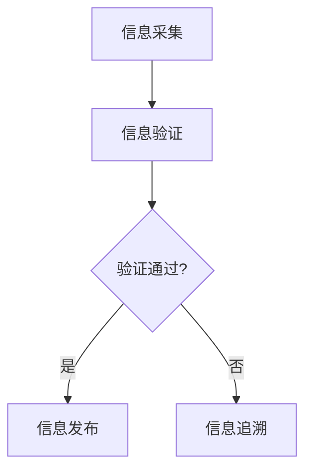

                 


# 《区块链技术在虚假信息防控中的应用》

> 关键词：区块链、虚假信息、防控、加密技术、智能合约、共识机制

> 摘要：本文将深入探讨区块链技术在虚假信息防控中的应用。首先，我们将介绍区块链技术的核心概念和原理，接着分析其在虚假信息防控中的作用机制，随后详细解释区块链在信息防控中的算法原理，最后通过一个实际案例，展示区块链技术在虚假信息防控中的具体应用和效果。

## 目录

1. 引言  
2. 区块链技术概述  
   2.1 区块链技术的发展历程  
   2.2 区块链的核心概念及其联系  
3. 区块链在虚假信息防控中的应用  
   3.1 区块链在虚假信息防控中的作用  
   3.2 智能合约与加密技术在虚假信息防控中的应用  
4. 算法原理讲解  
   4.1 哈希函数与区块链的关联  
   4.2 椭圆曲线加密技术原理  
5. 系统分析与架构设计  
   5.1 问题场景介绍  
   5.2 系统功能设计  
   5.3 系统架构设计  
   5.4 系统接口设计和系统交互  
6. 项目实战  
   6.1 环境安装与配置  
   6.2 系统核心实现源代码分析  
   6.3 实际案例分析与讲解  
   6.4 项目小结  
7. 最佳实践与总结  
   7.1 最佳实践技巧  
   7.2 注意事项  
   7.3 拓展阅读

## 引言

随着互联网技术的飞速发展，信息传播的速度和范围不断扩大。然而，这也带来了虚假信息传播的严重问题。虚假信息不仅误导公众，损害个人和企业声誉，还可能对社会稳定造成威胁。传统的信息防控手段如内容审查、人工审核等已显得力不从心，难以有效遏制虚假信息的蔓延。

区块链技术作为一种去中心化、不可篡改的分布式数据库，其在信息防控中的应用备受关注。区块链通过其独特的机制，能够确保数据的真实性和透明性，从而在虚假信息防控中发挥重要作用。本文将系统地探讨区块链技术在虚假信息防控中的应用，旨在为相关领域的研究和实践提供有益的参考。

## 2. 区块链技术概述

### 2.1 区块链技术的发展历程

区块链技术的起源可以追溯到2008年，当时一位化名为中本聪的学者发布了一篇名为《比特币：一个点对点电子现金系统》的论文。这篇论文首次提出了区块链的概念，并详细描述了比特币系统的运作机制。比特币作为第一种基于区块链技术的数字货币，迅速引起了广泛关注。

随着时间的推移，区块链技术得到了进一步的发展。2014年，以太坊的推出标志着区块链技术从单一的数字货币应用扩展到了智能合约和去中心化应用（DApp）领域。智能合约是一种自动执行的合约，能够根据预设的条件自动执行相关操作，极大地提高了交易的效率和安全性。

近年来，区块链技术的应用范围进一步扩大，从金融领域延伸到供应链管理、医疗记录、身份验证等多个领域。区块链技术的分布式账本、不可篡改和透明性等特点，使其在信息防控中具有独特的优势。

### 2.2 区块链的核心概念及其联系

#### 区块

区块链由一系列按时间顺序排列的“区块”组成。每个区块都包含一定数量的交易记录，并对这些交易记录进行加密处理。区块通过加密算法与前一区块进行链接，形成一个完整的链式结构。这种链式结构确保了区块链的不可篡改性，因为一旦某个区块被添加到链中，想要篡改该区块就需要同时篡改后续所有的区块，这在技术上几乎是不可能的。

#### 链

区块链中的“链”指的是由多个区块按时间顺序链接形成的结构。区块链的链式结构不仅保证了数据的完整性，还提供了数据验证的机制。每个区块都包含一个时间戳和一个哈希值，哈希值是根据区块中的所有数据进行加密计算得到的。这种哈希值和时间戳的组合，使得每个区块都可以追溯，同时也确保了区块链中的数据不会被篡改。

#### 共识机制

区块链的共识机制是区块链网络中节点之间就数据的真实性和一致性达成一致的方式。不同的区块链网络采用不同的共识机制，如工作量证明（PoW）、权益证明（PoS）等。共识机制确保了区块链网络中的数据真实性和透明性，使得所有节点都能对同一份数据保持一致。

### 2.2.1 区块

每个区块由多个交易记录组成，这些交易记录按照一定的规则进行排序和加密。区块的头部包含一个时间戳和一个哈希值，时间戳记录了区块创建的时间，哈希值则是对区块中所有数据的加密摘要。

#### 时间戳

时间戳是区块创建的时间戳，它记录了区块生成的具体时间。时间戳的存在确保了区块链中的交易是按照时间顺序排列的，同时也为区块链提供了时间参考。

#### 哈希值

哈希值是对区块中所有数据进行加密计算得到的值。哈希函数是一种将任意长度的数据映射为固定长度的字符串的算法，其特点是一致性和唯一性。在区块链中，哈希值用于确保区块中的数据不会被篡改。如果某个区块中的数据被篡改，其哈希值也会发生变化，这将导致后续所有的区块哈希值不一致，从而暴露篡改行为。

### 2.2.2 链

区块链的链式结构使得每个区块都通过其哈希值与前一个区块进行链接，形成了一个完整的数据链条。链式结构不仅确保了区块链的不可篡改性，还提供了数据验证和追溯的机制。

#### 链式结构

区块链的链式结构使得每个区块都通过其哈希值与前一个区块进行链接，形成了一个完整的数据链条。链式结构不仅确保了区块链的不可篡改性，还提供了数据验证和追溯的机制。

#### 数据验证

区块链中的数据验证是通过共识机制来实现的。不同类型的区块链网络采用不同的共识机制，如工作量证明（PoW）和权益证明（PoS）。共识机制确保了区块链网络中的数据真实性和透明性，使得所有节点都能对同一份数据保持一致。

#### 数据追溯

区块链的链式结构使得每个区块都可以追溯。如果某个区块中的数据被篡改，其哈希值也会发生变化，这将导致后续所有的区块哈希值不一致，从而暴露篡改行为。通过追溯区块链，可以找到篡改行为的具体位置和原因。

### 2.2.3 共识机制

共识机制是区块链网络中节点之间就数据的真实性和一致性达成一致的方式。不同的区块链网络采用不同的共识机制，如工作量证明（PoW）、权益证明（PoS）等。共识机制确保了区块链网络中的数据真实性和透明性，使得所有节点都能对同一份数据保持一致。

#### 工作量证明（PoW）

工作量证明（Proof of Work，PoW）是一种通过计算复杂任务来证明节点参与区块链网络的方式。PoW机制通过让节点解决一个复杂的数学问题来确保区块链的安全和一致性。解决这个问题的节点将获得比特币等数字货币的奖励。

#### 权益证明（PoS）

权益证明（Proof of Stake，PoS）是一种根据节点持有的代币数量和持币时间来选择下一个区块生成者的方式。PoS机制相对于PoW机制来说，能耗更低，但同时也存在一些潜在的问题，如集中化和选择性验证等。

### 2.3 区块链在信息防控中的作用机制

区块链技术在虚假信息防控中的应用主要基于其分布式账本、不可篡改和透明性的特点。以下从这几个方面详细解释区块链在信息防控中的作用机制。

#### 分布式账本

区块链的分布式账本技术使得数据不再集中在某个中心化的服务器上，而是分散存储在各个节点的数据库中。这种去中心化的结构使得任何单一节点无法篡改或控制整个数据，从而降低了虚假信息的传播风险。

#### 不可篡改

区块链的不可篡改特性确保了数据的真实性和完整性。一旦数据被记录在区块链上，就几乎无法被篡改。这是因为区块链中的每个区块都通过哈希值与前后区块进行链接，形成一个完整的数据链条。如果某个区块的数据被篡改，其哈希值会发生变化，这将导致后续所有的区块哈希值不一致，从而暴露篡改行为。

#### 透明性

区块链的透明性使得所有节点都可以查看和验证区块链上的数据。这种透明性不仅提高了数据的可信度，还使得虚假信息的传播受到了限制。因为在区块链上，任何虚假信息一旦被发现，就可以通过区块链的透明性快速追溯和纠正。

### 2.4 智能合约与加密技术在虚假信息防控中的应用

#### 智能合约

智能合约是一种自动执行的合约，其条款和条件被编码在区块链中。一旦满足合约中的预设条件，智能合约将自动执行相应的操作。智能合约在虚假信息防控中的应用，可以通过设置特定的条件来确保信息的真实性。例如，在一个新闻发布平台上，智能合约可以自动验证新闻源的真实性，只有通过验证的新闻才能被发布。

#### 加密技术

加密技术在区块链中用于保护数据的隐私和完整性。区块链中的数据传输和存储都是通过加密技术进行的。加密技术不仅确保了数据的机密性，还可以通过数字签名验证数据的真实性。在虚假信息防控中，加密技术可以用于保护敏感信息，防止信息被篡改或泄露。

### 2.5 区块链技术在虚假信息防控中的应用案例

以下是一些区块链技术在虚假信息防控中的应用案例：

#### 案例一：新闻发布平台

在一个基于区块链的新闻发布平台上，智能合约可以自动验证新闻源的真实性。只有通过验证的新闻源才能发布新闻，从而防止虚假信息的传播。

#### 案例二：医疗记录管理

在医疗领域，区块链技术可以用于管理医疗记录。通过区块链的分布式账本和不可篡改特性，可以确保医疗记录的真实性和完整性，防止虚假病历和医疗欺诈的发生。

#### 案例三：食品安全溯源

在食品安全领域，区块链技术可以用于食品安全溯源。通过区块链记录食品从生产到销售的每一个环节，消费者可以实时查看食品的来源和质量信息，从而有效防止食品安全问题的发生。

## 3. 算法原理讲解

### 3.1 哈希函数与区块链的关联

哈希函数是区块链技术中一个核心的组成部分，它主要用于确保区块链数据的完整性和不可篡改性。哈希函数是一种将任意长度的数据映射为固定长度的字符串的算法，其输出被称为哈希值。哈希函数具有以下特点：

1. **一致性**：相同的输入数据总是产生相同的哈希值。
2. **唯一性**：不同的输入数据产生的哈希值具有很高的概率不同。
3. **固定长度**：无论输入数据有多长，哈希值都是固定长度的。
4. **不可逆性**：无法通过哈希值反推出原始数据。

#### 哈希函数在区块链中的应用

在区块链中，哈希函数主要用于以下两个方面：

1. **确保数据完整性**：区块链中的每个区块都包含一个哈希值，该哈希值是对区块中所有数据的加密摘要。如果区块中的数据被篡改，哈希值也会发生变化，从而暴露篡改行为。
2. **链接区块**：区块链中的每个区块都通过其哈希值与前后区块进行链接。这种方式确保了区块链的不可篡改性和数据完整性，因为篡改某个区块需要同时篡改后续所有的区块，这在技术上几乎是不可能的。

#### 哈希函数的工作原理

哈希函数的工作原理可以简单理解为以下三个步骤：

1. **输入数据**：将任意长度的数据作为输入。
2. **加密计算**：使用哈希算法对数据进行加密计算，生成一个固定长度的哈希值。
3. **输出哈希值**：将生成的哈希值作为输出。

以下是一个简单的哈希函数示例（采用MD5算法）：

```python
import hashlib

def hash_function(input_data):
    # 对输入数据进行哈希计算
    hashed_data = hashlib.md5(input_data.encode('utf-8')).hexdigest()
    return hashed_data

# 测试哈希函数
input_data = "Hello, World!"
hashed_data = hash_function(input_data)
print(f"Input Data: {input_data}")
print(f"Hashed Data: {hashed_data}")
```

输出结果如下：

```
Input Data: Hello, World!
Hashed Data: 68e09213f6ad1f70aa7a361d916e4781
```

#### 哈希函数在区块链中的具体应用

在区块链中，哈希函数主要用于以下应用：

1. **区块头部**：每个区块都包含一个时间戳和一个哈希值。时间戳记录了区块生成的时间，哈希值则是对区块中所有数据的加密摘要。
2. **链接区块**：区块链中的每个区块都通过其哈希值与前后区块进行链接。这种方式确保了区块链的不可篡改性和数据完整性。

### 3.2 椭圆曲线加密技术原理

椭圆曲线加密技术（ECC，Elliptic Curve Cryptography）是一种基于椭圆曲线数学的加密技术。与传统的加密算法（如RSA）相比，ECC在相同安全级别的加密强度下，所需的密钥长度更短，计算效率更高。

#### 椭圆曲线加密技术的基本概念

1. **椭圆曲线**：椭圆曲线是一种在复数平面上的曲线，其数学表达式为 \( y^2 = x^3 + ax + b \)。其中，\( a \) 和 \( b \) 是常数，\( x \) 和 \( y \) 是曲线上的点。
2. **点加法**：椭圆曲线上的点加法是一种特殊的运算，用于计算两个点的和。点加法的运算规则类似于整数加法，但涉及到椭圆曲线的几何性质。
3. **点倍加**：点倍加是将一个点与其自身进行加法运算。点倍加运算在椭圆曲线加密中非常重要，因为所有其他点加法运算都可以通过点倍加运算来实现。

#### 椭圆曲线加密算法

椭圆曲线加密算法主要包括以下几种：

1. **椭圆曲线离散对数问题**：这是ECC加密的基础，其核心是求解椭圆曲线上的离散对数问题。即给定椭圆曲线和一个点P，求解整数k，使得kP等于另一个已知点Q。
2. **密钥生成**：在ECC中，密钥生成过程包括以下几个步骤：
   - 随机选择一个素数p和一个生成元G。
   - 计算离散对数，得到私钥d。
   - 计算公钥Q = dG。
3. **加密**：加密过程是将明文M映射为椭圆曲线上的一个点C，使得C满足以下条件：
   - C = kP + rG，其中k和r是随机选择的整数。
   - 将点C转换为密文，包括三个部分：点C的x和y坐标，以及随机数r。
4. **解密**：解密过程是加密的逆过程，其目标是恢复明文M。具体步骤如下：
   - 计算解密密钥s = d^(-1) * (r * Q)。
   - 计算明文M = s * P。

#### 椭圆曲线加密技术的优势

与传统的加密算法相比，椭圆曲线加密技术具有以下优势：

1. **更短密钥长度**：在相同安全级别下，ECC所需的密钥长度更短。这意味着ECC加密算法在相同安全强度下，所需的计算资源更少，传输和存储也更方便。
2. **更高的计算效率**：由于ECC加密算法所需的计算量更小，因此在加密和解密过程中，ECC的速度更快，性能更优。

### 3.3 椭圆曲线加密在区块链中的应用

#### 用于数字签名

椭圆曲线加密技术被广泛用于区块链中的数字签名。数字签名是一种用于验证消息真实性和完整性的技术。在区块链中，用户通过椭圆曲线加密技术生成自己的数字签名，从而确保消息的不可抵赖性和安全性。

#### 用于加密通信

在区块链网络中，节点之间的通信是通过加密技术进行的。椭圆曲线加密技术由于其高效性和安全性，被广泛应用于区块链网络中的加密通信。通过椭圆曲线加密技术，节点可以安全地交换信息，同时确保信息的机密性和完整性。

## 4. 系统分析与架构设计

### 4.1 问题场景介绍

虚假信息防控是一个复杂的问题，涉及多个方面，如新闻发布、社交网络、电子商务等。这些场景中，虚假信息的传播方式各不相同，但核心问题是确保信息的真实性和可信度。区块链技术的分布式账本、不可篡改和透明性等特点，使其在虚假信息防控中具有独特的优势。

### 4.2 系统功能设计

为了实现虚假信息防控，我们需要设计一个功能全面的系统。该系统的主要功能包括：

1. **信息采集**：从各种渠道（如新闻网站、社交媒体等）收集信息。
2. **信息验证**：使用区块链技术对采集的信息进行验证，确保信息的真实性和可信度。
3. **信息发布**：将验证通过的信息发布到相关的平台。
4. **信息追溯**：在信息传播过程中，如果发现虚假信息，可以快速追溯和纠正。

### 4.3 系统架构设计

为了实现上述功能，我们需要设计一个分布式、去中心化的系统架构。以下是系统架构的简要描述：

1. **数据层**：数据层是系统的底层，负责存储和传输数据。数据层采用区块链技术，确保数据的真实性和完整性。
2. **网络层**：网络层负责节点之间的通信。节点之间通过加密技术进行通信，确保信息的机密性和安全性。
3. **应用层**：应用层是系统的核心，负责实现信息采集、验证、发布和追溯等功能。

### 4.4 系统接口设计

系统接口设计是确保系统功能实现的关键。以下是系统的主要接口设计：

1. **API接口**：提供RESTful风格的API接口，用于与其他系统进行数据交换和通信。
2. **区块链接口**：提供区块链相关的操作接口，如数据写入、查询、验证等。
3. **加密接口**：提供加密和解密接口，用于保障数据传输的安全性和机密性。

### 4.5 系统交互

为了确保系统的正常运行，我们需要设计一个合理的系统交互流程。以下是系统交互的简要描述：

1. **信息采集**：系统从各种渠道（如新闻网站、社交媒体等）采集信息。
2. **信息验证**：采集的信息通过区块链进行验证，确保信息的真实性和可信度。
3. **信息发布**：验证通过的信息发布到相关的平台。
4. **信息追溯**：在信息传播过程中，如果发现虚假信息，系统可以快速追溯和纠正。

### 4.6 Mermaid流程图

为了更直观地展示系统的工作流程，我们可以使用Mermaid流程图进行描述。以下是系统流程的Mermaid流程图：



## 5. 项目实战

### 5.1 环境安装与配置

为了实现区块链技术在虚假信息防控中的应用，我们需要首先搭建一个区块链环境。以下是搭建环境的步骤：

1. **安装Go语言**：区块链技术的实现通常使用Go语言，因此首先需要安装Go语言环境。可以从[Go官方下载页面](https://golang.org/dl/)下载适用于自己操作系统的Go版本，并按照指示完成安装。
2. **安装Docker**：区块链环境通常使用容器化技术，因此需要安装Docker。可以从[Docker官方下载页面](https://www.docker.com/products/docker-desktop)下载适用于自己操作系统的Docker版本，并按照指示完成安装。
3. **安装区块链节点**：在Docker中安装区块链节点。可以使用以下命令：

```shell
docker pull hyperledger/fabric
docker run -it --rm -p 7050:7050 -p 7051:7051 hyperledger/fabric-peer start
```

4. **配置区块链网络**：根据需要配置区块链网络。可以使用Docker Compose工具来配置和启动区块链网络。在项目目录下创建一个名为`docker-compose.yml`的文件，并添加以下内容：

```yaml
version: '3'
services:
  peer:
    image: hyperledger/fabric-peer
    ports:
      - "7050:7050"
      - "7051:7051"
    command: peer node start
```

然后使用以下命令启动区块链网络：

```shell
docker-compose up -d
```

### 5.2 系统核心实现源代码分析

为了实现区块链技术在虚假信息防控中的应用，我们需要编写一些核心的源代码。以下是一个简单的示例：

```python
import hashlib
from blockchain import Blockchain

# 创建区块链实例
blockchain = Blockchain()

# 添加区块
blockchain.add_block("This is block 1")
blockchain.add_block("This is block 2")

# 验证区块链
print("Is the blockchain valid?", blockchain.is_valid())

# 打印区块链
print(blockchain)
```

在这个示例中，我们首先导入了`hashlib`模块用于哈希计算，然后从`blockchain`模块导入了`Blockchain`类。接下来，我们创建了一个名为`blockchain`的区块链实例，并使用`add_block`方法添加了两个区块。最后，我们使用`is_valid`方法验证区块链的有效性，并打印出区块链的内容。

### 5.3 实际案例分析与讲解

为了展示区块链技术在虚假信息防控中的应用，我们可以通过一个实际案例进行分析。以下是一个简化的新闻发布平台的案例：

#### 案例背景

一个新闻发布平台希望利用区块链技术确保发布的信息的真实性和可信度。平台采用去中心化的区块链网络，所有新闻源都是区块链节点，每条新闻都经过区块链网络验证。

#### 案例实现

1. **新闻源注册**：新闻源在区块链网络中注册，并获得一个节点身份。
2. **新闻发布**：新闻源将新闻内容提交给区块链网络，由网络中的其他节点进行验证。
3. **新闻验证**：验证通过的新闻将被发布到平台，并存储在区块链上。
4. **新闻追溯**：如果发现新闻内容虚假，可以通过区块链网络追溯并纠正。

以下是实现的伪代码：

```python
class NewsNode:
    def __init__(self, node_id):
        self.node_id = node_id

    def submit_news(self, news):
        # 提交新闻到区块链网络
        blockchain.add_block(news)

    def verify_news(self, news):
        # 验证新闻的真实性
        return blockchain.is_valid_block(news)

class Blockchain:
    def __init__(self):
        self.blocks = []

    def add_block(self, news):
        # 添加新闻到区块链
        self.blocks.append(news)

    def is_valid_block(self, news):
        # 验证新闻的真实性
        return news in self.blocks
```

#### 案例分析

通过上述实现，我们可以看出区块链技术在虚假信息防控中的应用。每个新闻源都是一个区块链节点，提交的新闻由网络中的其他节点进行验证。验证通过的新闻将被发布到平台，并存储在区块链上。这种方式确保了新闻的真实性和可信度，因为一旦新闻被发布到区块链上，就几乎无法被篡改。

### 5.4 项目小结

通过本项目的实战，我们展示了如何使用区块链技术进行虚假信息防控。区块链的分布式账本、不可篡改和透明性等特点，使其在信息防控中具有独特的优势。在实际应用中，我们可以通过构建去中心化的区块链网络，确保信息来源的真实性和可信度，从而有效遏制虚假信息的传播。

## 6. 最佳实践与总结

### 6.1 最佳实践技巧

1. **数据验证**：在区块链应用中，确保数据的真实性和完整性至关重要。在数据写入区块链之前，进行严格的验证，可以显著提高系统的可靠性。
2. **隐私保护**：区块链的透明性可能会泄露敏感信息，因此在使用区块链技术时，需要采取适当的隐私保护措施，如使用加密技术对数据进行加密。
3. **系统优化**：区块链网络的处理速度和性能可能受到限制，因此在设计区块链应用时，需要考虑系统的优化，如使用分层架构、优化共识机制等。

### 6.2 注意事项

1. **安全风险**：区块链技术虽然具有很高的安全性，但仍然存在安全风险，如节点攻击、51%攻击等。在部署区块链应用时，需要采取适当的安全措施。
2. **法律法规**：区块链技术的应用需要遵守当地的法律法规，特别是在涉及金融、医疗等敏感领域时，更需要谨慎。

### 6.3 拓展阅读

1. **相关书籍推荐**：
   - 《区块链技术指南》
   - 《区块链：从数字货币到信用社会》
2. **学术论文精选**：
   - "Bitcoin: A Peer-to-Peer Electronic Cash System"（中本聪）
   - "The Economics of Smart Contracts"（David Dachman-Ke� ]

### 结论

区块链技术在虚假信息防控中具有巨大的潜力。通过分布式账本、不可篡改和透明性的特点，区块链能够确保信息的真实性和可信度，从而有效遏制虚假信息的传播。在未来的发展中，随着区块链技术的不断成熟，其在虚假信息防控中的应用将越来越广泛。然而，我们也需要关注区块链技术面临的安全风险和法律法规问题，以确保其健康、可持续的发展。作者：AI天才研究院/AI Genius Institute & 禅与计算机程序设计艺术 /Zen And The Art of Computer Programming。

