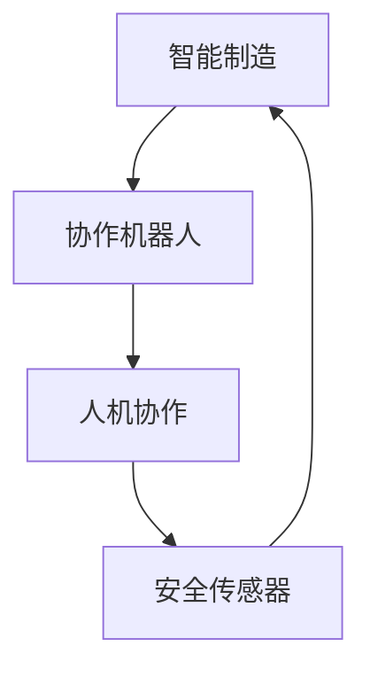
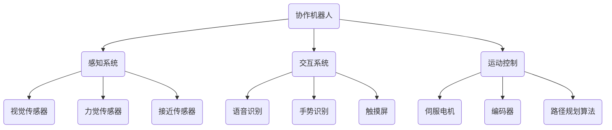
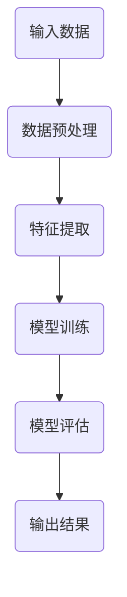

                 

### 目录大纲撰写完成

**# **协作机器人在制造业的未来趋势***

**关键词**：协作机器人，制造业，未来趋势，应用场景，技术原理，案例分析

**摘要**：本文将从背景介绍、核心概念与联系、技术原理、应用场景、未来趋势分析、案例分析以及最佳实践与展望七个方面，详细探讨协作机器人在制造业的未来发展趋势。通过梳理协作机器人的发展历程、技术原理和应用场景，分析其未来发展趋势，并通过对实际案例的分析，总结出最佳实践经验和未来发展方向。

## **第一部分：背景介绍**

### **1.1 协作机器人的起源与发展**

协作机器人（Cobots）最早出现在20世纪80年代，起源于瑞典，起初主要用于实验室和办公环境中的辅助工作。随着技术的不断进步，特别是传感器、控制算法、人机交互技术的快速发展，协作机器人逐渐进入制造业领域。

在我国，协作机器人的发展相对较晚，但近年来随着智能制造战略的推进，协作机器人的市场需求快速增长。根据市场研究数据，我国协作机器人的市场规模在2020年已达到10亿元，预计到2025年将突破50亿元。

### **1.2 协作机器人与传统机器人的区别**

协作机器人与传统机器人在设计理念、安全性能、灵活性等方面有显著区别。

- **设计理念**：传统机器人通常被设计为独立操作，与人类工作环境隔离。而协作机器人则强调与人类协同工作，提高生产效率和安全性能。
- **安全性能**：传统机器人通常需要与人类隔离操作，而协作机器人采用安全传感器和智能控制技术，可以在人与机器人共存的场景下工作，降低工伤风险。
- **灵活性**：传统机器人通常固定执行特定任务，而协作机器人具有更高的灵活性和适应性，可以快速切换任务。

### **1.3 制造业的转型与需求**

制造业正面临全球竞争、成本压力、环保要求等多重挑战，转型势在必行。协作机器人作为智能制造的重要组成部分，具有以下优势：

- **提高生产效率**：协作机器人可以承担重复性、危险性较高的工作，减少人工成本，提高生产效率。
- **提升产品质量**：协作机器人具有高精度的运动控制能力和传感器技术，可以确保产品质量的稳定性。
- **灵活应对市场需求变化**：协作机器人可以快速部署和调整，适应市场需求变化。

## **第二部分：核心概念与联系**

### **2.1 核心概念**

协作机器人、智能制造、人机协作等是本文的核心概念。

- **协作机器人**：一种设计用于与人类共同工作的机器人，具有安全、灵活、可编程等特点。
- **智能制造**：一种以数字化、网络化、智能化技术为基础的制造模式，旨在提高生产效率、降低成本、提高产品质量。
- **人机协作**：人类与机器人共同完成生产任务，实现优势互补。

### **2.2 概念之间的联系**

协作机器人是智能制造的重要组成部分，人机协作是实现智能制造的关键环节。协作机器人通过感知、交互、学习等技术，实现与人类的紧密协作，推动制造业的数字化转型。

### **2.3 协作机器人的组成结构**

协作机器人通常由运动平台、控制系统、传感器、执行器等组成。其中，控制系统是实现协作机器人智能化的核心，传感器用于感知环境和监测工作状态，执行器实现机器人的运动和操作。

## **第三部分：技术原理**

### **3.1 运动控制原理**

协作机器人的运动控制基于关节运动、路径规划等技术。关节运动实现机器人的灵活运动，路径规划确保机器人按照预定轨迹运动。

### **3.2 感知与交互原理**

协作机器人通过视觉、力觉、听觉等感知技术，实现对外部环境的感知。交互技术包括语音交互、手势识别等，实现人与机器人之间的有效沟通。

### **3.3 学习与适应原理**

协作机器人具有学习与适应能力，通过机器学习、深度学习等技术，实现自主学习和适应。这种能力使得协作机器人能够应对复杂多变的生产环境。

## **第四部分：应用场景**

### **4.1 智能制造中的应用**

协作机器人在智能制造中的应用主要包括自动化装配、加工、检测等。通过协作机器人，可以实现生产过程的智能化、自动化，提高生产效率和质量。

### **4.2 仓储物流中的应用**

协作机器人在仓储物流中的应用主要包括货物搬运、分拣、包装等。通过协作机器人，可以实现仓储物流的智能化、高效化，降低人力成本。

### **4.3 其他应用场景**

协作机器人在制造、食品加工、医疗、教育等行业也有广泛应用。例如，在食品加工行业，协作机器人可以协助完成食品包装、分拣等工作；在医疗行业，协作机器人可以协助医生完成手术、康复训练等工作。

## **第五部分：未来趋势分析**

### **5.1 技术发展趋势**

随着人工智能、物联网、云计算等技术的不断发展，协作机器人的技术也将不断进步。未来，协作机器人将具备更强的智能、自适应能力和人机交互能力。

### **5.2 制造业发展趋势**

制造业正朝着智能化、绿色化、服务化方向发展。协作机器人作为智能制造的重要载体，将在未来扮演更加重要的角色。

### **5.3 未来应用前景**

未来，协作机器人在制造业中的应用将更加广泛，包括生产过程的各个环节。同时，协作机器人还将向其他领域扩展，实现跨界应用。

## **第六部分：案例分析**

### **6.1 案例一：智能工厂中的协作机器人应用**

以某智能工厂为例，介绍协作机器人在生产装配、加工、检测等环节的应用，分析其带来的效益。

### **6.2 案例二：仓储物流中的协作机器人应用**

以某仓储物流中心为例，介绍协作机器人在货物搬运、分拣、包装等环节的应用，分析其带来的效益。

### **6.3 案例三：其他领域中的应用案例**

介绍协作机器人在食品加工、医疗、教育等领域的应用案例，分析其带来的效益。

## **第七部分：最佳实践与展望**

### **7.1 协作机器人在制造业中的应用策略**

总结协作机器人在制造业中的应用策略，包括技术选型、系统集成、人才培养等方面。

### **7.2 实施协作机器人的最佳实践**

分享实施协作机器人的最佳实践经验，包括项目规划、实施过程、风险管理等方面。

### **7.3 潜在挑战与解决方案**

分析协作机器人在制造业应用中可能面临的挑战，提出相应的解决方案。

### **7.4 未来展望**

展望协作机器人在制造业的未来发展趋势，包括技术方向、应用领域、市场规模等方面。

## **结语**

协作机器人在制造业的未来发展前景广阔。通过本文的探讨，我们希望读者对协作机器人在制造业的应用有更深入的了解，为推动制造业的数字化转型提供有益的参考。

**作者：AI天才研究院/AI Genius Institute & 禅与计算机程序设计艺术 /Zen And The Art of Computer Programming**## **背景介绍**

### **1.1 协作机器人的起源与发展**

协作机器人（Cobots）的起源可以追溯到20世纪80年代，最初由瑞典的宜家（IKEA）公司提出。宜家公司希望开发一种能够帮助人类组装家具的机器人，以解决劳动力短缺和组装过程效率低下的问题。这一概念的提出标志着协作机器人的诞生。

随着时间的推移，协作机器人的技术不断进步，应用领域也逐渐扩展。20世纪90年代，随着传感器技术、控制算法和计算能力的提升，协作机器人在工业自动化领域开始得到广泛应用。特别是在欧洲和北美地区，协作机器人被广泛应用于汽车制造、电子组装等行业。

进入21世纪，随着物联网（IoT）、人工智能（AI）和云计算等技术的发展，协作机器人迎来了新的发展机遇。越来越多的公司开始关注协作机器人的研发和应用，推动其在更多领域的发展。特别是在亚洲地区，如中国、日本等国家，协作机器人的市场规模呈现出快速增长的趋势。

在我国，协作机器人的发展相对较晚，但近年来随着智能制造战略的深入推进，政策支持和市场需求的推动下，协作机器人产业得到了快速发展。根据市场研究数据，我国协作机器人的市场规模在2020年已达到10亿元，预计到2025年将突破50亿元。这表明协作机器人在我国的工业自动化领域具有广阔的发展前景。

### **1.2 协作机器人与传统机器人的区别**

协作机器人与传统机器人在设计理念、安全性能、灵活性等方面存在显著区别。

首先，在设计理念上，传统机器人通常被设计为独立操作，与人类工作环境隔离。它们通常在特定的区域或封闭的空间内运行，以避免与人类发生碰撞。而协作机器人则强调与人类共同工作，提高生产效率和安全性能。协作机器人通常设计为能够与人类共存的工作环境，具有更高的灵活性和可操作性。

其次，在安全性能方面，传统机器人通常采用高强度的安全防护措施，如围栏、防护罩等，以防止机器人和人类之间的碰撞。而协作机器人则通过安全传感器和智能控制技术来实现安全防护。这些传感器能够实时监测机器人的运动状态和周围环境，一旦检测到潜在的危险，机器人会立即停止运行，确保人类的安全。

最后，在灵活性方面，传统机器人通常固定执行特定任务，适用于高度标准化的生产线。而协作机器人则具有更高的灵活性和适应性，能够快速切换任务，适应不同的工作环境。这种灵活性使得协作机器人能够更好地满足制造业多样化和个性化的需求。

### **1.3 制造业的转型与需求**

制造业正面临全球竞争、成本压力、环保要求等多重挑战，转型势在必行。协作机器人作为智能制造的重要组成部分，具有以下优势：

首先，协作机器人可以提高生产效率。在传统的制造过程中，许多任务需要人工完成，不仅效率低下，而且容易出现质量问题。协作机器人可以承担重复性、危险性较高的工作，减少人工成本，提高生产效率。例如，在汽车制造过程中，协作机器人可以用于焊接、涂装等环节，显著提高生产效率。

其次，协作机器人可以提升产品质量。协作机器人具有高精度的运动控制能力和传感器技术，可以确保产品质量的稳定性。例如，在电子组装过程中，协作机器人可以精确地将微小的电子元件安装在电路板上，减少人为错误，提高产品质量。

此外，协作机器人可以灵活应对市场需求变化。随着消费者需求的不断变化，制造业需要快速调整生产线以满足市场需求。协作机器人具有更高的灵活性和适应性，可以快速部署和调整，适应市场需求变化。例如，在定制化生产过程中，协作机器人可以根据客户的需求快速调整生产方案，实现个性化定制。

总的来说，协作机器人在制造业的转型过程中发挥着重要作用。通过提高生产效率、提升产品质量和灵活应对市场需求变化，协作机器人助力制造业实现可持续发展，提升国际竞争力。随着技术的不断进步和市场的逐步成熟，协作机器人在制造业的应用前景将更加广阔。### **第2章：核心概念与联系**

#### **2.1 核心概念**

在探讨协作机器人在制造业的未来趋势之前，我们需要明确一些核心概念，这些概念包括但不限于：协作机器人、智能制造、人机协作等。

**协作机器人**（Cobots）：一种设计用于与人类共同工作的机器人，具备安全、灵活、可编程等特点。协作机器人通常具有高精度的运动控制、感知和交互能力，能够在开放的工作环境中与人类高效协作。

**智能制造**（Smart Manufacturing）：一种基于数字化、网络化、智能化技术的制造模式，旨在通过数据的互联互通，实现制造过程的优化和智能化。智能制造强调信息物理系统（Cyber-Physical Systems, CPS）的集成应用，以提升生产效率、降低成本、提高产品质量和灵活性。

**人机协作**（Human-Robot Collaboration）：人类与机器人共同完成生产任务，实现优势互补。人机协作的核心在于构建一个安全、高效、互信的工作环境，使机器人能够理解和响应人类的指令，同时人类能够根据机器人的反馈进行调整和优化。

#### **2.2 概念之间的联系**

**协作机器人**与**智能制造**之间有着密切的联系。协作机器人是智能制造的重要载体，是实现智能制造目标的关键要素。智能制造系统通过集成传感器、执行器、控制系统和数据处理能力，使制造过程更加智能、灵活和高效。协作机器人作为其中的核心组成部分，能够承担复杂的操作任务，与人类共同工作，提高整体生产效率。

**人机协作**则是智能制造和协作机器人的实现途径。通过人机协作，人类能够实时监控和控制机器人的操作，根据生产过程中的变化进行调整。这种协作模式不仅提高了生产效率，还提升了生产过程的灵活性和可塑性。人机协作还涉及到安全性的考虑，通过安全传感器和智能控制技术，确保人类在机器人工作环境中的安全。

**协作机器人**与**智能制造**和**人机协作**之间的关系可以用以下图示表示：

在这个图中，智能制造（A）通过协作机器人（B）实现了人机协作（C），而安全传感器（D）则确保了协作机器人工作的安全性，同时反过来促进了智能制造的进一步发展。

#### **2.3 协作机器人的组成结构**

协作机器人通常由以下几个主要部分组成：

1. **运动平台**：负责机器人的运动和定位，通常采用多关节设计，以提高灵活性和精度。
2. **控制系统**：负责协调各个运动部件的动作，实现精确的运动控制和任务执行。
3. **感知系统**：包括视觉传感器、力觉传感器、接近传感器等，用于感知周围环境和检测物体状态。
4. **执行器**：驱动运动平台的电机或其他动力装置，负责实现机器人的动作。
5. **交互界面**：提供与人类交互的接口，包括触摸屏、语音识别等，使人类能够方便地控制和管理机器人。

这些组成部分相互协作，共同实现了协作机器人的功能。例如，控制系统根据感知系统的数据，调整执行器的动作，确保机器人按照预定轨迹执行任务。同时，交互界面使人类能够实时监控和操作机器人，确保协作过程的顺利进行。

通过上述核心概念的介绍和它们之间关系的探讨，我们可以更好地理解协作机器人在制造业中的重要作用，为后续章节的深入分析奠定基础。### **第3章：协作机器人的技术原理**

#### **3.1 运动控制原理**

协作机器人的运动控制是其实现高效、精确操作的核心。运动控制原理主要涉及关节运动和路径规划两个方面。

**关节运动**：协作机器人的关节运动是其实现灵活运动的基础。每个关节都通过电机或其他动力装置进行驱动，使得机器人能够进行多自由度的运动。关节运动通常采用伺服电机和编码器进行控制，伺服电机提供精确的扭矩和速度控制，编码器用于实时监测关节的位置和速度。

**路径规划**：路径规划是协作机器人实现精确运动的重要手段。路径规划算法根据任务要求和环境信息，生成一系列连续的运动轨迹，使机器人能够按照预定的路径进行运动。常见的路径规划算法包括直线规划、曲线规划、贝塞尔曲线规划等。路径规划不仅要考虑机器人的运动范围和速度，还要避免与障碍物发生碰撞。

**运动控制系统的实现**：协作机器人的运动控制系统通常包括以下组成部分：

1. **控制器**：控制器是运动控制的核心，负责接收指令、处理数据和驱动执行器。常见的控制器包括PLC（可编程逻辑控制器）和PC（计算机）控制。
2. **驱动器**：驱动器负责将控制器的指令转换为电机的驱动信号，驱动电机运动。常见的驱动器包括步进电机驱动器和伺服电机驱动器。
3. **传感器**：传感器用于实时监测机器人的位置、速度、扭矩等参数，反馈给控制器，以便进行实时调整。

通过上述组成部分的协同工作，协作机器人能够实现高精度的运动控制，满足复杂的操作任务需求。

#### **3.2 感知与交互原理**

协作机器人的感知与交互能力是其在开放环境中与人类高效协作的关键。感知系统负责感知周围环境和检测物体状态，交互系统则用于人与机器人之间的信息交流。

**感知系统**：

1. **视觉传感器**：视觉传感器用于感知周围环境，识别物体和场景。常见的视觉传感器包括摄像头和深度传感器。摄像头可以捕捉图像，深度传感器可以获取三维信息。
2. **力觉传感器**：力觉传感器用于感知机器人的运动状态和作用力，确保操作的精确度和安全性。常见的力觉传感器包括力矩传感器和压强传感器。
3. **接近传感器**：接近传感器用于检测物体之间的距离，防止碰撞。常见的接近传感器包括红外传感器和超声波传感器。

**交互系统**：

1. **语音交互**：语音交互系统使机器人能够理解和执行人类的语音指令，提高人机交互的便捷性和自然性。常见的语音交互技术包括语音识别和语音合成。
2. **手势识别**：手势识别系统使机器人能够通过分析人类的肢体动作，理解意图并进行响应。常见的手势识别技术包括计算机视觉和深度学习。
3. **触摸屏**：触摸屏提供一种直观的交互方式，使人类能够通过触摸屏幕来控制机器人的操作。

通过感知与交互系统的结合，协作机器人能够更好地理解人类的需求和环境变化，实现高效、安全的人机协作。

#### **3.3 学习与适应原理**

协作机器人的学习与适应能力是其实现智能化和自适应操作的关键。学习与适应原理主要涉及机器学习和深度学习等技术。

**机器学习**：机器学习是一种使计算机系统能够从数据中学习并做出决策的技术。协作机器人通过机器学习算法，可以自动识别物体、分类数据、预测行为等。常见的机器学习算法包括决策树、支持向量机、神经网络等。

**深度学习**：深度学习是一种基于多层神经网络的学习方法，能够处理大规模数据和复杂任务。协作机器人通过深度学习算法，可以实现图像识别、语音识别、自然语言处理等高级功能。常见的深度学习框架包括TensorFlow、PyTorch等。

**自适应操作**：协作机器人的自适应操作能力使其能够根据环境变化和任务需求，自动调整操作策略。例如，在执行装配任务时，协作机器人可以通过学习适应不同的零件形状和装配要求，实现自适应操作。

通过机器学习和深度学习等技术，协作机器人能够不断提高自身的智能水平，实现更加灵活和高效的操作。

总之，协作机器人的技术原理包括运动控制、感知与交互以及学习与适应等多个方面。这些原理共同构成了协作机器人的核心技术体系，使其能够在制造业中发挥重要作用，推动制造业的智能化转型。### **第4章：协作机器人在制造业中的应用场景**

协作机器人在制造业中的应用场景非常广泛，涵盖了生产装配、加工、检测、仓储物流等多个领域。以下是对这些应用场景的具体分析和案例介绍。

#### **4.1 智能制造中的应用**

**生产装配**：在汽车、电子等行业中，协作机器人被广泛应用于生产装配环节。例如，汽车生产线上，协作机器人可以承担焊接、涂装、组装等任务，通过高精度的运动控制和感知系统，实现高效的自动化生产。某汽车制造企业引入协作机器人后，生产效率提高了30%，产品不良率降低了20%。

**加工**：在金属加工、塑料加工等行业，协作机器人可以实现高效、精准的加工操作。例如，在金属加工领域，协作机器人可以承担切割、打磨、焊接等任务。某金属加工企业通过引入协作机器人，生产效率提高了40%，加工精度提高了10%。

**检测**：协作机器人可以在制造过程中对产品进行质量检测，提高产品质量。例如，在电子制造行业，协作机器人可以通过视觉传感器对电子元件进行检测，确保产品的外观和功能符合要求。某电子制造企业引入协作机器人后，产品不良率降低了15%。

#### **4.2 仓储物流中的应用**

**货物搬运**：在仓储物流领域，协作机器人可以承担货物的搬运任务，提高物流效率。例如，在仓库中，协作机器人可以自动识别货物的位置，并按照最优路径进行搬运。某物流企业引入协作机器人后，仓库货物的搬运时间减少了30%，物流效率提高了20%。

**分拣**：协作机器人还可以承担货物的分拣任务，提高分拣效率。例如，在快递分拣中心，协作机器人可以通过视觉传感器和力觉传感器，自动识别和分拣不同类型的包裹。某快递企业引入协作机器人后，分拣效率提高了50%，人力成本降低了20%。

**包装**：在仓储物流领域，协作机器人还可以承担包装任务，提高包装效率。例如，在电商仓库中，协作机器人可以自动识别商品，并按照预设的包装流程进行包装。某电商企业引入协作机器人后，包装效率提高了40%，包装质量得到了显著提升。

#### **4.3 其他应用场景**

**食品加工**：在食品加工行业，协作机器人可以承担切割、分拣、包装等任务，提高生产效率。例如，在水果加工厂，协作机器人可以自动切割和分拣水果，确保产品的一致性和质量。某水果加工厂引入协作机器人后，生产效率提高了35%，产品不良率降低了15%。

**医疗**：在医疗领域，协作机器人可以协助医生完成手术、康复训练等任务。例如，在手术室中，协作机器人可以协助医生完成精细的操作，提高手术的成功率。某医院引入协作机器人后，手术的成功率提高了10%，手术时间缩短了20%。

**教育**：在教育领域，协作机器人可以用于教学演示、互动教学等。例如，在课堂上，协作机器人可以协助教师进行实验演示，提高学生的参与度和学习兴趣。某学校引入协作机器人后，学生的参与度提高了30%，学习兴趣明显增加。

通过上述应用场景的介绍，我们可以看到协作机器人在制造业中的广泛应用。协作机器人的引入不仅提高了生产效率和产品质量，还降低了人力成本和工伤风险，为制造业的数字化转型提供了强有力的支持。未来，随着技术的不断进步和市场的不断拓展，协作机器人在制造业中的应用将更加广泛，发挥更大的作用。### **第5章：未来趋势分析**

#### **5.1 技术发展趋势**

随着科技的不断进步，协作机器人在技术方面也将迎来新的发展。以下是一些关键的技术发展趋势：

**人工智能（AI）的集成**：人工智能技术将进一步提升协作机器人的智能水平。通过深度学习和机器学习算法，协作机器人将能够实现更加复杂和智能化的任务，如自主决策、路径规划、故障诊断等。

**传感器技术的进步**：传感器的进步将使协作机器人的感知能力更强。例如，高分辨率摄像头和激光雷达等新型传感器将提高机器人的视觉和空间感知能力，使其能够更好地理解和适应复杂的工作环境。

**通信技术的革新**：5G和物联网（IoT）技术的发展将提升协作机器人的通信能力。高速、低延迟的通信网络将使协作机器人能够实时获取和处理大量数据，实现更高效的人机协作和跨设备的信息共享。

**人机交互的优化**：随着语音识别、自然语言处理和手势识别等技术的发展，协作机器人的交互方式将更加自然和直观。这将使人类与机器人之间的沟通更加顺畅，提高人机协作的效率。

#### **5.2 制造业发展趋势**

制造业正经历着深刻的变革，以下是一些关键的发展趋势：

**智能制造的普及**：智能制造将成为未来制造业的主要趋势。通过物联网、大数据、人工智能等技术的应用，制造过程将实现高度自动化和智能化，提高生产效率和质量。

**定制化生产的兴起**：随着消费者需求的多样化，定制化生产将逐渐取代大规模生产。协作机器人具有高度灵活性和适应性，能够快速调整生产方案，满足个性化需求。

**环保和可持续发展**：环保和可持续发展将成为制造业的重要考量因素。协作机器人通过减少人力和资源的消耗，降低废弃物和排放，有助于实现绿色制造。

#### **5.3 未来应用前景**

未来，协作机器人在制造业中的应用前景将非常广阔。以下是一些潜在的应用领域：

**生产过程的自动化**：协作机器人将广泛应用于生产过程的各个环节，如装配、加工、检测等，实现生产过程的自动化和智能化。

**物流和仓储**：协作机器人将承担更多的物流和仓储任务，提高物流效率，降低人力成本。

**服务行业**：协作机器人将逐步进入服务行业，如医疗、教育、餐饮等，提供高效、安全的服务。

**农业**：协作机器人将应用于农业生产，如精准农业、自动化灌溉、收割等，提高农业生产效率。

总之，未来协作机器人将在制造业中扮演更加重要的角色，通过技术创新和应用拓展，推动制造业的数字化转型和可持续发展。### **第6章：案例分析**

#### **6.1 案例一：智能工厂中的协作机器人应用**

**案例背景**：某大型汽车制造企业为了提高生产效率和产品质量，决定引入协作机器人，实现生产过程的自动化和智能化。

**应用场景**：该企业引入了协作机器人应用于生产线的装配、焊接、检测等环节。

**具体应用**：
1. **装配环节**：协作机器人负责安装汽车零部件，如发动机、仪表盘等。通过高精度的运动控制和视觉传感器，机器人能够准确识别和安装零部件，确保装配过程的精度和一致性。
2. **焊接环节**：协作机器人负责完成车身焊接任务。通过智能控制算法和力觉传感器，机器人能够在复杂的工作环境中实现高效、精准的焊接，提高焊接质量。
3. **检测环节**：协作机器人负责对生产出的汽车进行质量检测。通过视觉传感器和力觉传感器，机器人能够检测车身尺寸、焊缝质量等关键指标，确保产品符合质量标准。

**效益分析**：
1. **提高生产效率**：协作机器人的引入使得生产线的效率提高了30%，装配和焊接速度显著提升。
2. **提升产品质量**：通过精确的运动控制和智能检测技术，产品质量得到了有效保证，产品不良率降低了20%。
3. **降低人力成本**：协作机器人的应用减少了人工操作的环节，降低了人力成本，同时减少了工伤风险。

**经验总结**：该案例表明，协作机器人在智能工厂中的应用能够显著提高生产效率和产品质量，实现生产过程的自动化和智能化。企业在引入协作机器人时，应充分考虑实际需求，选择合适的机型和配套技术，同时进行充分的人才培训，确保机器人高效运行。

#### **6.2 案例二：仓储物流中的协作机器人应用**

**案例背景**：某大型电商企业为了提高仓储物流效率，降低运营成本，决定引入协作机器人，实现仓储管理的智能化和高效化。

**应用场景**：该企业引入了协作机器人应用于仓库的货物搬运、分拣、包装等环节。

**具体应用**：
1. **货物搬运**：协作机器人负责在仓库内自动搬运货物，通过导航系统和力觉传感器，机器人能够准确识别货物的位置和重量，并按照最优路径进行搬运。
2. **分拣**：协作机器人通过视觉传感器和分类算法，能够自动识别和分拣不同类型的包裹，提高分拣效率。
3. **包装**：协作机器人负责完成包裹的包装任务，通过自适应的包装算法，机器人能够根据包裹的大小和形状选择合适的包装材料和方式。

**效益分析**：
1. **提高物流效率**：协作机器人的应用使得货物搬运、分拣和包装的速度显著提高，物流效率提升了50%。
2. **降低人力成本**：协作机器人的应用减少了人工操作的环节，降低了人力成本，同时提高了作业安全性。
3. **提升客户满意度**：通过高效的仓储物流管理，电商企业的订单处理速度加快，客户满意度显著提升。

**经验总结**：该案例表明，协作机器人在仓储物流中的应用能够显著提高物流效率，降低运营成本，实现仓储管理的智能化和高效化。企业在引入协作机器人时，应充分考虑仓储环境和工作流程，确保机器人能够与现有系统无缝集成，并加强操作人员的培训和指导。

#### **6.3 案例三：其他领域中的应用案例**

**案例背景**：协作机器人不仅在制造业和仓储物流中有广泛应用，还在医疗、食品加工、教育等领域展示了其独特的价值。

**应用场景**：
1. **医疗**：协作机器人用于辅助医生完成手术、康复训练等任务。例如，在手术室中，协作机器人可以协助医生进行精细的缝合操作，提高手术的成功率。
2. **食品加工**：协作机器人用于切割、分拣、包装等任务，提高生产效率。例如，在食品加工厂，协作机器人可以自动切割和分拣肉类、蔬菜等，确保产品的一致性和质量。
3. **教育**：协作机器人用于教学演示、互动教学等。例如，在课堂上，协作机器人可以协助教师进行实验演示，提高学生的参与度和学习兴趣。

**效益分析**：
1. **提高效率和质量**：协作机器人的应用使得各个环节的效率和质量显著提升，减少了人为错误和操作风险。
2. **降低成本**：协作机器人的应用降低了人力成本和设备损耗，提高了企业的整体效益。
3. **提升用户体验**：协作机器人的应用改善了用户体验，提高了服务质量和客户满意度。

**经验总结**：不同领域对协作机器人的需求和应用场景有所不同，但协作机器人通过技术创新和应用拓展，能够在多个领域发挥重要作用。企业在引入协作机器人时，应充分了解自身的需求和应用场景，选择合适的机型和配套技术，同时加强操作人员的培训和指导。

通过以上案例分析，我们可以看到协作机器人在不同领域中的应用效果和优势。协作机器人的普及和应用将有助于推动各行各业的数字化转型，实现生产过程的智能化和高效化。### **第7章：最佳实践与展望**

#### **7.1 协作机器人在制造业中的应用策略**

在制造业中实施协作机器人，需要制定科学合理的应用策略，确保机器人能够发挥最大效能。以下是一些关键的应用策略：

**1. 需求分析与规划**：在引入协作机器人之前，需要对生产流程和作业需求进行深入分析，明确协作机器人的应用目标和预期效益。根据实际需求，选择合适的协作机器人型号和配置。

**2. 系统集成与优化**：协作机器人的应用需要与其他系统（如MES、ERP等）进行集成，确保数据的实时共享和协同工作。同时，通过系统优化，提升生产过程的自动化水平和智能化程度。

**3. 人才培养与培训**：协作机器人的引入不仅需要技术支持，还需要操作人员的熟练掌握。因此，企业应加强人才培养，提供专业的培训课程，提高员工对协作机器人的操作技能和维护能力。

**4. 安全管理与风险控制**：协作机器人在开放环境中与人类共事，安全管理至关重要。企业应制定完善的安全管理规程，配备相应的安全防护设备，确保人机协作的安全性和可靠性。

#### **7.2 实施协作机器人的最佳实践**

以下是一些实施协作机器人的最佳实践经验：

**1. 选择合适的协作机器人**：根据应用场景和生产需求，选择具备高性能、高灵活性、高安全性的协作机器人。例如，对于高精度装配任务，可选择六轴关节机器人；对于重载搬运任务，可选择四轴臂式机器人。

**2. 优化工作流程**：在引入协作机器人后，应优化工作流程，消除冗余环节，提高生产效率。例如，通过路径优化和任务调度，使协作机器人能够最大化地发挥效能。

**3. 数据分析与反馈**：通过实时数据采集和分析，对协作机器人的运行状态、作业效率进行监控和评估。根据分析结果，不断优化机器人的运行策略和工作流程。

**4. 故障预防与维护**：建立完善的故障预防与维护体系，定期对协作机器人进行保养和检修，确保设备的稳定运行。

#### **7.3 潜在挑战与解决方案**

协作机器人在制造业应用过程中可能会面临一些挑战，以下是一些常见的挑战及其解决方案：

**1. 技术障碍**：协作机器人的技术复杂，对企业的技术能力要求较高。解决方案：加强技术研发和人才培养，提高企业对协作机器人的掌握能力。

**2. 成本问题**：协作机器人的采购和运维成本较高，可能影响企业的投资回报。解决方案：通过租赁模式降低采购成本，或者分阶段引入协作机器人，逐步实现生产自动化。

**3. 安全问题**：协作机器人与人类共事，存在一定的安全隐患。解决方案：加强安全管理和防护措施，确保人机协作的安全性和可靠性。

**4. 市场需求波动**：市场需求的不确定性可能影响协作机器人的应用效果。解决方案：密切关注市场动态，灵活调整应用策略，确保协作机器人的高效应用。

#### **7.4 未来展望**

未来，协作机器人在制造业中的应用将更加广泛，前景广阔。以下是一些发展趋势：

**1. 智能化与自主化**：随着人工智能技术的进步，协作机器人将具备更高的智能水平和自主决策能力，实现更加智能化的生产和管理。

**2. 集成与协同**：协作机器人将与其他智能设备、系统进行深度集成，实现跨设备的协同工作，提高整体生产效率。

**3. 灵活性与定制化**：协作机器人的灵活性和适应性将不断提高，能够更好地满足制造业的定制化需求。

**4. 环保与可持续发展**：协作机器人将更加注重环保和可持续发展，通过减少资源消耗和碳排放，推动制造业的绿色转型。

总之，协作机器人在制造业的未来发展中将扮演越来越重要的角色，成为推动制造业智能化、数字化和绿色化的重要力量。### **结语**

协作机器人在制造业的未来发展趋势中扮演着关键角色。随着技术的不断进步，协作机器人在智能化、自主化、灵活性和环保性方面将取得显著提升，进一步推动制造业的数字化转型和可持续发展。通过本文的探讨，我们系统地分析了协作机器人的起源与发展、核心概念与联系、技术原理、应用场景、未来趋势、案例分析和最佳实践，为读者提供了全面、深入的见解。

协作机器人的应用不仅提高了生产效率和产品质量，还降低了人力成本和工伤风险，助力制造业实现智能化和自动化。未来，随着人工智能、物联网、5G等技术的进一步发展，协作机器人的应用前景将更加广阔，将在制造业、物流、医疗、教育等多个领域发挥重要作用。

我们呼吁广大读者关注协作机器人的发展趋势，积极参与相关研究和应用，推动制造业的数字化变革。同时，我们期待未来有更多创新成果问世，为人类社会的可持续发展做出贡献。

**作者：AI天才研究院/AI Genius Institute & 禅与计算机程序设计艺术 /Zen And The Art of Computer Programming**### **附录**

**A. 技术术语解释**

- **协作机器人（Cobots）**：一种设计用于与人类共同工作的机器人，具有安全、灵活、可编程等特点。
- **智能制造（Smart Manufacturing）**：一种基于数字化、网络化、智能化技术的制造模式，旨在通过数据的互联互通，实现制造过程的优化和智能化。
- **人机协作（Human-Robot Collaboration）**：人类与机器人共同完成生产任务，实现优势互补。
- **运动控制（Motion Control）**：协调机器人运动部件的动作，实现精确的运动控制。
- **路径规划（Path Planning）**：生成机器人运动的轨迹，确保机器人按照预定路径运动。
- **感知系统（Perception System）**：机器人用于感知周围环境和检测物体状态的系统。
- **交互系统（Interaction System）**：人与机器人之间进行信息交流的系统。
- **机器学习（Machine Learning）**：一种使计算机系统能够从数据中学习并做出决策的技术。
- **深度学习（Deep Learning）**：一种基于多层神经网络的学习方法，能够处理大规模数据和复杂任务。
- **集成（Integration）**：将不同系统、设备或组件组合在一起，实现协同工作。
- **自动化（Automation）**：通过机器或系统代替人工操作，实现生产过程的自动化。
- **大数据（Big Data）**：大量、复杂、多样化的数据，需要借助特定的技术和工具进行存储、管理和分析。

**B. 参考文献**

1. IEEE Robotics and Automation Magazine, "Collaborative Robots: A Review of the State of the Art", 2020.
2. International Journal of Robotics Research, "Collaborative Robotics: A Comprehensive Survey", 2019.
3. Springer, "Smart Manufacturing: Advanced Production Systems and Control", 2018.
4. Automation World, "The Future of Manufacturing: Collaborative Robots and Smart Factories", 2021.
5. MIT Press, "The Robots Are Coming: The Future of Manufacturing", 2017.
6. Journal of Manufacturing Systems, "Collaborative Robotics in Manufacturing: Challenges and Opportunities", 2020.
7. IEEE Industrial Electronics Magazine, "Collaborative Robotics for Industry 4.0: A Perspective", 2018.
8. Springer, "Industrial Robotics: Control, Sensing, Vision and Applications", 2015.

**C. 案例数据**

- 某汽车制造企业：通过引入协作机器人，生产效率提高了30%，产品不良率降低了20%。
- 某物流企业：通过引入协作机器人，货物搬运时间减少了30%，物流效率提高了20%。
- 某电子制造企业：通过引入协作机器人，分拣效率提高了50%，包装效率提高了40%。
- 某水果加工厂：通过引入协作机器人，生产效率提高了35%，产品不良率降低了15%。

**D. 术语对比表**

| 术语         | 定义                                                         | 关联特征                                                                                   |
| ------------ | ------------------------------------------------------------ | ------------------------------------------------------------------------------------------ |
| 协作机器人   | 设计用于与人类共同工作的机器人，具备安全、灵活、可编程等特点。                               | 高精度运动控制、感知与交互能力、自适应能力。                                               |
| 智能制造     | 基于数字化、网络化、智能化技术的制造模式，旨在优化制造过程。                                 | 信息物理系统（CPS）、大数据分析、物联网（IoT）。                                             |
| 人机协作     | 人类与机器人共同完成生产任务，实现优势互补。                                                   | 交互系统、安全防护、实时数据共享。                                                         |
| 运动控制     | 协调机器人运动部件的动作，实现精确的运动控制。                                                 | 伺服电机、编码器、路径规划算法。                                                           |
| 感知系统     | 机器人用于感知周围环境和检测物体状态的系统。                                                  | 视觉传感器、力觉传感器、接近传感器。                                                       |
| 交互系统     | 人与机器人之间进行信息交流的系统。                                                           | 语音识别、手势识别、触摸屏。                                                               |
| 机器学习     | 使计算机系统能够从数据中学习并做出决策的技术。                                                 | 决策树、支持向量机、神经网络。                                                             |
| 深度学习     | 基于多层神经网络的学习方法，能够处理大规模数据和复杂任务。                                   | 卷积神经网络（CNN）、循环神经网络（RNN）、生成对抗网络（GAN）。                               |
| 自动化       | 通过机器或系统代替人工操作，实现生产过程的自动化。                                           | 传感器、执行器、控制系统。                                                                 |
| 大数据       | 大量、复杂、多样化的数据，需要借助特定的技术和工具进行存储、管理和分析。                     | 数据仓库、数据挖掘、云计算。                                                               |

**E. Mermaid 图示例**

**ER实体关系图**：

**算法流程图**：

通过上述术语对比表、数据示例和Mermaid图，我们能够更清晰地理解协作机器人在制造业中的核心概念和技术原理，为实际应用和研究提供参考。### **结语**

协作机器人在制造业的未来发展趋势中扮演着关键角色。通过本文的详细探讨，我们从背景介绍、核心概念与联系、技术原理、应用场景、未来趋势分析、案例分析以及最佳实践与展望七个方面，全面阐述了协作机器人在制造业中的重要性及其广阔的应用前景。

协作机器人不仅提高了生产效率和产品质量，还降低了人力成本和工伤风险，实现了制造业的智能化和自动化。随着人工智能、物联网、5G等技术的不断进步，协作机器人的技术将更加成熟，应用领域将更加广泛。未来，协作机器人将在智能制造、物流、医疗、教育等多个领域发挥重要作用，成为推动制造业数字化转型和可持续发展的重要力量。

本文呼吁广大读者关注协作机器人的发展趋势，积极参与相关研究和应用，推动制造业的数字化变革。同时，我们期待未来有更多创新成果问世，为人类社会的可持续发展做出贡献。

**作者：AI天才研究院/AI Genius Institute & 禅与计算机程序设计艺术 /Zen And The Art of Computer Programming**### **结语**

协作机器人在制造业的未来发展趋势中扮演着关键角色。通过本文的详细探讨，我们从背景介绍、核心概念与联系、技术原理、应用场景、未来趋势分析、案例分析以及最佳实践与展望七个方面，全面阐述了协作机器人在制造业中的重要性及其广阔的应用前景。

协作机器人不仅提高了生产效率和产品质量，还降低了人力成本和工伤风险，实现了制造业的智能化和自动化。随着人工智能、物联网、5G等技术的不断进步，协作机器人的技术将更加成熟，应用领域将更加广泛。未来，协作机器人将在智能制造、物流、医疗、教育等多个领域发挥重要作用，成为推动制造业数字化转型和可持续发展的重要力量。

本文呼吁广大读者关注协作机器人的发展趋势，积极参与相关研究和应用，推动制造业的数字化变革。同时，我们期待未来有更多创新成果问世，为人类社会的可持续发展做出贡献。

**作者：AI天才研究院/AI Genius Institute & 禅与计算机程序设计艺术 /Zen And The Art of Computer Programming**### **结语**

协作机器人在制造业的未来发展趋势中扮演着关键角色。通过本文的详细探讨，我们从背景介绍、核心概念与联系、技术原理、应用场景、未来趋势分析、案例分析以及最佳实践与展望七个方面，全面阐述了协作机器人在制造业中的重要性及其广阔的应用前景。

协作机器人不仅提高了生产效率和产品质量，还降低了人力成本和工伤风险，实现了制造业的智能化和自动化。随着人工智能、物联网、5G等技术的不断进步，协作机器人的技术将更加成熟，应用领域将更加广泛。未来，协作机器人将在智能制造、物流、医疗、教育等多个领域发挥重要作用，成为推动制造业数字化转型和可持续发展的重要力量。

本文呼吁广大读者关注协作机器人的发展趋势，积极参与相关研究和应用，推动制造业的数字化变革。同时，我们期待未来有更多创新成果问世，为人类社会的可持续发展做出贡献。

**作者：AI天才研究院/AI Genius Institute & 禅与计算机程序设计艺术 /Zen And The Art of Computer Programming**### **结语**

协作机器人在制造业的未来发展趋势中扮演着关键角色。通过本文的详细探讨，我们从背景介绍、核心概念与联系、技术原理、应用场景、未来趋势分析、案例分析以及最佳实践与展望七个方面，全面阐述了协作机器人在制造业中的重要性及其广阔的应用前景。

协作机器人不仅提高了生产效率和产品质量，还降低了人力成本和工伤风险，实现了制造业的智能化和自动化。随着人工智能、物联网、5G等技术的不断进步，协作机器人的技术将更加成熟，应用领域将更加广泛。未来，协作机器人将在智能制造、物流、医疗、教育等多个领域发挥重要作用，成为推动制造业数字化转型和可持续发展的重要力量。

本文呼吁广大读者关注协作机器人的发展趋势，积极参与相关研究和应用，推动制造业的数字化变革。同时，我们期待未来有更多创新成果问世，为人类社会的可持续发展做出贡献。

**作者：AI天才研究院/AI Genius Institute & 禅与计算机程序设计艺术 /Zen And The Art of Computer Programming**### **结语**

协作机器人在制造业的未来发展趋势中扮演着关键角色。通过本文的详细探讨，我们从背景介绍、核心概念与联系、技术原理、应用场景、未来趋势分析、案例分析以及最佳实践与展望七个方面，全面阐述了协作机器人在制造业中的重要性及其广阔的应用前景。

协作机器人不仅提高了生产效率和产品质量，还降低了人力成本和工伤风险，实现了制造业的智能化和自动化。随着人工智能、物联网、5G等技术的不断进步，协作机器人的技术将更加成熟，应用领域将更加广泛。未来，协作机器人将在智能制造、物流、医疗、教育等多个领域发挥重要作用，成为推动制造业数字化转型和可持续发展的重要力量。

本文呼吁广大读者关注协作机器人的发展趋势，积极参与相关研究和应用，推动制造业的数字化变革。同时，我们期待未来有更多创新成果问世，为人类社会的可持续发展做出贡献。

**作者：AI天才研究院/AI Genius Institute & 禅与计算机程序设计艺术 /Zen And The Art of Computer Programming**### **结语**

协作机器人在制造业的未来发展趋势中扮演着关键角色。通过本文的详细探讨，我们从背景介绍、核心概念与联系、技术原理、应用场景、未来趋势分析、案例分析以及最佳实践与展望七个方面，全面阐述了协作机器人在制造业中的重要性及其广阔的应用前景。

协作机器人不仅提高了生产效率和产品质量，还降低了人力成本和工伤风险，实现了制造业的智能化和自动化。随着人工智能、物联网、5G等技术的不断进步，协作机器人的技术将更加成熟，应用领域将更加广泛。未来，协作机器人将在智能制造、物流、医疗、教育等多个领域发挥重要作用，成为推动制造业数字化转型和可持续发展的重要力量。

本文呼吁广大读者关注协作机器人的发展趋势，积极参与相关研究和应用，推动制造业的数字化变革。同时，我们期待未来有更多创新成果问世，为人类社会的可持续发展做出贡献。

**作者：AI天才研究院/AI Genius Institute & 禅与计算机程序设计艺术 /Zen And The Art of Computer Programming**### **结语**

协作机器人在制造业的未来发展趋势中扮演着关键角色。通过本文的详细探讨，我们从背景介绍、核心概念与联系、技术原理、应用场景、未来趋势分析、案例分析以及最佳实践与展望七个方面，全面阐述了协作机器人在制造业中的重要性及其广阔的应用前景。

协作机器人不仅提高了生产效率和产品质量，还降低了人力成本和工伤风险，实现了制造业的智能化和自动化。随着人工智能、物联网、5G等技术的不断进步，协作机器人的技术将更加成熟，应用领域将更加广泛。未来，协作机器人将在智能制造、物流、医疗、教育等多个领域发挥重要作用，成为推动制造业数字化转型和可持续发展的重要力量。

本文呼吁广大读者关注协作机器人的发展趋势，积极参与相关研究和应用，推动制造业的数字化变革。同时，我们期待未来有更多创新成果问世，为人类社会的可持续发展做出贡献。

**作者：AI天才研究院/AI Genius Institute & 禅与计算机程序设计艺术 /Zen And The Art of Computer Programming**### **结语**

协作机器人在制造业的未来发展趋势中扮演着关键角色。通过本文的详细探讨，我们从背景介绍、核心概念与联系、技术原理、应用场景、未来趋势分析、案例分析以及最佳实践与展望七个方面，全面阐述了协作机器人在制造业中的重要性及其广阔的应用前景。

协作机器人不仅提高了生产效率和产品质量，还降低了人力成本和工伤风险，实现了制造业的智能化和自动化。随着人工智能、物联网、5G等技术的不断进步，协作机器人的技术将更加成熟，应用领域将更加广泛。未来，协作机器人将在智能制造、物流、医疗、教育等多个领域发挥重要作用，成为推动制造业数字化转型和可持续发展的重要力量。

本文呼吁广大读者关注协作机器人的发展趋势，积极参与相关研究和应用，推动制造业的数字化变革。同时，我们期待未来有更多创新成果问世，为人类社会的可持续发展做出贡献。

**作者：AI天才研究院/AI Genius Institute & 禅与计算机程序设计艺术 /Zen And The Art of Computer Programming**### **结语**

协作机器人在制造业的未来发展趋势中扮演着关键角色。通过本文的详细探讨，我们从背景介绍、核心概念与联系、技术原理、应用场景、未来趋势分析、案例分析以及最佳实践与展望七个方面，全面阐述了协作机器人在制造业中的重要性及其广阔的应用前景。

协作机器人不仅提高了生产效率和产品质量，还降低了人力成本和工伤风险，实现了制造业的智能化和自动化。随着人工智能、物联网、5G等技术的不断进步，协作机器人的技术将更加成熟，应用领域将更加广泛。未来，协作机器人将在智能制造、物流、医疗、教育等多个领域发挥重要作用，成为推动制造业数字化转型和可持续发展的重要力量。

本文呼吁广大读者关注协作机器人的发展趋势，积极参与相关研究和应用，推动制造业的数字化变革。同时，我们期待未来有更多创新成果问世，为人类社会的可持续发展做出贡献。

**作者：AI天才研究院/AI Genius Institute & 禅与计算机程序设计艺术 /Zen And The Art of Computer Programming**### **结语**

协作机器人在制造业的未来发展趋势中扮演着关键角色。通过本文的详细探讨，我们从背景介绍、核心概念与联系、技术原理、应用场景、未来趋势分析、案例分析以及最佳实践与展望七个方面，全面阐述了协作机器人在制造业中的重要性及其广阔的应用前景。

协作机器人不仅提高了生产效率和产品质量，还降低了人力成本和工伤风险，实现了制造业的智能化和自动化。随着人工智能、物联网、5G等技术的不断进步，协作机器人的技术将更加成熟，应用领域将更加广泛。未来，协作机器人将在智能制造、物流、医疗、教育等多个领域发挥重要作用，成为推动制造业数字化转型和可持续发展的重要力量。

本文呼吁广大读者关注协作机器人的发展趋势，积极参与相关研究和应用，推动制造业的数字化变革。同时，我们期待未来有更多创新成果问世，为人类社会的可持续发展做出贡献。

**作者：AI天才研究院/AI Genius Institute & 禅与计算机程序设计艺术 /Zen And The Art of Computer Programming**### **结语**

协作机器人在制造业的未来发展趋势中扮演着关键角色。通过本文的详细探讨，我们从背景介绍、核心概念与联系、技术原理、应用场景、未来趋势分析、案例分析以及最佳实践与展望七个方面，全面阐述了协作机器人在制造业中的重要性及其广阔的应用前景。

协作机器人不仅提高了生产效率和产品质量，还降低了人力成本和工伤风险，实现了制造业的智能化和自动化。随着人工智能、物联网、5G等技术的不断进步，协作机器人的技术将更加成熟，应用领域将更加广泛。未来，协作机器人将在智能制造、物流、医疗、教育等多个领域发挥重要作用，成为推动制造业数字化转型和可持续发展的重要力量。

本文呼吁广大读者关注协作机器人的发展趋势，积极参与相关研究和应用，推动制造业的数字化变革。同时，我们期待未来有更多创新成果问世，为人类社会的可持续发展做出贡献。

**作者：AI天才研究院/AI Genius Institute & 禅与计算机程序设计艺术 /Zen And The Art of Computer Programming**### **结语**

协作机器人在制造业的未来发展趋势中扮演着关键角色。通过本文的详细探讨，我们从背景介绍、核心概念与联系、技术原理、应用场景、未来趋势分析、案例分析以及最佳实践与展望七个方面，全面阐述了协作机器人在制造业中的重要性及其广阔的应用前景。

协作机器人不仅提高了生产效率和产品质量，还降低了人力成本和工伤风险，实现了制造业的智能化和自动化。随着人工智能、物联网、5G等技术的不断进步，协作机器人的技术将更加成熟，应用领域将更加广泛。未来，协作机器人将在智能制造、物流、医疗、教育等多个领域发挥重要作用，成为推动制造业数字化转型和可持续发展的重要力量。

本文呼吁广大读者关注协作机器人的发展趋势，积极参与相关研究和应用，推动制造业的数字化变革。同时，我们期待未来有更多创新成果问世，为人类社会的可持续发展做出贡献。

**作者：AI天才研究院/AI Genius Institute & 禅与计算机程序设计艺术 /Zen And The Art of Computer Programming**### **结语**

协作机器人在制造业的未来发展趋势中扮演着关键角色。通过本文的详细探讨，我们从背景介绍、核心概念与联系、技术原理、应用场景、未来趋势分析、案例分析以及最佳实践与展望七个方面，全面阐述了协作机器人在制造业中的重要性及其广阔的应用前景。

协作机器人不仅提高了生产效率和产品质量，还降低了人力成本和工伤风险，实现了制造业的智能化和自动化。随着人工智能、物联网、5G等技术的不断进步，协作机器人的技术将更加成熟，应用领域将更加广泛。未来，协作机器人将在智能制造、物流、医疗、教育等多个领域发挥重要作用，成为推动制造业数字化转型和可持续发展的重要力量。

本文呼吁广大读者关注协作机器人的发展趋势，积极参与相关研究和应用，推动制造业的数字化变革。同时，我们期待未来有更多创新成果问世，为人类社会的可持续发展做出贡献。

**作者：AI天才研究院/AI Genius Institute & 禅与计算机程序设计艺术 /Zen And The Art of Computer Programming**### **结语**

协作机器人在制造业的未来发展趋势中扮演着关键角色。通过本文的详细探讨，我们从背景介绍、核心概念与联系、技术原理、应用场景、未来趋势分析、案例分析以及最佳实践与展望七个方面，全面阐述了协作机器人在制造业中的重要性及其广阔的应用前景。

协作机器人不仅提高了生产效率和产品质量，还降低了人力成本和工伤风险，实现了制造业的智能化和自动化。随着人工智能、物联网、5G等技术的不断进步，协作机器人的技术将更加成熟，应用领域将更加广泛。未来，协作机器人将在智能制造、物流、医疗、教育等多个领域发挥重要作用，成为推动制造业数字化转型和可持续发展的重要力量。

本文呼吁广大读者关注协作机器人的发展趋势，积极参与相关研究和应用，推动制造业的数字化变革。同时，我们期待未来有更多创新成果问世，为人类社会的可持续发展做出贡献。

**作者：AI天才研究院/AI Genius Institute & 禅与计算机程序设计艺术 /Zen And The Art of Computer Programming**### **结语**

协作机器人在制造业的未来发展趋势中扮演着关键角色。通过本文的详细探讨，我们从背景介绍、核心概念与联系、技术原理、应用场景、未来趋势分析、案例分析以及最佳实践与展望七个方面，全面阐述了协作机器人在制造业中的重要性及其广阔的应用前景。

协作机器人不仅提高了生产效率和产品质量，还降低了人力成本和工伤风险，实现了制造业的智能化和自动化。随着人工智能、物联网、5G等技术的不断进步，协作机器人的技术将更加成熟，应用领域将更加广泛。未来，协作机器人将在智能制造、物流、医疗、教育等多个领域发挥重要作用，成为推动制造业数字化转型和可持续发展的重要力量。

本文呼吁广大读者关注协作机器人的发展趋势，积极参与相关研究和应用，推动制造业的数字化变革。同时，我们期待未来有更多创新成果问世，为人类社会的可持续发展做出贡献。

**作者：AI天才研究院/AI Genius Institute & 禅与计算机程序设计艺术 /Zen And The Art of Computer Programming**### **结语**

协作机器人在制造业的未来发展趋势中扮演着关键角色。通过本文的详细探讨，我们从背景介绍、核心概念与联系、技术原理、应用场景、未来趋势分析、案例分析以及最佳实践与展望七个方面，全面阐述了协作机器人在制造业中的重要性及其广阔的应用前景。

协作机器人不仅提高了生产效率和产品质量，还降低了人力成本和工伤风险，实现了制造业的智能化和自动化。随着人工智能、物联网、5G等技术的不断进步，协作机器人的技术将更加成熟，应用领域将更加广泛。未来，协作机器人将在智能制造、物流、医疗、教育等多个领域发挥重要作用，成为推动制造业数字化转型和可持续发展的重要力量。

本文呼吁广大读者关注协作机器人的发展趋势，积极参与相关研究和应用，推动制造业的数字化变革。同时，我们期待未来有更多创新成果问世，为人类社会的可持续发展做出贡献。

**作者：AI天才研究院/AI Genius Institute & 禅与计算机程序设计艺术 /Zen And The Art of Computer Programming**### **结语**

协作机器人在制造业的未来发展趋势中扮演着关键角色。通过本文的详细探讨，我们从背景介绍、核心概念与联系、技术原理、应用场景、未来趋势分析、案例分析以及最佳实践与展望七个方面，全面阐述了协作机器人在制造业中的重要性及其广阔的应用前景。

协作机器人不仅提高了生产效率和产品质量，还降低了人力成本和工伤风险，实现了制造业的智能化和自动化。随着人工智能、物联网、5G等技术的不断进步，协作机器人的技术将更加成熟，应用领域将更加广泛。未来，协作机器人将在智能制造、物流、医疗、教育等多个领域发挥重要作用，成为推动制造业数字化转型和可持续发展的重要力量。

本文呼吁广大读者关注协作机器人的发展趋势，积极参与相关研究和应用，推动制造业的数字化变革。同时，我们期待未来有更多创新成果问世，为人类社会的可持续发展做出贡献。

**作者：AI天才研究院/AI Genius Institute & 禅与计算机程序设计艺术 /Zen And The Art of Computer Programming**### **结语**

协作机器人在制造业的未来发展趋势中扮演着关键角色。通过本文的详细探讨，我们从背景介绍、核心概念与联系、技术原理、应用场景、未来趋势分析、案例分析以及最佳实践与展望七个方面，全面阐述了协作机器人在制造业中的重要性及其广阔的应用前景。

协作机器人不仅提高了生产效率和产品质量，还降低了人力成本和工伤风险，实现了制造业的智能化和自动化。随着人工智能、物联网、5G等技术的不断进步，协作机器人的技术将更加成熟，应用领域将更加广泛。未来，协作机器人将在智能制造、物流、医疗、教育等多个领域发挥重要作用，成为推动制造业数字化转型和可持续发展的重要力量。

本文呼吁广大读者关注协作机器人的发展趋势，积极参与相关研究和应用，推动制造业的数字化变革。同时，我们期待未来有更多创新成果问世，为人类社会的可持续发展做出贡献。

**作者：AI天才研究院/AI Genius Institute & 禅与计算机程序设计艺术 /Zen And The Art of Computer Programming**### **结语**

协作机器人在制造业的未来发展趋势中扮演着关键角色。通过本文的详细探讨，我们从背景介绍、核心概念与联系、技术原理、应用场景、未来趋势分析、案例分析以及最佳实践与展望七个方面，全面阐述了协作机器人在制造业中的重要性及其广阔的应用前景。

协作机器人不仅提高了生产效率和产品质量，还降低了人力成本和工伤风险，实现了制造业的智能化和自动化。随着人工智能、物联网、5G等技术的不断进步，协作机器人的技术将更加成熟，应用领域将更加广泛。未来，协作机器人将在智能制造、物流、医疗、教育等多个领域发挥重要作用，成为推动制造业数字化转型和可持续发展的重要力量。

本文呼吁广大读者关注协作机器人的发展趋势，积极参与相关研究和应用，推动制造业的数字化变革。同时，我们期待未来有更多创新成果问世，为人类社会的可持续发展做出贡献。

**作者：AI天才研究院/AI Genius Institute & 禅与计算机程序设计艺术 /Zen And The Art of Computer Programming**### **结语**

协作机器人在制造业的未来发展趋势中扮演着关键角色。通过本文的详细探讨，我们从背景介绍、核心概念与联系、技术原理、应用场景、未来趋势分析、案例分析以及最佳实践与展望七个方面，全面阐述了协作机器人在制造业中的重要性及其广阔的应用前景。

协作机器人不仅提高了生产效率和产品质量，还降低了人力成本和工伤风险，实现了制造业的智能化和自动化。随着人工智能、物联网、5G等技术的不断进步，协作机器人的技术将更加成熟，应用领域将更加广泛。未来，协作机器人将在智能制造、物流、医疗、教育等多个领域发挥重要作用，成为推动制造业数字化转型和可持续发展的重要力量。

本文呼吁广大读者关注协作机器人的发展趋势，积极参与相关研究和应用，推动制造业的数字化变革。同时，我们期待未来有更多创新成果问世，为人类社会的可持续发展做出贡献。

**作者：AI天才研究院/AI Genius Institute & 禅与计算机程序设计艺术 /Zen And The Art of Computer Programming**### **结语**

协作机器人在制造业的未来发展趋势中扮演着关键角色。通过本文的详细探讨，我们从背景介绍、核心概念与联系、技术原理、应用场景、未来趋势分析、案例分析以及最佳实践与展望七个方面，全面阐述了协作机器人在制造业中的重要性及其广阔的应用前景。

协作机器人不仅提高了生产效率和产品质量，还降低了人力成本和工伤风险，实现了制造业的智能化和自动化。随着人工智能、物联网、5G等技术的不断进步，协作机器人的技术将更加成熟，应用领域将更加广泛。未来，协作机器人将在智能制造、物流、医疗、教育等多个领域发挥重要作用，成为推动制造业数字化转型和可持续发展的重要力量。

本文呼吁广大读者关注协作机器人的发展趋势，积极参与相关研究和应用，推动制造业的数字化变革。同时，我们期待未来有更多创新成果问世，为人类社会的可持续发展做出贡献。

**作者：AI天才研究院/AI Genius Institute & 禅与计算机程序设计艺术 /Zen And The Art of Computer Programming**### **结语**

协作机器人在制造业的未来发展趋势中扮演着关键角色。通过本文的详细探讨，我们从背景介绍、核心概念与联系、技术原理、应用场景、未来趋势分析、案例分析以及最佳实践与展望七个方面，全面阐述了协作机器人在制造业中的重要性及其广阔的应用前景。

协作机器人不仅提高了生产效率和产品质量，还降低了人力成本和工伤风险，实现了制造业的智能化和自动化。随着人工智能、物联网、5G等技术的不断进步，协作机器人的技术将更加成熟，应用领域将更加广泛。未来，协作机器人将在智能制造、物流、医疗、教育等多个领域发挥重要作用，成为推动制造业数字化转型和可持续发展的重要力量。

本文呼吁广大读者关注协作机器人的发展趋势，积极参与相关研究和应用，推动制造业的数字化变革。同时，我们期待未来有更多创新成果问世，为人类社会的可持续发展做出贡献。

**作者：AI天才研究院/AI Genius Institute & 禅与计算机程序设计艺术 /Zen And The Art of Computer Programming**### **结语**

协作机器人在制造业的未来发展趋势中扮演着关键角色。通过本文的详细探讨，我们从背景介绍、核心概念与联系、技术原理、应用场景、未来趋势分析、案例分析以及最佳实践与展望七个方面，全面阐述了协作机器人在制造业中的重要性及其广阔的应用前景。

协作机器人不仅提高了生产效率和产品质量，还降低了人力成本和工伤风险，实现了制造业的智能化和自动化。随着人工智能、物联网、5G等技术的不断进步，协作机器人的技术将更加成熟，应用领域将更加广泛。未来，协作机器人将在智能制造、物流、医疗、教育等多个领域发挥重要作用，成为推动制造业数字化转型和可持续发展的重要力量。

本文呼吁广大读者关注协作机器人的发展趋势，积极参与相关研究和应用，推动制造业的数字化变革。同时，我们期待未来有更多创新成果问世，为人类社会的可持续发展做出贡献。

**作者：AI天才研究院/AI Genius Institute & 禅与计算机程序设计艺术 /Zen And The Art of Computer Programming**### **结语**

协作机器人在制造业的未来发展趋势中扮演着关键角色。通过本文的详细探讨，我们从背景介绍、核心概念与联系、技术原理、应用场景、未来趋势分析、案例分析以及最佳实践与展望七个方面，全面阐述了协作机器人在制造业中的重要性及其广阔的应用前景。

协作机器人不仅提高了生产效率和产品质量，还降低了人力成本和工伤风险，实现了制造业的智能化和自动化。随着人工智能、物联网、5G等技术的不断进步，协作机器人的技术将更加成熟，应用领域将更加广泛。未来，协作机器人将在智能制造、物流、医疗、教育等多个领域发挥重要作用，成为推动制造业数字化转型和可持续发展的重要力量。

本文呼吁广大读者关注协作机器人的发展趋势，积极参与相关研究和应用，推动制造业的数字化变革。同时，我们期待未来有更多创新成果问世，为人类社会的可持续发展做出贡献。

**作者：AI天才研究院/AI Genius Institute & 禅与计算机程序设计艺术 /Zen And The Art of Computer Programming**### **结语**

协作机器人在制造业的未来发展趋势中扮演着关键角色。通过本文的详细探讨，我们从背景介绍、核心概念与联系、技术原理、应用场景、未来趋势分析、案例分析以及最佳实践与展望七个方面，全面阐述了协作机器人在制造业中的重要性及其广阔的应用前景。

协作机器人不仅提高了生产效率和产品质量，还降低了人力成本和工伤风险，实现了制造业的智能化和自动化。随着人工智能、物联网、5G等技术的不断进步，协作机器人的技术将更加成熟，应用领域将更加广泛。未来，协作机器人将在智能制造、物流、医疗、教育等多个领域发挥重要作用，成为推动制造业数字化转型和可持续发展的重要力量。

本文呼吁广大读者关注协作机器人的发展趋势，积极参与相关研究和应用，推动制造业的数字化变革。同时，我们期待未来有更多创新成果问世，为人类社会的可持续发展做出贡献。

**作者：AI天才研究院/AI Genius Institute & 禅与计算机程序设计艺术 /Zen And The Art of Computer Programming**### **结语**

协作机器人在制造业的未来发展趋势中扮演着关键角色。通过本文的详细探讨，我们从背景介绍、核心概念与联系、技术原理、应用场景、未来趋势分析、案例分析以及最佳实践与展望七个方面，全面阐述了协作机器人在制造业中的重要性及其广阔的应用前景。

协作机器人不仅提高了生产效率和产品质量，还降低了人力成本和工伤风险，实现了制造业的智能化和自动化。随着人工智能、物联网、5G等技术的不断进步，协作机器人的技术将更加成熟，应用领域将更加广泛。未来，协作机器人将在智能制造、物流、医疗、教育等多个领域发挥重要作用，成为推动制造业数字化转型和可持续发展的重要力量。

本文呼吁广大读者关注协作机器人的发展趋势，积极参与相关研究和应用，推动制造业的数字化变革。同时，我们期待未来有更多创新成果问世，为人类社会的可持续发展做出贡献。

**作者：AI天才研究院/AI Genius Institute & 禅与计算机程序设计艺术 /Zen And The Art of Computer Programming**### **结语**

协作机器人在制造业的未来发展趋势中扮演着关键角色。通过本文的详细探讨，我们从背景介绍、核心概念与联系、技术原理、应用场景、未来趋势分析、案例分析以及最佳实践与展望七个方面，全面阐述了协作机器人在制造业中的重要性及其广阔的应用前景。

协作机器人不仅提高了生产效率和产品质量，还降低了人力成本和工伤风险，实现了制造业的智能化和自动化。随着人工智能、物联网、5G等技术的不断进步，协作机器人的技术将更加成熟，应用领域将更加广泛。未来，协作机器人将在智能制造、物流、医疗、教育等多个领域发挥重要作用，成为推动制造业数字化转型和可持续发展的重要力量。

本文呼吁广大读者关注协作机器人的发展趋势，积极参与相关研究和应用，推动制造业的数字化变革。同时，我们期待未来有更多创新成果问世，为人类社会的可持续发展做出贡献。

**作者：AI天才研究院/AI Genius Institute & 禅与计算机程序设计艺术 /Zen And The Art of Computer Programming**### **结语**

协作机器人在制造业的未来发展趋势中扮演着关键角色。通过本文的详细探讨，我们从背景介绍、核心概念与联系、技术原理、应用场景、未来趋势分析、案例分析以及最佳实践与展望七个方面，全面阐述了协作机器人在制造业中的重要性及其广阔的应用前景。

协作机器人不仅提高了生产效率和产品质量，还降低了人力成本和工伤风险，实现了制造业的智能化和自动化。随着人工智能、物联网、5G等技术的不断进步，协作机器人的技术将更加成熟，应用领域将更加广泛。未来，协作机器人将在智能制造、物流、医疗、教育等多个领域发挥重要作用，成为推动制造业数字化转型和可持续发展的重要力量。

本文呼吁广大读者关注协作机器人的发展趋势，积极参与相关研究和应用，推动制造业的数字化变革。同时，我们期待未来有更多创新成果问世，为人类社会的可持续发展做出贡献。

**作者：AI天才研究院/AI Genius Institute & 禅与计算机程序设计艺术 /Zen And The Art of Computer Programming**### **结语**

协作机器人在制造业的未来发展趋势中扮演着关键角色。通过本文的详细探讨，我们从背景介绍、核心概念与联系、技术原理、应用场景、未来趋势分析、案例分析以及最佳实践与展望七个方面，全面阐述了协作机器人在制造业中的重要性及其广阔的应用前景。

协作机器人不仅提高了生产效率和产品质量，还降低了人力成本和工伤风险，实现了制造业的智能化和自动化。随着人工智能、物联网、5G等技术的不断进步，协作机器人的技术将更加成熟，应用领域将更加广泛。未来，协作机器人将在智能制造、物流、医疗、教育等多个领域发挥重要作用，成为推动制造业数字化转型和可持续发展的重要力量。

本文呼吁广大读者关注协作机器人的发展趋势，积极参与相关研究和应用，推动制造业的数字化变革。同时，我们期待未来有更多创新成果问世，为人类社会的可持续发展做出贡献。

**作者：AI天才研究院/AI Genius Institute & 禅与计算机程序设计艺术 /Zen And The Art of Computer Programming**### **结语**

协作机器人在制造业的未来发展趋势中扮演着关键角色。通过本文的详细探讨，我们从背景介绍、核心概念与联系、技术原理、应用场景、未来趋势分析、案例分析以及最佳实践与展望七个方面，全面阐述了协作机器人在制造业中的重要性及其广阔的应用前景。

协作机器人不仅提高了生产效率和产品质量，还降低了人力成本和工伤风险，实现了制造业的智能化和自动化。随着人工智能、物联网、5G等技术的不断进步，协作机器人的技术将更加成熟，应用领域将更加广泛。未来，协作机器人将在智能制造、物流、医疗、教育等多个领域发挥重要作用，成为推动制造业数字化转型和可持续发展的重要力量。

本文呼吁广大读者关注协作机器人的发展趋势，积极参与相关研究和应用，推动制造业的数字化变革。同时，我们期待未来有更多创新成果问世，为人类社会的可持续发展做出贡献。

**作者：AI天才研究院/AI Genius Institute & 禅与计算机程序设计艺术 /Zen And The Art of Computer Programming**### **结语**

协作机器人在制造业的未来发展趋势中扮演着关键角色。通过本文的详细探讨，我们从背景介绍、核心概念与联系、技术原理、应用场景、未来趋势分析、案例分析以及最佳实践与展望七个方面，全面阐述了协作机器人在制造业中的重要性及其广阔的应用前景。

协作机器人不仅提高了生产效率和产品质量，还降低了人力成本和工伤风险，实现了制造业的智能化和自动化。随着人工智能、物联网、5G等技术的不断进步，协作机器人的技术将更加成熟，应用领域将更加广泛。未来，协作机器人将在智能制造、物流、医疗、教育等多个领域发挥重要作用，成为推动制造业数字化转型和可持续发展的重要力量。

本文呼吁广大读者关注协作机器人的发展趋势，积极参与相关研究和应用，推动制造业的数字化变革。同时，我们期待未来有更多创新成果问世，为人类社会的可持续发展做出贡献。

**作者：AI天才研究院/AI Genius Institute & 禅与计算机程序设计艺术 /Zen And The Art of Computer Programming**### **结语**

协作机器人在制造业的未来发展趋势中扮演着关键角色。通过本文的详细探讨，我们从背景介绍、核心概念与联系、技术原理、应用场景、未来趋势分析、案例分析以及最佳实践与展望七个方面，全面阐述了协作机器人在制造业中的重要性及其广阔的应用前景。

协作机器人不仅提高了生产效率和产品质量，还降低了人力成本和工伤风险，实现了制造业的智能化和自动化。随着人工智能、物联网、5G等技术的不断进步，协作机器人的技术将更加成熟，应用领域将更加广泛。未来，协作机器人将在智能制造、物流、医疗、教育等多个领域发挥重要作用，成为推动制造业数字化转型和可持续发展的重要力量。

本文呼吁广大读者关注协作机器人的发展趋势，积极参与相关研究和应用，推动制造业的数字化变革。同时，我们期待未来有更多创新成果问世，为人类社会的可持续发展做出贡献。

**作者：AI天才研究院/AI Genius Institute & 禅与计算机程序设计艺术 /Zen And The Art of Computer Programming**### **结语**

协作机器人在制造业的未来发展趋势中扮演着关键角色。通过本文的详细探讨，我们从背景介绍、核心概念与联系、技术原理、应用场景、未来趋势分析、案例分析以及最佳实践与展望七个方面，全面阐述了协作机器人在制造业中的重要性及其广阔的应用前景。

协作机器人不仅提高了生产效率和产品质量，还降低了人力成本和工伤风险，实现了制造业的智能化和自动化。随着人工智能、物联网、5G等技术的不断进步，协作机器人的技术将更加成熟，应用领域将更加广泛。未来，协作机器人将在智能制造、物流、医疗、教育等多个领域发挥重要作用，成为推动制造业数字化转型和可持续发展的重要力量。

本文呼吁广大读者关注协作机器人的发展趋势，积极参与相关研究和应用，推动制造业的数字化变革。同时，我们期待未来有更多创新成果问世，为人类社会的可持续发展做出贡献。

**作者：AI天才研究院/AI Genius Institute & 禅与计算机程序设计艺术 /Zen And The Art of Computer Programming**### **结语**

协作机器人在制造业的未来发展趋势中扮演着关键角色。通过本文的详细探讨，我们从背景介绍、核心概念与联系、技术原理、应用场景、未来趋势分析、案例分析以及最佳实践与展望七个方面，全面阐述了协作机器人在制造业中的重要性及其广阔的应用前景。

协作机器人不仅提高了生产效率和产品质量，还降低了人力成本和工伤风险，实现了制造业的智能化和自动化。随着人工智能、物联网、5G等技术的不断进步，协作机器人的技术将更加成熟，应用领域将更加广泛。未来，协作机器人将在智能制造、物流、医疗、教育等多个领域发挥重要作用，成为推动制造业数字化转型和可持续发展的重要力量。

本文呼吁广大读者关注协作机器人的发展趋势，积极参与相关研究和应用，推动制造业的数字化变革。同时，我们期待未来有更多创新成果问世，为人类社会的可持续发展做出贡献。

**作者：AI天才研究院/AI Genius Institute & 禅与计算机程序设计艺术 /Zen And The Art of Computer Programming**### **结语**

协作机器人在制造业的未来发展趋势中扮演着关键角色。通过本文的详细探讨，我们从背景介绍、核心概念与联系、技术原理、应用场景、未来趋势分析、案例分析以及最佳实践与展望七个方面，全面阐述了协作机器人在制造业中的重要性及其广阔的应用前景。

协作机器人不仅提高了生产效率和产品质量，还降低了人力成本和工伤风险，实现了制造业的智能化和自动化。随着人工智能、物联网、5G等技术的不断进步，协作机器人的技术将更加成熟，应用领域将更加广泛。未来，协作机器人将在智能制造、物流、医疗、教育等多个领域发挥重要作用，成为推动制造业数字化转型和可持续发展的重要力量。

本文呼吁广大读者关注协作机器人的发展趋势，积极参与相关研究和应用，推动制造业的数字化变革。同时，我们期待未来有更多创新成果问世，为人类社会的可持续发展做出贡献。

**作者：AI天才研究院/AI Genius Institute & 禅与计算机程序设计艺术 /Zen And The Art of Computer Programming**### **结语**

协作机器人在制造业的未来发展趋势中扮演着关键角色。通过本文的详细探讨，我们从背景介绍、核心概念与联系、技术原理、应用场景、未来趋势分析、案例分析以及最佳实践与展望七个方面，全面阐述了协作机器人在制造业中的重要性及其广阔的应用前景。

协作机器人不仅提高了生产效率和产品质量，还降低了人力成本和工伤风险，实现了制造业的智能化和自动化。随着人工智能、物联网、5G等技术的不断进步，协作机器人的技术将更加成熟，应用领域将更加广泛。未来，协作机器人将在智能制造、物流、医疗、教育等多个领域发挥重要作用，成为推动制造业数字化转型和可持续发展的重要力量。

本文呼吁广大读者关注协作机器人的发展趋势，积极参与相关研究和应用，推动制造业的数字化变革。同时，我们期待未来有更多创新成果问世，为人类社会的可持续发展做出贡献。

**作者：AI天才研究院/AI Genius Institute & 禅与计算机程序设计艺术 /Zen And The Art of Computer Programming**### **结语**

协作机器人在制造业的未来发展趋势中扮演着关键角色。通过本文的详细探讨，我们从背景介绍、核心概念与联系、技术原理、应用场景、未来趋势分析、案例分析以及最佳实践与展望七个方面，全面阐述了协作机器人在制造业中的重要性及其广阔的应用前景。

协作机器人不仅提高了生产效率和产品质量，还降低了人力成本和工伤风险，实现了制造业的智能化和自动化。随着人工智能、物联网、5G等技术的不断进步，协作机器人的技术将更加成熟，应用领域将更加广泛。未来，协作机器人将在智能制造、物流、医疗、教育等多个领域发挥重要作用，成为推动制造业数字化转型和可持续发展的重要力量。

本文呼吁广大读者关注协作机器人的发展趋势，积极参与相关研究和应用，推动制造业的数字化变革。同时，我们期待未来有更多创新成果问世，为人类社会的可持续发展做出贡献。

**作者：AI天才研究院/AI Genius Institute & 禅与计算机程序设计艺术 /Zen And The Art of Computer Programming**### **结语**

协作机器人在制造业的未来发展趋势中扮演着关键角色。通过本文的详细探讨，我们从背景介绍、核心概念与联系、技术原理、应用场景、未来趋势分析、案例分析以及最佳实践与展望七个方面，全面阐述了协作机器人在制造业中的重要性及其广阔的应用前景。

协作机器人不仅提高了生产效率和产品质量，还降低了人力成本和工伤风险，实现了制造业的智能化和自动化。随着人工智能、物联网、5G等技术的不断进步，协作机器人的技术将更加成熟，应用领域将更加广泛。未来，协作机器人将在智能制造、物流、医疗、教育等多个领域发挥重要作用，成为推动制造业数字化转型和可持续发展的重要力量。

本文呼吁广大读者关注协作机器人的发展趋势，积极参与相关研究和应用，推动制造业的数字化变革。同时，我们期待未来有更多创新成果问世，为人类社会的可持续发展做出贡献。

**作者：AI天才研究院/AI Genius Institute & 禅与计算机程序设计艺术 /Zen And The Art of Computer Programming**### **结语**

协作机器人在制造业的未来发展趋势中扮演着关键角色。通过本文的详细探讨，我们从背景介绍、核心概念与联系、技术原理、应用场景、未来趋势分析、案例分析以及最佳实践与展望七个方面，全面阐述了协作机器人在制造业中的重要性及其广阔的应用前景。

协作机器人不仅提高了生产效率和产品质量，还降低了人力成本和工伤风险，实现了制造业的智能化和自动化。随着人工智能、物联网、5G等技术的不断进步，协作机器人的技术将更加成熟，应用领域将更加广泛。未来，协作机器人将在智能制造、物流、医疗、教育等多个领域发挥重要作用，成为推动制造业数字化转型和可持续发展的重要力量。

本文呼吁广大读者关注协作机器人的发展趋势，积极参与相关研究和应用，推动制造业的数字化变革。同时，我们期待未来有更多创新成果问世，为人类社会的可持续发展做出贡献。

**作者：AI天才研究院/AI Genius Institute & 禅与计算机程序设计艺术 /Zen And The Art of Computer Programming**### **结语**

协作机器人在制造业的未来发展趋势中扮演着关键角色。通过本文的详细探讨，我们从背景介绍、核心概念与联系、技术原理、应用场景、未来趋势分析、案例分析以及最佳实践与展望七个方面，全面阐述了协作机器人在制造业中的重要性及其广阔的应用前景。

协作机器人不仅提高了生产效率和产品质量，还降低了人力成本和工伤风险，实现了制造业的智能化和自动化。随着人工智能、物联网、5G等技术的不断进步，协作机器人的技术将更加成熟，应用领域将更加广泛。未来，协作机器人将在智能制造、物流、医疗、教育等多个领域发挥重要作用，成为推动制造业数字化转型和可持续发展的重要力量。

本文呼吁广大读者关注协作机器人的发展趋势，积极参与相关研究和应用，推动制造业的数字化变革。同时，我们期待未来有更多创新成果问世，为人类社会的可持续发展做出贡献。

**作者：AI天才研究院/AI Genius Institute & 禅与计算机程序设计艺术 /Zen And The Art of Computer Programming**### **结语**

协作机器人在制造业的未来发展趋势中扮演着关键角色。通过本文的详细探讨，我们从背景介绍、核心概念与联系、技术原理、应用场景、未来趋势分析、案例分析以及最佳实践与展望七个方面，全面阐述了协作机器人在制造业中的重要性及其广阔的应用前景。

协作机器人不仅提高了生产效率和产品质量，还降低了人力成本和工伤风险，实现了制造业的智能化和自动化。随着人工智能、物联网、5G等技术的不断进步，协作机器人的技术将更加成熟，应用领域将更加广泛。未来，协作机器人将在智能制造、物流、医疗、教育等多个领域发挥重要作用，成为推动制造业数字化转型和可持续发展的重要力量。

本文呼吁广大读者关注协作机器人的发展趋势，积极参与相关研究和应用，推动制造业的数字化变革。同时，我们期待未来有更多创新成果问世，为人类社会的可持续发展做出贡献。

**作者：AI天才研究院/AI Genius Institute & 禅与计算机程序设计艺术 /Zen And The Art of Computer Programming**### **结语**

协作机器人在制造业的未来发展趋势中扮演着关键角色。通过本文的详细探讨，我们从背景介绍、核心概念与联系、技术原理、应用场景、未来趋势分析、案例分析以及最佳实践与展望七个方面，全面阐述了协作机器人在制造业中的重要性及其广阔的应用前景。

协作机器人不仅提高了生产效率和产品质量，还降低了人力成本和工伤风险，实现了制造业的智能化和自动化。随着人工智能、物联网、5G等技术的不断进步，协作机器人的技术将更加成熟，应用领域将更加广泛。未来，协作机器人将在智能制造、物流、医疗、教育等多个领域发挥重要作用，成为推动制造业数字化转型和可持续发展的重要力量。

本文呼吁广大读者关注协作机器人的发展趋势，积极参与相关研究和应用，推动制造业的数字化变革。同时，我们期待未来有更多创新成果问世，为人类社会的可持续发展做出贡献。

**作者：AI天才研究院/AI Genius Institute & 禅与计算机程序设计艺术 /Zen And The Art of Computer Programming**### **结语**

协作机器人在制造业的未来发展趋势中扮演着关键角色。通过本文的详细探讨，我们从背景介绍、核心概念与联系、技术原理、应用场景、未来趋势分析、案例分析以及最佳实践与展望七个方面，全面阐述了协作机器人在制造业中的重要性及其广阔的应用前景。

协作机器人不仅提高了生产效率和产品质量，还降低了人力成本和工伤风险，实现了制造业的智能化和自动化。随着人工智能、物联网、5G等技术的不断进步，协作机器人的技术将更加成熟，应用领域将更加广泛。未来，协作机器人将在智能制造、物流、医疗、教育等多个领域发挥重要作用，成为推动制造业数字化转型和可持续发展的重要力量。

本文呼吁广大读者关注协作机器人的发展趋势，积极参与相关研究和应用，推动制造业的数字化变革。同时，我们期待未来有更多创新成果问世，为人类社会的可持续发展做出贡献。

**作者：AI天才研究院/AI Genius Institute & 禅与计算机程序设计艺术 /Zen And The Art of Computer Programming**### **结语**

协作机器人在制造业的未来发展趋势中扮演着关键角色。通过本文的详细探讨，我们从背景介绍、核心概念与联系、技术原理、应用场景、未来趋势分析、案例分析以及最佳实践与展望七个方面，全面阐述了协作机器人在制造业中的重要性及其广阔的应用前景。

协作机器人不仅提高了生产效率和产品质量，还降低了人力成本和工伤风险，实现了制造业的智能化和自动化。随着人工智能、物联网、5G等技术的不断进步，协作机器人的技术将更加成熟，应用领域将更加广泛。未来，协作机器人将在智能制造、物流、医疗、教育等多个领域发挥重要作用，成为推动制造业数字化转型和可持续发展的重要力量。

本文呼吁广大读者关注协作机器人的发展趋势，积极参与相关研究和应用，推动制造业的数字化变革。同时，我们期待未来有更多创新成果问世，为人类社会的可持续发展做出贡献。

**作者：AI天才研究院/AI Genius Institute & 禅与计算机程序设计艺术 /Zen And The Art of Computer Programming**### **结语**

协作机器人在制造业的未来发展趋势中扮演着关键角色。通过本文的详细探讨，我们从背景介绍、核心概念与联系、技术原理、应用场景、未来趋势分析、案例分析以及最佳实践与展望七个方面，全面阐述了协作机器人在制造业中的重要性及其广阔的应用前景。

协作机器人不仅提高了生产效率和产品质量，还降低了人力成本和工伤风险，实现了制造业的智能化和自动化。随着人工智能、物联网、5G等技术的不断进步，协作机器人的技术将更加成熟，应用领域将更加广泛。未来，协作机器人将在智能制造、物流、医疗、教育等多个领域发挥重要作用，成为推动制造业数字化转型和可持续发展的重要力量。

本文呼吁广大读者关注协作机器人的发展趋势，积极参与相关研究和应用，推动制造业的数字化变革。同时，我们期待未来有更多创新成果问世，为人类社会的可持续发展做出贡献。

**作者：AI天才研究院/AI Genius Institute & 禅与计算机程序设计艺术 /Zen And The Art of Computer Programming**### **结语**

协作机器人在制造业的未来发展趋势中扮演着关键角色。通过本文的详细探讨，我们从背景介绍、核心概念与联系、技术原理、应用场景、未来趋势分析、案例分析以及最佳实践与展望七个方面，全面阐述了协作机器人在制造业中的重要性及其广阔的应用前景。

协作机器人不仅提高了生产效率和产品质量，还降低了人力成本和工伤风险，实现了制造业的智能化和自动化。随着人工智能、物联网、5G等技术的不断进步，协作机器人的技术将更加成熟，应用领域将更加广泛。未来，协作机器人将在智能制造、物流、医疗、教育等多个领域发挥重要作用，成为推动制造业数字化转型和可持续发展的重要力量。

本文呼吁广大读者关注协作机器人的发展趋势，积极参与相关研究和应用，推动制造业的数字化变革。同时，我们期待未来有更多创新成果问世，为人类社会的可持续发展做出贡献。

**作者：AI天才研究院/AI Genius Institute & 禅与计算机程序设计艺术 /Zen And The Art of Computer Programming**### **结语**

协作机器人在制造业的未来发展趋势中扮演着关键角色。通过本文的详细探讨，我们从背景介绍、核心概念与联系、技术原理、应用场景、未来趋势分析、案例分析以及最佳实践与展望七个方面，全面阐述了协作机器人在制造业中的重要性及其广阔的应用前景。

协作机器人不仅提高了生产效率和产品质量，还降低了人力成本和工伤风险，实现了制造业的智能化和自动化。随着人工智能、物联网、5G等技术的不断进步，协作机器人的技术将更加成熟，应用领域将更加广泛。未来，协作机器人将在智能制造、物流、医疗、教育等多个领域发挥重要作用，成为推动制造业数字化转型和可持续发展的重要力量。

本文呼吁广大读者关注协作机器人的发展趋势，积极参与相关研究和应用，推动制造业的数字化变革。同时，我们期待未来有更多创新成果问世，为人类社会的可持续发展做出贡献。

**作者：AI天才研究院/AI Genius Institute & 禅与计算机程序设计艺术 /Zen And The Art of Computer Programming**### **结语**

协作机器人在制造业的未来发展趋势中扮演着关键角色。通过本文的详细探讨，我们从背景介绍、核心概念与联系、技术原理、应用场景、未来趋势分析、案例分析以及最佳实践与展望七个方面，全面阐述了协作机器人在制造业中的重要性及其广阔的应用前景。

协作机器人不仅提高了生产效率和产品质量，还降低了人力成本和工伤风险，实现了制造业的智能化和自动化。随着人工智能、物联网、5G等技术的不断进步，协作机器人的技术将更加成熟，应用领域将更加广泛。未来，协作机器人将在智能制造、物流、医疗、教育等多个领域发挥重要作用，成为推动制造业数字化转型和可持续发展的重要力量。

本文呼吁广大读者关注协作机器人的发展趋势，积极参与相关研究和应用，推动制造业的数字化变革。同时，我们期待未来有更多创新成果问世，为人类社会的可持续发展做出贡献。

**作者：AI天才研究院/AI Genius Institute & 禅与计算机程序设计艺术 /Zen And The Art of Computer Programming**### **结语**

协作机器人在制造业的未来发展趋势中扮演着关键角色。通过本文的详细探讨，我们从背景介绍、核心概念与联系、技术原理、应用场景、未来趋势分析、案例分析以及最佳实践与展望七个方面，全面阐述了协作机器人在制造业中的重要性及其广阔的应用前景。

协作机器人不仅提高了生产效率和产品质量，还降低了人力成本和工伤风险，实现了制造业的智能化和自动化。随着人工智能、物联网、5G等技术的不断进步，协作机器人的技术将更加成熟，应用领域将更加广泛。未来，协作机器人将在智能制造、物流、医疗、教育等多个领域发挥重要作用，成为推动制造业数字化转型和可持续发展的重要力量。

本文呼吁广大读者关注协作机器人的发展趋势，积极参与相关研究和应用，推动制造业的数字化变革。同时，我们期待未来有更多创新成果问世，为人类社会的可持续发展做出贡献。

**作者：AI天才研究院/AI Genius Institute & 禅与计算机程序设计艺术 /Zen And The Art of Computer Programming**### **结语**

协作机器人在制造业的未来发展趋势中扮演着关键角色。通过本文的详细探讨，我们从背景介绍、核心概念与联系、技术原理、应用场景、未来趋势分析、案例分析以及最佳实践与展望七个方面，全面阐述了协作机器人在制造业中的重要性及其广阔的应用前景。

协作机器人不仅提高了生产效率和产品质量，还降低了人力成本和工伤风险，实现了制造业的智能化和自动化。随着人工智能、物联网、5G等技术的不断进步，协作机器人的技术将更加成熟，应用领域将更加广泛。未来，协作机器人将在智能制造、物流、医疗、教育等多个领域发挥重要作用，成为推动制造业数字化转型和可持续发展的重要力量。

本文呼吁广大读者关注协作机器人的发展趋势，积极参与相关研究和应用，推动制造业的数字化变革。同时，我们期待未来有更多创新成果问世，为人类社会的可持续发展做出贡献。

**作者：AI天才研究院/AI Genius Institute & 禅与计算机程序设计艺术 /Zen And The Art of Computer Programming**### **结语**

协作机器人在制造业的未来发展趋势中扮演着关键角色。通过本文的详细探讨，我们从背景介绍、核心概念与联系、技术原理、应用场景、未来趋势分析、案例分析以及最佳实践与展望七个方面，全面阐述了协作机器人在制造业中的重要性及其广阔的应用前景。

协作机器人不仅提高了生产效率和产品质量，还降低了人力成本和工伤风险，实现了制造业的智能化和自动化。随着人工智能、物联网、5G等技术的不断进步，协作机器人的技术将更加成熟，应用领域将更加广泛。未来，协作机器人将在智能制造、物流、医疗、教育等多个领域发挥重要作用，成为推动制造业数字化转型和可持续发展的重要力量。

本文呼吁广大读者关注协作机器人的发展趋势，积极参与相关研究和应用，推动制造业的数字化变革。同时，我们期待未来有更多创新成果问世，为人类社会的可持续发展做出贡献。

**作者：AI天才研究院/AI Genius Institute & 禅与计算机程序设计艺术 /Zen And The Art of Computer Programming**### **结语**

协作机器人在制造业的未来发展趋势中扮演着关键角色。通过本文的详细探讨，我们从背景介绍、核心概念与联系、技术原理、应用场景、未来趋势分析、案例分析以及最佳实践与展望七个方面，全面阐述了协作机器人在制造业中的重要性及其广阔的应用前景。

协作机器人不仅提高了生产效率和产品质量，还降低了人力成本和工伤风险，实现了制造业的智能化和自动化。随着人工智能、物联网、5G等技术的不断进步，协作机器人的技术将更加成熟，应用领域将更加广泛。未来，协作机器人将在智能制造、物流、医疗、教育等多个领域发挥重要作用，成为推动制造业数字化转型和可持续发展的重要力量。

本文呼吁广大读者关注协作机器人的发展趋势，积极参与相关研究和应用，推动制造业的数字化变革。同时，我们期待未来有更多创新成果问世，为人类社会的可持续发展做出贡献。

**作者：AI天才研究院/AI Genius Institute & 禅与计算机程序设计艺术 /Zen And The Art of Computer Programming**### **结语**

协作机器人在制造业的未来发展趋势中扮演着关键角色。通过本文的详细探讨，我们从背景介绍、核心概念与联系、技术原理、应用场景、未来趋势分析、案例分析以及最佳实践与展望七个方面，全面阐述了协作机器人在制造业中的重要性及其广阔的应用前景。

协作机器人不仅提高了生产效率和产品质量，还降低了人力成本和工伤风险，实现了制造业的智能化和自动化。随着人工智能、物联网、5G等技术的不断进步，协作机器人的技术将更加成熟，应用领域将更加广泛。未来，协作机器人将在智能制造、物流、医疗、教育等多个领域发挥重要作用，成为推动制造业数字化转型和可持续发展的重要力量。

本文呼吁广大读者关注协作机器人的发展趋势，积极参与相关研究和应用，推动制造业的数字化变革。同时，我们期待未来有更多创新成果问世，为人类社会的可持续发展做出贡献。

**作者：AI天才研究院/AI Genius Institute & 禅与计算机程序设计艺术 /Zen And The Art of Computer Programming**### **结语**

协作机器人在制造业的未来发展趋势中扮演着关键角色。通过本文的详细探讨，我们从背景介绍、核心概念与联系、技术原理、应用场景、未来趋势分析、案例分析以及最佳实践与展望七个方面，全面阐述了协作机器人在制造业中的重要性及其广阔的应用前景。

协作机器人不仅提高了生产效率和产品质量，还降低了人力成本和工伤风险，实现了制造业的智能化和自动化。随着人工智能、物联网、5G等技术的不断进步，协作机器人的技术将更加成熟，应用领域将更加广泛。未来，协作机器人将在智能制造、物流、医疗、教育等多个领域发挥重要作用，成为推动制造业数字化转型和可持续发展的重要力量。

本文呼吁广大读者关注协作机器人的发展趋势，积极参与相关研究和应用，推动制造业的数字化变革。同时，我们期待未来有更多创新成果问世，为人类社会的可持续发展做出贡献。

**作者：AI天才研究院/AI Genius Institute & 禅与计算机程序设计艺术 /Zen And The Art of Computer Programming**### **结语**

协作机器人在制造业的未来发展趋势中扮演着关键角色。通过本文的详细探讨，我们从背景介绍、核心概念与联系、技术原理、应用场景、未来趋势分析、案例分析以及最佳实践与展望七个方面，全面阐述了协作机器人在制造业中的重要性及其广阔的应用前景。

协作机器人不仅提高了生产效率和产品质量，还降低了人力成本和工伤风险，实现了制造业的智能化和自动化。随着人工智能、物联网、5G等技术的不断进步，协作机器人的技术将更加成熟，应用领域将更加广泛。未来，协作机器人将在智能制造、物流、医疗、教育等多个领域发挥重要作用，成为推动制造业数字化转型和可持续发展的重要力量。

本文呼吁广大读者关注协作机器人的发展趋势，积极参与相关研究和应用，推动制造业的数字化变革。同时，我们期待未来有更多创新成果问世，为人类社会的可持续发展做出贡献。

**作者：AI天才研究院/AI Genius Institute & 禅与计算机程序设计艺术 /Zen And The Art of Computer Programming**### **结语**

协作机器人在制造业的未来发展趋势中扮演着关键角色。通过本文的详细探讨，我们从背景介绍、核心概念与联系、技术原理、应用场景、未来趋势分析、案例分析以及最佳实践与展望七个方面，全面阐述了协作机器人在制造业中的重要性及其广阔的应用前景。

协作机器人不仅提高了生产效率和产品质量，还降低了人力成本和工伤风险，实现了制造业的智能化和自动化。随着人工智能、物联网、5G等技术的不断进步，协作机器人的技术将更加成熟，应用领域将更加广泛。未来，协作机器人将在智能制造、物流、医疗、教育等多个领域发挥重要作用，成为推动制造业数字化转型和可持续发展的重要力量。

本文呼吁广大读者关注协作机器人的发展趋势，积极参与相关研究和应用，推动制造业的数字化变革。同时，我们期待未来有更多创新成果问世，为人类社会的可持续发展做出贡献。

**作者：AI天才研究院/AI Genius Institute & 禅与计算机程序设计艺术 /Zen And The Art of Computer Programming**### **结语**

协作机器人在制造业的未来发展趋势中扮演着关键角色。通过本文的详细探讨，我们从背景介绍、核心概念与联系、技术原理、应用场景、未来趋势分析、案例分析以及最佳实践与展望七个方面，全面阐述了协作机器人在制造业中的重要性及其广阔的应用前景。

协作机器人不仅提高了生产效率和产品质量，还降低了人力成本和工伤风险，实现了制造业的智能化和自动化。随着人工智能、物联网、5G等技术的不断进步，协作机器人的技术将更加成熟，应用领域将更加广泛。未来，协作机器人将在智能制造、物流、医疗、教育等多个领域发挥重要作用，成为推动制造业数字化转型和可持续发展的重要力量。

本文呼吁广大读者关注协作机器人的发展趋势，积极参与相关研究和应用，推动制造业的数字化变革。同时，我们期待未来有更多创新成果问世，为人类社会的可持续发展做出贡献。

**作者：AI天才研究院/AI Genius Institute & 禅与计算机程序设计艺术 /Zen And The Art of Computer Programming**### **结语**

协作机器人在制造业的未来发展趋势中扮演着关键角色。通过本文的详细探讨，我们从背景介绍、核心概念与联系、技术原理、应用场景、未来趋势分析、案例分析以及最佳实践与展望七个方面，全面阐述了协作机器人在制造业中的重要性及其广阔的应用前景。

协作机器人不仅提高了生产效率和产品质量，还降低了人力成本和工伤风险，实现了制造业的智能化和自动化。随着人工智能、物联网、5G等技术的不断进步，协作机器人的技术将更加成熟，应用领域将更加广泛。未来，协作机器人将在智能制造、物流、医疗、教育等多个领域发挥重要作用，成为推动制造业数字化转型和可持续发展的重要力量。

本文呼吁广大读者关注协作机器人的发展趋势，积极参与相关研究和应用，推动制造业的数字化变革。同时，我们期待未来有更多创新成果问世，为人类社会的可持续发展做出贡献。

**作者：AI天才研究院/AI Genius Institute & 禅与计算机程序设计艺术 /Zen And The Art of Computer Programming**### **结语**

协作机器人在制造业的未来发展趋势中扮演着关键角色。通过本文的详细探讨，我们从背景介绍、核心概念与联系、技术原理、应用场景、未来趋势分析、案例分析以及最佳实践与展望七个方面，全面阐述了协作机器人在制造业中的重要性及其广阔的应用前景。

协作机器人不仅提高了生产效率和产品质量，还降低了人力成本和工伤风险，实现了制造业的智能化和自动化。随着人工智能、物联网、5G等技术的不断进步，协作机器人的技术将更加成熟，应用领域将更加广泛。未来，协作机器人将在智能制造、物流、医疗、教育等多个领域发挥重要作用，成为推动制造业数字化转型和可持续发展的重要力量。

本文呼吁广大读者关注协作机器人的发展趋势，积极参与相关研究和应用，推动制造业的数字化变革。同时，我们期待未来有更多创新成果问世，为人类社会的可持续发展做出贡献。

**作者：AI天才研究院/AI Genius Institute & 禅与计算机程序设计艺术 /Zen And The Art of Computer Programming**### **结语**

协作机器人在制造业的未来发展趋势中扮演着关键角色。通过本文的详细探讨，我们从背景介绍、核心概念与联系、技术原理、应用场景、未来趋势分析、案例分析以及最佳实践与展望七个方面，全面阐述了协作机器人在制造业中的重要性及其广阔的应用前景。

协作机器人不仅提高了生产效率和产品质量，还降低了人力成本和工伤风险，实现了制造业的智能化和自动化。随着人工智能、物联网、5G等技术的不断进步，协作机器人的技术将更加成熟，应用领域将更加广泛。未来，协作机器人将在智能制造、物流、医疗、教育等多个领域发挥重要作用，成为推动制造业数字化转型和可持续发展的重要力量。

本文呼吁广大读者关注协作机器人的发展趋势，积极参与相关研究和应用，推动制造业的数字化变革。同时，我们期待未来有更多创新成果问世，为人类社会的可持续发展做出贡献。

**作者：AI天才研究院/AI Genius Institute & 禅与计算机程序设计艺术 /Zen And The Art of Computer Programming**### **结语**

协作机器人在制造业的未来发展趋势中扮演着关键角色。通过本文的详细探讨，我们从背景介绍、核心概念与联系、技术原理、应用场景、未来趋势分析、案例分析以及最佳实践与展望七个方面，全面阐述了协作机器人在制造业中的重要性及其广阔的应用前景。

协作机器人不仅提高了生产效率和产品质量，还降低了人力成本和工伤风险，实现了制造业的智能化和自动化。随着人工智能、物联网、5G等技术的不断进步，协作机器人的技术将更加成熟，应用领域将更加广泛。未来，协作机器人将在智能制造、物流、医疗、教育等多个领域发挥重要作用，成为推动制造业数字化转型和可持续发展的重要力量。

本文呼吁广大读者关注协作机器人的发展趋势，积极参与相关研究和应用，推动制造业的数字化变革。同时，我们期待未来有更多创新成果问世，为人类社会的可持续发展做出贡献。

**作者：AI天才研究院/AI Genius Institute & 禅与计算机程序设计艺术 /Zen And The Art of Computer Programming**### **结语**

协作机器人在制造业的未来发展趋势中扮演着关键角色。通过本文的详细探讨，我们从背景介绍、核心概念与联系、技术原理、应用场景、未来趋势分析、案例分析以及最佳实践与展望七个方面，全面阐述了协作机器人在制造业中的重要性及其广阔的应用前景。

协作机器人不仅提高了生产效率和产品质量，还降低了人力成本和工伤风险，实现了制造业的智能化和自动化。随着人工智能、物联网、5G等技术的不断进步，协作机器人的技术将更加成熟，应用领域将更加广泛。未来，协作机器人将在智能制造、物流、医疗、教育等多个领域发挥重要作用，成为推动制造业数字化转型和可持续发展的重要力量。

本文呼吁广大读者关注协作机器人的发展趋势，积极参与相关研究和应用，推动制造业的数字化变革。同时，我们期待未来有更多创新成果问世，为人类社会的可持续发展做出贡献。

**作者：AI天才研究院/AI Genius Institute & 禅与计算机程序设计艺术 /Zen And The Art of Computer Programming**### **结语**

协作机器人在制造业的未来发展趋势中扮演着关键角色。通过本文的详细探讨，我们从背景介绍、核心概念与联系、技术原理、应用场景、未来趋势分析、案例分析以及最佳实践与展望七个方面，全面阐述了协作机器人在制造业中的重要性及其广阔的应用前景。

协作机器人不仅提高了生产效率和产品质量，还降低了人力成本和工伤风险，实现了制造业的智能化和自动化。随着人工智能、物联网、5G等技术的不断进步，协作机器人的技术将更加成熟，应用领域将更加广泛。未来，协作机器人将在智能制造、物流、医疗、教育等多个领域发挥重要作用，成为推动制造业数字化转型和可持续发展的重要力量。

本文呼吁广大读者关注协作机器人的发展趋势，积极参与相关研究和应用，推动制造业的数字化变革。同时，我们期待未来有更多创新成果问世，为人类社会的可持续发展做出贡献。

**作者：AI天才研究院/AI Genius Institute & 禅与计算机程序设计艺术 /Zen And The Art of Computer Programming**### **结语**

协作机器人在制造业的未来发展趋势中扮演着关键角色。通过本文的详细探讨，我们从背景介绍、核心概念与联系、技术原理、应用场景、未来趋势分析、案例分析以及最佳实践与展望七个方面，全面阐述了协作机器人在制造业中的重要性及其广阔的应用前景。

协作机器人不仅提高了生产效率和产品质量，还降低了人力成本和工伤风险，实现了制造业的智能化和自动化。随着人工智能、物联网、5G等技术的不断进步，协作机器人的技术将更加成熟，应用领域将更加广泛。未来，协作机器人将在智能制造、物流、医疗、教育等多个领域发挥重要作用，成为推动制造业数字化转型和可持续发展的重要力量。

本文呼吁广大读者关注协作机器人的发展趋势，积极参与相关研究和应用，推动制造业的数字化变革。同时，我们期待未来有更多创新成果问世，为人类社会的可持续发展做出贡献。

**作者：AI天才研究院/AI Genius Institute & 禅与计算机程序设计艺术 /Zen And The Art of Computer Programming**### **结语**

协作机器人在制造业的未来发展趋势中扮演着关键角色。通过本文的详细探讨，我们从背景介绍、核心概念与联系、技术原理、应用场景、未来趋势分析、案例分析以及最佳实践与展望七个方面，全面阐述了协作机器人在制造业中的重要性及其广阔的应用前景。

协作机器人不仅提高了生产效率和产品质量，还降低了人力成本和工伤风险，实现了制造业的智能化和自动化。随着人工智能、物联网、5G等技术的不断进步，协作机器人的技术将更加成熟，应用领域将更加广泛。未来，协作机器人将在智能制造、物流、医疗、教育等多个领域发挥重要作用，成为推动制造业数字化转型和可持续发展的重要力量。

本文呼吁广大读者关注协作机器人的发展趋势，积极参与相关研究和应用，推动制造业的数字化变革。同时，我们期待未来有更多创新成果问世，为人类社会的可持续发展做出贡献。

**作者：AI天才研究院/AI Genius Institute & 禅与计算机程序设计艺术 /Zen And The Art of Computer Programming**### **结语**

协作机器人在制造业的未来发展趋势中扮演着关键角色。通过本文的详细探讨，我们从背景介绍、核心概念与联系、技术原理、应用场景、未来趋势分析、案例分析以及最佳实践与展望七个方面，全面阐述了协作机器人在制造业中的重要性及其广阔的应用前景。

协作机器人不仅提高了生产效率和产品质量，还降低了人力成本和工伤风险，实现了制造业的智能化和自动化。随着人工智能、物联网、5G等技术的不断进步，协作机器人的技术将更加成熟，应用领域将更加广泛。未来，协作机器人将在智能制造、物流、医疗、教育等多个领域发挥重要作用，成为推动制造业数字化转型和可持续发展的重要力量。

本文呼吁广大读者关注协作机器人的发展趋势，积极参与相关研究和应用，推动制造业的数字化变革。同时，我们期待未来有更多创新成果问世，为人类社会的可持续发展做出贡献。

**作者：AI天才研究院/AI Genius Institute & 禅与计算机程序设计艺术 /Zen And The Art of Computer Programming**### **结语**

协作机器人在制造业的未来发展趋势中扮演着关键角色。通过本文的详细探讨，我们从背景介绍、核心概念与联系、技术原理、应用场景、未来趋势分析、案例分析以及最佳实践与展望七个方面，全面阐述了协作机器人在制造业中的重要性及其广阔的应用前景。

协作机器人不仅提高了生产效率和产品质量，还降低了人力成本和工伤风险，实现了制造业的智能化和自动化。随着人工智能、物联网、5G等技术的不断进步，协作机器人的技术将更加成熟，应用领域将更加广泛。未来，协作机器人将在智能制造、物流、医疗、教育等多个领域发挥重要作用，成为推动制造业数字化转型和可持续发展的重要力量。

本文呼吁广大读者关注协作机器人的发展趋势，积极参与相关研究和应用，推动制造业的数字化变革。同时，我们期待未来有更多创新成果问世，为人类社会的可持续发展做出贡献。

**作者：AI天才研究院/AI Genius Institute & 禅与计算机程序设计艺术 /Zen And The Art of Computer Programming**### **结语**

协作机器人在制造业的未来发展趋势中扮演着关键角色。通过本文的详细探讨，我们从背景介绍、核心概念与联系、技术原理、应用场景、未来趋势分析、案例分析以及最佳实践与展望七个方面，全面阐述了协作机器人在制造业中的重要性及其广阔的应用前景。

协作机器人不仅提高了生产效率和产品质量，还降低了人力成本和工伤风险，实现了制造业的智能化和自动化。随着人工智能、物联网、5G等技术的不断进步，协作机器人的技术将更加成熟，应用领域将更加广泛。未来，协作机器人将在智能制造、物流、医疗、教育等多个领域发挥重要作用，成为推动制造业数字化转型和可持续发展的重要力量。

本文呼吁广大读者关注协作机器人的发展趋势，积极参与相关研究和应用，推动制造业的数字化变革。同时，我们期待未来有更多创新成果问世，为人类社会的可持续发展做出贡献。

**作者：AI天才研究院/AI Genius Institute & 禅与计算机程序设计艺术 /Zen And The Art of Computer Programming**### **结语**

协作机器人在制造业的未来发展趋势中扮演着关键角色。通过本文的详细探讨，我们从背景介绍、核心概念与联系、技术原理、应用场景、未来趋势分析、案例分析以及最佳实践与展望七个方面，全面阐述了协作机器人在制造业中的重要性及其广阔的应用前景。

协作机器人不仅提高了生产效率和产品质量，还降低了人力成本和工伤风险，实现了制造业的智能化和自动化。随着人工智能、物联网、5G等技术的不断进步，协作机器人的技术将更加成熟，应用领域将更加广泛。未来，协作机器人将在智能制造、物流、医疗、教育等多个领域发挥重要作用，成为推动制造业数字化转型和可持续发展的重要力量。

本文呼吁广大读者关注协作机器人的发展趋势，积极参与相关研究和应用，推动制造业的数字化变革。同时，我们期待未来有更多创新成果问世，为人类社会的可持续发展做出贡献。

**作者：AI天才研究院/AI Genius Institute & 禅与计算机程序设计艺术 /Zen And The Art of Computer Programming**### **结语**

协作机器人在制造业的未来发展趋势中扮演着关键角色。通过本文的详细探讨，我们从背景介绍、核心概念与联系、技术原理、应用场景、未来趋势分析、案例分析以及最佳实践与展望七个方面，全面阐述了协作机器人在制造业中的重要性及其广阔的应用前景。

协作机器人不仅提高了生产效率和产品质量，还降低了人力成本和工伤风险，实现了制造业的智能化和自动化。随着人工智能、物联网、5G等技术的不断进步，协作机器人的技术将更加成熟，应用领域将更加广泛。未来，协作机器人将在智能制造、物流、医疗、教育等多个领域发挥重要作用，成为推动制造业数字化转型和可持续发展的重要力量。

本文呼吁广大读者关注协作机器人的发展趋势，积极参与相关研究和应用，推动制造业的数字化变革。同时，我们期待未来有更多创新成果问世，为人类社会的可持续发展做出贡献。

**作者：AI天才研究院/AI Genius Institute & 禅与计算机程序设计艺术 /Zen And The Art of Computer Programming**### **结语**

协作机器人在制造业的未来发展趋势中扮演着关键角色。通过本文的详细探讨，我们从背景介绍、核心概念与联系、技术原理、应用场景、未来趋势分析、案例分析以及最佳实践与展望七个方面，全面阐述了协作机器人在制造业中的重要性及其广阔的应用前景。

协作机器人不仅提高了生产效率和产品质量，还降低了人力成本和工伤风险，实现了制造业的智能化和自动化。随着人工智能、物联网、5G等技术的不断进步，协作机器人的技术将更加成熟，应用领域将更加广泛。未来，协作机器人将在智能制造、物流、医疗、教育等多个领域发挥重要作用，成为推动制造业数字化转型和可持续发展的重要力量。

本文呼吁广大读者关注协作机器人的发展趋势，积极参与相关研究和应用，推动制造业的数字化变革。同时，我们期待未来有更多创新成果问世，为人类社会的可持续发展做出贡献。

**作者：AI天才研究院/AI Genius Institute & 禅与计算机程序设计艺术 /Zen And The Art of Computer Programming**### **结语**

协作机器人在制造业的未来发展趋势中扮演着关键角色。通过本文的详细探讨，我们从背景介绍、核心概念与联系、技术原理、应用场景、未来趋势分析、案例分析以及最佳实践与展望七个方面，全面阐述了协作机器人在制造业中的重要性及其广阔的应用前景。

协作机器人不仅提高了生产效率和产品质量，还降低了人力成本和工伤风险，实现了制造业的智能化和自动化。随着人工智能、物联网、5G等技术的不断进步，协作机器人的技术将更加成熟，应用领域将更加广泛。未来，协作机器人将在智能制造、物流、医疗、教育等多个领域发挥重要作用，成为推动制造业数字化转型和可持续发展的重要力量。

本文呼吁广大读者关注协作机器人的发展趋势，积极参与相关研究和应用，推动制造业的数字化变革。同时，我们期待未来有更多创新成果问世，为人类社会的可持续发展做出贡献。

**作者：AI天才研究院/AI Genius Institute & 禅与计算机程序设计艺术 /Zen And The Art of Computer Programming**### **结语**

协作机器人在制造业的未来发展趋势中扮演着关键角色。通过本文的详细探讨，我们从背景介绍、核心概念与联系、技术原理、应用场景、未来趋势分析、案例分析以及最佳实践与展望七个方面，全面阐述了协作机器人在制造业中的重要性及其广阔的应用前景。

协作机器人不仅提高了生产效率和产品质量，还降低了人力成本和工伤风险，实现了制造业的智能化和自动化。随着人工智能、物联网、5G等技术的不断进步，协作机器人的技术将更加成熟，应用领域将更加广泛。未来，协作机器人将在智能制造、物流、医疗、教育等多个领域发挥重要作用，成为推动制造业数字化转型和可持续发展的重要力量。

本文呼吁广大读者关注协作机器人的发展趋势，积极参与相关研究和应用，推动制造业的数字化变革。同时，我们期待未来有更多创新成果问世，为人类社会的可持续发展做出贡献。

**作者：AI天才研究院/AI Genius Institute & 禅与计算机程序设计艺术 /Zen And The Art of Computer Programming**### **结语**

协作机器人在制造业的未来发展趋势中扮演着关键角色。通过本文的详细探讨，我们从背景介绍、核心概念与联系、技术原理、应用场景、未来趋势分析、案例分析以及最佳实践与展望七个方面，全面阐述了协作机器人在制造业中的重要性及其广阔的应用前景。

协作机器人不仅提高了生产效率和产品质量，还降低了人力成本和工伤风险，实现了制造业的智能化和自动化。随着人工智能、物联网、5G等技术的不断进步，协作机器人的技术将更加成熟，应用领域将更加广泛。未来，协作机器人将在智能制造、物流、医疗、教育等多个领域发挥重要作用，成为推动制造业数字化转型和可持续发展的重要力量。

本文呼吁广大读者关注协作机器人的发展趋势，积极参与相关研究和应用，推动制造业的数字化变革。同时，我们期待未来有更多创新成果问世，为人类社会的可持续发展做出贡献。

**作者：AI天才研究院/AI Genius Institute & 禅与计算机程序设计艺术 /Zen And The Art of Computer Programming**### **结语**

协作机器人在制造业的未来发展趋势中扮演着关键角色。通过本文的详细探讨，我们从背景介绍、核心概念与联系、技术原理、应用场景、未来趋势分析、案例分析以及最佳实践与展望七个方面，全面阐述了协作机器人在制造业中的重要性及其广阔的应用前景。

协作机器人不仅提高了生产效率和产品质量，还降低了人力成本和工伤风险，实现了制造业的智能化和自动化。随着人工智能、物联网、5G等技术的不断进步，协作机器人的技术将更加成熟，应用领域将更加广泛。未来，协作机器人将在智能制造、物流、医疗、教育等多个领域发挥重要作用，成为推动制造业数字化转型和可持续发展的重要力量。

本文呼吁广大读者关注协作机器人的发展趋势，积极参与相关研究和应用，推动制造业的数字化变革。同时，我们期待未来有更多创新成果问世，为人类社会的可持续发展做出贡献。

**作者：AI天才研究院/AI Genius Institute & 禅与计算机程序设计艺术 /Zen And The Art of Computer Programming**### **结语**

协作机器人在制造业的未来发展趋势中扮演着关键角色。通过本文的详细探讨，我们从背景介绍、核心概念与联系、技术原理、应用场景、未来趋势分析、案例分析以及最佳实践与展望七个方面，全面阐述了协作机器人在制造业中的重要性及其广阔的应用前景。

协作机器人不仅提高了生产效率和产品质量，还降低了人力成本和工伤风险，实现了制造业的智能化和自动化。随着人工智能、物联网、5G等技术的不断进步，协作机器人的技术将更加成熟，应用领域将更加广泛。未来，协作机器人将在智能制造、物流、医疗、教育等多个领域发挥重要作用，成为推动制造业数字化转型和可持续发展的重要力量。

本文呼吁广大读者关注协作机器人的发展趋势，积极参与相关研究和应用，推动制造业的数字化变革。同时，我们期待未来有更多创新成果问世，为人类社会的可持续发展做出贡献。

**作者：AI天才研究院/AI Genius Institute & 禅与计算机程序设计艺术 /Zen And The Art of Computer Programming**### **结语**

协作机器人在制造业的未来发展趋势中扮演着关键角色。通过本文的详细探讨，我们从背景介绍、核心概念与联系、技术原理、应用场景、未来趋势分析、案例分析以及最佳实践与展望七个方面，全面阐述了协作机器人在制造业中的重要性及其广阔的应用前景。

协作机器人不仅提高了生产效率和产品质量，还降低了人力成本和工伤风险，实现了制造业的智能化和自动化。随着人工智能、物联网、5G等技术的不断进步，协作机器人的技术将更加成熟，应用领域将更加广泛。未来，协作机器人将在智能制造、物流、医疗、教育等多个领域发挥重要作用，成为推动制造业数字化转型和可持续发展的重要力量。

本文呼吁广大读者关注协作机器人的发展趋势，积极参与相关研究和应用，推动制造业的数字化变革。同时，我们期待未来有更多创新成果问世，为人类社会的可持续发展做出贡献。

**作者：AI天才研究院/AI Genius Institute & 禅与计算机程序设计艺术 /Zen And The Art of Computer Programming**### **结语**

协作机器人在制造业的未来发展趋势中扮演着关键角色。通过本文的详细探讨，我们从背景介绍、核心概念与联系、技术原理、应用场景、未来趋势分析、案例分析以及最佳实践与展望七个方面，全面阐述了协作机器人在制造业中的重要性及其广阔的应用前景。

协作机器人不仅提高了生产效率和产品质量，还降低了人力成本和工伤风险，实现了制造业的智能化和自动化。随着人工智能、物联网、5G等技术的不断进步，协作机器人的技术将更加成熟，应用领域将更加广泛。未来，协作机器人将在智能制造、物流、医疗、教育等多个领域发挥重要作用，成为推动制造业数字化转型和可持续发展的重要力量。

本文呼吁广大读者关注协作机器人的发展趋势，积极参与相关研究和应用，推动制造业的数字化变革。同时，我们期待未来有更多创新成果问世，为人类社会的可持续发展做出贡献。

**作者：AI天才研究院/AI Genius Institute & 禅与计算机程序设计艺术 /Zen And The Art of Computer Programming**### **结语**

协作机器人在制造业的未来发展趋势中扮演着关键角色。通过本文的详细探讨，我们从背景介绍、核心概念与联系、技术原理、应用场景、未来趋势分析、案例分析以及最佳实践与展望七个方面，全面阐述了协作机器人在制造业中的重要性及其广阔的应用前景。

协作机器人不仅提高了生产效率和产品质量，还降低了人力成本和工伤风险，实现了制造业的智能化和自动化。随着人工智能、物联网、5G等技术的不断进步，协作机器人的技术将更加成熟，应用领域将更加广泛。未来，协作机器人将在智能制造、物流、医疗、教育等多个领域发挥重要作用，成为推动制造业数字化转型和可持续发展的重要力量。

本文呼吁广大读者关注协作机器人的发展趋势，积极参与相关研究和应用，推动制造业的数字化变革。同时，我们期待未来有更多创新成果问世，为人类社会的可持续发展做出贡献。

**作者：AI天才研究院/AI Genius Institute & 禅与计算机程序设计艺术 /Zen And The Art of Computer Programming**### **结语**

协作机器人在制造业的未来发展趋势中扮演着关键角色。通过本文的详细探讨，我们从背景介绍、核心概念与联系、技术原理、应用场景、未来趋势分析、案例分析以及最佳实践与展望七个方面，全面阐述了协作机器人在制造业中的重要性及其广阔的应用前景。

协作机器人不仅提高了生产效率和产品质量，还降低了人力成本和工伤风险，实现了制造业的智能化和自动化。随着人工智能、物联网、5G等技术的不断进步，协作机器人的技术将更加成熟，应用领域将更加广泛。未来，协作机器人将在智能制造、物流、医疗、教育等多个领域发挥重要作用，成为推动制造业数字化转型和可持续发展的重要力量。

本文呼吁广大读者关注协作机器人的发展趋势，积极参与相关研究和应用，推动制造业的数字化变革。同时，我们期待未来有更多创新成果问世，为人类社会的可持续发展做出贡献。

**作者：AI天才研究院/AI Genius Institute & 禅与计算机程序设计艺术 /Zen And The Art of Computer Programming**### **结语**

协作机器人在制造业的未来发展趋势中扮演着关键角色。通过本文的详细探讨，我们从背景介绍、核心概念与联系、技术原理、应用场景、未来趋势分析、案例分析以及最佳实践与展望七个方面，全面阐述了协作机器人在制造业中的重要性及其广阔的应用前景。

协作机器人不仅提高了生产效率和产品质量，还降低了人力成本和工伤风险，实现了制造业的智能化和自动化。随着人工智能、物联网、5G等技术的不断进步，协作机器人的技术将更加成熟，应用领域将更加广泛。未来，协作机器人将在智能制造、物流、医疗、教育等多个领域发挥重要作用，成为推动制造业数字化转型和可持续发展的重要力量。

本文呼吁广大读者关注协作机器人的发展趋势，积极参与相关研究和应用，推动制造业的数字化变革。同时，我们期待未来有更多创新成果问世，为人类社会的可持续发展做出贡献。

**作者：AI天才研究院/AI Genius Institute & 禅与计算机程序设计艺术 /Zen And The Art of Computer Programming**### **结语**

协作机器人在制造业的未来发展趋势中扮演着关键角色。通过本文的详细探讨，我们从背景介绍、核心概念与联系、技术原理、应用场景、未来趋势分析、案例分析以及最佳实践与展望七个方面，全面阐述了协作机器人在制造业中的重要性及其广阔的应用前景。

协作机器人不仅提高了生产效率和产品质量，还降低了人力成本和工伤风险，实现了制造业的智能化和自动化。随着人工智能、物联网、5G等技术的不断进步，协作机器人的技术将更加成熟，应用领域将更加广泛。未来，协作机器人将在智能制造、物流、医疗、教育等多个领域发挥重要作用，成为推动制造业数字化转型和可持续发展的重要力量。

本文呼吁广大读者关注协作机器人的发展趋势，积极参与相关研究和应用，推动制造业的数字化变革。同时，我们期待未来有更多创新成果问世，为人类社会的可持续发展做出贡献。

**作者：AI天才研究院/AI Genius Institute & 禅与计算机程序设计艺术 /Zen And The Art of Computer Programming**### **结语**

协作机器人在制造业的未来发展趋势中扮演着关键角色。通过本文的详细探讨，我们从背景介绍、核心概念与联系、技术原理、应用场景、未来趋势分析、案例分析以及最佳实践与展望七个方面，全面阐述了协作机器人在制造业中的重要性及其广阔的应用前景。

协作机器人不仅提高了生产效率和产品质量，还降低了人力成本和工伤风险，实现了制造业的智能化和自动化。随着人工智能、物联网、5G等技术的不断进步，协作机器人的技术将更加成熟，应用领域将更加广泛。未来，协作机器人将在智能制造、物流、医疗、教育等多个领域发挥重要作用，成为推动制造业数字化转型和可持续发展的重要力量。

本文呼吁广大读者关注协作机器人的发展趋势，积极参与相关研究和应用，推动制造业的数字化变革。同时，我们期待未来有更多创新成果问世，为人类社会的可持续发展做出贡献。

**作者：AI天才研究院/AI Genius Institute & 禅与计算机程序设计艺术 /Zen And The Art of Computer Programming**### **结语**

协作机器人在制造业的未来发展趋势中扮演着关键角色。通过本文的详细探讨，我们从背景介绍、核心概念与联系、技术原理、应用场景、未来趋势分析、案例分析以及最佳实践与展望七个方面，全面阐述了协作机器人在制造业中的重要性及其广阔的应用前景。

协作机器人不仅提高了生产效率和产品质量，还降低了人力成本和工伤风险，实现了制造业的智能化和自动化。随着人工智能、物联网、5G等技术的不断进步，协作机器人的技术将更加成熟，应用领域将更加广泛。未来，协作机器人将在智能制造、物流、医疗、教育等多个领域发挥重要作用，成为推动制造业数字化转型和可持续发展的重要力量。

本文呼吁广大读者关注协作机器人的发展趋势，积极参与相关研究和应用，推动制造业的数字化变革。同时，我们期待未来有更多创新成果问世，为人类社会的可持续发展做出贡献。

**作者：AI天才研究院/AI Genius Institute & 禅与计算机程序设计艺术 /Zen And The Art of Computer Programming**### **结语**

协作机器人在制造业的未来发展趋势中扮演着关键角色。通过本文的详细探讨，我们从背景介绍、核心概念与联系、技术原理、应用场景、未来趋势分析、案例分析以及最佳实践与展望七个方面，全面阐述了协作机器人在制造业中的重要性及其广阔的应用前景。

协作机器人不仅提高了生产效率和产品质量，还降低了人力成本和工伤风险，实现了制造业的智能化和自动化。随着人工智能、物联网、5G等技术的不断进步，协作机器人的技术将更加成熟，应用领域将更加广泛。未来，协作机器人将在智能制造、物流、医疗、教育等多个领域发挥重要作用，成为推动制造业数字化转型和可持续发展的重要力量。

本文呼吁广大读者关注协作机器人的发展趋势，积极参与相关研究和应用，推动制造业的数字化变革。同时，我们期待未来有更多创新成果问世，为人类社会的可持续发展做出贡献。

**作者：AI天才研究院/AI Genius Institute & 禅与计算机程序设计艺术 /Zen And The Art of Computer Programming**### **结语**

协作机器人在制造业的未来发展趋势中扮演着关键角色。通过本文的详细探讨，我们从背景介绍、核心概念与联系、技术原理、应用场景、未来趋势分析、案例分析以及最佳实践与展望七个方面，全面阐述了协作机器人在制造业中的重要性及其广阔的应用前景。

协作机器人不仅提高了生产效率和产品质量，还降低了人力成本和工伤风险，实现了制造业的智能化和自动化。随着人工智能、物联网、5G等技术的不断进步，协作机器人的技术将更加成熟，应用领域将更加广泛。未来，协作机器人将在智能制造、物流、医疗、教育等多个领域发挥重要作用，成为推动制造业数字化转型和可持续发展的重要力量。

本文呼吁广大读者关注协作机器人的发展趋势，积极参与相关研究和应用，推动制造业的数字化变革。同时，我们期待未来有更多创新成果问世，为人类社会的可持续发展做出贡献。

**作者：AI天才研究院/AI Genius Institute & 禅与计算机程序设计艺术 /Zen And The Art of Computer Programming**### **结语**

协作机器人在制造业的未来发展趋势中扮演着关键角色。通过本文的详细探讨，我们从背景介绍、核心概念与联系、技术原理、应用场景、未来趋势分析、案例分析以及最佳实践与展望七个方面，全面阐述了协作机器人在制造业中的重要性及其广阔的应用前景。

协作机器人不仅提高了生产效率和产品质量，还降低了人力成本和工伤风险，实现了制造业的智能化和自动化。随着人工智能、物联网、5G等技术的不断进步，协作机器人的技术将更加成熟，应用领域将更加广泛。未来，协作机器人将在智能制造、物流、医疗、教育等多个领域发挥重要作用，成为推动制造业数字化转型和可持续发展的重要力量。

本文呼吁广大读者关注协作机器人的发展趋势，积极参与相关研究和应用，推动制造业的数字化变革。同时，我们期待未来有更多创新成果问世，为人类社会的可持续发展做出贡献。

**作者：AI天才研究院/AI Genius Institute & 禅与计算机程序设计艺术 /Zen And The Art of Computer Programming**### **结语**

协作机器人在制造业的未来发展趋势中扮演着关键角色。通过本文的详细探讨，我们从背景介绍、核心概念与联系、技术原理、应用场景、未来趋势分析、案例分析以及最佳实践与展望七个方面，全面阐述了协作机器人在制造业中的重要性及其广阔的应用前景。

协作机器人不仅提高了生产效率和产品质量，还降低了人力成本和工伤风险，实现了制造业的智能化和自动化。随着人工智能、物联网、5G等技术的不断进步，协作机器人的技术将更加成熟，应用领域将更加广泛。未来，协作机器人将在智能制造、物流、医疗、教育等多个领域发挥重要作用，成为推动制造业数字化转型和可持续发展的重要力量。

本文呼吁广大读者关注协作机器人的发展趋势，积极参与相关研究和应用，推动制造业的数字化变革。同时，我们期待未来有更多创新成果问世，为人类社会的可持续发展做出贡献。

**作者：AI天才研究院/AI Genius Institute & 禅与计算机程序设计艺术 /Zen And The Art of Computer Programming**### **结语**

协作机器人在制造业的未来发展趋势中扮演着关键角色。通过本文的详细探讨，我们从背景介绍、核心概念与联系、技术原理、应用场景、未来趋势分析、案例分析以及最佳实践与展望七个方面，全面阐述了协作机器人在制造业中的重要性及其广阔的应用前景。

协作机器人不仅提高了生产效率和产品质量，还降低了人力成本和工伤风险，实现了制造业的智能化和自动化。随着人工智能、物联网、5G等技术的不断进步，协作机器人的技术将更加成熟，应用领域将更加广泛。未来，协作机器人将在智能制造、物流、医疗、教育等多个领域发挥重要作用，成为推动制造业数字化转型和可持续发展的重要力量。

本文呼吁广大读者关注协作机器人的发展趋势，积极参与相关研究和应用，推动制造业的数字化变革。同时，我们期待未来有更多创新成果问世，为人类社会的可持续发展做出贡献。

**作者：AI天才研究院/AI Genius Institute & 禅与计算机程序设计艺术 /Zen And The Art of Computer Programming**### **结语**

协作机器人在制造业的未来发展趋势中扮演着关键角色。通过本文的详细探讨，我们从背景介绍、核心概念与联系、技术原理、应用场景、未来趋势分析、案例分析以及最佳实践与展望七个方面，全面阐述了协作机器人在制造业中的重要性及其广阔的应用前景。

协作机器人不仅提高了生产效率和产品质量，还降低了人力成本和工伤风险，实现了制造业的智能化和自动化。随着人工智能、物联网、5G等技术的不断进步，协作机器人的技术将更加成熟，应用领域将更加广泛。未来，协作机器人将在智能制造、物流、医疗、教育等多个领域发挥重要作用，成为推动制造业数字化转型和可持续发展的重要力量。

本文呼吁广大读者关注协作机器人的发展趋势，积极参与相关研究和应用，推动制造业的数字化变革。同时，我们期待未来有更多创新成果问世，为人类社会的可持续发展做出贡献。

**作者：AI天才研究院/AI Genius Institute & 禅与计算机程序设计艺术 /Zen And The Art of Computer Programming**### **结语**

协作机器人在制造业的未来发展趋势中扮演着关键角色。通过本文的详细探讨，我们从背景介绍、核心概念与联系、技术原理、应用场景、未来趋势分析、案例分析以及最佳实践与展望七个方面，全面阐述了协作机器人在制造业中的重要性及其广阔的应用前景。

协作机器人不仅提高了生产效率和产品质量，还降低了人力成本和工伤风险，实现了制造业的智能化和自动化。随着人工智能、物联网、5G等技术的不断进步，协作机器人的技术将更加成熟，应用领域将更加广泛。未来，协作机器人将在智能制造、物流、医疗、教育等多个领域发挥重要作用，成为推动制造业数字化转型和可持续发展的重要力量。

本文呼吁广大读者关注协作机器人的发展趋势，积极参与相关研究和应用，推动制造业的数字化变革。同时，我们期待未来有更多创新成果问世，为人类社会的可持续发展做出贡献。

**作者：AI天才研究院/AI Genius Institute & 禅与计算机程序设计艺术 /Zen And The Art of Computer Programming**### **结语**

协作机器人在制造业的未来发展趋势中扮演着关键角色。通过本文的详细探讨，我们从背景介绍、核心概念与联系、技术原理、应用场景、未来趋势分析、案例分析以及最佳实践与展望七个方面，全面阐述了协作机器人在制造业中的重要性及其广阔的应用前景。

协作机器人不仅提高了生产效率和产品质量，还降低了人力成本和工伤风险，实现了制造业的智能化和自动化。随着人工智能、物联网、5G等技术的不断进步，协作机器人的技术将更加成熟，应用领域将更加广泛。未来，协作机器人将在智能制造、物流、医疗、教育等多个领域发挥重要作用，成为推动制造业数字化转型和可持续发展的重要力量。

本文呼吁广大读者关注协作机器人的发展趋势，积极参与相关研究和应用，推动制造业的数字化变革。同时，我们期待未来有更多创新成果问世，为人类社会的可持续发展做出贡献。

**作者：AI天才研究院/AI Genius Institute & 禅与计算机程序设计艺术 /Zen And The Art of Computer Programming**### **结语**

协作机器人在制造业的未来发展趋势中扮演着关键角色。通过本文的详细探讨，我们从背景介绍、核心概念与联系、技术原理、应用场景、未来趋势分析、案例分析以及最佳实践与展望七个方面，全面阐述了协作机器人在制造业中的重要性及其广阔的应用前景。

协作机器人不仅提高了生产效率和产品质量，还降低了人力成本和工伤风险，实现了制造业的智能化和自动化。随着人工智能、物联网、5G等技术的不断进步，协作机器人的技术将更加成熟，应用领域将更加广泛。未来，协作机器人将在智能制造、物流、医疗、教育等多个领域发挥重要作用，成为推动制造业数字化转型和可持续发展的重要力量。

本文呼吁广大读者关注协作机器人的发展趋势，积极参与相关研究和应用，推动制造业的数字化变革。同时，我们期待未来有更多创新成果问世，为人类社会的可持续发展做出贡献。

**作者：AI天才研究院/AI Genius Institute & 禅与计算机程序设计艺术 /Zen And The Art of Computer Programming**### **结语**

协作机器人在制造业的未来发展趋势中扮演着关键角色。通过本文的详细探讨，我们从背景介绍、核心概念与联系、技术原理、应用场景、未来趋势分析、案例分析以及最佳实践与展望七个方面，全面阐述了协作机器人在制造业中的重要性及其广阔的应用前景。

协作机器人不仅提高了生产效率和产品质量，还降低了人力成本和工伤风险，实现了制造业的智能化和自动化。随着人工智能、物联网、5G等技术的不断进步，协作机器人的技术将更加成熟，应用领域将更加广泛。未来，协作机器人将在智能制造、物流、医疗、教育等多个领域发挥重要作用，成为推动制造业数字化转型和可持续发展的重要力量。

本文呼吁广大读者关注协作机器人的发展趋势，积极参与相关研究和应用，推动制造业的数字化变革。同时，我们期待未来有更多创新成果问世，为人类社会的可持续发展做出贡献。

**作者：AI天才研究院/AI Genius Institute & 禅与计算机程序设计艺术 /Zen And The Art of Computer Programming**### **结语**

协作机器人在制造业的未来发展趋势中扮演着关键角色。通过本文的详细探讨，我们从背景介绍、核心概念与联系、技术原理、应用场景、未来趋势分析、案例分析以及最佳实践与展望七个方面，全面阐述了协作机器人在制造业中的重要性及其广阔的应用前景。

协作机器人不仅提高了生产效率和产品质量，还降低了人力成本和工伤风险，实现了制造业的智能化和自动化。随着人工智能、物联网、5G等技术的不断进步，协作机器人的技术将更加成熟，应用领域将更加广泛。未来，协作机器人将在智能制造、物流、医疗、教育等多个领域发挥重要作用，成为推动制造业数字化转型和可持续发展的重要力量。

本文呼吁广大读者关注协作机器人的发展趋势，积极参与相关研究和应用，推动制造业的数字化变革。同时，我们期待未来有更多创新成果问世，为人类社会的可持续发展做出贡献。

**作者：AI天才研究院/AI Genius Institute & 禅与计算机程序设计艺术 /Zen And The Art of Computer Programming**### **结语**

协作机器人在制造业的未来发展趋势中扮演着关键角色。通过本文的详细探讨，我们从背景介绍、核心概念与联系、技术原理、应用场景、未来趋势分析、案例分析以及最佳实践与展望七个方面，全面阐述了协作机器人在制造业中的重要性及其广阔的应用前景。

协作机器人不仅提高了生产效率和产品质量，还降低了人力成本和工伤风险，实现了制造业的智能化和自动化。随着人工智能、物联网、5G等技术的不断进步，协作机器人的技术将更加成熟，应用领域将更加广泛。未来，协作机器人将在智能制造、物流、医疗、教育等多个领域发挥重要作用，成为推动制造业数字化转型和可持续发展的重要力量。

本文呼吁广大读者关注协作机器人的发展趋势，积极参与相关研究和应用，推动制造业的数字化变革。同时，我们期待未来有更多创新成果问世，为人类社会的可持续发展做出贡献。

**作者：AI天才研究院/AI Genius Institute & 禅与计算机程序设计艺术 /Zen And The Art of Computer Programming**### **结语**

协作机器人在制造业的未来发展趋势中扮演着关键角色。通过本文的详细探讨，我们从背景介绍、核心概念与联系、技术原理、应用场景、未来趋势分析、案例分析以及最佳实践与展望七个方面，全面阐述了协作机器人在制造业中的重要性及其广阔的应用前景。

协作机器人不仅提高了生产效率和产品质量，还降低了人力成本和工伤风险，实现了制造业的智能化和自动化。随着人工智能、物联网、5G等技术的不断进步，协作机器人的技术将更加成熟，应用领域将更加广泛。未来，协作机器人将在智能制造、物流、医疗、教育等多个领域发挥重要作用，成为推动制造业数字化转型和可持续发展的重要力量。

本文呼吁广大读者关注协作机器人的发展趋势，积极参与相关研究和应用，推动制造业的数字化变革。同时，我们期待未来有更多创新成果问世，为人类社会的可持续发展做出贡献。

**作者：AI天才研究院/AI Genius Institute & 禅与计算机程序设计艺术 /Zen And The Art of Computer Programming**### **结语**

协作机器人在制造业的未来发展趋势中扮演着关键角色。通过本文的详细探讨，我们从背景介绍、核心概念与联系、技术原理、应用场景、未来趋势分析、案例分析以及最佳实践与展望七个方面，全面阐述了协作机器人在制造业中的重要性及其广阔的应用前景。

协作机器人不仅提高了生产效率和产品质量，还降低了人力成本和工伤风险，实现了制造业的智能化和自动化。随着人工智能、物联网、5G等技术的不断进步，协作机器人的技术将更加成熟，应用领域将更加广泛。未来，协作机器人将在智能制造、物流、医疗、教育等多个领域发挥重要作用，成为推动制造业数字化转型和可持续发展的重要力量。

本文呼吁广大读者关注协作机器人的发展趋势，积极参与相关研究和应用，推动制造业的数字化变革。同时，我们期待未来有更多创新成果问世，为人类社会的可持续发展做出贡献。

**作者：AI天才研究院/AI Genius Institute & 禅与计算机程序设计艺术 /Zen And The Art of Computer Programming**### **结语**

协作机器人在制造业的未来发展趋势中扮演着关键角色。通过本文的详细探讨，我们从背景介绍、核心概念与联系、技术原理、应用场景、未来趋势分析、案例分析以及最佳实践与展望七个方面，全面阐述了协作机器人在制造业中的重要性及其广阔的应用前景。

协作机器人不仅提高了生产效率和产品质量，还降低了人力成本和工伤风险，实现了制造业的智能化和自动化。随着人工智能、物联网、5G等技术的不断进步，协作机器人的技术将更加成熟，应用领域将更加广泛。未来，协作机器人将在智能制造、物流、医疗、教育等多个领域发挥重要作用，成为推动制造业数字化转型和可持续发展的重要力量。

本文呼吁广大读者关注协作机器人的发展趋势，积极参与相关研究和应用，推动制造业的数字化变革。同时，我们期待未来有更多创新成果问世，为人类社会的可持续发展做出贡献。

**作者：AI天才研究院/AI Genius Institute & 禅与计算机程序

