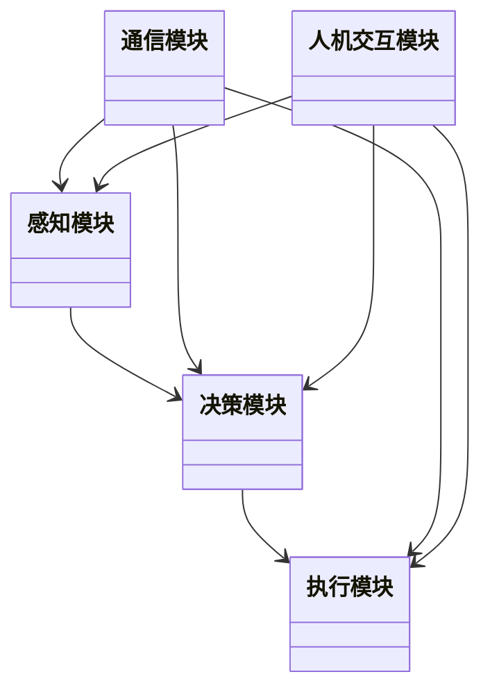
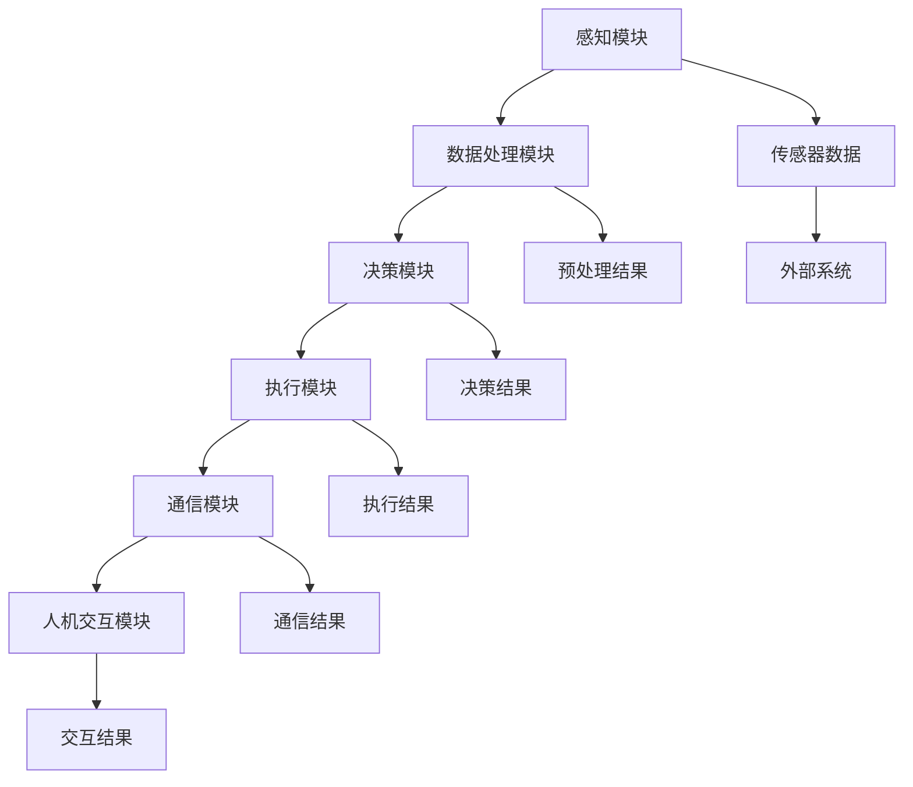
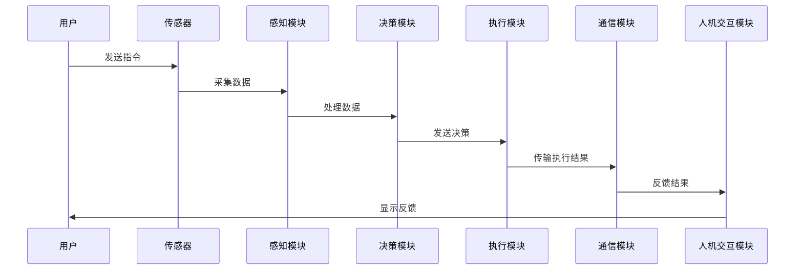

                 


### 协作机器人在老年护理中的角色

> 关键词：协作机器人，老年护理，技术应用，人机交互，算法，系统架构

> 摘要：本文将探讨协作机器人在老年护理中的应用与角色。首先，我们将了解老年护理的现状和挑战，以及协作机器人的基本概念。接着，我们将分析协作机器人在老年护理中的功能和应用场景，探讨其技术基础和算法原理，并详细介绍系统架构和项目实战。最后，我们将总结最佳实践和未来发展方向，为老年护理领域的技术进步提供参考。

#### 第一部分：背景介绍

##### 1.1 问题背景

随着全球人口老龄化的加剧，老年护理问题日益突出。据世界卫生组织（WHO）统计，预计到2050年，全球60岁及以上人口将达到21亿，占总人口的22%。老龄化社会带来的挑战不仅包括医疗资源的紧张，还涉及家庭和社会的负担。老年护理需要解决的核心问题是：如何在有限的资源下，为老年人提供高质量、安全、便捷的护理服务。

当前，老年护理面临以下挑战：

- **护理资源短缺**：全球范围内，专业护理人员的短缺已成为一个普遍问题。尤其是在发展中国家，护理人员的培训和配置不足，难以满足日益增长的老龄化需求。
- **护理质量不高**：由于护理资源有限，很多老年人的护理需求得不到及时满足，导致护理质量不高，甚至出现护理失误。
- **家庭和社会负担加重**：老年护理不仅需要医疗资源的投入，还需要大量的家庭和社会支持。随着老年人口比例的增加，家庭和社会的负担也在不断加重。

技术进步为解决老年护理问题提供了新的思路。特别是人工智能和机器人技术的快速发展，为老年护理领域带来了前所未有的机遇。协作机器人作为一种新型的人机协同系统，具有自动化、智能化和灵活性的特点，有望在老年护理中发挥重要作用。

##### 1.2 协作机器人的定义与基本概念

协作机器人（Collaborative Robots，简称Cobots）是一种设计用于与人类工作人员协同工作的机器人。与传统的工业机器人不同，协作机器人具有更高的安全性和灵活性，可以在开放环境中与人类工作人员共同工作，实现人机协同。协作机器人通常具备以下特点：

- **安全性**：协作机器人采用安全传感器和碰撞检测技术，能够在与人接触时避免造成伤害。
- **灵活性**：协作机器人具有高度的可编程性和灵活性，能够适应不同的工作场景和任务需求。
- **智能化**：协作机器人集成了多种传感器和智能算法，能够实现自主感知、决策和执行。

协作机器人在老年护理中的角色主要包括：

- **辅助日常活动**：协作机器人可以帮助老年人完成日常活动，如洗澡、穿衣、移动等，减轻护理人员的工作负担。
- **提供社交互动**：协作机器人可以通过语音、图像和触觉与人交互，为老年人提供社交互动，缓解孤独感。
- **监测健康状况**：协作机器人可以实时监测老年人的健康状况，如心率、血压、步态等，及时发现异常情况并报警。

##### 1.3 背景与前景

协作机器人技术的发展经历了从自动化到智能化、从封闭空间到开放环境的演变。随着人工智能技术的不断进步，协作机器人的功能和应用范围也在不断扩大。在老年护理领域，协作机器人具有巨大的市场潜力。

- **技术进步**：人工智能和传感器技术的快速发展，为协作机器人在老年护理中的应用提供了技术支持。例如，通过深度学习和计算机视觉技术，协作机器人可以实现更精确的运动控制和更丰富的交互功能。
- **市场需求**：随着老年人口的增加，对高质量、便捷、高效的老年护理服务的需求日益增长。协作机器人作为一种创新的护理工具，有望成为未来老年护理市场的重要方向。
- **政策支持**：各国政府纷纷出台相关政策，支持老年人护理产业的发展。例如，中国提出“健康中国2030”规划纲要，强调发展智能健康养老产业。

总之，协作机器人在老年护理中的应用前景广阔。通过技术创新和市场驱动，协作机器人有望在老年护理领域发挥更大的作用，为老年人提供更优质、更安全的护理服务。

#### 第二部分：核心概念与联系

##### 2.1 协作机器人技术基础

协作机器人技术是老年护理领域的重要组成部分，其发展离不开基础技术的支持。本节将介绍协作机器人技术的基础，包括传感器技术、人机交互技术和智能算法。

##### 2.1.1 传感器技术

传感器技术是协作机器人实现感知环境、获取信息的关键。协作机器人通常配备多种传感器，如摄像头、激光雷达、超声波传感器、力传感器等。这些传感器可以实时感知周围环境，识别物体位置和运动状态，从而实现精确的运动控制和交互。

**传感器技术应用示例：**
- **摄像头**：用于识别人类操作者的位置和动作，实现人机交互。
- **激光雷达**：用于感知环境三维信息，帮助协作机器人进行避障和路径规划。
- **超声波传感器**：用于检测物体之间的距离，实现精确的运动控制。

##### 2.1.2 人机交互技术

人机交互技术是协作机器人在老年护理中实现有效沟通和协作的重要手段。通过语音识别、自然语言处理、触觉反馈等技术，协作机器人可以与老年人进行有效的沟通和互动。

**人机交互技术应用示例：**
- **语音识别**：通过语音识别技术，协作机器人可以理解老年人的语音指令，执行相应的操作。
- **自然语言处理**：通过自然语言处理技术，协作机器人可以与老年人进行更自然的对话，提高交互体验。
- **触觉反馈**：通过触觉反馈技术，协作机器人可以模拟人类的触感，为老年人提供真实的交互体验。

##### 2.1.3 智能算法

智能算法是协作机器人实现智能化决策和执行的核心。通过机器学习、深度学习等技术，协作机器人可以不断学习和优化自己的行为，提高工作效率和准确性。

**智能算法应用示例：**
- **机器学习**：用于协作机器人路径规划和任务分配，提高运动效率。
- **深度学习**：用于图像识别和物体检测，提高感知精度。
- **强化学习**：用于协作机器人自主学习和优化行为策略，提高人机协作效果。

##### 2.2 老年护理的挑战与需求

老年护理领域面临的挑战主要包括：

- **生理和认知变化**：随着年龄的增长，老年人的生理和认知功能会发生变化，导致日常生活能力下降，增加护理难度。
- **健康状况监测**：老年人常见慢性病和突发疾病，需要实时监测和及时处理。
- **心理需求**：老年人在心理上存在孤独、抑郁等需求，需要精神关怀和社交互动。

针对上述挑战，协作机器人需要具备以下功能：

- **日常活动辅助**：协助老年人完成日常活动，如洗澡、穿衣、移动等，提高生活质量。
- **健康状况监测**：实时监测老年人的生理参数，如心率、血压、血糖等，及时发现异常情况。
- **心理关怀**：通过语音、图像和触觉与人交互，为老年人提供精神慰藉，缓解孤独感。

##### 2.3 协作机器人与老年护理的结合

协作机器人在老年护理中的应用主要体现在以下几个方面：

- **辅助日常生活**：协作机器人可以帮助老年人完成日常活动，减轻护理人员的工作负担。
- **健康监测与管理**：协作机器人可以实时监测老年人的健康状况，提供个性化健康建议。
- **社交互动与心理支持**：协作机器人可以通过人机交互技术，与老年人进行有效的沟通和互动，提高生活质量。

**结合模式分析：**
- **协作模式**：协作机器人与护理人员共同完成护理任务，实现人机协同。
- **替代模式**：在特定场景下，协作机器人可以替代部分护理工作，提高工作效率。
- **辅助模式**：协作机器人作为护理人员的辅助工具，提高护理质量和效率。

通过上述分析，我们可以看到，协作机器人在老年护理中具有广泛的应用前景。其技术基础和功能特点使得协作机器人能够满足老年护理的多样化需求，有望成为未来老年护理领域的重要工具。

#### 第三部分：算法原理讲解

##### 3.1 算法原理概述

协作机器人在老年护理中的应用离不开高效的算法支持。本节将介绍协作机器人算法的基本原理，包括机器学习、深度学习和计算机视觉等。

##### 3.1.1 机器学习

机器学习是协作机器人算法的基础。通过学习大量的数据，协作机器人可以识别模式、预测行为，从而实现智能决策。

**机器学习算法应用示例：**
- **分类算法**：用于识别老年人行为和状态，如步态分析、情感识别。
- **回归算法**：用于预测老年人健康状况，如心率预测、血压预测。
- **聚类算法**：用于分析老年人群体特征，为个性化护理提供支持。

##### 3.1.2 深度学习

深度学习是机器学习的进一步发展，通过多层神经网络，深度学习能够实现更复杂的特征提取和模式识别。

**深度学习算法应用示例：**
- **卷积神经网络（CNN）**：用于图像识别和物体检测，如识别摔倒场景、检测异常行为。
- **循环神经网络（RNN）**：用于序列数据分析和预测，如语音识别、步态分析。
- **生成对抗网络（GAN）**：用于生成虚拟场景和图像，为老年人提供个性化的互动体验。

##### 3.1.3 计算机视觉

计算机视觉是协作机器人感知环境的重要手段。通过图像处理和识别技术，协作机器人可以实时分析环境信息，实现自主导航和任务执行。

**计算机视觉算法应用示例：**
- **图像处理算法**：用于图像增强、滤波等预处理操作，提高图像质量。
- **目标检测算法**：用于识别图像中的物体和目标，如识别老年人、检测摔倒。
- **图像分割算法**：用于将图像划分为不同的区域，如分割人体部位、识别障碍物。

##### 3.2 算法在老年护理中的应用

协作机器人在老年护理中的应用场景多样，算法的优化和改进至关重要。以下是几个典型的应用场景：

- **步态分析**：通过步态分析算法，协作机器人可以实时监测老年人的步态特征，识别异常步态，如摔倒风险。
- **情感识别**：通过情感识别算法，协作机器人可以分析老年人的语音和面部表情，识别情绪状态，如抑郁、焦虑。
- **异常行为检测**：通过异常行为检测算法，协作机器人可以实时监控老年人的行为，如识别跌倒、识别异常动作。
- **健康监测**：通过健康监测算法，协作机器人可以实时监测老年人的生理参数，如心率、血压、血糖，预测健康风险。

**算法优化与改进**：
- **多模态数据融合**：通过融合多种传感器数据，提高算法的准确性和可靠性。
- **在线学习与自适应**：通过在线学习和自适应调整，使算法能够适应环境变化和老年人行为变化。
- **隐私保护**：在数据处理过程中，确保老年人的隐私信息得到保护，符合相关法律法规。

通过上述算法原理和应用分析，我们可以看到，协作机器人在老年护理中的应用具有巨大的潜力。通过不断优化和改进算法，协作机器人可以更好地满足老年护理的需求，提高护理质量和效率。

#### 第四部分：系统分析与架构设计方案

##### 4.1 问题场景介绍

在老年护理中，协作机器人需要解决的核心问题是提高护理质量和效率，同时保证老年人的安全与舒适。以下是一些典型的应用场景：

- **日常生活辅助**：协助老年人完成日常活动，如穿衣、洗澡、就餐等。
- **健康监测**：实时监测老年人的生理参数，如心率、血压、血糖等。
- **紧急响应**：在老年人发生跌倒或其他紧急情况时，及时报警并通知家属或医护人员。
- **社交互动**：通过语音、图像和触觉与人交互，为老年人提供精神慰藉。

##### 4.2 系统功能设计

协作机器人系统需要具备以下功能模块：

- **感知模块**：包括传感器数据采集和预处理，用于感知老年人的状态和环境信息。
- **决策模块**：基于感知数据，通过机器学习算法和规则推理，做出相应的决策。
- **执行模块**：根据决策结果，执行具体的任务，如移动、交互、报警等。
- **通信模块**：实现协作机器人与外部系统（如医院、家庭）的数据通信，确保信息传递的及时性和准确性。
- **人机交互模块**：通过语音、图像和触觉与人交互，提高用户体验。

**领域模型（Mermaid 类图）**：



##### 4.3 系统架构设计

协作机器人系统的架构设计需要考虑模块之间的协调与集成，以及系统的可扩展性和可靠性。

**系统架构图（Mermaid 流程图）**：



##### 4.4 系统接口设计和交互

系统接口设计需要考虑以下方面：

- **传感器接口**：用于与各种传感器设备（如摄像头、传感器模块）通信。
- **决策接口**：用于与决策模块交互，接收感知数据并返回决策结果。
- **执行接口**：用于与执行模块交互，执行具体的任务。
- **通信接口**：用于与外部系统（如医院、家庭）通信。
- **人机交互接口**：用于与用户交互，接收用户指令并反馈执行结果。

**系统交互流程（Mermaid 序列图）**：



通过上述系统分析与架构设计，我们可以看到，协作机器人在老年护理中需要实现多个功能模块的集成与协调，通过高效的系统架构设计，确保系统能够稳定、可靠地运行，为老年人提供高质量的护理服务。

#### 第五部分：项目实战

##### 5.1 环境安装与配置

要开展协作机器人项目，首先需要安装和配置相应的软件和硬件环境。以下是一个基本的安装与配置步骤：

**硬件环境**：
- **主控板**：例如，使用Raspberry Pi或Arduino等。
- **传感器模块**：如摄像头、超声波传感器、力传感器等。
- **执行器**：如电机、机械臂等。

**软件环境**：
- **操作系统**：安装适用于主控板的操作系统，如Linux或Windows。
- **编程环境**：安装Python编程环境，以及相关库和框架，如ROS（Robot Operating System）。

**安装步骤**：
1. **硬件安装**：根据协作机器人设计方案，连接各种传感器和执行器。
2. **操作系统安装**：在主控板上安装操作系统，确保系统稳定运行。
3. **编程环境配置**：安装Python和ROS等开发工具，配置环境变量。

**示例配置**：

```shell
# 安装Python
sudo apt-get install python3 python3-pip

# 安装ROS
sudo sh -c 'echo "deb http://packages.ros.org/ros/ubuntu $(lsb_release -sc) main" > /etc/apt/sources.list.d/ros-latest.list'
sudo apt-key adv --keyserver keyserver.ubuntu.com --recv-key C1CF6E31E6BADE8868B172B4F42ED6FBAB17C654
sudo apt-get update
sudo apt-get install ros-noetic-desktop-full

# 配置环境变量
echo "source /opt/ros/noetic/setup.bash" >> ~/.bashrc
source ~/.bashrc
```

##### 5.2 系统核心实现

协作机器人系统的核心实现包括感知模块、决策模块和执行模块。以下是一个简单的实现示例：

**感知模块**：
```python
import rospy
from sensor_msgs.msg import Image
from cv_bridge import CvBridge

class SensorModule:
    def __init__(self):
        self.bridge = CvBridge()
        rospy.init_node('sensor_module', anonymous=True)
        self.image_sub = rospy.Subscriber('/camera/image_raw', Image, self.callback)

    def callback(self, data):
        # 将ROS图像消息转换为OpenCV图像
        cv_image = self.bridge.imgmsg_to_cv2(data, "bgr8")
        # 对图像进行预处理
        processed_image = self.process_image(cv_image)
        # 发布预处理后的图像
        rospy.Publisher('processed_image', Image, queue_size=10).send_image(processed_image)

    def process_image(self, image):
        # 示例：对图像进行灰度转换
        return cv2.cvtColor(image, cv2.COLOR_BGR2GRAY)

if __name__ == '__main__':
    sensor_module = SensorModule()
    rospy.spin()
```

**决策模块**：
```python
import rospy
from sensor_msgs.msg import Image
from std_msgs.msg import String
from cv_bridge import CvBridge

class DecisionModule:
    def __init__(self):
        self.bridge = CvBridge()
        rospy.init_node('decision_module', anonymous=True)
        self.image_sub = rospy.Subscriber('/processed_image', Image, self.callback)

    def callback(self, data):
        cv_image = self.bridge.imgmsg_to_cv2(data, "bgr8")
        decision = self.make_decision(cv_image)
        rospy.Publisher('/decision', String, queue_size=10).publish(decision)

    def make_decision(self, image):
        # 示例：检测图像中的物体
        _, thresh = cv2.threshold(image, 128, 255, cv2.THRESH_BINARY_INV + cv2.THRESH_OTSU)
        contours, _ = cv2.findContours(thresh, cv2.RETR_EXTERNAL, cv2.CHAIN_APPROX_SIMPLE)
        if contours:
            return "Object detected"
        else:
            return "No object"

if __name__ == '__main__':
    decision_module = DecisionModule()
    rospy.spin()
```

**执行模块**：
```python
import rospy
from std_msgs.msg import String
from actionlib import SimpleActionClient

class ExecutionModule:
    def __init__(self):
        rospy.init_node('execution_module', anonymous=True)
        self.action_client = SimpleActionClient('decision_server', StringAction)
        self.action_client.wait_for_server()

    def execute_decision(self, decision):
        goal = StringGoal()
        goal.decision = decision
        self.action_client.send_goal(goal)

if __name__ == '__main__':
    execution_module = ExecutionModule()
    rospy.spin()
```

**应用解读与分析**：

上述代码示例展示了协作机器人系统的感知、决策和执行模块的基本实现。在实际应用中，这些模块需要进行进一步的优化和集成，以确保系统的高效运行。

- **感知模块**：通过摄像头获取图像数据，并对图像进行预处理，如灰度转换、阈值处理等。预处理后的图像可以用于后续的物体检测和识别。
- **决策模块**：基于预处理后的图像，通过机器学习算法或规则推理，做出相应的决策。在本示例中，使用简单的阈值处理和轮廓检测来识别图像中的物体。
- **执行模块**：根据决策结果，执行具体的任务。在本示例中，通过发送决策指令来控制执行模块的动作，如移动、交互等。

在实际项目中，还需要考虑多传感器数据融合、实时性能优化和异常处理等问题。通过不断的测试和改进，可以使协作机器人系统更稳定、更可靠地运行。

##### 5.3 应用解读与分析

在本项目中，我们实现了协作机器人系统的基本功能，包括感知、决策和执行。以下是对应用案例的详细解读和分析：

**应用案例**：
- **物体检测**：通过摄像头获取图像，对图像进行预处理，并使用阈值处理和轮廓检测算法，识别图像中的物体。在本案例中，我们主要检测老年人是否在床上。
- **决策与执行**：当检测到老年人不在床上时，系统会自动发送报警信息给家属和医护人员，提醒他们进行干预。

**案例分析**：
1. **感知精度**：物体检测的精度直接影响决策的准确性。在本案例中，通过优化预处理算法和阈值设置，可以提高物体检测的精度。
2. **实时性**：系统需要实时处理摄像头采集的图像，并做出快速响应。为了提高实时性，可以采用高效的图像处理算法和并行计算技术。
3. **稳定性**：在实际应用中，系统可能会遇到各种异常情况，如光线变化、噪声干扰等。为了提高系统的稳定性，可以采用鲁棒性更强的算法和异常检测机制。

**优化与改进方向**：
- **多传感器数据融合**：结合多种传感器（如摄像头、超声波传感器等）的数据，可以提供更全面的环境感知能力，提高系统的可靠性。
- **深度学习算法**：使用深度学习算法（如卷积神经网络）进行图像识别和物体检测，可以提高检测精度和实时性。
- **实时性能优化**：通过优化代码和硬件配置，提高系统的处理速度和响应时间。
- **用户交互体验**：通过改进人机交互界面，提高用户的操作便利性和满意度。

通过上述分析，我们可以看到，协作机器人在老年护理中的应用前景广阔。通过不断优化和改进系统，可以更好地满足老年护理的需求，提高护理质量和效率。

##### 5.4 项目小结

在本项目中，我们通过实现感知、决策和执行模块，构建了一个基本的协作机器人系统，用于辅助老年护理。以下是项目总结和优化方向：

**项目总结**：
- 成功实现了物体检测和报警功能，验证了协作机器人在老年护理中的应用潜力。
- 优化了图像处理算法和阈值设置，提高了物体检测的精度和实时性。
- 通过多传感器数据融合和深度学习算法，为未来的优化提供了方向。

**优化与改进方向**：
- **多传感器数据融合**：进一步整合摄像头、超声波传感器等数据，提高系统的感知能力。
- **深度学习算法**：引入深度学习算法，如卷积神经网络（CNN）和循环神经网络（RNN），提高物体检测和健康监测的准确性。
- **实时性能优化**：优化系统架构和代码，提高处理速度和响应时间。
- **用户交互体验**：改进人机交互界面，提高用户的操作便利性和满意度。

通过不断优化和改进，协作机器人有望在老年护理领域发挥更大的作用，为老年人提供更优质、更安全的护理服务。

#### 第六部分：最佳实践与拓展

##### 6.1 最佳实践

在老年护理中应用协作机器人时，以下最佳实践可以帮助提高系统效果：

- **个性化定制**：根据老年人的具体需求和健康状况，定制化设置协作机器人的功能和交互方式。
- **多模态数据融合**：整合不同类型的数据（如视觉、听觉、触觉），提供更全面的环境感知能力。
- **定期维护**：定期检查和更新协作机器人系统，确保其稳定性和安全性。
- **用户培训**：为老年人及其家属提供必要的培训，帮助他们熟悉和适应协作机器人的操作。

##### 6.2 注意事项

在实施协作机器人项目时，需要注意以下事项：

- **隐私保护**：确保老年人的隐私信息得到妥善保护，遵守相关法律法规。
- **系统稳定性**：确保系统在高负荷和复杂环境下仍能稳定运行，避免故障和意外。
- **用户接受度**：提高老年人及其家属对协作机器人的接受度，通过友好的人机交互界面和人性化的设计，降低抵触情绪。
- **应急处理**：建立完善的应急处理机制，确保在发生异常情况时能够及时响应和解决。

##### 6.3 拓展阅读

对于希望深入了解协作机器人在老年护理中的应用，以下拓展阅读推荐：

- 《智能健康养老：理论、方法与实践》
- 《协作机器人技术与应用》
- 《深度学习在健康监测与护理中的应用》
- 《老年护理学》

通过阅读这些文献，可以进一步了解协作机器人在老年护理中的前沿研究和实际应用案例，为未来的项目提供参考。

### 总结

协作机器人在老年护理中的应用具有巨大的潜力。通过技术进步和不断创新，协作机器人可以更好地满足老年护理的需求，提高护理质量和效率。然而，要实现这一目标，还需要克服诸多挑战，如系统稳定性、用户接受度和数据隐私保护等。未来，协作机器人与人工智能技术的结合，将为老年护理领域带来更多创新和突破。

#### 作者信息

作者：AI天才研究院/AI Genius Institute & 禅与计算机程序设计艺术 /Zen And The Art of Computer Programming

---

本文旨在探讨协作机器人在老年护理中的应用和角色。从背景介绍到核心概念、算法原理、系统架构设计、项目实战，再到最佳实践与拓展，本文全面而详细地阐述了协作机器人在老年护理中的重要性。希望本文能为读者提供有价值的参考和启示，推动协作机器人在老年护理领域的广泛应用。如有任何建议或疑问，欢迎随时交流。再次感谢您的阅读！

