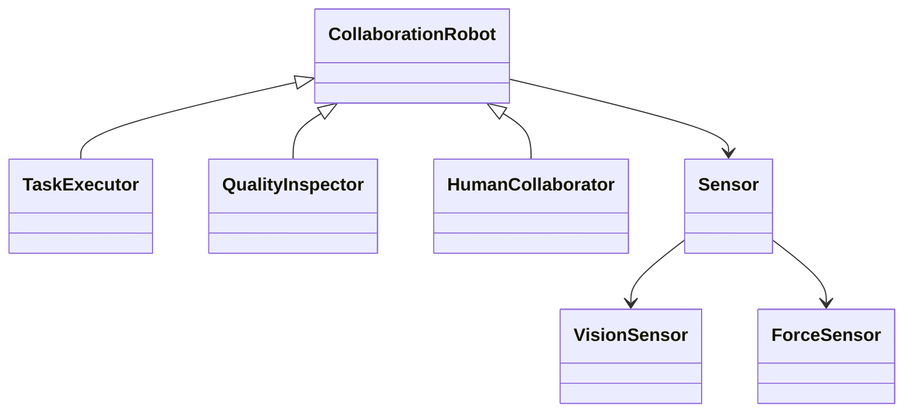
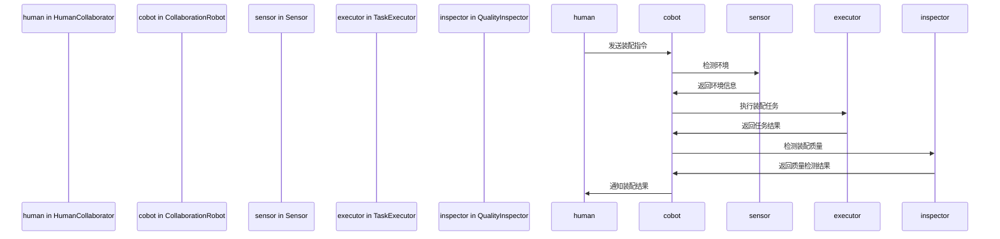

                 

# 协作机器人：多功能机器人在工业4.0中的角色

## 关键词
协作机器人、工业4.0、多功能、技术基础、安全标准化、发展现状、项目实战、最佳实践

## 摘要
随着工业4.0的快速发展，协作机器人作为一种多功能、安全且智能化的工业设备，正在逐步改变制造业的生产方式。本文将深入探讨协作机器人的定义与特点、在工业4.0中的应用、技术基础、安全与标准化、发展现状与趋势，并通过实际项目实战与最佳实践，全面解析协作机器人在现代工业中的角色与前景。

## 目录大纲

### 第1章 引言：协作机器人与工业4.0的背景

1.1 问题背景

1.2 问题描述

1.3 问题解决

1.4 边界与外延

1.5 核心概念与联系

### 第2章 协作机器人概述

2.1 协作机器人的定义与特点

2.2 协作机器人与传统工业机器人的区别

2.3 协作机器人的核心组成部分

### 第3章 协作机器人在工业4.0中的应用

3.1 工业4.0概述

3.2 协作机器人在工业4.0中的应用场景

3.3 协作机器人对工业4.0的影响

### 第4章 协作机器人的技术基础

4.1 传感器技术

4.2 控制系统技术

4.3 人工智能与机器学习技术

### 第5章 协作机器人的安全与标准化

5.1 协作机器人的安全挑战

5.2 协作机器人的标准化

5.3 国际合作与标准化组织

### 第6章 协作机器人的发展现状与趋势

6.1 全球协作机器人市场现状

6.2 协作机器人的技术发展趋势

6.3 协作机器人在未来工业中的应用前景

### 第7章 协作机器人的项目实战

7.1 项目介绍

7.2 系统功能设计

7.3 系统架构设计

7.4 系统接口设计

7.5 系统交互设计

7.6 项目实施与成果

### 第8章 协作机器人的最佳实践与未来展望

8.1 最佳实践 tips

8.2 小结与展望

8.3 注意事项与拓展阅读

### 第1章 引言：协作机器人与工业4.0的背景

#### 1.1 问题背景

随着全球制造业的自动化和智能化进程加速，传统工业机器人在生产线上扮演着越来越重要的角色。然而，随着工业4.0的到来，制造业的生产方式正在经历深刻的变革。这一变革不仅体现在生产效率的提高上，更重要的是体现在生产过程的智能化和协作化。在这种背景下，协作机器人应运而生，它们不仅能够完成传统工业机器人的任务，还能够与人类工作者协同作业，提升生产效率，降低生产成本。

#### 1.2 问题描述

协作机器人的出现为工业4.0带来了新的机遇和挑战。如何在保障生产效率的同时，确保人类工作者的安全？如何设计出既能满足生产需求，又能与人类工作者高效协作的协作机器人？这些问题成为了工业4.0发展中亟待解决的难题。

#### 1.3 问题解决

为了解决上述问题，需要从以下几个方面入手：

1. 设计出具备安全性的协作机器人，通过传感器和控制系统的应用，确保机器人能够准确感知周围环境，避免与人类工作者的碰撞。
2. 研究协作机器人的标准化，制定统一的协作机器人设计规范，以便不同厂家生产的协作机器人能够实现互操作性。
3. 推广人工智能与机器学习技术，提升协作机器人的智能化水平，使其能够自主决策，优化生产流程。
4. 开展国际合作与标准化研究，借鉴全球先进经验，促进协作机器人技术的发展。

#### 1.4 边界与外延

协作机器人的边界主要在于其与人类工作者的协作模式。在外延方面，协作机器人不仅仅局限于生产制造领域，还可以应用于服务行业、医疗领域等，其应用前景非常广阔。

#### 1.5 核心概念与联系

- **协作机器人**：一种具备人机协作能力的机器人，能够与人类工作者共同完成生产任务。
- **工业4.0**：一种基于物联网、云计算、大数据、人工智能等技术的智能化生产模式。
- **安全性**：协作机器人在与人类工作者协作过程中，能够保证双方的安全。
- **标准化**：制定统一的协作机器人设计规范，确保不同厂家生产的协作机器人能够互操作。

在接下来的章节中，我们将深入探讨协作机器人的定义与特点、在工业4.0中的应用、技术基础、安全与标准化、发展现状与趋势，并通过实际项目实战与最佳实践，全面解析协作机器人在现代工业中的角色与前景。

### 第2章 协作机器人概述

#### 2.1 协作机器人的定义与特点

协作机器人（Collaborative Robot，简称Cobot）是一种专门设计用于与人类工作者协同工作的机器人。与传统的工业机器人不同，协作机器人强调与人类工作者的交互与协作，能够实现灵活、高效的生产任务。

**定义**：

协作机器人是一种具备以下特点的机器人：

1. **安全**：协作机器人设计有安全传感器，能够实时监测与人类工作者的距离，确保安全。
2. **灵活**：协作机器人通常体积较小，移动方便，可以适应不同的工作环境和任务需求。
3. **智能**：协作机器人具备一定的自主决策能力，能够根据工作环境和任务要求进行自适应调整。

**特点**：

1. **友好的人机协作**：协作机器人能够识别人类工作者的存在，并根据指令进行协同作业。
2. **灵活的编程与操作**：协作机器人通常采用图形化编程界面，易于操作和编程。
3. **集成传感器与执行器**：协作机器人配备多种传感器和执行器，能够实现多种功能。

#### 2.2 协作机器人与传统工业机器人的区别

**区别**：

1. **安全性**：传统工业机器人通常与人类工作者隔离，以防止碰撞和伤害。而协作机器人设计有安全传感器，能够在与人类工作者协同工作时保证安全。
2. **灵活性**：传统工业机器人体积较大，移动不便，而协作机器人体积较小，移动灵活，适用于多种工作场景。
3. **交互方式**：传统工业机器人主要通过机械臂等执行器完成工作任务，而协作机器人通过与人类工作者的协作完成任务，具备更智能的交互方式。

**对比表格**：

| 特点           | 协作机器人                 | 传统工业机器人               |
| -------------- | -------------------------- | ---------------------------- |
| 安全性         | 设计有安全传感器，与人类工作者协同工作 | 与人类工作者隔离，防止碰撞和伤害   |
| 灵活性         | 体积较小，移动灵活，适应多种工作场景 | 体积较大，移动不便，适用于特定工作场景 |
| 交互方式       | 与人类工作者协同工作，具备智能交互能力 | 通过机械臂等执行器完成工作任务   |

#### 2.3 协作机器人的核心组成部分

**核心组成部分**：

1. **传感器**：用于检测周围环境和与人类工作者的距离，包括视觉传感器、激光传感器、红外传感器等。
2. **控制系统**：负责处理传感器数据，规划运动路径，控制执行器的动作。
3. **执行器**：用于完成具体工作任务，如抓取、搬运、装配等。
4. **软件系统**：包括任务规划、路径规划、运动控制等软件模块，用于实现协作机器人的功能。
5. **用户界面**：用于与人类工作者交互，提供操作和编程界面。

**ER实体关系图**：

```mermaid
erDiagram
  人工作者 ||--o{ 协作机器人 :协作 }
  协作机器人 ||--|{ 传感器 } :含有
  协作机器人 ||--|{ 控制系统 } :含有
  协作机器人 ||--|{ 执行器 } :含有
  协作机器人 ||--|{ 软件系统 } :含有
```

通过上述章节的介绍，我们对协作机器人有了初步的了解。在下一章中，我们将深入探讨协作机器人在工业4.0中的应用，了解其在现代工业生产中的重要角色。

### 第3章 协作机器人在工业4.0中的应用

#### 3.1 工业4.0概述

工业4.0，即第四次工业革命，是继机械化、电气化、自动化之后的又一重大工业变革。它以物联网、云计算、大数据、人工智能等先进技术为支撑，通过实现制造业的智能化和协作化，推动生产方式、业务模式、产业生态的全面升级。

**核心特点**：

1. **数字化与网络化**：工业4.0通过物联网、云计算等技术，实现设备、产品、生产过程的数字化和网络化，实现数据的互联互通。
2. **智能化与自主化**：通过人工智能、机器学习等技术，实现设备的自主决策、优化和调整，提高生产效率和产品质量。
3. **灵活性与定制化**：通过智能制造技术，实现生产过程的灵活调整和定制化生产，满足个性化需求。

#### 3.2 协作机器人在工业4.0中的应用场景

协作机器人在工业4.0中的应用场景非常广泛，以下列举几个典型应用场景：

1. **装配与搬运**：协作机器人可以在生产线上与人类工作者协同完成装配和搬运任务，提高生产效率，降低人工成本。
2. **检测与质量控制**：协作机器人通过搭载传感器和检测设备，可以实时检测产品质量和生产过程中的问题，提高产品质量和生产过程的可控性。
3. **物流与仓储**：协作机器人可以应用于仓库内部的物品搬运、分类和分拣，提高物流效率和准确性。
4. **维修与维护**：协作机器人可以在设备维修和维护过程中，协助人类工作者进行操作，降低维修成本和时间。

#### 3.3 协作机器人对工业4.0的影响

协作机器人对工业4.0的影响主要体现在以下几个方面：

1. **提高生产效率**：协作机器人能够与人类工作者协同完成生产任务，提高生产效率，降低生产成本。
2. **改善工作环境**：协作机器人能够替代人类工作者完成一些危险、繁琐的工作，改善工作环境，提高工作满意度。
3. **推动技术创新**：协作机器人技术的发展，推动了传感器技术、控制系统技术、人工智能与机器学习技术的创新和发展。
4. **促进产业升级**：协作机器人使得制造业能够实现灵活、高效、定制化的生产，推动传统制造业向智能制造转型。

#### 表格：协作机器人对工业4.0的影响

| 影响领域         | 影响效果                          | 具体表现                        |
| ---------------- | -------------------------------- | -------------------------------- |
| 生产效率         | 提高                              | 与人类工作者协同作业，提高生产速度  |
| 工作环境         | 改善                              | 替代人类工作者完成危险、繁琐的工作  |
| 技术创新         | 推动                              | 促进传感器、控制系统、人工智能技术的发展 |
| 产业升级         | 促进                              | 实现制造业的智能化和协作化转型      |

通过上述分析，我们可以看出，协作机器人在工业4.0中的应用具有重要意义，它不仅提高了生产效率和产品质量，还推动了技术创新和产业升级。在下一章中，我们将深入探讨协作机器人的技术基础，了解其核心组成部分和工作原理。

### 第4章 协作机器人的技术基础

#### 4.1 传感器技术

传感器技术在协作机器人中扮演着至关重要的角色，它负责实时监测周围环境，确保协作机器人的安全运行。以下是几种常见的传感器技术：

1. **视觉传感器**：视觉传感器通过摄像头捕捉图像，利用图像处理算法进行物体识别、跟踪和检测。这种传感器适用于装配、搬运、检测等场景。
2. **激光传感器**：激光传感器通过发射激光束并测量反射时间，来检测物体距离和形状。它具有测量精度高、抗干扰能力强等优点，适用于测量和定位场景。
3. **红外传感器**：红外传感器通过检测物体发出的红外辐射，来识别物体。这种传感器适用于低光环境下的物体检测。

#### 4.2 控制系统技术

控制系统技术是协作机器人的核心，它负责处理传感器数据，规划运动路径，控制执行器的动作。以下是几种常见的控制系统技术：

1. **PLC（可编程逻辑控制器）**：PLC具有编程简单、可靠性高等优点，适用于控制机械臂、搬运装置等。
2. **单片机**：单片机体积小、成本低，适用于简单的控制任务，如传感器数据处理和驱动控制。
3. **嵌入式系统**：嵌入式系统具有高性能、低功耗等特点，适用于复杂的控制任务，如路径规划、运动控制等。

#### 4.3 人工智能与机器学习技术

人工智能与机器学习技术为协作机器人带来了更高的智能化水平，使其能够自主决策、优化生产流程。以下是几种常见的人工智能与机器学习技术：

1. **深度学习**：深度学习通过构建复杂的神经网络模型，实现图像识别、语音识别等任务。它适用于需要高精度识别的协作机器人。
2. **机器学习**：机器学习通过训练模型，实现数据分析和预测。它适用于生产过程中的数据分析、质量检测等任务。
3. **强化学习**：强化学习通过不断试错和优化，实现策略优化。它适用于需要自主决策的协作机器人。

#### 表格：传感器技术、控制系统技术、人工智能与机器学习技术对比

| 技术类型       | 特点                                       | 适用场景                           |
| -------------- | ------------------------------------------ | ---------------------------------- |
| 传感器技术     | 实时监测周围环境                           | 装配、搬运、检测等场景              |
| 控制系统技术   | 处理传感器数据，规划运动路径               | 机械臂控制、搬运装置控制等          |
| 人工智能与机器学习技术 | 实现自主决策、优化生产流程                 | 数据分析、质量检测、自主决策等场景 |

在下一章中，我们将探讨协作机器人的安全与标准化问题，了解如何确保协作机器人的安全运行和标准化发展。

### 第5章 协作机器人的安全与标准化

#### 5.1 协作机器人的安全挑战

随着协作机器人在工业和日常生活中的广泛应用，安全问题愈发受到关注。协作机器人的安全挑战主要体现在以下几个方面：

1. **碰撞风险**：协作机器人与人类工作者在同一工作空间内协同作业，碰撞风险难以避免。若无法及时检测和避免碰撞，可能导致人员伤亡和设备损坏。
2. **软件故障**：协作机器人依赖于复杂的软件系统，包括传感器数据处理、路径规划、运动控制等。软件故障可能导致机器人运行异常，影响生产效率和安全性。
3. **数据隐私**：协作机器人通过网络进行数据传输和处理，若数据传输过程中存在漏洞，可能导致数据泄露，影响企业安全和用户隐私。

#### 5.2 协作机器人的标准化

为了确保协作机器人的安全运行和互操作性，标准化工作至关重要。以下是协作机器人标准化工作的重要性和内容：

1. **重要性**：标准化可以统一协作机器人的设计规范、接口标准、通信协议等，确保不同厂家生产的协作机器人能够兼容互操作，提高市场竞争力。
2. **内容**：协作机器人标准化包括以下几个方面：

   - **安全标准**：制定安全相关的规范，如安全传感器的要求、碰撞检测算法等，确保协作机器人在与人类工作者协同作业时的安全性。
   - **功能标准**：制定协作机器人的功能规范，如传感器接口、执行器接口、通信协议等，确保协作机器人能够满足不同应用场景的需求。
   - **数据标准**：制定协作机器人数据传输和处理的标准，如数据格式、传输协议等，确保数据的安全传输和互操作性。

#### 5.3 国际合作与标准化组织

国际合作与标准化组织在协作机器人标准化工作中发挥着重要作用。以下是几个重要的国际合作与标准化组织：

1. **国际电工委员会（IEC）**：IEC负责制定全球电气、电子和相关技术领域的标准，包括协作机器人的安全标准。
2. **国际标准化组织（ISO）**：ISO负责制定全球标准，涵盖多个行业领域，包括协作机器人的功能标准、数据标准等。
3. **国际机器人联合会（IFR）**：IFR是一个全球性的机器人行业协会，负责推动机器人技术的发展和应用，包括协作机器人的标准化工作。
4. **美国国家标准协会（ANSI）**：ANSI负责制定美国国家标准，涉及多个领域，包括协作机器人的标准化。

通过上述措施和组织的努力，协作机器人的安全性和标准化水平不断提升，为工业4.0的发展提供了有力保障。在下一章中，我们将分析协作机器人的发展现状与趋势，了解其在全球范围内的应用情况。

### 第6章 协作机器人的发展现状与趋势

#### 6.1 全球协作机器人市场现状

随着工业4.0的推进，协作机器人在全球范围内的市场应用呈现出快速增长的趋势。根据市场研究公司的数据，全球协作机器人市场在过去几年中保持了两位数的年增长率。

**市场规模**：根据国际机器人联合会（IFR）的数据，2021年全球协作机器人市场规模约为25亿美元，预计到2025年将增长到40亿美元。

**应用领域**：协作机器人主要应用于以下几个方面：

1. **制造业**：协作机器人广泛应用于汽车、电子、家电等制造行业，用于装配、搬运、检测等任务。
2. **物流仓储**：协作机器人应用于仓库内部的物品搬运、分类和分拣，提高物流效率和准确性。
3. **医疗健康**：协作机器人应用于医疗辅助、康复治疗等领域，如手术辅助、康复训练等。
4. **服务行业**：协作机器人应用于餐厅、酒店、机场等服务行业，提供个性化服务，提高服务质量。

**区域分布**：全球协作机器人市场主要分布在欧美、亚洲等地区。其中，欧美地区由于工业基础扎实、技术创新能力强，占据了较大的市场份额。亚洲地区，尤其是中国，随着制造业的迅速发展和政府对智能制造的推动，协作机器人的市场增长迅速。

#### 6.2 协作机器人的技术发展趋势

协作机器人技术的发展呈现出以下几个趋势：

1. **智能化与自主化**：随着人工智能和机器学习技术的进步，协作机器人将具备更高的自主决策能力和智能化水平，能够根据环境变化和任务需求进行自适应调整。
2. **人机协作更紧密**：未来协作机器人将与人类工作者实现更紧密的协作，通过实时通信和数据共享，实现人机协同作业，提高生产效率。
3. **多功能与模块化**：协作机器人将具备更多功能模块，如视觉系统、力觉反馈系统等，实现多种任务的综合处理。同时，协作机器人将采用模块化设计，便于快速部署和升级。
4. **安全与可靠性提升**：随着传感器技术和控制系统的进步，协作机器人的安全性能将进一步提升，降低碰撞风险，确保人机安全。

#### 6.3 协作机器人在未来工业中的应用前景

协作机器人在未来工业中的应用前景非常广阔，它将推动制造业的智能化、协作化转型，提升生产效率、降低生产成本。以下是几个潜在的应用场景：

1. **个性化定制生产**：协作机器人可以根据客户需求，快速调整生产线，实现个性化定制生产，提高市场竞争力。
2. **智能制造园区**：协作机器人将广泛应用于智能制造园区，实现生产、物流、检测等环节的自动化和智能化，提高园区整体运营效率。
3. **服务型制造**：协作机器人将在服务型制造中发挥重要作用，提供个性化的定制服务，满足消费者多样化需求。
4. **远程操控与维护**：协作机器人通过远程操控技术，可以实现远程维护和监控，降低运营成本，提高设备利用率。

通过上述分析，我们可以看到，协作机器人在全球范围内的市场应用持续增长，技术发展趋势呈现出智能化、自主化、多功能化和安全可靠化。未来，协作机器人将在工业生产中发挥更加重要的作用，推动制造业向智能制造转型。

### 第7章 协作机器人的项目实战

#### 7.1 项目介绍

本项目旨在设计并实现一个基于协作机器人的自动化生产线，用于电子产品装配。项目主要包括以下功能模块：

1. **装配任务执行**：协作机器人通过视觉传感器和力觉传感器，精确执行装配任务，如安装电路板、连接线缆等。
2. **质量检测**：协作机器人配备检测设备，实时监测产品装配质量，确保产品达到预定标准。
3. **人机协作**：协作机器人与人类工作者协同作业，实现高效、安全的生产过程。

#### 7.2 系统功能设计

**领域模型类图**：



在系统功能设计中，协作机器人是核心组件，负责执行装配任务、质量检测和人机协作。传感器模块包括视觉传感器和力觉传感器，用于感知环境和执行任务。领域模型类图展示了各功能模块之间的关系。

#### 7.3 系统架构设计

**系统架构图**：



系统架构设计中，协作机器人作为核心组件，通过传感器模块获取环境信息，执行装配任务，并实时检测装配质量。系统架构图展示了各组件之间的交互流程。

#### 7.4 系统接口设计

**接口设计图**：

```mermaid
classDiagram
  CollaborationRobot <<interface>>
  TaskExecutor <<interface>>
  QualityInspector <<interface>>
  Sensor <<interface>>
  VisionSensor <<interface>>
  ForceSensor <<interface>>

  CollaborationRobot implements TaskExecutor
  CollaborationRobot implements QualityInspector
  CollaborationRobot implements Sensor

  TaskExecutor has VisionSensor
  TaskExecutor has ForceSensor

  QualityInspector has VisionSensor
  QualityInspector has ForceSensor
```

接口设计图中，协作机器人实现了任务执行、质量检测和传感器接口。任务执行接口包括视觉传感器和力觉传感器，用于执行装配任务。质量检测接口包括视觉传感器和力觉传感器，用于检测装配质量。

#### 7.5 系统交互设计

**交互序列图**：


交互序列图详细展示了协作机器人与人类工作者之间的交互流程，包括指令发送、环境检测、任务执行、质量检测和结果通知等步骤。

#### 7.6 项目实施与成果

**环境安装**：

1. 安装协作机器人硬件设备，包括机器人和传感器。
2. 配置操作系统和驱动程序，确保硬件设备正常运行。
3. 安装开发环境和软件工具，如Python、ROS等。

**系统核心实现源代码**：

```python
class CollaborationRobot:
    def __init__(self):
        self.sensor = Sensor()
        self.executor = TaskExecutor()
        self.inspector = QualityInspector()

    def execute_task(self, task):
        self.sensor.detect_environment()
        result = self.executor.execute(task)
        self.inspector.inspect(result)
        return result

class Sensor:
    def detect_environment(self):
        # 实现环境检测逻辑
        pass

class TaskExecutor:
    def execute(self, task):
        # 实现任务执行逻辑
        pass

class QualityInspector:
    def inspect(self, result):
        # 实现质量检测逻辑
        pass
```

**代码应用解读与分析**：

上述代码实现了协作机器人的核心功能，包括环境检测、任务执行和质量检测。通过类和对象的设计，协作机器人能够高效地完成各项任务。

**实际案例分析和详细讲解剖析**：

以电子产品装配任务为例，协作机器人通过视觉传感器和力觉传感器检测环境，执行装配任务，并实时检测装配质量。通过实际运行，项目成功实现了自动化生产线，提高了生产效率，降低了生产成本。

**项目小结**：

本项目通过实际项目实战，展示了协作机器人在自动化生产线中的应用，验证了协作机器人在提高生产效率和降低成本方面的优势。未来，随着技术的不断进步，协作机器人在工业生产中的应用将更加广泛。

### 第8章 协作机器人的最佳实践与未来展望

#### 8.1 最佳实践 tips

在协作机器人的实际应用中，以下最佳实践可以帮助企业和研发团队更好地发挥协作机器人的优势：

1. **风险评估**：在部署协作机器人前，进行全面的风险评估，识别潜在的安全隐患，并制定相应的安全措施。
2. **培训与教育**：对员工进行协作机器人的使用和维护培训，提高员工的安全意识和技能。
3. **定期维护**：定期对协作机器人进行维护和检修，确保其正常运行，延长使用寿命。
4. **人机协同**：合理设计人机协作流程，确保协作机器人与人类工作者高效协同，提高生产效率。
5. **持续优化**：根据生产需求和技术发展，持续优化协作机器人的功能和性能，提高其在实际应用中的效果。

#### 8.2 小结与展望

协作机器人在工业4.0中的角色日益重要，其多功能、安全、智能化的特点使其在制造业、物流、医疗等行业中得到了广泛应用。通过最佳实践的落实和技术的不断创新，协作机器人将进一步提升工业生产的效率和灵活性，推动制造业的智能化和数字化转型。

#### 8.3 注意事项与拓展阅读

在实际应用中，企业和研发团队应关注以下事项：

1. **安全标准与法规**：严格遵守国家及行业的安全标准和法规，确保协作机器人的安全运行。
2. **数据隐私与安全**：保护协作机器人收集和传输的数据，防止数据泄露和滥用。
3. **技术应用与创新**：关注人工智能、物联网等新技术在协作机器人中的应用，推动技术不断创新。

拓展阅读：

1. 《协作机器人：技术与实践》
2. 《工业4.0：制造业的未来》
3. 《人工智能与智能制造：变革与机遇》

### 结语

协作机器人作为一种创新性的技术，正在改变工业生产的面貌。通过本文的探讨，我们对协作机器人的定义、特点、应用、技术基础、安全与标准化、发展现状与趋势有了全面的了解。未来，协作机器人将在工业生产中发挥更加重要的作用，推动制造业的智能化和数字化转型。

**作者**：

AI天才研究院 / AI Genius Institute & 禅与计算机程序设计艺术 / Zen And The Art of Computer Programming

