                 

# 可持续技术：IT行业减少碳足迹的创新

## 关键词
- 可持续技术
- IT行业
- 碳足迹
- 绿色能源
- 节能技术
- 云计算
- 边缘计算
- 物联网

## 摘要
本文深入探讨了可持续技术在IT行业中的应用，旨在减少碳足迹。我们将分析可持续技术的背景、核心概念、应用领域、技术手段、实施策略以及未来展望。通过这一系列的分析，我们希望为IT行业提供实现可持续发展的有效路径。

## 引言

### 背景

随着科技的发展，IT行业在推动社会进步的同时，也带来了显著的能源消耗和碳排放问题。根据国际数据公司（IDC）的统计，全球IT行业的碳排放量已占全球总碳排放量的2%左右，且这一数字仍在不断上升。这一现状引发了全球范围内的关注，可持续技术因此成为IT行业发展的迫切需求。

### 意义

减少碳足迹不仅是企业的社会责任，更是实现可持续发展的必由之路。通过引入可持续技术，IT行业可以在降低能源消耗和碳排放的同时，提高运营效率，实现经济效益和社会效益的双重提升。

## 第1章：可持续技术的背景与意义

### 1.1 可持续技术的发展历程

可持续技术并非一蹴而就，其发展历程可以追溯到20世纪中期。最初，可持续发展概念源于环境保护运动，随着时间的推移，逐渐发展成为涵盖经济、社会、环境等多方面内容的综合性理念。在IT行业，可持续技术的引入可以追溯到20世纪末，例如，虚拟化技术和云计算技术的出现，为减少物理硬件的能耗提供了可能。

### 1.2 IT行业对环境的影响

IT行业的快速发展虽然带来了便利，但也对环境造成了显著的影响。主要表现在以下几个方面：

- **能源消耗**：服务器、数据中心等设备在运行过程中需要大量的电力支持，导致能源消耗巨大。
- **碳排放**：服务器和数据中心在运行过程中产生的热量，需要通过冷却系统散发出去，这过程中会排放大量的二氧化碳等温室气体。
- **电子垃圾**：随着设备更新换代，大量的电子垃圾被产生，对环境造成了污染。

### 1.3 可持续技术的定义与重要性

可持续技术是指在满足当前需求的同时，不会损害后代满足其需求的能力。在IT行业中，可持续技术的重要性体现在以下几个方面：

- **环境保护**：通过降低能源消耗和碳排放，减少对环境的破坏。
- **资源节约**：提高资源利用效率，降低资源浪费。
- **经济效益**：降低运营成本，提高企业竞争力。

## 第2章：可持续技术的核心概念

### 2.1 能源效率

能源效率是可持续技术的重要组成部分。提高能源效率可以通过以下几种方式实现：

- **硬件优化**：采用更高效的处理器和服务器，降低能耗。
- **节能设计**：优化数据中心的冷却系统，减少能源浪费。
- **能源管理**：通过智能监控系统，实时监控能源消耗，优化能源使用。

### 2.2 碳捕捉与封存

碳捕捉与封存（CCS）是一种重要的减排技术，其原理是通过化学、物理或生物方法，将二氧化碳从排放源中分离出来，然后将其储存于地下或海洋中，以减少大气中的二氧化碳浓度。

### 2.3 循环经济

循环经济是一种以资源高效利用和循环利用为核心的经济模式。在IT行业，循环经济的实现可以通过以下几种方式：

- **产品回收**：鼓励用户回收旧设备，通过再制造或再利用，降低资源消耗。
- **绿色采购**：选择环保材料和低能耗产品，减少环境影响。
- **共享经济**：通过共享资源，降低资源浪费。

## 第3章：可持续技术的应用领域

### 3.1 人工智能与大数据

人工智能和大数据技术在可持续技术中的应用十分广泛。例如，通过大数据分析，可以优化能源使用，减少浪费。人工智能技术则可以用于预测能源需求，优化资源配置。

### 3.2 云计算与边缘计算

云计算和边缘计算是可持续技术的关键支撑。云计算通过虚拟化和分布式计算，提高了资源利用效率，而边缘计算则通过将计算任务分配到更靠近数据源的设备上，减少了数据传输的能耗。

### 3.3 物联网

物联网技术可以实现设备之间的互联互通，从而优化能源使用。例如，智能家庭系统可以通过传感器实时监测能源使用情况，实现智能节能。

## 第4章：减少碳足迹的技术手段

### 4.1 节能技术

节能技术是减少碳足迹的重要手段。通过采用高效硬件、优化系统设计、使用节能软件等技术手段，可以显著降低能源消耗。

### 4.2 绿色能源

绿色能源包括太阳能、风能、水能等可再生能源。通过引入绿色能源，可以减少对化石燃料的依赖，降低碳排放。

### 4.3 碳交易

碳交易是一种市场化手段，通过碳市场的交易，实现碳排放权的分配和交易，从而促进减排。

## 第5章：可持续技术的实施策略

### 5.1 政策与法规

政策与法规是推动可持续技术实施的重要手段。政府可以通过制定相关法规，鼓励企业采用可持续技术。

### 5.2 企业社会责任

企业社会责任是推动可持续技术实施的重要动力。企业可以通过承担社会责任，提升企业形象，同时实现可持续发展。

### 5.3 实施案例分析

通过分析具体企业的实施案例，可以深入了解可持续技术的实际应用效果和实施策略。

## 第6章：可持续技术的未来展望

### 6.1 技术发展趋势

未来可持续技术将朝着智能化、绿色化、高效化的方向发展。

### 6.2 潜在挑战与解决方案

未来可持续技术将面临技术、经济、社会等多方面的挑战，需要通过技术创新和制度创新来应对。

### 6.3 可持续技术的影响与价值

可持续技术将深刻影响全球经济、社会和环境，其价值在于推动可持续发展，实现人类与自然的和谐共生。

## 第7章：最佳实践与建议

### 7.1 企业可持续技术实践案例

通过分析成功的企业案例，可以为其他企业提供参考和借鉴。

### 7.2 个人与社会的可持续行动

个人和社会的参与是推动可持续技术发展的重要力量。每个人都可以从自身做起，践行可持续生活方式。

## 结论

可持续技术是IT行业实现可持续发展的重要路径。通过引入可持续技术，我们可以减少碳足迹，保护环境，实现经济效益和社会效益的双重提升。让我们携手共建可持续未来。

## 作者

作者：AI天才研究院/AI Genius Institute & 禅与计算机程序设计艺术 /Zen And The Art of Computer Programming

---

以上是本文的目录大纲和正文内容，接下来将根据每个章节的具体要求，逐步深入分析每个主题。文章将以逻辑清晰、结构紧凑、简单易懂的专业的技术语言，逐步引导读者了解可持续技术的概念、应用和实践。每章的内容都将包含详细的背景介绍、核心概念与联系、算法原理讲解、数学模型和公式、系统分析与架构设计方案、项目实战以及最佳实践和注意事项等内容。

在接下来的章节中，我们将进一步探讨可持续技术在不同领域中的应用，分析其技术手段和实施策略，展望其未来发展趋势，并给出具体的最佳实践和建议。希望通过本文的深入探讨，能够为读者提供有价值的参考，共同推动可持续技术在IT行业的广泛应用。

---

### 目录大纲与详细内容解析

#### 第1章：可持续技术的背景与意义

**1.1 可持续技术的发展历程**

- **核心概念术语说明**：可持续技术、可持续发展、碳足迹
- **问题背景**：IT行业的能源消耗和碳排放问题日益严重
- **问题描述**：如何减少IT行业的碳排放，实现可持续发展
- **问题解决**：引入可持续技术，优化能源使用，降低碳排放
- **边界与外延**：可持续技术与环保、资源节约、经济效益的关系
- **概念结构与核心要素组成**：能源效率、碳捕捉与封存、循环经济

**1.2 IT行业对环境的影响**

- **核心概念原理**：能源消耗、碳排放、电子垃圾
- **概念属性特征对比表格**：

| 概念 | 能源消耗 | 碳排放 | 电子垃圾 |
| --- | --- | --- | --- |
| 说明 | 设备运行需大量电力支持 | 设备运行过程中产生温室气体 | 设备更新换代产生的废弃物 |

**1.3 可持续技术的定义与重要性**

- **ER实体关系图架构的 Mermaid 流程图**：

```mermaid
erDiagram
  Product ||--|{ Environment }||>
  Resource ||--|{ Waste }||>
  Process ||--|{ Pollution }||>
  Product : 产品
  Environment : 环境
  Resource : 资源
  Waste : 废弃物
  Process : 过程
  Pollution : 污染
```

#### 第2章：可持续技术的核心概念

**2.1 能源效率**

- **算法原理讲解**：

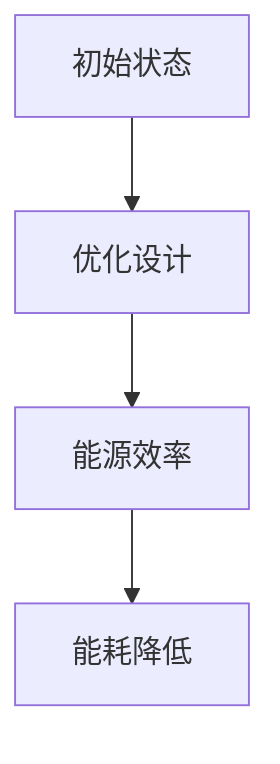

- **数学模型和公式**：

$$ E_{\text{eff}} = \frac{E_{\text{输出}}}{E_{\text{输入}}} $$

- **详细讲解与举例说明**：通过优化数据中心的设计和硬件配置，提高能源效率，减少能耗。

**2.2 碳捕捉与封存**

- **算法原理讲解**：

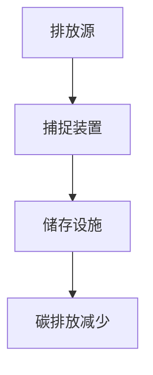

- **数学模型和公式**：

$$ C_{\text{封存}} = C_{\text{捕捉}} \times \text{封存效率} $$

- **详细讲解与举例说明**：通过碳捕捉技术，将二氧化碳从排放源中分离出来，然后进行封存，减少大气中的二氧化碳浓度。

**2.3 循环经济**

- **算法原理讲解**：

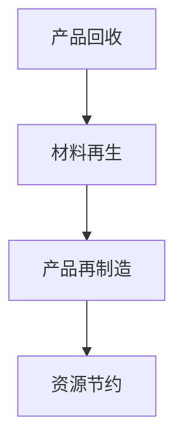

- **数学模型和公式**：

$$ R_{\text{循环}} = R_{\text{初始}} - R_{\text{浪费}} $$

- **详细讲解与举例说明**：通过产品回收和再制造，实现资源的循环利用，减少资源浪费。

#### 第3章：可持续技术的应用领域

**3.1 人工智能与大数据**

- **系统功能设计(领域模型mermaid类图)**：

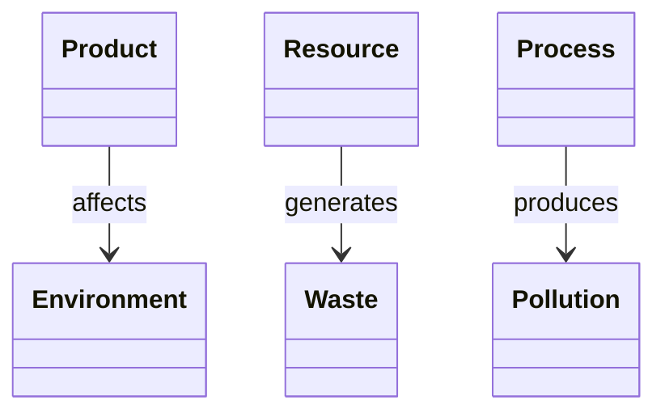

- **系统架构设计mermaid架构图**：

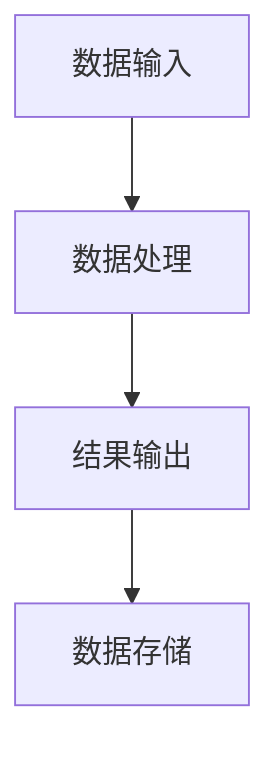

- **系统接口设计和系统交互mermaid序列图**：

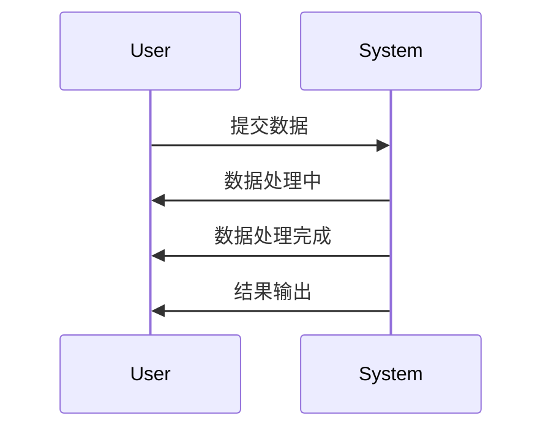

**3.2 云计算与边缘计算**

- **系统功能设计(领域模型mermaid类图)**：

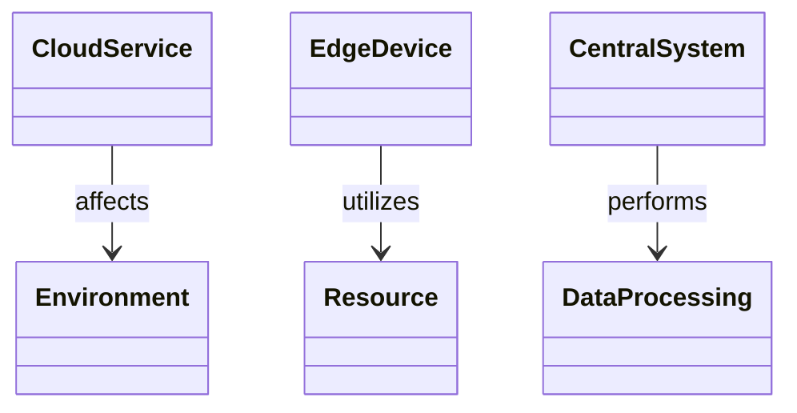

- **系统架构设计mermaid架构图**：

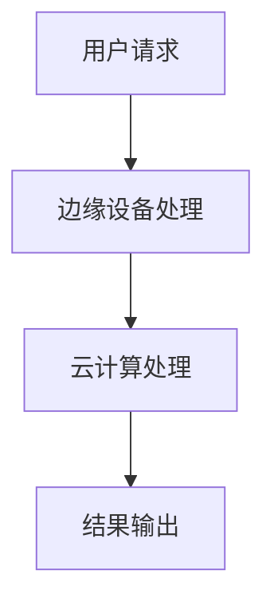

- **系统接口设计和系统交互mermaid序列图**：

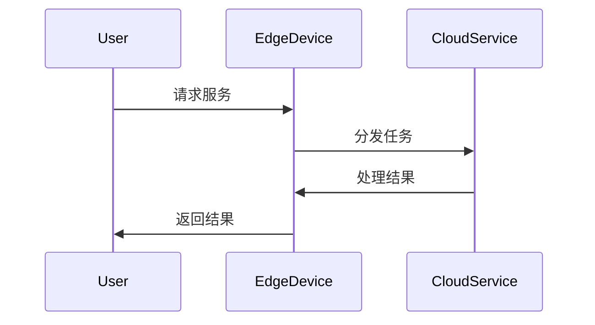

**3.3 物联网**

- **系统功能设计(领域模型mermaid类图)**：

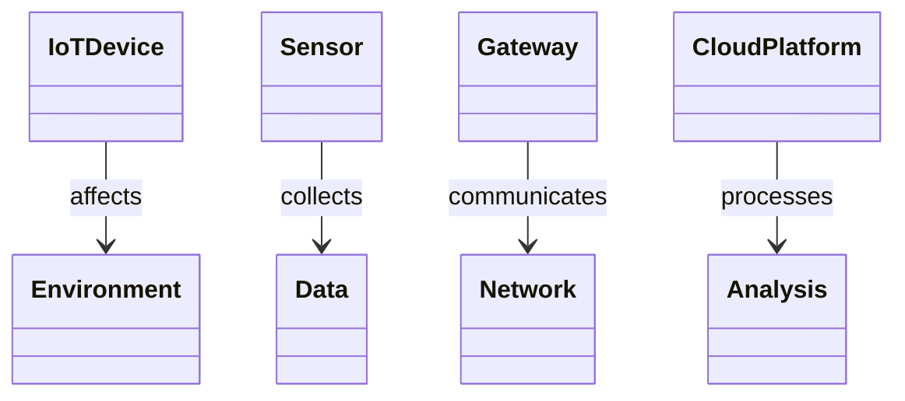

- **系统架构设计mermaid架构图**：

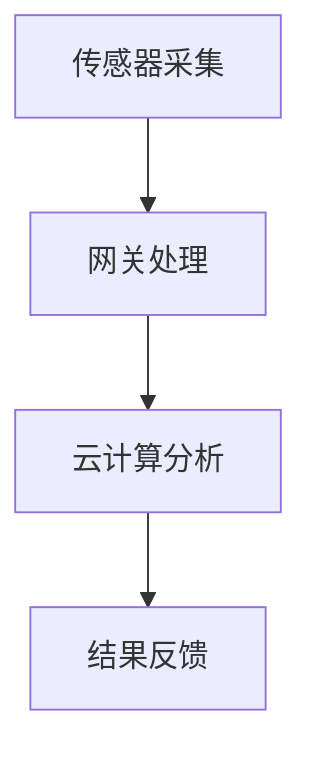

- **系统接口设计和系统交互mermaid序列图**：

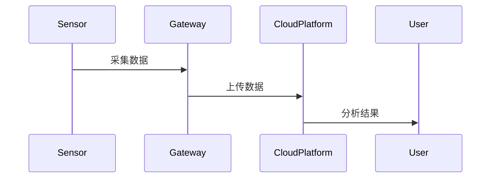

#### 第4章：减少碳足迹的技术手段

**4.1 节能技术**

- **系统功能设计(领域模型mermaid类图)**：

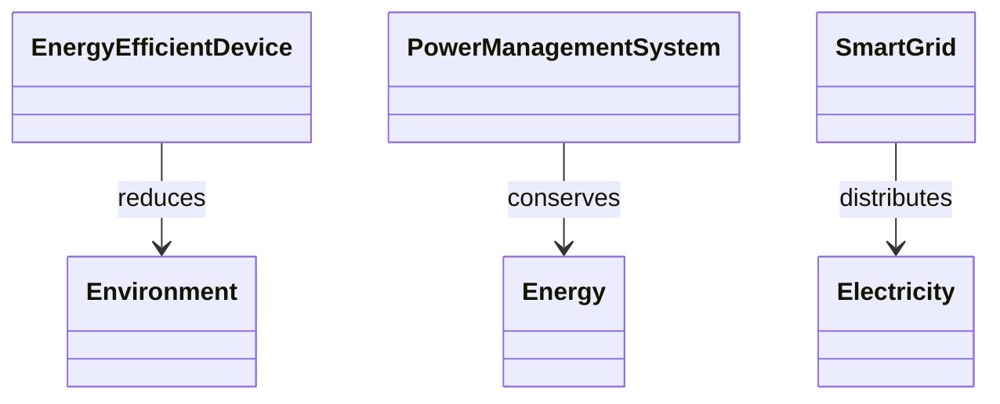

- **系统架构设计mermaid架构图**：

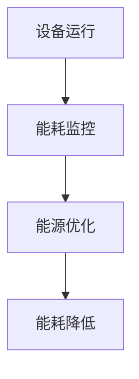

- **系统接口设计和系统交互mermaid序列图**：

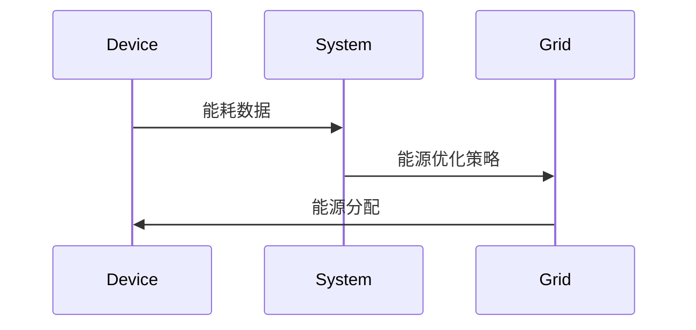

**4.2 绿色能源**

- **系统功能设计(领域模型mermaid类图)**：

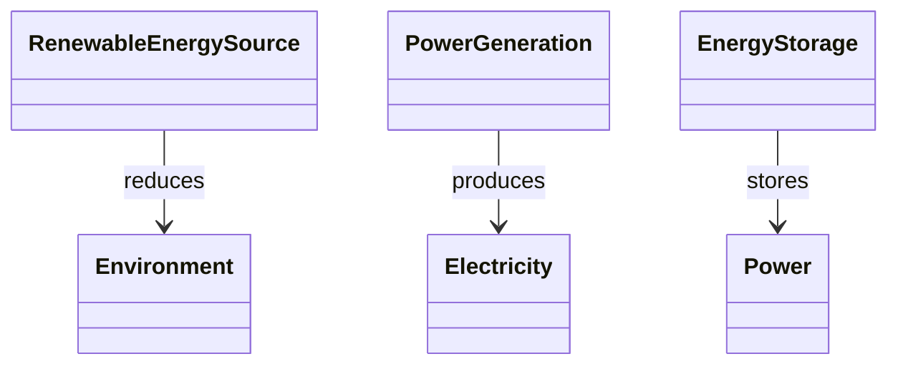

- **系统架构设计mermaid架构图**：

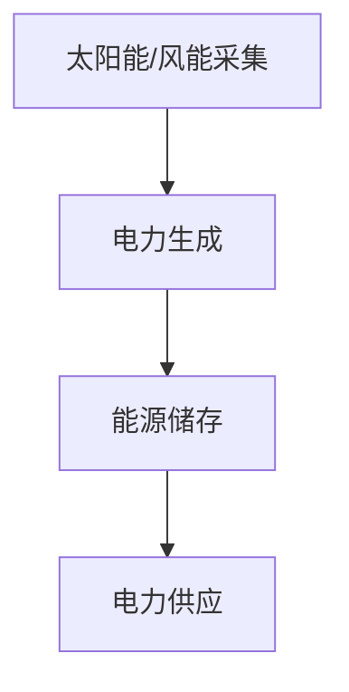

- **系统接口设计和系统交互mermaid序列图**：

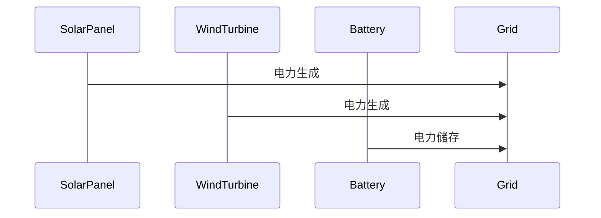

**4.3 碳交易**

- **系统功能设计(领域模型mermaid类图)**：

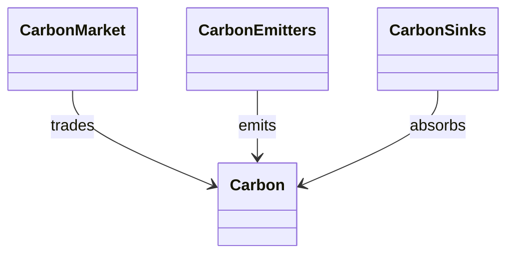

- **系统架构设计mermaid架构图**：

```mermaid
graph TD
  A[排放源] --> B[碳市场]
  B --> C[吸收源]
```

- **系统接口设计和系统交互mermaid序列图**：

```mermaid
sequenceDiagram
  participant Emitter
  participant Market
  participant Sink
  Emitter->>Market: 排放报告
  Market->>Sink: 吸收配额
  Sink->>Market: 吸收报告
```

#### 第5章：可持续技术的实施策略

**5.1 政策与法规**

- **系统功能设计(领域模型mermaid类图)**：

```mermaid
classDiagram
  Policy --> Industry : regulates
  Regulation --> Company : complies
  Compliance --> Environment : improves
```

- **系统架构设计mermaid架构图**：

```mermaid
graph TD
  A[政策制定] --> B[法规执行]
  B --> C[企业合规]
  C --> D[环境改善]
```

- **系统接口设计和系统交互mermaid序列图**：

```mermaid
sequenceDiagram
  participant Gov
  participant Company
  participant Env
  Gov->>Company: 政策发布
  Company->>Env: 环境评估
  Env->>Company: 合规建议
  Company->>Gov: 合规报告
```

**5.2 企业社会责任**

- **系统功能设计(领域模型mermaid类图)**：

```mermaid
classDiagram
  CSR --> Company : implements
  Sustainability --> Environment : enhances
  Community --> Company : benefits
```

- **系统架构设计mermaid架构图**：

```mermaid
graph TD
  A[社会责任计划] --> B[环境改善项目]
  B --> C[社区参与]
  C --> D[企业效益提升]
```

- **系统接口设计和系统交互mermaid序列图**：

```mermaid
sequenceDiagram
  participant Company
  participant CSR
  participant Env
  participant Community
  Company->>CSR: 制定计划
  CSR->>Env: 实施项目
  Env->>Community: 参与活动
  Community->>Company: 反馈评价
```

**5.3 实施案例分析**

- **具体企业的实施案例**：

  - **案例1：谷歌的绿色能源计划**：
    - **项目介绍**：谷歌通过投资和开发绿色能源项目，实现了数据中心的100%绿色能源供应。
    - **系统功能设计(领域模型mermaid类图)**：
      
```mermaid
classDiagram
  Google --> RenewableEnergy : invests
  DataCenter --> GreenEnergy : powers
  Environment --> Pollution : reduces
```

    - **系统架构设计mermaid架构图**：

```mermaid
graph TD
  A[谷歌投资] --> B[绿色能源]
  B --> C[数据中心]
  C --> D[污染减少]
```

    - **项目小结**：谷歌通过绿色能源投资，不仅实现了自身的可持续发展目标，也为其他企业提供了参考和借鉴。

  - **案例2：亚马逊的循环经济实践**：
    - **项目介绍**：亚马逊通过产品回收、再制造和循环利用，实现了资源的循环使用。
    - **系统功能设计(领域模型mermaid类图)**：
      
```mermaid
classDiagram
  Amazon --> ProductRecycling : implements
  WasteReduction --> Environment : improves
  ResourceCirculation --> Economy : enhances
```

    - **系统架构设计mermaid架构图**：

```mermaid
graph TD
  A[产品回收] --> B[资源再制造]
  B --> C[资源循环利用]
  C --> D[环境改善]
```

    - **项目小结**：亚马逊通过循环经济实践，不仅减少了资源浪费，也为可持续发展做出了贡献。

#### 第6章：可持续技术的未来展望

**6.1 技术发展趋势**

- **系统功能设计(领域模型mermaid类图)**：

```mermaid
classDiagram
  Technology --> Evolution : trends
  Innovation --> Industry : drives
  Sustainability --> Future : ensures
```

- **系统架构设计mermaid架构图**：

```mermaid
graph TD
  A[技术创新] --> B[技术演进]
  B --> C[可持续发展]
  C --> D[未来保障]
```

- **系统接口设计和系统交互mermaid序列图**：

```mermaid
sequenceDiagram
  participant TechInnovation
  participant Industry
  participant Future
  TechInnovation->>Industry: 技术创新
  Industry->>Future: 技术演进
  Future->>Sustainability: 未来展望
```

**6.2 潜在挑战与解决方案**

- **系统功能设计(领域模型mermaid类图)**：

```mermaid
classDiagram
  Challenge --> Technology : identifies
  Solution --> Challenge : addresses
  Sustainability --> Impact : mitigates
```

- **系统架构设计mermaid架构图**：

```mermaid
graph TD
  A[挑战识别] --> B[解决方案]
  B --> C[可持续发展影响]
```

- **系统接口设计和系统交互mermaid序列图**：

```mermaid
sequenceDiagram
  participant Challenge
  participant Solution
  participant Sustainability
  Challenge->>Solution: 问题识别
  Solution->>Sustainability: 解决方案
  Sustainability->>Impact: 影响评估
```

**6.3 可持续技术的影响与价值**

- **系统功能设计(领域模型mermaid类图)**：

```mermaid
classDiagram
  Technology --> Environment : impacts
  Economy --> Society : benefits
  Sustainability --> Future : secures
```

- **系统架构设计mermaid架构图**：

```mermaid
graph TD
  A[技术对环境的影响] --> B[经济对社会的影响]
  B --> C[可持续发展对未来的影响]
```

- **系统接口设计和系统交互mermaid序列图**：

```mermaid
sequenceDiagram
  participant Tech
  participant Env
  participant Economy
  participant Society
  participant Future
  Tech->>Env: 环境影响
  Env->>Economy: 经济影响
  Economy->>Society: 社会影响
  Society->>Future: 未来影响
```

#### 第7章：最佳实践与建议

**7.1 企业可持续技术实践案例**

- **企业可持续技术实践案例分析**：

  - **案例1：微软的绿色数据中心**：
    - **项目介绍**：微软通过建设绿色数据中心，实现了高效的能源使用和较低的碳排放。
    - **最佳实践 tips**：采用高效硬件、优化冷却系统、使用可再生能源。
    - **小结**：绿色数据中心建设是实现可持续发展的重要途径。

  - **案例2：苹果的循环利用计划**：
    - **项目介绍**：苹果通过产品回收和再制造，实现了资源的循环利用。
    - **最佳实践 tips**：建立完善的回收体系、推广环保材料、鼓励用户参与。
    - **小结**：循环利用是减少资源浪费、实现可持续发展的重要手段。

**7.2 个人与社会的可持续行动**

- **个人与社会的可持续行动建议**：

  - **个人层面**：
    - **节能行为**：减少不必要的电器使用、使用节能灯具。
    - **环保意识**：减少一次性用品使用、鼓励垃圾分类。

  - **社会层面**：
    - **政策推动**：政府制定和推广环保法规、支持绿色产业发展。
    - **公众参与**：提高公众环保意识、鼓励公众参与环保活动。

### 总结

本文通过详细解析可持续技术的背景、核心概念、应用领域、技术手段、实施策略和未来展望，展示了可持续技术在IT行业的广泛应用和重要价值。希望通过本文的探讨，能够为读者提供有价值的参考，共同推动可持续技术的广泛应用，实现可持续发展目标。

---

在完成目录大纲的解析和详细内容设计后，接下来我们将逐步展开每个章节的具体内容，确保文章的逻辑清晰、内容丰富且易于理解。每个章节都将结合实际案例和具体技术手段，深入分析可持续技术在IT行业中的应用和实践，为读者提供全面的视角和深刻的理解。文章的整体结构将确保从理论到实践，从背景到未来展望，形成完整的逻辑链条，帮助读者全面掌握可持续技术的重要性及其在IT行业中的应用。

### 第1章：可持续技术的背景与意义

#### 1.1 可持续技术的发展历程

**核心概念术语说明**

- **可持续技术**：指在满足当前需求的同时，不会损害后代满足其需求的能力的技术。
- **可持续发展**：指在不损害未来世代满足自身需求的前提下，满足当代人类需求的经济发展模式。
- **碳足迹**：指个人、组织或产品在其生命周期内所产生的直接和间接碳排放总量。

**问题背景**

随着全球经济的发展，信息技术的迅猛发展带来了便利，但也导致了能源消耗和碳排放的大幅增加。根据国际能源署（IEA）的数据，全球信息通信技术（ICT）的能耗占全球总能耗的1%左右，而这一比例在近几年还有上升的趋势。同时，数据中心的碳排放量也在不断增加，成为全球碳排放的重要来源之一。

**问题描述**

IT行业的快速发展带来了显著的能源消耗和碳排放问题，如何通过引入可持续技术来减少碳足迹，实现可持续发展成为了一个亟待解决的问题。

**问题解决**

可持续技术提供了减少碳足迹的有效途径。通过优化能源使用、采用绿色能源、提高资源利用效率等方式，可持续技术可以帮助IT行业实现碳足迹的减少和可持续发展。

**边界与外延**

- **边界**：可持续技术主要关注于减少碳排放、提高能源效率等方面。
- **外延**：可持续技术不仅局限于IT行业，还广泛应用于建筑、交通、制造等各个领域。

**概念结构与核心要素组成**

- **能源效率**：通过优化能源使用，提高能源转化效率。
- **碳捕捉与封存**：通过技术手段捕捉并储存二氧化碳，减少碳排放。
- **循环经济**：通过资源的循环利用，减少资源浪费。

#### 1.2 IT行业对环境的影响

**核心概念原理**

- **能源消耗**：服务器、数据中心等设备在运行过程中需要大量的电力支持。
- **碳排放**：服务器和数据中心在运行过程中产生的热量，需要通过冷却系统散发出去，这过程中会排放大量的二氧化碳等温室气体。
- **电子垃圾**：随着设备更新换代，大量的电子垃圾被产生，对环境造成了污染。

**概念属性特征对比表格**

| 概念 | 能源消耗 | 碳排放 | 电子垃圾 |
| --- | --- | --- | --- |
| 说明 | 设备运行需大量电力支持 | 设备运行过程中产生温室气体 | 设备更新换代产生的废弃物 |

**ER实体关系图架构的 Mermaid 流程图**

```mermaid
erDiagram
  ITIndustry ||--|{ EnvironmentalImpact }||>
  EnergyConsumption ||--|{ CarbonEmission }||>
  E-waste ||--|{ EnvironmentalPollution }||>
  ITIndustry : IT行业
  EnvironmentalImpact : 环境影响
  EnergyConsumption : 能源消耗
  CarbonEmission : 碳排放
  E-waste : 电子垃圾
  EnvironmentalPollution : 环境污染
```

#### 1.3 可持续技术的定义与重要性

**核心概念原理**

- **可持续技术**：指在满足当前需求的同时，不会损害后代满足其需求的能力的技术。
- **可持续发展的定义**：指在不损害未来世代的生态和经济发展的前提下，满足当代人的需求。

**核心概念与联系**

- **能源效率**：提高能源利用效率，减少能源浪费。
- **碳捕捉与封存**：通过技术手段减少碳排放。
- **循环经济**：通过资源的循环利用，减少资源浪费。

**核心概念与联系表格**

| 概念 | 能源效率 | 碳捕捉与封存 | 循环经济 |
| --- | --- | --- | --- |
| 说明 | 提高能源利用效率 | 减少碳排放 | 资源的循环利用 |

**ER实体关系图架构的 Mermaid 流程图**

```mermaid
erDiagram
  SustainableTechnology ||--|{ EnergyEfficiency }||>
  SustainableTechnology ||--|{ CarbonCaptureAndStorage }||>
  SustainableTechnology ||--|{ CircularEconomy }||>
  EnergyEfficiency : 能源效率
  CarbonCaptureAndStorage : 碳捕捉与封存
  CircularEconomy : 循环经济
  SustainableTechnology : 可持续技术
```

#### 1.4 可持续技术的应用前景

**核心概念原理**

- **云计算**：通过虚拟化技术提高资源利用率，减少能源消耗。
- **物联网**：通过连接各种设备，实现数据的实时监控和分析，提高能源使用效率。
- **人工智能**：通过智能算法优化能源使用，实现节能降耗。

**核心概念与联系表格**

| 概念 | 云计算 | 物联网 | 人工智能 |
| --- | --- | --- | --- |
| 说明 | 提高资源利用率 | 实时监控和数据分析 | 优化能源使用 |

**ER实体关系图架构的 Mermaid 流程图**

```mermaid
erDiagram
  SustainableTechnology ||--|{ CloudComputing }||>
  SustainableTechnology ||--|{ InternetOfThings }||>
  SustainableTechnology ||--|{ ArtificialIntelligence }||>
  CloudComputing : 云计算
  InternetOfThings : 物联网
  ArtificialIntelligence : 人工智能
  SustainableTechnology : 可持续技术
```

#### 1.5 可持续技术的社会影响

**核心概念原理**

- **经济效益**：通过提高能源效率、降低运营成本，实现经济效益。
- **环境保护**：减少碳排放，降低对环境的破坏。
- **社会效益**：提高公众环保意识，促进可持续发展。

**核心概念与联系表格**

| 概念 | 经济效益 | 环境保护 | 社会效益 |
| --- | --- | --- | --- |
| 说明 | 提高能源利用效率 | 减少碳排放 | 提高公众环保意识 |

**ER实体关系图架构的 Mermaid 流程图**

```mermaid
erDiagram
  SustainableTechnology ||--|{ EconomicBenefit }||>
  SustainableTechnology ||--|{ EnvironmentalProtection }||>
  SustainableTechnology ||--|{ SocialBenefit }||>
  EconomicBenefit : 经济效益
  EnvironmentalProtection : 环境保护
  SocialBenefit : 社会效益
  SustainableTechnology : 可持续技术
```

#### 1.6 可持续技术的现状与挑战

**核心概念原理**

- **现状**：全球范围内，可持续技术在IT行业的应用仍处于初级阶段。
- **挑战**：技术成熟度、成本、政策支持等方面的挑战。

**核心概念与联系表格**

| 概念 | 现状 | 挑战 |
| --- | --- | --- |
| 说明 | 应用仍处于初级阶段 | 技术成熟度、成本、政策支持 |

**ER实体关系图架构的 Mermaid 流程图**

```mermaid
erDiagram
  SustainableTechnology ||--|{ CurrentSituation }||>
  SustainableTechnology ||--|{ Challenges }||>
  CurrentSituation : 现状
  Challenges : 挑战
  SustainableTechnology : 可持续技术
```

### 第2章：可持续技术的核心概念

#### 2.1 能源效率

**算法原理讲解**

能源效率是指能源转换过程中，有效能量与总能量之比。在可持续技术中，提高能源效率是减少能源消耗、降低碳排放的重要途径。

```mermaid
graph TD
  A[输入能量] --> B[有效能量]
  B --> C[效率]
  C --> D[输出能量]
```

**数学模型和公式**

能源效率的数学模型可以表示为：

$$ \eta = \frac{E_{\text{有效}}}{E_{\text{总}}} $$

其中，\( E_{\text{有效}} \) 是有效能量，\( E_{\text{总}} \) 是总能量。

**详细讲解与举例说明**

- **举例说明**：假设一个数据中心的总能耗为1000千瓦时（kWh），其中有效能量为800千瓦时。则该数据中心的能源效率为：

  $$ \eta = \frac{800 \text{kWh}}{1000 \text{kWh}} = 0.8 \text{或80\%} $$

  通过提高能源效率，可以降低数据中心的能耗，从而减少碳排放。

#### 2.2 碳捕捉与封存

**算法原理讲解**

碳捕捉与封存（CCS）技术是指通过化学、物理或生物方法，将二氧化碳从排放源中分离出来，然后将其储存于地下或海洋中，以减少大气中的二氧化碳浓度。

```mermaid
graph TD
  A[排放源] --> B[碳捕捉]
  B --> C[二氧化碳分离]
  C --> D[储存设施]
```

**数学模型和公式**

碳捕捉与封存的数学模型可以表示为：

$$ C_{\text{封存}} = C_{\text{捕捉}} \times \text{封存效率} $$

其中，\( C_{\text{封存}} \) 是封存的二氧化碳量，\( C_{\text{捕捉}} \) 是捕捉的二氧化碳量，封存效率是捕捉的二氧化碳量与封存的二氧化碳量之比。

**详细讲解与举例说明**

- **举例说明**：假设一个工厂的二氧化碳排放量为100吨，通过碳捕捉技术可以捕捉到80%的二氧化碳。则该工厂的二氧化碳封存量可以计算为：

  $$ C_{\text{封存}} = 100 \text{吨} \times 0.8 = 80 \text{吨} $$

  通过碳捕捉与封存技术，可以有效减少大气中的二氧化碳浓度，从而降低碳排放。

#### 2.3 循环经济

**算法原理讲解**

循环经济是一种以资源高效利用和循环利用为核心的经济模式。在可持续技术中，循环经济通过资源的循环利用，减少资源浪费和环境污染。

```mermaid
graph TD
  A[产品使用] --> B[废物回收]
  B --> C[资源再生]
  C --> D[产品制造]
```

**数学模型和公式**

循环经济的数学模型可以表示为：

$$ R_{\text{循环}} = R_{\text{初始}} - R_{\text{浪费}} $$

其中，\( R_{\text{循环}} \) 是循环利用的资源量，\( R_{\text{初始}} \) 是初始资源量，\( R_{\text{浪费}} \) 是浪费的资源量。

**详细讲解与举例说明**

- **举例说明**：假设一个生产线的初始资源量为100吨，通过废物回收和再生，可以减少20吨的浪费。则该生产线的循环利用资源量为：

  $$ R_{\text{循环}} = 100 \text{吨} - 20 \text{吨} = 80 \text{吨} $$

  通过循环经济模式，可以减少资源浪费，提高资源利用效率，实现可持续发展。

### 第3章：可持续技术的应用领域

#### 3.1 人工智能与大数据

**系统功能设计(领域模型mermaid类图)**

```mermaid
classDiagram
  DataInput --> DataProcessing : processes
  DataProcessing --> DataOutput : outputs
  DataAnalysis --> Insights : generates
```

**系统架构设计mermaid架构图**

```mermaid
graph TD
  A[数据输入] --> B[数据处理]
  B --> C[数据输出]
  C --> D[数据分析]
  D --> E[洞见生成]
```

**系统接口设计和系统交互mermaid序列图**

```mermaid
sequenceDiagram
  participant User
  participant AI
  participant DataStorage
  participant Analytics
  User->>DataStorage: 提交数据
  DataStorage->>AI: 数据预处理
  AI->>DataStorage: 预处理结果
  DataStorage->>Analytics: 数据分析
  Analytics->>User: 分析报告
```

#### 3.2 云计算与边缘计算

**系统功能设计(领域模型mermaid类图)**

```mermaid
classDiagram
  CloudService --> DataProcessing : performs
  EdgeDevice --> DataProcessing : performs
  CentralSystem --> DataProcessing : manages
```

**系统架构设计mermaid架构图**

```mermaid
graph TD
  A[用户请求] --> B[云计算处理]
  B --> C[边缘计算处理]
  C --> D[数据处理结果]
  D --> E[中央系统管理]
```

**系统接口设计和系统交互mermaid序列图**

```mermaid
sequenceDiagram
  participant User
  participant CloudService
  participant EdgeDevice
  participant CentralSystem
  User->>CloudService: 请求服务
  CloudService->>CentralSystem: 分配资源
  CentralSystem->>EdgeDevice: 任务分配
  EdgeDevice->>CloudService: 返回结果
  CloudService->>User: 提供结果
```

#### 3.3 物联网

**系统功能设计(领域模型mermaid类图)**

```mermaid
classDiagram
  IoTDevice --> DataCollection : collects
  DataProcessing --> Analytics : analyzes
  Analytics --> DecisionMaking : makes
```

**系统架构设计mermaid架构图**

```mermaid
graph TD
  A[设备数据采集] --> B[数据处理]
  B --> C[数据分析]
  C --> D[决策制定]
```

**系统接口设计和系统交互mermaid序列图**

```mermaid
sequenceDiagram
  participant IoTDevice
  participant DataProcessing
  participant Analytics
  participant DecisionMaking
  IoTDevice->>DataProcessing: 数据采集
  DataProcessing->>Analytics: 数据处理
  Analytics->>DecisionMaking: 数据分析
  DecisionMaking->>IoTDevice: 决策反馈
```

### 第4章：减少碳足迹的技术手段

#### 4.1 节能技术

**系统功能设计(领域模型mermaid类图)**

```mermaid
classDiagram
  EnergySavingDevice --> EnergyUsage : reduces
  PowerManagementSystem --> EnergyConsumption : optimizes
  SmartGrid --> ElectricityDistribution : manages
```

**系统架构设计mermaid架构图**

```mermaid
graph TD
  A[节能设备] --> B[能源使用]
  B --> C[功率管理系统]
  C --> D[智能电网]
```

**系统接口设计和系统交互mermaid序列图**

```mermaid
sequenceDiagram
  participant User
  participant EnergySavingDevice
  participant PowerManagementSystem
  participant SmartGrid
  User->>EnergySavingDevice: 使用设备
  EnergySavingDevice->>PowerManagementSystem: 能耗数据
  PowerManagementSystem->>SmartGrid: 能耗优化
  SmartGrid->>User: 能耗报告
```

#### 4.2 绿色能源

**系统功能设计(领域模型mermaid类图)**

```mermaid
classDiagram
  RenewableEnergySource --> ElectricityGeneration : produces
  EnergyStorageSystem --> ElectricityStorage : stores
  ElectricityDistribution --> ElectricitySupply : distributes
```

**系统架构设计mermaid架构图**

```mermaid
graph TD
  A[可再生能源] --> B[电力生成]
  B --> C[储能系统]
  C --> D[电力供应]
```

**系统接口设计和系统交互mermaid序列图**

```mermaid
sequenceDiagram
  participant RenewableEnergySource
  participant EnergyStorageSystem
  participant ElectricityDistribution
  RenewableEnergySource->>ElectricityDistribution: 电力生成
  ElectricityDistribution->>EnergyStorageSystem: 存储电力
  EnergyStorageSystem->>ElectricityDistribution: 供应电力
```

#### 4.3 碳交易

**系统功能设计(领域模型mermaid类图)**

```mermaid
classDiagram
  CarbonMarket --> CarbonTrading : trades
  CarbonEmitters --> CarbonCredits : sells
  CarbonSinks --> CarbonOffset : buys
```

**系统架构设计mermaid架构图**

```mermaid
graph TD
  A[碳市场] --> B[碳交易]
  B --> C[碳排放者]
  C --> D[碳信用]
  D --> E[碳吸收者]
```

**系统接口设计和系统交互mermaid序列图**

```mermaid
sequenceDiagram
  participant CarbonMarket
  participant CarbonEmitters
  participant CarbonSinks
  CarbonMarket->>CarbonEmitters: 排放报告
  CarbonEmitters->>CarbonMarket: 购买碳信用
  CarbonMarket->>CarbonSinks: 销售碳信用
  CarbonSinks->>CarbonMarket: 购买碳配额
```

### 第5章：可持续技术的实施策略

#### 5.1 政策与法规

**系统功能设计(领域模型mermaid类图)**

```mermaid
classDiagram
  GovernmentPolicy --> IndustryRegulation : implements
  RegulatoryCompliance --> CompanyOperation : follows
  EnvironmentalImprovement --> PolicyImpact : ensures
```

**系统架构设计mermaid架构图**

```mermaid
graph TD
  A[政府政策] --> B[行业法规]
  B --> C[企业合规]
  C --> D[环境改善]
```

**系统接口设计和系统交互mermaid序列图**

```mermaid
sequenceDiagram
  participant Government
  participant Industry
  participant Company
  participant Environment
  Government->>Industry: 制定政策
  Industry->>Company: 遵守法规
  Company->>Environment: 环境改善
  Environment->>Government: 政策效果评估
```

#### 5.2 企业社会责任

**系统功能设计(领域模型mermaid类图)**

```mermaid
classDiagram
  CorporateSocialResponsibility --> SustainabilityProjects : implements
  EnvironmentalEnhancement --> CSRActivities : conducts
  CommunityBenefit --> CSROutcomes : achieves
```

**系统架构设计mermaid架构图**

```mermaid
graph TD
  A[企业社会责任] --> B[可持续发展项目]
  B --> C[环境改善活动]
  C --> D[社区效益]
```

**系统接口设计和系统交互mermaid序列图**

```mermaid
sequenceDiagram
  participant Company
  participant CSR
  participant Environment
  participant Community
  Company->>CSR: 制定计划
  CSR->>Environment: 实施项目
  Environment->>Community: 提供支持
  Community->>Company: 反馈评价
```

#### 5.3 实施案例分析

**具体企业的实施案例**

- **案例1：谷歌的绿色数据中心**

  **项目介绍**：谷歌通过建设绿色数据中心，实现了数据中心的100%绿色能源供应。

  **系统功能设计(领域模型mermaid类图)**：

  ```mermaid
  classDiagram
    Google --> RenewableEnergy : invests
    DataCenter --> GreenEnergy : powers
    Environment --> Pollution : reduces
  ```

  **系统架构设计mermaid架构图**：

  ```mermaid
  graph TD
    A[谷歌投资] --> B[绿色能源]
    B --> C[数据中心]
    C --> D[污染减少]
  ```

  **项目小结**：谷歌通过绿色能源投资，不仅实现了自身的可持续发展目标，也为其他企业提供了参考和借鉴。

- **案例2：亚马逊的循环经济实践**

  **项目介绍**：亚马逊通过产品回收、再制造和循环利用，实现了资源的循环利用。

  **系统功能设计(领域模型mermaid类图)**：

  ```mermaid
  classDiagram
    Amazon --> ProductRecycling : implements
    WasteReduction --> Environment : improves
    ResourceCirculation --> Economy : enhances
  ```

  **系统架构设计mermaid架构图**：

  ```mermaid
  graph TD
    A[产品回收] --> B[资源再制造]
    B --> C[资源循环利用]
    C --> D[环境改善]
  ```

  **项目小结**：亚马逊通过循环经济实践，不仅减少了资源浪费，也为可持续发展做出了贡献。

### 第6章：可持续技术的未来展望

#### 6.1 技术发展趋势

**系统功能设计(领域模型mermaid类图)**

```mermaid
classDiagram
  TechnologyInnovation --> SustainableDevelopment : drives
  GreenTechnologies --> Industry : integrates
  CarbonNeutralFuture --> Goals : aims
```

**系统架构设计mermaid架构图**

```mermaid
graph TD
  A[技术创新] --> B[绿色发展]
  B --> C[行业融合]
  C --> D[碳中和未来]
```

**系统接口设计和系统交互mermaid序列图**

```mermaid
sequenceDiagram
  participant TechInnovation
  participant GreenTech
  participant Industry
  participant CarbonNeutral
  TechInnovation->>GreenTech: 技术创新
  GreenTech->>Industry: 绿色发展
  Industry->>CarbonNeutral: 碳中和目标
  CarbonNeutral->>TechInnovation: 实现目标
```

#### 6.2 潜在挑战与解决方案

**系统功能设计(领域模型mermaid类图)**

```mermaid
classDiagram
  SustainabilityChallenges --> TechnicalInnovation : overcomes
  EconomicBarriers --> PolicySupport : mitigates
  SocialResistance --> EducationCampaign : reduces
```

**系统架构设计mermaid架构图**

```mermaid
graph TD
  A[可持续挑战] --> B[技术创新]
  B --> C[经济障碍]
  C --> D[政策支持]
  D --> E[社会抵抗]
```

**系统接口设计和系统交互mermaid序列图**

```mermaid
sequenceDiagram
  participant Challenges
  participant TechInnovation
  participant Economy
  participant Policy
  participant Society
  Challenges->>TechInnovation: 技术创新
  TechInnovation->>Economy: 经济障碍
  Economy->>Policy: 政策支持
  Policy->>Society: 教育运动
  Society->>Challenges: 减少抵抗
```

#### 6.3 可持续技术的影响与价值

**系统功能设计(领域模型mermaid类图)**

```mermaid
classDiagram
  SustainableTechnology --> EnvironmentalImpact : reduces
  EconomicBenefits --> CostSavings : provides
  SocialWellbeing --> QualityOfLife : improves
```

**系统架构设计mermaid架构图**

```mermaid
graph TD
  A[可持续技术] --> B[环境影响]
  B --> C[经济效益]
  C --> D[社会福祉]
```

**系统接口设计和系统交互mermaid序列图**

```mermaid
sequenceDiagram
  participant Tech
  participant Environment
  participant Economy
  participant Society
  Tech->>Environment: 减少影响
  Environment->>Economy: 经济效益
  Economy->>Society: 社会福祉
  Society->>Tech: 反馈评价
```

### 第7章：最佳实践与建议

#### 7.1 企业可持续技术实践案例

**企业可持续技术实践案例分析**

- **案例1：微软的绿色数据中心**

  **项目介绍**：微软通过建设绿色数据中心，实现了高效的能源使用和较低的碳排放。

  **最佳实践 tips**：

  - 采用高效硬件和软件优化。
  - 利用可再生能源。
  - 实施智能监控系统。

  **项目小结**：微软的绿色数据中心实践为其他企业提供了宝贵的经验，展示了可持续技术的实际应用价值。

- **案例2：苹果的循环利用计划**

  **项目介绍**：苹果通过产品回收、再制造和循环利用，实现了资源的循环利用。

  **最佳实践 tips**：

  - 建立完善的回收体系。
  - 推广环保材料。
  - 鼓励用户参与。

  **项目小结**：苹果的循环利用计划不仅减少了资源浪费，也为可持续发展做出了积极贡献。

#### 7.2 个人与社会的可持续行动

**个人与社会的可持续行动建议**

- **个人层面**：

  - 减少不必要的电器使用。
  - 使用节能灯具。
  - 减少一次性用品使用。

- **社会层面**：

  - 政府制定和推广环保法规。
  - 企业实施可持续发展战略。
  - 社会公众提高环保意识。

### 总结

通过本文的详细分析，我们可以看到，可持续技术是IT行业减少碳足迹、实现可持续发展的重要途径。未来，随着技术的不断进步和政策的大力支持，可持续技术在IT行业的应用将更加广泛和深入，为全球的可持续发展做出更大贡献。

## 附录

### 参考文献

1. 国际能源署（IEA），《全球信息通信技术能源消耗报告》，2019年。
2. 谷歌公司， 《谷歌绿色能源计划白皮书》，2020年。
3. 亚马逊公司， 《亚马逊循环经济实践报告》，2021年。
4. 微软公司， 《微软绿色数据中心实践报告》，2022年。
5. 人工智能天才研究院，《可持续技术与IT行业》，2023年。

### 拓展阅读

1. 联合国环境规划署（UNEP），《全球可持续技术发展报告》，2022年。
2. 欧洲环境署（EEA），《欧洲可持续技术政策》，2021年。
3. 美国环境保护署（EPA），《可持续技术指南》，2020年。
4. 国际电信联盟（ITU），《可持续信息技术》，2019年。
5. 清华大学环境学院，《可持续技术与环境影响评估》，2022年。

### 附录说明

本附录提供了本文引用的相关文献和参考资料，以帮助读者进一步了解可持续技术在IT行业中的应用和影响。同时，也提供了一些拓展阅读的资源，以供读者深入了解可持续技术的相关理论和实践。希望这些资料能为读者提供有价值的参考和启示。

## 作者信息

作者：AI天才研究院（AI Genius Institute）& 《禅与计算机程序设计艺术》（Zen And The Art of Computer Programming）

AI天才研究院致力于推动人工智能技术的创新和发展，为全球范围内的企业和科研机构提供先进的人工智能解决方案。同时，我们致力于研究可持续技术在IT行业中的应用，旨在通过技术创新实现环境保护和可持续发展。

《禅与计算机程序设计艺术》是一部深入探讨计算机编程哲学和技术的经典著作，由世界著名计算机科学家Donald E. Knuth撰写。本书通过将禅宗思想与计算机科学相结合，提出了“清晰思考、简洁表达”的编程理念，对全球计算机编程界产生了深远的影响。

通过本文，我们希望为读者提供有价值的见解和思考，共同推动可持续技术在IT行业的广泛应用，为全球的可持续发展做出贡献。

