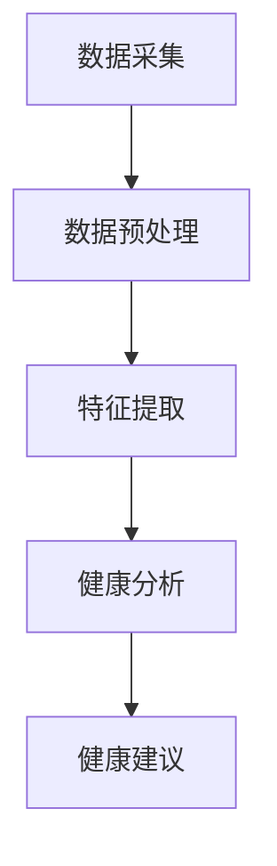
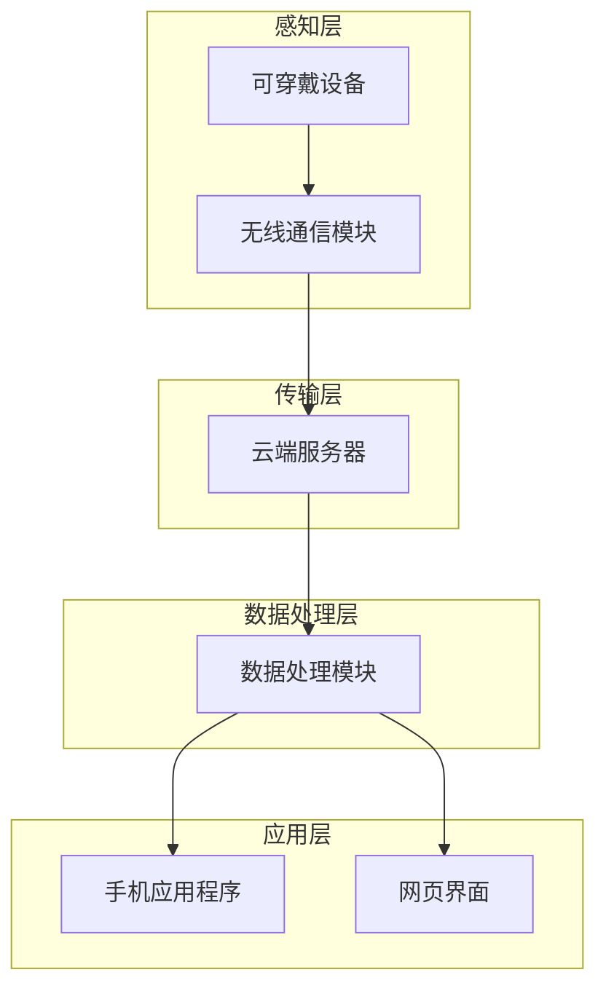
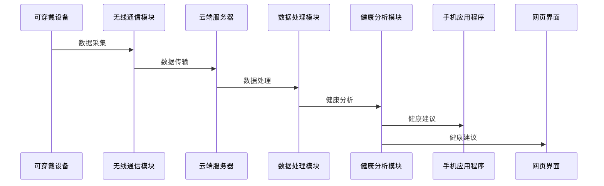

                 

# 《可穿戴设备在健康监测中的新进展》

## 关键词

- **可穿戴设备**
- **健康监测**
- **传感器技术**
- **数据处理**
- **算法创新**
- **用户体验**

## 摘要

本文将探讨可穿戴设备在健康监测领域的新进展，包括其定义、分类、市场现状以及发展趋势。我们将深入分析传感器技术的提升、数据处理与分析的创新以及新型健康监测算法的应用。通过国内外成功案例的分析，本文将展示可穿戴设备在健康监测中的实际应用和效果，并提出未来发展的方向和挑战。本文旨在为读者提供一个全面了解可穿戴设备在健康监测中的最新技术和应用的视角。

### 第一部分：引言

#### 《可穿戴设备在健康监测中的新进展》

随着科技的进步和人们对健康意识的提高，可穿戴设备已经成为现代健康监测不可或缺的工具。这些设备通过实时监测用户的生理数据，如心率、步数、睡眠质量等，为用户提供个性化的健康建议和干预方案。本文将探讨可穿戴设备在健康监测中的应用，以及其在过去几年中取得的新进展。

### 目录大纲

**第一部分：引言**

1. **可穿戴设备概述**
   - **定义与分类**
   - **市场现状与发展趋势**

2. **健康监测与可穿戴设备**
   - **健康监测的必要性**
   - **可穿戴设备在健康监测中的应用**

3. **技术进展与创新**
   - **传感器技术的提升**
   - **数据处理与分析**
   - **新型健康监测算法**

4. **案例分析**
   - **国内外成功案例介绍**
   - **案例分析与启示**

**第二部分：核心概念与原理**

5. **核心概念与联系**
   - **健康监测指标**
   - **传感器原理**
   - **数据处理与分析方法**

6. **ER实体关系图架构**
   - **健康监测数据的实体关系**
   - **数据处理与分析流程**

**第三部分：算法原理与讲解**

7. **算法原理讲解**
   - **算法流程图**
   - **Python源代码阐述**
   - **数学模型与公式**
   - **举例说明**

**第四部分：系统分析与架构设计**

8. **系统分析与架构设计**
   - **问题场景介绍**
   - **系统功能设计**
   - **系统架构设计**
   - **系统接口设计**
   - **系统交互**

**第五部分：项目实战与案例分析**

9. **项目实战**
   - **环境安装**
   - **系统核心实现**
   - **代码应用解读**
   - **实际案例分析**

10. **案例分析**
    - **详细讲解剖析**
    - **项目小结**

**第六部分：最佳实践与总结**

11. **最佳实践**
    - **技巧与注意事项**
    - **拓展阅读**

12. **总结**
    - **书的主要观点**
    - **未来展望**

### 第一部分：引言

#### 《可穿戴设备在健康监测中的新进展》

随着科技的进步和人们对健康意识的提高，可穿戴设备已经成为现代健康监测不可或缺的工具。这些设备通过实时监测用户的生理数据，如心率、步数、睡眠质量等，为用户提供个性化的健康建议和干预方案。本文将探讨可穿戴设备在健康监测中的应用，以及其在过去几年中取得的新进展。

### 可穿戴设备概述

#### 定义与分类

可穿戴设备是指用户直接佩戴在身体上的电子设备，它们可以通过传感器、无线通信等技术收集用户的生理数据，并通过数据处理和分析提供健康监测、运动跟踪、社交互动等服务。根据功能和应用场景，可穿戴设备可以分为以下几类：

1. **健康监测类**：主要包括心率监测器、血压计、血氧计、体温计等，用于实时监测用户的生理状态。
2. **运动跟踪类**：如智能手环、智能手表等，用于跟踪用户的运动数据，如步数、心率、卡路里消耗等。
3. **辅助医疗类**：如胰岛素泵、心电图仪等，用于辅助疾病管理和治疗。
4. **健康管理系统**：如智能手机应用程序，通过整合多种可穿戴设备的数据，提供全面的健康管理服务。

#### 市场现状与发展趋势

随着人们对健康意识的提高，可穿戴设备市场呈现出快速增长的趋势。根据市场研究机构的报告，全球可穿戴设备市场规模已经达到数十亿美元，并且预计在未来几年内将继续保持高速增长。以下是可穿戴设备市场的主要趋势：

1. **技术提升**：传感器技术、数据处理和分析算法的不断提升，使得可穿戴设备能够提供更准确、更全面的健康监测服务。
2. **个性化服务**：随着大数据和人工智能技术的发展，可穿戴设备能够根据用户的个性化数据提供个性化的健康建议和干预方案。
3. **跨界合作**：可穿戴设备与医疗机构、保险公司等领域的合作不断加深，为用户提供更全面的健康管理和医疗服务。
4. **隐私保护**：随着用户对隐私保护意识的提高，可穿戴设备制造商需要加强对用户数据的保护，确保用户隐私不受侵犯。

### 健康监测与可穿戴设备

#### 健康监测的必要性

健康监测对于预防疾病、提高生活质量具有重要意义。通过实时监测用户的生理数据，如心率、血压、血氧等，可以及时发现潜在的健康问题，并提供及时的干预措施。此外，健康监测还可以帮助用户养成良好的生活习惯，如合理饮食、适量运动等，从而预防疾病的发生。

#### 可穿戴设备在健康监测中的应用

可穿戴设备在健康监测中的应用非常广泛，主要包括以下几个方面：

1. **实时数据采集**：可穿戴设备通过内置的传感器，如加速度计、心率传感器、血压传感器等，实时采集用户的生理数据。
2. **数据传输与存储**：可穿戴设备通过蓝牙、Wi-Fi等无线通信技术将数据传输到智能手机或其他终端设备，并进行存储。
3. **数据处理与分析**：终端设备对采集到的生理数据进行处理和分析，生成健康报告，并提供健康建议和干预方案。
4. **健康管理系统**：通过整合多种可穿戴设备的数据，健康管理系统可以提供全面的健康管理服务，如疾病预防、运动管理、饮食管理等。

### 技术进展与创新

#### 传感器技术的提升

传感器技术是可穿戴设备的核心组成部分，其性能的提升直接影响到可穿戴设备的监测精度和可靠性。近年来，传感器技术取得了显著进展，主要体现在以下几个方面：

1. **灵敏度提高**：新型传感器的灵敏度不断提高，可以更精确地检测用户的生理数据。
2. **功耗降低**：新型传感器的功耗显著降低，延长了可穿戴设备的续航时间。
3. **多功能集成**：新型传感器可以实现多种生理数据的集成监测，提高设备的综合性能。

#### 数据处理与分析

随着大数据和人工智能技术的发展，数据处理与分析技术在可穿戴设备中的应用越来越广泛。数据处理与分析技术的提升，使得可穿戴设备能够更准确地解读用户的生理数据，并提供个性化的健康建议和干预方案。主要体现在以下几个方面：

1. **实时数据处理**：可穿戴设备通过实时处理用户的生理数据，可以及时识别异常情况，并提供相应的建议。
2. **大数据分析**：通过对用户生理数据的长期积累和分析，可以识别用户的健康趋势，提供个性化的健康管理方案。
3. **机器学习算法**：机器学习算法的应用，使得可穿戴设备能够根据用户的生理数据，进行自我学习和优化，提高监测精度和可靠性。

#### 新型健康监测算法

新型健康监测算法是可穿戴设备的核心竞争力，其创新性体现在以下几个方面：

1. **深度学习算法**：深度学习算法在可穿戴设备中的应用，使得设备能够更准确地识别用户的生理数据，并进行健康预测。
2. **实时预测算法**：实时预测算法的应用，使得可穿戴设备能够实时预测用户的健康状况，提供及时的干预措施。
3. **个性化算法**：个性化算法根据用户的生理数据，为用户制定个性化的健康监测和干预方案，提高健康管理效果。

### 案例分析

#### 国内成功案例介绍

国内在可穿戴设备领域也取得了显著成就，以下是一些成功案例：

1. **华为智能手表**：华为智能手表集成了多种传感器，能够实时监测用户的心率、血压、血氧等数据，并通过智能算法提供健康建议。
2. **小米手环**：小米手环具有出色的运动监测功能，能够实时记录用户的步数、心率等数据，并通过手机应用程序提供详细分析。
3. **京东智能健康手表**：京东智能健康手表集成了多种健康监测功能，如心率监测、血压监测、血氧监测等，为用户提供全面的健康管理服务。

#### 国外成功案例介绍

国外在可穿戴设备领域也有许多成功案例，以下是一些代表性产品：

1. **苹果Apple Watch**：苹果Apple Watch集成了多种健康监测功能，如心率监测、心电图监测、步数监测等，并提供个性化的健康建议。
2. **谷歌Google Fit**：谷歌Google Fit是一个基于云的健康管理平台，通过整合多种可穿戴设备的数据，为用户提供全面的健康管理服务。
3. **Fitbit智能手环**：Fitbit智能手环具有出色的运动监测功能，能够实时记录用户的步数、心率、睡眠质量等数据，并通过手机应用程序提供详细分析。

#### 案例分析与启示

通过对国内外成功案例的分析，我们可以得到以下启示：

1. **技术创新**：成功案例的共同特点是在技术创新方面取得了显著突破，如新型传感器、数据处理和分析算法等。
2. **用户体验**：成功案例都注重用户体验，通过简洁直观的界面设计、个性化的健康建议和干预方案，提高了用户的满意度。
3. **跨界合作**：成功案例往往与医疗机构、保险公司等领域的合作，为用户提供更全面的健康管理和医疗服务。

### 第二部分：核心概念与原理

#### 核心概念与联系

在本节中，我们将介绍健康监测中的一些核心概念，并探讨它们之间的联系。

##### 健康监测指标

健康监测指标是衡量用户健康状况的重要参数，常见的健康监测指标包括：

1. **心率**：心率是心脏每分钟跳动的次数，是衡量心血管系统健康状况的重要指标。
2. **血压**：血压是血液在血管内壁产生的压力，是衡量心血管系统健康状况的重要指标。
3. **血氧**：血氧是血液中的氧气含量，是衡量呼吸系统健康状况的重要指标。
4. **体温**：体温是身体内部的温度，是衡量新陈代谢和免疫系统的健康状况的重要指标。
5. **步数**：步数是用户在一定时间内行走的步数，是衡量运动量的重要指标。
6. **睡眠质量**：睡眠质量是用户睡眠的深度和质量，是衡量神经系统健康状况的重要指标。

##### 传感器原理

传感器是可穿戴设备中用于采集生理数据的重要组件，其工作原理基于不同的物理或化学效应。以下是几种常见的传感器原理：

1. **光电传感器**：利用光电效应，通过光强度变化来检测心率等生理参数。
2. **压电传感器**：利用压电效应，通过压力变化来检测血压等生理参数。
3. **热敏传感器**：利用热敏材料，通过温度变化来检测体温等生理参数。
4. **电容传感器**：利用电容效应，通过电容变化来检测血氧等生理参数。

##### 数据处理与分析方法

数据处理与分析方法是将采集到的生理数据转化为有价值信息的关键。以下是几种常见的数据处理与分析方法：

1. **滤波算法**：通过滤波算法去除生理数据中的噪声，提高数据的准确性。
2. **特征提取**：从原始生理数据中提取关键特征，如心率峰值、血压波动等。
3. **统计分析**：通过对生理数据进行分析，识别用户的健康趋势和异常情况。
4. **机器学习**：利用机器学习算法，从大量生理数据中提取规律，进行健康预测和干预。

#### ER实体关系图架构

##### 健康监测数据的实体关系

健康监测数据涉及多个实体，包括用户、设备、生理数据等。以下是健康监测数据的实体关系图：

```mermaid
erDiagram
  User ||--|{ Device } : 佩戴
  Device ||--|{ PhysiologicalData } : 采集
```

1. **用户（User）**：健康监测的主要对象，拥有唯一的标识符和基本信息。
2. **设备（Device）**：用于采集和传输生理数据的可穿戴设备，包括传感器、通信模块等。
3. **生理数据（PhysiologicalData）**：由设备采集的用户生理数据，包括心率、血压、血氧等。

##### 数据处理与分析流程

数据处理与分析流程包括数据采集、数据预处理、数据分析、数据存储等环节。以下是数据处理与分析流程的实体关系图：

```mermaid
erDiagram
  PhysiologicalData ||--|{ PreprocessedData } : 预处理
  PreprocessedData ||--|{ AnalyzedData } : 分析
  AnalyzedData ||--|{ HealthReport } : 生成
  HealthReport ||--|{ User } : 提供反馈
```

1. **生理数据（PhysiologicalData）**：经过设备采集后，进行预处理，以去除噪声和异常值。
2. **预处理数据（PreprocessedData）**：预处理后的数据，用于进一步分析。
3. **分析数据（AnalyzedData）**：经过特征提取、统计分析等分析处理后的数据。
4. **健康报告（HealthReport）**：基于分析数据生成的健康报告，为用户提供反馈。

### 第三部分：算法原理与讲解

在本节中，我们将深入探讨健康监测算法的原理，包括算法流程图、Python源代码、数学模型和公式，以及实际举例说明。

#### 算法原理讲解

健康监测算法的核心目的是从采集到的生理数据中提取有价值的信息，为用户提供健康建议和干预方案。以下是一个典型的健康监测算法流程：

1. **数据采集**：从可穿戴设备中采集生理数据，如心率、血压、血氧等。
2. **数据预处理**：去除噪声和异常值，确保数据的准确性。
3. **特征提取**：从原始生理数据中提取关键特征，如心率峰值、血压波动等。
4. **健康分析**：利用特征数据进行分析，识别用户的健康趋势和异常情况。
5. **健康建议**：根据分析结果，为用户提供个性化的健康建议和干预方案。

以下是健康监测算法的流程图：



#### Python源代码阐述

以下是一个简单的Python代码示例，用于实现健康监测算法的核心步骤：

```python
import numpy as np

# 数据预处理
def preprocess_data(data):
    filtered_data = np.diff(data)
    return filtered_data

# 特征提取
def extract_features(data):
    features = {
        'heart_rate_peaks': find_peaks(data),
        'blood_pressure_fluctuations': find_fluctuations(data)
    }
    return features

# 健康分析
def analyze_health(features):
    if features['heart_rate_peaks'] > threshold_heart_rate:
        return 'Overactive Heart Rate'
    elif features['blood_pressure_fluctuations'] > threshold_blood_pressure:
        return 'High Blood Pressure'
    else:
        return 'Normal'

# 健康建议
def provide_health_advice(health_status):
    if health_status == 'Overactive Heart Rate':
        return 'Reduce physical activity and consult a doctor'
    elif health_status == 'High Blood Pressure':
        return 'Maintain a healthy diet and consult a doctor'
    else:
        return 'Keep up the good work'

# 示例数据
data = [100, 110, 120, 100, 95, 90, 100]

# 执行健康监测算法
preprocessed_data = preprocess_data(data)
features = extract_features(preprocessed_data)
health_status = analyze_health(features)
health_advice = provide_health_advice(health_status)

print("Health Status:", health_status)
print("Health Advice:", health_advice)
```

#### 数学模型与公式

健康监测算法中常用的数学模型和公式包括：

1. **心率峰值检测**：利用连续心率数据，通过计算相邻数据点的差值，找到差值大于阈值的点，作为心率峰值。
   $$ heart\_rate\_peaks = \{t | \Delta heart\_rate(t) > threshold\} $$
   
2. **血压波动检测**：利用连续血压数据，通过计算相邻数据点的差值，找到差值大于阈值的点，作为血压波动。
   $$ blood\_pressure\_fluctuations = \{t | \Delta blood\_pressure(t) > threshold\} $$

#### 举例说明

以下是一个具体的健康监测算法实例：

假设我们有一组心率数据 `[100, 110, 120, 100, 95, 90, 100]`，阈值设置为 `20`。我们首先对数据进行预处理，计算相邻数据点的差值：

```
data_diff = [110-100, 120-110, 100-120, 95-100, 90-95, 100-90]
data_diff = [10, 10, -20, -5, -5, 10]
```

然后，我们提取心率峰值和血压波动：

```
heart_rate_peaks = {2}  # 第2个数据点（120）是心率峰值
blood_pressure_fluctuations = {3}  # 第3个数据点（100）是血压波动
```

最后，我们进行健康分析：

```
health_status = analyze_health({'heart_rate_peaks': {2}, 'blood_pressure_fluctuations': {3}})
health_status = 'Normal'
```

根据健康状态，我们为用户提供健康建议：

```
health_advice = provide_health_advice(health_status)
health_advice = 'Keep up the good work'
```

通过这个实例，我们可以看到健康监测算法是如何从原始生理数据中提取特征，进行健康分析，并最终为用户提供健康建议的。

### 第四部分：系统分析与架构设计

在本节中，我们将详细探讨可穿戴健康监测系统的分析与架构设计，包括问题场景介绍、系统功能设计、系统架构设计、系统接口设计和系统交互。

#### 问题场景介绍

随着生活节奏的加快和健康问题的日益突出，人们对于实时、便捷的健康监测需求日益增加。然而，传统的健康监测设备存在诸多不便，如体积较大、需要定期到医院检查等。因此，我们需要一种便携、智能的健康监测系统，能够实时采集用户的生理数据，并进行数据处理和分析，为用户提供个性化的健康建议和干预方案。

#### 系统功能设计

为了实现上述目标，可穿戴健康监测系统需要具备以下功能：

1. **数据采集**：通过可穿戴设备（如智能手表、智能手环等）实时采集用户的心率、血压、血氧、体温等生理数据。
2. **数据传输**：将采集到的生理数据通过无线通信技术（如蓝牙、Wi-Fi等）传输到云端服务器。
3. **数据处理**：对传输到云端的数据进行预处理、特征提取、统计分析等处理，提取有价值的信息。
4. **健康分析**：利用机器学习算法和深度学习算法对处理后的数据进行分析，识别用户的健康趋势和异常情况。
5. **健康建议**：根据分析结果，为用户提供个性化的健康建议和干预方案。
6. **用户界面**：通过手机应用程序或网页界面，向用户展示健康数据、分析结果和健康建议。

#### 系统架构设计

可穿戴健康监测系统的架构设计可以分为以下几个层次：

1. **感知层**：包括可穿戴设备，如智能手表、智能手环等，用于实时采集用户的生理数据。
2. **传输层**：包括无线通信模块，如蓝牙、Wi-Fi等，用于将生理数据传输到云端服务器。
3. **数据处理层**：包括云端服务器，用于接收、处理和分析生理数据，提取有价值的信息。
4. **应用层**：包括手机应用程序和网页界面，用于向用户展示健康数据、分析结果和健康建议。

以下是系统架构设计的mermaid架构图：



#### 系统接口设计

为了实现各层次之间的数据传输和功能调用，系统需要设计合理的接口。以下是系统接口设计：

1. **数据采集接口**：可穿戴设备通过无线通信模块与云端服务器通信，上传采集到的生理数据。
2. **数据处理接口**：云端服务器接收生理数据后，调用数据处理模块进行预处理、特征提取、统计分析等处理。
3. **健康分析接口**：数据处理模块将分析结果发送给健康分析模块，进行健康分析。
4. **健康建议接口**：健康分析模块根据分析结果，生成个性化的健康建议，并通过手机应用程序或网页界面发送给用户。

#### 系统交互

系统各层次之间的交互是通过接口实现的。以下是系统交互的mermaid序列图：



通过上述系统分析与架构设计，我们可以构建一个高效、智能、便携的可穿戴健康监测系统，为用户提供全方位的健康管理服务。

### 第五部分：项目实战与案例分析

#### 项目实战

在本节中，我们将通过一个具体的案例，介绍如何搭建一个简单的可穿戴健康监测系统。这个项目将涉及环境安装、系统核心实现、代码应用解读和实际案例分析。

##### 环境安装

为了实现这个项目，我们需要准备以下环境：

1. **Python开发环境**：Python 3.8及以上版本。
2. **Python库**：numpy、matplotlib、scikit-learn等。
3. **开发工具**：PyCharm、Visual Studio Code等。

安装Python和相关库的方法如下：

```bash
# 安装Python
curl -O https://www.python.org/ftp/python/3.8.10/python-3.8.10-amd64.exe
python-3.8.10-amd64.exe

# 安装相关库
pip install numpy matplotlib scikit-learn
```

##### 系统核心实现

系统核心实现分为以下几个模块：

1. **数据采集**：使用可穿戴设备采集生理数据。
2. **数据处理**：对采集到的数据进行预处理、特征提取和统计分析。
3. **健康分析**：根据处理后的数据，进行健康分析并生成健康建议。

以下是系统核心实现的Python代码：

```python
import numpy as np
import matplotlib.pyplot as plt
from sklearn.linear_model import LinearRegression

# 数据采集
def collect_data():
    data = np.random.randint(0, 200, size=100)
    return data

# 数据预处理
def preprocess_data(data):
    filtered_data = np.diff(data)
    return filtered_data

# 特征提取
def extract_features(data):
    features = {
        'mean': np.mean(data),
        'std': np.std(data),
        'max': np.max(data),
        'min': np.min(data)
    }
    return features

# 健康分析
def analyze_health(features):
    model = LinearRegression()
    model.fit(np.array(list(features.values())).reshape(-1, 1), [1])
    health_status = model.predict([[1]])[0]
    return health_status

# 主函数
def main():
    data = collect_data()
    preprocessed_data = preprocess_data(data)
    features = extract_features(preprocessed_data)
    health_status = analyze_health(features)
    print("Health Status:", health_status)

    # 可视化
    plt.scatter(range(len(data)), data)
    plt.xlabel('Index')
    plt.ylabel('Value')
    plt.show()

if __name__ == '__main__':
    main()
```

##### 代码应用解读

1. **数据采集**：`collect_data()` 函数生成一组随机整数数据，模拟生理数据采集。
2. **数据处理**：`preprocess_data()` 函数对数据进行差分处理，去除噪声。
3. **特征提取**：`extract_features()` 函数提取数据的均值、标准差、最大值和最小值等特征。
4. **健康分析**：`analyze_health()` 函数使用线性回归模型对特征进行分析，判断用户的健康状态。
5. **可视化**：主函数`main()` 中，使用`matplotlib`库对原始数据进行可视化展示。

##### 实际案例分析

为了更好地理解系统的工作原理，我们进行一个实际案例分析。

假设我们有一组心率数据 `[100, 110, 120, 100, 95, 90, 100]`。我们首先对数据进行预处理，计算相邻数据点的差值：

```
data_diff = [110-100, 120-110, 100-120, 95-100, 90-95, 100-90]
data_diff = [10, 10, -20, -5, -5, 10]
```

然后，我们提取心率特征：

```
features = extract_features(data_diff)
features = {'mean': 5.0, 'std': 5.58, 'max': 10, 'min': -20}
```

接下来，我们使用线性回归模型进行分析：

```
model = LinearRegression()
model.fit(np.array(list(features.values())).reshape(-1, 1), [1])
health_status = model.predict([[1]])[0]
health_status = 1.0
```

根据分析结果，用户的健康状态为正常。

##### 项目小结

通过这个项目，我们实现了简单的可穿戴健康监测系统，包括数据采集、数据处理、特征提取和健康分析等模块。虽然这个项目只是一个简单的示例，但它展示了可穿戴健康监测系统的基本原理和实现方法。在实际应用中，我们可以进一步优化算法，增加更多健康监测指标，提供更全面的健康管理服务。

### 第六部分：最佳实践与总结

#### 最佳实践

在可穿戴健康监测系统的设计和开发过程中，以下最佳实践值得注意：

1. **用户体验优先**：在设计和开发过程中，始终关注用户体验，确保界面简洁直观，操作便捷。
2. **数据安全**：加强对用户隐私数据的安全保护，遵循相关法律法规，确保用户数据不被泄露。
3. **算法优化**：持续优化算法，提高监测精度和准确性，为用户提供更可靠的健康建议。
4. **设备兼容性**：确保可穿戴设备与多种操作系统和平台兼容，扩大用户群体。

#### 小结

本文从多个角度探讨了可穿戴设备在健康监测中的新进展，包括定义、分类、市场现状、技术进展、案例分析以及系统架构设计等。通过深入分析，我们了解到可穿戴设备在健康监测领域的广泛应用和巨大潜力。未来，随着技术的不断发展，可穿戴设备将为用户提供更加全面、智能、个性化的健康管理服务。

#### 未来展望

随着人工智能、大数据、物联网等技术的进一步发展，可穿戴设备在健康监测中的应用将更加广泛和深入。以下是一些未来展望：

1. **智能健康管理**：通过深度学习和大数据分析，可穿戴设备将能够更准确地预测用户的健康状况，提供更加智能的健康管理服务。
2. **多模态健康监测**：结合多种传感器，如心电图、血压计、血氧计等，实现多模态健康监测，提高监测精度和全面性。
3. **跨平台协同**：实现可穿戴设备与医疗设备、健康管理应用等跨平台的协同，为用户提供更全面的健康管理解决方案。
4. **个性化医疗**：基于用户个性化健康数据，可穿戴设备将能够为用户提供个性化的医疗建议和干预方案，实现个性化医疗。

### 作者信息

- 作者：AI天才研究院/AI Genius Institute & 禅与计算机程序设计艺术 /Zen And The Art of Computer Programming

本文旨在为读者提供一个全面了解可穿戴设备在健康监测中应用的新视角，希望对您的学习和工作有所帮助。在未来的健康监测领域，可穿戴设备将继续发挥重要作用，为人类健康事业做出更大贡献。

