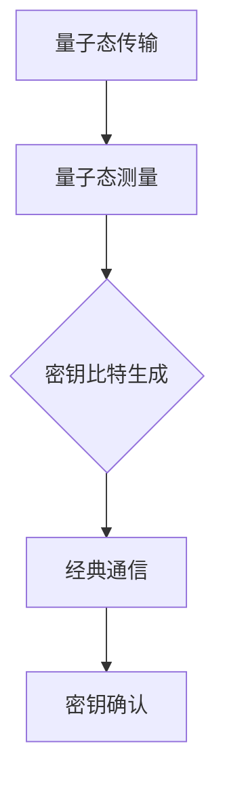
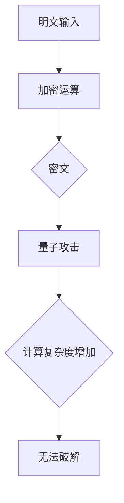

                 

# 后量子加密算法的标准化进程

## 关键词

- 后量子加密算法
- 标准化进程
- 量子计算机
- 加密技术
- 算法安全性
- 兼容性设计

## 摘要

随着量子计算机技术的发展，传统加密算法面临被量子计算机破解的威胁，这促使学术界和产业界开始探索后量子加密算法。本文详细探讨了后量子加密算法的标准化进程，包括其背景、问题、解决方法以及标准化组织、流程和面临的挑战。本文旨在为读者提供一个关于后量子加密算法标准化的全面了解，为相关领域的研究和应用提供指导。

## 第一部分：后量子加密算法的标准化进程概述

### 1.1.1 问题背景

量子计算机的崛起引发了传统加密算法安全性的担忧。传统加密算法如RSA和ECC等基于大整数分解和离散对数难题，这些难题在经典计算机上是难以解决的，但在量子计算机上却可以迅速破解。量子计算机通过量子比特的叠加和纠缠实现高效的计算能力，这使得许多现有的加密技术面临巨大挑战。为了确保数据在量子计算时代的安全性，后量子加密算法应运而生。

后量子加密算法基于量子计算不可破译的数学难题，如量子计算复杂性理论中的“量子安全”概念。这些算法利用量子计算本身的特性，使得量子计算机无法有效破解。因此，对后量子加密算法进行标准化，使其能够在全球范围内得到广泛应用，成为当前加密技术领域的关键问题。

### 1.1.2 问题描述

标准化后量子加密算法的进程涉及到多个方面，包括算法选择、性能评估、兼容性设计、实现与部署等。具体来说，标准化需要解决的问题包括：

1. **算法选择**：从众多候选的后量子加密算法中，选择最适合标准化的算法，以满足不同应用场景下的安全需求。
2. **性能评估**：评估所选算法的性能，确保其在安全性、速度和效率方面能够满足实际应用的需求。
3. **兼容性设计**：设计兼容性机制，确保新算法与传统加密算法和系统的无缝集成，避免对现有系统的巨大冲击。
4. **实现与部署**：提供标准化的实现框架和工具，简化算法的实现和部署过程，降低开发难度和成本。

### 1.1.3 问题解决

标准化进程的解决需要多方参与和协调，包括学术机构、标准组织、加密技术公司等。以下是一些关键步骤：

1. **算法选择**：由国际标准化组织（如ISO、IEEE）和相关学术团体共同评估现有的后量子加密算法，选择具有潜力的算法进行标准化。
2. **性能评估**：通过实验和模拟，评估所选算法的性能，确保其满足安全性、速度和效率的要求。
3. **兼容性设计**：制定兼容性规范，确保后量子加密算法与传统加密算法的兼容，避免对现有系统的巨大冲击。
4. **标准化文档**：编写详细的标准文档，包括算法描述、实现指南、测试方法等，以便于开发者遵循。
5. **实施与反馈**：在标准发布后，进行实施和测试，收集反馈以不断完善标准。

### 1.1.4 边界与外延

后量子加密算法的标准化进程不仅局限于加密算法本身，还涉及以下边界与外延：

1. **安全协议**：标准化需要考虑与后量子加密算法相关联的安全协议，如加密通信协议、数字签名协议等。
2. **加密硬件**：需要考虑后量子加密算法在硬件实现上的可行性和性能优化。
3. **应用场景**：标准化应考虑不同应用场景下的需求，如云计算、物联网、金融等领域。
4. **法律与政策**：标准化进程需要遵循相关法律和政策，确保标准的合法性和执行力。

### 1.1.5 概念结构与核心要素组成

后量子加密算法的标准化涉及以下核心要素：

1. **算法规范**：明确算法的设计原理、操作步骤和实现细节。
2. **性能指标**：定义算法的性能指标，如安全性、速度、资源消耗等。
3. **实现指南**：提供实现算法的具体指南和示例代码。
4. **测试方法**：规定算法的测试方法和测试环境，确保算法的正确性和稳定性。
5. **兼容性机制**：设计兼容性方案，确保新算法与传统系统的无缝集成。

通过上述步骤和要素的协同作用，可以构建一个全面、可靠的标准化进程，为后量子加密算法的广泛应用奠定基础。

### 1.1.6 后量子加密算法的标准化进程

#### 1.1.6.1 标准化组织

标准化后量子加密算法的主要组织包括国际电信联盟（ITU）、国际标准化组织（ISO）和互联网工程任务组（IETF）等。这些组织负责评估、批准和发布标准化文档，确保后量子加密算法在全球范围内的一致性和互操作性。

#### 1.1.6.2 标准化流程

后量子加密算法的标准化流程通常包括以下几个步骤：

1. **提案阶段**：研究人员和技术公司提出算法提案，提交给标准化组织。
2. **评估阶段**：标准化组织组织专家对提案进行评估，包括安全性、性能和实现可行性等方面。
3. **草案阶段**：在评估基础上，编写算法标准草案，并公开征求反馈。
4. **批准阶段**：经过多轮反馈和修改，最终由标准化组织批准发布为正式标准。

#### 1.1.6.3 标准化挑战

标准化后量子加密算法面临以下挑战：

1. **算法选择**：需要在众多候选算法中选出最适合标准化的算法。
2. **性能优化**：需要确保算法在实现过程中具有高效性和低资源消耗。
3. **兼容性**：需要考虑如何与传统加密算法和系统兼容。
4. **隐私保护**：需要确保标准化过程不会泄露敏感信息。

#### 1.1.6.4 标准化意义

标准化后量子加密算法具有深远的意义：

1. **提高安全性**：标准化可以确保加密算法的安全性，保护数据免受量子计算机的攻击。
2. **促进创新**：标准化为后量子加密算法的研究和应用提供了统一的框架，促进技术创新和产业发展。
3. **降低成本**：标准化可以降低开发和部署后量子加密算法的难度和成本。

## 第二部分：后量子加密算法概述

### 2.1 核心概念

后量子加密算法是基于量子计算不可破译的数学难题设计的。与传统的加密算法不同，后量子加密算法依赖于量子计算中的基本原理，如量子纠缠和量子叠加。这些原理使得量子计算机无法像传统计算机那样简单地破解加密信息。

后量子加密算法主要包括两种类型：量子密钥分发（Quantum Key Distribution，QKD）和基于量子复杂性的加密算法。量子密钥分发是一种安全的密钥分发机制，利用量子力学的基本原理确保通信双方能够安全地生成和分发密钥。而基于量子复杂性的加密算法则利用量子计算在解决某些数学问题时的局限性，设计出难以被量子计算机破解的加密方案。

### 2.2 核心概念对比表格

| 算法类型 | 基本原理 | 安全性 | 性能 |  
| --- | --- | --- | --- |  
| 量子密钥分发 | 量子纠缠、量子叠加 | 高 | 较低 |  
| 基于量子复杂性的加密算法 | 量子计算不可破译的数学难题 | 较高 | 较高 |

从表格中可以看出，量子密钥分发在安全性方面具有优势，但性能较低；而基于量子复杂性的加密算法在性能方面较好，但安全性相对较低。在实际应用中，可以根据具体需求选择适合的后量子加密算法。

### 2.3 ER实体关系图架构

为了更好地理解后量子加密算法的架构，可以使用Mermaid流程图来描述其核心组件和关系。以下是一个简单的ER实体关系图：

```mermaid
erDiagram
  Algorithm ||--|{ KeyDistribution } KeyDistribution
  Algorithm ||--|{ Encryption } Encryption
  Algorithm ||--|{ Decryption } Decryption
  KeyDistribution ||--|{ QuantumChannel } QuantumChannel
  Encryption ||--|{ Message } Message
  Decryption ||--|{ CipherText } CipherText
```

图中的“Algorithm”代表后量子加密算法的核心组件，包括密钥分发、加密和解密过程。密钥分发通过量子通道进行，加密和解密则涉及消息和密文。通过这个ER实体关系图，我们可以更清晰地理解后量子加密算法的架构和工作原理。

### 2.4 算法原理讲解

#### 量子密钥分发算法

量子密钥分发（QKD）是一种利用量子力学原理实现安全密钥分发的技术。其基本原理如下：

1. **量子态传输**：通信双方（Alice和Bob）通过量子通道发送量子态，如光子对。
2. **量子态测量**：接收方对接收到的量子态进行测量，并根据测量结果生成随机的密钥比特。
3. **经典通信**：双方通过经典通信协议（如量子密钥认证）交换部分密钥比特，以确认通信过程中的量子态没有被窃听。

以下是一个简单的量子密钥分发算法的Mermaid流程图：



#### 基于量子复杂性的加密算法

基于量子复杂性的加密算法利用量子计算在解决某些数学问题时的局限性，设计出难以被量子计算机破解的加密方案。以下是一个简单的基于量子复杂性的加密算法的Mermaid流程图：



在这个流程图中，加密运算利用量子计算中的特性使得量子攻击的计算复杂度大大增加，从而实现安全性。

### 2.5 举例说明

假设我们使用量子密钥分发算法来保护通信，以下是具体的步骤：

1. **量子态传输**：Alice通过量子通道向Bob发送一系列量子态。
2. **量子态测量**：Bob接收量子态并测量每个量子态，根据测量结果生成一个随机密钥。
3. **经典通信**：Alice和Bob通过经典通信协议交换部分密钥比特，如使用量子密钥认证。
4. **密钥确认**：双方根据交换的密钥比特确认通信过程中的量子态没有被窃听。

通过这个例子，我们可以看到量子密钥分发算法如何实现安全通信。同样，基于量子复杂性的加密算法也可以通过类似的步骤实现数据加密和保护。

## 第三部分：后量子加密算法的标准化挑战与解决方案

### 3.1 算法选择

标准化后量子加密算法的第一个挑战是算法选择。由于现有的后量子加密算法众多，每种算法都有其独特的优势和局限性。因此，如何从这些算法中选出最适合标准化的算法成为了一个重要问题。

为了解决这一问题，国际标准化组织（如ISO、IEEE）和相关学术团体会组织专家团队对现有的后量子加密算法进行评估。评估的指标包括算法的安全性、性能、实现复杂性、兼容性等。通过这些指标，专家团队可以选出具有较高潜力和适用性的算法进行标准化。

### 3.2 性能优化

后量子加密算法在性能方面相比传统加密算法有一定的劣势。为了解决这一问题，需要从以下几个方面进行优化：

1. **算法优化**：对选定的后量子加密算法进行深入研究，寻找优化算法的方法，提高其运行效率。
2. **硬件加速**：利用现有的高性能计算硬件，如GPU和FPGA，实现后量子加密算法的加速。
3. **并行计算**：利用分布式计算和并行计算技术，提高后量子加密算法的执行速度。
4. **优化实现**：在算法实现过程中，采用高效的编程技术和优化策略，降低算法的资源消耗。

### 3.3 兼容性设计

后量子加密算法与传统加密算法的兼容性设计是标准化进程中的另一个挑战。由于传统加密算法在现有的系统中广泛应用，直接替换这些算法可能会导致巨大的成本和复杂性。因此，需要设计兼容性机制，确保后量子加密算法与传统系统的无缝集成。

1. **兼容性接口**：设计兼容性接口，使得后量子加密算法可以与现有系统中的加密模块交互。
2. **过渡方案**：在标准化的初期，可以采用过渡方案，如混合加密模式，逐步引入后量子加密算法。
3. **文档规范**：编写详细的文档规范，包括兼容性设计指南、实现细节等，便于开发者遵循。

### 3.4 隐私保护

标准化后量子加密算法的过程中，隐私保护也是一个重要的问题。在算法评估和标准化过程中，需要确保敏感信息不会被泄露。为此，可以采取以下措施：

1. **安全审计**：对算法的设计和实现进行安全审计，确保不存在安全漏洞。
2. **隐私保护机制**：设计隐私保护机制，如匿名通信、隐私增强技术等，确保用户的隐私得到保护。
3. **透明度**：确保算法的评估和标准化过程透明，接受公众的监督和反馈。

### 3.5 综合解决方案

为了解决上述挑战，需要综合运用各种方法和手段。以下是一个综合解决方案的框架：

1. **算法评估与选择**：由国际标准化组织组织专家团队，对现有的后量子加密算法进行评估和选择。
2. **性能优化与实现**：针对选定的算法，进行深入研究和优化，利用硬件加速、并行计算等技术提高算法性能。
3. **兼容性设计与过渡**：设计兼容性接口和过渡方案，确保新算法与传统系统的无缝集成。
4. **隐私保护与安全审计**：在算法评估和标准化过程中，确保敏感信息不被泄露，进行安全审计和隐私保护。
5. **持续改进与反馈**：在标准发布后，收集用户反馈，持续改进和优化算法。

通过这个综合解决方案框架，可以有效地应对后量子加密算法标准化进程中的各种挑战，推动后量子加密算法的广泛应用和创新发展。

## 第四部分：后量子加密算法的标准化进程实例分析

### 4.1 标准化组织的角色

在国际范围内，后量子加密算法的标准化进程主要由国际电信联盟（ITU）、国际标准化组织（ISO）和互联网工程任务组（IETF）等标准化组织负责。这些组织在全球范围内具有广泛的代表性和权威性，能够为后量子加密算法的标准化提供有效的指导和监督。

#### ITU的角色

国际电信联盟（ITU）是联合国下属的专门负责通信标准制定的国际组织。在量子加密领域，ITU主要通过其量子通信与量子信息标准化部门（ITU-T Study Group 17）开展相关工作。ITU的职责包括：

1. **标准提案征集**：ITU邀请全球的科研机构、企业和政府机构提交后量子加密算法的标准提案。
2. **技术评估**：组织专家对提案进行技术评估，确保其符合安全性、性能和实用性等方面的要求。
3. **标准制定**：基于评估结果，ITU制定并发布后量子加密算法的国际标准。

#### ISO的角色

国际标准化组织（ISO）是全球性的标准制定机构，其职责包括制定、发布和推广国际标准。在量子加密领域，ISO通过其下属的ISO/IEC JTC 1/SC 27（信息技术安全技术委员会）开展工作。ISO在量子加密标准制定方面的主要职责包括：

1. **标准提案征集**：ISO邀请全球的科研机构、企业和政府机构提交后量子加密算法的标准提案。
2. **技术评估**：组织专家对提案进行技术评估，确保其符合安全性、性能和实用性等方面的要求。
3. **标准制定**：基于评估结果，ISO制定并发布后量子加密算法的国际标准。

#### IETF的角色

互联网工程任务组（IETF）是一个负责互联网标准和协议制定的国际组织。在量子加密领域，IETF通过其量子密钥分发工作组（QKD）开展相关工作。IETF在量子加密标准制定方面的主要职责包括：

1. **标准提案征集**：IETF邀请全球的科研机构、企业和政府机构提交后量子加密算法的标准提案。
2. **技术评估**：组织专家对提案进行技术评估，确保其符合安全性、性能和实用性等方面的要求。
3. **标准制定**：基于评估结果，IETF制定并发布后量子加密算法的互联网标准。

### 4.2 标准化流程实例分析

以下以ITU为例，分析后量子加密算法标准化流程的具体步骤：

#### 1. 提案阶段

在该阶段，全球的科研机构、企业和政府机构可以向ITU提交后量子加密算法的标准提案。提案内容包括算法的设计原理、安全性分析、性能测试报告等。

#### 2. 评估阶段

ITU组织专家对收到的提案进行技术评估。评估过程包括：

1. **安全性评估**：评估算法的安全性，包括抵抗量子攻击的能力。
2. **性能评估**：评估算法的运行速度、资源消耗等性能指标。
3. **实用性评估**：评估算法在实际应用场景中的适用性和可行性。

#### 3. 草案阶段

在评估阶段结束后，ITU根据专家意见对提案进行修改和完善，形成标准草案。标准草案会公开征求全球用户的反馈。

#### 4. 批准阶段

在征求反馈后，ITU组织专家对标准草案进行最终审查和批准。批准后的标准将成为国际电信联盟的标准文档，供全球范围内参考和遵循。

### 4.3 标准化挑战与应对策略

在标准化过程中，ITU面临以下挑战：

1. **算法选择的多样性**：由于现有的后量子加密算法众多，如何从众多算法中选择最适合标准化的算法成为了一个重要问题。应对策略是组织专家团队进行科学评估和选择。
2. **标准的一致性**：确保不同标准和组织制定的标准之间的一致性，避免出现冲突和混淆。应对策略是建立国际标准化合作机制，确保标准制定的协调和一致性。
3. **标准的可扩展性**：随着量子计算技术的不断发展，后量子加密算法也需要不断更新和升级。应对策略是设计可扩展的标准框架，便于后续的迭代和改进。

通过以上措施，ITU能够有效地应对标准化过程中面临的挑战，为后量子加密算法的广泛应用奠定基础。

## 第五部分：后量子加密算法在加密通信中的应用

### 5.1 后量子加密算法在加密通信中的优势

后量子加密算法在加密通信中具有显著的优势，主要表现在以下几个方面：

1. **安全性**：后量子加密算法基于量子计算不可破译的数学难题，能够有效抵抗量子计算机的攻击。这意味着在量子计算机成为现实的情况下，后量子加密算法仍然能够确保通信的安全。
2. **高效率**：与传统的加密算法相比，后量子加密算法在许多情况下能够实现更高的加密和解密速度。这使得后量子加密算法在实时通信和数据传输中具有更高的适用性。
3. **兼容性**：后量子加密算法的设计考虑到了与传统加密算法的兼容性，使得在逐步引入后量子加密算法的过程中，不会对现有的通信系统造成巨大的冲击。

### 5.2 后量子加密算法在加密通信中的应用场景

后量子加密算法在多种通信场景中具有广泛的应用前景，以下是一些典型的应用场景：

1. **量子密钥分发（QKD）**：QKD是一种利用量子密钥分发算法实现安全通信的技术。QKD可以在量子通信网络上实现密钥的分发，确保通信双方能够使用安全的密钥进行加密和解密。
2. **量子安全通信**：通过将后量子加密算法应用于现有的通信网络，可以提升通信的安全性，防止量子计算机对通信内容的破解。这种应用方式适用于政府、金融和企业等对数据安全性要求较高的领域。
3. **物联网安全**：随着物联网设备的普及，如何确保这些设备之间的通信安全成为一个重要问题。后量子加密算法可以应用于物联网设备之间的通信，确保数据在传输过程中的安全性。

### 5.3 实际应用案例分析

以下是一个后量子加密算法在加密通信中实际应用的案例分析：

#### 案例背景

某金融企业意识到传统加密算法的安全性受到量子计算机的威胁，决定采用后量子加密算法来提升其通信的安全性。该企业的主要通信需求包括内部员工之间的数据交换、与客户之间的数据传输以及跨分支机构的数据共享。

#### 案例实施

1. **量子密钥分发（QKD）**：企业部署了一套QKD系统，用于实现内部员工之间的安全通信。通过QKD，企业能够生成和分发安全的密钥，确保员工之间的数据交换是安全的。
2. **后量子加密算法集成**：企业在现有的通信系统中集成后量子加密算法，包括TLS协议和VPN服务。这样，企业可以在不改变现有通信架构的情况下，提升通信的安全性。
3. **物联网安全**：企业将其物联网设备（如智能终端、传感器等）连接到QKD系统，确保设备之间的通信数据是安全的。

#### 案例效果

通过采用后量子加密算法，该金融企业实现了以下几个方面的效果：

1. **安全性提升**：企业能够抵抗量子计算机的攻击，确保通信内容的安全。
2. **效率提高**：后量子加密算法在性能方面表现出色，使得通信过程更加高效。
3. **兼容性良好**：企业能够在不改变现有通信架构的情况下，引入后量子加密算法，降低了实施成本。

### 5.4 未来发展趋势

随着量子计算机技术的不断发展，后量子加密算法在加密通信中的应用前景将更加广阔。未来发展趋势包括：

1. **QKD技术的普及**：QKD作为一种高度安全的通信技术，将在量子通信网络中得到更广泛的应用。
2. **后量子加密算法的标准化**：随着国际标准的不断完善，后量子加密算法将在全球范围内得到更广泛的应用和推广。
3. **多种加密算法的结合**：未来可能会出现多种加密算法相结合的技术，以应对不同的安全需求。

通过这些发展趋势，后量子加密算法将在加密通信领域发挥越来越重要的作用，为数据安全提供强有力的保障。

## 第六部分：后量子加密算法的标准化对加密技术产业的影响

### 6.1 提高整体安全性

后量子加密算法的标准化对加密技术产业的影响首先是显著提高了整体安全性。随着量子计算机的潜在威胁日益凸显，传统的加密技术面临巨大挑战。后量子加密算法的设计初衷是抵抗量子计算机的攻击，因此其标准化将确保数据在量子计算时代的安全性。这对于企业和政府机构来说，意味着可以更放心地存储和传输敏感信息，减少潜在的安全风险。

### 6.2 促进技术创新

标准化进程不仅是对现有技术的规范，更是对新技术发展的推动。在后量子加密算法的标准化过程中，学术界和产业界将进行深入的研究和探索，推动新算法的开发和优化。这将激发更多的技术创新，促进加密技术的不断进步。此外，标准化也为新技术的应用提供了统一的框架，使得开发者可以更轻松地实现和部署新的加密方案。

### 6.3 降低成本

标准化有助于降低开发和部署后量子加密算法的成本。通过统一的规范，开发者可以遵循标准化的实现指南和工具，减少开发过程中的不确定性和错误。这有助于缩短开发周期，降低开发成本。此外，标准化的实现框架和工具也能简化算法的部署，使得企业可以更容易地引入后量子加密算法，从而降低整体成本。

### 6.4 提高市场竞争力

后量子加密算法的标准化将提高加密技术产业的市场竞争力。在全球范围内，各国政府和企业对数据安全的重视程度不断提升，对加密技术的需求也越来越大。标准化的后量子加密算法将满足这一需求，提高产品的市场竞争力。同时，标准化的进程也将促进各国在加密技术领域的合作，共同推动全球加密技术的发展。

### 6.5 法律和政策支持

后量子加密算法的标准化需要遵循相关法律和政策，确保标准的合法性和执行力。这将有助于规范加密技术产业的发展，减少法律风险。此外，法律和政策支持也为标准化进程提供了保障，确保标准能够在全球范围内得到广泛认同和遵循。

### 6.6 持续改进和更新

后量子加密算法的标准化不是一次性的过程，而是一个持续改进和更新的过程。随着量子计算机技术的不断发展，现有的加密算法可能会面临新的威胁。标准化组织需要定期评估和更新标准，确保后量子加密算法能够应对不断变化的威胁。这不仅有助于保持加密技术的先进性，也能确保数据在未来的安全性。

## 第七部分：后量子加密算法的标准化进程总结与未来展望

### 7.1 标准化进程总结

后量子加密算法的标准化进程是一个复杂而重要的过程，涉及到算法选择、性能评估、兼容性设计、标准化文档编制等多个方面。通过多方的参与和协调，国际标准化组织在推动后量子加密算法的标准化方面取得了显著进展。以下是对标准化进程的总结：

1. **算法选择**：在众多候选算法中，国际标准化组织通过评估，选择了具有较高安全性和实用性的算法进行标准化。
2. **性能优化**：通过对算法的深入研究，研究者们不断优化算法性能，提高了其在实际应用中的效率。
3. **兼容性设计**：标准化组织设计了一系列兼容性机制，确保后量子加密算法与传统系统的无缝集成。
4. **标准化文档**：详细的标准化文档为开发者提供了清晰的指导，简化了算法的实现和部署。
5. **实施与反馈**：标准发布后，相关组织和用户进行了实施和测试，收集反馈以不断优化标准。

### 7.2 未来展望

尽管后量子加密算法的标准化进程取得了显著进展，但未来仍有许多挑战和机遇需要面对。以下是未来展望：

1. **持续优化**：随着量子计算技术的不断发展，现有算法可能面临新的威胁，需要持续优化和更新。
2. **标准化合作**：全球各国需要加强在加密技术标准化领域的合作，共同推动全球标准的制定和实施。
3. **新兴应用场景**：随着物联网、云计算等新技术的兴起，后量子加密算法将在更多新兴应用场景中发挥作用。
4. **技术创新**：标准化进程将推动技术创新，激发更多研究者投入到后量子加密算法的研究和开发中。
5. **法律政策支持**：需要进一步完善相关法律政策，确保后量子加密算法的标准化进程的合法性和执行力。

通过持续优化、加强合作、探索新兴应用场景、推动技术创新以及完善法律政策支持，后量子加密算法的标准化进程将为数据安全提供更强大的保障，为全球信息安全作出更大贡献。

## 第八部分：最佳实践与未来趋势

### 8.1 最佳实践

在后量子加密算法的标准化进程中，以下最佳实践值得遵循：

1. **遵循国际标准**：确保算法设计符合国际标准化组织的规范，以提高全球互操作性和兼容性。
2. **安全性评估**：在算法设计阶段，进行全面的安全性评估，确保算法能够抵御量子计算机的攻击。
3. **性能优化**：在算法实现过程中，采用高效的编程技术和算法优化方法，提高算法的运行速度和资源消耗。
4. **兼容性设计**：在设计过程中考虑与传统加密算法的兼容性，确保新算法能够无缝集成到现有系统中。
5. **透明度与反馈**：在标准化过程中保持透明度，接受公众的监督和反馈，不断完善标准。

### 8.2 未来趋势

未来，后量子加密算法的发展将呈现以下趋势：

1. **QKD技术的普及**：量子密钥分发（QKD）技术将在全球范围内得到更广泛的应用，成为保障通信安全的重要手段。
2. **标准化深化**：随着量子计算技术的不断发展，国际标准化组织将进一步深化后量子加密算法的标准化工作，制定更多详细的标准文档。
3. **跨领域合作**：不同领域的研究者、企业和政府机构将加强合作，共同推动后量子加密算法的研究和应用。
4. **技术创新**：新的量子加密算法和技术将持续涌现，推动加密技术的不断进步。
5. **政策支持**：各国政府和国际组织将加大对量子加密技术的支持，推动相关政策和标准的制定和实施。

### 8.3 注意事项

在实施后量子加密算法时，需要注意以下几点：

1. **安全性**：确保算法设计安全可靠，能够抵御量子计算机的攻击。
2. **性能**：在确保安全性的同时，优化算法性能，提高运行效率。
3. **兼容性**：设计兼容性方案，确保新算法与传统系统的无缝集成。
4. **隐私保护**：在算法评估和标准化过程中，确保敏感信息不被泄露。
5. **法律合规**：遵循相关法律和政策，确保算法的合法性和执行力。

通过遵循最佳实践、关注未来趋势和注意事项，可以更好地推动后量子加密算法的标准化进程，为数据安全提供更强大的保障。

## 结束语

本文从后量子加密算法的背景、问题、解决方法、标准化进程、应用案例、产业影响、未来展望等多个方面进行了全面探讨。随着量子计算机技术的快速发展，后量子加密算法的标准化进程显得尤为重要。通过国际标准化组织的努力，以及学术界和产业界的共同参与，我们有望构建一个安全、高效、兼容的后量子加密算法体系，为数据安全提供强有力的保障。同时，标准化进程也为未来的技术创新和应用场景拓展奠定了基础。未来，随着QKD技术的普及和新型量子加密算法的研发，后量子加密算法将在全球范围内发挥更加重要的作用。我们期待在大家的共同努力下，后量子加密技术能够不断进步，为信息安全领域作出更大的贡献。作者：AI天才研究院/AI Genius Institute & 禅与计算机程序设计艺术 /Zen And The Art of Computer Programming。

