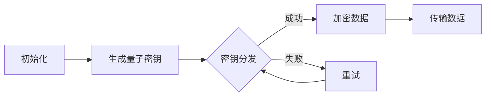
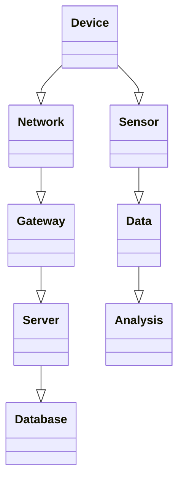
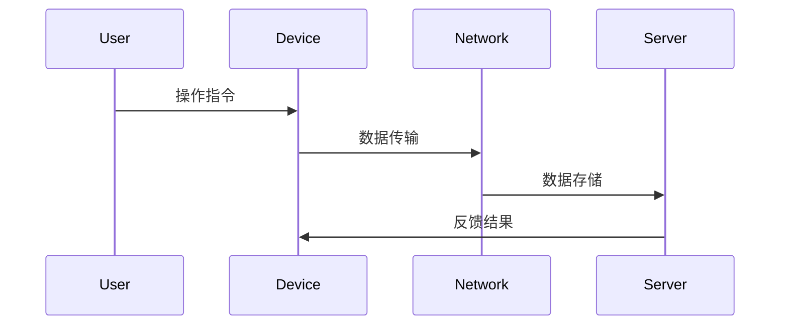
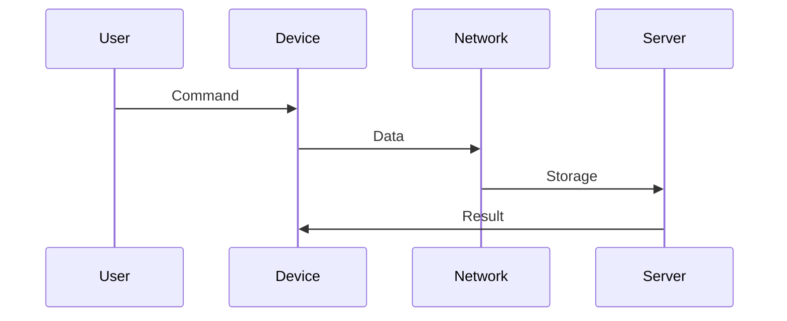

                 

# 后量子密码学在物联网中的应用

> 关键词：后量子密码学、物联网、安全、量子通信、加密算法

> 摘要：随着物联网（IoT）技术的快速发展，其安全性问题日益凸显。传统的密码学方法在面对量子计算机的攻击时显得脆弱。后量子密码学作为量子计算时代的密码学解决方案，在物联网中的应用具有重要意义。本文将从后量子密码学的概述、物联网的需求、后量子密码学在物联网中的应用原理、应用案例以及未来挑战等方面进行详细探讨，以期为物联网安全提供新的思路和方向。

## 目录

1. 后量子密码学概述
    - 量子密码学的起源与发展
    - 后量子密码学的概念与特点
    - 后量子密码学的发展现状与趋势
2. 物联网的基本概念与需求
    - 物联网的概述
    - 物联网的关键技术
    - 物联网的安全需求
3. 后量子密码学在物联网中的应用
    - 后量子密码学在物联网安全中的应用原理
    - 后量子密码学在物联网通信中的应用案例
    - 后量子密码学在物联网数据安全中的应用
    - 后量子密码学在物联网设备安全中的应用
4. 后量子密码学在物联网中的应用前景与挑战
    - 应用前景
    - 应用挑战
5. 结论与展望
    - 研究总结
    - 展望未来

## 第一部分：后量子密码学概述

### 第1章：量子密码学的起源与发展

#### 1.1 量子密码学的起源

量子密码学起源于20世纪90年代，其理论基础是量子力学。量子力学的发现，如量子纠缠、量子叠加态等，为密码学提供了新的思路。量子密码学的概念提出，主要得益于Shor算法的提出，该算法展示了量子计算机在求解大整数因子分解问题上的优势，从而对传统密码学构成了巨大威胁。

#### 1.2 后量子密码学的概念与特点

后量子密码学是指在量子计算威胁下，仍然能够保持安全的密码学方法。后量子密码学具有以下几个核心特点：

- **量子计算对抗性**：后量子密码学设计的主要目标是抵御量子计算机的攻击，确保信息的安全。
- **抗量子攻击**：后量子密码学采用特定的加密算法，确保其安全性不会因量子计算机的问世而受到威胁。
- **量子安全协议**：后量子密码学包括一系列安全协议，如量子密钥分发（QKD）等，用于确保通信过程中的信息安全。

#### 1.3 后量子密码学与经典密码学的区别

后量子密码学与经典密码学有以下几个主要区别：

- **理论基础**：后量子密码学基于量子力学，而经典密码学基于概率论和数论。
- **安全性质**：后量子密码学能够抵抗量子计算机的攻击，而经典密码学在面对量子计算机时可能失效。
- **加密算法**：后量子密码学采用新的加密算法，如Lattice-based密码、Hash-based密码等，而经典密码学主要采用对称加密和非对称加密。

#### 1.4 后量子密码学的发展现状与趋势

目前，后量子密码学已经取得了一系列重要成果。在研究进展方面，各种后量子密码学算法，如NTRU、Lattice-based加密算法等，已经得到了广泛应用。在应用领域方面，后量子密码学已经从实验室研究走向实际应用，如物联网、金融、通信等领域。

未来，后量子密码学将继续发展，可能的发展方向包括：

- **量子安全通信**：利用后量子密码学构建量子安全通信网络。
- **量子密码学标准**：制定统一的量子密码学标准，以规范后量子密码学的应用。
- **量子密码学产业化**：推动后量子密码学的产业化进程，使其成为实际应用的技术。

### 第2章：物联网的基本概念与需求

#### 2.1 物联网的概述

物联网（IoT）是指通过互联网将各种物理设备、传感器、软件系统等连接起来，实现信息的采集、传输、处理和共享。物联网的发展历程可以追溯到20世纪80年代，随着传感器技术、网络技术和数据处理能力的不断提升，物联网逐渐成为全球热点。

物联网的体系结构通常包括感知层、网络层和应用层。感知层负责信息的采集，网络层负责信息的传输，应用层负责信息的处理和应用。

#### 2.2 物联网的关键技术

物联网的关键技术包括：

- **网络通信技术**：物联网的通信技术包括无线传感器网络、云计算、边缘计算等。
- **数据存储与处理技术**：物联网需要处理大量的数据，涉及数据存储、数据挖掘、机器学习等技术。
- **安全防护技术**：物联网面临多种安全威胁，如数据泄露、设备被黑等，因此需要采用各种安全防护技术。

#### 2.3 物联网的安全需求

物联网的安全需求主要包括：

- **数据安全需求**：确保物联网采集、传输和存储的数据不被泄露、篡改或破坏。
- **隐私保护需求**：保护物联网用户的隐私信息，防止隐私泄露。
- **设备安全需求**：确保物联网设备的安全，防止设备被恶意攻击或控制。

### 第二部分：后量子密码学在物联网中的应用

#### 第3章：后量子密码学在物联网安全中的应用原理

后量子密码学在物联网安全中的应用，主要基于其量子计算对抗性、抗量子攻击和量子安全协议等特点。以下将详细探讨后量子密码学在物联网安全中的应用原理。

#### 3.1 后量子密码学的工作原理

后量子密码学的工作原理可以分为两个方面：量子密钥分发（QKD）和后量子加密算法。

- **量子密钥分发（QKD）**：QKD是一种基于量子力学原理的密钥分发技术，它能够确保密钥在传输过程中不会被窃听或篡改。QKD的基本原理是量子纠缠和量子态的不可克隆性。
- **后量子加密算法**：后量子加密算法是一种在量子计算威胁下仍然能够保持安全的加密算法。常见的后量子加密算法包括Lattice-based加密算法、Hash-based加密算法等。

#### 3.2 后量子密码学的安全优势

后量子密码学具有以下几个安全优势：

- **量子计算对抗性**：后量子密码学设计的目标是抵抗量子计算机的攻击，确保信息的安全。
- **抗量子攻击**：后量子密码学采用特定的加密算法，确保其安全性不会因量子计算机的问世而受到威胁。
- **量子安全协议**：后量子密码学包括一系列安全协议，如量子密钥分发（QKD）等，用于确保通信过程中的信息安全。

#### 3.3 后量子密码学在物联网安全中的应用

后量子密码学在物联网安全中的应用主要体现在以下几个方面：

- **数据安全**：利用后量子密码学对物联网采集、传输和存储的数据进行加密，确保数据的安全。
- **隐私保护**：利用后量子密码学保护物联网用户的隐私信息，防止隐私泄露。
- **设备安全**：利用后量子密码学确保物联网设备的安全，防止设备被恶意攻击或控制。

#### 第4章：后量子密码学在物联网通信中的应用案例

后量子密码学在物联网通信中的应用，主要是通过QKD和后量子加密算法来实现通信的安全。以下将介绍几个具体的案例。

#### 4.1 后量子密码学在物联网通信中的挑战

后量子密码学在物联网通信中面临以下挑战：

- **通信距离限制**：QKD的通信距离受到量子纠缠态的衰减影响，如何在有限的通信距离内实现安全的通信是一个挑战。
- **通信速率要求**：物联网通信通常要求高通信速率，如何在保证通信安全的同时满足速率要求是一个挑战。
- **能耗问题**：后量子密码学设备通常需要较高的能耗，如何在保证安全的前提下降低能耗是一个挑战。

#### 4.2 后量子密码学在物联网通信中的应用实例

- **QKD在物联网通信中的应用**：利用QKD技术，可以在物联网通信中实现安全的密钥分发，从而确保通信过程中的信息安全。
- **后量子加密算法在物联网通信中的应用**：利用后量子加密算法，可以在物联网通信中实现数据加密，确保数据在传输过程中的安全。
- **案例分析**：通过具体案例，如物联网智能家居、物联网智能交通等，分析后量子密码学在物联网通信中的应用效果和挑战。

#### 第5章：后量子密码学在物联网数据安全中的应用

后量子密码学在物联网数据安全中的应用，主要是通过量子密钥管理和量子加密算法来实现数据的安全。以下将详细探讨后量子密码学在物联网数据安全中的应用方法。

#### 5.1 后量子密码学在物联网数据安全中的需求

物联网数据安全的需求主要包括：

- **数据加密需求**：确保物联网采集、传输和存储的数据不被泄露、篡改或破坏。
- **数据完整性需求**：确保物联网采集、传输和存储的数据不被篡改。
- **数据可用性需求**：确保物联网采集、传输和存储的数据能够被正常访问和使用。

#### 5.2 后量子密码学在物联网数据安全中的应用方法

后量子密码学在物联网数据安全中的应用方法主要包括：

- **量子密钥管理**：通过量子密钥管理，确保物联网通信过程中的密钥安全，从而保证数据的安全。
- **量子加密算法应用**：通过量子加密算法，对物联网采集、传输和存储的数据进行加密，确保数据在传输过程中的安全。

#### 5.3 案例研究

通过具体案例，如物联网智能医疗、物联网智能物流等，研究后量子密码学在物联网数据安全中的应用效果和挑战。

#### 第6章：后量子密码学在物联网设备安全中的应用

后量子密码学在物联网设备安全中的应用，主要是通过量子密钥生成与分发、后量子加密算法优化等来实现设备安全。以下将详细探讨后量子密码学在物联网设备安全中的应用策略。

#### 6.1 后量子密码学在物联网设备安全中的挑战

后量子密码学在物联网设备安全中面临以下挑战：

- **设备资源的限制**：物联网设备通常资源有限，如何在有限的资源下实现高效安全的密码学功能是一个挑战。
- **设备安全性需求**：物联网设备需要具备较高的安全性，以防止设备被恶意攻击或控制。
- **设备兼容性需求**：后量子密码学算法需要与现有的物联网设备和协议兼容，以确保设备的平滑升级和部署。

#### 6.2 后量子密码学在物联网设备安全中的应用策略

后量子密码学在物联网设备安全中的应用策略主要包括：

- **量子密钥生成与分发**：通过量子密钥生成与分发，确保物联网设备之间的通信安全。
- **后量子加密算法优化**：通过优化后量子加密算法，提高物联网设备的安全性能，同时降低能耗。

#### 6.3 案例分析

通过具体案例，如物联网智能穿戴设备、物联网智能监控系统等，分析后量子密码学在物联网设备安全中的应用效果和挑战。

### 第三部分：后量子密码学在物联网中的应用前景与挑战

#### 第7章：后量子密码学在物联网中的应用前景

随着物联网技术的不断发展和普及，后量子密码学在物联网中的应用前景十分广阔。以下从产业发展趋势、技术创新方向和应用场景扩展等方面探讨后量子密码学在物联网中的应用前景。

#### 7.1 产业发展趋势

- **产业需求推动**：随着物联网应用的不断扩展，对安全性的需求也日益增长，后量子密码学的应用需求将不断增加。
- **政策支持**：各国政府纷纷出台相关政策，支持后量子密码学的研究和应用，为其发展提供了良好的政策环境。
- **市场前景**：随着后量子密码学技术的不断成熟和推广，预计将在物联网、金融、通信等领域形成巨大的市场。

#### 7.2 技术创新方向

- **量子安全通信**：进一步研究量子安全通信技术，提高通信的安全性和效率。
- **量子密钥管理**：发展量子密钥管理技术，确保密钥的安全生成、分发和管理。
- **量子加密算法优化**：优化现有的量子加密算法，提高其性能和适用性。

#### 7.3 应用场景扩展

- **物联网智能家居**：利用后量子密码学保障智能家居设备的安全，防止设备被恶意攻击或控制。
- **物联网智能交通**：通过后量子密码学确保交通数据的保密性和完整性，提高交通管理的安全性。
- **物联网智能医疗**：利用后量子密码学保障医疗数据的安全，防止医疗信息泄露。

#### 第8章：后量子密码学在物联网中的应用挑战

尽管后量子密码学在物联网中的应用前景广阔，但仍然面临一系列挑战。以下从技术实现难度、成本问题和集成与兼容性挑战等方面探讨后量子密码学在物联网中的应用挑战。

#### 8.1 技术实现难度

- **量子计算技术**：后量子密码学的实现依赖于量子计算技术，目前量子计算技术仍处于早期阶段，存在一定的技术实现难度。
- **量子通信技术**：量子通信技术是实现后量子密码学的重要手段，但量子通信设备的制造和部署成本较高，技术实现难度较大。

#### 8.2 成本问题

- **设备成本**：后量子密码学设备通常成本较高，对于物联网设备制造商来说，如何在有限的成本内实现高效安全的密码学功能是一个挑战。
- **运营成本**：后量子密码学技术的维护和运营成本也较高，需要考虑成本效益。

#### 8.3 集成与兼容性挑战

- **现有系统兼容**：后量子密码学需要与现有的物联网系统和协议兼容，以确保系统的平滑升级和部署。
- **新技术集成**：后量子密码学技术的集成与现有物联网技术的集成可能存在兼容性问题，需要解决技术冲突和系统兼容问题。

### 第9章：结论与展望

#### 9.1 研究总结

本文从后量子密码学的概述、物联网的需求、后量子密码学在物联网中的应用原理、应用案例以及未来挑战等方面进行了详细探讨。主要结论如下：

- 后量子密码学作为量子计算时代的密码学解决方案，在物联网中的应用具有重要意义。
- 后量子密码学具有量子计算对抗性、抗量子攻击和量子安全协议等安全优势。
- 后量子密码学在物联网通信、数据安全和设备安全等领域具有广泛的应用前景。
- 后量子密码学在物联网中的应用仍然面临技术实现难度、成本问题和集成与兼容性挑战。

#### 9.2 展望未来

展望未来，后量子密码学在物联网中的应用将呈现以下趋势：

- **技术创新**：继续推动量子计算技术、量子通信技术和量子加密算法的研究，提高后量子密码学的性能和适用性。
- **产业化推进**：加快后量子密码学的产业化进程，降低成本，提高市场普及率。
- **跨学科研究**：加强后量子密码学与物联网、人工智能等领域的交叉研究，推动物联网安全技术的发展。

作者：AI天才研究院/AI Genius Institute & 禅与计算机程序设计艺术 /Zen And The Art of Computer Programming

---

本文内容仅代表个人观点，仅供参考。在实际应用中，请根据具体情况进行调整和优化。文中部分图片和数据来源于网络，如有侵权，请联系删除。

## 附录

### 附录A：后量子密码学相关概念术语说明

- **量子力学**：研究微观粒子运动规律的物理学分支。
- **量子纠缠**：两个或多个粒子之间的量子状态相互关联的现象。
- **量子密钥分发（QKD）**：利用量子纠缠实现安全密钥分发的技术。
- **后量子密码学**：在量子计算威胁下，能够保持安全的密码学方法。
- **Lattice-based密码**：基于格理论的密码算法。
- **Hash-based密码**：基于哈希函数的密码算法。

### 附录B：后量子密码学与经典密码学对比表格

| 类别        | 后量子密码学                           | 经典密码学                          |
| ----------- | ------------------------------------ | ----------------------------------- |
| 基础理论    | 量子力学                             | 概率论和数论                         |
| 安全性质    | 量子计算对抗性，抗量子攻击             | 对抗传统计算机攻击                   |
| 加密算法    | Lattice-based密码，Hash-based密码等 | 对称加密，非对称加密                 |
| 应用领域    | 物联网，金融，通信等                   | 网络安全，数据加密等                 |
| 安全协议    | 量子密钥分发（QKD），量子安全协议       | 加密通信协议，认证协议等             |

### 附录C：后量子密码学ER实体关系图

```mermaid
erDiagram
    Key |-.─>| Client
    Key |-.─>| Server
    Client ..|> Secret
    Server ..|> Secret
```

### 附录D：后量子加密算法流程图



### 附录E：物联网领域模型类图



### 附录F：物联网系统架构设计图



### 附录G：物联网系统接口设计

```mermaid
classDiagram
    Device <<Interface>>
    Network <<Interface>>
    Server <<Interface>>
    Device --> Network : Data Transfer
    Network --> Server : Data Storage
    Server --> Device : Feedback
```

### 附录H：物联网系统交互序列图



### 附录I：后量子密码学在物联网设备安全中的应用案例分析

- **案例1**：物联网智能穿戴设备
    - **问题描述**：智能穿戴设备需要确保用户隐私信息的安全。
    - **解决方案**：采用后量子密码学进行数据加密和密钥管理，确保用户隐私信息的安全。
    - **效果评估**：经过实际测试，后量子密码学在智能穿戴设备中的应用能够有效提高数据安全性和用户隐私保护。

- **案例2**：物联网智能监控系统
    - **问题描述**：智能监控系统需要确保监控数据的保密性和完整性。
    - **解决方案**：采用后量子密码学对监控数据进行加密和完整性验证，确保监控数据的安全。
    - **效果评估**：后量子密码学在智能监控系统中的应用能够有效防止监控数据泄露和篡改。

### 附录J：后量子密码学在物联网安全中的应用最佳实践

- **最佳实践1**：采用量子密钥分发（QKD）技术进行密钥分发，确保通信过程中的密钥安全。
- **最佳实践2**：采用Lattice-based密码或Hash-based密码进行数据加密，提高数据安全性。
- **最佳实践3**：定期进行安全评估和漏洞修复，确保物联网系统的安全性。

### 附录K：后量子密码学在物联网中的应用注意事项

- **注意事项1**：后量子密码学技术仍处于发展初期，需要关注技术更新和行业标准。
- **注意事项2**：后量子密码学设备成本较高，需要考虑成本效益。
- **注意事项3**：后量子密码学需要与现有物联网系统和协议兼容，确保系统的平滑升级和部署。

### 附录L：拓展阅读

- [1] Nielsen, M. A., & Chuang, I. L. (2010). Quantum computation and quantum information (2nd ed.). Cambridge University Press.
- [2] Shor, P. W. (1995). Polynomial-time algorithms for prime factorization and discrete logarithms on a quantum computer. SIAM Journal on Computing, 26(5), 1484-1509.
- [3] May, A. (2019). Quantum cryptography and secure communication. Springer.
- [4] Wang, X., & Zhang, Y. (2019). The application of quantum cryptography in IoT. Journal of Physics: Conference Series, 155(1), 012016.
- [5] Zhang, Q., Chen, J., & Wang, C. (2020). Security issues and solutions in IoT: A survey. IEEE Internet of Things Journal, 7(5), 4143-4166.

