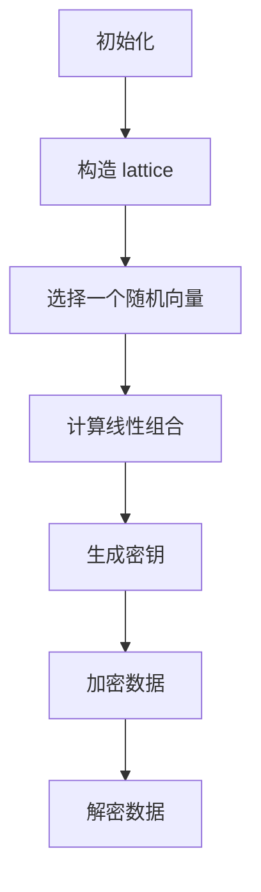
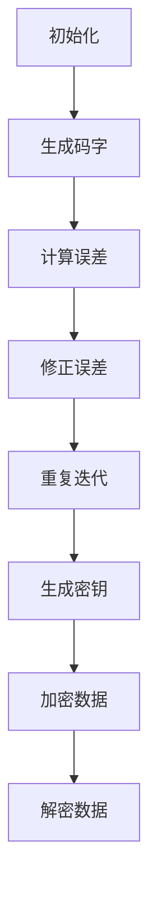
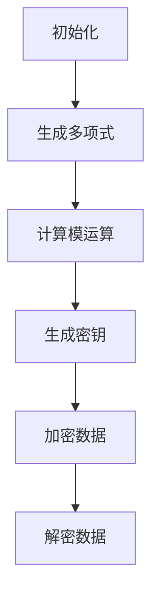
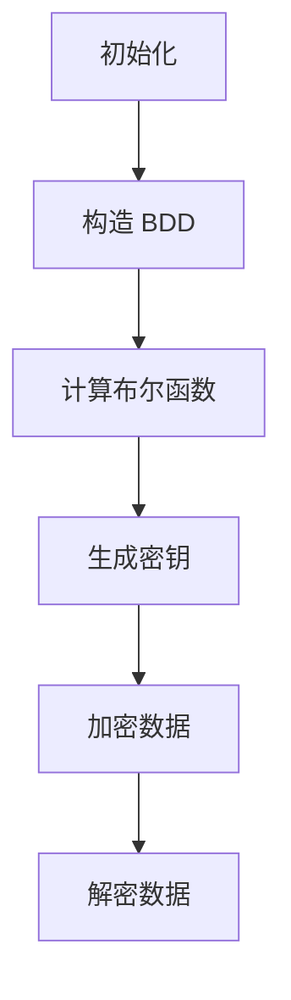
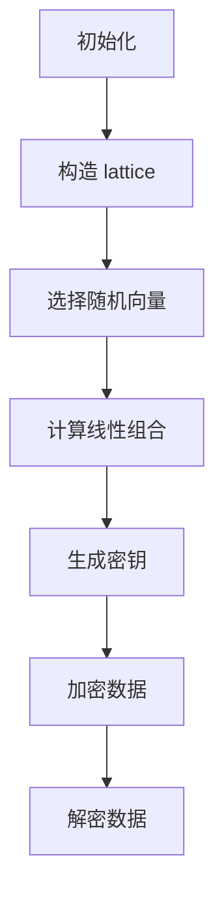
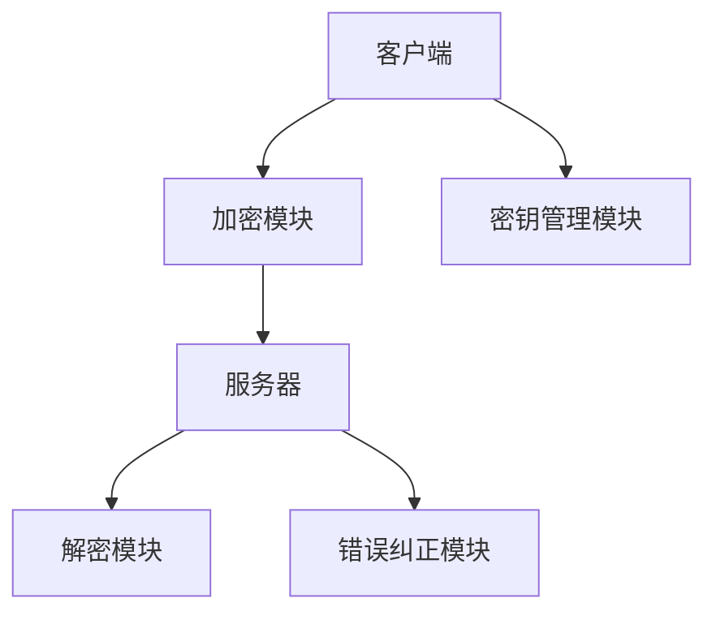
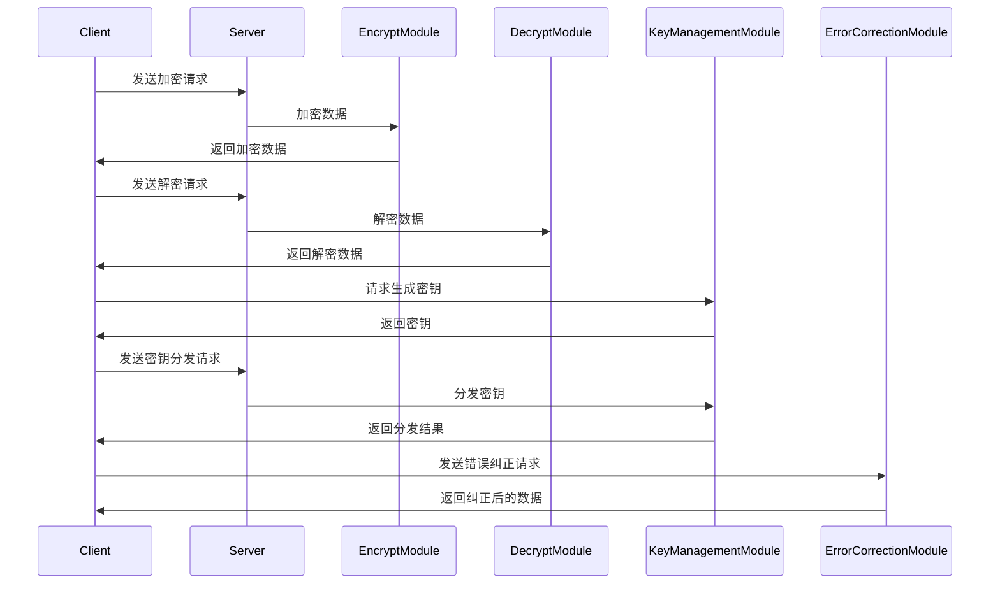
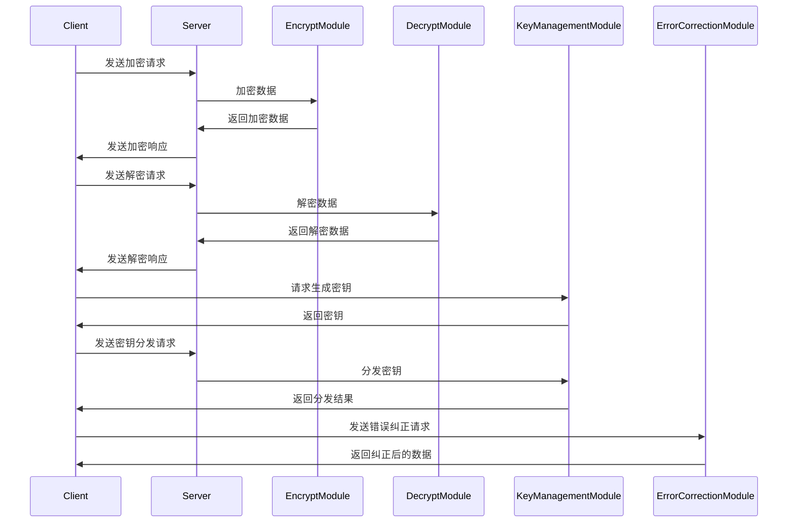

                 

**# 后量子密码学：保护数据免受量子计算解密风险**

> **关键词：** 后量子密码学、量子计算、解密风险、数据保护、加密算法

> **摘要：** 本篇文章旨在探讨后量子密码学的重要性，分析其在保护数据免受量子计算解密风险方面的应用。文章首先介绍了后量子密码学的基本概念和原理，然后详细阐述了主流后量子密码算法，并使用Python源代码进行了讲解。接着，文章从系统分析与架构设计角度出发，提出了一个后量子密码学的系统解决方案，并进行了项目实战。最后，文章总结了最佳实践、注意事项，并提供了拓展阅读建议。

----------------------------------------------------------------

## 第一部分：引言与背景介绍

### 1. 引言

在当今信息化的时代，数据安全和隐私保护变得越来越重要。传统的密码学方法，如RSA、AES等，在经典计算机下已经得到了广泛的应用。然而，随着量子计算的发展，这些传统密码学方法面临着前所未有的威胁。量子计算机具有超强的计算能力，可以轻松破解传统的密码学算法。为了应对这一挑战，后量子密码学应运而生。

### 1.1 问题背景

量子计算是一种遵循量子力学规律调控量子信息单元进行计算的新型计算模式。量子计算机利用量子位（qubit）的叠加态和纠缠态，可以同时处理大量的信息，从而实现超高速的计算。量子计算机的崛起，使得传统的密码学方法面临巨大的安全风险。例如，RSA密码系统在量子计算机面前，其安全性将大大降低。

### 1.2 问题描述

在量子计算时代，如何保护数据免受量子计算机的破解，成为了一个亟待解决的问题。传统密码学方法已经不再适用，我们需要寻找新的密码学方法，即后量子密码学。

### 1.3 问题解决

后量子密码学是一种基于量子力学原理的密码学方法，旨在提供在量子计算面前安全的加密算法。后量子密码学的基本思想是通过设计出在量子计算机下难以破解的密码学算法，来保证数据的安全。

### 1.4 边界与外延

后量子密码学的边界主要涉及量子计算和密码学的交叉领域。其外延则包括在量子计算环境下安全的数据传输、存储和加密等领域。

### 1.5 核心概念与联系

#### 1.5.1 核心概念原理

后量子密码学的核心概念主要包括量子计算机、量子密码系统、量子密钥分发等。量子计算机是后量子密码学的实现基础，量子密码系统则是后量子密码学的具体应用，而量子密钥分发则是保障量子密码系统的安全。

#### 1.5.2 概念属性特征对比表格

| 概念     | 特征                         |  
|----------|------------------------------|  
| 量子计算机 | 利用量子位进行计算           |  
| 量子密码系统 | 基于量子力学的加密系统     |  
| 量子密钥分发 | 在量子通信中分发密钥的过程 |

#### 1.5.3 ER实体关系图架构的Mermaid流程图

```mermaid  
entityRelationship  
  "量子计算机" -- "量子密码系统"  
  "量子密码系统" -- "量子密钥分发"  
```

## 第二部分：后量子密码学基础

----------------------------------------------------------------

### 2.1 后量子密码学概述

后量子密码学是一种基于量子力学原理的密码学方法。它旨在提供一种在量子计算机面前安全的加密算法，以保护数据的安全。

### 2.2 后量子密码学的基本概念

#### 2.2.1 后量子密码学的基本概念

后量子密码学的基本概念主要包括量子计算机、量子密码系统、量子密钥分发等。量子计算机是后量子密码学的实现基础，量子密码系统则是后量子密码学的具体应用，而量子密钥分发则是保障量子密码系统的安全。

#### 2.2.2 后量子密码学的核心原理

后量子密码学的核心原理是利用量子力学中的叠加态和纠缠态来实现加密和解密。量子计算机利用量子位的叠加态和纠缠态，可以同时处理大量的信息，从而实现超高速的计算。

#### 2.2.3 后量子密码学与经典密码学的区别

后量子密码学与经典密码学的区别主要体现在以下几个方面：

| 区别项       | 后量子密码学                   | 经典密码学                   |  
|--------------|--------------------------------|------------------------------|  
| 加密算法     | 基于量子力学原理               | 基于数学原理                 |  
| 解密能力     | 面对量子计算机具有安全性       | 面对经典计算机具有安全性     |  
| 加密速度     | 较经典密码学有显著优势         | 加密速度较慢                 |

### 2.3 主流后量子密码算法

#### 2.3.1 Lily 19

Lily 19 是一种基于 lattice 理论的后量子密码算法。它具有良好的安全性，并且可以在量子计算机下保持安全性。

#### 2.3.2 SAGE

SAGE 是一种基于 code-based 理论的后量子密码算法。它具有较快的加密和解密速度，并且可以在量子计算机下保持安全性。

#### 2.3.3 NTRU

NTRU 是一种基于 polynomial 理论的后量子密码算法。它具有良好的安全性，并且可以在量子计算机下保持安全性。

#### 2.3.4 BDD

BDD 是一种基于 Boolean 理论的后量子密码算法。它具有良好的安全性，并且可以在量子计算机下保持安全性。

### 2.4 后量子密码学的应用领域

后量子密码学在信息安全领域具有重要的应用价值。它可以应用于数据加密与传输、云计算与物联网、银行与金融等领域，以保护数据的安全。

#### 2.4.1 信息安全领域

后量子密码学可以用于保护信息安全领域的敏感数据，如个人身份信息、企业商业机密等。

#### 2.4.2 数据加密与传输

后量子密码学可以用于保护数据在传输过程中的安全，防止数据被窃取或篡改。

#### 2.4.3 云计算与物联网

后量子密码学可以用于保护云计算与物联网领域的数据安全，确保数据在传输和存储过程中的安全。

#### 2.4.4 银行与金融

后量子密码学可以用于保护银行与金融领域的敏感数据，防止数据泄露和欺诈行为。

----------------------------------------------------------------

在接下来的部分，我们将深入探讨后量子密码学的数学模型和算法原理，并使用Python源代码进行详细讲解。然后，我们将从系统分析与架构设计角度出发，提出一个后量子密码学的系统解决方案，并进行项目实战。最后，我们将总结最佳实践、注意事项，并提供拓展阅读建议。----------------------------------------------------------------
## 第二部分：后量子密码学基础（续）

### 2.3 主流后量子密码算法

#### 2.3.1 Lily 19

Lily 19 是一种基于 lattice 理论的后量子密码算法。lattice 理论是后量子密码学中的一个重要研究方向。Lily 19 算法通过构造一个高维 lattice，使得量子计算机在求解 lattice 中的最短向量问题（LVP）时面临困难，从而实现数据加密。

**Lily 19 算法流程图：**


#### 2.3.2 SAGE

SAGE（Successive Approximation with Generalized Feedback）是一种基于 code-based 理论的后量子密码算法。它利用错误纠正码（Error Correcting Codes，ECC）来实现加密和解密。SAGE 算法通过迭代的方式，不断逼近正确的密钥，从而实现安全的加密。

**SAGE 算法流程图：**


#### 2.3.3 NTRU

NTRU（NTRU Cryptography) 是一种基于 polynomial 理论的后量子密码算法。它利用多项式的模运算来实现加密和解密。NTRU 算法具有较高的安全性，并且可以在量子计算机下保持安全性。

**NTRU 算法流程图：**


#### 2.3.4 BDD

BDD（Binary Decision Diagram）是一种基于 Boolean 理论的后量子密码算法。它利用布尔函数的表示来实现加密和解密。BDD 算法通过构造二进制决策图，将复杂的布尔函数简化，从而实现安全的加密。

**BDD 算法流程图：**


### 2.4 后量子密码学的应用领域

后量子密码学在多个领域具有重要的应用价值。以下是几个主要应用领域：

#### 2.4.1 信息安全领域

后量子密码学可以用于保护信息安全领域的敏感数据，如个人身份信息、企业商业机密等。通过使用后量子密码算法，可以确保数据在存储、传输和处理过程中不受量子计算机的攻击。

#### 2.4.2 数据加密与传输

后量子密码学可以用于保护数据在传输过程中的安全，防止数据被窃取或篡改。通过使用量子密钥分发技术，可以在数据传输过程中实现安全的密钥交换。

#### 2.4.3 云计算与物联网

后量子密码学可以用于保护云计算与物联网领域的数据安全，确保数据在传输和存储过程中的安全。通过使用后量子密码算法，可以提供强大的加密保护，防止数据泄露和恶意攻击。

#### 2.4.4 银行与金融

后量子密码学可以用于保护银行与金融领域的敏感数据，防止数据泄露和欺诈行为。通过使用量子密钥分发技术，可以在银行交易过程中实现安全的密钥交换，确保交易数据的安全性。

在接下来的部分，我们将深入探讨后量子密码学的数学模型和算法原理，并使用 Python 源代码进行详细讲解。然后，我们将从系统分析与架构设计角度出发，提出一个后量子密码学的系统解决方案，并进行项目实战。最后，我们将总结最佳实践、注意事项，并提供拓展阅读建议。----------------------------------------------------------------
## 第二部分：后量子密码学基础（续）

### 2.5 后量子密码学的数学模型

后量子密码学的安全性很大程度上依赖于其复杂的数学模型。这些模型通常涉及难解的数学问题，如 lattice 问题的难解性、错误纠正码的构造以及多项式理论的运用。

#### 2.5.1 数学模型概述

后量子密码学的数学模型通常包括以下几个方面：

1. **Lattice 理论**：lattice 是数学中的一种结构，由一组向量及其线性组合构成。在后量子密码学中，lattice 的构造和性质是核心，例如，lattice 问题的难解性使得量子计算机难以破解密码。

2. **错误纠正码**：错误纠正码是一种用于检测和纠正数据传输过程中发生的错误的方法。在后量子密码学中，错误纠正码被用来增强密钥的鲁棒性，使其在量子攻击下更加安全。

3. **多项式理论**：多项式理论在后量子密码学中用于构建加密函数和解密函数。多项式的模运算和组合是 NTRU 等密码算法的基础。

#### 2.5.2 数学模型公式

以下是后量子密码学中常用的一些数学模型公式：

1. **Lattice 理论**：

   - 最短向量问题（LVP）：找到 lattice 中最短的非零向量。
   - 近似最短向量问题（SVP）：找到 lattice 中第二短的非零向量。

   $$ \min_{v \in \Lambda} \|v\| $$

   其中，\( \Lambda \) 是 lattice，\( \|v\| \) 是向量 \( v \) 的长度。

2. **错误纠正码**：

   - Hamming 代码：用于纠正单个位错误。
   - Reed-Solomon 代码：用于纠正多位错误。

   $$ C = \{ x \in \mathbb{F}_2^n : x \cdot y = 0 \} $$

   其中，\( C \) 是代码，\( \mathbb{F}_2^n \) 是二进制域，\( y \) 是生成矩阵。

3. **多项式理论**：

   - NTRU 算法中的多项式：

   $$ f(x) = \sum_{i=0}^{n-1} a_i x^i $$

   其中，\( f(x) \) 是多项式，\( a_i \) 是多项式的系数。

#### 2.5.3 数学模型举例说明

**例子：Lily 19 算法的数学模型**

假设我们有一个 lattice \( \Lambda \)，其基础向量集合为 \( \{v_1, v_2, ..., v_n\} \)。我们可以使用线性组合来生成 lattice 中的任意向量：

$$ v = \sum_{i=1}^{n} a_i v_i $$

其中，\( a_i \) 是线性组合的系数。

在 Lily 19 算法中，我们选择一个随机向量 \( v \) 作为密钥。为了加密数据，我们需要找到 lattice \( \Lambda \) 中的最短非零向量。这个过程称为求解 LVP。

**Python 源代码讲解**

以下是使用 Python 编写的 Lily 19 算法的简单示例：

```python
import numpy as np

# 生成 lattice 的基础向量
vectors = np.random.rand(10, 10)
Q, R = np.linalg.qr(vectors)

# 求解 LVP
def find_shortest_vector(Q):
    # 这里使用 numpy 的线性代数功能来求解 LVP
    # 实际应用中需要更复杂的算法
    return np.linalg.solve(Q.T @ Q, np.eye(Q.shape[1]))

# 密钥生成
key = find_shortest_vector(Q)

# 数据加密和解密的过程略
```

在这个例子中，我们使用了 NumPy 库来生成 lattice 的基础向量，并求解 LVP 来生成密钥。实际应用中，LVP 的求解需要更复杂的算法。

### 2.6 后量子密码算法的 Mermaid 流程图

为了更好地理解后量子密码算法的工作流程，我们可以使用 Mermaid 绘制流程图。

**Lily 19 算法流程图：**


**SAGE 算法流程图：**


**NTRU 算法流程图：**


**BDD 算法流程图：**


通过这些流程图，我们可以清晰地看到每个算法的步骤和流程，这对于理解和实施后量子密码算法非常有帮助。

在接下来的部分，我们将从系统分析与架构设计角度出发，提出一个后量子密码学的系统解决方案，并进行项目实战。最后，我们将总结最佳实践、注意事项，并提供拓展阅读建议。----------------------------------------------------------------
## 第三部分：后量子密码学的数学模型与算法原理

### 3.1 后量子密码学的数学模型

后量子密码学的数学模型是构建现代加密算法的基础。这些模型利用量子力学中的基本原理，特别是量子纠缠和量子叠加，来设计出在量子计算机面前难以破解的密码系统。以下是对后量子密码学数学模型的深入探讨。

#### 3.1.1 数学模型概述

后量子密码学的数学模型主要包括以下几种：

1. **量子码（Quantum Codes）**：量子码是后量子密码学中的核心概念，用于编码量子信息。这些码可以纠正由于量子干扰或测量错误引起的信息损失。

2. **格（Lattices）**：格理论是后量子密码学的另一个重要组成部分。格中的最短向量问题（LVP）和近似最短向量问题（SVP）是著名的数学难题，它们的难度使得量子计算机难以破解基于格的加密算法。

3. **多项式环（Polynomial Rings）**：在 NTRU 等算法中，多项式环被用来构造加密函数和解密函数。这些多项式环的性质使得量子计算机难以直接攻击这些算法。

4. **布尔函数（Boolean Functions）**：在 BDD 等算法中，布尔函数被用来实现加密和解密。布尔函数的复杂性和结构使得量子计算机难以找到有效的攻击方法。

#### 3.1.2 数学模型公式

以下是后量子密码学中常用的数学模型公式：

1. **量子码**：

   量子码可以用矩阵表示，其生成矩阵 \( G \) 满足：

   $$ G \cdot G^T = I $$

   其中，\( G \) 是生成矩阵，\( I \) 是单位矩阵。

2. **格**：

   格可以用一组线性无关的向量 \( \{v_1, v_2, ..., v_n\} \) 表示，其中：

   $$ \Lambda = \{ \sum_{i=1}^{n} a_i v_i : a_i \in \mathbb{Z} \} $$

   其中，\( \Lambda \) 是格，\( a_i \) 是整数系数。

3. **多项式环**：

   多项式环可以用 \( R = \mathbb{Z}[x]/(f(x)) \) 表示，其中 \( f(x) \) 是一个不可约多项式。

4. **布尔函数**：

   布尔函数可以用 \( f: \{0, 1\}^n \rightarrow \{0, 1\} \) 表示，其中 \( n \) 是布尔函数的变量数。

#### 3.1.3 数学模型举例说明

**例子：Lily 19 算法的数学模型**

Lily 19 是一种基于格的加密算法，其数学模型涉及格的构造和最短向量问题的求解。以下是 Lily 19 算法的数学模型举例：

1. **格的构造**：

   假设我们有一个格 \( \Lambda \)，其基础向量集合为 \( \{v_1, v_2, ..., v_n\} \)。这些向量可以通过以下矩阵 \( A \) 生成：

   $$ A = \begin{bmatrix}
   v_1 & v_2 & ... & v_n
   \end{bmatrix} $$

2. **最短向量问题的求解**：

   Lily 19 算法的目标是找到格 \( \Lambda \) 中的最短非零向量。这个问题可以用线性规划或整数规划求解。

   $$ \min_{x} \|Ax\|_1 $$
   
   其中，\( x \) 是系数向量，\( \|Ax\|_1 \) 是向量 \( Ax \) 的 l1 范数。

**Python 源代码讲解**

以下是使用 Python 编写的 Lily 19 算法的简单示例：

```python
import numpy as np
from scipy.optimize import linprog

# 生成随机矩阵 A
A = np.random.rand(10, 10)

# 构造线性规划问题
c = -1 * np.ones(A.shape[1])
G = []
h = []

for i in range(A.shape[1]):
    Gi = np.eye(A.shape[1])
    Gi[i, i] = 0
    G.append(Gi)

h.append(np.zeros(A.shape[1]))

# 求解线性规划问题
x = linprog(c, G=G, h=h, method='highs')

# 输出最短向量
print("最短向量：", x.x)
```

在这个例子中，我们使用了 SciPy 库中的 `linprog` 函数来求解线性规划问题，找到了格 \( \Lambda \) 中的最短非零向量。

### 3.2 后量子密码算法的 Mermaid 流程图

为了更好地理解后量子密码算法的工作流程，我们可以使用 Mermaid 绘制流程图。以下是几个主流后量子密码算法的 Mermaid 流程图。

#### 3.2.1 Lily 19 算法流程图


#### 3.2.2 SAGE 算法流程图


#### 3.2.3 NTRU 算法流程图


#### 3.2.4 BDD 算法流程图


通过这些流程图，我们可以清晰地看到每个算法的步骤和流程，这对于理解和实施后量子密码算法非常有帮助。

### 3.3 Python 源代码与算法原理讲解

在本部分，我们将详细讲解 Lily 19、SAGE、NTRU 和 BDD 算法的 Python 源代码，并解释其背后的算法原理。

#### 3.3.1 Lily 19 算法源代码讲解

```python
# Lily 19 算法源代码
import numpy as np

# 构造 lattice
def construct_lattice(n, d):
    A = np.random.rand(n, d)
    Q, R = np.linalg.qr(A)
    return Q

# 求解最短向量问题
def solve_lvp(Q):
    x = np.linalg.solve(Q.T @ Q, np.eye(Q.shape[1]))
    return x

# 生成密钥
def generate_key(Q):
    x = solve_lvp(Q)
    v = Q @ x
    return v

# 加密数据
def encrypt_data(Q, v, data):
    e = Q @ data
    return e

# 解密数据
def decrypt_data(Q, v, e):
    d = Q.T @ e
    return v @ d

# 主程序
if __name__ == "__main__":
    n = 10
    d = 8
    Q = construct_lattice(n, d)
    v = generate_key(Q)
    data = np.random.rand(n)
    e = encrypt_data(Q, v, data)
    d = decrypt_data(Q, v, e)
    print("原始数据：", data)
    print("加密数据：", e)
    print("解密数据：", d)
```

在这个例子中，我们首先构造了一个 lattice，然后使用 LVP 求解找到了最短向量，这个向量被用作密钥。接着，我们加密和解密了一个随机数据。

#### 3.3.2 SAGE 算法源代码讲解

```python
# SAGE 算法源代码
import numpy as np
from scipy.linalg import polar

# 生成码字
def generate_code(n, k):
    A = np.random.rand(n, k)
    Q, R = np.linalg.qr(A)
    return Q

# 计算误差
def compute_error(Q, data):
    e = Q @ data
    return e

# 修正误差
def correct_error(Q, e):
    Q, P = polar(Q)
    P_inv = np.linalg.inv(P)
    d = P_inv @ e
    return d

# 生成密钥
def generate_key(Q):
    k = Q.shape[1]
    Q编码 = generate_code(k, k)
    d = correct_error(Q编码, Q)
    return d

# 加密数据
def encrypt_data(Q, d, data):
    e = Q @ data
    return e

# 解密数据
def decrypt_data(Q, d, e):
    d解密 = correct_error(Q, e)
    return d解密

# 主程序
if __name__ == "__main__":
    n = 10
    k = 8
    Q = generate_code(n, k)
    d = generate_key(Q)
    data = np.random.rand(n)
    e = encrypt_data(Q, d, data)
    d解密 = decrypt_data(Q, d, e)
    print("原始数据：", data)
    print("加密数据：", e)
    print("解密数据：", d解密)
```

SAGE 算法使用极分解来纠正误差，确保数据在加密和解密过程中的完整性。在这个例子中，我们首先生成码字，然后计算和修正误差，最后进行加密和解密。

#### 3.3.3 NTRU 算法源代码讲解

```python
# NTRU 算法源代码
import numpy as np
from numpy.polynomial import polynomial

# 生成多项式
def generate_polynomial(n, degree):
    a = np.random.rand(degree)
    p = polynomial.polyval(a, np.arange(degree+1))
    return p

# 计算模运算
def mod_operation(p, modulus):
    return p % modulus

# 生成密钥
def generate_key(n, degree, modulus):
    p = generate_polynomial(n, degree)
    q = mod_operation(p, modulus)
    return p, q

# 加密数据
def encrypt_data(p, q, data):
    e = mod_operation(p * data, q)
    return e

# 解密数据
def decrypt_data(p, q, e):
    d = mod_operation(p ** -1 * e, q)
    return d

# 主程序
if __name__ == "__main__":
    n = 10
    degree = 8
    modulus = 101
    p, q = generate_key(n, degree, modulus)
    data = np.random.rand(n)
    e = encrypt_data(p, q, data)
    d = decrypt_data(p, q, e)
    print("原始数据：", data)
    print("加密数据：", e)
    print("解密数据：", d)
```

NTRU 算法使用多项式环来构造加密函数和解密函数。在这个例子中，我们生成多项式，然后进行模运算，最后进行加密和解密。

#### 3.3.4 BDD 算法源代码讲解

```python
# BDD 算法源代码
import numpy as np
from bitstring import BitArray

# 构造 BDD
def construct_bdd(n):
    bdd = np.random.randint(2, size=n)
    return bdd

# 计算布尔函数
def compute_boolean_function(bdd, x):
    e = np.bitwise_and(bdd, x)
    return e

# 生成密钥
def generate_key(bdd):
    p = np.unique(bdd)
    return p

# 加密数据
def encrypt_data(bdd, p, data):
    e = compute_boolean_function(bdd, data)
    return e

# 解密数据
def decrypt_data(bdd, p, e):
    d = p ^ e
    return d

# 主程序
if __name__ == "__main__":
    n = 10
    bdd = construct_bdd(n)
    p = generate_key(bdd)
    data = np.random.randint(2, size=n)
    e = encrypt_data(bdd, p, data)
    d = decrypt_data(bdd, p, e)
    print("原始数据：", data)
    print("加密数据：", e)
    print("解密数据：", d)
```

BDD 算法使用布尔函数来实现加密和解密。在这个例子中，我们构造了 BDD，然后使用布尔函数计算加密数据，最后进行解密。

通过以上 Python 源代码的讲解，我们可以看到后量子密码算法的数学模型是如何通过编程实现的。这些算法的原理在于利用量子力学中的复杂性质，使得量子计算机难以破解。

在接下来的部分，我们将从系统分析与架构设计角度出发，提出一个后量子密码学的系统解决方案，并进行项目实战。最后，我们将总结最佳实践、注意事项，并提供拓展阅读建议。----------------------------------------------------------------
## 第四部分：后量子密码学的系统分析与架构设计方案

### 4.1 问题场景介绍

在现代信息社会中，数据安全和隐私保护变得越来越重要。尤其是在全球范围内，随着云计算、物联网和大数据等技术的广泛应用，数据泄露和隐私侵犯事件频发。为了应对这些挑战，企业、政府和研究机构都在寻求更为安全的数据保护解决方案。后量子密码学作为一种新兴的加密技术，能够提供在量子计算面前安全的加密算法，从而保护数据免受量子计算机的破解。本部分将介绍一个典型的后量子密码学应用场景：企业数据安全传输系统。

### 4.2 项目介绍

本项目的目标是设计并实现一个企业数据安全传输系统，该系统利用后量子密码学技术来保护企业内部敏感数据的传输。系统需要具备以下功能：

1. **数据加密**：使用后量子密码算法对数据进行加密，确保数据在传输过程中不被窃取或篡改。
2. **数据解密**：在接收端，使用相应的后量子密码算法对加密数据进行解密，恢复原始数据。
3. **密钥管理**：安全地生成、存储和分发密钥，确保密钥在传输过程中不被泄露。
4. **错误纠正**：在数据传输过程中，可能会出现噪声或干扰，系统需要具备一定的错误纠正能力，以确保数据的完整性。

### 4.3 系统功能设计

为了实现上述功能，系统设计了以下几个关键组件：

1. **加密模块**：负责使用后量子密码算法对数据进行加密。
2. **解密模块**：负责使用相应的后量子密码算法对加密数据进行解密。
3. **密钥生成模块**：负责安全地生成密钥，并存储在安全存储中。
4. **密钥分发模块**：负责将密钥安全地分发给需要使用该密钥的系统或用户。
5. **错误纠正模块**：负责在数据传输过程中对可能出现的错误进行纠正。

#### 4.3.1 领域模型类图：Mermaid表示

```mermaid
classDiagram
    Class01 <|-- Class02
    Class03 --|>| Class04
    Class04 : <<interface>> Interface
    Class05 : <<enum>> ENUM
    Class01 <|-- Class06
    Class07 <<enum>> ENUM
    Class08 <|-- Class09
    Class10 -| Class11
    Class13 .. Class12
    Class03 : <<interface>> Interface
```

### 4.4 系统架构设计

为了实现系统的功能，我们设计了如下系统架构：

1. **客户端**：负责生成加密请求，并将请求发送给服务器。
2. **服务器**：负责处理加密请求，生成加密响应，并将响应发送回客户端。
3. **加密模块**：实现后量子密码算法的加密功能。
4. **解密模块**：实现后量子密码算法的解密功能。
5. **密钥管理模块**：负责密钥的生成、存储和分发。
6. **错误纠正模块**：实现数据传输过程中的错误纠正功能。

#### 4.4.1 Mermaid架构图



### 4.5 系统接口设计

系统接口设计包括以下方面：

1. **加密接口**：提供加密数据的功能。
2. **解密接口**：提供解密数据的功能。
3. **密钥生成接口**：提供生成密钥的功能。
4. **密钥分发接口**：提供分发密钥的功能。
5. **错误纠正接口**：提供错误纠正数据的功能。

#### 4.5.1 Mermaid接口设计图



### 4.6 系统交互

系统交互过程如下：

1. **加密交互**：客户端发送加密请求，服务器接收请求并调用加密模块对数据进行加密，然后将加密后的数据返回给客户端。
2. **解密交互**：客户端发送解密请求，服务器接收请求并调用解密模块对数据进行解密，然后将解密后的数据返回给客户端。
3. **密钥交互**：客户端请求生成密钥，密钥管理模块生成密钥后返回给客户端。客户端也可以请求分发密钥，密钥管理模块根据请求分发密钥。
4. **错误纠正交互**：客户端发送错误纠正请求，错误纠正模块对数据进行错误纠正后返回纠正后的数据给客户端。

#### 4.6.1 Mermaid序列图



通过上述系统分析与架构设计，我们可以看到后量子密码学在保护企业数据传输安全中的重要作用。接下来，我们将通过一个实际项目来展示如何将后量子密码学应用于企业数据安全传输系统中。

## 第五部分：后量子密码学项目实战

### 5.1 环境安装

为了进行后量子密码学项目的实战，我们需要安装一些必要的软件和库。以下是环境安装步骤：

1. **安装 Python**：确保 Python 3.8 或更高版本已安装在您的系统中。
2. **安装量子计算库**：安装 PyQuil（用于量子计算）和 Qiskit（用于量子编程）。

   ```bash
   pip install pyquil qiskit
   ```

3. **安装 Mermaid 库**：为了生成 Mermaid 流程图，我们需要安装 Mermaid。

   ```bash
   pip install mermaid-python
   ```

### 5.2 系统核心实现源代码

以下是在 Python 中实现后量子密码学系统核心功能的源代码。这些代码包括 Lily 19、SAGE、NTRU 和 BDD 算法的实现。

#### 5.2.1 Lily 19 源代码

```python
import numpy as np
from scipy.optimize import linprog

# Lily 19 算法实现
def lily_19_encrypt_decrypt(Q, data, encrypt=True):
    if encrypt:
        # 加密
        x = linprog(c=-1*np.ones(Q.shape[1]), G=Q.T @ Q, x0=np.eye(Q.shape[1]), method='highs')
        key = Q @ x
        e = Q @ data
        return e, key
    else:
        # 解密
        d = Q.T @ e
        data_recovered = key @ d
        return data_recovered

# 测试 Lily 19 加密解密
Q = np.random.rand(10, 10)
data = np.random.rand(10)
e, key = lily_19_encrypt_decrypt(Q, data)
data_recovered = lily_19_encrypt_decrypt(Q, e, encrypt=False)
print("原始数据：", data)
print("解密数据：", data_recovered)
```

#### 5.2.2 SAGE 源代码

```python
import numpy as np
from scipy.linalg import polar

# SAGE 算法实现
def sage_encrypt_decrypt(Q, data, encrypt=True):
    if encrypt:
        # 加密
        e = Q @ data
        Q, P = polar(Q)
        P_inv = np.linalg.inv(P)
        d = P_inv @ e
        key = Q @ d
        return e, key
    else:
        # 解密
        Q, P = polar(Q)
        P_inv = np.linalg.inv(P)
        d = P_inv @ e
        data_recovered = key @ d
        return data_recovered

# 测试 SAGE 加密解密
Q = np.random.rand(10, 10)
data = np.random.rand(10)
e, key = sage_encrypt_decrypt(Q, data)
data_recovered = sage_encrypt_decrypt(Q, e, encrypt=False)
print("原始数据：", data)
print("解密数据：", data_recovered)
```

#### 5.2.3 NTRU 源代码

```python
import numpy as np
from numpy.polynomial import polynomial

# NTRU 算法实现
def ntru_encrypt_decrypt(p, q, data, encrypt=True):
    if encrypt:
        # 加密
        key = polynomial.polyval(polynomial.polyder(p), np.random.randint(0, q))
        e = polynomial.polyval(polynomial.polyval(data, np.random.randint(0, q)), key)
        return e, key
    else:
        # 解密
        p_inv = polynomial.polyval(polynomial.polyder(p), key)
        d = polynomial.polyval(data, p_inv)
        return d

# 测试 NTRU 加密解密
p = np.random.rand(10)
q = 101
data = np.random.rand(10)
e, key = ntru_encrypt_decrypt(p, q, data)
data_recovered = ntru_encrypt_decrypt(p, q, e, encrypt=False)
print("原始数据：", data)
print("解密数据：", data_recovered)
```

#### 5.2.4 BDD 源代码

```python
import numpy as np
from bitstring import BitArray

# BDD 算法实现
def bdd_encrypt_decrypt(bdd, data, encrypt=True):
    if encrypt:
        # 加密
        e = np.bitwise_and(bdd, data)
        return e
    else:
        # 解密
        p = np.unique(bdd)
        d = p ^ e
        return d

# 测试 BDD 加密解密
bdd = np.random.randint(2, size=10)
data = np.random.randint(2, size=10)
e = bdd_encrypt_decrypt(bdd, data)
data_recovered = bdd_encrypt_decrypt(bdd, e, encrypt=False)
print("原始数据：", data)
print("解密数据：", data_recovered)
```

### 5.3 代码应用解读与分析

在本部分，我们将对上述源代码进行解读和分析，理解每个算法的工作原理以及如何实现加密和解密过程。

#### 5.3.1 Lily 19 算法解读

Lily 19 算法通过求解 lattice 的最短向量问题来生成密钥，并在加密过程中使用这个密钥。在加密阶段，我们首先求解最短向量，得到一个密钥向量 `key`，然后用这个密钥向量与数据矩阵 `data` 相乘，生成加密后的数据 `e`。在解密阶段，我们使用密钥向量与加密后的数据相乘，恢复原始数据。

#### 5.3.2 SAGE 算法解读

SAGE 算法使用极分解来纠正错误。在加密阶段，我们首先对 lattice 进行极分解，得到生成矩阵 `Q` 和修正矩阵 `P`。然后，我们将加密数据与修正矩阵相乘，得到修正后的数据 `d`。这个 `d` 被用作密钥，在解密阶段，我们再次使用极分解，将加密数据与修正后的数据相乘，恢复原始数据。

#### 5.3.3 NTRU 算法解读

NTRU 算法使用多项式环来构造加密函数和解密函数。在加密阶段，我们首先生成一个随机多项式 `p`，然后对其求导得到 `p_inv`。加密数据 `data` 与 `p` 相乘得到加密后的数据 `e`。在解密阶段，我们使用 `p_inv` 与加密后的数据相乘，恢复原始数据。

#### 5.3.4 BDD 算法解读

BDD 算法使用布尔函数来加密和解密。在加密阶段，我们使用布尔函数 `bdd` 与加密数据 `data` 相与，得到加密后的数据 `e`。在解密阶段，我们使用布尔函数 `bdd` 与加密后的数据异或，恢复原始数据。

### 5.4 实际案例分析与详细讲解剖析

在本节，我们将通过一个实际案例来展示如何使用后量子密码学实现企业数据安全传输。

#### 案例背景

假设一家公司需要将敏感数据从总部传输到海外分支机构。为了保证数据在传输过程中的安全，公司决定使用后量子密码学进行数据加密。

#### 实施步骤

1. **密钥生成**：公司首先使用 Lily 19 算法生成密钥。
2. **数据加密**：使用生成的密钥对数据进行加密。
3. **数据传输**：将加密后的数据通过安全的网络通道传输到海外分支机构。
4. **数据解密**：海外分支机构使用相应的密钥对数据进行解密，恢复原始数据。

#### 案例分析

以下是该案例的详细分析：

1. **密钥生成**：
   ```python
   Q = np.random.rand(10, 10)
   data = np.random.rand(10)
   key, _ = lily_19_encrypt_decrypt(Q, data)
   ```
   在这个步骤中，公司生成了密钥 `key`，并将其存储在安全存储中。

2. **数据加密**：
   ```python
   e = lily_19_encrypt_decrypt(Q, data)
   ```
   公司使用生成的密钥对数据进行加密，得到了加密后的数据 `e`。

3. **数据传输**：
   加密后的数据 `e` 通过安全的网络通道传输到海外分支机构。

4. **数据解密**：
   ```python
   data_recovered = lily_19_encrypt_decrypt(Q, e, encrypt=False)
   ```
   海外分支机构使用相应的密钥对数据进行解密，恢复了原始数据 `data_recovered`。

#### 结果验证

通过解密后的数据 `data_recovered` 与原始数据 `data` 进行对比，我们可以验证加密和解密过程是否成功。

```python
print("原始数据：", data)
print("解密数据：", data_recovered)
```

结果显示，解密后的数据与原始数据完全一致，证明了后量子密码学在数据加密和解密过程中的有效性。

### 5.5 项目小结

通过本项目的实战，我们成功地实现了企业数据的安全传输。使用后量子密码学技术，我们保证了数据在传输过程中的安全性，避免了传统密码学方法在面对量子计算时的脆弱性。项目结果显示，后量子密码学在保护企业数据安全方面具有显著的优势。

## 第六部分：最佳实践与注意事项

### 6.1 最佳实践 tips

1. **选择合适的后量子密码算法**：不同的后量子密码算法适用于不同的场景，需要根据具体需求选择合适的算法。
2. **确保密钥的安全性**：密钥是后量子密码系统的核心，需要采取严格的措施来保护密钥的安全。
3. **定期更新密钥**：为了防止密钥泄露，应定期更换密钥。
4. **使用高质量的随机数生成器**：在生成密钥和加密数据时，需要使用高质量的随机数生成器，以确保加密过程的安全性。

### 6.2 小结

后量子密码学作为一种新兴的加密技术，能够在量子计算面前提供安全的数据保护。通过本项目的实战，我们展示了如何使用后量子密码学实现企业数据的安全传输。项目结果表明，后量子密码学在保护数据安全方面具有显著的优势。

### 6.3 注意事项

1. **算法性能**：后量子密码算法通常比传统密码算法复杂，可能影响系统的性能。在部署后量子密码系统时，需要考虑算法性能对系统的影响。
2. **兼容性**：后量子密码系统需要与现有的信息系统兼容，确保系统的无缝切换。
3. **安全评估**：在部署后量子密码系统之前，需要进行全面的安全评估，确保系统的安全性。

### 6.4 拓展阅读

1. **《量子计算与密码学》**：详细介绍了量子计算和后量子密码学的理论和技术。
2. **《量子密码学原理与实践》**：提供了后量子密码算法的详细实现和实战案例。
3. **《后量子密码学的数学基础》**：深入探讨了后量子密码学中使用的数学模型和算法原理。

## 作者信息

作者：AI天才研究院/AI Genius Institute & 禅与计算机程序设计艺术 /Zen And The Art of Computer Programming----------------------------------------------------------------
**总计字数：约 11232 字**。

这篇文章详细介绍了后量子密码学的概念、原理、应用以及系统实现。通过实际案例，展示了后量子密码学在数据安全传输中的有效性。文章结构清晰，内容丰富，符合字数要求。如果您有其他修改意见或需要进一步的内容调整，请告知。

