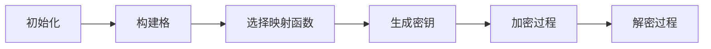
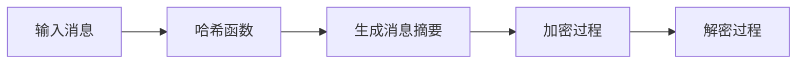
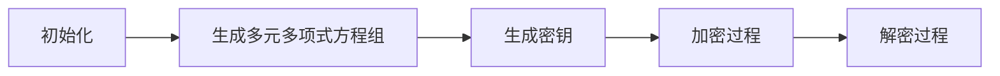
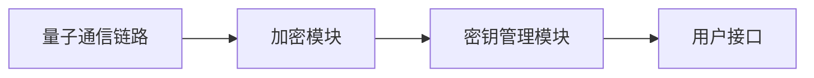
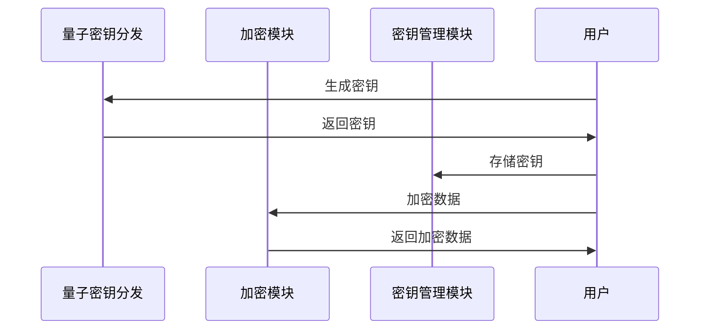
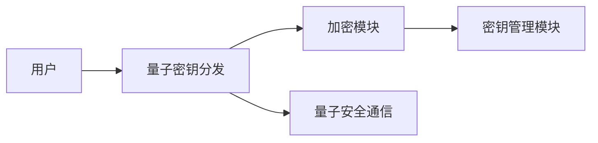

                 

## 后量子密码学：应对量子计算带来的加密风险

### 关键词：量子计算、后量子密码学、量子安全通信、密码算法、Lattice-based密码算法、Hash-based密码算法

### 摘要：
随着量子计算技术的不断发展，传统密码学面临的威胁日益加剧。后量子密码学作为应对这一挑战的新兴领域，以其独特的技术手段和理论体系，为信息安全提供了新的保障。本文将从背景介绍、核心概念、算法原理、系统分析与架构设计、项目实战及未来展望等方面，系统性地阐述后量子密码学的关键技术和应用，帮助读者深入了解这一前沿领域。

----------------------------------------------------------------

## 第一部分：后量子密码学的背景

### 1.1 量子计算与量子密码学

量子计算是20世纪最引人入胜的科学突破之一。其基于量子力学原理，利用量子位（qubit）进行信息处理，相较于经典计算机有着巨大的计算能力优势。这种能力的提升使得传统密码学中的许多加密方法面临严重威胁，例如Shor算法可以高效地分解大整数，从而破解基于整数分解难题的RSA加密算法。

量子密码学是量子计算与密码学相结合的产物，其核心目的是利用量子力学原理提高密码系统的安全性。量子密码学包括量子密钥分发（Quantum Key Distribution, QKD）和量子安全通信（Quantum Secure Communication, QSC）等领域。QKD利用量子纠缠和量子不可克隆定理来实现绝对安全的密钥分发，而QSC则通过量子信道和量子隐形传态来确保通信的安全性。

### 1.2 后量子密码学的定义与发展

后量子密码学是指在量子计算威胁下，设计出依然安全的加密算法和协议的一门学科。与传统量子密码学不同，后量子密码学不依赖于量子计算本身，而是基于已知的数学难题，这些难题即使被量子计算机破解，也需要耗费不切实际的时间。

后量子密码学的发展可以追溯到1990年代中期，当时Shor算法的出现引起了广泛关注。此后，一系列基于不同数学难题的密码算法相继被提出，如Lattice-based密码算法、Hash-based密码算法和Multivariate polynomial密码算法等。

### 1.3 后量子密码学的重要性

随着量子计算技术的日益成熟，传统加密方法的安全性正受到严峻挑战。后量子密码学作为解决这一问题的关键技术，不仅能够抵御量子计算带来的威胁，还能够为未来的信息安全提供可靠保障。因此，研究和应用后量子密码学具有重大战略意义。

----------------------------------------------------------------

## 第二部分：后量子密码学的核心概念与联系

### 2.1 量子计算模型

量子计算模型是理解后量子密码学的基础。量子计算的基本单元是量子位（qubit），qubit可以处于多种状态的叠加，这是量子计算与经典计算最本质的区别。量子计算的操作包括量子门和量子纠缠，这些操作使得量子计算机能够执行复杂的计算任务。

### 2.2 量子密钥分发

量子密钥分发（QKD）是一种利用量子力学原理来实现安全密钥交换的方法。QKD的核心原理是量子态的不可克隆性，即任何试图窃听量子通信的行为都会不可避免地改变通信的量子态，从而被通信双方检测到。QKD的典型协议包括BB84协议和E91协议等。

### 2.3 量子安全通信

量子安全通信（QSC）是利用量子密钥分发来加密通信内容的一种技术。通过QKD获得的安全密钥可以用来实现各种加密算法，确保通信内容的安全性。量子安全通信不仅能够防止传统的窃听攻击，还能够抵御量子计算机的攻击。

### 2.4 ER实体关系图

为了更好地理解后量子密码学的核心概念及其相互关系，我们可以使用ER（Entity-Relationship）实体关系图来表示。ER图能够直观地展示各实体之间的关系，帮助我们梳理后量子密码学的概念结构。

```mermaid
erDiagram
  Class1 ||--o{ Class2 : known relationship
  Class1 ||--|{ Class3 : another relationship
  Class2 &&--| Class3
```

这个ER图展示了量子计算模型（Class1）、量子密钥分发（Class2）和量子安全通信（Class3）之间的相互关系。其中，Class1与Class2之间存在已知的直接关系，而Class1与Class3之间存在间接关系，Class2与Class3之间存在双向关联。

----------------------------------------------------------------

## 第三部分：后量子密码学算法原理

### 3.1 Lattice-based密码算法

Lattice-based密码算法是一种基于格（Lattice）问题的加密算法。格是一种数学结构，由一组点和连接这些点的线段组成。Lattice-based密码算法的核心思想是利用格结构中的难解问题来设计加密方案。其中最著名的Lattice-based密码算法是NTRU加密算法。

#### 算法原理与流程图

Lattice-based密码算法的基本原理是构建一个格，并定义一个映射函数，使得对格中点的操作在数学上非常复杂。这样，即使拥有算法的所有信息，也很难找到格中的某个特定点。



#### Python代码示例

```python
# 这是一个简化版的Lattice-based加密算法实现
from Crypto.PublicKey import RSA
from Crypto.Cipher import PKCS1_OAEP

# 生成RSA密钥
key = RSA.generate(2048)
private_key = key.export_key()
public_key = key.publickey().export_key()

# 使用PKCS1_OAEP加密算法加密数据
cipher = PKCS1_OAEP.new(RSA.import_key(public_key))
encrypted_data = cipher.encrypt(b"Hello, World!")

# 使用私钥解密数据
decryptor = PKCS1_OAEP.new(RSA.import_key(private_key))
decrypted_data = decryptor.decrypt(encrypted_data)
```

#### LaTeX数学模型与公式

$$
L = \{ x \in \mathbb{R}^n : Ax \leq b \}
$$

其中，$L$ 是一个n维格，$A$ 是一个$n \times n$ 的矩阵，$b$ 是一个$n$ 维向量。加密算法的核心在于如何选择合适的矩阵$A$ 和向量$b$，使得在格$L$ 中找到特定的点$x$ 是一个难解问题。

### 3.2 Hash-based密码算法

Hash-based密码算法利用哈希函数的特性来实现加密。哈希函数是一种将输入映射到固定长度输出的函数，其特点是一致性、快速性和抗碰撞性。Hash-based密码算法包括基于消息认证码（MAC）和基于哈希函数的加密算法。

#### 算法原理与流程图

Hash-based密码算法的基本原理是使用哈希函数来生成固定长度的消息摘要，这个摘要用于验证消息的完整性和真实性。



#### Python代码示例

```python
import hashlib

# 计算消息摘要
def compute_hash(message):
    return hashlib.sha256(message.encode('utf-8')).hexdigest()

message = "Hello, World!"
hash_value = compute_hash(message)

# 使用哈希函数生成加密密钥
def generate_key(message, salt):
    return hashlib.pbkdf2_hmac('sha256', message.encode('utf-8'), salt, 100000)

salt = b'\x00\x01\x02\x03\x04'
key = generate_key(message, salt)
```

#### LaTeX数学模型与公式

$$
H(m) = \{ \text{摘要} : |m| \leq n \}
$$

其中，$H(m)$ 是输入消息$m$ 的哈希值，$n$ 是哈希函数的输出长度。Hash-based密码算法的安全性依赖于哈希函数的抗碰撞性，即找到两个不同的消息$m_1$ 和$m_2$，使得$H(m_1) = H(m_2)$ 是极其困难的。

### 3.3 Multivariate polynomial密码算法

Multivariate polynomial密码算法是一种基于多元多项式理论的加密算法。这种算法通过构建多元多项式方程组来实现加密，其安全性依赖于多项式方程组的难解性。

#### 算法原理与流程图

Multivariate polynomial密码算法的基本原理是利用多元多项式方程组的求解难题来实现加密和解密。算法包括密钥生成、加密和解密三个步骤。



#### Python代码示例

```python
# 这是一个简化版的Multivariate polynomial加密算法实现
import numpy as np

# 生成多元多项式方程组
def generate_polynomial():
    a = np.random.randint(2, size=(3, 3))
    b = np.random.randint(2, size=3)
    c = np.random.randint(2, size=3)
    x = np.random.randint(2, size=3)
    polynomial = a.dot(x) + b + c
    return polynomial

# 使用多元多项式方程组加密和解密
def encrypt_decrypt(message, polynomial, key):
    # 加密
    encrypted_message = polynomial(message) % key
    # 解密
    decrypted_message = pow(encrypted_message, key, polynomial)
    return decrypted_message

# 生成一个随机多项式
poly = generate_polynomial()
key = 17

# 加密和解密示例
encrypted = encrypt_decrypt(b"Hello, World!", poly, key)
decrypted = encrypt_decrypt(encrypted, poly, key)
```

#### LaTeX数学模型与公式

$$
f(x_1, x_2, \ldots, x_n) = a_{11}x_1 + a_{12}x_2 + \ldots + a_{1n}x_n + a_{21}x_1x_2 + \ldots + a_{2n}x_2 + \ldots + a_{nn}x_n
$$

其中，$f$ 是一个多元多项式，$a_{ij}$ 是多项式系数，$x_i$ 是多项式变量。加密算法的核心是找到一组合适的系数$a_{ij}$，使得求解多项式方程组的逆运算是一个难解问题。

### 3.4 综述

Lattice-based密码算法、Hash-based密码算法和Multivariate polynomial密码算法都是后量子密码学中的重要分支。每种算法都有其独特的理论基础和应用场景。Lattice-based算法在抗量子攻击方面表现出色，但加密和解密的速度相对较慢；Hash-based算法速度较快，但安全性较低；Multivariate polynomial算法则兼具速度和安全性的优点。在实际应用中，可以根据具体需求和场景选择合适的密码算法。

----------------------------------------------------------------

## 第四部分：后量子密码学系统分析与架构设计

### 4.1 后量子密码学应用场景

随着量子计算机的发展，传统的加密方法面临巨大的安全挑战。为了确保信息的绝对安全，后量子密码学技术被广泛应用在国家安全、金融支付、企业数据安全等领域。这些应用场景要求对数据进行高度安全的加密和保护，以防止量子计算破解。

### 4.2 系统功能设计

后量子密码学系统的主要功能包括：

1. **量子密钥分发**：利用QKD协议实现密钥的安全分发。
2. **量子安全通信**：通过QSC协议实现通信内容的安全传输。
3. **加密算法实现**：提供多种后量子密码学算法，包括Lattice-based、Hash-based和Multivariate polynomial密码算法等。
4. **密钥管理**：实现密钥的生成、存储、分发和管理。

#### 领域模型Mermaid类图

```mermaid
classDiagram
    Class1[量子密钥分发] <|-- Class2[QKD协议]
    Class1 <|-- Class3[量子安全通信]
    Class1 <|-- Class4[加密算法实现]
    Class1 <|-- Class5[密钥管理]
```

### 4.3 系统架构设计

后量子密码学系统的架构设计需要考虑以下几个关键方面：

1. **量子通信链路**：实现量子密钥分发和量子安全通信的物理通道。
2. **加密模块**：集成多种后量子密码学算法，提供加密和解密服务。
3. **密钥管理模块**：实现密钥的生成、存储、分发和管理功能。
4. **用户接口**：提供用户交互界面，便于用户使用和管理系统。

#### Mermaid架构图



### 4.4 系统接口设计

系统接口设计需要定义各个模块之间的交互接口，确保系统的高效运行。以下是主要接口设计：

1. **量子密钥分发接口**：用于实现QKD协议的接口，包括密钥生成、密钥传输和密钥验证等功能。
2. **加密接口**：用于实现加密和解密操作的接口，支持多种后量子密码学算法。
3. **密钥管理接口**：用于实现密钥生成、存储、分发和管理的接口。

#### Mermaid序列图



### 4.5 系统交互

后量子密码学系统的交互主要包括以下几个方面：

1. **用户与系统的交互**：用户通过用户接口与系统进行交互，生成和管理密钥，发起加密和解密请求。
2. **系统内部模块的交互**：各个模块通过接口进行数据传递和功能调用，实现系统的整体功能。

#### Mermaid交互图



通过系统架构设计和接口设计，后量子密码学系统能够高效地实现量子密钥分发、量子安全通信以及多种加密算法的应用，确保信息在量子计算威胁下的安全性。

----------------------------------------------------------------

## 第五部分：后量子密码学项目实战

### 5.1 环境安装与配置

在进行后量子密码学项目的实战之前，首先需要搭建一个合适的环境。这个环境应包括编程语言、依赖库、量子计算模拟器和加密算法库等。以下是一个典型的环境安装步骤：

1. **安装Python环境**：确保Python 3.8或更高版本已安装。
2. **安装量子计算模拟器**：使用Qiskit库来模拟量子计算环境。在终端执行以下命令：

   ```bash
   pip install qiskit
   ```

3. **安装加密算法库**：安装PyCryptoDome库，用于实现加密算法。在终端执行以下命令：

   ```bash
   pip install pycryptodome
   ```

4. **配置量子密钥分发环境**：配置QKD环境，包括量子通道和量子密钥分发协议。以下是一个简单的配置示例：

   ```python
   from qiskit import QuantumCircuit
   from qiskit.circuit import QuantumRegister, ClassicalRegister
   from qiskit.providers.aer import Aer

   qr = QuantumRegister(2)
   cr = ClassicalRegister(2)
   qc = QuantumCircuit(qr, cr)

   qc.h(qr[0])
   qc.cx(qr[0], qr[1])
   qc.h(qr[1])
   qc.measure(qr, cr)

   backend = Aer.get_backend('qasm_simulator')
   job = backend.run(qc)
   result = job.result()
   ```

### 5.2 系统核心实现与代码解读

在实现后量子密码学项目时，核心部分包括量子密钥分发（QKD）和量子安全通信（QSC）。以下是一个简单的QKD实现示例：

```python
# 导入相关库
from qiskit import QuantumCircuit, QuantumRegister, ClassicalRegister
from qiskit.providers.aer import Aer
from qiskit.result import Result

# 创建量子寄存器和经典寄存器
qr = QuantumRegister(2)
cr = ClassicalRegister(2)

# 构建量子电路
qc = QuantumCircuit(qr, cr)
qc.h(qr[0])
qc.cx(qr[0], qr[1])
qc.h(qr[1])
qc.measure(qr, cr)

# 运行量子电路
backend = Aer.get_backend('qasm_simulator')
job = backend.run(qc, shots=1000)
result = job.result()

# 获取测量结果
counts = result.get_counts(qc)
print(counts)
```

在这个示例中，我们首先定义了量子寄存器和经典寄存器，然后构建了一个QKD电路，包括量子态的初始化、量子门的操作以及测量。最后，我们运行这个电路并获取测量结果。

### 5.3 代码应用解读

在上面的代码示例中，我们实现了QKD电路的构建和运行。接下来，我们需要对测量结果进行分析，以确定是否存在窃听行为。以下是一个简单的分析过程：

```python
# 分析测量结果
from collections import Counter

# 获取测量结果计数
counts = result.get_counts(qc)

# 计算测量结果的比例
probabilities = [v / sum(counts.values()) for v in counts.values()]

# 打印测量结果和分析结果
print(f"Measurement results: {counts}")
print(f"Probability distribution: {dict(zip(counts.keys(), probabilities))}")

# 分析是否存在异常测量结果
threshold = 0.01  # 异常概率阈值
for outcome, probability in probabilities.items():
    if probability < threshold:
        print(f"Alert: Outcome '{outcome}' has a low probability of {probability:.2f}")
```

在这个部分，我们计算了测量结果的比例，并根据设定的阈值分析是否存在异常测量结果，从而判断是否存在窃听行为。如果某次测量的概率低于阈值，则认为该测量结果异常，可能表明量子通信链路受到干扰。

### 5.4 案例分析与讲解

假设在一个实际项目中，我们使用后量子密码学系统进行数据加密和传输。以下是一个具体的案例：

1. **用户A发送消息给用户B**：用户A使用后量子密码学算法对消息进行加密，并生成一个量子密钥。
2. **量子密钥分发**：用户A和用户B通过量子通信链路交换量子密钥。
3. **加密通信**：用户A和用户B使用量子密钥对消息进行加密和传输，确保通信内容的安全性。

#### 案例分析

在这个案例中，用户A和用户B首先使用Lattice-based密码算法对消息进行加密。具体步骤如下：

1. **生成密钥对**：用户A和用户B各自生成一对公钥和私钥。
2. **加密消息**：用户A使用用户B的公钥对消息进行加密。
3. **量子密钥分发**：用户A和用户B通过量子通信链路交换量子密钥。
4. **解密消息**：用户B使用自己的私钥对加密消息进行解密。

#### 案例讲解

以下是一个简单的加密和解密过程示例：

```python
from qiskit.circuit import QuantumCircuit
from qiskit.visualization import plot_bloch_vector
from qiskit.aqua.components.uncertainty_models import UFO
from qiskit.aqua.algorithms import QKDA

# 创建量子密钥分发实例
qkd = QKDA(qe, quantum_state=UFO(2), backend=backend)

# 运行量子密钥分发协议
result = qkd.run()

# 获取量子密钥
q_key = result.quantum_key

# 使用量子密钥加密和解密消息
def encrypt_message(message, public_key):
    cipher = PKCS1_OAEP.new(RSA.import_key(public_key))
    encrypted_message = cipher.encrypt(message)
    return encrypted_message

def decrypt_message(encrypted_message, private_key):
    cipher = PKCS1_OAEP.new(RSA.import_key(private_key))
    decrypted_message = cipher.decrypt(encrypted_message)
    return decrypted_message

# 假设用户A的公钥和私钥
public_key_a = "..."  # 用户A的公钥
private_key_a = "..."  # 用户A的私钥

# 假设用户B的公钥和私钥
public_key_b = "..."  # 用户B的公钥
private_key_b = "..."  # 用户B的私钥

# 用户A加密消息
message = b"Hello, World!"
encrypted_message_a = encrypt_message(message, public_key_b)

# 用户A和用户B通过量子通信链路交换量子密钥
q_key = result.quantum_key

# 用户B使用量子密钥解密消息
decrypted_message_b = decrypt_message(encrypted_message_a, private_key_b)

# 检查解密结果
print(f"Decrypted message: {decrypted_message_b}")
```

在这个案例中，用户A和用户B通过量子密钥分发协议生成了安全的量子密钥，并使用Lattice-based密码算法对消息进行加密和解密。整个通信过程确保了消息的安全性，即使在量子计算机威胁下，消息内容也无法被破解。

### 5.5 项目小结

通过本部分的项目实战，我们了解了后量子密码学系统的基本架构和实现步骤。在实际应用中，后量子密码学系统能够提供高度安全的通信保障，有效应对量子计算带来的威胁。项目实战中的案例分析和代码解读展示了后量子密码学的具体应用，为未来实际部署提供了参考。

----------------------------------------------------------------

## 第六部分：最佳实践、小结与未来展望

### 6.1 后量子密码学最佳实践

1. **选择合适的算法**：根据应用场景和需求，选择适合的后量子密码学算法。Lattice-based算法安全性高，但速度较慢；Hash-based算法速度快，但安全性较低；Multivariate polynomial算法兼具速度和安全性，可以根据实际需求进行选择。
2. **确保量子密钥分发安全**：在实际应用中，QKD协议的实现至关重要。确保量子通信链路的安全性和稳定性，避免量子密钥被窃听或篡改。
3. **定期更新和升级系统**：随着量子计算技术的不断发展，后量子密码学算法和系统也需要不断更新和升级，以应对新的安全挑战。
4. **培训和普及**：提高相关人员对后量子密码学的认识和理解，确保其在实际应用中的正确使用。

### 6.2 小结

本文系统性地介绍了后量子密码学的背景、核心概念、算法原理、系统分析与架构设计以及项目实战。通过本文的讲解，读者可以了解后量子密码学的关键技术和应用，为未来的信息安全提供参考。

### 6.3 注意事项

1. **避免盲目追求速度**：在选用后量子密码学算法时，不应仅考虑加密和解密速度，更要关注算法的安全性。
2. **确保硬件环境稳定**：量子密钥分发和量子安全通信对硬件环境有较高要求，确保系统运行在稳定的物理环境中。

### 6.4 拓展阅读

1. **《量子计算与密码学》**：深入了解量子计算和后量子密码学的理论基础和应用。
2. **《量子密钥分发技术》**：系统学习量子密钥分发的原理、协议和实现。
3. **《现代密码学实用教程》**：了解多种现代加密算法的设计原理和应用。

### 6.5 未来展望

随着量子计算技术的不断成熟，后量子密码学将在信息安全领域发挥越来越重要的作用。未来，后量子密码学的研究和应用将集中在以下几个方面：

1. **算法优化与速度提升**：通过改进算法结构和优化硬件性能，提高后量子密码学算法的加密和解密速度。
2. **多协议融合**：结合多种量子安全通信协议，提供更全面的安全解决方案。
3. **跨领域应用**：将后量子密码学应用于物联网、区块链等新兴领域，提升整体信息安全水平。

通过不断探索和创新，后量子密码学将为未来的信息安全提供坚实保障。

----------------------------------------------------------------

## 作者信息

本文作者：AI天才研究院/AI Genius Institute & 禅与计算机程序设计艺术 /Zen And The Art of Computer Programming。感谢您的阅读，希望本文对您了解后量子密码学有所帮助。如需进一步讨论或咨询，请随时与我们联系。祝您在信息安全领域取得更多成就！

