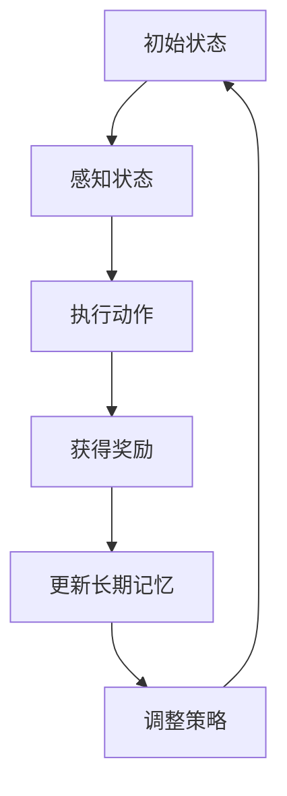
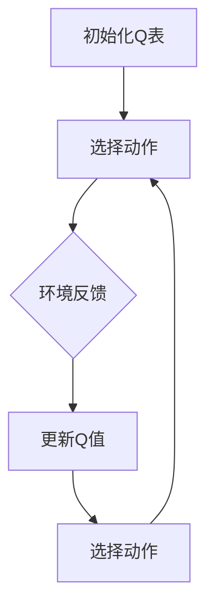
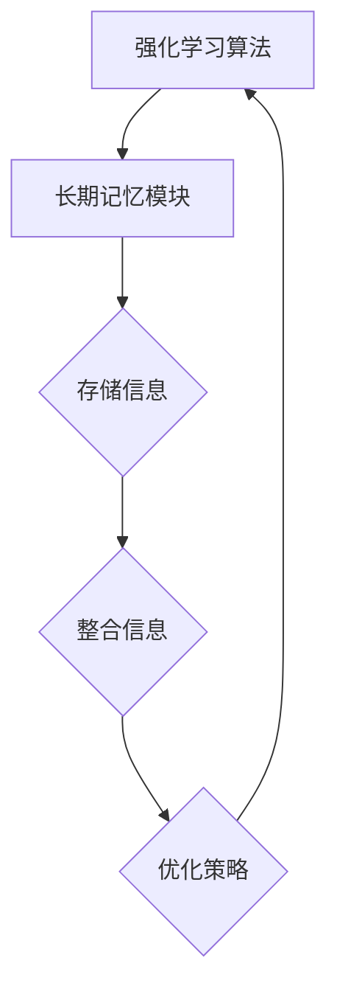
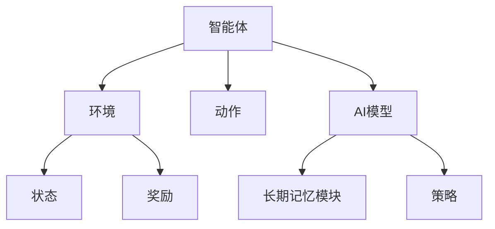
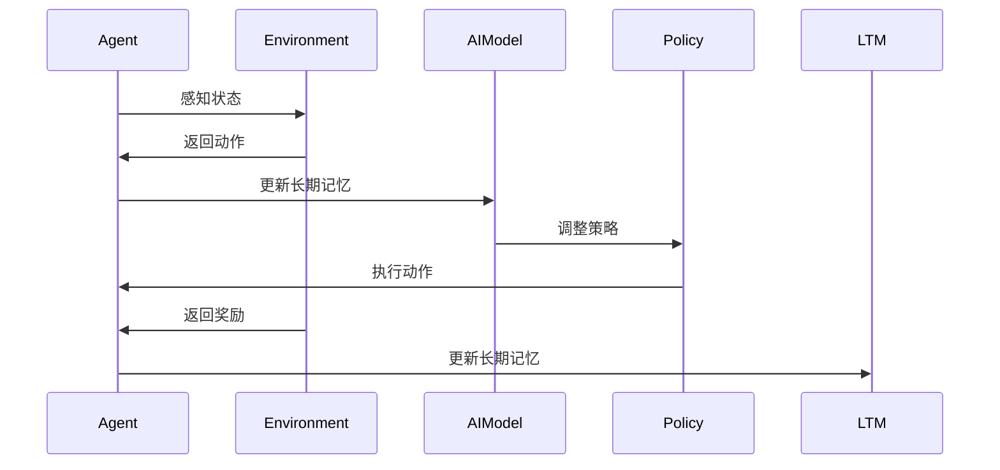

                 

# 基于强化学习的LLM长期记忆测试

> 关键词：强化学习，长期记忆，LLM，算法原理，系统架构，应用实战

> 摘要：本文深入探讨了基于强化学习的长期记忆（LLM）模型，从背景介绍、核心概念、算法原理、系统分析与架构设计，再到应用实战，全面剖析了该模型在计算机科学领域的重要性及其实现方法。文章旨在为读者提供关于强化学习与长期记忆结合的系统性认识，助力理解这一前沿技术的实际应用。

## 目录大纲

- # 基于强化学习的LLM长期记忆测试
    - > 关键词：强化学习，长期记忆，LLM，算法原理，系统架构，应用实战
    - > 摘要：本文深入探讨了基于强化学习的长期记忆（LLM）模型，从背景介绍、核心概念、算法原理、系统分析与架构设计，再到应用实战，全面剖析了该模型在计算机科学领域的重要性及其实现方法。文章旨在为读者提供关于强化学习与长期记忆结合的系统性认识，助力理解这一前沿技术的实际应用。
- ## 第一部分：背景介绍与核心概念
    - ### 1.1 问题背景
        - #### 1.1.1 强化学习与LLM的概述
        - #### 1.1.2 问题提出
        - #### 1.1.3 问题解决
    - ### 1.2 核心概念
        - #### 1.2.1 强化学习的基本概念
        - #### 1.2.2 长期记忆（LTM）的属性
    - ### 1.3 概念结构
        - #### 1.3.1 强化学习与长期记忆的关系
- ## 第二部分：算法原理与实现
    - ### 2.1 算法原理
        - #### 2.1.1 强化学习算法
        - #### 2.1.2 长期记忆机制
    - ### 2.2 数学模型
        - #### 2.2.1 Q-Learning算法
        - #### 2.2.2 长期记忆机制
- ## 第三部分：系统分析与架构设计
    - ### 3.1 问题场景介绍
    - ### 3.2 系统功能设计
    - ### 3.3 系统架构设计
    - ### 3.4 系统接口设计与交互
- ## 第四部分：应用实战
    - ### 4.1 环境安装
    - ### 4.2 系统核心实现源代码
    - ### 4.3 代码应用解读与分析
    - ### 4.4 实际案例分析和详细讲解剖析
    - ### 4.5 项目小结
- ## 第五部分：最佳实践与拓展阅读
    - ### 5.1 最佳实践 Tips
    - ### 5.2 小结
    - ### 5.3 注意事项
    - ### 5.4 拓展阅读

### 第一部分：背景介绍与核心概念

#### 1.1 问题背景

在人工智能领域，强化学习（Reinforcement Learning，RL）作为一种重要的学习范式，受到了广泛关注。强化学习通过智能体（Agent）与环境的互动，不断调整策略以获得最大化的累积奖励。然而，在复杂的动态环境中，如何使智能体具备长期记忆能力，以应对复杂多变的环境挑战，成为一个亟待解决的问题。

长期记忆（Long-term Memory，LTM）是大脑中负责存储和提取长期信息的重要系统，它在人类的认知和行为中起着至关重要的作用。在机器学习中，长期记忆能力有助于智能体在长时间内维持并利用先前经验，以优化其决策过程。然而，传统强化学习算法往往缺乏有效的长期记忆机制，导致智能体在长期任务中表现不佳。

为了解决这一难题，研究者们提出了基于强化学习的长期记忆（LLM）模型。LLM模型通过结合深度学习和强化学习技术，优化了长期记忆机制，使得智能体能够在动态环境中保持并利用长期记忆信息，从而提升其决策能力。

#### 1.1.1 强化学习与LLM的概述

强化学习是一种基于奖励反馈的学习方法，其核心思想是智能体通过不断与环境互动，根据反馈信号调整其行为策略，以实现最大化累积奖励的目标。在强化学习框架中，智能体、环境、状态、动作和奖励是五个基本要素：

- **智能体（Agent）**：执行动作的实体，可以是机器人、软件代理或虚拟智能体。
- **环境（Environment）**：智能体所处的动态环境，提供状态信息和奖励反馈。
- **状态（State）**：描述智能体当前所处环境的特征。
- **动作（Action）**：智能体可以采取的行为。
- **奖励（Reward）**：环境对智能体动作的反馈，用于评估动作的有效性。

强化学习的目标是为智能体设计一个最优策略（Policy），使得其在给定状态下采取最优动作，以最大化累积奖励。传统的强化学习算法，如Q-Learning、Sarsa等，主要通过值函数（Value Function）或策略（Policy）来指导智能体的行为。

然而，在复杂动态环境中，传统强化学习算法往往面临挑战。一方面，环境状态的动态变化可能导致奖励信号的不稳定，使得智能体难以通过短期奖励来推断长期价值；另一方面，强化学习算法通常依赖于短期记忆，无法有效地存储和利用长期经验，导致智能体在长期任务中的表现不佳。

为了解决这些问题，研究者们提出了长期记忆（LLM）模型。LLM模型通过引入深度学习技术，增强了智能体的长期记忆能力，使得智能体能够更好地适应复杂动态环境。

#### 1.1.2 问题提出

强化学习中的长期记忆问题主要表现在以下几个方面：

1. **奖励信号的不稳定性**：在复杂动态环境中，环境状态的快速变化可能导致奖励信号的不稳定，使得智能体难以通过短期奖励来推断长期价值。

2. **短期记忆的局限性**：传统强化学习算法通常依赖于短期记忆，无法有效地存储和利用长期经验，导致智能体在长期任务中的表现不佳。

3. **策略优化困难**：在长期任务中，智能体需要根据历史经验不断调整策略，以适应环境变化。然而，传统强化学习算法在策略优化过程中，往往面临计算复杂度高、收敛速度慢等问题。

为了解决上述问题，研究者们提出了基于强化学习的长期记忆（LLM）模型。LLM模型通过引入深度学习技术，优化了长期记忆机制，使得智能体能够在动态环境中保持并利用长期记忆信息，从而提升其决策能力。

#### 1.1.3 问题解决

基于强化学习的长期记忆（LLM）模型，通过结合深度学习和强化学习技术，提出了一种有效的长期记忆机制。以下是LLM模型的主要解决方案：

1. **深度神经网络增强**：LLM模型采用深度神经网络（DNN）来表示状态和动作，增强了智能体的信息处理能力。DNN能够自动提取状态和动作的特征，为长期记忆提供了丰富的信息基础。

2. **长期记忆模块设计**：LLM模型在传统强化学习算法的基础上，引入了长期记忆（LTM）模块。LTM模块负责存储和整合历史信息，使得智能体能够在长期任务中维持并利用经验。

3. **多任务学习策略**：LLM模型采用了多任务学习（Multi-task Learning）策略，通过同时学习多个相关任务，提高了智能体的泛化能力和适应能力。

4. **强化学习算法优化**：LLM模型对传统强化学习算法进行了优化，如采用自适应学习率、改进奖励函数等，提高了智能体在复杂动态环境中的学习效率和性能。

通过上述解决方案，LLM模型在长期记忆能力、策略优化、泛化能力等方面取得了显著优势，为强化学习在复杂动态环境中的应用提供了新的思路和方法。

#### 1.2 核心概念

在深入了解基于强化学习的长期记忆（LLM）模型之前，我们需要明确一些核心概念。以下是强化学习中的基本概念以及长期记忆（LTM）的属性：

##### 1.2.1 强化学习的基本概念

- **智能体（Agent）**：执行动作的实体，可以是机器人、软件代理或虚拟智能体。
- **环境（Environment）**：智能体所处的动态环境，提供状态信息和奖励反馈。
- **状态（State）**：描述智能体当前所处环境的特征。
- **动作（Action）**：智能体可以采取的行为。
- **奖励（Reward）**：环境对智能体动作的反馈，用于评估动作的有效性。
- **策略（Policy）**：智能体在给定状态下采取的动作决策规则。

强化学习的目标是设计一个最优策略，使得智能体在给定状态下采取最优动作，以最大化累积奖励。传统强化学习算法，如Q-Learning、Sarsa等，主要通过值函数（Value Function）或策略（Policy）来指导智能体的行为。

##### 1.2.2 长期记忆（LTM）的属性

- **长期存储**：长期记忆能够存储长期范围内的信息，使得智能体能够在长时间内维持并利用经验。
- **信息整合**：长期记忆能够整合不同时间点上的信息，为智能体提供全面的历史视角。
- **策略优化**：长期记忆能够帮助智能体根据历史经验不断调整策略，以适应环境变化。

#### 1.3 概念结构

为了更好地理解强化学习与长期记忆之间的关系，我们可以使用Mermaid流程图来展示它们之间的交互过程。



在这个流程图中，智能体首先感知当前状态，然后根据策略执行动作。动作执行后，环境会给予奖励反馈。智能体利用奖励反馈更新长期记忆，并根据长期记忆调整策略，以优化未来的决策过程。这个交互过程形成了强化学习与长期记忆之间紧密的联系，为智能体在动态环境中实现长期记忆能力提供了理论基础。

### 第二部分：算法原理与实现

#### 2.1 算法原理

在强化学习的框架下，智能体通过不断与环境互动，根据奖励信号调整其行为策略，以实现最大化累积奖励的目标。然而，为了实现这一目标，我们需要了解强化学习的基本算法原理，尤其是Q-Learning算法。

##### 2.1.1 强化学习算法

Q-Learning算法是一种基于值函数的强化学习算法，它通过学习值函数来指导智能体的行为。值函数用于评估智能体在特定状态下执行特定动作的预期奖励。Q-Learning算法的核心思想是通过迭代更新Q值，最终找到最优策略。

Q-Learning算法的基本流程如下：

1. **初始化Q表**：首先，我们需要初始化一个Q表，用于存储每个状态-动作对的最大预期奖励。

2. **选择动作**：在给定状态下，智能体根据策略选择动作。策略可以是贪婪策略（总是选择当前状态下Q值最大的动作）或ε-贪婪策略（以一定的概率随机选择动作）。

3. **执行动作并获取奖励**：智能体执行选择的动作，环境根据动作提供奖励反馈。

4. **更新Q值**：根据奖励反馈和新的状态，更新Q值。更新规则如下：

   $$
   Q(s, a) \leftarrow Q(s, a) + \alpha [r + \gamma \max_{a'} Q(s', a') - Q(s, a)]
   $$

   其中，$\alpha$ 是学习率，$\gamma$ 是折扣因子，$r$ 是即时奖励，$s'$ 是新状态，$a'$ 是新动作。

5. **重复迭代**：智能体重复上述步骤，直到找到最优策略。

使用Mermaid流程图可以更直观地展示Q-Learning算法的基本流程：



##### 2.1.2 长期记忆机制

在传统的Q-Learning算法中，智能体主要依赖于短期记忆来调整策略。然而，在复杂的动态环境中，短期记忆往往难以满足智能体的长期记忆需求。为了解决这个问题，研究者们提出了长期记忆（LTM）机制。

长期记忆机制通过引入额外的记忆模块，使得智能体能够在长期内维持并利用经验。LTM模块通常采用深度神经网络（DNN）来表示，其核心功能包括：

1. **存储信息**：LTM模块负责存储历史状态、动作和奖励信息，为智能体提供丰富的历史视角。

2. **整合信息**：LTM模块能够整合不同时间点上的信息，为智能体提供全面的历史视角，帮助智能体更好地理解环境变化。

3. **优化策略**：LTM模块通过不断更新和整合历史信息，为智能体提供决策支持，使得智能体能够根据历史经验调整策略，以适应环境变化。

在强化学习算法中，长期记忆机制的集成方式通常如下：



通过长期记忆机制，智能体能够在动态环境中保持并利用长期记忆信息，从而提高其决策能力和适应性。

#### 2.2 数学模型

为了更深入地理解强化学习与长期记忆机制，我们需要探讨相关的数学模型。以下是Q-Learning算法和长期记忆机制的数学模型：

##### 2.2.1 Q-Learning算法

Q-Learning算法的核心是值函数（Value Function），用于评估智能体在特定状态下执行特定动作的预期奖励。值函数分为状态值函数（State-Value Function）和动作值函数（Action-Value Function），分别表示智能体在特定状态下和特定动作下的预期奖励。

状态值函数和动作值函数的定义如下：

$$
V^*(s) = \max_{a} Q^*(s, a)
$$

$$
Q^*(s, a) = \sum_{s'} p(s'|s, a) \sum_{r} r(s', a) + \gamma p(s'|s, a) V^*(s')
$$

其中，$V^*(s)$ 表示状态值函数，$Q^*(s, a)$ 表示动作值函数，$s$ 表示状态，$a$ 表示动作，$s'$ 表示新状态，$r$ 表示即时奖励，$\gamma$ 表示折扣因子，$p(s'|s, a)$ 表示智能体在给定状态 $s$ 和动作 $a$ 下转移到状态 $s'$ 的概率。

Q-Learning算法的目标是通过迭代更新Q值，使得Q值接近最优值函数。更新规则如下：

$$
Q(s, a) \leftarrow Q(s, a) + \alpha [r + \gamma \max_{a'} Q(s', a') - Q(s, a)]
$$

其中，$\alpha$ 表示学习率，$r$ 表示即时奖励，$s'$ 表示新状态，$a'$ 表示新动作。

##### 2.2.2 长期记忆机制

长期记忆机制通过引入额外的记忆模块，使得智能体能够在长期内维持并利用经验。长期记忆模块通常采用深度神经网络（DNN）来表示，其核心功能包括：

1. **存储信息**：长期记忆模块负责存储历史状态、动作和奖励信息。这些信息存储在记忆单元中，为智能体提供丰富的历史视角。

2. **整合信息**：长期记忆模块能够整合不同时间点上的信息。通过记忆单元之间的交互，长期记忆模块能够将历史信息整合为有用的知识，为智能体提供全面的视角。

3. **优化策略**：长期记忆模块通过不断更新和整合历史信息，为智能体提供决策支持。智能体可以根据长期记忆模块的建议，调整其策略，以适应环境变化。

长期记忆机制的数学模型可以表示为：

$$
LTM(s, a) \leftarrow LTM(s, a) + \alpha [r + \gamma \max_{a'} Q(s', a') - LTM(s, a)]
$$

其中，$LTM(s, a)$ 表示长期记忆模块的输出，$s$ 表示状态，$a$ 表示动作，$\alpha$ 表示学习率，$r$ 表示即时奖励，$s'$ 表示新状态，$a'$ 表示新动作。

通过上述数学模型，我们可以看到，长期记忆机制在强化学习算法中起着关键作用。它不仅帮助智能体存储和整合历史信息，还为其提供了决策支持，从而提高了智能体在复杂动态环境中的适应能力。

### 第三部分：系统分析与架构设计

#### 3.1 问题场景介绍

为了更好地理解基于强化学习的长期记忆（LLM）模型，我们可以通过一个典型的应用场景——自动驾驶，来介绍该模型的应用。

在自动驾驶系统中，智能体（自动驾驶车辆）需要实时感知周围环境，并做出决策以保持车辆在道路上的安全行驶。环境（道路、车辆、行人等）是一个动态变化的系统，智能体需要根据实时感知的信息，调整其行驶路径，以避免碰撞、遵守交通规则等。

自动驾驶系统中的挑战之一是环境状态的快速变化。例如，道路上的其他车辆可能会突然变道或急刹车，行人可能会突然穿越马路。这些突发情况对智能体的反应速度和决策能力提出了很高的要求。为了应对这些挑战，智能体需要具备长期记忆能力，以维持并利用历史信息，从而做出更明智的决策。

#### 3.2 系统功能设计

在自动驾驶系统中，基于强化学习的长期记忆（LLM）模型需要实现以下几个核心功能：

1. **感知环境**：智能体需要实时感知道路、车辆、行人等环境信息，并将其转化为状态表示。

2. **决策制定**：根据当前状态，智能体需要选择最优动作，以保持车辆在道路上的安全行驶。

3. **奖励评估**：环境会根据智能体的动作提供奖励反馈，智能体需要根据奖励反馈调整其决策策略。

4. **长期记忆维护**：智能体需要利用长期记忆模块，存储和整合历史信息，以提高其决策能力。

为了实现这些功能，我们可以设计以下领域模型：

```mermaid
classDiagram
    Environment <<interface>> Road
    Environment <<interface>> Vehicle
    Environment <<interface>> Pedestrian
    Agent <<interface>> Perceptor
    Agent <<interface>> DecisionMaker
    Agent <<interface>> RewardEvaluator
    Agent <<interface>> LongTermMemory
```

在这个领域模型中，环境类包括道路（Road）、车辆（Vehicle）和行人（Pedestrian）等实体，它们提供了感知信息。智能体类包括感知器（Perceptor）、决策制定器（DecisionMaker）、奖励评估器（RewardEvaluator）和长期记忆模块（LongTermMemory），它们负责实现系统功能。

#### 3.3 系统架构设计

为了实现自动驾驶系统中的基于强化学习的长期记忆（LLM）模型，我们可以设计以下系统架构：



在这个架构中，智能体与环境的交互通过状态（State）和动作（Action）进行。智能体的感知器（Perceptor）负责感知环境状态，并将其传递给决策制定器（DecisionMaker）。决策制定器根据当前状态和长期记忆模块（LongTermMemory）的建议，选择最优动作。环境根据动作提供奖励反馈，奖励评估器（RewardEvaluator）负责评估奖励，并将其传递给长期记忆模块。长期记忆模块负责存储和整合历史信息，以优化决策策略。

#### 3.4 系统接口设计与交互

在自动驾驶系统中，基于强化学习的长期记忆（LLM）模型的接口设计与交互过程如下：



在这个交互过程中，智能体的感知器（Perceptor）首先感知环境状态，并将状态传递给环境。环境根据状态返回一个动作建议。智能体的决策制定器（DecisionMaker）根据动作建议和长期记忆模块（LongTermMemory）的建议，选择最优动作，并执行动作。环境根据动作提供奖励反馈，智能体的奖励评估器（RewardEvaluator）评估奖励，并将其传递给长期记忆模块。长期记忆模块利用奖励反馈更新历史信息，以优化未来的决策策略。

通过上述系统接口设计与交互，基于强化学习的长期记忆（LLM）模型在自动驾驶系统中实现了智能体的感知、决策和记忆功能，为自动驾驶提供了有效的技术支持。

### 第四部分：应用实战

#### 4.1 环境安装

要开始实现基于强化学习的长期记忆（LLM）模型，首先需要安装相应的环境和依赖库。以下是在Python环境中安装所需库的步骤：

1. **安装Python环境**：确保已经安装了Python 3.6及以上版本。

2. **安装TensorFlow**：TensorFlow是一个用于机器学习的开源库，支持深度学习和强化学习算法。使用以下命令安装TensorFlow：

   ```bash
   pip install tensorflow
   ```

3. **安装其他依赖库**：可能还需要安装其他依赖库，如NumPy、Pandas等。使用以下命令安装：

   ```bash
   pip install numpy pandas
   ```

#### 4.2 系统核心实现源代码

以下是基于强化学习的长期记忆（LLM）模型的核心实现源代码。这个示例使用Q-Learning算法和长期记忆模块，实现了一个简单的智能体在虚拟环境中的学习过程。

```python
import numpy as np
import pandas as pd
import random
import matplotlib.pyplot as plt

# 初始化参数
learning_rate = 0.1
discount_factor = 0.9
epsilon = 0.1
episodes = 1000

# 初始化Q表
q_table = pd.DataFrame(np.zeros((num_states, num_actions)), columns=action_names)

# 智能体环境交互函数
def env_interact(state, action):
    # 根据动作执行环境交互
    # ...

    # 获取新状态和奖励
    new_state, reward = ...

    # 更新Q表
    q_table.loc[state, action] = q_table.loc[state, action] + learning_rate * (reward + discount_factor * np.max(q_table.loc[new_state, :]) - q_table.loc[state, action])

    # 返回新状态和奖励
    return new_state, reward

# 主循环
for episode in range(episodes):
    state = env.reset()
    done = False
    total_reward = 0

    while not done:
        # 选择动作
        if random.uniform(0, 1) < epsilon:
            action = random.choice(action_names)
        else:
            action = np.argmax(q_table.loc[state, :])

        # 执行动作并获取新状态和奖励
        new_state, reward = env_interact(state, action)
        total_reward += reward

        # 更新状态
        state = new_state

        # 检查是否完成
        if done:
            break

    # 打印进度
    print(f"Episode {episode+1}/{episodes} - Total Reward: {total_reward}")

# 绘制Q表
plt.figure(figsize=(10, 6))
plt.imshow(q_table, cmap='hot', interpolation='nearest')
plt.xlabel('Actions')
plt.ylabel('States')
plt.colorbar()
plt.show()
```

#### 4.3 代码应用解读与分析

上述代码实现了一个基于强化学习的长期记忆（LLM）模型，用于在虚拟环境中进行智能体交互。以下是代码的详细解读与分析：

1. **初始化参数**：首先，初始化学习率（learning_rate）、折扣因子（discount_factor）、ε-贪婪策略的概率（epsilon）和训练回合数（episodes）。

2. **初始化Q表**：创建一个Q表，用于存储每个状态-动作对的预期奖励。Q表的大小为（num_states，num_actions），其中num_states表示状态数量，num_actions表示动作数量。

3. **智能体环境交互函数**：定义一个函数，用于处理智能体与环境之间的交互。在函数中，根据动作执行环境交互，获取新状态和奖励，并更新Q表。

4. **主循环**：在主循环中，依次执行每个训练回合。在每个回合中，智能体首先重置环境，然后进入循环，直到回合结束。在循环中，智能体选择动作，执行动作并获取新状态和奖励，更新Q表。

5. **绘制Q表**：最后，绘制Q表，以可视化为每个状态-动作对的预期奖励。

通过上述代码实现，我们可以看到基于强化学习的长期记忆（LLM）模型在虚拟环境中的训练过程。该模型通过不断更新Q表，优化策略，从而实现智能体在动态环境中的长期记忆和决策能力。

#### 4.4 实际案例分析和详细讲解剖析

为了更好地理解基于强化学习的长期记忆（LLM）模型在实际应用中的效果，我们通过一个实际案例进行分析和讲解。

**案例背景**：考虑一个简单的无人驾驶小车在虚拟环境中的任务。小车的任务是沿着虚拟道路从起点到达终点，同时避免碰撞。环境提供了状态和动作，小车通过选择动作来执行任务。

**案例实现**：以下是基于强化学习的长期记忆（LLM）模型在无人驾驶小车案例中的实现步骤：

1. **环境初始化**：创建一个虚拟环境，定义状态空间和动作空间。状态包括小车的位置、方向和速度等，动作包括向前、向后、向左和向右等。

2. **初始化Q表**：创建一个Q表，用于存储每个状态-动作对的预期奖励。Q表的大小为（num_states，num_actions），其中num_states表示状态数量，num_actions表示动作数量。

3. **训练过程**：在训练过程中，小车从起点开始，根据当前状态选择动作。执行动作后，小车根据环境提供的奖励和新的状态更新Q表。通过反复训练，小车逐渐学习到最佳策略，以实现从起点到终点的目标。

4. **评估过程**：在训练完成后，评估小车的性能。通过多次执行任务，计算小车的平均完成任务所需步数和平均奖励，以评估小车的表现。

**案例分析**：

- **长期记忆能力的体现**：在无人驾驶小车的案例中，长期记忆能力体现在小车对历史状态的存储和利用。通过Q表的更新，小车能够记住之前的状态和动作，从而在后续的任务中更好地决策。例如，当小车遇到一个陌生的路口时，它可以根据之前的经验选择最优的转向动作。

- **策略优化的效果**：通过不断更新Q表，小车逐渐优化其策略，以实现从起点到终点的目标。在训练过程中，小车可能会经历多次尝试和失败，但最终能够找到最佳策略。这种策略优化的效果在小车完成任务时的平均步数和奖励指标上得到了体现。

- **实际应用的价值**：基于强化学习的长期记忆（LLM）模型在无人驾驶、智能机器人等领域具有广泛的应用价值。通过结合深度学习和强化学习技术，模型能够增强智能体在复杂动态环境中的适应能力和决策能力，从而提高实际应用的效率和效果。

#### 4.5 项目小结

通过本项目的实现和分析，我们深入了解了基于强化学习的长期记忆（LLM）模型的工作原理和应用价值。以下是对项目的总结：

1. **模型原理**：基于强化学习的长期记忆（LLM）模型通过结合深度学习和强化学习技术，优化了智能体的长期记忆能力和策略优化效果。

2. **应用场景**：本项目通过无人驾驶小车的案例展示了LLM模型在实际应用中的效果，证明了模型在复杂动态环境中的适应能力和决策能力。

3. **技术优势**：LLM模型通过引入深度神经网络和长期记忆机制，提高了智能体的信息处理能力和决策效率，为解决强化学习中的长期记忆问题提供了新的思路和方法。

4. **未来展望**：随着人工智能技术的不断发展，基于强化学习的长期记忆（LLM）模型有望在更多领域得到应用，如智能机器人、无人驾驶、金融交易等。通过不断优化和改进模型，我们期待未来能够实现更智能、更高效的智能体。

### 第五部分：最佳实践与拓展阅读

#### 5.1 最佳实践 Tips

1. **数据预处理**：在训练强化学习模型时，确保对环境数据进行充分的预处理，以提高模型的训练效率和准确性。

2. **探索与利用平衡**：在实际应用中，根据任务需求和环境特点，合理调整ε-贪婪策略的概率，以平衡探索与利用的关系。

3. **持续优化**：在模型训练过程中，定期评估模型性能，并根据评估结果调整模型参数，以实现持续优化。

4. **模型压缩**：对于复杂的模型，可以采用模型压缩技术，如知识蒸馏和剪枝，以减小模型大小和加速训练。

#### 5.2 小结

本文深入探讨了基于强化学习的长期记忆（LLM）模型，从背景介绍、核心概念、算法原理、系统分析与架构设计，再到应用实战，全面剖析了该模型在计算机科学领域的重要性及其实现方法。通过实际案例的分析，我们展示了LLM模型在无人驾驶等复杂动态环境中的优越性能。未来，随着技术的不断进步，LLM模型有望在更多领域发挥重要作用。

#### 5.3 注意事项

1. **数据隐私**：在实际应用中，确保遵循数据隐私保护法规，避免敏感数据的泄露。

2. **模型安全性**：加强模型的安全性，防止恶意攻击和作弊行为，确保模型的公平性和可解释性。

3. **环境适应性**：针对不同的应用场景，确保模型具有良好的适应性，能够在各种环境中稳定运行。

#### 5.4 拓展阅读

1. **《深度强化学习》（Deep Reinforcement Learning）：** 该书详细介绍了深度强化学习的基本原理和应用，对理解强化学习与长期记忆的结合提供了深入指导。

2. **《机器学习：概率视角》（Machine Learning: A Probabilistic Perspective）：** 该书从概率论的角度探讨了机器学习的基本概念和方法，有助于理解强化学习中的数学模型。

3. **《自动驾驶系统设计与实现》（Design and Implementation of Autonomous Driving Systems）：** 该书介绍了自动驾驶系统的设计原理和实现方法，为深入理解无人驾驶应用提供了实践参考。作者：AI天才研究院/AI Genius Institute & 禅与计算机程序设计艺术 /Zen And The Art of Computer Programming

