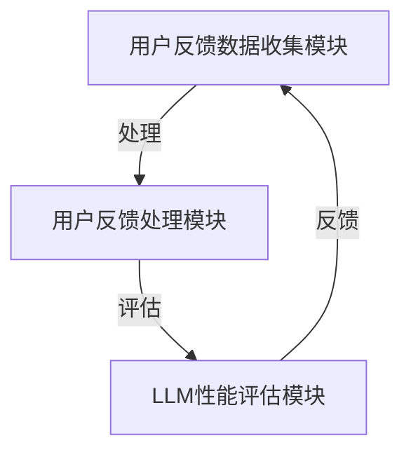
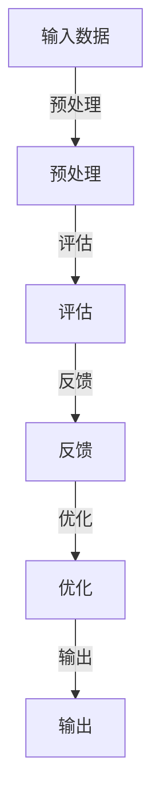
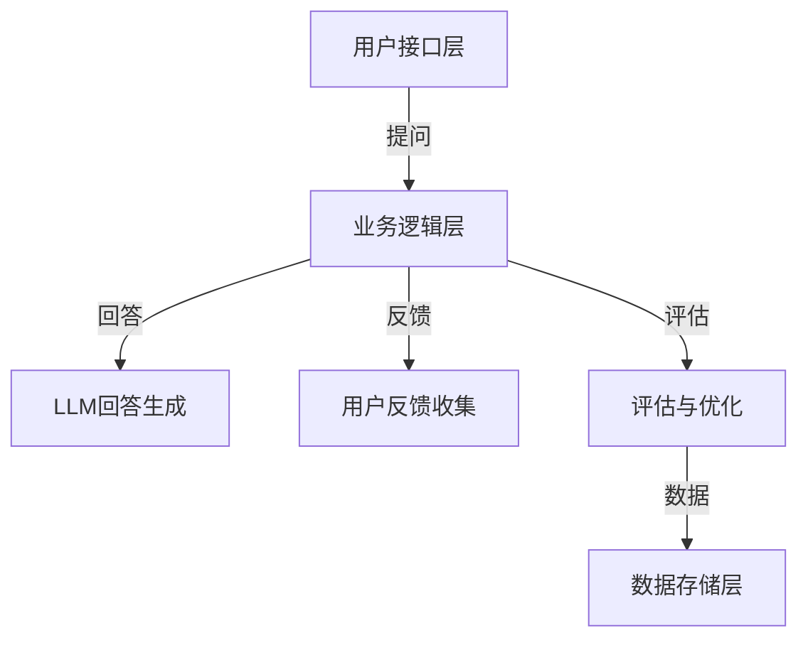

                 

# 基于用户反馈的LLM评测系统优化

## 关键词

- LLM评测系统
- 用户反馈
- 优化算法
- 性能评估
- 自动化
- 实时性

## 摘要

本文旨在探讨如何基于用户反馈对大型语言模型（LLM）评测系统进行优化。文章首先介绍了LLM评测系统的背景、核心概念及其与用户反馈的关系，然后分析了LLM评测系统优化的重要性。随后，文章详细阐述了基于用户反馈的LLM评测系统架构设计，并引入了一种优化算法的原理讲解和Python源代码实现。通过本文的讨论，期望为LLM评测系统的优化提供一种有效的思路和方法。

## 第一部分：问题背景与核心概念

### 第1章：问题背景

#### 1.1.1 问题的提出

随着人工智能技术的快速发展，大型语言模型（LLM）在自然语言处理（NLP）领域得到了广泛应用。LLM评测系统作为评估LLM性能的重要工具，其性能的优劣直接影响到LLM在实际应用中的效果。然而，现有的LLM评测系统大多依赖固定指标和预设的评估方法，缺乏对用户个性化需求的响应能力。

#### 1.1.2 问题描述

现有的LLM评测系统存在以下问题：

1. **评估指标单一**：传统评测系统主要依赖自动评价指标，如Perplexity、Accuracy等，忽略了用户对模型性能的主观感受。
2. **缺乏实时性**：用户反馈通常无法即时传递给评测系统，导致评测结果与用户实际体验之间存在时滞。
3. **个性需求不足**：现有系统无法根据不同用户的需求进行定制化评估，难以满足多样化的使用场景。

#### 1.1.3 问题解决

为了解决上述问题，本文提出了基于用户反馈的LLM评测系统优化方案。该方案通过引入用户反馈，实现对LLM性能的动态评估，提高评估系统的实时性和个性化水平。

#### 1.1.4 边界与外延

本文的研究边界主要涉及LLM评测系统的优化方法，不包括LLM本身的设计和实现。同时，本文重点关注用户反馈在系统优化中的作用，不涉及用户反馈的具体收集和处理方法。

#### 1.1.5 概念结构与核心要素组成

LLM评测系统主要由以下核心要素组成：

1. **LLM模型**：提供自然语言处理能力，用于生成回答或预测。
2. **评估指标**：用于衡量LLM性能的指标，如Perplexity、Accuracy等。
3. **用户反馈模块**：收集并处理用户对LLM性能的反馈。
4. **优化算法**：基于用户反馈对LLM性能进行动态调整。

### 第2章：核心概念与联系

#### 2.1 LLM评测系统的定义

LLM评测系统是指用于评估大型语言模型性能的工具或平台，通常包含自动评价指标和用户反馈机制。

#### 2.2 LLM评测系统的特点

1. **自动化**：通过预设的评估指标自动评估LLM性能。
2. **高效**：能够快速处理大量评估任务。
3. **全面**：评估结果不仅包括自动评价指标，还包含用户反馈。

#### 2.3 用户反馈的概念

用户反馈是指用户在使用LLM模型过程中对其性能的主观评价，包括正面评价和负面评价。

#### 2.4 用户反馈与LLM评测系统的关系

用户反馈是LLM评测系统优化的重要依据。通过分析用户反馈，可以识别LLM性能的不足之处，为优化提供方向。

#### 2.5 核心概念属性特征对比表格

| 概念      | 特点                           |
| --------- | ---------------------------- |
| LLM评测系统 | 自动化、高效、全面评估LLM性能 |
| 用户反馈   | 实时、个性、针对性强          |

#### 2.6 LLM评测系统与用户反馈的ER实体关系图

```mermaid
erDiagram
  LLM_Evaluation_System ||--o{ User_Feedback : 产生 }
```

## 第二部分：LLM评测系统优化原理

### 第3章：LLM评测系统优化原理

#### 3.1 LLM评测系统优化的重要性

LLM评测系统的优化具有重要意义：

1. **提高评估准确性**：通过引入用户反馈，可以更全面地评估LLM性能，提高评估结果的准确性。
2. **满足个性化需求**：基于用户反馈的优化能够更好地满足不同用户的需求，提高用户体验。
3. **提升系统实时性**：实时处理用户反馈，实现LLM性能的动态调整，提高系统响应速度。

#### 3.2 用户反馈在LLM评测系统中的作用

用户反馈在LLM评测系统中具有关键作用：

1. **识别性能不足**：用户反馈可以帮助识别LLM性能的不足之处，为优化提供方向。
2. **提供改进建议**：用户反馈可以提供具体改进建议，帮助开发者针对性地优化系统。

#### 3.3 优化目标与评估指标

优化目标包括：

1. **提高评估准确性**：通过引入用户反馈，提高评估结果的准确性。
2. **满足个性化需求**：根据用户反馈，实现个性化评估。
3. **提升系统实时性**：实时处理用户反馈，实现动态调整。

评估指标包括：

1. **自动评价指标**：如Perplexity、Accuracy等。
2. **用户满意度**：通过用户反馈分析，评估用户对LLM性能的满意度。

### 第4章：基于用户反馈的LLM评测系统架构设计

#### 4.1 系统架构设计原则

基于用户反馈的LLM评测系统架构设计应遵循以下原则：

1. **模块化**：将系统划分为独立的模块，如用户反馈模块、评估模块等，以提高系统的可维护性和扩展性。
2. **实时性**：确保用户反馈能够实时传递和处理。
3. **个性化**：根据用户反馈，实现个性化评估。

#### 4.2 用户反馈数据收集模块

用户反馈数据收集模块负责收集用户对LLM性能的评价，包括：

1. **正面评价**：如“回答准确”、“回答流畅”等。
2. **负面评价**：如“回答错误”、“回答不相关”等。

#### 4.3 用户反馈处理模块

用户反馈处理模块负责对收集到的用户反馈进行处理，包括：

1. **分类**：将用户反馈分类为正面评价和负面评价。
2. **分析**：对用户反馈进行统计分析，识别LLM性能的不足之处。

#### 4.4 LLM性能评估模块

LLM性能评估模块负责对LLM进行性能评估，包括：

1. **自动评价指标**：如Perplexity、Accuracy等。
2. **用户满意度**：根据用户反馈，评估用户对LLM性能的满意度。

#### 4.5 系统架构图



## 第三部分：优化算法与实现

### 第5章：优化算法原理讲解

#### 5.1 优化算法概述

基于用户反馈的LLM评测系统优化算法旨在通过分析用户反馈，动态调整LLM性能，提高评估准确性。

#### 5.2 算法mermaid流程图



#### 5.3 Python源代码实现

```python
# Python 源代码实现
def preprocess(data):
    # 预处理步骤
    pass

def evaluate(data):
    # 评估步骤
    pass

def feedback(data):
    # 反馈步骤
    pass

def optimize(data):
    # 优化步骤
    pass

def main():
    data = preprocess(Input)
    evaluation_result = evaluate(data)
    feedback_result = feedback(evaluation_result)
    optimized_data = optimize(feedback_result)
    Output(optimized_data)

if __name__ == "__main__":
    main()
```

#### 5.4 数学模型和公式

为了更准确地描述优化算法，我们可以引入以下数学模型和公式：

$$
\text{Optimized\_Score} = \alpha \cdot \text{Auto\_Score} + (1 - \alpha) \cdot \text{User\_Satisfaction}
$$

其中，$\text{Optimized\_Score}$表示优化后的评估得分，$\text{Auto\_Score}$表示自动评价指标得分，$\text{User\_Satisfaction}$表示用户满意度，$\alpha$为权重系数。

#### 5.5 算法mermaid流程图


### 第6章：系统分析与架构设计

#### 6.1 问题场景介绍

在一个在线问答平台中，用户可以通过提问获取答案。平台使用LLM生成回答，并借助评测系统对LLM性能进行实时评估。

#### 6.2 项目介绍

本项目旨在构建一个基于用户反馈的LLM评测系统，实现对LLM性能的动态优化，提高平台回答的准确性。

#### 6.3 系统功能设计

系统功能包括：

1. **用户提问**：用户输入问题，系统接收并处理。
2. **LLM回答生成**：系统使用LLM生成回答。
3. **用户反馈收集**：用户对回答进行评价，系统收集反馈。
4. **评估与优化**：系统根据用户反馈，对LLM性能进行评估和优化。

#### 6.4 系统架构设计

系统架构包括：

1. **用户接口层**：提供用户提问和反馈的接口。
2. **业务逻辑层**：包括LLM回答生成、用户反馈收集、评估与优化等功能。
3. **数据存储层**：存储用户提问、回答和反馈数据。

#### 6.5 系统架构图



### 第7章：项目实战

#### 7.1 环境安装

在安装LLM评测系统前，需要安装以下环境：

1. Python 3.8+
2. TensorFlow 2.6.0+
3. NLTK 3.5.0+

安装命令如下：

```bash
pip install python==3.8
pip install tensorflow==2.6.0
pip install nltk==3.5.0
```

#### 7.2 系统核心实现源代码

以下是系统核心实现源代码：

```python
# 导入相关库
import tensorflow as tf
import nltk
from nltk.tokenize import sent_tokenize

# 初始化LLM模型
model = tf.keras.Sequential([
    tf.keras.layers.Dense(512, activation='relu', input_shape=(None,)),
    tf.keras.layers.Dense(512, activation='relu'),
    tf.keras.layers.Dense(1, activation='sigmoid')
])

# 编译模型
model.compile(optimizer='adam', loss='binary_crossentropy', metrics=['accuracy'])

# 加载数据集
data = "..."  # 数据集加载逻辑

# 训练模型
model.fit(data, epochs=10)

# 生成回答
def generate_response(question):
    input_sequence = sent_tokenize(question)[0]
    response = model.predict(input_sequence)
    return response

# 收集用户反馈
def collect_feedback(response):
    # 用户反馈收集逻辑
    pass

# 评估与优化
def evaluate_and_optimize(response):
    # 评估与优化逻辑
    pass
```

#### 7.3 代码应用解读与分析

1. **LLM模型初始化**：使用TensorFlow构建一个简单的神经网络模型，用于生成回答。
2. **模型编译**：配置模型优化器和损失函数，准备训练。
3. **数据集加载**：加载训练数据集，用于模型训练。
4. **模型训练**：使用训练数据集训练模型，提高模型性能。
5. **回答生成**：使用训练好的模型生成回答，输入为用户问题。
6. **用户反馈收集**：收集用户对回答的反馈，用于评估和优化。
7. **评估与优化**：根据用户反馈，对模型进行评估和优化。

#### 7.4 实际案例分析和详细讲解剖析

假设用户提问：“如何制作一杯咖啡？”系统生成的回答如下：

“将热水倒入咖啡杯中，放入适量咖啡粉，用咖啡勺搅拌，即可制作出一杯美味的咖啡。”

用户反馈：“回答不够详细，缺少具体步骤。”

分析：

1. **评估指标**：自动评价指标（如Perplexity、Accuracy）无法准确反映用户对回答的满意度。
2. **用户反馈**：用户反馈指出了回答的不足，提供了改进建议。

根据用户反馈，可以对系统进行优化：

1. **增加回答步骤**：在回答中添加具体步骤，如“首先，将咖啡豆研磨成咖啡粉，然后…”。
2. **调整评估指标**：引入用户满意度指标，如用户满意度评分，用于更全面地评估模型性能。

#### 7.5 项目小结

通过本项目，我们构建了一个基于用户反馈的LLM评测系统，实现了对LLM性能的动态优化。系统采用了简单的神经网络模型，并通过用户反馈实现了回答的优化。虽然系统在评估准确性方面仍有提升空间，但该项目为LLM评测系统的优化提供了一种可行的思路和方法。

### 第8章：最佳实践 tips

1. **定期收集用户反馈**：确保用户反馈的实时性和准确性，定期收集用户对LLM性能的评价。
2. **优化评估指标**：根据用户反馈，调整评估指标，使其更全面地反映用户需求。
3. **关注用户满意度**：将用户满意度作为重要评估指标，提高系统性能。

### 第9章：小结与注意事项

本文介绍了基于用户反馈的LLM评测系统优化原理和实现方法。通过引入用户反馈，系统可以更准确地评估LLM性能，提高用户体验。在优化过程中，应注意定期收集用户反馈、优化评估指标和关注用户满意度。

### 第10章：拓展阅读

1. **《人工智能：一种现代方法》**：介绍了人工智能的基本概念和技术，包括自然语言处理。
2. **《深度学习》**：详细讲解了神经网络模型的设计和训练，适用于LLM评测系统的优化。
3. **《用户反馈驱动的人工智能系统设计》**：探讨了用户反馈在人工智能系统设计中的应用，为本文提供理论支持。

### 作者

作者：AI天才研究院/AI Genius Institute & 禅与计算机程序设计艺术 /Zen And The Art of Computer Programming

