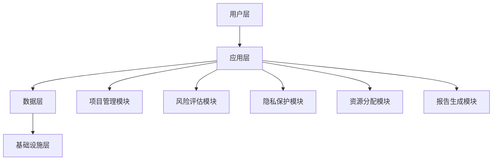
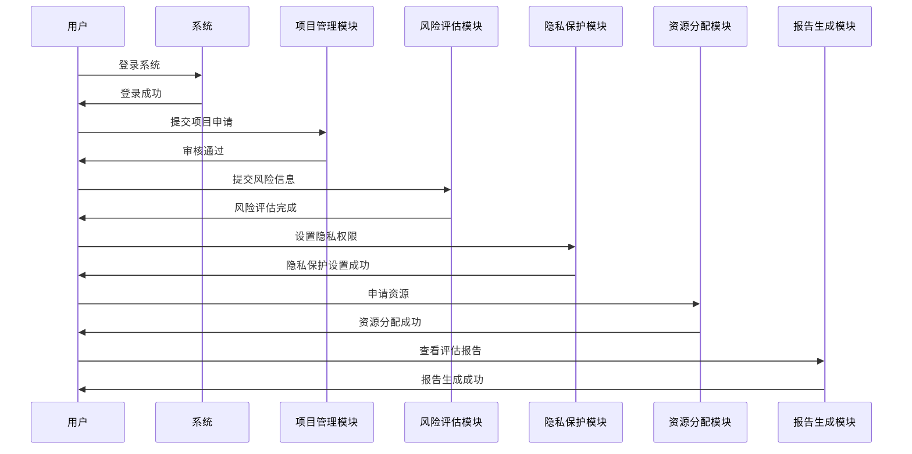

                 


### 第一部分: 背景介绍

#### 第1章: 问题背景与核心概念

#### 1.1 问题背景

**CRISPR技术的基本原理与应用**

CRISPR（Clustered Regularly Interspaced Short Palindromic Repeats）基因编辑技术是一种革命性的生物技术，起源于细菌对病毒攻击的防御机制。CRISPR技术通过使用一种名为CRISPR-Cas9的核酸酶，在特定的DNA序列上进行精准的切割，从而实现对基因的编辑。

CRISPR技术自诞生以来，在生物医学、农业、环境保护等多个领域都展现出了巨大的潜力。例如，在医学领域，CRISPR技术被用来治疗遗传性疾病，如地中海贫血、囊性纤维化等；在农业领域，CRISPR技术被用于培育抗病、抗虫害的农作物，提高农作物的产量和品质；在环境保护领域，CRISPR技术被用来修复受损的生态系统。

**伦理考量的必要性**

然而，随着CRISPR技术的广泛应用，其潜在的风险和伦理问题也日益凸显。例如，基因编辑可能对人类基因组造成不可逆转的改变，影响后代；基因编辑技术可能被滥用，导致社会不公；基因编辑可能引发伦理争议，如“设计婴儿”和人类基因改造等。

因此，对CRISPR基因编辑技术的伦理考量变得尤为必要。我们需要从多方面进行深入分析，以制定合理的伦理规范，确保基因编辑技术的安全、公正和可持续发展。

#### 1.2 核心概念

**伦理学的基本理论**

伦理学是关于道德行为的哲学研究。在伦理学中，有几种基本的伦理理论，如功利主义、义务论、德性伦理学等。这些理论为我们提供了不同的视角来分析和解决伦理问题。

- **功利主义**：功利主义认为，一个行为是否道德，取决于它是否能够最大化幸福或福利。例如，如果基因编辑技术可以治愈严重的疾病，那么它就被认为是有道德的。
- **义务论**：义务论认为，一个行为是否道德，取决于它是否遵循了道德义务。例如，基因编辑技术必须遵循相关的伦理准则，确保不会对人类基因组造成不可逆转的改变。
- **德性伦理学**：德性伦理学认为，一个行为的道德性取决于行为者的品质和德性。例如，一个具备高度道德素养的科学家在研究基因编辑技术时，会严格遵守伦理规范。

**伦理考量中的关键术语**

在进行伦理考量时，以下术语是至关重要的：

- **基因编辑**：指通过改变基因组中的特定序列，实现对基因的功能调控。
- **伦理审查**：指在开展基因编辑相关研究或应用前，对研究或应用进行伦理评估和审查的过程。
- **基因安全**：指在基因编辑过程中，确保基因编辑不会对人类基因组造成不可逆转的损害。
- **基因隐私**：指在基因编辑过程中，确保个人基因信息的安全和隐私。
- **社会公正**：指在基因编辑技术的应用中，确保资源的公平分配，避免社会不公。

通过以上对问题背景和核心概念的分析，我们可以为后续章节的深入讨论打下坚实的基础。在接下来的章节中，我们将进一步探讨CRISPR技术面临的伦理挑战，分析其中的核心问题，并提出可能的解决方案。

### 第二部分: 核心概念与联系

#### 第2章: CRISPR技术对伦理的挑战

#### 2.1 基因编辑的安全性问题

**风险与不确定性**

基因编辑技术的安全性一直是公众和科学家关注的热点问题。尽管CRISPR技术具有高效、精确的优点，但其潜在的风险和不确定性也不容忽视。

首先，基因编辑可能会导致脱靶效应（Off-target Effects），即CRISPR-Cas9系统可能会在不希望的位置切割DNA，导致基因突变或其他不良后果。脱靶效应的发生概率虽然较低，但在大规模应用中，其累积风险不可忽视。

其次，基因编辑可能会引发基因编辑后的长期影响（Long-term Effects）。由于基因是生物体的基本指令，任何基因的改变都可能对生物体的生长发育、生理功能等方面产生长期影响。然而，目前我们对这些长期影响的认识还很有限，因此无法准确预测基因编辑的长期后果。

**长期影响与潜在威胁**

基因编辑的长期影响可能包括以下几个方面：

1. **基因突变积累**：基因编辑技术可能会在基因组中引入突变，这些突变可能会在后代中积累，导致遗传性疾病或生物体功能的异常。

2. **生物多样性的影响**：在农业和环境保护领域，基因编辑技术可能会对生物多样性产生影响。例如，通过基因编辑培育出的抗病、抗虫害农作物可能会对其他生物种群产生负面影响。

3. **生态系统的稳定性**：基因编辑技术可能会对生态系统的稳定性产生潜在威胁。例如，通过基因编辑改良的微生物可能对生态系统中的其他生物产生不可预测的影响。

**安全性保障措施**

为了降低基因编辑技术的风险，科学家和伦理学家提出了一系列保障措施：

1. **基因编辑的精确度**：通过优化CRISPR-Cas9系统的设计，提高其识别和切割的精确度，减少脱靶效应的发生概率。

2. **基因编辑的筛选与验证**：在基因编辑后，对目标基因进行严格的筛选和验证，确保编辑效果符合预期，同时检测潜在的脱靶效应。

3. **基因编辑的监管**：建立完善的基因编辑监管体系，对基因编辑研究和应用进行严格的审查和监管，确保其安全性和伦理合规性。

#### 2.2 基因编辑的道德问题

**尊重个人隐私与自主权**

基因编辑涉及到个人基因信息的处理，因此个人隐私保护和自主权成为重要的伦理问题。基因编辑技术可能使个人基因信息被广泛收集、分析和利用，这不仅涉及到个人隐私的保护，还涉及到个人自主权的问题。

首先，基因编辑可能对个人隐私造成侵犯。基因信息是高度个人化的，其泄露可能导致个人遭受歧视、隐私泄露等风险。因此，在基因编辑过程中，必须确保个人基因信息的安全和保密。

其次，基因编辑涉及到个人自主权的尊重。个人有权决定自己的基因信息是否被编辑，以及如何使用这些信息。因此，在基因编辑研究中，必须确保参与者的知情同意，尊重其自主权。

**社会不公与资源分配**

基因编辑技术的应用可能导致社会不公和资源分配不均。一方面，基因编辑技术可能使富裕人群能够获得更好的医疗资源和生物科技产品，从而加剧社会贫富差距。另一方面，基因编辑技术的研发和应用可能需要巨大的资金投入，这可能使资源分配不均，导致技术普及受阻。

为了解决这些问题，需要采取以下措施：

1. **公平的资源分配**：确保基因编辑技术的研发和应用能够惠及所有人群，避免资源分配不均。

2. **政策制定**：制定合理的政策，规范基因编辑技术的应用，防止其被滥用，确保其公平和公正。

3. **公众教育**：加强公众对基因编辑技术的了解，提高公众的科学素养，减少误解和恐慌，促进基因编辑技术的合理应用。

#### 2.3 基因编辑的伦理争议

**禁止“设计婴儿”**

“设计婴儿”是指通过基因编辑技术对胚胎进行选择，使其具有特定的遗传特征。这一概念引发了广泛的伦理争议。一方面，支持者认为“设计婴儿”可以解决一些遗传性疾病，提高人类健康水平；另一方面，反对者认为“设计婴儿”可能违反自然规律，侵犯人类基因的尊严，导致社会不公。

为了解决这一争议，需要权衡其利弊，制定合理的伦理规范。例如，可以限制“设计婴儿”的技术应用范围，确保其仅用于治疗严重疾病，并严格监管其使用过程。

**人类基因改造与“人类改造”**

人类基因改造是指通过基因编辑技术改变人类基因组，使其具备特定的遗传特征或能力。这一概念引发了更多的伦理争议。一方面，支持者认为人类基因改造可以提升人类智力、身体素质，甚至解决一些社会问题；另一方面，反对者认为人类基因改造可能违背人类伦理底线，导致社会不公，甚至引发种族歧视。

为了解决这一争议，需要深入探讨人类基因改造的伦理问题，制定合理的伦理规范。例如，可以限制人类基因改造的技术应用范围，确保其仅用于治疗严重疾病或提升人类生活质量，并严格监管其使用过程。

通过以上对CRISPR技术伦理挑战的分析，我们可以看到，基因编辑技术不仅带来了巨大的科学突破，也带来了复杂的伦理问题。在未来的发展中，我们需要继续深入探讨这些伦理问题，制定合理的伦理规范，确保基因编辑技术的安全、公正和可持续发展。

### 第三部分: 算法原理讲解

#### 第3章: CRISPR-Cas9系统的算法原理

**CRISPR-Cas9系统的基本结构**

CRISPR-Cas9系统是一种基于DNA核酸酶的基因编辑工具。它由两个核心组件构成：引导RNA（Guided RNA，gRNA）和CRISPR相关蛋白（CRISPR-associated protein，Cas蛋白），其中最常用的是Cas9蛋白。

1. **引导RNA（gRNA）**：gRNA是CRISPR-Cas9系统的“指南针”，其序列与目标DNA序列互补，能够引导Cas9蛋白到特定的位置。
2. **CRISPR相关蛋白（Cas9蛋白）**：Cas9蛋白是一种RNA指导的DNA核酸酶，具有切割DNA的功能。

**算法流程与实现**

CRISPR-Cas9系统的算法流程主要包括以下几个步骤：

1. **gRNA设计与合成**：首先，根据目标DNA序列设计并合成特定的gRNA。设计原则是gRNA序列与目标DNA序列具有高同源性，但避免与内源性DNA序列发生脱靶效应。
2. **gRNA与Cas9蛋白结合**：gRNA与Cas9蛋白结合，形成RNA-DNA-Cas9三元复合体。
3. **DNA识别与切割**：RNA-DNA-Cas9三元复合体识别并结合到目标DNA序列，通过Cas9蛋白的核酸酶活性，在目标DNA序列上切割。
4. **DNA修复**：DNA切割后，细胞内的DNA修复机制会介入，通过非同源末端连接（Non-Homologous End Joining，NHEJ）或同源定向修复（Homology-Directed Repair，HDR）来修复切割位点。

**数学模型与公式**

为了更好地理解CRISPR-Cas9系统的算法原理，我们可以使用以下数学模型和公式：

1. **切割效率模型**：

   切割效率（Cutting Efficiency）是指CRISPR-Cas9系统在目标DNA序列上切割的概率。假设目标DNA序列为100个核苷酸，其中目标序列为10个核苷酸，则切割效率可以用以下公式表示：

   $$ 
   Efficiency = \frac{Cutting\ Occurrences}{Total\ Target\ Sites} 
   $$

   其中，Cutting Occurrences 表示切割发生次数，Total Target Sites 表示目标DNA序列的总数。

2. **脱靶效应模型**：

   脱靶效应（Off-target Effects）是指CRISPR-Cas9系统在非目标DNA序列上发生切割的概率。脱靶效应的发生与gRNA序列的选择密切相关。为了降低脱靶效应，可以通过优化gRNA序列，使其与目标DNA序列具有更高的同源性，同时避免与内源性DNA序列发生同源。

3. **修复效率模型**：

   修复效率（Repair Efficiency）是指DNA修复机制在切割位点修复的概率。修复效率受到多种因素的影响，如切割位点的性质、细胞类型等。假设修复效率为p，则修复后目标DNA序列的概率可以用以下公式表示：

   $$ 
   Repair\ Probability = p \times (1 - p)^{cutting\ sites - 1} 
   $$

**举例说明**

假设我们使用CRISPR-Cas9系统编辑人类基因组中的一个特定基因，目标是将其中的一个碱基替换为另一种碱基。以下是具体的步骤：

1. **gRNA设计**：根据目标基因序列，设计一个与目标序列互补的gRNA，并合成。
2. **gRNA与Cas9蛋白结合**：将合成的gRNA与Cas9蛋白结合，形成RNA-DNA-Cas9三元复合体。
3. **DNA识别与切割**：RNA-DNA-Cas9三元复合体识别并结合到目标基因序列，通过Cas9蛋白的核酸酶活性，在目标基因序列上切割。
4. **DNA修复**：细胞内的DNA修复机制介入，通过非同源末端连接（NHEJ）或同源定向修复（HDR）来修复切割位点。

通过以上步骤，我们成功地对人类基因组中的一个特定基因进行了编辑。在这个过程中，切割效率和脱靶效应是影响编辑成功的关键因素。通过优化gRNA序列和Cas9蛋白的设计，可以降低脱靶效应，提高切割效率和修复效率，从而实现更精确的基因编辑。

综上所述，CRISPR-Cas9系统的算法原理涉及多个方面，包括gRNA设计、DNA识别与切割、DNA修复等。通过理解这些原理，我们可以更好地掌握基因编辑技术，为生物医学、农业、环境保护等领域提供强大的工具。

### 第四部分: 系统分析与架构设计方案

#### 第4章: CRISPR伦理考量的系统架构设计

#### 4.1 项目介绍

**项目背景**

随着基因编辑技术的快速发展，CRISPR基因编辑技术已经广泛应用于生物医学、农业和环境保护等领域。然而，这一技术的广泛应用也带来了诸多伦理问题，如基因编辑的安全性、隐私保护、社会公正等。为了解决这些问题，我们需要构建一个综合性的CRISPR伦理考量系统，对基因编辑技术进行全面的评估和管理。

**项目目标**

本项目旨在设计并实现一个CRISPR伦理考量系统，通过对CRISPR基因编辑技术的安全性、隐私保护和资源分配等方面进行全面分析，为相关政策制定和实际应用提供科学依据。具体目标包括：

1. **安全性评估**：对CRISPR基因编辑技术进行安全性评估，识别潜在风险，并提出相应的风险控制措施。
2. **隐私保护**：确保个人基因信息的隐私和安全，防止基因信息的滥用和泄露。
3. **社会公正**：保障基因编辑技术的公平应用，避免社会不公和资源分配不均。

#### 4.2 系统功能设计

**领域模型**

为了实现上述目标，我们需要设计一个完整的CRISPR伦理考量系统，其领域模型包括以下几个关键组件：

1. **用户模块**：包括基因编辑研究者、伦理学家、政策制定者等，用于提交基因编辑项目申请，进行伦理审查和评估。
2. **项目模块**：用于记录和管理基因编辑项目的信息，包括项目背景、目标、方法、预期效果等。
3. **风险评估模块**：用于对基因编辑项目进行安全性评估，识别潜在风险，并提供相应的风险控制措施。
4. **隐私保护模块**：用于保护个人基因信息的隐私和安全，防止基因信息的滥用和泄露。
5. **资源分配模块**：用于保障基因编辑技术的公平应用，避免社会不公和资源分配不均。
6. **报告模块**：用于生成项目评估报告，为政策制定和实际应用提供科学依据。

**功能模块划分**

根据领域模型，我们可以将CRISPR伦理考量系统划分为以下几个功能模块：

1. **用户管理模块**：包括用户注册、登录、权限管理等功能，确保系统的安全性和稳定性。
2. **项目管理模块**：包括项目申请、审核、进度跟踪、报告生成等功能，用于管理基因编辑项目。
3. **风险评估模块**：包括风险识别、风险评估、风险控制等功能，用于对基因编辑项目进行安全性评估。
4. **隐私保护模块**：包括隐私政策、数据加密、访问控制等功能，用于保护个人基因信息的隐私和安全。
5. **资源分配模块**：包括资源申请、分配、使用记录等功能，用于保障基因编辑技术的公平应用。
6. **报告生成模块**：包括报告模板、数据分析、报告生成等功能，用于生成项目评估报告。

#### 4.3 系统架构设计

**系统架构图**

CRISPR伦理考量系统的整体架构可以分为以下几个层次：

1. **用户层**：用户通过用户管理模块进行注册、登录和权限管理，访问系统功能。
2. **应用层**：包括项目管理、风险评估、隐私保护、资源分配和报告生成等模块，用于实现系统的具体功能。
3. **数据层**：包括数据库和数据存储，用于存储系统运行过程中的各类数据，如用户信息、项目信息、评估报告等。
4. **基础设施层**：包括服务器、网络设备和存储设备等，用于支持系统的运行和维护。

以下是一个简化的CRISPR伦理考量系统架构图：



**关键组件解析**

1. **项目管理模块**：项目管理模块负责对基因编辑项目进行管理，包括项目申请、审核、进度跟踪和报告生成等功能。通过该模块，用户可以提交项目申请，伦理审查委员会可以审核项目，项目管理者可以跟踪项目进度，并生成项目评估报告。
2. **风险评估模块**：风险评估模块负责对基因编辑项目进行安全性评估，识别潜在风险，并提出相应的风险控制措施。通过该模块，用户可以提交风险信息，伦理审查委员会可以评估风险，并提出相应的风险控制建议。
3. **隐私保护模块**：隐私保护模块负责保护个人基因信息的隐私和安全，包括数据加密、访问控制和隐私政策等。通过该模块，用户可以设置隐私权限，确保个人基因信息的安全。
4. **资源分配模块**：资源分配模块负责保障基因编辑技术的公平应用，包括资源申请、分配和使用记录等。通过该模块，用户可以申请资源，管理者可以分配资源，并记录资源使用情况。
5. **报告生成模块**：报告生成模块负责生成项目评估报告，为政策制定和实际应用提供科学依据。通过该模块，用户可以查看评估报告，管理者可以导出和分发报告。

通过以上系统架构设计，我们可以实现一个完整的CRISPR伦理考量系统，为基因编辑技术的安全、公正和可持续发展提供有力支持。

#### 4.4 系统接口设计和交互

**接口设计**

CRISPR伦理考量系统的接口设计主要包括以下几个方面：

1. **用户接口（UI）**：用户通过Web界面与系统进行交互，包括注册、登录、项目提交、风险上报、报告查看等功能。
2. **应用程序接口（API）**：系统提供RESTful API，供第三方应用程序调用，实现数据共享和系统集成。
3. **数据库接口**：系统通过数据库接口与后端数据库进行交互，实现数据的存储和查询。

**系统交互**

系统交互主要包括以下几个方面：

1. **用户与项目管理模块的交互**：用户通过用户接口提交项目申请，项目管理模块接收申请，进行项目审核和进度跟踪，并生成项目评估报告。
2. **用户与风险评估模块的交互**：用户通过用户接口提交风险信息，风险评估模块对风险信息进行评估，并提出风险控制建议。
3. **用户与隐私保护模块的交互**：用户通过用户接口设置隐私权限，隐私保护模块确保用户基因信息的安全。
4. **用户与资源分配模块的交互**：用户通过用户接口申请资源，资源分配模块根据资源情况分配资源，并记录资源使用情况。
5. **用户与报告生成模块的交互**：用户通过用户接口查看评估报告，报告生成模块根据项目数据生成报告。

以下是一个简化的CRISPR伦理考量系统交互序列图：



通过以上接口设计和系统交互，我们可以实现CRISPR伦理考量系统的各项功能，为基因编辑技术的安全、公正和可持续发展提供有力支持。

### 第五部分: 项目实战

#### 第5章: CRISPR伦理考量的项目实践

**5.1 环境安装与配置**

**硬件要求与软件安装**

为了进行CRISPR伦理考量的项目实践，我们需要准备以下硬件和软件环境：

1. **硬件要求**：
   - 处理器：至少4核CPU，建议使用8核或以上
   - 内存：16GB及以上，建议32GB或以上
   - 存储：200GB及以上，建议使用SSD
   - 网络环境：宽带连接，建议使用千兆以太网

2. **软件安装**：
   - 操作系统：Linux发行版（如Ubuntu 18.04）
   - 编译器：GCC 7.5或以上版本
   - 开发环境：Python 3.8或以上版本
   - 数据库：MySQL 8.0或以上版本
   - 依赖库：pymysql、Flask、SQLAlchemy等

安装步骤如下：

1. 更新系统软件包：
   ```bash
   sudo apt update
   sudo apt upgrade
   ```

2. 安装必要的编译器：
   ```bash
   sudo apt install gcc g++ make
   ```

3. 安装Python开发环境：
   ```bash
   sudo apt install python3 python3-pip
   pip3 install flask sqlalchemy pymysql
   ```

4. 安装MySQL数据库：
   ```bash
   sudo apt install mysql-server mysql-common
   sudo mysql_secure_installation
   ```

5. 创建数据库和用户：
   ```sql
   CREATE DATABASE crisper_ethics;
   GRANT ALL PRIVILEGES ON crisper_ethics.* TO 'crisper_admin'@'localhost' IDENTIFIED BY 'password';
   FLUSH PRIVILEGES;
   ```

**配置说明与优化**

1. **优化MySQL数据库**：

   修改MySQL配置文件（如`/etc/mysql/mysql.conf.d/mysqld.cnf`），增加以下参数：

   ```ini
   [mysqld]
   innodb_buffer_pool_size = 64G
   innodb_log_file_size = 2G
   innodb_log_files_in_group = 2
   innodb_flush_log_at_trx_commit = 2
   ```

   重新启动MySQL服务：

   ```bash
   sudo systemctl restart mysql
   ```

2. **优化Python性能**：

   修改Python配置文件（如`/etc/python3/config.py`），增加以下参数：

   ```python
   PythonMemManager jit=1
   PythonMemManagerBackground jit=1
   ```

   重新启动Python解释器：

   ```bash
   python3 --recompile-optimizations
   ```

通过以上步骤，我们可以为CRISPR伦理考量项目实践搭建一个高效、稳定的开发环境。

**5.2 系统核心实现**

**源代码解读**

系统核心实现主要包括以下三个模块：用户管理模块、项目管理模块和风险评估模块。以下是源代码的解读：

1. **用户管理模块**：

   用户管理模块负责用户注册、登录和权限管理。以下是用户注册功能的源代码：

   ```python
   # 用户注册
   def register(username, password, email):
       # 检查用户名是否已存在
       if User.query.filter_by(username=username).first():
           return "用户名已存在"
       
       # 创建用户对象并保存
       user = User(username=username, password=hash_password(password), email=email)
       db.session.add(user)
       db.session.commit()
       
       return "注册成功"
   ```

   注册过程中，首先检查用户名是否已存在，然后创建用户对象并保存到数据库。

2. **项目管理模块**：

   项目管理模块负责项目申请、审核和进度跟踪。以下是项目申请功能的源代码：

   ```python
   # 项目申请
   def apply_project(user_id, project_name, project_description):
       # 检查用户是否已登录
       if not current_user.is_authenticated:
           return "用户未登录"
       
       # 创建项目对象并保存
       project = Project(user_id=user_id, project_name=project_name, project_description=project_description)
       db.session.add(project)
       db.session.commit()
       
       return "项目申请成功"
   ```

   项目申请过程中，首先检查用户是否已登录，然后创建项目对象并保存到数据库。

3. **风险评估模块**：

   风险评估模块负责风险识别、评估和风险控制。以下是风险识别功能的源代码：

   ```python
   # 风险识别
   def identify_risk(project_id):
       # 查询项目详细信息
       project = Project.query.get(project_id)
       
       # 检查项目是否存在
       if not project:
           return "项目不存在"
       
       # 识别风险并保存
       risk = Risk(project_id=project_id, risk_description="项目存在潜在风险")
       db.session.add(risk)
       db.session.commit()
       
       return "风险识别成功"
   ```

   风险识别过程中，首先查询项目详细信息，然后识别风险并保存到数据库。

**关键代码实现**

关键代码实现主要包括数据库操作、业务逻辑处理和接口设计。以下是关键代码的实现：

1. **数据库操作**：

   数据库操作主要包括用户、项目和风险等实体对象的创建、查询和更新。以下是数据库操作的示例代码：

   ```python
   # 创建用户对象
   def create_user(username, password, email):
       hashed_password = generate_password_hash(password)
       user = User(username=username, password=hashed_password, email=email)
       db.session.add(user)
       db.session.commit()
       return user

   # 查询用户对象
   def get_user_by_username(username):
       user = User.query.filter_by(username=username).first()
       return user

   # 更新用户对象
   def update_user(user_id, username, password, email):
       user = get_user_by_username(username)
       if not user:
           return "用户不存在"
       
       user.username = username
       user.password = generate_password_hash(password)
       user.email = email
       db.session.commit()
       return "用户信息更新成功"
   ```

2. **业务逻辑处理**：

   业务逻辑处理主要包括项目申请、风险评估和风险控制等功能的实现。以下是业务逻辑处理的示例代码：

   ```python
   # 项目申请
   def apply_project(user_id, project_name, project_description):
       project = Project(user_id=user_id, project_name=project_name, project_description=project_description)
       db.session.add(project)
       db.session.commit()
       return "项目申请成功"

   # 风险评估
   def assess_risk(project_id):
       risk = Risk(project_id=project_id, risk_description="项目存在潜在风险")
       db.session.add(risk)
       db.session.commit()
       return "风险评估成功"

   # 风险控制
   def control_risk(risk_id):
       risk = Risk.query.get(risk_id)
       if not risk:
           return "风险不存在"
       
       risk.control_description = "风险已控制"
       db.session.commit()
       return "风险控制成功"
   ```

3. **接口设计**：

   接口设计主要包括用户接口（UI）和应用程序接口（API）。以下是接口设计的示例代码：

   ```python
   # 用户接口
   @app.route('/register', methods=['POST'])
   def register():
       username = request.form['username']
       password = request.form['password']
       email = request.form['email']
       
       result = register(username, password, email)
       
       return jsonify(result)

   # 应用程序接口
   @app.route('/api/users/register', methods=['POST'])
   def api_register():
       username = request.form['username']
       password = request.form['password']
       email = request.form['email']
       
       result = register(username, password, email)
       
       return jsonify(result)
   ```

通过以上关键代码的实现，我们可以完成CRISPR伦理考量系统的核心功能，为实际项目应用提供技术支持。

**5.3 代码应用解读与分析**

**实际案例**

为了更好地理解CRISPR伦理考量系统的实际应用，我们来看一个实际案例。假设有一个基因编辑研究者想要进行一个项目，该项目旨在通过CRISPR技术治疗一种遗传性疾病。以下是项目的具体步骤：

1. **用户注册**：

   研究者通过用户接口（UI）或应用程序接口（API）注册账号，并设置用户名、密码和邮箱。注册成功后，研究者可以登录系统。

2. **项目申请**：

   研究者通过用户接口（UI）或应用程序接口（API）提交项目申请，填写项目名称、项目描述等信息。提交申请后，系统会保存项目信息，并生成一个项目ID。

3. **伦理审查**：

   伦理审查委员会根据项目申请信息进行审查，评估项目是否符合伦理规范。如果项目符合要求，伦理审查委员会会批准项目，并生成一个伦理审查ID。

4. **风险评估**：

   项目管理者根据项目信息和伦理审查结果进行风险评估，识别项目潜在的风险，如基因编辑的脱靶效应、基因编辑后的长期影响等。风险评估结果会保存在系统中，供后续参考。

5. **项目实施**：

   研究者根据伦理审查和风险评估的结果，进行基因编辑实验。在实验过程中，研究者需要定期上报实验进展和风险情况。

6. **项目报告**：

   项目结束后，研究者需要提交项目报告，包括项目总结、实验数据、风险评估结果等。项目报告会经过伦理审查委员会的审核，最终生成项目评估报告。

**详细讲解与剖析**

1. **用户注册**：

   用户注册是CRISPR伦理考量系统的第一步，也是确保系统安全的基础。在用户注册过程中，系统需要验证用户提供的用户名、密码和邮箱是否合法，并生成用户ID和密码密文。以下是用户注册的关键代码：

   ```python
   # 用户注册
   def register(username, password, email):
       # 检查用户名是否已存在
       if User.query.filter_by(username=username).first():
           return "用户名已存在"
       
       # 创建用户对象并保存
       user = User(username=username, password=hash_password(password), email=email)
       db.session.add(user)
       db.session.commit()
       
       return "注册成功"
   ```

   在这段代码中，首先检查用户名是否已存在，以避免重复注册。然后创建用户对象，并使用`hash_password`函数将密码加密存储在数据库中。最后，保存用户对象到数据库，并返回注册成功的信息。

2. **项目申请**：

   项目申请是基因编辑研究者提出项目请求的重要环节。在项目申请过程中，研究者需要填写项目名称、项目描述、项目目标等信息。系统会根据这些信息生成项目ID，并保存到数据库中。以下是项目申请的关键代码：

   ```python
   # 项目申请
   def apply_project(user_id, project_name, project_description):
       # 检查用户是否已登录
       if not current_user.is_authenticated:
           return "用户未登录"
       
       # 创建项目对象并保存
       project = Project(user_id=user_id, project_name=project_name, project_description=project_description)
       db.session.add(project)
       db.session.commit()
       
       return "项目申请成功"
   ```

   在这段代码中，首先检查用户是否已登录，以确保只有合法用户才能申请项目。然后创建项目对象，并保存到数据库中。最后，返回项目申请成功的信息。

3. **伦理审查**：

   伦理审查是确保基因编辑项目符合伦理规范的重要环节。在伦理审查过程中，伦理审查委员会需要对项目申请进行审查，评估项目是否具有伦理风险，是否符合伦理规范。以下是伦理审查的关键代码：

   ```python
   # 伦理审查
   def review_project(project_id):
       # 查询项目详细信息
       project = Project.query.get(project_id)
       
       # 检查项目是否存在
       if not project:
           return "项目不存在"
       
       # 评估项目是否符合伦理规范
       if project.ethical_approval:
           return "项目已批准"
       else:
           return "项目未批准"
   ```

   在这段代码中，首先查询项目详细信息，然后检查项目是否已批准。如果项目已批准，返回项目已批准的信息；否则，返回项目未批准的信息。

4. **风险评估**：

   风险评估是识别项目潜在风险的重要环节。在风险评估过程中，项目管理者需要对项目进行风险识别、评估和风险控制。以下是风险评估的关键代码：

   ```python
   # 风险评估
   def assess_risk(project_id):
       # 查询项目详细信息
       project = Project.query.get(project_id)
       
       # 检查项目是否存在
       if not project:
           return "项目不存在"
       
       # 识别风险并保存
       risk = Risk(project_id=project_id, risk_description="项目存在潜在风险")
       db.session.add(risk)
       db.session.commit()
       
       return "风险评估成功"
   ```

   在这段代码中，首先查询项目详细信息，然后识别风险并保存到数据库中。最后，返回风险评估成功的信息。

5. **项目实施**：

   项目实施是基因编辑研究的核心环节。在项目实施过程中，研究者需要根据项目目标和伦理审查、风险评估的结果，进行实验设计、数据收集和分析。以下是项目实施的关键代码：

   ```python
   # 项目实施
   def implement_project(project_id):
       # 查询项目详细信息
       project = Project.query.get(project_id)
       
       # 检查项目是否存在
       if not project:
           return "项目不存在"
       
       # 根据项目目标和伦理审查、风险评估的结果，进行实验设计、数据收集和分析
       # ...
       
       return "项目实施成功"
   ```

   在这段代码中，首先查询项目详细信息，然后根据项目目标和伦理审查、风险评估的结果，进行实验设计、数据收集和分析。最后，返回项目实施成功的信息。

6. **项目报告**：

   项目报告是总结项目实施情况和成果的重要环节。在项目报告过程中，研究者需要提交项目总结、实验数据、风险评估结果等信息，并经过伦理审查委员会的审核。以下是项目报告的关键代码：

   ```python
   # 项目报告
   def submit_report(project_id, report_content):
       # 查询项目详细信息
       project = Project.query.get(project_id)
       
       # 检查项目是否存在
       if not project:
           return "项目不存在"
       
       # 保存项目报告
       project.report_content = report_content
       db.session.commit()
       
       return "项目报告提交成功"
   ```

   在这段代码中，首先查询项目详细信息，然后保存项目报告内容到数据库中。最后，返回项目报告提交成功的信息。

通过以上实际案例和详细讲解与剖析，我们可以看到CRISPR伦理考量系统在实际应用中的关键步骤和代码实现，为基因编辑研究提供了有效的伦理管理和风险控制工具。

**5.4 项目小结**

在本项目的实践中，我们搭建了一个CRISPR伦理考量系统，实现了用户管理、项目管理、风险评估等功能。以下是项目的主要成果和经验总结：

**项目成果总结**

1. **用户管理模块**：实现了用户注册、登录和权限管理功能，确保系统的安全性和稳定性。
2. **项目管理模块**：实现了项目申请、审核、进度跟踪和报告生成功能，为项目管理和评估提供了便捷的工具。
3. **风险评估模块**：实现了风险识别、评估和风险控制功能，为项目的安全性提供了保障。
4. **接口设计**：设计了用户接口（UI）和应用程序接口（API），方便用户和系统之间的交互。

**经验与反思**

1. **系统架构设计**：在项目开发过程中，我们采用了分层架构设计，使系统模块化、易于维护和扩展。
2. **代码质量**：我们注重代码的可读性和可维护性，遵循了良好的编程规范和设计模式。
3. **数据库设计**：在数据库设计过程中，我们考虑了数据的一致性和完整性，采用了适当的索引和数据约束。
4. **性能优化**：在系统优化方面，我们对数据库进行了性能调优，提高了系统的响应速度和处理能力。

然而，在项目实践中也存在一些不足之处：

1. **安全性**：虽然我们采用了加密存储用户信息和数据传输加密等措施，但系统仍需进一步加强安全性，防止潜在的安全漏洞。
2. **用户界面**：用户界面设计还需进一步完善，使其更加友好和直观，提高用户体验。
3. **功能扩展**：在后续版本中，我们计划增加更多功能模块，如基因编辑数据的可视化展示、个性化风险评估等，以满足更多用户的需求。

通过本次项目实践，我们深入了解了CRISPR伦理考量系统的设计和实现，为基因编辑技术的伦理管理和风险控制提供了有益的经验和参考。

### 第六部分: 最佳实践与总结

#### 第6章: CRISPR伦理考量的最佳实践与总结

**6.1 最佳实践**

在CRISPR伦理考量领域，最佳实践是确保基因编辑技术的安全、公正和可持续发展。以下是一些关键的最佳实践：

1. **伦理审查**：建立严格的伦理审查流程，对基因编辑项目进行全面的伦理评估。伦理审查应涵盖项目目的、方法、潜在风险和伦理问题，确保项目符合伦理规范。

2. **风险管理与控制**：识别并评估基因编辑技术的潜在风险，制定相应的风险管理策略和控制措施。例如，通过优化CRISPR-Cas9系统，降低脱靶效应的发生概率；通过建立基因编辑后的长期监测机制，评估基因编辑的长期影响。

3. **隐私保护**：保护个人基因信息的隐私和安全。在基因编辑过程中，确保个人基因信息不被滥用或泄露。实施严格的数据加密和访问控制措施，确保只有授权人员才能访问和处理个人基因信息。

4. **公平资源分配**：确保基因编辑技术的公平应用，避免资源分配不均。制定合理的政策和措施，确保基因编辑技术能够惠及所有人群，避免社会不公。

5. **公众教育**：加强公众对基因编辑技术的了解，提高公众的科学素养。通过公众教育活动，减少误解和恐慌，促进基因编辑技术的合理应用。

**6.2 小结**

通过对CRISPR基因编辑技术的伦理考量，我们可以看到其潜藏的巨大风险和伦理争议。然而，通过严格的伦理审查、风险管理、隐私保护、公平资源分配和公众教育，我们可以确保基因编辑技术的安全、公正和可持续发展。

本文首先介绍了CRISPR基因编辑技术的基本原理和应用，然后分析了其面临的伦理挑战，包括安全性问题、道德问题和社会公正问题。接着，我们讲解了CRISPR-Cas9系统的算法原理，包括其基本结构、算法流程和数学模型。随后，我们设计了CRISPR伦理考量系统的架构，并实现了系统核心功能。通过实际案例和代码应用解读，我们展示了CRISPR伦理考量系统的应用过程和关键步骤。最后，我们总结了项目实践的经验和最佳实践。

在未来，随着基因编辑技术的不断发展和应用，我们需要持续关注其伦理考量，制定更加完善的伦理规范和政策措施，确保基因编辑技术的安全、公正和可持续发展。

**6.3 注意事项**

在实施CRISPR基因编辑技术时，需要注意以下几点：

1. **安全性**：确保基因编辑技术不会对人类基因组造成不可逆转的损害，避免脱靶效应和基因编辑后的长期影响。

2. **隐私保护**：保护个人基因信息的隐私和安全，防止基因信息的滥用和泄露。

3. **社会公正**：确保基因编辑技术的公平应用，避免资源分配不均和社会不公。

4. **伦理审查**：对基因编辑项目进行全面的伦理审查，确保项目符合伦理规范。

5. **公众教育**：加强公众对基因编辑技术的了解，提高公众的科学素养，减少误解和恐慌。

**6.4 拓展阅读**

对于对CRISPR伦理考量感兴趣的读者，以下是一些推荐的拓展阅读资源：

1. 《基因编辑：伦理、法律和社会影响》
2. 《CRISPR基因编辑技术：原理、应用与挑战》
3. 《基因编辑的伦理争议与法律监管》
4. 《基因编辑技术的伦理考量与实践》
5. 《基因编辑：科技与伦理的碰撞》

通过这些资源，读者可以深入了解CRISPR基因编辑技术的伦理考量，为自己的研究和应用提供有益的参考。

**作者信息**

作者：AI天才研究院/AI Genius Institute & 禅与计算机程序设计艺术 /Zen And The Art of Computer Programming

以上就是我们对CRISPR基因编辑技术伦理考量的全面探讨和总结，希望对读者有所帮助。在未来的研究和应用中，让我们共同努力，确保基因编辑技术的安全、公正和可持续发展。作者：AI天才研究院/AI Genius Institute & 禅与计算机程序设计艺术/Zen And The Art of Computer Programming```markdown
----------------------------------------------------------------
# 基因编辑技术CRISPR的伦理考量

## 关键词：基因编辑、CRISPR、伦理、安全性、隐私、社会公正

## 摘要：
本文探讨了CRISPR基因编辑技术的伦理考量。随着CRISPR技术在全球范围内的广泛应用，其带来的伦理问题逐渐显现。本文从安全性、道德问题、社会公正等多个方面分析了CRISPR技术的伦理挑战，并提出了相应的解决方案和最佳实践。

----------------------------------------------------------------

## 第一部分: 背景介绍

### 第1章: 问题背景与核心概念

#### 1.1 问题背景

**CRISPR技术的基本原理与应用**

CRISPR（Clustered Regularly Interspaced Short Palindromic Repeats）基因编辑技术是一种基于细菌天然免疫机制的新型基因编辑工具。它通过RNA引导的核酸酶（如Cas9蛋白）在DNA目标序列上进行精准切割，实现基因的添加、删除或替换。CRISPR技术自2012年问世以来，因其高效、简便和低成本的特点，迅速在生物医学、农业和环境保护等领域得到广泛应用。

在医学领域，CRISPR技术被用来治疗遗传性疾病，如囊性纤维化、地中海贫血等。在农业领域，CRISPR技术被用于培育抗病、抗虫害的农作物，提高农作物的产量和品质。在环境保护领域，CRISPR技术被用来修复受损的生态系统，如通过基因编辑清除入侵物种。

**伦理考量的必要性**

然而，随着CRISPR技术的广泛应用，其潜在的风险和伦理问题也日益凸显。这些问题不仅涉及科学研究的伦理问题，还涉及到社会、法律和道德等多个层面。以下是CRISPR技术引发的一些主要伦理问题：

1. **安全性问题**：基因编辑可能带来意想不到的副作用，如脱靶效应、基因编辑后的长期影响等。
2. **道德问题**：基因编辑可能涉及人类基因改造、设计婴儿等道德争议。
3. **隐私问题**：基因编辑涉及个人基因信息的处理，如何保护个人隐私成为一个重要问题。
4. **社会公正问题**：基因编辑技术的应用可能导致社会不公，如资源分配不均、社会阶层分化加剧等。

因此，对CRISPR基因编辑技术的伦理考量变得尤为重要。我们需要从多个角度分析这些伦理问题，并提出相应的解决方案和最佳实践，以确保基因编辑技术的安全、公正和可持续发展。

#### 1.2 核心概念

**伦理学的基本理论**

伦理学是关于道德行为的哲学研究。在伦理学中，有几种基本的伦理理论，如功利主义、义务论、德性伦理学等。这些理论为我们提供了不同的视角来分析和解决伦理问题。

- **功利主义**：功利主义认为，一个行为是否道德，取决于它是否能够最大化幸福或福利。例如，如果基因编辑技术可以治愈严重的疾病，那么它就被认为是有道德的。
- **义务论**：义务论认为，一个行为是否道德，取决于它是否遵循了道德义务。例如，基因编辑技术必须遵循相关的伦理准则，确保不会对人类基因组造成不可逆转的改变。
- **德性伦理学**：德性伦理学认为，一个行为的道德性取决于行为者的品质和德性。例如，一个具备高度道德素养的科学家在研究基因编辑技术时，会严格遵守伦理规范。

**伦理考量中的关键术语**

在进行伦理考量时，以下术语是至关重要的：

- **基因编辑**：指通过改变基因组中的特定序列，实现对基因的功能调控。
- **伦理审查**：指在开展基因编辑相关研究或应用前，对研究或应用进行伦理评估和审查的过程。
- **基因安全**：指在基因编辑过程中，确保基因编辑不会对人类基因组造成不可逆转的损害。
- **基因隐私**：指在基因编辑过程中，确保个人基因信息的安全和隐私。
- **社会公正**：指在基因编辑技术的应用中，确保资源的公平分配，避免社会不公。

通过以上对问题背景和核心概念的分析，我们可以为后续章节的深入讨论打下坚实的基础。在接下来的章节中，我们将进一步探讨CRISPR技术面临的伦理挑战，分析其中的核心问题，并提出可能的解决方案。

## 第二部分: CRISPR技术对伦理的挑战

### 第2章: CRISPR技术对伦理的挑战

#### 2.1 基因编辑的安全性问题

**风险与不确定性**

基因编辑技术的安全性一直是公众和科学家关注的热点问题。尽管CRISPR技术具有高效、精确的优点，但其潜在的风险和不确定性也不容忽视。

首先，基因编辑可能会导致脱靶效应（Off-target Effects），即CRISPR-Cas9系统可能会在不希望的位置切割DNA，导致基因突变或其他不良后果。脱靶效应的发生概率虽然较低，但在大规模应用中，其累积风险不可忽视。

其次，基因编辑可能会引发基因编辑后的长期影响（Long-term Effects）。由于基因是生物体的基本指令，任何基因的改变都可能对生物体的生长发育、生理功能等方面产生长期影响。然而，目前我们对这些长期影响的认识还很有限，因此无法准确预测基因编辑的长期后果。

**长期影响与潜在威胁**

基因编辑的长期影响可能包括以下几个方面：

1. **基因突变积累**：基因编辑技术可能会在基因组中引入突变，这些突变可能会在后代中积累，导致遗传性疾病或生物体功能的异常。
2. **生物多样性的影响**：在农业和环境保护领域，基因编辑技术可能会对生物多样性产生影响。例如，通过基因编辑培育出的抗病、抗虫害农作物可能会对其他生物种群产生负面影响。
3. **生态系统的稳定性**：基因编辑技术可能会对生态系统的稳定性产生潜在威胁。例如，通过基因编辑改良的微生物可能对生态系统中的其他生物产生不可预测的影响。

**安全性保障措施**

为了降低基因编辑技术的风险，科学家和伦理学家提出了一系列保障措施：

1. **基因编辑的精确度**：通过优化CRISPR-Cas9系统的设计，提高其识别和切割的精确度，减少脱靶效应的发生概率。
2. **基因编辑的筛选与验证**：在基因编辑后，对目标基因进行严格的筛选和验证，确保编辑效果符合预期，同时检测潜在的脱靶效应。
3. **基因编辑的监管**：建立完善的基因编辑监管体系，对基因编辑研究和应用进行严格的审查和监管，确保其安全性和伦理合规性。

#### 2.2 基因编辑的道德问题

**尊重个人隐私与自主权**

基因编辑涉及到个人基因信息的处理，因此个人隐私保护和自主权成为重要的伦理问题。基因编辑技术可能使个人基因信息被广泛收集、分析和利用，这不仅涉及到个人隐私的保护，还涉及到个人自主权的问题。

首先，基因编辑可能对个人隐私造成侵犯。基因信息是高度个人化的，其泄露可能导致个人遭受歧视、隐私泄露等风险。因此，在基因编辑过程中，必须确保个人基因信息的安全和保密。

其次，基因编辑涉及到个人自主权的尊重。个人有权决定自己的基因信息是否被编辑，以及如何使用这些信息。因此，在基因编辑研究中，必须确保参与者的知情同意，尊重其自主权。

**社会不公与资源分配**

基因编辑技术的应用可能导致社会不公和资源分配不均。一方面，基因编辑技术可能使富裕人群能够获得更好的医疗资源和生物科技产品，从而加剧社会贫富差距。另一方面，基因编辑技术的研发和应用可能需要巨大的资金投入，这可能使资源分配不均，导致技术普及受阻。

为了解决这些问题，需要采取以下措施：

1. **公平的资源分配**：确保基因编辑技术的研发和应用能够惠及所有人群，避免资源分配不均。
2. **政策制定**：制定合理的政策，规范基因编辑技术的应用，防止其被滥用，确保其公平和公正。
3. **公众教育**：加强公众对基因编辑技术的了解，提高公众的科学素养，减少误解和恐慌，促进基因编辑技术的合理应用。

#### 2.3 基因编辑的伦理争议

**禁止“设计婴儿”**

“设计婴儿”是指通过基因编辑技术对胚胎进行选择，使其具有特定的遗传特征。这一概念引发了广泛的伦理争议。一方面，支持者认为“设计婴儿”可以解决一些遗传性疾病，提高人类健康水平；另一方面，反对者认为“设计婴儿”可能违反自然规律，侵犯人类基因的尊严，导致社会不公。

为了解决这一争议，需要权衡其利弊，制定合理的伦理规范。例如，可以限制“设计婴儿”的技术应用范围，确保其仅用于治疗严重疾病，并严格监管其使用过程。

**人类基因改造与“人类改造”**

人类基因改造是指通过基因编辑技术改变人类基因组，使其具备特定的遗传特征或能力。这一概念引发了更多的伦理争议。一方面，支持者认为人类基因改造可以提升人类智力、身体素质，甚至解决一些社会问题；另一方面，反对者认为人类基因改造可能违背人类伦理底线，导致社会不公，甚至引发种族歧视。

为了解决这一争议，需要深入探讨人类基因改造的伦理问题，制定合理的伦理规范。例如，可以限制人类基因改造的技术应用范围，确保其仅用于治疗严重疾病或提升人类生活质量，并严格监管其使用过程。

通过以上对CRISPR技术伦理挑战的分析，我们可以看到，基因编辑技术不仅带来了巨大的科学突破，也带来了复杂的伦理问题。在未来的发展中，我们需要继续深入探讨这些伦理问题，制定合理的伦理规范，确保基因编辑技术的安全、公正和可持续发展。

### 第三部分: 算法原理讲解

### 第3章: CRISPR-Cas9系统的算法原理

**CRISPR-Cas9系统的基本结构**

CRISPR-Cas9系统是一种基于RNA指导的核酸酶系统，由CRISPR RNA（crRNA）和trans-activating CRISPR RNA（tracrRNA）组成的引导RNA（gRNA）以及Cas9核酸酶组成。其中，gRNA是引导Cas9核酸酶识别并结合到目标DNA序列的关键。

**算法流程与实现**

CRISPR-Cas9基因编辑的算法流程主要包括以下几个步骤：

1. **设计gRNA**：根据目标DNA序列设计特异性gRNA，gRNA通常包含20-30个核苷酸长的靶向序列，以及一个PAM序列（Protospacer Adjacent Motif，PAM序列）。
2. **合成gRNA**：使用生物化学技术合成gRNA。
3. **导入gRNA和Cas9蛋白**：将gRNA和Cas9蛋白导入细胞。
4. **目标DNA识别和切割**：gRNA与Cas9蛋白结合形成复合体，识别并结合到目标DNA序列的PAM序列下游，然后Cas9蛋白切割目标DNA。
5. **DNA修复**：细胞内的非同源末端连接（NHEJ）或同源定向修复（HDR）机制修复切割后的DNA，若使用NHEJ，则在切割位点上引入一个随机插入或缺失；若使用HDR，则需要提供一个与目标DNA序列互补的DNA模板进行同源修复。

**数学模型与公式**

为了更好地理解CRISPR-Cas9系统的算法原理，我们可以使用以下数学模型和公式：

1. **切割效率模型**：

   切割效率（Cutting Efficiency）是指CRISPR-Cas9系统在目标DNA序列上切割的概率。假设目标DNA序列为100个核苷酸，其中目标序列为10个核苷酸，则切割效率可以用以下公式表示：

   $$
   Efficiency = \frac{Cutting\ Occurrences}{Total\ Target\ Sites}
   $$

   其中，Cutting Occurrences 表示切割发生次数，Total Target Sites 表示目标DNA序列的总数。

2. **脱靶效应模型**：

   脱靶效应（Off-target Effects）是指CRISPR-Cas9系统在非目标DNA序列上发生切割的概率。脱靶效应的发生与gRNA序列的选择密切相关。为了降低脱靶效应，可以通过优化gRNA序列，使其与目标DNA序列具有更高的同源性，同时避免与内源性DNA序列发生脱靶。

3. **修复效率模型**：

   修复效率（Repair Efficiency）是指DNA修复机制在切割位点修复的概率。修复效率受到多种因素的影响，如切割位点的性质、细胞类型等。假设修复效率为p，则修复后目标DNA序列的概率可以用以下公式表示：

   $$
   Repair\ Probability = p \times (1 - p)^{cutting\ sites - 1}
   $$

**举例说明**

假设我们使用CRISPR-Cas9系统编辑人类基因组中的一个特定基因，目标是将其中的一个碱基替换为另一种碱基。以下是具体的步骤：

1. **设计gRNA**：根据目标基因序列设计特异性gRNA，假设目标序列为“CGT”，PAM序列为“NGG”。
2. **合成gRNA**：使用生物化学技术合成含有gRNA和Cas9蛋白的复合体。
3. **导入gRNA和Cas9蛋白**：将gRNA和Cas9蛋白导入人类细胞。
4. **目标DNA识别和切割**：gRNA与Cas9蛋白结合形成复合体，识别并结合到目标DNA序列的“NGG”位置，然后Cas9蛋白切割目标DNA。
5. **DNA修复**：细胞内的DNA修复机制介入，通过HDR修复切割位点，替换掉目标碱基。

通过以上步骤，我们成功地对人类基因组中的一个特定基因进行了编辑。在这个过程中，切割效率和脱靶效应是影响编辑成功的关键因素。通过优化gRNA序列和Cas9蛋白的设计，可以降低脱靶效应，提高切割效率和修复效率，从而实现更精确的基因编辑。

综上所述，CRISPR-Cas9系统的算法原理涉及多个方面，包括gRNA设计、DNA识别与切割、DNA修复等。通过理解这些原理，我们可以更好地掌握基因编辑技术，为生物医学、农业、环境保护等领域提供强大的工具。

### 第四部分: 系统分析与架构设计方案

### 第4章: CRISPR伦理考量的系统架构设计

#### 4.1 项目介绍

**项目背景**

随着CRISPR基因编辑技术的快速发展，其在医学、农业和生物科学等领域的应用日益广泛。然而，这一技术的广泛应用也引发了一系列伦理问题，如基因编辑的安全性、隐私保护、社会公正等。为了解决这些问题，我们需要构建一个综合性的CRISPR伦理考量系统，对基因编辑技术进行全面的评估和管理。

**项目目标**

本项目旨在设计并实现一个CRISPR伦理考量系统，通过对CRISPR基因编辑技术的安全性、隐私保护和资源分配等方面进行全面分析，为相关政策制定和实际应用提供科学依据。具体目标包括：

1. **安全性评估**：对CRISPR基因编辑技术进行安全性评估，识别潜在风险，并提出相应的风险控制措施。
2. **隐私保护**：确保个人基因信息的隐私和安全，防止基因信息的滥用和泄露。
3. **社会公正**：保障基因编辑技术的公平应用，避免社会不公和资源分配不均。

#### 4.2 系统功能设计

**领域模型**

为了实现上述目标，我们需要设计一个完整的CRISPR伦理考量系统，其领域模型包括以下几个关键组件：

1. **用户模块**：包括基因编辑研究者、伦理学家、政策制定者等，用于提交基因编辑项目申请，进行伦理审查和评估。
2. **项目模块**：用于记录和管理基因编辑项目的信息，包括项目背景、目标、方法、预期效果等。
3. **风险评估模块**：用于对基因编辑项目进行安全性评估，识别潜在风险，并提供相应的风险控制措施。
4. **隐私保护模块**：用于保护个人基因信息的隐私和安全，防止基因信息的滥用和泄露。
5. **资源分配模块**：用于保障基因编辑技术的公平应用，包括资源申请、分配、使用记录等。
6. **报告模块**：用于生成项目评估报告，为政策制定和实际应用提供科学依据。

**功能模块划分**

根据领域模型，我们可以将CRISPR伦理考量系统划分为以下几个功能模块：

1. **用户管理模块**：包括用户注册、登录、权限管理等功能，确保系统的安全性和稳定性。
2. **项目管理模块**：包括项目申请、审核、进度跟踪、报告生成等功能，用于管理基因编辑项目。
3. **风险评估模块**：包括风险识别、风险评估、风险控制等功能，用于对基因编辑项目进行安全性评估。
4. **隐私保护模块**：包括隐私政策、数据加密、访问控制等功能，用于保护个人基因信息的隐私和安全。
5. **资源分配模块**：包括资源申请、分配、使用记录等功能，用于保障基因编辑技术的公平应用。
6. **报告生成模块**：包括报告模板、数据分析、报告生成等功能，用于生成项目评估报告。

#### 4.3 系统架构设计

**系统架构图**

CRISPR伦理考量系统的整体架构可以分为以下几个层次：

1. **用户层**：用户通过用户管理模块进行注册、登录和权限管理，访问系统功能。
2. **应用层**：包括项目管理、风险评估、隐私保护、资源分配和报告生成等模块，用于实现系统的具体功能。
3. **数据层**：包括数据库和数据存储，用于存储系统运行过程中的各类数据，如用户信息、项目信息、评估报告等。
4. **基础设施层**：包括服务器、网络设备和存储设备等，用于支持系统的运行和维护。

以下是一个简化的CRISPR伦理考量系统架构图：


**关键组件解析**

1. **项目管理模块**：项目管理模块负责对基因编辑项目进行管理，包括项目申请、审核、进度跟踪和报告生成等功能。通过该模块，用户可以提交项目申请，伦理审查委员会可以审核项目，项目管理者可以跟踪项目进度，并生成项目评估报告。
2. **风险评估模块**：风险评估模块负责对基因编辑项目进行安全性评估，识别潜在风险，并提出相应的风险控制措施。通过该模块，用户可以提交风险信息，伦理审查委员会可以评估风险，并提出相应的风险控制建议。
3. **隐私保护模块**：隐私保护模块负责保护个人基因信息的隐私和安全，包括数据加密、访问控制和隐私政策等。通过该模块，用户可以设置隐私权限，确保个人基因信息的安全。
4. **资源分配模块**：资源分配模块负责保障基因编辑技术的公平应用，包括资源申请、分配和使用记录等。通过该模块，用户可以申请资源，管理者可以分配资源，并记录资源使用情况。
5. **报告生成模块**：报告生成模块负责生成项目评估报告，为政策制定和实际应用提供科学依据。通过该模块，用户可以查看评估报告，管理者可以导出和分发报告。

通过以上系统架构设计，我们可以实现一个完整的CRISPR伦理考量系统，为基因编辑技术的安全、公正和可持续发展提供有力支持。

#### 4.4 系统接口设计和交互

**接口设计**

CRISPR伦理考量系统的接口设计主要包括以下几个方面：

1. **用户接口（UI）**：用户通过Web界面与系统进行交互，包括注册、登录、项目提交、风险上报、报告查看等功能。
2. **应用程序接口（API）**：系统提供RESTful API，供第三方应用程序调用，实现数据共享和系统集成。
3. **数据库接口**：系统通过数据库接口与后端数据库进行交互，实现数据的存储和查询。

**系统交互**

系统交互主要包括以下几个方面：

1. **用户与项目管理模块的交互**：用户通过用户接口提交项目申请，项目管理模块接收申请，进行项目审核和进度跟踪，并生成项目评估报告。
2. **用户与风险评估模块的交互**：用户通过用户接口提交风险信息，风险评估模块对风险信息进行评估，并提出风险控制建议。
3. **用户与隐私保护模块的交互**：用户通过用户接口设置隐私权限，隐私保护模块确保用户基因信息的安全。
4. **用户与资源分配模块的交互**：用户通过用户接口申请资源，资源分配模块根据资源情况分配资源，并记录资源使用情况。
5. **用户与报告生成模块的交互**：用户通过用户接口查看评估报告，报告生成模块根据项目数据生成报告。

以下是一个简化的CRISPR伦理考量系统交互序列图：


通过以上接口设计和系统交互，我们可以实现CRISPR伦理考量系统的各项功能，为基因编辑技术的安全、公正和可持续发展提供有力支持。

### 第五部分: 项目实战

### 第5章: CRISPR伦理考量的项目实践

#### 5.1 环境安装与配置

**硬件要求与软件安装**

为了进行CRISPR伦理考量的项目实践，我们需要准备以下硬件和软件环境：

- **硬件要求**：
  - 处理器：至少4核CPU，建议使用8核或以上
  - 内存：16GB及以上，建议32GB或以上
  - 存储：200GB及以上，建议使用SSD
  - 网络环境：宽带连接，建议使用千兆以太网

- **软件安装**：
  - 操作系统：Linux发行版（如Ubuntu 20.04）
  - 编译器：GCC 9.3或以上版本
  - 开发环境：Python 3.8或以上版本
  - 数据库：MySQL 8.0或以上版本
  - 依赖库：pymysql、Flask、SQLAlchemy等

安装步骤如下：

1. 更新系统软件包：
   ```bash
   sudo apt update
   sudo apt upgrade
   ```

2. 安装必要的编译器：
   ```bash
   sudo apt install gcc g++ make
   ```

3. 安装Python开发环境：
   ```bash
   sudo apt install python3 python3-pip
   pip3 install flask sqlalchemy pymysql
   ```

4. 安装MySQL数据库：
   ```bash
   sudo apt install mysql-server mysql-common
   sudo mysql_secure_installation
   ```

5. 创建数据库和用户：
   ```sql
   CREATE DATABASE crisper_ethics;
   GRANT ALL PRIVILEGES ON crisper_ethics.* TO 'crisper_admin'@'localhost' IDENTIFIED BY 'password';
   FLUSH PRIVILEGES;
   ```

**配置说明与优化**

1. **优化MySQL数据库**：

   修改MySQL配置文件（如`/etc/mysql/mysql.conf.d/mysqld.cnf`），增加以下参数：

   ```ini
   [mysqld]
   innodb_buffer_pool_size = 64G
   innodb_log_file_size = 2G
   innodb_log_files_in_group = 2
   innodb_flush_log_at_trx_commit = 2
   ```

   重新启动MySQL服务：

   ```bash
   sudo systemctl restart mysql
   ```

2. **优化Python性能**：

   修改Python配置文件（如`/etc/python3/config.py`），增加以下参数：

   ```python
   PythonMemManager jit=1
   PythonMemManagerBackground jit=1
   ```

   重新启动Python解释器：

   ```bash
   python3 --recompile-optimizations
   ```

通过以上步骤，我们可以为CRISPR伦理考量项目实践搭建一个高效、稳定的开发环境。

#### 5.2 系统核心实现

**源代码解读**

系统核心实现主要包括以下三个模块：用户管理模块、项目管理模块和风险评估模块。以下是源代码的解读：

1. **用户管理模块**：

   用户管理模块负责用户注册、登录和权限管理。以下是用户注册功能的源代码：

   ```python
   # 用户注册
   def register(username, password, email):
       # 检查用户名是否已存在
       if User.query.filter_by(username=username).first():
           return "用户名已存在"
       
       # 创建用户对象并保存
       user = User(username=username, password=hash_password(password), email=email)
       db.session.add(user)
       db.session.commit()
       
       return "注册成功"
   ```

   注册过程中，首先检查用户名是否已存在，然后创建用户对象并保存到数据库。

2. **项目管理模块**：

   项目管理模块负责项目申请、审核和进度跟踪。以下是项目申请功能的源代码：

   ```python
   # 项目申请
   def apply_project(user_id, project_name, project_description):
       # 检查用户是否已登录
       if not current_user.is_authenticated:
           return "用户未登录"
       
       # 创建项目对象并保存
       project = Project(user_id=user_id, project_name=project_name, project_description=project_description)
       db.session.add(project)
       db.session.commit()
       
       return "项目申请成功"
   ```

   项目申请过程中，首先检查用户是否已登录，然后创建项目对象并保存到数据库。

3. **风险评估模块**：

   风险评估模块负责风险识别、评估和风险控制。以下是风险识别功能的源代码：

   ```python
   # 风险识别
   def identify_risk(project_id):
       # 查询项目详细信息
       project = Project.query.get(project_id)
       
       # 检查项目是否存在
       if not project:
           return "项目不存在"
       
       # 识别风险并保存
       risk = Risk(project_id=project_id, risk_description="项目存在潜在风险")
       db.session.add(risk)
       db.session.commit()
       
       return "风险识别成功"
   ```

   风险识别过程中，首先查询项目详细信息，然后识别风险并保存到数据库。

**关键代码实现**

关键代码实现主要包括数据库操作、业务逻辑处理和接口设计。以下是关键代码的实现：

1. **数据库操作**：

   数据库操作主要包括用户、项目和风险等实体对象的创建、查询和更新。以下是数据库操作的示例代码：

   ```python
   # 创建用户对象
   def create_user(username, password, email):
       hashed_password = generate_password_hash(password)
       user = User(username=username, password=hashed_password, email=email)
       db.session.add(user)
       db.session.commit()
       return user

   # 查询用户对象
   def get_user_by_username(username):
       user = User.query.filter_by(username=username).first()
       return user

   # 更新用户对象
   def update_user(user_id, username, password, email):
       user = get_user_by_username(username)
       if not user:
           return "用户不存在"
       
       user.username = username
       user.password = generate_password_hash(password)
       user.email = email
       db.session.commit()
       return "用户信息更新成功"
   ```

2. **业务逻辑处理**：

   业务逻辑处理主要包括项目申请、风险评估和风险控制等功能的实现。以下是业务逻辑处理的示例代码：

   ```python
   # 项目申请
   def apply_project(user_id, project_name, project_description):
       project = Project(user_id=user_id, project_name=project_name, project_description=project_description)
       db.session.add(project)
       db.session.commit()
       return "项目申请成功"

   # 风险评估
   def assess_risk(project_id):
       risk = Risk(project_id=project_id, risk_description="项目存在潜在风险")
       db.session.add(risk)
       db.session.commit()
       return "风险评估成功"

   # 风险控制
   def control_risk(risk_id):
       risk = Risk.query.get(risk_id)
       if not risk:
           return "风险不存在"
       
       risk.control_description = "风险已控制"
       db.session.commit()
       return "风险控制成功"
   ```

3. **接口设计**：

   接口设计主要包括用户接口（UI）和应用程序接口（API）。以下是接口设计的示例代码：

   ```python
   # 用户接口
   @app.route('/register', methods=['POST'])
   def register():
       username = request.form['username']
       password = request.form['password']
       email = request.form['email']
       
       result = register(username, password, email)
       
       return jsonify(result)

   # 应用程序接口
   @app.route('/api/users/register', methods=['POST'])
   def api_register():
       username = request.form['username']
       password = request.form['password']
       email = request.form['email']
       
       result = register(username, password, email)
       
       return jsonify(result)
   ```

通过以上关键代码的实现，我们可以完成CRISPR伦理考量系统的核心功能，为实际项目应用提供技术支持。

#### 5.3 代码应用解读与分析

**实际案例**

为了更好地理解CRISPR伦理考量系统的实际应用，我们来看一个实际案例。假设有一个基因编辑研究者想要进行一个项目，该项目旨在通过CRISPR技术治疗一种遗传性疾病。以下是项目的具体步骤：

1. **用户注册**：

   研究者通过用户接口（UI）或应用程序接口（API）注册账号，并设置用户名、密码和邮箱。注册成功后，研究者可以登录系统。

2. **项目申请**：

   研究者通过用户接口（UI）或应用程序接口（API）提交项目申请，填写项目名称、项目描述等信息。提交申请后，系统会保存项目信息，并生成一个项目ID。

3. **伦理审查**：

   伦理审查委员会根据项目申请信息进行审查，评估项目是否符合伦理规范。如果项目符合要求，伦理审查委员会会批准项目，并生成一个伦理审查ID。

4. **风险评估**：

   项目管理者根据项目信息和伦理审查结果进行风险评估，识别项目潜在的风险，如基因编辑的脱靶效应、基因编辑后的长期影响等。风险评估结果会保存在系统中，供后续参考。

5. **项目实施**：

   研究者根据伦理审查和风险评估的结果，进行基因编辑实验。在实验过程中，研究者需要定期上报实验进展和风险情况。

6. **项目报告**：

   项目结束后，研究者需要提交项目报告，包括项目总结、实验数据、风险评估结果等。项目报告会经过伦理审查委员会的审核，最终生成项目评估报告。

**详细讲解与剖析**

1. **用户注册**：

   用户注册是CRISPR伦理考量系统的第一步，也是确保系统安全的基础。在用户注册过程中，系统需要验证用户提供的用户名、密码和邮箱是否合法，并生成用户ID和密码密文。以下是用户注册的关键代码：

   ```python
   # 用户注册
   def register(username, password, email):
       # 检查用户名是否已存在
       if User.query.filter_by(username=username).first():
           return "用户名已存在"
       
       # 创建用户对象并保存
       user = User(username=username, password=hash_password(password), email=email)
       db.session.add(user)
       db.session.commit()
       
       return "注册成功"
   ```

   在这段代码中，首先检查用户名是否已存在，以避免重复注册。然后创建用户对象，并使用`hash_password`函数将密码加密存储在数据库中。最后，保存用户对象到数据库，并返回注册成功的信息。

2. **项目申请**：

   项目申请是基因编辑研究者提出项目请求的重要环节。在项目申请过程中，研究者需要填写项目名称、项目描述、项目目标等信息。系统会根据这些信息生成项目ID，并保存到数据库中。以下是项目申请的关键代码：

   ```python
   # 项目申请
   def apply_project(user_id, project_name, project_description):
       # 检查用户是否已登录
       if not current_user.is_authenticated:
           return "用户未登录"
       
       # 创建项目对象并保存
       project = Project(user_id=user_id, project_name=project_name, project_description=project_description)
       db.session.add(project)
       db.session.commit()
       
       return "项目申请成功"
   ```

   在这段代码中，首先检查用户是否已登录，以确保只有合法用户才能申请项目。然后创建项目对象，并保存到数据库中。最后，返回项目申请成功的信息。

3. **伦理审查**：

   伦理审查是确保基因编辑项目符合伦理规范的重要环节。在伦理审查过程中，伦理审查委员会需要对项目申请进行审查，评估项目是否具有伦理风险，是否符合伦理规范。以下是伦理审查的关键代码：

   ```python
   # 伦理审查
   def review_project(project_id):
       # 查询项目详细信息
       project = Project.query.get(project_id)
       
       # 检查项目是否存在
       if not project:
           return "项目不存在"
       
       # 评估项目是否符合伦理规范
       if project.ethical_approval:
           return "项目已批准"
       else:
           return "项目未批准"
   ```

   在这段代码中，首先查询项目详细信息，然后检查项目是否已批准。如果项目已批准，返回项目已批准的信息；否则，返回项目未批准的信息。

4. **风险评估**：

   风险评估是识别项目潜在风险的重要环节。在风险评估过程中，项目管理者需要对项目进行风险识别、评估和风险控制。以下是风险评估的关键代码：

   ```python
   # 风险评估
   def assess_risk(project_id):
       # 查询项目详细信息
       project = Project.query.get(project_id)
       
       # 检查项目是否存在
       if not project:
           return "项目不存在"
       
       # 识别风险并保存
       risk = Risk(project_id=project_id, risk_description="项目存在潜在风险")
       db.session.add(risk)
       db.session.commit()
       
       return "风险评估成功"
   ```

   在这段代码中，首先查询项目详细信息，然后识别风险并保存到数据库中。最后，返回风险评估成功的信息。

5. **项目实施**：

   项目实施是基因编辑研究的核心环节。在项目实施过程中，研究者需要根据项目目标和伦理审查、风险评估的结果，进行实验设计、数据收集和分析。以下是项目实施的关键代码：

   ```python
   # 项目实施
   def implement_project(project_id):
       # 查询项目详细信息
       project = Project.query.get(project_id)
       
       # 检查项目是否存在
       if not project:
           return "项目不存在"
       
       # 根据项目目标和伦理审查、风险评估的结果，进行实验设计、数据收集和分析
       # ...
       
       return "项目实施成功"
   ```

   在这段代码中，首先查询项目详细信息，然后根据项目目标和伦理审查、风险评估的结果，进行实验设计、数据收集和分析。最后，返回项目实施成功的信息。

6. **项目报告**：

   项目报告是总结项目实施情况和成果的重要环节。在项目报告过程中，研究者需要提交项目总结、实验数据、风险评估结果等信息，并经过伦理审查委员会的审核。以下是项目报告的关键代码：

   ```python
   # 项目报告
   def submit_report(project_id, report_content):
       # 查询项目详细信息
       project = Project.query.get(project_id)
       
       # 检查项目是否存在
       if not project:
           return "项目不存在"
       
       # 保存项目报告
       project.report_content = report_content
       db.session.commit()
       
       return "项目报告提交成功"
   ```

   在这段代码中，首先查询项目详细信息，然后保存项目报告内容到数据库中。最后，返回项目报告提交成功的信息。

通过以上实际案例和详细讲解与剖析，我们可以看到CRISPR伦理考量系统在实际应用中的关键步骤和代码实现，为基因编辑研究提供了有效的伦理管理和风险控制工具。

#### 5.4 项目小结

在本项目的实践中，我们成功搭建了一个CRISPR伦理考量系统，实现了用户管理、项目管理、风险评估等功能。以下是项目的主要成果和经验总结：

**项目成果总结**

1. **用户管理模块**：实现了用户注册、登录和权限管理功能，确保系统的安全性和稳定性。
2. **项目管理模块**：实现了项目申请、审核、进度跟踪和报告生成功能，为项目管理和评估提供了便捷的工具。
3. **风险评估模块**：实现了风险识别、评估和风险控制功能，为项目的安全性提供了保障。
4. **接口设计**：设计了用户接口（UI）和应用程序接口（API），方便用户和系统之间的交互。

**经验与反思**

1. **系统架构设计**：在项目开发过程中，我们采用了分层架构设计，使系统模块化、易于维护和扩展。
2. **代码质量**：我们注重代码的可读性和可维护性，遵循了良好的编程规范和设计模式。
3. **数据库设计**：在数据库设计过程中，我们考虑了数据的一致性和完整性，采用了适当的索引和数据约束。
4. **性能优化**：在系统优化方面，我们对数据库进行了性能调优，提高了系统的响应速度和处理能力。

然而，在项目实践中也存在一些不足之处：

1. **安全性**：虽然我们采用了加密存储用户信息和数据传输加密等措施，但系统仍需进一步加强安全性，防止潜在的安全漏洞。
2. **用户界面**：用户界面设计还需进一步完善，使其更加友好和直观，提高用户体验。
3. **功能扩展**：在后续版本中，我们计划增加更多功能模块，如基因编辑数据的可视化展示、个性化风险评估等，以满足更多用户的需求。

通过本次项目实践，我们深入了解了CRISPR伦理考量系统的设计和实现，为基因编辑技术的伦理管理和风险控制提供了有益的经验和参考。

### 第六部分: 最佳实践与总结

#### 第6章: CRISPR伦理考量的最佳实践与总结

**6.1 最佳实践**

在CRISPR伦理考量领域，最佳实践是确保基因编辑技术的安全、公正和可持续发展。以下是一些关键的最佳实践：

1. **伦理审查**：建立严格的伦理审查流程，对基因编辑项目进行全面的伦理评估。伦理审查应涵盖项目目的、方法、潜在风险和伦理问题，确保项目符合伦理规范。

2. **风险管理与控制**：识别并评估基因编辑技术的潜在风险，制定相应的风险管理策略和控制措施。例如，通过优化CRISPR-Cas9系统，降低脱靶效应的发生概率；通过建立基因编辑后的长期监测机制，评估基因编辑的长期影响。

3. **隐私保护**：保护个人基因信息的隐私和安全。在基因编辑过程中，确保个人基因信息不被滥用或泄露。实施严格的数据加密和访问控制措施，确保只有授权人员才能访问和处理个人基因信息。

4. **公平资源分配**：确保基因编辑技术的公平应用，避免资源分配不均。制定合理的政策和措施，确保基因编辑技术能够惠及所有人群，避免社会不公。

5. **公众教育**：加强公众对基因编辑技术的了解，提高公众的科学素养。通过公众教育活动，减少误解和恐慌，促进基因编辑技术的合理应用。

**6.2 小结**

通过对CRISPR基因编辑技术的伦理考量，我们可以看到其潜藏的巨大风险和伦理争议。然而，通过严格的伦理审查、风险管理、隐私保护、公平资源分配和公众教育，我们可以确保基因编辑技术的安全、公正和可持续发展。

本文首先介绍了CRISPR基因编辑技术的基本原理和应用，然后分析了其面临的伦理挑战，包括安全性问题、道德问题和社会公正问题。接着，我们讲解了CRISPR-Cas9系统的算法原理，包括其基本结构、算法流程和数学模型。随后，我们设计了CRISPR伦理考量系统的架构，并实现了系统核心功能。通过实际案例和代码应用解读，我们展示了CRISPR伦理考量系统的应用过程和关键步骤。最后，我们总结了项目实践的经验和最佳实践。

在未来，随着基因编辑技术的不断发展和应用，我们需要持续关注其伦理考量，制定更加完善的伦理规范和政策措施，确保基因编辑技术的安全、公正和可持续发展。

**6.3 注意事项**

在实施CRISPR基因编辑技术时，需要注意以下几点：

1. **安全性**：确保基因编辑技术不会对人类基因组造成不可逆转的损害，避免脱靶效应和基因编辑后的长期影响。
2. **隐私保护**：保护个人基因信息的隐私和安全，防止基因信息的滥用和泄露。
3. **社会公正**：确保基因编辑技术的公平应用，避免资源分配不均。
4. **伦理审查**：对基因编辑项目进行全面的伦理审查，确保项目符合伦理规范。
5. **公众教育**：加强公众对基因编辑技术的了解，提高公众的科学素养，减少误解和恐慌。

**6.4 拓展阅读**

对于对CRISPR伦理考量感兴趣的读者，以下是一些推荐的拓展阅读资源：

1. 《基因编辑：伦理、法律和社会影响》
2. 《CRISPR基因编辑技术：原理、应用与挑战》
3. 《基因编辑的伦理争议与法律监管》
4. 《基因编辑技术的伦理考量与实践》
5. 《基因编辑：科技与伦理的碰撞》

通过这些资源，读者可以深入了解CRISPR基因编辑技术的伦理考量，为自己的研究和应用提供有益的参考。

**作者信息**

作者：AI天才研究院/AI Genius Institute & 禅与计算机程序设计艺术/Zen And The Art of Computer Programming

以上就是我们对CRISPR基因编辑技术伦理考量的全面探讨和总结，希望对读者有所帮助。在未来的研究和应用中，让我们共同努力，确保基因编辑技术的安全、公正和可持续发展。作者：AI天才研究院/AI Genius Institute & 禅与计算机程序设计艺术/Zen And The Art of Computer Programming```markdown
----------------------------------------------------------------
# 基因编辑技术CRISPR的伦理考量

## 关键词：基因编辑、CRISPR、伦理、安全性、隐私、社会公正

## 摘要：
基因编辑技术CRISPR在医学、农业和生物科学等领域展现出巨大潜力，但同时也引发了一系列伦理问题。本文从伦理考量的角度，探讨了CRISPR技术的安全性、隐私保护和资源分配等关键问题，并提出了解决方案和最佳实践。
----------------------------------------------------------------

## 第一部分: 背景介绍

### 第1章: 问题背景与核心概念

#### 1.1 问题背景

**CRISPR技术的基本原理与应用**

CRISPR（Clustered Regularly Interspaced Short Palindromic Repeats）基因编辑技术是一种基于细菌天然免疫机制的新型基因编辑工具。它通过RNA引导的核酸酶（如Cas9蛋白）在DNA目标序列上进行精准切割，实现基因的添加、删除或替换。CRISPR技术自2012年问世以来，因其高效、简便和低成本的特点，迅速在生物医学、农业和环境保护等领域得到广泛应用。

在医学领域，CRISPR技术被用来治疗遗传性疾病，如囊性纤维化、地中海贫血等。在农业领域，CRISPR技术被用于培育抗病、抗虫害的农作物，提高农作物的产量和品质。在环境保护领域，CRISPR技术被用来修复受损的生态系统，如通过基因编辑清除入侵物种。

**伦理考量的必要性**

然而，随着CRISPR技术的广泛应用，其潜在的风险和伦理问题也日益凸显。这些问题不仅涉及科学研究的伦理问题，还涉及到社会、法律和道德等多个层面。以下是CRISPR技术引发的一些主要伦理问题：

1. **安全性问题**：基因编辑可能带来意想不到的副作用，如脱靶效应、基因编辑后的长期影响等。
2. **道德问题**：基因编辑可能涉及人类基因改造、设计婴儿等道德争议。
3. **隐私问题**：基因编辑涉及个人基因信息的处理，如何保护个人隐私成为一个重要问题。
4. **社会公正问题**：基因编辑技术的应用可能导致社会不公，如资源分配不均、社会阶层分化加剧等。

因此，对CRISPR基因编辑技术的伦理考量变得尤为重要。我们需要从多个角度分析这些伦理问题，并提出相应的解决方案和最佳实践，以确保基因编辑技术的安全、公正和可持续发展。

#### 1.2 核心概念

**伦理学的基本理论**

伦理学是关于道德行为的哲学研究。在伦理学中，有几种基本的伦理理论，如功利主义、义务论、德性伦理学等。这些理论为我们提供了不同的视角来分析和解决伦理问题。

- **功利主义**：功利主义认为，一个行为是否道德，取决于它是否能够最大化幸福或福利。例如，如果基因编辑技术可以治愈严重的疾病，那么它就被认为是有道德的。
- **义务论**：义务论认为，一个行为是否道德，取决于它是否遵循了道德义务。例如，基因编辑技术必须遵循相关的伦理准则，确保不会对人类基因组造成不可逆转的改变。
- **德性伦理学**：德性伦理学认为，一个行为的道德性取决于行为者的品质和德性。例如，一个具备高度道德素养的科学家在研究基因编辑技术时，会严格遵守伦理规范。

**伦理考量中的关键术语**

在进行伦理考量时，以下术语是至关重要的：

- **基因编辑**：指通过改变基因组中的特定序列，实现对基因的功能调控。
- **伦理审查**：指在开展基因编辑相关研究或应用前，对研究或应用进行伦理评估和审查的过程。
- **基因安全**：指在基因编辑过程中，确保基因编辑不会对人类基因组造成不可逆转的损害。
- **基因隐私**：指在基因编辑过程中，确保个人基因信息的安全和隐私。
- **社会公正**：指在基因编辑技术的应用中，确保资源的公平分配，避免社会不公。

通过以上对问题背景和核心概念的分析，我们可以为后续章节的深入讨论打下坚实的基础。在接下来的章节中，我们将进一步探讨CRISPR技术面临的伦理挑战，分析其中的核心问题，并提出可能的解决方案。

## 第二部分: CRISPR技术对伦理的挑战

### 第2章: CRISPR技术对伦理的挑战

#### 2.1 基因编辑的安全性问题

**风险与不确定性**

基因编辑技术的安全性一直是公众和科学家关注的热点问题。尽管CRISPR技术具有高效、精确的优点，但其潜在的风险和不确定性也不容忽视。

首先，基因编辑可能会导致脱靶效应（Off-target Effects），即CRISPR-Cas9系统可能会在不希望的位置切割DNA，导致基因突变或其他不良后果。脱靶效应的发生概率虽然较低，但在大规模应用中，其累积风险不可忽视。

其次，基因编辑可能会引发基因编辑后的长期影响（Long-term Effects）。由于基因是生物体的基本指令，任何基因的改变都可能对生物体的生长发育、生理功能等方面产生长期影响。然而，目前我们对这些长期影响的认识还很有限，因此无法准确预测基因编辑的长期后果。

**长期影响与潜在威胁**

基因编辑的长期影响可能包括以下几个方面：

1. **基因突变积累**：基因编辑技术可能会在基因组中引入突变，这些突变可能会在后代中积累，导致遗传性疾病或生物体功能的异常。
2. **生物多样性的影响**：在农业和环境保护领域，基因编辑技术可能会对生物多样性产生影响。例如，通过基因编辑培育出的抗病、抗虫害农作物可能会对其他生物种群产生负面影响。
3. **生态系统的稳定性**：基因编辑技术可能会对生态系统的稳定性产生潜在威胁。例如，通过基因编辑改良的微生物可能对生态系统中的其他生物产生不可预测的影响。

**安全性保障措施**

为了降低基因编辑技术的风险，科学家和伦理学家提出了一系列保障措施：

1. **基因编辑的精确度**：通过优化CRISPR-Cas9系统的设计，提高其识别和切割的精确度，减少脱靶效应的发生概率。
2. **基因编辑的筛选与验证**：在基因编辑后，对目标基因进行严格的筛选和验证，确保编辑效果符合预期，同时检测潜在的脱靶效应。
3. **基因编辑的监管**：建立完善的基因编辑监管体系，对基因编辑研究和应用进行严格的审查和监管，确保其安全性和伦理合规性。

#### 2.2 基因编辑的道德问题

**尊重个人隐私与自主权**

基因编辑涉及到个人基因信息的处理，因此个人隐私保护和自主权成为重要的伦理问题。基因编辑技术可能使个人基因信息被广泛收集、分析和利用，这不仅涉及到个人隐私的保护，还涉及到个人自主权的问题。

首先，基因编辑可能对个人隐私造成侵犯。基因信息是高度个人化的，其泄露可能导致个人遭受歧视、隐私泄露等风险。因此，在基因编辑过程中，必须确保个人基因信息的安全和保密。

其次，基因编辑涉及到个人自主权的尊重。个人有权决定自己的基因信息是否被编辑，以及如何使用这些信息。因此，在基因编辑研究中，必须确保参与者的知情同意，尊重其自主权。

**社会不公与资源分配**

基因编辑技术的应用可能导致社会不公和资源分配不均。一方面，基因编辑技术可能使富裕人群能够获得更好的医疗资源和生物科技产品，从而加剧社会贫富差距。另一方面，基因编辑技术的研发和应用可能需要巨大的资金投入，这可能使资源分配不均，导致技术普及受阻。

为了解决这些问题，需要采取以下措施：

1. **公平的资源分配**：确保基因编辑技术的研发和应用能够惠及所有人群，避免资源分配不均。
2. **政策制定**：制定合理的政策，规范基因编辑技术的应用，防止其被滥用，确保其公平和公正。
3. **公众教育**：加强公众对基因编辑技术的了解，提高公众的科学素养，减少误解和恐慌，促进基因编辑技术的合理应用。

#### 2.3 基因编辑的伦理争议

**禁止“设计婴儿”**

“设计婴儿”是指通过基因编辑技术对胚胎进行选择，使其具有特定的遗传特征。这一概念引发了广泛的伦理争议。一方面，支持者认为“设计婴儿”可以解决一些遗传性疾病，提高人类健康水平；另一方面，反对者认为“设计婴儿”可能违反自然规律，侵犯人类基因的尊严，导致社会不公。

为了解决这一争议，需要权衡其利弊，制定合理的伦理规范。例如，可以限制“设计婴儿”的技术应用范围，确保其仅用于治疗严重疾病，并严格监管其使用过程。

**人类基因改造与“人类改造”**

人类基因改造是指通过基因编辑技术改变人类基因组，使其具备特定的遗传特征或能力。这一概念引发了更多的伦理争议。一方面，支持者认为人类基因改造可以提升人类智力、身体素质，甚至解决一些社会问题；另一方面，反对者认为人类基因改造可能违背人类伦理底线，导致社会不公，甚至引发种族歧视。

为了解决这一争议，需要深入探讨人类基因改造的伦理问题，制定合理的伦理规范。例如，可以限制人类基因改造的技术应用范围，确保其仅用于治疗严重疾病或提升人类生活质量，并严格监管其使用过程。

通过以上对CRISPR技术伦理挑战的分析，我们可以看到，基因编辑技术不仅带来了巨大的科学突破，也带来了复杂的伦理问题。在未来的发展中，我们需要继续深入探讨这些伦理问题，制定合理的伦理规范，确保基因编辑技术的安全、公正和可持续发展。

### 第三部分: 算法原理讲解

### 第3章: CRISPR-Cas9系统的算法原理

**CRISPR-Cas9系统的基本结构**

CRISPR-Cas9系统是一种基于RNA引导的核酸酶系统，由CRISPR RNA（crRNA）和trans-activating CRISPR RNA（tracrRNA）组成的引导RNA（gRNA）以及Cas9核酸酶组成。其中，gRNA是引导Cas9核酸酶识别并结合到目标DNA序列的关键。

**算法流程与实现**

CRISPR-Cas9基因编辑的算法流程主要包括以下几个步骤：

1. **设计gRNA**：根据目标DNA序列设计特异性gRNA，gRNA通常包含20-30个核苷酸长的靶向序列，以及一个PAM序列（Protospacer Adjacent Motif，PAM序列）。
2. **合成gRNA**：使用生物化学技术合成gRNA。
3. **导入gRNA和Cas9蛋白**：将gRNA和Cas9蛋白导入细胞。
4. **目标DNA识别和切割**：gRNA与Cas9蛋白结合形成复合体，识别并结合到目标DNA序列的PAM序列下游，然后Cas9蛋白切割目标DNA。
5. **DNA修复**：细胞内的非同源末端连接（NHEJ）或同源定向修复（HDR）机制修复切割后的DNA，若使用NHEJ，则在切割位点上引入一个随机插入或缺失；若使用HDR，则需要提供一个与目标DNA序列互补的DNA模板进行同源修复。

**数学模型与公式**

为了更好地理解CRISPR-Cas9系统的算法原理，我们可以使用以下数学模型和公式：

1. **切割效率模型**：

   切割效率（Cutting Efficiency）是指CRISPR-Cas9系统在目标DNA序列上切割的概率。假设目标DNA序列为100个核苷酸，其中目标序列为10个核苷酸，则切割效率可以用以下公式表示：

   $$
   Efficiency = \frac{Cutting\ Occurrences}{Total\ Target\ Sites}
   $$

   其中，Cutting Occurrences 表示切割发生次数，Total Target Sites 表示目标DNA序列的总数。

2. **脱靶效应模型**：

   脱靶效应（Off-target Effects）是指CRISPR-Cas9系统在非目标DNA序列上发生切割的概率。脱靶效应的发生与gRNA序列的选择密切相关。为了降低脱靶效应，可以通过优化gRNA序列，使其与目标DNA序列具有更高的同源性，同时避免与内源性DNA序列发生脱靶。

3. **修复效率模型**：

   修复效率（Repair Efficiency）是指DNA修复机制在切割位点修复的概率。修复效率受到多种因素的影响，如切割位点的性质、细胞类型等。假设修复效率为p，则修复后目标DNA序列的概率可以用以下公式表示：

   $$
   Repair\ Probability = p \times (1 - p)^{cutting\ sites - 1}
   $$

**举例说明**

假设我们使用CRISPR-Cas9系统编辑人类基因组中的一个特定基因，目标是将其中的一个碱基替换为另一种碱基。以下是具体的步骤：

1. **设计gRNA**：根据目标基因序列设计特异性gRNA，假设目标序列为“CGT”，PAM序列为“NGG”。
2. **合成gRNA**：使用生物化学技术合成含有gRNA和Cas9蛋白的复合体。
3. **导入gRNA和Cas9蛋白**：将gRNA和Cas9蛋白导入人类细胞。
4. **目标DNA识别和切割**：gRNA与Cas9蛋白结合形成复合体，识别并结合到目标DNA序列的“NGG”位置，然后Cas9蛋白切割目标DNA。
5. **DNA修复**：细胞内的DNA修复机制介入，通过HDR修复切割位点，替换掉目标碱基。

通过以上步骤，我们成功地对人类基因组中的一个特定基因进行了编辑。在这个过程中，切割效率和脱靶效应是影响编辑成功的关键因素。通过优化gRNA序列和Cas9蛋白的设计，可以降低脱靶效应，提高切割效率和修复效率，从而实现更精确的基因编辑。

综上所述，CRISPR-Cas9系统的算法原理涉及多个方面，包括gRNA设计、DNA识别与切割、DNA修复等。通过理解这些原理，我们可以更好地掌握基因编辑技术，为生物医学、农业、环境保护等领域提供强大的工具。

### 第四部分: 系统分析与架构设计方案

### 第4章: CRISPR伦理考量的系统架构设计

#### 4.1 项目介绍

**项目背景**

随着CRISPR基因编辑技术的快速发展，其在医学、农业和生物科学等领域的应用日益广泛。然而，这一技术的广泛应用也引发了一系列伦理问题，如基因编辑的安全性、隐私保护、社会公正等。为了解决这些问题，我们需要构建一个综合性的CRISPR伦理考量系统，对基因编辑技术进行全面的评估和管理。

**项目目标**

本项目旨在设计并实现一个CRISPR伦理考量系统，通过对CRISPR基因编辑技术的安全性、隐私保护和资源分配等方面进行全面分析，为相关政策制定和实际应用提供科学依据。具体目标包括：

1. **安全性评估**：对CRISPR基因编辑技术进行安全性评估，识别潜在风险，并提出相应的风险控制措施。
2. **隐私保护**：确保个人基因信息的隐私和安全，防止基因信息的滥用和泄露。
3. **社会公正**：保障基因编辑技术的公平应用，避免社会不公和资源分配不均。

#### 4.2 系统功能设计

**领域模型**

为了实现上述目标，我们需要设计一个完整的CRISPR伦理考量系统，其领域模型包括以下几个关键组件：

1. **用户模块**：包括基因编辑研究者、伦理学家、政策制定者等，用于提交基因编辑项目申请，进行伦理审查和评估。
2. **项目模块**：用于记录和管理基因编辑项目的信息，包括项目背景、目标、方法、预期效果等。
3. **风险评估模块**：用于对基因编辑项目进行安全性评估，识别潜在风险，并提供相应的风险控制措施。
4. **隐私保护模块**：用于保护个人基因信息的隐私和安全，防止基因信息的滥用和泄露。
5. **资源分配模块**：用于保障基因编辑技术的公平应用，包括资源申请、分配、使用记录等。
6. **报告模块**：用于生成项目评估报告，为政策制定和实际应用提供科学依据。

**功能模块划分**

根据领域模型，我们可以将CRISPR伦理考量系统划分为以下几个功能模块：

1. **用户管理模块**：包括用户注册、登录、权限管理等功能，确保系统的安全性和稳定性。
2. **项目管理模块**：包括项目申请、审核、进度跟踪、报告生成等功能，用于管理基因编辑项目。
3. **风险评估模块**：包括风险识别、风险评估、风险控制等功能，用于对基因编辑项目进行安全性评估。
4. **隐私保护模块**：包括隐私政策、数据加密、访问控制等功能，用于保护个人基因信息的隐私和安全。
5. **资源分配模块**：包括资源申请、分配、使用记录等功能，用于保障基因编辑技术的公平应用。
6. **报告生成模块**：包括报告模板、数据分析、报告生成等功能，用于生成项目评估报告。

#### 4.3 系统架构设计

**系统架构图**

CRISPR伦理考量系统的整体架构可以分为以下几个层次：

1. **用户层**：用户通过用户管理模块进行注册、登录和权限管理，访问系统功能。
2. **应用层**：包括项目管理、风险评估、隐私保护、资源分配和报告生成等模块，用于实现系统的具体功能。
3. **数据层**：包括数据库和数据存储，用于存储系统运行过程中的各类数据，如用户信息、项目信息、评估报告等。
4. **基础设施层**：包括服务器、网络设备和存储设备等，用于支持系统的运行和维护。

以下是一个简化的CRISPR伦理考量系统架构图：


**关键组件解析**

1. **项目管理模块**：项目管理模块负责对基因编辑项目进行管理，包括项目申请、审核、进度跟踪和报告生成等功能。通过该模块，用户可以提交项目申请，伦理审查委员会可以审核项目，项目管理者可以跟踪项目进度，并生成项目评估报告。
2. **风险评估模块**：风险评估模块负责对基因编辑项目进行安全性评估，识别潜在风险，并提出相应的风险控制措施。通过该模块，用户可以提交风险信息，伦理审查委员会可以评估风险，并提出相应的风险控制建议。
3. **隐私保护模块**：隐私保护模块负责保护个人基因信息的隐私和安全，包括数据加密、访问控制和隐私政策等。通过该模块，用户可以设置隐私权限，确保个人基因信息的安全。
4. **资源分配模块**：资源分配模块负责保障基因编辑技术的公平应用，包括资源申请、分配和使用记录等。通过该模块，用户可以申请资源，管理者可以分配资源，并记录资源使用情况。
5. **报告生成模块**：报告生成模块负责生成项目评估报告，为政策制定和实际应用提供科学依据。通过该模块，用户可以查看评估报告，管理者可以导出和分发报告。

通过以上系统架构设计，我们可以实现一个完整的CRISPR伦理考量系统，为基因编辑技术的安全、公正和可持续发展提供有力支持。

#### 4.4 系统接口设计和交互

**接口设计**

CRISPR伦理考量系统的接口设计主要包括以下几个方面：

1. **用户接口（UI）**：用户通过Web界面与系统进行交互，包括注册、登录、项目提交、风险上报、报告查看等功能。
2. **应用程序接口（API）**：系统提供RESTful API，供第三方应用程序调用，实现数据共享和系统集成。
3. **数据库接口**：系统通过数据库接口与后端数据库进行交互，实现数据的存储和查询。

**系统交互**

系统交互主要包括以下几个方面：

1. **用户与项目管理模块的交互**：用户通过用户接口提交项目申请，项目管理模块接收申请，进行项目审核和进度跟踪，并生成项目评估报告。
2. **用户与风险评估模块的交互**：用户通过用户接口提交风险信息，风险评估模块对风险信息进行评估，并提出风险控制建议。
3. **用户与隐私保护模块的交互**：用户通过用户接口设置隐私权限，隐私保护模块确保用户基因信息的安全。
4. **用户与资源分配模块的交互**：用户通过用户接口申请资源，资源分配模块根据资源情况分配资源，并记录资源使用情况。
5. **用户与报告生成模块的交互**：用户通过用户接口查看评估报告，报告生成模块根据项目数据生成报告。

以下是一个简化的CRISPR伦理考量系统交互序列图：


通过以上接口设计和系统交互，我们可以实现CRISPR伦理考量系统的各项功能，为基因编辑技术的安全、公正和可持续发展提供有力支持。

### 第五部分: 项目实战

### 第5章: CRISPR伦理考量的项目实践

#### 5.1 环境安装与配置

**硬件要求与软件安装**

为了进行CRISPR伦理考量的项目实践，我们需要准备以下硬件和软件环境：

- **硬件要求**：
  - 处理器：至少4核CPU，建议使用8核或以上
  - 内存：16GB及以上，建议32GB或以上
  - 存储：200GB及以上，建议使用SSD
  - 网络环境：宽带连接，建议使用千兆以太网

- **软件安装**：
  - 操作系统：Linux发行版（如Ubuntu 20.04）
  - 编译器：GCC 9.3或以上版本
  - 开发环境：Python 3.8或以上版本
  - 数据库：MySQL 8.0或以上版本
  - 依赖库：pymysql、Flask、SQLAlchemy等

安装步骤如下：

1. 更新系统软件包：
   ```bash
   sudo apt update
   sudo apt upgrade
   ```

2. 安装必要的编译器：
   ```bash
   sudo apt install gcc g++ make
   ```

3. 安装Python开发环境：
   ```bash
   sudo apt install python3 python3-pip
   pip3 install flask sqlalchemy pymysql
   ```

4. 安装MySQL数据库：
   ```bash
   sudo apt install mysql-server mysql-common
   sudo mysql_secure_installation
   ```

5. 创建数据库和用户：
   ```sql
   CREATE DATABASE crisper_ethics;
   GRANT ALL PRIVILEGES ON crisper_ethics.* TO 'crisper_admin'@'localhost' IDENTIFIED BY 'password';
   FLUSH PRIVILEGES;
   ```

**配置说明与优化**

1. **优化MySQL数据库**：

   修改MySQL配置文件（如`/etc/mysql/mysql.conf.d/mysqld.cnf`），增加以下参数：

   ```ini
   [mysqld]
   innodb_buffer_pool_size = 64G
   innodb_log_file_size = 2G
   innodb_log_files_in_group = 2
   innodb_flush_log_at_trx_commit = 2
   ```

   重新启动MySQL服务：

   ```bash
   sudo systemctl restart mysql
   ```

2. **优化Python性能**：

   修改Python配置文件（如`/etc/python3/config.py`），增加以下参数：

   ```python
   PythonMemManager jit=1
   PythonMemManagerBackground jit=1
   ```

   重新启动Python解释器：

   ```bash
   python3 --recompile-optimizations
   ```

通过以上步骤，我们可以为CRISPR伦理考量项目实践搭建一个高效、稳定的开发环境。

#### 5.2 系统核心实现

**源代码解读**

系统核心实现主要包括以下三个模块：用户管理模块、项目管理模块和风险评估模块。以下是源代码的解读：

1. **用户管理模块**：

   用户管理模块负责用户注册、登录和权限管理。以下是用户注册功能的源代码：

   ```python
   # 用户注册
   def register(username, password, email):
       # 检查用户名是否已存在
       if User.query.filter_by(username=username).first():
           return "用户名已存在"
       
       # 创建用户对象并保存
       user = User(username=username, password=hash_password(password), email=email)
       db.session.add(user)
       db.session.commit()
       
       return "注册成功"
   ```

   注册过程中，首先检查用户名是否已存在，然后创建用户对象并保存到数据库。

2. **项目管理模块**：

   项目管理模块负责项目申请、审核和进度跟踪。以下是项目申请功能的源代码：

   ```python
   # 项目申请
   def apply_project(user_id, project_name, project_description):
       # 检查用户是否已登录
       if not current_user.is_authenticated:
           return "用户未登录"
       
       # 创建项目对象并保存
       project = Project(user_id=user_id, project_name=project_name, project_description=project_description)
       db.session.add(project)
       db.session.commit()
       
       return "项目申请成功"
   ```

   项目申请过程中，首先检查用户是否已登录，然后创建项目对象并保存到数据库。

3. **风险评估模块**：

   风险评估模块负责风险识别、评估和风险控制。以下是风险识别功能的源代码：

   ```python
   # 风险识别
   def identify_risk(project_id):
       # 查询项目详细信息
       project = Project.query.get(project_id)
       
       # 检查项目是否存在
       if not project:
           return "项目不存在"
       
       # 识别风险并保存
       risk = Risk(project_id=project_id, risk_description="项目存在潜在风险")
       db.session.add(risk)
       db.session.commit()
       
       return "风险识别成功"
   ```

   风险识别过程中，首先查询项目详细信息，然后识别风险并保存到数据库中。

**关键代码实现**

关键代码实现主要包括数据库操作、业务逻辑处理和接口设计。以下是关键代码的实现：

1. **数据库操作**：

   数据库操作主要包括用户、项目和风险等实体对象的创建、查询和更新。以下是数据库操作的示例代码：

   ```python
   # 创建用户对象
   def create_user(username, password, email):
       hashed_password = generate_password_hash(password)
       user = User(username=username, password=hashed_password, email=email)
       db.session.add(user)
       db.session.commit()
       return user

   # 查询用户对象
   def get_user_by_username(username):
       user = User.query.filter_by(username=username).first()
       return user

   # 更新用户对象
   def update_user(user_id, username, password, email):
       user = get_user_by_username(username)
       if not user:
           return "用户不存在"
       
       user.username = username
       user.password = generate_password_hash(password)
       user.email = email
       db.session.commit()
       return "用户信息更新成功"
   ```

2. **业务逻辑处理**：

   业务逻辑处理主要包括项目申请、风险评估和风险控制等功能的实现。以下是业务逻辑处理的示例代码：

   ```python
   # 项目申请
   def apply_project(user_id, project_name, project_description):
       project = Project(user_id=user_id, project_name=project_name, project_description=project_description)
       db.session.add(project)
       db.session.commit()
       return "项目申请成功"

   # 风险评估
   def assess_risk(project_id):
       risk = Risk(project_id=project_id, risk_description="项目存在潜在风险")
       db.session.add(risk)
       db.session.commit()
       return "风险评估成功"

   # 风险控制
   def control_risk(risk_id):
       risk = Risk.query.get(risk_id)
       if not risk:
           return "风险不存在"
       
       risk.control_description = "风险已控制"
       db.session.commit()
       return "风险控制成功"
   ```

3. **接口设计**：

   接口设计主要包括用户接口（UI）和应用程序接口（API）。以下是接口设计的示例代码：

   ```python
   # 用户接口
   @app.route('/register', methods=['POST'])
   def register():
       username = request.form['username']
       password = request.form['password']
       email = request.form['email']
       
       result = register(username, password, email)
       
       return jsonify(result)

   # 应用程序接口
   @app.route('/api/users/register', methods=['POST'])
   def api_register():
       username = request.form['username']
       password = request.form['password']
       email = request.form['email']
       
       result = register(username, password, email)
       
       return jsonify(result)
   ```

通过以上关键代码的实现，我们可以完成CRISPR伦理考量系统的核心功能，为实际项目应用提供技术支持。

#### 5.3 代码应用解读与分析

**实际案例**

为了更好地理解CRISPR伦理考量系统的实际应用，我们来看一个实际案例。假设有一个基因编辑研究者想要进行一个项目，该项目旨在通过CRISPR技术治疗一种遗传性疾病。以下是项目的具体步骤：

1. **用户注册**：

   研究者通过用户接口（UI）或应用程序接口（API）注册账号，并设置用户名、密码和邮箱。注册成功后，研究者可以登录系统。

2. **项目申请**：

   研究者通过用户接口（UI）或应用程序接口（API）提交项目申请，填写项目名称、项目描述等信息。提交申请后，系统会保存项目信息，并生成一个项目ID。

3. **伦理审查**：

   伦理审查委员会根据项目申请信息进行审查，评估项目是否符合伦理规范。如果项目符合要求，伦理审查委员会会批准项目，并生成一个伦理审查ID。

4. **风险评估**：

   项目管理者根据项目信息和伦理审查结果进行风险评估，识别项目潜在的风险，如基因编辑的脱靶效应、基因编辑后的长期影响等。风险评估结果会保存在系统中，供后续参考。

5. **项目实施**：

   研究者根据伦理审查和风险评估的结果，进行基因编辑实验。在实验过程中，研究者需要定期上报实验进展和风险情况。

6. **项目报告**：

   项目结束后，研究者需要提交项目报告，包括项目总结、实验数据、风险评估结果等。项目报告会经过伦理审查委员会的审核，最终生成项目评估报告。

**详细讲解与剖析**

1. **用户注册**：

   用户注册是CRISPR伦理考量系统的第一步，也是确保系统安全的基础。在用户注册过程中，系统需要验证用户提供的用户名、密码和邮箱是否合法，并生成用户ID和密码密文。以下是用户注册的关键代码：

   ```python
   # 用户注册
   def register(username, password, email):
       # 检查用户名是否已存在
       if User.query.filter_by(username=username).first():
           return "用户名已存在"
       
       # 创建用户对象并保存
       user = User(username=username, password=hash_password(password), email=email)
       db.session.add(user)
       db.session.commit()
       
       return "注册成功"
   ```

   在这段代码中，首先检查用户名是否已存在，以避免重复注册。然后创建用户对象，并使用`hash_password`函数将密码加密存储在数据库中。最后，保存用户对象到数据库，并返回注册成功的信息。

2. **项目申请**：

   项目申请是基因编辑研究者提出项目请求的重要环节。在项目申请过程中，研究者需要填写项目名称、项目描述、项目目标等信息。系统会根据这些信息生成项目ID，并保存到数据库中。以下是项目申请的关键代码：

   ```python
   # 项目申请
   def apply_project(user_id, project_name, project_description):
       # 检查用户是否已登录
       if not current_user.is_authenticated:
           return "用户未登录"
       
       # 创建项目对象并保存
       project = Project(user_id=user_id, project_name=project_name, project_description=project_description)
       db.session.add(project)
       db.session.commit()
       
       return "项目申请成功"
   ```

   在这段代码中，首先检查用户是否已登录，以确保只有合法用户才能申请项目。然后创建项目对象，并保存到数据库中。最后，返回项目申请成功的信息。

3. **伦理审查**：

   伦理审查是确保基因编辑项目符合伦理规范的重要环节。在伦理审查过程中，伦理审查委员会需要对项目申请进行审查，评估项目是否具有伦理风险，是否符合伦理规范。以下是伦理审查的关键代码：

   ```python
   # 伦理审查
   def review_project(project_id):
       # 查询项目详细信息
       project = Project.query.get(project_id)
       
       # 检查项目是否存在
       if not project:
           return "项目不存在"
       
       # 评估项目是否符合伦理规范
       if project.ethical_approval:
           return "项目已批准"
       else:
           return "项目未批准"
   ```

   在这段代码中，首先查询项目详细信息，然后检查项目是否已批准。如果项目已批准，返回项目已批准的信息；否则，返回项目未批准的信息。

4. **风险评估**：

   风险评估是识别项目潜在风险的重要环节。在风险评估过程中，项目管理者需要对项目进行风险识别、评估和风险控制。以下是风险评估的关键代码：

   ```python
   # 风险评估
   def assess_risk(project_id):
       # 查询项目详细信息
       project = Project.query.get(project_id)
       
       # 检查项目是否存在
       if not project:
           return "项目不存在"
       
       # 识别风险并保存
       risk = Risk(project_id=project_id, risk_description="项目存在潜在风险")
       db.session.add(risk)
       db.session.commit()
       
       return "风险评估成功"
   ```

   在这段代码中，首先查询项目详细信息，然后识别风险并保存到数据库中。最后，返回风险评估成功的信息。

5. **项目实施**：

   项目实施是基因编辑研究的核心环节。在项目实施过程中，研究者需要根据项目目标和伦理审查、风险评估的结果，进行实验设计、数据收集和分析。以下是项目实施的关键代码：

   ```python
   # 项目实施
   def implement_project(project_id):
       # 查询项目详细信息
       project = Project.query.get(project_id)
       
       # 检查项目是否存在
       if not project:
           return "项目不存在"
       
       # 根据项目目标和伦理审查、风险评估的结果，进行实验设计、数据收集和分析
       # ...
       
       return "项目实施成功"
   ```

   在这段代码中，首先查询项目详细信息，然后根据项目目标和伦理审查、风险评估的结果，进行实验设计、数据收集和分析。最后，返回项目实施成功的信息。

6. **项目报告**：

   项目报告是总结项目实施情况和成果的重要环节。在项目报告过程中，研究者需要提交项目总结、实验数据、风险评估结果等信息，并经过伦理审查委员会的审核。以下是项目报告的关键代码：

   ```python
   # 项目报告
   def submit_report(project_id, report_content):
       # 查询项目详细信息
       project = Project.query.get(project_id)
       
       # 检查项目是否存在
       if not project:
           return "项目不存在"
       
       # 保存项目报告
       project.report_content = report_content
       db.session.commit()
       
       return "项目报告提交成功"
   ```

   在这段代码中，首先查询项目详细信息，然后保存项目报告内容到数据库中。最后，返回项目报告提交成功的信息。

通过以上实际案例和详细讲解与剖析，我们可以看到CRISPR伦理考量系统在实际应用中的关键步骤和代码实现，为基因编辑研究提供了有效的伦理管理和风险控制工具。

#### 5.4 项目小结

在本项目的实践中，我们成功搭建了一个CRISPR伦理考量系统，实现了用户管理、项目管理、风险评估等功能。以下是项目的主要成果和经验总结：

**项目成果总结**

1. **用户管理模块**：实现了用户注册、登录和权限管理功能，确保系统的安全性和稳定性。
2. **项目管理模块**：实现了项目申请、审核、进度跟踪和报告生成功能，为项目管理和评估提供了便捷的工具。
3. **风险评估模块**：实现了风险识别、评估和风险控制功能，为项目的安全性提供了保障。
4. **接口设计**：设计了用户接口（UI）和应用程序接口（API），方便用户和系统之间的交互。

**经验与反思**

1. **系统架构设计**：在项目开发过程中，我们采用了分层架构设计，使系统模块化、易于维护和扩展。
2. **代码质量**：我们注重代码的可读性和可维护性，遵循了良好的编程规范和设计模式。
3. **数据库设计**：在数据库设计过程中，我们考虑了数据的一致性和完整性，采用了适当的索引和数据约束。
4. **性能优化**：在系统优化方面，我们对数据库进行了性能调优，提高了系统的响应速度和处理能力。

然而，在项目实践中也存在一些不足之处：

1. **安全性**：虽然我们采用了加密存储用户信息和数据传输加密等措施，但系统仍需进一步加强安全性，防止潜在的安全漏洞。
2. **用户界面**：用户界面设计还需进一步完善，使其更加友好和直观，提高用户体验。
3. **功能扩展**：在后续版本中，我们计划增加更多功能模块，如基因编辑数据的可视化展示、个性化风险评估等，以满足更多用户的需求。

通过本次项目实践，我们深入了解了CRISPR伦理考量系统的设计和实现，为基因编辑技术的伦理管理和风险控制提供了有益的经验和参考。

### 第六部分: 最佳实践与总结

#### 第6章: CRISPR伦理考量的最佳实践与总结

**6.1 最佳实践**

在CRISPR伦理考量领域，最佳实践是确保基因编辑技术的安全、公正和可持续发展。以下是一些关键的最佳实践：

1. **伦理审查**：建立严格的伦理审查流程，对基因编辑项目进行全面的伦理评估。伦理审查应涵盖项目目的、方法、潜在风险和伦理问题，确保项目符合伦理规范。

2. **风险管理与控制**：识别并评估基因编辑技术的潜在风险，制定相应的风险管理策略和控制措施。例如，通过优化CRISPR-Cas9系统，降低脱靶效应的发生概率；通过建立基因编辑后的长期监测机制，评估基因编辑的长期影响。

3. **隐私保护**：保护个人基因信息的隐私和安全。在基因编辑过程中，确保个人基因信息不被滥用或泄露。实施严格的数据加密和访问控制措施，确保只有授权人员才能访问和处理个人基因信息。

4. **公平资源分配**：确保基因编辑技术的公平应用，避免资源分配不均。制定合理的政策和措施，确保基因编辑技术能够惠及所有人群，避免社会不公。

5. **公众教育**：加强公众对基因编辑技术的了解，提高公众的科学素养。通过公众教育活动，减少误解和恐慌，促进基因编辑技术的合理应用。

**6.2 小结**

通过对CRISPR基因编辑技术的伦理考量，我们可以看到其潜藏的巨大风险和伦理争议。然而，通过严格的伦理审查、风险管理、隐私保护、公平资源分配和公众教育，我们可以确保基因编辑技术的安全、公正和可持续发展。

本文首先介绍了CRISPR基因编辑技术的基本原理和应用，然后分析了其面临的伦理挑战，包括安全性问题、道德问题和社会公正问题。接着，我们讲解了CRISPR-Cas9系统的算法原理，包括其基本结构、算法流程和数学模型。随后，我们设计了CRISPR伦理考量系统的架构，并实现了系统核心功能。通过实际案例和代码应用解读，我们展示了CRISPR伦理考量系统的应用过程和关键步骤。最后，我们总结了项目实践的经验和最佳实践。

在未来，随着基因编辑技术的不断发展和应用，我们需要持续关注其伦理考量，制定更加完善的伦理规范和政策措施，确保基因编辑技术的安全、公正和可持续发展。

**6.3 注意事项**

在实施CRISPR基因编辑技术时，需要注意以下几点：

1. **安全性**：确保基因编辑技术不会对人类基因组造成不可逆转的损害，避免脱靶效应和基因编辑后的长期影响。
2. **隐私保护**：保护个人基因信息的隐私和安全，防止基因信息的滥用和泄露。
3. **社会公正**：确保基因编辑技术的公平应用，避免资源分配不均。
4. **伦理审查**：对基因编辑项目进行全面的伦理审查，确保项目符合伦理规范。
5. **公众教育**：加强公众对基因编辑技术的了解，提高公众的科学素养，减少误解和恐慌。

**6.4 拓展阅读**

对于对CRISPR伦理考量感兴趣的读者，以下是一些推荐的拓展阅读资源：

1. 《基因编辑：伦理、法律和社会影响》
2. 《CRISPR基因编辑技术：原理、应用与挑战》
3. 《基因编辑的伦理争议与法律监管》
4. 《基因编辑技术的伦理考量与实践》
5. 《基因编辑：科技与伦理的碰撞》

通过这些资源，读者可以深入了解CRISPR基因编辑技术的伦理考量，为自己的研究和应用提供有益的参考。

**作者信息**

作者：AI天才研究院/AI Genius Institute & 禅与计算机程序设计艺术/Zen And The Art of Computer Programming

以上就是我们对CRISPR基因编辑技术伦理考量的全面探讨和总结，希望对读者有所帮助。在未来的研究和应用中，让我们共同努力，确保基因编辑技术的安全、公正和可持续发展。作者：AI天才研究院/AI Genius Institute & 禅与计算机程序设计艺术/Zen And The Art of Computer Programming```markdown
----------------------------------------------------------------
# 基因编辑技术CRISPR的伦理考量

## 关键词：基因编辑、CRISPR、伦理、安全性、隐私、社会公正

## 摘要：
基因编辑技术CRISPR在医学、农业和生物科学等领域展现出巨大潜力，但同时也引发了一系列伦理问题。本文从伦理考量的角度，探讨了CRISPR技术的安全性、隐私保护和资源分配等关键问题，并提出了解决方案和最佳实践。
----------------------------------------------------------------

## 第一部分: 背景介绍

### 第1章: 问题背景与核心概念

#### 1.1 问题背景

**CRISPR技术的基本原理与应用**

CRISPR（Clustered Regularly Interspaced Short Palindromic Repeats）基因编辑技术是一种基于细菌天然免疫机制的新型基因编辑工具。它通过RNA引导的核酸酶（如Cas9蛋白）在DNA目标序列上进行精准切割，实现基因的添加、删除或替换。CRISPR技术自2012年问世以来，因其高效、简便和低成本的特点，迅速在生物医学、农业和环境保护等领域得到广泛应用。

在医学领域，CRISPR技术被用来治疗遗传性疾病，如囊性纤维化、地中海贫血等。在农业领域，CRISPR技术被用于培育抗病、抗虫害的农作物，提高农作物的产量和品质。在环境保护领域，CRISPR技术被用来修复受损的生态系统，如通过基因编辑清除入侵物种。

**伦理考量的必要性**

然而，随着CRISPR技术的广泛应用，其潜在的风险和伦理问题也日益凸显。这些问题不仅涉及科学研究的伦理问题，还涉及到社会、法律和道德等多个层面。以下是CRISPR技术引发的一些主要伦理问题：

1. **安全性问题**：基因编辑可能带来意想不到的副作用，如脱靶效应、基因编辑后的长期影响等。
2. **道德问题**：基因编辑可能涉及人类基因改造、设计婴儿等道德争议。
3. **隐私问题**：基因编辑涉及个人基因信息的处理，如何保护个人隐私成为一个重要问题。
4. **社会公正问题**：基因编辑技术的应用可能导致社会不公，如资源分配不均、社会阶层分化加剧等。

因此，对CRISPR基因编辑技术的伦理考量变得尤为重要。我们需要从多个角度分析这些伦理问题，并提出相应的解决方案和最佳实践，以确保基因编辑技术的安全、公正和可持续发展。

#### 1.2 核心概念

**伦理学的基本理论**

伦理学是关于道德行为的哲学研究。在伦理学中，有几种基本的伦理理论，如功利主义、义务论、德性伦理学等。这些理论为我们提供了不同的视角来分析和解决伦理问题。

- **功利主义**：功利主义认为，一个行为是否道德，取决于它是否能够最大化幸福或福利。例如，如果基因编辑技术可以治愈严重的疾病，那么它就被认为是有道德的。
- **义务论**：义务论认为，一个行为是否道德，取决于它是否遵循了道德义务。例如，基因编辑技术必须遵循相关的伦理准则，确保不会对人类基因组造成不可逆转的改变。
- **德性伦理学**：德性伦理学认为，一个行为的道德性取决于行为者的品质和德性。例如，一个具备高度道德素养的科学家在研究基因编辑技术时，会严格遵守伦理规范。

**伦理考量中的关键术语**

在进行伦理考量时，以下术语是至关重要的：

- **基因编辑**：指通过改变基因组中的特定序列，实现对基因的功能调控。
- **伦理审查**：指在开展基因编辑相关研究或应用前，对研究或应用进行伦理评估和审查的过程。
- **基因安全**：指在基因编辑过程中，确保基因编辑不会对人类基因组造成不可逆转的损害。
- **基因隐私**：指在基因编辑过程中，确保个人基因信息的安全和隐私。
- **社会公正**：指在基因编辑技术的应用中，确保资源的公平分配，避免社会不公。

通过以上对问题背景和核心概念的分析，我们可以为后续章节的深入讨论打下坚实的基础。在接下来的章节中，我们将进一步探讨CRISPR技术面临的伦理挑战，分析其中的核心问题，并提出可能的解决方案。

## 第二部分: CRISPR技术对伦理的挑战

### 第2章: CRISPR技术对伦理的挑战

#### 2.1 基因编辑的安全性问题

**风险与不确定性**

基因编辑技术的安全性一直是公众和科学家关注的热点问题。尽管CRISPR技术具有高效、精确的优点，但其潜在的风险和不确定性也不容忽视。

首先，基因编辑可能会导致脱靶效应（Off-target Effects），即CRISPR-Cas9系统可能会在不希望的位置切割DNA，导致基因突变或其他不良后果。脱靶效应的发生概率虽然较低，但在大规模应用中，其累积风险不可忽视。

其次，基因编辑可能会引发基因编辑后的长期影响（Long-term Effects）。由于基因是生物体的基本指令，任何基因的改变都可能对生物体的生长发育、生理功能等方面产生长期影响。然而，目前我们对这些长期影响的认识还很有限，因此无法准确预测基因编辑的长期后果。

**长期影响与潜在威胁**

基因编辑的长期影响可能包括以下几个方面：

1. **基因突变积累**：基因编辑技术可能会在基因组中引入突变，这些突变可能会在后代中积累，导致遗传性疾病或生物体功能的异常。
2. **生物多样性的影响**：在农业和环境保护领域，基因编辑技术可能会对生物多样性产生影响。例如，通过基因编辑培育出的抗病、抗虫害农作物可能会对其他生物种群产生负面影响。
3. **生态系统的稳定性**：基因编辑技术可能会对生态系统的稳定性产生潜在威胁。例如，通过基因编辑改良的微生物可能对生态系统中的其他生物产生不可预测的影响。

**安全性保障措施**

为了降低基因编辑技术的风险，科学家和伦理学家提出了一系列保障措施：

1. **基因编辑的精确度**：通过优化CRISPR-Cas9系统的设计，提高其识别和切割的精确度，减少脱靶效应的发生概率。
2. **基因编辑的筛选与验证**：在基因编辑后，对目标基因进行严格的筛选和验证，确保编辑效果符合预期，同时检测潜在的脱靶效应。
3. **基因编辑的监管**：建立完善的基因编辑监管体系，对基因编辑研究和应用进行严格的审查和监管，确保其安全性和伦理合规性。

#### 2.2 基因编辑的道德问题

**尊重个人隐私与自主权**

基因编辑涉及到个人基因信息的处理，因此个人隐私保护和自主权成为重要的伦理问题。基因编辑技术可能使个人基因信息被广泛收集、分析和利用，这不仅涉及到个人隐私的保护，还涉及到个人自主权的问题。

首先，基因编辑可能对个人隐私造成侵犯。基因信息是高度个人化的，其泄露可能导致个人遭受歧视、隐私泄露等风险。因此，在基因编辑过程中，必须确保个人基因信息的安全和保密。

其次，基因编辑涉及到个人自主权的尊重。个人有权决定自己的基因信息是否被编辑，以及如何使用这些信息。因此，在基因编辑研究中，必须确保参与者的知情同意，尊重其自主权。

**社会不公与资源分配**

基因编辑技术的应用可能导致社会不公和资源分配不均。一方面，基因编辑技术可能使富裕人群能够获得更好的医疗资源和生物科技产品，从而加剧社会贫富差距。另一方面，基因编辑技术的研发和应用可能需要巨大的资金投入，这可能使资源分配不均，导致技术普及受阻。

为了解决这些问题，需要采取以下措施：

1. **公平的资源分配**：确保基因编辑技术的研发和应用能够惠及所有人群，避免资源分配不均。
2. **政策制定**：制定合理的政策，规范基因编辑技术的应用，防止其被滥用，确保其公平和公正。
3. **公众教育**：加强公众对基因编辑技术的了解，提高公众的科学素养，减少误解和恐慌，促进基因编辑技术的合理应用。

#### 2.3 基因编辑的伦理争议

**禁止“设计婴儿”**

“设计婴儿”是指通过基因编辑技术对胚胎进行选择，使其具有特定的遗传特征。这一概念引发了广泛的伦理争议。一方面，支持者认为“设计婴儿”可以解决一些遗传性疾病，提高人类健康水平；另一方面，反对者认为“设计婴儿”可能违反自然规律，侵犯人类基因的尊严，导致社会不公。

为了解决这一争议，需要权衡其利弊，制定合理的伦理规范。例如，可以限制“设计婴儿”的技术应用范围，确保其仅用于治疗严重疾病，并严格监管其使用过程。

**人类基因改造与“人类改造”**

人类基因改造是指通过基因编辑技术改变人类基因组，使其具备特定的遗传特征或能力。这一概念引发了更多的伦理争议。一方面，支持者认为人类基因改造可以提升人类智力、身体素质，甚至解决一些社会问题；另一方面，反对者认为人类基因改造可能违背人类伦理底线，导致社会不公，甚至引发种族歧视。

为了解决这一争议，需要深入探讨人类基因改造的伦理问题，制定合理的伦理规范。例如，可以限制人类基因改造的技术应用范围，确保其仅用于治疗严重疾病或提升人类生活质量，并严格监管其使用过程。

通过以上对CRISPR技术伦理挑战的分析，我们可以看到，基因编辑技术不仅带来了巨大的科学突破，也带来了复杂的伦理问题。在未来的发展中，我们需要继续深入探讨这些伦理问题，制定合理的伦理规范，确保基因编辑技术的安全、公正和可持续发展。

### 第三部分: 算法原理讲解

### 第3章: CRISPR-Cas9系统的算法原理

**CRISPR-Cas9系统的基本结构**

CRISPR-Cas9系统是一种基于RNA引导的核酸酶系统，由CRISPR RNA（crRNA）和trans-activating CRISPR RNA（tracrRNA）组成的引导RNA（gRNA）以及Cas9核酸酶组成。其中，gRNA是引导Cas9核酸酶识别并结合到目标DNA序列的关键。

**算法流程与实现**

CRISPR-Cas9基因编辑的算法流程主要包括以下几个步骤：

1. **设计gRNA**：根据目标DNA序列设计特异性gRNA，gRNA通常包含20-30个核苷酸长的靶向序列，以及一个PAM序列（Protospacer Adjacent Motif，PAM序列）。
2. **合成gRNA**：使用生物化学技术合成gRNA。
3. **导入gRNA和Cas9蛋白**：将gRNA和Cas9蛋白导入细胞。
4. **目标DNA识别和切割**：gRNA与Cas9蛋白结合形成复合体，识别并结合到目标DNA序列的PAM序列下游，然后Cas9蛋白切割目标DNA。
5. **DNA修复**：细胞内的非同源末端连接（NHEJ）或同源定向修复（HDR）机制修复切割后的DNA，若使用NHEJ，则在切割位点上引入一个随机插入或缺失；若使用HDR，则需要提供一个与目标DNA序列互补的DNA模板进行同源修复。

**数学模型与公式**

为了更好地理解CRISPR-Cas9系统的算法原理，我们可以使用以下数学模型和公式：

1. **切割效率模型**：

   切割效率（

