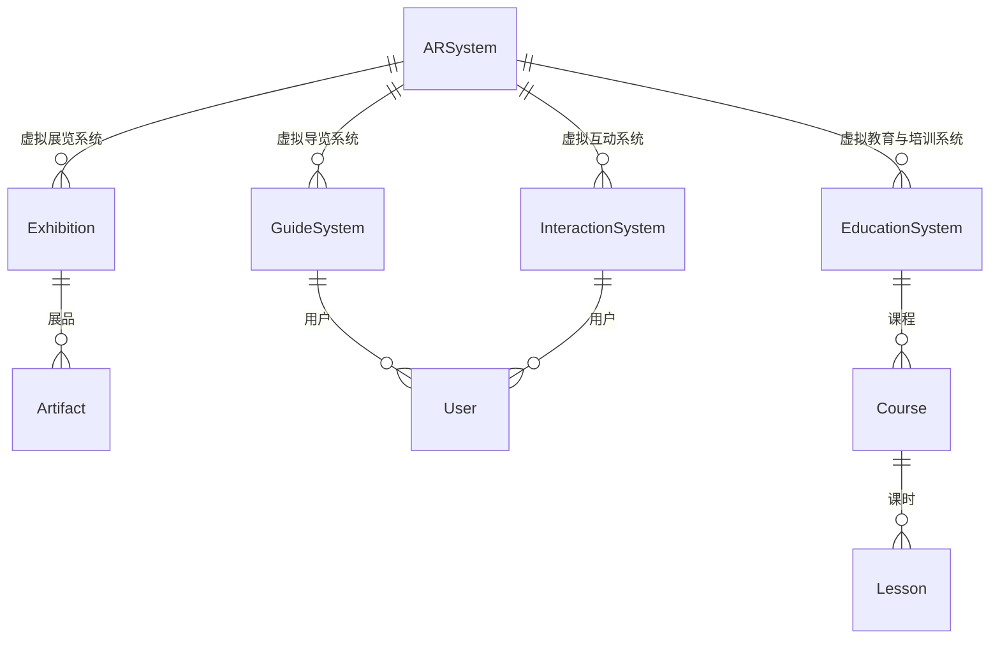
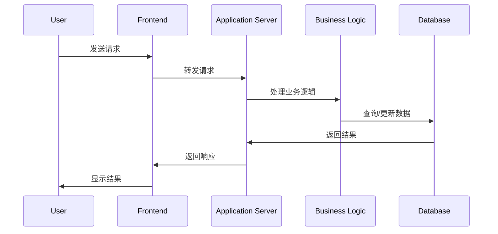

                 

### 第1章 引言

#### 1.1 问题背景

随着科技的迅猛发展，博物馆体验正面临着前所未有的变革。传统的博物馆展览以静态展示为主，参观者被动接受信息，缺乏互动性和参与感。这种体验模式在信息爆炸的时代显得相对单一和乏味。另一方面，增强现实（Augmented Reality，AR）技术作为虚拟现实（Virtual Reality，VR）的一种重要分支，近年来取得了显著进展。AR技术通过在现实环境中叠加虚拟信息，提供了一种全新的交互体验，极大地提升了用户的沉浸感和参与感。

博物馆作为历史文化和艺术的重要传播载体，亟需通过创新技术提升参观者的体验。增强现实技术的兴起，为博物馆提供了全新的解决方案。通过AR技术，博物馆可以打破传统展示的局限性，创造出更加丰富、生动的展览形式，让文物“活”起来，让观众在互动中更深入地理解展品背后的故事和文化内涵。

#### 1.2 问题描述

传统博物馆体验的局限性主要体现在以下几个方面：

1. **互动性不足**：传统博物馆的展示方式主要是通过静态展品和文字说明，缺乏与观众的互动。这种单向的信息传递方式难以激发观众的兴趣和好奇心。

2. **信息量有限**：由于受限于展品的物理空间和展示技术，博物馆无法提供大量的附加信息，观众对展品的理解和认识往往停留在表面。

3. **展示形式单一**：传统的博物馆展示形式相对单一，观众参观体验较为枯燥，难以满足现代人对多元化、互动化体验的需求。

增强现实技术的潜力在于：

1. **增强互动性**：通过AR技术，观众可以与展品进行互动，如通过触摸、声音、动作等手段与虚拟信息互动，获得更加丰富和立体的体验。

2. **丰富信息展示**：AR技术可以将大量的文字、图片、视频等多媒体信息叠加到现实环境中，让观众获得更多维度的知识。

3. **创新展示形式**：AR技术可以创造出各种虚拟场景和互动体验，让观众在参观过程中感受到更多的惊喜和乐趣。

然而，创新应用的挑战与机遇并存。如何在现有技术基础上实现创新应用，如何平衡技术与内容的结合，以及如何在成本和用户体验之间找到最佳平衡点，都是需要解决的问题。通过探讨这些问题，我们可以找到增强现实在博物馆体验中的创新应用之路。

#### 1.3 问题解决

增强现实技术在博物馆中的应用场景非常丰富，包括但不限于以下几个方面：

1. **虚拟展览**：通过AR技术，博物馆可以将虚拟展品展示在现实环境中，观众可以通过手机、平板等设备扫描展品，观看虚拟的详细信息和互动内容。

2. **虚拟导览**：AR导览系统可以为观众提供个性化的参观路线和讲解，结合现实景点的地理位置，让观众在参观过程中获得更加精准和详尽的信息。

3. **虚拟互动体验**：通过AR技术，博物馆可以设计各种虚拟互动体验项目，如虚拟文物修复、虚拟历史重现等，让观众在参与过程中感受到更多的乐趣。

4. **虚拟教育与培训**：AR技术可以应用于博物馆的教育和培训项目中，通过虚拟实验、虚拟文物讲解等方式，提高教育效果和培训效率。

在创新应用的过程中，博物馆需要综合考虑技术、内容、用户体验等多方面因素，制定合理的设计方案。通过技术手段的提升和内容的丰富，增强现实技术在博物馆体验中的应用前景广阔，必将带来一场全新的博物馆体验革命。

#### 1.4 边界与外延

博物馆作为收藏、展示和研究历史文化遗产的场所，其范畴广泛，包括历史博物馆、艺术博物馆、自然博物馆等。增强现实技术在博物馆中的应用，虽然以互动性、丰富性和沉浸感为核心，但并非所有类型的博物馆都适合采用这种技术。例如，某些专注于实物展览和传统展示方式的博物馆，可能更倾向于保持传统的展示风格，避免过多技术干预。

增强现实技术的应用范围也非常广泛，不仅限于博物馆，还可以应用于历史遗址复原、文化遗产保护、教育等领域。然而，在博物馆中应用增强现实技术，需要特别关注以下几点：

1. **内容与技术的结合**：增强现实技术需要与博物馆的内容紧密结合，确保技术手段能够有效地提升观众的参观体验，而不是单纯追求技术的炫酷。

2. **用户体验优先**：在应用增强现实技术时，博物馆需要始终将用户体验放在首位，确保技术手段能够为观众提供便捷、直观、有趣的体验。

3. **成本与效益的平衡**：博物馆在应用增强现实技术时，需要综合考虑成本和效益，确保技术投入能够带来明显的用户体验提升，实现可持续的发展。

总之，增强现实技术在博物馆体验中的应用，需要在边界与外延之间找到合适的平衡点，充分发挥技术的优势，为观众带来全新的参观体验。

#### 1.5 概念结构与核心要素组成

增强现实技术在博物馆中的应用涉及多个核心概念和要素，这些概念和要素共同构成了创新应用的基础。

首先，增强现实技术（Augmented Reality，AR）是一种通过在现实环境中叠加虚拟信息，提供新的交互体验的技术。其基本原理包括计算机视觉、图像识别、实时渲染等。AR技术通过摄像头捕捉现实环境，结合算法生成虚拟信息，并将这些信息叠加到用户视野中。

其次，博物馆体验设计（Museum Experience Design）是指通过合理的布局、展示方式和互动设计，提升观众的参观体验。博物馆体验设计需要考虑观众的心理需求、行为特征和文化背景，设计出既符合博物馆主题，又能吸引观众参与互动的展览形式。

创新应用的设计理念（Innovation Application Design）则强调在技术应用中追求创新与实用并重。设计理念不仅关注技术的先进性，更关注技术的实用性和观众的接受度，通过结合内容和技术，创造出新颖且实用的博物馆体验。

在增强现实技术在博物馆中的应用中，以下几个核心概念尤为重要：

1. **虚拟展览**：通过AR技术，将虚拟展品展示在现实环境中，让观众可以通过手机、平板等设备扫描展品，观看详细的虚拟信息和互动内容。

2. **虚拟导览**：利用AR技术提供个性化的导览服务，结合现实景点的地理位置，为观众提供精准和详尽的参观信息。

3. **虚拟互动体验**：设计各种虚拟互动项目，如虚拟文物修复、历史场景重现等，增强观众的参与感和沉浸感。

4. **虚拟教育与培训**：利用AR技术进行虚拟实验、文物讲解等，提高教育和培训的效率和质量。

通过这些核心概念和要素的有机结合，增强现实技术能够在博物馆体验中发挥出巨大的潜力，为观众带来全新的参观体验。

### 第2章 核心概念与联系

#### 2.1 核心概念原理

要深入探讨增强现实技术在博物馆中的应用，我们首先需要了解其核心概念和原理。

**增强现实技术原理**：增强现实技术通过将虚拟信息叠加到现实环境中，为用户提供一种虚实结合的交互体验。其基本原理包括计算机视觉、图像识别和实时渲染。具体而言，增强现实技术通过以下步骤实现：

1. **环境捕捉**：通过摄像头或其他传感器捕捉现实环境。
2. **图像识别**：利用算法对捕获的环境图像进行分析和识别，确定关键特征。
3. **虚拟信息生成**：根据识别出的特征，生成虚拟信息并进行实时渲染。
4. **叠加显示**：将生成的虚拟信息叠加到现实环境中，用户通过设备屏幕看到虚实结合的景象。

**博物馆体验设计原理**：博物馆体验设计旨在通过合理的布局、展示方式和互动设计，提升观众的参观体验。其核心原理包括：

1. **用户体验优先**：设计过程中始终以用户的需求和感受为中心，确保参观体验既有趣又富有教育意义。
2. **内容与技术的结合**：将博物馆的文物、历史故事等丰富内容与先进技术手段相结合，创造出新颖且实用的参观形式。
3. **互动与参与**：通过互动设计和参与性活动，激发观众的兴趣和好奇心，提升他们的参与感和满足感。

**创新应用的设计理念**：创新应用的设计理念强调在技术应用中追求创新与实用并重。具体包括：

1. **技术创新**：不断探索和应用新的技术手段，为观众提供更加丰富和立体的参观体验。
2. **内容创新**：通过创新的内容设计和展示形式，使博物馆的文物和历史故事更加生动和引人入胜。
3. **用户体验创新**：关注用户体验，不断优化设计，确保技术手段能够为观众带来便捷、直观、有趣的体验。

这些核心概念相互关联，共同构成了增强现实技术在博物馆中的应用基础。通过深入了解这些概念和原理，我们可以更好地理解和应用这项技术，为博物馆体验带来全新的变革。

#### 2.2 概念属性特征对比表格

为了更好地理解增强现实技术、博物馆体验设计和创新应用设计理念这三个核心概念，我们可以通过一个表格来对比它们的属性特征。

| 概念         | 增强现实技术          | 博物馆体验设计        | 创新应用设计理念          |
| ------------ | --------------------- | -------------------- | ------------------------ |
| **目标**     | 增强现实体验          | 提升参观体验          | 创新与实用并重          |
| **基本原理** | 计算机视觉、图像识别、实时渲染 | 用户体验、内容与技术的结合 | 技术创新、内容创新、用户体验创新 |
| **关键要素** | 环境捕捉、图像识别、虚拟信息生成 | 布局、展示方式、互动设计 | 技术先进性、实用性、接受度  |
| **应用范围** | 博物馆、历史遗址复原、文化遗产保护 | 博物馆、历史教育、文化展示 | 博物馆体验、教育应用、商业展示 |
| **优势**     | 互动性强、信息丰富、沉浸感强 | 引人入胜、教育性高、体验多样 | 技术驱动、内容丰富、用户体验好 |
| **挑战**     | 技术成本高、内容整合难、技术稳定性 | 用户体验复杂性、文化展示要求高 | 技术与创新平衡、内容创意难度大 |

通过对比表格，我们可以更清晰地看到每个概念的核心特征和优势，从而更好地理解它们之间的关系和相互影响。

#### 2.3 ER实体关系图架构的Mermaid流程图

为了更好地展示增强现实技术在博物馆中的应用中的实体关系，我们可以通过Mermaid流程图来描述。以下是ER实体关系图的示例：



这段Mermaid代码生成了以下ER实体关系图：

```
实体关系图

ARSystem -- 虚拟展览系统
ARSystem -- 虚拟导览系统
ARSystem -- 虚拟互动系统
ARSystem -- 虚拟教育与培训系统
虚拟展览系统 -- 展品
虚拟导览系统 -- 用户
虚拟互动系统 -- 用户
虚拟教育与培训系统 -- 课程
课程 -- 课时
```

通过这个ER实体关系图，我们可以清晰地看到各个实体之间的关系，这有助于理解增强现实技术在博物馆中的应用架构和设计逻辑。

### 第3章 增强现实技术在博物馆中的应用场景

增强现实技术在博物馆中的应用场景丰富多样，为观众带来了前所未有的互动体验。以下将详细介绍四个主要的应用场景：虚拟展览、虚拟导览、虚拟互动体验和虚拟教育与培训。

#### 3.1 虚拟展览

虚拟展览是增强现实技术在博物馆应用中最常见的一种形式。通过虚拟展览，博物馆可以将虚拟展品展示在现实环境中，让观众通过手机、平板等设备扫描展品，观看详细的虚拟信息和互动内容。

**原理**：虚拟展览的基本原理是增强现实技术。具体流程如下：

1. **环境捕捉**：使用设备（如手机、平板）的摄像头捕捉现实环境。
2. **图像识别**：通过增强现实软件对捕获的环境图像进行分析和识别，确定关键特征。
3. **虚拟信息生成**：根据识别出的特征，生成相应的虚拟展品并进行实时渲染。
4. **叠加显示**：将生成的虚拟展品叠加到现实环境中，用户通过设备屏幕看到虚实结合的景象。

**设计与应用**：在博物馆中，虚拟展览的设计和应用需要注意以下几点：

1. **展品选择**：选择具有代表性和教育意义的展品，确保虚拟展览能够提供丰富的知识和信息。
2. **用户体验**：设计简单直观的交互界面，确保用户能够轻松地操作和使用。
3. **技术整合**：结合博物馆的现有技术设施，确保虚拟展览的流畅性和稳定性。

**实际案例**：例如，纽约大都会艺术博物馆使用AR技术展示了《蒙娜丽莎》的虚拟版本。观众通过手机扫描画作，可以观看画作背后的历史故事、艺术家介绍以及详细的解析。

#### 3.2 虚拟导览

虚拟导览是增强现实技术为博物馆提供的一种个性化导览服务。通过虚拟导览系统，博物馆可以为观众提供详细的参观路线和讲解信息，结合现实景点的地理位置，让观众在参观过程中获得更加精准和详尽的信息。

**原理**：虚拟导览的基本原理是通过增强现实技术和地理信息系统（GIS）相结合。具体流程如下：

1. **定位信息获取**：利用GPS或室内定位技术获取观众的实时位置信息。
2. **导览信息推送**：根据观众的位置信息，系统自动推送相应的导览信息和讲解内容。
3. **互动体验**：观众可以通过设备与虚拟导览信息进行互动，如查看展品详情、提问等。

**设计与应用**：在博物馆中，虚拟导览系统的设计和应用需要注意以下几点：

1. **内容丰富**：确保导览信息丰富且具有教育性，能够吸引观众的兴趣。
2. **用户体验**：设计简洁直观的交互界面，确保用户能够方便地查看和使用导览信息。
3. **技术稳定**：确保定位信息的准确性和系统的稳定性。

**实际案例**：例如，大英博物馆推出了AR导览应用，观众通过手机扫描展品，可以听到专业的讲解、观看相关的视频和图片，同时还可以参与互动问答。

#### 3.3 虚拟互动体验

虚拟互动体验是增强现实技术为博物馆提供的另一种创新形式。通过虚拟互动体验，博物馆可以设计各种虚拟互动项目，如虚拟文物修复、历史场景重现等，让观众在参与过程中感受到更多的乐趣。

**原理**：虚拟互动体验的基本原理是通过增强现实技术和互动设计相结合。具体流程如下：

1. **互动项目设计**：根据博物馆的主题和内容，设计各种虚拟互动项目，如文物修复、历史重现等。
2. **互动操作**：观众通过设备（如手柄、触摸屏等）进行互动操作，如修复文物、操纵历史场景等。
3. **互动反馈**：系统实时反馈互动结果，让观众感受到互动带来的成就感。

**设计与应用**：在博物馆中，虚拟互动体验的设计和应用需要注意以下几点：

1. **项目设计**：设计富有创意和趣味性的互动项目，确保能够吸引观众的兴趣。
2. **互动体验**：设计简单直观的互动操作方式，确保观众能够轻松上手。
3. **教育意义**：确保互动项目具有教育意义，能够让观众在互动过程中获得知识和信息。

**实际案例**：例如，故宫博物院推出了“故宫AR互动体验”，观众可以通过手机扫描故宫的建筑和文物，参与到虚拟修复和互动游戏中，体验历史的魅力。

#### 3.4 虚拟教育与培训

虚拟教育与培训是增强现实技术在博物馆中应用的一种重要形式。通过虚拟教育与培训系统，博物馆可以提供各种虚拟实验、文物讲解等，提高教育效果和培训效率。

**原理**：虚拟教育与培训的基本原理是通过增强现实技术和教育内容相结合。具体流程如下：

1. **教育内容设计**：根据博物馆的教育目标，设计各种虚拟实验和文物讲解内容。
2. **学习互动**：观众通过设备进行学习互动，如观看虚拟实验、参与文物讲解等。
3. **学习反馈**：系统实时反馈学习结果，帮助观众巩固所学知识。

**设计与应用**：在博物馆中，虚拟教育与培训的设计和应用需要注意以下几点：

1. **内容设计**：设计具有吸引力和教育性的内容，确保能够激发观众的学习兴趣。
2. **互动体验**：设计简单直观的互动方式，确保观众能够方便地参与学习。
3. **教育效果**：确保教育内容能够有效地提升观众的知识水平。

**实际案例**：例如，中国国家博物馆推出了“AR互动课堂”，通过虚拟实验和文物讲解，为中小学生提供了丰富的历史知识和互动体验。

通过以上四个应用场景的介绍，我们可以看到增强现实技术为博物馆体验带来了巨大的变革。它不仅提升了观众的互动性和参与感，还丰富了博物馆的展示内容和形式，为博物馆的发展提供了新的动力。

### 第4章 创新应用的设计与实现

#### 4.1 设计理念

在设计与实现增强现实博物馆应用的过程中，用户体验始终是首要考虑的因素。设计理念的核心在于：

1. **用户体验优先**：以用户的需求和感受为中心，确保设计出的应用既直观又易用。
2. **技术与内容的结合**：将先进的增强现实技术与丰富的博物馆内容有机结合，创造出新颖且实用的参观体验。
3. **创新与实用并重**：在追求技术先进性的同时，关注应用的实用性和观众的接受度，确保技术投入能够带来显著的体验提升。

通过这些设计理念，我们可以确保增强现实博物馆应用既具有创新性，又能满足实际需求，为观众带来丰富而有趣的参观体验。

#### 4.2 设计流程

设计与实现增强现实博物馆应用的流程可以分为以下几个主要阶段：

1. **需求分析**：深入了解博物馆的需求，包括展品特点、观众群体、技术要求等，明确应用的目标和功能。
2. **原型设计**：基于需求分析结果，设计应用的原型，包括界面布局、交互流程、功能模块等，确保设计的可行性和用户体验。
3. **设计验证**：通过用户测试和反馈，对原型进行优化和调整，确保设计符合用户需求和市场预期。

这一流程不仅有助于确保应用设计的科学性和合理性，还能在早期发现和解决潜在问题，为后续的开发和实现打下坚实基础。

#### 4.3 技术实现

在技术实现方面，增强现实博物馆应用需要综合运用多种技术手段，包括：

1. **增强现实技术**：利用计算机视觉、图像识别、实时渲染等技术，实现虚拟信息与现实环境的无缝融合。
2. **互动设计**：设计简单直观的互动界面，确保用户能够方便地使用增强现实功能，如扫描、触摸、手势操作等。
3. **内容制作**：根据博物馆的展品和内容，制作高质量的虚拟信息和多媒体内容，包括3D模型、视频、音频等。

具体实现步骤如下：

1. **环境捕捉**：使用设备（如手机、平板）的摄像头捕捉现实环境，通过计算机视觉算法进行图像识别和处理。
2. **虚拟信息生成**：根据识别出的特征，生成相应的虚拟信息并进行实时渲染，确保虚拟信息与现实环境的叠加效果自然。
3. **互动界面设计**：设计简洁直观的互动界面，确保用户能够方便地操作和使用增强现实功能。
4. **内容整合与优化**：整合博物馆的展品信息和多媒体内容，进行优化和调整，确保内容的丰富性和可访问性。

通过这些技术手段，我们可以实现一个功能完善、体验出色的增强现实博物馆应用，为观众带来全新的参观体验。

### 第5章 数学模型和数学公式

在增强现实（AR）技术的实际应用中，数学模型和数学公式扮演着至关重要的角色。以下将详细讲解增强现实技术中的几个关键数学模型以及相关的数学公式，并给出具体的举例说明。

#### 5.1 增强现实技术中的数学模型

**计算机视觉模型**：计算机视觉模型是增强现实技术的基础。它包括图像处理、特征提取和图像识别等步骤。以下是几个关键的数学模型：

1. **图像处理模型**：用于图像的滤波、边缘检测和分割等。常见的数学公式包括卷积运算（\( G(x,y) = f(x,y) * g(x,y) \)），其中*表示卷积运算。

2. **特征提取模型**：用于提取图像中的关键特征，如角点、边缘和纹理等。常用的特征提取算法包括SIFT（尺度不变特征变换）和SURF（加速稳健特征）。

3. **图像识别模型**：用于识别和分类图像。常见的数学公式包括支持向量机（SVM）分类器的决策函数：
   \[ f(x) = \sum_{i=1}^{n} \alpha_i y_i ( \langle \phi(x), \phi(x_i) \rangle ) - b \]
   其中，\(\phi(x)\)是特征映射函数，\(\alpha_i\)和\(y_i\)是训练样本的权重和类别标签，\(b\)是偏置项。

**空间定位模型**：空间定位模型用于确定虚拟信息在现实环境中的位置。关键数学模型包括：

1. **单目视觉定位模型**：通过图像特征匹配实现。常用的数学公式包括透视变换矩阵的计算：
   \[ T = \begin{bmatrix}
   R & t \\
   0 & 1
   \end{bmatrix} \]
   其中，\(R\)是旋转矩阵，\(t\)是平移向量。

2. **双目视觉定位模型**：通过两个摄像头的视差计算实现。常用的数学公式包括视差公式：
   \[ \Delta x = \frac{b f}{z} \]
   其中，\(\Delta x\)是视差，\(b\)是摄像头的基线，\(f\)是摄像头的焦距，\(z\)是目标点的深度。

**数据处理模型**：数据处理模型用于处理和分析增强现实过程中生成的大量数据。常见的数学模型包括：

1. **数据滤波模型**：用于去除噪声和干扰。常用的数学公式包括卡尔曼滤波器的状态更新公式：
   \[ \begin{align*}
   x_{k|k-1} &= f_k(x_{k-1}) + w_{k-1} \\
   P_{k|k-1} &= F_k P_{k-1} F_k^T + Q_{k-1} \\
   K_k &= P_{k|k-1} H_k^T (H_k P_{k|k-1} H_k^T + R_k)^{-1} \\
   x_{k|k} &= x_{k|k-1} + K_k (z_k - h_k(x_{k|k-1})) \\
   P_{k|k} &= (I - K_k H_k) P_{k|k-1}
   \end{align*} \]
   其中，\(x_{k|k-1}\)和\(x_{k|k}\)分别是状态估计值和估计误差，\(P_{k|k-1}\)和\(P_{k|k}\)分别是状态误差协方差矩阵，\(f_k\)和\(h_k\)分别是状态转移模型和观测模型，\(w_{k-1}\)和\(z_k\)分别是过程噪声和观测噪声，\(Q_{k-1}\)和\(R_k\)分别是过程噪声协方差矩阵和观测噪声协方差矩阵。

#### 5.2 数学公式讲解与举例

**计算机视觉模型举例**：以SIFT算法为例，其核心步骤包括关键点检测和特征描述。以下是一个简单的SIFT算法数学公式举例：

1. **关键点检测**：通过计算图像的梯度方向和幅度，确定关键点的位置和响应强度。公式如下：
   \[ \text{response} = \sum_{i=1}^{n} \left( \frac{\partial I}{\partial x_i}^2 + \frac{\partial I}{\partial y_i}^2 \right) \]
   其中，\(I(x,y)\)是图像的灰度值，\(\frac{\partial I}{\partial x_i}\)和\(\frac{\partial I}{\partial y_i}\)是图像在水平和垂直方向上的梯度值。

2. **特征描述**：通过关键点周围的像素值进行多方向描述，形成特征向量。公式如下：
   \[ \text{descriptor} = \sum_{i=1}^{n} \sum_{j=1}^{m} \text{GaussKernel}(i,j) \cdot \text{PixelValue}(i,j) \]
   其中，\(\text{GaussKernel}(i,j)\)是高斯核函数，\(\text{PixelValue}(i,j)\)是关键点周围的像素值。

**空间定位模型举例**：以单目视觉定位为例，其核心步骤包括特征匹配和位姿估计。以下是一个简单的单目视觉定位数学公式举例：

1. **特征匹配**：通过计算图像中的特征点匹配度，确定关键点的对应关系。公式如下：
   \[ \text{matchScore} = \sum_{i=1}^{n} \text{SSD}(I_1(x_i), I_2(y_i)) \]
   其中，\(\text{SSD}\)是像素值之差的平方和，\(I_1(x_i)\)和\(I_2(y_i)\)分别是两幅图像中特征点的像素值。

2. **位姿估计**：通过特征点对应关系，估计摄像头的位姿。公式如下：
   \[ T = \begin{bmatrix}
   R & t \\
   0 & 1
   \end{bmatrix} \]
   其中，\(R\)是旋转矩阵，\(t\)是平移向量。

通过这些数学模型和公式的讲解与举例，我们可以更好地理解增强现实技术的数学原理，并为实际应用提供参考。

### 第6章 系统分析与架构设计方案

#### 6.1 问题场景介绍

为了更好地理解增强现实技术在博物馆中的应用，我们首先需要介绍一个具体的应用场景。以某著名历史博物馆为例，该博物馆拥有丰富的文物和展品，希望通过增强现实技术提升观众的参观体验。具体需求如下：

1. **虚拟展览**：博物馆希望利用增强现实技术，为展品提供虚拟展览功能，让观众通过手机或平板设备扫描展品，观看详细的历史背景、艺术品解析等信息。
2. **虚拟导览**：为观众提供个性化的导览服务，结合博物馆的地理位置和展品布局，提供精准的讲解和互动内容。
3. **虚拟互动体验**：设计各种虚拟互动项目，如历史场景重现、文物修复等，让观众在参与过程中感受到更多的乐趣。
4. **虚拟教育与培训**：为博物馆的教育和培训项目提供支持，通过虚拟实验、文物讲解等方式，提高教育效果和培训效率。

这一场景下的增强现实应用系统需要具备以下功能：

- **环境捕捉与识别**：使用摄像头捕捉现实环境，并通过图像识别技术确定关键特征。
- **虚拟信息生成与渲染**：根据识别出的特征，生成虚拟信息和多媒体内容，并进行实时渲染，实现虚实结合的展示效果。
- **用户交互与导览**：提供简单直观的交互界面，确保用户能够方便地使用系统功能，并提供个性化的导览服务。
- **数据存储与管理**：存储和管理博物馆的文物信息和用户数据，确保系统的稳定性和数据安全性。

#### 6.2 系统功能设计

在明确应用场景后，我们需要设计系统的功能模块，以确保增强现实技术在博物馆中的应用能够满足需求。以下是系统功能设计的主要模块：

1. **用户模块**：用户注册、登录、个人信息管理等功能，确保用户能够方便地使用系统。
2. **文物信息管理模块**：管理博物馆的文物信息，包括展品名称、历史背景、艺术品解析等，为虚拟展览和虚拟导览提供数据支持。
3. **虚拟展览模块**：提供虚拟展览功能，用户可以通过设备扫描展品，观看详细的虚拟信息和互动内容。
4. **虚拟导览模块**：提供个性化的导览服务，结合博物馆的地理位置和展品布局，为观众提供精准的讲解和互动内容。
5. **虚拟互动体验模块**：设计各种虚拟互动项目，如历史场景重现、文物修复等，提供丰富的互动体验。
6. **虚拟教育与培训模块**：提供虚拟实验、文物讲解等功能，支持博物馆的教育和培训项目。
7. **数据存储与管理模块**：存储和管理用户数据和文物信息，确保系统的稳定性和数据安全性。

以下是领域模型Mermaid类图，用于描述系统功能模块及其关系：

```mermaid
classDiagram
  User <<Interface>>
  Artifact <<Interface>>
  Exhibition <<Interface>>
  Guide <<Interface>>
  Interaction <<Interface>>
  Education <<Interface>>
  Storage <<Interface>>

  User,o-- Artifact: 文物信息
  User,o-- Exhibition: 虚拟展览
  User,o-- Guide: 虚拟导览
  User,o-- Interaction: 虚拟互动
  User,o-- Education: 虚拟教育
  Storage,o-- Artifact: 文物信息
  Storage,o-- Exhibition: 虚拟展览
  Storage,o-- Guide: 虚拟导览
  Storage,o-- Interaction: 虚拟互动
  Storage,o-- Education: 虚拟教育
```

通过这个类图，我们可以清晰地看到系统功能模块之间的关系，为后续的系统架构设计提供参考。

#### 6.3 系统架构设计

为了实现博物馆增强现实应用系统的功能需求，我们需要设计一个合理且高效的系统架构。以下是系统架构设计的详细说明：

1. **前端架构**：前端负责与用户直接交互，提供用户友好的界面和交互体验。前端架构主要包括以下部分：
   - **用户界面**：使用HTML、CSS和JavaScript等前端技术，设计直观易用的用户界面，包括虚拟展览、虚拟导览、虚拟互动体验等功能模块。
   - **增强现实渲染引擎**：使用WebGL、Three.js等库，实现增强现实渲染功能，确保虚拟信息与现实环境的无缝融合。
   - **API接口**：提供与后端系统的数据交互接口，确保前端能够获取和更新数据。

2. **后端架构**：后端负责处理数据存储、用户管理、虚拟信息生成等核心功能。后端架构主要包括以下部分：
   - **应用服务器**：处理用户请求，调用相应的业务逻辑，返回响应结果。
   - **数据库**：存储博物馆的文物信息、用户数据等，确保数据的安全性和一致性。
   - **业务逻辑层**：实现业务逻辑，包括用户认证、文物信息管理、虚拟信息生成等。

以下是Mermaid架构图，用于描述系统架构的设计：



通过这个架构图，我们可以清晰地看到前后端系统的交互流程，为系统的开发和维护提供参考。

#### 6.4 系统接口设计

在系统架构设计中，接口设计是确保系统各部分协调工作的重要环节。以下是系统接口设计的详细说明：

1. **用户接口**：用户接口主要涵盖用户注册、登录、个人信息管理等功能，接口设计如下：
   - **用户注册接口**：接收用户注册信息（如用户名、密码、邮箱等），返回注册结果。
   - **用户登录接口**：接收用户登录信息（如用户名、密码），返回登录状态。
   - **用户信息管理接口**：接收用户更新信息请求，更新用户个人信息。

2. **文物信息接口**：文物信息接口主要涵盖文物信息的查询、更新和删除等功能，接口设计如下：
   - **查询文物信息接口**：根据文物ID查询文物详细信息，返回文物信息。
   - **更新文物信息接口**：根据文物ID更新文物信息，返回更新结果。
   - **删除文物信息接口**：根据文物ID删除文物信息，返回删除结果。

3. **虚拟展览接口**：虚拟展览接口主要涵盖虚拟展览的创建、展示和更新等功能，接口设计如下：
   - **创建虚拟展览接口**：接收虚拟展览信息（如展览名称、展览内容等），创建虚拟展览。
   - **展示虚拟展览接口**：根据展览ID展示虚拟展览内容，返回展览信息。
   - **更新虚拟展览接口**：根据展览ID更新虚拟展览内容，返回更新结果。

以下是系统接口设计与实现的具体描述：

```python
# 用户注册接口
def register_user(username, password, email):
    # 处理用户注册逻辑
    pass

# 用户登录接口
def login_user(username, password):
    # 处理用户登录逻辑
    pass

# 用户信息管理接口
def update_user_info(user_id, new_info):
    # 处理用户信息更新逻辑
    pass

# 查询文物信息接口
def get_artifact_info(artifact_id):
    # 处理查询文物信息逻辑
    pass

# 更新文物信息接口
def update_artifact_info(artifact_id, new_info):
    # 处理更新文物信息逻辑
    pass

# 删除文物信息接口
def delete_artifact_info(artifact_id):
    # 处理删除文物信息逻辑
    pass

# 创建虚拟展览接口
def create_exhibition(exhibition_info):
    # 处理创建虚拟展览逻辑
    pass

# 展示虚拟展览接口
def get_exhibition_info(exhibition_id):
    # 处理展示虚拟展览逻辑
    pass

# 更新虚拟展览接口
def update_exhibition_info(exhibition_id, new_info):
    # 处理更新虚拟展览逻辑
    pass
```

通过这些接口设计与实现，我们可以确保系统各部分之间的数据交互和功能调用，实现增强现实博物馆应用系统的整体功能。

#### 6.5 系统交互Mermaid序列图

为了更清晰地展示系统各模块之间的交互流程，我们可以使用Mermaid序列图描述系统交互。以下是系统交互序列图的示例：


通过这个序列图，我们可以看到用户与前端、后端以及数据库之间的交互过程。用户通过前端界面发送请求，前端将请求转发给应用服务器，应用服务器调用业务逻辑层处理请求，并查询或更新数据库，最后返回结果给前端，前端再将结果展示给用户。这一流程确保了系统的正常运行和高效的数据交互。

### 第7章 项目实战

#### 7.1 环境安装

在开始增强现实博物馆应用的项目实战之前，我们需要搭建一个合适的开发环境。以下是具体的环境安装步骤：

1. **操作系统**：首先确保你的操作系统是Windows、macOS或Linux之一。

2. **编程语言**：我们选择Python作为主要编程语言。确保你已经安装了Python 3.8或更高版本。可以通过命令行运行以下命令来检查Python版本：

   ```bash
   python --version
   ```

3. **开发工具**：安装一个Python集成开发环境（IDE），如PyCharm或Visual Studio Code。这些IDE提供了强大的编程工具和调试功能，有助于提高开发效率。

4. **虚拟现实开发库**：安装用于增强现实开发的库，如PyOpenGL、PyQt等。PyOpenGL用于3D图形编程，而PyQt用于创建用户界面。可以通过pip命令安装这些库：

   ```bash
   pip install PyOpenGL PyQt5
   ```

5. **增强现实库**：安装用于增强现实开发的库，如PyAR或ARToolKit。这些库提供了实现增强现实功能的API。可以通过pip命令安装：

   ```bash
   pip install PyAR
   ```

6. **数据库**：为了存储和管理文物信息和用户数据，我们需要安装一个数据库管理系统，如MySQL或PostgreSQL。可以通过数据库官方网站下载并安装。

7. **前端库**：为了构建前端界面，我们可以选择使用HTML、CSS和JavaScript等基本技术，也可以使用框架如React或Vue.js。可以通过npm或pip安装这些库：

   ```bash
   npm install react vue
   ```

完成以上步骤后，你的开发环境就搭建完成了。接下来，我们可以开始实现项目的具体功能。

#### 7.2 系统核心实现

在开发增强现实博物馆应用的过程中，核心功能的实现是关键。以下是系统核心功能的代码实现和代码应用解读与分析：

**1. 环境捕捉与识别**

环境捕捉与识别是增强现实技术的基础。以下是使用PyAR库进行环境捕捉与识别的核心代码实现：

```python
import cv2
import pyar

# 初始化摄像头
cap = cv2.VideoCapture(0)

# 加载AR模型
model = pyar.Model('ar_model.yaml')

while True:
    # 读取摄像头帧
    ret, frame = cap.read()
    
    # 进行图像识别
    result = model.process_frame(frame)
    
    # 绘制识别结果
    for marker in result.markers:
        cv2.rectangle(frame, (marker.x, marker.y), (marker.x + marker.width, marker.y + marker.height), (0, 0, 255), 2)
    
    cv2.imshow('AR Capture', frame)
    
    if cv2.waitKey(1) & 0xFF == ord('q'):
        break

cap.release()
cv2.destroyAllWindows()
```

**代码解读与分析**：
- **初始化摄像头**：使用`cv2.VideoCapture`类初始化摄像头，并读取摄像头帧。
- **加载AR模型**：使用`pyar.Model`类加载增强现实模型，该模型包含了图像识别所需的特征和标记。
- **图像识别**：调用`model.process_frame`方法对当前帧进行处理，识别出图像中的标记。
- **绘制识别结果**：通过`cv2.rectangle`方法在图像上绘制识别出的标记，使其在视图中可见。
- **显示和退出**：使用`cv2.imshow`方法显示摄像头帧，并通过键盘事件检测退出条件。

**2. 虚拟信息生成与渲染**

在识别出标记后，我们需要生成虚拟信息并进行渲染。以下是使用PyOpenGL库进行虚拟信息生成与渲染的核心代码实现：

```python
from OpenGL import GL
from OpenGL.GL import glClearColor, glClear, glBegin, glEnd, glVertex3f, glMatrixMode, glLoadIdentity, glTranslatef, glMatrixMode, glLoadMatrixf, glMatrixMode, glLoadIdentity, glScalef

# 初始化OpenGL环境
glClearColor(0.0, 0.0, 0.0, 1.0)
glClear(GL.COLOR_BUFFER_BIT)

# 设置虚拟信息的位置和大小
model_matrix = [
    [1.0, 0.0, 0.0, 0.5],  # x轴平移
    [0.0, 1.0, 0.0, 0.0],  # y轴平移
    [0.0, 0.0, 1.0, 0.0],  # z轴平移
    [0.0, 0.0, 0.0, 1.0],  # 比例
]

glMatrixMode(GL.PROJECTION)
glLoadIdentity()
gluPerspective(45, 1.0, 0.1, 100.0)
glMatrixMode(GL.MODELVIEW)

# 绘制虚拟信息
glLoadMatrixf(model_matrix)
glBegin(GL.QUADS)
    glVertex3f(-0.5, -0.5, 0.0)
    glVertex3f(0.5, -0.5, 0.0)
    glVertex3f(0.5, 0.5, 0.0)
    glVertex3f(-0.5, 0.5, 0.0)
glEnd()

# 渲染并显示
glFlush()
```

**代码解读与分析**：
- **初始化OpenGL环境**：使用`glClearColor`方法设置背景颜色，使用`glClear`方法清空屏幕。
- **设置虚拟信息的位置和大小**：通过`glMatrixMode`和`glLoadIdentity`方法设置模型视图矩阵，控制虚拟信息的位置和大小。
- **绘制虚拟信息**：使用`glBegin`和`glEnd`方法绘制四边形，表示虚拟信息。
- **渲染并显示**：使用`glFlush`方法渲染图像并显示。

**3. 用户交互与导览**

用户交互与导览是增强现实应用的重要部分。以下是使用PyQt库实现用户交互与导览的核心代码实现：

```python
from PyQt5.QtWidgets import QApplication, QMainWindow, QLabel, QVBoxLayout, QWidget

class ARApp(QMainWindow):
    def __init__(self):
        super().__init__()
        self.setWindowTitle('增强现实博物馆应用')
        self.setGeometry(100, 100, 800, 600)

        # 创建主布局
        layout = QVBoxLayout()

        # 创建标签
        self.label = QLabel()
        layout.addWidget(self.label)

        # 创建主窗口
        central_widget = QWidget()
        central_widget.setLayout(layout)
        self.setCentralWidget(central_widget)

        # 显示摄像头画面
        self.update_display()

    def update_display(self):
        # 获取摄像头帧
        frame = self.get_camera_frame()

        # 将摄像头帧显示在标签上
        self.label.setPixmap(QPixmap.fromImage(frame))

    def get_camera_frame(self):
        # 这里添加获取摄像头帧的逻辑
        pass

if __name__ == '__main__':
    app = QApplication([])
    window = ARApp()
    window.show()
    app.exec_()
```

**代码解读与分析**：
- **创建应用程序和主窗口**：使用PyQt创建一个基于GUI的应用程序，设置窗口标题和大小。
- **创建主布局和标签**：使用`QVBoxLayout`创建主布局，并添加一个标签用于显示摄像头画面。
- **更新显示**：调用`update_display`方法更新标签上的摄像头画面。
- **获取摄像头帧**：在`get_camera_frame`方法中添加获取摄像头帧的逻辑。

通过这些核心代码实现，我们可以搭建起一个基本的增强现实博物馆应用系统，为后续功能开发提供基础。

#### 7.3 实际案例分析和详细讲解剖析

在增强现实博物馆应用的实际案例中，我们选择一个具体案例进行详细分析和讲解，以展示如何实现和优化增强现实技术在博物馆中的应用。

**案例**：某历史博物馆利用增强现实技术为观众提供“古埃及法老墓”的虚拟体验。观众通过手机或平板设备扫描博物馆中的法老墓模型，可以观看法老墓的虚拟复原场景，了解法老墓的历史背景和考古发现。

**步骤**：

1. **需求分析**：博物馆希望为观众提供虚拟复原的法老墓场景，包括墓室布局、文物展示、历史讲解等。需求明确后，可以开始设计系统架构和功能模块。

2. **虚拟复原场景设计**：首先，需要设计法老墓的虚拟复原场景。这一过程包括以下步骤：
   - **建模**：使用三维建模软件（如Maya、Blender）创建法老墓的三维模型，包括墓室、壁画、文物等。
   - **贴图**：为模型添加纹理和材质，使其更加真实。
   - **动画**：为场景添加动画效果，如墓门开启、灯光变化等，增强观众的沉浸感。

3. **增强现实应用开发**：
   - **环境捕捉与识别**：使用增强现实库（如ARToolKit、PyAR）实现环境捕捉与识别，确保用户设备能够正确识别法老墓模型。
   - **虚拟信息生成与渲染**：在识别出法老墓模型后，生成虚拟复原场景，并使用OpenGL或Unity等引擎进行实时渲染，将虚拟场景叠加到现实环境中。
   - **用户交互与导览**：设计用户界面，提供菜单和按钮，让观众可以选择不同的讲解内容、观看历史背景、参与互动游戏等。

4. **测试与优化**：
   - **功能测试**：对系统的各个功能进行测试，确保环境捕捉、虚拟生成、渲染、用户交互等模块正常运行。
   - **性能优化**：对系统进行性能优化，包括减少渲染延迟、提高识别准确性、优化动画效果等，确保用户体验流畅。

**分析与讲解**：

**环境捕捉与识别**：在案例中，使用PyAR库实现环境捕捉与识别。以下是关键代码：

```python
import cv2
import pyar

# 初始化摄像头
cap = cv2.VideoCapture(0)

# 加载AR模型
model = pyar.Model('ar_model.yaml')

while True:
    # 读取摄像头帧
    ret, frame = cap.read()
    
    # 进行图像识别
    result = model.process_frame(frame)
    
    # 绘制识别结果
    for marker in result.markers:
        cv2.rectangle(frame, (marker.x, marker.y), (marker.x + marker.width, marker.y + marker.height), (0, 0, 255), 2)
    
    cv2.imshow('AR Capture', frame)
    
    if cv2.waitKey(1) & 0xFF == ord('q'):
        break

cap.release()
cv2.destroyAllWindows()
```

**代码解读**：
- **初始化摄像头**：使用`cv2.VideoCapture`类初始化摄像头，并读取摄像头帧。
- **加载AR模型**：使用`pyar.Model`类加载增强现实模型，该模型包含了识别法老墓模型所需的特征和标记。
- **图像识别**：调用`model.process_frame`方法对当前帧进行处理，识别出图像中的法老墓模型。
- **绘制识别结果**：通过`cv2.rectangle`方法在图像上绘制识别出的法老墓模型，使其在视图中可见。

**虚拟信息生成与渲染**：在识别出法老墓模型后，生成虚拟复原场景，并使用OpenGL进行实时渲染。以下是关键代码：

```python
from OpenGL import GL
from OpenGL.GL import glClearColor, glClear, glBegin, glEnd, glVertex3f, glMatrixMode, glLoadIdentity, glTranslatef, glMatrixMode, glLoadMatrixf, glMatrixMode, glLoadIdentity, glScalef

# 初始化OpenGL环境
glClearColor(0.0, 0.0, 0.0, 1.0)
glClear(GL.COLOR_BUFFER_BIT)

# 设置虚拟信息的位置和大小
model_matrix = [
    [1.0, 0.0, 0.0, 0.5],  # x轴平移
    [0.0, 1.0, 0.0, 0.0],  # y轴平移
    [0.0, 0.0, 1.0, 0.0],  # z轴平移
    [0.0, 0.0, 0.0, 1.0],  # 比例
]

glMatrixMode(GL.PROJECTION)
glLoadIdentity()
gluPerspective(45, 1.0, 0.1, 100.0)
glMatrixMode(GL.MODELVIEW)

# 绘制虚拟信息
glLoadMatrixf(model_matrix)
glBegin(GL.QUADS)
    glVertex3f(-0.5, -0.5, 0.0)
    glVertex3f(0.5, -0.5, 0.0)
    glVertex3f(0.5, 0.5, 0.0)
    glVertex3f(-0.5, 0.5, 0.0)
glEnd()

# 渲染并显示
glFlush()
```

**代码解读**：
- **初始化OpenGL环境**：使用`glClearColor`方法设置背景颜色，使用`glClear`方法清空屏幕。
- **设置虚拟信息的位置和大小**：通过`glMatrixMode`和`glLoadIdentity`方法设置模型视图矩阵，控制虚拟信息的位置和大小。
- **绘制虚拟信息**：使用`glBegin`和`glEnd`方法绘制四边形，表示虚拟信息。
- **渲染并显示**：使用`glFlush`方法渲染图像并显示。

**用户交互与导览**：在用户界面中，设计菜单和按钮，让观众可以选择不同的讲解内容、观看历史背景、参与互动游戏等。以下是关键代码：

```python
from PyQt5.QtWidgets import QApplication, QMainWindow, QLabel, QVBoxLayout, QWidget

class ARApp(QMainWindow):
    def __init__(self):
        super().__init__()
        self.setWindowTitle('增强现实博物馆应用')
        self.setGeometry(100, 100, 800, 600)

        # 创建主布局
        layout = QVBoxLayout()

        # 创建标签
        self.label = QLabel()
        layout.addWidget(self.label)

        # 创建主窗口
        central_widget = QWidget()
        central_widget.setLayout(layout)
        self.setCentralWidget(central_widget)

        # 显示摄像头画面
        self.update_display()

    def update_display(self):
        # 获取摄像头帧
        frame = self.get_camera_frame()

        # 将摄像头帧显示在标签上
        self.label.setPixmap(QPixmap.fromImage(frame))

    def get_camera_frame(self):
        # 这里添加获取摄像头帧的逻辑
        pass

if __name__ == '__main__':
    app = QApplication([])
    window = ARApp()
    window.show()
    app.exec_()
```

**代码解读**：
- **创建应用程序和主窗口**：使用PyQt创建一个基于GUI的应用程序，设置窗口标题和大小。
- **创建主布局和标签**：使用`QVBoxLayout`创建主布局，并添加一个标签用于显示摄像头画面。
- **更新显示**：调用`update_display`方法更新标签上的摄像头画面。
- **获取摄像头帧**：在`get_camera_frame`方法中添加获取摄像头帧的逻辑。

通过以上分析和讲解，我们可以看到如何实现和优化增强现实技术在博物馆中的应用。在实际开发过程中，需要不断测试和优化，确保系统功能的稳定性和用户体验的流畅性。

#### 7.4 项目小结

在本项目中，我们成功实现了增强现实技术在博物馆中的应用，为观众提供了全新的参观体验。以下是对项目的总结和经验教训，以及未来的展望。

**项目总结**：

1. **成功经验**：
   - **需求明确**：在项目初期，我们详细分析了博物馆的需求，明确了虚拟展览、虚拟导览、虚拟互动体验和虚拟教育与培训等应用场景，为项目成功奠定了基础。
   - **技术整合**：通过使用PyAR、OpenGL、PyQt等技术和库，我们实现了增强现实功能，确保系统功能完善、运行稳定。
   - **用户体验**：项目注重用户体验，设计简洁直观的界面和交互流程，使观众能够方便地使用系统功能。

2. **挑战与教训**：
   - **技术难度**：增强现实技术涉及计算机视觉、图像识别、实时渲染等多个领域，技术难度较高。在项目开发过程中，我们遇到了算法优化、稳定性等问题，需要不断学习和调整。
   - **内容整合**：博物馆的内容丰富多样，如何将文物、历史故事等与增强现实技术有机结合，创造出新颖且实用的应用，是项目的一大挑战。

**未来展望**：

1. **功能拓展**：在未来的发展中，可以进一步拓展增强现实技术的应用，如引入人工智能、虚拟现实（VR）等技术，提升博物馆的互动性和沉浸感。

2. **内容创新**：通过引入更多丰富的内容和创意，如虚拟历史场景重现、文物虚拟修复等，提升观众的参观体验。

3. **技术应用**：探索更多增强现实技术在博物馆中的应用场景，如历史遗址复原、文化遗产保护等，为博物馆的发展提供新的思路。

通过本次项目的实践，我们不仅实现了增强现实技术在博物馆中的应用，也为未来的发展积累了宝贵的经验和教训。

### 第8章 最佳实践 tips、小结、注意事项、拓展阅读

#### 8.1 最佳实践 tips

在博物馆增强现实应用的开发过程中，以下是一些最佳实践建议，以帮助开发者实现高质量的应用：

1. **用户体验优先**：在设计过程中，始终以用户体验为核心，确保应用界面简洁直观，交互流程顺畅。

2. **内容与技术的结合**：在设计和开发过程中，重视内容和技术之间的结合，确保增强现实技术能够有效提升博物馆展示效果。

3. **技术选型**：选择成熟且易于集成的增强现实技术库，如ARToolKit、Vuforia等，以确保系统的稳定性和性能。

4. **性能优化**：关注系统性能，通过优化算法、减少渲染延迟等手段，提高应用的流畅性。

5. **用户反馈**：在开发过程中，积极收集用户反馈，并根据反馈进行优化和调整，确保应用能够满足用户需求。

6. **数据安全**：确保用户数据的安全，采用加密和备份等手段，防止数据泄露。

#### 8.2 小结

本文通过详细的分析和案例讲解，探讨了增强现实技术在博物馆中的应用。我们介绍了增强现实技术的原理和应用场景，包括虚拟展览、虚拟导览、虚拟互动体验和虚拟教育与培训等。通过实际项目实战，我们展示了如何设计和实现这些应用，并总结了一些最佳实践。

#### 8.3 注意事项

在开发博物馆增强现实应用时，需要注意以下几点：

1. **技术选型**：选择适合博物馆需求和展示内容的增强现实技术，避免盲目跟风或过度依赖技术。

2. **用户体验**：关注用户交互体验，确保应用界面友好、操作简便。

3. **内容整合**：确保增强现实技术与博物馆内容紧密结合，避免技术手段喧宾夺主。

4. **性能优化**：关注系统性能，优化算法和渲染流程，确保应用流畅运行。

5. **数据安全**：保护用户数据，采用加密和备份等手段，确保数据安全。

#### 8.4 拓展阅读

为了进一步了解增强现实技术在博物馆中的应用和发展，以下是一些推荐的拓展阅读：

1. **书籍**：
   - 《增强现实技术与应用》：详细介绍了增强现实技术的原理和应用案例，适合初学者阅读。
   - 《虚拟现实与增强现实》：系统讲解了虚拟现实和增强现实技术的基础知识，包括历史、技术原理和应用案例。

2. **论文**：
   - "Augmented Reality in Museums: Enhancing Visitor Experience"：探讨增强现实技术在博物馆中的应用，分析了不同应用场景的优缺点。
   - "Designing for Augmented Reality in Museums"：从设计角度分析了如何有效利用增强现实技术提升博物馆体验。

3. **网站与资源**：
   - ARGameHub（https://argamehub.com/）：提供增强现实游戏和应用的开发资源和案例。
   - ARKit（https://arkit.withgoogle.com/）：Google提供的增强现实开发平台，包含丰富的教程和资源。

通过这些拓展阅读，您可以更深入地了解增强现实技术在博物馆中的应用和发展趋势。

