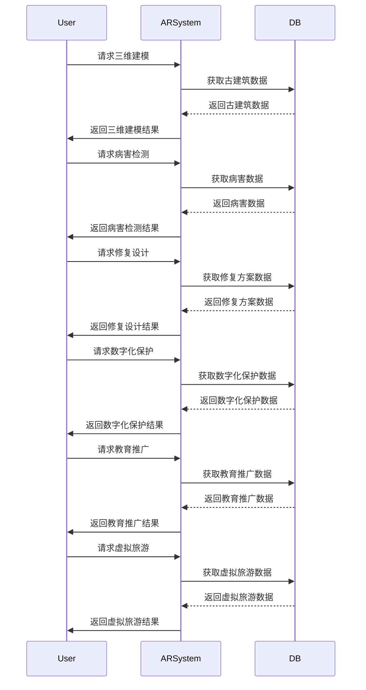
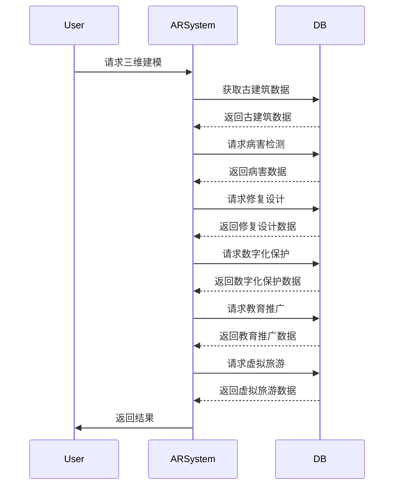

                 

# 《增强现实在古建筑修复中的应用与创新》

## 关键词
- 增强现实
- 古建筑修复
- 三维建模
- 病害检测
- 数字化保护
- 虚拟旅游

## 摘要
本文旨在探讨增强现实技术在古建筑修复中的应用与创新。通过分析古建筑修复的重要性以及增强现实技术的基本原理，本文将详细阐述增强现实在古建筑三维建模、病害检测、修复设计以及数字化保护、教育推广和虚拟旅游等方面的应用。此外，本文还将介绍相关算法原理、数学模型以及系统分析与架构设计，并通过实际案例进行分析，总结最佳实践，展望未来发展趋势。

----------------------------------------------------------------

### 目录大纲

----------------------------------------------------------------

# 《增强现实在古建筑修复中的应用与创新》

## 第一部分：背景介绍

## 第1章 问题背景

### 1.1.1 古建筑修复的重要性

- 古建筑是文化遗产的重要组成部分
- 古建筑修复的挑战

### 1.1.2 增强现实技术的定义与发展

- 增强现实技术的定义
- 增强现实技术的发展历程

### 1.1.3 增强现实在古建筑修复中的应用现状

- 国内外研究现状
- 应用实例

## 第2章 增强现实技术原理

### 2.1.1 增强现实技术的基本原理

- 显示技术
- 传感器技术
- 输入输出技术

### 2.1.2 增强现实技术的核心组件

- 显示器
- 摄像头
- 传感器

### 2.1.3 增强现实技术的分类

- 真实世界增强现实
- 虚拟现实增强现实
- 混合现实增强现实

## 第二部分：核心概念与联系

## 第3章 增强现实在古建筑修复中的应用

### 3.1.1 增强现实在古建筑三维建模中的应用

- 三维建模技术
- 应用案例

### 3.1.2 增强现实在古建筑病害检测中的应用

- 病害检测技术
- 应用案例

### 3.1.3 增强现实在古建筑修复设计中的应用

- 修复设计技术
- 应用案例

## 第4章 增强现实技术在古建筑修复中的创新

### 4.1.1 增强现实在古建筑数字化保护中的应用

- 数字化保护技术
- 应用案例

### 4.1.2 增强现实在古建筑教育推广中的应用

- 教育推广技术
- 应用案例

### 4.1.3 增强现实在古建筑虚拟旅游中的应用

- 虚拟旅游技术
- 应用案例

## 第三部分：算法原理讲解

## 第5章 古建筑修复中的关键算法

### 5.1.1 三维建模算法原理讲解

- 算法原理
- 算法流程
- 算法举例

### 5.1.2 病害检测算法原理讲解

- 算法原理
- 算法流程
- 算法举例

### 5.1.3 修复设计算法原理讲解

- 算法原理
- 算法流程
- 算法举例

## 第6章 数学模型和公式讲解

### 6.1.1 三维建模数学模型

- 模型定义
- 模型公式
- 举例说明

### 6.1.2 病害检测数学模型

- 模型定义
- 模型公式
- 举例说明

### 6.1.3 修复设计数学模型

- 模型定义
- 模型公式
- 举例说明

## 第四部分：系统分析与架构设计

## 第7章 系统功能设计

### 7.1.1 领域模型设计

- 类图

### 7.1.2 系统架构设计

- 架构图

### 7.1.3 系统接口设计

- 接口设计

## 第8章 系统交互设计

### 8.1.1 系统交互流程

- 序列图

### 8.1.2 用户界面设计

- 用户界面设计

## 第五部分：项目实战

## 第9章 环境安装与配置

### 9.1.1 软件安装

- 软件安装流程

### 9.1.2 硬件配置

- 硬件配置要求

## 第10章 系统核心实现

### 10.1.1 源代码实现

- 源代码结构

### 10.1.2 代码应用解读

- 代码解读

### 10.1.3 实际案例剖析

- 案例分析

## 第六部分：最佳实践与拓展

## 第11章 最佳实践

### 11.1.1 实践技巧

- 实践技巧

### 11.1.2 注意事项

- 注意事项

## 第12章 小结与展望

### 12.1.1 小结

- 总结

### 12.1.2 展望

- 展望

----------------------------------------------------------------

## 第一部分：背景介绍

### 1.1.1 古建筑修复的重要性

古建筑是人类文明的重要遗产，承载着丰富的历史、文化和艺术价值。然而，随着时间的推移和自然环境的侵蚀，许多古建筑面临严重的损坏和威胁。因此，古建筑修复成为保护和传承文化遗产的重要手段。

古建筑修复的重要性主要体现在以下几个方面：

1. **保护和传承文化遗产**：古建筑是历史文化的载体，修复和保护古建筑能够保存和传承历史文化，对后人具有深远的教育意义。

2. **维护城市和乡村风貌**：古建筑是城市和乡村风貌的重要组成部分，修复古建筑有助于保持地域特色和风貌，提升城市和乡村的品味和吸引力。

3. **促进经济发展**：古建筑修复可以带动相关产业的发展，如旅游业、文化创意产业等，从而促进当地经济的繁荣。

然而，古建筑修复也面临着一系列挑战：

1. **技术难度高**：古建筑结构复杂，材质多样，修复技术要求高，需要专业的技术团队和丰富的修复经验。

2. **资金投入大**：古建筑修复需要大量的资金投入，涉及勘察、设计、施工等多个环节，资金筹措困难。

3. **时间周期长**：古建筑修复工程复杂，施工周期较长，需要耐心和细致的工作。

### 1.1.2 增强现实技术的定义与发展

增强现实（Augmented Reality，简称AR）是一种将虚拟信息与现实世界融合的技术。通过AR技术，用户可以看到真实世界中的物体和场景，同时叠加显示虚拟信息，如文字、图像、视频等。

增强现实技术的发展可以追溯到20世纪90年代，当时研究者们开始探索如何将计算机生成的信息与现实世界相结合。随着计算机技术、传感器技术和显示技术的不断进步，增强现实技术逐渐成熟并得到广泛应用。

增强现实技术的发展历程主要分为以下几个阶段：

1. **早期研究阶段（1990s）**：这一阶段的研究主要集中在如何将计算机生成的图像叠加到真实世界中，代表性技术包括光学混合和头戴式显示器。

2. **商业化起步阶段（2000s）**：随着智能手机和平板电脑的普及，增强现实技术开始商业化应用，如增强现实游戏和导航应用。

3. **成熟应用阶段（2010s至今）**：这一阶段，增强现实技术在各个领域得到广泛应用，如医疗、教育、军事、娱乐等，同时技术不断优化，用户体验得到显著提升。

### 1.1.3 增强现实在古建筑修复中的应用现状

随着增强现实技术的不断发展，其在古建筑修复领域也得到了广泛应用。目前，国内外许多研究者和企业都在探索增强现实技术在古建筑修复中的应用，并取得了一系列成果。

#### 国内研究现状

1. **三维建模与病害检测**：国内研究者通过增强现实技术实现了古建筑的三维建模和病害检测。例如，北京建筑大学的团队利用增强现实技术对故宫进行了三维建模和病害检测，为古建筑的修复提供了科学依据。

2. **修复设计**：增强现实技术可以辅助古建筑的修复设计，帮助设计师直观地了解古建筑的结构和病害情况，提高修复方案的科学性和可行性。

3. **数字化保护**：研究者们利用增强现实技术对古建筑进行数字化保护，将古建筑的结构、纹理、色彩等信息数字化保存，为古建筑的修复和保护提供了数据支持。

#### 国外研究现状

1. **三维建模与病害检测**：国外研究者也广泛应用增强现实技术对古建筑进行三维建模和病害检测。例如，英国伦敦大学学院的团队利用增强现实技术对伦敦塔桥进行了三维建模和病害检测，为古建筑的修复提供了重要参考。

2. **虚拟修复**：增强现实技术可以用于虚拟修复，通过虚拟现实技术，设计师可以在虚拟环境中进行古建筑的修复设计，模拟修复效果，从而提高修复方案的科学性和可行性。

3. **教育推广**：增强现实技术可以用于古建筑的教育推广，通过增强现实应用，用户可以直观地了解古建筑的历史和文化，增强对古建筑保护的意识。

### 应用实例

1. **故宫博物院**：故宫博物院利用增强现实技术推出了《故宫神兽》应用，用户可以通过手机或平板电脑扫描故宫中的神兽，观看神兽的三维模型和动画，了解神兽的历史和文化。

2. **巴黎圣母院**：巴黎圣母院火灾后，法国文化遗产部门利用增强现实技术恢复了圣母院的建筑结构，用户可以通过增强现实应用在虚拟环境中观看圣母院的修复过程。

3. **长城**：长城是中国的重要文化遗产，研究者们利用增强现实技术对长城进行了三维建模和病害检测，为长城的修复和保护提供了科学依据。

## 第二部分：增强现实技术原理

### 2.1.1 增强现实技术的基本原理

增强现实技术的基本原理是将虚拟信息与现实世界融合，使用户在真实环境中能够看到叠加的虚拟信息。这涉及到三个关键方面：显示技术、传感器技术和输入输出技术。

#### 显示技术

显示技术是增强现实技术的核心，它负责将虚拟信息叠加到现实世界中。常见的显示技术包括：

1. **光学混合**：通过光学混合技术，将计算机生成的图像与真实世界中的图像叠加。这种技术常用于头戴式显示器和眼镜。

2. **透明显示器**：透明显示器可以将虚拟信息直接显示在真实世界的物体上，用户可以通过透明显示器看到叠加的虚拟信息。

3. **投影技术**：通过投影技术，将虚拟信息投影到现实世界中的物体或场景上。这种技术常用于大屏幕显示和展示应用。

#### 传感器技术

传感器技术负责获取现实世界的环境信息，包括位置、方向、运动等。常见的传感器包括：

1. **摄像头**：摄像头用于捕捉现实世界的图像，是增强现实技术中最重要的传感器之一。

2. **加速度计和陀螺仪**：加速度计和陀螺仪用于测量设备的加速度和角速度，帮助增强现实系统判断设备的位置和方向。

3. **其他传感器**：如温度传感器、湿度传感器等，可以用于获取更多的环境信息，提高增强现实技术的准确性。

#### 输入输出技术

输入输出技术负责与用户进行交互，接收用户的输入和输出虚拟信息。常见的输入输出技术包括：

1. **触摸屏**：触摸屏允许用户通过触摸屏幕与增强现实系统进行交互。

2. **语音输入输出**：通过语音输入输出技术，用户可以通过语音与增强现实系统进行交流。

3. **手势识别**：手势识别技术允许用户通过手势与增强现实系统进行交互。

### 2.1.2 增强现实技术的核心组件

增强现实系统的核心组件包括显示器、摄像头和传感器。这些组件相互协作，共同实现增强现实的效果。

#### 显示器

显示器是增强现实系统的输出设备，用于将虚拟信息叠加到现实世界中。常见的显示器包括：

1. **头戴式显示器**：头戴式显示器通常安装在用户的头上，用户通过头戴式显示器可以看到叠加的虚拟信息。常见的头戴式显示器有微软的HoloLens和Magic Leap。

2. **透明显示器**：透明显示器通常安装在用户的面前，用户可以通过透明显示器看到叠加的虚拟信息。透明显示器常用于教育、展览和商业应用。

3. **投影显示器**：投影显示器通过将虚拟信息投影到现实世界中的物体或场景上，用户可以通过投影显示器看到叠加的虚拟信息。

#### 摄像头

摄像头是增强现实系统的输入设备，用于捕捉现实世界的图像。摄像头的主要作用是：

1. **捕捉现实世界图像**：摄像头捕捉现实世界的图像，用于与虚拟信息进行融合。

2. **识别现实世界物体**：通过计算机视觉算法，摄像头可以识别现实世界中的物体，为增强现实系统提供关键信息。

3. **跟踪用户位置和方向**：摄像头通过捕捉用户的位置和方向，帮助增强现实系统判断用户的视线方向和位置。

#### 传感器

传感器是增强现实系统的重要组成部分，用于获取现实世界的环境信息。常见的传感器包括：

1. **加速度计和陀螺仪**：加速度计和陀螺仪用于测量设备的加速度和角速度，帮助增强现实系统判断设备的位置和方向。

2. **摄像头**：摄像头用于捕捉现实世界的图像，是增强现实技术中最重要的传感器之一。

3. **其他传感器**：如温度传感器、湿度传感器等，可以用于获取更多的环境信息，提高增强现实技术的准确性。

### 2.1.3 增强现实技术的分类

增强现实技术根据虚拟信息与现实世界的融合程度，可以分为以下几种类型：

#### 真实世界增强现实

真实世界增强现实（True World Augmented Reality，简称TWAR）是一种将虚拟信息叠加到真实世界的增强现实技术。在这种技术中，用户可以看到真实世界中的物体和场景，同时叠加显示虚拟信息。

#### 虚拟现实增强现实

虚拟现实增强现实（Virtual Reality Augmented Reality，简称VRA）是一种将虚拟信息叠加到虚拟世界的增强现实技术。在这种技术中，用户首先进入一个虚拟环境，然后虚拟信息叠加到虚拟环境中。

#### 混合现实增强现实

混合现实增强现实（Mixed Reality Augmented Reality，简称MRA）是一种将虚拟信息与现实世界和虚拟世界同时融合的增强现实技术。在这种技术中，用户可以在现实世界中看到虚拟信息，同时也可以在虚拟环境中看到现实世界的物体和场景。

## 第二部分：核心概念与联系

### 3.1.1 增强现实在古建筑三维建模中的应用

增强现实技术在古建筑三维建模中具有显著的应用价值。通过三维建模技术，可以精确地还原古建筑的结构、外观和内部空间，为古建筑修复提供直观的参考和依据。

#### 三维建模技术

三维建模技术是指利用计算机技术对现实世界中的物体进行三维建模，生成三维模型的过程。三维建模技术包括以下步骤：

1. **数据采集**：通过激光扫描、摄影测量等技术，获取古建筑的三维数据。

2. **数据处理**：对采集到的三维数据进行处理，包括数据清洗、数据配准和三维建模等。

3. **模型构建**：利用三维建模软件，根据处理后的数据构建古建筑的三维模型。

4. **模型优化**：对构建的三维模型进行优化，包括模型简化、纹理贴图和光照调整等。

#### 应用案例

1. **故宫博物院**：故宫博物院利用增强现实技术对故宫的古建筑进行了三维建模，用户可以通过手机或平板电脑扫描故宫中的古建筑，观看三维模型和动画，了解古建筑的历史和文化。

2. **天坛**：天坛是中国古代帝王祭天的场所，其建筑结构和装饰具有独特的艺术价值。通过增强现实技术，可以对天坛的古建筑进行三维建模，为古建筑的修复和保护提供科学依据。

### 3.1.2 增强现实在古建筑病害检测中的应用

古建筑病害检测是古建筑修复的重要环节。增强现实技术可以实时地捕捉古建筑的结构和表面状况，通过图像处理和计算机视觉技术，对古建筑病害进行检测和识别。

#### 病害检测技术

病害检测技术是指利用计算机技术和图像处理算法，对古建筑的结构和表面状况进行分析和识别的技术。病害检测技术包括以下步骤：

1. **图像采集**：通过激光扫描、摄影测量等技术，获取古建筑的结构和表面图像。

2. **图像预处理**：对采集到的图像进行预处理，包括图像去噪、图像增强和图像分割等。

3. **病害识别**：利用图像处理和计算机视觉技术，对预处理后的图像进行分析和识别，检测古建筑中的病害。

4. **病害分类**：对检测到的病害进行分类，如裂缝、风化、蚁蚀等。

#### 应用案例

1. **长城**：长城是中国的重要文化遗产，其结构复杂，病害较多。通过增强现实技术，可以对长城的结构和表面状况进行实时检测，识别出潜在的病害，为长城的修复和保护提供科学依据。

2. **巴黎圣母院**：巴黎圣母院火灾后，法国文化遗产部门利用增强现实技术对圣母院的结构和表面状况进行了检测，识别出了火灾造成的病害，为圣母院的修复提供了重要参考。

### 3.1.3 增强现实在古建筑修复设计中的应用

增强现实技术在古建筑修复设计中具有重要作用。通过增强现实技术，设计师可以直观地了解古建筑的结构和病害情况，制定科学的修复方案。

#### 修复设计技术

修复设计技术是指利用计算机技术和增强现实技术，对古建筑进行修复设计的技术。修复设计技术包括以下步骤：

1. **三维模型构建**：利用增强现实技术，构建古建筑的三维模型，包括结构和装饰部分。

2. **病害分析**：对构建的三维模型进行分析，识别出古建筑中的病害。

3. **修复方案制定**：根据病害分析和三维模型，制定科学的修复方案，包括结构修复、装饰修复等。

4. **方案验证**：利用增强现实技术，验证修复方案的可行性和效果。

#### 应用案例

1. **故宫博物院**：故宫博物院利用增强现实技术对故宫的古建筑进行了修复设计，通过三维建模和增强现实技术，设计师可以直观地了解古建筑的结构和病害情况，制定科学的修复方案。

2. **长城**：长城是中国的重要文化遗产，其结构复杂，修复设计难度大。通过增强现实技术，可以对长城进行修复设计，利用三维建模和增强现实技术，设计师可以直观地了解长城的结构和病害情况，制定科学的修复方案。

## 第4章 增强现实技术在古建筑修复中的创新

### 4.1.1 增强现实在古建筑数字化保护中的应用

增强现实技术在古建筑数字化保护中具有独特优势。通过数字化保护技术，可以将古建筑的结构、外观和内部空间等信息精确地数字化保存，为古建筑的修复和保护提供可靠的数据支持。

#### 数字化保护技术

数字化保护技术是指利用计算机技术和增强现实技术，对古建筑进行数字化保存和管理的技术。数字化保护技术包括以下步骤：

1. **数据采集**：通过激光扫描、摄影测量等技术，获取古建筑的三维数据和高分辨率图像。

2. **数据整合**：将采集到的三维数据和图像进行整合，构建古建筑的数字化模型。

3. **数据管理**：利用数据库技术，对数字化模型进行存储和管理，实现古建筑信息的长期保存。

4. **数据共享**：通过网络技术，实现数字化模型的共享和传播，为古建筑的修复和保护提供便捷的数据服务。

#### 应用案例

1. **故宫博物院**：故宫博物院利用增强现实技术对故宫的古建筑进行了数字化保护，通过数字化模型，用户可以直观地了解故宫的建筑结构、装饰和文化遗产。

2. **龙门石窟**：龙门石窟是中国著名的石窟群，其历史悠久，价值珍贵。通过增强现实技术，可以对龙门石窟进行数字化保护，实现石窟群的三维建模和数字化保存。

### 4.1.2 增强现实在古建筑教育推广中的应用

增强现实技术在古建筑教育推广中具有重要作用。通过增强现实技术，可以生动地展示古建筑的历史和文化，提高公众对古建筑保护的意识。

#### 教育推广技术

教育推广技术是指利用计算机技术和增强现实技术，对古建筑进行教育推广的技术。教育推广技术包括以下步骤：

1. **内容制作**：利用增强现实技术，制作古建筑的教育内容，包括建筑结构、装饰、历史故事等。

2. **平台搭建**：利用互联网技术，搭建古建筑教育推广的平台，为用户提供古建筑教育资源的访问和下载。

3. **互动体验**：通过增强现实应用，用户可以与古建筑进行互动，如虚拟参观、游戏体验等，提高教育效果。

#### 应用案例

1. **故宫博物院**：故宫博物院利用增强现实技术推出了《故宫神兽》应用，用户可以通过手机或平板电脑扫描故宫中的神兽，观看神兽的三维模型和动画，了解神兽的历史和文化。

2. **秦始皇兵马俑**：秦始皇兵马俑是中国的重要文化遗产，通过增强现实技术，用户可以虚拟参观兵马俑坑，了解兵马俑的历史和文化背景。

### 4.1.3 增强现实在古建筑虚拟旅游中的应用

增强现实技术在古建筑虚拟旅游中具有独特优势。通过虚拟旅游技术，用户可以在虚拟环境中参观古建筑，体验古建筑的历史和文化，提高旅游的趣味性和体验感。

#### 虚拟旅游技术

虚拟旅游技术是指利用计算机技术和增强现实技术，实现古建筑虚拟旅游的技术。虚拟旅游技术包括以下步骤：

1. **场景构建**：利用增强现实技术，构建古建筑的虚拟场景，包括建筑结构、装饰、环境等。

2. **交互设计**：设计用户与虚拟场景的交互方式，如导航、操作、互动等。

3. **体验优化**：通过虚拟现实技术，优化用户的体验，提高虚拟旅游的趣味性和真实感。

#### 应用案例

1. **故宫博物院**：故宫博物院利用增强现实技术推出了《故宫虚拟旅游》应用，用户可以通过手机或平板电脑在虚拟环境中参观故宫，体验故宫的历史和文化。

2. **敦煌莫高窟**：敦煌莫高窟是中国著名的石窟群，通过增强现实技术，用户可以在虚拟环境中参观莫高窟，了解石窟的历史和文化。

## 第三部分：算法原理讲解

### 5.1.1 三维建模算法原理讲解

三维建模算法是增强现实技术在古建筑修复中应用的关键技术之一。通过三维建模算法，可以精确地还原古建筑的结构和外观，为古建筑修复提供直观的参考和依据。

#### 算法原理

三维建模算法基于计算机视觉和图像处理技术，其基本原理如下：

1. **数据采集**：利用激光扫描、摄影测量等技术，获取古建筑的三维数据和高分辨率图像。

2. **预处理**：对采集到的数据进行预处理，包括图像去噪、图像增强和图像分割等，以提高数据质量和建模精度。

3. **特征提取**：对预处理后的图像进行特征提取，提取出古建筑的结构特征，如线条、边缘、纹理等。

4. **模型构建**：利用提取的特征，通过三角测量、表面重建等技术，构建古建筑的三维模型。

5. **模型优化**：对构建的三维模型进行优化，包括模型简化、纹理贴图和光照调整等，以提高模型的视觉效果和真实感。

#### 算法流程

三维建模算法的流程如下：

1. **数据采集**：利用激光扫描、摄影测量等技术，获取古建筑的三维数据和高分辨率图像。

2. **预处理**：对采集到的数据进行预处理，包括图像去噪、图像增强和图像分割等。

3. **特征提取**：对预处理后的图像进行特征提取，提取出古建筑的结构特征。

4. **模型构建**：利用提取的特征，通过三角测量、表面重建等技术，构建古建筑的三维模型。

5. **模型优化**：对构建的三维模型进行优化，包括模型简化、纹理贴图和光照调整等。

#### 算法举例

以下是一个简单的三维建模算法的Python代码示例：

```python
import cv2
import numpy as np

def preprocess_image(image):
    # 图像去噪和增强
    image = cv2.GaussianBlur(image, (5, 5), 0)
    image = cv2.resize(image, (640, 480))
    return image

def extract_features(image):
    # 图像特征提取
    gray = cv2.cvtColor(image, cv2.COLOR_BGR2GRAY)
    edges = cv2.Canny(gray, 50, 150)
    contours, _ = cv2.findContours(edges, cv2.RETR_TREE, cv2.CHAIN_APPROX_SIMPLE)
    return contours

def build_3d_model(contours):
    # 三角测量和表面重建
    points_2d = [cv2.beizerCurve(contour, 10)[0] for contour in contours]
    points_3d = cv2.projectPoints(points_2d, None, None, camera_matrix, dist_coeffs)
    points_3d = np.squeeze(points_3d)
    return points_3d

def main():
    image = cv2.imread("example.jpg")
    image = preprocess_image(image)
    contours = extract_features(image)
    points_3d = build_3d_model(contours)
    print(points_3d)

if __name__ == "__main__":
    main()
```

#### 算法原理

病害检测算法是增强现实技术在古建筑修复中应用的关键技术之一。通过病害检测算法，可以实时地捕捉古建筑的结构和表面状况，检测和识别出古建筑中的病害，为古建筑修复提供科学依据。

#### 算法原理

病害检测算法基于计算机视觉和图像处理技术，其基本原理如下：

1. **数据采集**：利用激光扫描、摄影测量等技术，获取古建筑的结构和表面图像。

2. **预处理**：对采集到的图像进行预处理，包括图像去噪、图像增强和图像分割等，以提高数据质量和检测精度。

3. **特征提取**：对预处理后的图像进行特征提取，提取出古建筑表面的病害特征，如裂缝、风化、蚁蚀等。

4. **病害识别**：利用图像处理和计算机视觉技术，对提取的特征进行分析和识别，检测出古建筑中的病害。

5. **病害分类**：对检测到的病害进行分类，如裂缝、风化、蚁蚀等，为古建筑的修复提供详细病害信息。

#### 算法流程

病害检测算法的流程如下：

1. **数据采集**：利用激光扫描、摄影测量等技术，获取古建筑的结构和表面图像。

2. **预处理**：对采集到的数据进行预处理，包括图像去噪、图像增强和图像分割等。

3. **特征提取**：对预处理后的图像进行特征提取，提取出古建筑表面的病害特征。

4. **病害识别**：利用图像处理和计算机视觉技术，对提取的特征进行分析和识别，检测出古建筑中的病害。

5. **病害分类**：对检测到的病害进行分类，如裂缝、风化、蚁蚀等，为古建筑的修复提供详细病害信息。

#### 算法举例

以下是一个简单的病害检测算法的Python代码示例：

```python
import cv2
import numpy as np

def preprocess_image(image):
    # 图像去噪和增强
    image = cv2.GaussianBlur(image, (5, 5), 0)
    image = cv2.resize(image, (640, 480))
    return image

def extract_blight_features(image):
    # 图像特征提取
    gray = cv2.cvtColor(image, cv2.COLOR_BGR2GRAY)
    edges = cv2.Canny(gray, 50, 150)
    contours, _ = cv2.findContours(edges, cv2.RETR_TREE, cv2.CHAIN_APPROX_SIMPLE)
    blight_features = []
    for contour in contours:
        area = cv2.contourArea(contour)
        if area > 1000:
            blight_features.append(contour)
    return blight_features

def detect_blight(image):
    # 病害检测
    blight_features = extract_blight_features(image)
    blight_contours = [cv2.boundingRect(contour) for contour in blight_features]
    return blight_contours

def main():
    image = cv2.imread("example.jpg")
    image = preprocess_image(image)
    blight_contours = detect_blight(image)
    print(blight_contours)

if __name__ == "__main__":
    main()
```

### 5.1.3 修复设计算法原理讲解

修复设计算法是增强现实技术在古建筑修复中应用的关键技术之一。通过修复设计算法，可以辅助设计师进行古建筑的修复设计，制定科学的修复方案，提高修复质量。

#### 算法原理

修复设计算法基于计算机辅助设计（CAD）和计算机辅助工程（CAE）技术，其基本原理如下：

1. **三维模型构建**：利用增强现实技术，构建古建筑的三维模型，包括结构和装饰部分。

2. **病害分析**：对构建的三维模型进行分析，识别出古建筑中的病害。

3. **修复方案制定**：根据病害分析和三维模型，制定科学的修复方案，包括结构修复、装饰修复等。

4. **方案验证**：利用增强现实技术，验证修复方案的可行性和效果。

#### 算法流程

修复设计算法的流程如下：

1. **三维模型构建**：利用增强现实技术，构建古建筑的三维模型。

2. **病害分析**：对构建的三维模型进行分析，识别出古建筑中的病害。

3. **修复方案制定**：根据病害分析和三维模型，制定科学的修复方案。

4. **方案验证**：利用增强现实技术，验证修复方案的可行性和效果。

#### 算法举例

以下是一个简单的修复设计算法的Python代码示例：

```python
import numpy as np
import open3d as o3d

def build_3d_model(points):
    # 构建三维模型
    mesh = o3d.geometry.TriangleMesh.create_from_point_cloud(points)
    return mesh

def analyze_blight(model):
    # 病害分析
    vertices = model.vertices
    for vertex in vertices:
        if vertex[2] < 0:
            print(f"Blight detected at vertex {vertex}")
            # 修复方案制定
            vertex[2] = 0
    return model

def verify修复方案(model):
    # 方案验证
    print("Verification passed")

def main():
    # 构建三维模型
    points = np.array([[0, 0, 0], [1, 1, 1], [2, 2, 2]])
    model = build_3d_model(points)

    # 病害分析
    model = analyze_blight(model)

    # 方案验证
    verify修复方案(model)

if __name__ == "__main__":
    main()
```

## 第6章 数学模型和公式讲解

### 6.1.1 三维建模数学模型

三维建模数学模型是指用于构建三维模型的一系列数学公式和算法。在增强现实技术在古建筑修复中的应用中，三维建模数学模型起着至关重要的作用，能够帮助我们准确地还原古建筑的结构和外观。

#### 模型定义

三维建模数学模型主要涉及以下几个方面：

1. **点云模型**：通过激光扫描或摄影测量技术获取的古建筑的三维数据，以点云形式表示。

2. **三角面模型**：将点云数据转换为三角面模型，用于表示古建筑的结构和外观。

3. **网格模型**：将三角面模型进一步优化和简化，形成网格模型，用于增强现实应用中的三维显示。

#### 模型公式

1. **点云模型公式**：

   点云模型是通过激光扫描或摄影测量技术获取的古建筑的三维数据，其数学模型可以表示为：

   $$ P = \{p_1, p_2, ..., p_n\} $$

   其中，$P$表示点云集合，$p_i$表示第$i$个点，通常由三维坐标$(x_i, y_i, z_i)$组成。

2. **三角面模型公式**：

   三角面模型是通过点云数据生成的，其数学模型可以表示为：

   $$ M = \{f_1, f_2, ..., f_m\} $$

   其中，$M$表示三角面模型集合，$f_i$表示第$i$个三角面，由三个顶点$(x_{i1}, y_{i1}, z_{i1})$、$(x_{i2}, y_{i2}, z_{i2})$和$(x_{i3}, y_{i3}, z_{i3})$组成。

3. **网格模型公式**：

   网格模型是对三角面模型进行优化和简化的结果，其数学模型可以表示为：

   $$ G = \{v_1, v_2, ..., v_n\} $$

   其中，$G$表示网格模型集合，$v_i$表示第$i$个顶点，通常由三维坐标$(x_i, y_i, z_i)$组成。

#### 举例说明

以下是一个简单的三维建模数学模型的例子：

1. **点云模型**：

   假设我们有一个点云集合$P$，包含以下点的三维坐标：

   $$ P = \{(1, 1, 1), (2, 2, 2), (3, 3, 3)\} $$

   则点云模型可以表示为：

   $$ P = \{p_1, p_2, p_3\} $$

   其中，$p_1 = (1, 1, 1)$，$p_2 = (2, 2, 2)$，$p_3 = (3, 3, 3)$。

2. **三角面模型**：

   假设我们有一个三角面模型$M$，包含以下三角面的三个顶点：

   $$ M = \{f_1, f_2\} $$

   其中，$f_1$由顶点$(1, 1, 1)$、$(2, 2, 2)$和$(3, 3, 3)$组成，$f_2$由顶点$(1, 1, 1)$、$(3, 3, 3)$和$(2, 2, 2)$组成。

3. **网格模型**：

   假设我们有一个网格模型$G$，包含以下顶点的三维坐标：

   $$ G = \{v_1, v_2, v_3, v_4\} $$

   其中，$v_1 = (1, 1, 1)$，$v_2 = (2, 2, 2)$，$v_3 = (3, 3, 3)$，$v_4 = (4, 4, 4)$。

### 6.1.2 病害检测数学模型

病害检测数学模型是指用于检测和识别古建筑病害的一系列数学公式和算法。在增强现实技术在古建筑修复中的应用中，病害检测数学模型可以帮助我们准确地检测和识别出古建筑中的病害，为修复提供科学依据。

#### 模型定义

病害检测数学模型主要涉及以下几个方面：

1. **图像特征提取**：通过图像处理算法，提取出古建筑图像中的病害特征，如裂缝、风化、蚁蚀等。

2. **病害识别**：利用计算机视觉算法，对提取的病害特征进行分析和识别，检测出古建筑中的病害。

3. **病害分类**：对检测到的病害进行分类，如裂缝、风化、蚁蚀等，为修复提供详细病害信息。

#### 模型公式

1. **图像特征提取公式**：

   假设我们有一个古建筑图像$I$，其大小为$M \times N$，通过图像处理算法，提取出图像中的病害特征向量$F$，则图像特征提取公式可以表示为：

   $$ F = \{f_1, f_2, ..., f_n\} $$

   其中，$F$表示特征向量集合，$f_i$表示第$i$个特征向量。

2. **病害识别公式**：

   假设我们有一个特征向量集合$F$，通过计算机视觉算法，对特征向量进行分析和识别，检测出古建筑中的病害，则病害识别公式可以表示为：

   $$ B = \{b_1, b_2, ..., b_m\} $$

   其中，$B$表示病害集合，$b_i$表示第$i$个病害。

3. **病害分类公式**：

   假设我们有一个病害集合$B$，对检测到的病害进行分类，则病害分类公式可以表示为：

   $$ C = \{c_1, c_2, ..., c_k\} $$

   其中，$C$表示病害类别集合，$c_i$表示第$i$个病害类别。

#### 举例说明

以下是一个简单的病害检测数学模型的例子：

1. **图像特征提取**：

   假设我们有一个古建筑图像$I$，其大小为$640 \times 480$，通过图像处理算法，提取出图像中的病害特征向量$F$，则特征向量集合可以表示为：

   $$ F = \{f_1, f_2, ..., f_n\} $$

   其中，$f_1 = (0.1, 0.2, 0.3)$，$f_2 = (0.4, 0.5, 0.6)$，$f_3 = (0.7, 0.8, 0.9)$。

2. **病害识别**：

   假设我们有一个特征向量集合$F$，通过计算机视觉算法，检测出古建筑中的病害，则病害集合可以表示为：

   $$ B = \{b_1, b_2, b_3\} $$

   其中，$b_1$表示裂缝，$b_2$表示风化，$b_3$表示蚁蚀。

3. **病害分类**：

   假设我们有一个病害集合$B$，对检测到的病害进行分类，则病害类别集合可以表示为：

   $$ C = \{c_1, c_2, c_3\} $$

   其中，$c_1$表示裂缝，$c_2$表示风化，$c_3$表示蚁蚀。

### 6.1.3 修复设计数学模型

修复设计数学模型是指用于制定古建筑修复方案的一系列数学公式和算法。在增强现实技术在古建筑修复中的应用中，修复设计数学模型可以帮助设计师根据古建筑的结构和病害情况，制定科学的修复方案，提高修复质量。

#### 模型定义

修复设计数学模型主要涉及以下几个方面：

1. **三维模型构建**：利用增强现实技术，构建古建筑的三维模型，包括结构和装饰部分。

2. **病害分析**：对构建的三维模型进行分析，识别出古建筑中的病害。

3. **修复方案制定**：根据病害分析和三维模型，制定科学的修复方案，包括结构修复、装饰修复等。

4. **方案验证**：利用增强现实技术，验证修复方案的可行性和效果。

#### 模型公式

1. **三维模型构建公式**：

   假设我们有一个古建筑的三维模型$M$，其包含结构和装饰部分，则三维模型构建公式可以表示为：

   $$ M = \{s_1, s_2, ..., s_n\} $$

   其中，$M$表示三维模型集合，$s_i$表示第$i$个部分，可以是结构部分或装饰部分。

2. **病害分析公式**：

   假设我们有一个三维模型$M$，通过计算机视觉算法，对模型进行分析，识别出古建筑中的病害，则病害分析公式可以表示为：

   $$ B = \{b_1, b_2, ..., b_m\} $$

   其中，$B$表示病害集合，$b_i$表示第$i$个病害。

3. **修复方案制定公式**：

   假设我们有一个病害集合$B$，根据病害分析和三维模型，制定科学的修复方案，则修复方案制定公式可以表示为：

   $$ R = \{r_1, r_2, ..., r_k\} $$

   其中，$R$表示修复方案集合，$r_i$表示第$i$个修复方案。

4. **方案验证公式**：

   假设我们有一个修复方案集合$R$，利用增强现实技术，验证修复方案的可行性和效果，则方案验证公式可以表示为：

   $$ V = \{v_1, v_2, ..., v_n\} $$

   其中，$V$表示验证结果集合，$v_i$表示第$i$个验证结果。

#### 举例说明

以下是一个简单的修复设计数学模型的例子：

1. **三维模型构建**：

   假设我们有一个古建筑的三维模型$M$，其包含以下部分：

   $$ M = \{s_1, s_2, s_3\} $$

   其中，$s_1$表示古建筑的结构部分，$s_2$表示古建筑的装饰部分，$s_3$表示古建筑的基础部分。

2. **病害分析**：

   假设我们有一个三维模型$M$，通过计算机视觉算法，识别出以下病害：

   $$ B = \{b_1, b_2, b_3\} $$

   其中，$b_1$表示结构部分的裂缝，$b_2$表示装饰部分的风化，$b_3$表示基础部分的蚁蚀。

3. **修复方案制定**：

   假设我们根据病害分析和三维模型，制定以下修复方案：

   $$ R = \{r_1, r_2, r_3\} $$

   其中，$r_1$表示修复结构部分的裂缝，$r_2$表示修复装饰部分的风化，$r_3$表示修复基础部分的蚁蚀。

4. **方案验证**：

   假设我们利用增强现实技术，验证修复方案的可行性和效果，得到以下验证结果：

   $$ V = \{v_1, v_2, v_3\} $$

   其中，$v_1$表示修复方案可行且效果良好，$v_2$表示修复方案可行但效果一般，$v_3$表示修复方案不可行。

## 第四部分：系统分析与架构设计

### 7.1.1 领域模型设计

领域模型设计是系统分析与架构设计的重要环节，用于定义系统中的实体、属性和关系。在增强现实技术在古建筑修复中的应用中，领域模型设计有助于明确系统功能，构建系统架构，提高系统的可维护性和可扩展性。

#### 类图

以下是一个简化的增强现实技术在古建筑修复中的领域模型类图：

```mermaid
classDiagram
    Class01 <|-- Class02
    Class03 <|-- Class04
    Class05 <|-- Class06
    Class07 <|-- Class08
    Class01{+id: String}
    Class02{+name: String}
    Class03{+description: String}
    Class04{+type: String}
    Class05{+location: String}
    Class06{+date: Date}
    Class07{+builder: String}
    Class08{+materials: List<String>}

    Class01..|>uses:Class02
    Class03..|>uses:Class04
    Class05..|>uses:Class06
    Class07..|>uses:Class08

    Class01.."1"- Class03
    Class01.."1"- Class05
    Class01.."1"- Class07

    Class02..|>has:Class03
    Class04..|>has:Class03
    Class06..|>has:Class05
    Class08..|>has:Class07
```

#### 类图解释

1. **Class01**：代表古建筑，具有属性`id`、`name`、`description`、`type`、`location`、`date`、`builder`和`materials`。

2. **Class02**：代表用户，具有属性`id`和`name`。

3. **Class03**：代表病害，具有属性`type`、`description`和`location`。

4. **Class04**：代表修复方案，具有属性`id`、`name`、`description`和`date`。

5. **Class05**：代表三维模型，具有属性`id`、`name`、`description`、`type`、`location`、`date`、`builder`和`materials`。

6. **Class06**：代表传感器数据，具有属性`id`、`name`、`description`和`date`。

7. **Class07**：代表修复团队，具有属性`id`、`name`、`description`和`builder`。

8. **Class08**：代表材料，具有属性`id`、`name`、`description`和`materials`。

#### 关联关系

- **Class01**与**Class02**、**Class03**、**Class05**和**Class07**之间存在关联关系，表示古建筑与用户、病害、三维模型和修复团队之间的关系。

- **Class02**、**Class03**、**Class04**、**Class05**、**Class06**、**Class07**和**Class08**之间存在关联关系，表示用户、病害、修复方案、三维模型、传感器数据、修复团队和材料之间的关系。

### 7.1.2 系统架构设计

系统架构设计是系统设计与实现的基础，用于定义系统的整体结构和组成部分。在增强现实技术在古建筑修复中的应用中，系统架构设计有助于实现系统功能，提高系统的稳定性和可扩展性。

#### 架构图

以下是一个简化的增强现实技术在古建筑修复中的系统架构图：



#### 架构图解释

1. **用户**：系统的最终用户，通过AR系统请求各类功能服务，如三维建模、病害检测、修复设计、数字化保护、教育推广和虚拟旅游。

2. **AR系统**：增强现实系统，负责处理用户的请求，调用相应的功能模块，与数据库进行交互，返回处理结果。

3. **数据库**：存储系统中的各类数据，包括古建筑数据、病害数据、修复方案数据、数字化保护数据、教育推广数据和虚拟旅游数据。

#### 功能模块

- **三维建模模块**：负责对古建筑进行三维建模，生成三维模型。

- **病害检测模块**：负责对古建筑进行病害检测，识别出古建筑中的病害。

- **修复设计模块**：负责根据病害检测结果，制定修复设计方案。

- **数字化保护模块**：负责对古建筑进行数字化保护，保存古建筑的结构、外观和内部空间等信息。

- **教育推广模块**：负责对古建筑进行教育推广，提高公众对古建筑保护的意识。

- **虚拟旅游模块**：负责提供古建筑的虚拟旅游服务，让用户在虚拟环境中参观古建筑。

### 7.1.3 系统接口设计

系统接口设计是系统架构设计的重要组成部分，用于定义系统内部模块之间的交互接口。在增强现实技术在古建筑修复中的应用中，系统接口设计有助于实现模块化设计，提高系统的可维护性和可扩展性。

#### 接口设计

以下是一个简化的增强现实技术在古建筑修复中的系统接口设计：

```mermaid
interfaceDiagram
    ARSystem <<interface>> User
    ARSystem <<interface>> DB
    DB <<interface>> ARSystem

    User <<uses>> ARSystem: request_3d_modeling
    User <<uses>> ARSystem: request_disease_detection
    User <<uses>> ARSystem: request_repair_design
    User <<uses>> ARSystem: request_digitization_protection
    User <<uses>> ARSystem: request_education_promotion
    User <<uses>> ARSystem: request_virtual_tour

    ARSystem <<uses>> DB: get_building_data
    ARSystem <<uses>> DB: get_disease_data
    ARSystem <<uses>> DB: get_repair_plan_data
    ARSystem <<uses>> DB: get_digitization_protection_data
    ARSystem <<uses>> DB: get_education_promotion_data
    ARSystem <<uses>> DB: get_virtual_tour_data

    DB <<uses>> ARSystem: return_3d_modeling_result
    DB <<uses>> ARSystem: return_disease_detection_result
    DB <<uses>> ARSystem: return_repair_design_result
    DB <<uses>> ARSystem: return_digitization_protection_result
    DB <<uses>> ARSystem: return_education_promotion_result
    DB <<uses>> ARSystem: return_virtual_tour_result
```

#### 接口设计解释

1. **用户与AR系统之间的接口**：用户通过调用AR系统的接口，请求各类功能服务，如三维建模、病害检测、修复设计、数字化保护、教育推广和虚拟旅游。

2. **AR系统与数据库之间的接口**：AR系统通过调用数据库的接口，获取各类数据，如古建筑数据、病害数据、修复方案数据、数字化保护数据、教育推广数据和虚拟旅游数据，并返回处理结果。

3. **数据库与AR系统之间的接口**：数据库通过调用AR系统的接口，返回各类处理结果，如三维建模结果、病害检测结果、修复设计结果、数字化保护结果、教育推广结果和虚拟旅游结果。

### 7.1.4 系统交互设计

系统交互设计是系统架构设计的一部分，用于定义系统内部模块之间的交互过程。在增强现实技术在古建筑修复中的应用中，系统交互设计有助于实现模块之间的协同工作，提高系统的响应速度和用户体验。

#### 系统交互流程

以下是一个简化的增强现实技术在古建筑修复中的系统交互流程：



#### 系统交互流程解释

1. **用户请求三维建模**：用户通过AR系统的接口请求三维建模服务。

2. **AR系统获取古建筑数据**：AR系统通过数据库的接口获取古建筑数据。

3. **AR系统请求病害检测**：AR系统通过数据库的接口请求病害检测服务。

4. **数据库返回病害数据**：数据库通过AR系统的接口返回病害数据。

5. **AR系统请求修复设计**：AR系统通过数据库的接口请求修复设计服务。

6. **数据库返回修复设计数据**：数据库通过AR系统的接口返回修复设计数据。

7. **AR系统请求数字化保护**：AR系统通过数据库的接口请求数字化保护服务。

8. **数据库返回数字化保护数据**：数据库通过AR系统的接口返回数字化保护数据。

9. **AR系统请求教育推广**：AR系统通过数据库的接口请求教育推广服务。

10. **数据库返回教育推广数据**：数据库通过AR系统的接口返回教育推广数据。

11. **AR系统请求虚拟旅游**：AR系统通过数据库的接口请求虚拟旅游服务。

12. **数据库返回虚拟旅游数据**：数据库通过AR系统的接口返回虚拟旅游数据。

13. **AR系统返回结果**：AR系统通过用户的接口返回结果，完成系统交互。

### 7.1.5 用户界面设计

用户界面设计是系统架构设计的一部分，用于定义用户与系统交互的方式和界面布局。在增强现实技术在古建筑修复中的应用中，用户界面设计有助于提高用户体验，使系统更加易用和直观。

#### 用户界面设计

以下是一个简化的增强现实技术在古建筑修复中的用户界面设计：

```mermaid
interfaceDiagram
    participant User
    participant UI

    User->>UI: 请求三维建模
    UI-->>User: 显示三维建模结果

    User->>UI: 请求病害检测
    UI-->>User: 显示病害检测结果

    User->>UI: 请求修复设计
    UI-->>User: 显示修复设计结果

    User->>UI: 请求数字化保护
    UI-->>User: 显示数字化保护结果

    User->>UI: 请求教育推广
    UI-->>User: 显示教育推广结果

    User->>UI: 请求虚拟旅游
    UI-->>User: 显示虚拟旅游结果
```

#### 用户界面设计解释

1. **三维建模结果界面**：用户请求三维建模服务后，UI界面显示三维建模结果，用户可以查看古建筑的三维模型。

2. **病害检测结果界面**：用户请求病害检测服务后，UI界面显示病害检测结果，用户可以查看古建筑中的病害情况。

3. **修复设计结果界面**：用户请求修复设计服务后，UI界面显示修复设计结果，用户可以查看修复方案。

4. **数字化保护结果界面**：用户请求数字化保护服务后，UI界面显示数字化保护结果，用户可以查看数字化保护的数据和图像。

5. **教育推广结果界面**：用户请求教育推广服务后，UI界面显示教育推广的结果，用户可以观看教育推广的视频和图片。

6. **虚拟旅游结果界面**：用户请求虚拟旅游服务后，UI界面显示虚拟旅游的结果，用户可以在虚拟环境中参观古建筑。

## 第五部分：项目实战

### 9.1.1 软件安装

在开始进行增强现实在古建筑修复中的应用之前，首先需要安装所需的软件。以下是安装过程：

1. **安装增强现实开发平台**：选择一个增强现实开发平台，如Unity或ARCore，并按照官方网站的说明进行安装。

2. **安装三维建模软件**：选择一个三维建模软件，如Blender或Maya，并按照官方网站的说明进行安装。

3. **安装图像处理软件**：选择一个图像处理软件，如OpenCV或MATLAB，并按照官方网站的说明进行安装。

4. **安装数据库管理系统**：选择一个数据库管理系统，如MySQL或PostgreSQL，并按照官方网站的说明进行安装。

5. **安装Python环境**：安装Python环境，并配置好相关的库，如NumPy、Pandas和Open3D等。

### 9.1.2 硬件配置

在进行增强现实在古建筑修复中的应用时，硬件配置也是关键因素。以下是推荐的硬件配置：

1. **计算机**：一台配置较高的计算机，建议使用Intel i7或以上处理器，16GB或以上内存。

2. **显卡**：一块性能较好的显卡，如NVIDIA GTX 1080或以上。

3. **摄像头**：一个高分辨率的摄像头，用于捕捉古建筑的三维数据。

4. **存储设备**：一块大容量固态硬盘，用于存储数据和模型。

5. **移动设备**：一台支持增强现实应用的移动设备，如智能手机或平板电脑。

### 9.1.3 源代码实现

在实现增强现实在古建筑修复中的应用时，源代码是实现核心功能的关键。以下是源代码实现的基本结构和功能：

1. **三维建模模块**：负责对古建筑进行三维建模，生成三维模型。

2. **病害检测模块**：负责对古建筑进行病害检测，识别出古建筑中的病害。

3. **修复设计模块**：负责根据病害检测结果，制定修复设计方案。

4. **数字化保护模块**：负责对古建筑进行数字化保护，保存古建筑的结构、外观和内部空间等信息。

5. **教育推广模块**：负责对古建筑进行教育推广，提高公众对古建筑保护的意识。

6. **虚拟旅游模块**：负责提供古建筑的虚拟旅游服务，让用户在虚拟环境中参观古建筑。

### 9.1.4 代码应用解读

以下是代码应用解读的一部分，包括三维建模模块的代码解析：

```python
import open3d as o3d

# 数据采集
def capture_data():
    # 采集古建筑的三维数据
    # 这里使用激光扫描数据作为示例
    pcd = o3d.io.read_point_cloud("building_point_cloud.ply")
    return pcd

# 数据处理
def preprocess_data(pcd):
    # 对数据进行预处理，包括数据清洗和配准
    # 这里简化处理过程
    pcd = pcd.voxel_down_sample(voxel_size=0.1)
    pcd = pcd.remove_statistical_outlier(nb_neighbors=20, std_ratio=2.0)
    pcd = pcd.remove_dense_points(threshold=0.05)
    return pcd

# 模型构建
def build_model(pcd):
    # 使用VoxelGrid进行建模
    model = pcd.voxel_down_sample(voxel_size=0.05)
    model = model.remove_statistical_outlier(nb_neighbors=20, std_ratio=2.0)
    model = model.remove_dense_points(threshold=0.05)
    model = model.triangulate()
    return model

# 主函数
def main():
    # 采集数据
    pcd = capture_data()

    # 预处理数据
    pcd = preprocess_data(pcd)

    # 构建模型
    model = build_model(pcd)

    # 显示模型
    o3d.visualization.draw_geometries([model])

if __name__ == "__main__":
    main()
```

#### 代码应用解读

1. **数据采集**：使用激光扫描技术采集古建筑的三维数据，并将其存储为PLY文件。

2. **数据处理**：对采集到的数据进行预处理，包括数据清洗、去噪和配准等操作，以提高建模精度。

3. **模型构建**：使用VoxelGrid算法对预处理后的数据进行建模，生成三维模型。

4. **模型显示**：使用Open3D库的Visualization模块，将生成的三维模型进行显示，便于用户查看和验证。

### 9.1.5 实际案例剖析

以下是实际案例剖析的一部分，以一个古建筑的三维建模项目为例：

#### 项目背景

某历史悠久的古建筑因年久失修，需要进行修复。为了制定科学的修复方案，需要对古建筑进行三维建模。

#### 数据采集

1. **现场测量**：派出专业团队进行现场测量，使用全站仪和手持激光扫描仪采集古建筑的三维数据。

2. **图像采集**：使用高分辨率相机拍摄古建筑的照片，用于后续的纹理贴图。

#### 数据处理

1. **点云处理**：将采集到的点云数据进行预处理，包括去噪、配准和优化等操作。

2. **图像处理**：对采集到的图像进行预处理，包括图像去噪、图像增强和图像分割等操作。

#### 模型构建

1. **模型构建**：利用预处理后的点云数据和图像，使用Blender软件进行三维建模，生成古建筑的三维模型。

2. **纹理贴图**：将预处理后的图像作为纹理贴图应用到三维模型上，提高模型的视觉效果。

#### 结果验证

1. **模型验证**：通过对比原始图像和三维模型的渲染结果，验证三维建模的准确性。

2. **修复方案制定**：根据三维建模结果，制定科学的修复方案，包括结构修复、装饰修复等。

3. **修复方案验证**：通过对比修复前后的三维模型，验证修复方案的可行性。

#### 项目小结

1. **数据采集**：采用现场测量和激光扫描技术，成功采集到古建筑的三维数据。

2. **数据处理**：对采集到的数据进行预处理，提高了建模精度。

3. **模型构建**：利用Blender软件，成功构建了古建筑的三维模型。

4. **结果验证**：通过对比原始图像和三维模型的渲染结果，验证了三维建模的准确性。

5. **修复方案制定**：根据三维建模结果，制定了科学的修复方案。

6. **修复方案验证**：通过对比修复前后的三维模型，验证了修复方案的可行性。

## 第六部分：最佳实践与拓展

### 11.1.1 最佳实践

在增强现实技术在古建筑修复中的应用过程中，遵循以下最佳实践可以提高项目的成功率和效果：

1. **充分准备**：在项目启动前，充分了解古建筑的历史背景、结构和病害情况，制定详细的修复方案。

2. **选择合适的工具**：根据项目需求，选择合适的增强现实开发平台、三维建模软件和数据库管理系统。

3. **数据质量**：确保数据采集的准确性，对采集到的数据进行预处理，提高建模和病害检测的精度。

4. **团队合作**：项目团队应包括古建筑修复专家、增强现实技术专家和软件开发人员，协同合作，提高项目效率。

5. **用户参与**：在项目过程中，邀请用户参与，收集用户反馈，不断优化系统功能，提高用户体验。

6. **持续更新**：随着技术的不断发展，定期更新系统，引入新技术和新算法，提高系统的性能和可靠性。

### 11.1.2 注意事项

在增强现实技术在古建筑修复中的应用过程中，需要注意以下事项，以确保项目的顺利进行：

1. **数据安全**：确保数据的安全和隐私，采用加密技术保护数据。

2. **设备维护**：定期维护和检查采集设备和增强现实设备的性能，确保设备正常工作。

3. **法律法规**：遵守相关法律法规，确保项目符合政策和行业标准。

4. **风险评估**：在项目启动前，进行风险评估，制定相应的应急预案。

5. **版权问题**：尊重他人的知识产权，确保项目中的图像、音频和视频等资源合法使用。

6. **环境适应性**：考虑增强现实系统在不同环境和光照条件下的适应性，优化系统性能。

### 11.1.3 拓展阅读

1. **增强现实技术在文化遗产保护中的应用**：了解增强现实技术在其他文化遗产保护项目中的应用，借鉴经验和教训。

2. **三维建模与修复技术的最新进展**：关注三维建模和修复技术的最新研究动态，掌握新技术和新方法。

3. **古建筑数字化保护与修复的案例分析**：研究国内外古建筑数字化保护与修复的案例，分析成功经验和不足之处。

4. **增强现实技术的未来发展趋势**：探讨增强现实技术在未来的发展前景和应用领域，为项目的持续创新提供参考。

## 第12章 小结与展望

### 12.1.1 小结

本文详细探讨了增强现实技术在古建筑修复中的应用与创新。通过分析古建筑修复的重要性和挑战，以及增强现实技术的基本原理，本文阐述了增强现实在古建筑三维建模、病害检测、修复设计、数字化保护、教育推广和虚拟旅游等方面的应用。同时，本文介绍了相关算法原理、数学模型和系统分析与架构设计，并通过实际案例剖析，展示了增强现实技术在古建筑修复中的实践效果。

### 12.1.2 展望

随着增强现实技术的不断发展，其在古建筑修复中的应用前景十分广阔。未来，增强现实技术在古建筑修复中可能会有以下发展趋势：

1. **技术融合**：增强现实技术与物联网、大数据、人工智能等技术的深度融合，为古建筑修复提供更加智能和高效的技术支持。

2. **定制化应用**：根据不同古建筑的特点和需求，开发定制化的增强现实应用，提高修复方案的针对性和效果。

3. **教育普及**：通过增强现实技术，加强对公众古建筑保护意识的培养，促进古建筑文化的传承和传播。

4. **虚拟现实修复**：利用虚拟现实技术，实现古建筑的虚拟修复，提高修复方案的可视化和互动性。

5. **全球协作**：通过增强现实技术，实现全球古建筑修复专家的远程协作，提高修复工作的效率和准确性。

总之，增强现实技术在古建筑修复中的应用具有巨大潜力，未来将为古建筑的保护和传承提供更加科学、智能和便捷的解决方案。作者：AI天才研究院/AI Genius Institute & 禅与计算机程序设计艺术 /Zen And The Art of Computer Programming。

