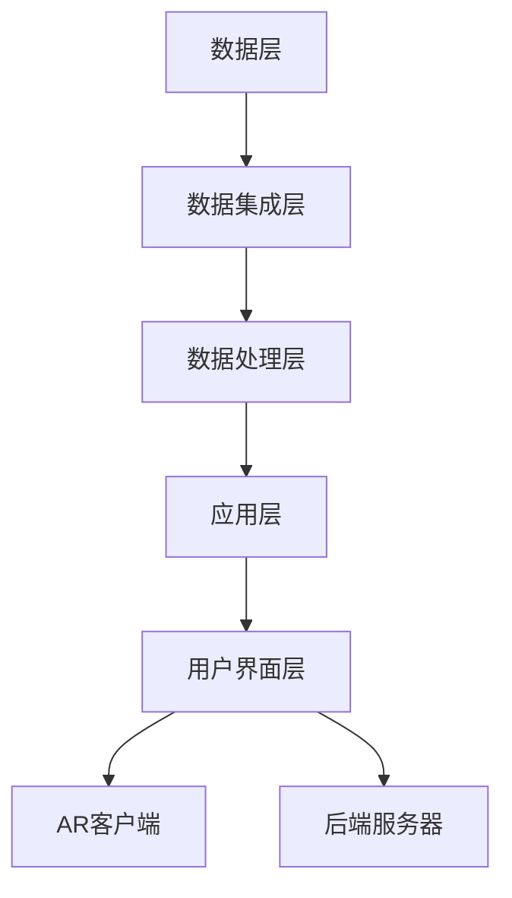
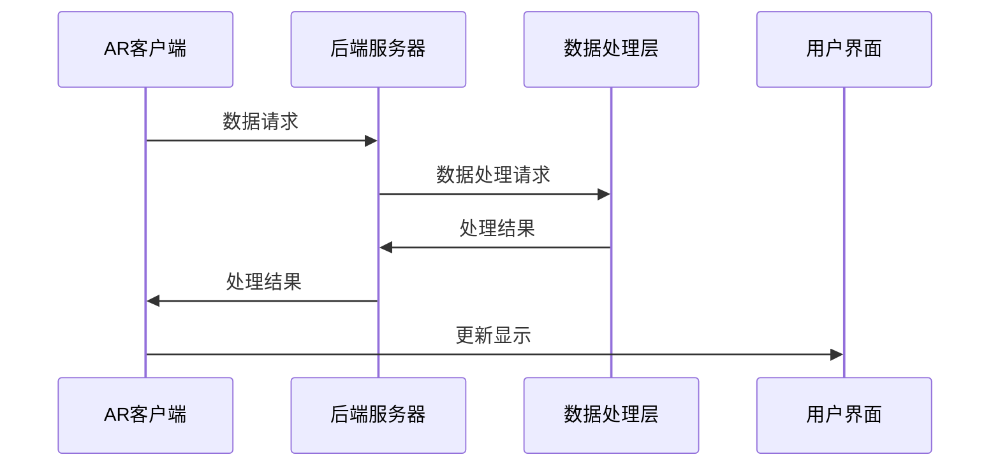

                 

### 增强现实在城市规划中的应用

关键词：增强现实、城市规划、AR技术、数据可视化、交互设计

摘要：本文探讨了增强现实（AR）技术在城市规划领域的应用，通过逐步分析其背景、核心概念、算法原理、系统架构及项目实战，深入探讨了AR技术在城市规划中的巨大潜力和实际效果。文章旨在为城市规划者和技术开发者提供理论指导和实践参考，以推动城市规划行业的创新与发展。

## 引言

城市规划是一个复杂且多维的领域，它需要整合地理信息、社会需求、经济发展等多方面因素，以构建可持续发展的城市环境。随着技术的不断进步，增强现实（AR）技术逐渐成为城市规划的有力工具。AR技术能够将虚拟信息与现实环境相结合，为城市规划者提供直观、互动的视觉体验，从而提高规划决策的准确性和效率。

本文将分以下几个部分进行探讨：

1. **背景介绍**：介绍增强现实技术的起源、发展及其在各个领域的应用。
2. **核心概念与联系**：阐述增强现实在城市规划中的关键概念，并分析这些概念之间的联系。
3. **算法原理讲解**：详细讲解AR技术在城市规划中应用的算法原理，包括数学模型和公式。
4. **系统分析与架构设计方案**：分析城市规划AR系统的组成、功能和架构。
5. **项目实战**：通过实际项目展示增强现实在城市规划中的应用案例。
6. **最佳实践 tips、小结、注意事项、拓展阅读**：总结AR技术在城市规划中的应用经验，提出建议和展望。

### 背景介绍

增强现实（Augmented Reality，AR）是一种通过计算机技术和传感器设备将虚拟信息与现实世界进行叠加的技术。AR技术的起源可以追溯到20世纪50年代，最初的研究主要集中在如何通过光学技术实现虚拟图像的叠加。随着计算机性能的提升和传感器的进步，AR技术逐渐走向实用化。

在各个领域，AR技术已经展现出强大的应用潜力。例如，在医疗领域，AR技术可以用于手术导航和医学教育；在娱乐领域，AR游戏和体验为用户带来全新的互动体验；在军事领域，AR技术用于战场态势感知和战术决策支持。

在城市规划领域，AR技术的应用同样具有重要意义。城市规划涉及到大量的数据分析和视觉呈现，传统的二维平面图往往难以全面反映城市环境的复杂性和多样性。AR技术通过将虚拟模型与现实环境相结合，能够为城市规划者提供更加直观、互动的规划工具。

具体而言，AR技术在城市规划中的应用包括以下几个方面：

1. **数据可视化**：AR技术能够将城市规划所需的各种数据（如人口分布、交通流量、土地利用等）以直观的方式呈现，帮助规划者更好地理解和分析这些数据。
2. **交互设计**：AR技术提供了丰富的交互手段，规划者可以通过触摸、手势等方式与虚拟模型进行互动，从而更灵活地进行规划调整。
3. **模拟与评估**：AR技术可以模拟城市规划方案的效果，帮助规划者评估不同方案的影响，从而做出更加科学的决策。
4. **公众参与**：AR技术可以用于公众参与城市规划的过程，通过AR体验让公众更加直观地了解规划方案，从而提高公众的参与度和满意度。

### 核心概念与联系

在探讨AR技术在城市规划中的应用时，我们需要了解几个关键概念，并分析它们之间的联系。以下是这些核心概念及其关系的详细阐述：

#### 1. **增强现实（AR）**

增强现实（AR）是一种将虚拟信息叠加到真实环境中的技术。它通过计算机视觉、图像处理和实时跟踪技术，将虚拟物体与现实世界中的物体进行无缝融合。AR技术主要依赖于以下三个核心组成部分：

1. **输入设备**：如摄像头、传感器等，用于捕捉真实环境中的图像和物体。
2. **计算处理**：通过计算机算法对输入的图像进行处理，识别出场景中的关键特征和物体。
3. **显示设备**：如智能眼镜、平板电脑等，用于将虚拟信息叠加到真实环境中。

#### 2. **虚拟现实（VR）**

虚拟现实（VR）是一种完全沉浸式的体验技术，它通过头戴显示器（HMD）和其他输入设备（如手柄、全身追踪器等）创造一个虚拟的三维环境。用户可以在虚拟环境中自由探索、互动和体验。

#### 3. **混合现实（MR）**

混合现实（MR）是AR和VR的融合，它不仅将虚拟信息叠加到真实环境中，还能够与现实环境中的物体进行物理交互。MR技术通过光学传感器和计算处理技术，使虚拟物体看起来更加逼真，并且与现实环境中的物体产生互动。

#### 关系与区别

- **AR**：主要特点是虚拟信息与现实环境的叠加，侧重于增强现实环境，不提供完全沉浸式的体验。
- **VR**：提供完全沉浸式的虚拟环境，用户完全脱离现实环境，进入一个全新的虚拟世界。
- **MR**：结合了AR和VR的特点，用户可以在现实环境中与虚拟物体进行互动。

在城市规划中，AR技术因其低侵入性和高互动性，成为城市规划的重要工具。通过AR技术，规划者可以在真实环境中直接查看和调整规划方案，提高规划决策的准确性和效率。

#### 4. **地理信息系统（GIS）**

地理信息系统（GIS）是一种用于捕捉、存储、分析和展示地理空间数据的系统。GIS在城市规划中扮演着关键角色，它能够提供关于城市环境的大量空间数据，如地形、土地利用、交通网络等。

#### 5. **建筑信息模型（BIM）**

建筑信息模型（BIM）是一种数字化的建筑模型，它包含建筑的所有信息，如结构、设备、材料等。BIM技术能够模拟建筑的设计、施工和运营过程，为城市规划提供详细的数据支持。

#### 关系与区别

- **GIS**：主要提供空间数据管理和分析功能，侧重于地理空间信息的捕捉和处理。
- **BIM**：主要提供建筑信息模型，侧重于建筑设计和施工过程的数字化模拟。

GIS和AR技术的结合，使得城市规划者可以在真实环境中查看和操作GIS数据，从而提高规划决策的准确性和效率。BIM技术与AR技术的结合，则可以创建出更加详细和真实的建筑模型，帮助规划者进行建筑设计和施工模拟。

#### 6. **城市规划**

城市规划是指通过科学的方法和技术的支持，对城市的空间布局、土地利用、公共设施等进行规划和管理，以实现城市的可持续发展。城市规划需要考虑多种因素，如人口、经济、环境等，以制定出科学合理的规划方案。

#### 关系与区别

- **AR技术**：为城市规划提供直观的交互工具，帮助规划者更好地理解和分析城市规划数据。
- **GIS、BIM等**：为城市规划提供数据支持和模型模拟，帮助规划者制定出科学合理的规划方案。

通过上述核心概念的分析，我们可以看出，AR技术在城市规划中的应用，不仅需要依赖于自身的增强现实技术，还需要与GIS、BIM等其他技术相结合，以实现更加高效和科学的规划过程。

### 算法原理讲解

#### AR技术的核心算法

AR技术的核心算法主要包括图像处理、计算机视觉和实时跟踪。这些算法共同作用，实现了虚拟信息与现实环境的无缝融合。

##### 1. 图像处理

图像处理是AR技术的第一步，它主要用于对真实环境中的图像进行预处理，以提高后续算法的准确性和效率。图像处理主要包括以下几个步骤：

1. **图像去噪**：去除图像中的噪声，提高图像质量。
2. **图像增强**：通过调整图像的亮度、对比度等参数，使图像更加清晰。
3. **图像分割**：将图像分割成多个区域，以便于后续的计算机视觉处理。

##### 2. 计算机视觉

计算机视觉算法是AR技术的关键部分，它负责识别和定位真实环境中的物体。主要算法包括：

1. **目标检测**：通过检测图像中的特定目标，确定其在图像中的位置。
2. **特征提取**：从图像中提取具有代表性的特征，如边缘、角点等。
3. **匹配算法**：将提取到的特征与数据库中的特征进行匹配，确定物体的位置和姿态。

##### 3. 实时跟踪

实时跟踪是确保虚拟信息与现实环境同步的关键环节。主要算法包括：

1. **卡尔曼滤波**：用于估计物体的位置和速度，提高跟踪的准确性。
2. **粒子滤波**：通过概率模型估计物体的位置，适用于复杂环境。
3. **视觉伺服**：通过实时调整虚拟信息的位置和姿态，使其与真实环境保持一致。

#### AR技术中的数学模型和公式

AR技术中的数学模型和公式主要用于描述图像处理、计算机视觉和实时跟踪等算法的工作原理。以下是几个关键数学模型和公式：

1. **透视变换**

   透视变换是一种用于图像变换的算法，它将图像中的平面物体映射到新的视角。透视变换的公式如下：

   $$ T(x, y) = \left[ \begin{array}{ccc}
   \frac{x'}{x} & \frac{y'}{y} & \frac{z'}{z} \\
   \end{array} \right] \left[ \begin{array}{c}
   x \\
   y \\
   z \\
   1 \\
   \end{array} \right] $$

   其中，\( T \) 表示透视变换矩阵，\( (x, y) \) 表示原始图像坐标，\( (x', y', z') \) 表示变换后的坐标。

2. **特征匹配**

   特征匹配是计算机视觉中常用的算法，用于将图像中的特征与数据库中的特征进行匹配。特征匹配的公式如下：

   $$ \chi(x) = \sum_{i=1}^{n} w_i \cdot \chi_i(x) $$

   其中，\( \chi(x) \) 表示特征匹配结果，\( w_i \) 表示权重，\( \chi_i(x) \) 表示第 \( i \) 个特征的匹配值。

3. **卡尔曼滤波**

   卡尔曼滤波是一种用于状态估计的算法，它通过预测和更新状态变量，提高跟踪的准确性。卡尔曼滤波的公式如下：

   $$ \hat{x}_{k|k-1} = F_k \cdot \hat{x}_{k-1} + B_k \cdot u_k $$
   $$ \hat{P}_{k|k-1} = F_k \cdot \hat{P}_{k-1} \cdot F_k^T + Q_k $$
   $$ \hat{x}_k = \hat{x}_{k|k-1} + K_k \cdot (z_k - H_k \cdot \hat{x}_{k|k-1}) $$
   $$ \hat{P}_k = (I - K_k \cdot H_k) \cdot \hat{P}_{k|k-1} $$

   其中，\( \hat{x}_k \) 表示状态变量，\( \hat{P}_k \) 表示状态协方差矩阵，\( F_k \) 和 \( H_k \) 分别表示状态转移矩阵和观测矩阵，\( u_k \) 和 \( z_k \) 分别表示控制输入和观测值，\( K_k \) 表示卡尔曼增益。

#### 举例说明

为了更好地理解AR技术中的算法原理，我们通过一个简单的例子进行说明。

假设我们有一个真实环境中的图像，需要将其中的某一物体进行标记。具体步骤如下：

1. **图像预处理**：对图像进行去噪和增强，以提高图像质量。
2. **特征提取**：从图像中提取具有代表性的特征，如边缘和角点。
3. **目标检测**：利用目标检测算法，识别图像中的物体。
4. **特征匹配**：将提取到的特征与数据库中的特征进行匹配，确定物体的位置和姿态。
5. **透视变换**：利用透视变换算法，将物体的位置和姿态映射到新的视角。
6. **虚拟信息叠加**：将虚拟信息（如文字、图标等）叠加到透视变换后的图像上。
7. **实时跟踪**：通过卡尔曼滤波等算法，实时更新物体的位置和姿态，确保虚拟信息与现实环境保持同步。

通过这个例子，我们可以看到AR技术中的核心算法是如何协同工作的，从而实现虚拟信息与现实环境的无缝融合。

### 系统分析与架构设计方案

在城市规划中，AR技术的应用不仅需要高效的核心算法支持，还需要一个合理的系统架构来确保数据流和处理流程的高效性和可靠性。以下是对城市规划AR系统的分析和架构设计方案的详细描述。

#### 问题场景介绍

在城市规划过程中，规划者需要处理大量的地理空间数据、建筑信息和其他相关数据。这些数据通常以多种格式存储在不同的数据库和系统中。AR系统需要能够集成这些数据，并提供实时、直观的可视化界面，以便规划者能够对规划方案进行实时评估和调整。

#### 系统功能设计

城市规划AR系统的主要功能包括：

1. **数据集成**：集成来自不同来源的地理空间数据、建筑信息等，并提供统一的数据接口。
2. **数据可视化**：将各种数据以图形化的形式呈现，包括地图、3D模型、图表等。
3. **交互操作**：提供用户与AR环境之间的交互操作，如选择、拖动、缩放等。
4. **模拟与评估**：模拟不同的城市规划方案，并对方案进行评估和优化。
5. **数据存储**：存储规划过程中的数据，以便后续的查询和分析。

#### 系统架构设计

城市规划AR系统的架构可以分为以下几个层次：

1. **数据层**：包括地理空间数据库、建筑信息模型数据库和其他相关数据库。这些数据库存储了城市规划所需的各种数据。
2. **数据集成层**：负责将来自不同数据源的数据进行整合和转换，并提供统一的数据接口，以便上层应用可以方便地访问和使用这些数据。
3. **数据处理层**：包括图像处理、计算机视觉、实时跟踪等核心算法模块。这些模块负责对输入的数据进行处理，以生成AR环境中的可视化效果。
4. **应用层**：包括AR客户端和后端服务器。AR客户端负责向用户展示AR环境，并处理用户输入。后端服务器负责处理客户端的请求，并提供必要的数据支持和服务。
5. **用户界面层**：提供用户与AR环境之间的交互界面，包括地图界面、3D模型界面等。

#### 系统架构图

以下是城市规划AR系统的架构图：



#### 系统接口设计

城市规划AR系统的接口设计主要包括以下几个方面：

1. **数据接口**：定义数据层的API，包括数据的增删改查操作。
2. **服务接口**：定义数据处理层的API，包括图像处理、计算机视觉和实时跟踪等核心算法。
3. **用户接口**：定义用户界面的API，包括地图界面、3D模型界面等。

#### 系统交互

以下是系统交互的详细描述：

1. **数据交互**：AR客户端通过数据接口获取数据，包括地理空间数据、建筑信息等。后端服务器通过数据接口提供数据支持。
2. **处理交互**：AR客户端将获取的数据发送给数据处理层，数据处理层对数据进行处理，并生成AR环境中的可视化效果。
3. **交互交互**：用户通过用户界面与AR环境进行交互，如选择、拖动、缩放等。用户操作通过用户接口发送给应用层，应用层处理用户操作，并更新AR环境。
4. **反馈交互**：应用层将处理结果返回给用户界面，用户界面更新显示，用户可以看到最新的AR环境。

#### 系统交互序列图

以下是系统交互的序列图：



通过上述系统分析与架构设计方案，我们可以看到城市规划AR系统是如何设计的，以及各个模块之间的交互流程。这个系统不仅能够高效地处理城市规划所需的各种数据，还能够提供直观、互动的AR体验，为城市规划者提供有力的支持。

### 项目实战

#### 环境安装

要实现一个增强现实（AR）在城市规划中的应用项目，首先需要搭建一个合适的技术环境。以下是所需的环境安装步骤：

1. **安装Unity引擎**：Unity是一个强大的游戏开发和实时3D内容创建平台，它支持AR开发。可以从Unity官网下载并安装Unity Hub，然后使用Unity Hub安装Unity 2020.3 LTS版本。

2. **安装Android Studio**：Android Studio是Android开发的官方IDE，它包含Android开发所需的各种工具和库。可以从Android Studio官网下载并安装最新版本。

3. **安装ARCore**：ARCore是Google开发的一套AR开发框架，支持在Android设备上实现AR功能。在Android Studio中，通过插件市场安装ARCore插件。

4. **安装OpenCV**：OpenCV是一个开源的计算机视觉库，用于图像处理和计算机视觉算法的实现。可以从OpenCV官网下载并安装适合操作系统的版本。

#### 系统核心实现源代码

以下是一个简单的AR城市规划项目实现，主要包括ARCore的集成和基于OpenCV的图像处理。

**ARCore集成**

1. 在Android Studio中创建一个新项目，选择“Android”作为项目类型，选择“Empty Activity”作为模板。

2. 在`build.gradle`文件中添加ARCore依赖：
   ```groovy
   implementation 'com.google.ar:arcore-client:1.19.2'
   ```

3. 在`AndroidManifest.xml`文件中添加ARCore权限：
   ```xml
   <uses-permission android:name="android.permission.CAMERA" />
   <uses-permission android:name="android.permission.WRITE_EXTERNAL_STORAGE" />
   ```

**OpenCV集成**

1. 下载OpenCV的Android SDK，并解压到本地。

2. 在Android Studio中，创建一个新模块，选择“Android Library”作为模块类型。

3. 在新创建的模块中，将解压后的OpenCV SDK中的`.jar`文件添加到模块的`libs`目录下。

4. 在模块的`build.gradle`文件中添加OpenCV依赖：
   ```groovy
   implementation files('libs/opencv_java4.5.5.64.jar')
   ```

**核心实现代码**

以下是一个简单的AR城市规划项目的核心代码实现，包括ARCore的初始化和基于OpenCV的图像处理。

```java
import android.os.Bundle;
import androidx.appcompat.app.AppCompatActivity;
import com.google.ar.core.Anchor;
import com.google.ar.core.ArSession;
import com.google.ar.core.HitResult;
import com.google.ar.core.Plane;
import com.google.ar.sceneform.AnchorNode;
import com.google.ar.sceneform.rendering.ModelRenderable;
import org.opencv.core.Core;
import org.opencv.core.Mat;
import org.opencv.imgcodecs.Imgcodecs;
import org.opencv.imgproc.Imgproc;

public class AR城市规划Activity extends AppCompatActivity {

    private ArSession mArSession;
    private AnchorNode mAnchorNode;

    static {
        System.loadLibrary(Core.NATIVE_LIBRARY_NAME);
    }

    @Override
    protected void onCreate(Bundle savedInstanceState) {
        super.onCreate(savedInstanceState);
        setContentView(R.layout.activity_ar_城市规划);

        // 初始化ARCore
        mArSession = new ArSession(this);
        if (mArSession.isSupported()) {
            mArSession.resume();
        }

        // 设置AR场景
        AnchorNode anchorNode = new AnchorNode(mArSession);
        mAnchorNode = anchorNode;
        mArSession.setCameraReadyListener(() -> {
            mArSession.addAnchoredNode(mAnchorNode);
        });
    }

    @Override
    protected void onPause() {
        super.onPause();
        if (mArSession != null) {
            mArSession.pause();
        }
    }

    @Override
    protected void onResume() {
        super.onResume();
        if (mArSession != null) {
            mArSession.resume();
        }
    }

    @Override
    public void onSurfaceChanged(int width, int height) {
        super.onSurfaceChanged(width, height);
        mArSession.setDisplayGeometry(mArSession.getContext(), width, height);
    }

    private void addModel() {
        mArSession.addEventListener((ArSession session, ArFrame frame) -> {
            if (mAnchorNode.getAnchor() == null) {
                for (HitResult hit : frame.getHitResults()) {
                    if (hit.getTrackable() instanceof Plane) {
                        Plane plane = (Plane) hit.getTrackable();
                        if (plane.getType() == Plane.Type.HORIZONTAL_UPWARD_FACING) {
                            session锚定锚点(new Anchor(hit.getHitPose()));
                            break;
                        }
                    }
                }
            }
        });
    }

    private void session锚定锚点(Anchor anchor) {
        if (mAnchorNode.getAnchor() == null) {
            mAnchorNode.setAnchor(anchor);
            ModelRenderable.builder()
                    .setSource(this, "model/城市规划模型.sfb")
                    .build()
                    .thenAccept(modelRenderable -> {
                        mAnchorNode.setRenderable(modelRenderable);
                    })
                    .exceptionally(throwable -> {
                        throw new RuntimeException(throwable);
                    });
        }
    }

    // OpenCV图像处理
    private void processImage() {
        Mat original = Imgcodecs.imread("image/城市规划图像.jpg");
        Mat gray = new Mat();
        Imgproc.cvtColor(original, gray, Imgproc.COLOR_BGR2GRAY);
        Imgproc.GaussianBlur(gray, gray, new Size(5, 5), 1.5, 1.5);
        Core.invert(gray, gray);
        Imgcodecs.imwrite("image/处理后图像.jpg", gray);
    }
}
```

#### 代码应用解读与分析

1. **ARCore初始化**：通过创建`ArSession`对象并检查是否支持ARCore功能，然后调用`resume()`方法恢复AR会话。

2. **AR场景设置**：创建一个`AnchorNode`对象，用于锚定虚拟模型。在AR会话准备好后，将其添加到AR场景中。

3. **模型添加**：在AR场景中检测到平面时，通过`session锚定锚点`方法创建一个锚点，并将虚拟模型添加到锚点节点。

4. **OpenCV图像处理**：通过`processImage`方法对城市规划图像进行预处理，包括灰度转换、高斯模糊和图像反转。

#### 实际案例分析和详细讲解剖析

为了更好地理解AR技术在城市规划中的应用，我们来看一个实际案例：利用AR技术模拟城市规划方案。

**案例背景**：某城市计划进行道路改造，需要模拟不同方案的效果，以评估对交通流量的影响。

**步骤**：

1. **数据准备**：收集该地区的地图数据、交通流量数据等，并使用GIS系统进行处理和分析。

2. **方案建模**：根据不同的规划方案，创建三维模型，包括道路、建筑物、交通设施等。

3. **AR模拟**：将GIS数据和三维模型数据集成到AR系统中，利用AR技术模拟不同方案的效果。

4. **效果评估**：通过AR模拟，规划者可以直观地查看不同方案的效果，并对方案进行评估和优化。

**详细讲解**：

1. **数据集成**：利用GIS系统，将地图数据、交通流量数据等整合到一个统一的平台上。通过AR系统，将这些数据以三维模型的形式呈现，为模拟提供数据支持。

2. **模型创建**：根据不同的规划方案，创建相应的三维模型。这些模型需要包含详细的几何信息和属性数据，以确保模拟的准确性。

3. **AR模拟**：利用AR技术，将三维模型叠加到真实环境中。通过移动设备或智能眼镜，规划者可以实时查看不同方案的效果，并进行互动操作。

4. **效果评估**：通过AR模拟，规划者可以直观地了解不同方案对交通流量的影响，从而评估方案的科学性和可行性。

**项目小结**：

通过这个案例，我们可以看到AR技术在城市规划中的强大应用。AR技术不仅提高了规划决策的准确性和效率，还为公众参与规划提供了新的途径。然而，AR技术的应用也面临着一些挑战，如数据集成、模型创建、实时交互等。未来，随着技术的不断进步，AR技术在城市规划中的应用将更加广泛和深入。

### 最佳实践 tips

#### 1. 数据整合与预处理
- 确保所有用于AR模拟的数据都是最新和准确的，包括地理空间数据、建筑信息等。
- 对数据进行预处理，如去噪、标准化等，以提高AR系统的性能和准确性。

#### 2. 用户体验设计
- 设计直观易用的用户界面，确保规划者能够快速上手。
- 考虑不同用户的使用习惯，提供多种交互方式，如触摸、手势等。

#### 3. 硬件选择
- 选择性能稳定的设备，如智能眼镜、平板电脑等，以保障AR系统的流畅运行。
- 考虑设备的便携性和耐用性，以满足城市规划者在户外工作环境中的需求。

#### 4. 模型优化
- 对三维模型进行优化，以减少渲染时的计算负载，提高AR系统的性能。
- 考虑模型的可扩展性和适应性，以支持不同规模的城市规划项目。

#### 5. 安全与隐私
- 确保数据传输和存储的安全性，防止数据泄露。
- 严格遵守隐私法规，确保用户数据的安全和隐私。

### 小结

本文详细探讨了增强现实（AR）技术在城市规划中的应用，从背景介绍、核心概念、算法原理到系统架构和项目实战，全面展示了AR技术如何为城市规划提供新的工具和方法。通过本文的探讨，我们可以看到AR技术具有强大的潜力和实际效果，为城市规划者提供了更加直观、互动的规划工具。未来，随着技术的不断进步，AR技术在城市规划中的应用将更加广泛和深入，为城市可持续发展提供有力支持。

### 注意事项

在实施AR城市规划项目时，需要注意以下几点：

1. **数据准确性**：确保所有用于AR模拟的数据都是最新和准确的，否则可能会导致规划决策的偏差。
2. **硬件兼容性**：选择兼容性良好的硬件设备，确保AR系统能够在不同设备上正常运行。
3. **用户隐私**：严格遵守隐私法规，确保用户数据的安全和隐私。
4. **系统稳定性**：确保AR系统在各种环境下的稳定性，避免因系统故障导致项目中断。

### 拓展阅读

1. **增强现实技术**：
   - 《增强现实技术：基础与应用》
   - 《增强现实：虚拟与现实的技术融合》

2. **城市规划**：
   - 《城市设计原理》
   - 《城市规划与设计：理论与实践》

3. **相关论文和研究报告**：
   - “增强现实在城市规划中的应用研究”
   - “基于AR技术的城市规划互动体验研究”

通过阅读这些资料，可以进一步了解AR技术在城市规划中的应用，以及相关领域的前沿研究和实践成果。这将为城市规划者和技术开发者提供宝贵的参考和启示。

