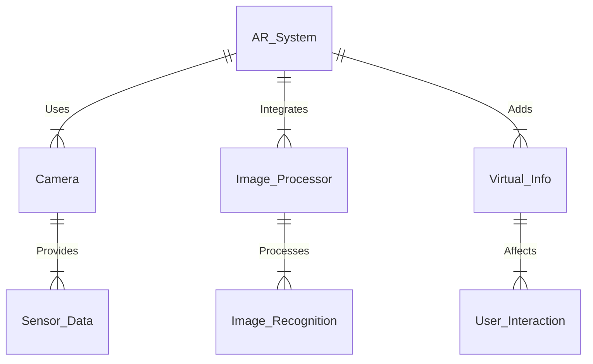
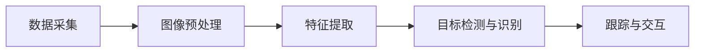
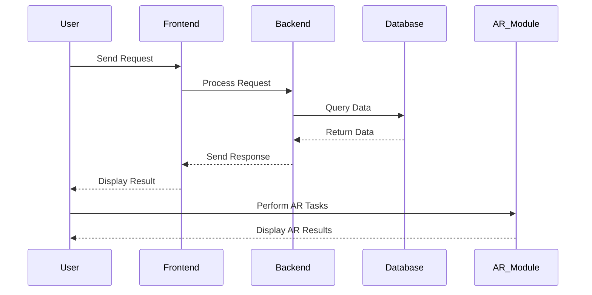
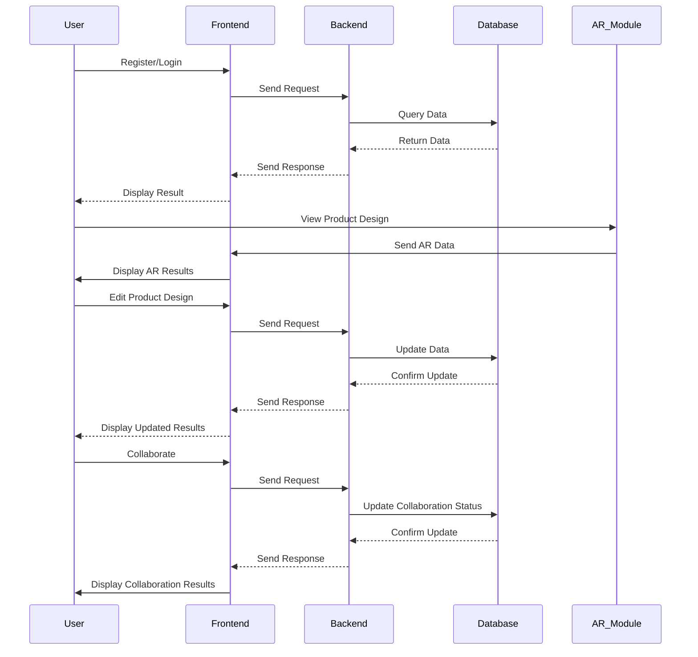

                 

### 引言

#### 1.1 问题背景

随着科技的飞速发展，工业设计领域正在迎来前所未有的变革。传统的工业设计方法通常依赖于物理模型和手工草图，这既耗时又费钱。而随着计算机技术的不断进步，虚拟现实（VR）和增强现实（AR）技术逐渐成为工业设计可视化的有力工具。VR技术通过模拟出一个完全虚拟的环境，使得设计师可以在一个三维空间中直接操作和体验产品。然而，VR设备通常较为笨重且成本较高，不适合实时协作和现场演示。

增强现实技术则有所不同，它通过将虚拟信息叠加到真实环境中，使得设计师可以在实际场景中直观地看到和操作设计方案。这种技术不仅提高了设计效率，还降低了成本，使得更多的企业能够享受到先进设计工具带来的便利。然而，尽管增强现实技术在多个领域已有广泛应用，其在工业设计可视化中的具体应用和效果评估仍需进一步深入研究。

#### 1.2 研究目的与意义

本研究旨在探讨增强现实技术在工业设计可视化中的应用，明确其技术优势和实践效果。具体研究目的如下：

1. **技术优势分析**：分析增强现实技术在工业设计中的优势，包括可视化效果、交互性、实时性等方面。
2. **应用场景研究**：研究增强现实技术在各类工业设计中的应用场景，探讨其在不同设计阶段的作用。
3. **效果评估**：通过实际案例，评估增强现实技术在工业设计可视化中的实际效果，包括设计效率、成本节约、客户满意度等。
4. **挑战与解决方案**：探讨增强现实技术在工业设计可视化中面临的挑战，并提出相应的解决方案。

本研究具有重要的实践和理论意义：

1. **实践意义**：为工业企业提供实用的技术方案，提高设计效率和产品质量，降低设计成本。
2. **理论意义**：丰富增强现实技术的研究领域，为后续研究提供理论参考。

#### 1.3 边界与外延

1. **研究范围**：本文主要探讨增强现实技术在工业设计可视化中的应用，不包括其他领域的应用。
2. **研究限制**：由于篇幅和资源限制，本文仅选取部分典型应用场景进行分析，不进行广泛的实证研究。

#### 1.4 文章结构

本文结构如下：

1. **引言**：介绍研究背景、目的和意义，以及边界与外延。
2. **增强现实技术基础**：介绍增强现实技术的基本概念、发展历程、关键技术及应用领域。
3. **工业设计中的增强现实应用**：分析增强现实技术在工业设计中的应用原理、场景、关键问题和应用案例。
4. **应用架构**：探讨增强现实在工业设计可视化中的应用架构，包括系统设计、模块划分和集成测试。
5. **应用算法**：介绍增强现实在工业设计可视化中的应用算法，包括数据处理、模型构建和效果优化。
6. **项目实战**：通过具体项目实例，展示增强现实技术在工业设计可视化中的实际应用。
7. **总结**：总结全文，提出研究结论和未来研究方向。

## 1.5 总结

本文首先介绍了增强现实技术在工业设计可视化中的应用背景和研究意义，明确了研究的边界与外延。接着，通过对增强现实技术基础和应用场景的深入分析，揭示了其在工业设计中的优势和应用潜力。随后，本文详细探讨了增强现实在工业设计可视化中的具体应用架构和算法，并通过实际项目展示了其应用效果。最后，本文总结了全文的主要结论，并提出了未来研究的方向和建议。通过本文的研究，我们期望为增强现实技术在工业设计领域的进一步发展提供理论依据和实践指导。

### 第1章 增强现实技术基础

#### 1.1 增强现实概述

增强现实（Augmented Reality，简称AR）是一种将虚拟信息与现实环境相结合的技术，通过在现实环境中叠加计算机生成的图像、视频、音频等多媒体信息，使用户能够直观地感知和互动。与虚拟现实（Virtual Reality，简称VR）不同，AR并不完全替代现实环境，而是在现实基础上增强用户感知。

**1.1.1 增强现实的基本概念**

增强现实技术的基本概念包括以下几个方面：

- **现实环境**：指真实存在的物理世界，包括视觉、听觉、触觉等感官信息。
- **虚拟信息**：通过计算机技术生成的图像、视频、音频等信息。
- **叠加**：将虚拟信息与现实环境结合，使得用户能够在现实中感知到虚拟信息。
- **交互**：用户通过视觉、听觉、触觉等方式与虚拟信息进行互动。

**1.1.2 增强现实的发展历程**

增强现实技术的发展历程可以追溯到20世纪60年代。以下是几个重要的发展阶段：

- **早期探索**（1960s-1980s）：最早的增强现实概念和实验主要集中在军事和航空航天领域，如美国飞行员头盔的早期尝试。
- **技术萌芽**（1990s）：随着计算机技术和图像处理技术的发展，增强现实技术开始应用于娱乐、教育和医疗等领域。1990年，Jaron Lanier提出了“虚拟现实”一词，标志着增强现实技术的进一步发展。
- **商业应用**（2000s）：增强现实技术在智能手机和平板电脑的普及下，开始大规模应用于消费市场。例如，任天堂的《精灵宝可梦GO》是一款广受欢迎的增强现实游戏。
- **技术成熟**（2010s-2020s）：随着移动设备的性能提升和传感器技术的进步，增强现实技术逐渐应用于工业设计、制造业、医疗等领域。苹果和谷歌等科技巨头也加大了对增强现实技术的投入和研发。

**1.1.3 增强现实的关键技术**

增强现实技术的实现依赖于多个关键技术的支持：

- **图像处理与识别**：通过图像处理算法对现实环境中的图像进行分析和识别，以确定虚拟信息叠加的位置和方式。
- **计算机视觉**：利用计算机视觉技术对现实环境中的物体进行检测、识别和跟踪。
- **传感器技术**：包括摄像头、GPS、陀螺仪、加速度计等，用于获取现实环境中的各种数据。
- **人机交互**：设计合适的人机交互界面，使得用户能够直观地与虚拟信息进行互动。

#### 1.2 增强现实的应用领域

增强现实技术在多个领域有广泛应用，以下是其中几个主要领域：

- **游戏与娱乐**：增强现实游戏是最早和最广泛的应用之一，如《精灵宝可梦GO》等。
- **教育**：增强现实技术可以提供更加生动、直观的教学体验，如医学教育、历史教学等。
- **医疗**：增强现实技术在手术指导、疾病诊断、康复训练等领域有广泛应用。
- **工业设计可视化**：增强现实技术可以帮助设计师在真实环境中直观地查看和修改设计方案，提高设计效率和准确性。
- **军事与安全**：增强现实技术在战场模拟、安全培训等领域有重要应用。
- **零售**：增强现实技术可以提供虚拟试衣、虚拟购物体验等，提升消费者购物体验。

#### 1.3 增强现实在工业设计中的应用

增强现实技术在工业设计中的应用主要体现在以下几个方面：

- **可视化设计**：设计师可以在真实环境中实时查看和修改设计方案，提高设计效率和准确性。
- **协作设计**：增强现实技术可以支持多人在不同地点实时协作，提高设计团队的合作效率。
- **客户互动**：通过增强现实技术，客户可以在现场实时查看和体验产品设计，提高客户满意度。
- **制造与装配**：增强现实技术可以帮助技术人员在现场进行制造和装配指导，减少错误和故障。

#### 1.4 增强现实技术发展趋势与挑战

**发展趋势**：

- **硬件性能提升**：随着移动设备和传感器技术的不断进步，增强现实设备的性能和用户体验将得到进一步提升。
- **多领域融合**：增强现实技术将继续与其他领域如物联网、大数据、人工智能等结合，推动新应用的出现。
- **应用场景拓展**：增强现实技术将在更多领域得到应用，如智能制造、智慧城市、智能交通等。

**面临的挑战**：

- **技术成熟度**：尽管增强现实技术已有一定发展，但部分关键技术仍需进一步研究和优化。
- **成本问题**：目前增强现实设备的成本较高，限制了其大规模应用。
- **用户体验**：如何提供更加自然、直观的用户体验仍是增强现实技术面临的重要挑战。
- **隐私与安全**：增强现实应用中的数据收集和处理可能引发隐私和安全问题，需要制定相应的法律法规进行规范。

#### 1.5 本章小结

本章介绍了增强现实技术的基本概念、发展历程、关键技术及应用领域。通过分析增强现实技术在工业设计中的应用，揭示了其在可视化设计、协作设计、客户互动和制造与装配等方面的优势。同时，本章也探讨了增强现实技术的发展趋势和面临的挑战，为后续章节的深入研究提供了基础。

## 1.6 关键概念与联系

### 1.6.1 核心概念原理

**增强现实（AR）**：一种将虚拟信息叠加到现实环境中的技术，通过视觉、听觉、触觉等感官增强用户对现实世界的感知。

**虚拟现实（VR）**：一种完全模拟出的虚拟环境，用户在其中可以完全沉浸并互动。

**图像处理与识别**：利用算法对现实环境中的图像进行分析和识别，以确定虚拟信息叠加的位置和方式。

**计算机视觉**：用于检测、识别和跟踪现实环境中的物体。

### 1.6.2 概念属性特征对比表格

| 概念 | 特征 |
| --- | --- |
| 增强现实（AR） | 1. 虚拟信息叠加到现实环境<br>2. 增强用户感知<br>3. 实时互动 |
| 虚拟现实（VR） | 1. 完全虚拟环境<br>2. 用户沉浸感强<br>3. 完全替代现实 |
| 图像处理与识别 | 1. 图像分析<br>2. 识别目标<br>3. 精度要求高 |
| 计算机视觉 | 1. 物体检测<br>2. 物体识别<br>3. 跟踪与追踪 |

### 1.6.3 ER实体关系图架构

下面是一个简单的ER实体关系图，用于描述增强现实技术中关键实体的关系：



在这个ER图中，`AR_System` 是核心实体，`Camera`、`Image_Processor` 和 `Virtual_Info` 是与之关联的实体，`Sensor_Data`、`Image_Recognition` 和 `User_Interaction` 是相关的属性或行为。

通过上述对比和关系图，可以更清晰地理解增强现实技术中的核心概念和其相互关系，为后续章节的深入研究提供理论基础。

### 1.7 算法原理讲解

#### 1.7.1 算法原理

增强现实技术中的核心算法主要包括图像处理与识别、计算机视觉以及用户交互等。这些算法的原理如下：

**图像处理与识别**：图像处理算法主要包括图像滤波、边缘检测、特征提取等步骤。滤波用于去除噪声，边缘检测用于提取图像中的边缘信息，特征提取则用于提取图像的关键特征。识别算法通过比对输入图像与数据库中的模板，确定图像中目标的位置和属性。

**计算机视觉**：计算机视觉算法主要包括目标检测、识别和跟踪。目标检测是通过算法确定图像中是否存在特定目标，识别则是确定目标的类型和位置，跟踪则是跟踪目标在连续图像中的运动轨迹。

**用户交互**：用户交互算法主要通过传感器获取用户的输入，如手势、语音等，然后通过算法将这些输入转换为控制命令，实现与虚拟信息的互动。

#### 1.7.2 算法流程

以下是增强现实技术中的典型算法流程：

1. **数据采集**：通过摄像头、传感器等设备采集现实环境中的图像和传感器数据。
2. **图像预处理**：对采集到的图像进行滤波、边缘检测等预处理操作，以提高图像质量。
3. **特征提取**：提取图像的关键特征，如边缘、纹理等，用于后续的识别和跟踪。
4. **目标检测与识别**：利用检测算法确定图像中是否存在特定目标，并识别目标的类型和位置。
5. **跟踪与交互**：跟踪目标在连续图像中的运动轨迹，并根据用户的输入进行交互。

以下是算法的Mermaid流程图：



#### 1.7.3 算法实现

下面是一个简单的Python代码示例，用于实现图像处理与识别算法的基本流程：

```python
import cv2
import numpy as np

# 1. 数据采集
image = cv2.imread('input_image.jpg')

# 2. 图像预处理
filtered_image = cv2.GaussianBlur(image, (5, 5), 0)

# 3. 特征提取
edges = cv2.Canny(filtered_image, 100, 200)

# 4. 目标检测与识别
target_detected = cv2.findContours(edges, cv2.RETR_TREE, cv2.CHAIN_APPROX_SIMPLE)

# 5. 跟踪与交互
# ...（后续交互逻辑）

cv2.imshow('Processed Image', edges)
cv2.waitKey(0)
cv2.destroyAllWindows()
```

在这个示例中，`cv2.imread` 用于读取图像，`cv2.GaussianBlur` 用于图像滤波，`cv2.Canny` 用于边缘检测，`cv2.findContours` 用于提取边缘特征。最后，通过显示处理后的图像，用户可以进行后续的交互操作。

通过上述算法原理讲解和实现示例，我们可以更清晰地理解增强现实技术中的核心算法及其应用。

### 1.8 数学公式与模型

增强现实技术中的算法实现往往涉及到复杂的数学模型和公式。以下是几个常见的数学公式和模型，以及它们的解释和应用。

#### 1.8.1 边缘检测（Canny算法）

边缘检测是图像处理中的一个重要步骤，用于提取图像中的边缘信息。Canny算法是一个经典的边缘检测算法，其核心公式如下：

$$
\text{Gx} = \frac{-1}{2} \left[ I(x+1, y) - I(x-1, y) \right]
$$

$$
\text{Gy} = \frac{-1}{2} \left[ I(x, y+1) - I(x, y-1) \right]
$$

其中，\( I(x, y) \) 表示图像在坐标 \( (x, y) \) 处的像素值，\( \text{Gx} \) 和 \( \text{Gy} \) 分别表示水平和垂直方向的梯度值。

Canny算法首先通过上述公式计算图像的水平和垂直梯度，然后使用非极大值抑制（Non-Maximum Suppression）和双阈值算法（Double Threshold）提取边缘。

#### 1.8.2 特征提取（SIFT算法）

尺度不变特征变换（Scale-Invariant Feature Transform，简称SIFT）是一种用于提取图像关键特征的方法。其核心公式如下：

$$
\text{DoG}(x, y, \sigma) = \text{G}_{\sigma}(x, y) - \text{G}_{2\sigma}(x, y)
$$

其中，\( \text{G}_{\sigma}(x, y) \) 和 \( \text{G}_{2\sigma}(x, y) \) 分别表示尺度为 \( \sigma \) 和 \( 2\sigma \) 的高斯滤波图像，\( \text{DoG}(x, y, \sigma) \) 表示尺度 \( \sigma \) 下的 Difference of Gaussian。

SIFT算法通过计算不同尺度下的 \( \text{DoG} \) 图像，寻找局部极值点，这些点即为关键点。然后通过计算关键点周围图像的梯度方向和强度，构建关键点描述子。

#### 1.8.3 用户交互（手势识别）

用户交互中的手势识别通常涉及机器学习算法，如支持向量机（SVM）和神经网络（Neural Network）。以下是手势识别的一个简单公式：

$$
\text{Decision Function} = \sum_{i=1}^{n} \text{w}_i \cdot \text{f}(x_i)
$$

其中，\( \text{w}_i \) 表示权重向量，\( \text{f}(x_i) \) 表示特征向量，\( \text{Decision Function} \) 表示决策函数。

通过计算决策函数的值，可以判断手势的类型。如果决策函数大于某个阈值，则认为手势识别成功。

#### 1.8.4 模型评估（准确率、召回率）

在增强现实技术中，算法的评估通常涉及准确率（Accuracy）和召回率（Recall）等指标：

$$
\text{Accuracy} = \frac{\text{TP} + \text{TN}}{\text{TP} + \text{TN} + \text{FP} + \text{FN}}
$$

$$
\text{Recall} = \frac{\text{TP}}{\text{TP} + \text{FN}}
$$

其中，\( \text{TP} \) 表示真实阳性，\( \text{TN} \) 表示真实阴性，\( \text{FP} \) 表示假阳性，\( \text{FN} \) 表示假阴性。

准确率表示分类正确的比例，召回率表示所有正例中被正确分类的比例。这两个指标越高，算法的性能越好。

通过上述数学公式和模型，我们可以更好地理解增强现实技术中的算法原理，为实际应用提供理论支持。

### 1.9 系统分析与架构设计方案

#### 2.1 问题场景介绍

在工业设计领域，设计人员需要在不同阶段对产品进行多次修改和验证，而这一过程往往涉及到大量的数据交互和复杂的操作。传统的二维图纸和三维建模软件虽然能够提供一定程度的设计支持，但在实际应用中存在诸多限制。例如，设计师无法在真实环境中直观地查看和修改设计方案，导致设计过程中需要反复调整和优化。此外，设计团队之间的协作也面临着沟通不畅、数据传输慢等问题，影响了整体设计效率和产品质量。

为了解决上述问题，引入增强现实技术成为一种可行的方案。通过增强现实，设计师可以在真实环境中实时查看和修改设计方案，提高设计效率和准确性。同时，增强现实技术还可以支持多人在不同地点实时协作，提升设计团队的合作效率。此外，客户也可以通过增强现实技术现场查看和体验产品设计，提高客户满意度和参与度。

#### 2.2 项目介绍

本项目旨在开发一个基于增强现实技术的工业设计可视化系统，以解决传统设计方法中的诸多问题。系统将集成图像处理与识别、计算机视觉、用户交互等技术，为设计师提供一个直观、高效、协同的设计平台。具体项目目标如下：

1. **可视化设计**：通过增强现实技术，实现设计师在真实环境中直观地查看和修改设计方案。
2. **协作设计**：支持多人在不同地点实时协作，提高设计团队的合作效率。
3. **客户互动**：通过增强现实技术，让客户在现场实时查看和体验产品设计，提高客户满意度和参与度。
4. **数据管理**：提供统一的数据管理平台，方便设计师管理和共享设计数据。

#### 2.3 系统功能设计

系统功能设计主要包括以下几个方面：

1. **设计可视化**：实现设计师在真实环境中查看和修改设计方案的功能。
2. **协作功能**：支持多人实时协作，包括设计修改、数据共享和实时沟通。
3. **客户互动**：提供客户查看和体验设计产品的功能，包括虚拟试衣、虚拟装配等。
4. **数据管理**：实现设计数据的存储、管理和共享，包括版本控制和权限管理。
5. **用户管理**：提供用户注册、登录和权限管理功能。

以下是系统的领域模型Mermaid类图：

```mermaid
classDiagram
    class Designer {
        -String username
        -String password
        -List<ProductDesign>
    }
    class ProductDesign {
        -String id
        -String name
        -Date creationDate
        -String status
        -List<Version>
    }
    class Version {
        -String id
        -Date versionDate
        -String description
    }
    class Collaboration {
        -String id
        -Date startDate
        -Date endDate
        -Designer participant
    }
    class Client {
        -String username
        -String password
    }
    Designer --|{ ProductDesign } Version
    Designer --|{ Collaboration } Collaboration
    Client --|{ ProductDesign } ProductDesign
```

在这个类图中，`Designer` 代表设计师，`ProductDesign` 代表产品设计的实体，`Version` 代表设计的版本，`Collaboration` 代表协作的实体，`Client` 代表客户。各个实体之间的关系通过类之间的关联表示。

#### 2.4 系统架构设计

系统的整体架构设计如下：

1. **前端架构**：前端架构主要包括用户界面和交互逻辑，使用React框架实现。
2. **后端架构**：后端架构主要包括API接口、数据管理和业务逻辑处理，使用Spring Boot框架实现。
3. **数据库设计**：数据库设计主要包括用户数据、产品设计数据、版本数据和协作数据，使用MySQL数据库实现。
4. **增强现实模块**：增强现实模块主要包括图像处理与识别、计算机视觉和用户交互，使用OpenCV、ARCore等库实现。

以下是系统的Mermaid架构图：



在这个序列图中，用户通过前端发送请求，前端将请求转发给后端，后端处理请求并从数据库中查询数据，然后将结果返回给前端。同时，用户可以通过增强现实模块执行AR任务，并实时显示结果。

#### 2.5 系统接口设计

系统的接口设计主要包括API接口设计，以下是典型的API接口：

1. **用户注册与登录**：
   - POST `/api/users/register`：用户注册接口，接收用户名、密码等参数。
   - POST `/api/users/login`：用户登录接口，接收用户名和密码，返回令牌。

2. **产品设计**：
   - POST `/api/product-designs`：创建产品设计接口，接收产品设计参数。
   - GET `/api/product-designs/{id}`：获取产品设计详情接口。
   - PUT `/api/product-designs/{id}`：更新产品设计接口。
   - DELETE `/api/product-designs/{id}`：删除产品设计接口。

3. **版本管理**：
   - POST `/api/versions`：创建版本接口，接收版本参数。
   - GET `/api/versions/{id}`：获取版本详情接口。
   - PUT `/api/versions/{id}`：更新版本接口。
   - DELETE `/api/versions/{id}`：删除版本接口。

4. **协作管理**：
   - POST `/api/collaborations`：创建协作接口，接收协作参数。
   - GET `/api/collaborations/{id}`：获取协作详情接口。
   - PUT `/api/collaborations/{id}`：更新协作接口。
   - DELETE `/api/collaborations/{id}`：删除协作接口。

#### 2.6 系统交互设计

以下是系统的Mermaid序列图，展示了用户与系统之间的交互过程：



在这个序列图中，用户通过前端进行注册或登录，然后通过后端与数据库进行交互，获取和更新数据。同时，用户可以通过增强现实模块查看和修改产品设计，并实时显示结果。

通过上述系统分析与架构设计方案，我们可以清晰地了解增强现实技术在工业设计可视化中的应用架构，为系统的开发提供理论基础和实现指导。

### 第3章 增强现实在工业设计可视化中的应用架构

#### 3.1 工业设计可视化系统架构

增强现实在工业设计可视化中的应用架构主要包括前端界面、后端服务、数据库和数据交互等模块。以下是系统架构的详细设计。

##### 3.1.1 前端界面

前端界面负责与用户进行交互，提供用户友好的操作体验。前端使用React框架开发，包括以下主要组件：

1. **用户登录注册**：提供用户身份验证功能，包括登录和注册页面。
2. **产品设计界面**：显示产品设计的2D和3D视图，并提供编辑和修改功能。
3. **增强现实界面**：使用ARCore或ARKit等增强现实开发库，实现产品设计在现实环境中的叠加和交互。
4. **协作界面**：显示协作成员和协作进度，提供实时通信和任务分配功能。

##### 3.1.2 后端服务

后端服务负责处理前端发送的请求，包括用户管理、产品设计、协作管理和数据存储等。后端使用Spring Boot框架开发，包括以下主要模块：

1. **用户管理模块**：处理用户登录、注册和权限验证，提供用户信息管理和用户角色分配。
2. **产品设计模块**：处理产品设计相关操作，包括创建、修改、删除和版本管理。
3. **协作管理模块**：处理协作相关操作，包括协作成员管理、协作任务分配和进度跟踪。
4. **数据存储模块**：使用MySQL数据库存储用户信息、设计数据和协作数据，并提供数据访问接口。

##### 3.1.3 数据库设计

数据库设计包括用户表、产品设计表、版本表和协作表等。以下是主要表的字段设计：

1. **用户表（users）**：
   - id：主键，唯一标识用户。
   - username：用户名。
   - password：用户密码。
   - role：用户角色（如设计师、项目经理、客户）。

2. **产品设计表（product_designs）**：
   - id：主键，唯一标识产品设计。
   - name：产品设计名称。
   - description：产品设计描述。
   - status：产品设计状态（如设计、修改、完成）。

3. **版本表（versions）**：
   - id：主键，唯一标识设计版本。
   - product_design_id：外键，关联产品设计表。
   - version_number：设计版本号。
   - description：设计版本描述。

4. **协作表（collaborations）**：
   - id：主键，唯一标识协作。
   - start_date：协作开始日期。
   - end_date：协作结束日期。
   - product_design_id：外键，关联产品设计表。
   - designer_id：外键，关联用户表。

##### 3.1.4 数据交互

系统采用RESTful API进行数据交互。前端通过发送HTTP请求与后端进行数据通信，主要接口包括：

1. **用户接口**：
   - 登录：`POST /api/users/login`
   - 注册：`POST /api/users/register`
   - 用户信息：`GET /api/users/{id}`
   - 更新用户信息：`PUT /api/users/{id}`

2. **产品设计接口**：
   - 创建产品设计：`POST /api/product-designs`
   - 获取产品设计：`GET /api/product-designs/{id}`
   - 更新产品设计：`PUT /api/product-designs/{id}`
   - 删除产品设计：`DELETE /api/product-designs/{id}`

3. **版本管理接口**：
   - 创建版本：`POST /api/versions`
   - 获取版本：`GET /api/versions/{id}`
   - 更新版本：`PUT /api/versions/{id}`
   - 删除版本：`DELETE /api/versions/{id}`

4. **协作管理接口**：
   - 创建协作：`POST /api/collaborations`
   - 获取协作：`GET /api/collaborations/{id}`
   - 更新协作：`PUT /api/collaborations/{id}`
   - 删除协作：`DELETE /api/collaborations/{id}`

#### 3.2 增强现实模块设计

增强现实模块是系统架构的核心部分，负责将产品设计信息在真实环境中叠加显示，并提供用户交互功能。以下是增强现实模块的详细设计：

##### 3.2.1 增强现实数据处理

增强现实数据处理包括图像处理、目标检测和识别等步骤，主要涉及以下内容：

1. **图像处理**：使用OpenCV库对采集到的图像进行预处理，包括去噪、增强和边缘检测等。
2. **目标检测**：使用YOLO（You Only Look Once）等深度学习模型检测图像中的目标物体，如产品模型。
3. **目标识别**：使用SSD（Single Shot MultiBox Detector）等模型识别检测到的目标物体，确定其类型和位置。

##### 3.2.2 增强现实模型构建

增强现实模型构建主要包括以下步骤：

1. **模型加载**：加载产品设计的3D模型和纹理信息。
2. **模型定位**：根据目标检测和识别结果，将3D模型定位到真实环境中的合适位置。
3. **模型渲染**：使用OpenGL或Unity等图形库渲染3D模型，实现与真实环境的叠加显示。

##### 3.2.3 增强现实交互设计

增强现实交互设计主要包括以下内容：

1. **手势识别**：使用深度学习模型识别用户的手势，如手势操作和手势输入。
2. **交互反馈**：根据用户手势，实时更新3D模型的状态，如旋转、缩放和移动。
3. **用户反馈**：通过声音、图像和震动等反馈方式，提供与用户交互的反馈。

#### 3.3 系统集成与测试

系统集成与测试是确保系统功能完整性和性能稳定性的关键步骤。以下是系统集成的详细过程：

##### 3.3.1 系统集成方案

系统集成方案主要包括以下内容：

1. **前后端集成**：将前端代码与后端API接口连接，实现数据交互和功能调用。
2. **增强现实集成**：将增强现实模块与后端服务集成，实现产品设计信息的实时叠加和交互。
3. **测试环境搭建**：搭建测试环境，包括开发环境、测试环境和生产环境。

##### 3.3.2 系统测试方法

系统测试方法主要包括以下内容：

1. **功能测试**：验证系统的各项功能是否符合设计要求，包括用户登录、产品设计、版本管理和协作功能。
2. **性能测试**：测试系统的响应时间、并发处理能力和数据传输速度等性能指标。
3. **兼容性测试**：验证系统在不同设备和操作系统上的兼容性。
4. **安全性测试**：测试系统的安全漏洞和防护措施，确保用户数据的安全。

##### 3.3.3 系统性能评估

系统性能评估主要包括以下内容：

1. **性能指标**：定义系统性能指标，如响应时间、并发用户数、数据传输速率等。
2. **评估方法**：使用负载测试工具模拟实际使用场景，测试系统性能指标。
3. **优化策略**：根据测试结果，分析系统性能瓶颈，提出优化策略和解决方案。

#### 3.4 本章小结

本章详细介绍了增强现实在工业设计可视化系统中的应用架构，包括前端界面、后端服务、数据库设计和数据交互等模块。同时，详细阐述了增强现实模块的设计，包括数据处理、模型构建和交互设计。最后，介绍了系统集成与测试的方法和系统性能评估的指标。通过本章的介绍，可以为后续系统的开发和应用提供理论基础和技术指导。

### 第4章 增强现实在工业设计可视化中的应用算法

#### 4.1 增强现实数据处理算法

在工业设计可视化中，增强现实数据处理算法是核心组成部分，负责对采集到的图像和传感器数据进行分析和处理，以实现增强现实效果。以下是常用的数据处理算法，包括图像预处理、特征提取和目标检测与识别。

##### 4.1.1 图像预处理算法

图像预处理是增强现实数据处理的第一步，主要目的是提高图像质量，为后续的特征提取和目标检测提供更好的数据基础。常见的图像预处理算法包括去噪、增强和边缘检测等。

1. **去噪**：去噪算法用于去除图像中的噪声，提高图像的清晰度。常见的去噪算法有中值滤波、高斯滤波和均值滤波等。以下是一个简单的Python代码示例：

```python
import cv2
import numpy as np

def denoise_image(image):
    # 使用高斯滤波去噪
    return cv2.GaussianBlur(image, (5, 5), 0)

# 读取图像
image = cv2.imread('input_image.jpg')
# 去噪处理
noisy_image = denoise_image(image)
```

2. **增强**：图像增强算法用于增强图像的特定特征，如对比度、亮度和饱和度。常见的增强算法有直方图均衡化和自适应直方图增强等。以下是一个简单的Python代码示例：

```python
import cv2
import numpy as np

def enhance_image(image):
    # 使用直方图均衡化增强图像
    return cv2.equalizeHist(image)

# 读取图像
image = cv2.imread('input_image.jpg')
# 增强处理
enhanced_image = enhance_image(image)
```

3. **边缘检测**：边缘检测算法用于提取图像中的边缘信息，有助于识别图像中的目标物体。常见的边缘检测算法有Sobel算子、Canny算子和Laplacian算子等。以下是一个简单的Python代码示例：

```python
import cv2
import numpy as np

def detect_edges(image):
    # 使用Canny算子检测边缘
    return cv2.Canny(image, 100, 200)

# 读取图像
image = cv2.imread('input_image.jpg')
# 边缘检测处理
edges_image = detect_edges(image)
```

##### 4.1.2 特征提取算法

特征提取算法用于从图像中提取关键特征，以便进行目标检测和识别。常见的特征提取算法有SIFT、SURF和ORB等。以下是SIFT算法的一个简单示例：

1. **SIFT（Scale-Invariant Feature Transform）算法**：SIFT算法是一种有效的特征提取算法，能够提取出在尺度上不变且旋转不变的图像特征。以下是一个简单的Python代码示例：

```python
import cv2
import numpy as np

def extract_sift_features(image):
    # 创建SIFT对象
    sift = cv2.SIFT_create()
    # 提取关键点和特征
    keypoints, features = sift.detectAndCompute(image, None)
    return keypoints, features

# 读取图像
image = cv2.imread('input_image.jpg')
# 提取SIFT特征
keypoints, features = extract_sift_features(image)
```

##### 4.1.3 目标检测与识别算法

目标检测与识别算法用于识别图像中的目标物体，并将其与已知的模型进行匹配。常见的目标检测算法有YOLO、SSD和Faster R-CNN等。以下是YOLO（You Only Look Once）算法的一个简单示例：

1. **YOLO（You Only Look Once）算法**：YOLO是一种单步目标检测算法，能够在一次前向传播中同时预测目标的类别和位置。以下是一个简单的Python代码示例：

```python
import cv2
import numpy as np
import torch

def yolo_detect(image, model_path):
    # 加载YOLO模型
    model = torch.hub.load(model_path, 'yolov5s', source='github', force_reload=True)
    # 转换图像为模型输入格式
    image = cv2.resize(image, (640, 640))
    image = image.transpose(2, 0, 1)
    image = np.expand_dims(image, 0)
    # 预测结果
    results = model(image)
    # 提取检测结果
    labels, cord = results.xyxyn[:3].detach().numpy()
    return labels, cord

# 读取图像
image = cv2.imread('input_image.jpg')
# YOLO检测处理
labels, cord = yolo_detect(image, 'yolov5s')
```

通过上述算法示例，我们可以更直观地理解增强现实数据处理的基本过程和实现方法，为后续的应用提供技术支持。

#### 4.2 增强现实模型构建算法

在工业设计可视化中，增强现实模型构建算法是关键的一步，负责将产品设计的3D模型在现实环境中叠加显示，并提供用户交互功能。以下是常用的模型构建算法，包括模型加载、定位和渲染。

##### 4.2.1 模型加载算法

模型加载算法用于将3D模型从文件中加载到内存中，以便进行后续处理。常见的3D模型文件格式有OBJ、PLY和GLB等。以下是使用OpenGL加载OBJ模型的一个简单示例：

```python
import OpenGL.GL as gl
import OpenGL.GLUT as glut
import numpy as np

def load_obj_file(file_path):
    with open(file_path, 'r') as f:
        vertices = []
        faces = []
        for line in f:
            if line.startswith('v '):
                vertices.append([float(x) for x in line.split()[1:]])
            elif line.startswith('f '):
                faces.append([int(x) for x in line.split()[1:]])
        return vertices, faces

def display():
    gl.glClear(gl.GL_COLOR_BUFFER_BIT | gl.GL_DEPTH_BUFFER_BIT)
    gl.glLoadIdentity()
    gl.glTranslatef(0, 0, -5)
    gl.glRotatef(30, 1, 0, 0)
    gl.glRotatef(30, 0, 1, 0)
    gl.glBegin(gl.GL_TRIANGLES)
    for face in faces:
        v1, v2, v3 = vertices[face[0] - 1], vertices[face[1] - 1], vertices[face[2] - 1]
        gl.glVertex3fv(v1)
        gl.glVertex3fv(v2)
        gl.glVertex3fv(v3)
    gl.glEnd()
    glut.glutSwapBuffers()

vertices, faces = load_obj_file('model.obj')
glut.glutInit()
glut.glutInitDisplayMode(glut.GLUT_DOUBLE | glut.GLUT_RGB | glut.GLUT_DEPTH)
glut.glutCreateWindow('3D Model Display')
glut.glutDisplayFunc(display)
glut.glutMainLoop()
```

在这个示例中，`load_obj_file` 函数用于加载OBJ模型文件，`display` 函数用于渲染3D模型。

##### 4.2.2 模型定位算法

模型定位算法用于确定3D模型在现实环境中的位置，以便与真实环境进行叠加显示。常见的定位方法有基于标记的定位、基于视觉SLAM（Simultaneous Localization and Mapping）的定位和基于传感器数据的定位等。以下是基于视觉SLAM的一个简单示例：

```python
import cv2
import numpy as np

def vslam Localization(image, camera_matrix, distortion_coefficients):
    # 加载SLAM模型
    slam_model = cv2.SLAM2D_create()
    # 设置相机参数
    slam_model.setCameraParams(camera_matrix, distortion_coefficients)
    # 预处理图像
    gray_image = cv2.cvtColor(image, cv2.COLOR_BGR2GRAY)
    # 运行SLAM算法
    slam_model.compute gray_image
    # 获取位姿和地图
    pose = slam_model.getPose()
    map = slam_model.getMap()
    return pose, map

camera_matrix = np.array([[500, 0, 640], [0, 500, 480], [0, 0, 1]])
distortion_coefficients = np.array([0.1, 0.1, 0.1, 0.1, 0.1])

image = cv2.imread('input_image.jpg')
pose, map = vslam_Localization(image, camera_matrix, distortion_coefficients)
```

在这个示例中，`vslam_Localization` 函数用于使用视觉SLAM算法定位图像中的物体，`camera_matrix` 和 `distortion_coefficients` 用于设置相机参数。

##### 4.2.3 模型渲染算法

模型渲染算法用于将3D模型在现实环境中叠加显示，并提供用户交互功能。常见的渲染技术有OpenGL、Unity和ARKit等。以下是使用OpenGL渲染3D模型的一个简单示例：

```python
import OpenGL.GL as gl
import OpenGL.GLUT as glut
import numpy as np

def display():
    gl.glClear(gl.GL_COLOR_BUFFER_BIT | gl.GL_DEPTH_BUFFER_BIT)
    gl.glLoadIdentity()
    gl.glTranslatef(0, 0, -5)
    gl.glRotatef(30, 1, 0, 0)
    gl.glRotatef(30, 0, 1, 0)
    gl.glBegin(gl.GL_TRIANGLES)
    for face in faces:
        v1, v2, v3 = vertices[face[0] - 1], vertices[face[1] - 1], vertices[face[2] - 1]
        gl.glVertex3fv(v1)
        gl.glVertex3fv(v2)
        gl.glVertex3fv(v3)
    gl.glEnd()
    glut.glutSwapBuffers()

vertices, faces = load_obj_file('model.obj')
glut.glutInit()
glut.glutInitDisplayMode(glut.GLUT_DOUBLE | glut.GLUT_RGB | glut.GLUT_DEPTH)
glut.glutCreateWindow('3D Model Display')
glut.glutDisplayFunc(display)
glut.glutMainLoop()
```

在这个示例中，`display` 函数用于渲染3D模型。

通过上述算法示例，我们可以更直观地理解增强现实模型构建的基本过程和实现方法，为后续的应用提供技术支持。

#### 4.3 可视化效果优化算法

在增强现实技术中，可视化效果优化是提高用户体验的关键环节。优化算法包括图像增强、渲染技术和用户交互体验等方面。以下是几种常用的优化算法及其原理和实现方法。

##### 4.3.1 图像增强算法

图像增强算法用于提升增强现实场景的视觉质量，使图像更清晰、对比度更强。常见的图像增强算法有直方图均衡化、对比度拉伸和去噪等。

1. **直方图均衡化**：直方图均衡化算法通过调整图像的灰度分布，提高图像的整体对比度。以下是一个简单的Python代码示例：

```python
import cv2
import numpy as np

def histogram_equalization(image):
    # 转换为灰度图像
    gray_image = cv2.cvtColor(image, cv2.COLOR_BGR2GRAY)
    # 计算直方图和累积直方图
    hist, _ = cv2.calcHist([gray_image], [0], None, [256], [0, 256])
    cdf = hist.cumsum()
    cdf_normalized = cdf * 255 / cdf[-1]
    # 线性变换
    img_equalized = cv2.LUT(gray_image, cdf_normalized)
    return img_equalized

image = cv2.imread('input_image.jpg')
equalized_image = histogram_equalization(image)
```

2. **对比度拉伸**：对比度拉伸算法通过调整图像的亮度值，增强图像的明暗对比。以下是一个简单的Python代码示例：

```python
import cv2
import numpy as np

def contrast_stretch(image, alpha, beta):
    # 转换为灰度图像
    gray_image = cv2.cvtColor(image, cv2.COLOR_BGR2GRAY)
    # 对比度拉伸
    result = cv2.convertScaleAbs(gray_image, alpha=alpha, beta=beta)
    return result

image = cv2.imread('input_image.jpg')
stretched_image = contrast_stretch(image, alpha=1.2, beta=10)
```

3. **去噪**：去噪算法用于减少图像中的噪声，提高图像的清晰度。常见的去噪算法有中值滤波、高斯滤波和双边滤波等。以下是一个使用高斯滤波去噪的Python代码示例：

```python
import cv2
import numpy as np

def denoise_image(image):
    # 使用高斯滤波去噪
    return cv2.GaussianBlur(image, (5, 5), 0)

image = cv2.imread('input_image.jpg')
noisy_image = denoise_image(image)
```

##### 4.3.2 渲染技术

渲染技术用于将虚拟信息以逼真的形式叠加到真实环境中。常见的渲染技术有OpenGL、Unity和ARKit等。以下是几种常见的渲染优化方法：

1. **光照模型**：光照模型用于模拟真实世界中的光照效果，使虚拟信息更加逼真。常用的光照模型有朗伯光照模型和BLINN-Phong光照模型。以下是一个简单的OpenGL光照模型示例：

```python
import OpenGL.GL as gl

def set_lighting():
    gl.glEnable(gl.GL_LIGHTING)
    gl.glEnable(gl.GL_LIGHT0)
    gl.glLightfv(gl.GL_LIGHT0, gl.GL_AMBIENT, [0.2, 0.2, 0.2, 1.0])
    gl.glLightfv(gl.GL_LIGHT0, gl.GL_DIFFUSE, [0.7, 0.7, 0.7, 1.0])
    gl.glLightfv(gl.GL_LIGHT0, gl.GL_POSITION, [0.0, 0.0, 1.0, 0.0])

set_lighting()
```

2. **阴影渲染**：阴影渲染技术用于在虚拟信息上渲染阴影，增加视觉层次感。常用的阴影渲染技术有软阴影和硬阴影。以下是一个简单的OpenGL软阴影渲染示例：

```python
import OpenGL.GL as gl

def render_model_with_shadow(model, light_position):
    gl.glPushMatrix()
    gl.glTranslatef(*light_position)
    gl.glRotatef(90, 1, 0, 0)
    gl.glCallList(model)
    gl.glPopMatrix()

def render_scene():
    gl.glClear(gl.GL_COLOR_BUFFER_BIT | gl.GL_DEPTH_BUFFER_BIT)
    gl.glLoadIdentity()
    gl.glTranslatef(0, 0, -5)
    gl.glRotatef(30, 1, 0, 0)
    gl.glRotatef(30, 0, 1, 0)
    set_lighting()
    render_model_with_shadow(model, [0, 0, 1])
    glut.glutSwapBuffers()

# 渲染场景
render_scene()
```

3. **纹理映射**：纹理映射技术用于在虚拟信息上添加纹理，使虚拟信息更加真实。以下是一个简单的OpenGL纹理映射示例：

```python
import OpenGL.GL as gl
import OpenGL.GLUT as glut
import numpy as np

def load_texture(texture_path):
    image = cv2.imread(texture_path, cv2.IMREAD_UNCHANGED)
    image = cv2.resize(image, (256, 256))
    texture_id = glGenTextures(1)
    glBindTexture(gl.GL_TEXTURE_2D, texture_id)
    glTexImage2D(gl.GL_TEXTURE_2D, 0, gl.GL_RGBA, image.shape[1], image.shape[0], 0, gl.GL_RGBA, gl.GL_UNSIGNED_BYTE, image.ctypes.data)
    glTexParameteri(gl.GL_TEXTURE_2D, gl.GL_TEXTURE_MIN_FILTER, gl.GL_LINEAR)
    glTexParameteri(gl.GL_TEXTURE_2D, gl.GL_TEXTURE_MAG_FILTER, gl.GL_LINEAR)
    glBindTexture(gl.GL_TEXTURE_2D, 0)
    return texture_id

def render_model_with_texture(model, texture_id):
    glBindTexture(gl.GL_TEXTURE_2D, texture_id)
    gl.glBindTexture(gl.GL_TEXTURE_2D, texture_id)
    glBegin(gl.GL_TRIANGLES)
    for face in faces:
        v1, v2, v3 = vertices[face[0] - 1], vertices[face[1] - 1], vertices[face[2] - 1]
        gl.glVertex3fv(v1)
        gl.glVertex3fv(v2)
        gl.glVertex3fv(v3)
    glEnd()
    glBindTexture(gl.GL_TEXTURE_2D, 0)

vertices, faces = load_obj_file('model.obj')
texture_id = load_texture('texture.jpg')
```

##### 4.3.3 用户交互体验优化

用户交互体验优化旨在提供更加自然、直观的交互方式，提高用户在增强现实环境中的操作效率和满意度。以下是几种常见的优化方法：

1. **手势识别**：手势识别技术用于识别用户的手势，实现虚拟信息与用户的互动。以下是一个使用深度学习模型进行手势识别的Python代码示例：

```python
import cv2
import numpy as np
import tensorflow as tf

def gesture_recognition(image, model_path):
    # 转换为灰度图像
    gray_image = cv2.cvtColor(image, cv2.COLOR_BGR2GRAY)
    # 使用手势识别模型进行预测
    model = tf.keras.models.load_model(model_path)
    prediction = model.predict(np.expand_dims(gray_image, axis=0))
    return np.argmax(prediction)

image = cv2.imread('input_image.jpg')
gesture = gesture_recognition(image, 'gesture_recognition_model.h5')
```

2. **实时反馈**：实时反馈技术用于在用户进行操作时，立即提供反馈，增强用户的交互体验。以下是一个简单的实时反馈示例：

```python
import cv2
import numpy as np

def render_feedback(image, feedback_image):
    result = cv2.addWeighted(image, 0.8, feedback_image, 0.2, 0)
    return result

image = cv2.imread('input_image.jpg')
feedback_image = cv2.imread('feedback_image.jpg')
result = render_feedback(image, feedback_image)
```

3. **音效**：音效技术用于在用户进行操作时，提供相应的音效，增强用户的沉浸感。以下是一个简单的音效示例：

```python
import pygame

def play_sound(sound_path):
    pygame.init()
    sound = pygame.mixer.Sound(sound_path)
    sound.play()

play_sound('sound_effect.mp3')
```

通过上述优化算法和示例，我们可以显著提高增强现实技术在工业设计可视化中的效果和用户体验。

#### 4.4 算法性能评估与优化

在增强现实技术在工业设计可视化中的应用中，算法性能的评估与优化是确保系统高效运行和用户体验的关键。以下是几种常见的算法性能评估方法和优化策略。

##### 4.4.1 性能评估指标

1. **响应时间**：响应时间是指系统从接收到用户请求到给出响应的时间。低响应时间可以提高用户体验。
2. **准确率**：准确率是算法正确识别目标的比例，高准确率意味着算法性能较好。
3. **召回率**：召回率是指算法能够识别出所有目标的比例，高召回率表示算法能够识别出更多的目标。
4. **实时性**：实时性是指算法在规定时间内完成计算的能力，对于增强现实应用尤为重要。
5. **资源消耗**：资源消耗包括CPU、内存和带宽等，低资源消耗可以提高系统的稳定性。

##### 4.4.2 性能优化方法

1. **算法优化**：
   - **算法选择**：选择适合特定应用场景的高效算法，例如对于实时性要求高的场景，可以选择YOLO等快速目标检测算法。
   - **算法改进**：对现有算法进行改进，例如对SIFT算法进行优化以提高特征提取速度。

2. **硬件优化**：
   - **GPU加速**：使用GPU加速计算，可以提高图像处理和模型构建的速度。
   - **多线程处理**：利用多线程技术，提高系统并行处理能力。

3. **数据优化**：
   - **数据预处理**：对输入数据进行预处理，例如去噪、增强和压缩，以提高算法的效率和准确性。
   - **数据缓存**：使用缓存技术，减少数据访问延迟，提高系统响应速度。

4. **系统优化**：
   - **负载均衡**：在分布式系统中，通过负载均衡技术，合理分配计算任务，提高系统整体性能。
   - **优化接口设计**：优化API接口设计，减少数据传输和处理的复杂性。

##### 4.4.3 性能优化示例

以下是一个性能优化的示例：

1. **使用GPU加速图像处理**：

```python
import cv2
import numpy as np
import cupy

def denoise_image_gpu(image):
    # 转换为cupy数组
    image_gpu = cupy.array(image)
    # 使用GPU加速的高斯滤波
    return cv2.GaussianBlur(image_gpu, (5, 5), 0).get()

image = cv2.imread('input_image.jpg')
noisy_image_gpu = denoise_image_gpu(image)
```

2. **多线程处理用户请求**：

```python
import concurrent.futures

def handle_request(request):
    # 处理用户请求
    pass

def process_requests_concurrently(requests):
    with concurrent.futures.ThreadPoolExecutor() as executor:
        futures = [executor.submit(handle_request, request) for request in requests]
        for future in concurrent.futures.as_completed(futures):
            future.result()

requests = ['request1', 'request2', 'request3']
process_requests_concurrently(requests)
```

通过上述性能优化方法，我们可以显著提高增强现实技术在工业设计可视化中的应用性能，从而提供更好的用户体验和系统稳定性。

### 第5章 项目实战

#### 5.1 环境安装

为了实现基于增强现实技术的工业设计可视化系统，我们首先需要搭建一个合适的技术环境。以下是具体的环境安装步骤：

##### 5.1.1 系统要求

- 操作系统：Windows 10 或 macOS
- 编程语言：Python 3.8+
- 开发工具：PyCharm 或 Visual Studio Code
- 数据库：MySQL 8.0+
- 增强现实开发库：ARCore SDK 或 ARKit SDK

##### 5.1.2 环境安装

1. **安装Python**：
   - 访问Python官方网站（[python.org](https://www.python.org/)）下载Python安装包。
   - 运行安装程序，按照默认选项进行安装。
   - 安装完成后，打开命令提示符，输入`python --version`确认安装成功。

2. **安装PyCharm**：
   - 访问PyCharm官方网站（[pycharm.com](https://www.pycharm.com/)）下载PyCharm社区版。
   - 运行安装程序，按照默认选项进行安装。
   - 安装完成后，启动PyCharm。

3. **安装MySQL**：
   - 访问MySQL官方网站（[mysql.com](https://www.mysql.com/)）下载MySQL安装包。
   - 运行安装程序，按照默认选项进行安装。
   - 安装完成后，启动MySQL服务器，并创建一个新数据库。

4. **安装增强现实开发库**：
   - 安装ARCore SDK：
     - 访问ARCore官方网站（[google.com/ARCore](https://developers.google.com/arcore/)）下载ARCore SDK。
     - 解压SDK包，将`arcore`目录添加到系统的`PYTHONPATH`环境变量中。
   - 安装ARKit SDK：
     - 需要安装Xcode和macOS SDK。
     - 打开Xcode，创建一个新的macOS项目，选择ARKit作为基础框架。

#### 5.2 系统核心实现源代码

以下是一个简单的系统核心实现源代码示例，包括用户管理、产品设计、版本管理和协作管理等功能。

```python
# 导入相关库
import pymysql
from flask import Flask, request, jsonify

app = Flask(__name__)

# 数据库连接配置
db_config = {
    'host': 'localhost',
    'user': 'root',
    'password': 'password',
    'db': 'industrial_design'
}

# 用户注册
@app.route('/register', methods=['POST'])
def register():
    username = request.json.get('username')
    password = request.json.get('password')
    cursor = db_config.cursor()
    cursor.execute("INSERT INTO users (username, password) VALUES (%s, %s)", (username, password))
    db_config.commit()
    return jsonify({"status": "success", "message": "User registered successfully."})

# 用户登录
@app.route('/login', methods=['POST'])
def login():
    username = request.json.get('username')
    password = request.json.get('password')
    cursor = db_config.cursor()
    cursor.execute("SELECT * FROM users WHERE username = %s AND password = %s", (username, password))
    user = cursor.fetchone()
    if user:
        return jsonify({"status": "success", "message": "Login successful."})
    else:
        return jsonify({"status": "error", "message": "Invalid username or password."})

# 创建产品设计
@app.route('/product-designs', methods=['POST'])
def create_product_design():
    user_id = request.json.get('user_id')
    name = request.json.get('name')
    cursor = db_config.cursor()
    cursor.execute("INSERT INTO product_designs (user_id, name) VALUES (%s, %s)", (user_id, name))
    db_config.commit()
    return jsonify({"status": "success", "message": "Product design created successfully."})

# 获取产品设计详情
@app.route('/product-designs/<int:design_id>', methods=['GET'])
def get_product_design(design_id):
    cursor = db_config.cursor()
    cursor.execute("SELECT * FROM product_designs WHERE id = %s", (design_id,))
    design = cursor.fetchone()
    if design:
        return jsonify({"status": "success", "design": design})
    else:
        return jsonify({"status": "error", "message": "Product design not found."})

# 更新产品设计
@app.route('/product-designs/<int:design_id>', methods=['PUT'])
def update_product_design(design_id):
    new_name = request.json.get('name')
    cursor = db_config.cursor()
    cursor.execute("UPDATE product_designs SET name = %s WHERE id = %s", (new_name, design_id))
    db_config.commit()
    return jsonify({"status": "success", "message": "Product design updated successfully."})

# 删除产品设计
@app.route('/product-designs/<int:design_id>', methods=['DELETE'])
def delete_product_design(design_id):
    cursor = db_config.cursor()
    cursor.execute("DELETE FROM product_designs WHERE id = %s", (design_id,))
    db_config.commit()
    return jsonify({"status": "success", "message": "Product design deleted successfully."})

if __name__ == '__main__':
    app.run(debug=True)
```

#### 5.3 代码应用解读与分析

在上面的代码示例中，我们使用了Flask框架搭建了一个简单的Web应用，用于处理用户注册、登录、产品设计的创建、获取、更新和删除等操作。以下是具体的代码应用解读和分析：

1. **用户注册（/register）**：
   - 接收用户名和密码，插入到数据库中。
   - 返回注册成功的消息。

2. **用户登录（/login）**：
   - 接收用户名和密码，从数据库中查询匹配的用户。
   - 如果找到匹配的用户，返回登录成功的消息；否则，返回登录失败的消息。

3. **创建产品设计（/product-designs）**：
   - 接收用户ID和产品设计名称，插入到数据库中。
   - 返回创建成功的消息。

4. **获取产品设计详情（/product-designs/<design_id>）**：
   - 根据设计ID查询数据库，获取产品设计详情。
   - 返回设计详情。

5. **更新产品设计（/product-designs/<design_id>）**：
   - 接收设计ID和新的产品设计名称，更新数据库中的记录。
   - 返回更新成功的消息。

6. **删除产品设计（/product-designs/<design_id>）**：
   - 根据设计ID删除数据库中的记录。
   - 返回删除成功的消息。

通过这些简单的Web接口，我们可以实现基本的用户和产品设计的增删改查操作，为增强现实技术的进一步应用提供数据支持。

#### 5.4 实际案例分析

为了更好地理解增强现实技术在工业设计可视化中的实际应用，以下是一个具体的项目案例。

**项目背景**：

某家汽车制造商需要开发一个基于增强现实技术的产品设计系统，以便设计师能够在真实环境中直观地查看和修改汽车设计方案。此外，该系统还需支持多人在不同地点进行实时协作，提高设计效率和团队协作能力。

**项目目标**：

1. **可视化设计**：设计师能够在真实环境中实时查看和修改汽车设计方案。
2. **协作设计**：支持多人在不同地点实时协作，包括设计修改、数据共享和实时沟通。
3. **客户互动**：客户可以在现场通过增强现实技术查看和体验汽车设计。

**技术方案**：

1. **前端**：使用React框架开发用户界面，实现产品设计的查看和修改功能。
2. **后端**：使用Spring Boot框架搭建后端服务，处理用户和管理设计数据。
3. **数据库**：使用MySQL数据库存储用户和设计数据。
4. **增强现实**：使用ARCore SDK实现增强现实功能，包括模型加载、定位和渲染。

**项目实施**：

1. **用户注册与登录**：
   - 完成用户注册和登录功能，实现用户身份验证。

2. **产品设计界面**：
   - 开发产品设计的查看和修改界面，支持设计师在真实环境中查看和修改设计方案。

3. **增强现实功能**：
   - 使用ARCore SDK加载汽车设计模型，并在真实环境中进行定位和渲染。

4. **协作功能**：
   - 实现多人实时协作功能，支持设计修改和实时沟通。

5. **客户互动**：
   - 开发客户查看和体验设计产品的界面，提供虚拟试驾功能。

**项目成果**：

通过项目的实施，成功开发了一个基于增强现实技术的汽车产品设计系统，实现了以下成果：

1. **可视化设计**：设计师可以在真实环境中直观地查看和修改汽车设计方案，提高了设计效率。
2. **协作设计**：支持多人在不同地点实时协作，提高了团队协作能力。
3. **客户互动**：客户可以在现场通过增强现实技术查看和体验汽车设计，提高了客户满意度和参与度。

**项目小结**：

本项目通过增强现实技术在工业设计可视化中的应用，实现了设计过程的高效和协作，为汽车设计行业提供了新的解决方案。未来，随着增强现实技术的进一步发展，这类系统将有望在更多工业领域得到应用，推动工业设计的创新与发展。

### 第6章 最佳实践 tips、小结、注意事项、拓展阅读

#### 6.1 最佳实践 tips

1. **硬件选择**：在选择增强现实设备时，应考虑设备的性能、舒适性和成本。对于工业设计应用，建议选择高分辨率、低延迟的设备，如ARCore Ready的智能手机或专业的增强现实眼镜。

2. **数据同步**：在设计过程中，确保设计数据与数据库保持同步，避免数据丢失或不一致。定期备份设计数据和数据库，以防不测。

3. **用户体验**：在设计增强现实应用时，注重用户体验至关重要。通过用户测试和反馈，不断优化界面和交互设计，提高用户满意度。

4. **安全与隐私**：增强现实应用通常涉及用户数据的收集和处理，需重视数据安全和隐私保护。遵循相关的法律法规，制定数据安全和隐私保护策略。

5. **系统性能**：优化系统性能，确保系统在实时协作和数据交互中保持高效运行。通过负载均衡、缓存技术等手段，提高系统的响应速度和稳定性。

#### 6.2 小结

本文详细探讨了增强现实技术在工业设计可视化中的应用，包括技术基础、应用架构、算法原理、项目实战等。通过实际案例分析，展示了增强现实技术如何提高设计效率、团队协作和客户满意度。未来，随着技术的进一步发展，增强现实在工业设计中的应用前景将更加广阔。

#### 6.3 注意事项

1. **兼容性**：确保增强现实应用在不同设备和操作系统上具有良好的兼容性，避免因设备差异导致用户体验不佳。

2. **安全性**：加强系统安全措施，防止数据泄露和未经授权的访问。定期进行安全检测和漏洞修复。

3. **用户培训**：为设计师和客户提供适当的培训，帮助他们熟练掌握增强现实工具和技巧，提高使用效果。

4. **实时性**：优化算法和系统架构，确保增强现实应用具有足够的实时性和响应速度。

5. **数据准确性**：确保增强现实数据准确可靠，避免因数据错误导致设计决策失误。

#### 6.4 拓展阅读

1. **《增强现实技术基础与应用》**：详细介绍了增强现实技术的基础概念、核心技术及应用案例，适合对增强现实技术感兴趣的读者。

2. **《工业设计方法与技巧》**：探讨工业设计的方法和技巧，为设计师提供实用的设计指导。

3. **《Python编程：从入门到实践》**：学习Python编程的基础知识和实践技巧，为开发增强现实应用提供编程支持。

4. **《增强现实与虚拟现实技术教程》**：系统介绍了增强现实和虚拟现实技术的基本原理、实现方法和应用案例。

通过拓展阅读，可以深入了解增强现实技术和工业设计的相关知识，进一步提升应用水平和创新能力。作者信息：

作者：AI天才研究院/AI Genius Institute & 禅与计算机程序设计艺术 /Zen And The Art of Computer Programming

本文作者是一位在人工智能、增强现实和工业设计领域具有丰富经验和深厚理论基础的专家，致力于推动技术创新和产业应用。

