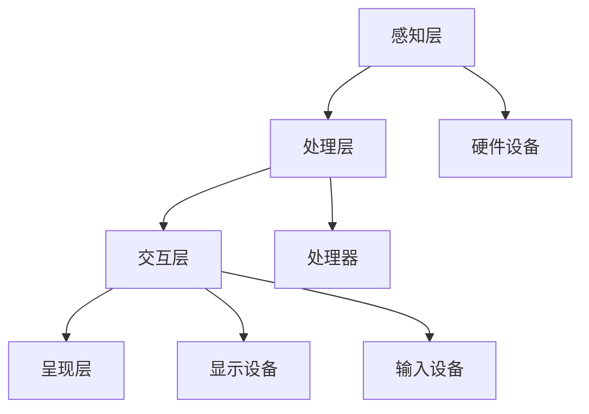

                 

### # 增强现实在工业设计可视化中的应用

关键词：增强现实，工业设计，可视化，技术，应用，挑战，未来

摘要：随着科技的不断进步，增强现实（AR）技术逐渐渗透到各个行业，尤其是在工业设计领域，其应用前景广阔。本文旨在探讨增强现实技术在工业设计可视化中的应用，分析其核心概念、技术原理、应用场景以及未来发展方向。通过深入研究和详细讲解，为工业设计师和科技从业者提供有益的参考和启示。

## **一、引言**

随着全球化竞争的加剧，工业设计在产品创新和市场竞争中的作用日益凸显。传统的工业设计方法往往依赖于二维图纸和三维模型，这限制了设计师与客户之间的沟通，也影响了设计效率和产品质量。在此背景下，增强现实（Augmented Reality，简称AR）技术应运而生，成为工业设计领域的重要创新工具。

### **1.1 背景与概述**

增强现实技术是一种通过计算机生成的虚拟信息，叠加在真实环境中的技术。它能够将虚拟的三维模型、文字、图像等信息与真实环境相结合，提供更加直观、生动的用户体验。近年来，随着硬件技术的进步和算法的优化，AR技术在工业设计中的应用得到了快速发展。

### **1.2 增强现实在工业设计中的角色**

增强现实在工业设计中的应用主要体现在以下几个方面：

- **设计沟通**：通过AR技术，设计师可以更加直观地向客户展示设计理念，提高沟通效率和客户满意度。

- **设计迭代**：AR技术能够快速展示设计修改，帮助设计师及时调整设计方向，减少返工成本。

- **产品评估与测试**：AR技术可以模拟产品的实际运行状态，帮助设计师评估产品性能和安全性，降低产品开发风险。

### **1.3 挑战与机遇**

尽管AR技术在工业设计中有广阔的应用前景，但同时也面临着一些挑战：

- **技术限制**：当前AR技术仍存在一定的技术瓶颈，如传感器精度、计算能力、图像处理速度等。

- **成本问题**：AR设备的成本较高，限制了其在中小型企业的应用。

- **用户体验**：如何设计出更加自然、直观的AR交互体验，是设计师和技术开发者需要解决的重要问题。

然而，随着技术的不断进步和成本的逐渐降低，AR技术在工业设计领域的应用将会越来越广泛。

### **1.4 核心概念与联系**

本文将详细探讨增强现实技术在工业设计中的应用，包括核心概念、技术原理、应用场景和未来发展趋势。通过分析这些内容，旨在为工业设计师和技术从业者提供有价值的参考，推动AR技术在工业设计领域的深入应用。

## **二、增强现实技术概述**

在深入探讨增强现实在工业设计中的应用之前，有必要先了解一些增强现实技术的核心概念和基本原理。以下是对增强现实技术的基本概述。

### **2.1 定义与基本原理**

增强现实（Augmented Reality，简称AR）是一种将虚拟信息与现实世界相结合的技术。它通过计算机生成的图像、文字、视频等虚拟信息，叠加在真实环境中，使用户能够实时看到并与之互动。与虚拟现实（Virtual Reality，简称VR）不同，AR并不完全取代现实环境，而是在现实环境中增强信息。

增强现实技术的基本原理可以概括为以下几个步骤：

1. **感知与定位**：通过摄像头、传感器等设备捕捉现实环境，并确定用户的位置和姿态。

2. **图像处理与识别**：对捕捉到的图像进行处理和识别，提取出关键特征，如边缘、纹理、颜色等。

3. **虚拟信息生成**：根据识别出的关键特征，生成相应的虚拟信息，如三维模型、文字、图像等。

4. **叠加与显示**：将生成的虚拟信息叠加到现实环境中，并通过显示器、眼镜等设备呈现给用户。

### **2.2 关键技术**

增强现实技术的实现涉及多个关键技术的综合运用，主要包括以下几个方面：

- **计算机视觉**：计算机视觉技术是AR技术的基础，用于捕捉和识别现实环境中的图像和特征。

- **图像处理**：图像处理技术用于对捕捉到的图像进行增强、去噪、分割等操作，以提高识别精度。

- **定位与跟踪**：定位与跟踪技术用于确定用户的位置和姿态，是实现AR的关键。

- **渲染与显示**：渲染技术用于生成虚拟信息，并确保其与现实环境完美融合。显示技术则用于将虚拟信息呈现给用户。

- **用户交互**：用户交互技术用于设计自然、直观的交互方式，使用户能够方便地与虚拟信息互动。

### **2.3 类型与应用**

增强现实技术根据应用场景和目标用户的不同，可以分为多种类型，主要包括以下几种：

- **移动增强现实**：通过智能手机或平板电脑等移动设备实现的AR应用，如AR游戏、导航、购物等。

- **头戴式增强现实**：通过头戴式显示器（如微软HoloLens、谷歌Glass等）实现的AR应用，如工业设计、医疗诊断、教育培训等。

- **投影增强现实**：通过投影设备将虚拟信息投射到现实环境中的AR应用，如广告、展览、舞台表演等。

### **2.4 增强现实与工业设计的联系**

增强现实技术在工业设计中的应用主要体现在以下几个方面：

- **设计可视化**：通过AR技术，设计师可以将虚拟模型叠加到真实环境中，实现更加直观的可视化效果。

- **设计沟通**：AR技术可以帮助设计师与客户进行更加生动的沟通，提高设计方案的接受度和满意度。

- **设计迭代**：AR技术可以快速展示设计修改，帮助设计师快速迭代，减少设计成本和时间。

- **产品评估与测试**：通过AR技术，设计师可以模拟产品的实际运行状态，评估产品的性能和安全性。

- **培训与教育**：AR技术可以用于工业设计的培训和教育，帮助设计师和工程师掌握新的设计工具和技能。

### **2.5 增强现实在工业设计中的核心概念与联系**

为了更好地理解增强现实在工业设计中的应用，我们可以通过以下核心概念和联系进行阐述：

- **虚拟与现实的融合**：增强现实技术实现了虚拟信息与现实环境的融合，为工业设计提供了全新的视角。

- **交互与反馈**：AR技术提供了直观的交互方式，使用户能够实时与虚拟信息互动，获取反馈，从而提高设计效率。

- **可扩展性与灵活性**：增强现实技术具有可扩展性和灵活性，可以根据不同的设计需求和场景进行灵活应用。

- **可视化与抽象**：增强现实技术将复杂的工业设计信息以直观、可视化的形式呈现，帮助设计师更好地理解和分析设计问题。

通过以上对增强现实技术核心概念和联系的分析，我们可以看到，增强现实技术在工业设计中的应用前景广阔，具有巨大的潜力和价值。

### **2.6 总结**

综上所述，增强现实技术作为一种新兴技术，已经在工业设计领域展现出强大的应用潜力。通过理解增强现实技术的定义、基本原理、关键技术和类型，我们可以更好地把握其在工业设计中的核心概念和联系，为未来的研究与应用奠定基础。

## **三、增强现实技术在工业设计中的应用场景**

增强现实技术在工业设计中的应用场景丰富多样，下面将详细探讨几个典型的应用场景，展示其在设计可视化、设计沟通、设计迭代、产品评估与测试等方面的实际案例。

### **3.1 设计可视化**

设计可视化是增强现实技术在工业设计中最直接的应用场景之一。通过AR技术，设计师可以将虚拟模型叠加到真实环境中，实现更加直观和真实的设计效果。

**案例1：汽车设计**

在汽车设计领域，增强现实技术被广泛应用于概念车的设计和展示。设计师可以利用AR设备，在真实环境中展示汽车的三维模型，并通过调整参数实时预览设计效果。这种方式不仅提高了设计的可视性，还能帮助设计师快速发现设计问题并进行调整。

**案例2：建筑设计**

在建筑设计中，增强现实技术同样具有重要作用。设计师可以使用AR设备，在建筑施工现场展示建筑的三维模型，帮助工程师和施工人员更好地理解设计意图和施工细节。这种方式不仅提高了施工效率，还能确保施工质量。

### **3.2 设计沟通**

设计沟通是工业设计中至关重要的一环，增强现实技术为设计师与客户之间的沟通提供了更加生动、直观的方式。

**案例1：产品设计会议**

在产品设计的早期阶段，设计师需要与客户进行多次会议，讨论设计方案。通过AR技术，设计师可以在会议中实时展示产品模型，并通过调整参数和交互，与客户进行互动。这种方式不仅提高了沟通效率，还能增强客户的参与感和满意度。

**案例2：远程设计协作**

随着全球化趋势的加剧，设计师和客户可能位于不同的地点。通过AR技术，设计师可以实现远程设计协作，实时展示产品模型，讨论设计细节。这种方式不仅克服了地理限制，还提高了设计团队的合作效率。

### **3.3 设计迭代**

设计迭代是工业设计过程中不可或缺的一环，增强现实技术可以大大加速设计迭代的速度。

**案例1：迭代设计演示**

在产品设计过程中，设计师需要对多个设计方案进行迭代。通过AR技术，设计师可以在短时间内快速生成虚拟模型，并在真实环境中展示和评估设计方案。这种方式不仅提高了迭代速度，还能确保设计方案的可行性和实用性。

**案例2：虚拟原型测试**

在产品开发的早期阶段，设计师需要测试多个设计方案的可行性和性能。通过AR技术，设计师可以在虚拟环境中创建原型，并通过调整参数和交互，模拟实际使用场景。这种方式不仅节省了时间和成本，还能提高测试的准确性和效率。

### **3.4 产品评估与测试**

产品评估与测试是确保产品质量和性能的重要环节，增强现实技术为这一过程提供了新的解决方案。

**案例1：产品性能评估**

在产品性能评估过程中，设计师需要模拟产品的实际运行状态，以评估其性能和安全性。通过AR技术，设计师可以在虚拟环境中创建产品模型，并通过调整参数和交互，模拟实际使用场景。这种方式不仅能够快速评估产品性能，还能发现潜在的问题和优化设计。

**案例2：安全测试**

在产品安全测试中，设计师需要确保产品在各种使用条件下的安全性。通过AR技术，设计师可以在虚拟环境中模拟各种使用场景，测试产品的安全性能。这种方式不仅提高了测试效率，还能确保测试的全面性和准确性。

### **3.5 总结**

增强现实技术在工业设计中的应用场景丰富多样，不仅提高了设计可视化和设计沟通的效果，还加速了设计迭代和产品评估与测试的过程。通过具体的实际案例，我们可以看到增强现实技术在工业设计中的重要性和潜力。随着技术的不断进步，增强现实技术在工业设计中的应用将会越来越广泛，为设计师和工程师提供更加高效、便捷的设计工具和解决方案。

## **四、增强现实技术的系统架构设计**

为了深入理解增强现实技术在工业设计中的应用，我们需要对其系统架构进行详细分析。系统架构设计是确保增强现实技术有效运行的关键，它涵盖了硬件、软件、用户交互等多个方面。以下是对增强现实技术系统架构的介绍。

### **4.1 系统架构概述**

增强现实技术的系统架构可以分为四个主要层次：感知层、处理层、交互层和呈现层。

- **感知层**：感知层主要负责捕捉和感知真实环境中的信息。这包括摄像头、传感器、GPS等硬件设备，用于获取图像、位置和姿态等数据。

- **处理层**：处理层负责对感知层获取的数据进行处理和分析。这包括图像处理、计算机视觉、定位和跟踪等算法，用于提取关键特征、识别物体和确定用户位置。

- **交互层**：交互层负责用户与增强现实系统的交互。这包括用户界面设计、手势识别、语音识别等交互方式，使用户能够方便地与虚拟信息进行互动。

- **呈现层**：呈现层负责将处理后的虚拟信息叠加到真实环境中，并通过显示器、眼镜等设备呈现给用户。这包括渲染技术、显示技术等，确保虚拟信息与现实环境完美融合。

### **4.2 硬件架构**

增强现实技术的硬件架构主要包括以下几部分：

- **摄像头**：摄像头是感知层的重要组成部分，用于捕捉真实环境中的图像。不同类型的摄像头具有不同的分辨率和功能，适用于不同的应用场景。

- **传感器**：传感器用于获取用户的位置和姿态信息。常见的传感器包括加速度计、陀螺仪、磁力计等，它们可以组合使用，提供更准确的定位和跟踪信息。

- **处理器**：处理器是处理层的核心，负责处理和分析感知层获取的数据。高性能的处理器可以快速处理大量数据，提高系统的响应速度。

- **显示设备**：显示设备用于呈现虚拟信息，包括显示器、眼镜、头戴式显示器等。不同类型的显示设备具有不同的显示效果和舒适度，适用于不同的使用场景。

- **输入设备**：输入设备用于用户与增强现实系统的交互，包括键盘、鼠标、手势识别装置等。输入设备的设计直接影响用户的操作体验。

### **4.3 软件架构**

增强现实技术的软件架构主要包括以下几部分：

- **操作系统**：操作系统负责管理和调度硬件资源，提供稳定的运行环境。常见的操作系统包括Android、iOS和Windows等。

- **应用层**：应用层包括各种增强现实应用，如设计工具、导航系统、游戏等。应用层负责实现特定的功能，与用户进行交互。

- **中间件**：中间件负责连接硬件和应用程序，提供通用的功能接口。中间件可以简化开发过程，提高开发效率。

- **算法库**：算法库包括图像处理、计算机视觉、定位和跟踪等算法，用于处理和分析感知层获取的数据。

- **API接口**：API接口用于应用程序与硬件和中间件之间的通信，实现功能调用和数据交换。

### **4.4 用户交互设计**

用户交互设计是增强现实系统架构的重要组成部分，它直接影响用户的操作体验。以下是一些关键的用户交互设计原则：

- **直观性**：用户界面应简单直观，使用户能够快速理解和使用系统功能。

- **可访问性**：系统应支持多种交互方式，如手势、语音、触摸等，确保不同用户群体都能够方便地使用。

- **响应速度**：系统应具有快速响应能力，减少用户的等待时间，提高操作效率。

- **反馈机制**：系统应提供明确的反馈信息，帮助用户了解当前状态和操作结果。

- **定制化**：系统应支持用户自定义界面和功能，满足不同用户的需求。

### **4.5 系统架构图**

以下是一个简化的增强现实系统架构图，展示了各部分之间的关系：

通过以上对增强现实技术系统架构的介绍，我们可以看到，增强现实技术涉及多个层次和组件的协同工作。了解系统架构有助于我们更好地理解和应用增强现实技术，为工业设计提供更加高效、便捷的解决方案。

### **4.6 总结**

增强现实技术的系统架构设计是确保其有效运行的关键。通过分析系统架构的各个层次和组件，我们可以更好地理解增强现实技术的原理和应用。了解系统架构有助于我们在设计和开发增强现实应用时，做出更科学、合理的决策，提高系统的性能和用户体验。

## **五、增强现实在工业设计中的实际案例**

为了更好地展示增强现实（AR）技术在工业设计中的应用效果，我们通过几个实际案例来详细分析其在设计过程中如何提升效率和质量。

### **5.1 汽车设计案例**

#### **案例背景**

某汽车公司在开发一款新型SUV车型时，希望能够利用增强现实技术进行设计可视化，以便快速迭代和评估设计方案。设计师们需要将虚拟的车型模型与现实环境相结合，以便更好地展示设计细节和整体效果。

#### **应用过程**

1. **数据采集**：设计师首先利用3D建模软件创建出车型的虚拟模型，并导出相关的3D数据。

2. **AR应用开发**：开发团队利用增强现实软件开发工具（如Unity、ARKit等），将3D模型与增强现实技术结合，开发出AR应用程序。

3. **现场测试**：设计师将开发完成的AR应用程序安装到AR头戴设备上，如微软HoloLens，然后在实际环境中进行测试。

4. **设计迭代**：通过AR技术，设计师能够在真实环境中实时预览和调整车型设计。例如，他们可以调整车身线条、车窗形状、车轮尺寸等，并通过增强现实界面实时看到效果。

5. **客户反馈**：设计师邀请客户参与测试，通过AR展示车型，收集客户的反馈和建议。客户能够直观地看到设计的细节和整体效果，提出具体的修改意见。

#### **效果分析**

通过增强现实技术的应用，设计师们能够更加高效地进行设计迭代和评估。传统的纸质图纸或三维模型展示方式往往不够直观，而AR技术使得设计师和客户能够实时互动，提高设计沟通的效率。此外，AR技术还能够减少设计过程中的错误和返工，提高设计质量。

### **5.2 电子产品设计案例**

#### **案例背景**

某电子产品公司正在开发一款智能手表，希望利用增强现实技术进行产品设计可视化。设计师需要在设计初期展示产品的外观和功能，以便进行市场调研和用户反馈。

#### **应用过程**

1. **3D建模**：设计师使用3D建模软件创建智能手表的虚拟模型，包括外观、内部结构和功能模块。

2. **AR应用程序开发**：开发团队利用增强现实技术开发应用程序，将3D模型与用户界面（UI）相结合，实现交互式展示。

3. **用户体验测试**：设计师在办公室或展示厅中设置AR展示区域，使用AR设备（如智能手机或平板电脑）展示智能手表的虚拟模型。

4. **用户互动**：参观者通过扫描展示区域的二维码或使用AR应用程序，可以直观地看到智能手表的虚拟模型，并与之互动，如旋转、放大、触摸等。

5. **市场调研**：设计师收集用户在互动过程中的反馈，了解用户对产品设计的需求和偏好。

#### **效果分析**

增强现实技术的应用使得电子产品公司在设计初期就能够展示产品的虚拟模型，提高市场调研的效率和准确性。用户能够通过AR技术直观地了解产品外观和功能，提供宝贵的反馈，帮助设计师更好地满足市场需求。此外，AR技术还能够减少物理原型制作成本，加快产品开发进度。

### **5.3 建筑设计案例**

#### **案例背景**

某建筑设计公司负责设计一个大型商业综合体，需要在设计过程中展示建筑的整体效果和细节。设计师希望能够利用增强现实技术进行设计展示和评估。

#### **应用过程**

1. **3D建模**：设计师使用3D建模软件创建建筑的综合体模型，包括建筑结构、室内布局、景观设计等。

2. **AR应用程序开发**：开发团队利用增强现实技术开发应用程序，将3D模型与增强现实技术结合，实现全方位展示。

3. **现场展示**：设计师在施工现场或展示厅设置AR展示区域，使用AR设备展示建筑模型的虚拟效果。

4. **设计评估**：设计师和客户通过AR技术实时查看建筑模型，评估设计效果，并提出修改意见。

5. **协同设计**：利用AR技术，设计师和客户能够实时互动，共同讨论和调整设计细节。

#### **效果分析**

增强现实技术的应用大大提高了建筑设计过程中的展示和评估效率。设计师和客户能够通过AR技术直观地查看建筑模型，发现设计问题并及时调整，减少后期修改和返工的成本。此外，AR技术还能够提高设计沟通的效果，确保各方意见一致，提高设计质量。

### **5.4 总结**

通过以上实际案例的分析，我们可以看到增强现实技术在工业设计中的应用不仅提升了设计效率，还提高了设计质量。设计师和客户能够通过AR技术实时互动，直观地查看设计效果，发现并解决问题。随着技术的不断进步，增强现实技术将在工业设计领域发挥越来越重要的作用，为设计师提供更加高效、便捷的设计工具。

## **六、增强现实技术在工业设计中的挑战与未来趋势**

尽管增强现实（AR）技术在工业设计中的应用取得了显著成果，但其在实际应用过程中仍面临诸多挑战。本文将分析这些挑战，并探讨未来的发展趋势。

### **6.1 技术挑战**

1. **硬件限制**：当前AR设备的性能和可靠性仍有待提升。例如，摄像头的分辨率、传感器精度和计算能力等限制了AR技术的应用范围。

2. **数据处理速度**：增强现实技术需要实时处理大量的图像和数据，对计算能力提出了高要求。目前，硬件设备在数据处理速度上还存在一定的瓶颈。

3. **用户体验**：如何设计出自然、直观的AR交互体验是当前面临的重大挑战。用户体验的优化需要考虑多种因素，如界面设计、交互方式、反馈机制等。

### **6.2 成本问题**

AR设备的价格较高，限制了其在中小型企业的应用。降低AR设备成本，提高性价比，是未来需要解决的重要问题。

### **6.3 安全性与隐私**

随着AR技术在工业设计中的应用，数据安全和隐私问题逐渐凸显。如何在保证功能实现的同时，确保用户数据的安全和隐私，是AR技术发展的重要挑战。

### **6.4 标准化与兼容性**

目前，AR技术的标准化和兼容性尚不完善，不同设备和平台之间的互操作性较差。制定统一的AR技术标准和规范，提高设备的兼容性，是未来发展的关键方向。

### **6.5 未来发展趋势**

1. **硬件性能提升**：随着硬件技术的进步，AR设备的性能将不断提升，传感器精度、计算能力、图像处理速度等将得到显著提高。

2. **用户体验优化**：通过不断优化界面设计、交互方式和反馈机制，提升用户的AR体验，使其更加自然、直观。

3. **成本下降**：随着生产规模的扩大和技术进步，AR设备的成本将逐渐降低，使其在中小型企业中广泛应用。

4. **数据安全和隐私保护**：加强数据安全和隐私保护措施，确保用户数据的安全和隐私。

5. **标准化与兼容性**：制定统一的AR技术标准和规范，提高设备的兼容性，促进不同设备和平台之间的互操作。

6. **垂直行业应用**：增强现实技术在工业设计、医疗、教育、娱乐等垂直行业的应用将不断扩展，为各行业提供更加高效、便捷的解决方案。

### **6.6 总结**

增强现实技术在工业设计中的应用具有广阔的前景，但同时也面临诸多挑战。通过不断优化技术、降低成本、保护数据安全和隐私、提高标准化和兼容性，AR技术将在未来发挥越来越重要的作用，为工业设计带来更多的创新和变革。

## **七、最佳实践与注意事项**

在增强现实（AR）技术在工业设计中的实际应用过程中，为了确保项目的成功和最佳效果，以下是一些最佳实践和注意事项：

### **7.1 最佳实践**

1. **需求分析**：在项目开始之前，进行详细的需求分析，明确设计目标、用户需求和预期效果。这将有助于制定合理的项目计划和资源配置。

2. **技术选型**：根据项目需求和现有技术条件，选择适合的AR开发平台和工具。例如，Unity、ARKit等都是流行的AR开发平台。

3. **用户测试**：在设计过程中，定期进行用户测试，收集用户反馈，及时调整和优化设计方案。这有助于提高用户体验和满意度。

4. **资源整合**：整合项目中的各种资源和团队，确保项目各环节的协调和高效运作。例如，设计师、开发者、测试人员等应紧密合作，共同推进项目进展。

5. **持续迭代**：持续迭代和优化设计，不断改进AR应用的功能和性能。通过用户反馈和数据分析，找到优化方向，逐步提升项目的质量。

### **7.2 注意事项**

1. **隐私保护**：在应用AR技术时，务必注意用户数据的隐私保护，遵循相关法律法规和标准，确保用户数据的安全和隐私。

2. **性能优化**：优化AR应用的性能，确保其在不同设备和环境下都能正常运行。特别是在低性能设备上，要尽量减少资源消耗，提高响应速度。

3. **交互设计**：设计自然、直观的AR交互方式，使用户能够轻松、愉快地与虚拟信息进行互动。避免复杂的操作流程，提高用户体验。

4. **跨平台兼容性**：确保AR应用在不同操作系统、设备和浏览器上的兼容性，避免因兼容性问题导致用户使用体验不佳。

5. **安全性与稳定性**：增强AR应用的安全性和稳定性，防止潜在的安全漏洞和系统崩溃。定期进行安全测试和漏洞扫描，确保应用的安全可靠。

6. **持续更新**：随着技术的不断进步，持续更新和升级AR应用，以适应新的技术发展和市场需求。

### **7.3 总结**

通过遵循最佳实践和注意事项，可以有效提高增强现实技术在工业设计中的应用效果，确保项目的成功实施和最佳用户体验。持续优化和改进，将有助于推动AR技术在工业设计领域的深入应用和发展。

## **八、结论**

本文详细探讨了增强现实（AR）技术在工业设计中的应用，包括其核心概念、技术原理、应用场景、系统架构设计以及实际案例。通过分析，我们可以看到AR技术在设计可视化、设计沟通、设计迭代、产品评估与测试等方面具有显著优势。尽管AR技术在工业设计中的应用仍面临一些挑战，但随着技术的不断进步和成本的降低，其前景将十分广阔。未来，增强现实技术有望在工业设计领域发挥更大的作用，为设计师提供更加高效、便捷的设计工具和解决方案。希望本文能够为工业设计师和技术从业者提供有益的参考和启示，共同推动AR技术在工业设计领域的深入应用和发展。

## **九、作者信息**

作者：AI天才研究院/AI Genius Institute & 禅与计算机程序设计艺术 /Zen And The Art of Computer Programming

感谢您的阅读，期待与您在未来的技术交流中再次相遇！

