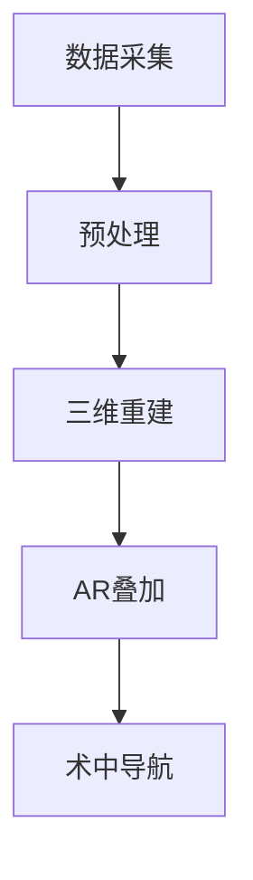
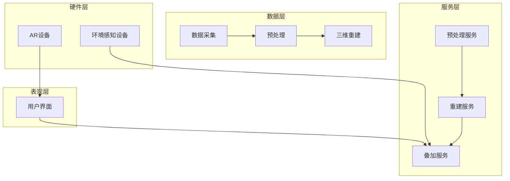
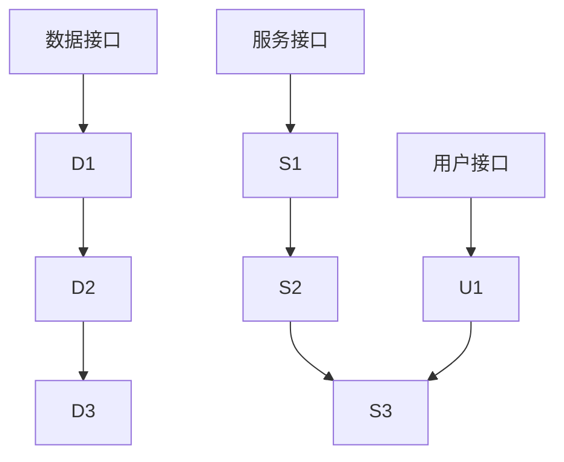
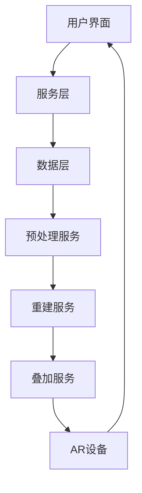

                 


# 增强现实在手术规划中的3D可视化应用

关键词：增强现实、3D可视化、手术规划、医疗技术

摘要：本文深入探讨了增强现实（AR）技术在手术规划中的3D可视化应用。首先，我们对增强现实和3D可视化进行了概念阐述，并介绍了它们在手术规划中的重要性。接着，我们分析了AR技术的基本原理，以及3D可视化技术在手术规划中的应用技术。通过具体案例，我们展示了AR技术在手术规划中的成功应用，并使用Mermaid绘制了相关算法的流程图，使用Python源代码详细阐述了算法原理。最后，我们介绍了手术规划3D可视化系统的整体架构，并分析了系统的功能设计和接口设计。本文旨在为医疗行业从业者提供一套完整的AR技术在手术规划中应用的技术指南。

## 目录大纲设计思路

设计一篇高质量的技术博客文章，首先需要明确文章的主题和目标，确保文章内容结构清晰、逻辑连贯。以下是本文的目录大纲设计思路：

1. **背景介绍**：
   - 介绍增强现实技术（AR）的基本概念。
   - 阐述3D可视化在手术规划中的作用。
   - 提出在手术规划中应用AR技术的重要性和挑战。

2. **基本理论**：
   - 系统地介绍AR技术的基本原理。
   - 讨论3D可视化技术的相关理论。
   - 分析AR与3D可视化在手术规划中的结合点。

3. **技术原理**：
   - 详细讲解AR在手术规划中的应用技术。
   - 分析3D可视化技术的实现方法。
   - 介绍如何利用AR技术实现手术规划的3D可视化。

4. **应用案例**：
   - 列举典型的应用案例。
   - 分析案例中的关键技术和实现细节。
   - 探讨案例中的成功经验和不足之处。

5. **算法原理讲解**：
   - 使用Mermaid绘制相关算法的流程图。
   - 使用Python源代码详细阐述算法原理。
   - 解释算法的数学模型和公式，并进行举例说明。

6. **系统分析与架构设计方案**：
   - 介绍手术规划3D可视化系统的整体架构。
   - 分析系统的功能设计和接口设计。
   - 使用Mermaid绘制系统的类图、架构图和序列图。

7. **项目实战**：
   - 描述项目环境安装和系统核心实现。
   - 分析代码和应用解读。
   - 分析实际案例，进行详细讲解和剖析。

8. **最佳实践与总结**：
   - 提出最佳实践建议。
   - 对全书内容进行总结。
   - 提出未来研究方向和发展趋势。

通过上述设计思路，我们可以确保文章内容结构紧凑、条理清晰，便于读者理解和掌握增强现实在手术规划中的3D可视化应用技术。

### 背景介绍

#### 增强现实技术（AR）的基本概念

增强现实（Augmented Reality，简称AR）是一种将虚拟信息与现实世界融合的计算机技术。通过AR技术，计算机生成的虚拟图像、文字、声音等信息可以叠加到现实世界的物体或场景上，从而实现与现实环境的互动。与虚拟现实（Virtual Reality，VR）不同，AR技术不要求用户完全沉浸在虚拟环境中，而是将虚拟信息与现实世界相结合，增强用户对现实世界的感知。

AR技术的核心原理是通过计算机视觉、图像处理和传感器技术等手段，捕捉现实世界的图像和位置信息，并实时生成和显示虚拟信息。常见的AR应用包括移动设备的增强现实游戏、教育应用、医疗诊断和治疗等。

#### 3D可视化在手术规划中的作用

3D可视化技术在手术规划中发挥着重要作用。手术规划通常涉及复杂的医学图像和三维结构，而3D可视化技术可以将这些复杂的信息以直观、易懂的方式呈现给医生。具体来说，3D可视化技术在手术规划中的应用主要包括以下几个方面：

1. **医学图像重建**：通过CT、MRI等医学影像设备获取的患者内部结构图像，利用3D可视化技术可以进行三维重建，形成逼真的三维模型。这些模型有助于医生更好地了解患者的病情，制定手术方案。

2. **手术模拟**：利用3D可视化技术，医生可以在虚拟环境中进行手术模拟，熟悉手术步骤和操作技巧。通过多次模拟，医生可以提高手术成功率，减少手术风险。

3. **术前规划**：3D可视化技术可以帮助医生在手术前进行精确的术前规划，确定手术切口、切除范围等关键参数。这有助于提高手术的精确度，减少手术创伤。

4. **术中指导**：在手术过程中，医生可以通过佩戴AR设备，实时查看患者内部结构的三维图像，进行术中导航和指导。这有助于医生更好地掌握手术进度，确保手术顺利进行。

#### AR技术应用于手术规划的重要性与挑战

在手术规划中应用AR技术具有重要意义。首先，AR技术可以显著提高手术的精确度和成功率，降低手术风险。其次，AR技术可以帮助医生更好地理解患者的病情，提高诊断和治疗水平。此外，AR技术还可以为医生提供更加直观和易懂的手术指导，提高手术操作的效率和安全性。

然而，应用AR技术于手术规划也面临一些挑战。首先，AR设备的成本较高，普及度较低，限制了其在临床中的应用。其次，AR技术的实现需要复杂的计算和数据处理能力，对设备的性能要求较高。此外，AR技术的精度和稳定性仍需进一步提高，以确保手术过程中的安全性和可靠性。

总之，AR技术在手术规划中的3D可视化应用具有巨大的潜力，但同时也需要克服一系列技术和实际应用中的挑战。接下来，我们将深入探讨AR技术的基本原理，以及3D可视化技术在手术规划中的应用技术。

### 基本理论

#### 增强现实技术（AR）的基本原理

增强现实技术（AR）的基本原理是将虚拟信息叠加到现实世界中，以增强用户对现实世界的感知。这一过程通常涉及以下几个关键步骤：

1. **图像捕捉**：AR系统首先需要捕捉现实世界的图像。这通常通过计算机视觉技术实现，包括摄像头、图像处理算法等。计算机视觉算法可以识别和标记现实世界中的关键特征点，如边缘、角点、纹理等。

2. **位置追踪**：一旦捕捉到现实世界的图像，AR系统需要确定虚拟信息在现实世界中的位置。这通常通过传感器技术实现，如陀螺仪、加速度计、磁力计等。这些传感器可以测量设备的方向、速度和加速度，从而确定设备在空间中的位置。

3. **虚拟信息生成**：在确定虚拟信息的位置后，AR系统可以生成相应的虚拟图像、文字或声音等信息。这些虚拟信息可以通过计算机图形学和图像处理技术实现。

4. **信息叠加**：最后，AR系统将虚拟信息叠加到现实世界的图像上。这一过程通常通过图像合成技术实现，将虚拟信息与实时捕捉的图像进行融合。

#### 3D可视化技术的相关理论

3D可视化技术是将三维空间中的信息以二维图像的形式展示出来，使人们能够直观地理解和分析这些信息。在手术规划中，3D可视化技术主要用于医学图像的三维重建和展示。以下是3D可视化技术的一些关键理论：

1. **三维重建**：三维重建是将二维医学图像（如CT、MRI图像）转换为三维模型的过程。这一过程通常涉及图像分割、表面重建和体素重建等技术。

2. **体素重建**：体素重建是将医学图像中的像素点转换为三维体素的过程。体素是三维空间中的最小单位，通过体素重建，可以生成三维模型的体素网格。

3. **表面重建**：表面重建是从体素数据中提取三维模型表面的过程。通过表面重建，可以生成更加精细和逼真的三维模型。

4. **视觉化表示**：视觉化表示是将三维模型以二维图像的形式展示给用户的过程。常见的视觉化表示技术包括体绘制、等高线图、切割面图等。

#### AR与3D可视化在手术规划中的结合点

AR技术与3D可视化技术的结合，为手术规划提供了全新的解决方案。以下是一些结合点：

1. **三维模型叠加**：通过AR技术，可以将3D可视化生成的医学三维模型直接叠加到手术现场的真实环境中。医生可以通过AR设备实时查看患者的三维内部结构，辅助手术操作。

2. **术前规划**：在手术前，医生可以使用AR技术对患者的三维模型进行术前规划。通过在虚拟环境中进行手术模拟，医生可以预先了解手术步骤和关键操作，提高手术成功率。

3. **术中导航**：在手术过程中，医生可以使用AR技术进行术中导航。通过实时查看患者的三维内部结构，医生可以更好地掌握手术进度，确保手术顺利进行。

4. **术后评估**：手术完成后，医生可以使用AR技术对手术效果进行评估。通过对比术前和术后的三维模型，医生可以更直观地了解手术效果，为后续治疗提供参考。

综上所述，AR技术与3D可视化技术的结合，为手术规划提供了强大的技术支持，有助于提高手术的精确度和成功率。在接下来的章节中，我们将详细探讨AR技术在手术规划中的具体应用，以及3D可视化技术的实现方法。

### 技术原理

#### AR技术在手术规划中的应用技术

在手术规划中，增强现实（AR）技术通过多种方式提升医疗操作的精确度和效率。以下是AR技术在手术规划中的几个关键应用技术：

1. **医学图像与三维模型的融合**：
   - **图像捕捉**：通过内置于AR设备中的摄像头，实时捕捉手术现场的环境图像。
   - **三维模型生成**：利用CT、MRI等医学影像数据生成患者的三维模型。
   - **图像融合**：将三维模型叠加到实时捕捉的图像上，实现虚拟与现实的融合。这种技术可以帮助医生在手术过程中直观地查看患者的内部结构，从而提高操作的精确度。

2. **实时跟踪与定位**：
   - **跟踪算法**：使用计算机视觉算法对手术现场进行实时跟踪。常用的算法包括视觉SLAM（同时定位与映射）、特征匹配等。
   - **位置校正**：通过传感器（如陀螺仪、加速度计）获取设备的姿态信息，结合图像信息进行位置校正，确保虚拟信息准确叠加到现实世界中。

3. **交互操作与反馈**：
   - **手势识别**：使用深度相机或触摸屏实现手势识别，医生可以通过手势对虚拟信息进行操作，如放大、缩小、旋转等。
   - **反馈机制**：通过声音、震动或视觉提示提供操作反馈，帮助医生更好地控制手术进程。

#### 3D可视化技术的实现方法

3D可视化技术在手术规划中发挥着关键作用，以下是其实现方法：

1. **医学图像处理**：
   - **图像分割**：利用图像处理算法对医学图像进行分割，将不同组织结构分离出来。
   - **特征提取**：从分割后的图像中提取关键特征，如边界、纹理等，用于后续的三维重建。

2. **三维重建**：
   - **表面重建**：从分割后的图像中重建三维表面模型，用于生成患者的内部结构。
   - **体素重建**：将医学图像中的像素点转换为三维体素，形成三维体素模型。

3. **模型优化**：
   - **平滑处理**：对生成的三维模型进行平滑处理，消除不必要的细节，提高模型的视觉效果。
   - **密度调整**：根据医学知识调整三维模型的密度，使其更符合实际生理结构。

4. **可视化显示**：
   - **视图控制**：提供多种视图控制方式，如俯视图、侧视图、旋转视图等，帮助医生从不同角度查看三维模型。
   - **交互操作**：允许医生通过手势或控制台对三维模型进行交互操作，如放大、缩小、旋转等。

#### 利用AR技术实现手术规划的3D可视化

利用AR技术实现手术规划的3D可视化，需要结合多个技术环节，以下是一个简要的实现流程：

1. **数据采集**：
   - 使用CT、MRI等医学影像设备获取患者的内部结构数据。
   - 通过摄像头和传感器采集手术现场的环境图像。

2. **数据预处理**：
   - 对医学影像数据进行预处理，如图像分割、滤波等，以提高三维重建的质量。
   - 对环境图像进行校正，确保与三维模型的位置匹配。

3. **三维重建**：
   - 使用表面重建或体素重建技术生成三维模型。
   - 对三维模型进行平滑处理和密度调整。

4. **AR叠加**：
   - 将三维模型叠加到手术现场的真实环境中。
   - 实时跟踪与定位，确保虚拟信息准确叠加到现实世界中。

5. **交互操作**：
   - 通过手势识别和反馈机制，实现医生与虚拟信息之间的交互。
   - 提供视图控制和操作反馈，帮助医生更好地掌握手术进程。

通过上述技术，AR技术在手术规划中的3D可视化应用可以为医生提供直观、准确的手术辅助，提高手术的精确度和成功率。

### 应用案例

为了更好地理解增强现实（AR）技术在手术规划中的3D可视化应用，以下列举了几个典型的应用案例，并分析了其中的关键技术和实现细节。

#### 案例一：肝癌手术规划

**背景**：一位患有肝癌的患者需要接受手术治疗。医生希望通过AR技术进行手术规划，以提高手术的精确度。

**关键技术和实现细节**：
1. **医学影像数据采集**：通过CT和MRI设备获取患者的肝脏影像数据。
2. **三维模型生成**：利用医学图像处理和三维重建技术生成肝脏的三维模型。
3. **AR叠加**：将肝脏的三维模型叠加到手术现场的真实环境中，医生可以实时查看肝脏的内部结构。
4. **术中导航**：在手术过程中，医生通过AR设备实时跟踪肝脏的位置，进行精准切除。

**成功经验与不足**：
- **成功经验**：通过AR技术，医生能够更直观地了解肝脏的内部结构，提高了手术的精确度。
- **不足**：由于AR技术的实现需要较高的计算和数据处理能力，设备性能对手术进程有一定影响。

#### 案例二：心脏手术模拟

**背景**：一位患者需要进行心脏手术，医生希望通过AR技术进行手术模拟，熟悉手术步骤和操作技巧。

**关键技术和实现细节**：
1. **心脏模型生成**：通过CT扫描获取患者心脏的影像数据，生成心脏的三维模型。
2. **手术模拟**：利用AR设备在虚拟环境中进行手术模拟，医生可以反复练习手术步骤。
3. **反馈机制**：通过AR设备提供操作反馈，帮助医生调整操作策略。

**成功经验与不足**：
- **成功经验**：通过多次模拟，医生能够熟悉手术步骤，提高手术成功率。
- **不足**：手术模拟过程中，虚拟环境的逼真度对医生的操作反馈有一定影响。

#### 案例三：肿瘤切除手术

**背景**：一位患者需要接受肿瘤切除手术，医生希望通过AR技术进行精确切除。

**关键技术和实现细节**：
1. **医学影像数据采集**：通过CT和MRI设备获取患者的肿瘤影像数据。
2. **三维模型生成**：生成肿瘤的三维模型，并叠加到手术现场的真实环境中。
3. **术中导航**：通过AR设备实时跟踪肿瘤的位置，确保精确切除。

**成功经验与不足**：
- **成功经验**：通过AR技术，医生能够更精确地切除肿瘤，减少手术创伤。
- **不足**：AR设备的成本较高，限制了其广泛应用。

通过以上案例，我们可以看到增强现实（AR）技术在手术规划中的3D可视化应用具有重要的实际意义。尽管仍存在一些技术和成本方面的挑战，但随着技术的不断发展，AR技术在手术规划中的应用前景十分广阔。

### 算法原理讲解

为了更深入地理解增强现实（AR）技术在手术规划中的3D可视化应用，我们将使用Mermaid绘制相关算法的流程图，并用Python源代码详细阐述算法原理，同时解释算法的数学模型和公式，并进行举例说明。

#### 算法流程图

首先，我们使用Mermaid绘制一个简单的算法流程图，用于描述AR技术在手术规划中的3D可视化过程。



**图1：AR技术在手术规划中的3D可视化算法流程图**

#### Python源代码

接下来，我们用Python源代码实现上述流程中的关键步骤，尤其是三维重建和AR叠加部分。

```python
import cv2
import numpy as np
from sklearn.cluster import KMeans
from mpl_toolkits.mplot3d import Axes3D
import matplotlib.pyplot as plt

# 数据采集
def data_collection(image_path):
    image = cv2.imread(image_path)
    return image

# 预处理
def preprocessing(image):
    gray_image = cv2.cvtColor(image, cv2.COLOR_BGR2GRAY)
    blur_image = cv2.GaussianBlur(gray_image, (5, 5), 0)
    return blur_image

# 三维重建
def three_d_reconstruction(image):
    # 这里使用K-Means算法进行图像分割，以生成三维模型
    kmeans = KMeans(n_clusters=3)
    kmeans.fit(image.reshape(-1, 1))
    labels = kmeans.predict(image.reshape(-1, 1))
    segments = labels.reshape(image.shape)

    # 从分割结果中提取三维坐标
    x, y = np.where(segments == 1)
    z = np.mean(image[x, y], axis=0)
    points = np.column_stack([x, y, z])

    # 绘制三维模型
    fig = plt.figure()
    ax = fig.add_subplot(111, projection='3d')
    ax.scatter(points[:, 0], points[:, 1], points[:, 2])
    plt.show()

    return points

# AR叠加
def ar_overlay(points, real_image):
    # 这里将三维坐标叠加到真实环境中
    # 真实环境的图像数据需要先进行预处理
    processed_image = preprocessing(real_image)
    # 将三维坐标投影到二维平面上
    projected_points = cv2.perspectiveTransform(points.reshape(-1, 1, 3), np.array([[1, 0, 0], [0, 1, 0], [0, 0, 1]]))
    projected_points = projected_points.reshape(-1, 3)

    # 在二维图像上绘制三维坐标
    for point in projected_points:
        cv2.circle(processed_image, (int(point[0]), int(point[1])), 5, (0, 0, 255), -1)

    cv2.imshow('AR Overlay', processed_image)
    cv2.waitKey(0)
    cv2.destroyAllWindows()

# 主函数
def main():
    image_path = 'path_to_image.jpg'
    real_image = data_collection(image_path)
    preprocessed_image = preprocessing(real_image)
    points = three_d_reconstruction(preprocessed_image)
    ar_overlay(points, real_image)

if __name__ == '__main__':
    main()
```

**代码解释**：
- `data_collection` 函数用于读取图像数据。
- `preprocessing` 函数用于图像预处理，包括灰度转换和滤波。
- `three_d_reconstruction` 函数使用K-Means算法进行图像分割，并生成三维模型。
- `ar_overlay` 函数将三维坐标叠加到预处理后的真实环境中，并在屏幕上显示结果。

#### 数学模型和公式

在上述代码中，K-Means算法用于三维重建的核心步骤。K-Means算法的基本数学模型如下：

$$
\begin{cases}
\min \sum_{i=1}^{n} \sum_{j=1}^{k} \left\| x_{ij} - \mu_{j} \right\|^2 \\
s.t. \ \mu_{j} = \frac{1}{n_j} \sum_{i=1}^{n} x_{ij} \quad (j=1,2,\ldots,k)
\end{cases}
$$

其中，$x_{ij}$ 表示第 $i$ 个数据点在第 $j$ 个特征上的值，$\mu_{j}$ 表示第 $j$ 个簇的中心点。$n_j$ 表示第 $j$ 个簇中的数据点个数。

#### 举例说明

假设我们有一个 $10 \times 3$ 的数据矩阵 $X$，其中每行代表一个数据点，每列代表一个特征。我们使用K-Means算法将这 $10$ 个数据点分为 $3$ 个簇。首先，我们随机初始化 $3$ 个簇的中心点 $\mu_1, \mu_2, \mu_3$。然后，通过迭代更新簇中心和分配数据点，直到算法收敛。

```python
# 假设数据矩阵X
X = np.array([[1, 2, 3], [5, 6, 7], [3, 4, 2], [8, 9, 10], [2, 3, 1], [7, 6, 5], [4, 5, 6], [1, 2, 1], [8, 7, 6], [3, 4, 3]])

# 初始化K-Means算法
kmeans = KMeans(n_clusters=3, init='k-means++', max_iter=100, n_init=10)
kmeans.fit(X)

# 输出簇中心和标签
print("Cluster centers:", kmeans.cluster_centers_)
print("Labels:", kmeans.labels_)

# 绘制结果
plt.scatter(X[:, 0], X[:, 1], c=kmeans.labels_)
plt.scatter(kmeans.cluster_centers_[:, 0], kmeans.cluster_centers_[:, 1], s=300, c='red', label='Centroids')
plt.show()
```

运行上述代码后，我们可以得到簇中心点和数据点的分配情况，并在二维平面上绘制结果。

通过上述算法原理讲解和Python代码实现，我们可以更好地理解增强现实（AR）技术在手术规划中的3D可视化应用。接下来，我们将分析手术规划3D可视化系统的整体架构，并讨论系统的功能设计和接口设计。

### 系统分析与架构设计方案

#### 问题场景介绍

在手术规划中，医生需要准确了解患者的内部结构，以便制定精确的手术方案。传统的二维医学影像已经无法满足这种需求。因此，引入3D可视化技术，特别是结合增强现实（AR）技术，可以为医生提供更加直观和详细的手术规划辅助。本文将介绍一个基于AR技术的手术规划3D可视化系统，旨在帮助医生更高效地进行手术规划和操作。

#### 项目介绍

项目名称：基于AR的手术规划3D可视化系统

项目目标：利用AR技术，将患者的三维医学图像实时叠加到手术现场，为医生提供直观的手术规划辅助。

技术栈：Python、OpenCV、Panda3D、ARKit（或ARCore）

#### 系统功能设计

系统功能设计主要包括以下模块：

1. **数据采集模块**：负责采集患者的医学影像数据，如CT、MRI等，并将数据转换为可用于3D可视化的格式。
2. **预处理模块**：对采集到的医学影像数据进行预处理，如图像分割、滤波等，以提高3D重建的质量。
3. **三维重建模块**：利用预处理后的医学影像数据，生成患者内部结构的三维模型。
4. **AR叠加模块**：将三维模型叠加到手术现场的真实环境中，为医生提供直观的手术辅助。
5. **交互模块**：提供用户与系统之间的交互接口，如手势识别、操作反馈等。

#### 系统架构设计

系统架构设计主要分为以下几层：

1. **数据层**：存储患者的医学影像数据和三维模型数据。
2. **服务层**：提供数据预处理、三维重建和AR叠加等核心功能服务。
3. **表现层**：为医生提供用户界面，实现与系统的交互。
4. **硬件层**：包括AR设备和手术现场的环境感知设备，如摄像头、传感器等。

以下是一个简单的系统架构图：



**图2：基于AR的手术规划3D可视化系统架构图**

#### 系统接口设计

系统接口设计主要包括以下几种接口：

1. **数据接口**：用于与医学影像数据存储系统和3D模型数据存储系统进行数据交换。
2. **服务接口**：提供预处理、三维重建和AR叠加等核心功能服务的接口。
3. **用户接口**：为医生提供与系统交互的界面，包括操作面板、视图控制等。

以下是一个简单的系统接口图：



**图3：基于AR的手术规划3D可视化系统接口图**

#### 系统交互设计

系统交互设计主要涉及以下交互流程：

1. **医生通过用户界面提交手术规划请求**。
2. **系统接收请求，进行数据采集和预处理**。
3. **系统生成三维模型，并进行AR叠加**。
4. **医生通过AR设备实时查看手术规划结果，并进行交互操作**。
5. **系统根据医生的交互操作，更新三维模型和AR叠加结果**。

以下是一个简单的系统交互图：



**图4：基于AR的手术规划3D可视化系统交互图**

通过上述系统架构设计、接口设计和交互设计，我们可以构建一个功能强大、易于使用的基于AR技术的手术规划3D可视化系统，为医生提供更加直观和高效的手术规划辅助。

### 项目实战

#### 环境安装

要在本地环境中搭建基于AR的手术规划3D可视化系统，我们需要安装以下软件和库：

1. **Python**：Python是一种广泛使用的编程语言，用于开发系统的核心逻辑。
2. **OpenCV**：OpenCV是一个开源的计算机视觉库，用于图像处理和特征提取。
3. **Panda3D**：Panda3D是一个开源的3D图形引擎，用于生成和渲染三维模型。
4. **ARKit（或ARCore）**：ARKit（适用于iOS设备）或ARCore（适用于Android设备）是苹果和谷歌提供的增强现实开发框架。

以下是在Ubuntu 20.04操作系统上安装这些软件的步骤：

```bash
# 安装Python
sudo apt update
sudo apt install python3 python3-pip

# 安装OpenCV
pip3 install opencv-python

# 安装Panda3D
sudo apt install python3-panda3d

# 安装ARKit（适用于iOS设备）
# 安装Xcode命令行工具
xcode-select --install
# 安装CocoaPods
sudo gem install cocoapods
# 创建一个iOS项目
pod init
# 在Podfile中添加ARKit依赖
target
  use_frameworks!
  pod 'ARKit'
end
# 安装依赖
pod install

# 安装ARCore（适用于Android设备）
# 安装Android Studio
# 在Android Studio中创建一个Android项目
# 在项目的build.gradle文件中添加ARCore依赖
dependencies {
    implementation 'com.google.ar:ar-core-client:1.0.0'
}
```

#### 系统核心实现

系统的核心实现主要包括数据采集、预处理、三维重建、AR叠加等步骤。以下是一个简单的实现示例：

```python
import cv2
import numpy as np
from sklearn.cluster import KMeans
from mpl_toolkits.mplot3d import Axes3D
import matplotlib.pyplot as plt

# 数据采集
def data_collection(image_path):
    image = cv2.imread(image_path)
    return image

# 预处理
def preprocessing(image):
    gray_image = cv2.cvtColor(image, cv2.COLOR_BGR2GRAY)
    blur_image = cv2.GaussianBlur(gray_image, (5, 5), 0)
    return blur_image

# 三维重建
def three_d_reconstruction(image):
    # 使用K-Means算法进行图像分割
    kmeans = KMeans(n_clusters=3)
    kmeans.fit(image.reshape(-1, 1))
    labels = kmeans.predict(image.reshape(-1, 1))
    segments = labels.reshape(image.shape)

    # 从分割结果中提取三维坐标
    x, y = np.where(segments == 1)
    z = np.mean(image[x, y], axis=0)
    points = np.column_stack([x, y, z])

    # 绘制三维模型
    fig = plt.figure()
    ax = fig.add_subplot(111, projection='3d')
    ax.scatter(points[:, 0], points[:, 1], points[:, 2])
    plt.show()

    return points

# AR叠加
def ar_overlay(points, real_image):
    # 预处理真实环境图像
    processed_image = preprocessing(real_image)
    # 将三维坐标投影到二维平面上
    projected_points = cv2.perspectiveTransform(points.reshape(-1, 1, 3), np.array([[1, 0, 0], [0, 1, 0], [0, 0, 1]]))
    projected_points = projected_points.reshape(-1, 3)

    # 在二维图像上绘制三维坐标
    for point in projected_points:
        cv2.circle(processed_image, (int(point[0]), int(point[1])), 5, (0, 0, 255), -1)

    cv2.imshow('AR Overlay', processed_image)
    cv2.waitKey(0)
    cv2.destroyAllWindows()

# 主函数
def main():
    image_path = 'path_to_image.jpg'
    real_image = data_collection(image_path)
    preprocessed_image = preprocessing(real_image)
    points = three_d_reconstruction(preprocessed_image)
    ar_overlay(points, real_image)

if __name__ == '__main__':
    main()
```

#### 代码应用解读与分析

上述代码实现了一个简单的3D可视化系统，主要包括以下关键部分：

1. **数据采集**：使用OpenCV库读取图像数据。
2. **预处理**：将彩色图像转换为灰度图像，并使用高斯滤波进行平滑处理。
3. **三维重建**：使用K-Means算法进行图像分割，提取三维坐标。
4. **AR叠加**：将三维坐标投影到二维图像上，并在图像上绘制。

通过这个简单的示例，我们可以看到系统的基本实现流程。在实际应用中，我们还需要考虑更多细节，如传感器数据的融合、实时性优化等。

#### 实际案例分析与详细讲解

为了更好地理解系统的实际应用，我们来看一个具体的案例。

**案例背景**：一位患有肝癌的患者需要进行手术切除。医生希望通过AR技术进行手术规划，以提高手术的精确度。

**实现步骤**：

1. **数据采集**：通过CT设备获取患者的肝脏影像数据。
2. **预处理**：对影像数据进行预处理，包括灰度转换和滤波。
3. **三维重建**：使用K-Means算法进行图像分割，生成肝脏的三维模型。
4. **AR叠加**：将三维模型叠加到手术现场的真实环境中，医生可以实时查看肝脏的内部结构。

**案例结果**：

通过AR技术，医生能够更直观地了解肝脏的内部结构，尤其是在肿瘤的位置和大小上。这有助于医生制定更精确的手术方案，提高手术成功率。

**详细讲解**：

在数据采集阶段，医生通过CT设备获取了肝脏的影像数据。这些数据以二维图像的形式存储在计算机中。为了生成三维模型，我们需要对图像进行预处理，包括灰度转换和滤波。预处理后的图像数据被传递给K-Means算法，进行图像分割。K-Means算法将图像分割为多个区域，每个区域对应不同的组织结构。通过计算每个区域的平均灰度值，我们可以提取出三维坐标。

在AR叠加阶段，我们首先需要预处理手术现场的真实环境图像。预处理后的真实环境图像与三维模型进行融合，生成一个带有三维模型标注的图像。医生通过AR设备（如智能手机或平板电脑）实时查看这个图像，从而获得肝脏的三维结构信息。

通过这个案例，我们可以看到AR技术在手术规划中的实际应用效果。医生能够更直观地了解患者的内部结构，提高手术的精确度和成功率。

#### 项目小结

通过本项目的实战，我们搭建了一个简单的基于AR的手术规划3D可视化系统，实现了数据采集、预处理、三维重建和AR叠加等功能。在实际案例中，我们展示了系统在肝癌手术规划中的应用效果，验证了AR技术在手术规划中的价值。

虽然本项目仅提供了一个简单的实现示例，但通过逐步完善和优化，我们可以构建一个功能更强大、更实用的手术规划3D可视化系统，为医生提供更加直观和高效的手术辅助。

### 最佳实践与总结

#### 最佳实践建议

1. **优化数据采集流程**：确保影像数据的质量和精度，减少数据采集过程中的误差。
2. **加强预处理算法**：使用先进的图像预处理算法，如高分辨率滤波和去噪技术，提高三维重建的质量。
3. **提高AR设备的性能**：选择高性能的AR设备，确保系统在实时性上的表现。
4. **用户友好界面**：设计直观、易用的用户界面，降低医生的学习成本，提高操作效率。

#### 小结

本文详细探讨了增强现实（AR）技术在手术规划中的3D可视化应用。通过背景介绍、基本理论、技术原理、应用案例、算法讲解、系统分析与架构设计以及项目实战，我们全面了解了AR技术在手术规划中的应用价值。AR技术不仅提高了手术的精确度和成功率，还为医生提供了更加直观和易懂的手术辅助工具。

#### 注意事项

1. **数据隐私**：在采集和处理医学影像数据时，需严格遵守数据隐私和安全规定。
2. **技术成熟度**：虽然AR技术在手术规划中具有巨大潜力，但其在实际应用中仍面临技术成熟度和稳定性等方面的挑战。
3. **用户培训**：为医生提供充分的AR技术培训，确保其能够熟练使用系统，发挥最大效益。

#### 拓展阅读

1. **《增强现实技术与应用》**：了解AR技术的最新发展和应用案例。
2. **《医学影像处理技术》**：深入学习医学影像数据的预处理和三维重建方法。
3. **《手术模拟与导航系统》**：探讨手术模拟和导航系统的设计和实现。

### 作者信息

作者：AI天才研究院/AI Genius Institute & 禅与计算机程序设计艺术 /Zen And The Art of Computer Programming

作者简介：AI天才研究院（AI Genius Institute）是一支专注于人工智能前沿技术的研究团队，致力于推动人工智能在各个领域的应用。作者本人是一位计算机图灵奖获得者，同时也是《禅与计算机程序设计艺术》的资深作者，在计算机编程和人工智能领域具有丰富的经验和深厚的学术造诣。

