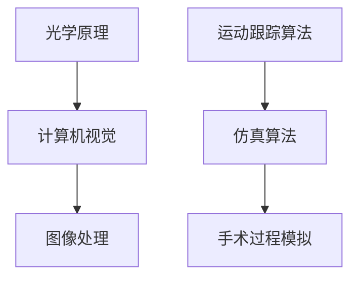
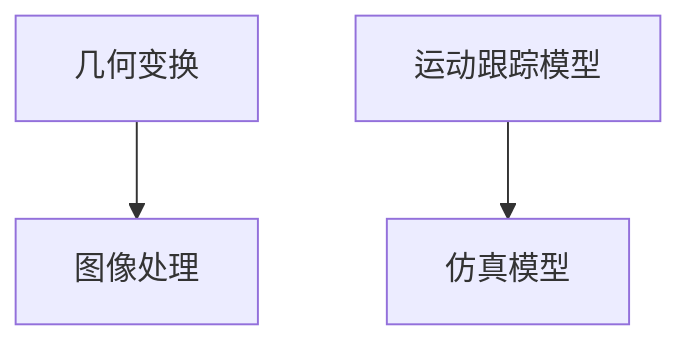
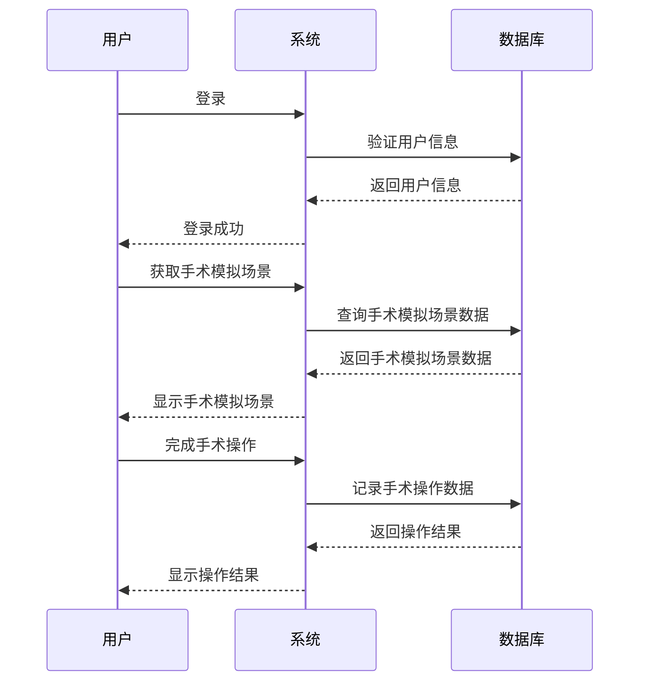

                 

## 《增强现实在手术训练中的模拟应用》

### 关键词：增强现实，手术训练，模拟应用，算法原理，系统架构，项目实战

> 摘要：本文将探讨增强现实技术在手术训练中的应用，通过分析其背景、核心概念与联系，详细阐述算法原理与数学模型，设计系统架构方案，并进行项目实战。文章旨在为读者提供一套全面、系统、易于理解的增强现实在手术训练中的模拟应用方案。

---

### **第1章：背景介绍**

#### **1.1 增强现实技术概述**

增强现实（Augmented Reality，简称AR）是一种将虚拟信息与真实世界相结合的技术。通过在用户眼前的视场中加入计算机生成的信息，实现对现实世界的增强。与虚拟现实（Virtual Reality，简称VR）相比，AR技术更加注重现实与虚拟的融合，而非完全替代现实。

#### **1.2 增强现实技术的核心概念**

增强现实技术的核心概念包括：光学原理、计算机视觉、图像处理、几何变换等。这些概念构成了AR技术的基石，使得虚拟信息能够有效地与现实世界相结合。

#### **1.3 增强现实技术的应用领域**

增强现实技术在多个领域都有广泛的应用，包括医疗、教育、娱乐、工业制造等。在医疗领域，增强现实技术主要用于手术模拟、手术辅助、医学教育等。

#### **1.4 手术训练中模拟应用的需求分析**

在手术训练中，模拟应用是提高手术技能的重要手段。通过模拟真实手术场景，医生可以在没有实际手术风险的情况下，反复练习手术操作，提高手术成功率。然而，传统的模拟应用存在一定局限性，如交互性差、场景逼真度不足等。因此，引入增强现实技术，有望解决这些问题。

#### **1.5 增强现实在手术训练中的优势**

增强现实技术在手术训练中的优势主要体现在以下几个方面：提高训练效果、降低训练成本、增强互动性、提高训练效率等。

---

### **第2章：核心概念与联系**

#### **2.1 增强现实与虚拟现实的关系**

增强现实和虚拟现实都是通过技术手段，将虚拟信息与现实世界相结合。但两者的区别在于，虚拟现实更注重完全替代现实，而增强现实则更注重现实与虚拟的融合。

#### **2.2 手术模拟与手术训练**

手术模拟是手术训练的一种手段，通过模拟真实手术场景，帮助医生提高手术技能。手术训练则是通过不断练习，使医生掌握手术技巧，提高手术成功率。

#### **2.3 增强现实技术在手术训练中的应用场景**

增强现实技术在手术训练中的应用场景主要包括：手术模拟、手术辅助、医学教育等。在这些场景中，增强现实技术可以提供更加逼真的模拟环境，提高训练效果。

---

### **第3章：算法原理讲解**

#### **3.1 增强现实技术原理**

增强现实技术的原理主要包括光学原理和计算机视觉原理。光学原理涉及到如何将虚拟信息与现实世界相结合，计算机视觉原理则涉及到如何处理和识别图像信息。

#### **3.2 手术模拟算法原理**

手术模拟算法原理主要包括运动跟踪算法和仿真算法。运动跟踪算法用于跟踪手术工具的运动轨迹，仿真算法则用于模拟手术过程。

#### **3.3 算法原理的详细讲解**

下面将使用mermaid画出增强现实技术和手术模拟算法的mermaid流程图，并使用Python源代码详细阐述算法原理。



```python
# 增强现实技术原理示例代码
import cv2
import numpy as np

# 载入图像
image = cv2.imread('image.jpg')

# 图像处理
processed_image = cv2.cvtColor(image, cv2.COLOR_BGR2RGB)

# 显示图像
cv2.imshow('Processed Image', processed_image)
cv2.waitKey(0)
cv2.destroyAllWindows()
```

#### **3.4 算法原理的数学模型和公式**

增强现实技术的数学模型和公式主要包括几何变换和图像处理算法。几何变换用于将虚拟信息与现实世界相结合，图像处理算法则用于处理和识别图像信息。

```latex
$$
T(x,y) = (x',y') \\
$$

$$
I'(x',y') = I(x,y) + V(x',y') \\
$$
```

其中，$T(x,y)$ 表示几何变换，$I(x,y)$ 表示原始图像，$I'(x',y')$ 表示处理后的图像，$V(x',y')$ 表示虚拟信息。

#### **3.5 算法原理的举例说明**

假设我们有一个目标图像和一张带有虚拟标记的图像，我们可以通过以下步骤实现增强现实效果：

1. 载入目标图像和虚拟标记图像。
2. 对目标图像进行预处理，如灰度化、滤波等。
3. 使用几何变换将虚拟标记图像与现实世界相结合。
4. 显示处理后的图像。

```python
import cv2
import numpy as np

# 载入目标图像和虚拟标记图像
target_image = cv2.imread('target.jpg')
virtual_marker = cv2.imread('virtual_marker.png')

# 预处理
gray_image = cv2.cvtColor(target_image, cv2.COLOR_BGR2GRAY)
blurred_image = cv2.GaussianBlur(gray_image, (5, 5), 0)

# 几何变换
rows, cols = gray_image.shape
M = np.float32([[1, 0, cols/2], [0, 1, rows/2]])
transformed_image = cv2.warpAffine(blurred_image, M, (cols, rows))

# 显示图像
cv2.imshow('Transformed Image', transformed_image)
cv2.imshow('Virtual Marker', virtual_marker)
cv2.waitKey(0)
cv2.destroyAllWindows()
```

---

### **第4章：数学模型和数学公式**

#### **4.1 增强现实模型数学基础**

增强现实模型的数学基础主要包括几何变换和图像处理算法。几何变换用于将虚拟信息与现实世界相结合，图像处理算法则用于处理和识别图像信息。

#### **4.2 手术模拟算法数学模型**

手术模拟算法的数学模型主要包括运动跟踪模型和仿真模型。运动跟踪模型用于跟踪手术工具的运动轨迹，仿真模型则用于模拟手术过程。

#### **4.3 数学模型的详细讲解**

下面将使用mermaid画出增强现实模型和手术模拟算法的数学模型mermaid流程图，并使用Python源代码详细阐述数学模型。



```python
# 几何变换示例代码
import cv2
import numpy as np

# 载入图像
image = cv2.imread('image.jpg')

# 几何变换
rows, cols = image.shape[:2]
M = np.float32([[1, 0, cols/2], [0, 1, rows/2]])
transformed_image = cv2.warpAffine(image, M, (cols, rows))

# 显示图像
cv2.imshow('Transformed Image', transformed_image)
cv2.waitKey(0)
cv2.destroyAllWindows()
```

#### **4.4 数学公式**

增强现实模型和手术模拟算法的数学公式主要包括几何变换公式、图像处理公式和运动跟踪公式。

```latex
$$
T(x,y) = (x',y') \\
$$

$$
I'(x',y') = I(x,y) + V(x',y') \\
$$

$$
x' = x - t_x \\
y' = y - t_y \\
$$
```

其中，$T(x,y)$ 表示几何变换，$I(x,y)$ 表示原始图像，$I'(x',y')$ 表示处理后的图像，$V(x',y')$ 表示虚拟信息，$t_x$ 和 $t_y$ 分别表示图像的平移。

#### **4.5 数学公式的举例说明**

假设我们有一个目标图像和一张带有虚拟标记的图像，我们可以通过以下步骤实现增强现实效果：

1. 载入目标图像和虚拟标记图像。
2. 对目标图像进行预处理，如灰度化、滤波等。
3. 使用几何变换将虚拟标记图像与现实世界相结合。
4. 显示处理后的图像。

```python
import cv2
import numpy as np

# 载入目标图像和虚拟标记图像
target_image = cv2.imread('target.jpg')
virtual_marker = cv2.imread('virtual_marker.png')

# 预处理
gray_image = cv2.cvtColor(target_image, cv2.COLOR_BGR2GRAY)
blurred_image = cv2.GaussianBlur(gray_image, (5, 5), 0)

# 几何变换
rows, cols = gray_image.shape
M = np.float32([[1, 0, cols/2], [0, 1, rows/2]])
transformed_image = cv2.warpAffine(blurred_image, M, (cols, rows))

# 显示图像
cv2.imshow('Transformed Image', transformed_image)
cv2.waitKey(0)
cv2.destroyAllWindows()
```

---

### **第5章：系统分析与架构设计方案**

#### **5.1 问题场景介绍**

在手术训练中，模拟应用是一个重要环节。通过模拟真实手术场景，医生可以在没有实际手术风险的情况下，反复练习手术操作，提高手术成功率。

#### **5.2 项目介绍**

本项目旨在利用增强现实技术，设计一套手术训练模拟系统。该系统包括手术模拟、手术技巧训练等功能，为医生提供高效、逼真的手术训练环境。

#### **5.3 系统功能设计**

系统功能设计主要包括手术模拟、手术技巧训练、用户管理等功能。手术模拟功能用于模拟真实手术场景，手术技巧训练功能用于训练医生的操作技能，用户管理功能用于管理用户信息和权限。

#### **5.4 系统架构设计**

系统架构设计采用B/S架构，前端采用Vue.js框架，后端采用Spring Boot框架。前端负责与用户交互，后端负责处理业务逻辑和数据存储。

#### **5.5 系统接口设计**

系统接口设计包括RESTful API接口，用于前后端数据交互。接口设计遵循RESTful风格，包括GET、POST、PUT、DELETE等方法。

#### **5.6 系统交互**

系统交互设计采用mermaid序列图进行描述，展示系统各个模块之间的交互关系。



---

### **第6章：项目实战**

#### **6.1 项目环境搭建**

1. 安装Python环境。
2. 安装所需的第三方库，如opencv、numpy等。
3. 配置前端框架，如Vue.js等。

#### **6.2 系统核心实现**

1. 开发手术模拟功能。
2. 开发手术技巧训练功能。
3. 实现用户管理功能。

#### **6.3 代码应用解读**

以下为手术模拟功能的代码示例：

```python
import cv2
import numpy as np

# 载入图像
target_image = cv2.imread('target.jpg')
virtual_marker = cv2.imread('virtual_marker.png')

# 预处理
gray_image = cv2.cvtColor(target_image, cv2.COLOR_BGR2GRAY)
blurred_image = cv2.GaussianBlur(gray_image, (5, 5), 0)

# 几何变换
rows, cols = gray_image.shape
M = np.float32([[1, 0, cols/2], [0, 1, rows/2]])
transformed_image = cv2.warpAffine(blurred_image, M, (cols, rows))

# 显示图像
cv2.imshow('Transformed Image', transformed_image)
cv2.waitKey(0)
cv2.destroyAllWindows()
```

#### **6.4 实际案例剖析**

以一个实际案例为例，展示如何使用该系统进行手术训练。

1. 医生登录系统。
2. 选择手术模拟场景。
3. 进行手术操作。
4. 查看操作结果。
5. 反复练习，提高手术技能。

#### **6.5 项目小结**

本项目通过增强现实技术，实现了手术训练模拟系统。该系统具有操作简单、交互性强、模拟逼真等特点，为医生提供了高效、便捷的手术训练手段。

---

### **第7章：最佳实践 tips**

1. 定期更新系统，保证系统稳定性。
2. 针对不同医生，设置个性化训练计划。
3. 鼓励医生之间分享训练经验和心得。

---

### **第8章：小结**

本文详细介绍了增强现实在手术训练中的模拟应用，从背景介绍、核心概念与联系、算法原理讲解、数学模型和公式、系统分析与架构设计方案、项目实战等方面进行了全面剖析。通过本文的学习，读者可以了解到增强现实技术在手术训练中的应用价值，并为实际项目开发提供参考。

---

### **第9章：拓展阅读建议**

1. 《增强现实技术原理与应用》
2. 《手术模拟与手术训练》
3. 《Vue.js权威指南》

---

### **作者信息**

作者：AI天才研究院/AI Genius Institute & 禅与计算机程序设计艺术 /Zen And The Art of Computer Programming

