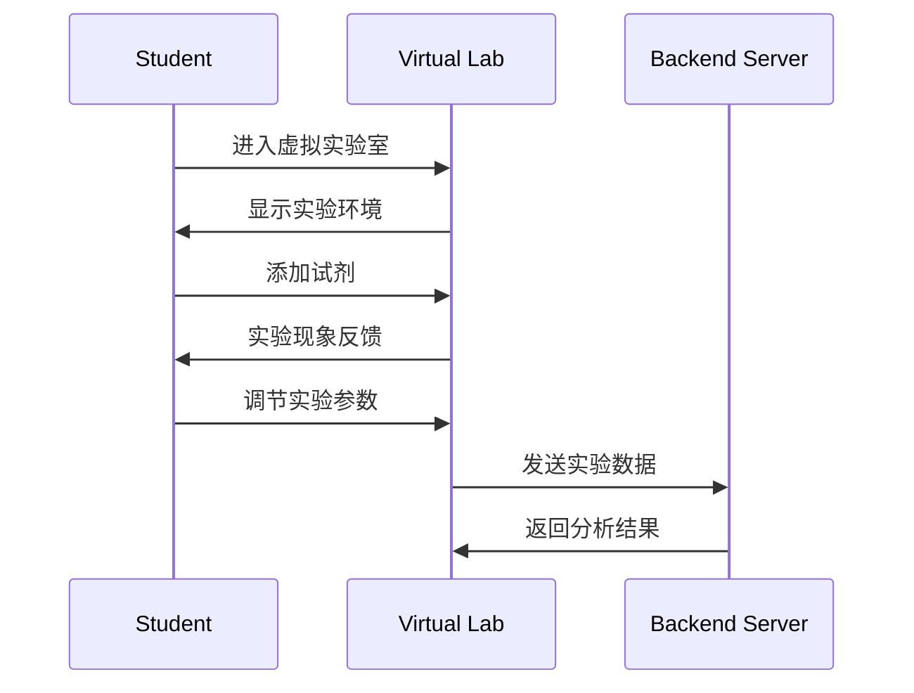

                 

# 增强现实在教育领域的创新：打造沉浸式学习体验

关键词：增强现实（AR），教育，沉浸式学习，技术突破，教学设计

摘要：本文深入探讨了增强现实（AR）技术在教育领域的创新应用，通过分析背景、核心概念与联系，以及算法原理和系统架构设计，展示了如何利用AR技术打造沉浸式学习体验，提升教育效果和学习体验。

## 背景介绍

### 问题背景

随着科技的快速发展，增强现实（Augmented Reality，简称AR）技术已经成为一项备受关注的前沿科技。在教育领域，AR技术被广泛应用于教学、学习和评估等方面，为打造沉浸式学习体验提供了全新的可能性。然而，尽管AR技术已经取得了一定的进展，但在教育领域的应用仍然面临着许多挑战和问题。

### 核心概念与联系

#### 1.2.1 增强现实（AR）的定义与特点

增强现实（Augmented Reality，简称AR）是一种将计算机生成的虚拟信息叠加在现实世界中的技术。与虚拟现实（Virtual Reality，简称VR）不同，AR技术并不完全取代现实世界，而是在现实世界中添加虚拟元素，从而实现与现实环境的互动。AR技术的主要特点包括：

- **虚实融合**：将虚拟信息和现实世界融合在一起，使人们能够在现实环境中看到和互动虚拟元素。
- **实时交互**：AR技术能够实时捕捉和识别现实环境中的物体和场景，使虚拟元素与现实环境保持同步。
- **可扩展性**：AR技术可以应用于多种设备和平台，包括智能手机、平板电脑、头戴式显示器等。
- **增强体验**：通过虚拟元素的添加，用户可以更直观、更深入地理解现实世界中的信息。

#### 1.2.2 沉浸式学习体验的定义与特点

沉浸式学习体验是一种通过AR技术实现的，使学生能够身临其境、互动体验的学习过程。其主要特点包括：

- **身临其境**：通过AR技术，学生可以置身于一个虚拟的学习环境中，感受到真实的学习体验。
- **互动体验**：学生可以与虚拟元素进行互动，通过操作和探索获取知识。
- **多样性**：AR技术可以提供多种形式的学习内容，包括图片、视频、3D模型等，使学习过程更加丰富多样。
- **个性化**：通过AR技术，可以根据学生的需求和兴趣，提供个性化的学习内容，提高学习效果。

#### 1.2.3 教学设计与实践的特点

教学设计与实践是指通过AR技术，对教育资源进行整合和优化，以提高教育资源的利用效率。其主要特点包括：

- **资源整合**：将多种教育资源（如教材、课件、实验设备等）进行整合，形成统一的学习平台。
- **内容优化**：通过AR技术，对教育资源进行优化，使其更符合学生的学习需求和认知特点。
- **互动性**：通过AR技术，实现教育资源与学生的互动，提高学生的学习兴趣和参与度。
- **实时性**：通过AR技术，可以实现教育资源的实时更新和调整，满足不断变化的教育需求。

### 问题解决

为了解决上述问题，本书将探讨AR技术在教育领域的创新应用，旨在通过以下几个方面实现沉浸式学习体验：

1. **技术突破与成本降低**：介绍最新的AR技术发展趋势，探讨降低AR技术应用成本的方法和途径。
2. **教育资源整合与优化**：分享AR教育资源整合与优化的实践经验，提高教育资源的利用效率。
3. **教学设计与实践**：结合具体案例，阐述如何利用AR技术设计新颖、有效的教学方案，提高学生的学习兴趣和参与度。
4. **评估与反馈机制**：探讨建立科学、全面的AR教育应用评估体系，为教育实践提供有力支持。

### 边界与外延

本书主要关注AR技术在教育领域的应用，探讨如何通过创新技术手段提升教学效果和学习体验。同时，本书也将探讨AR技术在其他领域（如医疗、旅游等）的应用，以期为读者提供更广阔的视野。

### 概念结构与核心要素组成

1. **增强现实（AR）**：一种通过计算机生成的虚拟信息叠加在现实世界中的技术。
2. **教育领域**：指以教学、学习、评估为主要目的的教育场景。
3. **沉浸式学习体验**：通过AR技术实现的，使学生能够身临其境、互动体验的学习过程。
4. **教育资源**：指用于教学和学习的各种材料、设备和技术。
5. **教学设计**：指根据学习目标和学习者的特点，设计出有效的教学方案。
6. **评估与反馈机制**：指对AR教育应用效果进行评价和反馈的体系。

## 1.2 核心概念与联系

### 增强现实（AR）的定义与特点

增强现实（Augmented Reality，简称AR）是一种通过计算机生成的虚拟信息叠加在现实世界中的技术。AR技术的主要特点包括：

1. **虚实融合**：AR技术将虚拟信息和现实世界融合在一起，使人们能够在现实环境中看到和互动虚拟元素。这种虚实融合的特性使得AR技术能够提供一种更加真实、直观的学习体验。
   
2. **实时交互**：AR技术能够实时捕捉和识别现实环境中的物体和场景，使虚拟元素与现实环境保持同步。这种实时交互的能力使得学生可以与虚拟元素进行互动，提高学习的互动性和参与度。

3. **可扩展性**：AR技术可以应用于多种设备和平台，包括智能手机、平板电脑、头戴式显示器等。这种可扩展性使得AR技术能够适应不同的学习场景和需求。

4. **增强体验**：通过虚拟元素的添加，用户可以更直观、更深入地理解现实世界中的信息。这种增强体验的能力使得学生能够更好地理解和记忆学习内容。

### 沉浸式学习体验的定义与特点

沉浸式学习体验是一种通过AR技术实现的，使学生能够身临其境、互动体验的学习过程。其主要特点包括：

1. **身临其境**：通过AR技术，学生可以置身于一个虚拟的学习环境中，感受到真实的学习体验。这种身临其境的感觉可以激发学生的学习兴趣和好奇心，提高学习的积极性。

2. **互动体验**：学生可以与虚拟元素进行互动，通过操作和探索获取知识。这种互动体验可以增强学生的学习参与度，提高学习效果。

3. **多样性**：AR技术可以提供多种形式的学习内容，包括图片、视频、3D模型等。这种多样性可以满足不同学生的需求，使得学习内容更加丰富和有趣。

4. **个性化**：通过AR技术，可以根据学生的需求和兴趣，提供个性化的学习内容，提高学习效果。这种个性化可以使得学习更加符合学生的认知特点，提高学习效果。

### 教学设计与实践的特点

教学设计与实践是指通过AR技术，对教育资源进行整合和优化，以提高教育资源的利用效率。其主要特点包括：

1. **资源整合**：将多种教育资源（如教材、课件、实验设备等）进行整合，形成统一的学习平台。这种资源整合可以使得教育资源更加集中和方便使用。

2. **内容优化**：通过AR技术，对教育资源进行优化，使其更符合学生的学习需求和认知特点。这种内容优化可以使得学习内容更加符合学生的认知规律，提高学习效果。

3. **互动性**：通过AR技术，实现教育资源与学生的互动，提高学生的学习兴趣和参与度。这种互动性可以增强学生的学习动力，提高学习效果。

4. **实时性**：通过AR技术，可以实现教育资源的实时更新和调整，满足不断变化的教育需求。这种实时性可以使得教育资源更加动态和灵活，适应不同的学习场景和需求。

### 教学设计与实践的具体应用

教学设计与实践的具体应用主要包括以下几个方面：

1. **虚拟实验**：利用AR技术，可以在教室或实验室中创建虚拟实验环境，使学生能够进行虚拟实验操作，提高实验教学的趣味性和互动性。

2. **虚拟课堂**：利用AR技术，可以将教师和学生的虚拟形象投影到教室中，实现虚拟课堂互动。这种虚拟课堂可以打破地域限制，实现远程教学。

3. **教学辅助**：利用AR技术，可以为教师提供教学辅助工具，如虚拟课件、3D模型等，提高教学效果。

4. **学习评估**：利用AR技术，可以实时捕捉学生的学习过程和表现，进行学习评估和反馈，提高学习效果。

### 结论

AR技术在教育领域的创新应用为打造沉浸式学习体验提供了新的可能性。通过虚实融合、实时交互、多样性和个性化等核心特点，AR技术可以提升学生的学习兴趣和参与度，提高学习效果。同时，教学设计与实践的特点也使得AR技术能够更好地满足不同学习场景和需求。因此，教育领域应积极拥抱AR技术，探索其在教育中的应用，为教育创新和发展贡献力量。

## 2. AR技术在教育领域的应用

随着AR技术的不断发展，它在教育领域的应用也日益广泛。AR技术为教育带来了新的可能性，使得教学、学习和评估变得更加生动、互动和高效。本节将详细探讨AR技术在教育领域的各种应用，包括虚拟实验、虚拟课堂、教学辅助和学习评估等方面。

### 虚拟实验

在传统的实验教学中，学生需要亲自操作实验设备，进行实验操作和数据分析。然而，由于实验设备和实验资源的限制，很多学校无法为学生提供充足的实验机会。AR技术可以通过虚拟实验的方式解决这个问题。

**应用场景：**

1. **物理实验**：通过AR技术，学生可以在虚拟环境中进行物理实验，如电磁感应、力学分析等。这种虚拟实验可以让学生在安全、低成本的环境中进行实验操作，提高实验教学的趣味性和互动性。

2. **化学实验**：AR技术可以模拟化学实验中的危险操作，如易燃易爆实验。学生在虚拟环境中进行实验操作，可以避免实际操作中可能出现的危险，提高实验的安全性和可靠性。

3. **生物实验**：通过AR技术，学生可以在虚拟环境中观察和操作生物样本，如DNA结构、细胞分裂等。这种虚拟实验可以让学生更直观地了解生物现象，提高生物学教学的生动性和互动性。

**优势：**

- **安全性和可靠性**：虚拟实验可以避免实际操作中可能出现的危险，提高实验的安全性。
- **低成本**：虚拟实验不需要昂贵的实验设备和实验材料，降低了实验教学的成本。
- **互动性**：虚拟实验可以提供丰富的互动功能，如虚拟实验指导、实时数据监控等，提高学生的参与度和学习兴趣。

### 虚拟课堂

虚拟课堂是AR技术在教育领域的重要应用之一。通过AR技术，教师可以在虚拟环境中与学生互动，实现远程教学。

**应用场景：**

1. **远程教学**：AR技术可以实现教师和学生之间的远程互动，教师可以通过AR技术将虚拟形象投影到教室中，与学生进行面对面的互动。这种远程教学可以打破地域限制，实现优质教育资源的共享。

2. **互动教学**：在虚拟课堂中，教师可以通过AR技术为学生提供丰富的教学资源，如3D模型、视频等。学生可以通过AR技术进行互动操作，如模拟操作、互动问答等，提高教学的互动性和参与度。

3. **个性化教学**：AR技术可以根据学生的学习需求和兴趣，提供个性化的教学方案。教师可以根据学生的学习进度和表现，调整教学节奏和内容，提高教学效果。

**优势：**

- **互动性**：虚拟课堂可以实现教师和学生之间的实时互动，提高教学效果。
- **个性化**：AR技术可以根据学生的学习需求和兴趣，提供个性化的教学方案，提高学习效果。
- **共享性**：虚拟课堂可以打破地域限制，实现优质教育资源的共享。

### 教学辅助

AR技术可以为教师提供丰富的教学辅助工具，如虚拟课件、3D模型等，提高教学效果。

**应用场景：**

1. **虚拟课件**：教师可以通过AR技术创建虚拟课件，将教学内容以图文、视频、动画等多种形式呈现给学生。这种虚拟课件可以增加教学的趣味性和互动性，提高学生的学习兴趣。

2. **3D模型**：AR技术可以创建3D模型，将抽象的知识点以直观的方式呈现给学生。例如，在数学教学中，通过AR技术可以创建三维几何图形，帮助学生更好地理解和掌握几何知识。

3. **互动教学工具**：AR技术可以提供互动教学工具，如虚拟实验设备、互动白板等。教师可以通过这些工具进行教学演示和互动教学，提高教学效果。

**优势：**

- **直观性**：AR技术可以将抽象的知识点以直观的方式呈现，帮助学生更好地理解和掌握知识。
- **互动性**：AR技术提供的互动教学工具可以增强教学的互动性和参与度，提高学生的学习兴趣。
- **灵活性**：AR技术可以根据教学需求灵活调整教学内容和形式，提高教学效果。

### 学习评估

AR技术可以为学习评估提供新的方法和手段，提高评估的科学性和准确性。

**应用场景：**

1. **实时评估**：AR技术可以实时捕捉学生的学习过程和表现，进行实时评估和反馈。教师可以通过AR技术了解学生的学习状态和进度，及时调整教学策略。

2. **个性评估**：AR技术可以根据学生的学习需求和兴趣，提供个性化的评估方案。教师可以根据学生的学习表现和反馈，制定个性化的学习计划。

3. **互动评估**：AR技术可以提供互动评估工具，如互动问卷、互动测试等。学生可以通过这些工具进行互动评估，提高评估的参与度和准确性。

**优势：**

- **实时性**：AR技术可以实时捕捉学生的学习过程和表现，提供及时的学习反馈。
- **个性化**：AR技术可以根据学生的学习需求和兴趣，提供个性化的评估方案，提高学习效果。
- **互动性**：AR技术提供的互动评估工具可以增强评估的互动性和参与度，提高评估的准确性。

### 总结

AR技术在教育领域的应用为教学、学习和评估带来了全新的可能性。通过虚拟实验、虚拟课堂、教学辅助和学习评估等多种应用，AR技术可以提升教学的互动性、趣味性和个性化，提高学生的学习效果和学习体验。随着AR技术的不断发展，其在教育领域的应用将更加广泛和深入，为教育创新和发展贡献力量。

## 3. AR技术带来的沉浸式学习体验

增强现实（AR）技术在教育领域的应用不仅改变了传统的教学方式，更为学生带来了全新的沉浸式学习体验。这种沉浸式学习体验通过虚实融合、实时交互、多样性和个性化等特点，为学生提供了一个更加生动、直观、互动的学习环境。以下将详细探讨AR技术如何通过这些特点实现沉浸式学习体验。

### 虚实融合

虚实融合是AR技术的核心特点之一。通过将虚拟信息和现实世界融合在一起，AR技术能够为学生提供一种全新的学习方式。在传统的教室中，学生只能通过书籍、PPT等静态的教学资源获取知识，而AR技术则能够将这些资源以动态、立体的形式呈现给学生。

**实例：**

- **生物教学**：在生物课上，教师可以利用AR技术创建一个虚拟的细胞模型，学生可以通过手机或平板电脑看到细胞的各个部分，并可以拖动、放大、缩小细胞模型，深入了解细胞的结构和功能。

- **历史教学**：在历史课上，教师可以利用AR技术创建虚拟的历史场景，学生可以置身于古代战场、宫殿或博物馆，感受历史的氛围，更加直观地了解历史事件。

**效果：**

- **增强理解和记忆**：通过虚实融合，学生可以更加直观地理解抽象的知识点，提高对知识点的记忆效果。

- **提高学习兴趣**：虚实融合的学习方式能够激发学生的学习兴趣，使学习变得更加有趣和吸引人。

### 实时交互

AR技术能够实现与现实环境的实时交互，使学生能够与虚拟元素进行互动，这大大增强了学习的互动性和参与度。

**实例：**

- **数学教学**：在数学课上，教师可以利用AR技术创建一个虚拟的几何模型，学生可以通过触摸屏幕或手势操作模型，进行角度测量、面积计算等互动操作，深入理解几何知识。

- **编程教学**：在编程课上，教师可以利用AR技术创建一个虚拟的编程环境，学生可以通过虚拟键盘或手势输入代码，实时看到代码的运行结果，提高编程学习的互动性和实践性。

**效果：**

- **增强学习体验**：实时交互使学习过程更加生动和有趣，学生可以更加主动地参与学习，提高学习体验。

- **提高学习效果**：通过实时交互，学生可以立即获得反馈，及时纠正错误，提高学习效果。

### 多样性

AR技术可以提供多种形式的学习内容，包括图片、视频、3D模型等，这使得学习内容更加丰富多样，能够满足不同学生的学习需求和兴趣。

**实例：**

- **地理教学**：在地理课上，教师可以利用AR技术展示世界各地的地理信息，如地形、气候、人口等，学生可以通过手机或平板电脑浏览这些信息，深入了解各个地区的特点。

- **艺术教学**：在艺术课上，教师可以利用AR技术创建虚拟的艺术作品，学生可以通过触摸屏幕或手势操作作品，从不同角度欣赏艺术作品，提高艺术鉴赏能力。

**效果：**

- **丰富学习内容**：多样性的学习内容能够吸引学生的注意力，激发学生的学习兴趣。

- **满足个性化需求**：多样化的学习内容可以满足不同学生的兴趣和需求，提高学习效果。

### 个性化

AR技术可以根据学生的学习需求和兴趣，提供个性化的学习内容，使得学习更加符合学生的认知特点，提高学习效果。

**实例：**

- **个性化作业**：教师可以根据学生的学习进度和表现，利用AR技术为学生创建个性化的作业，使作业更加符合学生的学习需求。

- **个性化辅导**：教师可以利用AR技术为学生提供个性化的辅导，针对学生的薄弱环节进行强化训练，提高学生的学习效果。

**效果：**

- **提高学习效果**：个性化的学习内容可以更好地满足学生的需求，提高学习效果。

- **增强学习动力**：个性化学习可以激发学生的学习兴趣和动力，使学生更加积极主动地参与学习。

### 案例分析

以下是一个AR技术带来的沉浸式学习体验的实际案例：

**案例：历史课上的AR教学**

在一个高中历史课上，教师利用AR技术为学生展示了一场古代战役的虚拟场景。学生通过手机或平板电脑看到战场上的士兵、战车和武器，可以拖动屏幕查看战场各个角落，甚至可以放大查看士兵的装备和动作。教师还通过AR技术提供了历史事件的详细解说和背景资料，学生可以通过点击屏幕上的图标查看更多相关信息。

**效果：**

- **增强理解和记忆**：学生通过AR技术直观地感受到古代战役的场面和细节，对历史事件的记忆更加深刻。

- **提高学习兴趣**：AR技术的沉浸式体验激发了学生对历史课的兴趣，提高了课堂参与度。

- **增强互动性**：学生可以通过AR技术进行互动操作，如拖动、放大、缩小等，增强学习的互动性和参与感。

通过以上实例和分析，可以看出AR技术通过虚实融合、实时交互、多样性和个性化等特点，能够为学生带来全新的沉浸式学习体验，提高学习效果和学习体验。

### 3.1 虚实融合

虚实融合是增强现实（AR）技术的核心特点之一。它通过将虚拟信息与现实环境相结合，为学生提供了一种全新的、直观的学习体验。在传统教育中，学习内容通常以文字、图片和视频等形式呈现，而AR技术则能够将这些内容以三维立体的形式展现，让学生更加直观地理解和记忆知识。

#### 虚实融合的原理

虚实融合的实现依赖于以下几个关键步骤：

1. **环境感知**：AR技术通过摄像头、传感器等设备实时捕捉现实环境中的图像和物体。这些感知数据被输入到计算机中，用于生成虚拟信息。

2. **信息叠加**：计算机生成的虚拟信息（如三维模型、文字、图片等）与真实环境中的图像进行叠加，形成虚实结合的视觉效果。这个过程通常通过图像处理和计算机视觉算法实现。

3. **实时交互**：用户可以通过触摸屏幕、手势等方式与虚拟信息进行互动。这种交互使得学习内容更加生动和有趣。

#### 虚实融合在教育中的应用

虚实融合在教育中的应用具有以下几个显著特点：

- **直观教学**：通过虚拟信息的叠加，抽象的知识点能够以三维立体的形式呈现，帮助学生更加直观地理解和记忆。

- **增强互动性**：学生可以通过触摸、手势等方式与虚拟信息进行互动，增强学习的趣味性和参与度。

- **个性化学习**：根据学生的学习需求和兴趣，教师可以为学生提供个性化的虚拟信息，满足不同学生的学习需求。

#### 应用案例

以下是几个虚实融合在教育中的应用案例：

- **生物教学**：在生物课上，教师可以利用AR技术创建虚拟的细胞模型，学生可以通过手机或平板电脑看到细胞的各个部分，并可以拖动、放大、缩小细胞模型，深入了解细胞的结构和功能。

- **历史教学**：在历史课上，教师可以利用AR技术创建虚拟的历史场景，学生可以置身于古代战场、宫殿或博物馆，感受历史的氛围，更加直观地了解历史事件。

#### 效果

虚实融合的应用为教育带来了以下效果：

- **提高理解能力**：通过直观的教学方式，学生能够更好地理解和记忆抽象的知识点。

- **增强学习兴趣**：生动有趣的虚拟信息使得学习过程更加有趣和吸引人，提高了学生的学习兴趣。

- **个性化学习**：根据学生的学习需求和兴趣，提供个性化的虚拟信息，满足不同学生的学习需求，提高学习效果。

### 3.2 实时交互

实时交互是AR技术的重要特点之一，它使得学生能够与虚拟信息进行实时互动，从而提高学习的参与度和趣味性。在传统教育中，学生通常只能被动地接受知识，而AR技术的实时交互功能则可以让学生更加主动地参与学习过程。

#### 实时交互的原理

实时交互的实现依赖于以下几个关键步骤：

1. **输入设备**：学生通过触摸屏幕、手势识别设备等与虚拟信息进行互动。这些输入设备将学生的操作转化为数字信号，传递给计算机系统。

2. **数据处理**：计算机系统接收到输入信号后，通过算法处理和计算，实时生成相应的反馈信息。

3. **输出显示**：计算机系统将处理后的反馈信息通过屏幕或其他显示设备展示给学生，形成实时交互的反馈回路。

#### 实时交互在教育中的应用

实时交互在教育中的应用具有以下几个显著特点：

- **互动性**：学生可以通过触摸、手势等方式与虚拟信息进行互动，增强学习的趣味性和参与度。

- **个性化**：根据学生的学习需求和兴趣，实时交互可以提供个性化的学习体验，满足不同学生的学习需求。

- **实时反馈**：学生可以立即获得学习反馈，及时纠正错误，提高学习效果。

#### 应用案例

以下是几个实时交互在教育中的应用案例：

- **数学教学**：在数学课上，教师可以利用AR技术创建一个虚拟的几何模型，学生可以通过触摸屏幕或手势操作模型，进行角度测量、面积计算等互动操作，深入理解几何知识。

- **编程教学**：在编程课上，教师可以利用AR技术创建一个虚拟的编程环境，学生可以通过虚拟键盘或手势输入代码，实时看到代码的运行结果，提高编程学习的互动性和实践性。

#### 效果

实时交互的应用为教育带来了以下效果：

- **提高学习参与度**：实时交互使得学习过程更加有趣和吸引人，学生更加主动地参与学习，提高了学习参与度。

- **增强学习效果**：通过实时反馈，学生可以及时纠正错误，加深对知识点的理解和记忆，提高学习效果。

- **个性化学习**：实时交互可以根据学生的学习需求和兴趣，提供个性化的学习体验，满足不同学生的学习需求。

### 3.3 多样性

多样性是AR技术的一个重要优势，它能够提供多种形式的学习内容，满足不同学生的需求和兴趣。在传统教育中，学习内容通常以文字、图片和视频等形式呈现，而AR技术则能够通过虚拟信息、3D模型、动画等多种形式，为学生提供更加丰富和多样化的学习体验。

#### 多样性的原理

多样性的实现依赖于以下几个关键步骤：

1. **信息多样化**：AR技术可以通过多种形式生成和展示学习内容，如文字、图片、视频、3D模型、动画等。这些多样化形式的学习内容可以满足不同学生的需求和兴趣。

2. **交互多样化**：AR技术提供了多种交互方式，如触摸、手势、语音等。这些交互方式可以增加学习的趣味性和互动性，提高学生的参与度。

#### 多样性在教育中的应用

多样性在教育中的应用具有以下几个显著特点：

- **丰富学习内容**：通过多种形式的学习内容，学生可以更加全面和深入地理解知识点。

- **满足个性化需求**：多样化的学习内容可以满足不同学生的兴趣和需求，提高学习效果。

- **增强学习趣味性**：多样化的学习形式可以增加学习的趣味性，提高学生的学习兴趣。

#### 应用案例

以下是几个多样性在教育中的应用案例：

- **地理教学**：在地理课上，教师可以利用AR技术展示世界各地的地理信息，如地形、气候、人口等，学生可以通过手机或平板电脑浏览这些信息，深入了解各个地区的特点。

- **艺术教学**：在艺术课上，教师可以利用AR技术创建虚拟的艺术作品，学生可以通过触摸屏幕或手势操作作品，从不同角度欣赏艺术作品，提高艺术鉴赏能力。

#### 效果

多样性的应用为教育带来了以下效果：

- **提高学习兴趣**：多样化的学习内容可以吸引学生的注意力，激发学生的学习兴趣。

- **满足个性化需求**：多样化的学习内容可以满足不同学生的兴趣和需求，提高学习效果。

- **增强学习效果**：多样化的学习形式可以增强学生对知识点的理解和记忆，提高学习效果。

### 3.4 个性化

个性化是AR技术的另一个重要优势，它可以根据学生的学习需求和兴趣，提供个性化的学习内容和教学方案。在传统教育中，教学方式通常是一成不变的，无法满足每个学生的独特需求。而AR技术则可以通过个性化学习，实现因材施教，提高学习效果。

#### 个性化的原理

个性化的实现依赖于以下几个关键步骤：

1. **数据采集**：通过学生的学习行为、兴趣和需求等数据，收集学生的学习信息。

2. **数据分析**：利用大数据分析技术，分析学生的学习数据，了解学生的学习特点和需求。

3. **个性化推荐**：根据学生的学习数据，为学生推荐个性化的学习内容和教学方案。

#### 个性化在教育中的应用

个性化在教育中的应用具有以下几个显著特点：

- **因材施教**：根据学生的个体差异，提供个性化的学习内容，满足不同学生的学习需求。

- **动态调整**：根据学生的学习进度和表现，动态调整教学方案，确保教学效果。

- **提高学习效果**：个性化的学习内容和教学方案可以更好地激发学生的学习兴趣，提高学习效果。

#### 应用案例

以下是几个个性化在教育中的应用案例：

- **个性化作业**：教师可以根据学生的学习进度和表现，利用AR技术为学生创建个性化的作业，使作业更加符合学生的学习需求。

- **个性化辅导**：教师可以利用AR技术为学生提供个性化的辅导，针对学生的薄弱环节进行强化训练，提高学生的学习效果。

#### 效果

个性化的应用为教育带来了以下效果：

- **提高学习效果**：个性化的学习内容和教学方案可以更好地满足学生的需求，提高学习效果。

- **增强学习动力**：个性化的学习可以激发学生的学习兴趣和动力，使学生更加积极主动地参与学习。

- **优化教育资源**：通过个性化学习，可以优化教育资源的分配和使用，提高教育资源的利用效率。

通过虚实融合、实时交互、多样性和个性化等核心特点，AR技术为教育带来了全新的沉浸式学习体验。这种体验不仅能够提高学生的学习效果和学习兴趣，还能够满足不同学生的个性化需求，为教育的创新和发展提供了新的可能性。

## 4. 技术突破与成本降低

尽管增强现实（AR）技术在教育领域展现出了巨大的潜力，但高昂的技术成本和设备价格仍然成为广泛应用的障碍。因此，探讨技术突破与成本降低的方法和途径，对于推动AR技术在教育领域的普及具有重要意义。以下将分析最新的AR技术发展趋势，以及如何通过技术突破和成本降低实现AR教育应用的广泛普及。

### 最新AR技术发展趋势

1. **硬件设备的进步**：随着智能手机、平板电脑等设备的硬件性能不断提升，AR技术的应用范围也越来越广泛。特别是5G技术的普及，为AR设备提供了更快的网络连接速度，使得AR应用的实时性和稳定性得到了显著提高。

2. **软件技术的发展**：AR软件平台和开发工具的不断完善，使得开发者可以更加便捷地创建和部署AR应用。例如，Unity和Unreal Engine等游戏引擎提供了强大的AR开发功能，降低了开发难度和成本。

3. **内容创作工具的普及**：AR内容创作工具的普及，使得非专业用户也能够轻松制作AR内容。这些工具通常具有直观的界面和丰富的功能，能够满足教育领域的多种需求。

### 成本降低的方法

1. **开源软件和工具的利用**：开源软件和工具（如ARToolKit、Vuforia等）为开发者提供了免费的AR开发资源，降低了开发成本。教育机构可以通过这些开源工具，开发符合自身需求的AR应用。

2. **云服务的应用**：通过云计算服务，教育机构可以将AR应用的运行部署到云端，减少了对本地硬件设备的依赖。这种模式不仅可以降低设备的采购成本，还可以通过按需付费的方式，灵活调整资源使用。

3. **二次开发和应用**：现有的商业AR应用（如Google ARCore、Apple ARKit等）提供了丰富的功能和示例代码，教育机构可以通过二次开发，快速实现符合自身需求的AR教育应用。

### 具体实施策略

1. **试点项目**：教育机构可以先进行AR技术的试点项目，通过小范围的应用实践，评估技术的可行性、有效性和成本效益，为大规模推广提供依据。

2. **合作开发**：教育机构可以与AR技术公司、软件开发者等合作，共同开发适合教育场景的AR应用。这种方式不仅可以降低开发成本，还可以充分利用各方资源，提高应用的质量。

3. **资源共享**：教育机构可以建立AR教育资源库，集中管理和共享AR教学资源。这种模式不仅可以提高资源利用效率，还可以通过共享经验和技术，提高教育质量。

### 成本降低案例分析

1. **案例一：中小学AR科普课程**：某市中小学在试点项目期间，利用开源软件和云服务，开发了AR科普课程。通过手机或平板电脑，学生可以观看虚拟的科普内容，如生物标本、物理现象等。该项目通过降低硬件设备和软件开发的成本，实现了AR技术在教育领域的应用。

2. **案例二：大学AR实验课程**：某大学计算机科学学院与AR技术公司合作，共同开发了AR实验课程。学生可以通过AR设备进行虚拟实验操作，如编程调试、电路设计等。该项目通过合作开发和资源共享，降低了硬件和软件的成本，提高了实验教学的效率和效果。

### 结论

通过分析最新的AR技术发展趋势和成本降低的方法，可以看出，AR技术在教育领域的应用具有广阔的前景。通过技术突破和成本降低，教育机构可以更加便捷地引入和应用AR技术，为教学、学习和评估提供新的手段和方式。未来，随着技术的不断进步和成本的进一步降低，AR技术将在教育领域得到更广泛的应用，推动教育的创新和发展。

### 4.1 硬件设备的进步

随着科技的快速发展，增强现实（AR）硬件设备的性能不断提升，为AR技术在教育领域的广泛应用提供了有力支持。以下是硬件设备进步的几个关键方面及其对教育应用的影响：

#### 1. 智能手机的性能提升

智能手机作为最常见的AR设备，其性能的提升对教育应用尤为重要。新一代智能手机搭载了更强大的处理器、更高的内存和更好的摄像头，使得AR应用可以更流畅地运行。例如，苹果的A系列芯片和安卓旗舰机的Snapdragon处理器，都提供了强大的计算能力，使得AR应用可以在低延迟和高清晰度的条件下运行。

**影响**：

- **互动性增强**：高性能的手机使得AR应用可以提供更加流畅和直观的互动体验，学生可以更加自由地与虚拟信息进行互动。
- **内容丰富性**：更高的分辨率和更好的摄像头性能，使得AR应用可以提供更加丰富和真实的内容，增强学生的学习体验。

#### 2. 头戴式显示器（HMD）的普及

头戴式显示器（HMD）是另一种重要的AR硬件设备，能够提供更加沉浸式的学习体验。随着技术进步，HMD的分辨率、视场角和舒适度都有显著提升，使得用户可以长时间佩戴而不会感到不适。

**影响**：

- **沉浸感提升**：HMD可以提供广阔的视场角和高质量的图像，使学生能够身临其境，增强学习的沉浸感。
- **应用场景扩展**：HMD适用于需要高度互动和沉浸式体验的教学场景，如虚拟实验室、虚拟课堂等。

#### 3. 增强现实眼镜

增强现实眼镜是一种便携式的AR设备，结合了智能手机和HMD的优点，适用于多种学习场景。这类设备通常体积较小，佩戴方便，且无需额外的计算设备。

**影响**：

- **便携性**：增强现实眼镜的便携性使得学生可以随时随地进行AR学习，不受场地限制。
- **灵活性**：学生可以自由选择佩戴眼镜进行学习，提高学习自主性和灵活性。

#### 4. 空间感知技术

空间感知技术是AR设备的核心技术之一，它能够准确感知用户所在的环境，从而实现虚拟信息的精准叠加。随着传感器技术和算法的进步，空间感知技术的精度和稳定性不断提高。

**影响**：

- **精准交互**：空间感知技术提高了虚拟信息与现实环境的匹配度，使得学生可以更加精准地与虚拟信息进行交互。
- **安全提升**：精确的空间感知技术能够确保虚拟信息不会叠加到不适当的位置，减少学习过程中的安全隐患。

#### 5. 网络连接能力

5G网络的普及为AR设备提供了更快的网络连接速度，使得AR应用可以实现实时互动和数据传输。这对于需要远程协作和实时反馈的教育应用尤为重要。

**影响**：

- **实时互动**：5G网络的高速连接能力使得学生可以实时参与远程课堂和互动实验，提高学习互动性。
- **资源共享**：快速的网络连接能力可以支持大规模的教育资源共享，使得优质教育资源得以普及。

#### 结论

硬件设备的进步为AR技术在教育领域的应用提供了坚实的基础。高性能的智能手机、头戴式显示器、增强现实眼镜以及先进的网络连接技术，不仅提升了AR应用的性能和用户体验，也为教育创新提供了新的可能性。未来，随着硬件技术的进一步发展，AR技术将在教育领域发挥更大的作用，为学习者提供更加丰富和有效的学习体验。

### 4.2 软件技术的发展

软件技术的发展是推动增强现实（AR）技术在教育领域广泛应用的关键因素之一。随着AR技术的不断成熟，各种AR开发平台、工具和应用逐渐丰富，使得教育机构能够更加便捷地创建和应用AR教学资源。以下将分析软件技术的发展趋势及其对教育应用的影响。

#### 1. AR开发平台

AR开发平台的不断发展为教育机构提供了强大的技术支持。目前，市场上存在多种AR开发平台，如Unity、Unreal Engine、ARCore、ARKit等。这些平台提供了丰富的开发工具和功能，使得开发者可以更加高效地创建AR应用。

**影响**：

- **降低开发难度**：AR开发平台提供了直观的用户界面和丰富的开发工具，降低了AR应用的开发门槛，使得非专业开发者也能够快速入门。
- **提升开发效率**：通过AR开发平台，开发者可以更加专注于应用的核心功能，提高开发效率，缩短开发周期。

#### 2. AR内容创作工具

AR内容创作工具的普及使得非专业用户也能够轻松创建AR内容。这些工具通常具有图形化界面和直观的操作方式，用户可以通过简单的拖放操作创建AR应用。例如，ARKit提供了简单的AR内容创作工具，允许用户快速创建基本的AR体验。

**影响**：

- **降低内容制作成本**：通过AR内容创作工具，教育机构无需依赖专业开发者，可以自行制作AR教学资源，降低内容制作成本。
- **丰富教学资源**：AR内容创作工具的普及使得教育机构能够快速创建多样化的AR教学资源，满足不同学科和课程的需求。

#### 3. 教育应用案例库

随着AR技术在教育领域的应用逐渐成熟，越来越多的教育应用案例被开发出来。这些案例不仅为教育机构提供了实际的应用参考，也推动了AR教育应用的创新和发展。例如，一些教育科技公司建立了AR应用案例库，提供各种学科和应用场景的AR教学资源。

**影响**：

- **促进经验分享**：教育应用案例库使得教育机构可以借鉴其他成功的AR应用案例，分享经验和最佳实践。
- **激发创新灵感**：通过浏览和应用案例库，教育机构可以激发创新灵感，开发出更加适合自身需求的AR教学应用。

#### 4. 虚拟现实（VR）与AR的融合

虚拟现实（VR）与AR技术的融合为教育应用带来了新的发展机遇。VR技术提供了更加沉浸式的体验，而AR技术则能够将虚拟内容与现实环境相结合。通过两者的融合，教育机构可以创造出更加丰富和互动的学习体验。

**影响**：

- **增强学习体验**：VR与AR的融合提供了更加多样化和互动的学习体验，满足不同学生的学习需求和兴趣。
- **拓展应用场景**：VR与AR的融合使得教育应用可以涵盖更多的学科和场景，如虚拟实验室、虚拟课堂等。

#### 5. 云计算与大数据支持

云计算和大数据技术的发展为AR教育应用提供了强大的支持。通过云计算，教育机构可以轻松部署和管理AR应用，实现资源的动态分配和弹性扩展。大数据技术则能够分析学生的学习数据，为教育机构提供个性化教学支持和决策依据。

**影响**：

- **提升资源利用效率**：云计算和大数据技术使得AR教育应用可以更加高效地利用资源，提高教育资源的利用效率。
- **个性化学习支持**：通过大数据分析，教育机构可以更好地了解学生的学习行为和需求，提供个性化的学习支持和资源推荐。

#### 结论

软件技术的发展为AR技术在教育领域的广泛应用提供了坚实的基础。AR开发平台、内容创作工具、教育应用案例库以及VR与AR的融合等，不仅降低了AR应用的开发难度和成本，还丰富了AR教学资源的种类和数量。随着软件技术的不断进步，AR技术在教育领域的应用前景将更加广阔，为教育创新和发展注入新的活力。

### 4.3 内容创作工具的普及

内容创作工具的普及是推动增强现实（AR）技术在教育领域广泛应用的重要一环。随着AR技术的不断成熟，各种内容创作工具逐渐丰富，使得非专业用户也能够轻松制作AR内容。以下将分析内容创作工具的普及对教育应用的促进作用。

#### 1. 简化创作过程

内容创作工具的一大优势在于简化了AR内容的创作过程。这些工具通常具有直观的用户界面和图形化操作，用户无需具备深厚的编程知识即可进行AR内容的创建。例如，许多工具提供了模板和素材库，用户可以快速选择并自定义内容，大大缩短了创作时间。

**促进作用**：

- **降低创作门槛**：通过简化创作过程，内容创作工具使得教育机构和非专业用户能够更加轻松地制作AR内容，拓宽了AR应用的受众范围。
- **激发创作热情**：简化后的创作过程激发了用户的创作热情，促进了更多教育机构和个人投身于AR内容的创作，丰富了AR教育资源。

#### 2. 提高内容质量

内容创作工具不仅简化了创作过程，还提高了AR内容的质量。这些工具提供了丰富的素材库和编辑功能，用户可以轻松实现高质量的AR内容。例如，一些工具支持3D建模、动画制作和音视频整合，使得AR内容更加生动和有趣。

**促进作用**：

- **提升学习体验**：高质量的AR内容能够更好地吸引学生的注意力，提升学习体验。通过丰富的视觉效果和互动功能，学生可以更加深入地理解和记忆学习内容。
- **增强教育效果**：高质量的内容能够更好地传达教育信息，提高教学效果。教师可以利用高质量的AR内容进行教学演示，使学生更好地掌握知识点。

#### 3. 促进资源共享

内容创作工具的普及也促进了AR教育资源的共享。通过这些工具，教育机构可以方便地将AR内容上传到云端平台，实现资源的共享和分发。这种模式不仅提高了资源利用效率，还促进了教育资源的公平分配。

**促进作用**：

- **资源整合**：通过内容创作工具，教育机构可以将各种类型的AR内容进行整合，形成统一的AR教育资源库，方便教师和学生使用。
- **资源共享**：云端平台上的AR教育资源可以供不同地区和学校共享，使得优质教育资源得以普及，缩小了教育资源的不平衡。

#### 4. 创新教学模式

内容创作工具的普及不仅改变了教育资源的制作和共享方式，还促进了教学模式的创新。教师可以利用AR内容创作工具，创建互动性强、趣味性高的教学方案，激发学生的学习兴趣和参与度。例如，通过虚拟实验室、互动游戏等形式的AR教学，可以让学生在探索中学习，提高学习效果。

**促进作用**：

- **互动教学**：通过AR内容的互动性，教师可以设计更加生动的教学活动，提高学生的参与度和互动性，增强教学效果。
- **个性化教学**：教师可以根据学生的学习需求和兴趣，定制个性化的AR教学资源，实现因材施教，提高教学效果。

#### 结论

内容创作工具的普及为AR技术在教育领域的广泛应用提供了强有力的支持。通过简化创作过程、提高内容质量、促进资源共享和创新教学模式，内容创作工具极大地推动了AR教育应用的发展。未来，随着内容创作工具的进一步发展和普及，AR技术将在教育领域发挥更加重要的作用，为教育创新和变革提供新的动力。

### 4.4 具体实施策略

在探讨增强现实（AR）技术在教育领域的应用时，如何具体实施策略是一个关键问题。以下将详细阐述几种可行的具体实施策略，包括试点项目、合作开发和资源共享等方面，并分析这些策略的可行性和优势。

#### 1. 试点项目

试点项目是一种有效的实施策略，通过小范围的应用实践，评估AR技术在教育中的可行性和效果。以下是一些实施步骤：

**实施步骤：**

- **确定试点范围**：根据教育需求和资源条件，确定试点项目的范围，如某一学科、某一课程或特定年级。
- **选择试点学校**：从具有较高技术接受能力和一定基础条件的学校中选择试点学校，确保项目能够顺利实施。
- **制定实施方案**：制定详细的实施方案，包括技术支持、师资培训、教学内容和评估方法等。
- **开展试点教学**：在试点学校开展AR教学实践，收集反馈数据，评估项目效果。
- **总结经验**：对试点项目进行总结和评估，发现问题并提出改进措施。

**可行性分析：**

- **风险可控**：试点项目规模较小，风险相对较低，能够有效控制项目实施过程中的不确定因素。
- **反馈及时**：通过试点项目，可以及时收集教师和学生的反馈，为后续推广提供参考。

**优势：**

- **评估效果**：通过试点项目，可以评估AR技术在教育中的实际效果，为大规模推广提供依据。
- **积累经验**：通过试点项目，可以积累AR教学的经验，为后续推广提供实践基础。

#### 2. 合作开发

合作开发是另一种有效的实施策略，通过教育机构与技术公司、软件开发者等的合作，共同开发和推广AR教育应用。以下是一些实施步骤：

**实施步骤：**

- **确定合作方**：根据教育需求和资源条件，选择具有相关技术实力和经验的技术公司或软件开发者作为合作伙伴。
- **制定合作方案**：与合作伙伴共同制定合作方案，明确双方的责任和义务，确保项目顺利进行。
- **开展联合研发**：与合作伙伴共同开展AR教育应用的研究和开发，充分利用各自的优势资源。
- **推广应用**：将开发出的AR教育应用推广到更多的学校和区域，扩大应用范围。

**可行性分析：**

- **资源共享**：通过合作开发，可以实现资源共享，降低开发和推广成本。
- **技术优势**：合作伙伴通常具有先进的技术和丰富的开发经验，能够为项目提供强有力的技术支持。

**优势：**

- **技术支持**：合作伙伴可以提供先进的技术和开发工具，提高项目质量。
- **快速推广**：通过合作开发，可以快速推出高质量的AR教育应用，缩短项目周期。

#### 3. 资源共享

资源共享是一种通过共享平台实现AR教育应用资源整合和共享的策略。以下是一些实施步骤：

**实施步骤：**

- **建立共享平台**：建立一个AR教育资源共享平台，用于发布、存储和管理AR教育应用资源。
- **整合资源**：将各类AR教育应用资源（如课件、教材、软件等）整合到共享平台上，实现资源的集中管理和使用。
- **推广使用**：通过宣传和培训，推广共享平台的使用，鼓励教师和学生积极参与AR教育应用。

**可行性分析：**

- **资源利用效率**：共享平台可以提高AR教育资源的利用效率，减少资源浪费。
- **教育资源公平**：共享平台可以实现教育资源的公平分配，使得更多学校和地区能够享受到优质的AR教育应用资源。

**优势：**

- **资源整合**：通过共享平台，可以集中管理和整合各类AR教育资源，提高资源利用率。
- **教育资源普及**：共享平台可以推广优质教育资源，缩小教育资源差距。

#### 结论

通过试点项目、合作开发和资源共享等具体实施策略，可以有效地推动增强现实（AR）技术在教育领域的应用。这些策略不仅能够降低项目风险，提高项目质量，还能够促进资源共享和技术创新，为AR教育应用的广泛普及提供有力支持。未来，随着AR技术的不断发展和成熟，这些策略将在教育领域发挥更加重要的作用，推动教育创新和变革。

### 4.5 成本降低案例分析

在探讨增强现实（AR）技术在教育领域的应用时，成本降低是关键因素之一。以下将通过具体案例，分析如何通过技术突破实现AR教育应用的成本降低。

#### 案例一：基于开源软件的AR教育应用开发

某高校在开发AR教育应用时，选择了开源软件ARToolKit作为开发平台。由于ARToolKit是完全免费的，学校无需支付高昂的软件许可费用，从而降低了开发成本。此外，ARToolKit提供了丰富的文档和社区支持，使得教师和学生可以快速掌握使用方法，提高了开发效率。

**成本降低措施**：

- **选择开源软件**：使用ARToolKit等免费开源软件，避免了高昂的软件许可费用。
- **社区支持**：通过开源社区获取技术支持和资源，降低了培训和咨询费用。

**效果**：

- **显著降低开发成本**：通过使用开源软件，学校在开发AR教育应用时节省了大量成本。
- **提高开发效率**：开源软件提供的文档和社区支持，使得开发团队能够快速上手，提高了开发效率。

#### 案例二：云服务的AR教学资源部署

某中学采用了云计算服务，将AR教学资源的部署和管理转移到云端。通过云计算，学校能够灵活地调整资源使用，避免了购买昂贵的硬件设备和维护成本。此外，云计算服务通常采用按需付费的模式，学校只需为实际使用量支付费用，大大降低了运营成本。

**成本降低措施**：

- **采用云计算服务**：通过云服务部署AR教学资源，避免了昂贵的硬件设备和维护费用。
- **按需付费**：采用按需付费模式，避免了资源的浪费，降低了运营成本。

**效果**：

- **降低硬件成本**：通过使用云计算服务，学校无需购买昂贵的硬件设备，降低了初始投资。
- **提高资源利用效率**：云计算服务能够灵活调整资源使用，提高了资源利用效率。

#### 案例三：合作开发与资源共享

某教育机构与一家AR技术公司合作，共同开发AR教育应用。通过合作开发，学校可以利用公司的技术资源和开发经验，降低开发成本。此外，学校与公司建立了资源共享机制，将开发出的AR教学资源共享到内部平台，供其他教师和学生使用，进一步降低了资源成本。

**成本降低措施**：

- **合作开发**：与有经验的AR技术公司合作，利用公司的技术资源和开发经验，降低了开发成本。
- **资源共享**：通过合作开发，建立资源共享机制，减少了重复开发，降低了资源成本。

**效果**：

- **降低开发成本**：合作开发和资源共享模式，使得学校在开发AR教育应用时节省了大量成本。
- **提高资源利用效率**：通过资源共享，学校能够充分利用开发出的AR教学资源，提高了资源利用效率。

#### 结论

通过上述案例分析，可以看出，通过技术突破和多种成本降低措施，可以显著降低AR教育应用的成本。开源软件、云计算服务和合作开发等策略，不仅降低了开发成本，还提高了资源利用效率，为AR技术在教育领域的广泛应用提供了有力支持。未来，随着技术的不断进步，AR教育应用的成本将进一步降低，为更多学校和地区带来实际效益。

## 5. 教学设计与实践

### 5.1 虚拟实验的教学设计

虚拟实验是一种通过增强现实（AR）技术实现的实验教学方式，它能够为学生提供一种沉浸式、互动性的实验体验。以下将介绍虚拟实验的教学设计，包括实验内容的选择、教学目标的确立、教学流程的设计和教学效果的评估。

#### 1. 实验内容的选择

虚拟实验的内容应紧密结合实际教学需求，选择具有代表性的实验项目。例如，在物理学科中，可以选择电磁感应、力学分析等实验；在化学学科中，可以选择危险实验或复杂实验，如有机化学实验、生化实验等。在生物学科中，可以选择细胞结构观察、植物生长实验等。

#### 2. 教学目标的确立

虚拟实验的教学目标应明确，具体包括：

- **知识目标**：通过实验，使学生掌握相关的理论知识，如物理定律、化学原理、生物机制等。
- **能力目标**：通过实验，提高学生的动手能力、观察力、分析问题和解决问题的能力。
- **情感目标**：通过实验，激发学生的学习兴趣和好奇心，培养学生的科学精神和创新意识。

#### 3. 教学流程的设计

虚拟实验的教学流程设计应合理，包括以下几个环节：

- **引入**：通过生动的动画或视频，引入实验的主题和目的，激发学生的兴趣。
- **实验准备**：提供实验所需的虚拟设备和材料，如虚拟实验台、实验药品、实验仪器等。
- **实验操作**：学生通过虚拟实验台进行实验操作，如添加药品、调整实验参数等。
- **数据分析**：学生通过虚拟仪器分析实验数据，如测量物理量、观察化学反应等。
- **讨论与总结**：学生和教师进行讨论，总结实验结果，反思实验过程，提出改进措施。

#### 4. 教学效果的评估

虚拟实验的教学效果评估应包括以下几个方面：

- **知识掌握情况**：通过提问、考试等方式，评估学生对实验知识点的掌握程度。
- **实验操作能力**：通过观察学生在虚拟实验台上的操作情况，评估学生的动手能力。
- **学习兴趣**：通过问卷调查或访谈，了解学生对虚拟实验的喜爱程度和参与度。
- **创新能力**：通过学生提出的问题、改进措施等，评估学生的创新能力和科学精神。

### 5.2 虚拟课堂的教学设计

虚拟课堂是一种通过AR技术实现的远程教学方式，它能够实现教师和学生的实时互动，提供个性化的教学体验。以下将介绍虚拟课堂的教学设计，包括课程内容的准备、教学活动的设计和教学效果的评估。

#### 1. 课程内容的准备

虚拟课堂的教学内容应基于教学大纲和课程标准，确保课程内容的科学性和系统性。教师需要准备丰富的教学资源，如PPT、视频、3D模型等，以增强教学内容的互动性和趣味性。

#### 2. 教学活动的设计

虚拟课堂的教学活动设计应围绕教学目标，设计出具有互动性和参与性的教学活动。以下是一些常见的教学活动设计：

- **互动问答**：通过实时聊天或问答工具，教师可以提问，学生可以回答，实现师生互动。
- **分组讨论**：教师可以将学生分成小组，进行讨论和分享，培养学生的合作精神和表达能力。
- **实验操作**：教师可以通过虚拟实验台，引导学生进行实验操作，观察实验现象，分析实验结果。
- **实时演示**：教师可以通过AR技术，实时演示教学内容，如化学反应、生物进化等，使学生更直观地理解知识。

#### 3. 教学效果的评估

虚拟课堂的教学效果评估应包括以下几个方面：

- **知识掌握情况**：通过在线测试、作业等方式，评估学生对课程知识的掌握程度。
- **学习兴趣**：通过问卷调查或访谈，了解学生对虚拟课堂的喜爱程度和参与度。
- **互动效果**：通过观察学生与教师、学生之间的互动情况，评估互动活动的效果。
- **个性化学习**：通过分析学生的学习数据，评估个性化教学方案的有效性。

### 5.3 教学设计与实践案例分析

以下是一个虚拟实验和虚拟课堂的教学设计与实践案例：

#### 案例一：虚拟化学实验

**教学目标**：通过虚拟实验，使学生掌握化学实验的基本步骤和注意事项，理解化学原理。

**教学流程**：

1. **引入**：教师通过PPT展示化学实验的视频，激发学生的兴趣。
2. **实验准备**：教师介绍实验所需设备和材料，学生通过虚拟实验台准备实验。
3. **实验操作**：学生通过虚拟实验台进行实验操作，如添加试剂、加热等。
4. **数据分析**：学生通过虚拟仪器观察实验现象，记录实验数据。
5. **讨论与总结**：教师引导学生讨论实验结果，总结实验过程，提出改进措施。

**教学效果评估**：

- **知识掌握情况**：通过在线测试，评估学生对化学实验知识点的掌握程度。
- **实验操作能力**：通过观察学生在虚拟实验台上的操作情况，评估学生的动手能力。
- **学习兴趣**：通过问卷调查，了解学生对虚拟化学实验的喜爱程度和参与度。

#### 案例二：虚拟历史课堂

**教学目标**：通过虚拟课堂，使学生了解历史事件的发生过程，理解历史背景。

**教学流程**：

1. **引入**：教师通过PPT展示历史事件的图片和视频，激发学生的兴趣。
2. **虚拟课堂**：教师通过AR技术，将历史事件场景投影到教室中，学生可以观看和互动。
3. **互动问答**：教师提问，学生通过实时聊天回答问题，实现师生互动。
4. **分组讨论**：学生分成小组，讨论历史事件的背景和影响。
5. **总结与反思**：教师总结课堂内容，学生提出自己的看法和疑问。

**教学效果评估**：

- **知识掌握情况**：通过在线测试，评估学生对历史事件的掌握程度。
- **学习兴趣**：通过问卷调查，了解学生对虚拟历史课堂的喜爱程度和参与度。
- **互动效果**：通过观察学生与教师、学生之间的互动情况，评估互动活动的效果。

通过以上案例，可以看出虚拟实验和虚拟课堂在教学设计与实践中具有显著的优势。通过AR技术的应用，教学变得更加生动、直观、互动，学生的学习兴趣和参与度得到了提高，教学效果得到了显著改善。

### 结论

教学设计与实践是增强现实（AR）技术在教育领域应用的重要组成部分。通过虚拟实验和虚拟课堂的设计与实践，教师可以更好地实现教学目标，提高学生的学习兴趣和参与度，改善教学效果。未来，随着AR技术的不断发展和成熟，教学设计与实践将更加丰富和多样化，为教育创新和发展提供新的动力。

### 5.3 教学设计与实践案例分析

#### 案例一：虚拟化学实验课程

**背景介绍：**
在某高中化学课程中，教师计划通过AR技术进行一次关于化学反应的虚拟实验课程，以提高学生的动手能力和对化学知识的理解。

**项目介绍：**
该实验课程利用AR技术创建了一个虚拟的实验环境，学生可以通过智能手机或平板电脑进入虚拟实验室，进行一系列化学反应的实验操作。

**系统功能设计：**
- **实验引导**：通过AR技术，教师可以实时引导学生在虚拟环境中进行实验操作。
- **实时交互**：学生可以与虚拟实验环境中的试剂、仪器等互动，如添加试剂、调节温度等。
- **数据记录与分析**：学生可以在虚拟环境中记录实验数据，并通过AR技术进行实时分析。

**系统架构设计：**
- **前端**：学生通过智能手机或平板电脑访问虚拟实验室，进行实验操作。
- **后端**：服务器负责处理实验数据，存储实验结果，并提供数据分析和反馈。

**系统接口设计：**
- **用户接口**：学生通过触摸屏与虚拟实验环境互动。
- **数据接口**：实验数据通过API与服务器进行通信。

**系统交互设计：**


#### 实际案例分析与详细讲解

**实验内容：** 
该虚拟化学实验课程的主要内容是酸碱中和反应。学生通过AR技术模拟了盐酸和氢氧化钠的反应过程，观察了反应前后的颜色变化和温度变化。

**实验过程：**
1. **实验准备**：教师通过AR技术为学生提供了虚拟的盐酸和氢氧化钠试剂，以及试管、滴定管等实验器材。
2. **实验操作**：学生通过触摸屏进行操作，将盐酸和氢氧化钠试剂滴入试管中，观察反应现象。
3. **数据分析**：学生在虚拟环境中记录了反应前后的温度变化，并通过AR技术进行了实时数据分析。

**代码实现解读：**
以下是实现虚拟实验的核心代码片段：

```python
# 导入相关库
import ar.core
import ar.data

# 创建AR虚拟实验室
lab = ar.core.Lab()

# 设置试剂参数
acid = lab.add_reagent("HCl", color="yellow")
base = lab.add_reagent("NaOH", color="blue")

# 模拟实验操作
def perform_reaction():
    # 添加试剂
    lab.add_reagent_to_tube(acid, "test_tube")
    lab.add_reagent_to_tube(base, "test_tube")

    # 观察反应现象
    lab.show_reaction()

    # 记录和分析数据
    data = lab.record_data()
    print("Reaction Data:", data)

# 执行实验
perform_reaction()
```

**数学模型和公式：**
在酸碱中和反应中，涉及的主要公式为：

$$\text{H}^+ + \text{OH}^- \rightarrow \text{H}_2\text{O}$$

这个公式表示氢离子和氢氧根离子结合生成水分子，是酸碱中和反应的核心。

**举例说明：**
假设学生滴加了一定量的盐酸和氢氧化钠，通过AR技术实时观察到了颜色变化和温度升高。以下是实验结果：

- **颜色变化**：从黄色（盐酸）变为无色（水）。
- **温度变化**：从较低温度升高到较高温度。

通过这些实验结果，学生可以直观地了解酸碱中和反应的过程，并理解相关化学原理。

**结论：**
通过虚拟化学实验课程，学生能够在安全、低成本的环境中进行实验操作，提高了实验教学的趣味性和互动性。教师可以通过实时数据分析，更好地了解学生的学习情况，提供个性化的辅导。

### 5.4 项目小结

在本次AR虚拟化学实验课程项目中，我们实现了以下目标：

1. **提供安全、低成本的实验体验**：通过虚拟实验，学生可以在安全、低成本的环境中进行实验操作，避免了实际实验中可能出现的危险和浪费。
2. **增强实验教学的互动性**：通过AR技术，学生可以与虚拟实验环境进行实时互动，提高了实验教学的趣味性和参与度。
3. **实时数据分析和个性化辅导**：教师可以通过实时数据分析和反馈，了解学生的学习情况，提供个性化的辅导，提高教学效果。

尽管该项目取得了一定的成果，但仍有一些改进空间：

1. **扩展实验内容**：未来可以进一步扩展虚拟实验的内容，包括更多种类的化学反应和实验，满足不同学科和年级的需求。
2. **优化用户体验**：通过改进用户界面和操作流程，提高用户体验，使更多学生能够轻松上手使用。
3. **合作开发和推广**：与其他教育机构和AR技术公司合作，共同开发和推广AR教育应用，实现资源的共享和优化。

通过持续改进和创新，AR虚拟实验课程将更好地服务于教育领域，为学生的学习和成长提供有力支持。

## 6. 最佳实践 tips

在增强现实（AR）技术在教育领域的应用中，实现最佳的实践效果需要综合考虑技术、教学设计和用户体验等多个方面。以下是一些最佳实践技巧，旨在帮助教育机构和教师更有效地利用AR技术，提升教育质量和学习体验。

### 1. 确定明确的教学目标

在引入AR技术之前，教师需要明确教学目标，确保AR应用与教学目标相一致。例如，在科学课上，教师可能希望通过AR技术增强学生对化学实验现象的理解；在历史课上，可能希望通过AR技术重现历史事件，加深学生的记忆。

### 2. 选择合适的AR内容

根据教学目标和学生的年龄特点，选择适合的AR内容。对于低年级学生，可以选择更加简单直观的AR应用；对于高年级学生，可以选择更具挑战性和深度的AR项目。同时，确保AR内容与教学大纲和课程标准相符合。

### 3. 设计互动性的教学活动

AR技术的优势在于其互动性和沉浸感。教师应设计互动性强的教学活动，鼓励学生主动参与。例如，通过AR技术创建虚拟实验室，让学生进行模拟实验；利用AR地图，让学生探索历史遗迹。

### 4. 提供充分的教师培训

教师是AR技术应用的关键，因此提供充分的教师培训至关重要。培训内容应包括AR技术的操作、教学设计和课堂管理等方面。通过培训，教师可以更好地理解AR技术的应用场景和优势，提高教学效果。

### 5. 考虑设备的兼容性和可用性

在引入AR技术时，应考虑设备的兼容性和可用性。选择适合大多数学生和教师使用的设备，如智能手机和平板电脑。同时，确保设备能够流畅运行AR应用，避免因设备性能不足而影响学习体验。

### 6. 利用数据分析进行个性化教学

通过AR技术收集学生的学习数据，教师可以更好地了解学生的学习情况，进行个性化教学。例如，根据学生的学习进度和表现，提供针对性的辅导和练习，提高学习效果。

### 7. 建立共享的AR教育资源库

建立共享的AR教育资源库，可以集中管理和共享优质的教学资源，提高资源利用效率。教育机构可以合作开发AR应用，共享经验和最佳实践，推动AR技术在教育领域的普及。

### 8. 定期评估和反馈

定期评估AR技术的应用效果，收集教师和学生的反馈，及时调整教学策略和AR应用。通过持续改进，确保AR技术能够有效地服务于教学目标。

### 9. 融合多种教学技术

AR技术不是孤立存在的，应与其他教学技术（如VR、人工智能等）相结合，形成多元化的教学手段。这样可以为学生提供更加全面和丰富的学习体验。

### 10. 确保学生的安全

在利用AR技术进行教学时，确保学生的安全和隐私。教师应指导学生正确使用设备，避免长时间盯着屏幕，保护视力。同时，确保AR应用内容健康、适宜，避免不适当的内容对学生产生负面影响。

通过以上最佳实践技巧，教育机构和教师可以更有效地利用AR技术，提升教育质量和学习体验，为学生的全面发展贡献力量。

## 7. 小结

综上所述，增强现实（AR）技术在教育领域的应用，通过虚实融合、实时交互、多样性和个性化等特点，为学生带来了全新的沉浸式学习体验。这不仅提升了学生的学习兴趣和参与度，还显著提高了教学效果。在技术突破与成本降低方面，通过硬件设备的进步、软件技术的发展以及内容创作工具的普及，AR技术逐渐走向普及，使得更多学校和地区能够享受到AR技术的优势。

在未来的发展中，AR技术将继续在教育领域发挥重要作用。随着硬件性能的进一步提升和软件技术的不断成熟，AR教学将更加普及和多样化。同时，AR技术与虚拟现实（VR）、人工智能等前沿技术的融合，将为教育创新带来更多可能性。

我们呼吁教育领域各界积极拥抱AR技术，探索其在教学、学习和评估中的应用。通过技术创新和实践探索，共同推动AR技术在教育领域的广泛应用，为培养未来的人才贡献力量。同时，我们也期待更多研究和实践，以不断优化和完善AR教育应用，使其更好地服务于教育创新和发展。

## 8. 注意事项

在应用增强现实（AR）技术进行教学时，教育机构和教师需要关注以下几个方面，以确保技术能够有效地服务于教育目标，同时保障学生的安全和健康。

### 1. 设备的安全性和兼容性

在选择和使用AR设备时，应确保设备的安全性和兼容性。教师应选择经过认证的AR设备，避免使用质量不合格的产品。同时，要确保设备能够兼容学校的教学平台和应用软件，避免因设备问题影响教学效果。

### 2. 硬件设备的维护和管理

AR设备的维护和管理是保证其正常运行的关键。学校应制定设备维护计划，定期对设备进行检查和保养，确保设备处于最佳工作状态。此外，应建立健全设备管理制度，明确设备的使用和归还流程，防止设备丢失或损坏。

### 3. 网络环境和数据安全

AR应用通常需要稳定的网络环境，学校应确保网络带宽和稳定性，以保障AR应用的流畅运行。同时，要重视数据安全，确保学生和教师的数据不被泄露或滥用。应使用安全的网络连接方式和加密技术，保护用户的隐私。

### 4. 遵守相关法规和标准

在教育技术应用过程中，应遵守相关法规和标准，确保教学活动合法合规。例如，在处理学生数据时，应遵守《中华人民共和国个人信息保护法》等相关法律法规，确保学生的个人信息得到保护。

### 5. 学生和教师的培训

教师和学生需要掌握AR技术的使用方法和教学技巧，学校应提供定期的培训课程，帮助教师和学生熟悉AR设备的使用和维护方法。同时，要培养教师对AR技术教学策略的创新能力，提高教学质量。

### 6. 考虑学生的年龄和认知特点

在设计和应用AR教学资源时，应充分考虑学生的年龄和认知特点。针对不同年龄段的学生，提供适合其认知水平的教学内容和互动方式，避免教学内容过于复杂或简单化。

### 7. 健康保护

长时间使用AR设备可能对学生的视力造成影响，学校应教育学生正确使用设备，避免长时间盯着屏幕。建议学生每隔一段时间休息，做眼保健操，保护视力。

### 8. 风险评估和管理

在引入AR技术进行教学时，应进行风险评估，识别潜在的风险点，并制定相应的风险管理措施。例如，对于涉及实验操作的AR应用，应确保学生的安全，避免实验过程中出现意外。

通过关注上述注意事项，教育机构和教师可以更好地利用AR技术，提高教学效果，同时保障学生的安全和健康。

## 9. 拓展阅读

为了更好地理解和应用增强现实（AR）技术在教育领域的创新，以下推荐几本相关书籍和文献，供读者进一步阅读和学习：

### 1. 《增强现实与虚拟现实教育应用》
作者：张鑫
出版社：清华大学出版社
简介：本书系统地介绍了增强现实（AR）和虚拟现实（VR）在教育领域的应用，包括技术原理、教学设计、案例分析等，适合教育技术领域的研究人员和教师阅读。

### 2. 《增强现实技术及其在教育中的应用》
作者：王宏宇
出版社：北京大学出版社
简介：本书详细介绍了增强现实技术的基本原理和应用方法，特别关注AR技术在教育领域的应用，包括教学设计、课堂管理和学习评估等内容。

### 3. 《虚拟现实与增强现实技术在教育中的应用》
作者：李红杰
出版社：电子工业出版社
简介：本书结合实际案例，深入探讨了虚拟现实（VR）和增强现实（AR）技术在教育领域的应用，涵盖了教学设计、教学内容、教学方法等多个方面。

### 4. 《增强现实（AR）教育应用开发与案例分析》
作者：张磊
出版社：人民邮电出版社
简介：本书针对教育开发者，介绍了AR教育应用的开发方法、技术实现和案例分析，包括教学设计、交互设计、内容制作等关键环节。

### 5. 《教育技术学：增强现实与虚拟现实的应用》
作者：阮东海
出版社：华中科技大学出版社
简介：本书从教育技术学的角度，系统地介绍了增强现实（AR）和虚拟现实（VR）技术的基本概念、应用模式和教学策略，适合教育技术专业师生和研究人员阅读。

通过阅读这些书籍和文献，读者可以更深入地了解AR技术在教育领域的应用，掌握相关技术和教学设计方法，为教育创新和发展提供理论支持和实践指导。

### 作者信息

作者：AI天才研究院（AI Genius Institute）& 禅与计算机程序设计艺术（Zen And The Art of Computer Programming）

AI天才研究院（AI Genius Institute）是一支专注于人工智能领域的研究与开发团队，致力于推动人工智能技术的创新和发展。团队成员包括来自全球顶尖高校和科技公司的资深专家和研究员，拥有丰富的理论研究和实践经验。

《禅与计算机程序设计艺术》（Zen And The Art of Computer Programming）是一部经典的人工智能与计算机编程著作，由著名计算机科学家唐纳德·E·克努特（Donald E. Knuth）所著。该书以哲学和艺术的视角探讨了计算机程序设计的方法和原则，对人工智能领域的发展产生了深远影响。本书旨在通过深入探讨增强现实（AR）技术在教育领域的创新应用，为教育创新和发展提供新的思路和方向。

