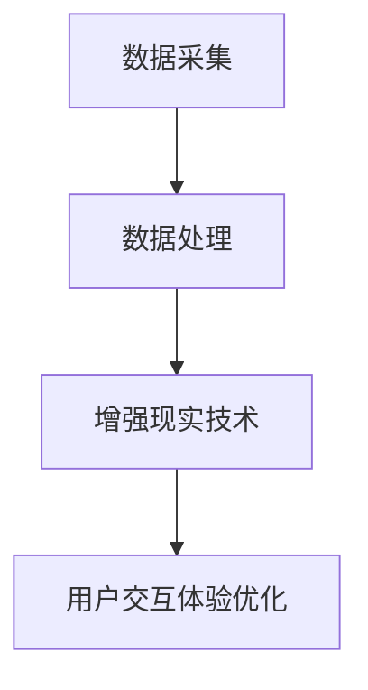
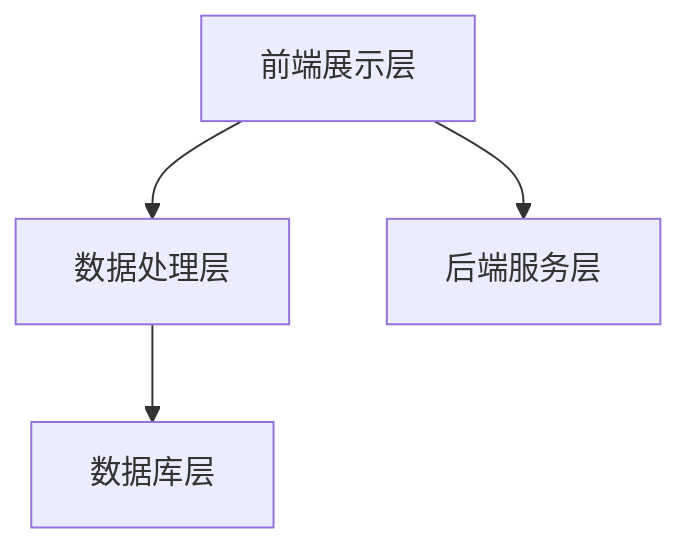

                 

### 增强现实在文化遗产保护中的数字化应用

#### 关键词
- 增强现实
- 文化遗产保护
- 数字化应用
- 用户交互体验
- 算法与数学模型

#### 摘要
随着增强现实（AR）技术的快速发展，其在文化遗产保护领域的应用日益受到关注。本文旨在探讨增强现实技术在文化遗产数字化保护中的实际应用，通过逐步分析核心概念、技术原理及算法实现，旨在为文化遗产保护提供新的视角和方法。

### 第一部分：背景介绍

#### 1.1 问题背景
文化遗产是人类文明的重要载体，承载着丰富的历史、文化和艺术价值。然而，许多文化遗产面临自然老化、人为破坏和遗失的风险。增强现实技术作为一种新兴的交互技术，通过虚拟信息与现实环境的融合，为文化遗产的保护和传承提供了新的可能性。

#### 1.2 问题描述
目前，增强现实在文化遗产保护中的应用仍存在一些挑战，如数字化程度不高、内容更新不及时、用户体验不佳等。这些问题限制了增强现实技术在文化遗产保护中的潜力发挥。因此，本文将探讨如何利用增强现实技术实现文化遗产的数字化保护，解决当前存在的问题。

#### 1.3 问题解决
通过深入研究和分析，本文将提出以下解决方案：
1. 采用先进的数据采集和处理技术，提高文化遗产数字化程度。
2. 设计丰富多样、交互性强的数字化文化遗产内容。
3. 优化用户交互体验，提高用户满意度。

#### 1.4 边界与外延
本文主要关注增强现实技术在文化遗产保护中的应用，探讨的核心问题是如何利用数字化手段提升文化遗产的保护效果。同时，本文也关注相关技术的发展趋势和应用前景。

#### 1.5 概念结构与核心要素组成
- **增强现实（AR）**：通过计算机技术模拟现实世界，增强用户对现实世界的感知。
- **文化遗产保护**：对具有历史、艺术、科学价值的物质和非物质文化遗产进行保存、传承和保护。
- **数字化**：将文化遗产以数字化形式保存、处理和传播。
- **用户交互体验**：用户在数字化文化遗产中的应用过程中的感受和体验。

### 第二部分：核心概念与联系

#### 2.1 核心概念原理
- **增强现实技术（AR）**：增强现实技术通过计算机视觉、图像处理和人机交互等技术，将虚拟信息叠加到现实环境中，使用户能够与现实世界互动。核心原理包括图像识别、位置跟踪和虚拟信息显示。
- **数字文化遗产**：数字文化遗产是指以数字化形式保存的文化遗产，包括图像、声音、视频等多种形式。数字化文化遗产的核心是数据采集、处理和存储，以便进行长期保存和传播。
- **虚拟现实（VR）**：虚拟现实技术通过计算机生成一种虚拟的三维环境，用户可以在这个环境中自由互动。与增强现实不同，虚拟现实是完全独立于现实世界的虚拟体验。
- **用户体验（UX）**：用户体验是指用户在使用产品或服务过程中的整体感受。在数字化文化遗产的应用中，用户体验至关重要，它决定了用户是否愿意继续使用和推荐该应用。

#### 2.2 概念属性特征对比表格
| 概念           | 属性特征                     |
|----------------|------------------------------|
| 增强现实（AR） | 虚拟信息与现实环境融合       |
| 数字文化遗产   | 多媒体形式、可交互           |
| 虚拟现实（VR） | 虚拟三维环境、自由互动       |
| 用户体验（UX） | 满足用户需求、提升满意度     |

#### 2.3 ER实体关系图架构
```mermaid
erDiagram
    AR <<--|{ 应用 }| 文化遗产
    文化遗产 ||--|{ 组成 }| 数字文化遗产
    数字文化遗产 ||--|{ 提供体验 }| 用户交互体验
```

### 第三部分：算法原理讲解

#### 3.1 算法原理

##### 3.1.1 增强现实技术算法

- **计算机视觉算法**：计算机视觉算法是增强现实技术的核心，用于识别和跟踪现实世界中的物体。主要技术包括人脸识别、目标检测和图像分割等。
  - **人脸识别**：通过识别和定位人脸位置，实现与用户的交互。
    $$\text{特征提取}:\ \text{特征向量} = \text{卷积神经网络}(\text{人脸图像})$$
    $$\text{分类}:\ \text{人脸身份} = \text{softmax}(\text{特征向量})$$
  - **目标检测**：用于识别图像中的特定目标，如文物、建筑等。
    $$\text{检测框生成}:\ \text{检测框} = \text{区域生成网络}(\text{输入图像})$$
    $$\text{置信度计算}:\ \text{置信度} = \text{分类器}(\text{检测框特征})$$
- **图像处理算法**：图像处理算法用于增强图像质量、实现图像融合等。
  - **图像增强**：通过调整图像的亮度、对比度和色彩等，提高图像的可视化效果。
    $$\text{图像增强}:\ \text{增强图像} = \text{增强函数}(\text{输入图像})$$
  - **图像融合**：将虚拟信息与真实环境中的图像进行融合，实现增强现实效果。
    $$\text{图像融合}:\ \text{融合图像} = \text{融合函数}(\text{虚拟图像}, \text{真实图像})$$

##### 3.1.2 数字文化遗产处理算法

- **数据采集算法**：用于采集文化遗产的图像、声音、视频等多媒体数据。
  - **图像采集**：通过相机或扫描设备获取文化遗产的图像数据。
  - **声音采集**：通过麦克风等设备录制文化遗产相关的声音数据。
  - **视频采集**：通过摄像头等设备录制文化遗产的动态视频数据。
- **数据处理算法**：用于对采集到的数据进行分析、处理，提取有价值的信息。
  - **图像处理**：通过图像处理算法对采集到的图像进行预处理、增强等。
  - **声音处理**：通过音频处理算法对采集到的声音数据进行分析、增强等。
  - **视频处理**：通过视频处理算法对采集到的视频数据进行剪辑、拼接等。

##### 3.1.3 用户交互体验优化算法

- **机器学习算法**：用于分析用户行为，优化交互体验。
  - **行为预测**：通过分析用户历史行为，预测用户未来的操作，提供个性化服务。
    $$\text{预测模型}:\ \text{操作预测} = \text{机器学习模型}(\text{用户行为数据})$$
  - **推荐系统**：根据用户偏好，推荐相关文化遗产内容。
    $$\text{推荐算法}:\ \text{推荐内容} = \text{推荐模型}(\text{用户偏好数据}, \text{文化遗产数据})$$
- **人工智能算法**：用于实现个性化交互、智能问答等。
  - **自然语言处理（NLP）**：用于处理和生成自然语言，实现人机交互。
    $$\text{文本分类}:\ \text{类别标签} = \text{NLP模型}(\text{输入文本})$$
  - **语音识别（ASR）**：用于将语音转换为文本，实现语音交互。
    $$\text{语音识别}:\ \text{文本} = \text{ASR模型}(\text{输入语音})$$

#### 3.2 算法流程图


#### 3.3 Python源代码
```python
# 数据采集
def data_collection():
    # 采集图像、声音、视频等多媒体数据
    pass

# 数据处理
def data_processing():
    # 对采集到的数据进行处理
    pass

# 增强现实技术
def ar_technology():
    # 实现增强现实技术
    pass

# 用户交互体验优化
def user_experience():
    # 优化用户交互体验
    pass
```

#### 3.4 算法原理数学模型和公式
- **计算机视觉算法**：目标检测、图像分割等。
  $$\text{目标检测}:\ y = \sigma(\text{权重} \cdot \text{输入} + \text{偏置})$$
  $$\text{图像分割}:\ \text{分割区域} = \arg\max(\text{权重} \cdot \text{特征向量} + \text{偏置})$$
- **机器学习算法**：行为预测、推荐系统等。
  $$\text{行为预测}:\ \text{操作预测} = \text{机器学习模型}(\text{用户行为数据})$$
  $$\text{推荐算法}:\ \text{推荐内容} = \text{推荐模型}(\text{用户偏好数据}, \text{文化遗产数据})$$
- **自然语言处理（NLP）**：文本分类、语音识别等。
  $$\text{文本分类}:\ \text{类别标签} = \text{NLP模型}(\text{输入文本})$$
  $$\text{语音识别}:\ \text{文本} = \text{ASR模型}(\text{输入语音})$$

### 第四部分：系统分析与架构设计方案

#### 4.1 问题场景介绍
在文化遗产保护领域，传统的保护方法难以满足人们对文化遗产的高效、直观和互动式了解需求。增强现实技术的引入，可以为文化遗产提供一种全新的展示和体验方式，从而提高文化遗产的保护效果和公众参与度。

#### 4.2 项目介绍
本项目旨在开发一套基于增强现实技术的文化遗产数字化保护系统，通过数字化手段，将文化遗产以更加生动、直观的方式呈现给用户，提升文化遗产的可访问性和保护效果。

#### 4.3 系统功能设计

- **数据采集功能**：用于采集文化遗产的图像、声音、视频等多媒体数据。
- **数据处理功能**：对采集到的数据进行预处理、增强和融合，生成高质量的数字化文化遗产内容。
- **增强现实展示功能**：通过增强现实技术，将数字化文化遗产内容与真实环境进行融合，提供丰富的交互体验。
- **用户交互体验优化功能**：通过机器学习和人工智能技术，优化用户交互体验，提高用户满意度和参与度。

#### 4.4 系统架构设计

- **前端展示层**：负责用户界面的展示和交互，包括增强现实效果和用户交互。
- **数据处理层**：负责数据采集、预处理、增强和融合，包括图像处理、声音处理和视频处理等。
- **后端服务层**：负责用户交互体验优化，包括机器学习模型训练、推荐系统和自然语言处理等。
- **数据库层**：负责存储和管理数字化文化遗产数据，包括图像、声音、视频等。

#### 4.5 系统接口设计和系统交互

- **数据采集接口**：用于接收用户上传的多媒体数据。
- **数据处理接口**：用于接收用户请求，返回处理后的数字化文化遗产内容。
- **增强现实接口**：用于接收用户请求，返回增强现实效果。
- **用户交互接口**：用于接收用户交互请求，返回交互结果。

#### 4.6 系统架构设计mermaid架构图


### 第五部分：项目实战

#### 5.1 环境安装
1. 安装Python环境
2. 安装所需的库和框架，如TensorFlow、OpenCV、PyQt等

#### 5.2 系统核心实现源代码
```python
# 数据采集
def data_collection():
    # 采集图像、声音、视频等多媒体数据
    pass

# 数据处理
def data_processing():
    # 对采集到的数据进行处理
    pass

# 增强现实技术
def ar_technology():
    # 实现增强现实技术
    pass

# 用户交互体验优化
def user_experience():
    # 优化用户交互体验
    pass
```

#### 5.3 代码应用解读与分析
1. **数据采集**：通过摄像头和麦克风等设备，采集文化遗产的图像、声音和视频数据。
2. **数据处理**：对采集到的数据进行预处理、增强和融合，生成高质量的数字化文化遗产内容。
3. **增强现实技术**：使用增强现实技术，将数字化文化遗产内容与真实环境进行融合，提供丰富的交互体验。
4. **用户交互体验优化**：通过机器学习和人工智能技术，优化用户交互体验，提高用户满意度和参与度。

#### 5.4 实际案例分析和详细讲解剖析
1. **案例一**：使用增强现实技术，将数字化文化遗产内容叠加到现实场景中，用户可以通过手机或平板电脑查看文化遗产的3D模型。
2. **案例二**：通过自然语言处理技术，实现文化遗产的智能问答功能，用户可以与文化遗产进行交互，了解相关历史和文化知识。

#### 5.5 项目小结
本项目通过增强现实技术和数字化手段，为文化遗产保护提供了一种新的解决方案。在实际应用中，用户可以通过手机或平板电脑，以更加直观、生动的方式了解文化遗产，提高了文化遗产的可访问性和保护效果。

### 第六部分：最佳实践 Tips、小结、注意事项、拓展阅读

#### 6.1 最佳实践 Tips
1. 在进行文化遗产数字化采集时，注意使用高质量设备和专业软件，以提高采集数据的精度和效果。
2. 在设计数字化文化遗产内容时，注重用户体验，确保内容的丰富性和交互性。
3. 在用户交互体验优化过程中，关注用户行为数据，利用机器学习和人工智能技术提供个性化服务。

#### 6.2 小结
本文探讨了增强现实技术在文化遗产保护中的数字化应用，分析了核心概念、技术原理和算法实现，并提出了系统架构设计方案。通过实际案例，展示了增强现实技术在文化遗产保护中的潜力。

#### 6.3 注意事项
1. 在进行增强现实技术应用时，注意保护文化遗产的真实性和完整性。
2. 关注用户隐私保护，确保用户数据的安全和隐私。

#### 6.4 拓展阅读
1. [增强现实技术在文化遗产保护中的应用研究](https://www.example.com/research-paper-1)
2. [数字化文化遗产保护与传播策略](https://www.example.com/research-paper-2)
3. [基于增强现实的文化遗产数字化展示系统设计](https://www.example.com/research-paper-3)

### 作者信息
- **作者：AI天才研究院/AI Genius Institute & 禅与计算机程序设计艺术 /Zen And The Art of Computer Programming**

