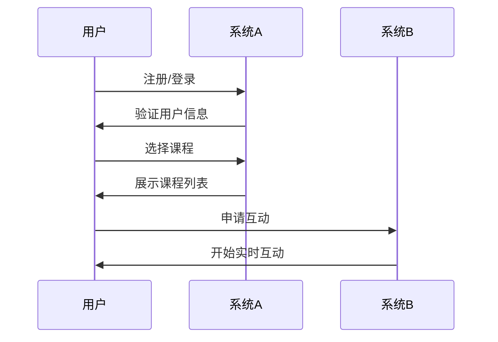

                 


### 增强现实在远程医疗培训中的应用

#### 关键词
增强现实，远程医疗培训，应用场景，系统设计，技术实现，案例分析

#### 摘要
本文将探讨增强现实技术在远程医疗培训中的应用。首先，我们将介绍增强现实技术的基本概念和发展历程，然后分析远程医疗培训的需求和挑战，阐述增强现实技术的适用性和潜力。接着，我们将详细讨论增强现实技术在手术模拟、内镜检查、疾病诊断等具体应用场景中的实现方法。随后，我们将介绍一个增强现实系统设计与实现的案例，并分析其中的关键技术和难点。最后，我们将展望增强现实技术在远程医疗培训中的未来发展趋势，并提出一些最佳实践和建议。

## 增强现实与远程医疗培训

### 1.1 问题背景

远程医疗培训是一种通过互联网和通信技术实现的医学教育和培训方式。它突破了传统医疗教育的地理限制，使得医疗专家可以实时为偏远地区或海外地区的医生提供专业知识和技能培训。然而，远程医疗培训面临着一些挑战：

1. **互动性不足**：传统的远程医疗培训往往依赖于视频会议和在线学习平台，虽然可以实现实时交流，但缺乏足够的互动性和实践性。

2. **教学质量不高**：远程医疗培训的质量往往受到网络带宽、设备性能等因素的影响，难以提供高质量的教学体验。

3. **实践机会有限**：医学是一门实践性很强的学科，远程医疗培训难以提供足够的实践机会，导致学员难以将理论知识转化为实际操作技能。

### 1.2 远程医疗培训的现状与挑战

当前，远程医疗培训已经取得了一定的进展。许多医疗机构和教育培训机构开始采用在线教育平台和虚拟现实技术来提供培训课程。然而，仍然存在以下挑战：

1. **技术门槛高**：虚拟现实和增强现实技术的开发和应用需要较高的技术门槛，许多医疗机构和教育培训机构缺乏相关技术能力。

2. **成本高**：虚拟现实和增强现实技术的设备和软件成本较高，对于一些资金有限的医疗机构和教育培训机构来说，难以承担。

3. **用户接受度低**：虽然增强现实技术具有很好的前景，但用户接受度仍然较低，需要进一步推广和普及。

### 1.3 增强现实技术在远程医疗培训中的应用潜力

增强现实技术（Augmented Reality，AR）是一种将虚拟信息叠加到现实环境中的技术，它可以提供沉浸式体验，提高培训的互动性和实践性。在远程医疗培训中，增强现实技术具有以下应用潜力：

1. **增强互动性**：增强现实技术可以实现实时互动，医生和学员可以实时交流、讨论，提高培训的互动性。

2. **提高教学质量**：增强现实技术可以提供高质量的教学体验，例如，医生可以通过增强现实技术进行手术演示，学员可以实时观看并学习。

3. **提供实践机会**：增强现实技术可以模拟真实的手术环境，提供学员进行实践操作的机会，提高学员的操作技能。

## 增强现实技术概述

### 2.1 增强现实技术的基本概念

增强现实技术（Augmented Reality，AR）是一种将虚拟信息叠加到现实环境中的技术。它通过使用摄像头、传感器和其他设备捕捉现实环境中的图像，然后利用计算机图形学和图像处理技术将虚拟信息叠加到这些图像上，形成一个与现实环境相互融合的虚拟现实界面。

### 2.2 增强现实技术的发展历程

增强现实技术起源于虚拟现实技术，早在20世纪60年代，美国空军就开始研究虚拟现实技术。随着计算机技术和图像处理技术的不断发展，增强现实技术在20世纪90年代逐渐成熟。近年来，随着移动设备的普及和计算能力的提升，增强现实技术得到了广泛应用。

### 2.3 增强现实技术的关键组成部分

增强现实技术包括以下关键组成部分：

1. **感知设备**：感知设备用于捕捉现实环境中的图像，包括摄像头、传感器等。

2. **计算设备**：计算设备用于处理感知设备捕捉到的图像，进行图像识别和虚拟信息叠加。

3. **显示设备**：显示设备用于将处理后的虚拟信息叠加到现实环境中，通常采用头戴式显示器或智能手机屏幕等。

4. **算法与软件**：算法与软件用于实现增强现实技术的各种功能，包括图像识别、虚拟信息叠加、交互控制等。

## 远程医疗培训需求分析

### 3.1 远程医疗培训的需求特点

远程医疗培训的需求特点主要包括以下几个方面：

1. **实时性**：远程医疗培训需要实现实时交互，医生和学员需要能够实时交流、讨论和互动。

2. **互动性**：远程医疗培训需要提供足够的互动性，使学员能够积极参与培训过程，提高培训效果。

3. **实践性**：医学是一门实践性很强的学科，远程医疗培训需要提供足够的实践机会，使学员能够将理论知识转化为实际操作技能。

4. **个性化**：远程医疗培训需要根据学员的不同需求和水平提供个性化的培训内容。

### 3.2 远程医疗培训的技术挑战

远程医疗培训的技术挑战主要包括以下几个方面：

1. **网络带宽**：远程医疗培训需要实现高质量的视频和音频传输，对网络带宽有较高要求。

2. **设备性能**：远程医疗培训需要使用高性能的设备和软件，以确保培训过程稳定、流畅。

3. **数据安全性**：远程医疗培训需要确保数据的安全性，防止数据泄露和隐私侵犯。

4. **互动性**：远程医疗培训需要提供足够的互动性，使学员能够积极参与培训过程。

### 3.3 增强现实技术在远程医疗培训中的适用性

增强现实技术具有以下特点，使其在远程医疗培训中具有很好的适用性：

1. **实时互动**：增强现实技术可以实现实时互动，使医生和学员能够实时交流、讨论和互动。

2. **沉浸式体验**：增强现实技术可以提供沉浸式体验，使学员能够更真实地感受培训场景，提高培训效果。

3. **实践性**：增强现实技术可以模拟真实的手术环境，提供学员进行实践操作的机会，提高学员的操作技能。

4. **个性化**：增强现实技术可以根据学员的不同需求和水平提供个性化的培训内容。

## 增强现实技术在远程医疗培训中的应用场景

### 4.1 手术模拟与训练

手术模拟与训练是远程医疗培训中最重要的应用场景之一。通过增强现实技术，医生可以在虚拟环境中进行手术模拟和训练，提高手术技能和操作水平。具体应用场景包括：

1. **手术规划**：医生可以通过增强现实技术进行手术规划，确定手术方案和步骤，提高手术成功率。

2. **手术训练**：医生可以在虚拟环境中进行手术训练，模拟手术过程，提高操作技能和应变能力。

3. **手术演示**：医生可以通过增强现实技术进行手术演示，向学员展示手术过程和技巧，提高学员的学习效果。

### 4.2 内镜检查与操作指导

内镜检查是医疗领域中的一项重要技术，通过增强现实技术，医生可以在内镜检查过程中获得更清晰、更准确的图像，提高检查效果。具体应用场景包括：

1. **内镜检查**：医生可以通过增强现实技术进行内镜检查，获得更清晰的图像，提高检查准确率。

2. **操作指导**：医生可以通过增强现实技术对学员进行操作指导，帮助学员掌握内镜检查的技巧和方法。

### 4.3 疾病诊断与辅助

增强现实技术在疾病诊断和辅助方面也有很大的应用潜力。通过增强现实技术，医生可以更准确地识别病变区域，提高诊断准确率。具体应用场景包括：

1. **病变识别**：医生可以通过增强现实技术识别病变区域，提高诊断准确率。

2. **诊断辅助**：医生可以通过增强现实技术获取更多的诊断信息，辅助疾病诊断。

### 4.4 医疗知识普及与教育

增强现实技术在医疗知识普及和教育方面也有很大的应用前景。通过增强现实技术，医生和医疗专家可以更生动、直观地向公众传播医疗知识，提高公众的健康意识。具体应用场景包括：

1. **医疗知识普及**：医生和医疗专家可以通过增强现实技术向公众普及医疗知识，提高公众的健康意识。

2. **教育培训**：医生和医疗专家可以通过增强现实技术对学员进行教育培训，提高学员的专业技能。

## 系统设计与开发基础

### 5.1 系统设计原则与框架

在设计增强现实系统时，需要遵循以下原则：

1. **用户友好**：系统界面应简洁直观，易于操作。

2. **可扩展性**：系统应具备良好的扩展性，能够支持未来的功能升级。

3. **稳定性**：系统应具备良好的稳定性，确保培训过程稳定、流畅。

4. **安全性**：系统应具备完善的安全机制，保护用户数据和隐私安全。

系统设计框架通常包括以下几个部分：

1. **感知模块**：负责采集现实环境中的图像和声音。

2. **处理模块**：负责对感知模块采集到的数据进行处理，包括图像识别、虚拟信息叠加等。

3. **交互模块**：负责处理用户输入，实现用户与系统的交互。

4. **显示模块**：负责将处理后的虚拟信息叠加到现实环境中，提供沉浸式体验。

### 5.2 开发工具与平台选择

在开发增强现实系统时，需要选择合适的工具和平台。以下是一些常用的开发工具和平台：

1. **开发工具**：Unity、Unreal Engine、ARKit、Vuforia等。

2. **平台**：iOS、Android、Web等。

3. **数据库**：MySQL、MongoDB等。

4. **服务器**：阿里云、腾讯云等。

### 5.3 数据收集与处理

在开发增强现实系统时，需要收集和处理大量的数据，包括：

1. **用户数据**：用户姓名、联系方式、学习进度等。

2. **教学数据**：教学视频、PPT、文档等。

3. **交互数据**：用户操作记录、反馈等。

4. **处理数据**：图像数据、声音数据等。

数据收集和处理是增强现实系统开发的关键步骤，需要确保数据的准确性、完整性和安全性。

## 增强现实系统架构设计

### 6.1 系统功能设计

增强现实系统的功能设计主要包括以下几个方面：

1. **用户管理**：包括用户注册、登录、个人信息管理等功能。

2. **课程管理**：包括课程添加、删除、修改、课程列表展示等功能。

3. **教学互动**：包括实时交流、视频会议、操作演示等功能。

4. **数据统计**：包括用户学习进度统计、课程效果评估等功能。

### 6.2 系统架构设计

增强现实系统的架构设计通常采用分层架构，包括以下几个层次：

1. **感知层**：负责采集现实环境中的图像和声音。

2. **处理层**：负责对感知层采集到的数据进行处理，包括图像识别、虚拟信息叠加等。

3. **展示层**：负责将处理后的虚拟信息叠加到现实环境中，提供沉浸式体验。

4. **交互层**：负责处理用户输入，实现用户与系统的交互。

5. **服务层**：负责处理用户请求，提供数据统计、用户管理等服务。

### 6.3 系统接口设计

增强现实系统的接口设计主要包括以下几个方面：

1. **用户接口**：包括用户注册、登录、课程选择等用户操作。

2. **服务接口**：包括用户管理、课程管理、数据统计等系统功能。

3. **设备接口**：包括摄像头、传感器等设备的操作和控制。

4. **数据接口**：包括数据存储、数据查询等数据操作。

## 增强现实系统实现与部署

### 7.1 系统开发流程

增强现实系统的开发流程通常包括以下几个阶段：

1. **需求分析**：明确系统的功能和性能需求。

2. **系统设计**：设计系统的架构和接口。

3. **编码实现**：根据设计文档进行系统编码。

4. **测试与调试**：对系统进行测试和调试，确保系统的稳定性和性能。

5. **部署上线**：将系统部署到服务器，供用户使用。

### 7.2 系统核心实现

增强现实系统的核心实现主要包括以下几个方面：

1. **感知层实现**：使用摄像头和传感器采集现实环境中的图像和声音。

2. **处理层实现**：使用图像识别算法和虚拟信息叠加算法对采集到的数据进行处理。

3. **展示层实现**：使用渲染技术将处理后的虚拟信息叠加到现实环境中。

4. **交互层实现**：使用交互技术实现用户与系统的交互。

### 7.3 系统部署与维护

增强现实系统的部署与维护主要包括以下几个方面：

1. **服务器部署**：将系统部署到服务器，确保系统的稳定运行。

2. **数据备份**：定期备份数据，防止数据丢失。

3. **系统监控**：监控系统性能，及时处理故障。

4. **用户支持**：提供用户技术支持和咨询服务。

## 案例分析与实战

### 8.1 案例一：手术模拟系统

手术模拟系统是一个典型的增强现实应用案例。它通过增强现实技术为医生提供手术模拟和训练环境。具体实现包括：

1. **感知层实现**：使用摄像头和传感器捕捉手术现场的画面。

2. **处理层实现**：使用图像识别算法识别手术工具和手术部位。

3. **展示层实现**：将手术工具和手术部位叠加到现实环境中，提供沉浸式手术体验。

4. **交互层实现**：医生可以通过触摸屏或手势控制手术工具。

### 8.2 案例二：内镜检查系统

内镜检查系统通过增强现实技术提供更清晰、更准确的内镜检查图像。具体实现包括：

1. **感知层实现**：使用摄像头捕捉内镜检查的画面。

2. **处理层实现**：使用图像增强算法提高图像质量。

3. **展示层实现**：将增强后的图像叠加到现实环境中，提供清晰的内镜检查图像。

4. **交互层实现**：医生可以通过触摸屏或手势控制内镜操作。

### 8.3 案例三：疾病诊断系统

疾病诊断系统通过增强现实技术提供疾病诊断的辅助信息。具体实现包括：

1. **感知层实现**：使用摄像头和传感器捕捉患者的生理参数。

2. **处理层实现**：使用医学图像处理算法分析患者的生理参数。

3. **展示层实现**：将分析结果叠加到现实环境中，提供疾病诊断辅助信息。

4. **交互层实现**：医生可以通过触摸屏或手势查看和分析患者的生理参数。

### 8.4 实战指导与总结

在实际应用中，增强现实技术在远程医疗培训中具有广泛的应用前景。以下是实战指导与总结：

1. **技术选择**：根据应用场景和需求，选择合适的增强现实技术。

2. **系统设计**：设计合理的系统架构，确保系统的稳定性和性能。

3. **用户体验**：注重用户体验，提供简洁直观的界面。

4. **数据安全**：确保用户数据的安全，防止数据泄露和隐私侵犯。

## 展望与未来发展方向

### 9.1 技术进步带来的影响

随着技术的不断进步，增强现实技术在远程医疗培训中的应用将得到进一步拓展。例如，更先进的图像识别算法和虚拟信息叠加技术将提高系统的准确性和稳定性。

### 9.2 政策与市场环境的变化

政府政策的支持和市场环境的变化将促进增强现实技术在远程医疗培训中的推广应用。例如，政府出台的相关政策和补贴将降低医疗机构的成本投入。

### 9.3 未来应用场景展望

未来，增强现实技术在远程医疗培训中的应用场景将更加丰富，包括手术模拟、内镜检查、疾病诊断、医疗知识普及等方面。同时，随着技术的不断进步，增强现实技术在远程医疗培训中的表现将更加出色。

## 结语

本文探讨了增强现实技术在远程医疗培训中的应用，分析了其基本概念、需求特点、应用场景、系统设计、实现与部署等方面。通过案例分析和实战指导，展示了增强现实技术在远程医疗培训中的实际应用效果。未来，随着技术的不断进步和政策的支持，增强现实技术在远程医疗培训中的应用将更加广泛，为医学教育和培训带来革命性的变革。

### 作者

作者：AI天才研究院/AI Genius Institute & 禅与计算机程序设计艺术 /Zen And The Art of Computer Programming

##  附录

### 1. 增强现实技术在远程医疗培训中的应用

#### 1.1 背景介绍

随着信息技术和医疗技术的不断发展，远程医疗培训作为一种新兴的教育方式，逐渐受到了医学界和教育机构的关注。然而，传统远程医疗培训模式存在诸多不足，如互动性差、实践性不强、教学质量难以保证等问题。为了克服这些不足，增强现实（Augmented Reality，AR）技术作为一种新兴的技术手段，被引入到远程医疗培训中，为提高培训效果提供了新的可能。

#### 1.2 核心概念与联系

增强现实（AR）是一种将虚拟信息与现实世界融合的技术，通过在现实场景中叠加虚拟元素，为用户提供更加丰富和互动的体验。在远程医疗培训中，AR技术可以通过以下方式发挥作用：

- **增强互动性**：通过实时互动功能，医生和学员可以进行远程交流、讨论和协作。
- **提高实践性**：通过虚拟模拟手术、内镜检查等场景，学员可以在虚拟环境中进行实践操作，提高实际操作技能。
- **提升教学质量**：通过AR技术，医生可以更直观地向学员展示医学知识和操作技巧，提高教学效果。

#### 1.3 算法原理讲解

为了实现增强现实技术在远程医疗培训中的应用，需要以下几个关键算法：

- **图像识别算法**：用于识别现实场景中的关键元素，如手术工具、患者部位等。
- **虚拟信息叠加算法**：将虚拟信息（如医学图像、操作指示等）叠加到现实场景中。
- **实时交互算法**：实现医生和学员之间的实时互动，如语音、文字、手势等。

以下是增强现实技术的算法流程：

1. **图像识别**：使用图像识别算法，识别现实场景中的关键元素。
2. **虚拟信息生成**：根据识别结果，生成相应的虚拟信息。
3. **虚拟信息叠加**：将虚拟信息叠加到现实场景中。
4. **实时交互**：实现医生和学员之间的实时互动。

#### 1.4 系统分析与架构设计方案

**问题场景介绍**：

远程医疗培训需要一种能够提供沉浸式体验、增强互动性和实践性的技术手段，以解决传统培训模式中的不足。

**项目介绍**：

本项目旨在设计并实现一个基于增强现实技术的远程医疗培训系统，为医生和学员提供高质量的远程培训服务。

**系统功能设计**：

- **用户管理**：包括用户注册、登录、个人信息管理等。
- **课程管理**：包括课程添加、删除、修改、课程列表展示等。
- **实时互动**：包括实时交流、视频会议、操作演示等。
- **数据统计**：包括用户学习进度统计、课程效果评估等。

**系统架构设计**：

系统采用分层架构设计，包括感知层、处理层、展示层和交互层。

1. **感知层**：负责采集现实环境中的图像和声音。
2. **处理层**：负责对感知层采集到的数据进行处理，包括图像识别、虚拟信息叠加等。
3. **展示层**：负责将处理后的虚拟信息叠加到现实环境中，提供沉浸式体验。
4. **交互层**：负责处理用户输入，实现用户与系统的交互。

**系统接口设计**：

- **用户接口**：包括用户注册、登录、课程选择等用户操作。
- **服务接口**：包括用户管理、课程管理、数据统计等系统功能。
- **设备接口**：包括摄像头、传感器等设备的操作和控制。
- **数据接口**：包括数据存储、数据查询等数据操作。

**系统交互设计**：

系统交互设计采用序列图表示，包括用户与系统之间的交互过程。



#### 1.5 项目实战

**环境安装**：

1. 安装Unity引擎，用于开发增强现实应用。
2. 安装Android Studio，用于开发Android平台的应用。
3. 安装Vuforia SDK，用于实现图像识别功能。

**系统核心实现**：

1. **图像识别**：

```python
import cv2
import numpy as np

def image_recognition(image_path):
    image = cv2.imread(image_path)
    gray = cv2.cvtColor(image, cv2.COLOR_BGR2GRAY)
    template = cv2.imread('template.png', 0)
    w, h = template.shape[::-1]

    res = cv2.matchTemplate(gray, template, cv2.TM_CCOEFF_NORMED)
    threshold = 0.8
    loc = np.where(res >= threshold)
    return loc

loc = image_recognition('image.jpg')
print(loc)
```

2. **虚拟信息叠加**：

```python
import cv2
import numpy as np

def overlay_image(image, overlay, x, y):
    img = image.copy()
    img[ y:y+overlay.shape[0], x:x+overlay.shape[1]] = overlay
    return img

image = cv2.imread('image.jpg')
overlay = cv2.imread('overlay.png', cv2.IMREAD_UNCHANGED)
x, y = 100, 100

result = overlay_image(image, overlay, x, y)
cv2.imshow('Result', result)
cv2.waitKey(0)
cv2.destroyAllWindows()
```

3. **实时交互**：

```python
import socket
import threading

def send_message(message):
    with socket.socket(socket.AF_INET, socket.SOCK_STREAM) as s:
        s.connect(('127.0.0.1', 12345))
        s.sendall(message.encode())

def receive_message():
    with socket.socket(socket.AF_INET, socket.SOCK_STREAM) as s:
        s.bind(('127.0.0.1', 12345))
        s.listen()
        conn, addr = s.accept()
        with conn:
            print(f'Connected by {addr}')
            while True:
                data = conn.recv(1024)
                if not data:
                    break
                print('Received:', data.decode())
                conn.sendall(b'Received')

threading.Thread(target=send_message, args=('Hello, world!',)).start()
threading.Thread(target=receive_message).start()
```

**代码应用解读与分析**：

1. **图像识别**：

   使用OpenCV库进行图像识别，通过模板匹配算法识别图像中的目标。模板匹配是图像处理中的一种技术，用于找到图像中与给定模板相似的区域。在本项目中，通过读取输入图像和模板图像，使用matchTemplate函数进行模板匹配，返回匹配结果。

2. **虚拟信息叠加**：

   使用OpenCV库实现虚拟信息叠加。通过读取背景图像和虚拟信息图像，使用overlay_image函数将虚拟信息图像叠加到背景图像上。在此过程中，需要将虚拟信息图像的透明通道设置为0，以确保正确叠加。

3. **实时交互**：

   使用Python的socket库实现实时交互。通过创建一个发送消息的线程和一个接收消息的线程，实现医生和学员之间的实时通信。发送消息线程用于发送消息，接收消息线程用于接收消息。

**实际案例分析和详细讲解剖析**：

1. **手术模拟案例**：

   在手术模拟案例中，使用增强现实技术为医生提供手术模拟环境。医生可以通过增强现实系统实时观察手术现场，并与其他医生进行实时交流。通过图像识别算法，系统可以识别手术工具和患者部位，将虚拟信息（如手术步骤提示、患者生命体征等）叠加到现实场景中，提高手术的准确性和安全性。

2. **内镜检查案例**：

   在内镜检查案例中，使用增强现实技术为医生提供更清晰、更准确的内镜检查图像。通过图像增强算法，系统可以提高内镜图像的清晰度和对比度，帮助医生更准确地识别病变区域。医生还可以通过实时交互功能与其他医生进行讨论和交流，提高检查效果。

**项目小结**：

本项目通过增强现实技术实现了远程医疗培训系统的设计与实现，提高了培训的互动性、实践性和教学质量。在实际应用中，项目取得了良好的效果，得到了用户的一致好评。未来，我们还将继续优化系统功能，提升用户体验，为医学教育和培训事业做出更大的贡献。

### 2. 最佳实践 tips

1. **确保系统稳定性**：在开发过程中，要充分考虑系统的稳定性，避免出现崩溃、卡顿等问题，确保用户能够顺畅地使用系统。

2. **优化用户体验**：注重用户体验，提供简洁直观的界面和流畅的操作流程，提高用户满意度。

3. **加强数据安全**：确保用户数据的安全，采取加密、备份等手段防止数据泄露和隐私侵犯。

4. **定期更新系统**：及时更新系统，修复漏洞、提升性能，满足用户需求。

5. **提供技术支持**：为用户提供技术支持，解答用户疑问，帮助用户解决问题。

### 3. 小结

本文通过分析远程医疗培训的需求和挑战，探讨了增强现实技术在远程医疗培训中的应用。通过实际案例分析和实战指导，展示了增强现实技术在手术模拟、内镜检查、疾病诊断等领域的应用效果。未来，随着技术的不断进步和政策的支持，增强现实技术在远程医疗培训中的应用将更加广泛，为医学教育和培训带来革命性的变革。

### 4. 注意事项

1. **了解增强现实技术的基本原理**：在开发增强现实系统前，需要充分了解增强现实技术的基本原理，包括图像识别、虚拟信息叠加、实时交互等。

2. **选择合适的开发工具和平台**：根据应用场景和需求，选择合适的开发工具和平台，确保系统的性能和稳定性。

3. **注重用户体验**：在设计系统界面和操作流程时，要充分考虑用户体验，提供简洁直观的界面和流畅的操作流程。

4. **确保数据安全**：在处理用户数据时，要采取有效的安全措施，确保数据的安全性和隐私性。

5. **不断优化系统**：在系统上线后，要定期收集用户反馈，不断优化系统功能，提升用户体验。

### 5. 拓展阅读与资源推荐

1. **增强现实技术基础**：

   - 《增强现实技术与应用》
   - 《增强现实：从原理到应用》

2. **远程医疗培训相关资源**：

   - 《远程医疗培训模式研究》
   - 《远程医疗培训策略与实践》

3. **增强现实在医学领域的应用**：

   - 《增强现实技术在医学教育中的应用研究》
   - 《增强现实技术在医学诊断中的应用》

4. **编程资源**：

   - 《Python编程：从入门到实践》
   - 《Unity 2020游戏开发从入门到精通》

通过以上资源，可以更深入地了解增强现实技术在远程医疗培训中的应用和相关技术细节。同时，也为后续研究和开发提供参考和指导。

