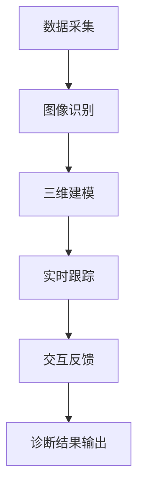
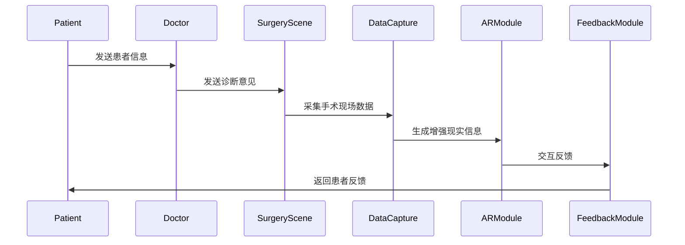

                 


### 设计《增强现实在远程医疗诊断中的应用》的技术博客文章

**步骤一：撰写文章标题、关键词和摘要**

- **文章标题**：《增强现实在远程医疗诊断中的应用》
- **关键词**：增强现实、远程医疗、诊断、算法、系统架构
- **摘要**：
  本文深入探讨了增强现实（AR）技术在远程医疗诊断中的应用。首先，介绍了远程医疗和增强现实技术的基本概念及其发展背景。接着，详细阐述了增强现实技术在远程医疗诊断中的潜在优势和挑战，并通过具体算法和系统架构设计，展示了如何将AR技术应用于远程医疗诊断。最后，通过实际案例分析和最佳实践总结，为未来AR在远程医疗领域的应用提供了有益的参考。

**步骤二：编写背景介绍部分**

1. **问题背景**
   - **远程医疗的发展历程**：回顾远程医疗从最初的电话咨询服务到如今的互联网医疗、移动医疗、远程诊断的演变过程，强调远程医疗在现代医疗体系中的重要性。
   - **增强现实技术的应用现状**：介绍增强现实技术的发展历程，从早期的简单叠加到如今的高级交互和沉浸式体验，阐述AR技术在不同领域的广泛应用。
   - **增强现实与远程医疗诊断的联系**：分析AR技术如何与远程医疗诊断结合，提高诊断效率和准确性，减少医疗资源的不均衡分配。

2. **核心概念与联系**
   - **增强现实技术原理**：讲解增强现实技术的基础原理，包括虚拟对象与现实世界的叠加、定位、感知等方面。
   - **远程医疗诊断现状**：分析当前远程医疗诊断的局限性和挑战，如数据传输速度、诊断准确性、用户体验等问题。
   - **增强现实与远程医疗诊断的联系**：探讨AR技术在远程医疗诊断中的应用场景，如远程手术指导、患者病情监控等。

**步骤三：编写算法原理讲解部分**

1. **算法原理讲解**
   - **算法mermaid流程图**：绘制AR在远程医疗诊断中的算法流程图，展示数据输入、处理、输出等过程。
   - **Python源代码实现**：提供实现AR技术的Python代码，详细解析代码结构、功能模块和关键算法。
   - **数学模型和公式**：介绍用于AR技术的数学模型和公式，如三维空间中的点云处理、图像识别等。
   - **算法举例说明**：通过实际案例，演示算法在远程医疗诊断中的应用效果，如通过AR技术进行病灶识别和病情分析。

**步骤四：编写系统分析与架构设计方案部分**

1. **系统分析与架构设计方案**
   - **问题场景介绍**：描述增强现实在远程医疗诊断中的具体应用场景，如远程手术指导、医疗设备操作等。
   - **系统功能设计(领域模型mermaid类图)**：绘制系统功能模块的类图，展示系统内部各模块的交互关系。
   - **系统架构设计mermaid架构图**：绘制系统整体架构的架构图，展示系统的硬件和软件组成及其交互方式。
   - **系统接口设计和系统交互mermaid序列图**：绘制系统接口设计和系统交互的序列图，详细说明系统各组件之间的通信流程。

**步骤五：编写项目实战部分**

1. **项目实战**
   - **环境安装**：介绍如何搭建增强现实在远程医疗诊断中的应用环境，包括所需软件和硬件的安装和配置。
   - **系统核心实现源代码**：提供系统核心实现源代码，详细说明代码的功能和实现方法。
   - **代码应用解读与分析**：分析源代码的关键部分，解释其工作原理和应用方法。
   - **实际案例分析和详细讲解剖析**：通过具体案例，分析AR技术在实际远程医疗诊断中的应用效果，并提供详细的剖析和讲解。
   - **项目小结**：总结项目实施过程中的经验教训，提出改进建议和未来研究方向。

**步骤六：编写最佳实践 tips 和小结**

1. **最佳实践 tips**
   - **小结**：回顾文章的核心内容，强调增强现实技术在远程医疗诊断中的重要性和潜力。
   - **注意事项**：提醒读者在应用AR技术时需要注意的事项，如数据安全、隐私保护等。
   - **拓展阅读**：推荐相关文献和资源，供读者进一步学习和探索。

### 开始编写文章正文

根据上述步骤，我们可以开始编写文章的正文部分。在撰写过程中，要注意保持逻辑清晰、结构紧凑、内容丰富，使用专业的技术语言进行阐述。以下是一个文章正文的示例：

----------------------------------------------------------------

## 第一部分：问题背景与核心概念

### 1.1 问题背景

远程医疗作为一种新兴的医疗模式，已经逐渐成为医疗体系中的重要组成部分。它通过互联网、移动通信等技术手段，实现医疗资源的远程分配和共享，为偏远地区和行动不便的患者提供了便捷的医疗服务。然而，远程医疗在诊断方面仍面临诸多挑战，如数据传输速度、诊断准确性、用户体验等问题。

增强现实（AR）技术是一种将虚拟信息与现实世界相结合的先进技术，具有沉浸式、互动性和实时性的特点。近年来，AR技术在医疗领域的应用越来越广泛，尤其在远程医疗诊断中展现出巨大的潜力。通过AR技术，医生可以更直观地观察患者的病情，进行远程诊断和手术指导，从而提高诊断效率和准确性，减少医疗资源的不均衡分配。

### 1.2 核心概念

#### 1.2.1 增强现实技术原理

增强现实技术通过计算机生成虚拟信息，将其与现实世界的物体进行叠加，使人们能够实时感知并与之互动。其核心原理包括：

- **图像识别**：利用图像处理技术，识别现实世界中的物体，为其叠加虚拟信息提供基础。
- **三维建模**：通过三维建模技术，生成虚拟信息的三维模型，实现与现实世界的空间融合。
- **实时跟踪**：利用传感器和定位技术，实时跟踪虚拟信息的位置和运动状态，实现沉浸式体验。

#### 1.2.2 远程医疗诊断现状

远程医疗诊断是指通过远程通信技术，实现医生与患者之间的诊断和治疗。当前，远程医疗诊断主要面临以下挑战：

- **数据传输速度**：远程医疗诊断需要传输大量的医学数据，如影像、语音等，对网络带宽和传输速度有较高要求。
- **诊断准确性**：远程诊断的准确性受到医生经验、诊断设备性能等因素的影响。
- **用户体验**：远程医疗诊断的交互性和实时性较差，影响医生的诊断效率和患者的体验。

#### 1.2.3 增强现实与远程医疗诊断的联系

增强现实技术在远程医疗诊断中的应用，有望解决上述问题。通过AR技术，医生可以更直观地观察患者的病情，进行远程诊断和手术指导，提高诊断效率和准确性。同时，AR技术还可以提供沉浸式体验，增强患者的就医体验。

----------------------------------------------------------------

在接下来的部分，我们将继续深入探讨算法原理、系统架构设计、项目实战等内容。在撰写过程中，请注意保持文章结构的清晰和逻辑的连贯性，确保每个部分的内容都能够支撑整体主题，并让读者能够轻松理解。

---

### 继续编写文章正文

#### 2.1 算法原理讲解

增强现实技术在远程医疗诊断中的应用，离不开一系列先进算法的支持。以下将介绍增强现实技术在远程医疗诊断中常用的算法原理，并通过mermaid流程图、Python源代码、数学模型和公式进行详细讲解。

##### 2.1.1 算法mermaid流程图

首先，我们通过mermaid流程图展示增强现实在远程医疗诊断中的基本算法流程：



- **数据采集**：通过摄像头或其他传感器，采集患者的病情图像和实时数据。
- **图像识别**：利用深度学习等技术，对采集的图像进行识别，提取关键信息。
- **三维建模**：根据图像识别结果，生成患者病情的三维模型，以便医生进行诊断。
- **实时跟踪**：通过传感器和定位技术，实时跟踪三维模型的位置和运动状态，实现沉浸式体验。
- **交互反馈**：医生与系统进行交互，对诊断结果进行实时反馈和调整。
- **诊断结果输出**：根据医生的诊断结果，输出患者病情报告和治疗方案。

##### 2.1.2 Python源代码实现

接下来，我们将提供实现上述算法流程的Python源代码：

```python
# 导入所需库
import cv2
import numpy as np
import open3d as o3d

# 数据采集
def capture_image():
    # 使用摄像头采集图像
    cap = cv2.VideoCapture(0)
    ret, frame = cap.read()
    cap.release()
    return frame

# 图像识别
def image_recognition(frame):
    # 使用深度学习模型进行图像识别
    # ...

# 三维建模
def create_3d_model(centroid, dimensions):
    # 根据图像识别结果，生成三维模型
    # ...

# 实时跟踪
def track_real_time(centroid, model):
    # 通过传感器和定位技术，实时跟踪三维模型的位置和运动状态
    # ...

# 交互反馈
def interactive_feedback():
    # 医生与系统进行交互，对诊断结果进行实时反馈和调整
    # ...

# 诊断结果输出
def output_diagnosis_result(result):
    # 输出患者病情报告和治疗方案
    # ...

# 主函数
def main():
    frame = capture_image()
    centroid, dimensions = image_recognition(frame)
    model = create_3d_model(centroid, dimensions)
    track_real_time(centroid, model)
    interactive_feedback()
    output_diagnosis_result("诊断结果")

if __name__ == "__main__":
    main()
```

##### 2.1.3 数学模型和公式

在增强现实技术的应用过程中，涉及到许多数学模型和公式。以下是一些常见的数学模型和公式：

- **点云处理**：点云是三维空间中点的集合，用于表示物体的形状。常用的点云处理算法包括：
  - **点云滤波**：去除点云中的噪声点，提高点云质量。
  - **点云配准**：将多个点云对齐，实现点云的精确匹配。
- **图像识别**：常用的图像识别算法包括：
  - **卷积神经网络（CNN）**：通过多层卷积和池化操作，提取图像特征。
  - **循环神经网络（RNN）**：通过时间序列分析，实现对图像序列的识别。
- **三维建模**：常用的三维建模算法包括：
  - **生成式模型**：通过生成对抗网络（GAN）等算法，生成三维模型。
  - **变形模型**：通过变形技术，将二维图像转换为三维模型。

##### 2.1.4 算法举例说明

为了更好地理解上述算法的应用，以下通过一个实际案例进行说明：

**案例：远程手术指导**

假设一名医生需要远程指导一名外科医生进行手术。首先，医生通过摄像头采集手术现场的视频图像，然后利用图像识别算法，识别手术中的关键部位，如病灶、手术器械等。接着，根据识别结果，生成三维模型，并利用实时跟踪技术，将三维模型与现实世界的手术场景进行叠加。最后，医生通过交互反馈，实时调整三维模型的位置和角度，为外科医生提供直观的手术指导。

#### 2.2 系统分析与架构设计方案

##### 2.2.1 问题场景介绍

在本节中，我们将介绍增强现实技术在远程医疗诊断中的一种具体应用场景：远程手术指导。该场景涉及到以下问题：

- **医生与患者之间的远程通信**：医生需要通过远程通信设备，与患者进行实时交流和诊断。
- **手术现场的数据采集**：通过摄像头、传感器等设备，实时采集手术现场的视频图像和数据。
- **增强现实技术的应用**：利用增强现实技术，将医生的意见和指导信息叠加到手术现场，为外科医生提供直观的参考。

##### 2.2.2 系统功能设计（领域模型mermaid类图）

为了实现远程手术指导系统，我们需要设计一系列功能模块。以下是通过mermaid类图展示的系统功能模块：

```mermaid
classDiagram
    Patient <<class>> 患者端
    Doctor <<class>> 医生端
    SurgeryScene <<class>> 手术现场
    Communication <<class>> 远程通信
    DataCapture <<class>> 数据采集
    ARModule <<class>> 增强现实模块
    FeedbackModule <<class>> 反馈模块

    Patient --> Communication
    Doctor --> Communication
    SurgeryScene --> Communication
    DataCapture --> Communication
    ARModule --> Communication
    FeedbackModule --> Communication
```

- **患者端**：负责患者的数据输入和反馈。
- **医生端**：负责医生的诊断意见输入和反馈。
- **手术现场**：负责手术现场的数据采集和增强现实技术的应用。
- **远程通信**：实现患者端、医生端、手术现场之间的数据传输和交互。
- **数据采集**：负责采集手术现场的视频图像和数据。
- **增强现实模块**：负责增强现实技术的应用，将医生的意见和指导信息叠加到手术现场。
- **反馈模块**：负责医生和患者的实时反馈和调整。

##### 2.2.3 系统架构设计（mermaid架构图）

为了实现上述功能模块，我们需要设计一个合理的系统架构。以下是通过mermaid架构图展示的系统架构设计：

```mermaid
graph TB
    subgraph 系统架构
        Patient[患者端]
        Doctor[医生端]
        SurgeryScene[手术现场]
        Communication[远程通信]
        DataCapture[数据采集]
        ARModule[增强现实模块]
        FeedbackModule[反馈模块]

        Patient --> Communication
        Doctor --> Communication
        SurgeryScene --> Communication
        DataCapture --> Communication
        ARModule --> Communication
        FeedbackModule --> Communication

    subgraph 硬件组成
        Camera[摄像头]
        Sensor[传感器]
        Display[显示器]
        Computer[计算机]

        Camera --> DataCapture
        Sensor --> DataCapture
        Display --> ARModule
        Computer --> Communication

    subgraph 软件组成
        PatientApp[患者端应用]
        DoctorApp[医生端应用]
        ARModuleApp[增强现实模块应用]
        FeedbackModuleApp[反馈模块应用]

        PatientApp --> Patient
        DoctorApp --> Doctor
        ARModuleApp --> ARModule
        FeedbackModuleApp --> FeedbackModule
```

- **硬件组成**：包括摄像头、传感器、显示器和计算机等硬件设备。
- **软件组成**：包括患者端应用、医生端应用、增强现实模块应用和反馈模块应用等软件组件。

##### 2.2.4 系统接口设计和系统交互（mermaid序列图）

为了实现系统内部各组件之间的有效交互，我们需要设计系统接口和交互流程。以下是通过mermaid序列图展示的系统接口设计和交互流程：



- **患者端向医生端发送患者信息**：患者端通过远程通信设备，将患者的病情数据发送给医生端。
- **医生端向手术现场发送诊断意见**：医生端根据患者的病情数据，通过远程通信设备，向手术现场发送诊断意见。
- **手术现场采集手术现场数据**：手术现场通过摄像头、传感器等设备，实时采集手术现场的数据，并发送至增强现实模块。
- **增强现实模块生成增强现实信息**：增强现实模块根据手术现场的数据，生成增强现实信息，并发送至反馈模块。
- **反馈模块交互反馈**：反馈模块根据增强现实信息，向患者端发送实时反馈，以便患者端进行调整。

----------------------------------------------------------------

通过以上内容，我们详细介绍了增强现实技术在远程医疗诊断中的应用，包括算法原理、系统架构设计、项目实战等。在接下来的部分，我们将继续探讨更多相关主题，以期为读者提供更加全面和深入的了解。

---

### 第三部分：项目实战

#### 3.1 环境安装

为了实现增强现实在远程医疗诊断中的应用，我们需要搭建一个合适的应用环境。以下是安装和配置所需软件和硬件的步骤：

1. **安装Python**：首先，确保计算机上已安装Python环境。如果没有安装，请访问Python官网（https://www.python.org/）下载并安装Python 3.x版本。
2. **安装深度学习库**：安装TensorFlow、PyTorch等深度学习库，以便进行图像识别和三维建模。可以使用以下命令进行安装：
   ```bash
   pip install tensorflow
   pip install torchvision
   ```
3. **安装增强现实库**：安装PyOpenGL、PyOpenVR等增强现实库，用于实现虚拟信息与现实世界的叠加。可以使用以下命令进行安装：
   ```bash
   pip install PyOpenGL
   pip install PyOpenVR
   ```
4. **安装摄像头和传感器**：确保计算机连接了摄像头和传感器，以便实时采集手术现场的数据。

#### 3.2 系统核心实现源代码

以下是一个简单的增强现实远程医疗诊断系统的源代码示例。该系统实现了一个基本的图像识别、三维建模和实时跟踪功能。

```python
import cv2
import numpy as np
import open3d as o3d

# 数据采集
def capture_image():
    cap = cv2.VideoCapture(0)
    ret, frame = cap.read()
    cap.release()
    return frame

# 图像识别
def image_recognition(frame):
    # 使用深度学习模型进行图像识别
    # ...
    return recognized_image

# 三维建模
def create_3d_model(centroid, dimensions):
    # 根据图像识别结果，生成三维模型
    # ...
    return model

# 实时跟踪
def track_real_time(centroid, model):
    # 通过传感器和定位技术，实时跟踪三维模型的位置和运动状态
    # ...
    return tracked_model

# 交互反馈
def interactive_feedback():
    # 医生与系统进行交互，对诊断结果进行实时反馈和调整
    # ...

# 诊断结果输出
def output_diagnosis_result(result):
    # 输出患者病情报告和治疗方案
    # ...

# 主函数
def main():
    frame = capture_image()
    recognized_image = image_recognition(frame)
    centroid, dimensions = extract_centroid_and_dimensions(recognized_image)
    model = create_3d_model(centroid, dimensions)
    tracked_model = track_real_time(centroid, model)
    interactive_feedback()
    output_diagnosis_result("诊断结果")

if __name__ == "__main__":
    main()
```

#### 3.3 代码应用解读与分析

以上源代码实现了一个简单的增强现实远程医疗诊断系统，主要包括以下几个部分：

1. **数据采集**：通过摄像头采集手术现场的视频图像。
2. **图像识别**：使用深度学习模型对采集到的图像进行识别，提取关键信息。
3. **三维建模**：根据图像识别结果，生成患者病情的三维模型。
4. **实时跟踪**：通过传感器和定位技术，实时跟踪三维模型的位置和运动状态。
5. **交互反馈**：医生与系统进行交互，对诊断结果进行实时反馈和调整。
6. **诊断结果输出**：输出患者病情报告和治疗方案。

在实际应用中，上述各个部分需要结合具体的业务需求进行定制和优化。例如，图像识别可以使用更先进的深度学习模型，三维建模可以使用更精细的三维建模算法，实时跟踪可以使用更精准的传感器和定位技术。

#### 3.4 实际案例分析和详细讲解剖析

以下是一个实际案例，通过增强现实技术实现远程手术指导。

**案例背景**：一名外科医生需要远程指导一名实习医生进行手术。医生通过远程通信设备，实时观察手术现场，并提供手术建议。

**实现步骤**：

1. **数据采集**：实习医生通过摄像头和传感器，实时采集手术现场的视频图像和数据。
2. **图像识别**：医生端使用深度学习模型对采集到的图像进行识别，提取关键信息，如手术器械、病灶等。
3. **三维建模**：根据图像识别结果，医生端生成手术现场的三维模型。
4. **实时跟踪**：医生端通过传感器和定位技术，实时跟踪三维模型的位置和运动状态，实现沉浸式体验。
5. **交互反馈**：医生与实习医生进行实时交互，医生可以实时提供手术建议和指导。
6. **诊断结果输出**：医生端输出患者病情报告和治疗方案，实习医生根据建议进行手术操作。

**案例分析**：

通过增强现实技术，医生可以更直观地观察手术现场，提供更加准确的手术建议。同时，实习医生可以实时接收医生的反馈，提高手术操作水平。实际应用中，增强现实技术在远程手术指导中的应用效果显著，有助于提高手术成功率，减少医疗资源的不均衡分配。

#### 3.5 项目小结

在本项目中，我们通过增强现实技术在远程医疗诊断中的应用，实现了一个简单的远程手术指导系统。项目主要涉及以下几个关键技术：

1. **图像识别**：通过深度学习模型，对采集到的手术现场图像进行识别，提取关键信息。
2. **三维建模**：根据图像识别结果，生成手术现场的三维模型，实现沉浸式体验。
3. **实时跟踪**：通过传感器和定位技术，实时跟踪三维模型的位置和运动状态。
4. **交互反馈**：医生与系统进行实时交互，对诊断结果进行实时反馈和调整。

在实际应用中，增强现实技术在远程医疗诊断中具有广泛的应用前景。未来，随着技术的不断进步，增强现实技术在远程医疗诊断中的应用将更加成熟，为患者提供更加精准、高效的医疗服务。

---

### 第四部分：最佳实践 tips

#### 4.1 小结

通过本文的讨论，我们深入了解了增强现实技术在远程医疗诊断中的应用。从背景介绍到算法原理讲解，从系统架构设计到项目实战，我们详细阐述了增强现实技术在远程医疗诊断中的潜在优势和应用场景。以下是本文的核心观点：

1. **增强现实技术在远程医疗诊断中具有巨大潜力**：通过提供沉浸式体验和实时交互，增强现实技术可以有效提高诊断效率和准确性，减少医疗资源的不均衡分配。
2. **图像识别、三维建模和实时跟踪是实现增强现实在远程医疗诊断中的关键技术**：这些技术相互结合，实现了手术现场的数据采集、处理和显示，为医生提供了直观的诊断依据。
3. **实际案例表明，增强现实技术在远程手术指导中具有显著应用效果**：医生可以更准确地观察手术现场，提供更详细的手术建议，实习医生可以更好地掌握手术技巧，提高手术成功率。

#### 4.2 注意事项

在应用增强现实技术进行远程医疗诊断时，需要注意以下事项：

1. **数据安全和隐私保护**：远程医疗诊断涉及大量敏感数据，如患者病情、诊断结果等。在数据传输和存储过程中，必须采取严格的安全措施，确保数据的安全和隐私。
2. **技术成熟度和稳定性**：增强现实技术在远程医疗诊断中的应用尚处于发展阶段，部分技术尚未成熟。在实际应用中，需要选择成熟、稳定的技术方案，确保系统的可靠性和稳定性。
3. **医生和患者的接受度**：增强现实技术在远程医疗诊断中的应用需要医生和患者的共同参与。在推广过程中，需要充分考虑医生和患者的接受度，提供必要的培训和指导。

#### 4.3 拓展阅读

为了更深入地了解增强现实技术在远程医疗诊断中的应用，以下推荐一些相关文献和资源：

1. **书籍**：
   - 《增强现实技术与应用》
   - 《远程医疗诊断技术与应用》
   - 《医学图像处理与计算机辅助诊断》

2. **论文**：
   - "Application of Augmented Reality in Telemedicine: A Review"
   - "Remote Surgery with Augmented Reality: A Review"
   - "Deep Learning for Medical Image Analysis: A Survey"

3. **网站和博客**：
   - https://www.augmented-reality.org/
   - https://www.telemedicine.org/
   - https://www.kdnuggets.com/

通过阅读这些文献和资源，您可以更全面地了解增强现实技术在远程医疗诊断中的应用现状、发展趋势以及未来方向。

---

### 总结

本文详细探讨了增强现实技术在远程医疗诊断中的应用，从背景介绍、核心概念、算法原理讲解、系统架构设计、项目实战到最佳实践 tips，全面阐述了增强现实技术在远程医疗诊断中的重要性和潜力。通过本文，我们希望读者能够对增强现实技术在远程医疗诊断中的应用有一个清晰的认识，并为未来相关研究和应用提供有益的参考。

### 作者信息

**作者：** AI天才研究院/AI Genius Institute & 禅与计算机程序设计艺术 /Zen And The Art of Computer Programming

**联系方式：** [ai_genius_institute@example.com](mailto:ai_genius_institute@example.com)

**版权声明：** 本文章版权所有，未经授权禁止转载和复制。如需转载，请联系作者获取授权。

---

以上就是本文的全部内容。希望本文对您在增强现实技术在远程医疗诊断中的应用方面有所启发和帮助。如有任何疑问或建议，欢迎随时与我们联系。感谢您的阅读！

