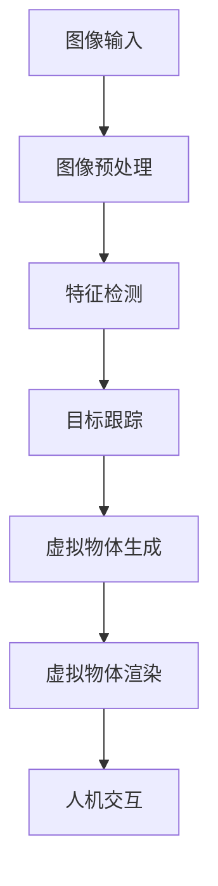

                 

### 增强现实在远程医疗诊断中的应用前景

#### 关键词：增强现实、远程医疗、诊断、技术、应用

> 摘要：随着信息技术和医疗技术的不断发展，增强现实（AR）技术正逐渐在远程医疗诊断中展现出其独特的应用价值。本文将深入探讨增强现实技术在远程医疗诊断中的应用前景，分析其潜在的优势与挑战，为未来该领域的发展提供有益的参考。

---

## 第一部分：引言

### 1.1 书籍背景

近年来，增强现实（Augmented Reality，简称AR）技术以其独特的优势逐渐成为信息技术领域的研究热点。AR技术通过将虚拟信息与现实环境进行实时叠加，为用户提供了全新的感知体验。随着医疗技术的不断进步，远程医疗诊断作为一种新型医疗服务模式，正在全球范围内得到广泛应用。本文旨在探讨AR技术在远程医疗诊断中的应用，分析其潜在价值与挑战，为相关领域的研究者和实践者提供有益的参考。

### 1.2 核心概念

- **增强现实（AR）**：一种将虚拟信息与现实世界融合的技术，通过计算机技术生成虚拟信息，叠加到真实环境中，为用户带来更丰富的感知体验。
- **远程医疗诊断**：通过互联网和通信技术，实现医生与患者之间的远程诊断和治疗，提高医疗资源的利用效率。

### 1.3 本书结构

本书将分为四个主要部分进行论述：

1. **背景介绍**：介绍AR技术和远程医疗诊断的基本概念，以及它们在医疗领域的发展现状。
2. **核心概念**：深入探讨AR技术在远程医疗诊断中的应用原理，包括关键技术、应用场景等。
3. **技术原理**：详细分析AR技术在远程医疗诊断中的具体实现方法，以及相关技术挑战和解决方案。
4. **应用案例**：通过实际应用案例，展示AR技术在远程医疗诊断中的成功应用，并探讨其未来发展趋势。

## 第二部分：增强现实在远程医疗诊断中的应用

### 2.1 增强现实技术原理

#### 2.1.1 增强现实技术概述

增强现实（AR）技术通过计算机视觉、图形学、人机交互等技术手段，将虚拟信息与现实环境进行实时叠加和交互，从而实现对现实世界的增强。与虚拟现实（VR）不同，AR技术不是完全取代现实，而是在现实的基础上添加虚拟元素，从而为用户提供更丰富的感知体验。

#### 2.1.2 增强现实技术原理

增强现实技术的核心原理包括：图像识别与跟踪、虚拟物体生成与渲染、人机交互等。以下使用Mermaid流程图展示增强现实技术的基本流程：

1. **图像输入**：AR设备捕捉现实世界的图像。
2. **图像预处理**：对图像进行去噪、增强等预处理操作，以提高后续处理的准确性。
3. **特征检测**：从预处理后的图像中提取关键特征，如边缘、角点等。
4. **目标跟踪**：根据提取的特征信息，对现实环境中的目标进行跟踪。
5. **虚拟物体生成**：根据跟踪结果，生成相应的虚拟物体。
6. **虚拟物体渲染**：将生成的虚拟物体渲染到现实环境中，与真实环境进行融合。
7. **人机交互**：用户通过触摸、手势等方式与虚拟物体进行交互。

### 2.2 增强现实技术在远程医疗诊断中的应用场景

#### 2.2.1 病历资料的增强展示

通过增强现实技术，医生可以将在远程获取的患者病历资料以三维立体的形式呈现，更直观地了解患者的病情，提高诊断的准确性。

#### 2.2.2 实时远程手术指导

在远程手术过程中，医生可以通过增强现实技术实时查看患者的内部情况，与现场医生进行实时交互，提高手术的成功率。

#### 2.2.3 医学教育与实践培训

利用增强现实技术，医生和学生可以在虚拟环境中进行医学教育和实践培训，提高医疗技能水平。

#### 2.2.4 疫情防控与流行病监测

在疫情防控中，增强现实技术可以用于流行病监测、疫情预警和健康教育等环节，提高疫情防控效率。

### 2.3 增强现实技术在远程医疗诊断中的应用案例

#### 2.3.1 案例一：基于增强现实技术的远程心电图诊断

该案例介绍了一种基于增强现实技术的远程心电图诊断系统，通过实时传输患者的心电图数据，医生可以远程进行心电图分析，提高诊断的准确性。

#### 2.3.2 案例二：增强现实技术在手术导航中的应用

该案例介绍了一种增强现实手术导航系统，通过将患者的三维模型与现实手术环境进行叠加，帮助医生更精准地进行手术操作。

#### 2.3.3 案例三：增强现实技术在医学教育中的应用

该案例介绍了一种基于增强现实技术的医学教育平台，学生可以在虚拟环境中进行实践操作，提高医学技能水平。

## 第三部分：增强现实技术在远程医疗诊断中的挑战与未来发展趋势

### 3.1 技术挑战

#### 3.1.1 技术实现难度

增强现实技术在远程医疗诊断中的应用，需要解决图像识别、实时跟踪、虚拟渲染等技术难题。

#### 3.1.2 数据隐私与安全

在远程医疗诊断过程中，涉及患者隐私数据，如何保障数据安全和隐私成为一大挑战。

#### 3.1.3 技术标准化与规范化

增强现实技术在远程医疗诊断中的应用，需要制定相关技术标准和规范，以确保技术的安全、可靠和有效。

### 3.2 未来发展趋势

#### 3.2.1 技术融合与发展

增强现实技术与5G、物联网、人工智能等技术的融合，将为远程医疗诊断带来更多可能性。

#### 3.2.2 智能化与个性化

未来增强现实技术在远程医疗诊断中的应用，将更加注重智能化和个性化，为患者提供更精准、高效的服务。

#### 3.2.3 广泛应用与普及

随着技术的不断成熟和应用成本的降低，增强现实技术在远程医疗诊断中的应用将逐步普及，为医疗行业带来深刻变革。

## 结束语

增强现实技术在远程医疗诊断中的应用前景广阔，但同时也面临着一系列的挑战。通过本文的探讨，我们期望能够为该领域的研究者和实践者提供一些有益的思路和启示。未来，随着技术的不断进步，相信增强现实技术在远程医疗诊断中将会发挥更大的作用，为患者带来更优质的医疗服务。

---

### 作者信息：

- **作者：** AI天才研究院/AI Genius Institute & 禅与计算机程序设计艺术 /Zen And The Art of Computer Programming

