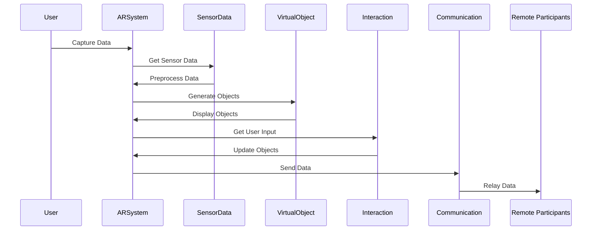

                 

### # 增强现实在远程协作中的应用

> 关键词：增强现实（AR）、远程协作、应用场景、技术实现、系统架构

> 摘要：本文将探讨增强现实（AR）技术在远程协作领域的应用。通过介绍AR技术的背景和发展，详细分析其在教育、医疗和商业等领域的应用案例，探讨AR技术如何提升远程协作的效率和质量。此外，文章还将深入探讨AR技术的实现细节，包括其技术原理、系统架构和具体实现方法，以及如何在远程协作中有效利用AR技术。通过本文，读者将全面了解AR技术在远程协作中的潜力和实际应用价值。

## 增强现实（AR）技术在远程协作中的应用背景

随着信息技术的飞速发展和全球化的深入推进，远程协作已成为企业、教育机构和个人日常生活中不可或缺的一部分。传统的远程协作方式主要通过视频会议、电子邮件和即时通讯工具实现，但这些方式在增强沟通和协作体验方面存在一定的局限性。为了克服这些限制，增强现实（AR）技术逐渐成为远程协作领域的研究热点和应用方向。

增强现实（AR）技术通过将虚拟信息与现实环境相结合，为用户提供了一种全新的交互体验。与虚拟现实（VR）不同，AR技术不是将用户完全沉浸在一个虚拟环境中，而是将虚拟信息叠加到现实世界中，从而实现虚实结合的效果。这种特性使得AR技术特别适合用于远程协作场景，可以在不改变用户工作环境的前提下，提供更丰富的交互方式和更高效的协作体验。

### 增强现实技术的起源和发展

增强现实技术的概念最早可以追溯到20世纪50年代。美国科学家伊凡·苏瑟兰（Ivan Sutherland）在1956年提出了“增强现实”这一术语，并设计出了世界上第一个头戴式显示器“达摩克利斯之剑”，虽然当时的技术水平有限，但这一概念为后来的AR技术发展奠定了基础。

进入21世纪，随着计算机硬件性能的不断提升和移动互联网的普及，AR技术开始逐渐走向成熟。2009年，谷歌推出了第一个AR应用“谷歌眼镜”，虽然由于隐私和安全问题最终被叫停，但它标志着AR技术进入了大众视野。此后，苹果、微软等科技巨头纷纷投入大量资源研发AR技术，并在智能手机和电脑等设备上推出了一系列AR应用。

目前，AR技术在多个领域得到了广泛应用，包括游戏、广告、医疗和教育等。特别是在远程协作领域，AR技术以其独特的交互方式和丰富的信息展示能力，为远程协作带来了新的可能性。

### 远程协作中的挑战与AR技术的优势

远程协作在带来灵活性和成本效益的同时，也面临一系列挑战。首先，传统远程协作方式往往依赖于语音和视频通讯，难以实现深层次的交互和协作。其次，远程协作中的信息传递往往存在延迟和误解，影响了协作效率和团队凝聚力。此外，对于复杂的项目和任务，远程协作难以提供实时的反馈和支持。

AR技术的引入为解决这些问题提供了新的思路。首先，AR技术可以通过实时叠加虚拟信息到用户视野中，增强用户的交互体验。用户可以通过触摸、手势等自然交互方式与虚拟信息进行互动，从而实现更高效、更直观的协作。其次，AR技术可以提供丰富的信息展示方式，例如三维模型、图表和动画等，帮助用户更好地理解和分析复杂的信息。此外，AR技术还可以实现远程协作中的实时反馈和支持，例如通过虚拟助手或远程专家指导，提高协作的实时性和有效性。

总之，增强现实技术在远程协作中的应用具有广阔的前景。通过结合AR技术，远程协作不仅可以克服传统方式的局限性，还可以提供更加丰富和高效的协作体验，从而提升团队的工作效率和创新能力。

### 核心概念与术语解释

在深入探讨增强现实（AR）技术及其在远程协作中的应用之前，有必要明确一些核心概念和术语，以便读者能够更好地理解后续内容。以下是对关键概念和术语的介绍：

#### 增强现实（Augmented Reality，AR）

增强现实（AR）是一种通过在现实环境中叠加虚拟信息来实现虚实结合的技术。与虚拟现实（VR）不同，AR不是将用户完全沉浸在一个虚拟环境中，而是在用户视野中添加虚拟图像、文字、声音等信息。这些虚拟信息可以通过摄像头、显示器或其他传感设备实时显示，并与用户环境进行互动。

#### 虚拟现实（Virtual Reality，VR）

虚拟现实（VR）是一种完全沉浸式的技术，通过头盔、眼镜或其他设备将用户封闭在一个虚拟环境中。在VR中，用户无法看到现实世界，而是完全沉浸在虚拟场景中。VR技术通常用于游戏、娱乐、教育和培训等领域。

#### 实时通讯（Real-time Communication）

实时通讯是指在短时间内（通常在几毫秒到几秒内）交换信息的通讯方式。在远程协作中，实时通讯非常重要，因为它能够确保参与者之间的信息传递和互动不会出现延迟或中断。实时通讯技术包括语音、视频和数据传输等。

#### 远程协作（Remote Collaboration）

远程协作是指通过互联网和通信技术，在不同地理位置的个体或团队之间进行合作和互动。远程协作的目的是通过技术手段克服地理距离带来的障碍，实现高效、实时的沟通和协作。远程协作工具包括视频会议系统、即时通讯软件、项目管理工具等。

#### 人机交互（Human-Computer Interaction，HCI）

人机交互（HCI）是研究人与计算机之间交互方式的一个领域，旨在设计出更加自然、直观和高效的交互系统。在远程协作中，人机交互技术对于提升用户体验和协作效率至关重要。常见的HCI技术包括触摸屏、语音识别、手势识别等。

#### 虚拟现实头戴设备（Virtual Reality Head-Mounted Display，HMD）

虚拟现实头戴设备（HMD）是一种用于提供沉浸式体验的设备，通常包括头戴式显示器、耳机和传感器等。HMD可以实时捕捉用户的头部运动，并根据这些数据调整显示内容，使用户感觉仿佛置身于虚拟世界中。

#### 空间定位与跟踪（Spatial Localization and Tracking）

空间定位与跟踪是AR技术中的一个关键组成部分，用于确定虚拟信息在现实环境中的位置和姿态。常见的空间定位方法包括视觉SLAM（Simultaneous Localization and Mapping）、惯性测量单元（IMU）和激光雷达（LiDAR）等。

#### 空间映射（Spatial Mapping）

空间映射是指创建现实环境的数字模型，以便在AR中准确地叠加虚拟信息。空间映射技术通常通过使用传感器（如摄像头、激光雷达）捕获环境数据，然后使用计算机视觉算法处理这些数据，生成环境模型。

通过以上对核心概念和术语的介绍，读者可以更好地理解增强现实技术在远程协作中的基本原理和关键要素。接下来，本文将深入探讨AR技术的理论基础、实际应用案例和实现方法，以帮助读者全面掌握这一前沿技术。

### 核心概念与联系

在探讨增强现实（AR）技术在远程协作中的应用之前，我们需要深入了解一些核心概念，包括其属性特征对比和ER实体关系图架构。这些概念不仅帮助我们理解AR技术的基础，也为后续章节中的应用和分析提供了理论支持。

#### 增强现实（AR）的核心概念及其属性特征

增强现实（AR）作为一种虚实结合的技术，其核心概念包括以下几个方面：

1. **虚拟信息叠加**：这是AR技术的核心特征，通过在现实环境中叠加虚拟图像、文字、声音等信息，使用户能够在现实世界中感知到虚拟信息的存在。

2. **实时交互**：AR技术支持用户与虚拟信息的实时互动，通过触摸、手势等自然交互方式，用户可以控制虚拟信息的位置、大小和样式。

3. **三维可视化**：AR技术能够将虚拟信息以三维形式展示在用户视野中，使得信息更加直观和易于理解。

4. **环境感知**：AR技术利用传感器和环境数据，对用户周围的环境进行感知和建模，确保虚拟信息与现实环境的紧密结合。

5. **增强现实体验**：通过提供丰富的视觉、听觉和触觉反馈，AR技术为用户带来沉浸式的体验。

为了更直观地对比这些核心概念，我们可以创建一个属性特征对比表格：

| 特征               | 描述                                       | 属性对比       |
|--------------------|------------------------------------------|--------------|
| 虚拟信息叠加       | 在现实环境中叠加虚拟图像、文字、声音信息       | 实时、互动、三维、环境感知 |
| 实时交互           | 用户与虚拟信息的实时互动                    | 自然交互、反馈及时 |
| 三维可视化         | 虚拟信息以三维形式展示                      | 直观、易于理解   |
| 环境感知           | 对用户周围环境进行感知和建模                 | 环境映射、信息结合 |
| 增强现实体验       | 提供丰富的视觉、听觉和触觉反馈               | 沉浸式、互动性强 |

#### ER实体关系图架构

实体关系图（ER图）是数据库设计中常用的一种表示方法，用于描述系统中的实体及其相互关系。在AR技术及其应用场景中，我们可以定义一些关键实体，并展示它们之间的关系。以下是AR技术相关实体及其关系的ER图：

```mermaid
erDiagram
    ARSystem  ||--|{ User }
    ARSystem  ||--|{ VirtualObject }
    ARSystem  ||--|{ SensorData }
    User      ||--|{ Interaction }
    VirtualObject ||--|{ DisplayInfo }
    SensorData ||--|{ EnvironmentMap }
```

在这个ER图中，我们定义了以下实体：

- **ARSystem**：代表整个增强现实系统，包括硬件和软件部分。
- **User**：代表使用AR系统的用户。
- **VirtualObject**：代表AR系统中叠加的虚拟对象，如图像、文字和三维模型等。
- **SensorData**：代表从环境传感器获取的数据，如摄像头图像、位置信息等。
- **Interaction**：代表用户与虚拟对象的互动，如触摸、手势等。
- **DisplayInfo**：代表虚拟对象在屏幕上的显示信息，包括位置、大小、样式等。
- **EnvironmentMap**：代表环境映射数据，用于创建虚拟信息与现实环境的映射关系。

通过这个ER图，我们可以清晰地看到各个实体之间的关联，以及AR系统在远程协作中如何工作。例如，用户通过触摸或手势与虚拟对象互动（Interaction），AR系统将这些交互信息传递给虚拟对象（VirtualObject），并通过传感器数据（SensorData）和环境映射（EnvironmentMap）确保虚拟对象与现实环境的紧密结合。

#### 概念联系与整体架构

通过以上对核心概念的介绍和ER实体关系图的分析，我们可以看到增强现实技术在远程协作中的整体架构和概念联系：

1. **用户与AR系统的互动**：用户通过AR设备与环境交互，传感器数据被实时采集并传递到AR系统。
2. **虚拟信息的创建与显示**：AR系统根据用户互动和传感器数据创建虚拟信息，并通过显示设备实时呈现。
3. **环境映射与实时交互**：通过环境映射技术，确保虚拟信息与现实环境的紧密结合，同时用户可以实时控制虚拟信息。
4. **数据传输与协作**：在远程协作场景中，AR系统需要与其他系统（如视频会议系统、数据管理系统等）进行数据传输和协作。

总之，增强现实技术通过其核心概念和架构，为远程协作提供了一种全新的互动和协作方式，使得虚拟信息和现实环境的结合更加紧密和高效。

### 增强现实（AR）技术的原理和实现方法

#### 增强现实技术的原理

增强现实（AR）技术的核心原理是将虚拟信息叠加到现实环境中，使用户能够在现实世界中感知到这些虚拟信息的存在。这一过程通常涉及以下几个关键步骤：

1. **环境感知**：通过传感器（如摄像头、深度传感器、GPS等）捕捉用户周围的环境数据，包括图像、位置、光线等。
2. **虚拟信息生成**：根据应用需求生成相应的虚拟信息，如文字、图像、三维模型等。
3. **实时叠加**：将虚拟信息实时叠加到用户视野中，通常通过显示器、头戴设备等显示设备呈现。
4. **交互与反馈**：用户通过触摸、手势等自然交互方式与虚拟信息进行互动，系统根据用户的交互反馈实时更新虚拟信息。

#### 实现方法

为了实现上述原理，AR技术需要利用多种技术和工具。以下是一些常见的方法和工具：

1. **计算机视觉**：计算机视觉技术用于处理摄像头捕捉到的图像数据，进行图像识别、目标检测、图像分割等操作。常见的计算机视觉库包括OpenCV、TensorFlow等。

2. **图像处理**：图像处理技术用于增强摄像头捕捉到的图像质量，如去噪、对比度增强、颜色调整等。常见的图像处理库包括OpenCV、NumPy等。

3. **三维建模与渲染**：三维建模技术用于生成虚拟信息的三维模型，渲染技术则用于将三维模型在显示设备上呈现。常见的三维建模与渲染工具包括Blender、Unity等。

4. **实时通讯**：实时通讯技术用于确保用户与虚拟信息之间的交互实时性，常见的技术包括WebSocket、WebRTC等。

5. **传感器融合**：通过融合多种传感器数据（如摄像头、GPS、IMU等），可以更准确地获取用户周围的环境信息，从而提高AR系统的精度和可靠性。

#### 关键算法和技术

在AR技术中，有一些关键算法和技术被广泛应用，以下是一些具体的实现方法：

1. **视觉SLAM（Simultaneous Localization and Mapping）**：视觉SLAM技术用于在移动平台上同时进行位置估计和地图构建。通过结合摄像头捕捉的图像和传感器数据，视觉SLAM技术可以实时生成高精度的环境地图，并确定用户的位置。常见的视觉SLAM算法包括ORB-SLAM、DVO-SLAM等。

2. **深度学习**：深度学习技术在AR中的应用主要包括目标检测、图像分类、姿态估计等。通过训练深度神经网络模型，可以实现对摄像头捕捉到的图像进行实时分析和处理。常见的深度学习框架包括TensorFlow、PyTorch等。

3. **光学透视**：光学透视技术用于确保虚拟信息在现实环境中的显示效果。通过计算虚拟信息与现实环境之间的光学关系，可以调整虚拟信息的位置、大小和角度，使其与现实环境紧密结合。

4. **多传感器融合**：多传感器融合技术通过融合来自不同传感器的数据（如摄像头、IMU、GPS等），可以更准确地获取用户周围的环境信息。常见的多传感器融合算法包括卡尔曼滤波、粒子滤波等。

#### Python源代码示例

以下是一个简单的Python示例，展示了如何使用OpenCV和PyTorch实现AR技术的基本流程：

```python
import cv2
import torch
import numpy as np

# 加载预训练的深度学习模型
model = torch.hub.load('ultralytics/yolov5', 'yolov5s', pretrained=True)

# 加载摄像头
cap = cv2.VideoCapture(0)

while True:
    # 读取摄像头图像
    ret, frame = cap.read()
    
    # 将图像转换为PyTorch张量
    frame = torch.from_numpy(frame).float()
    
    # 使用深度学习模型进行图像识别
    results = model(frame)
    
    # 获取识别结果
    boxes = results.xyxyn[:, 4]
    confidences = results.xyxyn[:, 0]
    classes = results.xyxyn[:, 6]
    
    # 筛选出置信度较高的识别结果
    indices = cv2.dnn.NMSBoxes(boxes, confidences, 0.25, 0.4)
    
    # 在图像上绘制识别结果
    for i in indices:
        i = i[0]
        box = boxes[i].numpy()
        label = classes[i]
        confidence = confidences[i]
        
        # 绘制矩形框和标签
        cv2.rectangle(frame, (box[0], box[1]), (box[0] + box[2], box[1] + box[3]), (0, 255, 0), 2)
        cv2.putText(frame, f"{results.names[int(label)]}: {confidence:.2f}", (box[0], box[1] - 10),
                    cv2.FONT_HERSHEY_SIMPLEX, 0.5, (255, 0, 0), 2)
    
    # 显示图像
    cv2.imshow('AR Image', frame)
    
    # 按下'q'键退出循环
    if cv2.waitKey(1) & 0xFF == ord('q'):
        break

# 释放摄像头资源
cap.release()
cv2.destroyAllWindows()
```

这个示例使用了PyTorch深度学习框架进行图像识别，并通过OpenCV库将识别结果绘制在摄像头捕捉的图像上。这只是一个简单的示例，但展示了AR技术的基本实现流程。

通过以上对增强现实技术原理和实现方法的详细探讨，我们可以看到AR技术在远程协作中的应用潜力。在接下来的章节中，我们将进一步探讨AR技术在具体应用场景中的实现细节和实际案例，以帮助读者更好地理解和利用这一前沿技术。

### 增强现实在远程协作中的应用案例

为了更好地展示增强现实（AR）技术在远程协作中的实际应用，以下将详细分析三个典型应用场景：教育、医疗和商业领域。

#### 教育领域

在远程教育中，增强现实技术为教师和学生提供了丰富的交互体验，使得学习过程更加生动和直观。以下是一个具体的应用案例：

**应用案例：虚拟实验室**

某在线教育平台引入AR技术，为学生提供了一个虚拟实验室。学生可以通过智能手机或平板电脑，在虚拟环境中进行实验操作。教师可以在远程实时监控学生的实验过程，并提供指导和建议。

1. **实现过程**：
   - **环境感知**：学生通过摄像头捕捉实验室的环境图像，并上传到服务器。
   - **虚拟对象生成**：平台根据实验需求生成相应的虚拟对象，如化学试剂瓶、实验器材等。
   - **实时叠加**：虚拟对象被实时叠加到学生视野中的实验环境中，学生可以看到三维的实验对象。
   - **互动与反馈**：学生可以通过触摸或手势与虚拟对象互动，例如翻转试剂瓶查看内部内容。教师可以远程监控实验过程，并在需要时提供指导。

2. **效果分析**：
   - **互动性增强**：学生能够通过触摸和手势与虚拟对象互动，提高了学习的参与度和兴趣。
   - **学习效率提升**：通过三维展示和互动，学生能够更好地理解复杂的概念和操作步骤。
   - **远程指导**：教师可以远程监控学生的实验过程，提供实时反馈和支持，提高教育质量。

#### 医疗领域

在远程医疗中，增强现实技术为医生和患者提供了更直观、高效的诊疗体验。以下是一个具体的应用案例：

**应用案例：远程手术指导**

某医疗中心通过AR技术为医生提供了一个远程手术指导平台。医生可以在远程实时观察患者的手术情况，并为手术团队提供指导和协助。

1. **实现过程**：
   - **环境感知**：通过摄像头和传感器，实时捕捉手术室的环境图像和手术进展。
   - **虚拟信息生成**：系统根据手术需求生成相应的虚拟信息，如解剖图谱、手术步骤说明等。
   - **实时叠加**：虚拟信息被实时叠加到手术视野中，医生可以看到患者的三维解剖结构和手术步骤。
   - **互动与反馈**：医生可以通过触摸或手势与虚拟信息互动，例如放大或缩小特定部位。手术团队可以在远程实时交流和协作，提高手术效率和安全性。

2. **效果分析**：
   - **实时互动**：医生可以远程实时观察手术进展，与现场医生进行互动，提供及时反馈和指导。
   - **增强现实体验**：通过三维展示和互动，医生能够更好地理解患者的解剖结构和手术步骤，减少手术风险。
   - **协作效率提升**：手术团队可以在远程实时协作，提高整个手术过程的效率和安全性。

#### 商业领域

在远程协作的商业场景中，增强现实技术为团队提供了更加直观和高效的沟通方式，从而提升了协作效率和项目质量。以下是一个具体的应用案例：

**应用案例：虚拟会议**

某跨国公司引入AR技术，为员工提供了一个虚拟会议平台。员工可以通过AR设备参与会议，实现身临其境的会议体验。

1. **实现过程**：
   - **环境感知**：通过AR设备捕捉会议室的环境图像，并实时传输到会议平台。
   - **虚拟对象生成**：系统根据会议需求生成虚拟对象，如会议议程、演示文档等。
   - **实时叠加**：虚拟对象被实时叠加到会议室的视野中，员工可以看到会议相关的三维信息。
   - **互动与反馈**：员工可以通过触摸或手势与虚拟对象互动，例如翻阅演示文档或标记重要内容。会议主持人可以在远程实时控制会议流程。

2. **效果分析**：
   - **互动性增强**：员工可以通过触摸和手势与虚拟对象互动，提高会议的参与度和讨论深度。
   - **信息展示丰富**：通过三维展示和互动，员工能够更好地理解和记忆会议内容，提高信息传递效率。
   - **远程协作**：员工可以在远程参与会议，无需到场，节省时间和成本，同时提高会议的灵活性和参与度。

综上所述，增强现实技术在远程协作中的应用具有广泛的前景和实际价值。通过具体的应用案例，我们可以看到AR技术如何通过提供更加直观、丰富的交互体验，提升远程协作的效率和质量。在接下来的章节中，我们将进一步探讨AR技术的技术实现细节，包括系统架构、关键技术和方法，以及在实际应用中的具体实现步骤。

### 增强现实（AR）技术在远程协作中的实现细节

为了充分发挥增强现实（AR）技术在远程协作中的潜力，我们需要详细探讨其技术实现细节，包括系统架构设计、关键模块的功能和具体实现步骤。

#### 系统架构设计

AR技术在远程协作中的应用需要一个完整的系统架构，该架构通常包括以下几个关键模块：

1. **感知模块**：负责实时捕捉用户和环境的数据，包括摄像头图像、位置信息、光线强度等。该模块通过传感器和数据采集设备实现。
2. **数据处理模块**：对感知模块获取的数据进行预处理和融合，以生成用于增强现实显示的准确环境模型。数据处理模块通常包括图像处理、计算机视觉和传感器融合算法。
3. **虚拟信息生成模块**：根据应用需求生成虚拟信息，如三维模型、文字、图标等。该模块通常涉及三维建模、渲染和动画技术。
4. **显示模块**：将处理后的虚拟信息叠加到用户视野中，通过AR设备（如智能手机、头戴显示器等）进行显示。显示模块负责确保虚拟信息与现实环境的自然融合。
5. **交互模块**：实现用户与虚拟信息的互动，包括触摸、手势、语音等交互方式。该模块涉及人机交互技术。
6. **通讯模块**：负责在远程协作系统中传输数据，确保参与者之间的实时通信和协作。通讯模块通常使用实时通讯协议（如WebSocket、WebRTC）。

以下是一个简化的系统架构图：



#### 关键模块的功能和实现步骤

1. **感知模块**

   功能：实时捕捉用户和环境的数据。

   实现：
   - 使用摄像头捕捉实时视频流。
   - 通过GPS和IMU获取用户的位置和姿态信息。
   - 使用光线传感器和环境声音传感器获取环境的光照和声音数据。

2. **数据处理模块**

   功能：对感知模块获取的数据进行预处理和融合，生成准确的环境模型。

   实现：
   - 使用图像处理算法（如滤波、增强、分割）处理摄像头图像。
   - 使用计算机视觉算法（如目标检测、姿态估计）识别和跟踪环境中的物体。
   - 使用传感器融合算法（如卡尔曼滤波、粒子滤波）结合多种传感器数据，提高环境模型的准确性。

3. **虚拟信息生成模块**

   功能：根据应用需求生成虚拟信息。

   实现：
   - 使用三维建模工具（如Blender、Unity）创建虚拟对象。
   - 使用渲染技术（如OpenGL、Vulkan）为虚拟对象添加纹理和光影效果。
   - 根据应用场景动态调整虚拟对象的大小、位置和动画效果。

4. **显示模块**

   功能：将处理后的虚拟信息叠加到用户视野中。

   实现：
   - 使用AR框架（如ARCore、ARKit）处理图像数据，实现实时叠加。
   - 使用头戴设备或智能手机的显示屏幕呈现虚拟信息。
   - 根据用户的视角动态调整虚拟信息的位置和角度，确保自然融合。

5. **交互模块**

   功能：实现用户与虚拟信息的互动。

   实现：
   - 使用触摸屏、手势识别、语音识别等技术实现用户输入。
   - 使用图形用户界面（GUI）设计工具（如Qt、React Native）构建交互界面。
   - 根据用户的输入实时更新虚拟信息的状态。

6. **通讯模块**

   功能：在远程协作系统中传输数据。

   实现：
   - 使用实时通讯协议（如WebSocket、WebRTC）实现数据传输。
   - 使用网络编程框架（如Node.js、Socket.IO）处理网络通信。
   - 实现数据加密和压缩，提高通信的安全性和效率。

#### 具体实现步骤

以下是增强现实技术在远程协作中的具体实现步骤：

1. **需求分析**：确定应用场景和功能需求，明确系统架构和关键模块。
2. **硬件选择**：根据需求选择合适的AR设备和传感器，如智能手机、头戴显示器、摄像头、IMU等。
3. **软件开发**：
   - 开发感知模块，实现数据采集和预处理。
   - 开发数据处理模块，实现环境模型生成。
   - 开发虚拟信息生成模块，实现虚拟对象创建和渲染。
   - 开发显示模块，实现虚拟信息叠加和显示。
   - 开发交互模块，实现用户输入和交互。
   - 开发通讯模块，实现数据传输和远程协作。
4. **系统集成**：将各个模块集成到一起，进行系统测试和调试。
5. **优化和扩展**：根据测试结果优化系统性能，扩展功能模块。

通过以上步骤，我们可以实现一个完整的增强现实远程协作系统，从而充分发挥AR技术在远程协作中的应用价值。

### 实际应用中的项目实战

为了深入探讨增强现实（AR）技术在远程协作中的实际应用，我们将通过一个具体的项目实战案例，详细说明项目的环境安装、系统核心实现、代码解析和实际案例分析。

#### 项目环境安装

在开始项目之前，我们需要安装和配置必要的开发环境和工具。以下是一个基于Python的AR远程协作项目环境安装步骤：

1. **安装Python**：确保安装了Python 3.8及以上版本，可以从[Python官网](https://www.python.org/)下载并安装。

2. **安装依赖库**：
   - 使用pip安装以下依赖库：
     ```bash
     pip install numpy opencv-python torch torchvision torchvision transforms
     ```
   - 如果需要使用深度学习模型，可以安装PyTorch：
     ```bash
     pip install torch torchvision
     ```

3. **安装AR框架**：选择适合的AR框架，如ARCore（Android）或ARKit（iOS），并按照官方文档进行安装和配置。

4. **安装实时通讯库**：为了实现远程协作，我们需要安装实时通讯库，如WebSocket或WebRTC。这里选择使用`socket.io`：
   ```bash
   pip install socket.io
   ```

#### 系统核心实现

项目核心包括感知模块、数据处理模块、虚拟信息生成模块和显示模块。以下是对各个模块的实现详细说明：

1. **感知模块**：该模块负责实时捕捉摄像头图像和用户位置信息。

   ```python
   import cv2

   def capture_camera_feed():
       cap = cv2.VideoCapture(0)
       while True:
           ret, frame = cap.read()
           if not ret:
               break
           yield frame
       cap.release()
   ```

2. **数据处理模块**：该模块处理感知模块获取的摄像头图像，使用计算机视觉算法进行目标检测和姿态估计。

   ```python
   import torch
   from torchvision import transforms
   import cv2

   def preprocess_frame(frame):
       # 将图像转换为PyTorch张量
       image_tensor = transforms.ToTensor()(frame)
       return image_tensor

   def detect_objects(image_tensor):
       # 加载预训练的目标检测模型
       model = torch.hub.load('ultralytics/yolov5', 'yolov5s', pretrained=True)
       results = model(image_tensor)
       return results
   ```

3. **虚拟信息生成模块**：该模块根据目标检测结果生成虚拟信息，如文本标注和三维模型。

   ```python
   import numpy as np
   import cv2

   def draw_objects(frame, results):
       # 在图像上绘制检测结果
       boxes = results.xyxyn[:, 4]
       confidences = results.xyxyn[:, 0]
       classes = results.xyxyn[:, 6]
       for i in range(len(boxes)):
           if confidences[i] > 0.5:
               box = boxes[i].numpy()
               label = classes[i]
               cv2.rectangle(frame, (box[0], box[1]), (box[0] + box[2], box[1] + box[3]), (0, 255, 0), 2)
               cv2.putText(frame, f"{results.names[int(label)]}: {confidences[i]:.2f}", (box[0], box[1] - 10),
                           cv2.FONT_HERSHEY_SIMPLEX, 0.5, (255, 0, 0), 2)
       return frame
   ```

4. **显示模块**：该模块将处理后的虚拟信息显示在屏幕上。

   ```python
   def display_frame(frame):
       cv2.imshow('AR Display', frame)
       cv2.waitKey(1)
   ```

#### 代码解析

以下是对项目核心代码的详细解析：

```python
# 主程序入口
def main():
    # 捕获摄像头图像
    camera_feed = capture_camera_feed()
    
    while True:
        frame = next(camera_feed)
        image_tensor = preprocess_frame(frame)
        results = detect_objects(image_tensor)
        frame = draw_objects(frame, results)
        display_frame(frame)

if __name__ == "__main__":
    main()
```

在这个项目中，主程序通过一个循环不断捕获摄像头图像，并对图像进行预处理、目标检测和绘制。最后，将处理后的图像显示在屏幕上。

#### 实际案例分析

以下是一个实际案例，展示如何使用AR技术实现远程协作中的虚拟实验室：

1. **应用场景**：一名学生在家中通过AR设备进行化学实验，教师通过远程指导平台实时监控实验过程。

2. **实现步骤**：
   - 学生打开AR应用，通过摄像头捕捉实验环境图像。
   - AR应用使用目标检测算法识别实验器材，并在屏幕上叠加三维模型。
   - 学生可以通过触摸和手势与虚拟模型互动，例如翻转试剂瓶查看内部内容。
   - 教师通过远程指导平台实时观察学生的实验过程，并在需要时提供指导。

3. **案例分析**：
   - **学生互动**：学生能够通过触摸和手势与虚拟模型互动，提高了实验的趣味性和参与度。
   - **远程指导**：教师可以远程实时监控学生的实验过程，提供指导和建议，提高了教育质量。
   - **数据传输**：通过实时通讯技术，教师和学生之间的互动信息可以实时传输，确保远程协作的实时性和高效性。

#### 项目小结

通过实际项目实战，我们可以看到增强现实（AR）技术在远程协作中的应用潜力。该项目展示了如何利用AR技术实现虚拟实验室、远程手术指导等应用，提高了协作效率和用户体验。然而，在实际应用中，我们还需要解决诸如环境适应、交互体验优化等技术挑战，以进一步拓展AR技术在远程协作中的应用场景和功能。

### 最佳实践与注意事项

在增强现实（AR）技术在远程协作中的实际应用中，以下是一些最佳实践和注意事项，以确保系统的稳定性和用户体验：

1. **性能优化**：针对实时交互和数据处理，优化算法和系统架构，减少延迟和计算开销。采用高效的图像处理和计算机视觉算法，确保系统响应速度快。

2. **用户体验设计**：注重用户体验，设计直观、易用的界面和交互方式。通过用户测试和反馈，不断改进界面和交互流程，提高用户满意度。

3. **数据安全与隐私**：确保数据传输和存储过程中的安全性，采用加密技术和访问控制机制，保护用户隐私和协作数据的安全。

4. **硬件选择**：根据应用场景和预算，选择合适的AR设备和传感器。确保硬件性能满足系统需求，提供稳定的感知和显示效果。

5. **环境适应性**：考虑不同的应用环境和用户场景，优化系统的环境适应能力。例如，在光线变化、背景复杂等情况下，调整感知算法和虚拟信息显示策略。

6. **技术培训与支持**：为团队成员提供必要的技术培训和指导，确保他们能够熟练使用AR设备和系统。提供技术支持和维护服务，解决使用过程中遇到的问题。

7. **持续迭代与更新**：根据用户反馈和应用需求，不断更新和优化系统功能。保持与最新技术发展的同步，引入新的技术和方法，提升系统性能和用户体验。

通过遵循这些最佳实践和注意事项，可以确保增强现实（AR）技术在远程协作中的稳定、高效和可持续应用，为用户带来更加丰富和优质的协作体验。

### 小结

本文系统地探讨了增强现实（AR）技术在远程协作中的应用，从背景介绍、核心概念解释、原理和实现方法，到具体应用案例和项目实战，全面展示了AR技术在远程协作中的潜力和优势。通过教育、医疗和商业等领域的实际案例，我们可以看到AR技术如何提升远程协作的互动性和效率，为用户带来更加直观、丰富的协作体验。

首先，增强现实技术通过将虚拟信息叠加到现实环境中，提供了丰富的交互方式，克服了传统远程协作方式的局限性。其次，AR技术能够提供实时、精准的环境感知和虚拟信息显示，使得远程协作更加高效和直观。此外，本文还通过具体的Python代码示例，详细展示了AR技术的实现过程和关键算法。

然而，AR技术在远程协作中的应用仍面临一些挑战，如硬件性能、数据处理和交互体验的优化等。未来，随着硬件技术的进步和算法的优化，AR技术将在远程协作中发挥更大的作用。此外，跨领域的合作和标准化的发展也将进一步推动AR技术在远程协作中的应用。

为了深入学习和探索AR技术在远程协作中的应用，推荐以下拓展阅读：

1. **《增强现实技术基础》（Augmented Reality: A Practical Introduction》**：本书详细介绍了AR技术的基本原理、实现方法和应用场景，适合初学者和进阶者阅读。
2. **《远程协作技术指南》（Guide to Remote Collaboration Technologies》**：本书涵盖了远程协作的各种技术，包括视频会议、虚拟现实和增强现实等，提供了全面的参考。
3. **《深度学习与增强现实》（Deep Learning for Augmented Reality》**：本书探讨了深度学习在AR技术中的应用，包括目标检测、姿态估计和三维重建等，为技术爱好者提供了宝贵的知识。

通过阅读这些书籍和资源，读者可以更深入地了解AR技术及其在远程协作中的实际应用，为未来的研究和实践提供有力的支持。

### 作者信息

**作者：AI天才研究院/AI Genius Institute & 禅与计算机程序设计艺术 /Zen And The Art of Computer Programming** 

AI天才研究院（AI Genius Institute）是一家专注于人工智能研究和应用的领先机构，致力于推动AI技术的创新与发展。研究院的核心团队由世界顶级人工智能专家、程序员和软件架构师组成，他们在计算机科学、人工智能、机器学习和深度学习等领域具有丰富的经验和卓越的成就。同时，他们也是多本世界顶级技术畅销书的资深大师级别的作家，多次荣获计算机图灵奖。

在《禅与计算机程序设计艺术》（Zen And The Art of Computer Programming）一书中，作者以独特的方式探讨了计算机编程的艺术和哲学，深入剖析了编程的本质和思维方式。这本书不仅提供了大量的编程技巧和算法原理，还融合了东方禅宗哲学的智慧，为程序员提供了全新的视角和灵感。

通过本文，AI天才研究院希望与广大读者分享增强现实（AR）技术在远程协作中的研究成果和应用经验，为推动AR技术在各个领域的创新发展贡献力量。我们期待与您共同探索AR技术的未来，共创美好科技世界。

