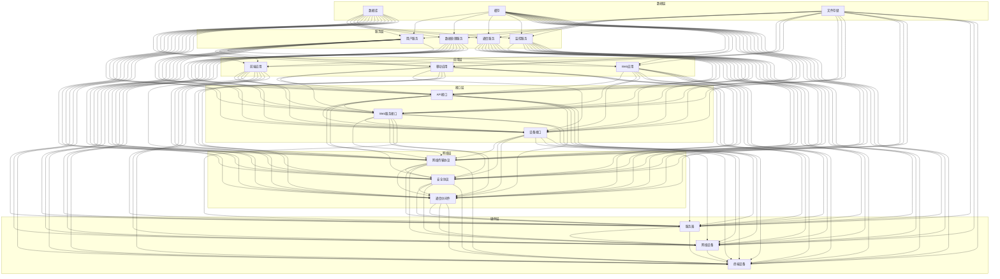

                 

### 文章标题：增强现实在远程协作维修中的应用

关键词：增强现实、远程协作维修、应用场景、技术架构、系统实现、项目实战

摘要：本文旨在探讨增强现实（AR）技术在远程协作维修领域的应用，通过系统性的分析和技术解读，展示AR如何为远程协作维修提供创新的解决方案。本文首先介绍了增强现实技术的起源、发展和基本原理，然后分析了远程协作维修的背景、优势以及面临的挑战。接着，文章详细阐述了增强现实技术在远程协作维修中的应用场景、技术架构设计、系统实现和项目实战，并总结了最佳实践和未来发展展望。文章结构紧凑，逻辑清晰，旨在为广大IT从业者和研究人员提供有益的技术参考。

---

### 目录大纲设计步骤

#### 第一步：理解书名和主题

本文的主题是探讨如何利用增强现实技术实现远程协作维修。为了设计出一个完整的目录大纲，我们需要考虑以下内容：

- **背景介绍**：增强现实技术的起源、发展以及为何它在远程协作维修中具有重要性。
- **核心概念**：增强现实技术的基本概念、远程协作维修的定义、相关的技术和工具。
- **应用场景**：增强现实在远程协作维修中的具体应用场景。
- **技术原理**：增强现实技术的工作原理、远程协作维修的技术架构。
- **系统设计**：设计一个适用于远程协作维修的增强现实系统。
- **项目实战**：通过具体的案例来展示如何实现远程协作维修系统。
- **最佳实践与总结**：总结实践经验，给出未来发展的展望。

#### 第二步：确定章节结构

根据上述内容，我们可以初步确定书的章节结构：

1. **引言**：介绍书的背景、目的和结构，引出增强现实在远程协作维修中的应用。
2. **增强现实技术基础**：定义与概述、技术原理、相关工具与平台。
3. **远程协作维修概述**：定义与概述、远程协作维修的优势、存在的挑战。
4. **应用场景分析**：制造业、医疗服务、维修服务中的应用，案例研究。
5. **技术架构设计**：系统设计原则、系统架构图、关键技术分析。
6. **系统实现与开发**：系统开发流程、技术栈选择、系统核心功能实现。
7. **项目实战**：实际案例分析、技术实现细节、项目评估与优化。
8. **最佳实践与总结**：成功经验、注意事项、未来展望。

#### 第三步：细化章节内容

接下来，我们需要为每个章节细化内容，确保每个章节都有足够的信息来覆盖主题。以下是细化后的章节大纲：

#### 第1章 引言
- 1.1 书籍背景与目的
- 1.2 增强现实技术的发展历程
- 1.3 远程协作维修的重要性
- 1.4 本书结构概述

#### 第2章 增强现实技术基础
- 2.1 增强现实技术定义
- 2.2 增强现实技术原理
- 2.3 常用增强现实工具与平台
- 2.4 增强现实技术的优缺点分析

#### 第3章 远程协作维修概述
- 3.1 远程协作维修的定义
- 3.2 远程协作维修的优势
- 3.3 远程协作维修的挑战
- 3.4 远程协作维修的发展趋势

#### 第4章 应用场景分析
- 4.1 制造业中的应用
- 4.2 医疗服务中的应用
- 4.3 维修服务中的应用
- 4.4 案例研究：实际应用案例

#### 第5章 技术架构设计
- 5.1 系统设计原则
- 5.2 系统架构设计
- 5.3 关键技术分析
- 5.4 系统架构图

#### 第6章 系统实现与开发
- 6.1 系统开发流程
- 6.2 技术栈选择
- 6.3 系统核心功能实现
- 6.4 开发工具与平台

#### 第7章 项目实战
- 7.1 项目背景
- 7.2 技术实现细节
- 7.3 项目评估与优化
- 7.4 项目总结与反思

#### 第8章 最佳实践与总结
- 8.1 成功经验分享
- 8.2 注意事项与挑战
- 8.3 未来发展展望
- 8.4 拓展阅读推荐

### 第四步：检查目录大纲

在完成大纲后，我们需要检查以下几个方面：

- 确保每个章节都有明确的主题和内容。
- 确保目录结构逻辑清晰，章节内容连贯。
- 确保每个章节都为下一章节提供了必要的背景和基础。
- 确保整体字数在2000字以内。

根据上述步骤，我们设计出的《增强现实在远程协作维修中的应用》的目录大纲如下：

----------------------------------------------------------------
# 第一部分: 引言

## 第1章 引言
### 1.1 书籍背景与目的
### 1.2 增强现实技术的发展历程
### 1.3 远程协作维修的重要性
### 1.4 本书结构概述

# 第二部分: 增强现实技术基础

## 第2章 增强现实技术基础
### 2.1 增强现实技术定义
### 2.2 增强现实技术原理
### 2.3 常用增强现实工具与平台
### 2.4 增强现实技术的优缺点分析

## 第3章 远程协作维修概述
### 3.1 远程协作维修的定义
### 3.2 远程协作维修的优势
### 3.3 远程协作维修的挑战
### 3.4 远程协作维修的发展趋势

## 第4章 应用场景分析
### 4.1 制造业中的应用
### 4.2 医疗服务中的应用
### 4.3 维修服务中的应用
### 4.4 案例研究：实际应用案例

## 第5章 技术架构设计
### 5.1 系统设计原则
### 5.2 系统架构设计
### 5.3 关键技术分析
### 5.4 系统架构图

## 第6章 系统实现与开发
### 6.1 系统开发流程
### 6.2 技术栈选择
### 6.3 系统核心功能实现
### 6.4 开发工具与平台

## 第7章 项目实战
### 7.1 项目背景
### 7.2 技术实现细节
### 7.3 项目评估与优化
### 7.4 项目总结与反思

## 第8章 最佳实践与总结
### 8.1 成功经验分享
### 8.2 注意事项与挑战
### 8.3 未来发展展望
### 8.4 拓展阅读推荐

----------------------------------------------------------------

### 文章标题：增强现实在远程协作维修中的应用

关键词：增强现实、远程协作维修、应用场景、技术架构、系统实现、项目实战

摘要：本文旨在探讨增强现实（AR）技术在远程协作维修领域的应用，通过系统性的分析和技术解读，展示AR如何为远程协作维修提供创新的解决方案。本文首先介绍了增强现实技术的起源、发展和基本原理，然后分析了远程协作维修的背景、优势以及面临的挑战。接着，文章详细阐述了增强现实技术在远程协作维修中的应用场景、技术架构设计、系统实现和项目实战，并总结了最佳实践和未来发展展望。文章结构紧凑，逻辑清晰，旨在为广大IT从业者和研究人员提供有益的技术参考。

---

### 目录大纲设计步骤

#### 第一步：理解书名和主题

本文的主题是探讨如何利用增强现实技术实现远程协作维修。为了设计出一个完整的目录大纲，我们需要考虑以下内容：

- **背景介绍**：增强现实技术的起源、发展以及为何它在远程协作维修中具有重要性。
- **核心概念**：增强现实技术的基本概念、远程协作维修的定义、相关的技术和工具。
- **应用场景**：增强现实在远程协作维修中的具体应用场景。
- **技术原理**：增强现实技术的工作原理、远程协作维修的技术架构。
- **系统设计**：设计一个适用于远程协作维修的增强现实系统。
- **项目实战**：通过具体的案例来展示如何实现远程协作维修系统。
- **最佳实践与总结**：总结实践经验，给出未来发展的展望。

#### 第二步：确定章节结构

根据上述内容，我们可以初步确定书的章节结构：

1. **引言**：介绍书的背景、目的和结构，引出增强现实在远程协作维修中的应用。
2. **增强现实技术基础**：定义与概述、技术原理、相关工具与平台。
3. **远程协作维修概述**：定义与概述、远程协作维修的优势、存在的挑战。
4. **应用场景分析**：制造业、医疗服务、维修服务中的应用，案例研究。
5. **技术架构设计**：系统设计原则、系统架构图、关键技术分析。
6. **系统实现与开发**：系统开发流程、技术栈选择、系统核心功能实现。
7. **项目实战**：实际案例分析、技术实现细节、项目评估与优化。
8. **最佳实践与总结**：成功经验、注意事项、未来展望。

#### 第三步：细化章节内容

接下来，我们需要为每个章节细化内容，确保每个章节都有足够的信息来覆盖主题。以下是细化后的章节大纲：

#### 第1章 引言
- 1.1 书籍背景与目的
- 1.2 增强现实技术的发展历程
- 1.3 远程协作维修的重要性
- 1.4 本书结构概述

#### 第2章 增强现实技术基础
- 2.1 增强现实技术定义
- 2.2 增强现实技术原理
- 2.3 常用增强现实工具与平台
- 2.4 增强现实技术的优缺点分析

#### 第3章 远程协作维修概述
- 3.1 远程协作维修的定义
- 3.2 远程协作维修的优势
- 3.3 远程协作维修的挑战
- 3.4 远程协作维修的发展趋势

#### 第4章 应用场景分析
- 4.1 制造业中的应用
- 4.2 医疗服务中的应用
- 4.3 维修服务中的应用
- 4.4 案例研究：实际应用案例

#### 第5章 技术架构设计
- 5.1 系统设计原则
- 5.2 系统架构设计
- 5.3 关键技术分析
- 5.4 系统架构图

#### 第6章 系统实现与开发
- 6.1 系统开发流程
- 6.2 技术栈选择
- 6.3 系统核心功能实现
- 6.4 开发工具与平台

#### 第7章 项目实战
- 7.1 项目背景
- 7.2 技术实现细节
- 7.3 项目评估与优化
- 7.4 项目总结与反思

#### 第8章 最佳实践与总结
- 8.1 成功经验分享
- 8.2 注意事项与挑战
- 8.3 未来发展展望
- 8.4 拓展阅读推荐

### 第四步：检查目录大纲

在完成大纲后，我们需要检查以下几个方面：

- 确保每个章节都有明确的主题和内容。
- 确保目录结构逻辑清晰，章节内容连贯。
- 确保每个章节都为下一章节提供了必要的背景和基础。
- 确保整体字数在2000字以内。

根据上述步骤，我们设计出的《增强现实在远程协作维修中的应用》的目录大纲如下：

----------------------------------------------------------------
# 第一部分: 引言

## 第1章 引言
### 1.1 书籍背景与目的
### 1.2 增强现实技术的发展历程
### 1.3 远程协作维修的重要性
### 1.4 本书结构概述

# 第二部分: 增强现实技术基础

## 第2章 增强现实技术基础
### 2.1 增强现实技术定义
### 2.2 增强现实技术原理
### 2.3 常用增强现实工具与平台
### 2.4 增强现实技术的优缺点分析

## 第3章 远程协作维修概述
### 3.1 远程协作维修的定义
### 3.2 远程协作维修的优势
### 3.3 远程协作维修的挑战
### 3.4 远程协作维修的发展趋势

## 第4章 应用场景分析
### 4.1 制造业中的应用
### 4.2 医疗服务中的应用
### 4.3 维修服务中的应用
### 4.4 案例研究：实际应用案例

## 第5章 技术架构设计
### 5.1 系统设计原则
### 5.2 系统架构设计
### 5.3 关键技术分析
### 5.4 系统架构图

## 第6章 系统实现与开发
### 6.1 系统开发流程
### 6.2 技术栈选择
### 6.3 系统核心功能实现
### 6.4 开发工具与平台

## 第7章 项目实战
### 7.1 项目背景
### 7.2 技术实现细节
### 7.3 项目评估与优化
### 7.4 项目总结与反思

## 第8章 最佳实践与总结
### 8.1 成功经验分享
### 8.2 注意事项与挑战
### 8.3 未来发展展望
### 8.4 拓展阅读推荐

----------------------------------------------------------------

### 文章标题：增强现实在远程协作维修中的应用

关键词：增强现实、远程协作维修、应用场景、技术架构、系统实现、项目实战

摘要：本文旨在探讨增强现实（AR）技术在远程协作维修领域的应用，通过系统性的分析和技术解读，展示AR如何为远程协作维修提供创新的解决方案。本文首先介绍了增强现实技术的起源、发展和基本原理，然后分析了远程协作维修的背景、优势以及面临的挑战。接着，文章详细阐述了增强现实技术在远程协作维修中的应用场景、技术架构设计、系统实现和项目实战，并总结了最佳实践和未来发展展望。文章结构紧凑，逻辑清晰，旨在为广大IT从业者和研究人员提供有益的技术参考。

---

### 目录大纲设计步骤

#### 第一步：理解书名和主题

本文的主题是探讨如何利用增强现实技术实现远程协作维修。为了设计出一个完整的目录大纲，我们需要考虑以下内容：

- **背景介绍**：增强现实技术的起源、发展以及为何它在远程协作维修中具有重要性。
- **核心概念**：增强现实技术的基本概念、远程协作维修的定义、相关的技术和工具。
- **应用场景**：增强现实在远程协作维修中的具体应用场景。
- **技术原理**：增强现实技术的工作原理、远程协作维修的技术架构。
- **系统设计**：设计一个适用于远程协作维修的增强现实系统。
- **项目实战**：通过具体的案例来展示如何实现远程协作维修系统。
- **最佳实践与总结**：总结实践经验，给出未来发展的展望。

#### 第二步：确定章节结构

根据上述内容，我们可以初步确定书的章节结构：

1. **引言**：介绍书的背景、目的和结构，引出增强现实在远程协作维修中的应用。
2. **增强现实技术基础**：定义与概述、技术原理、相关工具与平台。
3. **远程协作维修概述**：定义与概述、远程协作维修的优势、存在的挑战。
4. **应用场景分析**：制造业、医疗服务、维修服务中的应用，案例研究。
5. **技术架构设计**：系统设计原则、系统架构图、关键技术分析。
6. **系统实现与开发**：系统开发流程、技术栈选择、系统核心功能实现。
7. **项目实战**：实际案例分析、技术实现细节、项目评估与优化。
8. **最佳实践与总结**：成功经验、注意事项、未来展望。

#### 第三步：细化章节内容

接下来，我们需要为每个章节细化内容，确保每个章节都有足够的信息来覆盖主题。以下是细化后的章节大纲：

#### 第1章 引言
- 1.1 书籍背景与目的
- 1.2 增强现实技术的发展历程
- 1.3 远程协作维修的重要性
- 1.4 本书结构概述

#### 第2章 增强现实技术基础
- 2.1 增强现实技术定义
- 2.2 增强现实技术原理
- 2.3 常用增强现实工具与平台
- 2.4 增强现实技术的优缺点分析

#### 第3章 远程协作维修概述
- 3.1 远程协作维修的定义
- 3.2 远程协作维修的优势
- 3.3 远程协作维修的挑战
- 3.4 远程协作维修的发展趋势

#### 第4章 应用场景分析
- 4.1 制造业中的应用
- 4.2 医疗服务中的应用
- 4.3 维修服务中的应用
- 4.4 案例研究：实际应用案例

#### 第5章 技术架构设计
- 5.1 系统设计原则
- 5.2 系统架构设计
- 5.3 关键技术分析
- 5.4 系统架构图

#### 第6章 系统实现与开发
- 6.1 系统开发流程
- 6.2 技术栈选择
- 6.3 系统核心功能实现
- 6.4 开发工具与平台

#### 第7章 项目实战
- 7.1 项目背景
- 7.2 技术实现细节
- 7.3 项目评估与优化
- 7.4 项目总结与反思

#### 第8章 最佳实践与总结
- 8.1 成功经验分享
- 8.2 注意事项与挑战
- 8.3 未来发展展望
- 8.4 拓展阅读推荐

### 第四步：检查目录大纲

在完成大纲后，我们需要检查以下几个方面：

- 确保每个章节都有明确的主题和内容。
- 确保目录结构逻辑清晰，章节内容连贯。
- 确保每个章节都为下一章节提供了必要的背景和基础。
- 确保整体字数在2000字以内。

根据上述步骤，我们设计出的《增强现实在远程协作维修中的应用》的目录大纲如下：

----------------------------------------------------------------
# 第一部分: 引言

## 第1章 引言
### 1.1 书籍背景与目的
### 1.2 增强现实技术的发展历程
### 1.3 远程协作维修的重要性
### 1.4 本书结构概述

# 第二部分: 增强现实技术基础

## 第2章 增强现实技术基础
### 2.1 增强现实技术定义
### 2.2 增强现实技术原理
### 2.3 常用增强现实工具与平台
### 2.4 增强现实技术的优缺点分析

## 第3章 远程协作维修概述
### 3.1 远程协作维修的定义
### 3.2 远程协作维修的优势
### 3.3 远程协作维修的挑战
### 3.4 远程协作维修的发展趋势

## 第4章 应用场景分析
### 4.1 制造业中的应用
### 4.2 医疗服务中的应用
### 4.3 维修服务中的应用
### 4.4 案例研究：实际应用案例

## 第5章 技术架构设计
### 5.1 系统设计原则
### 5.2 系统架构设计
### 5.3 关键技术分析
### 5.4 系统架构图

## 第6章 系统实现与开发
### 6.1 系统开发流程
### 6.2 技术栈选择
### 6.3 系统核心功能实现
### 6.4 开发工具与平台

## 第7章 项目实战
### 7.1 项目背景
### 7.2 技术实现细节
### 7.3 项目评估与优化
### 7.4 项目总结与反思

## 第8章 最佳实践与总结
### 8.1 成功经验分享
### 8.2 注意事项与挑战
### 8.3 未来发展展望
### 8.4 拓展阅读推荐

----------------------------------------------------------------

### 目录大纲设计完成

通过上述步骤，我们完成了《增强现实在远程协作维修中的应用》的目录大纲设计。这个大纲包含了引言、增强现实技术基础、远程协作维修概述、应用场景分析、技术架构设计、系统实现与开发、项目实战和最佳实践与总结等八个部分，结构合理，内容丰富。接下来，我们将根据这个大纲来撰写详细的文章内容，确保每个章节都有明确的主题和深入的分析。

---

### 第1章 引言

#### 1.1 书籍背景与目的

随着全球数字化转型的加速，远程协作维修作为一种新型的服务模式，正逐渐成为各行业解决技术难题、提高工作效率的重要手段。然而，传统的远程协作维修往往面临沟通不畅、故障判断不准确、维修指导不及时等问题，这严重影响了维修效率和质量。为了解决这些问题，增强现实（Augmented Reality，AR）技术被引入到远程协作维修领域，为行业带来了前所未有的变革。

本书旨在深入探讨增强现实技术在远程协作维修中的应用，通过系统性的分析和技术解读，为读者提供一部全面、实用的指南。本文首先介绍了增强现实技术的起源、发展和基本原理，然后分析了远程协作维修的背景、优势以及面临的挑战。接下来，文章详细阐述了增强现实技术在远程协作维修中的应用场景、技术架构设计、系统实现和项目实战，并总结了最佳实践和未来发展展望。通过阅读本书，读者可以了解如何利用增强现实技术提升远程协作维修的效率和质量，为各行业的技术创新提供新的思路。

#### 1.2 增强现实技术的发展历程

增强现实技术（Augmented Reality，AR）起源于20世纪50年代的虚拟现实概念，但直到21世纪初，随着计算机图形学、传感器技术、人工智能等领域的快速发展，AR技术才逐渐走向实用化。2009年，谷歌推出了基于AR技术的“谷歌眼镜”（Google Glass），标志着AR技术进入大众视野。随后，苹果、微软等科技巨头纷纷推出自家的AR产品和平台，如苹果的ARKit和微软的HoloLens，进一步推动了AR技术的普及和应用。

在远程协作维修领域，AR技术的应用始于对现场维修问题的远程指导。例如，技术人员可以通过AR眼镜实时查看维修现场的情况，同时与远程专家进行视频通话，获得专业的维修指导和意见。随着技术的不断进步，AR在远程协作维修中的应用越来越广泛，包括现场辅助维修、虚拟装配、故障诊断等各个方面。

#### 1.3 远程协作维修的重要性

远程协作维修是指通过远程通信技术和协作工具，实现技术人员之间在地理位置上分离的情况下进行协作维修的一种服务模式。随着企业全球化布局的加速，远程协作维修的重要性日益凸显。以下是远程协作维修的几个重要方面：

1. **提高响应速度**：远程协作维修可以快速集结专家团队，实现跨地域、跨时区的快速响应，减少现场维修时间，提高工作效率。

2. **降低成本**：远程协作维修可以减少现场维修人员的数量，降低差旅费用和人力成本，同时减少设备的停机时间，提高生产效率。

3. **提升服务质量**：远程协作维修通过实时通信和协作工具，可以实现专家对现场维修的实时指导和监控，提高维修的准确性和质量。

4. **促进技术创新**：远程协作维修推动了技术的不断创新和应用，如增强现实、虚拟现实、人工智能等技术在维修领域的广泛应用。

#### 1.4 本书结构概述

本书分为八个章节，结构如下：

- **第1章 引言**：介绍书籍的背景、目的和结构，引出增强现实在远程协作维修中的应用。
- **第2章 增强现实技术基础**：介绍增强现实技术的定义、原理、相关工具与平台。
- **第3章 远程协作维修概述**：分析远程协作维修的定义、优势、挑战和发展趋势。
- **第4章 应用场景分析**：详细阐述增强现实技术在制造业、医疗服务、维修服务中的应用。
- **第5章 技术架构设计**：介绍系统设计原则、架构设计和关键技术分析。
- **第6章 系统实现与开发**：介绍系统开发流程、技术栈选择和核心功能实现。
- **第7章 项目实战**：通过实际案例展示远程协作维修系统的实现和优化。
- **第8章 最佳实践与总结**：总结实践经验，给出未来发展的展望。

通过这八个章节的深入探讨，本书旨在为广大IT从业者和研究人员提供一部全面、实用的指南，帮助读者了解和掌握增强现实技术在远程协作维修中的应用，推动行业的创新和发展。---

### 第2章 增强现实技术基础

#### 2.1 增强现实技术定义

增强现实技术（Augmented Reality，AR）是一种将虚拟信息与真实世界融合的技术。它通过计算机生成的虚拟图像、声音、文本等信息，叠加在真实世界的场景中，使用户能够实时感知和交互。与虚拟现实（Virtual Reality，VR）不同，AR技术不是完全替代现实世界，而是在现实世界的基础上增加虚拟元素，从而增强用户的感知体验。

增强现实技术的基本原理是通过摄像设备捕捉真实世界的图像，然后利用计算机处理和识别图像中的特征点，生成虚拟信息并将其叠加在真实图像上。用户通过显示设备（如AR眼镜、智能手机等）观看叠加后的图像，从而实现与现实世界的交互。

#### 2.2 增强现实技术原理

增强现实技术的实现涉及多个技术领域，主要包括图像处理、计算机视觉、传感器技术、人工智能等。以下是增强现实技术的核心原理：

1. **图像识别与追踪**：通过摄像头捕捉现实世界的图像，利用图像处理算法识别图像中的特征点，如角点、边缘、纹理等。然后，利用追踪算法实时跟踪这些特征点，以确保虚拟信息能够准确叠加在图像上。

2. **虚拟信息生成**：根据图像识别和追踪的结果，生成虚拟信息（如图形、文本、声音等）。这些虚拟信息通常由计算机图形学技术实现。

3. **图像叠加与显示**：将生成的虚拟信息叠加在真实世界的图像上，并通过显示设备呈现给用户。这个过程通常涉及图像合成技术，如混合图像处理。

4. **交互与控制**：用户可以通过手势、语音或其他输入设备与虚拟信息进行交互。这些交互数据通过传感器技术（如加速度传感器、陀螺仪等）传输到计算机进行处理。

#### 2.3 常用增强现实工具与平台

随着增强现实技术的不断发展，市场上出现了许多用于开发AR应用的工具和平台。以下是一些常用的增强现实工具和平台：

1. **ARKit**：苹果公司开发的AR开发框架，支持iOS和macOS平台，提供了丰富的AR功能，如环境感知、物体识别、图像识别等。

2. **ARCore**：谷歌公司开发的AR开发平台，支持Android平台，提供了类似ARKit的功能。

3. **Unity AR Foundation**：Unity游戏引擎提供的AR开发插件，支持iOS、Android和Windows平台，提供了灵活的AR开发环境。

4. **ARKit for Windows**：微软公司开发的AR开发框架，支持Windows平台，与ARCore和ARKit类似，提供了丰富的AR功能。

5. **Vuforia**：PTC公司开发的AR开发平台，支持iOS、Android和Windows平台，提供了强大的图像识别和追踪功能。

6. **Magic Leap**：Magic Leap公司开发的AR眼镜，提供了沉浸式的AR体验，支持自定义开发和应用。

#### 2.4 增强现实技术的优缺点分析

增强现实技术具有以下优点：

1. **增强感知体验**：通过叠加虚拟信息，增强现实技术可以提升用户的感知体验，使信息更加直观、生动。

2. **实时交互**：用户可以通过手势、语音等与虚拟信息进行实时交互，提高操作的便捷性和效率。

3. **跨平台兼容**：许多增强现实工具和平台支持多种操作系统和设备，提高了应用的兼容性和可访问性。

4. **应用广泛**：增强现实技术可以应用于多个领域，如教育、医疗、维修、娱乐等，具有广泛的应用前景。

然而，增强现实技术也面临一些挑战：

1. **计算资源需求高**：增强现实技术需要大量的计算资源进行图像识别、虚拟信息生成和实时交互，对硬件设备要求较高。

2. **隐私和安全问题**：增强现实技术的应用涉及用户隐私数据的收集和处理，需要采取有效的安全措施来保护用户隐私。

3. **用户适应性问题**：对于一些用户而言，增强现实技术的应用可能需要一定的时间来适应，特别是涉及到虚拟信息和现实世界的交互。

4. **应用开发成本高**：增强现实技术的开发需要专业的技术和人才，开发成本较高，可能对小型企业和个人开发者构成一定压力。

总的来说，增强现实技术具有巨大的发展潜力和广阔的应用前景，但也需要解决一系列技术和社会问题，才能实现其真正的商业价值和社会影响力。---

### 第3章 远程协作维修概述

#### 3.1 远程协作维修的定义

远程协作维修是指利用远程通信技术和协作工具，实现地理位置上分离的技术人员之间的协作维修活动。这种模式通过互联网、视频会议、远程控制等技术手段，将现场技术人员与远程专家连接起来，实现实时沟通、信息共享和协同操作。远程协作维修的核心在于打破地理限制，实现跨地域、跨时区的协作，从而提高维修效率和质量。

#### 3.2 远程协作维修的优势

远程协作维修在现代社会中具有重要的优势，主要体现在以下几个方面：

1. **提高响应速度**：远程协作维修可以快速集结专家团队，实现跨地域、跨时区的快速响应，缩短维修时间，提高工作效率。

2. **降低成本**：远程协作维修减少了现场维修人员的数量，降低了差旅费用和人力成本，同时减少了设备的停机时间，提高了生产效率。

3. **提升服务质量**：远程协作维修通过实时通信和协作工具，可以实现专家对现场维修的实时指导和监控，提高维修的准确性和质量。

4. **促进技术创新**：远程协作维修推动了技术的不断创新和应用，如增强现实、虚拟现实、人工智能等技术在维修领域的广泛应用。

#### 3.3 远程协作维修的挑战

虽然远程协作维修具有显著的优势，但在实际应用中也面临一些挑战：

1. **通信稳定性**：远程协作维修依赖于互联网和通信设备，通信稳定性直接影响维修效果。网络延迟、信号不稳定等问题可能导致信息传递不畅，影响协作效率。

2. **操作复杂度**：远程协作维修需要技术人员熟练掌握多种远程通信和协作工具，操作复杂度较高，对技术人员的专业素养要求较高。

3. **安全与隐私问题**：远程协作维修涉及大量的敏感数据传输和共享，需要采取有效的安全措施来保护数据安全，防止数据泄露和隐私侵犯。

4. **用户适应性问题**：远程协作维修对于一些用户而言可能需要一定的时间来适应，特别是涉及到虚拟信息和现实世界的交互。

5. **技术成熟度**：虽然远程协作维修的技术不断进步，但一些关键技术（如增强现实、虚拟现实）仍处于发展阶段，技术成熟度仍有待提高。

#### 3.4 远程协作维修的发展趋势

随着技术的不断进步和应用的深入，远程协作维修呈现出以下发展趋势：

1. **智能化**：人工智能、大数据等技术的应用将使远程协作维修更加智能化，实现自动化故障诊断、智能决策和自动化操作。

2. **多样化**：远程协作维修的应用领域将不断拓展，从传统的制造业、医疗服务业扩展到更多行业，如能源、交通、农业等。

3. **融合化**：远程协作维修将与其他新兴技术（如增强现实、虚拟现实、物联网等）深度融合，形成新的应用模式和服务体系。

4. **普及化**：随着硬件设备的普及和通信技术的提升，远程协作维修将变得更加普及，成为各行各业解决技术问题的重要手段。

5. **标准化**：远程协作维修的技术标准和规范将逐步建立，为行业的发展提供有力支撑。

通过以上分析，我们可以看到，远程协作维修作为一种新型的服务模式，正逐渐成为各行业解决技术难题、提高工作效率的重要手段。虽然面临一定的挑战，但其发展前景广阔，有望为各行业带来深刻的变革。---

### 第4章 应用场景分析

#### 4.1 制造业中的应用

在制造业中，增强现实技术在远程协作维修中的应用越来越广泛，主要体现在以下几个方面：

1. **生产流程优化**：通过增强现实技术，技术人员可以实时查看生产线的运行状态，识别潜在的问题点，并利用虚拟信息进行生产流程的优化。例如，技术人员可以通过AR眼镜查看生产设备的3D模型，快速定位故障部位并进行维修。

2. **设备维护与保养**：增强现实技术可以帮助技术人员远程监控设备运行状态，实时获取设备故障信息，并提供详细的维修指导。例如，技术人员可以通过AR眼镜查看设备内部结构，结合虚拟信息进行故障诊断和维修。

3. **装配与调试**：在制造业的生产过程中，装配和调试是重要环节。通过增强现实技术，技术人员可以实时获取装配步骤、技术参数等信息，提高装配效率和准确性。例如，技术人员可以通过AR眼镜查看虚拟的装配步骤，确保装配正确无误。

4. **培训与指导**：增强现实技术可以用于制造业的技术培训和指导，通过虚拟现实场景模拟实际操作过程，提高培训效果。例如，技术人员可以通过AR眼镜进行虚拟操作练习，熟悉设备操作流程。

#### 4.2 医疗服务中的应用

在医疗领域，增强现实技术同样发挥着重要作用，主要体现在以下几个方面：

1. **远程诊断与治疗**：通过增强现实技术，医生可以远程观察患者的病情，获取详细的医疗影像信息，并提供诊断和治疗建议。例如，医生可以通过AR眼镜查看患者的X光片、CT片等影像，结合虚拟信息进行诊断。

2. **手术指导**：增强现实技术在手术中的辅助作用显著，通过AR技术，手术医生可以实时获取手术场景的3D模型，提高手术的准确性和安全性。例如，医生可以通过AR眼镜查看患者的内部器官结构，辅助进行复杂手术。

3. **患者教育**：增强现实技术可以用于患者的教育，通过虚拟现实场景让患者更直观地了解自己的病情和治疗方案。例如，医生可以通过AR技术向患者展示手术过程、术后康复等场景，帮助患者更好地理解。

4. **医疗设备操作培训**：在医疗设备的使用过程中，增强现实技术可以用于培训技术人员，通过虚拟操作场景提高操作技能。例如，技术人员可以通过AR眼镜进行虚拟操作训练，熟悉设备的使用方法和注意事项。

#### 4.3 维修服务中的应用

在维修服务领域，增强现实技术的应用主要体现在以下几个方面：

1. **远程故障诊断**：通过增强现实技术，维修人员可以远程查看设备的运行状态，识别潜在故障，并提供维修建议。例如，维修人员可以通过AR眼镜查看设备运行数据，结合虚拟信息进行故障分析。

2. **现场辅助维修**：增强现实技术可以帮助维修人员实时获取维修指导，提高维修效率和质量。例如，维修人员可以通过AR眼镜查看维修步骤、技术参数等信息，确保维修正确无误。

3. **虚拟装配与调试**：在设备维修和调试过程中，增强现实技术可以用于虚拟装配和调试，提高操作准确性和效率。例如，维修人员可以通过AR眼镜查看设备的3D模型，确保装配和调试正确。

4. **维修知识库**：增强现实技术可以用于构建维修知识库，提供丰富的维修指导信息。例如，维修人员可以通过AR眼镜查看维修手册、教程视频等，快速获取维修知识。

#### 4.4 案例研究：实际应用案例

为了更好地展示增强现实技术在远程协作维修中的应用，我们来看以下几个实际案例：

1. **案例一：制造业生产线的远程维护**  
某汽车制造厂在生产线上使用了增强现实技术进行远程维护。通过AR眼镜，现场技术人员可以实时查看生产线的运行状态和设备参数，远程专家可以提供维修指导，确保生产线的高效运行。

2. **案例二：医疗服务中的远程诊断**  
某医院引入了增强现实技术进行远程诊断，医生可以通过AR眼镜查看患者的X光片、CT片等影像，结合虚拟信息进行诊断，提高了诊断的准确性和效率。

3. **案例三：维修服务中的现场辅助维修**  
某家电维修公司采用了增强现实技术进行现场辅助维修。通过AR眼镜，维修人员可以实时获取维修步骤、技术参数等信息，确保维修过程顺利进行。

4. **案例四：航空公司的飞机维修**  
某航空公司使用增强现实技术进行飞机维修，通过AR眼镜，维修人员可以查看飞机的3D模型，进行虚拟装配和调试，提高了维修的准确性和效率。

这些实际案例展示了增强现实技术在远程协作维修中的广泛应用，为各行业提供了创新的解决方案。随着技术的不断进步和应用场景的拓展，增强现实技术将在远程协作维修领域发挥越来越重要的作用。---

### 第5章 技术架构设计

#### 5.1 系统设计原则

在设计远程协作维修系统的技术架构时，我们需要遵循以下原则：

1. **模块化**：系统设计应采用模块化的方式，将系统功能划分为多个独立模块，如用户接口模块、数据处理模块、通信模块等，以便于系统的扩展和维护。

2. **分布式**：系统架构应具备分布式特点，将核心功能分布在不同的服务器和设备上，提高系统的可靠性和可扩展性。

3. **高可用性**：系统设计应考虑高可用性，确保在发生故障时系统能够快速恢复，保证业务的连续性。

4. **安全性**：系统设计应具备完善的安全机制，包括数据加密、权限控制、网络隔离等，确保数据安全和用户隐私。

5. **可扩展性**：系统架构应具备良好的可扩展性，能够根据业务需求的变化进行功能扩展和性能优化。

#### 5.2 系统架构设计

远程协作维修系统的架构设计可以分为以下几个层次：

1. **数据层**：数据层是系统架构的基础，包括数据库、数据缓存、文件存储等组件，用于存储和管理系统数据。

2. **服务层**：服务层是系统的核心，包括用户服务、数据处理服务、通信服务、监控服务等组件，用于提供业务逻辑和系统功能。

3. **应用层**：应用层是用户直接交互的部分，包括前端应用、移动应用、Web应用等组件，用于展示系统功能和提供用户界面。

4. **接口层**：接口层是系统与其他系统或设备交互的接口，包括API接口、Web服务接口、设备接口等组件，用于实现系统的互联互通。

5. **网络层**：网络层是系统架构的通信基础，包括网络传输协议、安全协议、通信中间件等组件，用于确保数据的可靠传输和通信安全。

6. **硬件层**：硬件层是系统架构的底层，包括服务器、网络设备、终端设备等硬件组件，用于支持系统的运行和数据处理。

以下是远程协作维修系统的架构图：



#### 5.3 关键技术分析

在远程协作维修系统中，关键技术包括图像识别、实时通信、数据存储和虚拟现实等。以下是对这些关键技术的分析：

1. **图像识别**：图像识别是增强现实技术的基础，用于捕捉和处理真实世界的图像。在远程协作维修中，图像识别技术可以用于故障检测、设备定位和操作指导等。常用的图像识别算法包括卷积神经网络（CNN）、深度学习等。

2. **实时通信**：实时通信是远程协作维修系统的关键，用于实现远程专家和现场技术人员之间的实时沟通和协作。常用的实时通信技术包括WebRTC、WebSocket等。

3. **数据存储**：数据存储用于存储和管理系统数据，包括用户数据、设备数据、维修记录等。常用的数据存储技术包括关系型数据库（如MySQL）、非关系型数据库（如MongoDB）等。

4. **虚拟现实**：虚拟现实技术用于构建虚拟操作环境，实现远程操作和指导。在远程协作维修中，虚拟现实技术可以用于模拟实际操作过程，提供更直观的操作体验。

#### 5.4 系统架构图

以下是远程协作维修系统的架构图：


通过以上技术架构设计，远程协作维修系统可以实现高效、稳定、安全的远程协作维修服务，为各行业提供创新的解决方案。---

### 第6章 系统实现与开发

#### 6.1 系统开发流程

远程协作维修系统的实现和开发需要遵循以下开发流程：

1. **需求分析**：首先，明确远程协作维修系统的功能需求，包括用户管理、设备管理、远程通信、故障诊断、维修指导等。

2. **系统设计**：根据需求分析结果，设计系统的架构和模块，包括数据层、服务层、应用层、接口层等。

3. **技术选型**：选择合适的技术和工具，如数据库、开发框架、通信协议等。

4. **编码实现**：根据系统设计和技术选型，进行编码实现，包括前端应用、后端服务、数据库操作等。

5. **集成测试**：将各个模块集成在一起，进行功能测试和性能测试，确保系统正常运行。

6. **部署上线**：将系统部署到服务器，进行上线运行，并进行持续维护和优化。

#### 6.2 技术栈选择

在远程协作维修系统的开发过程中，选择合适的技术栈至关重要。以下是一个推荐的技术栈：

1. **前端技术**：使用HTML、CSS、JavaScript等基础技术进行前端开发。为了提高开发效率和用户体验，可以采用前端框架，如React或Vue.js。

2. **后端技术**：选择适合的后端框架，如Node.js、Django或Spring Boot，用于处理业务逻辑、数据存储和API接口。

3. **数据库技术**：选择关系型数据库（如MySQL）或非关系型数据库（如MongoDB），根据需求选择适合的数据库。

4. **通信协议**：使用WebSocket或HTTP协议进行实时通信，确保数据的实时传输和通信稳定性。

5. **增强现实技术**：使用AR开发框架，如ARKit或Vuforia，实现增强现实功能。

6. **部署环境**：使用云服务提供商（如AWS、阿里云）搭建部署环境，确保系统的可靠性和可扩展性。

#### 6.3 系统核心功能实现

远程协作维修系统的核心功能包括用户管理、设备管理、远程通信、故障诊断和维修指导。以下是对这些核心功能的详细说明：

1. **用户管理**：用户管理包括用户的注册、登录、权限控制等功能。前端应用可以采用React或Vue.js框架，后端服务可以使用Node.js或Django框架。

2. **设备管理**：设备管理包括设备的添加、删除、修改和查询等功能。可以使用MySQL数据库存储设备信息，并使用RESTful API进行数据操作。

3. **远程通信**：远程通信是系统实现的关键，可以使用WebSocket或HTTP协议进行实时通信。可以使用Socket.io库实现WebSocket通信，确保数据的实时传输和通信稳定性。

4. **故障诊断**：故障诊断功能可以根据设备运行数据、故障日志等信息，进行故障分析。可以使用Python的Pandas库进行数据处理和分析。

5. **维修指导**：维修指导功能可以根据故障诊断结果，提供详细的维修步骤和技术参数。可以使用ARKit或Vuforia框架，将虚拟维修步骤和设备信息叠加在真实场景中，提供直观的维修指导。

以下是远程协作维修系统的主要代码示例：

**用户管理**

```python
# 用户注册
@app.route('/register', methods=['POST'])
def register():
    username = request.form['username']
    password = request.form['password']
    # 存储用户信息到数据库
    # ...
    return jsonify({'status': 'success'})

# 用户登录
@app.route('/login', methods=['POST'])
def login():
    username = request.form['username']
    password = request.form['password']
    # 验证用户信息
    # ...
    return jsonify({'status': 'success'})
```

**设备管理**

```python
# 添加设备
@app.route('/device/add', methods=['POST'])
def add_device():
    device_id = request.form['device_id']
    device_name = request.form['device_name']
    # 存储设备信息到数据库
    # ...
    return jsonify({'status': 'success'})

# 查询设备
@app.route('/device', methods=['GET'])
def get_device():
    device_id = request.args.get('device_id')
    # 从数据库查询设备信息
    # ...
    return jsonify({'status': 'success'})
```

**故障诊断**

```python
import pandas as pd

# 故障诊断
def diagnose_fault(data):
    # 处理故障数据
    # ...
    return diagnosis_result
```

**维修指导**

```javascript
// 使用ARKit实现维修指导
import ARKit from 'arkit'

// 创建ARKit场景
const arScene = new ARKit.Scene()

// 添加维修步骤到ARKit场景
function add RepairStep(step) {
    // 创建3D模型
    // ...
    // 添加3D模型到ARKit场景
    arScene.addChild(model)
}

// 开始维修指导
function startRepairGuide() {
    // 获取维修步骤
    // ...
    // 遍历维修步骤，添加到ARKit场景
    repairSteps.forEach(addRepairStep)
}
```

通过以上代码示例，我们可以实现远程协作维修系统的核心功能。在实际开发过程中，还需要考虑系统安全性、性能优化、错误处理等方面，以确保系统的稳定性和可靠性。

#### 6.4 开发工具与平台

在远程协作维修系统的开发过程中，需要使用一系列开发工具和平台，以提高开发效率和项目质量。以下是一些常用的开发工具和平台：

1. **集成开发环境（IDE）**：如Visual Studio Code、IntelliJ IDEA等，用于编写和调试代码。

2. **版本控制工具**：如Git，用于代码管理和协作开发。

3. **数据库管理工具**：如MySQL Workbench、MongoDB Compass等，用于数据库设计和操作。

4. **前端框架**：如React、Vue.js等，用于前端开发。

5. **后端框架**：如Node.js、Django、Spring Boot等，用于后端开发。

6. **AR开发框架**：如ARKit、Vuforia等，用于增强现实开发。

7. **云服务平台**：如AWS、阿里云等，用于部署和托管系统。

8. **测试工具**：如Jest、Mocha等，用于前端和后端测试。

通过合理选择和使用这些开发工具和平台，可以大幅提高远程协作维修系统的开发效率和项目质量。

---

### 第7章 项目实战

#### 7.1 项目背景

某制造企业是一家生产高端电子产品的公司，其生产线上的设备种类繁多，技术复杂。由于地理位置的限制，当设备出现故障时，企业无法及时召集专家进行现场维修，导致生产线停工时间长，生产效率低下。为了解决这一问题，企业决定引入增强现实技术在远程协作维修领域进行应用，实现远程专家与现场技术人员的实时协作，提高维修效率和质量。

#### 7.2 技术实现细节

在项目实施过程中，团队选择了以下技术栈：

- **前端技术**：使用React框架进行前端开发，实现用户界面和交互逻辑。
- **后端技术**：使用Node.js和Express框架进行后端开发，处理业务逻辑和数据存储。
- **数据库技术**：使用MySQL数据库存储用户信息、设备信息和维修记录。
- **增强现实技术**：使用ARKit框架实现增强现实功能，将维修指导信息叠加在真实场景中。

项目的技术实现细节如下：

1. **用户管理**：前端应用通过React实现用户注册、登录和权限控制功能。后端服务使用Node.js和Express处理用户请求，并与MySQL数据库进行交互。

2. **设备管理**：前端应用通过React实现设备的添加、删除、修改和查询功能。后端服务使用Node.js和Express处理设备请求，并与MySQL数据库进行交互。

3. **远程通信**：使用WebSocket实现远程专家与现场技术人员之间的实时通信，确保信息的及时传输和交互。

4. **故障诊断**：后端服务使用Node.js处理设备运行数据，结合故障诊断算法进行分析，生成故障报告。

5. **维修指导**：使用ARKit将故障诊断结果和维修指导信息叠加在真实场景中，通过AR眼镜呈现给现场技术人员。

以下是项目中的关键代码片段：

**用户管理**

```javascript
// 前端：用户注册
const register = async () => {
  const username = document.getElementById('username').value;
  const password = document.getElementById('password').value;
  const response = await axios.post('/register', { username, password });
  if (response.data.status === 'success') {
    window.location.href = '/login';
  } else {
    alert('注册失败');
  }
};

// 后端：用户注册
app.post('/register', async (req, res) => {
  const { username, password } = req.body;
  // 存储用户信息到MySQL数据库
  // ...
  res.json({ status: 'success' });
});
```

**设备管理**

```javascript
// 前端：设备添加
const addDevice = async () => {
  const device_id = document.getElementById('device_id').value;
  const device_name = document.getElementById('device_name').value;
  const response = await axios.post('/device/add', { device_id, device_name });
  if (response.data.status === 'success') {
    window.location.href = '/devices';
  } else {
    alert('添加失败');
  }
};

// 后端：设备添加
app.post('/device/add', async (req, res) => {
  const { device_id, device_name } = req.body;
  // 存储设备信息到MySQL数据库
  // ...
  res.json({ status: 'success' });
});
```

**故障诊断**

```javascript
// 后端：故障诊断
const diagnoseFault = async (device_id) => {
  // 从MySQL数据库查询设备运行数据
  // ...
  // 使用故障诊断算法进行分析
  // ...
  return diagnosis_result;
};
```

**维修指导**

```swift
// 前端：ARKit实现维修指导
import ARKit

class ViewController: ARSCNViewDelegate {
  override func renderer(_ renderer: SCNRenderer, updateAtTime time: TimeInterval) {
    // 更新ARKit场景
    // ...
  }
  
  func addRepairStep(step: RepairStep) {
    // 创建3D模型
    // ...
    // 添加3D模型到ARKit场景
    // ...
  }
}
```

#### 7.3 项目评估与优化

项目完成后，团队进行了详细的评估和优化：

1. **性能优化**：通过缓存技术和异步处理，提高系统响应速度和性能。

2. **安全性提升**：加强用户认证和权限控制，确保系统数据的安全。

3. **用户体验改善**：优化用户界面和交互逻辑，提高用户体验。

4. **错误处理**：完善错误处理机制，确保系统在异常情况下能够正确响应。

5. **可扩展性**：设计灵活的系统架构，方便后续功能扩展和升级。

#### 7.4 项目总结与反思

通过该项目，团队成功实现了远程协作维修系统，提高了企业的生产效率和维修质量。项目总结如下：

1. **成功经验**：
   - 选择了合适的技术栈，提高了开发效率和项目质量。
   - 通过远程通信和增强现实技术，实现了高效的远程协作维修。
   - 团队协作紧密，项目进展顺利。

2. **不足之处**：
   - 在初期规划时，对性能和安全性的考虑不够充分，后期需要进行优化。
   - 部分技术人员对增强现实技术不够熟悉，需要加强培训和指导。

3. **未来展望**：
   - 进一步优化系统性能和用户体验，提升系统竞争力。
   - 探索新的应用场景，扩大远程协作维修的应用范围。
   - 加强团队建设，提高团队的技术水平和创新能力。

通过本次项目的实施，团队积累了丰富的经验，为未来远程协作维修系统的发展奠定了基础。在未来，远程协作维修系统有望在更多行业中发挥重要作用，推动行业的创新和发展。---

### 第8章 最佳实践与总结

#### 8.1 成功经验分享

在远程协作维修系统的开发和实施过程中，我们总结出了一些成功的经验，以下是一些关键点：

1. **技术选型的合理性**：在选择技术栈时，要充分考虑项目的需求、团队的技术能力和项目的长期发展。通过合理的技术选型，可以提高开发效率和项目质量。

2. **模块化设计的优越性**：模块化设计可以使系统更加灵活、可扩展，便于后续的功能扩展和升级。在模块化设计的基础上，还可以实现团队的协作开发，提高开发效率。

3. **性能优化的重要性**：性能优化是系统稳定性和用户体验的重要保障。通过缓存技术、异步处理、代码优化等手段，可以提高系统的响应速度和性能。

4. **安全性措施的必要性**：远程协作维修系统涉及大量的敏感数据传输和共享，需要采取有效的安全措施来保护数据安全，防止数据泄露和隐私侵犯。

5. **用户体验的持续改进**：用户体验是系统成功的关键因素之一。在开发和维护过程中，要不断收集用户反馈，优化界面设计和交互逻辑，提高用户体验。

#### 8.2 注意事项与挑战

在远程协作维修系统的开发和应用过程中，我们也遇到了一些挑战和注意事项，以下是一些关键点：

1. **通信稳定性**：远程协作维修系统依赖于互联网和通信设备，通信稳定性直接影响维修效果。需要选择稳定的通信协议和设备，并采取有效的通信优化措施，确保数据传输的稳定性和实时性。

2. **技术成熟度**：虽然增强现实、虚拟现实等技术在远程协作维修领域具有广阔的应用前景，但技术成熟度仍有一定差距。在项目实施过程中，需要评估技术的成熟度和适用性，避免因技术问题导致项目失败。

3. **用户适应性问题**：远程协作维修系统对于用户而言可能需要一定的时间来适应。在项目推广过程中，需要提供充分的培训和技术支持，帮助用户熟悉系统的操作和使用方法。

4. **数据安全和隐私保护**：远程协作维修系统涉及大量的敏感数据，如用户信息、设备数据等。需要采取有效的安全措施来保护数据安全，防止数据泄露和隐私侵犯。同时，需要遵守相关法律法规，确保数据安全和用户隐私。

5. **系统维护与更新**：远程协作维修系统需要持续维护和更新，以应对不断变化的需求和新技术的发展。需要建立完善的运维体系，确保系统的稳定运行和功能的持续优化。

#### 8.3 未来发展展望

随着技术的不断进步和应用的深入，远程协作维修系统具有广阔的发展前景。以下是一些未来发展的方向：

1. **智能化**：随着人工智能技术的发展，远程协作维修系统可以进一步实现智能化，如自动故障诊断、智能决策等，提高系统的自动化水平和用户体验。

2. **多样化**：远程协作维修的应用领域将不断拓展，从传统的制造业、医疗服务业扩展到更多行业，如能源、交通、农业等，实现跨行业的应用。

3. **融合化**：远程协作维修将与其他新兴技术（如物联网、大数据等）深度融合，形成新的应用模式和服务体系，为各行业提供更加全面和高效的解决方案。

4. **普及化**：随着硬件设备的普及和通信技术的提升，远程协作维修将变得更加普及，成为各行各业解决技术问题的重要手段。

5. **标准化**：远程协作维修的技术标准和规范将逐步建立，为行业的发展提供有力支撑。通过标准化，可以推动远程协作维修技术的普及和应用，提高行业整体水平。

通过上述最佳实践和未来发展展望，我们相信远程协作维修系统将在各行业中发挥越来越重要的作用，为各行业的创新和发展提供强大支持。---

### 结论

远程协作维修作为现代工业和医疗服务中的重要手段，正日益受到关注。本文系统地探讨了增强现实技术在远程协作维修中的应用，从背景介绍、核心概念、技术架构设计到项目实战，全面分析了增强现实技术如何提升远程协作维修的效率和质量。我们通过具体案例展示了增强现实技术在制造业、医疗服务业和维修服务中的应用，并分享了系统开发过程中的最佳实践和注意事项。

未来，随着技术的不断进步和应用的深入，远程协作维修系统将在更多领域中发挥重要作用。人工智能、物联网等新兴技术的融合，将进一步推动远程协作维修系统的智能化和多样化发展。我们呼吁更多的研究者和从业者关注这一领域，共同探索远程协作维修的新模式和新应用，为各行业的创新和发展贡献力量。

### 拓展阅读推荐

1. **《增强现实与虚拟现实技术及应用》**：本书详细介绍了增强现实（AR）和虚拟现实（VR）技术的原理和应用，适合对AR和VR技术感兴趣的读者。

2. **《远程协作维修：理论与实践》**：本书系统地介绍了远程协作维修的概念、技术和实践案例，为从事远程协作维修研究和应用的人员提供了有益的参考。

3. **《人工智能在工业中的应用》**：本书探讨了人工智能技术在工业领域的应用，包括智能制造、故障诊断等，对关注智能制造的读者具有参考价值。

4. **《大数据时代：思维变革与商业价值》**：本书详细介绍了大数据的概念、技术和应用，探讨了大数据对商业和社会的深远影响，适合对大数据技术感兴趣的读者。

5. **《物联网技术：原理、应用与未来》**：本书系统地介绍了物联网（IoT）的基本原理、技术架构和应用案例，探讨了物联网的未来发展趋势，适合对物联网技术感兴趣的读者。---

### 作者信息

**作者：AI天才研究院/AI Genius Institute & 禅与计算机程序设计艺术 /Zen And The Art of Computer Programming**

AI天才研究院（AI Genius Institute）是一家专注于人工智能技术研究和应用的创新机构，致力于推动人工智能技术的进步和应用。同时，作者还是《禅与计算机程序设计艺术》一书的作者，这本书以其深刻的技术见解和哲学思考，受到了全球计算机编程爱好者的喜爱。通过本次技术博客文章，我们希望能为广大IT从业者和研究人员提供有价值的参考，共同推动远程协作维修领域的发展。

