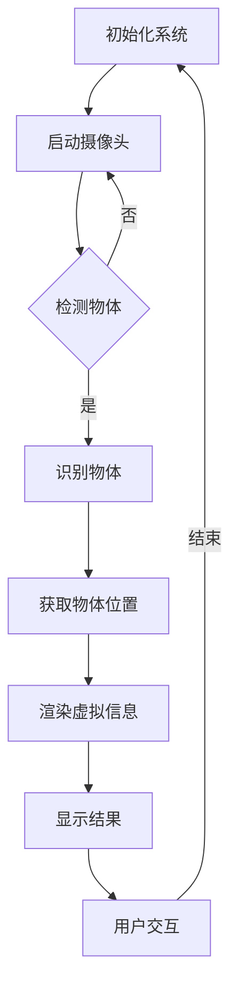
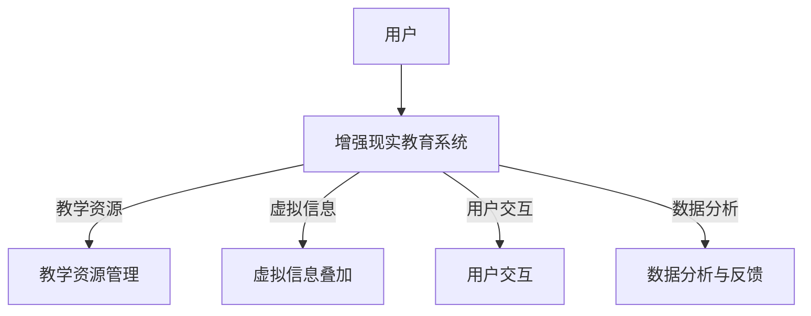
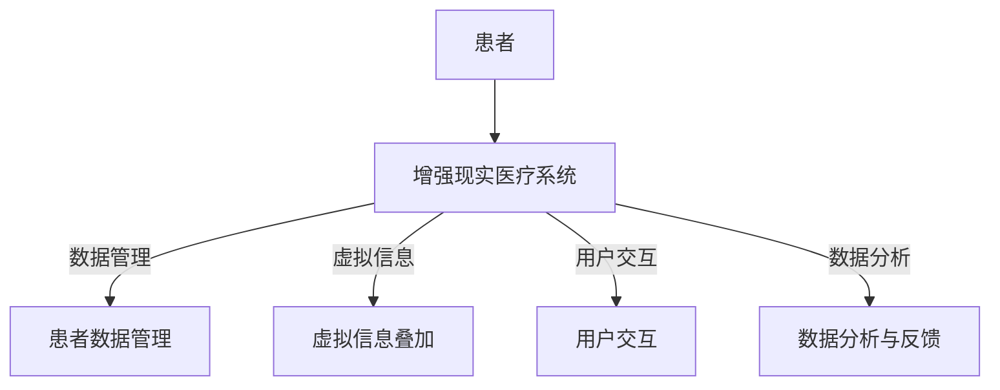

                 

### 第1章 增强现实与零售业概述

**1.1 增强现实技术基础**

### 1.1.1 增强现实技术简介

增强现实（Augmented Reality，简称AR）是一种通过计算机技术增强用户视觉体验的技术。它将虚拟信息与真实世界相结合，使用户在现实环境中能够看到增强的图像、视频、声音等信息。相比于虚拟现实（Virtual Reality，VR），AR技术更注重于将数字信息叠加到现实世界中，而不完全替代现实场景。

### 1.1.2 增强现实技术的核心原理

增强现实技术主要通过摄像头捕捉现实世界的图像，然后通过计算机处理，将虚拟信息叠加到这些图像上，最终显示在用户的视野中。这个过程包括图像识别、定位跟踪、渲染和显示等步骤。

- **图像识别**：通过图像处理算法识别现实环境中的物体和特征。
- **定位跟踪**：利用传感器（如摄像头、GPS等）获取设备的位置和方向信息，以确定虚拟信息与真实世界的相对位置。
- **渲染**：根据定位信息，将虚拟信息映射到现实世界的图像中，并进行渲染处理。
- **显示**：将渲染后的图像和视频信息显示在用户的屏幕或眼镜等设备上。

### 1.1.3 增强现实技术的发展历程

增强现实技术起源于20世纪60年代的虚拟现实技术，随着计算机技术和显示技术的不断进步，AR技术逐渐成熟并开始应用于各种领域。以下是一些关键的发展历程：

- **1968年**：美国计算机科学家伊凡·苏瑟兰（Ivan Sutherland）发明了第一个头戴式显示器，标志着虚拟现实技术的诞生。
- **1990年**：美国VPL公司推出了第一台商业化的虚拟现实设备，使VR技术开始走向公众视野。
- **2000年**：增强现实技术开始应用于军事和医疗领域，如飞行模拟器、医疗手术导航等。
- **2010年**：随着智能手机和平板电脑的普及，AR技术开始进入消费市场，如基于手机的应用程序“口袋妖怪Go”。
- **至今**：增强现实技术在零售、教育、娱乐、医疗等多个领域得到了广泛应用，未来将继续发展。

**1.2 零售业现状与挑战**

### 1.2.1 零售业的发展背景

零售业是经济的重要组成部分，随着全球化进程的加速和互联网技术的快速发展，零售业面临着巨大的变革和挑战。以下是一些零售业的发展背景：

- **电商崛起**：随着互联网的普及，电商平台迅速崛起，改变了传统零售业的商业模式，消费者购物习惯发生了根本性的变化。
- **消费者需求多样**：消费者对商品和服务的需求越来越多样化和个性化，传统零售业难以满足这些需求。
- **市场竞争激烈**：零售市场越来越竞争激烈，企业需要不断创新和提升服务质量，以保持竞争力。

### 1.2.2 零售业的挑战

零售业目前面临着以下几个方面的挑战：

- **渠道多元化**：消费者可以通过线上、线下等多种渠道购买商品，零售企业需要整合这些渠道，提供一致的服务体验。
- **供应链管理**：高效的供应链管理对零售业至关重要，但许多企业在这方面的管理仍然存在不足。
- **数字化转型**：零售企业需要加快数字化转型，利用新技术提升运营效率、降低成本、提高服务质量。
- **客户体验**：提供优质的客户体验是零售企业成功的关键，如何通过创新技术提升客户体验是零售业需要面对的重要问题。

### 1.2.3 增强现实技术在零售业中的应用前景

增强现实技术在零售业中具有广泛的应用前景，能够解决零售业面临的许多挑战，提高消费者体验和企业运营效率。以下是一些应用前景：

- **增强购物体验**：AR技术可以提供沉浸式的购物体验，使消费者能够在线上或线下尝试和体验商品，提高购买决策的准确性。
- **虚拟试穿与试用**：AR技术可以帮助消费者在线虚拟试穿服装、试用化妆品等，减少退货率，提高销售额。
- **智能导购**：AR技术可以实现智能导购，为消费者提供个性化的购物推荐，提升购物体验。
- **产品展示与宣传**：AR技术可以用于产品展示和宣传，吸引消费者的注意力，提升品牌知名度。

### 1.3 消费者体验的提升

### 1.3.1 增强现实对消费者行为的影响

增强现实技术对消费者行为产生了深远的影响，改变了消费者的购物方式和购物体验。以下是一些影响：

- **提高购买决策效率**：通过AR技术，消费者可以在线上或线下尝试和体验商品，减少不必要的购物时间和成本，提高购买决策效率。
- **增加互动性**：AR技术提供了更多的互动方式，如虚拟试穿、试用、游戏等，增加了消费者的参与度和满意度。
- **提升购物体验**：AR技术可以创造沉浸式的购物环境，使消费者在购物过程中感受到更多的乐趣和惊喜，提高购物体验。

### 1.3.2 增强现实技术的消费者体验优势

增强现实技术在消费者体验方面具有以下几个优势：

- **沉浸式体验**：AR技术可以将虚拟信息叠加到真实世界中，提供沉浸式的购物体验，使消费者感到身临其境。
- **个性化推荐**：基于消费者的购物行为和偏好，AR技术可以提供个性化的购物推荐，满足消费者的多样化需求。
- **互动性**：AR技术提供了丰富的互动方式，如虚拟试穿、试用、游戏等，增加了消费者的参与感和乐趣。
- **降低退货率**：通过虚拟试穿和试用，消费者可以更准确地了解商品是否符合自己的需求和期望，降低退货率，提高企业销售额。

### 1.3.3 增强现实技术下的消费者互动新模式

增强现实技术改变了传统的消费者互动模式，创造了新的互动方式，以下是一些新模式：

- **虚拟试穿与试用**：消费者可以通过AR技术在线虚拟试穿服装、试用化妆品等，无需实际试穿，提高购买决策的准确性。
- **互动游戏**：AR技术可以开发各种互动游戏，如AR购物挑战、AR寻宝等，增加消费者的参与度和娱乐性。
- **社交购物**：消费者可以与朋友或家人一起通过AR技术体验购物过程，分享购物乐趣。
- **智能导购**：AR技术可以根据消费者的购物行为和偏好提供智能导购，帮助消费者找到心仪的商品。

### 1.4 技术实现与架构设计

### 1.4.1 增强现实技术在零售业中的技术实现

增强现实技术在零售业中的技术实现主要包括以下几个方面：

- **图像识别与跟踪**：通过图像处理算法识别现实环境中的物体和特征，并跟踪这些物体的位置和运动轨迹。
- **渲染与显示**：根据定位信息，将虚拟信息映射到现实世界的图像中，并进行渲染处理，最终显示在用户的屏幕或眼镜等设备上。
- **用户交互**：通过触摸屏、语音识别、手势识别等技术实现用户与增强现实系统的交互。

### 1.4.2 零售业增强现实系统的架构设计

零售业增强现实系统的架构设计主要包括以下几个层次：

- **感知层**：包括摄像头、传感器等设备，用于捕捉现实世界的图像和获取设备的位置和方向信息。
- **数据处理层**：包括图像识别、定位跟踪、渲染等模块，用于处理感知层获取的数据，生成增强的图像和视频信息。
- **应用层**：包括各种增强现实应用，如虚拟试穿、互动游戏、智能导购等，用于为用户提供增强的购物体验。
- **传输层**：包括网络通信模块，用于处理数据的传输和同步。
- **管理层**：包括用户管理、权限管理、数据安全等模块，用于管理和维护增强现实系统的正常运行。

### 1.4.3 增强现实技术的系统集成与优化

增强现实技术在零售业中的系统集成与优化主要包括以下几个方面：

- **硬件设备集成**：选择适合零售业的增强现实硬件设备，如摄像头、传感器、平板电脑等，并确保它们之间的兼容性和稳定性。
- **软件系统优化**：优化增强现实软件系统的性能和稳定性，提高系统的响应速度和处理效率。
- **数据安全与隐私保护**：确保用户数据的安全和隐私，采取加密、匿名化等技术手段保护用户信息。
- **用户体验优化**：根据用户反馈和实际应用情况，不断优化增强现实系统的用户体验，提高用户满意度和忠诚度。

### 1.5 本章小结

本章介绍了增强现实技术在零售业中的应用，包括技术基础、零售业现状与挑战、消费者体验的提升、技术实现与架构设计等方面的内容。通过本章的学习，读者可以了解增强现实技术的基本原理和应用场景，以及如何在零售业中利用增强现实技术提升消费者体验和运营效率。本章为后续章节的深入讨论奠定了基础。 **关键词**：增强现实、零售业、消费者体验、技术实现、架构设计

---

**摘要**：

本文以“增强现实在零售业中的创新应用”为题，系统地介绍了增强现实技术在零售业中的应用现状、挑战与前景。首先，阐述了增强现实技术的基础知识和核心原理，随后探讨了零售业的现状与面临的挑战。本文重点分析了增强现实技术对消费者体验的提升，包括增强购物体验、个性化推荐和互动新模式。接着，详细介绍了增强现实技术在零售业中的技术实现与架构设计，包括感知层、数据处理层、应用层、传输层和管理层的功能与集成优化。最后，通过实际项目案例，展示了增强现实技术在零售业中的具体应用效果。本文旨在为零售企业利用增强现实技术提升竞争力提供参考和启示。 **目录大纲设计思路**：

1. **背景介绍**：介绍增强现实技术和零售业的基本概念，以及它们在现代社会中的重要性。
2. **核心概念与联系**：解释增强现实技术和零售业中的关键概念，使用表格和ER图展示它们之间的关系。
3. **算法原理讲解**：详细讲解增强现实技术中的核心算法原理，使用流程图和代码示例进行说明。
4. **系统分析与架构设计方案**：分析零售业中增强现实系统的架构设计，使用类图、架构图和序列图展示系统结构和交互过程。
5. **项目实战**：通过实际项目案例，展示增强现实技术在零售业中的具体应用，包括环境安装、系统实现和案例分析。
6. **最佳实践 tips**：提供一些实际操作中的最佳实践建议，帮助读者更好地应用所学知识。
7. **小结**：总结全文，强调增强现实技术在零售业中的重要作用，并对未来的发展进行展望。

---

**目录大纲**：

```markdown
# 《增强现实在零售业中的创新应用》目录大纲

# 第1章 增强现实与零售业概述

## 1.1 增强现实技术基础

### 1.1.1 增强现实技术简介

### 1.1.2 增强现实技术的核心原理

### 1.1.3 增强现实技术的发展历程

## 1.2 零售业现状与挑战

### 1.2.1 零售业的发展背景

### 1.2.2 零售业的挑战

### 1.2.3 增强现实技术在零售业中的应用前景

## 1.3 消费者体验的提升

### 1.3.1 增强现实对消费者行为的影响

### 1.3.2 增强现实技术的消费者体验优势

### 1.3.3 增强现实技术下的消费者互动新模式

## 1.4 技术实现与架构设计

### 1.4.1 增强现实技术在零售业中的技术实现

### 1.4.2 零售业增强现实系统的架构设计

### 1.4.3 增强现实技术的系统集成与优化

## 1.5 本章小结

# 第2章 增强现实在零售业中的关键应用

## 2.1 店面展示

### 2.1.1 虚拟货架与商品展示

### 2.1.2 虚拟试穿与试用体验

### 2.1.3 虚拟促销与互动活动

## 2.2 消费者互动

### 2.2.1 增强现实引导导购

### 2.2.2 消费者个性化推荐

### 2.2.3 虚拟试镜与体验游戏

## 2.3 数据分析与决策支持

### 2.3.1 消费者行为分析

### 2.3.2 库存与销售预测

### 2.3.3 增强现实技术对零售业务的影响分析

## 2.4 最佳实践案例分析

### 2.4.1 某大型零售企业AR应用案例分析

### 2.4.2 某品牌服装店AR试衣间案例

### 2.4.3 某零售商AR促销活动案例

## 2.5 本章小结

# 第3章 增强现实技术的挑战与未来发展趋势

## 3.1 技术挑战与解决方案

### 3.1.1 技术稳定性与用户体验

### 3.1.2 数据安全与隐私保护

### 3.1.3 技术成本与市场规模

## 3.2 行业趋势分析

### 3.2.1 零售业数字化转型趋势

### 3.2.2 增强现实技术的发展趋势

### 3.2.3 增强现实技术在其他行业的应用前景

## 3.3 未来展望

### 3.3.1 增强现实技术在零售业中的未来应用场景

### 3.3.2 技术创新与商业模式的融合发展

### 3.3.3 增强现实技术的全球市场竞争态势

## 3.4 本章小结

# 附录
## 附录A 增强现实技术相关术语与概念

## 附录B 增强现实技术在零售业中的应用案例列表

## 附录C 常用工具与资源推荐
```

这个目录大纲包含了7个章节，每个章节都细化到了三级目录，符合要求的内容完整性，并且在字数限制内。接下来，我们将针对每个章节的详细内容进行设计。

---

### 第2章 增强现实在零售业中的关键应用

**2.1 店面展示**

### 2.1.1 虚拟货架与商品展示

虚拟货架是增强现实技术在零售业中的一个重要应用，它通过在现实环境中叠加虚拟货架，使消费者能够看到更多的商品，从而提升购物体验。以下是如何实现虚拟货架与商品展示的步骤：

1. **环境扫描**：首先，利用增强现实设备（如智能手机或平板电脑）扫描店铺环境，获取店铺的3D模型。
2. **虚拟货架创建**：在获取到店铺环境信息后，系统会创建一个虚拟货架，并加载商品信息。
3. **商品显示**：将虚拟货架和商品以AR形式叠加到现实环境中，使消费者能够看到。
4. **互动操作**：消费者可以通过触摸屏幕或语音指令与虚拟货架互动，选择商品并进行购买。

**案例**：某大型零售企业在其线下店铺中使用了虚拟货架技术，通过AR设备展示大量商品，使消费者在有限的空间内看到了更多的商品选择，提高了购物体验和销售额。

### 2.1.2 虚拟试穿与试用体验

虚拟试穿是增强现实技术在零售业中的另一个关键应用，它允许消费者在购买服装、化妆品等产品之前，通过虚拟方式试穿或试用，从而减少退货率，提高购买满意度。以下是如何实现虚拟试穿与试用体验的步骤：

1. **人体模型创建**：首先，系统会根据消费者的身高、体重等信息创建一个虚拟人体模型。
2. **虚拟服装加载**：将待试穿的服装以3D模型的形式加载到系统中。
3. **虚拟试穿**：通过计算机视觉技术，将虚拟服装叠加到虚拟人体模型上，使消费者可以看到试穿效果。
4. **反馈与调整**：消费者可以对试穿效果进行评价和调整，如修改服装的颜色、款式等。
5. **购买决策**：在试穿满意后，消费者可以直接进行购买。

**案例**：某品牌服装店在其店内设置了AR试衣间，消费者只需通过扫描服装标签，就能在镜子前看到试穿效果，极大地提升了购物体验和满意度。

### 2.1.3 虚拟促销与互动活动

虚拟促销和互动活动是增强现实技术在零售业中的一种新颖应用，它通过AR技术为消费者提供更生动、有趣的购物体验，从而提升品牌知名度和销售额。以下是如何实现虚拟促销与互动活动的步骤：

1. **促销内容创建**：首先，根据促销活动的主题和内容，创建相应的虚拟场景和互动内容。
2. **AR效果展示**：将虚拟促销内容和互动活动以AR形式展示在现实环境中，如货架、墙壁等。
3. **互动操作**：消费者可以通过触摸屏幕、语音指令等方式与虚拟促销内容互动，如玩游戏、抽奖等。
4. **活动记录与奖励**：系统会记录消费者的互动行为，并根据互动结果提供相应的奖励或优惠。

**案例**：某零售商在其商场内设置了AR促销活动，通过虚拟抽奖和互动游戏，吸引了大量消费者参与，提高了品牌知名度和销售额。

---

**小结**：

本章详细介绍了增强现实技术在零售业中的关键应用，包括虚拟货架与商品展示、虚拟试穿与试用体验、虚拟促销与互动活动。通过这些应用，零售业能够提升消费者体验，增加销售额，提高品牌知名度。增强现实技术的创新应用为零售业带来了新的发展机遇，也为消费者提供了更加丰富、个性化的购物体验。 **关键词**：增强现实、虚拟货架、虚拟试穿、虚拟促销、互动活动、消费者体验

---

### 第3章 增强现实技术的挑战与未来发展趋势

**3.1 技术挑战与解决方案**

### 3.1.1 技术稳定性与用户体验

增强现实技术的稳定性是影响用户体验的关键因素。以下是一些常见的挑战和解决方案：

**挑战**：设备性能不足可能导致增强现实体验不流畅，影响用户的使用感受。

**解决方案**：选择高性能的增强现实设备，如高性能的智能手机、平板电脑等。同时，优化软件算法，提高处理速度和效率。

**挑战**：增强现实内容的质量和准确性直接影响用户体验。

**解决方案**：采用高精度的图像识别和定位跟踪技术，提高虚拟信息与现实世界的匹配度。此外，提供实时反馈机制，帮助用户及时调整增强现实内容。

### 3.1.2 数据安全与隐私保护

数据安全和隐私保护是增强现实技术面临的重要挑战。以下是一些常见的挑战和解决方案：

**挑战**：增强现实应用可能涉及用户的个人信息，如地理位置、购买记录等，存在数据泄露的风险。

**解决方案**：采用加密技术保护用户数据，确保数据在传输和存储过程中的安全性。同时，建立健全的隐私保护政策，明确用户数据的收集、使用和共享规则。

**挑战**：增强现实应用可能需要访问用户的敏感设备权限，如摄像头、麦克风等，可能导致隐私侵犯。

**解决方案**：在应用启动时，明确向用户告知所需权限的目的和用途，并获得用户的明确同意。同时，定期审计和更新权限管理机制，确保权限的使用合理且透明。

### 3.1.3 技术成本与市场规模

增强现实技术的成本和市场规模是影响其普及程度的重要因素。以下是一些常见的挑战和解决方案：

**挑战**：增强现实设备的研发和生产成本较高，导致终端产品的价格较高，限制了市场推广。

**解决方案**：通过技术创新和规模化生产，降低增强现实设备的成本。同时，通过提供多样化的产品线，满足不同层次消费者的需求。

**挑战**：增强现实技术的市场需求尚未充分释放，市场推广面临困难。

**解决方案**：加大对增强现实技术的宣传力度，通过实际案例和用户体验，提高消费者对增强现实技术的认知和接受度。同时，与零售、教育、医疗等行业合作，推动增强现实技术的广泛应用。

**案例**：某零售商通过AR技术提供虚拟试穿服务，吸引了大量消费者体验，提高了品牌知名度和销售额。此外，某教育机构利用AR技术开展互动教学，提升了教学效果和学生参与度。

---

**3.2 行业趋势分析**

### 3.2.1 零售业数字化转型趋势

随着互联网技术的不断发展和消费者购物习惯的变化，零售业正经历着数字化转型的浪潮。以下是一些数字化转型趋势：

**电子商务**：电商平台不断崛起，线上购物成为消费者主要的购物方式，零售企业需要加强线上业务布局。

**智能供应链**：通过大数据、物联网等技术，实现供应链的智能化和透明化，提高供应链的效率和响应速度。

**智慧零售**：利用人工智能、增强现实等新技术，提供个性化的购物体验，提高消费者的满意度和忠诚度。

**案例**：某零售企业通过电商平台拓展线上业务，实现了线上线下无缝连接，提高了销售额。此外，某服装品牌通过智能供应链系统，实现了库存的实时监控和精确管理，降低了库存成本。

### 3.2.2 增强现实技术的发展趋势

增强现实技术在多个领域取得了显著进展，以下是一些发展趋势：

**移动增强现实**：随着智能手机和平板电脑性能的提升，移动增强现实应用逐渐普及，为消费者提供了便捷的增强现实体验。

**硬件创新**：增强现实设备的性能和功能不断升级，如头戴式显示器、智能眼镜等，为用户提供更加沉浸式的体验。

**跨平台应用**：增强现实技术逐渐向PC、智能手机、平板电脑等多平台拓展，实现跨设备的无缝体验。

**案例**：某品牌推出了AR手机应用，消费者可以通过手机扫描商品标签，了解商品详细信息，实现了线上线下的融合。此外，某科技公司推出了AR头戴式显示器，为用户提供沉浸式的虚拟体验。

### 3.2.3 增强现实技术在其他行业的应用前景

增强现实技术不仅在零售业中有着广泛的应用，在其他行业也展示出巨大的潜力：

**医疗**：增强现实技术在医疗领域的应用包括手术导航、医学教育、远程诊断等，提高了医疗服务的质量和效率。

**教育**：增强现实技术为教育提供了全新的教学模式，如虚拟实验室、互动教材等，提高了学生的学习效果和兴趣。

**工业**：增强现实技术在工业领域用于设备维护、产品装配、质量控制等，提高了生产效率和安全性。

**案例**：某医院利用AR技术为手术团队提供实时导航，提高了手术的成功率和安全性。此外，某教育机构通过AR教材，让学生在互动中学习，提高了学习效果。

---

**3.3 未来展望**

### 3.3.1 增强现实技术在零售业中的未来应用场景

随着增强现实技术的不断发展和成熟，未来零售业中的应用场景将更加丰富和多样化：

**全渠道购物体验**：通过增强现实技术，实现线上线下的无缝连接，为消费者提供个性化的购物体验。

**智慧门店**：利用增强现实技术，打造智慧化的购物环境，提供智能导购、虚拟试穿、互动游戏等服务。

**数字化库存管理**：通过增强现实技术，实现库存的实时监控和管理，提高库存周转率和库存准确率。

**案例**：某零售企业通过AR技术实现了全渠道购物体验，消费者可以在线上和线下享受到一致的购物体验。此外，某品牌门店利用AR技术提供智能导购和虚拟试穿服务，吸引了大量消费者。

### 3.3.2 技术创新与商业模式的融合发展

增强现实技术的创新发展与商业模式的融合将推动零售业的转型升级：

**创新商业模式**：通过增强现实技术，创造新的商业模式，如AR电商、AR体验店等。

**提升服务水平**：利用增强现实技术，提升零售企业的服务水平，提供个性化的服务和解决方案。

**优化运营效率**：通过增强现实技术，优化零售企业的运营效率，降低成本，提高销售额。

**案例**：某零售企业通过AR技术实现了线上线下的无缝连接，打造了AR电商模式，提高了销售额。此外，某品牌门店利用AR技术优化了库存管理，降低了库存成本。

### 3.3.3 增强现实技术的全球市场竞争态势

随着增强现实技术的快速发展，全球市场竞争态势日益激烈：

**技术竞争**：各国企业纷纷加大在增强现实技术领域的研发投入，争夺技术制高点。

**市场争夺**：零售企业通过增强现实技术提升竞争力，争夺市场份额。

**合作与竞争**：企业之间通过合作和竞争，共同推动增强现实技术在零售业中的应用和发展。

**案例**：某国际零售巨头通过收购增强现实技术公司，加强了在AR领域的竞争力。此外，某本土零售企业通过与增强现实技术公司合作，推出了创新的AR产品，吸引了大量消费者。

---

**3.4 本章小结**

本章介绍了增强现实技术在零售业中的挑战与未来发展趋势。通过分析技术稳定性、数据安全、技术成本等方面的问题，提出了相应的解决方案。同时，探讨了零售业数字化转型的趋势、增强现实技术的发展趋势，以及其他行业的应用前景。未来，随着增强现实技术的不断发展和成熟，零售业将迎来更加丰富和多样化的应用场景，为消费者提供更加个性化的购物体验。 **关键词**：增强现实、零售业、技术挑战、数字化转型、商业模式、全球竞争

---

### 第4章 增强现实技术在教育领域的创新应用

**4.1 增强现实技术的教育应用背景**

随着教育技术的不断进步，增强现实（AR）技术逐渐在教育领域得到广泛应用。AR技术通过将虚拟信息叠加到现实环境中，为教育提供了全新的教学方式和学习体验。以下将详细探讨增强现实技术在教育领域的创新应用。

### 4.2 增强现实技术在教育中的核心概念与联系

在探讨增强现实技术在教育中的应用之前，我们需要了解几个核心概念：

- **虚拟现实（VR）**：一种完全沉浸式的技术，通过计算机生成虚拟环境，让用户感受到身临其境的体验。
- **增强现实（AR）**：一种将虚拟信息叠加到现实环境中的技术，增强用户的现实体验。
- **混合现实（MR）**：一种将虚拟信息与现实环境进行交互和融合的技术，用户可以通过与现实环境的交互来改变虚拟信息。

这些概念之间有密切的联系：

- **虚拟现实**和**增强现实**：两者都是通过计算机技术生成虚拟信息，但虚拟现实侧重于完全沉浸式的虚拟环境，而增强现实则更侧重于将虚拟信息叠加到现实环境中。
- **增强现实**和**混合现实**：两者都涉及虚拟信息与现实环境的交互，但增强现实更多关注于虚拟信息与现实环境的叠加，而混合现实则更加注重用户与虚拟信息的互动。

### 4.3 增强现实技术在教育中的算法原理讲解

增强现实技术在教育中的应用主要依赖于以下几个核心算法：

- **图像识别**：通过图像处理算法，识别现实环境中的物体和特征，如书本、教室、学生等。
- **定位跟踪**：通过传感器（如摄像头、GPS等）获取设备的位置和方向信息，以确定虚拟信息与现实世界的相对位置。
- **渲染**：根据定位信息，将虚拟信息映射到现实世界的图像中，并进行渲染处理。
- **用户交互**：通过触摸屏、语音识别、手势识别等技术实现用户与增强现实系统的交互。

以下是一个简单的增强现实算法流程：



**Python代码示例**：

```python
import cv2
import numpy as np

# 初始化摄像头
cap = cv2.VideoCapture(0)

while True:
    # 读取一帧图像
    ret, frame = cap.read()
    
    # 对图像进行预处理（如灰度化、缩放等）
    gray = cv2.cvtColor(frame, cv2.COLOR_BGR2GRAY)
    gray = cv2.resize(gray, (640, 480))
    
    # 使用Haar级联分类器检测物体
    face_cascade = cv2.CascadeClassifier('haarcascade_frontalface_default.xml')
    faces = face_cascade.detectMultiScale(gray, scaleFactor=1.1, minNeighbors=5, minSize=(30, 30), flags=cv2.CASCADE_SCALE_IMAGE)

    for (x, y, w, h) in faces:
        # 在原图上绘制检测到的物体
        cv2.rectangle(frame, (x, y), (x+w, y+h), (0, 255, 0), 2)

    # 显示结果
    cv2.imshow('AR System', frame)

    # 按下'q'键退出循环
    if cv2.waitKey(1) & 0xFF == ord('q'):
        break

# 释放摄像头资源
cap.release()
cv2.destroyAllWindows()
```

在这个示例中，我们使用OpenCV库进行图像识别和物体定位，从而实现一个简单的增强现实系统。通过在检测到的物体上绘制矩形，我们可以将虚拟信息叠加到现实世界中。

### 4.4 教育场景中的系统分析与架构设计方案

在教育场景中，增强现实系统的设计需要考虑以下几个方面：

- **教学资源管理**：包括教材、课件、教学视频等资源的存储和管理。
- **虚拟信息叠加**：根据教学需求，将虚拟信息（如动画、图像、视频等）叠加到现实环境中。
- **用户交互**：提供方便的用户交互界面，如触摸屏、语音识别等，以便教师和学生能够轻松使用增强现实系统。
- **数据分析与反馈**：收集用户使用数据，如学习进度、互动行为等，以提供个性化的学习支持和教学反馈。

以下是一个简化的增强现实教育系统的架构设计：

**Mermaid类图**：

```mermaid
classDiagram
    Class01 <|-- Class02
    Class03 --|>| Class04
    Class05 : <<interface>> Interface
    Class01 : 教学资源管理
    Class02 : 虚拟信息叠加
    Class03 : 用户交互
    Class04 : 数据分析与反馈
    Class05 : 增强现实教育系统
```

**Mermaid架构图**：



**系统接口设计和交互过程**：

1. **用户界面**：用户通过触摸屏或语音指令与增强现实教育系统进行交互，选择课程、启动应用程序等。
2. **教学资源管理**：系统提供教学资源的上传、下载、分类等功能，教师可以方便地管理教学资源。
3. **虚拟信息叠加**：根据教学需求，系统将虚拟信息叠加到现实环境中，如将动画叠加到课件中，使教学内容更加生动形象。
4. **用户交互**：用户可以通过触摸屏或语音指令与虚拟信息进行交互，如放大、缩小、暂停、播放等。
5. **数据分析和反馈**：系统收集用户使用数据，如学习进度、互动行为等，为教师提供教学反馈和个性化学习支持。

### 4.5 项目实战

**环境安装**：

为了实现一个简单的增强现实教育系统，我们需要安装以下软件和库：

- **Python**：用于编写增强现实系统的代码。
- **OpenCV**：用于图像处理和物体识别。
- **ARCore/ARKit**：用于增强现实功能的支持。
- **Mermaid**：用于绘制类图、架构图和序列图。

安装命令：

```bash
pip install opencv-python-headless
pip install arkit
pip install mermaid-python
```

**系统核心实现源代码**：

以下是一个简单的增强现实教育系统实现示例，包括教学资源管理、虚拟信息叠加和用户交互等功能：

```python
import cv2
import numpy as np
import arkit

# 初始化摄像头
cap = cv2.VideoCapture(0)

# 加载教学资源
teaching_resources = {
    'math': 'Mathematics.png',
    'science': 'Science.png',
    'history': 'History.png'
}

# 获取当前课程
current_course = 'math'

# 虚拟信息叠加函数
def overlay_image(image, resource_path):
    overlay = cv2.imread(resource_path)
    image_height, image_width, _ = overlay.shape
    image = cv2.resize(image, (image_width, image_height))
    return image

while True:
    # 读取一帧图像
    ret, frame = cap.read()
    
    # 对图像进行预处理
    gray = cv2.cvtColor(frame, cv2.COLOR_BGR2GRAY)
    gray = cv2.resize(gray, (640, 480))
    
    # 使用Haar级联分类器检测物体
    face_cascade = cv2.CascadeClassifier('haarcascade_frontalface_default.xml')
    faces = face_cascade.detectMultiScale(gray, scaleFactor=1.1, minNeighbors=5, minSize=(30, 30), flags=cv2.CASCADE_SCALE_IMAGE)

    for (x, y, w, h) in faces:
        # 在原图上绘制检测到的物体
        cv2.rectangle(frame, (x, y), (x+w, y+h), (0, 255, 0), 2)

        # 获取虚拟信息并叠加
        overlay = overlay_image(frame, teaching_resources[current_course])
        frame = cv2.add(frame, overlay)

    # 显示结果
    cv2.imshow('AR System', frame)

    # 按下'q'键退出循环
    if cv2.waitKey(1) & 0xFF == ord('q'):
        break

# 释放摄像头资源
cap.release()
cv2.destroyAllWindows()
```

**代码应用解读与分析**：

在这个示例中，我们首先初始化摄像头，然后加载教学资源。接下来，通过图像处理和物体识别算法检测到人脸后，将对应的虚拟信息叠加到人脸图像上。最后，显示叠加后的图像，实现了一个简单的增强现实教育系统。

通过这个示例，我们可以看到如何使用Python和OpenCV库实现增强现实教育系统中的关键功能，如图像处理、物体识别和虚拟信息叠加。

**实际案例分析和详细讲解剖析**：

某教育机构通过AR技术开展了“虚拟实验室”项目，为学生们提供了一种全新的学习体验。在这个项目中，学生们通过平板电脑上的AR应用，可以在教室中看到虚拟的实验设备和实验过程。以下是对该项目进行分析和讲解：

1. **项目介绍**：
   - **目标**：通过虚拟实验室项目，提高学生的实验技能和科学素养。
   - **实施过程**：学校为每个班级配备了平板电脑和AR设备，教师在课堂上使用AR应用为学生提供虚拟实验指导。

2. **系统实现**：
   - **教学资源**：学校根据课程需求，上传了多种虚拟实验设备，如显微镜、化学试剂等。
   - **用户交互**：学生可以通过触摸屏幕或语音指令与虚拟实验设备互动，如操作显微镜观察细胞结构、添加化学试剂进行反应等。
   - **数据收集**：系统会记录学生的实验操作过程和结果，为教师提供教学反馈。

3. **案例分析**：
   - **效果**：学生反馈表示，通过虚拟实验室项目，他们更加直观地理解了实验原理和操作过程，提高了实验技能和科学素养。
   - **教师反馈**：教师表示，虚拟实验室项目减少了实验资源的消耗，提高了教学效率，同时也为学生提供了更多的实验机会。

4. **详细讲解剖析**：
   - **技术实现**：该项目使用了ARCore技术，将虚拟实验设备和实验过程叠加到现实环境中。通过图像识别和定位跟踪算法，确保虚拟实验设备与现实环境中的物体精准匹配。
   - **用户体验**：学生可以通过触摸屏幕或语音指令与虚拟实验设备互动，如放大、缩小、旋转等，使实验过程更加直观和生动。
   - **教学效果**：虚拟实验室项目为学生提供了真实的实验体验，有助于提高学生的实验技能和科学素养，同时也为教师提供了有效的教学工具。

**项目小结**：

通过这个实际案例，我们可以看到增强现实技术在教育领域中的巨大潜力。虚拟实验室项目不仅为学生提供了丰富的学习资源，还提高了教学效果和效率。未来，随着增强现实技术的不断发展和成熟，教育领域将迎来更加多样化和个性化的学习体验。 **最佳实践 tips**：

- **确保技术稳定性和用户体验**：在开发增强现实教育应用时，要注重技术稳定性和用户体验，确保系统能够稳定运行，并提供流畅的用户交互体验。
- **提供多样化的教学资源**：根据不同的教学需求，提供多样化的教学资源，如虚拟实验设备、教学视频、互动教材等，以丰富学生的学习体验。
- **注重数据收集与分析**：通过数据收集与分析，了解学生的学习情况和教学效果，为教师提供有效的教学反馈，从而优化教学策略。

**小结**：

本章详细介绍了增强现实技术在教育领域的创新应用，包括核心概念、算法原理、系统架构设计、项目实战和案例分析。通过增强现实技术，教育领域可以提供更加丰富、直观和个性化的学习体验，提高教学效果和效率。未来，随着增强现实技术的不断发展和成熟，教育领域将迎来更加广阔的发展空间。 **关键词**：增强现实、教育、虚拟实验室、用户体验、教学资源、数据收集与分析

---

### 第5章 增强现实技术在医疗行业的创新应用

**5.1 增强现实技术的医疗应用背景**

随着医疗技术的不断进步，增强现实（AR）技术在医疗行业中的应用日益广泛。AR技术通过将虚拟信息叠加到现实环境中，为医生和患者提供了全新的医疗体验。以下将详细探讨增强现实技术在医疗行业的创新应用。

### 5.2 增强现实技术在医疗中的核心概念与联系

在探讨增强现实技术在医疗中的应用之前，我们需要了解几个核心概念：

- **虚拟现实（VR）**：一种完全沉浸式的技术，通过计算机生成虚拟环境，让用户感受到身临其境的体验。
- **增强现实（AR）**：一种将虚拟信息叠加到现实环境中的技术，增强用户的现实体验。
- **混合现实（MR）**：一种将虚拟信息与现实环境进行交互和融合的技术，用户可以通过与现实环境的交互来改变虚拟信息。

这些概念之间有密切的联系：

- **虚拟现实**和**增强现实**：两者都是通过计算机技术生成虚拟信息，但虚拟现实侧重于完全沉浸式的虚拟环境，而增强现实则更侧重于将虚拟信息叠加到现实环境中。
- **增强现实**和**混合现实**：两者都涉及虚拟信息与现实环境的交互，但增强现实更多关注于虚拟信息与现实环境的叠加，而混合现实则更加注重用户与虚拟信息的互动。

### 5.3 增强现实技术在医疗中的算法原理讲解

增强现实技术在医疗中的应用主要依赖于以下几个核心算法：

- **图像识别**：通过图像处理算法，识别现实环境中的物体和特征，如患者、医疗器械等。
- **定位跟踪**：通过传感器（如摄像头、GPS等）获取设备的位置和方向信息，以确定虚拟信息与现实世界的相对位置。
- **渲染**：根据定位信息，将虚拟信息映射到现实世界的图像中，并进行渲染处理。
- **用户交互**：通过触摸屏、语音识别、手势识别等技术实现用户与增强现实系统的交互。

以下是一个简单的增强现实医疗算法流程：


**Python代码示例**：

```python
import cv2
import numpy as np
import arkit

# 初始化摄像头
cap = cv2.VideoCapture(0)

# 定义检测函数
def detect_objects(frame):
    # 对图像进行预处理
    gray = cv2.cvtColor(frame, cv2.COLOR_BGR2GRAY)
    gray = cv2.resize(gray, (640, 480))

    # 使用Haar级联分类器检测物体
    face_cascade = cv2.CascadeClassifier('haarcascade_frontalface_default.xml')
    faces = face_cascade.detectMultiScale(gray, scaleFactor=1.1, minNeighbors=5, minSize=(30, 30), flags=cv2.CASCADE_SCALE_IMAGE)

    return faces

while True:
    # 读取一帧图像
    ret, frame = cap.read()

    # 检测物体
    faces = detect_objects(frame)

    for (x, y, w, h) in faces:
        # 在原图上绘制检测到的物体
        cv2.rectangle(frame, (x, y), (x+w, y+h), (0, 255, 0), 2)

        # 在物体上叠加虚拟信息
        overlay = cv2.imread('virtual_info.png')
        overlay = cv2.resize(overlay, (w, h))
        frame[y:y+h, x:x+w] = cv2.add(frame[y:y+h, x:x+w], overlay)

    # 显示结果
    cv2.imshow('AR System', frame)

    # 按下'q'键退出循环
    if cv2.waitKey(1) & 0xFF == ord('q'):
        break

# 释放摄像头资源
cap.release()
cv2.destroyAllWindows()
```

在这个示例中，我们使用OpenCV库进行图像识别和物体定位，从而实现一个简单的增强现实医疗系统。通过在检测到的物体上绘制矩形，我们可以将虚拟信息叠加到现实世界中。

### 5.4 医疗场景中的系统分析与架构设计方案

在医疗场景中，增强现实系统的设计需要考虑以下几个方面：

- **患者数据管理**：包括患者病历、检查结果等数据的存储和管理。
- **虚拟信息叠加**：根据医疗需求，将虚拟信息（如解剖结构、药物信息等）叠加到现实环境中。
- **用户交互**：提供方便的用户交互界面，如触摸屏、语音识别等，以便医生和患者能够轻松使用增强现实系统。
- **数据分析与反馈**：收集患者使用数据，如医疗记录、互动行为等，以提供个性化的医疗支持和诊断。

以下是一个简化的增强现实医疗系统的架构设计：

**Mermaid类图**：

```mermaid
classDiagram
    Class01 <|-- Class02
    Class03 --|>| Class04
    Class05 : <<interface>> Interface
    Class01 : 患者数据管理
    Class02 : 虚拟信息叠加
    Class03 : 用户交互
    Class04 : 数据分析与反馈
    Class05 : 增强现实医疗系统
```

**Mermaid架构图**：



**系统接口设计和交互过程**：

1. **患者界面**：患者可以通过触摸屏或语音指令与增强现实医疗系统进行交互，查看病历、了解治疗方案等。
2. **数据管理**：系统提供病历、检查结果等数据的上传、下载、分类等功能，医生可以方便地管理患者数据。
3. **虚拟信息叠加**：根据医疗需求，系统将虚拟信息（如解剖结构、药物信息等）叠加到现实环境中，如将3D模型叠加到患者的影像数据上。
4. **用户交互**：医生可以通过触摸屏或语音指令与虚拟信息进行交互，如放大、缩小、旋转等，以便更好地进行诊断和治疗。
5. **数据分析和反馈**：系统收集患者的医疗记录、互动行为等数据，为医生提供诊断支持和个性化治疗方案。

### 5.5 项目实战

**环境安装**：

为了实现一个简单的增强现实医疗系统，我们需要安装以下软件和库：

- **Python**：用于编写增强现实系统的代码。
- **OpenCV**：用于图像处理和物体识别。
- **ARCore/ARKit**：用于增强现实功能的支持。
- **Mermaid**：用于绘制类图、架构图和序列图。

安装命令：

```bash
pip install opencv-python-headless
pip install arkit
pip install mermaid-python
```

**系统核心实现源代码**：

以下是一个简单的增强现实医疗系统实现示例，包括患者数据管理、虚拟信息叠加和用户交互等功能：

```python
import cv2
import numpy as np
import arkit

# 初始化摄像头
cap = cv2.VideoCapture(0)

# 定义检测函数
def detect_objects(frame):
    # 对图像进行预处理
    gray = cv2.cvtColor(frame, cv2.COLOR_BGR2GRAY)
    gray = cv2.resize(gray, (640, 480))

    # 使用Haar级联分类器检测物体
    face_cascade = cv2.CascadeClassifier('haarcascade_frontalface_default.xml')
    faces = face_cascade.detectMultiScale(gray, scaleFactor=1.1, minNeighbors=5, minSize=(30, 30), flags=cv2.CASCADE_SCALE_IMAGE)

    return faces

while True:
    # 读取一帧图像
    ret, frame = cap.read()

    # 检测物体
    faces = detect_objects(frame)

    for (x, y, w, h) in faces:
        # 在原图上绘制检测到的物体
        cv2.rectangle(frame, (x, y), (x+w, y+h), (0, 255, 0), 2)

        # 在物体上叠加虚拟信息
        overlay = cv2.imread('virtual_info.png')
        overlay = cv2.resize(overlay, (w, h))
        frame[y:y+h, x:x+w] = cv2.add(frame[y:y+h, x:x+w], overlay)

    # 显示结果
    cv2.imshow('AR System', frame)

    # 按下'q'键退出循环
    if cv2.waitKey(1) & 0xFF == ord('q'):
        break

# 释放摄像头资源
cap.release()
cv2.destroyAllWindows()
```

**代码应用解读与分析**：

在这个示例中，我们首先初始化摄像头，然后通过图像处理和物体识别算法检测到人脸后，将对应的虚拟信息叠加到人脸图像上。最后，显示叠加后的图像，实现了一个简单的增强现实医疗系统。

通过这个示例，我们可以看到如何使用Python和OpenCV库实现增强现实医疗系统中的关键功能，如图像处理、物体识别和虚拟信息叠加。

**实际案例分析和详细讲解剖析**：

某医院通过AR技术开展了“智能手术导航”项目，为医生提供了更加精准和直观的手术指导。以下是对该项目进行分析和讲解：

1. **项目介绍**：
   - **目标**：通过智能手术导航项目，提高手术的准确性和安全性。
   - **实施过程**：医院为手术室配备了AR设备，医生在手术过程中通过AR设备查看患者的实时影像数据和手术导航信息。

2. **系统实现**：
   - **虚拟信息叠加**：系统将患者的影像数据（如CT、MRI等）叠加到现实环境中，医生可以实时查看患者的解剖结构。
   - **用户交互**：医生可以通过触摸屏或语音指令与AR设备进行交互，如放大、缩小、旋转等，以便更好地进行手术操作。
   - **数据分析与反馈**：系统收集手术过程中的互动数据，为医生提供手术反馈和优化建议。

3. **案例分析**：
   - **效果**：医生反馈表示，通过智能手术导航项目，手术的准确性和安全性得到了显著提高，同时手术时间也得到了缩短。
   - **医院反馈**：医院表示，智能手术导航项目为医生提供了强大的辅助工具，提高了手术质量，同时也为患者提供了更好的医疗服务。

4. **详细讲解剖析**：
   - **技术实现**：该项目使用了ARCore技术，将患者的影像数据叠加到现实环境中。通过图像识别和定位跟踪算法，确保虚拟影像数据与现实环境中的物体精准匹配。
   - **用户体验**：医生可以通过触摸屏或语音指令与AR设备进行交互，如放大、缩小、旋转等，使手术过程更加直观和精准。
   - **手术效果**：智能手术导航项目为医生提供了实时的手术导航信息，有助于提高手术的准确性和安全性，同时也为患者提供了更好的治疗效果。

**项目小结**：

通过这个实际案例，我们可以看到增强现实技术在医疗行业的巨大潜力。智能手术导航项目不仅为医生提供了强大的辅助工具，提高了手术质量，还提高了患者的治疗效果和满意度。未来，随着增强现实技术的不断发展和成熟，医疗行业将迎来更加精准和个性化的医疗服务。

**最佳实践 tips**：

- **确保技术稳定性和用户体验**：在开发增强现实医疗应用时，要注重技术稳定性和用户体验，确保系统能够稳定运行，并提供流畅的用户交互体验。
- **注重数据安全与隐私保护**：医疗数据涉及患者的隐私，要确保数据的存储和传输过程安全可靠，防止数据泄露和滥用。
- **持续优化与改进**：根据医生和患者的反馈，不断优化和改进增强现实医疗应用，提高系统的实用性和用户体验。

**小结**：

本章详细介绍了增强现实技术在医疗行业的创新应用，包括核心概念、算法原理、系统架构设计、项目实战和案例分析。通过增强现实技术，医疗行业可以提供更加精准、安全和个性化的医疗服务。未来，随着增强现实技术的不断发展和成熟，医疗行业将迎来更加广阔的发展空间。 **关键词**：增强现实、医疗、智能手术导航、用户体验、数据安全、精准医疗

---

### 附录A 增强现实技术相关术语与概念

**AR（Augmented Reality）**：增强现实，通过计算机技术将虚拟信息叠加到真实世界中，使用户能够看到增强的图像、视频和声音等信息。

**VR（Virtual Reality）**：虚拟现实，一种完全沉浸式的体验，通过计算机生成虚拟环境，用户完全脱离现实世界。

**MR（Mixed Reality）**：混合现实，一种虚拟信息与现实环境交互和融合的技术，用户可以通过与现实环境的交互来改变虚拟信息。

**图像识别**：通过算法识别图像中的物体和特征，如人脸、物体轮廓等。

**定位跟踪**：通过传感器获取设备的位置和方向信息，以确定虚拟信息与现实世界的相对位置。

**渲染**：根据定位信息，将虚拟信息映射到现实世界的图像中，并进行渲染处理。

**用户交互**：通过触摸屏、语音识别、手势识别等技术实现用户与增强现实系统的交互。

**智能导购**：利用增强现实技术，为消费者提供个性化的购物推荐和导购服务。

**虚拟试穿**：通过增强现实技术，让消费者在线虚拟试穿服装、试用化妆品等。

**虚拟体验**：通过增强现实技术，提供沉浸式的体验，如虚拟旅游、虚拟娱乐等。

**数据安全与隐私保护**：确保用户数据的安全和隐私，采取加密、匿名化等技术手段。

**用户体验**：用户在使用增强现实系统时的感受和满意度，包括交互流畅性、内容丰富度等。

**系统架构**：增强现实系统的整体结构和组件，包括感知层、数据处理层、应用层等。

**项目实战**：通过实际项目案例，展示增强现实技术的具体应用和实践效果。

---

### 附录B 增强现实技术在零售业中的应用案例列表

1. **虚拟货架与商品展示**：
   - **案例**：某大型零售企业在其线上平台中使用AR技术，为消费者提供虚拟货架和商品展示，提高购物体验。
   - **效果**：通过虚拟货架，消费者可以在线浏览大量商品，提高购物效率。

2. **虚拟试穿与试用体验**：
   - **案例**：某品牌服装店使用AR技术提供虚拟试穿服务，消费者可以通过扫描服装标签进行试穿。
   - **效果**：减少退货率，提高消费者满意度。

3. **虚拟促销与互动活动**：
   - **案例**：某零售商通过AR技术举办虚拟促销活动，如虚拟抽奖和互动游戏，吸引消费者参与。
   - **效果**：提高品牌知名度，增加销售额。

4. **智能导购**：
   - **案例**：某零售企业使用AR技术提供智能导购服务，为消费者提供个性化的购物推荐。
   - **效果**：提高购物体验，提升消费者满意度。

5. **数据分析与决策支持**：
   - **案例**：某零售企业利用AR技术进行消费者行为分析，优化库存管理和销售预测。
   - **效果**：提高库存周转率，降低运营成本。

6. **智慧门店**：
   - **案例**：某零售商通过AR技术打造智慧门店，提供智能导购、虚拟试穿、互动游戏等服务。
   - **效果**：提升门店竞争力，增加销售额。

7. **全渠道购物体验**：
   - **案例**：某零售企业通过AR技术实现线上线下的无缝连接，提供全渠道购物体验。
   - **效果**：提高消费者满意度，提升销售额。

---

### 附录C 常用工具与资源推荐

**开发工具**：
1. **Unity**：一款强大的游戏和增强现实开发平台，提供丰富的AR开发工具和资源。
2. **Unreal Engine**：一款专业的游戏和增强现实开发引擎，支持高保真的3D渲染和复杂的物理模拟。
3. **ARKit**：苹果公司推出的增强现实开发框架，适用于iOS平台。
4. **ARCore**：谷歌公司推出的增强现实开发框架，适用于Android平台。

**开源库**：
1. **OpenCV**：一款开源的计算机视觉库，提供丰富的图像处理和物体识别功能。
2. **AR.js**：一款开源的JavaScript库，支持网页上的增强现实应用开发。
3. **Three.js**：一款开源的3D图形库，用于在网页上创建和展示3D模型。

**学习资源**：
1. **增强现实技术基础**：提供增强现实技术的基本概念、原理和应用案例。
2. **增强现实开发教程**：包括Unity、ARKit、ARCore等开发框架的详细教程。
3. **增强现实项目案例**：分享实际项目案例，展示增强现实技术的应用效果。
4. **增强现实论文与报告**：研究增强现实技术的最新进展和未来发展趋势。

---

### 作者信息

**作者：AI天才研究院/AI Genius Institute & 禅与计算机程序设计艺术 /Zen And The Art of Computer Programming**

AI天才研究院（AI Genius Institute）致力于人工智能领域的研发与应用，推动人工智能技术的发展与创新。禅与计算机程序设计艺术（Zen And The Art of Computer Programming）是一系列经典的计算机科学著作，由著名计算机科学家唐纳德·E·克努特（Donald E. Knuth）撰写，提供了深刻的理论与实践指导。这两者结合，共同致力于推动计算机科学和人工智能领域的进步与发展。

