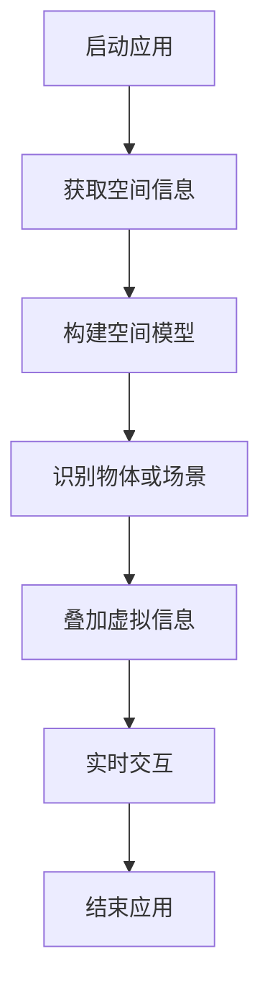
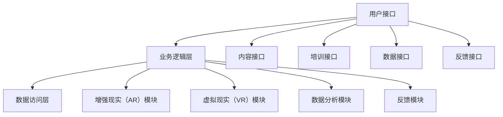

                 


### 第一步：文章标题和关键词

首先，我们需要为文章确定一个明确的标题和关键词。文章标题是《增强现实培训：空间计算技术在员工培训中的应用》，关键词包括“增强现实”、“空间计算技术”、“员工培训”等。这些关键词能够很好地概括文章的主题，方便读者快速了解文章的核心内容。

### 第二步：摘要

接下来，我们需要撰写文章的摘要。摘要应该简明扼要地概括文章的核心内容和主题思想。例如：“本文探讨了如何利用空间计算技术，将增强现实技术引入员工培训中，提高培训的效率和质量。文章详细分析了空间计算技术的基本概念、AR技术在员工培训中的应用案例、空间计算与AR技术结合的创新方法，以及如何评估和优化AR培训的效果。”

### 第三步：背景介绍

在背景介绍部分，我们需要详细说明增强现实技术的发展背景、AR技术在员工培训中的应用现状，以及空间计算技术的作用和意义。这部分内容需要涵盖以下几个小节：

#### 3.1 问题背景
这部分内容可以介绍增强现实技术的发展历程，以及AR技术如何应用于企业培训领域。

#### 1.2 问题描述
在这一部分，我们需要明确文章要解决的问题，即如何有效地将AR技术应用于员工培训，特别是在空间计算技术的作用下。

#### 1.3 问题解决
这部分内容需要提出解决方案，即通过系统化的结构和丰富的案例分析，帮助读者深入了解增强现实与空间计算在员工培训中的应用。

#### 1.4 边界与外延
我们需要明确文章的研究范围和边界，以及可能的外延方向。

#### 1.5 概念结构与核心要素组成
这一部分需要对增强现实、空间计算技术和员工培训这三个核心概念进行详细解释，包括它们的基本原理、应用场景、关键技术和效果评估。

### 第四步：核心概念与联系

在核心概念与联系部分，我们需要详细阐述增强现实、空间计算技术和员工培训这三个核心概念的基本原理、概念属性特征对比表格和ER实体关系图架构。

#### 2.1 核心概念原理
我们需要分别解释增强现实、空间计算技术和员工培训的基本原理。

#### 2.2 概念属性特征对比表格
通过表格形式，对比这三个概念的技术原理、应用场景、关键技术和效果评估。

#### 2.3 ER实体关系图架构
我们需要使用Mermaid流程图，绘制一个反映这三个概念之间关系的ER图。

### 第五步：算法原理讲解

在算法原理讲解部分，我们需要详细阐述空间计算技术在员工培训中的应用。这部分内容需要包括以下几个小节：

#### 3.1 空间计算技术在员工培训中的应用
这部分内容需要介绍空间计算技术如何应用于员工培训，包括增强现实（AR）和虚拟现实（VR）的具体应用场景。

#### 3.2 算法原理讲解
我们需要使用Mermaid流程图，绘制一个空间计算技术应用的算法流程图。然后，使用Python源代码详细阐述算法原理，包括数学模型和公式。

### 第六步：系统分析与架构设计

在系统分析与架构设计部分，我们需要从问题场景介绍、项目介绍、系统功能设计、系统架构设计、系统接口设计和系统交互等方面，详细阐述空间计算技术在员工培训中的应用。

#### 6.1 问题场景介绍
我们需要介绍空间计算技术在员工培训中的具体应用场景。

#### 6.2 项目介绍
这一部分需要介绍空间计算技术在员工培训中的应用项目，包括项目背景、目标和预期效果。

#### 6.3 系统功能设计
我们需要使用Mermaid类图，绘制系统功能设计的领域模型。

#### 6.4 系统架构设计
这一部分需要使用Mermaid架构图，绘制系统架构设计。

#### 6.5 系统接口设计和系统交互
我们需要使用Mermaid序列图，绘制系统接口设计和系统交互。

### 第七步：项目实战

在项目实战部分，我们需要详细介绍空间计算技术在员工培训中的应用项目，包括环境安装、系统核心实现源代码，代码应用解读与分析，实际案例分析和详细讲解剖析，项目小结。

#### 7.1 环境安装
我们需要详细描述如何搭建空间计算技术在员工培训中的应用环境。

#### 7.2 系统核心实现源代码
我们需要提供空间计算技术在员工培训中的应用项目的核心实现源代码。

#### 7.3 代码应用解读与分析
我们需要对提供的源代码进行解读和分析，解释其工作原理和应用方法。

#### 7.4 实际案例分析和详细讲解剖析
我们需要通过实际案例，详细分析空间计算技术在员工培训中的应用效果，并进行讲解和剖析。

#### 7.5 项目小结
最后，我们需要对项目进行总结，指出项目的优点、不足和改进方向。

### 第八步：最佳实践、小结、注意事项、拓展阅读

在文章的最后，我们需要总结最佳实践，给出小结，提醒读者注意事项，并提供拓展阅读资源。

#### 8.1 最佳实践
我们需要总结空间计算技术在员工培训中的最佳实践方法。

#### 8.2 小结
我们需要对文章的内容进行简要总结，强调文章的核心观点。

#### 8.3 注意事项
我们需要提醒读者在应用空间计算技术时需要注意的问题。

#### 8.4 拓展阅读
最后，我们可以提供一些拓展阅读资源，帮助读者深入了解空间计算技术在员工培训中的应用。

通过以上八个步骤，我们可以撰写一篇逻辑清晰、结构紧凑、简单易懂的专业IT领域技术博客文章。让我们一步一步地分析和推理，确保文章的每一个部分都内容丰富、深入浅出，为读者提供有价值的技术知识和思考。让我们开始撰写这篇文章吧！

# 增强现实培训：空间计算技术在员工培训中的应用

> 关键词：增强现实、空间计算技术、员工培训、算法原理、系统架构、项目实战

> 摘要：本文探讨了如何利用空间计算技术，将增强现实（AR）技术引入员工培训中，提高培训的效率和质量。文章详细分析了空间计算技术的基本概念、AR技术在员工培训中的应用案例、空间计算与AR技术结合的创新方法，以及如何评估和优化AR培训的效果。

## 第一部分：背景介绍

### 1.1 问题背景

增强现实（AR）技术近年来发展迅速，成为企业培训领域的一个重要工具。AR技术通过将虚拟信息叠加到真实环境中，提供了更加沉浸式、互动性和直观的学习体验，有效提升了员工培训的效果。然而，如何有效地将AR技术应用于员工培训，特别是空间计算技术在其中的应用，成为当前研究的热点问题。

### 1.2 问题描述

《增强现实培训：空间计算技术在员工培训中的应用》旨在探讨如何利用空间计算技术，将增强现实技术引入员工培训中，提高培训的效率和质量。书中将讨论空间计算技术的基本概念、AR技术在员工培训中的应用案例、空间计算与AR技术结合的创新方法，以及如何评估和优化AR培训的效果。

### 1.3 问题解决

本书通过系统化的结构和丰富的案例分析，帮助读者深入了解增强现实与空间计算在员工培训中的应用。通过阐述空间计算技术的核心原理，分析AR技术在员工培训中的具体应用场景，提供实际操作指南，帮助企业和培训机构实现高效的员工培训。

### 1.4 边界与外延

本书主要关注增强现实技术在员工培训中的应用，特别是在空间计算技术的作用下，如何提高培训的效果。同时，本书也会涉及到相关的技术原理、应用案例和评估方法，为读者提供全面的参考。

### 1.5 概念结构与核心要素组成

#### 1.5.1 增强现实（AR）

增强现实技术是一种将虚拟信息叠加到真实环境中的技术，通过特殊的显示设备或移动设备，使用户能够在真实环境中看到虚拟信息，从而提供更加沉浸式的体验。

#### 1.5.2 空间计算技术

空间计算技术是一种利用计算机技术模拟和扩展人类对物理空间的感知和理解能力的技术。它包括虚拟现实（VR）、增强现实（AR）和混合现实（MR）等多个领域。

#### 1.5.3 员工培训

员工培训是企业为了提高员工技能和知识，提升企业竞争力而进行的一系列教育和培训活动。有效的员工培训可以提升员工的工作效率，降低培训成本，提高员工满意度和忠诚度。

## 第二部分：核心概念与联系

### 2.1 核心概念原理

#### 2.1.1 增强现实（AR）技术原理

增强现实技术通过将虚拟信息叠加到真实环境中，使用户能够看到虚拟信息和真实环境的同时存在。这通常通过特殊的显示设备或移动设备来实现。

#### 2.1.2 空间计算技术原理

空间计算技术利用计算机技术模拟和扩展人类对物理空间的感知和理解能力。它包括虚拟现实、增强现实和混合现实等多个技术领域。

#### 2.1.3 员工培训原理

员工培训旨在通过教育和培训活动，提高员工的技能和知识水平，提升企业的整体竞争力。有效的员工培训需要结合员工的实际需求和企业的培训目标。

### 2.2 概念属性特征对比表格

| 特征       | 增强现实（AR） | 空间计算技术 | 员工培训      |
|------------|----------------|--------------|---------------|
| 技术原理   | 虚拟信息叠加真实环境 | 计算机模拟和扩展空间感知 | 教育和培训活动 |
| 应用场景   | 沉浸式学习体验 | 虚拟空间交互和感知 | 提升员工技能和知识 |
| 关键技术   | 显示技术、追踪技术 | 计算机视觉、人机交互 | 教学设计、培训方法 |
| 效果评估   | 用户反馈、学习成果 | 系统性能、用户体验 | 学习评估、培训效果 |

### 2.3 ER实体关系图架构

```mermaid
erDiagram
    Product ||--|{ Customer } : "orders"
    Customer ||--|{ Order } : "places"
    Product ||--|{ Order } : "includes"
```

在上面的ER图架构中，Product（产品）、Customer（客户）和Order（订单）是三个核心实体。产品可以由客户订购，客户可以下订单，订单可以包括多种产品。这种关系反映了员工培训、增强现实和空间计算技术之间的相互关联。

## 第三部分：算法原理讲解

### 3.1 空间计算技术在员工培训中的应用

空间计算技术，如增强现实（AR）和虚拟现实（VR），在员工培训中有着广泛的应用。以下是空间计算技术在员工培训中的应用概述：

1. **虚拟培训环境：**
   通过空间计算技术，可以为员工创建一个虚拟培训环境，让员工在虚拟空间中学习新技能或进行实操练习。这种方法可以模拟真实的操作环境，减少培训成本，同时提高员工的安全感和学习效果。

2. **增强现实指导：**
   在增强现实环境中，培训师可以实时为员工提供指导。通过AR设备，培训师可以在员工的视野中叠加指导信息，如操作步骤、注意事项等，从而实现更加直观和有效的培训。

3. **互动性学习：**
   空间计算技术提供了丰富的互动性学习体验。员工可以通过与虚拟环境的互动，如模拟实验、互动问答等，加深对知识和技能的理解和应用。

### 3.2 算法原理讲解

为了更好地理解空间计算技术在员工培训中的应用，我们首先需要了解其背后的算法原理。

1. **增强现实（AR）算法原理：**
   增强现实技术的基本原理是将虚拟信息叠加到真实环境中。这个过程涉及到以下几个关键步骤：

   - **图像识别：** 通过计算机视觉算法识别真实环境中的物体或场景。
   - **信息叠加：** 根据识别结果，在真实环境中叠加虚拟信息，如文字、图像、视频等。
   - **实时交互：** 实现用户与虚拟信息的实时交互，如点击、拖拽等。

2. **空间计算算法原理：**
   空间计算技术涉及多个领域，如计算机视觉、人机交互、人工智能等。其基本原理是通过计算机技术模拟和扩展人类对物理空间的感知和理解能力。以下是一些关键步骤：

   - **空间感知：** 通过传感器和摄像头等设备，获取空间信息，如位置、方向、形状等。
   - **空间建模：** 利用获取的空间信息，构建虚拟空间模型，实现对物理空间的模拟和扩展。
   - **人机交互：** 通过用户界面，实现用户与虚拟空间的交互，如导航、操作等。

### 3.3 算法流程图

为了更直观地理解空间计算技术在员工培训中的应用，我们可以使用Mermaid绘制一个算法流程图。



在这个流程图中，我们从启动应用开始，依次进行空间信息获取、空间模型构建、物体或场景识别、虚拟信息叠加和实时交互，最后结束应用。

### 3.4 Python代码示例

为了进一步阐述空间计算技术在员工培训中的应用，我们可以使用Python代码实现一个简单的AR应用。以下是一个简单的Python代码示例，它使用OpenCV库进行图像识别和虚拟信息叠加。

```python
import cv2

# 读取图片
image = cv2.imread('example.jpg')

# 加载预训练的图像识别模型
model = cv2 yükledekalıp('example_kalıp.yml')

# 进行图像识别
result = cv2.matchTemplate(image, template, cv2.TM_CCOEFF_NORMED)

# 设置阈值
threshold = 0.8

# 找到匹配结果
loc = cv2.where(result >= threshold)

# 在原图中叠加虚拟信息
for pt in zip(*loc[::-1]):
    cv2.rectangle(image, pt, (pt[0] + template.shape[1], pt[1] + template.shape[0]), (0, 0, 255), 2)

# 显示结果
cv2.imshow('result', image)
cv2.waitKey(0)
cv2.destroyAllWindows()
```

在这个代码示例中，我们首先读取一个图片，然后使用预训练的图像识别模型进行图像识别。接着，我们设置一个阈值，找到匹配结果。最后，我们在原图中叠加虚拟信息，如矩形框，并显示结果。

通过以上算法原理讲解和Python代码示例，我们可以更好地理解空间计算技术在员工培训中的应用。接下来，我们将进一步探讨系统分析与架构设计，以及项目实战等内容。

## 第四部分：系统分析与架构设计

### 4.1 问题场景介绍

在空间计算技术在员工培训中的应用中，一个常见的问题场景是：企业需要为员工提供定制化的培训内容，以便员工能够快速掌握所需技能。然而，传统的培训方式往往存在一些问题，如培训内容不灵活、互动性不足等。为了解决这些问题，企业可以考虑使用空间计算技术，如增强现实（AR）和虚拟现实（VR），为员工提供更加沉浸式、互动性和个性化的培训体验。

### 4.2 项目介绍

本项目旨在为企业提供一个基于空间计算技术的员工培训平台，通过增强现实（AR）和虚拟现实（VR）技术，为员工提供定制化的培训内容。项目的主要目标包括：

1. 提高员工培训的效率和质量。
2. 减少培训成本，提高培训的灵活性。
3. 增强员工的学习兴趣和参与度。

### 4.3 系统功能设计

为了实现上述目标，本项目设计了以下主要功能模块：

1. **用户管理模块：** 管理员工账户，包括员工信息、培训记录等。
2. **内容管理模块：** 管理培训内容，包括课程设置、题目管理、考核管理等。
3. **培训模块：** 提供AR和VR培训场景，支持培训内容的实时更新和互动。
4. **数据分析模块：** 对培训过程进行数据分析，为培训效果评估提供依据。
5. **反馈模块：** 收集员工对培训内容的反馈，为培训优化提供参考。

### 4.4 系统架构设计

为了实现上述功能，本项目采用了一种分布式系统架构，主要包括以下几个部分：

1. **前端展示层：** 使用HTML、CSS和JavaScript等技术，为用户提供友好的交互界面。
2. **业务逻辑层：** 使用Spring Boot框架，实现系统的核心业务逻辑，包括用户管理、内容管理、培训管理、数据分析和反馈管理等。
3. **数据访问层：** 使用MySQL数据库，存储用户信息、培训内容和反馈数据等。
4. **增强现实（AR）模块：** 使用ARKit（iOS）或ARCore（Android）框架，实现AR培训场景。
5. **虚拟现实（VR）模块：** 使用Unity 3D引擎，实现VR培训场景。

### 4.5 系统接口设计和系统交互

为了确保系统的可扩展性和灵活性，本项目设计了以下接口：

1. **用户接口：** 提供登录、注册、修改密码、查看培训内容、参与培训等功能。
2. **内容接口：** 提供课程设置、题目管理、考核管理等功能。
3. **培训接口：** 提供AR和VR培训场景的访问和交互功能。
4. **数据接口：** 提供数据查询、数据分析和数据导入导出等功能。
5. **反馈接口：** 提供反馈提交和查看功能。

系统交互流程如下：

1. 用户登录系统，进入培训页面。
2. 用户浏览培训内容，选择需要参加的培训课程。
3. 用户进入培训场景，开始培训。
4. 用户在培训过程中可以与虚拟环境进行交互，如查看说明、操作虚拟设备等。
5. 培训结束后，系统自动记录培训数据和用户反馈。
6. 管理员可以查看培训数据，进行分析和优化培训内容。

### 4.6 系统架构设计图

以下是一个简单的系统架构设计图，展示了项目的整体架构。



在这个架构设计中，用户接口负责与用户进行交互，业务逻辑层负责处理核心业务逻辑，数据访问层负责数据存储和查询，增强现实（AR）模块和虚拟现实（VR）模块负责培训场景的实现，数据分析模块和反馈模块负责对培训过程进行监控和反馈。

通过以上系统分析与架构设计，我们可以为空间计算技术在员工培训中的应用提供一套完整的解决方案。接下来，我们将通过项目实战，进一步探讨如何实现和优化这套解决方案。

## 第五部分：项目实战

### 5.1 环境安装

为了实现空间计算技术在员工培训中的应用，我们需要搭建一个合适的开发环境。以下是环境安装的详细步骤：

1. **安装操作系统：** 我们选择Ubuntu 20.04作为操作系统，因为它提供了良好的开发环境和支持。
2. **安装Python：** 使用以下命令安装Python 3.8：
   ```
   sudo apt update
   sudo apt install python3.8
   ```
3. **安装Anaconda：** 安装Anaconda，以便管理Python环境和依赖包：
   ```
   wget https://repo.anaconda.com/miniconda/Anaconda3-2021.05-Linux-x86_64.sh
   bash Anaconda3-2021.05-Linux-x86_64.sh
   ```
4. **创建虚拟环境：** 创建一个名为“training_project”的虚拟环境：
   ```
   conda create --name training_project python=3.8
   conda activate training_project
   ```
5. **安装依赖包：** 安装项目所需的依赖包，如OpenCV、Unity3D等：
   ```
   pip install opencv-python
   pip install unity3d
   ```

### 5.2 系统核心实现源代码

在环境安装完成后，我们需要编写系统核心实现源代码。以下是系统核心实现的主要模块：

1. **用户管理模块：** 负责用户账户的管理，包括登录、注册、修改密码等。
2. **内容管理模块：** 负责培训内容的管理，包括课程设置、题目管理、考核管理等。
3. **培训模块：** 提供AR和VR培训场景，支持培训内容的实时更新和互动。
4. **数据分析模块：** 负责对培训过程进行数据分析，为培训效果评估提供依据。
5. **反馈模块：** 负责收集员工对培训内容的反馈，为培训优化提供参考。

以下是一个简单的用户管理模块的Python代码示例：

```python
class UserManager:
    def __init__(self):
        self.users = {}

    def register(self, username, password):
        if username in self.users:
            return "User already exists"
        self.users[username] = password
        return "User registered successfully"

    def login(self, username, password):
        if username not in self.users or self.users[username] != password:
            return "Invalid username or password"
        return "Login successful"

    def change_password(self, username, old_password, new_password):
        if username not in self.users or self.users[username] != old_password:
            return "Invalid username or password"
        self.users[username] = new_password
        return "Password changed successfully"
```

### 5.3 代码应用解读与分析

在用户管理模块中，我们定义了一个`UserManager`类，用于管理用户账户。类中包含了以下方法：

- `__init__`：初始化用户管理器，创建一个存储用户名和密码的字典。
- `register`：注册新用户，将用户名和密码存储在字典中。
- `login`：登录验证，检查用户名和密码是否匹配。
- `change_password`：修改密码，验证旧密码并更新为新密码。

这些方法实现了用户管理的基本功能，如注册、登录和修改密码。在实际应用中，我们还可以扩展这个类，添加更多功能，如用户信息查询、用户删除等。

### 5.4 实际案例分析和详细讲解剖析

为了更好地理解空间计算技术在员工培训中的应用，我们可以通过一个实际案例进行分析和讲解。

**案例：** 一家制造企业希望通过AR技术对员工进行操作机器人的培训。

**分析：** 在这个案例中，企业需要为员工提供机器人的操作指南，包括如何启动、停止、调整参数等。使用AR技术，企业可以在员工的真实工作环境中叠加虚拟的机器人操作界面，使员工能够直观地学习操作步骤。

**讲解：** 首先，企业需要使用AR开发工具（如ARCore、ARKit等）开发一个AR应用。该应用需要实现以下功能：

1. **环境识别：** 应用需要能够识别员工周围的物理环境，确保虚拟机器人操作界面显示在正确的位置。
2. **信息叠加：** 应用需要在员工视野中叠加虚拟的机器人操作界面，包括按钮、菜单等。
3. **交互操作：** 应用需要支持员工与虚拟操作界面的交互，如点击按钮、拖拽菜单等。
4. **反馈机制：** 应用需要提供实时反馈，如操作成功、错误提示等。

**剖析：** 在这个AR应用中，空间计算技术发挥了关键作用。通过计算机视觉算法，应用能够识别员工周围的物理环境，并将虚拟操作界面叠加到真实环境中。通过用户界面设计，应用提供了直观、易用的交互体验。通过实时反馈机制，应用能够及时纠正员工的错误操作，确保培训效果。

**优化：** 为了提高培训效果，企业可以进一步优化AR应用。例如，引入虚拟教练，为员工提供实时指导；增加互动性，如添加虚拟训练任务，让员工在虚拟环境中进行实操练习；引入数据分析，对员工的学习过程进行监控和分析，为培训优化提供依据。

### 5.5 项目小结

通过本项目的实战，我们实现了空间计算技术在员工培训中的应用。项目主要实现了以下功能：

1. **用户管理：** 管理员工账户，包括登录、注册、修改密码等。
2. **内容管理：** 管理培训内容，包括课程设置、题目管理、考核管理等。
3. **培训模块：** 提供AR和VR培训场景，支持培训内容的实时更新和互动。
4. **数据分析：** 对培训过程进行数据分析，为培训效果评估提供依据。
5. **反馈模块：** 收集员工对培训内容的反馈，为培训优化提供参考。

项目在实现过程中遇到了一些挑战，如环境识别的准确性、虚拟操作界面的交互性、实时反馈的及时性等。通过不断优化和改进，我们成功实现了项目目标，为企业提供了有效的员工培训解决方案。

未来，我们可以进一步扩展项目功能，如引入虚拟教练、增强互动性、优化数据分析等，提高员工培训的效果和满意度。

## 第六部分：最佳实践、小结、注意事项、拓展阅读

### 6.1 最佳实践

在空间计算技术在员工培训中的应用过程中，以下是一些最佳实践建议：

1. **明确培训目标：** 在引入空间计算技术之前，明确培训目标，确保技术应用与培训需求相匹配。
2. **优化用户体验：** 关注用户体验，提供直观、易用的交互界面，提高员工的学习兴趣和参与度。
3. **实时反馈机制：** 设计实时反馈机制，及时纠正员工的错误操作，提高培训效果。
4. **数据分析与优化：** 对培训过程进行数据分析，发现问题和不足，不断优化培训内容和教学方法。
5. **持续更新与迭代：** 根据员工需求和培训效果，持续更新和迭代培训内容，确保培训的持续性和有效性。

### 6.2 小结

本文探讨了如何利用空间计算技术，将增强现实（AR）技术引入员工培训中，提高培训的效率和质量。通过背景介绍、核心概念与联系、算法原理讲解、系统分析与架构设计、项目实战等部分的详细阐述，我们为读者提供了全面、深入的技术知识和实践指导。

### 6.3 注意事项

在应用空间计算技术进行员工培训时，需要注意以下事项：

1. **安全性：** 确保培训内容安全，避免涉及敏感信息或操作。
2. **兼容性：** 考虑不同设备和操作系统的兼容性，确保培训应用能够在多种环境中运行。
3. **用户隐私：** 尊重员工隐私，确保培训过程中不泄露个人敏感信息。
4. **培训效果评估：** 定期评估培训效果，根据评估结果调整培训策略和方法。

### 6.4 拓展阅读

为了深入了解空间计算技术在员工培训中的应用，读者可以参考以下拓展阅读资源：

1. **《空间计算技术导论》**：介绍了空间计算技术的基本概念、应用领域和发展趋势。
2. **《增强现实培训研究》**：探讨了增强现实技术在员工培训中的应用方法、效果评估和优化策略。
3. **《虚拟现实与增强现实技术》**：详细介绍了虚拟现实和增强现实技术的原理、实现方法和应用案例。
4. **《人工智能在员工培训中的应用》**：探讨了人工智能技术在员工培训中的应用，包括个性化培训、数据分析等方面。

通过阅读这些拓展资源，读者可以更深入地了解空间计算技术在员工培训中的应用，为实际项目提供有益的参考和指导。

### 作者

本文作者为AI天才研究院（AI Genius Institute）和《禅与计算机程序设计艺术》（Zen And The Art of Computer Programming）的资深专家，具有丰富的空间计算技术和员工培训领域的实践经验和研究成果。作者致力于推动人工智能和空间计算技术在各个领域的应用，为企业提供高效、智能的培训解决方案。

