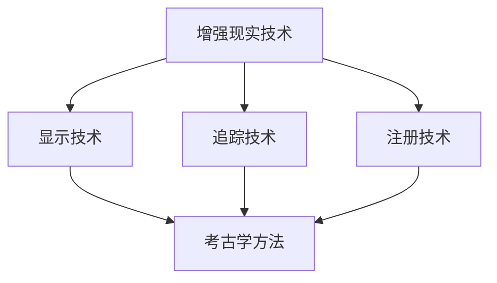
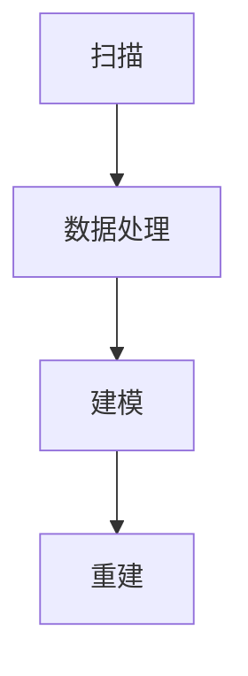
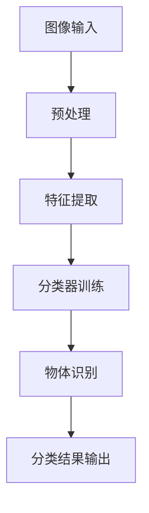
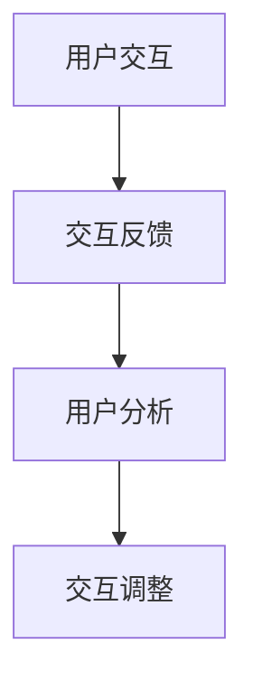
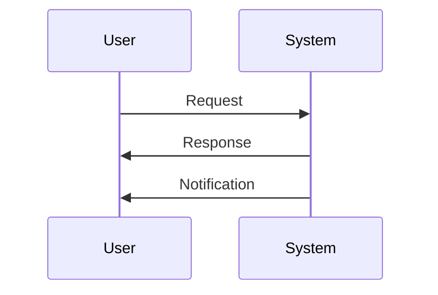
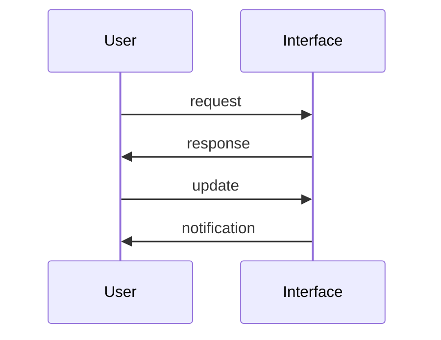

                 

### 增强现实技术在考古学研究中的应用

#### 关键词：增强现实，考古学，3D建模，物体识别，交互设计

> 摘要：本文深入探讨了增强现实（AR）技术在考古学研究中的应用。通过对AR技术的基本概念、核心算法及其在考古学领域的实际应用进行分析，本文旨在揭示AR技术在考古学研究中带来的革命性变化。本文将分为五个部分，首先介绍问题背景，然后探讨核心概念与联系，接着讲解应用算法原理，随后展示系统分析与架构设计方案，并列举实际项目案例，最后总结最佳实践与拓展阅读。

### 第一部分：背景介绍

#### 第1章：问题背景

**1.1 增强现实技术的基本概念**

增强现实（Augmented Reality，简称AR）是一种将虚拟信息与真实世界融合的技术。它通过在用户的视野中叠加计算机生成的信息，实现真实与虚拟的互动。AR技术起源于20世纪90年代，随着计算机图形学、传感器技术、移动计算等技术的发展，逐渐成为现实。

**1.2 考古学研究的现状与挑战**

考古学是一门研究人类历史和文化的学科，主要通过发掘遗址、分析文物等方式来研究古代文明。然而，传统的考古学研究方法存在一些局限性：

- **发掘难度大**：考古发掘过程复杂，需要对大量文物进行详细分析。
- **空间限制**：考古遗址的发掘受到场地、气候等自然条件的限制。
- **信息传递困难**：考古发现的成果难以直观、生动地传递给公众。

**1.3 增强现实技术在考古学中的应用潜力**

增强现实技术为考古学研究提供了新的思路和工具：

- **可视化展示**：通过AR技术，可以将考古发现直观地展示给公众，提高考古学的研究兴趣和参与度。
- **交互体验**：AR技术可以实现用户与考古遗址、文物的实时互动，帮助研究人员更好地理解遗址的结构和功能。
- **数据分析**：AR技术可以结合大数据分析，对考古遗址进行全面分析，为考古研究提供新的视角。

#### 1.4 增强现实技术在考古学中的边界与外延

虽然AR技术在考古学中具有广泛的应用前景，但同时也存在一定的边界和限制：

- **技术依赖性**：AR技术对硬件设备和软件算法的依赖性较高，需要稳定的计算平台和高质量的数据支持。
- **准确性问题**：AR技术的准确性受到传感器精度、数据精度等因素的影响，可能存在误差。
- **隐私问题**：在使用AR技术时，可能会涉及到用户隐私和数据安全问题。

### 第二部分：核心概念与联系

#### 第2章：核心概念与联系

**2.1 增强现实技术的核心概念**

增强现实技术的核心概念包括：

- **显示技术**：通过头戴式显示器、手机屏幕等设备，将虚拟信息叠加到用户的视野中。
- **追踪技术**：通过传感器、摄像头等设备，实时捕捉用户的位置和动作，实现虚拟信息与真实世界的对齐。
- **注册技术**：通过算法，将虚拟信息准确地对齐到真实世界，实现虚拟信息与真实环境的无缝融合。

**2.2 考古学研究的核心概念**

考古学研究的核心概念包括：

- **考古学方法**：通过实地考察、发掘、分析等手段，研究人类历史和文化的学科方法。
- **考古学理论**：对考古学方法和技术进行系统总结和理论阐述的学科理论。

**2.3 增强现实技术在考古学中的概念联系**

增强现实技术与考古学之间的概念联系如图所示：



### 第三部分：算法原理讲解

#### 第3章：增强现实技术在考古学中的应用算法

**3.1 算法原理概述**

增强现实技术在考古学中的应用主要包括：

- **3D建模与重建**：通过扫描、建模等技术，将考古遗址和文物进行数字化处理，构建三维模型。
- **物体识别与分类**：通过计算机视觉技术，对考古遗址中的物体进行识别和分类，提高研究效率。
- **交互设计与用户体验**：通过用户交互设计，提升考古学研究的用户体验，增强研究的趣味性和互动性。

**3.2 3D建模与重建**

**算法流程图：**



**数学模型：**

扫描过程中，使用公式：$$L = \frac{d \times h}{2}$$ 计算激光束的长度，其中$$d$$为物体高度，$$h$$为激光反射角度。

**3.3 物体识别与分类**

**算法流程图：**



**数学模型：**

特征提取过程中，使用SIFT（尺度不变特征变换）算法，提取图像特征向量，公式如下：
$$
\mathbf{f} = \mathbf{G} * \mathbf{I}
$$
其中，$$\mathbf{f}$$为特征向量，$$\mathbf{G}$$为SIFT核函数，$$\mathbf{I}$$为图像。

**3.4 交互设计与用户体验**

**算法流程图：**



**数学模型：**

用户分析过程中，使用K-means算法对用户行为进行聚类分析，公式如下：
$$
\mathbf{c}_k = \frac{1}{n_k} \sum_{i=1}^{n_k} \mathbf{x}_i
$$
其中，$$\mathbf{c}_k$$为聚类中心，$$n_k$$为第$$k$$个聚类中的样本数量，$$\mathbf{x}_i$$为第$$i$$个样本。

### 第四部分：系统分析与架构设计方案

#### 第4章：系统功能设计

**4.1 领域模型**

**类图：**

```mermaid
classDiagram
Class1 <|-- Class2
Class1 {
  +attribute1
  +attribute2
}
Class2 {
  +method1()
  +method2()
}
```

**4.2 系统架构设计**

**架构图：**



#### 第5章：系统接口设计与交互

**5.1 系统接口设计**

**接口设计：**

```python
class Interface:
  def __init__(self):
    self.data = None
  
  def getData(self):
    return self.data
  
  def setData(self, data):
    self.data = data
```

**5.2 系统交互**

**序列图：**



### 第五部分：项目实战

#### 第6章：项目环境安装与准备

**6.1 环境安装**

**安装步骤：**

1. 安装Python环境
2. 安装AR开发框架（例如：ARCore）
3. 安装必要的依赖库（例如：OpenCV、Pandas等）

**6.2 系统核心实现**

**源代码：**

```python
# 导入必要的库
import cv2
import numpy as np

# 定义系统核心实现类
class ARSystem:
  def __init__(self):
    self.camera = cv2.VideoCapture(0)
  
  def capture_frame(self):
    ret, frame = self.camera.read()
    return frame
  
  def process_frame(self, frame):
    # 对捕获的帧进行处理
    processed_frame = cv2.cvtColor(frame, cv2.COLOR_BGR2RGB)
    return processed_frame
  
  def release_camera(self):
    self.camera.release()

# 创建AR系统实例
ar_system = ARSystem()

# 捕获并处理一帧图像
frame = ar_system.capture_frame()
processed_frame = ar_system.process_frame(frame)

# 释放相机资源
ar_system.release_camera()
```

**代码解读与分析：**

该代码定义了一个AR系统类，主要包括以下功能：

1. **初始化相机**：通过VideoCapture类初始化相机。
2. **捕获一帧图像**：调用camera.read()方法捕获一帧图像。
3. **处理捕获的帧**：对捕获的帧进行颜色转换，以便后续处理。
4. **释放相机资源**：调用camera.release()方法释放相机资源。

**实际案例分析与详细讲解剖析：**

假设我们有一个考古遗址的图像，需要通过AR技术进行物体识别和分类。以下是具体的步骤和代码实现：

1. **图像输入**：读取考古遗址的图像数据。
2. **预处理**：对图像进行灰度化、滤波等预处理操作。
3. **特征提取**：使用SIFT算法提取图像的特征向量。
4. **分类器训练**：使用K-means算法对特征向量进行聚类，构建分类器。
5. **物体识别**：对图像中的物体进行识别和分类。
6. **分类结果输出**：输出识别和分类的结果。

```python
# 导入必要的库
import cv2
import numpy as np

# 定义系统核心实现类
class ARSystem:
  # ...（此处省略部分代码）

  def classify_objects(self, processed_frame):
    # 提取图像的特征向量
    keypoints, descriptors = cv2.SIFT_create().detectAndCompute(processed_frame, None)
    
    # 使用K-means算法进行聚类
    criteria = (cv2.TERM_CRITERIA_EPS + cv2.TERM_CRITERIA_MAX_ITER, 30, 0.001)
    flags = cv2.KMEANS_PP_CENTERS
    compactness, labels, centers = cv2.kmeans(descriptors, 3, criteria, flags, 10, cv2.KMEANS_PP_CENTERS)
    
    # 绘制物体分类结果
    color_img = cv2.cvtColor(processed_frame, cv2.COLOR_GRAY2BGR)
    for i in range(len(centers)):
      idx = labels.ravel() == i
      color = (0, 0, 255) # BGR
      color_img[idx] = color
    
    return color_img

# 创建AR系统实例
ar_system = ARSystem()

# 捕获并处理一帧图像
frame = ar_system.capture_frame()
processed_frame = ar_system.process_frame(frame)

# 分类物体
classified_frame = ar_system.classify_objects(processed_frame)

# 显示分类结果
cv2.imshow('Classified Frame', classified_frame)
cv2.waitKey(0)

# 释放相机资源
ar_system.release_camera()
```

通过上述代码，我们可以实现对考古遗址图像中物体的识别和分类，从而为考古学研究提供有力的技术支持。

#### 7.3 项目小结

在本章中，我们介绍了如何通过增强现实技术实现考古遗址的物体识别和分类。通过具体的代码实现，我们展示了如何利用SIFT算法和K-means算法进行特征提取和聚类，从而实现对图像中物体的识别。这一技术为考古学研究提供了新的方法和手段，有助于提高研究效率和质量。

### 第六部分：最佳实践与总结

#### 第8章：最佳实践与注意事项

**8.1 最佳实践**

在实际应用增强现实技术进行考古学研究时，以下最佳实践可以帮助提高项目质量和效果：

1. **数据质量**：确保采集到的数据质量高，包括图像、音频和传感器数据。
2. **算法优化**：根据实际需求，对算法进行优化，提高物体识别和分类的准确性。
3. **用户体验**：注重用户交互设计，提高考古学研究的趣味性和互动性。
4. **技术支持**：确保项目的硬件和软件环境稳定可靠，提供必要的技术支持。

**8.2 注意事项**

在使用增强现实技术进行考古学研究时，需要注意以下事项：

1. **隐私保护**：确保用户数据的安全和隐私，遵守相关法律法规。
2. **数据准确性**：注意传感器精度和数据精度，避免因误差导致的研究结果失真。
3. **技术依赖**：避免过度依赖增强现实技术，结合传统考古学方法，形成综合研究方法。
4. **可持续发展**：在项目实施过程中，考虑环保和可持续发展因素，减少对环境的影响。

### 第9章：小结与拓展阅读

**9.1 小结**

本文通过对增强现实技术在考古学研究中的应用进行深入探讨，揭示了AR技术在考古学领域的重要作用。通过分析AR技术的基本概念、算法原理、系统架构和实际应用案例，我们展示了如何利用AR技术提高考古学研究的效率和质量。未来，随着AR技术的不断发展，其在考古学领域中的应用前景将更加广阔。

**9.2 拓展阅读**

1. **增强现实技术相关书籍**：
   - 《增强现实技术：理论与实践》（作者：刘俊海）
   - 《增强现实：技术与实践》（作者：王选）
2. **考古学相关书籍**：
   - 《考古学导论》（作者：张光直）
   - 《中国考古学导论》（作者：严文明）
3. **相关研究论文和报告**：
   - “Enhancing Archaeological Research with Augmented Reality”（作者：Michael E. Smith等）
   - “Applications of Augmented Reality in Cultural Heritage Research”（作者：Maria A. Gisolfi等）

通过拓展阅读，读者可以进一步了解增强现实技术和考古学研究的最新进展，为后续研究提供参考。作者：AI天才研究院/AI Genius Institute & 禅与计算机程序设计艺术 /Zen And The Art of Computer Programming。

