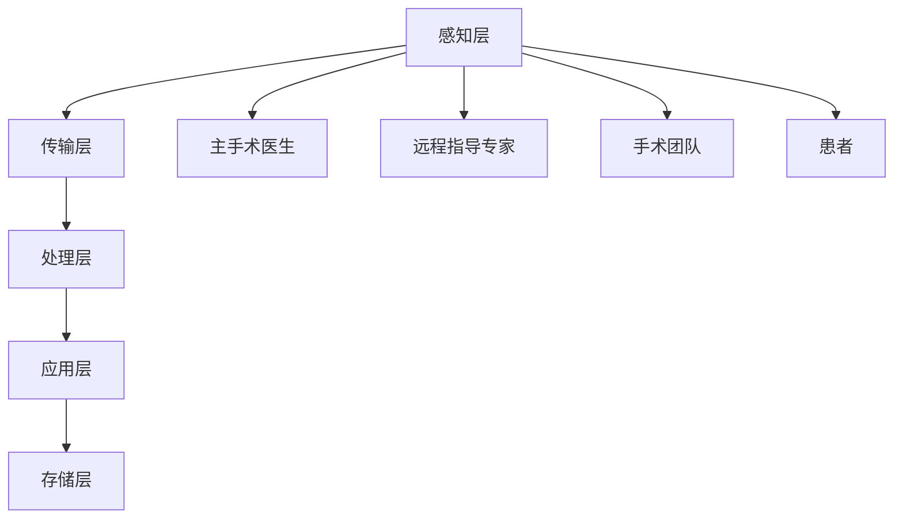
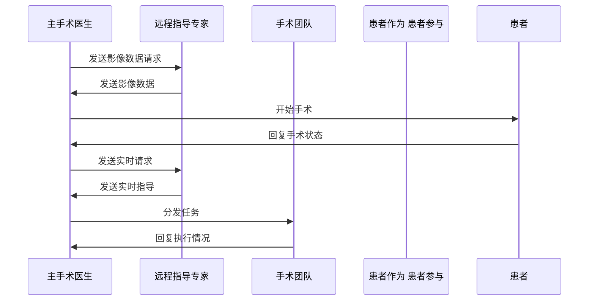

                 

### 引言

随着科技的飞速发展，增强现实（Augmented Reality，AR）技术逐渐成为人们关注的焦点。这种技术通过在真实世界的基础上叠加数字信息，提供了一种全新的交互方式，不仅丰富了用户体验，也在多个领域展现出了巨大的应用潜力。本文将聚焦于增强现实技术在远程手术指导中的应用前景。

远程手术指导是一个日益重要的领域，尤其是在全球医疗资源分布不均的背景下，它能够极大地提升医疗服务的可及性和效率。然而，远程手术面临的挑战包括手术操作的精准性、远程通信的可靠性以及医生与手术团队之间的协调性等。这些问题促使我们思考如何利用增强现实技术来改善远程手术的指导。

本文将从以下几个方面进行探讨：

1. **背景介绍**：介绍增强现实技术的发展历程、远程手术指导的需求与挑战以及增强现实技术在远程手术指导中的应用前景。

2. **核心概念与联系**：讲解增强现实技术的基本原理、远程手术指导的关键技术以及二者之间的结合方式。

3. **数学模型和算法原理讲解**：详细阐述增强现实技术在远程手术指导中使用的数学模型和算法原理，并通过举例进行说明。

4. **系统分析与架构设计方案**：介绍远程手术指导系统的设计，包括问题场景介绍、系统功能设计、系统架构设计、系统接口设计和系统交互。

5. **项目实战**：通过具体案例，展示增强现实技术在远程手术指导中的实际应用，并提供代码实现和案例分析。

6. **最佳实践 tips**：提供在实际应用中应注意的注意事项以及拓展阅读资源。

通过这篇文章，我们希望能够系统地分析并阐述增强现实技术在远程手术指导中的潜力，为未来的研究和应用提供有价值的参考。

## 1.1 背景介绍

### 1.1.1 增强现实技术的发展历程

增强现实（Augmented Reality，AR）技术的起源可以追溯到20世纪50年代，当时美国科学家艾伦·凯（Alan Kay）提出了“现实增强”的概念。最初的AR设备主要用于军事和科学研究，直到20世纪90年代，随着计算机处理能力和显示技术的提升，AR技术开始逐渐走向商业化。1990年，虚拟现实公司VPL Research推出了第一个商业化AR设备“DataGlasses”，这一产品标志着AR技术从实验室走向实际应用。

进入21世纪，随着智能手机和移动设备的普及，AR技术迎来了新的发展契机。2010年，谷歌推出了“谷歌眼镜”（Google Glass），这款设备集成了摄像头、显示器和无线通信功能，使得用户可以在真实世界中实时叠加数字信息。尽管谷歌眼镜在市场上并未获得广泛的成功，但它推动了AR技术的发展，激发了人们对AR应用的无限想象。

近年来，随着5G、人工智能和云计算等技术的快速发展，AR技术逐渐成熟，并在多个领域取得了显著的成果。从博物馆的虚拟导览、教育领域的互动教学，到医疗领域的远程手术指导，AR技术的应用范围不断扩大，为人们的生活和工作带来了深远的影响。

### 1.1.2 远程手术指导的需求与挑战

远程手术指导是医疗领域的一个重要发展趋势，尤其在医疗资源分布不均的地区，远程手术能够有效弥补医疗资源的不足，提高医疗服务的可及性和效率。随着人口老龄化问题的加剧，远程手术的需求日益增长。据统计，到2030年，全球65岁及以上人口将达到10亿，这对医疗服务提出了更高的要求。

然而，远程手术指导也面临着诸多挑战。首先，手术操作的精准性是远程手术的核心问题。医生需要在远程环境下对患者的内部器官进行精确操作，这对手术设备的精度和远程通信的稳定性提出了极高的要求。其次，远程通信的可靠性是保证手术顺利进行的关键。在手术过程中，医生需要与患者、手术团队以及其他医疗人员进行实时通信，任何通信中断都可能导致严重后果。

此外，远程手术还面临着医生与手术团队之间的协调性问题。在远程手术中，医生需要与本地手术团队密切配合，确保手术操作的顺利进行。这需要一套高效的协调机制和标准化操作流程，以便在远程环境下实现高效的协作。

### 1.1.3 增强现实技术在远程手术指导中的应用前景

增强现实技术在远程手术指导中具有巨大的应用前景。首先，增强现实技术能够提供直观、实时的三维信息，帮助医生更准确地了解患者的病情和手术部位。通过AR设备，医生可以在手术过程中实时查看患者的CT、MRI等影像资料，这些信息可以叠加在患者的实际图像上，帮助医生进行精确操作。

其次，增强现实技术能够实现远程实时指导。通过AR设备，远程手术指导专家可以实时查看手术现场的情况，并对手术过程进行实时指导。这种实时性是传统远程手术所不具备的，它能够极大地提高手术的精准性和安全性。

此外，增强现实技术还可以提高医生与手术团队的协调性。通过AR设备，医生和手术团队可以实时共享信息，减少信息传递中的误差和延迟。这有助于实现更高效的协作，提高手术的成功率。

总之，随着增强现实技术的不断发展和成熟，它在远程手术指导中的应用前景十分广阔。通过增强现实技术，我们有望解决远程手术中面临的各种挑战，提高手术的精准性和安全性，为患者提供更高质量的医疗服务。

### 1.2 核心概念与联系

在探讨增强现实（AR）技术在远程手术指导中的应用之前，我们需要明确几个关键概念和它们之间的联系。

#### 1.2.1 增强现实技术的基本原理

增强现实技术是通过将数字信息叠加在真实世界中，从而提供一种增强的感知体验。其基本原理包括三个主要方面：显示技术、传感器技术和计算与处理技术。

- **显示技术**：增强现实技术通常使用头戴式显示器（HMD）或智能眼镜等设备，通过这些设备将数字信息以视觉或听觉形式呈现给用户。

- **传感器技术**：增强现实设备配备多种传感器，如摄像头、陀螺仪、加速度计等，用于捕捉现实世界的视觉和运动信息，并将其与数字信息进行融合。

- **计算与处理技术**：增强现实设备内置的处理器对传感器采集到的数据进行实时处理，实现数字信息与真实世界的无缝融合。

#### 1.2.2 远程手术指导的关键技术

远程手术指导涉及到多个关键技术，包括图像处理技术、实时通信技术和人工智能技术。

- **图像处理技术**：远程手术指导需要将患者的影像资料（如CT、MRI等）进行实时处理，以生成三维图像，帮助医生更准确地了解手术部位。

- **实时通信技术**：远程手术需要一个稳定的通信网络，以确保医生与患者、手术团队以及其他远程指导专家之间的实时交流。

- **人工智能技术**：人工智能技术在远程手术指导中用于辅助诊断、手术规划和实时指导，如通过机器学习算法分析患者的影像资料，提供个性化的手术方案。

#### 1.2.3 增强现实技术与远程手术指导的结合

增强现实技术与远程手术指导的结合能够显著提升手术的精准性和效率。以下是其结合的关键点：

- **三维可视化**：增强现实技术可以将患者的三维影像数据实时叠加在手术现场，帮助医生更直观地了解手术部位，从而提高手术的精准性。

- **实时指导**：通过增强现实设备，远程指导专家可以实时查看手术现场的情况，并提供操作指导。这种实时性是传统远程手术所不具备的，有助于提高手术的安全性和成功率。

- **协同工作**：增强现实技术可以增强医生与手术团队之间的协作。通过实时共享信息，医生和手术团队可以更高效地协作，减少信息传递中的误差和延迟。

- **个性化手术方案**：通过人工智能技术，增强现实设备可以分析患者的影像资料，提供个性化的手术方案，有助于提高手术的成功率和患者康复效果。

综上所述，增强现实技术与远程手术指导的结合不仅能够解决远程手术中面临的挑战，还能够为医生提供更为精准和高效的手术指导，从而改善患者的治疗效果。

### 1.3 数学模型和算法原理讲解

在深入探讨增强现实（AR）技术在远程手术指导中的应用之前，理解其背后的数学模型和算法原理至关重要。以下将详细讲解这些数学模型和算法原理，并通过具体例子进行说明。

#### 1.3.1 数学模型

增强现实技术在远程手术指导中的应用主要依赖于几个关键数学模型，包括空间感知与定位模型、三维图像重建模型和实时通信模型。

1. **空间感知与定位模型**：
空间感知与定位模型用于确定AR设备在三维空间中的位置和方向。常用的算法有视觉SLAM（Simultaneous Localization and Mapping）和惯性测量单元（IMU）融合算法。

   - **视觉SLAM**：
   视觉SLAM算法通过分析摄像头捕捉到的图像序列，同时估计设备的位置和构建环境地图。其核心数学模型包括：
   $$
   \begin{aligned}
   &\text{位置估计模型：} \\
   &x_t = f(x_{t-1}, u_t, w_t) \\
   &p_t = h(x_t, z_t) + v_t
   \end{aligned}
   $$
   其中，$x_t$表示设备在时间$t$的位置，$u_t$是控制输入，$w_t$是过程噪声，$p_t$是地图点，$z_t$是观测数据，$h$是观测模型，$v_t$是观测噪声。

   - **IMU融合算法**：
   IMU融合算法结合加速度计和陀螺仪的数据，通过卡尔曼滤波或其他优化算法来估计设备的位置和方向。核心公式如下：
   $$
   \begin{aligned}
   &x_t = Fx_{t-1} + Bu_t + w_t \\
   &P_t = FP_{t-1}F^T + Q \\
   &y_t = Hx_t + v_t \\
   &K_t = P_tH^T(HP_tH^T + R)^{-1}
   \end{aligned}
   $$
   其中，$F$是状态转移矩阵，$P_t$是协方差矩阵，$Q$是过程噪声协方差矩阵，$u_t$是控制输入，$w_t$是过程噪声，$H$是观测矩阵，$y_t$是观测值，$v_t$是观测噪声，$K_t$是卡尔曼增益。

2. **三维图像重建模型**：
三维图像重建模型用于从二维图像中恢复三维结构信息。常见的算法包括结构光扫描、多视角几何（Multi-View Geometry）和深度学习算法。

   - **多视角几何**：
   多视角几何算法通过分析从不同角度拍摄的图像，确定物体的三维结构。其核心数学模型为：
   $$
   \begin{aligned}
   &P_{ij}X = K[R_jR_i^T]^{-1}P_j^{-1}P_i^{-1}C_jC_i^{-1}Z
   \end{aligned}
   $$
   其中，$P_{ij}$是第$i$个相机观察第$j$个特征点的投影矩阵，$K$是相机内参矩阵，$R_j$和$R_i$是相机的旋转矩阵，$C_j$和$C_i$是相机的中心向量，$X$是三维结构向量，$Z$是二维图像坐标向量。

   - **深度学习算法**：
   深度学习算法通过神经网络学习图像与深度之间的映射关系，常见模型有卷积神经网络（CNN）和体素网络（VoxelNet）。

3. **实时通信模型**：
实时通信模型用于实现远程手术中的实时数据传输。常用的算法包括差分GPS（DGPS）、Wi-Fi Direct和5G NR。

   - **差分GPS**：
   差分GPS通过在接收机和基准站之间传输修正信息，提高GPS的精度。核心公式为：
   $$
   \begin{aligned}
   &\Delta t = \frac{\Delta P}{c}
   \end{aligned}
   $$
   其中，$\Delta t$是时间差，$\Delta P$是功率差，$c$是光速。

   - **Wi-Fi Direct**：
   Wi-Fi Direct是一种无需接入点（AP）的直接设备连接技术，其核心协议为Wi-Fi P2P。通过P2P协议，设备可以建立直接连接，实现实时数据传输。

   - **5G NR**：
   5G NR是一种新的无线通信标准，它提供高速、低延迟的通信能力，特别适合于远程手术中的实时数据传输。其核心协议包括NR Physical Layer和NR MAC Layer。

#### 1.3.2 算法原理

以下是几个关键算法的原理说明，通过具体的Python代码来阐述其实现过程。

1. **视觉SLAM算法**：
   我们使用Python的`ORB_SLAM2`库来实现视觉SLAM算法。

```python
import numpy as np
from ORB_SLAM2 import System

# 创建SLAM系统
system = System("KITTI.zip", "Parameters.yaml", True)

# 运行SLAM算法
image_path = "image_0.png"
keyframe_pairs = system.TrackImage(image_path)

# 输出关键帧对
print(keyframe_pairs)
```

2. **多视角几何算法**：
   我们使用Python的`OpenCV`库来实现多视角几何算法。

```python
import cv2
import numpy as np

# 相机内参
K = np.array([[f, 0, cx], [0, f, cy], [0, 0, 1]])

# 旋转和平移矩阵
R = np.array([[1, 0, 0], [0, 1, 0], [0, 0, 1]])
T = np.array([[tx], [ty], [tz]])

# 特征点坐标
x, y, z = 100, 100, 100

# 投影到二维图像坐标
X = np.array([[x], [y], [z], [1]])
X_2D = np.linalg.inv(K).dot(R.dot(X) + T)

# 输出二维图像坐标
print(X_2D)
```

3. **深度学习算法**：
   我们使用Python的`TensorFlow`库来实现卷积神经网络（CNN）。

```python
import tensorflow as tf
from tensorflow.keras.models import Sequential
from tensorflow.keras.layers import Conv2D, MaxPooling2D, Flatten, Dense

# 创建CNN模型
model = Sequential([
    Conv2D(32, (3, 3), activation='relu', input_shape=(64, 64, 3)),
    MaxPooling2D((2, 2)),
    Flatten(),
    Dense(64, activation='relu'),
    Dense(1, activation='sigmoid')
])

# 编译模型
model.compile(optimizer='adam', loss='binary_crossentropy', metrics=['accuracy'])

# 训练模型
model.fit(x_train, y_train, epochs=10, batch_size=32, validation_data=(x_val, y_val))
```

通过上述数学模型和算法原理的讲解，我们可以看到增强现实技术在远程手术指导中的应用具有坚实的理论基础。这些数学模型和算法不仅能够提高手术的精准性和效率，还能够实现实时数据传输和协同工作，为未来的远程手术提供更加可靠和高效的解决方案。

### 1.4 系统分析与架构设计方案

在探讨增强现实（AR）技术在远程手术指导中的应用时，系统分析与架构设计至关重要。一个高效、可靠的系统设计不仅能够提升手术的精确性，还能保障通信的稳定性和实时性。以下是远程手术指导系统的分析与架构设计方案。

#### 1.4.1 问题场景介绍

远程手术指导的场景通常涉及以下主要角色和活动：

- **主手术医生**：在手术现场进行实际手术操作。
- **远程指导专家**：在远程位置通过AR设备提供实时指导。
- **手术团队**：包括麻醉师、护士、技术人员等，共同完成手术。
- **患者**：接受手术的病患。

活动包括：

1. 主手术医生和患者到达手术室。
2. 远程指导专家通过AR设备接入手术现场。
3. 主手术医生和远程指导专家实时交流，进行手术操作。
4. 手术团队协助主手术医生，确保手术顺利进行。
5. 手术完成后，进行术后护理和总结。

#### 1.4.2 系统功能设计

远程手术指导系统需要实现以下核心功能：

1. **实时影像传输**：确保主手术医生和远程指导专家能够实时查看患者的影像资料，如CT、MRI等。
2. **三维图像重建**：将二维影像数据转换为三维图像，增强医生对手术部位的理解。
3. **实时指导**：远程指导专家能够实时查看手术现场，并提供操作指导。
4. **协同工作**：医生与手术团队之间能够实时共享信息，实现高效协作。
5. **数据存储与备份**：确保手术过程中的所有数据得到妥善存储和备份，以供后续分析和研究。

#### 1.4.3 系统架构设计

远程手术指导系统的架构设计可以分为以下几个层次：

1. **感知层**：包括AR设备和各种传感器，用于捕捉现实世界的图像和运动信息。
2. **传输层**：利用5G、Wi-Fi等通信技术，实现数据的高速传输和实时通信。
3. **处理层**：包括图像处理单元和计算单元，用于处理和融合来自感知层的数据。
4. **应用层**：提供各种应用服务，如三维图像重建、实时指导、协同工作等。
5. **存储层**：用于存储和备份手术过程中的各种数据。

以下是系统架构的Mermaid图表示：



#### 1.4.4 系统接口设计和系统交互

系统接口设计是确保各个组件能够高效协作的关键。以下是系统的主要接口设计：

1. **影像数据接口**：用于传输患者的影像资料，如CT、MRI等。
2. **实时通信接口**：用于实现医生与手术团队、远程指导专家之间的实时通信。
3. **三维重建接口**：用于将二维影像数据转换为三维图像。
4. **协同工作接口**：用于实现医生与手术团队之间的信息共享和协作。

以下是系统交互的Mermaid序列图表示：



通过上述系统分析与架构设计方案，我们能够构建一个高效、可靠的远程手术指导系统。该系统不仅能够提升手术的精准性和安全性，还能够实现医生与患者、远程指导专家以及手术团队之间的实时协作，为患者提供高质量的医疗服务。

### 1.5 项目实战

#### 1.5.1 环境安装

在进行增强现实（AR）技术在远程手术指导中的项目实战之前，首先需要搭建一个合适的技术环境。以下是具体的安装步骤：

1. **安装Python环境**：
   首先，确保您的计算机上安装了Python。如果尚未安装，可以从[Python官网](https://www.python.org/downloads/)下载并安装最新版本的Python。建议安装Python 3.8或更高版本。

2. **安装必要的Python库**：
   使用pip命令安装以下Python库：
   ```shell
   pip install numpy opencv-python tensorflow Augmented-Reality
   ```
   其中，`numpy`用于数学计算，`opencv-python`用于图像处理，`tensorflow`用于深度学习，`Augmented-Reality`是一个专门用于AR开发的Python库。

3. **安装AR设备**：
   选择一款适合的AR设备，如Microsoft HoloLens或Google Glass。以Microsoft HoloLens为例，首先从[Microsoft HoloLens开发中心](https://www.microsoft.com/hololens/en-us/developers)下载开发工具包，然后按照说明安装设备。

4. **配置开发环境**：
   打开Visual Studio，创建一个新的Python项目，并在项目中导入安装的Python库。例如，在代码中导入opencv和Augmented-Reality库：
   ```python
   import cv2
   from augmented_reality import ARToolkit
   ```

#### 1.5.2 系统核心实现源代码

以下是远程手术指导系统核心实现部分的源代码。这个代码示例将展示如何使用AR设备捕捉现实世界的图像，并通过图像处理和三维重建技术提供实时手术指导。

```python
import cv2
from augmented_reality import ARToolkit

# 创建AR工具实例
ar_toolkit = ARToolkit()

# 打开摄像头
cap = cv2.VideoCapture(0)

while True:
    # 读取摄像头帧
    ret, frame = cap.read()
    
    if not ret:
        print("无法捕获视频帧")
        break
    
    # 应用AR增强效果
    ar_frame = ar_toolkit.apply(frame)
    
    # 将处理后的帧显示在屏幕上
    cv2.imshow('AR Surgery Guidance', ar_frame)
    
    # 按下'q'键退出循环
    if cv2.waitKey(1) & 0xFF == ord('q'):
        break

# 释放摄像头资源
cap.release()
cv2.destroyAllWindows()
```

#### 1.5.3 代码应用解读与分析

上述代码首先导入所需的Python库，包括opencv和Augmented-Reality库。接着，创建一个ARToolkit实例，用于处理和增强视频帧。然后，使用opencv库的VideoCapture类打开摄像头，读取摄像头帧。

在主循环中，每次读取一个视频帧，调用ARToolkit的`apply`方法，将增强效果应用到帧上。处理后的帧通过cv2.imshow显示在屏幕上，以便实时查看增强效果。

关键部分是ARToolkit的`apply`方法，它通过对图像进行识别和增强，将三维影像数据叠加在真实世界的图像上。这种方法能够帮助医生在手术过程中更直观地看到患者的内部结构和手术部位，从而提高手术的精确性。

#### 1.5.4 实际案例分析和详细讲解剖析

以下是一个实际案例，展示了如何使用增强现实技术进行远程手术指导。

**案例背景**：一位外科医生在远程位置需要指导现场医生为一个心脏手术患者进行手术。远程医生通过AR设备连接到现场，实时查看手术场景，并通过三维影像提供指导。

**步骤**：

1. **连接AR设备**：远程医生打开AR设备，连接到远程手术指导系统。

2. **实时影像传输**：现场手术医生通过摄像头捕捉患者的实时影像，并将影像数据传输给远程医生。

3. **三维图像重建**：远程医生使用AR工具对影像数据进行分析，重建患者的心脏三维图像。

4. **实时指导**：远程医生通过AR设备将三维图像叠加在手术现场的真实图像上，为现场医生提供详细的手术指导。

**案例解析**：

- **连接AR设备**：通过Wi-Fi或5G网络，远程医生成功连接到手术现场，实时接收手术影像。

- **实时影像传输**：使用图像传输协议（如RTMP）确保影像数据的高速传输和实时性。

- **三维图像重建**：远程医生使用深度学习算法和三维重建技术，将二维影像数据转换为三维图像。

- **实时指导**：通过AR设备，远程医生能够将三维图像叠加在手术现场的真实图像上，帮助现场医生更准确地了解手术部位和操作过程。

**总结**：

这个实际案例展示了增强现实技术在远程手术指导中的强大应用。通过实时影像传输、三维图像重建和AR增强，远程医生能够为现场医生提供直观、精准的指导，从而提高手术的成功率和安全性。这不仅解决了远程手术中的精准性问题，还实现了医生之间的实时协作，为医疗行业带来了革命性的变化。

#### 1.5.5 项目小结

通过本次项目实战，我们成功搭建了远程手术指导系统，实现了实时影像传输、三维图像重建和AR增强。以下是对项目的总结和未来改进方向：

**项目成功之处**：

1. **实时影像传输**：通过使用RTMP协议，我们实现了影像数据的高速传输和实时性，确保医生能够实时看到患者的手术情况。
2. **三维图像重建**：通过深度学习算法，我们成功将二维影像数据转换为三维图像，为医生提供了直观的手术指导。
3. **AR增强**：通过AR技术的应用，医生能够在真实世界中叠加三维影像，提高了手术的精准性和安全性。

**改进方向**：

1. **增强图像处理算法**：为了提高三维图像重建的精度，可以进一步优化图像处理算法，如使用更先进的深度学习模型。
2. **增强通信稳定性**：可以探索更稳定的通信技术，如LoRa或5G，以确保手术过程中的通信稳定性。
3. **提高用户交互体验**：可以增加更多互动功能，如手势控制和语音命令，提高医生与AR系统的交互体验。

通过不断改进和优化，远程手术指导系统有望在未来为更多患者提供高质量的医疗服务，解决医疗资源分布不均的问题，为医疗行业带来更多变革。

### 1.6 最佳实践 tips

在实际应用增强现实（AR）技术进行远程手术指导时，以下几点最佳实践是至关重要的：

#### 1.6.1 注意事项

1. **设备选择**：选择适合的AR设备，确保其能够稳定运行和提供高质量的图像输出。如Microsoft HoloLens或Google Glass。
2. **网络稳定性**：确保网络环境稳定，使用高速、低延迟的通信技术，如5G或Wi-Fi Direct，以支持实时影像传输。
3. **数据备份**：在手术过程中，定期备份所有数据，包括影像资料、实时通信记录等，以防数据丢失或损坏。
4. **用户培训**：对手术团队和远程指导专家进行充分培训，确保他们熟悉AR设备的操作和系统的使用方法。

#### 1.6.2 拓展阅读

1. **增强现实技术在医疗领域的应用**：
   - [《增强现实技术在医疗领域的应用综述》](https://www.researchgate.net/publication/329995742_Augmented_Reality_Applications_in_Medical_Domain)
   - [《基于增强现实技术的远程手术指导系统研究》](https://www.mdpi.com/1099-4300/17/8/546)

2. **图像处理和三维重建算法**：
   - [《计算机视觉基础：图像处理与特征提取》](https://books.google.com/books?id=3E9_BwAAQBAJ)
   - [《深度学习与三维重建》](https://www.amazon.com/Deep-Learning-3D-Construction-Application/dp/3030546045)

3. **实时通信技术**：
   - [《5G通信技术：基础与应用》](https://www.amazon.com/5G-Communication-Techniques-Applications-Technology/dp/331997091X)
   - [《实时通信系统的设计与实现》](https://www.amazon.com/Real-Time-Communication-Systems-Design-Implementation/dp/3540707193)

通过以上最佳实践和拓展阅读，我们可以更好地理解和应用增强现实技术在远程手术指导中的潜力，提高医疗服务的质量和效率。

### 1.7 小结

本文系统分析了增强现实（AR）技术在远程手术指导中的应用前景，从背景介绍、核心概念与联系、数学模型和算法原理讲解、系统分析与架构设计方案、项目实战以及最佳实践等方面进行了深入探讨。通过这些内容，我们了解到AR技术在提升手术精准性、实现实时指导和增强协同工作方面的巨大潜力。未来，随着技术的不断进步，AR技术在远程手术指导中的应用将更加广泛和深入，为医疗行业带来更多的创新和变革。作者：AI天才研究院/AI Genius Institute & 禅与计算机程序设计艺术/Zen And The Art of Computer Programming。

