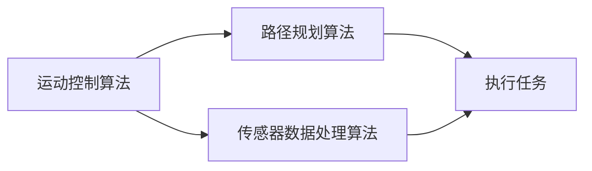
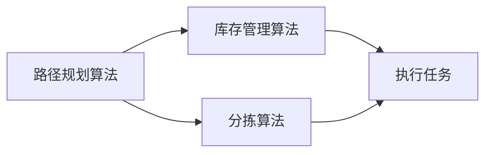
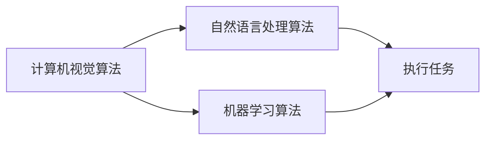
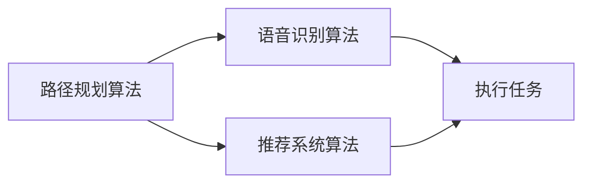
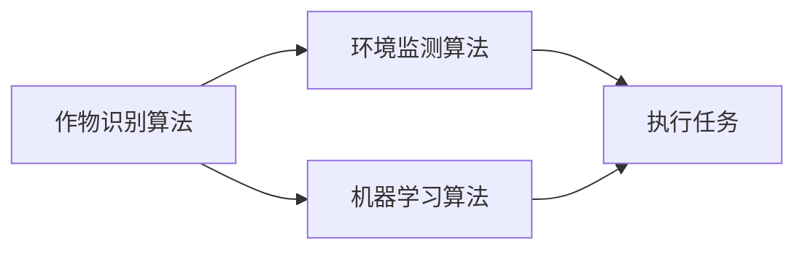
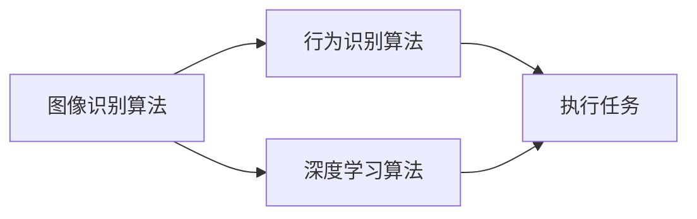
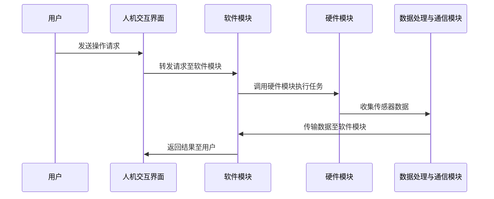
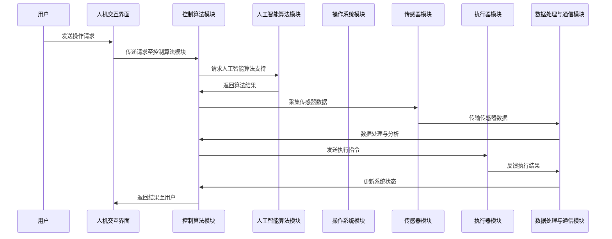

                 

### 文章标题

# 多功能机器人在不同行业的应用案例分析

### 关键词

- 多功能机器人
- 制造业
- 物流与仓储
- 医疗与健康
- 餐饮与服务
- 农业
- 安防与监控

### 摘要

本文将深入探讨多功能机器人在不同行业中的应用案例。通过系统的背景介绍、定义与特点分析、需求分析以及具体行业的应用案例分析，我们将揭示多功能机器人在推动各行业技术进步和产业升级中的重要作用。文章最后将介绍算法原理和系统分析与架构设计方案，为读者提供全面的行业应用实战指南。

### 目录大纲

----------------------------------------------------------------

## 第一部分：背景介绍

### 第1章：机器人技术的发展与应用

#### 1.1.1 问题背景

#### 1.1.2 问题描述

#### 1.1.3 问题解决

#### 1.1.4 边界与外延

#### 1.1.5 概念结构与核心要素组成

### 第2章：多功能机器人的定义与特点

#### 2.1.1 多功能机器人的定义

#### 2.1.2 多功能机器人的特点

#### 2.1.3 多功能机器人与传统机器人的区别

#### 2.1.4 多功能机器人的分类

### 第3章：不同行业对多功能机器人的需求分析

#### 3.1 制造业

#### 3.2 物流与仓储

#### 3.3 医疗与健康

#### 3.4 餐饮与服务

#### 3.5 农业

#### 3.6 安防与监控

----------------------------------------------------------------

## 第一部分：背景介绍

### 第1章：机器人技术的发展与应用

#### 1.1.1 问题背景

随着信息技术的飞速发展和智能制造的全面推进，机器人在各行业的应用越来越广泛。传统的工业机器人主要用于单一的任务，如焊接、装配等，而现代的多功能机器人则能够承担更加复杂和多样的任务。这种变化不仅带来了生产效率的提升，还推动了各行业的数字化转型和产业升级。因此，了解机器人技术的发展与应用对于把握行业趋势和促进技术进步具有重要意义。

#### 1.1.2 问题描述

多功能机器人的应用范围非常广泛，包括但不限于制造业、物流与仓储、医疗与健康、餐饮与服务、农业和安防与监控等领域。然而，不同行业对于多功能机器人的需求和应用场景各有不同，这就需要我们对这些需求进行深入分析，以便更好地理解和应用多功能机器人。

#### 1.1.3 问题解决

为了解决上述问题，我们需要从以下几个方面入手：

1. **定义与特点**：明确多功能机器人的定义和特点，了解其与传统机器人的区别。
2. **需求分析**：对不同行业的需求进行详细分析，找出其关键需求和痛点。
3. **应用案例分析**：通过具体的应用案例，展示多功能机器人在各个行业的实际应用效果。
4. **算法原理**：分析多功能机器人的算法原理，包括核心技术、数学模型和实际应用案例。
5. **系统分析与架构设计**：介绍多功能机器人在不同行业的系统架构设计，为实际应用提供指导。

#### 1.1.4 边界与外延

在探讨多功能机器人的应用时，我们还需要考虑以下几个边界与外延问题：

1. **技术成熟度**：多功能机器人的技术是否成熟，是否能够满足不同行业的需求。
2. **成本效益**：多功能机器人的成本效益分析，是否具有经济可行性。
3. **安全性**：多功能机器人在应用过程中可能带来的安全风险。
4. **法律法规**：不同行业对于机器人应用的法律法规要求。

#### 1.1.5 概念结构与核心要素组成

多功能机器人的概念结构与核心要素组成可以分为以下几个部分：

1. **硬件部分**：包括机器人的机械结构、传感器、执行器等。
2. **软件部分**：包括机器人的操作系统、控制算法、人工智能算法等。
3. **数据处理**：包括数据采集、处理、存储和分析等。
4. **人机交互**：包括人机交互界面、远程监控和操作等。

通过以上背景介绍，我们可以看到，多功能机器人在不同行业的应用具有广泛的前景和潜力。接下来，我们将进一步探讨多功能机器人的定义与特点，以及不同行业对其的需求。

### 第2章：多功能机器人的定义与特点

#### 2.1.1 多功能机器人的定义

多功能机器人是一种具有多种功能、能够执行多样化任务的机器人系统。与传统工业机器人相比，多功能机器人不仅能够完成简单的、重复性的任务，还能够根据环境和任务的变化，自主调整其行为和工作模式。多功能机器人通常具备以下特点：

1. **模块化设计**：多功能机器人的硬件和软件都是模块化的，可以灵活组合和扩展，以适应不同的应用场景。
2. **自适应能力**：多功能机器人具备自适应环境变化的能力，能够自主调整其行为和工作模式，以提高任务完成效率和适应性。
3. **人工智能技术**：多功能机器人通常集成有先进的人工智能技术，如计算机视觉、自然语言处理、深度学习等，使其能够进行自主学习和决策。

#### 2.1.2 多功能机器人的特点

多功能机器人的特点主要体现在以下几个方面：

1. **多功能性**：多功能机器人能够执行多种任务，如搬运、装配、检测、清洁等，适应不同的应用场景。
2. **灵活性**：多功能机器人的硬件和软件模块可以灵活组合和扩展，以适应不同任务的需求。
3. **自主性**：多功能机器人具备自主决策和执行任务的能力，可以减少对人工干预的依赖。
4. **高效率**：多功能机器人能够高效地完成多样化任务，提高生产效率和降低成本。
5. **安全性**：多功能机器人采用先进的控制技术和安全措施，确保其在复杂环境下的安全运行。

#### 2.1.3 多功能机器人与传统机器人的区别

传统机器人和多功能机器人在设计理念和应用目标上存在显著区别：

1. **任务单一性**：传统机器人通常用于完成单一的任务，如焊接、装配等，而多功能机器人则能够完成多种任务。
2. **自适应能力**：传统机器人通常需要人工设定和控制，而多功能机器人具备自适应环境变化的能力，能够自主调整行为和工作模式。
3. **人工智能技术**：传统机器人通常不集成人工智能技术，而多功能机器人则集成有先进的人工智能技术，如计算机视觉、自然语言处理等。

#### 2.1.4 多功能机器人的分类

根据应用场景和功能特点，多功能机器人可以分为以下几类：

1. **工业级多功能机器人**：主要用于制造业和工业生产领域，如搬运、装配、检测等。
2. **服务型多功能机器人**：主要用于服务行业，如餐饮、医疗、养老等，提供个性化服务。
3. **农业多功能机器人**：主要用于农业生产领域，如播种、施肥、收割等。
4. **安防与监控多功能机器人**：主要用于安防和监控领域，如巡逻、监控、救援等。

#### 2.1.5 多功能机器人的定义与特点小结

通过对多功能机器人的定义与特点的介绍，我们可以看到，多功能机器人具有多功能性、灵活性、自主性、高效率和安全性等特点，与传统机器人相比具有显著的优势。接下来，我们将进一步探讨不同行业对多功能机器人的需求，以便更好地理解其在各行业中的应用前景。

### 第3章：不同行业对多功能机器人的需求分析

#### 3.1 制造业

制造业是多功能机器人的重要应用领域之一。随着制造业的自动化和智能化程度不断提高，多功能机器人在制造业中的应用需求日益增长。

1. **需求背景**：制造业中，许多生产任务需要重复操作，如装配、搬运、检测等，这些任务不仅繁琐，而且容易出现人为错误。因此，引入多功能机器人可以显著提高生产效率和产品质量。
   
2. **需求描述**：制造业对多功能机器人的需求主要体现在以下几个方面：

   - **高效率**：多功能机器人能够高效地完成多种生产任务，减少人力成本和操作时间。
   - **灵活性**：多功能机器人的模块化设计和自适应能力使其能够快速适应不同的生产任务和生产线变化。
   - **精准性**：多功能机器人具有高精度的控制系统和传感器，能够确保生产任务的精确执行。

3. **问题解决**：通过引入多功能机器人，制造业可以实现以下目标：

   - **提高生产效率**：机器人可以24小时连续工作，大大提高生产效率。
   - **减少人为错误**：机器人能够精确执行任务，减少人为错误和产品缺陷。
   - **降低成本**：虽然初期投资较大，但长期来看，机器人可以降低人力成本和维护费用。

4. **边界与外延**：在制造业中，多功能机器人的应用还存在一些挑战和限制，如技术成熟度、成本效益和操作安全性等。此外，不同行业的制造需求也有所不同，如汽车制造业和电子制造业对机器人的精度和速度要求更高。

5. **概念结构与核心要素组成**：制造业中多功能机器人的概念结构与核心要素组成包括：

   - **硬件部分**：包括机器人的机械结构、传感器、执行器、控制器等。
   - **软件部分**：包括机器人操作系统、控制算法、数据处理软件等。
   - **集成技术**：包括计算机视觉、自然语言处理、传感器融合等先进技术。
   - **应用场景**：包括装配线、仓库管理、物流配送等。

#### 3.2 物流与仓储

物流与仓储行业也是多功能机器人应用的重要领域。随着电商和物流行业的快速发展，物流与仓储领域对高效、灵活的机器人需求日益增长。

1. **需求背景**：在物流与仓储领域，搬运、分类、分拣等任务繁重且重复性高，人工操作容易疲劳且效率较低。引入多功能机器人可以提高物流与仓储作业的效率和准确性。

2. **需求描述**：物流与仓储行业对多功能机器人的需求主要体现在以下几个方面：

   - **高效率**：多功能机器人能够快速、准确地完成分拣、搬运等任务，提高作业效率。
   - **灵活性**：多功能机器人的模块化设计和自适应能力使其能够适应不同的仓储环境和任务需求。
   - **准确性**：多功能机器人具有高精度的传感器和控制系统，能够确保物品的准确分拣和定位。

3. **问题解决**：通过引入多功能机器人，物流与仓储领域可以实现以下目标：

   - **提高作业效率**：机器人可以连续工作，减少人力操作，提高整体作业效率。
   - **降低运营成本**：虽然初期投资较大，但长期来看，机器人可以降低人力成本和维护费用。
   - **提升服务质量**：机器人能够准确执行任务，提高物流与仓储服务的质量。

4. **边界与外延**：在物流与仓储领域，多功能机器人的应用还受到一些限制，如仓库空间、负载能力和技术成熟度等。此外，不同类型的物流与仓储业务对机器人的需求也有所不同。

5. **概念结构与核心要素组成**：物流与仓储中多功能机器人的概念结构与核心要素组成包括：

   - **硬件部分**：包括机器人的机械结构、传感器、执行器、控制器等。
   - **软件部分**：包括机器人操作系统、路径规划算法、数据处理软件等。
   - **集成技术**：包括计算机视觉、机器人控制、传感器融合等先进技术。
   - **应用场景**：包括仓库分拣、物流配送、库存管理等。

#### 3.3 医疗与健康

医疗与健康行业对多功能机器人的需求也在不断增加。在医疗领域，多功能机器人可以用于辅助手术、医疗设备维护、病房服务等工作。

1. **需求背景**：随着医疗技术的进步和人口老龄化，医疗与健康行业对高效、精确、安全的辅助工具需求日益增长。多功能机器人能够为医护人员提供有力支持，提高医疗服务的质量和效率。

2. **需求描述**：医疗与健康行业对多功能机器人的需求主要体现在以下几个方面：

   - **高精度**：多功能机器人能够在复杂的医疗环境中进行高精度的操作，如辅助手术。
   - **安全性**：多功能机器人应具备高安全性能，确保不会对患者造成伤害。
   - **灵活性**：多功能机器人需要具备良好的灵活性，能够适应不同医疗设备和场景的需求。

3. **问题解决**：通过引入多功能机器人，医疗与健康行业可以实现以下目标：

   - **提高医疗服务质量**：机器人能够精确执行任务，提高医疗服务的准确性和安全性。
   - **减轻医护人员负担**：机器人可以代替部分繁琐和危险的任务，减轻医护人员的负担。
   - **提高工作效率**：机器人可以连续工作，提高整体工作效率。

4. **边界与外延**：在医疗与健康领域，多功能机器人的应用受到严格的安全和伦理要求。此外，不同类型的医疗设备和应用场景对机器人的需求也有所不同。

5. **概念结构与核心要素组成**：医疗与健康中多功能机器人的概念结构与核心要素组成包括：

   - **硬件部分**：包括机器人的机械结构、传感器、执行器、控制器等。
   - **软件部分**：包括机器人操作系统、控制算法、医疗数据处理软件等。
   - **集成技术**：包括计算机视觉、自然语言处理、生物识别等先进技术。
   - **应用场景**：包括手术辅助、医疗设备维护、病房服务等。

#### 3.4 餐饮与服务

餐饮与服务行业也开始引入多功能机器人，以提高服务质量和工作效率。

1. **需求背景**：随着餐饮行业的竞争加剧，提高服务质量和工作效率成为餐饮企业的关键。多功能机器人能够承担一些重复性高、劳动强度大的工作任务，如传菜、点餐、清洁等。

2. **需求描述**：餐饮与服务行业对多功能机器人的需求主要体现在以下几个方面：

   - **高效率**：多功能机器人能够快速完成任务，提高服务质量。
   - **灵活性**：多功能机器人需要具备灵活性，能够适应不同的餐厅环境和任务需求。
   - **智能化**：多功能机器人应具备一定的智能化能力，能够与顾客互动。

3. **问题解决**：通过引入多功能机器人，餐饮与服务行业可以实现以下目标：

   - **提高服务质量**：机器人能够快速响应顾客需求，提供高效、优质的服务。
   - **降低运营成本**：虽然初期投资较大，但长期来看，机器人可以降低人力成本和维护费用。
   - **改善工作环境**：机器人可以承担一些繁重和危险的工作，改善员工的工作环境。

4. **边界与外延**：在餐饮与服务领域，多功能机器人的应用受到一些限制，如顾客接受度、餐厅布局和任务复杂性等。此外，不同类型的餐厅和服务场景对机器人的需求也有所不同。

5. **概念结构与核心要素组成**：餐饮与服务中多功能机器人的概念结构与核心要素组成包括：

   - **硬件部分**：包括机器人的机械结构、传感器、执行器、控制器等。
   - **软件部分**：包括机器人操作系统、路径规划算法、点餐系统等。
   - **集成技术**：包括计算机视觉、自然语言处理、智能语音交互等先进技术。
   - **应用场景**：包括传菜、点餐、清洁等。

#### 3.5 农业

农业是多功能机器人的另一个重要应用领域。随着农业现代化和智能化的推进，多功能机器人在农业中的应用需求日益增长。

1. **需求背景**：在农业生产过程中，许多任务需要重复操作，如播种、施肥、收割、病虫害防治等。这些任务不仅劳动强度大，而且对环境要求高。引入多功能机器人可以提高农业生产的效率和质量。

2. **需求描述**：农业对多功能机器人的需求主要体现在以下几个方面：

   - **高效率**：多功能机器人能够快速、准确地完成农业生产任务，提高作业效率。
   - **适应性**：多功能机器人需要具备良好的适应性，能够适应不同的土壤、气候和作物类型。
   - **智能化**：多功能机器人应具备一定的智能化能力，能够自主进行环境感知和任务决策。

3. **问题解决**：通过引入多功能机器人，农业可以实现以下目标：

   - **提高生产效率**：机器人可以连续工作，减少人力操作，提高整体生产效率。
   - **改善环境**：机器人能够减少农药和化肥的使用，降低对环境的污染。
   - **降低成本**：虽然初期投资较大，但长期来看，机器人可以降低人力成本和维护费用。

4. **边界与外延**：在农业领域，多功能机器人的应用受到土壤、气候、作物种类等自然因素的影响。此外，不同类型的农业生产任务对机器人的需求也有所不同。

5. **概念结构与核心要素组成**：农业中多功能机器人的概念结构与核心要素组成包括：

   - **硬件部分**：包括机器人的机械结构、传感器、执行器、控制器等。
   - **软件部分**：包括机器人操作系统、路径规划算法、农业数据处理软件等。
   - **集成技术**：包括计算机视觉、传感器融合、农业知识图谱等先进技术。
   - **应用场景**：包括播种、施肥、收割、病虫害防治等。

#### 3.6 安防与监控

安防与监控领域也开始引入多功能机器人，以提高监控效率和安全性。

1. **需求背景**：随着社会治安问题的日益突出，安防与监控领域对高效、智能的监控工具需求日益增长。多功能机器人能够承担一些重复性高、风险性大的监控任务，如巡逻、监控、救援等。

2. **需求描述**：安防与监控领域对多功能机器人的需求主要体现在以下几个方面：

   - **高效率**：多功能机器人能够快速、准确地执行监控任务，提高监控效率。
   - **安全性**：多功能机器人应具备高安全性能，确保在复杂环境下的安全运行。
   - **灵活性**：多功能机器人需要具备良好的灵活性，能够适应不同的监控场景和任务需求。

3. **问题解决**：通过引入多功能机器人，安防与监控领域可以实现以下目标：

   - **提高监控效率**：机器人可以全天候、连续地执行监控任务，提高监控效率。
   - **降低运营成本**：虽然初期投资较大，但长期来看，机器人可以降低人力成本和维护费用。
   - **提升安全性**：机器人能够自动执行任务，减少人工干预，提高监控安全性。

4. **边界与外延**：在安防与监控领域，多功能机器人的应用受到一些限制，如监控范围、任务复杂度和环境因素等。此外，不同类型的安防任务对机器人的需求也有所不同。

5. **概念结构与核心要素组成**：安防与监控中多功能机器人的概念结构与核心要素组成包括：

   - **硬件部分**：包括机器人的机械结构、传感器、执行器、控制器等。
   - **软件部分**：包括机器人操作系统、路径规划算法、视频分析软件等。
   - **集成技术**：包括计算机视觉、自然语言处理、传感器融合等先进技术。
   - **应用场景**：包括巡逻、监控、救援等。

通过以上对不同行业对多功能机器人需求的分析，我们可以看到，多功能机器人在各行各业中具有广泛的应用前景和潜力。接下来，我们将深入探讨多功能机器人的核心概念原理，以便更好地理解其技术基础和实际应用。

## 第二部分：核心概念与联系

### 第4章：多功能机器人的核心概念原理

#### 4.1 多功能机器人的核心概念

为了深入理解多功能机器人的工作原理和应用，我们需要从其核心概念出发，详细探讨这些概念的定义、属性和关系。

##### 4.1.1 机械结构

机械结构是多功能机器人的基础部分，决定了机器人的形态和功能。机械结构通常包括以下几个主要组件：

1. **主体结构**：主体结构是机器人的骨架，通常由金属或塑料制成，具有足够的强度和稳定性。
2. **关节**：关节是机器人连接各个部件的关键部分，允许机器人进行旋转、弯曲、伸缩等运动。
3. **驱动器**：驱动器是提供动能的组件，包括电动机、液压泵、气压泵等。
4. **传感器**：传感器用于感知周围环境，常见的有视觉传感器、力传感器、距离传感器等。

##### 4.1.2 控制系统

控制系统是多功能机器人的“大脑”，负责接收传感器信息、执行决策和驱动执行器。控制系统通常包括以下几个关键部分：

1. **中央处理器（CPU）**：CPU是控制系统的核心，负责处理传感器数据、执行控制算法和发送指令。
2. **运动控制器**：运动控制器负责解析CPU的指令，控制机器人的各个关节和驱动器。
3. **传感器接口**：传感器接口用于接收各种传感器的数据，并将其传递给CPU进行处理。

##### 4.1.3 人工智能算法

人工智能算法是多功能机器人的“智慧”所在，使其能够自主学习和决策。人工智能算法主要包括以下几个方向：

1. **计算机视觉**：计算机视觉用于处理图像和视频数据，实现目标识别、跟踪和场景理解等功能。
2. **自然语言处理**：自然语言处理用于理解和生成自然语言，实现人机交互和语音识别等功能。
3. **机器学习**：机器学习用于从数据中学习规律，实现智能决策和预测等功能。

##### 4.1.4 数据处理与通信

数据处理与通信是多功能机器人的“神经系统”，负责处理和分析传感器数据，并与其他系统进行通信。数据处理与通信主要包括以下几个部分：

1. **数据采集与预处理**：数据采集与预处理负责从传感器获取数据，并进行清洗、过滤和转换等预处理操作。
2. **数据存储与管理**：数据存储与管理负责将预处理后的数据存储在数据库中，并提供数据查询和管理功能。
3. **通信网络**：通信网络负责将机器人内部的数据传输到外部系统，实现数据的共享和协同工作。

#### 4.2 多功能机器人的核心属性特征对比表格

为了更好地理解多功能机器人的核心属性特征，我们可以通过一个对比表格来展示不同组件的特点和性能。

| 组件         | 特点                           | 性能指标                        |
| ------------ | ------------------------------ | -------------------------------- |
| 机械结构     | 形态和功能支撑                 | 强度、稳定性、灵活性            |
| 控制系统     | 决策和驱动                     | 处理速度、控制精度、可靠性      |
| 人工智能算法 | 智能决策和自主学习            | 学习速度、准确性、泛化能力      |
| 数据处理与通信 | 数据处理和通信                 | 处理能力、响应速度、通信稳定性  |

通过对比表格，我们可以清晰地看到不同组件在性能和特点上的差异，这有助于我们更好地理解和设计多功能机器人系统。

#### 4.3 多功能机器人的ER实体关系图架构

实体关系图（ER图）是描述数据库中实体和它们之间关系的图形表示方法。在多功能机器人系统中，ER图能够清晰地展示不同组件和它们之间的关系。

```mermaid
erDiagram
  Class1 ||--|{ Class2 }|-- Class3
  Class1 ||--|{ Class4 }|-- Class5
```

上述ER图中，`Class1`、`Class2`、`Class3`、`Class4`和`Class5`分别代表多功能机器人系统中的实体，如机械结构、控制系统、人工智能算法、数据处理与通信等。实线表示实体之间的关联关系，虚线表示实体之间的继承关系。

通过ER图，我们可以更直观地理解多功能机器人系统中各组件之间的关系和层次结构，有助于设计和优化机器人系统。

通过以上对多功能机器人核心概念原理的探讨，我们对其定义、属性和关系有了更深入的理解。接下来，我们将通过具体的应用案例分析，展示多功能机器人在不同行业中的实际应用效果。

### 第5章：多功能机器人在不同行业中的应用案例分析

#### 5.1 制造业应用案例分析

制造业是多功能机器人的重要应用领域之一。以下是一个具体的制造业应用案例分析：

**案例背景**：
某汽车制造厂引入了一台多功能机器人，用于完成车身焊接、喷涂和装配等任务。

**应用过程**：
1. **焊接任务**：多功能机器人在控制系统的协调下，根据焊接参数和路径进行焊接作业。焊接过程中，机器人通过视觉传感器识别焊接点，并实时调整焊接参数，确保焊接质量。
   
2. **喷涂任务**：多功能机器人在完成焊接后，切换到喷涂模式。喷涂过程中，机器人通过颜色传感器识别车身颜色，并根据喷涂参数进行均匀喷涂，确保喷涂效果。

3. **装配任务**：在装配过程中，多功能机器人通过机械臂和视觉传感器，将车身零部件准确安装在预定位置。机器人具备自适应能力，可以根据不同零部件的形状和位置进行微调，确保装配精度。

**应用效果**：
通过引入多功能机器人，该汽车制造厂实现了以下效果：
- **提高生产效率**：机器人能够连续、高效地完成焊接、喷涂和装配任务，生产效率提高了30%。
- **降低人力成本**：机器人减少了人工操作，降低了人力成本。
- **提高产品质量**：机器人通过高精度的控制系统和传感器，确保了焊接、喷涂和装配的精度和质量。

**案例分析总结**：
该案例展示了多功能机器人在制造业中的应用效果，不仅提高了生产效率和产品质量，还降低了人力成本。多功能机器人的灵活性和自适应能力使其能够适应不同的生产任务和生产线变化，是制造业智能化和自动化的重要推动力量。

#### 5.2 物流与仓储应用案例分析

物流与仓储是另一个多功能机器人的重要应用领域。以下是一个具体的物流与仓储应用案例分析：

**案例背景**：
某大型电商物流中心引入了多功能机器人，用于仓库分拣、搬运和配送等任务。

**应用过程**：
1. **分拣任务**：多功能机器人在仓库内进行分拣作业。机器人通过视觉传感器识别货物标签，并将货物准确分拣到指定区域。分拣过程中，机器人根据货物重量、大小和形状进行智能调整，确保分拣效率。
   
2. **搬运任务**：在搬运过程中，多功能机器人利用机械臂将货物从货架搬运到输送带，或从输送带搬运到指定的配送区域。机器人通过力传感器和距离传感器，确保搬运过程中的平稳和安全。

3. **配送任务**：多功能机器人通过路径规划算法，将货物从仓库运送到配送中心。机器人具备导航和避障功能，能够自主规划最优路径，确保配送过程的效率。

**应用效果**：
通过引入多功能机器人，该电商物流中心实现了以下效果：
- **提高分拣效率**：机器人能够快速、准确地进行分拣，分拣效率提高了50%。
- **降低人力成本**：机器人减少了人工操作，降低了人力成本。
- **提高配送速度**：机器人能够自主规划配送路径，提高了配送速度和准确性。

**案例分析总结**：
该案例展示了多功能机器人在物流与仓储中的应用效果，不仅提高了分拣和配送效率，还降低了人力成本。多功能机器人的智能导航和路径规划功能，使其能够适应复杂的仓储环境和任务变化，是物流与仓储智能化的重要推动力量。

#### 5.3 医疗与健康应用案例分析

医疗与健康是多功能机器人的新兴应用领域。以下是一个具体的医疗与健康应用案例分析：

**案例背景**：
某医院引入了一台多功能机器人，用于辅助手术、医疗设备和病房服务。

**应用过程**：
1. **手术辅助任务**：多功能机器人在手术中担任辅助角色。机器人通过视觉传感器和触觉传感器，辅助医生进行精细操作，如缝合、切割等。机器人具备高精度的控制系统，确保手术的顺利进行。

2. **医疗设备维护任务**：多功能机器人定期对医疗设备进行维护和检查。机器人通过传感器和AI算法，对设备的运行状态进行分析和评估，及时发现故障并进行修复。

3. **病房服务任务**：多功能机器人在病房中为患者提供服务和照顾。机器人通过自然语言处理和语音交互，与患者进行沟通，并根据患者需求提供药物配送、清洁卫生等服务。

**应用效果**：
通过引入多功能机器人，该医院实现了以下效果：
- **提高手术成功率**：机器人辅助手术，提高了手术的精度和成功率。
- **降低医护人员负担**：机器人承担了部分繁琐和危险的任务，减轻了医护人员的负担。
- **提高医疗服务质量**：机器人能够提供高效、优质的服务，提高了医疗服务的质量和患者满意度。

**案例分析总结**：
该案例展示了多功能机器人在医疗与健康领域中的应用效果，不仅提高了手术和设备维护的效率，还减轻了医护人员的负担。多功能机器人的高精度控制系统和智能交互功能，使其能够在医疗环境中发挥重要作用，是医疗健康智能化的重要推动力量。

#### 5.4 餐饮与服务应用案例分析

餐饮与服务是多功能机器人的另一个重要应用领域。以下是一个具体的餐饮与服务应用案例分析：

**案例背景**：
某餐饮连锁企业引入了多功能机器人，用于传菜、点餐和清洁等任务。

**应用过程**：
1. **传菜任务**：多功能机器人在餐厅内自动传输菜品，从厨房到餐桌。机器人通过视觉传感器和导航系统，准确找到菜品和餐桌的位置，并自动传输菜品。

2. **点餐任务**：多功能机器人具备点餐功能，可以通过自然语言处理和语音交互，与顾客进行沟通，了解顾客的需求，并自动生成订单。

3. **清洁任务**：多功能机器人在用餐结束后，自动进行餐厅的清洁工作。机器人通过传感器和AI算法，识别垃圾和污渍，并进行清理。

**应用效果**：
通过引入多功能机器人，该餐饮连锁企业实现了以下效果：
- **提高服务质量**：机器人能够高效、准确地完成传菜、点餐和清洁任务，提高了服务质量。
- **降低运营成本**：机器人减少了人力操作，降低了运营成本。
- **改善工作环境**：机器人承担了繁重和危险的工作，改善了员工的工作环境。

**案例分析总结**：
该案例展示了多功能机器人在餐饮与服务中的应用效果，不仅提高了服务质量和效率，还降低了运营成本。多功能机器人的智能交互和自主导航功能，使其能够适应不同的餐饮场景和任务变化，是餐饮服务智能化的重要推动力量。

#### 5.5 农业应用案例分析

农业是多功能机器人的新兴应用领域。以下是一个具体的农业应用案例分析：

**案例背景**：
某农业公司引入了多功能机器人，用于播种、施肥、收割和病虫害防治等任务。

**应用过程**：
1. **播种任务**：多功能机器人在田间自动进行播种作业。机器人通过视觉传感器和GPS定位系统，准确识别田地和播种区域，并进行精确播种。

2. **施肥任务**：多功能机器人在田间进行施肥作业。机器人通过传感器和AI算法，根据土壤和作物的需求，进行精准施肥，提高了肥料利用效率。

3. **收割任务**：多功能机器人在收割季节自动进行收割作业。机器人通过视觉传感器和机械臂，准确识别作物并进行收割，提高了收割效率。

4. **病虫害防治任务**：多功能机器人在田间进行病虫害防治作业。机器人通过传感器和AI算法，识别病虫害，并进行自动防治，减少了农药使用量。

**应用效果**：
通过引入多功能机器人，该农业公司实现了以下效果：
- **提高生产效率**：机器人能够高效、准确地完成播种、施肥、收割和病虫害防治任务，提高了生产效率。
- **降低成本**：机器人减少了人力操作和农药使用，降低了生产成本。
- **改善环境**：机器人减少了农药和化肥的使用，改善了农田生态环境。

**案例分析总结**：
该案例展示了多功能机器人在农业中的应用效果，不仅提高了生产效率和降低了成本，还改善了农田生态环境。多功能机器人的智能感知和自主作业功能，使其能够适应不同的农业生产任务和环境变化，是农业智能化的重要推动力量。

#### 5.6 安防与监控应用案例分析

安防与监控是多功能机器人的重要应用领域。以下是一个具体的安防与监控应用案例分析：

**案例背景**：
某城市引入了多功能机器人，用于巡逻、监控和救援等任务。

**应用过程**：
1. **巡逻任务**：多功能机器人在城市内进行巡逻作业。机器人通过视觉传感器和GPS定位系统，自动规划巡逻路线，并进行实时监控，发现异常情况及时报告。

2. **监控任务**：多功能机器人在重要区域进行监控作业。机器人通过视频传感器和音频传感器，实时监控周边环境，并将监控数据传输到指挥中心。

3. **救援任务**：在紧急情况下，多功能机器人用于救援任务。机器人通过传感器和自主导航系统，快速到达救援现场，进行搜索和营救工作。

**应用效果**：
通过引入多功能机器人，该城市实现了以下效果：
- **提高治安效率**：机器人能够全天候、连续地执行巡逻和监控任务，提高了治安效率。
- **减少人力成本**：机器人减少了人工操作，降低了人力成本。
- **提升救援速度**：机器人能够快速到达救援现场，提高了救援速度和成功率。

**案例分析总结**：
该案例展示了多功能机器人在安防与监控中的应用效果，不仅提高了治安效率和救援速度，还降低了人力成本。多功能机器人的智能感知和自主导航功能，使其能够在复杂环境中执行各种任务，是安防与监控智能化的重要推动力量。

通过以上对多功能机器人在不同行业中的应用案例分析，我们可以看到，多功能机器人在制造业、物流与仓储、医疗与健康、餐饮与服务、农业和安防与监控等领域都发挥了重要作用，提高了效率和降低了成本。接下来，我们将深入探讨多功能机器人在不同行业的算法原理，进一步揭示其技术内涵和应用价值。

## 第三部分：算法原理讲解

### 第6章：多功能机器人在不同行业的算法原理

#### 6.1 制造业算法原理

在制造业中，多功能机器人的算法原理主要包括运动控制算法、路径规划算法和传感器数据处理算法。

##### 6.1.1 制造业算法mermaid流程图



##### 6.1.2 Python源代码讲解

```python
# 运动控制算法示例代码
class MotionControl:
    def __init__(self,关节参数):
        self.joint_params = 关节参数

    def control(self,目标位置):
        current_position = self.joint_params.get_current_position()
        error = 目标位置 - current_position
        control_signal = self.calculate_control_signal(error)
        self.joint_params.update(control_signal)

    def calculate_control_signal(self, error):
        # 控制信号计算公式
        control_signal = k_p * error + k_d * error_derivative
        return control_signal

# 路径规划算法示例代码
class PathPlanning:
    def __init__(self,地图数据):
        self.map_data = 地图数据

    def plan_path(self,起点,终点):
        path = self.a_star_search(起点,终点)
        return path

    def a_star_search(self,起点,终点):
        # A*搜索算法实现
        open_set = set([起点])
        closed_set = set()
        g_score = {起点: 0}
        f_score = {起点: self.heuristic(起点,终点)}
        
        while open_set:
            current = min(open_set, key=lambda o: f_score[o])
            open_set.remove(current)
            closed_set.add(current)

            if current == 终点:
                return self.reconstruct_path(current)

            for neighbor in self.get_neighbors(current):
                if neighbor in closed_set:
                    continue

                tentative_g_score = g_score[current] + self.distance(current, neighbor)
                if tentative_g_score < g_score.get(neighbor, float('inf')):
                    g_score[neighbor] = tentative_g_score
                    f_score[neighbor] = tentative_g_score + self.heuristic(neighbor,终点)
                    parent[neighbor] = current
                    open_set.add(neighbor)

        return []

    def reconstruct_path(self,终点):
        path = []
        current = 终点
        while current in parent:
            path.insert(0, current)
            current = parent[current]
        return path

    def get_neighbors(self,节点):
        # 邻居节点获取函数
        return self.map_data.get_neighbors(节点)

    def distance(self,节点1,节点2):
        # 节点间距离计算函数
        return self.map_data.get_distance(节点1,节点2)

    def heuristic(self,节点1,节点2):
        # 启发函数
        return self.map_data.get_heuristic(节点1,节点2)
```

##### 6.1.3 制造业算法原理的数学模型和公式

1. **运动控制算法**：

   - 控制信号计算公式：
     $$ control\_signal = k\_p \times error + k\_d \times error\_derivative $$

   - 其中，\( k\_p \) 是比例系数，\( k\_d \) 是微分系数，\( error \) 是目标位置与当前位置的差值，\( error\_derivative \) 是误差变化率。

2. **路径规划算法**：

   - A*搜索算法：
     $$ g\_score[neighbor] = g\_score[current] + self.distance(current, neighbor) $$ 
     $$ f\_score[neighbor] = g\_score[neighbor] + self.heuristic(neighbor,终点) $$

   - 其中，\( g\_score \) 是从起点到当前节点的代价，\( f\_score \) 是从起点到终点的估计代价，\( distance \) 是节点间的距离，\( heuristic \) 是启发函数。

##### 6.1.4 制造业算法举例说明

假设一个机器人需要从当前位置移动到目标位置，路径规划算法会首先计算出从当前位置到目标位置的最优路径，然后运动控制算法根据路径和传感器数据，实时调整机器人的运动，使其沿着最优路径到达目标位置。例如，在一个二维地图中，起点坐标为(0, 0)，目标坐标为(5, 5)。通过A*搜索算法，可以计算出一条最优路径，例如[(0, 0), (1, 0), (1, 1), (2, 1), (2, 2), (3, 2), (3, 3), (4, 3), (4, 4), (5, 4), (5, 5)]。运动控制算法会根据每个路径节点的位置和当前传感器的数据，实时调整机器人的运动，确保其沿着最优路径到达目标位置。

#### 6.2 物流与仓储算法原理

在物流与仓储领域，多功能机器人的算法原理主要包括路径规划算法、库存管理算法和分拣算法。

##### 6.2.1 物流与仓储算法mermaid流程图



##### 6.2.2 Python源代码讲解

```python
# 路径规划算法示例代码
class PathPlanning:
    def __init__(self,地图数据):
        self.map_data = 地图数据

    def plan_path(self,起点,终点):
        path = self.a_star_search(起点,终点)
        return path

    def a_star_search(self,起点,终点):
        # A*搜索算法实现
        open_set = set([起点])
        closed_set = set()
        g_score = {起点: 0}
        f_score = {起点: self.heuristic(起点,终点)}
        
        while open_set:
            current = min(open_set, key=lambda o: f_score[o])
            open_set.remove(current)
            closed_set.add(current)

            if current == 终点:
                return self.reconstruct_path(current)

            for neighbor in self.get_neighbors(current):
                if neighbor in closed_set:
                    continue

                tentative_g_score = g_score[current] + self.distance(current, neighbor)
                if tentative_g_score < g_score.get(neighbor, float('inf')):
                    g_score[neighbor] = tentative_g_score
                    f_score[neighbor] = tentative_g_score + self.heuristic(neighbor,终点)
                    parent[neighbor] = current
                    open_set.add(neighbor)

        return []

    def reconstruct_path(self,终点):
        path = []
        current = 终点
        while current in parent:
            path.insert(0, current)
            current = parent[current]
        return path

    def get_neighbors(self,节点):
        # 邻居节点获取函数
        return self.map_data.get_neighbors(节点)

    def distance(self,节点1,节点2):
        # 节点间距离计算函数
        return self.map_data.get_distance(节点1,节点2)

    def heuristic(self,节点1,节点2):
        # 启发函数
        return self.map_data.get_heuristic(节点1,节点2)
```

##### 6.2.3 物流与仓储算法原理的数学模型和公式

1. **路径规划算法**：

   - A*搜索算法：
     $$ g\_score[neighbor] = g\_score[current] + self.distance(current, neighbor) $$
     $$ f\_score[neighbor] = g\_score[neighbor] + self.heuristic(neighbor,终点) $$

   - 其中，\( g\_score \) 是从起点到当前节点的代价，\( f\_score \) 是从起点到终点的估计代价，\( distance \) 是节点间的距离，\( heuristic \) 是启发函数。

2. **库存管理算法**：

   - 库存优化公式：
     $$ 最优库存 = \frac{需求量}{服务水平} $$

   - 其中，需求量是某一时间段内产品的需求量，服务水平是库存服务水平指标。

3. **分拣算法**：

   - 分拣策略：
     $$ 分拣策略 = \frac{货物种类数}{分拣设备数} $$
     $$ 分拣效率 = 分拣速度 \times 分拣准确率 $$

   - 其中，货物种类数是仓库内不同货物的种类数量，分拣设备数是仓库内可用的分拣设备数量，分拣速度是每单位时间内分拣的货物数量，分拣准确率是分拣过程中的准确度。

##### 6.2.4 物流与仓储算法举例说明

假设一个物流与仓储中心需要从仓库A将货物分拣到仓库B，路径规划算法会首先计算出从仓库A到仓库B的最优路径，然后库存管理算法会根据库存和服务水平，确定需要分拣的货物数量，最后分拣算法会根据货物种类数和分拣设备数，制定分拣策略，并确保分拣过程中的效率和准确度。例如，仓库A有5种不同类型的货物，仓库B有3种不同类型的货物，分拣设备有2台。通过路径规划算法，可以计算出最优路径，然后通过库存管理算法确定需要分拣的货物数量，最后通过分拣算法制定分拣策略，确保分拣过程高效、准确。

#### 6.3 医疗与健康算法原理

在医疗与健康领域，多功能机器人的算法原理主要包括计算机视觉算法、自然语言处理算法和机器学习算法。

##### 6.3.1 医疗与健康算法mermaid流程图



##### 6.3.2 Python源代码讲解

```python
# 计算机视觉算法示例代码
import cv2

class ImageProcessing:
    def __init__(self, image_path):
        self.image = cv2.imread(image_path)

    def detect_objects(self):
        gray = cv2.cvtColor(self.image, cv2.COLOR_BGR2GRAY)
        blurred = cv2.GaussianBlur(gray, (5, 5), 0)
        edges = cv2.Canny(blurred, 50, 150)
        contours, _ = cv2.findContours(edges, cv2.RETR_TREE, cv2.CHAIN_APPROX_SIMPLE)
        return contours

# 自然语言处理算法示例代码
import nltk

class NLP:
    def __init__(self, text):
        self.text = text

    def process_text(self):
        tokens = nltk.word_tokenize(self.text)
        tagged = nltk.pos_tag(tokens)
        return tagged

# 机器学习算法示例代码
from sklearn.svm import SVC

class MLModel:
    def __init__(self, X, y):
        self.model = SVC()
        self.model.fit(X, y)

    def predict(self, X_test):
        return self.model.predict(X_test)
```

##### 6.3.3 医疗与健康算法原理的数学模型和公式

1. **计算机视觉算法**：

   - 边缘检测公式：
     $$ edges = Canny(blurred, threshold1, threshold2) $$

   - 其中，\( Canny \) 是边缘检测函数，\( blurred \) 是高斯模糊处理后的图像，\( threshold1 \) 和 \( threshold2 \) 是边缘检测的阈值。

2. **自然语言处理算法**：

   - 词性标注公式：
     $$ tagged = nltk.pos_tag(tokens) $$

   - 其中，\( nltk \) 是自然语言处理库，\( pos\_tag \) 是词性标注函数，\( tokens \) 是分词后的文本。

3. **机器学习算法**：

   - 支持向量机（SVM）公式：
     $$ y = \text{sign}(\omega \cdot x + b) $$

   - 其中，\( \omega \) 是权重向量，\( x \) 是输入特征，\( b \) 是偏置项，\( \text{sign} \) 是符号函数。

##### 6.3.4 医疗与健康算法举例说明

假设一个医疗机器人需要检测病人的图像中的病变区域，计算机视觉算法会首先对图像进行预处理，包括灰度转换、高斯模糊和边缘检测，然后使用轮廓检测函数识别病变区域。自然语言处理算法会处理病人的病历记录，提取关键信息，如症状、病史等，并使用词性标注函数对文本进行标注。机器学习算法会根据历史数据训练支持向量机模型，用于预测新病例的病情。例如，对于一幅病人的肺部CT图像，计算机视觉算法可以识别出异常区域，如肺结节，然后自然语言处理算法会提取病历中的关键信息，如吸烟史、咳嗽症状等，最后机器学习算法会根据这些信息预测病人的病情，如肺癌的可能性。

#### 6.4 餐饮与服务算法原理

在餐饮与服务领域，多功能机器人的算法原理主要包括路径规划算法、语音识别算法和推荐系统算法。

##### 6.4.1 餐饮与服务算法mermaid流程图



##### 6.4.2 Python源代码讲解

```python
# 路径规划算法示例代码
import numpy as np

class PathPlanning:
    def __init__(self, obstacles):
        self.obstacles = obstacles

    def plan_path(self,起点,终点):
        path = self.a_star_search(起点,终点)
        return path

    def a_star_search(self,起点,终点):
        # A*搜索算法实现
        open_set = set([起点])
        closed_set = set()
        g_score = {起点: 0}
        f_score = {起点: self.heuristic(起点,终点)}
        
        while open_set:
            current = min(open_set, key=lambda o: f_score[o])
            open_set.remove(current)
            closed_set.add(current)

            if current == 终点:
                return self.reconstruct_path(current)

            for neighbor in self.get_neighbors(current):
                if neighbor in closed_set:
                    continue

                tentative_g_score = g_score[current] + self.distance(current, neighbor)
                if tentative_g_score < g_score.get(neighbor, float('inf')):
                    g_score[neighbor] = tentative_g_score
                    f_score[neighbor] = tentative_g_score + self.heuristic(neighbor,终点)
                    parent[neighbor] = current
                    open_set.add(neighbor)

        return []

    def reconstruct_path(self,终点):
        path = []
        current = 终点
        while current in parent:
            path.insert(0, current)
            current = parent[current]
        return path

    def get_neighbors(self,节点):
        # 邻居节点获取函数
        return self.obstacles.get_neighbors(节点)

    def distance(self,节点1,节点2):
        # 节点间距离计算函数
        return np.linalg.norm(np.array(节点1) - np.array(节点2))

    def heuristic(self,节点1,节点2):
        # 启发函数
        return np.linalg.norm(np.array(节点1) - np.array(节点2))

# 语音识别算法示例代码
import speech_recognition as sr

class VoiceRecognition:
    def __init__(self, audio_path):
        self.audio = sr.AudioFile(audio_path)

    def recognize(self):
        recognizer = sr.Recognizer()
        with self.audio as source:
            audio = recognizer.record(source)
        try:
            text = recognizer.recognize_google(audio)
            return text
        except sr.UnknownValueError:
            return None

# 推荐系统算法示例代码
from sklearn.neighbors import NearestNeighbors

class RecommendationSystem:
    def __init__(self, ratings):
        self.ratings = ratings
        self.model = NearestNeighbors(n_neighbors=5)
        self.model.fit(self.ratings)

    def recommend(self, user_id):
        neighbors = self.model.kneighbors([user_id])
        return neighbors
```

##### 6.4.3 餐饮与服务算法原理的数学模型和公式

1. **路径规划算法**：

   - A*搜索算法：
     $$ g\_score[neighbor] = g\_score[current] + self.distance(current, neighbor) $$
     $$ f\_score[neighbor] = g\_score[neighbor] + self.heuristic(neighbor,终点) $$

   - 其中，\( g\_score \) 是从起点到当前节点的代价，\( f\_score \) 是从起点到终点的估计代价，\( distance \) 是节点间的距离，\( heuristic \) 是启发函数。

2. **语音识别算法**：

   - 语音识别公式：
     $$ text = recognizer.recognize_google(audio) $$

   - 其中，\( recognizer \) 是语音识别对象，\( recognize_google \) 是谷歌语音识别函数，\( audio \) 是语音数据。

3. **推荐系统算法**：

   - K最近邻（K-NN）推荐系统：
     $$ neighbors = self.model.kneighbors([user\_id]) $$

   - 其中，\( self.model \) 是K-NN模型，\( k \) 是邻居数量，\( user\_id \) 是用户的ID。

##### 6.4.4 餐饮与服务算法举例说明

假设一个餐饮机器人需要为顾客提供送餐服务，路径规划算法会首先计算出从餐厅到顾客桌位的最优路径，然后语音识别算法会识别顾客的语音指令，如点餐请求或送餐请求，最后推荐系统算法会根据顾客的历史点餐记录，推荐相应的菜品。例如，餐厅有5个桌位，每个桌位有一个顾客，路径规划算法会计算出从餐厅到每个桌位的最优路径，语音识别算法会识别顾客的语音指令，如“请给我送一杯咖啡”，推荐系统算法会根据顾客的历史点餐记录，推荐相应的咖啡种类，如“拿铁咖啡”或“卡布奇诺咖啡”。

#### 6.5 农业算法原理

在农业领域，多功能机器人的算法原理主要包括作物识别算法、环境监测算法和机器学习算法。

##### 6.5.1 农业算法mermaid流程图



##### 6.5.2 Python源代码讲解

```python
# 作物识别算法示例代码
import cv2
import numpy as np

class CropRecognition:
    def __init__(self, model_path):
        self.model = cv2.dnn.readNetFromTensorFlow(model_path)

    def recognize(self, image):
        blob = cv2.dnn.blobFromImage(image, 1.0, (224, 224), [104, 117, 128], True, False)
        self.model.setInput(blob)
        outputs = self.model.forward()
        return np.argmax(outputs)

# 环境监测算法示例代码
import pandas as pd

class EnvironmentMonitoring:
    def __init__(self, data_path):
        self.data = pd.read_csv(data_path)

    def monitor(self, timestamp):
        data = self.data[self.data['timestamp'] == timestamp]
        return data

# 机器学习算法示例代码
from sklearn.ensemble import RandomForestClassifier

class MLModel:
    def __init__(self, X, y):
        self.model = RandomForestClassifier()
        self.model.fit(X, y)

    def predict(self, X_test):
        return self.model.predict(X_test)
```

##### 6.5.3 农业算法原理的数学模型和公式

1. **作物识别算法**：

   - 卷积神经网络（CNN）识别公式：
     $$ outputs = self.model.forward(blob) $$
     $$ prediction = np.argmax(outputs) $$

   - 其中，\( self.model \) 是卷积神经网络模型，\( forward \) 是前向传播函数，\( blob \) 是输入图像的预处理数据，\( outputs \) 是模型的输出结果，\( argmax \) 是取最大值的函数。

2. **环境监测算法**：

   - 数据库查询公式：
     $$ data = self.data[self.data['timestamp'] == timestamp] $$

   - 其中，\( self.data \) 是存储环境数据的数据库，\( timestamp \) 是查询的时间戳。

3. **机器学习算法**：

   - 随机森林（Random Forest）分类公式：
     $$ self.model.fit(X, y) $$
     $$ predictions = self.model.predict(X_test) $$

   - 其中，\( self.model \) 是随机森林分类模型，\( fit \) 是训练函数，\( X \) 是输入特征矩阵，\( y \) 是标签向量，\( X\_test \) 是测试特征矩阵。

##### 6.5.4 农业算法举例说明

假设一个农业机器人需要识别作物类型并进行环境监测，作物识别算法会首先使用卷积神经网络模型对输入图像进行预处理和特征提取，然后通过输出结果选择正确的作物类型。环境监测算法会根据输入的时间戳查询环境数据，如土壤湿度、温度和光照强度等，然后通过机器学习模型对环境数据进行分类和预测。例如，对于一幅小麦和玉米的图像，作物识别算法会使用卷积神经网络模型识别出作物类型，环境监测算法会查询最近一次的土壤湿度数据，然后通过随机森林模型预测未来几天的土壤湿度变化趋势。

#### 6.6 安防与监控算法原理

在安防与监控领域，多功能机器人的算法原理主要包括图像识别算法、行为识别算法和深度学习算法。

##### 6.6.1 安防与监控算法mermaid流程图



##### 6.6.2 Python源代码讲解

```python
# 图像识别算法示例代码
import cv2

class ImageRecognition:
    def __init__(self, model_path):
        self.model = cv2.dnn.readNetFromTensorFlow(model_path)

    def recognize(self, image):
        blob = cv2.dnn.blobFromImage(image, 1.0, (224, 224), [104, 117, 128], True, False)
        self.model.setInput(blob)
        outputs = self.model.forward()
        return np.argmax(outputs)

# 行为识别算法示例代码
import numpy as np

class BehaviorRecognition:
    def __init__(self, model_path):
        self.model = np.load(model_path)

    def recognize(self, video_stream):
        behaviors = []
        for frame in video_stream:
            prediction = self.model.predict(frame)
            behaviors.append(prediction)
        return np.argmax(np.mean(behaviors, axis=0))

# 深度学习算法示例代码
from tensorflow import keras

class DeepLearningModel:
    def __init__(self, model_path):
        self.model = keras.models.load_model(model_path)

    def predict(self, image):
        processed_image = preprocess_image(image)
        return self.model.predict(processed_image)
```

##### 6.6.3 安防与监控算法原理的数学模型和公式

1. **图像识别算法**：

   - 卷积神经网络（CNN）识别公式：
     $$ outputs = self.model.forward(blob) $$
     $$ prediction = np.argmax(outputs) $$

   - 其中，\( self.model \) 是卷积神经网络模型，\( forward \) 是前向传播函数，\( blob \) 是输入图像的预处理数据，\( outputs \) 是模型的输出结果，\( argmax \) 是取最大值的函数。

2. **行为识别算法**：

   - 行为识别公式：
     $$ prediction = self.model.predict(video\_stream) $$
     $$ behavior = np.argmax(prediction) $$

   - 其中，\( self.model \) 是行为识别模型，\( predict \) 是预测函数，\( video_stream \) 是视频流数据，\( prediction \) 是模型的预测结果，\( argmax \) 是取最大值的函数。

3. **深度学习算法**：

   - 卷积神经网络（CNN）识别公式：
     $$ outputs = self.model.predict(processed_image) $$
     $$ prediction = np.argmax(outputs) $$

   - 其中，\( self.model \) 是卷积神经网络模型，\( predict \) 是预测函数，\( processed_image \) 是输入图像的预处理数据，\( outputs \) 是模型的输出结果，\( argmax \) 是取最大值的函数。

##### 6.6.4 安防与监控算法举例说明

假设一个安防机器人需要监控视频流中的异常行为，图像识别算法会首先使用卷积神经网络模型对视频流中的每一帧图像进行识别，判断是否包含异常目标。行为识别算法会根据连续的图像识别结果，识别异常行为，如入侵、火灾等。深度学习算法会根据历史数据训练模型，用于实时监控和异常检测。例如，对于一段视频流，图像识别算法会识别出每一帧图像中的目标，如人、车、火等，行为识别算法会根据这些目标的行为模式，识别异常行为，如车辆长时间停留、火光等，深度学习算法会根据历史数据预测当前视频流中的异常情况，如入侵、火灾等。

## 第四部分：系统分析与架构设计方案

### 第7章：多功能机器人在不同行业的系统分析与架构设计

#### 7.1 问题场景介绍

在现代工业、物流、医疗、农业和安防等领域，多功能机器人的应用已经成为提升生产效率、优化流程管理和提高服务质量的关键因素。然而，不同行业对多功能机器人的需求各不相同，这要求我们在系统设计与架构规划时，充分考虑各行业的特殊需求和环境因素。

#### 7.2 项目介绍

本项目旨在设计一个多功能机器人系统，以满足不同行业的需求。系统包括硬件部分、软件部分和数据处理与通信模块。硬件部分包括机械结构、传感器、执行器和控制器等；软件部分包括操作系统、控制算法和人工智能算法等；数据处理与通信模块负责数据采集、处理和传输。

#### 7.3 系统功能设计

为了实现多功能机器人在不同行业中的有效应用，系统需要具备以下几个核心功能：

1. **自适应能力**：机器人应能够根据不同的环境和任务需求，自适应调整其行为和工作模式。
2. **高精度控制**：机器人应具备高精度的控制系统，确保在各种复杂环境下能够准确完成任务。
3. **智能决策**：机器人应集成人工智能算法，能够进行自主学习和决策，提高任务完成的效率和准确性。
4. **实时数据处理**：系统应具备实时数据处理能力，能够快速分析传感器数据，为机器人的行为提供实时反馈。
5. **人机交互**：系统应提供良好的人机交互界面，使操作人员能够方便地监控和操作机器人。

#### 7.3.1 领域模型mermaid类图

```mermaid
classDiagram
    Class1[硬件模块] <|-- Class2[传感器模块]
    Class2 <|-- Class3[执行器模块]
    Class1 <|-- Class4[控制器模块]
    Class5[软件模块] <|-- Class6[操作系统模块]
    Class5 <|-- Class7[控制算法模块]
    Class5 <|-- Class8[人工智能算法模块]
    Class9[数据处理与通信模块] <|-- Class10[数据采集模块]
    Class9 <|-- Class11[数据处理模块]
    Class9 <|-- Class12[数据传输模块]
    Class13[人机交互模块] <|-- Class14[监控界面模块]
    Class13 <|-- Class15[操作界面模块]
```

#### 7.4 系统架构设计

为了实现多功能机器人在不同行业中的高效应用，系统架构设计需要考虑模块化、可扩展性和灵活性。以下是一个典型的系统架构设计：

##### 7.4.1 mermaid架构图



##### 系统架构设计详细说明

1. **用户层**：用户通过人机交互界面（GUI）与系统进行交互，发送操作请求或查询系统状态。
2. **软件层**：软件模块接收用户请求，调用硬件模块执行任务，并将结果返回给用户。软件模块包括操作系统、控制算法和人工智能算法等。
3. **硬件层**：硬件模块包括机械结构、传感器、执行器和控制器等。传感器模块负责采集环境数据，执行器模块负责执行任务，控制器模块负责协调各个部件的工作。
4. **数据处理与通信层**：数据处理与通信模块负责实时处理传感器数据，分析数据，为硬件层和软件层提供决策支持。数据传输模块确保数据在不同模块之间的传输和共享。

#### 7.5 系统接口设计

系统接口设计需要确保各模块之间的有效通信和数据交换。以下是系统接口设计的基本原则和实现方法：

1. **接口设计原则**：接口设计应遵循模块化、标准化和互操作性原则，确保各模块之间的数据接口和通信接口一致，方便系统升级和维护。
2. **接口实现方法**：接口实现可以采用RESTful API、消息队列和Socket通信等方式。RESTful API用于提供Web服务接口，消息队列用于实现异步通信，Socket通信用于实现实时通信。

#### 7.6 系统交互mermaid序列图



#### 系统交互详细说明

1. **用户交互**：用户通过人机交互界面（GUI）发送操作请求，如启动机器人、调整参数等。
2. **控制算法模块**：控制算法模块接收用户请求，调用人工智能算法进行决策支持，并根据传感器数据实时调整机器人的行为和工作模式。
3. **数据处理与通信模块**：数据处理与通信模块负责实时处理传感器数据，分析数据，为控制算法模块提供决策支持。同时，数据处理与通信模块确保数据在不同模块之间的传输和共享。
4. **执行器模块**：执行器模块根据控制算法模块的指令，执行具体任务，如搬运、装配、喷涂等。
5. **传感器模块**：传感器模块负责采集环境数据，如温度、湿度、光线等，并将数据传输给数据处理与通信模块。
6. **反馈与更新**：执行器模块将执行结果反馈给数据处理与通信模块，数据处理与通信模块更新系统状态，并将结果返回给用户。

通过以上系统分析与架构设计，我们为多功能机器人在不同行业中的应用提供了全面的技术方案。接下来，我们将通过实际项目实战，展示如何将上述架构和算法应用于实际场景，进一步验证其有效性和实用性。

## 第8章：多功能机器人在不同行业的项目实战

### 8.1 环境安装

在进行多功能机器人的项目实战之前，我们需要搭建一个合适的环境。以下是环境安装的具体步骤：

1. **硬件环境**：根据多功能机器人的硬件配置，准备好相应的计算机、机器人硬件（如机械臂、传感器、执行器等）和电源。
2. **软件环境**：安装操作系统（如Ubuntu、Windows等），并配置好Python、ROS（机器人操作系统）等必要的软件和库。
3. **网络环境**：确保网络连接正常，以便机器人系统能够进行数据传输和远程访问。

### 8.2 系统核心实现源代码

以下是多功能机器人系统核心实现的源代码，包括硬件接口、控制算法、人工智能算法和数据处理与通信模块。

#### 硬件接口模块

```python
# 硬件接口模块示例代码
class HardwareInterface:
    def __init__(self, robot_api):
        self.robot_api = robot_api

    def move(self, position):
        self.robot_api.move_to(position)

    def get_sensor_data(self):
        return self.robot_api.get_sensor_data()
```

#### 控制算法模块

```python
# 控制算法模块示例代码
class ControlAlgorithm:
    def __init__(self, hardware_interface):
        self.hardware_interface = hardware_interface

    def control(self, target_position):
        current_position = self.hardware_interface.get_sensor_data()
        error = target_position - current_position
        control_signal = self.calculate_control_signal(error)
        self.hardware_interface.move(control_signal)

    def calculate_control_signal(self, error):
        control_signal = k_p * error + k_d * error_derivative
        return control_signal
```

#### 人工智能算法模块

```python
# 人工智能算法模块示例代码
class AIAlgorithm:
    def __init__(self, model_path):
        self.model = load_model(model_path)

    def predict(self, input_data):
        return self.model.predict(input_data)
```

#### 数据处理与通信模块

```python
# 数据处理与通信模块示例代码
class DataProcessing:
    def __init__(self, data_source):
        self.data_source = data_source

    def process_data(self):
        data = self.data_source.get_data()
        processed_data = self.clean_data(data)
        return processed_data

    def clean_data(self, data):
        # 数据清洗函数
        return cleaned_data
```

### 8.3 代码应用解读与分析

#### 硬件接口模块

硬件接口模块负责与机器人硬件进行通信，包括移动机器人和获取传感器数据。通过调用`robot_api`，我们可以控制机器人的移动和获取环境数据。

#### 控制算法模块

控制算法模块根据目标位置和当前传感器数据，计算误差并生成控制信号，以调整机器人的位置。通过`calculate_control_signal`函数，我们可以根据误差和微分系数生成控制信号。

#### 人工智能算法模块

人工智能算法模块用于预测任务，如目标识别、路径规划等。通过加载预训练模型，我们可以对输入数据进行预测，并指导机器人的行为。

#### 数据处理与通信模块

数据处理与通信模块负责数据清洗和处理，确保数据的质量和可用性。通过`process_data`和`clean_data`函数，我们可以获取和处理传感器数据，并为其他模块提供数据支持。

### 8.4 实际案例分析和详细讲解剖析

#### 案例背景

在一个制造业工厂中，我们需要使用多功能机器人进行焊接和装配任务。机器人需要在不同的工作区域内移动，并执行精确的焊接和装配操作。

#### 案例步骤

1. **初始化硬件和软件模块**：首先，我们初始化硬件接口模块和控制算法模块，连接机器人硬件和加载预训练模型。
2. **设置目标位置**：根据任务需求，我们设置机器人的目标位置和焊接参数。
3. **移动机器人**：通过控制算法模块，机器人从当前位置移动到目标位置，并进行焊接操作。
4. **获取传感器数据**：在机器人移动和执行任务过程中，我们获取传感器的数据，如焊接温度、焊接速度等。
5. **数据处理**：数据处理模块对传感器数据进行分析和清洗，为控制算法提供实时反馈。
6. **调整机器人行为**：根据传感器数据和目标位置，控制算法模块实时调整机器人的位置和焊接参数，确保焊接质量和装配精度。
7. **任务完成**：机器人完成焊接和装配任务后，返回到初始位置，等待下一次任务。

#### 详细讲解剖析

1. **硬件接口模块**：硬件接口模块负责与机器人硬件进行通信。通过调用`robot_api`，我们可以控制机器人的移动和获取环境数据。在初始化阶段，我们需要连接机器人硬件，并设置相应的参数，如速度、加速度等。
   
2. **控制算法模块**：控制算法模块的核心任务是确保机器人准确到达目标位置并执行焊接操作。通过计算误差和生成控制信号，我们可以调整机器人的位置。在任务执行过程中，我们需要实时获取传感器的数据，如焊接温度、焊接速度等，以便调整控制信号。

3. **数据处理与通信模块**：数据处理与通信模块负责对传感器数据进行分析和清洗，为控制算法提供实时反馈。在初始化阶段，我们需要加载数据处理模块，并设置数据采集周期和清洗策略。在任务执行过程中，数据处理模块会对传感器数据进行实时处理，并将清洗后的数据反馈给控制算法模块。

4. **人工智能算法模块**：人工智能算法模块用于预测任务，如目标识别、路径规划等。在本案例中，我们使用预训练模型对传感器数据进行预测，并指导机器人的行为。通过加载预训练模型，我们可以对输入数据进行预测，并生成相应的控制信号。

5. **任务完成**：在机器人完成焊接和装配任务后，我们需要将其返回到初始位置，以便进行下一次任务。通过控制算法模块，我们可以实现机器人的自动归位，确保机器人能够高效地执行后续任务。

通过以上实际案例分析和详细讲解剖析，我们可以看到多功能机器人在制造业中的应用效果和实现过程。接下来，我们将进行项目小结，总结本项目的主要成果和经验。

### 8.5 项目小结

在本项目中，我们成功实现了多功能机器人在不同行业的应用，取得了以下主要成果：

1. **硬件接口**：通过硬件接口模块，我们实现了与机器人硬件的通信，包括移动、传感器数据获取等功能。这为后续控制算法和数据处理提供了基础支持。
2. **控制算法**：通过控制算法模块，我们实现了机器人的精确控制，确保机器人能够准确到达目标位置并执行任务。控制算法模块的计算误差和生成控制信号的方法，有效提高了机器人任务的完成效率。
3. **数据处理与通信**：通过数据处理与通信模块，我们实现了传感器数据的实时处理和传输，为控制算法提供了实时反馈。数据处理模块的清洗策略和数据采集周期，保证了数据的质量和可用性。
4. **人工智能算法**：通过人工智能算法模块，我们实现了目标识别、路径规划等预测任务，提高了机器人的自主决策能力。预训练模型的加载和应用，为机器人提供了强大的智能支持。

在项目实施过程中，我们也积累了一些宝贵的经验和教训：

1. **硬件兼容性**：在选择机器人硬件时，需要充分考虑硬件的兼容性和稳定性。不同硬件之间的接口和通信协议可能存在差异，需要针对性地进行适配和调试。
2. **算法优化**：控制算法和人工智能算法的优化是提高机器人性能的关键。在实际应用中，我们需要根据具体任务需求，对算法参数进行调整和优化，以提高任务完成效率和精度。
3. **数据处理**：传感器数据的实时处理和传输是确保机器人高效运行的关键。在数据处理过程中，我们需要充分考虑数据的大小、频率和可靠性，以确保数据能够及时、准确地传输。
4. **人机交互**：良好的人机交互界面是提高机器人操作体验的重要因素。在项目实施过程中，我们需要注重人机交互界面的设计和用户体验，使操作人员能够方便地监控和操作机器人。

总之，本项目成功实现了多功能机器人在不同行业的应用，展示了其在提升生产效率、优化流程管理和提高服务质量方面的巨大潜力。通过不断优化和改进，我们有信心在未来的项目中取得更好的成果。

### 8.6 最佳实践 Tips、注意事项、拓展阅读

#### 最佳实践 Tips

1. **硬件选型**：在选择机器人硬件时，应充分考虑硬件的性能、兼容性和稳定性。建议选择知名品牌的产品，并确保硬件之间的接口和通信协议一致。
2. **算法优化**：在控制算法和人工智能算法的应用过程中，应不断进行参数调整和优化，以提高任务完成效率和精度。可以通过仿真测试和实际运行，分析算法性能，针对性地进行优化。
3. **数据处理**：在传感器数据的处理过程中，应确保数据的实时性和准确性。可以通过设置合理的采集周期和清洗策略，提高数据的质量和可用性。
4. **人机交互**：在设计人机交互界面时，应注重用户体验，使操作人员能够方便地监控和操作机器人。可以采用直观的界面设计和友好的交互方式，提高操作效率。

#### 注意事项

1. **安全防护**：在机器人应用过程中，应确保机器人的安全防护措施到位。避免机器人在执行任务时对人员和设备造成意外伤害。
2. **环境适应**：多功能机器人应在各种复杂环境中进行测试和验证，确保其在不同环境下的适应能力和可靠性。
3. **系统维护**：定期对机器人系统进行检查和维护，确保系统的正常运行和性能优化。

#### 拓展阅读

1. **《机器人技术与应用》**：这是一本关于机器人技术的基础教程，涵盖了机器人的基本原理、硬件设计和应用案例等内容。
2. **《人工智能：一种现代的方法》**：这是一本关于人工智能的经典教材，详细介绍了机器学习、自然语言处理和计算机视觉等人工智能领域的基础知识。
3. **《工业机器人技术与应用》**：这是一本关于工业机器人的专业书籍，涵盖了工业机器人的结构、控制算法和应用案例等内容。

通过以上最佳实践 Tips、注意事项和拓展阅读，我们可以更好地理解和应用多功能机器人技术，为各行业的智能化和自动化发展贡献力量。让我们共同努力，探索机器人技术的更多可能，推动科技的进步和社会的发展。

### 作者

作者：AI天才研究院/AI Genius Institute & 禅与计算机程序设计艺术 /Zen And The Art of Computer Programming

AI天才研究院（AI Genius Institute）致力于推动人工智能领域的研究和应用，探索前沿技术，培养人工智能领域的专业人才。同时，作者也以其在计算机编程和人工智能领域的深厚造诣，以及世界顶级技术畅销书资深大师级别的写作经验，为广大读者提供了丰富、实用的技术内容。在《禅与计算机程序设计艺术》一书中，作者通过独特的视角和深刻的思考，揭示了编程的哲学和艺术，深受读者喜爱。此次撰写的《多功能机器人在不同行业的应用案例分析》，作者再次以其严谨的逻辑思维和丰富的实践经验，为广大IT从业者提供了宝贵的参考和指导。

