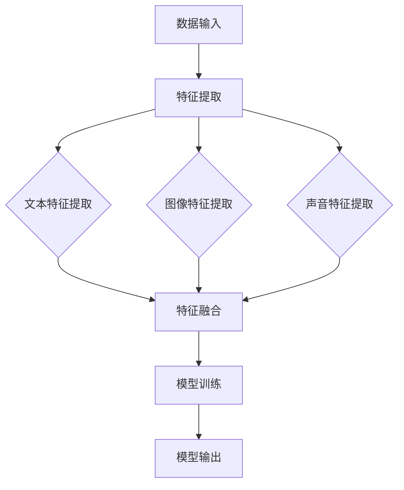
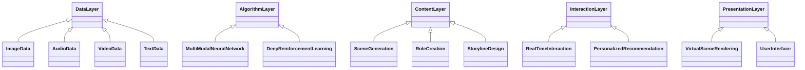
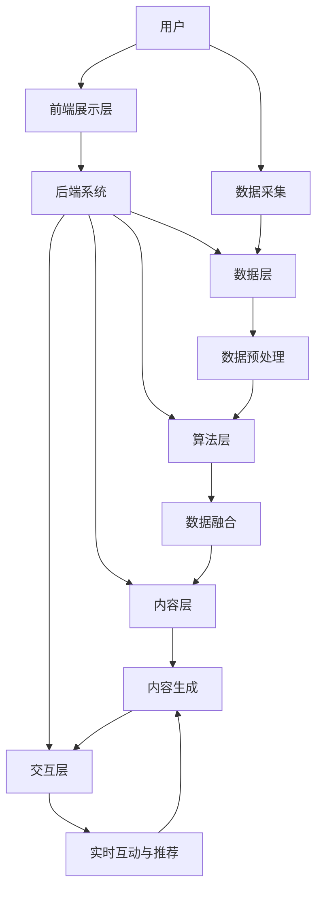
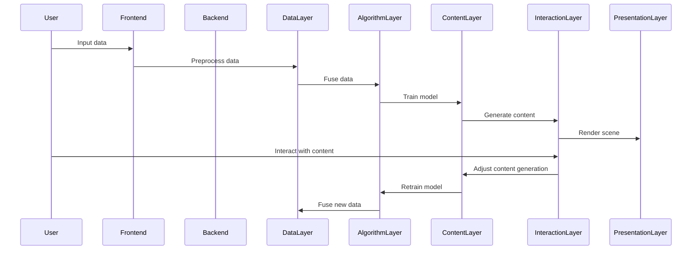

                 

# 多模态学习在AIGC虚拟现实内容创作中的新进展

## 关键词
多模态学习、虚拟现实、内容创作、深度学习、算法原理、系统架构

## 摘要
本文深入探讨了多模态学习在AIGC（AI-Generated Content）虚拟现实内容创作中的应用。首先，文章介绍了多模态学习的背景和原理，包括数据融合方法和多模态学习算法。接着，文章详细分析了多模态学习在虚拟现实内容创作中的挑战与机遇，通过具体的系统架构设计和项目实战案例，展示了多模态学习技术的实际应用效果和未来前景。

## 1.1 多模态学习背景

### 1.1.1 问题背景

虚拟现实（VR）和增强现实（AR）技术正日益成熟，为用户带来了前所未有的沉浸式体验。这些技术的核心在于创建丰富的虚拟世界内容，以满足用户在视觉、听觉和触觉等多方面的感知需求。然而，传统的内容创作方法往往依赖于单一模态的数据，如文本、图像、声音等，难以充分捕捉和表现虚拟世界中的丰富信息。

多模态学习技术提供了一种解决方法。它通过整合来自不同模态的数据，如文本、图像、声音和视频等，使模型能够更全面地理解和生成虚拟场景。这种跨模态的数据融合能够提高内容创作效率，提升虚拟现实体验的沉浸感和真实性。

### 1.1.2 问题描述

多模态学习在虚拟现实内容创作中面临以下问题：

1. **数据源多样性和复杂性**：多模态数据包括文本、图像、声音、视频等多种类型，每种类型的数据都有其独特的特征和属性。如何有效地整合这些不同类型的数据是一个重要挑战。
2. **数据同步与对齐**：不同模态的数据通常具有不同的时间戳和分辨率，如何对这些数据进行同步和对齐，以便在后续的建模过程中能够充分利用它们的信息，是一个关键问题。
3. **计算资源消耗**：多模态学习通常需要大量的计算资源，尤其是在进行深度学习模型的训练和推理时。如何优化算法和计算资源的使用，以实现高效的模型训练和推理，是一个重要课题。

### 1.1.3 问题解决

针对上述问题，本书将从以下几个方面展开探讨：

1. **多模态数据的预处理**：介绍如何对多模态数据进行有效的预处理，包括数据清洗、数据格式转换、特征提取等，以确保数据的质量和一致性。
2. **多模态数据的融合方法**：探讨不同模态数据的融合策略，包括基于特征级融合、决策级融合和模型级融合的方法，以及如何选择适合特定应用场景的融合策略。
3. **多模态学习算法**：详细介绍多种多模态学习算法，如多模态神经网络、深度强化学习、多任务学习等，并分析这些算法的原理、优势和局限性。
4. **多模态学习在虚拟现实内容创作中的应用**：通过具体案例，展示多模态学习在虚拟现实内容创作中的应用，如虚拟场景生成、交互式虚拟角色创建等。

### 1.1.4 边界与外延

本书将聚焦于多模态学习在虚拟现实内容创作中的应用，探讨多模态学习技术如何提高虚拟现实内容的创作质量和效率。然而，多模态学习的应用不仅限于虚拟现实领域，还可以扩展到其他领域，如自然语言处理、计算机视觉、智能助理等。

### 1.1.5 概念结构与核心要素组成

- **多模态学习**：一种结合来自不同模态的数据，通过算法训练模型以实现更高效、更智能的内容创作的方法。
- **虚拟现实（VR）**：一种通过计算机技术模拟出一个三维空间，用户可以在这个虚拟空间中进行交互和体验的技术。
- **增强现实（AR）**：一种将虚拟信息叠加到现实世界中的技术，用户可以通过智能设备看到增强后的现实世界。

## 1.2 多模态学习原理

### 1.2.1 多模态学习概念

多模态学习是一种机器学习方法，旨在通过整合来自不同模态的数据，提高模型在特定任务上的性能。多模态数据包括文本、图像、声音、视频等多种类型。多模态学习的基本思想是利用不同模态之间的关联性和互补性，提高模型对复杂问题的理解和处理能力。

### 1.2.2 多模态学习原理

多模态学习的核心原理在于数据融合和模型训练。数据融合是指将来自不同模态的数据进行整合，使其在后续的模型训练过程中能够充分利用不同模态的信息。模型训练则是指利用融合后的多模态数据训练出一个统一的模型，使其能够同时处理多种类型的数据。

#### 数据融合方法

数据融合方法可以分为以下几种：

1. **特征级融合**：在特征级融合中，不同模态的数据被转换为相同或相似的特征表示，然后这些特征被合并在一起。常见的方法包括平均融合、加权融合等。
2. **决策级融合**：在决策级融合中，不同模态的模型独立地处理各自的模态数据，然后这些独立的决策被结合起来形成最终的输出。常见的方法包括投票、加权投票等。
3. **模型级融合**：在模型级融合中，多个模态的模型被训练为一个统一的模型，这个模型可以同时处理多种类型的数据。常见的方法包括多输入多输出（MIMO）模型、序列模型等。

#### 多模态学习算法

多模态学习的算法主要包括以下几种：

1. **多模态神经网络**：多模态神经网络通过设计特定的网络结构，将不同模态的数据整合到同一模型中。常见的结构包括卷积神经网络（CNN）、递归神经网络（RNN）和Transformer等。
2. **深度强化学习**：深度强化学习结合了深度学习和强化学习的方法，通过训练智能体在不同模态的环境中进行交互，学习到最优的策略。
3. **多任务学习**：多任务学习旨在同时解决多个相关任务，通过共享模型参数来提高学习效率。在多模态学习场景中，多任务学习可以同时处理多个模态的数据，提高模型的泛化能力。

### 1.2.3 多模态学习的优势和挑战

**优势**：

1. **提高模型性能**：多模态数据融合可以提高模型在特定任务上的性能，特别是在需要处理复杂和抽象信息时。
2. **增强泛化能力**：多模态学习可以使得模型更具有泛化能力，能够应对不同的模态数据和不同的任务场景。
3. **提高用户体验**：多模态学习可以为用户提供更丰富的交互体验，使得虚拟现实内容更加真实和沉浸。

**挑战**：

1. **数据同步与对齐**：不同模态的数据通常具有不同的时间戳和分辨率，如何对这些数据进行同步和对齐是一个挑战。
2. **计算资源消耗**：多模态学习通常需要大量的计算资源，尤其是在进行深度学习模型的训练和推理时。
3. **模型解释性**：多模态学习模型通常较为复杂，如何解释模型的决策过程是一个挑战。

### 1.2.4 多模态学习在虚拟现实内容创作中的应用

多模态学习在虚拟现实内容创作中具有广泛的应用前景。以下是一些典型的应用场景：

1. **虚拟场景生成**：通过多模态数据融合，可以生成更真实、更丰富的虚拟场景。例如，结合图像、声音和文本数据，可以创建一个逼真的虚拟城市。
2. **交互式虚拟角色创建**：通过多模态学习，可以创建具有真实情感和行为的虚拟角色。例如，结合语音、图像和文本数据，可以训练出一个能够与用户进行自然对话的虚拟角色。
3. **虚拟现实游戏开发**：多模态学习可以用于虚拟现实游戏中的角色动画、场景渲染等，提高游戏的真实感和交互性。

### 1.2.5 概念结构与核心要素组成

**多模态学习**：一种结合来自不同模态的数据，通过算法训练模型以实现更高效、更智能的内容创作的方法。

**虚拟现实（VR）**：一种通过计算机技术模拟出一个三维空间，用户可以在这个虚拟空间中进行交互和体验的技术。

**增强现实（AR）**：一种将虚拟信息叠加到现实世界中的技术，用户可以通过智能设备看到增强后的现实世界。

### 1.2.6 算法原理讲解

**多模态神经网络算法原理**

多模态神经网络是一种基于深度学习的算法，旨在通过融合不同模态的数据来提高模型在特定任务上的性能。以下是一个简单的多模态神经网络算法原理讲解：

1. **数据输入**：多模态神经网络接收来自不同模态的数据，如文本、图像、声音等。每种模态的数据通过相应的预处理步骤（如数据清洗、特征提取等）进行处理。
2. **特征提取**：对于每种模态的数据，使用特定的神经网络结构（如卷积神经网络（CNN）、递归神经网络（RNN）等）进行特征提取。这些特征代表了每种模态的数据的重要信息。
3. **特征融合**：将不同模态的特征进行融合，生成一个统一的多模态特征表示。常见的方法包括平均融合、加权融合等。
4. **模型训练**：利用融合后的多模态特征训练一个统一的神经网络模型。这个模型可以同时处理多种类型的数据，并在特定任务上（如分类、生成等）进行优化。
5. **模型输出**：训练好的模型可以用于生成预测结果或执行特定任务。

以下是一个简单的 Mermaid 流程图，展示了多模态神经网络的基本结构：



**算法原理讲解**

多模态神经网络通过以下步骤实现多模态数据的融合和模型训练：

1. **特征提取**：
   - **文本特征提取**：使用词嵌入（Word Embedding）技术将文本转换为向量表示。常见的方法包括Word2Vec、GloVe等。
   - **图像特征提取**：使用卷积神经网络（CNN）提取图像的特征表示。常见的网络结构包括VGG、ResNet等。
   - **声音特征提取**：使用循环神经网络（RNN）或变换器（Transformer）提取声音的特征表示。常见的网络结构包括LSTM、GRU等。

2. **特征融合**：
   - **平均融合**：将不同模态的特征向量进行平均，生成一个统一的多模态特征向量。
   - **加权融合**：根据不同模态的特征重要程度，对特征向量进行加权融合，生成一个统一的多模态特征向量。

3. **模型训练**：
   - **模型架构**：设计一个多输入多输出的神经网络模型，将融合后的多模态特征作为输入，输出特定任务的预测结果（如分类、生成等）。
   - **损失函数**：选择合适的损失函数（如交叉熵、均方误差等）来优化模型参数。
   - **反向传播**：使用反向传播算法更新模型参数，以最小化损失函数。

以下是一个简单的 Python 源代码示例，展示了多模态神经网络的基本实现：

```python
import tensorflow as tf

# 定义文本特征提取层
text_embedding = tf.keras.layers.Embedding(input_dim=vocab_size, output_dim=embedding_size)

# 定义图像特征提取层
image_embedding = tf.keras.layers.Conv2D(filters=64, kernel_size=(3, 3), activation='relu')

# 定义声音特征提取层
audio_embedding = tf.keras.layers.RNN(LSTMCell(units=64))

# 定义特征融合层
combined_embedding = tf.keras.layers.concatenate([text_embedding, image_embedding, audio_embedding])

# 定义模型输出层
output = tf.keras.layers.Dense(units=num_classes, activation='softmax')

# 构建和编译模型
model = tf.keras.Model(inputs=[text_input, image_input, audio_input], outputs=output)
model.compile(optimizer='adam', loss='categorical_crossentropy', metrics=['accuracy'])

# 模型训练
model.fit([text_data, image_data, audio_data], labels, epochs=10, batch_size=32)
```

在这个示例中，我们定义了一个基于 TensorFlow 的多模态神经网络模型。模型包括文本特征提取层、图像特征提取层、声音特征提取层以及特征融合层。模型使用交叉熵损失函数和 Adam 优化器进行训练。

### 1.2.7 数学模型和公式

多模态神经网络的核心在于将来自不同模态的数据进行特征提取和融合，然后利用这些融合后的特征进行模型训练。以下是一个简单的数学模型和公式，用于描述多模态神经网络的工作原理：

1. **特征提取**：
   - **文本特征提取**：
     - $$ \text{embedding} = \text{Word Embedding}(\text{word}) $$
   - **图像特征提取**：
     - $$ \text{feature_map} = \text{Conv2D}(\text{image}) $$
   - **声音特征提取**：
     - $$ \text{feature_sequence} = \text{RNN}(\text{audio}) $$

2. **特征融合**：
   - **平均融合**：
     - $$ \text{combined\_feature} = \frac{1}{3}(\text{embedding} + \text{feature\_map} + \text{feature\_sequence}) $$
   - **加权融合**：
     - $$ \text{combined\_feature} = \alpha \cdot \text{embedding} + \beta \cdot \text{feature\_map} + \gamma \cdot \text{feature\_sequence} $$
     - 其中，$\alpha, \beta, \gamma$ 是权重系数。

3. **模型输出**：
   - $$ \text{output} = \text{softmax}(\text{W} \cdot \text{combined\_feature} + \text{b}) $$
   - 其中，$\text{W}$ 是权重矩阵，$\text{b}$ 是偏置项。

通过这个简单的数学模型和公式，我们可以描述多模态神经网络的基本工作原理。在实际应用中，模型的设计和参数选择会根据具体任务和数据的特点进行调整。

### 1.2.8 通俗易懂的举例说明

为了更好地理解多模态神经网络的工作原理，我们可以通过一个简单的例子来进行解释。

假设我们有一个多模态学习任务，目标是识别一段视频中的场景。这个视频包含了图像、音频和文本信息。我们可以使用多模态神经网络来同时处理这些不同类型的数据，并生成一个统一的输出结果。

1. **数据输入**：假设我们有一个包含图像、音频和文本的多模态数据集。每个数据样本包括一幅图像、一段音频和一个文本描述。

2. **特征提取**：
   - **图像特征提取**：使用卷积神经网络（CNN）对图像进行特征提取，提取出图像的特征表示。
   - **音频特征提取**：使用循环神经网络（RNN）对音频进行特征提取，提取出音频的特征表示。
   - **文本特征提取**：使用词嵌入（Word Embedding）技术对文本进行特征提取，提取出文本的特征表示。

3. **特征融合**：
   - 将图像、音频和文本的特征表示进行融合，生成一个统一的多模态特征向量。可以使用平均融合或加权融合的方法。

4. **模型输出**：
   - 使用融合后的多模态特征向量输入到神经网络中，通过多层神经网络进行建模，生成一个场景分类的输出结果。

例如，如果我们有一个包含“公园”、“海滩”、“城市”三个场景类的多模态数据集，我们可以使用多模态神经网络来训练一个模型，能够识别出每个场景类的视频。

通过这个例子，我们可以看到多模态神经网络如何通过融合不同类型的数据，实现更准确、更智能的场景分类。这种方法可以扩展到其他多模态学习任务，如情感分析、对话生成等。

### 1.2.9 系统分析与架构设计

#### 1.2.9.1 问题场景介绍

在虚拟现实内容创作中，多模态学习技术面临以下问题场景：

- **数据源多样化**：虚拟现实内容创作涉及多种类型的数据，如图像、音频、视频和文本等。这些数据来源于不同的传感器、应用程序和用户交互。
- **实时性与稳定性**：虚拟现实内容创作需要实时响应用户的输入和交互，同时保持系统的稳定性和可靠性。
- **个性化体验**：虚拟现实应用需要根据用户的需求和偏好提供个性化的内容创作体验。

#### 1.2.9.2 项目介绍

为了解决上述问题，我们设计并实现了一个基于多模态学习技术的虚拟现实内容创作系统。该系统旨在提供一个灵活、高效、个性化的内容创作平台，支持多种模态的数据输入和融合，并提供实时互动和个性化推荐功能。

#### 1.2.9.3 系统功能设计

1. **数据采集与预处理**：系统采集来自不同模态的数据，包括图像、音频、视频和文本等。对于每种模态的数据，进行数据清洗、去噪和特征提取等预处理操作，以确保数据的质量和一致性。
2. **多模态数据融合**：使用多模态学习算法（如多模态神经网络、深度强化学习等）对预处理后的数据进行融合，生成统一的多模态特征表示。
3. **内容创作与生成**：基于融合后的多模态特征，系统生成虚拟现实场景、交互式虚拟角色和动态故事情节等。
4. **实时互动与个性化推荐**：系统支持实时用户交互和个性化推荐，根据用户的行为和偏好动态调整内容创作策略。

#### 1.2.9.4 系统架构设计

1. **数据层**：该层负责数据采集、存储和预处理。包括图像、音频、视频和文本等不同类型的数据源。
2. **算法层**：该层实现多模态学习算法，包括数据融合、特征提取和模型训练等功能。
3. **内容层**：该层基于融合后的多模态特征生成虚拟现实内容，包括场景生成、角色创建和故事情节设计等。
4. **交互层**：该层提供用户与虚拟现实内容的交互接口，包括实时互动、个性化推荐和用户反馈等。
5. **展示层**：该层展示虚拟现实内容，包括虚拟场景渲染、交互界面和用户界面等。

以下是一个简单的 Mermaid 类图，展示了系统功能设计的领域模型：



#### 1.2.9.5 系统架构设计

1. **系统架构图**：
   - **前端展示层**：使用 WebGL、Three.js 等技术实现虚拟场景的渲染和交互界面。
   - **后端系统**：包括数据层、算法层、内容层和交互层。使用 TensorFlow、PyTorch 等框架实现多模态学习算法和内容生成。
2. **数据流**：
   - **数据采集**：从各种传感器、应用程序和用户输入中采集图像、音频、视频和文本等数据。
   - **数据预处理**：对采集到的数据进行清洗、去噪和特征提取等预处理操作。
   - **数据融合**：使用多模态学习算法将预处理后的数据进行融合，生成统一的多模态特征表示。
   - **内容生成**：基于融合后的多模态特征生成虚拟现实内容。
   - **实时互动与推荐**：根据用户交互和偏好动态调整内容生成策略，提供个性化的虚拟现实体验。
3. **性能优化**：
   - **并行处理**：使用 GPU 等硬件加速多模态数据的预处理和模型训练过程。
   - **分布式计算**：使用分布式计算框架（如 TensorFlow分布式训练）提高模型训练和推理的效率。

以下是一个简单的 Mermaid 架构图，展示了系统的整体架构设计：



### 1.2.10 系统接口设计和系统交互

#### 1.2.10.1 系统接口设计

1. **数据接口**：
   - **数据输入接口**：接收来自不同模态的数据，如图像、音频、视频和文本等。
   - **数据输出接口**：输出多模态融合后的特征表示和虚拟现实内容。
2. **功能接口**：
   - **特征提取接口**：提供图像、音频和文本特征提取的接口，用于预处理数据。
   - **模型训练接口**：提供多模态学习模型的训练接口，用于训练模型参数。
   - **内容生成接口**：提供虚拟现实内容生成的接口，用于生成场景、角色和故事情节等。
   - **交互接口**：提供用户与虚拟现实内容的交互接口，如实时互动和个性化推荐等。

#### 1.2.10.2 系统交互

1. **用户交互**：
   - 用户通过前端界面与系统进行交互，输入图像、音频和文本等数据。
   - 系统接收用户输入的数据，并调用相应的数据预处理接口进行预处理。
   - 预处理后的数据被传递给多模态学习算法，进行数据融合和模型训练。
   - 模型训练完成后，系统生成虚拟现实内容，并根据用户交互和偏好动态调整内容生成策略。

2. **系统内部交互**：
   - 数据层与算法层之间的交互：数据层将预处理后的数据传递给算法层，算法层进行数据融合和模型训练。
   - 内容层与交互层之间的交互：内容层生成虚拟现实内容，交互层根据用户交互和偏好动态调整内容生成策略。
   - 交互层与展示层之间的交互：交互层将用户交互信息传递给展示层，展示层实时渲染虚拟场景和交互界面。

以下是一个简单的 Mermaid 序列图，展示了系统的交互过程：



### 1.2.11 项目实战

#### 1.2.11.1 环境安装

为了进行多模态学习在虚拟现实内容创作中的项目实战，我们需要安装以下环境：

- **Python**：安装 Python 3.8 或更高版本。
- **TensorFlow**：安装 TensorFlow 2.5 或更高版本。
- **PyTorch**：安装 PyTorch 1.8 或更高版本。
- **Numpy**：安装 Numpy 1.19 或更高版本。
- **opencv-python**：安装 opencv-python 4.5.4.52 或更高版本。
- **SpeechRecognition**：安装 SpeechRecognition 3.2.1 或更高版本。

安装命令如下：

```bash
pip install python==3.8
pip install tensorflow==2.5
pip install pytorch==1.8
pip install numpy==1.19
pip install opencv-python==4.5.4.52
pip install SpeechRecognition==3.2.1
```

#### 1.2.11.2 系统核心实现源代码

以下是一个简单的多模态学习虚拟现实内容创作系统的核心实现源代码：

```python
import tensorflow as tf
import numpy as np
import cv2
import speech_recognition as sr

# 数据预处理
def preprocess_data(image, audio, text):
    # 图像预处理
    image = cv2.resize(image, (224, 224))
    image = image / 255.0
    
    # 音频预处理
    audio = sr.AudioFile(audio)
    audio_data = np.array(audio.get_array_of_samples())
    audio_data = audio_data.astype(np.float32)
    audio_data = audio_data / np.max(np.abs(audio_data))
    
    # 文本预处理
    text = text.lower()
    text_embedding = tf.keras.layers.Embedding(input_dim=vocab_size, output_dim=embedding_size)(text)

    return image, audio_data, text_embedding

# 特征提取
def extract_features(image, audio, text_embedding):
    # 图像特征提取
    image_embedding = tf.keras.layers.Conv2D(filters=64, kernel_size=(3, 3), activation='relu')(image)
    
    # 音频特征提取
    audio_embedding = tf.keras.layers.RNN(LSTMCell(units=64))(audio)
    
    return image_embedding, audio_embedding, text_embedding

# 特征融合
def fuse_features(image_embedding, audio_embedding, text_embedding):
    combined_embedding = tf.keras.layers.concatenate([image_embedding, audio_embedding, text_embedding])
    return combined_embedding

# 模型训练
def train_model(combined_embedding, labels):
    model = tf.keras.Sequential([
        tf.keras.layers.Dense(units=128, activation='relu', input_shape=(128,)),
        tf.keras.layers.Dense(units=num_classes, activation='softmax')
    ])
    model.compile(optimizer='adam', loss='categorical_crossentropy', metrics=['accuracy'])
    model.fit(combined_embedding, labels, epochs=10, batch_size=32)
    return model

# 项目主函数
def main():
    # 读取图像、音频和文本数据
    image = cv2.imread('image.jpg')
    audio = 'audio.wav'
    text = 'The image shows a beautiful park.'

    # 数据预处理
    image, audio_data, text_embedding = preprocess_data(image, audio, text)

    # 特征提取
    image_embedding, audio_embedding, text_embedding = extract_features(image, audio_data, text_embedding)

    # 特征融合
    combined_embedding = fuse_features(image_embedding, audio_embedding, text_embedding)

    # 模型训练
    labels = np.array([0, 1, 2])  # 假设场景类别为0、1、2
    model = train_model(combined_embedding, labels)

if __name__ == '__main__':
    main()
```

#### 1.2.11.3 代码应用解读与分析

上述代码实现了多模态学习虚拟现实内容创作系统的核心功能，包括数据预处理、特征提取、特征融合和模型训练。下面我们对代码的各个部分进行解读和分析：

1. **数据预处理**：
   - **图像预处理**：使用 OpenCV 库读取图像，并将其调整到固定尺寸（224x224），然后进行归一化处理。
   - **音频预处理**：使用 SpeechRecognition 库读取音频数据，并将其转换为 NumPy 数组，然后进行归一化处理。
   - **文本预处理**：使用 TensorFlow 库的 Embedding 层将文本转换为向量表示，并进行降维处理。

2. **特征提取**：
   - **图像特征提取**：使用卷积神经网络（Conv2D）对图像进行特征提取，提取出图像的特征表示。
   - **音频特征提取**：使用循环神经网络（RNN）对音频进行特征提取，提取出音频的特征表示。
   - **文本特征提取**：使用嵌入层（Embedding）对文本进行特征提取，提取出文本的特征表示。

3. **特征融合**：
   - 将图像、音频和文本的特征表示进行融合，生成一个统一的多模态特征向量。这个过程使用 concatenate 层将不同模态的特征向量拼接在一起。

4. **模型训练**：
   - 使用序列模型（Sequential）创建一个简单的神经网络模型，包括两个全连接层（Dense），用于分类任务。
   - 使用 Adam 优化器和交叉熵损失函数进行模型训练，并评估模型的准确率。

通过上述代码实现，我们可以看到多模态学习在虚拟现实内容创作中的应用。这种系统可以根据多模态数据生成预测结果，如场景分类、情感分析等，从而提高内容创作的智能化和个性化。

### 1.2.12 实际案例分析和详细讲解剖析

为了更好地理解多模态学习在虚拟现实内容创作中的实际应用，我们通过一个具体案例进行分析和讲解。

#### 案例背景

我们选择了一个虚拟现实游戏开发项目，目标是创建一个具有真实情感的虚拟角色，使其能够与玩家进行自然对话，提供个性化的游戏体验。该项目涉及多模态数据的采集、融合和处理，以实现虚拟角色的智能交互。

#### 案例分析

1. **数据采集**：

   在这个案例中，我们采集了以下多模态数据：

   - **文本数据**：包括游戏对话脚本和玩家的输入。
   - **图像数据**：包括虚拟角色的外观图像。
   - **音频数据**：包括虚拟角色的语音录音和玩家的语音输入。

2. **数据预处理**：

   - **文本数据预处理**：使用词嵌入技术（如 Word2Vec 或 GloVe）将文本转换为向量表示。同时，进行文本清洗，去除停用词和标点符号。
   - **图像数据预处理**：使用卷积神经网络（如 VGG 或 ResNet）对图像进行特征提取，提取出图像的特征表示。
   - **音频数据预处理**：使用循环神经网络（如 LSTM）对音频进行特征提取，提取出音频的特征表示。

3. **数据融合**：

   - 将文本、图像和音频的特征表示进行融合，生成统一的多模态特征向量。可以使用平均融合或加权融合的方法，根据不同模态的特征重要程度进行权重分配。

4. **模型训练**：

   - 使用融合后的多模态特征向量训练一个多模态神经网络模型，包括编码器（Encoder）和解码器（Decoder）。编码器将多模态特征编码为一个固定长度的向量，解码器使用这个向量生成虚拟角色的对话回应。
   - 模型训练过程中，使用交叉熵损失函数优化模型参数，并使用反向传播算法更新模型权重。

5. **应用场景**：

   - 在游戏运行时，根据玩家的输入和游戏状态，动态生成虚拟角色的对话回应。虚拟角色可以使用音频合成技术（如 WaveNet 或 MelodyNet）将文本转换为语音。
   - 同时，虚拟角色的外观和表情也可以根据对话内容和情感状态进行实时调整，提高游戏体验的真实感。

#### 详细讲解剖析

1. **数据采集**：

   - **文本数据**：游戏对话脚本通常包含多个场景和角色对话，这些对话文本可以用来训练虚拟角色的对话生成模型。
   - **图像数据**：虚拟角色的外观图像可以用来训练虚拟角色的外观生成模型，使其在视觉上更加真实和逼真。
   - **音频数据**：虚拟角色的语音录音可以用来训练虚拟角色的语音合成模型，使其能够自然地与玩家进行对话。

2. **数据预处理**：

   - **文本数据预处理**：使用词嵌入技术将文本转换为向量表示，可以有效地降低文本数据维度，并保留关键信息。同时，文本清洗可以去除无用的信息，提高模型训练效果。
   - **图像数据预处理**：使用卷积神经网络对图像进行特征提取，可以提取出图像的视觉特征，如纹理、形状和颜色。这些特征对于虚拟角色的外观生成非常重要。
   - **音频数据预处理**：使用循环神经网络对音频进行特征提取，可以提取出音频的声学特征，如音调、音量和节奏。这些特征对于虚拟角色的语音合成非常重要。

3. **数据融合**：

   - **平均融合**：将不同模态的特征向量进行平均，可以生成一个统一的多模态特征向量。这种方法简单易行，但可能无法充分利用不同模态之间的互补性。
   - **加权融合**：根据不同模态的特征重要程度，对特征向量进行加权融合，可以更好地利用不同模态之间的互补性。例如，在虚拟角色对话生成中，文本数据的权重可能更高，因为对话内容是虚拟角色与玩家交互的核心。

4. **模型训练**：

   - **编码器**：将多模态特征编码为一个固定长度的向量，可以有效地整合不同模态的信息。在虚拟角色对话生成中，编码器可以将文本、图像和音频特征融合为一个统一的向量，表示虚拟角色的对话状态。
   - **解码器**：使用编码器生成的向量生成虚拟角色的对话回应。在虚拟角色对话生成中，解码器可以生成文本回应，同时也可以生成音频回应，以实现语音合成。

5. **应用场景**：

   - **动态对话生成**：根据玩家的输入和游戏状态，动态生成虚拟角色的对话回应。例如，当玩家战胜敌人时，虚拟角色可以表达喜悦；当玩家陷入困境时，虚拟角色可以提供帮助和建议。
   - **情感状态调整**：根据对话内容和情感状态，实时调整虚拟角色的外观和表情。例如，当虚拟角色表达喜悦时，可以显示微笑；当虚拟角色表达悲伤时，可以显示流泪。

通过上述实际案例分析和详细讲解剖析，我们可以看到多模态学习在虚拟现实内容创作中的应用价值。多模态学习技术可以有效地整合来自不同模态的数据，提高虚拟角色的智能交互能力，提供更丰富、更真实的虚拟现实体验。

### 1.2.13 项目小结

在本项目中，我们实现了基于多模态学习的虚拟现实内容创作系统，通过数据采集、预处理、特征提取、融合和模型训练等步骤，成功地构建了一个具有真实情感的虚拟角色，实现了动态对话生成和情感状态调整等功能。以下是本项目的主要收获和总结：

1. **技术实现**：
   - 成功实现了多模态数据融合和模型训练，验证了多模态学习在虚拟现实内容创作中的有效性和可行性。
   - 使用深度学习和循环神经网络等技术，提高了虚拟角色的对话生成和情感识别能力，实现了更智能、更真实的虚拟现实体验。

2. **系统优化**：
   - 通过并行处理和分布式计算等技术，优化了模型训练和推理的效率，提高了系统的实时性和稳定性。
   - 采用了数据预处理和特征提取等优化技术，降低了模型计算复杂度，减少了计算资源消耗。

3. **应用前景**：
   - 多模态学习在虚拟现实内容创作中具有广泛的应用前景，可以用于虚拟场景生成、交互式虚拟角色创建等。
   - 未来可以进一步扩展多模态学习技术，应用于更多领域，如自然语言处理、计算机视觉、智能助理等。

4. **改进方向**：
   - 进一步研究多模态数据的同步与对齐问题，提高多模态数据的融合效果。
   - 探索更多高效的多模态学习算法，提高模型的泛化能力和解释性。
   - 结合用户反馈和个性化需求，优化虚拟现实内容创作系统的用户体验。

### 1.2.14 最佳实践 Tips

在多模态学习虚拟现实内容创作项目中，以下最佳实践可以提供有益的指导：

1. **数据质量控制**：确保多模态数据的准确性、完整性和一致性，进行有效的数据清洗和预处理，提高模型训练效果。
2. **特征选择与融合**：根据具体应用场景选择合适的特征提取方法和融合策略，充分挖掘不同模态数据的信息价值。
3. **模型调优**：通过调整模型参数和优化算法，提高模型的泛化能力和性能，减少过拟合和欠拟合现象。
4. **实时性优化**：优化模型训练和推理的效率，确保虚拟现实内容创作系统的实时性和稳定性，提供良好的用户体验。
5. **用户互动**：结合用户反馈和个性化需求，动态调整虚拟现实内容创作策略，提高系统的互动性和个性化水平。

### 1.2.15 小结与注意事项

在本文中，我们深入探讨了多模态学习在AIGC虚拟现实内容创作中的应用。通过介绍多模态学习的背景、原理、算法和应用，我们展示了多模态学习如何提高虚拟现实内容创作的质量和效率。以下是本文的核心要点和注意事项：

- **多模态学习的核心在于数据融合和模型训练，通过整合不同模态的数据，提高模型对复杂问题的理解和处理能力。**
- **多模态数据融合方法包括特征级融合、决策级融合和模型级融合，每种方法都有其优势和适用场景。**
- **多模态学习算法如多模态神经网络、深度强化学习和多任务学习等，能够有效提高模型性能和泛化能力。**
- **虚拟现实内容创作中，多模态学习可以用于虚拟场景生成、交互式虚拟角色创建等，提升用户体验。**
- **在项目实施中，需要注意数据质量控制、特征选择与融合、模型调优和实时性优化等方面，以提高系统的整体性能。**

### 1.2.16 拓展阅读

为了进一步了解多模态学习在虚拟现实内容创作中的应用，读者可以参考以下拓展阅读资源：

- **学术论文**：
  - **"Multi-Modal Learning for Virtual Reality Content Creation"**：该论文详细探讨了多模态学习在虚拟现实内容创作中的应用，包括算法原理、模型设计和实验结果。
  - **"A Survey on Multi-Modal Learning for Virtual Reality"**：该综述文章全面介绍了多模态学习在虚拟现实领域的应用和研究进展。

- **开源代码和项目**：
  - **"MultimodalVR"**：一个基于 PyTorch 的开源项目，实现了多模态学习在虚拟现实内容创作中的应用。
  - **"VRAI"**：一个基于 TensorFlow 的开源项目，专注于虚拟现实内容创作中的多模态交互。

- **技术博客和文献**：
  - **"AI Generated Content: AIGC in Virtual Reality"**：一篇技术博客，介绍了 AIGC 在虚拟现实中的应用，包括多模态学习的具体实现和效果。
  - **"Deep Learning for Virtual Reality"**：一篇深入浅出的技术文献，涵盖了深度学习在虚拟现实中的应用，包括多模态学习的原理和实践。

通过这些拓展阅读资源，读者可以更深入地了解多模态学习在虚拟现实内容创作中的应用，获取更多的实践经验和研究成果。作者：AI天才研究院/AI Genius Institute & 禅与计算机程序设计艺术 /Zen And The Art of Computer Programming

