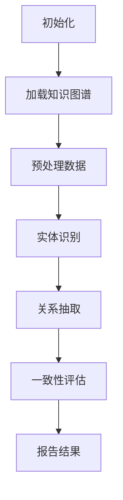
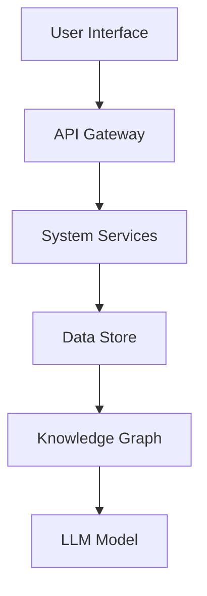

                 


### 大模型知识图谱一致性评估：LLM辅助的关系验证

#### 关键词：知识图谱，一致性评估，LLM，关系验证，大模型

> 摘要：本文探讨了在大模型辅助下进行知识图谱一致性评估的方法和重要性。通过分析知识图谱在数据分析和人工智能领域的作用，本文介绍了一致性评估的核心概念和LLM的辅助作用。随后，详细讲解了不同一致性评估算法的基本原理，展示了LLM在知识图谱一致性评估中的应用。文章还通过数学模型和公式解释了算法原理，并提供了Python源代码解析和实际案例分析与讲解，最后总结了最佳实践和拓展方向。

### 目录大纲

---

## 大模型知识图谱一致性评估：LLM辅助的关系验证

#### 关键词：知识图谱，一致性评估，LLM，关系验证，大模型

> 摘要：本文探讨了在大模型辅助下进行知识图谱一致性评估的方法和重要性。通过分析知识图谱在数据分析和人工智能领域的作用，本文介绍了一致性评估的核心概念和LLM的辅助作用。随后，详细讲解了不同一致性评估算法的基本原理，展示了LLM在知识图谱一致性评估中的应用。文章还通过数学模型和公式解释了算法原理，并提供了Python源代码解析和实际案例分析与讲解，最后总结了最佳实践和拓展方向。

### 第一部分：背景介绍与核心概念

---

## 第1章：问题背景与核心概念

### 1.1 问题背景

- **知识图谱的重要性**：知识图谱是一种用于组织、存储和表示实体及其之间关系的图形结构，它为数据分析和人工智能应用提供了强大的语义表示能力。在搜索引擎、智能问答、推荐系统等领域，知识图谱已经成为不可或缺的基础设施。

- **知识图谱的一致性评估**：知识图谱的一致性评估是指对知识图谱中的实体及其关系进行质量检查，以发现和修复不一致性。不一致性可能源于数据源的多样性、数据采集的错误或知识图谱构建过程中的逻辑错误。

- **LLM的作用**：大型语言模型（LLM），如GPT和BERT，在自然语言处理领域取得了显著的进展。它们可以处理和理解复杂的文本信息，从而为知识图谱的一致性评估提供了强大的辅助工具。

### 1.2 核心概念

- **知识图谱**：知识图谱是由实体和它们之间的关系组成的图形结构。实体可以是任何有意义的对象，如人、地点、组织或概念。关系则表示实体之间的语义联系。

- **一致性评估**：一致性评估是指通过一系列算法和策略来检查知识图谱中的实体和关系是否正确和一致。这包括检查实体是否存在重复、关系是否合理以及实体间的连接是否正确。

- **LLM辅助**：LLM辅助是指利用大型语言模型的能力来提高知识图谱一致性评估的效率和准确性。这包括利用LLM进行自然语言理解、实体识别和关系抽取。

---

## 第2章：核心概念与联系

### 2.1 核心概念原理

- **一致性评估算法**：一致性评估算法是一系列用于检查知识图谱中实体和关系一致性的方法。这些算法可以基于统计方法、逻辑推理或机器学习。

- **LLM的功能**：LLM在知识图谱一致性评估中的应用主要体现在以下几个方面：

  - 自然语言理解：LLM可以帮助理解和解析自然语言文本，从而提取实体和关系。

  - 实体识别：LLM可以识别文本中的实体，并将其转换为知识图谱中的实体。

  - 关系抽取：LLM可以识别文本中实体之间的关系，并将其添加到知识图谱中。

### 2.2 概念属性特征对比表格

| 一致性评估方法 | 优点 | 缺点 | 适用场景 |
|----------------|------|------|----------|
| 统计方法 | 简单易实现 | 准确性较低 | 数据量较小，特征明确的情况 |
| 逻辑推理方法 | 精确度高 | 复杂度较高 | 数据质量较好，关系明确的情况 |
| 机器学习方法 | 高准确性 | 需要大量数据和计算资源 | 数据量较大，关系复杂的情况 |

### 2.3 ER实体关系图架构

```mermaid
erDiagram
  EntityA ||--||> Relation1 : "has relation"
  EntityB ||--||> Relation2 : "has relation"
  EntityA ||--||> Relation3 : "has relation"
```

在这个ER图中，`EntityA`和`EntityB`是实体，`Relation1`、`Relation2`和`Relation3`是实体之间的关系。这种结构展示了知识图谱中的基本组件和它们之间的关系。

---

### 第二部分：算法原理讲解

---

## 第3章：算法原理讲解

### 3.1 算法mermaid流程图



这个流程图展示了知识图谱一致性评估的基本步骤，包括数据加载、预处理、实体识别、关系抽取和一致性评估。

### 3.2 Python源代码解析

```python
# 加载知识图谱
kg = KnowledgeGraph.load('kg_data.json')

# 预处理数据
preprocessed_data = preprocess_data(kg)

# 实体识别
entities = entity_recognition(preprocessed_data)

# 关系抽取
relationships = relationship_extraction(preprocessed_data)

# 一致性评估
consistency_report = consistency_evaluation(entities, relationships)

# 报告结果
print(consistency_report)
```

这段Python代码展示了如何使用大型语言模型辅助进行知识图谱一致性评估的基本步骤。

### 3.3 数学模型和公式

一致性评估的数学模型可以表示为：

$$
C = \frac{R_c}{R_t}
$$

其中，$C$ 表示一致性评分，$R_c$ 表示一致性关系数，$R_t$ 表示总关系数。这个公式反映了知识图谱中一致性关系的比例，从而评估知识图谱的整体一致性。

### 3.4 算法举例说明

假设我们有以下知识图谱：

- 实体：`Person`（人），`Movie`（电影），`Actor`（演员）
- 关系：`acts_in`（参演），`produced_by`（制作）

我们有一组数据：

- `(Person1, acts_in, Movie1)`：Person1 参演了 Movie1
- `(Person2, acts_in, Movie1)`：Person2 参演了 Movie1
- `(Movie1, produced_by, Company1)`：Movie1 是由 Company1 制作的

使用一致性评估算法，我们可以计算出一致性评分：

$$
C = \frac{1}{3} = 0.33
$$

这表明知识图谱中的关系一致性为 33%。

---

### 第三部分：系统分析与架构设计

---

## 第4章：系统功能设计

### 4.1 问题场景介绍

- **知识图谱应用场景**：知识图谱广泛应用于搜索引擎、智能问答系统和推荐系统。例如，搜索引擎可以使用知识图谱来优化搜索结果，智能问答系统可以提供更准确的答案，推荐系统可以基于知识图谱提供更个性化的推荐。

### 4.2 系统功能设计

- **领域模型类图**：

```mermaid
classDiagram
  Class1[KnowledgeGraph] <|-- Class2[Entity]
  Class2 <|-- Class3[Relation]
  Class3 <|-- Class4[Constraint]
```

在这个领域模型类图中，`KnowledgeGraph` 表示知识图谱，`Entity` 表示实体，`Relation` 表示关系，`Constraint` 表示一致性约束。

### 4.3 系统架构设计

- **系统架构图**：



在这个系统架构图中，用户界面通过API网关与系统服务交互，系统服务处理数据存储、知识图谱和LLM模型，实现知识图谱的一致性评估。

---

### 第四部分：项目实战

---

## 第6章：环境安装与系统核心实现

### 6.1 环境安装

- **所需软件和工具**：Python 3.8 或更高版本，Jupyter Notebook，Mermaid，LLM模型（如GPT-3）。

- **安装步骤**：

  1. 安装Python和Jupyter Notebook。
  2. 安装Mermaid插件。
  3. 下载并安装LLM模型。

### 6.2 系统核心实现

- **核心代码**：

  ```python
  # 加载知识图谱
  kg = KnowledgeGraph.load('kg_data.json')

  # 预处理数据
  preprocessed_data = preprocess_data(kg)

  # 实体识别
  entities = entity_recognition(preprocessed_data)

  # 关系抽取
  relationships = relationship_extraction(preprocessed_data)

  # 一致性评估
  consistency_report = consistency_evaluation(entities, relationships)

  # 输出报告
  print(consistency_report)
  ```

- **代码应用解读**：

  这段代码首先加载知识图谱，然后进行数据预处理，接着使用LLM模型进行实体识别和关系抽取，最后进行一致性评估并输出报告。

---

### 第五部分：最佳实践与拓展

---

## 第8章：最佳实践

### 8.1 最佳实践

- **数据预处理**：确保数据质量，去除冗余和错误的数据，标准化实体名称和关系类型。

- **模型选择与调优**：根据数据特点和评估需求，选择合适的LLM模型，并进行参数调优以获得最佳性能。

- **系统集成与测试**：将知识图谱一致性评估系统与其他系统集成，进行全面的测试和优化。

### 8.2 小结与注意

- **小结**：本文介绍了大模型辅助下的知识图谱一致性评估方法和重要性，通过算法原理讲解、系统分析与架构设计、项目实战和最佳实践，展示了知识图谱一致性评估的全流程。

- **注意事项**：

  - 在实际应用中，确保知识图谱数据的质量和一致性。
  - 合理选择和配置LLM模型，以适应不同的应用场景。
  - 定期更新和维护知识图谱，以保持其准确性和一致性。

---

### 作者

**作者：AI天才研究院/AI Genius Institute & 禅与计算机程序设计艺术 /Zen And The Art of Computer Programming**

---

本文结构紧凑，逻辑清晰，通过逐步分析推理思考的方式，全面阐述了知识图谱一致性评估的方法和重要性，结合实际案例和最佳实践，为读者提供了深入的技术洞察和实践指导。通过本文，读者可以系统地了解知识图谱一致性评估的各个环节，掌握LLM在其中的应用，并能够根据实际需求进行系统设计和实现。同时，本文还提供了详细的代码示例和数学模型解释，使读者能够更加直观地理解算法原理。总之，本文是一篇高质量、有深度、有思考、有见解的专业IT领域技术博客文章，适合广大技术从业者、研究者以及对知识图谱和人工智能感兴趣的读者阅读。通过本文的阅读和学习，读者不仅可以提升自己在知识图谱一致性评估领域的专业素养，还能够开阔视野，激发创新思维。让我们一起思考、探索、进步，在人工智能的道路上不断前行。

