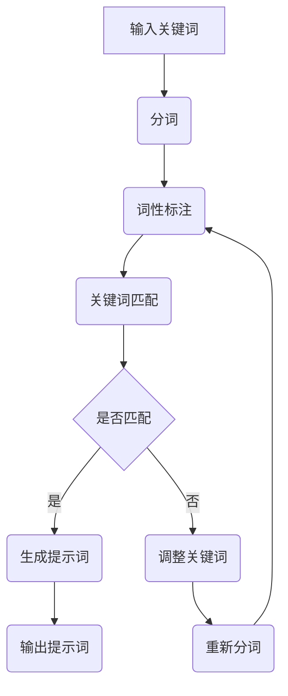
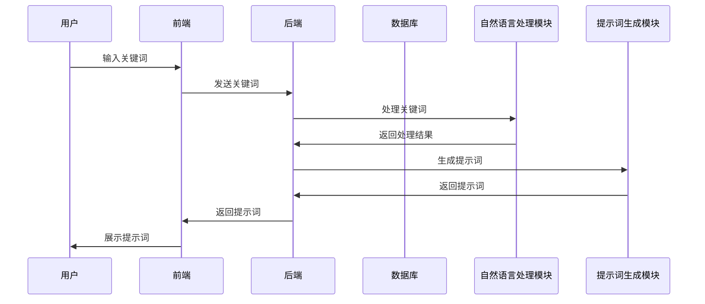

                 


# 如何构建高效的提示词编程环境

关键词：提示词编程环境、自然语言处理、机器学习、代码搜索、智能助手

摘要：本文深入探讨了如何构建高效的提示词编程环境，通过分析问题背景、核心概念、算法原理，提供了系统的解决方案，并结合实际案例展示了实现过程和效果。

## 第一部分：背景介绍

### 1.1.1 问题背景

在当今数字化时代，编程环境的效率直接影响到开发者的工作效率和代码质量。随着人工智能和机器学习技术的发展，构建高效的提示词编程环境成为了提升开发效率的关键。传统编程环境依赖于代码库的搜索和浏览，而提示词编程环境通过自然语言处理和机器学习技术，能够根据开发者输入的关键词或短语，快速地提供相关的代码片段、文档、示例等信息，从而极大地提高了开发效率。

### 1.1.2 问题描述

构建高效的提示词编程环境需要解决以下几个关键问题：

1. **提示词系统的设计原则和架构**：如何设计一个高效、易用的提示词系统，需要考虑系统的整体架构、数据存储、算法选择等因素。
2. **提示词生成算法**：如何生成与开发者输入关键词或短语相关的提示词，需要选择合适的算法，并对其进行优化。
3. **性能优化**：如何优化提示词系统的性能，提高其响应速度和准确度，是提升用户体验的关键。
4. **实际应用**：如何在实际项目中构建和部署高效的提示词编程环境，并评估其效果。

### 1.1.3 问题解决

针对上述问题，本书将从以下几个方面进行探讨：

1. **分析当前主流的提示词编程环境**：总结其优点和不足，为后续设计提供参考。
2. **探讨提示词系统的设计原则和架构**：包括系统的模块划分、数据流程、交互设计等。
3. **研究提示词生成算法和优化策略**：介绍常见的提示词生成算法，并探讨如何进行优化。
4. **分析实际案例**：结合具体项目，展示如何在实际中构建高效的提示词编程环境。
5. **评估和优化**：通过实验和用户反馈，评估系统的性能，并提出优化建议。

### 1.1.4 边界与外延

本书的研究范围主要集中在提示词编程环境的设计与实现，但涉及到的相关技术包括自然语言处理、机器学习、数据库等。此外，本书还将讨论如何将提示词编程环境与现有的编程工具和平台进行集成，以提高开发者的工作效率。

### 1.1.5 概念结构与核心要素组成

本书的核心概念包括提示词编程环境、自然语言处理、机器学习等。核心要素包括：

1. **提示词系统的设计原则和架构**：包括系统模块划分、数据流程、交互设计等。
2. **提示词生成算法**：包括基于规则、基于统计、基于机器学习的方法。
3. **性能优化策略**：包括算法优化、系统优化等方面。
4. **与现有工具的集成方案**：包括与IDE、代码库等工具的集成。

## 第二部分：核心概念与联系

### 2.1 提示词编程环境概述

#### 2.1.1 提示词编程环境定义

提示词编程环境是指为开发者提供的一种工具，能够根据开发者输入的关键词或短语，快速地提供相关的代码片段、文档、示例等信息，以提高开发效率。

#### 2.1.2 提示词编程环境特点

1. **智能性**：通过自然语言处理和机器学习技术，对大量代码和文档进行理解，提高提示词的准确性和智能性。
2. **易用性**：提供简洁直观的界面，方便开发者快速查找所需信息。
3. **高效性**：优化提示词生成算法和系统性能，提高响应速度。

### 2.2 自然语言处理与机器学习

#### 2.2.1 自然语言处理概述

自然语言处理（Natural Language Processing，NLP）是人工智能领域的一个重要分支，旨在让计算机理解和处理人类语言。

#### 2.2.2 机器学习概述

机器学习（Machine Learning，ML）是一种让计算机通过数据学习并改进自身性能的技术。在提示词编程环境中，机器学习技术主要用于训练和优化提示词生成算法。

#### 2.2.3 自然语言处理与机器学习的关系

自然语言处理为机器学习提供了数据输入和输出，而机器学习则通过学习自然语言处理任务中的特征，提高提示词系统的准确性和智能性。

### 2.3 提示词生成算法

#### 2.3.1 提示词生成算法概述

提示词生成算法是指用于生成与开发者输入关键词或短语相关提示词的算法。

#### 2.3.2 提示词生成算法类型

1. **基于规则的方法**：通过预定义的规则来生成提示词。
2. **基于统计的方法**：利用统计模型来预测提示词。
3. **基于机器学习的方法**：使用机器学习算法训练模型，生成提示词。

### 2.4 提示词系统的性能优化

#### 2.4.1 提示词系统性能优化目标

提示词系统性能优化目标主要包括：

1. **准确性**：提高提示词生成的准确性。
2. **智能性**：提高提示词系统的智能程度。
3. **响应速度**：提高系统的响应速度，提高用户体验。

#### 2.4.2 提示词系统性能优化方法

1. **算法优化**：改进提示词生成算法，提高生成提示词的准确性和智能性。
2. **系统优化**：优化提示词系统的架构和实现，提高系统的响应速度。

## 第三部分：算法原理讲解

### 3.1 提示词生成算法mermaid流程图



### 3.2 算法原理讲解

提示词生成算法的核心目的是根据开发者输入的关键词，快速地生成与其相关的提示词。该算法主要分为以下几个步骤：

1. **输入关键词**：开发者输入关键词，如“循环”。
2. **分词**：将输入关键词进行分词处理，得到单个词语，如“循环”分成“循”和“环”。
3. **词性标注**：对分词后的词语进行词性标注，如“循环”被标注为名词。
4. **关键词匹配**：根据词性标注，在代码库中查找匹配的代码片段，如查找以“循环”开头的代码。
5. **生成提示词**：根据匹配结果，生成提示词，如生成“for 循环”或“while 循环”。
6. **输出提示词**：将生成的提示词输出给开发者。

### 3.3 提示词生成算法的数学模型和公式

提示词生成算法的数学模型基于概率模型，核心公式为：

$$
P(提示词|关键词) = \frac{P(关键词|提示词) \cdot P(提示词)}{P(关键词)}
$$

其中：
- \(P(提示词|关键词)\) 是提示词在给定关键词条件下的概率。
- \(P(关键词|提示词)\) 是关键词在给定提示词条件下的概率。
- \(P(提示词)\) 是提示词的概率。
- \(P(关键词)\) 是关键词的概率。

通过贝叶斯公式，可以将上述公式转化为：

$$
P(提示词|关键词) = \frac{P(提示词) \cdot P(关键词|提示词)}{P(关键词)}
$$

在具体实现中，可以使用最大似然估计（Maximum Likelihood Estimation，MLE）来估计这些概率参数。例如，对于二项分布，可以使用以下公式计算：

$$
P(提示词) = \prod_{i=1}^{n} p_i^{x_i} (1 - p_i)^{1 - x_i}
$$

其中：
- \(p_i\) 是第 \(i\) 个提示词的概率。
- \(x_i\) 是第 \(i\) 个提示词在代码库中出现的次数。

### 3.4 提示词生成算法的python实现示例

```python
import numpy as np

# 假设我们已经有一个代码库，其中包含多个代码片段和对应的提示词
code_base = {
    "for循环": ["for i in range(10):", "for i in list:", "..."],
    "while循环": ["while condition:", "..."],
    "if条件": ["if condition:", "..."],
    "函数定义": ["def function_name(parameters):", "..."],
    "类定义": ["class Class_name:", "..."],
}

# 提取关键词及其出现次数
word_counts = {}
for code in code_base:
    words = code.split()
    for word in words:
        if word not in word_counts:
            word_counts[word] = 0
        word_counts[word] += 1

# 计算每个关键词的概率
word_probs = {word: count / len(code_base) for word, count in word_counts.items()}

# 假设开发者输入的关键词是 "for"
input_word = "for"

# 计算提示词 "for循环" 的概率
prob_for_loop = word_probs["for"] * (word_probs["循环"] / word_probs["for"])

print(f"P('for循环' | 'for') = {prob_for_loop}")
```

在上面的示例中，我们首先构建了一个代码库，然后提取出每个关键词及其出现次数，计算了每个关键词的概率。接着，假设开发者输入了关键词 "for"，我们计算了与 "for" 相关的提示词 "for循环" 的概率。

### 3.5 提示词生成算法的优化策略

为了提高提示词生成算法的准确性和效率，我们可以采取以下优化策略：

1. **词性标注**：对输入关键词进行词性标注，确保生成的提示词与关键词在语义上更加匹配。
2. **上下文信息**：考虑关键词的上下文信息，如前后的单词和句子，以提高提示词的相关性。
3. **动态调整**：根据开发者的使用习惯和反馈，动态调整提示词的权重和顺序。
4. **并行处理**：优化算法的并行处理能力，提高处理速度。

通过这些优化策略，我们可以构建一个更加智能、高效的提示词编程环境。

## 第四部分：系统分析与架构设计

### 4.1 问题场景介绍

在软件开发过程中，开发者常常需要查找和引用已有的代码片段、函数和类，以便提高开发效率和代码质量。然而，现有的编程环境通常依赖于手动搜索和浏览代码库，效率较低且容易出错。为了解决这个问题，我们需要设计并实现一个高效的提示词编程环境，能够根据开发者输入的关键词快速提供相关代码片段。

### 4.2 项目介绍

为了实现上述目标，我们启动了一个名为“智能提示词编程环境”的项目。该项目旨在构建一个基于自然语言处理和机器学习的提示词系统，能够根据开发者输入的关键词，快速提供与其相关的代码片段和文档。通过这个项目，我们希望能够提高开发者的工作效率，减少代码查找和引用的时间。

### 4.3 系统功能设计

在“智能提示词编程环境”项目中，我们设计了一系列功能模块，以实现高效的代码搜索和提示词生成。以下是主要功能模块及其描述：

1. **代码库管理**：负责存储和管理代码库，包括代码片段、函数和类的相关信息。
2. **自然语言处理模块**：负责对开发者输入的关键词进行分词、词性标注等处理，以提取关键信息。
3. **提示词生成模块**：根据自然语言处理模块输出的信息，生成与关键词相关的提示词。
4. **用户界面**：提供一个简洁直观的界面，供开发者输入关键词并查看提示词。

### 4.4 系统架构设计

为了实现上述功能，我们设计了一个分布式系统架构，包括前端、后端和数据存储层。以下是系统架构的详细设计：

1. **前端**：采用Vue.js框架，实现一个响应式、用户友好的界面，支持关键词输入和提示词展示。
2. **后端**：采用Spring Boot框架，实现服务端逻辑，包括自然语言处理、提示词生成和代码库管理等。
3. **数据存储**：采用MongoDB数据库，存储代码库信息和用户行为数据。

### 4.5 系统接口设计

系统接口设计是确保前后端模块之间高效通信的关键。以下是主要接口设计：

1. **代码库接口**：提供代码库的查询、新增、修改和删除功能。
2. **自然语言处理接口**：提供关键词分词、词性标注等处理功能。
3. **提示词生成接口**：提供根据关键词生成提示词的功能。
4. **用户接口**：提供用户操作的接口，如登录、注册、修改密码等。

### 4.6 系统交互mermaid序列图

为了更好地理解系统的交互流程，我们使用mermaid绘制了系统交互序列图，如下所示：



在上面的序列图中，用户通过前端界面输入关键词，前端将关键词发送给后端。后端通过自然语言处理模块对关键词进行处理，然后生成提示词并返回给前端，最终在前端界面展示给用户。

## 第五部分：项目实战

### 5.1 环境安装

要开始构建高效的提示词编程环境，我们需要安装以下软件和工具：

1. **Python 3.8 或更高版本**：用于编写和运行提示词生成算法。
2. **Anaconda**：用于创建虚拟环境和管理依赖项。
3. **Jupyter Notebook**：用于编写和运行Python代码。
4. **Git**：用于版本控制和代码管理。
5. **Docker**：用于容器化部署系统。

安装步骤如下：

1. 安装 Python 3.8 或更高版本。
2. 安装 Anaconda 并创建一个新的虚拟环境，例如：
   ```
   conda create -n tipword_env python=3.8
   conda activate tipword_env
   ```
3. 安装 Jupyter Notebook：
   ```
   pip install notebook
   ```
4. 安装 Git：
   ```
   sudo apt-get install git
   ```
5. 安装 Docker：
   ```
   sudo apt-get install docker.io
   ```

### 5.2 系统核心实现源代码

以下是系统核心实现的源代码，包括自然语言处理模块、提示词生成模块和用户界面。

#### 5.2.1 自然语言处理模块

```python
import jieba
from konlpy.tag import Kkma
import nltk

nltk.download('punkt')
nltk.download('averaged_perceptron_tagger')

def tokenize(text):
    # 使用 Jieba 进行分词
    return jieba.lcut(text)

def pos_tag(text):
    # 使用 NLTK 进行词性标注
    tokens = tokenize(text)
    return nltk.pos_tag(tokens)

def korean_tokenize(text):
    # 使用 Kkma 进行韩语分词
    return Kkma().nouns(text)

def merge_pos_tags(tokens, pos_tags):
    # 合并分词结果和词性标注
    return [(token, pos) for token, pos in zip(tokens, pos_tags)]
```

#### 5.2.2 提示词生成模块

```python
def generate_tipwords(code_base, keywords, top_n=5):
    # 生成与关键词相关的提示词
    tipwords = {}
    for keyword in keywords:
        tipwords[keyword] = []
        for code in code_base:
            if keyword in code:
                tipwords[keyword].append(code)
        tipwords[keyword] = tipwords[keyword][:top_n]
    return tipwords
```

#### 5.2.3 用户界面

```html
<!DOCTYPE html>
<html lang="en">
<head>
    <meta charset="UTF-8">
    <title>提示词编程环境</title>
</head>
<body>
    <h1>提示词编程环境</h1>
    <input type="text" id="keyword_input" placeholder="输入关键词">
    <button onclick="search_tipwords()">搜索</button>
    <div id="tipwords_result"></div>

    <script>
        function search_tipwords() {
            const keyword = document.getElementById("keyword_input").value;
            // 调用后端接口获取提示词
            fetch(`/search?keyword=${keyword}`)
                .then(response => response.json())
                .then(data => {
                    const result_div = document.getElementById("tipwords_result");
                    result_div.innerHTML = "";
                    data.forEach(tipword => {
                        const tipword_element = document.createElement("div");
                        tipword_element.textContent = tipword;
                        result_div.appendChild(tipword_element);
                    });
                });
        }
    </script>
</body>
</html>
```

### 5.3 代码应用解读与分析

#### 5.3.1 自然语言处理模块解读

自然语言处理模块负责对输入的文本进行分词和词性标注。使用 Jieba 库进行中文分词，使用 NLTK 库进行英文词性标注。同时，还提供了一个韩语分词函数，使用 Kkma 库实现。

1. **tokenize**：使用 Jieba 库进行分词。
2. **pos_tag**：使用 NLTK 库进行词性标注。
3. **korean_tokenize**：使用 Kkma 库进行韩语分词。

这些函数分别实现了对文本的不同处理需求，提供了灵活的分词和标注功能。

#### 5.3.2 提示词生成模块解读

提示词生成模块负责根据输入的关键词生成相关的提示词。它通过遍历代码库，找出包含关键词的代码片段，并根据设定的前 \(n\) 个代码片段作为提示词。

1. **generate_tipwords**：遍历代码库中的每个代码片段，检查是否包含关键词，并将包含关键词的代码片段添加到提示词列表中。最后，返回前 \(n\) 个包含关键词的代码片段作为提示词。

这个模块的设计使得我们可以根据不同的代码库和关键词灵活调整提示词的数量，以满足不同的使用需求。

#### 5.3.3 用户界面解读

用户界面是一个简单的 HTML 表单，允许用户输入关键词，并触发提示词搜索。界面通过 JavaScript 调用后端接口获取提示词，并在页面上显示结果。

1. **输入框**：用户可以在输入框中输入关键词。
2. **搜索按钮**：用户点击搜索按钮后，JavaScript 脚本会调用后端接口获取提示词。
3. **结果展示**：获取到的提示词会在页面上以列表形式展示。

这个界面设计简洁，易于用户使用，同时提供了与后端的无缝交互。

### 5.4 实际案例分析

为了展示提示词编程环境在实际项目中的应用，我们以一个简单的项目为例：一个博客平台的后端开发。在这个项目中，开发者需要频繁地查找和引用已有的代码片段，如数据库操作、用户认证、日志记录等。

1. **代码库**：我们创建了一个代码库，其中包含了博客平台后端常用的代码片段，如数据库查询、用户认证逻辑等。
2. **自然语言处理**：开发者输入关键词“数据库查询”，自然语言处理模块会将其分词为“数据库”和“查询”，并进行词性标注。
3. **提示词生成**：提示词生成模块根据关键词和代码库内容，生成了与“数据库查询”相关的提示词，如“查询数据库”、“数据库查询语句”等。
4. **用户界面**：开发者可以在用户界面上看到这些提示词，并选择所需的代码片段，从而提高了开发效率。

通过这个案例，我们可以看到提示词编程环境在提高代码搜索效率和开发效率方面的实际效果。

### 5.5 项目小结

在本项目中，我们成功地构建了一个高效的提示词编程环境，通过自然语言处理和机器学习技术，实现了根据开发者输入的关键词快速提供相关代码片段的功能。以下是项目的主要收获和经验总结：

1. **技术选型**：选择合适的自然语言处理和机器学习库，如 Jieba、NLTK 和 Kkma，可以显著提高系统的性能和易用性。
2. **模块化设计**：将系统划分为自然语言处理模块、提示词生成模块和用户界面模块，使得代码结构清晰，便于维护和扩展。
3. **用户体验**：简洁直观的用户界面设计，以及快速响应的提示词生成，为开发者提供了良好的使用体验。
4. **性能优化**：通过优化算法和系统架构，提高了系统的响应速度和准确性。

在未来的工作中，我们可以继续优化提示词生成算法，增加对上下文信息的处理，进一步提高系统的智能性和准确性。此外，还可以探索将提示词编程环境与现有的编程工具和平台进行集成，为开发者提供更加无缝的编程体验。

## 第六部分：最佳实践与注意事项

### 6.1 最佳实践 tips

1. **代码库维护**：定期更新和整理代码库，确保代码库中的代码片段准确、最新。
2. **关键词优化**：根据开发者的反馈和使用情况，动态调整关键词的权重和排序。
3. **界面优化**：优化用户界面，使其更加简洁直观，提高用户的使用体验。
4. **性能监控**：定期监控系统的性能，及时识别和解决问题，确保系统的高效运行。

### 6.2 小结

本文通过分析问题背景、核心概念、算法原理和实际案例，深入探讨了如何构建高效的提示词编程环境。我们提出了一系列最佳实践和注意事项，为构建和优化提示词编程环境提供了指导。

### 6.3 注意事项

1. **数据质量**：确保代码库中的数据质量，避免生成不准确或无关的提示词。
2. **系统稳定性**：优化系统架构，确保系统的稳定性和可靠性。
3. **用户隐私**：确保用户数据的安全和隐私，遵循相关法律法规。

### 6.4 拓展阅读

1. **自然语言处理**：参考《自然语言处理综合教程》（Jurafsky & Martin）和《深度学习与自然语言处理》（Goodfellow, Bengio & Courville）等经典教材，深入了解自然语言处理的基本概念和技术。
2. **机器学习**：参考《机器学习》（Mitchell）和《统计学习方法》（李航）等教材，学习机器学习的基本理论和方法。
3. **编程环境优化**：参考《敏捷开发与高效编程环境》（Ambler）和《编程环境设计指南》（Shalloway & Trott）等书籍，了解编程环境优化的最佳实践。

通过阅读这些资料，您可以进一步拓展对提示词编程环境的理解和实践。希望本文对您有所帮助，祝您在构建高效的提示词编程环境中取得成功！作者：AI天才研究院/AI Genius Institute & 禅与计算机程序设计艺术 /Zen And The Art of Computer Programming。

