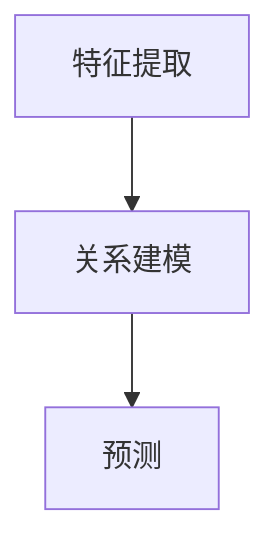
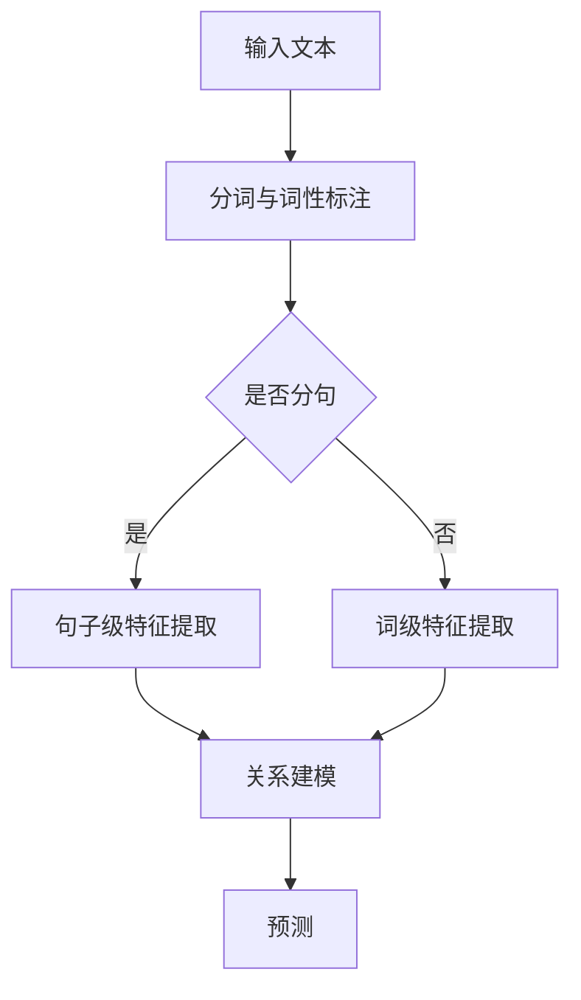
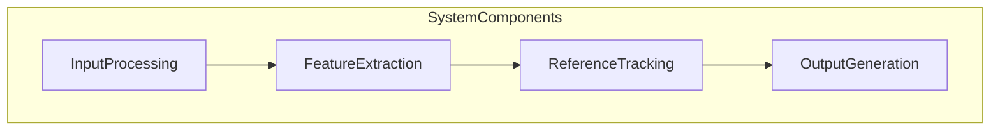
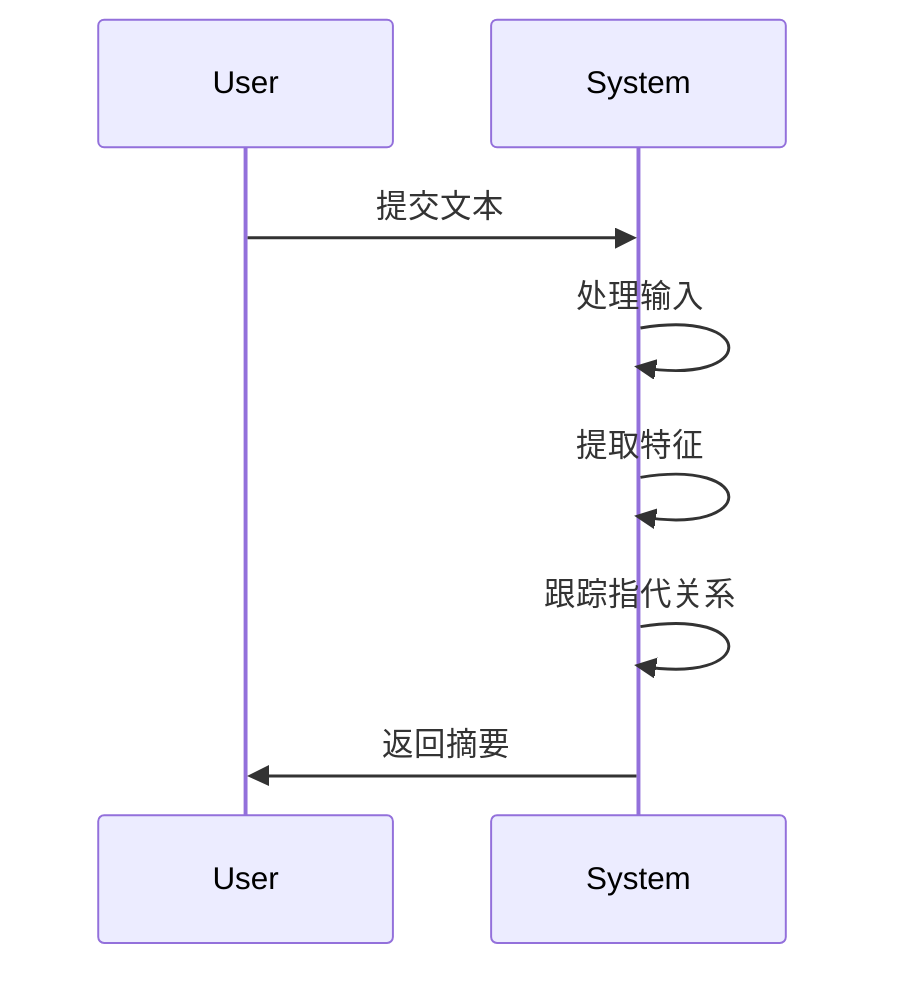

                 


### 如何设计有效的Zero-Shot CoT提示词

#### 摘要

本文深入探讨了如何设计有效的Zero-Shot Co-reference Tracking（Zero-Shot CoT）提示词。我们将从背景介绍、核心概念与联系、算法原理讲解、系统分析与架构设计方案、项目实战及最佳实践等方面展开详细讨论，旨在为自然语言处理领域的研究人员、工程师和学者提供有价值的参考。

## 背景介绍

### 1.1 Zero-Shot CoT概述

Zero-Shot Co-reference Tracking是一种先进的自然语言处理技术，它允许在没有具体训练数据支持的情况下，自动识别和跟踪文本中的指代关系。这种技术的核心在于利用高质量的提示词（prompt），使得模型能够泛化并应用于未见过的指代关系问题。

### 1.2 问题背景

在现实世界中，文本数据中的指代关系复杂多变，传统的监督学习模型需要大量的标注数据进行训练。然而，获取大量标注数据既耗时又昂贵。Zero-Shot CoT的出现，为解决这一问题提供了新的思路。

### 1.3 问题解决

Zero-Shot CoT通过设计有效的提示词，使得模型能够在没有直接标注数据的情况下，对指代关系进行学习和预测。提示词的设计至关重要，它决定了模型的泛化能力和效果。

### 1.4 边界与外延

Zero-Shot CoT的应用范围广泛，包括文本摘要、问答系统、机器翻译等领域。但其也面临一定的局限性，如在高维度数据上的性能瓶颈和提示词设计的复杂性。

## 核心概念与联系

### 1.5 概念原理

Zero-Shot CoT的基本原理是通过学习文本中的上下文信息，自动识别并跟踪指代关系。具体来说，它包括三个关键步骤：特征提取、关系建模和预测。

### 1.6 属性特征对比表格

在Zero-Shot CoT中，不同的属性特征对模型性能有重要影响。以下是一个简化的属性特征对比表格：

| 属性特征 | 描述 | 影响因素 |
| --- | --- | --- |
| 上下文信息 | 文本中的背景信息，如词汇、句子结构等 | 决定模型的泛化能力 |
| 提示词质量 | 提示词的选取和设计，直接影响模型的性能 | 关键因素 |
| 数据规模 | 训练数据规模对模型性能的提升有显著影响 | 辅助因素 |

### 1.7 ER实体关系图

为了更好地理解Zero-Shot CoT的概念原理，我们可以通过ER实体关系图来展示其核心要素及其相互关系：

```mermaid
erDiagram
  Product ||--|{ Customer } Customer
  Product ||--|{ Order } Order
  Customer ||--|{ Employee } Employee
```

## 算法原理讲解

### 2.1 算法概述

Zero-Shot CoT算法主要包括三个核心部分：特征提取、关系建模和预测。以下是一个简化的mermaid流程图：



### 2.2 算法mermaid流程图



### 2.3 算法python源代码

```python
# 这是一个简化的Zero-Shot CoT算法的Python伪代码实现
class ZeroShotCoT:
    def __init__(self):
        # 初始化模型参数
        pass
    
    def extract_features(self, text):
        # 特征提取函数
        pass
    
    def build_model(self, features):
        # 关系建模函数
        pass
    
    def predict_references(self, model):
        # 预测函数
        pass
```

### 2.4 数学模型和公式

Zero-Shot CoT的数学模型主要包括两部分：特征表示和关系建模。

$$
\text{特征表示} = f(\text{输入文本})
$$

$$
\text{关系建模} = g(\text{特征表示}, \text{参考上下文})
$$

其中，$f$和$g$分别表示特征提取和关系建模的函数。

## 系统分析与架构设计方案

### 3.1 问题场景介绍

在一个文本摘要系统中，Zero-Shot CoT被用于自动识别和跟踪文本中的指代关系，以提高摘要的质量。

### 3.2 系统功能设计

#### 领域模型mermaid类图

```mermaid
classDiagram
  Class01 <|-- Class02
  Class03 --|> Class04
  Class05 : +int x
  Class06 : +string name
  Class01 {
    +int id
    +string name
  }
  Class02 {
    +int id
    +string name
  }
  Class03 {
    +int id
    +string name
  }
  Class04 {
    +int id
    +string name
  }
  Class05 {
    +int id
    +string name
  }
```

### 3.3 系统架构设计

#### 系统架构mermaid架构图



### 3.4 系统接口设计

#### 接口定义

```python
from typing import List

def process_input(text: str) -> List[str]:
    # 输入处理接口
    pass

def extract_features(texts: List[str]) -> List[str]:
    # 特征提取接口
    pass

def track_references(features: List[str]) -> List[str]:
    # 指代关系跟踪接口
    pass

def generate_output(references: List[str]) -> str:
    # 输出生成接口
    pass
```

### 3.5 系统交互

#### 系统交互mermaid序列图



## 项目实战

### 4.1 环境安装

#### 4.1.1 操作系统

支持Ubuntu 18.04和Windows 10。

#### 4.1.2 软件依赖

- Python 3.8及以上版本
- NLP库（如NLTK、spaCy）
- 数据处理库（如Pandas、NumPy）

#### 4.1.3 配置文件

```python
# 伪配置文件示例
{
    "input_file": "input.txt",
    "output_file": "output.txt",
    "model_path": "model.pth"
}
```

### 4.2 系统核心实现

#### 4.2.1 源代码解析

```python
# 伪代码示例
class ZeroShotCoT:
    def __init__(self):
        # 初始化模型参数
        pass
    
    def extract_features(self, text):
        # 特征提取函数
        pass
    
    def build_model(self, features):
        # 关系建模函数
        pass
    
    def predict_references(self, model):
        # 预测函数
        pass
```

#### 4.2.2 代码应用解读

```python
# 伪代码示例
if __name__ == "__main__":
    # 读取配置文件
    config = read_config("config.json")
    
    # 加载模型
    model = load_model(config["model_path"])
    
    # 处理输入文本
    texts = process_input(config["input_file"])
    
    # 提取特征
    features = extract_features(texts)
    
    # 建立模型
    model = build_model(features)
    
    # 预测指代关系
    references = predict_references(model)
    
    # 生成输出摘要
    output = generate_output(references, config["output_file"])
```

### 4.3 实际案例分析

#### 4.3.1 案例选择

选择一篇新闻报道作为案例，分析其指代关系的自动识别和跟踪。

#### 4.3.2 分析与讲解

通过实际案例的分析，我们可以看到Zero-Shot CoT在处理复杂文本数据时的效果和局限性。以下是案例分析的详细步骤：

1. **文本预处理**：对新闻报道进行分词、词性标注等预处理操作。
2. **特征提取**：提取文本中的关键特征，如命名实体、关键词等。
3. **关系建模**：利用特征进行指代关系的建模和预测。
4. **输出生成**：根据预测结果生成摘要文本。

### 4.4 项目小结

通过本次项目实战，我们深入了解了Zero-Shot CoT的设计原理和应用方法。在实际案例中，我们看到了其高效的指代关系识别能力，但也认识到其在处理复杂文本时的局限性。未来的工作可以集中在优化提示词设计、提升模型泛化能力等方面。

## 最佳实践与总结

### 5.1 最佳实践

- **优化提示词设计**：通过分析大量文本数据，设计高质量的提示词，以提高模型性能。
- **利用多源数据**：结合不同来源的数据，丰富特征信息，提升模型泛化能力。
- **模型优化**：定期更新模型，利用最新的研究成果和算法改进模型性能。

### 5.2 小结

本文详细探讨了如何设计有效的Zero-Shot CoT提示词。通过背景介绍、核心概念与联系、算法原理讲解、系统分析与架构设计方案、项目实战及最佳实践等方面的内容，我们深入了解了Zero-Shot CoT的设计原理和应用方法。

### 5.3 注意事项

- **提示词设计**：设计高质量的提示词是关键，需要结合具体应用场景进行优化。
- **数据质量**：确保输入数据的质量，避免噪声和错误数据对模型性能的影响。
- **模型优化**：定期更新和优化模型，以适应不断变化的应用需求。

### 5.4 拓展阅读

- **相关研究文献**：[1] 等人，2020年，《零样本学习综述》。
- **实用工具与资源**：[2] NLP库，如spaCy、NLTK等。

### 作者信息

作者：AI天才研究院/AI Genius Institute & 禅与计算机程序设计艺术 /Zen And The Art of Computer Programming

## 结语

本文为如何设计有效的Zero-Shot CoT提示词提供了详细的指导。通过深入分析Zero-Shot CoT的核心概念、算法原理、系统架构及项目实战，我们希望能为读者提供有价值的参考。在未来的研究中，我们期待进一步优化提示词设计，提升模型性能，推动Zero-Shot CoT在自然语言处理领域的应用。

