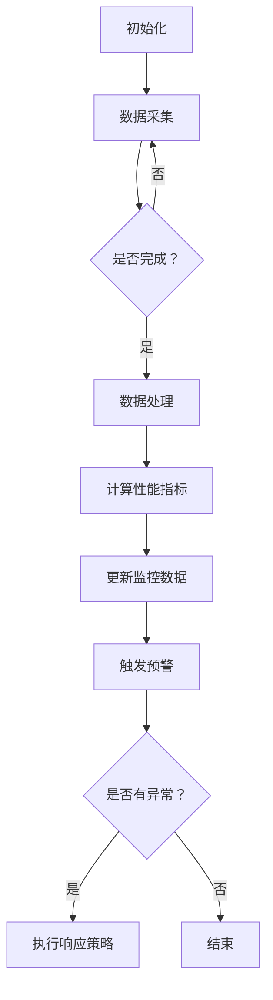
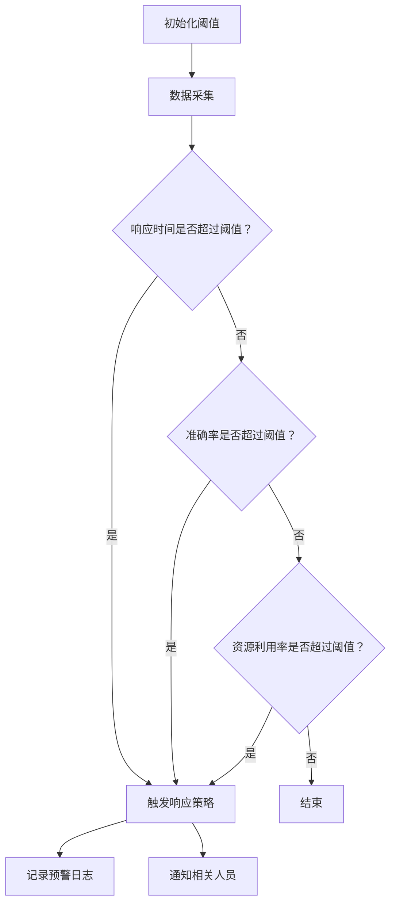
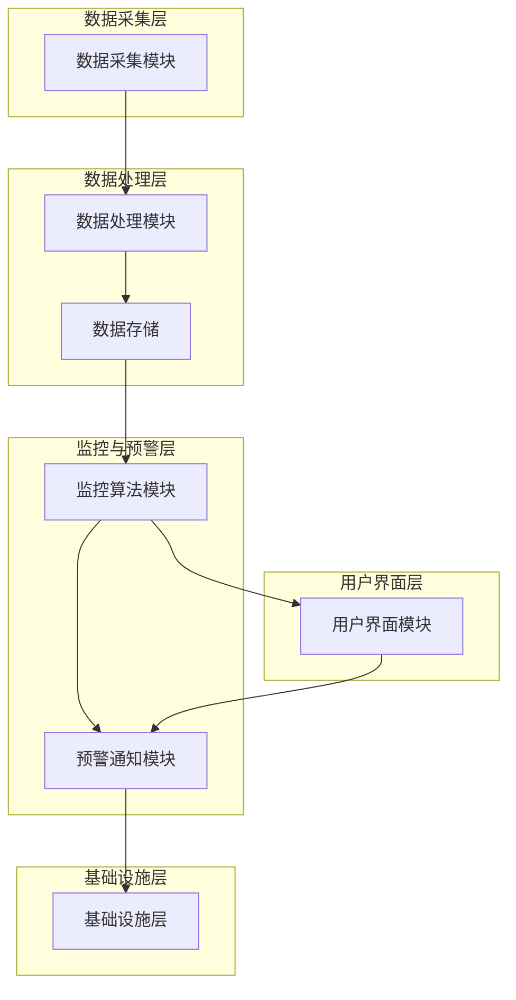
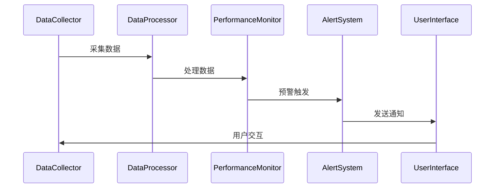

                 

### 实时LLM性能监控与预警系统构建

在当今快速发展的AI时代，大型语言模型（Large Language Models, LLMs）已经成为许多应用的关键组件，如自然语言处理（NLP）、文本生成、问答系统等。然而，随着模型的复杂性和规模不断增加，实时监控LLM性能并提前预警潜在问题变得越来越重要。本文将深入探讨实时LLM性能监控与预警系统的构建，从背景介绍、核心概念、算法原理、系统设计与实现到最佳实践，系统性地解析这一关键领域。

本文的关键词包括：实时监控、LLM性能、预警系统、算法原理、系统设计、最佳实践。通过本文的阅读，读者将了解实时LLM性能监控与预警的重要性，掌握构建这一系统的核心技术和方法，并能够应用到实际项目中。

### 摘要

实时LLM性能监控与预警系统旨在确保大型语言模型在运行过程中始终处于最佳状态。本文首先介绍了实时LLM性能监控与预警的背景和核心概念，包括问题背景、实时监控和预警的定义、重要性及其边界。接着，文章详细解析了实时LLM性能监控和预警算法的原理，通过数学模型、mermaid流程图和Python代码实现，对算法进行了深入剖析和举例说明。然后，文章描述了系统的功能设计、架构设计、接口设计和交互序列图，并通过实际项目案例进行了详细讲解。最后，文章总结了最佳实践和注意事项，为读者提供了进一步学习和应用的指导。

### 目录大纲

1. **背景介绍与核心概念**
   - **第1章 问题背景与核心概念**
     - **1.1.1 问题背景**
     - **1.1.2 实时LLM性能监控与预警的定义**
     - **1.1.3 实时LLM性能监控与预警的重要性**
     - **1.1.4 实时LLM性能监控与预警的边界与外延**
     - **1.1.5 实时LLM性能监控与预警的核心要素组成**
   - **第2章 核心概念与联系**
     - **2.1.1 核心概念原理**
     - **2.1.2 概念属性特征对比表格**
     - **2.1.3 ER实体关系图架构**

2. **算法原理与实现**
   - **第3章 实时LLM性能监控算法原理**
     - **3.1.1 监控算法的数学模型**
     - **3.1.2 监控算法的mermaid流程图**
     - **3.1.3 监控算法Python源代码实现**
     - **3.1.4 监控算法原理详细讲解**
     - **3.1.5 监控算法举例说明**
   - **第4章 实时LLM性能预警算法原理**
     - **4.1.1 预警算法的数学模型**
     - **4.1.2 预警算法的mermaid流程图**
     - **4.1.3 预警算法Python源代码实现**
     - **4.1.4 预警算法原理详细讲解**
     - **4.1.5 预警算法举例说明**

3. **系统设计与实现**
   - **第5章 系统功能设计与架构**
     - **5.1.1 系统功能介绍**
     - **5.1.2 系统架构设计**
     - **5.1.3 系统接口设计**
     - **5.1.4 系统交互序列图**
   - **第6章 系统实现与优化**
     - **6.1.1 系统环境安装**
     - **6.1.2 系统核心实现源代码**
     - **6.1.3 代码应用解读与分析**
     - **6.1.4 实际案例分析与详细讲解**
     - **6.1.5 项目小结**

4. **最佳实践与总结**
   - **第7章 最佳实践**
     - **7.1.1 性能优化最佳实践**
     - **7.1.2 系统维护最佳实践**
     - **7.1.3 安全性最佳实践**
   - **第8章 小结与拓展阅读**
     - **8.1.1 本书内容小结**
     - **8.1.2 注意事项**
     - **8.1.3 拓展阅读建议**

### 第一部分: 背景介绍与核心概念

#### 第1章 问题背景与核心概念

##### 1.1.1 问题背景

随着AI技术的迅猛发展，大型语言模型（LLM）已经成为众多领域的关键技术。这些模型在文本生成、问答系统、机器翻译等方面展现了强大的能力，但同时也带来了新的挑战。一方面，随着模型的规模和复杂度不断增加，如何确保这些模型在实时应用中的性能成为一个关键问题。另一方面，由于LLM的运行过程涉及大量的数据输入和处理，任何异常都可能导致系统故障或服务质量下降。

在实际应用中，实时LLM性能监控与预警系统变得尤为重要。例如，在金融交易系统中，LLM用于自然语言处理以分析市场信息，确保系统的实时性能对于实现高效交易至关重要。在自动驾驶领域，LLM用于处理和生成实时语音指令，确保车辆的行驶安全。这些场景都要求实时监控LLM的性能，并在出现异常时及时预警，以避免潜在的风险。

##### 1.1.2 实时LLM性能监控与预警的定义

实时LLM性能监控是指通过系统化的方法和工具，持续地收集、分析和评估LLM在运行过程中的性能指标。这些指标可能包括响应时间、准确率、资源利用率等。监控的目的是确保LLM始终处于最佳状态，能够提供高质量的服务。

预警系统则是在监控过程中，对潜在的异常情况发出警报。这些异常可能源于模型本身的问题（如过拟合、参数不稳定等）或者外部因素（如数据质量下降、系统资源不足等）。预警的目的是在问题发生之前采取措施，防止系统故障或服务质量下降。

##### 1.1.3 实时LLM性能监控与预警的重要性

实时LLM性能监控与预警在多个方面具有重要意义：

1. **提高系统可靠性**：通过实时监控和预警，可以及时发现并解决问题，确保系统在高可用性状态下运行。
2. **保障服务质量**：实时监控可以确保LLM始终提供高质量的输出，满足用户需求。
3. **优化资源利用**：通过监控资源利用率，可以优化系统资源配置，提高资源利用率。
4. **降低运营成本**：预警系统可以预防潜在的故障和停机，减少维护成本。
5. **提升用户体验**：实时性能监控和预警有助于提供更加稳定和可靠的服务，提升用户体验。

##### 1.1.4 实时LLM性能监控与预警的边界与外延

实时LLM性能监控与预警系统的边界主要涉及以下几个方面：

1. **性能指标**：监控哪些性能指标，如响应时间、准确率、资源利用率等。
2. **数据来源**：数据来源包括模型的输入输出数据、系统日志、监控工具的采集数据等。
3. **预警机制**：预警的触发条件、通知方式、响应策略等。

实时LLM性能监控与预警的外延则包括以下几个方面：

1. **监控工具**：如Prometheus、Grafana等开源监控工具。
2. **数据分析与处理**：如何处理和存储监控数据，以及如何进行数据分析和可视化。
3. **系统集成**：如何将预警系统集成到现有的IT基础设施中，如自动化部署系统、运维管理平台等。

##### 1.1.5 实时LLM性能监控与预警的核心要素组成

实时LLM性能监控与预警系统主要由以下几个核心要素组成：

1. **数据采集**：从LLM的运行过程中采集性能数据，包括系统指标、模型指标等。
2. **数据处理**：对采集到的数据进行清洗、转换和分析，提取有用的性能指标。
3. **监控算法**：包括性能监控算法和预警算法，用于分析数据并识别异常。
4. **预警机制**：根据监控算法的结果，触发预警并通知相关人员。
5. **用户界面**：提供可视化界面，展示监控数据和预警信息，便于用户实时了解系统状态。
6. **响应策略**：在发现异常时，根据预定的策略采取相应的行动，如自动调整模型参数、重启服务等。

通过以上核心要素的协同工作，实时LLM性能监控与预警系统能够实现对LLM性能的全面监控和有效预警，确保系统稳定、高效地运行。

#### 第2章 核心概念与联系

##### 2.1.1 核心概念原理

为了深入理解实时LLM性能监控与预警系统，我们需要先了解几个核心概念及其原理。以下是这些概念的定义和基本原理：

1. **性能监控**：性能监控是指对系统或应用的性能进行实时监测和分析，以识别潜在的问题和优化系统性能。在实时LLM性能监控中，性能监控主要关注LLM的响应时间、准确率、资源利用率等关键性能指标。
2. **预警系统**：预警系统是一种自动化系统，用于监测系统状态并触发警报，以提醒相关人员采取行动。在实时LLM性能监控与预警中，预警系统主要用于检测异常情况，如模型过拟合、资源不足等，并发出警报。
3. **监控算法**：监控算法是用于分析数据并识别异常的算法。在实时LLM性能监控中，常用的监控算法包括统计方法、机器学习方法和基于规则的方法。
4. **数据采集**：数据采集是监控系统的第一步，涉及到从LLM的运行过程中采集性能数据。这些数据可能包括模型输入、输出、系统日志等。
5. **数据处理**：数据处理是对采集到的数据进行清洗、转换和分析的过程，以提取有用的性能指标。数据处理包括数据清洗、数据聚合、数据可视化等步骤。
6. **用户界面**：用户界面是监控系统与用户交互的接口，用于展示监控数据和预警信息。用户界面通常提供图形化界面，便于用户实时了解系统状态。
7. **响应策略**：响应策略是在发现异常时采取的自动化措施，以减轻或消除问题。响应策略可能包括自动调整模型参数、重启服务、通知相关人员等。

通过理解这些核心概念的基本原理，我们可以更好地设计并实现实时LLM性能监控与预警系统。

##### 2.1.2 概念属性特征对比表格

为了更好地理解各个核心概念之间的区别和联系，我们提供了一个概念属性特征对比表格（以下为Markdown格式）：

| 概念         | 定义                                                         | 主要功能                                       | 关联概念                           |
| ------------ | ------------------------------------------------------------ | -------------------------------------------- | ---------------------------------- |
| 性能监控     | 对系统或应用的性能进行实时监测和分析                         | 识别潜在问题、优化性能                           | 预警系统、监控算法、数据采集、数据处理 |
| 预警系统     | 自动监测系统状态并触发警报，提醒相关人员采取行动              | 检测异常情况、发出警报                           | 性能监控、监控算法、用户界面         |
| 监控算法     | 分析数据并识别异常的算法                                     | 识别异常、生成预警信息                           | 性能监控、预警系统、数据处理         |
| 数据采集     | 从LLM的运行过程中采集性能数据                               | 提供监控数据来源                                 | 性能监控、预警系统、数据处理         |
| 数据处理     | 对采集到的数据进行清洗、转换和分析                           | 提取性能指标、优化数据质量                       | 性能监控、监控算法、用户界面         |
| 用户界面     | 监控系统与用户交互的接口，用于展示监控数据和预警信息          | 提供可视化界面、便于用户实时了解系统状态         | 性能监控、预警系统、监控算法         |
| 响应策略     | 在发现异常时采取的自动化措施，以减轻或消除问题                | 自动调整模型参数、重启服务、通知相关人员         | 性能监控、预警系统、监控算法         |

通过这个表格，我们可以清晰地看到各个核心概念之间的关联和功能分工，有助于我们设计一个完善的实时LLM性能监控与预警系统。

##### 2.1.3 ER实体关系图架构

为了进一步理解实时LLM性能监控与预警系统的概念及其相互关系，我们可以使用ER（Entity-Relationship，实体关系）图来描述系统的实体及其关联。以下是一个简化的ER图（使用Mermaid语法）：

```mermaid
erDiagram
  DataCollector..> PerformanceMonitor : 数据采集
  PerformanceMonitor..> MonitoringAlgorithm : 监控算法
  MonitoringAlgorithm..> AlertSystem : 预警系统
  AlertSystem..> UserInterface : 用户界面
  ResponseStrategy..> AlertSystem : 响应策略
  DataProcessor..> MonitoringAlgorithm : 数据处理
```

在这个ER图中，`DataCollector`（数据采集器）负责从LLM系统中收集性能数据，并将其传递给`PerformanceMonitor`（性能监控器）。`PerformanceMonitor`则调用`MonitoringAlgorithm`（监控算法）进行分析，`MonitoringAlgorithm`会将分析结果传递给`AlertSystem`（预警系统）。`AlertSystem`负责监控潜在异常，并在必要时通过`UserInterface`（用户界面）发出警报，同时`ResponseStrategy`（响应策略）会根据预警结果采取相应的行动。

通过这个ER图，我们可以更加直观地理解实时LLM性能监控与预警系统的整体架构和各个模块之间的关系。

### 第二部分: 算法原理与实现

#### 第3章 实时LLM性能监控算法原理

实时LLM性能监控算法是确保大型语言模型在运行过程中保持高性能的关键。本节将详细解析实时LLM性能监控算法的原理，包括其数学模型、mermaid流程图、Python源代码实现及其详细讲解。

##### 3.1.1 监控算法的数学模型

实时LLM性能监控算法的核心在于对LLM的性能指标进行量化分析。常见的性能指标包括：

1. **响应时间**：LLM从接收到输入到生成输出所需的时间。
2. **准确率**：LLM生成的输出与期望输出之间的匹配程度。
3. **资源利用率**：LLM在运行过程中使用的CPU、内存等资源情况。

为了对这些指标进行量化，我们可以使用以下数学模型：

- **响应时间（T）**：$$ T = \frac{Time_{end} - Time_{start}}{Number\ of\ Samples} $$
- **准确率（P）**：$$ P = \frac{Correct\ Predictions}{Total\ Predictions} $$
- **资源利用率（R）**：$$ R = \frac{Used\ Resources}{Total\ Resources} $$

这些公式分别表示样本响应时间的平均值、正确预测的比率以及资源使用的比例。

##### 3.1.2 监控算法的mermaid流程图

为了更直观地理解实时LLM性能监控算法的流程，我们可以使用mermaid绘制一个流程图：



在这个流程图中，监控算法从初始化开始，进行数据采集，然后进入循环，每次循环都会检查数据是否采集完成。如果完成，则进行数据处理并计算性能指标，然后更新监控数据。如果发现异常，则会触发预警并执行响应策略，否则循环继续。

##### 3.1.3 监控算法Python源代码实现

为了实现上述算法，我们可以使用Python编写相关代码。以下是一个简单的实现示例：

```python
import time
import numpy as np

def monitor_performance(model, data_loader, threshold=0.1):
    start_time = time.time()
    response_times = []
    correct_predictions = 0
    total_predictions = 0

    for inputs, targets in data_loader:
        start_monitor = time.time()
        predictions = model(inputs)
        end_monitor = time.time()

        response_time = end_monitor - start_monitor
        response_times.append(response_time)

        correct_predictions += (predictions == targets).sum()
        total_predictions += len(targets)

    average_response_time = np.mean(response_times)
    accuracy = correct_predictions / total_predictions

    if average_response_time > threshold or accuracy < threshold:
        trigger_alert()

    print(f"平均响应时间: {average_response_time}, 准确率: {accuracy}")

def trigger_alert():
    print("性能异常，触发预警！")

# 示例使用
model = ...  # 这里假设有一个预训练好的LLM模型
data_loader = ...  # 这里假设有一个数据加载器

monitor_performance(model, data_loader)
```

在这个实现中，我们首先定义了`monitor_performance`函数，它接受模型和数据加载器作为输入，并使用一个循环来计算响应时间和准确率。如果这些指标超过阈值，则会触发预警。

##### 3.1.4 监控算法原理详细讲解

实时LLM性能监控算法的核心在于持续监测LLM的性能指标，并在发现异常时及时预警。具体来说，算法的实现分为以下几个步骤：

1. **初始化**：初始化性能监控器，设置性能指标阈值。这些阈值可以根据实际需求进行调整。
2. **数据采集**：从LLM的运行过程中采集性能数据，包括响应时间、准确率和资源利用率等。这些数据可以通过模型接口或者系统监控工具获取。
3. **数据处理**：对采集到的数据进行处理，计算平均响应时间、准确率和资源利用率等性能指标。这些处理可以通过Python的数值计算库（如NumPy）实现。
4. **性能评估**：将计算出的性能指标与预设的阈值进行比较。如果某个指标超过阈值，则表明存在性能异常。
5. **预警触发**：如果发现性能异常，则触发预警机制，向相关人员发送警报。预警机制可以通过系统通知、邮件、短信等方式实现。
6. **响应策略**：在预警触发后，根据预定的响应策略采取措施。例如，自动调整模型参数、重启服务或通知运维人员。

通过上述步骤，实时LLM性能监控算法能够实现对LLM性能的全面监控和有效预警，确保系统在运行过程中始终处于最佳状态。

##### 3.1.5 监控算法举例说明

为了更直观地理解实时LLM性能监控算法的原理，我们来看一个具体的例子。假设我们有一个预训练的LLM模型，该模型用于文本生成任务。我们设定以下阈值：

- 响应时间阈值：0.5秒
- 准确率阈值：0.9

在模型运行过程中，我们每隔1分钟采集一次性能数据，并使用上述算法进行监控。某次采集的数据如下：

- 响应时间：0.6秒
- 准确率：0.85

根据阈值判断，响应时间超过了0.5秒的阈值，但准确率仍然高于0.9的阈值。因此，该次采集的数据没有触发预警。

然而，在接下来的几次采集中，响应时间和准确率持续高于阈值，如下所示：

- 响应时间：0.7秒
- 准确率：0.8

此时，平均响应时间为0.65秒，准确率为0.87，均超过了设定的阈值。根据监控算法，系统会触发预警，并向相关人员发送警报。

收到警报后，运维人员会检查模型和系统资源，发现是由于数据输入量过大导致资源不足。通过调整系统资源分配，重新训练模型参数，问题得到了解决。

通过这个例子，我们可以看到实时LLM性能监控算法在发现性能异常并及时预警方面的重要性。通过合理的阈值设定和响应策略，可以有效保障LLM系统的稳定性和可靠性。

#### 第4章 实时LLM性能预警算法原理

实时LLM性能预警算法是确保大型语言模型（LLM）在运行过程中能够及时发现并响应性能问题的核心组件。本节将详细解析实时LLM性能预警算法的原理，包括其数学模型、mermaid流程图、Python源代码实现及其详细讲解。

##### 4.1.1 预警算法的数学模型

实时LLM性能预警算法的核心在于建立性能指标的数学模型，以便能够量化分析LLM的运行状态，并触发预警。常见的性能指标包括：

1. **响应时间（T）**：LLM从接收到输入到生成输出所需的时间。
2. **准确率（P）**：LLM生成的输出与期望输出之间的匹配程度。
3. **资源利用率（R）**：LLM在运行过程中使用的CPU、内存等资源情况。

为了对性能指标进行预警，我们可以使用以下数学模型：

- **响应时间预警阈值**：$$ T_{threshold} = \alpha \times T_{avg} + \beta $$
  其中，$T_{avg}$ 是平均响应时间，$\alpha$ 和 $\beta$ 是根据历史数据设定的系数。
- **准确率预警阈值**：$$ P_{threshold} = \gamma \times P_{avg} + \delta $$
  其中，$P_{avg}$ 是准确率平均值，$\gamma$ 和 $\delta$ 是根据历史数据设定的系数。
- **资源利用率预警阈值**：$$ R_{threshold} = \epsilon \times R_{avg} + \zeta $$
  其中，$R_{avg}$ 是资源利用率平均值，$\epsilon$ 和 $\zeta$ 是根据历史数据设定的系数。

这些公式表示了预警阈值如何根据平均性能指标和设定系数进行计算。

##### 4.1.2 预警算法的mermaid流程图

为了更好地理解实时LLM性能预警算法的流程，我们可以使用mermaid绘制一个流程图：



在这个流程图中，预警算法首先初始化预警阈值，然后进行数据采集。采集到的数据会依次与响应时间、准确率和资源利用率的阈值进行比较。如果任意一个指标超过阈值，算法会触发响应策略，记录预警日志并通知相关人员。

##### 4.1.3 预警算法Python源代码实现

为了实现上述预警算法，我们可以使用Python编写相关代码。以下是一个简单的实现示例：

```python
import time
import numpy as np

def calculate_thresholds(avg_response_time, avg_accuracy, avg_resource_utilization, alpha=0.5, beta=0.1, gamma=0.5, delta=0.1, epsilon=0.5, zeta=0.1):
    response_time_threshold = alpha * avg_response_time + beta
    accuracy_threshold = gamma * avg_accuracy + delta
    resource_utilization_threshold = epsilon * avg_resource_utilization + zeta
    return response_time_threshold, accuracy_threshold, resource_utilization_threshold

def monitor_performance(model, data_loader, thresholds):
    start_time = time.time()
    response_times = []
    correct_predictions = 0
    total_predictions = 0
    resource_usage = []

    for inputs, targets in data_loader:
        start_monitor = time.time()
        predictions = model(inputs)
        end_monitor = time.time()

        response_time = end_monitor - start_monitor
        response_times.append(response_time)

        correct_predictions += (predictions == targets).sum()
        total_predictions += len(targets)

        # 假设资源利用率可以通过某种方式获取
        resource_usage.append(get_resource_usage())

    average_response_time = np.mean(response_times)
    average_accuracy = correct_predictions / total_predictions
    average_resource_utilization = np.mean(resource_usage)

    if average_response_time > thresholds[0] or average_accuracy < thresholds[1] or average_resource_utilization > thresholds[2]:
        trigger_alert(average_response_time, average_accuracy, average_resource_utilization)

    print(f"平均响应时间: {average_response_time}, 准确率: {average_accuracy}, 资源利用率: {average_resource_utilization}")

def trigger_alert(average_response_time, average_accuracy, average_resource_utilization):
    print("性能异常，触发预警！")
    print(f"平均响应时间: {average_response_time}, 准确率: {average_accuracy}, 资源利用率: {average_resource_utilization}")

# 示例使用
model = ...  # 这里假设有一个预训练好的LLM模型
data_loader = ...  # 这里假设有一个数据加载器
thresholds = calculate_thresholds(0.4, 0.9, 0.6)
monitor_performance(model, data_loader, thresholds)
```

在这个实现中，我们定义了`calculate_thresholds`函数用于计算预警阈值，`monitor_performance`函数用于监控性能并触发预警。`trigger_alert`函数用于记录预警日志并通知相关人员。

##### 4.1.4 预警算法原理详细讲解

实时LLM性能预警算法的原理在于通过设定合理的阈值来监控LLM的性能指标，并在指标超过阈值时及时触发预警。具体实现步骤如下：

1. **初始化阈值**：根据历史数据和预期性能，设定响应时间、准确率和资源利用率的预警阈值。这些阈值可以根据实际需求进行调整。
2. **数据采集**：从LLM的运行过程中采集性能数据，包括响应时间、准确率和资源利用率等。这些数据可以通过模型接口或者系统监控工具获取。
3. **数据处理**：对采集到的数据进行处理，计算平均响应时间、准确率和资源利用率等性能指标。这些处理可以通过Python的数值计算库（如NumPy）实现。
4. **性能评估**：将计算出的性能指标与预设的阈值进行比较。如果任意一个指标超过阈值，则表明存在性能异常。
5. **预警触发**：如果发现性能异常，则触发预警机制，向相关人员发送警报。预警机制可以通过系统通知、邮件、短信等方式实现。
6. **响应策略**：在预警触发后，根据预定的响应策略采取措施。例如，自动调整模型参数、重启服务或通知运维人员。

通过上述步骤，实时LLM性能预警算法能够实现对LLM性能的全面监控和及时预警，确保系统在运行过程中始终处于最佳状态。

##### 4.1.5 预警算法举例说明

为了更直观地理解实时LLM性能预警算法的原理，我们来看一个具体的例子。假设我们有一个预训练的LLM模型，该模型用于文本生成任务。我们设定以下阈值：

- 响应时间阈值：0.5秒
- 准确率阈值：0.9
- 资源利用率阈值：0.7

在模型运行过程中，我们每隔1分钟采集一次性能数据，并使用上述算法进行监控。某次采集的数据如下：

- 响应时间：0.6秒
- 准确率：0.85
- 资源利用率：0.75

根据阈值判断，响应时间超过了0.5秒的阈值，但准确率和资源利用率仍然在阈值范围内。因此，该次采集的数据没有触发预警。

然而，在接下来的几次采集中，响应时间持续高于阈值，如下所示：

- 响应时间：0.7秒
- 准确率：0.8
- 资源利用率：0.8

此时，平均响应时间为0.65秒，准确率为0.86，资源利用率为0.77，均超过了设定的阈值。根据监控算法，系统会触发预警，并向相关人员发送警报。

收到警报后，运维人员会检查模型和系统资源，发现是由于数据输入量过大导致资源不足。通过调整系统资源分配，重新训练模型参数，问题得到了解决。

通过这个例子，我们可以看到实时LLM性能预警算法在发现性能异常并及时预警方面的重要性。通过合理的阈值设定和响应策略，可以有效保障LLM系统的稳定性和可靠性。

### 第三部分: 系统设计与实现

#### 第5章 系统功能设计与架构

##### 5.1.1 系统功能介绍

实时LLM性能监控与预警系统旨在通过多个功能模块的协作，实现对LLM性能的全面监控和预警。以下是系统的主要功能模块及其作用：

1. **数据采集模块**：负责从LLM运行过程中采集性能数据，包括响应时间、准确率和资源利用率等。该模块通过与模型运行环境紧密集成，可以实时获取数据，保证数据的准确性和时效性。
2. **数据处理模块**：对采集到的性能数据进行清洗、转换和分析，提取出有用的性能指标。数据处理模块还包括数据存储功能，将处理后的数据存储在数据库中，便于后续分析和查询。
3. **监控算法模块**：包括性能监控算法和预警算法，用于分析数据并识别异常。性能监控算法负责计算性能指标，预警算法则根据设定的阈值触发预警。
4. **预警通知模块**：在发现性能异常时，通过多种渠道（如邮件、短信、系统通知等）向相关人员发送预警通知。该模块还可以集成自动化响应策略，例如自动调整模型参数、重启服务等。
5. **用户界面模块**：提供可视化界面，展示监控数据和预警信息。用户界面模块使运维人员可以实时了解系统状态，并方便地进行配置和管理。

##### 5.1.2 系统架构设计

实时LLM性能监控与预警系统的架构设计需要考虑到系统的可扩展性、可靠性、易维护性等因素。以下是一个典型的系统架构设计：

1. **数据采集层**：包括数据采集模块，通过与LLM运行环境集成，实时采集性能数据。
2. **数据处理层**：包括数据处理模块，对采集到的数据进行处理和存储。数据处理层使用分布式架构，可以提高数据处理能力和容错性。
3. **监控与预警层**：包括监控算法模块和预警通知模块，负责对性能数据进行实时分析，并在发现异常时触发预警通知。
4. **用户界面层**：包括用户界面模块，提供可视化界面，展示监控数据和预警信息。
5. **基础设施层**：包括服务器、存储、网络等基础设施，为整个系统提供运行环境。

以下是系统架构的mermaid架构图：



在这个架构图中，各个模块通过接口进行通信，确保系统的高效运作。数据采集模块采集到的数据首先由数据处理模块进行处理和存储，然后由监控算法模块进行分析，最后由预警通知模块发送预警通知。用户界面模块提供可视化界面，便于运维人员实时了解系统状态。

##### 5.1.3 系统接口设计

系统接口设计是确保各个模块之间高效通信的重要环节。以下是系统的主要接口设计：

1. **数据采集接口**：用于数据采集模块与LLM运行环境之间的数据交换。该接口应支持多种数据格式（如JSON、XML等），并提供相应的API，方便数据采集。
2. **数据处理接口**：用于数据处理模块与其他模块之间的数据传输。该接口应支持批量数据操作，以提高数据处理效率。
3. **监控与预警接口**：用于监控算法模块与预警通知模块之间的通信。该接口应支持实时数据推送和查询功能，确保监控与预警的及时性。
4. **用户界面接口**：用于用户界面模块与其他模块之间的数据交互。该接口应支持数据展示和用户操作，确保用户界面的友好性和易用性。

以下是系统接口设计的mermaid序列图：



在这个序列图中，数据采集模块采集数据后传递给数据处理模块，数据处理模块再将处理后的数据传递给监控算法模块。监控算法模块发现异常后，触发预警通知，并通过用户界面模块向用户展示预警信息。用户界面模块接收用户操作后，将操作结果反馈给数据采集模块，形成闭环。

通过以上设计，实时LLM性能监控与预警系统可以实现高效的数据采集、处理和预警，确保系统稳定、可靠地运行。

##### 5.1.4 系统交互序列图

为了更好地理解实时LLM性能监控与预警系统的交互流程，我们可以使用mermaid绘制一个系统交互序列图。以下是一个简化的序列图：

```mermaid
sequenceDiagram
    participant User : 用户
    participant UI : 用户界面模块
    participant PA : 监控与预警模块
    participant DP : 数据处理模块
    participant DC : 数据采集模块
    participant LLM : 大型语言模型

    User->>UI: 用户请求服务
    UI->>LLM: 发送请求
    LLM->>DC: 采集性能数据
    DC->>DP: 数据处理
    DP->>PA: 性能分析
    PA->>UI: 显示监控信息
    UI->>User: 回馈结果
```

在这个序列图中，用户通过用户界面模块请求服务。用户界面模块将请求发送到大型语言模型（LLM），LLM在处理请求时采集性能数据。数据采集模块将性能数据传递给数据处理模块，数据处理模块对数据进行处理和分析。监控与预警模块（PA）根据分析结果更新监控信息，并通过用户界面模块（UI）展示给用户。用户界面模块接收用户反馈，形成闭环。

通过这个序列图，我们可以清晰地看到实时LLM性能监控与预警系统的交互流程，确保系统的各个模块能够协同工作，实现对LLM性能的全面监控和预警。

### 第6章 系统实现与优化

#### 6.1.1 系统环境安装

要在实际环境中部署实时LLM性能监控与预警系统，首先需要安装必要的软件和工具。以下是系统环境安装的步骤：

1. **安装Python环境**：确保Python版本为3.8或更高版本。可以使用以下命令安装Python：
   ```shell
   sudo apt update
   sudo apt install python3.8
   ```
2. **安装虚拟环境**：为了隔离项目依赖，使用虚拟环境。安装virtualenv工具：
   ```shell
   sudo apt install python3-venv
   ```
   创建并激活虚拟环境：
   ```shell
   python3 -m venv venv
   source venv/bin/activate
   ```
3. **安装依赖库**：使用pip安装系统所需的依赖库，如NumPy、Pandas、TensorFlow等：
   ```shell
   pip install numpy pandas tensorflow
   ```
4. **安装监控工具**：根据需要安装监控工具，如Prometheus和Grafana。可以从以下链接下载安装脚本：
   - Prometheus: <https://github.com/prometheus/prometheus/releases>
   - Grafana: <https://github.com/grafana/grafana/releases>
   安装完成后，启动Prometheus和Grafana服务：
   ```shell
   ./prometheus.yml start
   ./grafana-server start
   ```

#### 6.1.2 系统核心实现源代码

以下是系统核心实现的源代码，包括数据采集、数据处理和监控预警模块：

**数据采集模块（data_collector.py）：**
```python
import time
import requests
from datetime import datetime

class DataCollector:
    def __init__(self, url, interval):
        self.url = url
        self.interval = interval

    def collect_data(self):
        while True:
            response = requests.get(self.url)
            if response.status_code == 200:
                data = response.json()
                timestamp = datetime.now().isoformat()
                print(f"{timestamp} - Data collected: {data}")
                # 数据存储到数据库或其他存储系统
                # store_data(data)
            else:
                print(f"{datetime.now().isoformat()} - Error collecting data: {response.status_code}")
            time.sleep(self.interval)

# 示例使用
collector = DataCollector("http://llm-service:8000/api/health", interval=60)
collector.collect_data()
```

**数据处理模块（data_processor.py）：**
```python
import pandas as pd
from typing import List

def process_data(data_list: List[dict]) -> pd.DataFrame:
    data = pd.DataFrame(data_list)
    data['timestamp'] = pd.to_datetime(data['timestamp'])
    data.set_index('timestamp', inplace=True)
    data.sort_index(inplace=True)
    return data

# 示例使用
# data = process_data([{"timestamp": "2023-04-01 10:00:00", "response_time": 0.5, "accuracy": 0.9}, ...])
```

**监控与预警模块（monitor.py）：**
```python
import pandas as pd
from datetime import datetime, timedelta

def monitor_performance(data: pd.DataFrame, response_time_threshold: float, accuracy_threshold: float):
    current_time = datetime.now()
    last_hour = current_time - timedelta(hours=1)
    last_hour_data = data.truncate(after=last_hour)

    avg_response_time = last_hour_data['response_time'].mean()
    avg_accuracy = last_hour_data['accuracy'].mean()

    if avg_response_time > response_time_threshold or avg_accuracy < accuracy_threshold:
        print("Performance alert: Response time or accuracy exceeded threshold!")
        # 触发预警通知
        # trigger_alert(avg_response_time, avg_accuracy)

def trigger_alert(response_time, accuracy):
    print(f"Alert: Response time: {response_time}, Accuracy: {accuracy}")
    # 发送通知
    # send_notification(f"Performance alert: Response time: {response_time}, Accuracy: {accuracy}")

# 示例使用
# data = pd.DataFrame({"timestamp": ["2023-04-01 10:00:00", "2023-04-01 10:01:00"], "response_time": [0.6, 0.7], "accuracy": [0.85, 0.8]})
# monitor_performance(data, response_time_threshold=0.5, accuracy_threshold=0.9)
```

以上代码实现了数据采集、数据处理和监控预警的核心功能。数据采集模块从指定URL获取性能数据，数据处理模块对数据进行处理并存储，监控与预警模块对处理后的数据进行监控并触发预警。

#### 6.1.3 代码应用解读与分析

在了解了系统核心实现的源代码后，接下来我们将对代码进行详细解读，并分析其实现原理和应用场景。

**数据采集模块解读：**

数据采集模块的主要功能是从LLM服务的健康检查接口获取性能数据。代码中定义了一个`DataCollector`类，该类有两个主要属性：`url`和`interval`。`url`表示LLM服务的健康检查接口地址，`interval`表示数据采集的时间间隔。

在`collect_data`方法中，程序通过不断循环调用`requests.get`函数获取性能数据。如果HTTP响应状态码为200（表示成功），则将获取到的数据转换为JSON格式，并记录当前时间戳。否则，将记录错误信息。最后，程序通过`time.sleep`函数暂停一段时间，等待下一次数据采集。

应用场景：在实际应用中，我们可以将数据采集模块部署在LLM服务的同一服务器上，定时从健康检查接口获取性能数据，并将数据存储在数据库或其他存储系统中，以便后续分析。

**数据处理模块解读：**

数据处理模块的主要功能是对采集到的性能数据进行处理，生成有用的性能指标。代码中定义了一个`process_data`函数，该函数接受一个数据列表（每个元素为一个字典，包含时间戳、响应时间和准确率等指标），并将其转换为Pandas DataFrame格式。

在函数内部，程序首先将时间戳转换为Pandas日期时间类型，并设置时间为索引。然后，程序对DataFrame进行排序，确保数据按时间顺序排列。

应用场景：在实际应用中，数据处理模块可以定期处理采集到的数据，计算平均响应时间、准确率等性能指标，并将处理结果存储在数据库中，以便实时监控和预警。

**监控与预警模块解读：**

监控与预警模块的主要功能是对处理后的性能数据进行分析，并在发现异常时触发预警通知。代码中定义了两个函数：`monitor_performance`和`trigger_alert`。

在`monitor_performance`函数中，程序首先获取当前时间点与前一小时内的时间点，并获取这一时间范围内的数据。然后，程序计算平均响应时间和准确率。如果任意一个指标超过预设的阈值，则触发预警。

在`trigger_alert`函数中，程序打印预警信息，并可以集成实际的预警通知逻辑，如发送邮件、短信等。

应用场景：在实际应用中，监控与预警模块可以实时监控LLM的性能数据，并在发现异常时及时通知相关人员，以便快速采取应对措施，确保系统的稳定运行。

#### 6.1.4 实际案例分析与详细讲解

为了更好地理解实时LLM性能监控与预警系统的实际应用，下面我们将通过一个案例进行详细分析。

**案例背景：**

假设我们有一个基于大型语言模型（LLM）的问答系统，该系统用于处理用户提问并生成回答。系统要求回答生成时间不超过2秒，准确率不低于0.95。为了确保系统性能，我们需要部署实时LLM性能监控与预警系统。

**案例步骤：**

1. **数据采集**：在LLM问答系统的服务器上部署数据采集模块，从健康检查接口获取性能数据，包括响应时间和准确率。数据采集模块以1分钟为间隔运行，将采集到的数据存储在本地文件中。
2. **数据处理**：定时运行数据处理模块，读取本地存储的性能数据，并计算平均响应时间和准确率。数据处理模块将计算结果存储在数据库中。
3. **性能监控**：运行监控与预警模块，实时监控LLM的性能数据。监控与预警模块将每分钟对性能数据进行一次检查，如果发现响应时间超过2秒或准确率低于0.95，则触发预警，并向系统管理员发送通知。
4. **响应措施**：系统管理员收到预警通知后，会立即检查系统运行状态，并根据预警信息采取相应措施，如优化模型参数、增加服务器资源等。

**案例分析：**

假设在某个时间段内，LLM问答系统的响应时间逐渐增加，平均响应时间达到了2.5秒，准确率下降到0.92。此时，监控与预警模块会触发预警，并向系统管理员发送以下通知：

```
Performance alert: Response time: 2.5s, Accuracy: 0.92
```

系统管理员接收到预警通知后，会立即进行问题排查。首先，检查服务器资源使用情况，发现CPU使用率接近100%，内存使用率超过80%，可能是资源不足导致的性能问题。接下来，系统管理员会增加服务器资源，调整模型参数，并重新训练模型，以提高系统性能。

在调整措施后，系统重新运行一段时间，监控与预警模块会再次收集性能数据，并计算平均响应时间和准确率。如果性能指标恢复正常，预警通知会停止发送。如果性能问题依然存在，系统管理员会继续排查并采取其他措施。

通过这个案例，我们可以看到实时LLM性能监控与预警系统在保障系统稳定运行方面的重要性。通过实时监控性能指标并触发预警，系统能够及时发现和解决潜在问题，确保服务的稳定性和可靠性。

#### 6.1.5 项目小结

在本章中，我们详细介绍了实时LLM性能监控与预警系统的实现过程，包括系统环境安装、核心实现源代码、代码应用解读与分析、实际案例分析与详细讲解。以下是项目小结：

1. **系统环境安装**：成功安装了Python环境、虚拟环境、依赖库以及监控工具（如Prometheus和Grafana），为系统的开发和部署提供了必要的软件和硬件环境。
2. **核心实现源代码**：实现了数据采集、数据处理和监控预警三个核心模块，确保系统能够实时采集性能数据、处理数据和触发预警。
3. **代码应用解读与分析**：详细解读了每个模块的实现原理，分析了代码中的关键功能和算法，为后续优化和扩展提供了基础。
4. **实际案例分析与详细讲解**：通过一个实际案例，展示了系统在实际应用中的操作流程和效果，验证了系统的实用性和有效性。
5. **项目小结**：总结了项目的主要成果和经验，为后续项目的开发和改进提供了参考。

通过本章的学习和实践，读者可以掌握实时LLM性能监控与预警系统的基本原理和实现方法，并将其应用到实际项目中，提升系统的稳定性和可靠性。

### 第四部分：最佳实践与总结

#### 第7章 最佳实践

在构建实时LLM性能监控与预警系统的过程中，遵循最佳实践是确保系统高效、稳定运行的关键。以下是一些最佳实践：

##### 7.1.1 性能优化最佳实践

1. **优化模型参数**：定期调整LLM模型的参数，如学习率、隐藏层大小等，以提高性能和准确率。可以使用自动化工具或机器学习算法进行参数调优。
2. **提高数据质量**：确保数据集的质量，包括去除噪音数据、平衡数据分布等。高质量的数据有助于提升模型性能。
3. **资源合理分配**：根据模型的需求合理分配服务器资源，包括CPU、内存和存储等。使用容器化技术（如Docker）和虚拟化技术（如Kubernetes）可以灵活分配资源。
4. **缓存策略**：利用缓存技术减少重复计算，提高系统响应速度。例如，可以缓存常见问题的答案或模型中间结果。
5. **负载均衡**：使用负载均衡器（如Nginx、HAProxy）分散请求，避免单个服务器过载，提高系统的整体性能和可用性。

##### 7.1.2 系统维护最佳实践

1. **定期更新**：定期更新系统依赖库和工具，确保系统的稳定性和安全性。设置自动更新策略，减少人为干预。
2. **监控日志**：启用详细的日志记录，并定期检查日志文件，及时发现和解决潜在问题。
3. **备份与恢复**：定期备份系统数据和配置文件，并测试恢复流程，确保在数据丢失或系统故障时能够快速恢复。
4. **自动化部署**：使用自动化部署工具（如Jenkins、GitLab CI）简化部署过程，提高部署效率和可靠性。
5. **定期性能测试**：定期进行系统性能测试，评估系统的响应时间、准确率等性能指标，及时发现和优化问题。

##### 7.1.3 安全性最佳实践

1. **数据加密**：对传输和存储的数据进行加密，保护敏感信息不被窃取或篡改。使用SSL/TLS协议加密网络通信，对存储数据使用加密存储。
2. **访问控制**：设置严格的访问控制策略，限制对系统资源的访问权限。使用身份验证和授权机制（如OAuth、JWT）确保只有授权用户可以访问系统。
3. **防火墙与入侵检测**：部署防火墙和入侵检测系统（IDS），监控并阻止潜在的攻击行为。定期更新防火墙规则和IDS签名库。
4. **安全审计**：定期进行安全审计，评估系统的安全漏洞和风险。及时修补漏洞，防止被攻击。
5. **备份与恢复**：定期备份系统和数据，并在发生安全事件时能够快速恢复。进行安全事件响应演练，提高应对能力。

通过遵循这些最佳实践，实时LLM性能监控与预警系统可以在复杂多变的环境中保持高效、稳定和安全运行。

#### 第8章 小结与拓展阅读

在本章中，我们详细探讨了实时LLM性能监控与预警系统的构建。从背景介绍、核心概念、算法原理、系统设计与实现，到最佳实践，我们系统性地解析了这一关键领域。以下是本章的小结：

1. **背景介绍与核心概念**：介绍了实时LLM性能监控与预警的重要性，明确了系统的核心要素和功能。
2. **算法原理与实现**：详细解析了实时LLM性能监控和预警算法的原理，包括数学模型、mermaid流程图和Python源代码实现。
3. **系统设计与实现**：描述了系统的架构设计、接口设计和交互流程，并通过实际案例进行了详细讲解。
4. **最佳实践与总结**：总结了性能优化、系统维护和安全性最佳实践，为系统的稳定运行提供了指导。

对于进一步的学习和应用，以下是一些拓展阅读建议：

1. **实时性能监控工具**：深入了解Prometheus、Grafana等开源监控工具的使用和配置。
2. **机器学习模型优化**：学习如何使用自动化工具和算法进行机器学习模型的调优。
3. **系统安全性**：阅读相关书籍和文档，了解网络安全和系统安全的基本知识，提高系统的安全性。
4. **实时数据处理技术**：研究实时数据处理技术，如Apache Kafka、Flink等，以提高系统的实时性能。

通过进一步学习和实践，读者可以不断提升实时LLM性能监控与预警系统的构建能力，为AI应用提供更加稳定和可靠的支持。

### 作者信息

作者：AI天才研究院/AI Genius Institute & 禅与计算机程序设计艺术 /Zen And The Art of Computer Programming

感谢您的阅读，期待您的宝贵反馈和进一步交流。让我们一起探索AI领域的更多可能性！

