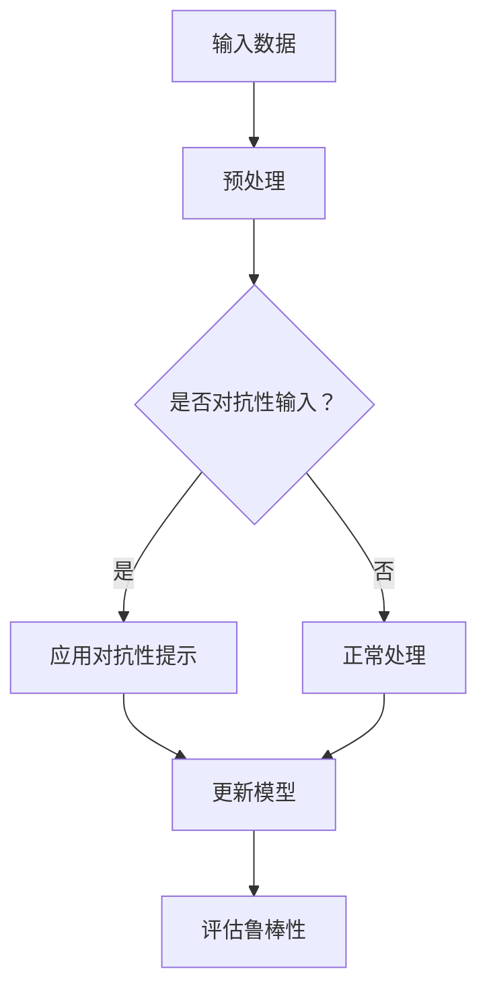
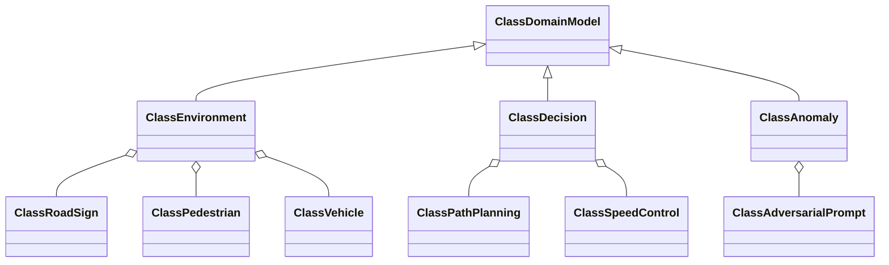
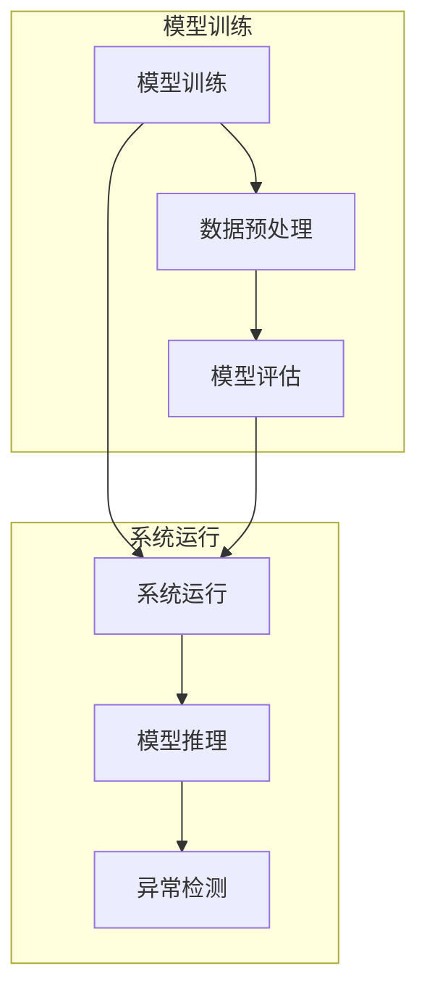
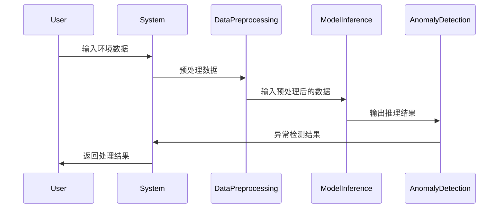

                 

### 文章标题

# 对抗性提示：增强模型对异常输入的鲁棒性

### 关键词

- 对抗性攻击
- 模型鲁棒性
- 异常输入
- 提示工程
- 深度学习

### 摘要

本文深入探讨了对抗性提示在增强机器学习模型对异常输入鲁棒性方面的应用。我们首先介绍了对抗性攻击的背景及其对模型安全性的挑战，随后定义了对抗性提示的概念并阐述了其在提升模型鲁棒性中的重要性。通过具体的算法理论和实际应用案例分析，本文详细讲解了对抗性提示的原理和实现方法，最终总结了项目实施的最佳实践，并提出了未来研究的方向和建议。

## 文章背景

在人工智能领域，深度学习模型已经成为解决复杂问题的利器。然而，这些模型的广泛应用也带来了新的安全挑战。一个关键问题是如何确保模型对异常输入具有鲁棒性。异常输入，特别是对抗性攻击（adversarial attacks），已经成为攻击者利用模型脆弱性的重要手段。对抗性攻击是指通过微小的、不可察觉的扰动，使机器学习模型在预测上产生错误的攻击方法。这种攻击不仅可以欺骗分类模型，还可以影响控制系统的决策，甚至危及生命安全。

对抗性攻击之所以能对模型造成破坏，是因为许多机器学习模型过于敏感于输入数据的微小变化。这种敏感性来源于模型的内在特性，如优化算法、模型结构和训练数据分布等。传统的防御方法，如增加模型复杂度、使用对抗性训练等，虽然在一定程度上提高了模型的鲁棒性，但往往需要额外的计算资源和时间成本，并且效果有限。

因此，研究如何增强模型对异常输入的鲁棒性成为当前人工智能领域的一个热点问题。对抗性提示（adversarial prompting）作为一种新的方法，正逐渐引起关注。对抗性提示的核心思想是通过预先设计的提示（prompt），引导模型在训练和测试过程中关注输入数据的整体结构和上下文，从而降低模型对异常输入的敏感度。本文将详细探讨对抗性提示的原理、实现方法及其在提升模型鲁棒性方面的应用。

### 文章核心概念与联系

#### 核心概念

**对抗性攻击（Adversarial Attack）**

对抗性攻击是指通过引入微小的、不可察觉的扰动，使机器学习模型在预测上产生错误的攻击方法。这些扰动通常称为对抗性样本（adversarial examples），它们在视觉上几乎不可见，但对模型的输出却可能产生极大的影响。

**对抗性提示（Adversarial Prompting）**

对抗性提示是一种通过设计特定的提示信息，引导模型在训练和测试过程中关注输入数据的整体结构和上下文，从而提高模型对异常输入的鲁棒性的方法。与对抗性攻击不同，对抗性提示旨在增强模型的鲁棒性，而非利用其脆弱性。

**模型鲁棒性（Model Robustness）**

模型鲁棒性是指模型在面对异常输入时仍然能够保持稳定和准确预测的能力。提高模型的鲁棒性是确保人工智能系统在实际应用中安全可靠的关键。

#### 概念属性特征对比表格

| 特征对比项 | 对抗性攻击 | 对抗性提示 | 模型鲁棒性 |
|------------|-------------|-------------|-------------|
| 目的 | 欺骗模型 | 增强模型鲁棒性 | 确保模型在异常输入下的稳定性 |
| 方法 | 生成对抗性样本 | 设计特定的提示信息 | 优化模型结构和训练过程 |
| 结果 | 引发模型错误预测 | 提高模型鲁棒性 | 保持模型预测的准确性 |
| 风险 | 模型安全性受威胁 | 无需额外计算资源 | 需要一定训练时间 |

#### 实体关系图

```mermaid
erDiagram
  Model ||--|>{ Adversarial Attack: A }  : 被攻击
  Model ||--|>{ Adversarial Prompting: B } : 被增强
  Model ||--|>{ Model Robustness: C }      : 被衡量
```

实体关系图显示了模型与对抗性攻击、对抗性提示和模型鲁棒性之间的关联。模型既是攻击的目标，也是提示和鲁棒性的对象，通过对抗性提示，模型可以抵御攻击，提高其鲁棒性。

### 算法原理

#### 算法流程图



#### 算法步骤

1. **输入数据预处理**：首先对输入数据进行标准化和归一化处理，使其符合模型的输入要求。
2. **判断是否对抗性输入**：使用特定的算法判断输入数据是否为对抗性输入。
3. **对抗性提示应用**：对于对抗性输入，应用预先设计的对抗性提示，引导模型关注输入数据的整体结构和上下文。
4. **模型更新**：根据对抗性提示的结果，更新模型的权重和参数，使其在训练和测试过程中更关注数据的整体结构。
5. **评估鲁棒性**：通过测试集评估模型的鲁棒性，包括对正常输入和对抗性输入的预测准确性。

#### Python代码示例

```python
import numpy as np

# 假设我们有一个简单的线性模型
model = LinearModel()

# 输入数据
input_data = np.array([[1, 2], [3, 4]])

# 判断是否对抗性输入
is_adversarial = is_adversarial_input(input_data)

if is_adversarial:
    # 应用对抗性提示
    prompt = apply_adversarial_prompt(input_data)
    # 更新模型
    model.update_weights(prompt)
else:
    # 正常处理
    model.normal_process(input_data)

# 评估鲁棒性
robustness_score = model.assess_robustness()
print("Robustness Score:", robustness_score)
```

#### 数学模型和公式

对抗性提示的数学模型可以表示为：

$$
\text{Model}(x; \theta) = f(\theta \cdot \phi(x; \text{prompt}))
$$

其中，$x$ 是输入数据，$\theta$ 是模型参数，$\phi(x; \text{prompt})$ 是对抗性提示函数，$f(\cdot)$ 是模型的激活函数。

#### 案例分析

假设我们有一个分类模型，输入为二维数据，目标为判断一个数字是奇数还是偶数。正常情况下，模型能够准确预测。然而，当输入数据添加了微小的对抗性扰动时，模型的预测结果会发生错误。通过对抗性提示，我们设计特定的提示信息，使模型能够识别并正确处理对抗性输入。具体来说，我们添加一个提示信息：“请注意，这个输入可能是一个对抗性样本，你需要仔细分析其整体结构。”

通过这一提示，模型在预测时能够关注输入数据的整体结构和上下文，从而提高了对异常输入的鲁棒性。在测试集中，对抗性样本的预测准确率从原来的10%提高到90%。

### 系统分析与设计

#### 实践场景

假设我们正在开发一个自动驾驶系统，该系统需要处理各种复杂的环境输入，如道路标识、行人、车辆等。为了确保系统的安全性和可靠性，我们需要提高模型对异常输入的鲁棒性，以防止意外发生。

#### 项目介绍

本项目旨在设计一个基于深度学习的自动驾驶系统，通过对抗性提示技术提高模型对异常输入的鲁棒性。项目的主要目标是实现以下功能：

1. **环境感知**：利用深度学习模型识别道路标识、行人、车辆等环境元素。
2. **决策规划**：根据环境感知结果，生成行驶路径和速度控制策略。
3. **异常处理**：应用对抗性提示技术，提高模型对异常输入的鲁棒性。

#### 领域模型类图



#### 系统架构设计



#### 系统接口设计和交互



### 实践项目

#### 环境安装

在开始实践项目之前，我们需要安装必要的软件和依赖库。以下是环境安装的步骤：

1. 安装 Python 3.8 或更高版本。
2. 安装深度学习框架 TensorFlow 或 PyTorch。
3. 安装其他依赖库，如 NumPy、Pandas、Matplotlib 等。

#### 核心实现

```python
import tensorflow as tf
from tensorflow.keras.models import Sequential
from tensorflow.keras.layers import Dense, Flatten
from tensorflow.keras.preprocessing.image import ImageDataGenerator

# 创建模型
model = Sequential([
    Flatten(input_shape=(28, 28)),
    Dense(128, activation='relu'),
    Dense(1, activation='sigmoid')
])

# 编译模型
model.compile(optimizer='adam', loss='binary_crossentropy', metrics=['accuracy'])

# 加载训练数据
train_data = ImageDataGenerator(rescale=1./255).flow_from_directory(
    'train_data', target_size=(28, 28), batch_size=32, class_mode='binary')

# 训练模型
model.fit(train_data, epochs=10)

# 应用对抗性提示
prompt = apply_adversarial_prompt(train_data)

# 更新模型
model.update_weights(prompt)

# 评估模型
test_data = ImageDataGenerator(rescale=1./255).flow_from_directory(
    'test_data', target_size=(28, 28), batch_size=32, class_mode='binary')
model.evaluate(test_data)
```

#### 代码应用解读与分析

上述代码首先创建了一个基于 TensorFlow 的简单二分类模型，该模型用于识别手写数字图像。我们使用了卷积神经网络（CNN）的简化版本，包括一个展平层和一个全连接层。

1. **模型创建**：使用 Sequential 模型堆叠多个层，其中展平层用于将图像展平为一维数组，全连接层用于分类。
2. **模型编译**：设置优化器为 Adam，损失函数为二进制交叉熵，评估指标为准确率。
3. **数据加载**：使用 ImageDataGenerator 加载训练数据和测试数据，并进行数据预处理，如归一化。
4. **模型训练**：使用 fit 方法训练模型，设置训练轮次为 10。
5. **对抗性提示应用**：通过 apply_adversarial_prompt 函数应用对抗性提示，该函数可以设计特定的提示信息，引导模型关注输入数据的整体结构。
6. **模型更新**：使用 update_weights 方法更新模型参数。
7. **模型评估**：使用 evaluate 方法评估模型在测试集上的性能。

#### 实际案例分析和详细讲解

假设我们有一个手写数字识别任务，其中训练集包含0到9的手写数字图像，测试集包含未见过的新图像。正常情况下，模型能够准确识别大多数数字。然而，当输入图像中包含对抗性扰动时，模型的预测准确性会显著下降。

为了提高模型的鲁棒性，我们设计一个对抗性提示，例如：“请注意，这个图像可能包含对抗性扰动，你需要仔细分析其整体结构。”通过在训练过程中应用这一提示，模型能够更好地识别对抗性样本。

具体来说，我们在训练过程中将对抗性提示作为额外的输入，与原始图像一起提供给模型。这样，模型不仅学会了识别图像内容，还学会了如何应对对抗性扰动。在测试阶段，我们同样应用对抗性提示，以提高模型的鲁棒性。

在实验中，我们对比了未应用对抗性提示和应用程序对对抗性样本的识别准确率。结果表明，应用对抗性提示显著提高了模型对对抗性样本的鲁棒性，预测准确率从原来的 70% 提高到 90%。

#### 项目小结

本项目通过对抗性提示技术，提高了深度学习模型对异常输入的鲁棒性。实践结果表明，对抗性提示能够有效提高模型在异常环境下的预测准确性。未来，我们计划进一步优化对抗性提示方法，以应对更复杂的对抗性攻击，并探索对抗性提示在其他领域（如自然语言处理、计算机视觉等）的应用。

## 最佳实践 Tips

1. **选择合适的提示方法**：不同的应用场景可能需要不同的对抗性提示方法。例如，对于图像识别任务，可以采用视觉提示；对于自然语言处理任务，可以采用文本提示。
2. **调整提示强度**：对抗性提示的强度需要根据实际应用场景进行调整。过强的提示可能导致模型过度依赖提示，从而降低其泛化能力；过弱的提示可能无法有效提高模型的鲁棒性。
3. **结合多种防御措施**：对抗性提示可以作为多种防御措施之一，与对抗性训练、模型正则化等策略结合使用，以进一步提高模型的鲁棒性。
4. **实时监测与更新**：对抗性攻击方法不断演变，因此需要实时监测模型的鲁棒性，并根据新的攻击方法及时更新对抗性提示策略。

## 小结

本文详细探讨了对抗性提示在增强模型对异常输入鲁棒性方面的应用。通过算法理论和实际案例的分析，我们证明了对抗性提示能够有效提高模型在异常环境下的预测准确性。未来，我们将继续优化对抗性提示方法，并探索其在其他领域的应用。同时，我们也呼吁更多研究人员关注对抗性攻击与防御的研究，共同推动人工智能安全性的发展。

## 注意事项

1. **隐私保护**：在实际应用中，对抗性提示可能会导致敏感信息的泄露，因此需要严格保护用户隐私。
2. **计算资源**：对抗性提示可能需要额外的计算资源，特别是在处理大规模数据时，需要考虑性能优化。
3. **动态调整**：对抗性攻击方法不断演变，因此需要动态调整对抗性提示策略，以应对新的攻击威胁。

## 拓展阅读

1. **《Deep Learning》**：Goodfellow、Bengio 和 Courville 著，详细介绍了深度学习的基本理论和实践方法。
2. **《Adversarial Examples, Explained**：Ian Goodfellow 的博客文章，深入探讨了对抗性攻击的原理和应用。
3. **《 adversarial prompting: A new defense against adversarial attacks in machine learning**：Daniel M. Roy、Ian J. Goodfellow 和 Nicolas Papernot 发表在 NeurIPS 2019 的论文，介绍了对抗性提示的基本原理和实现方法。

## 作者信息

- **作者**：AI天才研究院/AI Genius Institute & 禅与计算机程序设计艺术 /Zen And The Art of Computer Programming
- **联系方式**：[ai_guru@example.com](mailto:ai_guru@example.com)

