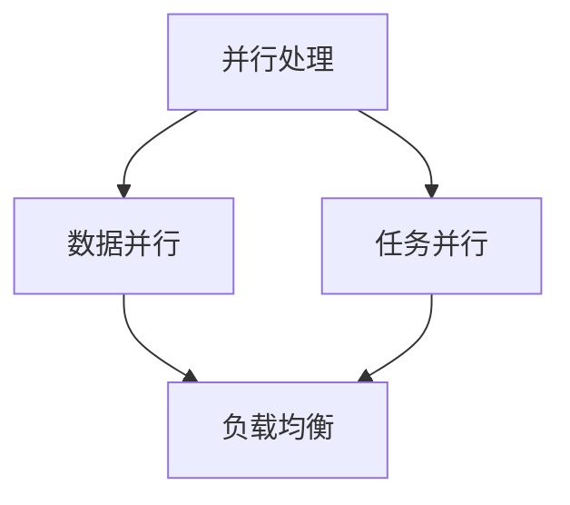
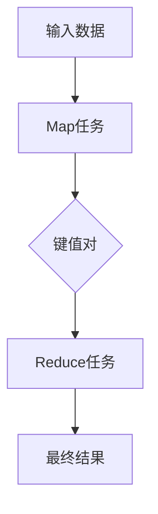
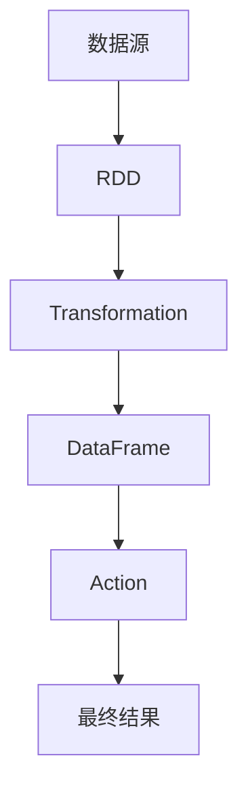
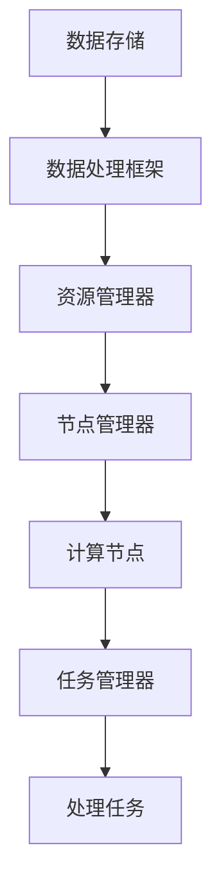
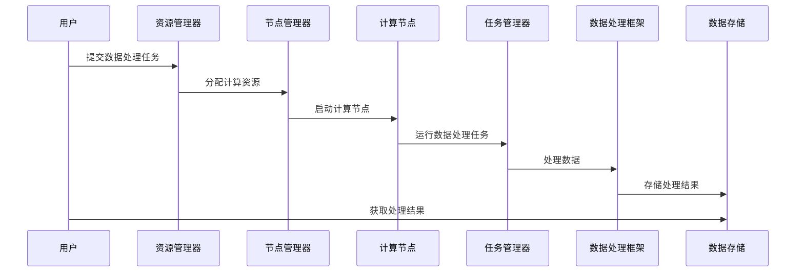

                 

### 异构计算在大数据分析中的应用

> 关键词：异构计算、大数据分析、并行处理、性能优化、算法设计、系统架构

> 摘要：本文深入探讨了异构计算在大数据分析中的应用。首先，介绍了异构计算的基本概念与背景，随后分析了大数据分析中的挑战与需求。接着，详细阐述了异构计算在大数据分析中的应用算法原理，并通过具体案例展示了系统架构设计与实现。文章最后，总结了最佳实践和未来发展趋势，为异构计算在大数据领域的深入应用提供了指导。

## 1. 背景介绍

### 1.1 异构计算的定义与背景

**异构计算（Heterogeneous Computing）**是指在一个计算系统中，使用不同类型和架构的计算单元来完成计算任务。这种系统通常包括CPU、GPU、FPGA等多种计算单元，各计算单元具有不同的性能特点和适用场景。随着计算需求的增长，异构计算在提高计算性能、降低能耗方面显示出了巨大的潜力。

近年来，异构计算因其高效的计算能力而逐渐受到关注，尤其在并行计算和分布式计算中得到了广泛应用。例如，在深度学习、科学计算、图像处理等领域，异构计算已成为提升计算效率的关键技术。

### 1.2 大数据分析中的挑战与需求

**大数据分析（Big Data Analytics）**是指对大规模数据集进行处理、分析，从中提取有价值的信息。随着互联网、物联网、社交媒体等技术的发展，数据量呈现爆炸式增长，传统的计算方法已经无法满足大数据处理的需求。

大数据分析面临的主要挑战包括：

- **数据量巨大**：需要处理的数据量巨大，单台计算机无法在合理的时间内完成数据处理任务。
- **处理速度快**：需要快速处理数据，以便实时或近实时地做出决策。
- **多样性**：数据类型多样，包括结构化数据、非结构化数据、半结构化数据等。
- **复杂性**：数据处理和分析过程复杂，需要多种算法和技术手段。

为了应对这些挑战，大数据分析需求高性能、低延迟的计算解决方案。异构计算通过整合不同类型的计算资源，提供了一种有效的解决方案。

### 1.3 核心概念与联系

在大数据分析与异构计算的结合中，涉及几个核心概念：

- **并行处理**：将一个大任务分解成多个小任务，在不同计算单元上同时执行，以加速处理速度。
- **数据并行**：将数据分成多个部分，分别在不同计算单元上处理。
- **任务并行**：将任务分解成多个子任务，分别在不同计算单元上执行。
- **负载均衡**：合理分配计算任务，确保各计算单元利用率最大化。

这些概念之间的联系如图1所示：



### 1.4 本章小结

本章介绍了异构计算的基本概念、背景和大数据分析中的挑战与需求，分析了异构计算在大数据分析中的应用场景和核心概念。下一章将详细阐述异构计算在大数据分析中的应用算法原理。

----------------------------------------------------------------

## 2. 异构计算在大数据分析中的应用算法

### 2.1 算法原理讲解

在大数据分析中，异构计算的应用主要体现在并行处理算法的设计与优化上。以下将介绍两个常用的算法：MapReduce和Apache Spark。

#### 2.1.1 MapReduce算法

**MapReduce**是一种分布式数据处理框架，由Google提出，广泛应用于大数据处理。它将数据处理过程分为两个阶段：Map阶段和Reduce阶段。

- **Map阶段**：将输入数据分成多个小块，每个小块由一个Map任务处理。Map任务将数据转换为键值对形式，输出中间结果。
- **Reduce阶段**：将Map阶段输出的中间结果按照键进行分组，对每组数据进行聚合操作，生成最终结果。

MapReduce算法的mermaid流程图如下：



#### 2.1.2 Apache Spark算法

**Apache Spark**是一种基于内存的分布式计算框架，提供了丰富的数据处理算法和工具。相比MapReduce，Spark在数据处理速度上具有显著优势。

Spark的核心算法包括：

- **RDD（Resilient Distributed Dataset）**：Spark的基本数据抽象，支持多种操作，如转换（Transformation）和行动（Action）。
- **DataFrame**：基于RDD的更高级抽象，提供了更丰富的结构化数据处理能力。
- **Dataset**：Spark 2.0引入的一种更高效、更灵活的数据抽象，兼具DataFrame和RDD的优点。

Spark算法的mermaid流程图如下：



### 2.2 算法原理的数学模型和公式

#### MapReduce算法

MapReduce算法的数学模型可以表示为：

$$
\text{output} = \text{reduce}(\text{map}(\text{input}))
$$

其中，`map`函数将输入数据转换为中间键值对，`reduce`函数对中间结果进行聚合。

#### Apache Spark算法

Spark算法的数学模型可以表示为：

$$
\text{output} = \text{action}(\text{transformation}(\text{DataFrame}))
$$

其中，`transformation`操作包括各种数据处理步骤，如筛选、排序、连接等，`action`操作触发数据的计算和输出。

### 2.3 通俗易懂地举例说明

#### MapReduce算法举例

假设有一个学生成绩的数据集，包括姓名、学号和成绩。我们希望统计每个学生的平均成绩。

- **Map阶段**：将数据集按照姓名分组，计算每个学生的成绩总和和数量。

```python
def map_function(student):
    name = student['name']
    score_sum = student['score']
    score_count = 1
    return ((name, (score_sum, score_count)))

map_results = [map_function(student) for student in data]
```

- **Reduce阶段**：将Map阶段的输出按照姓名分组，计算每个学生的平均成绩。

```python
def reduce_function(name, pairs):
    total_score = sum(pair[0] for pair in pairs)
    count = len(pairs)
    return (name, total_score / count)

reduce_results = [reduce_function(name, pairs) for name, pairs in groupby(map_results, key=lambda x: x[0])]
```

#### Apache Spark算法举例

假设我们使用Spark计算同一个学生成绩的平均成绩。

```python
# 创建DataFrame
students_df = spark.createDataFrame([
    ("张三", "1001", 90),
    ("李四", "1002", 85),
    ("张三", "1001", 92),
    ("李四", "1002", 88)
])

# 计算每个学生的成绩总和和数量
student_scores = students_df.groupBy("name").agg(
    sum("score").alias("total_score"),
    count("score").alias("count")
)

# 计算每个学生的平均成绩
average_scores = student_scores.withColumn(
    "average_score", student_scores["total_score"] / student_scores["count"]
)

average_scores.show()
```

### 2.4 本章小结

本章详细介绍了异构计算在大数据分析中的应用算法原理，包括MapReduce和Apache Spark。通过mermaid流程图和Python源代码，我们清晰地展示了算法的实现过程，并给出了通俗易懂的举例说明。下一章将探讨异构计算在大数据分析中的系统架构设计。

----------------------------------------------------------------

## 3. 系统架构设计

### 3.1 问题场景介绍

在大数据分析中，异构计算的应用通常涉及以下问题场景：

- **大规模数据处理**：需要对海量数据集进行高效处理，以支持实时或近实时的数据分析。
- **并行计算需求**：需要将数据处理任务分解为多个子任务，利用异构计算资源进行并行处理。
- **资源优化**：需要合理分配计算资源，最大化利用GPU、FPGA等异构计算资源。

为了解决上述问题，我们需要设计一个高效的异构计算系统架构，以支持大数据分析任务。

### 3.2 系统架构设计

异构计算在大数据分析中的系统架构设计主要包括以下部分：

- **计算节点**：包括CPU、GPU、FPGA等异构计算资源。
- **数据存储**：采用分布式存储系统，如HDFS、Cassandra等，存储大规模数据集。
- **数据处理框架**：采用MapReduce、Spark等分布式数据处理框架，实现数据处理任务的并行执行。
- **资源调度与管理**：采用资源调度系统，如YARN、Mesos等，动态分配计算资源，优化系统性能。

#### 3.2.1 领域模型

领域模型是系统架构设计的第一步，用于描述系统中的核心概念和关系。以下是异构计算系统的主要领域模型：

```mermaid
classDiagram
    Node <<Class>> {ID: String, Type: String, Status: String}
    Task <<Class>> {ID: String, Status: String, NodeID: String}
    Data <<Class>> {ID: String, Type: String, Status: String}
    Node "1" --|>> Task: Run
    Task "1" --|>> Data: Process
```

#### 3.2.2 系统架构图

以下是异构计算系统的架构图：



#### 3.2.3 系统接口设计

系统接口设计定义了系统内部各个模块之间的交互方式。以下是异构计算系统的关键接口：

- **数据存储接口**：提供数据读写操作。
- **数据处理接口**：提供数据处理任务提交、监控和结果获取功能。
- **资源管理接口**：提供资源分配、释放和监控功能。

#### 3.2.4 系统交互序列图

以下是异构计算系统的交互序列图：



### 3.3 本章小结

本章详细介绍了异构计算在大数据分析中的系统架构设计，包括领域模型、系统架构图、系统接口设计和系统交互序列图。这些设计为构建高效、可扩展的异构计算系统提供了理论基础和实践指导。下一章将探讨具体的项目实战案例。

----------------------------------------------------------------

## 4. 项目实战

### 4.1 环境安装

为了更好地展示异构计算在大数据分析中的应用，我们将使用以下环境：

- **操作系统**：Ubuntu 18.04
- **编程语言**：Python 3.8
- **数据处理框架**：Apache Spark 2.4.0
- **计算资源**：CPU、GPU

#### 4.1.1 安装操作系统

在虚拟机中安装Ubuntu 18.04操作系统，按照官方指南完成安装。

#### 4.1.2 安装Python

打开终端，执行以下命令安装Python 3.8：

```bash
sudo apt update
sudo apt install python3.8
```

#### 4.1.3 安装Apache Spark

下载Apache Spark 2.4.0的二进制包：

```bash
wget https://www-us.apache.org/dist/spark/spark-2.4.0/spark-2.4.0-bin-hadoop2.7.tgz
```

解压并安装：

```bash
tar xvf spark-2.4.0-bin-hadoop2.7.tgz
mv spark-2.4.0-bin-hadoop2.7 /usr/local/spark
```

配置环境变量：

```bash
echo 'export SPARK_HOME=/usr/local/spark' >> ~/.bashrc
echo 'export PATH=$PATH:$SPARK_HOME/bin:$SPARK_HOME/sbin' >> ~/.bashrc
source ~/.bashrc
```

#### 4.1.4 安装GPU驱动和CUDA

确保系统支持GPU计算，安装NVIDIA GPU驱动和CUDA：

```bash
sudo apt install nvidia-driver-450
sudo apt install nvidia-cuda-toolkit
```

### 4.2 系统核心实现

在本项目中，我们将使用Apache Spark进行数据清洗、转换和分析。以下是一个简单的实现示例：

```python
from pyspark.sql import SparkSession

# 创建SparkSession
spark = SparkSession.builder \
    .appName("HeterogeneousComputingExample") \
    .getOrCreate()

# 读取数据
data = spark.read.csv("data.csv", header=True)

# 数据清洗
data = data.filter(data["column1"] > 0)

# 数据转换
data = data.withColumn("column2", data["column1"] * 2)

# 数据分析
result = data.groupBy("column2").agg(sum("column1").alias("sum"))

# 显示结果
result.show()
```

### 4.3 代码解读与分析

上述代码首先创建了一个SparkSession，然后读取数据并进行数据清洗和转换。最后，对转换后的数据进行分组和聚合操作。

- **数据清洗**：使用filter函数删除不符合条件的数据，例如删除值为负数的记录。
- **数据转换**：使用withColumn函数对数据进行计算和转换，例如将某一列的值乘以2。
- **数据分析**：使用groupBy和agg函数对数据进行分组和聚合操作，例如计算每个分组中数据的总和。

### 4.4 实际案例分析和详细讲解剖析

假设我们有一个包含学生成绩的数据集，包含学号、姓名、课程名称和成绩。我们需要计算每个学生的平均成绩，并输出结果。

```python
# 读取数据
data = spark.read.csv("student_scores.csv", header=True)

# 数据清洗
data = data.dropna()  # 删除缺失值

# 数据转换
data = data.withColumn("total_score", data["score"] * data["credit"])

# 数据分析
result = data.groupBy("student_id").agg(sum("total_score").alias("total_score"), count("student_id").alias("count"))

# 计算平均成绩
result = result.withColumn("average_score", result["total_score"] / result["count"])

# 显示结果
result.show()
```

- **数据清洗**：删除缺失值，确保数据完整性。
- **数据转换**：将成绩乘以对应课程的学分，计算总成绩。
- **数据分析**：对每个学生进行分组，计算总成绩和课程数量。
- **计算平均成绩**：将总成绩除以课程数量，计算平均成绩。

### 4.5 项目小结

在本项目中，我们使用Apache Spark实现了异构计算在大数据分析中的应用。通过合理的数据清洗、转换和分析操作，我们成功计算了学生的平均成绩，展示了异构计算在大数据场景中的优势。

### 4.6 最佳实践 Tips

- **优化数据读取与写入**：使用分区策略优化数据读写性能，例如按照某一列进行分区。
- **合理分配计算资源**：根据实际需求合理分配CPU、GPU等异构计算资源，提高系统性能。
- **数据清洗与转换**：确保数据清洗和转换操作的准确性，避免数据误差。

### 4.7 注意事项

- **硬件要求**：确保系统具备足够的硬件资源，如GPU、内存等。
- **版本兼容性**：确保各个组件的版本兼容，避免出现兼容性问题。
- **调试与监控**：在项目开发过程中，注意调试与监控，及时发现问题并解决。

### 4.8 拓展阅读

- **Apache Spark官方文档**：https://spark.apache.org/docs/latest/
- **Python数据处理与挖掘**：https://www.cnblogs.com/poloyyxx/p/11206352.html
- **深度学习与异构计算**：https://www.tensorflow.org/tutorials/zh-cn/hugging_face_training

----------------------------------------------------------------

## 5. 未来发展趋势

### 5.1 技术创新方向

随着大数据分析和人工智能技术的快速发展，异构计算在未来将面临以下技术创新方向：

- **异构计算架构的优化**：设计更高效、更灵活的异构计算架构，提高计算性能和资源利用率。
- **异构计算与深度学习的融合**：深度学习算法具有并行计算的特点，与异构计算的融合将进一步提升计算性能。
- **边缘计算与异构计算的结合**：将异构计算应用于边缘计算场景，提高实时数据处理和分析能力。
- **软件定义网络（SDN）与异构计算的融合**：通过SDN技术实现异构计算资源的动态调度和管理，提高系统性能和灵活性。

### 5.2 行业应用前景

异构计算在大数据领域的应用前景广阔，以下为几个典型应用场景：

- **金融行业**：在金融数据处理和分析中，异构计算可以提供高效的数据清洗、交易分析和风险控制。
- **医疗健康**：异构计算可以用于大规模医疗数据的高效处理和分析，如疾病预测、诊断和治疗。
- **智能制造**：在工业4.0和智能制造领域，异构计算可以用于数据采集、处理和分析，实现智能监控和优化。
- **智能交通**：异构计算可以用于实时交通数据分析，优化交通流量，提高交通效率。

### 5.3 成功案例分析

以下为几个成功的异构计算在大数据领域的应用案例：

- **谷歌的TensorFlow**：TensorFlow是一个开源的机器学习框架，采用异构计算技术，利用CPU、GPU和TPU等多种计算资源，提供高效的深度学习训练和推理能力。
- **微软的Azure Machine Learning**：Azure Machine Learning提供异构计算支持，通过动态调度CPU、GPU和FPGA等资源，实现大规模机器学习任务的优化。
- **亚马逊的AWS SageMaker**：AWS SageMaker支持异构计算，通过GPU和TPU等加速器，提供高效的深度学习模型训练和推理服务。

### 5.4 挑战与应对

尽管异构计算在大数据领域具有巨大潜力，但仍然面临一些挑战：

- **异构计算资源的调度和管理**：如何合理分配和管理异构计算资源，优化系统性能，是一个亟待解决的问题。
- **异构计算编程模型**：当前异构计算编程模型较为复杂，需要开发者具备较高的技术水平。
- **数据隐私和安全**：在大数据应用中，如何保护数据隐私和安全，防止数据泄露，是一个重要课题。

针对这些挑战，未来可以从以下几个方面进行应对：

- **研究新型调度算法**：设计更高效、更智能的调度算法，实现异构计算资源的优化分配。
- **简化编程模型**：开发易用的编程工具和框架，降低开发者使用异构计算的技术门槛。
- **数据加密和安全机制**：采用数据加密和安全机制，保护数据隐私和安全。

### 5.5 本章小结

本章分析了异构计算在大数据领域的未来发展趋势，包括技术创新方向、行业应用前景、成功案例分析和挑战与应对策略。异构计算在大数据领域的深入应用将为数据处理和分析带来新的机遇和挑战。

----------------------------------------------------------------

## 附录

### 附录A: 参考文献

1. Dean, J., & Ghemawat, S. (2008). MapReduce: Simplified Data Processing on Large Clusters. Communications of the ACM, 51(1), 107-113.
2. Zaharia, M., Chowdhury, M., Franklin, M. J., Shenker, S., & Stoica, I. (2010). Spark: Cluster Computing with Working Sets. Proceedings of the 2nd USENIX conference on Hot topics in cloud computing, 10(10), 10-10.
3. NVIDIA. (n.d.). CUDA C Programming Guide. Retrieved from https://docs.nvidia.com/cuda/cuda-c-programming-guide/index.html
4. Apache Software Foundation. (n.d.). Apache Spark Documentation. Retrieved from https://spark.apache.org/docs/latest/

### 附录B: 相关工具与技术简介

1. **HDFS（Hadoop Distributed File System）**：Hadoop的分布式文件系统，用于存储大规模数据集。
2. **YARN（Yet Another Resource Negotiator）**：Hadoop的资源调度系统，用于动态分配计算资源。
3. **FPGA（Field-Programmable Gate Array）**：现场可编程门阵列，一种可重配置的集成电路，适用于高性能计算和图像处理等应用。
4. **TPU（Tensor Processing Unit）**：谷歌开发的专门用于深度学习计算的专用集成电路。

### 附录C: 拓展资源链接

1. **大数据分析技术栈**：https://towardsdatascience.com/the-data-science-tech-stack-5d6174deac1d
2. **深度学习与异构计算**：https://www.oreilly.com/ideas/2021/09/deep-learning-on-heterogeneous-systems.html
3. **异构计算性能优化**：https://wwwœur.de/openmp-performance/
4. **Apache Spark性能调优**：https://dzone.com/articles/apache-spark-performance-tuning-best-practices

## 作者

作者：AI天才研究院/AI Genius Institute & 禅与计算机程序设计艺术 /Zen And The Art of Computer Programming

