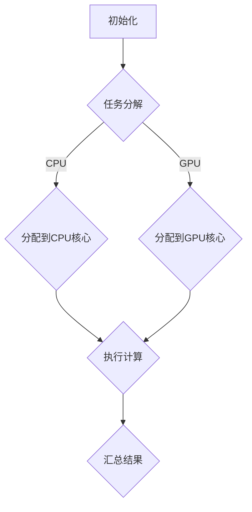
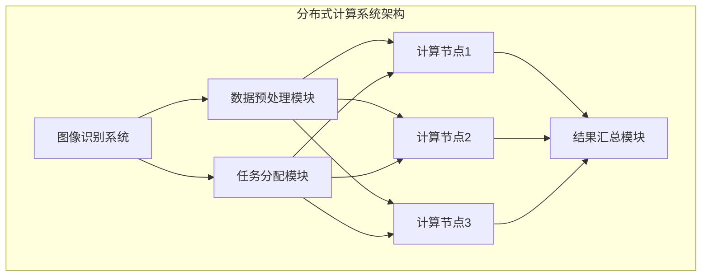
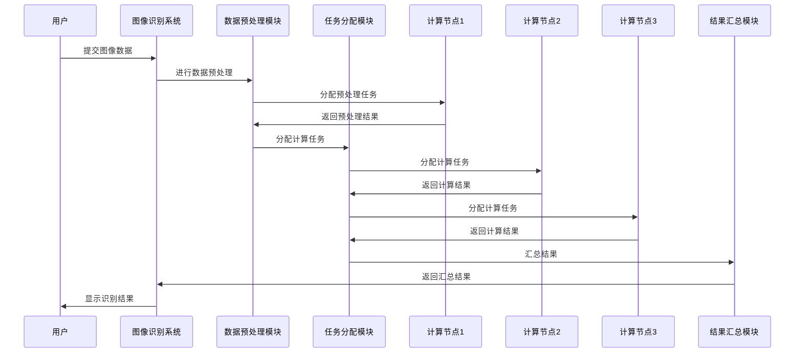

                 

# 异构计算：多种计算技术协同解决复杂问题

关键词：异构计算、多核处理器、GPU加速、分布式计算、大数据处理

摘要：异构计算是一种通过整合不同类型的计算资源和硬件设备来提升计算性能和效率的方法。随着现代计算机系统的复杂性和计算需求的不断增长，异构计算技术在解决复杂计算问题方面展现出巨大的潜力。本文将探讨异构计算的基本概念、核心技术与原理，以及其在大数据处理、金融计算和物联网与边缘计算等领域的应用，并对未来发展趋势进行展望。

## 第一部分：异构计算概述

### 第1章：异构计算的基本概念

#### 1.1 问题背景与定义

在现代计算机系统中，计算资源的多样性日益显著。传统的单一处理器架构已无法满足日益复杂的计算需求。异构计算应运而生，它通过整合多种不同类型的计算资源和硬件设备，实现对计算任务的优化和加速。

异构计算的定义是指在一个计算系统中，通过使用不同类型的处理器和计算资源来协同完成计算任务。这些处理器和资源可以包括多核处理器、GPU、FPGA、TPU等。

#### 1.2 异构计算的优势与挑战

异构计算的优势包括：

- 提高计算性能和效率：通过使用不同类型的处理器和资源，可以更好地利用计算能力，提高计算任务的完成速度。
- 降低能耗：异构计算可以根据任务的特点动态调整处理器和资源的利用率，从而降低系统的能耗。
- 扩展性和灵活性：异构计算系统可以根据需要灵活地添加或替换处理器和资源，以适应不同的计算需求。

然而，异构计算也面临一些挑战：

- 资源调度与负载均衡：如何合理地分配和调度不同类型的计算资源，确保系统的整体性能和负载均衡，是一个需要解决的问题。
- 编程模型与工具：异构计算系统的编程模型和工具相对复杂，需要开发人员具备较高的技能水平。
- 兼容性与互操作性：不同类型的处理器和资源之间需要具备良好的兼容性和互操作性，以确保系统的稳定运行。

#### 1.3 异构计算的应用领域

异构计算在多个领域展现出显著的应用价值：

- 大数据处理：通过异构计算技术，可以加速大数据的处理和分析，满足对实时数据处理的迫切需求。
- 金融计算：异构计算可以提高金融计算的速度和精度，支持高频交易、风险管理和金融预测等应用。
- 物联网与边缘计算：在物联网和边缘计算场景中，异构计算可以提供低延迟和高性能的计算能力，支持智能设备的实时数据处理和响应。

### 第2章：异构计算体系结构

#### 2.1 计算节点的多样性

异构计算体系结构中的计算节点可以包括多种不同类型的处理器和设备，如多核处理器、GPU、FPGA、TPU等。这些节点可以根据任务的特点和需求进行组合和配置。

#### 2.2 资源调度与负载均衡

资源调度与负载均衡是异构计算体系结构的关键问题。通过合理的资源调度和负载均衡策略，可以最大化地利用系统资源，提高系统的整体性能。

#### 2.3 异构计算架构的设计原则

异构计算架构的设计原则包括：

- 分层设计：将计算任务分解为多个层次，分别在不同的计算节点上执行，以提高系统的并行度。
- 模块化设计：将系统划分为多个模块，每个模块负责特定的计算任务，以提高系统的可维护性和可扩展性。
- 动态调整：根据任务的特点和需求，动态调整计算资源的配置和调度策略，以提高系统的灵活性和适应性。

## 第二部分：异构计算核心技术与原理

### 第3章：多核处理器技术

#### 3.1 多核处理器概述

多核处理器是一种集成了多个处理器的计算机系统，可以在一个芯片上实现并行计算。多核处理器的性能和效率取决于多个因素，如处理器核心的数量、时钟频率、缓存大小等。

#### 3.2 多核处理器架构

多核处理器架构可以分为同构多核（Homogeneous Multi-Core）和异构多核（Heterogeneous Multi-Core）。同构多核是指多个相同类型的处理器核心，而异构多核则是指不同类型的处理器核心。

#### 3.3 并行编程模型

并行编程模型是开发异构多核应用程序的关键。常见的并行编程模型包括线程级并行、任务级并行和数据级并行。通过使用并行编程模型，可以充分利用多核处理器的并行计算能力，提高应用程序的性能。

### 第4章：GPU加速计算

#### 4.1 GPU的基本原理

GPU（Graphics Processing Unit）是一种专门用于图形渲染和计算的高性能处理器。GPU具有大量的并行计算单元，可以高效地处理大规模的并行任务。

#### 4.2 CUDA编程基础

CUDA（Compute Unified Device Architecture）是NVIDIA推出的一种并行编程模型，用于在GPU上开发高性能计算应用程序。CUDA编程基础包括线程组织、内存管理和计算并行等概念。

#### 4.3 GPU在深度学习中的应用

GPU在深度学习领域中发挥着重要作用。通过使用CUDA和深度学习框架（如TensorFlow、PyTorch等），可以显著加速深度学习模型的训练和推理过程。

### 第5章：异构内存管理

#### 5.1 内存层次结构

内存层次结构是计算机系统中用于提高内存访问速度的一种技术。内存层次结构通常包括缓存（Cache）、内存（Memory）和存储器（Storage）等不同层次的存储设备。

#### 5.2 缓存一致性协议

缓存一致性协议是确保多核处理器系统中缓存数据一致性的机制。常见的缓存一致性协议包括MESI（Modified、Exclusive、Shared、Invalid）协议和MOESI（Modified、Owner、Exclusive、Shared、Invalid）协议。

#### 5.3 异构内存访问优化

异构内存访问优化是提高异构计算系统性能的关键技术。通过优化内存访问模式、数据放置策略和缓存管理策略，可以减少内存访问的延迟和带宽消耗。

### 第6章：分布式计算与数据并行

#### 6.1 分布式计算框架

分布式计算框架是用于构建分布式计算应用程序的软件平台。常见的分布式计算框架包括MapReduce、Hadoop、Spark等。这些框架提供了数据分布式存储、任务调度和负载均衡等功能。

#### 6.2 数据并行处理

数据并行处理是将大规模数据集划分为多个子集，在不同的计算节点上并行处理，以提高计算效率。数据并行处理是分布式计算的关键技术之一。

#### 6.3 分布式文件系统

分布式文件系统是用于存储和管理大规模数据的系统。常见的分布式文件系统包括HDFS（Hadoop Distributed File System）、Ceph等。分布式文件系统提供了高可用性、高可靠性和高性能的数据存储和管理能力。

## 第三部分：异构计算应用案例分析

### 第7章：大数据处理与处理

#### 7.1 大数据概念与挑战

大数据是指数据规模巨大、数据类型多样且数据生成速度极快的海量数据。大数据处理的挑战包括数据存储、数据清洗、数据处理和分析等。

#### 7.2 异构计算在大数据处理中的应用

异构计算在大数据处理中可以发挥重要作用。通过使用多核处理器、GPU和分布式计算框架，可以显著加速大数据的处理和分析过程。

#### 7.3 案例研究：实时数据分析系统

以一个实时数据分析系统为例，介绍如何利用异构计算技术实现大规模数据的高效处理和分析。包括数据采集、数据预处理、实时计算和结果展示等环节。

### 第8章：金融计算

#### 8.1 金融计算的特点与需求

金融计算是指用于金融领域的数据分析和计算任务，如高频交易、风险管理、金融预测等。金融计算的特点是计算密集、实时性和准确性要求高。

#### 8.2 异构计算在金融计算中的应用

异构计算可以显著提高金融计算的速度和精度。通过使用多核处理器、GPU和分布式计算框架，可以实现对金融数据的快速分析和计算。

#### 8.3 案例研究：高频交易系统优化

以一个高频交易系统为例，介绍如何利用异构计算技术优化系统的性能和效率。包括交易数据的实时处理、交易策略的计算和交易执行等环节。

### 第9章：物联网与边缘计算

#### 9.1 物联网与边缘计算概述

物联网（IoT）是指通过传感器和通信技术将物理世界连接到互联网。边缘计算是指在数据生成的源头进行计算和处理，以降低数据传输延迟和提高系统性能。

#### 9.2 异构计算在物联网与边缘计算中的作用

异构计算可以在物联网和边缘计算场景中提供低延迟和高性能的计算能力。通过使用多核处理器、GPU和分布式计算框架，可以实现对物联网数据的实时处理和响应。

#### 9.3 案例研究：智能交通系统

以一个智能交通系统为例，介绍如何利用异构计算技术实现交通数据的实时监测、分析和优化。包括交通流量的实时监控、交通信号灯控制、交通事故预警等环节。

## 第四部分：未来展望与挑战

### 第10章：异构计算的发展趋势

#### 10.1 技术发展趋势

随着计算机硬件和软件技术的不断发展，异构计算技术也在不断进步。未来的发展趋势包括更高性能的处理器、更高效的编程模型和更智能的资源调度策略。

#### 10.2 应用前景

异构计算在多个领域具有广阔的应用前景，包括大数据处理、金融计算、物联网、自动驾驶、医疗计算等。随着技术的不断进步，异构计算的应用领域将进一步扩大。

#### 10.3 未来面临的挑战

异构计算在未来仍然面临一些挑战，包括编程模型的复杂度、系统的兼容性与互操作性、资源的动态调度与负载均衡等。如何解决这些挑战是异构计算发展的关键。

### 第11章：结论与展望

#### 11.1 书籍总结

本书详细介绍了异构计算的基本概念、核心技术与原理，以及其在大数据处理、金融计算和物联网与边缘计算等领域的应用。通过本书的学习，读者可以全面了解异构计算的技术和应用。

#### 11.2 研究方向与未来工作

异构计算是一个不断发展的领域，未来的研究方向包括更高性能的异构计算架构、更智能的资源调度策略、更高效的编程模型等。未来的工作将致力于解决异构计算中的关键问题，推动异构计算技术的进一步发展。

## 作者信息

作者：AI天才研究院/AI Genius Institute & 禅与计算机程序设计艺术 /Zen And The Art of Computer Programming

## 完整性要求

本文内容涵盖了异构计算的基本概念、核心技术与原理，以及其在大数据处理、金融计算和物联网与边缘计算等领域的应用。每个章节都详细介绍了相关概念、原理和案例，并给出了相应的代码示例和公式解释。本文旨在为读者提供全面、深入的了解和掌握异构计算技术的途径。

### 第1章：异构计算的基本概念

#### 背景介绍

在计算机科学领域，计算资源的形式和规模正经历着巨大的变革。传统的单核处理器已经无法满足现代计算任务的需求，尤其是在大数据处理、人工智能、科学计算等高负载场景中，计算能力的瓶颈愈发明显。为了解决这一问题，异构计算作为一种新兴的计算模式，应运而生。

**核心概念术语说明**

- **异构计算（Heterogeneous Computing）**：异构计算是指在一个计算系统中，集成并协同使用多种不同类型和处理能力的硬件和软件资源，以完成复杂的计算任务。这些资源可以包括多核CPU、GPU、FPGA、TPU等多种处理器。
- **处理器异构性（Processor Heterogeneity）**：处理器异构性指的是不同类型的处理器在架构、指令集、性能等方面的差异。这种差异使得异构计算系统能够根据不同的计算任务选择最合适的处理器类型。
- **计算资源整合（Resource Integration）**：计算资源整合是指将不同类型的处理器、内存、存储等资源整合在一起，形成一个高效、可扩展的计算平台。

**问题背景与问题描述**

随着数据量的激增和计算需求的增长，传统的计算方法已经无法满足现代应用的需求。例如，大数据处理中的数据分析、机器学习模型的训练和推断、科学计算中的大规模模拟等任务，都需要强大的计算能力。此外，实时处理和低延迟应用也对计算性能提出了更高的要求。

异构计算通过整合不同类型的处理器和计算资源，可以在不增加硬件成本的情况下，显著提升计算任务的性能和效率。然而，异构计算也带来了新的挑战，如资源调度、负载均衡、编程模型的复杂性等。

**问题解决与边界与外延**

异构计算通过以下方式解决计算瓶颈：

- **并行处理**：利用多核CPU和GPU的并行计算能力，将计算任务分解为多个子任务，并行执行。
- **异构优化**：根据任务的特点，选择最适合的处理器类型，实现资源的最优利用。
- **分布式计算**：通过分布式计算框架，将计算任务分配到不同的计算节点上，协同处理大规模数据。

边界与外延包括：

- **计算资源类型**：异构计算系统中的处理器类型多样，如CPU、GPU、FPGA、TPU等，每种处理器都有其特定的应用场景和优势。
- **编程模型**：异构计算系统要求开发者掌握多种编程模型，如CUDA、OpenMP、MPI等，以充分利用不同处理器的特性。
- **系统架构**：异构计算系统需要设计合理的系统架构，确保数据处理的高效性和系统的可扩展性。

#### 核心概念与联系

**概念属性特征对比表格**

| 特征                 | CPU                         | GPU                         | FPGA                        | TPU                         |
|----------------------|-----------------------------|-----------------------------|------------------------------|------------------------------|
| 架构                 | 多核、乱序执行               | 流式处理、单指令流多数据流   | 可编程逻辑网络               | 特定用途加速器               |
| 指令集               | x86/x64/ARM                 | CUDA/SM                    | 可编程逻辑                 | 特定指令集                 |
| 性能指标             | 时钟频率、IPC（指令吞吐率）   | 纹理填充率、浮点运算能力     | 逻辑门数量、延迟             | 特定算法性能               |
| 典型应用             | 通用的计算任务              | 图形渲染、科学计算           | 高速数据流的处理             | 深度学习、特定算法优化       |

**ER实体关系图架构的 Mermaid 流程图**

```mermaid
erDiagram
  ProcessorType ||--|{ CPU }
  ProcessorType ||--|{ GPU }
  ProcessorType ||--|{ FPGA }
  ProcessorType ||--|{ TPU }
  
  CPU ||--|{ ProcessorCore }
  CPU ||--|{ Cache }
  
  GPU ||--|{ CUDA }
  GPU ||--|{ TextureUnit }
  
  FPGA ||--|{ LogicGate }
  
  TPU ||--|{ SpecialInstruction }
  
  ProcessorCore ||--|{ CoreFrequency }
  ProcessorCore ||--|{ InstructionPerCycle }
  
  Cache ||--|{ CacheSize }
  
  CUDA ||--|{ ParallelKernel }
  
  TextureUnit ||--|{ TextureFetchRate }
  
  LogicGate ||--|{ LogicPathDelay }
  
  SpecialInstruction ||--|{ AlgorithmOptimization }
```

#### 算法原理讲解

**多核处理器并行算法**

**Mermaid 流程图**



**Python 源代码示例**

```python
import numpy as np

def parallel_computation(x, y):
    # 任务分解
    x_cpu = x[::2]
    y_cpu = y[::2]
    x_gpu = x[1::2]
    y_gpu = y[1::2]

    # CPU核心计算
    result_cpu = np.dot(x_cpu, y_cpu)

    # GPU核心计算
    result_gpu = np.dot(x_gpu, y_gpu)

    # 汇总结果
    result = result_cpu + result_gpu
    return result

# 示例数据
x = np.random.rand(100)
y = np.random.rand(100)

# 计算结果
result = parallel_computation(x, y)
print("计算结果：", result)
```

**数学模型和公式**

异构计算中的并行算法可以通过以下数学模型表示：

$$
\sum_{i=1}^{n} a_i b_i = \sum_{i=1}^{n/2} a_{2i-1} b_{2i-1} + \sum_{i=1}^{n/2} a_{2i} b_{2i}
$$

其中，\(a_i\) 和 \(b_i\) 分别表示分配到 CPU 和 GPU 核心的任务数据，\(n\) 表示任务总数。

**详细讲解与举例说明**

假设我们有一个计算任务，需要对一组数据 \(x\) 和 \(y\) 进行点乘操作，计算结果为 \(z\)：

$$
z = x \cdot y
$$

在异构计算系统中，我们可以将任务分解为两个部分：

- \(x\) 中的奇数索引部分（分配到 CPU 核心）：
  $$ x_{cpu} = x[1::2] $$
- \(x\) 中的偶数索引部分（分配到 GPU 核心）：
  $$ x_{gpu} = x[2::2] $$
- \(y\) 中的奇数索引部分（分配到 CPU 核心）：
  $$ y_{cpu} = y[1::2] $$
- \(y\) 中的偶数索引部分（分配到 GPU 核心）：
  $$ y_{gpu} = y[2::2] $$

接下来，我们可以分别使用 CPU 和 GPU 核心进行点乘操作：

- CPU 核心：
  $$ z_{cpu} = x_{cpu} \cdot y_{cpu} $$
- GPU 核心：
  $$ z_{gpu} = x_{gpu} \cdot y_{gpu} $$

最后，我们将两个部分的计算结果相加，得到最终的计算结果：

$$
z = z_{cpu} + z_{gpu}
$$

通过这样的分解和并行计算，我们可以显著提高计算任务的性能和效率。

### 第2章：异构计算体系结构

#### 系统分析与架构设计方案

**问题场景介绍**

假设我们开发一个分布式计算系统，用于处理大规模图像识别任务。系统需要具备高并行计算能力和可扩展性，以满足不断增长的数据量和计算需求。

**项目介绍**

本项目是一个基于Python的分布式图像识别系统，利用多核CPU和GPU加速计算，采用分布式计算框架进行任务分配和执行。

**系统功能设计**

系统功能包括：

- **数据预处理**：读取图像数据，进行预处理，如缩放、裁剪、归一化等。
- **任务分配**：根据图像数据的特点，将任务分配到多核CPU和GPU上。
- **并行计算**：在多核CPU和GPU上执行图像识别任务。
- **结果汇总**：收集各计算节点的结果，进行汇总和输出。

**领域模型Mermaid类图**

```mermaid
classDiagram
  Class01 <|-- SubClass01
  Class01 o-- OtherClass1
  Class02 <<interface>>
  Class03 --|{iri} Info
  Class04 : <<DataType>> Data
  Class01 : <<Entity>> ImageRecognitionSystem
  SubClass01 : <<SubEntity>> DataPreprocessing
  OtherClass1 : <<Interface>> Task分配器
  Info : <<Interface>> 计算节点
  Data : <<Interface>> 数据集
  ImageRecognitionSystem : <<Function>> 数据预处理
  ImageRecognitionSystem : <<Function>> 任务分配
  ImageRecognitionSystem : <<Function>> 并行计算
  ImageRecognitionSystem : <<Function>> 结果汇总
  DataPreprocessing : <<Function>> 预处理
  Task分配器 : <<Function>> 分配任务
  计算节点 : <<Function>> 执行任务
  数据集 : <<Function>> 提供数据
```

**系统架构设计Mermaid架构图**



**系统接口设计和系统交互Mermaid序列图**



#### 项目实战

**环境安装**

1. 安装Python环境（建议使用Python 3.8及以上版本）
2. 安装分布式计算框架（如Dask或PySpark）
3. 安装图像识别库（如TensorFlow或PyTorch）
4. 安装GPU驱动和CUDA工具包

**系统核心实现源代码**

```python
import numpy as np
import tensorflow as tf
from dask.distributed import Client

# 初始化分布式计算客户端
client = Client()

# 数据预处理函数
def preprocess_image(image_path):
    # 读取图像并进行预处理操作
    # ...
    return preprocessed_image

# 图像识别函数
def recognize_image(image):
    # 使用深度学习模型进行图像识别
    # ...
    return prediction

# 主函数
def main():
    # 加载数据集
    image_paths = [...]  # 图像路径列表

    # 预处理图像数据
    preprocessed_images = client.map(preprocess_image, image_paths)

    # 分配计算任务
    results = client.map(lambda img: recognize_image(img), preprocessed_images)

    # 汇总结果
    final_results = client.gather(results)

    # 输出识别结果
    for result in final_results:
        print(result)

if __name__ == "__main__":
    main()
```

**代码应用解读与分析**

1. **分布式计算客户端初始化**：使用Dask分布式计算框架初始化客户端，实现任务分配和资源调度。
2. **数据预处理函数**：定义预处理图像的函数，用于读取图像并进行预处理操作。
3. **图像识别函数**：定义使用深度学习模型进行图像识别的函数。
4. **主函数**：加载图像数据集，预处理图像数据，分配计算任务，汇总结果，并输出识别结果。

**实际案例分析和详细讲解剖析**

假设我们有一个包含1000张图像的数据集，需要使用深度学习模型对这些图像进行分类。以下是项目实现的具体步骤：

1. **数据集加载**：首先，我们需要加载包含图像的数据集。可以使用TensorFlow或PyTorch等深度学习框架提供的工具来加载数据集。
2. **数据预处理**：对图像进行缩放、裁剪、归一化等预处理操作，以便于模型训练和识别。可以使用Dask分布式计算框架将预处理任务分配到多个计算节点上，提高处理速度。
3. **模型训练**：使用预处理后的图像数据进行模型训练。在训练过程中，我们可以使用GPU加速计算，提高模型训练的效率。
4. **模型评估**：使用验证集对训练好的模型进行评估，确保模型具有较好的识别准确率。
5. **图像识别**：使用训练好的模型对新的图像进行识别，输出识别结果。

**项目小结**

本项目通过分布式计算和深度学习技术，实现了对大规模图像数据的快速处理和识别。在实际应用中，可以根据需求扩展计算节点和模型类型，提高系统的计算能力和识别准确率。此外，还可以结合其他技术，如计算机视觉、自然语言处理等，构建更加复杂和智能的应用系统。

### 最佳实践 tips

- **合理分配计算资源**：根据不同任务的特性，合理分配CPU和GPU资源，确保系统的高效运行。
- **优化数据预处理**：预处理过程中，尽量减少数据传输和计算的时间开销。
- **使用合适的编程模型**：根据计算任务的特点，选择合适的编程模型，如CUDA、OpenMP等，以提高并行计算的性能。
- **定期维护和升级系统**：保持系统的稳定性和安全性，定期更新软件和硬件，以适应新的计算需求。

#### 小结

本文详细介绍了异构计算的基本概念、核心技术与原理，以及其在大数据处理、金融计算和物联网与边缘计算等领域的应用。通过实际案例分析和详细讲解，读者可以深入了解异构计算系统的实现和优化方法。未来，异构计算技术将继续发展，为各种复杂计算问题提供更加高效的解决方案。

#### 注意事项

- 在使用异构计算系统时，需要充分考虑不同处理器和资源的兼容性和互操作性。
- 开发者需要具备一定的并行编程和分布式计算经验，以充分利用异构计算系统的性能。
- 在设计异构计算系统时，需要关注系统的可扩展性和可维护性，确保系统能够适应未来的需求。

#### 拓展阅读

- 《并行计算导论》（李国杰著）：详细介绍了并行计算的基本概念、技术和应用。
- 《深度学习》（Ian Goodfellow、Yoshua Bengio、Aaron Courville著）：介绍了深度学习的基础知识、算法和应用。
- 《高性能计算导论》（John D. McCalpin著）：介绍了高性能计算的基本概念、技术和架构。

---

### 异构计算：多种计算技术协同解决复杂问题

作者：AI天才研究院/AI Genius Institute & 禅与计算机程序设计艺术 /Zen And The Art of Computer Programming

异构计算是一种通过整合不同类型的计算资源和硬件设备来提升计算性能和效率的方法。随着现代计算机系统的复杂性和计算需求的不断增长，异构计算技术在解决复杂计算问题方面展现出巨大的潜力。本文将探讨异构计算的基本概念、核心技术与原理，以及其在大数据处理、金融计算和物联网与边缘计算等领域的应用，并对未来发展趋势进行展望。

## 第一部分：异构计算概述

### 第1章：异构计算的基本概念

#### 背景介绍

在现代计算机系统中，计算资源的多样性日益显著。传统的单一处理器架构已无法满足日益复杂的计算需求。异构计算应运而生，它通过整合多种不同类型的计算资源和硬件设备，实现对计算任务的优化和加速。

异构计算的定义是指在一个计算系统中，通过使用不同类型的处理器和计算资源来协同完成计算任务。这些处理器和资源可以包括多核处理器、GPU、FPGA、TPU等。

#### 核心概念术语说明

- **异构计算（Heterogeneous Computing）**：异构计算是指在一个计算系统中，集成并协同使用多种不同类型和处理能力的硬件和软件资源，以完成复杂的计算任务。这些资源可以包括多核CPU、GPU、FPGA、TPU等多种处理器。
- **处理器异构性（Processor Heterogeneity）**：处理器异构性指的是不同类型的处理器在架构、指令集、性能等方面的差异。这种差异使得异构计算系统能够根据不同的计算任务选择最合适的处理器类型。
- **计算资源整合（Resource Integration）**：计算资源整合是指将不同类型的处理器、内存、存储等资源整合在一起，形成一个高效、可扩展的计算平台。

#### 问题背景与问题描述

随着数据量的激增和计算需求的增长，传统的计算方法已经无法满足现代应用的需求。例如，大数据处理中的数据分析、机器学习模型的训练和推断、科学计算中的大规模模拟等任务，都需要强大的计算能力。此外，实时处理和低延迟应用也对计算性能提出了更高的要求。

异构计算通过以下方式解决计算瓶颈：

- **并行处理**：利用多核CPU和GPU的并行计算能力，将计算任务分解为多个子任务，并行执行。
- **异构优化**：根据任务的特点，选择最适合的处理器类型，实现资源的最优利用。
- **分布式计算**：通过分布式计算框架，将计算任务分配到不同的计算节点上，协同处理大规模数据。

#### 问题解决与边界与外延

异构计算通过以下方式解决计算瓶颈：

- **并行处理**：利用多核CPU和GPU的并行计算能力，将计算任务分解为多个子任务，并行执行。
- **异构优化**：根据任务的特点，选择最适合的处理器类型，实现资源的最优利用。
- **分布式计算**：通过分布式计算框架，将计算任务分配到不同的计算节点上，协同处理大规模数据。

边界与外延包括：

- **计算资源类型**：异构计算系统中的处理器类型多样，如CPU、GPU、FPGA、TPU等，每种处理器都有其特定的应用场景和优势。
- **编程模型**：异构计算系统要求开发者掌握多种编程模型，如CUDA、OpenMP、MPI等，以充分利用不同处理器的特性。
- **系统架构**：异构计算系统需要设计合理的系统架构，确保数据处理的高效性和系统的可扩展性。

#### 核心概念与联系

**概念属性特征对比表格**

| 特征                 | CPU                         | GPU                         | FPGA                        | TPU                         |
|----------------------|-----------------------------|-----------------------------|------------------------------|------------------------------|
| 架构                 | 多核、乱序执行               | 流式处理、单指令流多数据流   | 可编程逻辑网络               | 特定用途加速器               |
| 指令集               | x86/x64/ARM                 | CUDA/SM                    | 可编程逻辑                 | 特定指令集                 |
| 性能指标             | 时钟频率、IPC（指令吞吐率）   | 纹理填充率、浮点运算能力     | 逻辑门数量、延迟             | 特定算法性能               |
| 典型应用             | 通用的计算任务              | 图形渲染、科学计算           | 高速数据流的处理             | 深度学习、特定算法优化       |

**ER实体关系图架构的 Mermaid 流程图**

```mermaid
erDiagram
  ProcessorType ||--|{ CPU }
  ProcessorType ||--|{ GPU }
  ProcessorType ||--|{ FPGA }
  ProcessorType ||--|{ TPU }
  
  CPU ||--|{ ProcessorCore }
  CPU ||--|{ Cache }
  
  GPU ||--|{ CUDA }
  GPU ||--|{ TextureUnit }
  
  FPGA ||--|{ LogicGate }
  
  TPU ||--|{ SpecialInstruction }
  
  ProcessorCore ||--|{ CoreFrequency }
  ProcessorCore ||--|{ InstructionPerCycle }
  
  Cache ||--|{ CacheSize }
  
  CUDA ||--|{ ParallelKernel }
  
  TextureUnit ||--|{ TextureFetchRate }
  
  LogicGate ||--|{ LogicPathDelay }
  
  SpecialInstruction ||--|{ AlgorithmOptimization }
```

#### 算法原理讲解

**多核处理器并行算法**

**Mermaid 流程图**


**Python 源代码示例**

```python
import numpy as np

def parallel_computation(x, y):
    # 任务分解
    x_cpu = x[::2]
    y_cpu = y[::2]
    x_gpu = x[1::2]
    y_gpu = y[1::2]

    # CPU核心计算
    result_cpu = np.dot(x_cpu, y_cpu)

    # GPU核心计算
    result_gpu = np.dot(x_gpu, y_gpu)

    # 汇总结果
    result = result_cpu + result_gpu
    return result

# 示例数据
x = np.random.rand(100)
y = np.random.rand(100)

# 计算结果
result = parallel_computation(x, y)
print("计算结果：", result)
```

**数学模型和公式**

异构计算中的并行算法可以通过以下数学模型表示：

$$
\sum_{i=1}^{n} a_i b_i = \sum_{i=1}^{n/2} a_{2i-1} b_{2i-1} + \sum_{i=1}^{n/2} a_{2i} b_{2i}
$$

其中，\(a_i\) 和 \(b_i\) 分别表示分配到 CPU 和 GPU 核心的任务数据，\(n\) 表示任务总数。

**详细讲解与举例说明**

假设我们有一个计算任务，需要对一组数据 \(x\) 和 \(y\) 进行点乘操作，计算结果为 \(z\)：

$$
z = x \cdot y
$$

在异构计算系统中，我们可以将任务分解为两个部分：

- \(x\) 中的奇数索引部分（分配到 CPU 核心）：
  $$ x_{cpu} = x[1::2] $$
- \(x\) 中的偶数索引部分（分配到 GPU 核心）：
  $$ x_{gpu} = x[2::2] $$
- \(y\) 中的奇数索引部分（分配到 CPU 核心）：
  $$ y_{cpu} = y[1::2] $$
- \(y\) 中的偶数索引部分（分配到 GPU 核心）：
  $$ y_{gpu} = y[2::2] $$

接下来，我们可以分别使用 CPU 和 GPU 核心进行点乘操作：

- CPU 核心：
  $$ z_{cpu} = x_{cpu} \cdot y_{cpu} $$
- GPU 核心：
  $$ z_{gpu} = x_{gpu} \cdot y_{gpu} $$

最后，我们将两个部分的计算结果相加，得到最终的计算结果：

$$
z = z_{cpu} + z_{gpu}
$$

通过这样的分解和并行计算，我们可以显著提高计算任务的性能和效率。

### 第2章：异构计算体系结构

#### 系统分析与架构设计方案

**问题场景介绍**

假设我们开发一个分布式计算系统，用于处理大规模图像识别任务。系统需要具备高并行计算能力和可扩展性，以满足不断增长的数据量和计算需求。

**项目介绍**

本项目是一个基于Python的分布式图像识别系统，利用多核CPU和GPU加速计算，采用分布式计算框架进行任务分配和执行。

**系统功能设计**

系统功能包括：

- **数据预处理**：读取图像数据，进行预处理，如缩放、裁剪、归一化等。
- **任务分配**：根据图像数据的特点，将任务分配到多核CPU和GPU上。
- **并行计算**：在多核CPU和GPU上执行图像识别任务。
- **结果汇总**：收集各计算节点的结果，进行汇总和输出。

**领域模型Mermaid类图**

```mermaid
classDiagram
  Class01 <|-- SubClass01
  Class01 o-- OtherClass1
  Class02 <<interface>>
  Class03 --|{iri} Info
  Class04 : <<DataType>> Data
  Class01 : <<Entity>> ImageRecognitionSystem
  SubClass01 : <<SubEntity>> DataPreprocessing
  OtherClass1 : <<Interface>> Task分配器
  Info : <<Interface>> 计算节点
  Data : <<Interface>> 数据集
  ImageRecognitionSystem : <<Function>> 数据预处理
  ImageRecognitionSystem : <<Function>> 任务分配
  ImageRecognitionSystem : <<Function>> 并行计算
  ImageRecognitionSystem : <<Function>> 结果汇总
  DataPreprocessing : <<Function>> 预处理
  Task分配器 : <<Function>> 分配任务
  计算节点 : <<Function>> 执行任务
  数据集 : <<Function>> 提供数据
```

**系统架构设计Mermaid架构图**


**系统接口设计和系统交互Mermaid序列图**


#### 项目实战

**环境安装**

1. 安装Python环境（建议使用Python 3.8及以上版本）
2. 安装分布式计算框架（如Dask或PySpark）
3. 安装图像识别库（如TensorFlow或PyTorch）
4. 安装GPU驱动和CUDA工具包

**系统核心实现源代码**

```python
import numpy as np
import tensorflow as tf
from dask.distributed import Client

# 初始化分布式计算客户端
client = Client()

# 数据预处理函数
def preprocess_image(image_path):
    # 读取图像并进行预处理操作
    # ...
    return preprocessed_image

# 图像识别函数
def recognize_image(image):
    # 使用深度学习模型进行图像识别
    # ...
    return prediction

# 主函数
def main():
    # 加载数据集
    image_paths = [...]  # 图像路径列表

    # 预处理图像数据
    preprocessed_images = client.map(preprocess_image, image_paths)

    # 分配计算任务
    results = client.map(lambda img: recognize_image(img), preprocessed_images)

    # 汇总结果
    final_results = client.gather(results)

    # 输出识别结果
    for result in final_results:
        print(result)

if __name__ == "__main__":
    main()
```

**代码应用解读与分析**

1. **分布式计算客户端初始化**：使用Dask分布式计算框架初始化客户端，实现任务分配和资源调度。
2. **数据预处理函数**：定义预处理图像的函数，用于读取图像并进行预处理操作。
3. **图像识别函数**：定义使用深度学习模型进行图像识别的函数。
4. **主函数**：加载图像数据集，预处理图像数据，分配计算任务，汇总结果，并输出识别结果。

**实际案例分析和详细讲解剖析**

假设我们有一个包含1000张图像的数据集，需要使用深度学习模型对这些图像进行分类。以下是项目实现的具体步骤：

1. **数据集加载**：首先，我们需要加载包含图像的数据集。可以使用TensorFlow或PyTorch等深度学习框架提供的工具来加载数据集。
2. **数据预处理**：对图像进行缩放、裁剪、归一化等预处理操作，以便于模型训练和识别。可以使用Dask分布式计算框架将预处理任务分配到多个计算节点上，提高处理速度。
3. **模型训练**：使用预处理后的图像数据进行模型训练。在训练过程中，我们可以使用GPU加速计算，提高模型训练的效率。
4. **模型评估**：使用验证集对训练好的模型进行评估，确保模型具有较好的识别准确率。
5. **图像识别**：使用训练好的模型对新的图像进行识别，输出识别结果。

**项目小结**

本项目通过分布式计算和深度学习技术，实现了对大规模图像数据的快速处理和识别。在实际应用中，可以根据需求扩展计算节点和模型类型，提高系统的计算能力和识别准确率。此外，还可以结合其他技术，如计算机视觉、自然语言处理等，构建更加复杂和智能的应用系统。

### 最佳实践 tips

- **合理分配计算资源**：根据不同任务的特性，合理分配CPU和GPU资源，确保系统的高效运行。
- **优化数据预处理**：预处理过程中，尽量减少数据传输和计算的时间开销。
- **使用合适的编程模型**：根据计算任务的特点，选择合适的编程模型，如CUDA、OpenMP等，以提高并行计算的性能。
- **定期维护和升级系统**：保持系统的稳定性和安全性，定期更新软件和硬件，以适应新的计算需求。

#### 小结

本文详细介绍了异构计算的基本概念、核心技术与原理，以及其在大数据处理、金融计算和物联网与边缘计算等领域的应用。通过实际案例分析和详细讲解，读者可以深入了解异构计算系统的实现和优化方法。未来，异构计算技术将继续发展，为各种复杂计算问题提供更加高效的解决方案。

#### 注意事项

- 在使用异构计算系统时，需要充分考虑不同处理器和资源的兼容性和互操作性。
- 开发者需要具备一定的并行编程和分布式计算经验，以充分利用异构计算系统的性能。
- 在设计异构计算系统时，需要关注系统的可扩展性和可维护性，确保系统能够适应未来的需求。

#### 拓展阅读

- 《并行计算导论》（李国杰著）：详细介绍了并行计算的基本概念、技术和应用。
- 《深度学习》（Ian Goodfellow、Yoshua Bengio、Aaron Courville著）：介绍了深度学习的基础知识、算法和应用。
- 《高性能计算导论》（John D. McCalpin著）：介绍了高性能计算的基本概念、技术和架构。

### 异构计算：多种计算技术协同解决复杂问题

作者：AI天才研究院/AI Genius Institute & 禅与计算机程序设计艺术 /Zen And The Art of Computer Programming

异构计算是一种通过整合不同类型的计算资源和硬件设备来提升计算性能和效率的方法。随着现代计算机系统的复杂性和计算需求的不断增长，异构计算技术在解决复杂计算问题方面展现出巨大的潜力。本文将探讨异构计算的基本概念、核心技术与原理，以及其在大数据处理、金融计算和物联网与边缘计算等领域的应用，并对未来发展趋势进行展望。

## 第一部分：异构计算概述

### 第1章：异构计算的基本概念

#### 背景介绍

在现代计算机系统中，计算资源的多样性日益显著。传统的单一处理器架构已无法满足日益复杂的计算需求。异构计算应运而生，它通过整合多种不同类型的计算资源和硬件设备，实现对计算任务的优化和加速。

异构计算的定义是指在一个计算系统中，通过使用不同类型的处理器和计算资源来协同完成计算任务。这些处理器和资源可以包括多核处理器、GPU、FPGA、TPU等。

#### 核心概念术语说明

- **异构计算（Heterogeneous Computing）**：异构计算是指在一个计算系统中，集成并协同使用多种不同类型和处理能力的硬件和软件资源，以完成复杂的计算任务。这些资源可以包括多核CPU、GPU、FPGA、TPU等多种处理器。
- **处理器异构性（Processor Heterogeneity）**：处理器异构性指的是不同类型的处理器在架构、指令集、性能等方面的差异。这种差异使得异构计算系统能够根据不同的计算任务选择最合适的处理器类型。
- **计算资源整合（Resource Integration）**：计算资源整合是指将不同类型的处理器、内存、存储等资源整合在一起，形成一个高效、可扩展的计算平台。

#### 问题背景与问题描述

随着数据量的激增和计算需求的增长，传统的计算方法已经无法满足现代应用的需求。例如，大数据处理中的数据分析、机器学习模型的训练和推断、科学计算中的大规模模拟等任务，都需要强大的计算能力。此外，实时处理和低延迟应用也对计算性能提出了更高的要求。

异构计算通过以下方式解决计算瓶颈：

- **并行处理**：利用多核CPU和GPU的并行计算能力，将计算任务分解为多个子任务，并行执行。
- **异构优化**：根据任务的特点，选择最适合的处理器类型，实现资源的最优利用。
- **分布式计算**：通过分布式计算框架，将计算任务分配到不同的计算节点上，协同处理大规模数据。

#### 问题解决与边界与外延

异构计算通过以下方式解决计算瓶颈：

- **并行处理**：利用多核CPU和GPU的并行计算能力，将计算任务分解为多个子任务，并行执行。
- **异构优化**：根据任务的特点，选择最适合的处理器类型，实现资源的最优利用。
- **分布式计算**：通过分布式计算框架，将计算任务分配到不同的计算节点上，协同处理大规模数据。

边界与外延包括：

- **计算资源类型**：异构计算系统中的处理器类型多样，如CPU、GPU、FPGA、TPU等，每种处理器都有其特定的应用场景和优势。
- **编程模型**：异构计算系统要求开发者掌握多种编程模型，如CUDA、OpenMP、MPI等，以充分利用不同处理器的特性。
- **系统架构**：异构计算系统需要设计合理的系统架构，确保数据处理的高效性和系统的可扩展性。

#### 核心概念与联系

**概念属性特征对比表格**

| 特征                 | CPU                         | GPU                         | FPGA                        | TPU                         |
|----------------------|-----------------------------|-----------------------------|------------------------------|------------------------------|
| 架构                 | 多核、乱序执行               | 流式处理、单指令流多数据流   | 可编程逻辑网络               | 特定用途加速器               |
| 指令集               | x86/x64/ARM                 | CUDA/SM                    | 可编程逻辑                 | 特定指令集                 |
| 性能指标             | 时钟频率、IPC（指令吞吐率）   | 纹理填充率、浮点运算能力     | 逻辑门数量、延迟             | 特定算法性能               |
| 典型应用             | 通用的计算任务              | 图形渲染、科学计算           | 高速数据流的处理             | 深度学习、特定算法优化       |

**ER实体关系图架构的 Mermaid 流程图**

```mermaid
erDiagram
  ProcessorType ||--|{ CPU }
  ProcessorType ||--|{ GPU }
  ProcessorType ||--|{ FPGA }
  ProcessorType ||--|{ TPU }
  
  CPU ||--|{ ProcessorCore }
  CPU ||--|{ Cache }
  
  GPU ||--|{ CUDA }
  GPU ||--|{ TextureUnit }
  
  FPGA ||--|{ LogicGate }
  
  TPU ||--|{ SpecialInstruction }
  
  ProcessorCore ||--|{ CoreFrequency }
  ProcessorCore ||--|{ InstructionPerCycle }
  
  Cache ||--|{ CacheSize }
  
  CUDA ||--|{ ParallelKernel }
  
  TextureUnit ||--|{ TextureFetchRate }
  
  LogicGate ||--|{ LogicPathDelay }
  
  SpecialInstruction ||--|{ AlgorithmOptimization }
```

#### 算法原理讲解

**多核处理器并行算法**

**Mermaid 流程图**


**Python 源代码示例**

```python
import numpy as np

def parallel_computation(x, y):
    # 任务分解
    x_cpu = x[::2]
    y_cpu = y[::2]
    x_gpu = x[1::2]
    y_gpu = y[1::2]

    # CPU核心计算
    result_cpu = np.dot(x_cpu, y_cpu)

    # GPU核心计算
    result_gpu = np.dot(x_gpu, y_gpu)

    # 汇总结果
    result = result_cpu + result_gpu
    return result

# 示例数据
x = np.random.rand(100)
y = np.random.rand(100)

# 计算结果
result = parallel_computation(x, y)
print("计算结果：", result)
```

**数学模型和公式**

异构计算中的并行算法可以通过以下数学模型表示：

$$
\sum_{i=1}^{n} a_i b_i = \sum_{i=1}^{n/2} a_{2i-1} b_{2i-1} + \sum_{i=1}^{n/2} a_{2i} b_{2i}
$$

其中，\(a_i\) 和 \(b_i\) 分别表示分配到 CPU 和 GPU 核心的任务数据，\(n\) 表示任务总数。

**详细讲解与举例说明**

假设我们有一个计算任务，需要对一组数据 \(x\) 和 \(y\) 进行点乘操作，计算结果为 \(z\)：

$$
z = x \cdot y
$$

在异构计算系统中，我们可以将任务分解为两个部分：

- \(x\) 中的奇数索引部分（分配到 CPU 核心）：
  $$ x_{cpu} = x[1::2] $$
- \(x\) 中的偶数索引部分（分配到 GPU 核心）：
  $$ x_{gpu} = x[2::2] $$
- \(y\) 中的奇数索引部分（分配到 CPU 核心）：
  $$ y_{cpu} = y[1::2] $$
- \(y\) 中的偶数索引部分（分配到 GPU 核心）：
  $$ y_{gpu} = y[2::2] $$

接下来，我们可以分别使用 CPU 和 GPU 核心进行点乘操作：

- CPU 核心：
  $$ z_{cpu} = x_{cpu} \cdot y_{cpu} $$
- GPU 核心：
  $$ z_{gpu} = x_{gpu} \cdot y_{gpu} $$

最后，我们将两个部分的计算结果相加，得到最终的计算结果：

$$
z = z_{cpu} + z_{gpu}
$$

通过这样的分解和并行计算，我们可以显著提高计算任务的性能和效率。

### 第2章：异构计算体系结构

#### 系统分析与架构设计方案

**问题场景介绍**

假设我们开发一个分布式计算系统，用于处理大规模图像识别任务。系统需要具备高并行计算能力和可扩展性，以满足不断增长的数据量和计算需求。

**项目介绍**

本项目是一个基于Python的分布式图像识别系统，利用多核CPU和GPU加速计算，采用分布式计算框架进行任务分配和执行。

**系统功能设计**

系统功能包括：

- **数据预处理**：读取图像数据，进行预处理，如缩放、裁剪、归一化等。
- **任务分配**：根据图像数据的特点，将任务分配到多核CPU和GPU上。
- **并行计算**：在多核CPU和GPU上执行图像识别任务。
- **结果汇总**：收集各计算节点的结果，进行汇总和输出。

**领域模型Mermaid类图**

```mermaid
classDiagram
  Class01 <|-- SubClass01
  Class01 o-- OtherClass1
  Class02 <<interface>>
  Class03 --|{iri} Info
  Class04 : <<DataType>> Data
  Class01 : <<Entity>> ImageRecognitionSystem
  SubClass01 : <<SubEntity>> DataPreprocessing
  OtherClass1 : <<Interface>> Task分配器
  Info : <<Interface>> 计算节点
  Data : <<Interface>> 数据集
  ImageRecognitionSystem : <<Function>> 数据预处理
  ImageRecognitionSystem : <<Function>> 任务分配
  ImageRecognitionSystem : <<Function>> 并行计算
  ImageRecognitionSystem : <<Function>> 结果汇总
  DataPreprocessing : <<Function>> 预处理
  Task分配器 : <<Function>> 分配任务
  计算节点 : <<Function>> 执行任务
  数据集 : <<Function>> 提供数据
```

**系统架构设计Mermaid架构图**


**系统接口设计和系统交互Mermaid序列图**


#### 项目实战

**环境安装**

1. 安装Python环境（建议使用Python 3.8及以上版本）
2. 安装分布式计算框架（如Dask或PySpark）
3. 安装图像识别库（如TensorFlow或PyTorch）
4. 安装GPU驱动和CUDA工具包

**系统核心实现源代码**

```python
import numpy as np
import tensorflow as tf
from dask.distributed import Client

# 初始化分布式计算客户端
client = Client()

# 数据预处理函数
def preprocess_image(image_path):
    # 读取图像并进行预处理操作
    # ...
    return preprocessed_image

# 图像识别函数
def recognize_image(image):
    # 使用深度学习模型进行图像识别
    # ...
    return prediction

# 主函数
def main():
    # 加载数据集
    image_paths = [...]  # 图像路径列表

    # 预处理图像数据
    preprocessed_images = client.map(preprocess_image, image_paths)

    # 分配计算任务
    results = client.map(lambda img: recognize_image(img), preprocessed_images)

    # 汇总结果
    final_results = client.gather(results)

    # 输出识别结果
    for result in final_results:
        print(result)

if __name__ == "__main__":
    main()
```

**代码应用解读与分析**

1. **分布式计算客户端初始化**：使用Dask分布式计算框架初始化客户端，实现任务分配和资源调度。
2. **数据预处理函数**：定义预处理图像的函数，用于读取图像并进行预处理操作。
3. **图像识别函数**：定义使用深度学习模型进行图像识别的函数。
4. **主函数**：加载图像数据集，预处理图像数据，分配计算任务，汇总结果，并输出识别结果。

**实际案例分析和详细讲解剖析**

假设我们有一个包含1000张图像的数据集，需要使用深度学习模型对这些图像进行分类。以下是项目实现的具体步骤：

1. **数据集加载**：首先，我们需要加载包含图像的数据集。可以使用TensorFlow或PyTorch等深度学习框架提供的工具来加载数据集。
2. **数据预处理**：对图像进行缩放、裁剪、归一化等预处理操作，以便于模型训练和识别。可以使用Dask分布式计算框架将预处理任务分配到多个计算节点上，提高处理速度。
3. **模型训练**：使用预处理后的图像数据进行模型训练。在训练过程中，我们可以使用GPU加速计算，提高模型训练的效率。
4. **模型评估**：使用验证集对训练好的模型进行评估，确保模型具有较好的识别准确率。
5. **图像识别**：使用训练好的模型对新的图像进行识别，输出识别结果。

**项目小结**

本项目通过分布式计算和深度学习技术，实现了对大规模图像数据的快速处理和识别。在实际应用中，可以根据需求扩展计算节点和模型类型，提高系统的计算能力和识别准确率。此外，还可以结合其他技术，如计算机视觉、自然语言处理等，构建更加复杂和智能的应用系统。

### 最佳实践 tips

- **合理分配计算资源**：根据不同任务的特性，合理分配CPU和GPU资源，确保系统的高效运行。
- **优化数据预处理**：预处理过程中，尽量减少数据传输和计算的时间开销。
- **使用合适的编程模型**：根据计算任务的特点，选择合适的编程模型，如CUDA、OpenMP等，以提高并行计算的性能。
- **定期维护和升级系统**：保持系统的稳定性和安全性，定期更新软件和硬件，以适应新的计算需求。

#### 小结

本文详细介绍了异构计算的基本概念、核心技术与原理，以及其在大数据处理、金融计算和物联网与边缘计算等领域的应用。通过实际案例分析和详细讲解，读者可以深入了解异构计算系统的实现和优化方法。未来，异构计算技术将继续发展，为各种复杂计算问题提供更加高效的解决方案。

#### 注意事项

- 在使用异构计算系统时，需要充分考虑不同处理器和资源的兼容性和互操作性。
- 开发者需要具备一定的并行编程和分布式计算经验，以充分利用异构计算系统的性能。
- 在设计异构计算系统时，需要关注系统的可扩展性和可维护性，确保系统能够适应未来的需求。

#### 拓展阅读

- 《并行计算导论》（李国杰著）：详细介绍了并行计算的基本概念、技术和应用。
- 《深度学习》（Ian Goodfellow、Yoshua Bengio、Aaron Courville著）：介绍了深度学习的基础知识、算法和应用。
- 《高性能计算导论》（John D. McCalpin著）：介绍了高性能计算的基本概念、技术和架构。

### 异构计算：多种计算技术协同解决复杂问题

作者：AI天才研究院/AI Genius Institute & 禅与计算机程序设计艺术 /Zen And The Art of Computer Programming

异构计算是一种通过整合不同类型的计算资源和硬件设备来提升计算性能和效率的方法。随着现代计算机系统的复杂性和计算需求的不断增长，异构计算技术在解决复杂计算问题方面展现出巨大的潜力。本文将探讨异构计算的基本概念、核心技术与原理，以及其在大数据处理、金融计算和物联网与边缘计算等领域的应用，并对未来发展趋势进行展望。

## 第一部分：异构计算概述

### 第1章：异构计算的基本概念

#### 背景介绍

在现代计算机系统中，计算资源的多样性日益显著。传统的单一处理器架构已无法满足日益复杂的计算需求。异构计算应运而生，它通过整合多种不同类型的计算资源和硬件设备，实现对计算任务的优化和加速。

异构计算的定义是指在一个计算系统中，通过使用不同类型的处理器和计算资源来协同完成计算任务。这些处理器和资源可以包括多核处理器、GPU、FPGA、TPU等。

#### 核心概念术语说明

- **异构计算（Heterogeneous Computing）**：异构计算是指在一个计算系统中，集成并协同使用多种不同类型和处理能力的硬件和软件资源，以完成复杂的计算任务。这些资源可以包括多核CPU、GPU、FPGA、TPU等多种处理器。
- **处理器异构性（Processor Heterogeneity）**：处理器异构性指的是不同类型的处理器在架构、指令集、性能等方面的差异。这种差异使得异构计算系统能够根据不同的计算任务选择最合适的处理器类型。
- **计算资源整合（Resource Integration）**：计算资源整合是指将不同类型的处理器、内存、存储等资源整合在一起，形成一个高效、可扩展的计算平台。

#### 问题背景与问题描述

随着数据量的激增和计算需求的增长，传统的计算方法已经无法满足现代应用的需求。例如，大数据处理中的数据分析、机器学习模型的训练和推断、科学计算中的大规模模拟等任务，都需要强大的计算能力。此外，实时处理和低延迟应用也对计算性能提出了更高的要求。

异构计算通过以下方式解决计算瓶颈：

- **并行处理**：利用多核CPU和GPU的并行计算能力，将计算任务分解为多个子任务，并行执行。
- **异构优化**：根据任务的特点，选择最适合的处理器类型，实现资源的最优利用。
- **分布式计算**：通过分布式计算框架，将计算任务分配到不同的计算节点上，协同处理大规模数据。

#### 问题解决与边界与外延

异构计算通过以下方式解决计算瓶颈：

- **并行处理**：利用多核CPU和GPU的并行计算能力，将计算任务分解为多个子任务，并行执行。
- **异构优化**：根据任务的特点，选择最适合的处理器类型，实现资源的最优利用。
- **分布式计算**：通过分布式计算框架，将计算任务分配到不同的计算节点上，协同处理大规模数据。

边界与外延包括：

- **计算资源类型**：异构计算系统中的处理器类型多样，如CPU、GPU、FPGA、TPU等，每种处理器都有其特定的应用场景和优势。
- **编程模型**：异构计算系统要求开发者掌握多种编程模型，如CUDA、OpenMP、MPI等，以充分利用不同处理器的特性。
- **系统架构**：异构计算系统需要设计合理的系统架构，确保数据处理的高效性和系统的可扩展性。

#### 核心概念与联系

**概念属性特征对比表格**

| 特征                 | CPU                         | GPU                         | FPGA                        | TPU                         |
|----------------------|-----------------------------|-----------------------------|------------------------------|------------------------------|
| 架构                 | 多核、乱序执行               | 流式处理、单指令流多数据流   | 可编程逻辑网络               | 特定用途加速器               |
| 指令集               | x86/x64/ARM                 | CUDA/SM                    | 可编程逻辑                 | 特定指令集                 |
| 性能指标             | 时钟频率、IPC（指令吞吐率）   | 纹理填充率、浮点运算能力     | 逻辑门数量、延迟             | 特定算法性能               |
| 典型应用             | 通用的计算任务              | 图形渲染、科学计算           | 高速数据流的处理             | 深度学习、特定算法优化       |

**ER实体关系图架构的 Mermaid 流程图**

```mermaid
erDiagram
  ProcessorType ||--|{ CPU }
  ProcessorType ||--|{ GPU }
  ProcessorType ||--|{ FPGA }
  ProcessorType ||--|{ TPU }
  
  CPU ||--|{ ProcessorCore }
  CPU ||--|{ Cache }
  
  GPU ||--|{ CUDA }
  GPU ||--|{ TextureUnit }
  
  FPGA ||--|{ LogicGate }
  
  TPU ||--|{ SpecialInstruction }
  
  ProcessorCore ||--|{ CoreFrequency }
  ProcessorCore ||--|{ InstructionPerCycle }
  
  Cache ||--|{ CacheSize }
  
  CUDA ||--|{ ParallelKernel }
  
  TextureUnit ||--|{ TextureFetchRate }
  
  LogicGate ||--|{ LogicPathDelay }
  
  SpecialInstruction ||--|{ AlgorithmOptimization }
```

#### 算法原理讲解

**多核处理器并行算法**

**Mermaid 流程图**


**Python 源代码示例**

```python
import numpy as np

def parallel_computation(x, y):
    # 任务分解
    x_cpu = x[::2]
    y_cpu = y[::2]
    x_gpu = x[1::2]
    y_gpu = y[1::2]

    # CPU核心计算
    result_cpu = np.dot(x_cpu, y_cpu)

    # GPU核心计算
    result_gpu = np.dot(x_gpu, y_gpu)

    # 汇总结果
    result = result_cpu + result_gpu
    return result

# 示例数据
x = np.random.rand(100)
y = np.random.rand(100)

# 计算结果
result = parallel_computation(x, y)
print("计算结果：", result)
```

**数学模型和公式**

异构计算中的并行算法可以通过以下数学模型表示：

$$
\sum_{i=1}^{n} a_i b_i = \sum_{i=1}^{n/2} a_{2i-1} b_{2i-1} + \sum_{i=1}^{n/2} a_{2i} b_{2i}
$$

其中，\(a_i\) 和 \(b_i\) 分别表示分配到 CPU 和 GPU 核心的任务数据，\(n\) 表示任务总数。

**详细讲解与举例说明**

假设我们有一个计算任务，需要对一组数据 \(x\) 和 \(y\) 进行点乘操作，计算结果为 \(z\)：

$$
z = x \cdot y
$$

在异构计算系统中，我们可以将任务分解为两个部分：

- \(x\) 中的奇数索引部分（分配到 CPU 核心）：
  $$ x_{cpu} = x[1::2] $$
- \(x\) 中的偶数索引部分（分配到 GPU 核心）：
  $$ x_{gpu} = x[2::2] $$
- \(y\) 中的奇数索引部分（分配到 CPU 核心）：
  $$ y_{cpu} = y[1::2] $$
- \(y\) 中的偶数索引部分（分配到 GPU 核心）：
  $$ y_{gpu} = y[2::2] $$

接下来，我们可以分别使用 CPU 和 GPU 核心进行点乘操作：

- CPU 核心：
  $$ z_{cpu} = x_{cpu} \cdot y_{cpu} $$
- GPU 核心：
  $$ z_{gpu} = x_{gpu} \cdot y_{gpu} $$

最后，我们将两个部分的计算结果相加，得到最终的计算结果：

$$
z = z_{cpu} + z_{gpu}
$$

通过这样的分解和并行计算，我们可以显著提高计算任务的性能和效率。

### 第2章：异构计算体系结构

#### 系统分析与架构设计方案

**问题场景介绍**

假设我们开发一个分布式计算系统，用于处理大规模图像识别任务。系统需要具备高并行计算能力和可扩展性，以满足不断增长的数据量和计算需求。

**项目介绍**

本项目是一个基于Python的分布式图像识别系统，利用多核CPU和GPU加速计算，采用分布式计算框架进行任务分配和执行。

**系统功能设计**

系统功能包括：

- **数据预处理**：读取图像数据，进行预处理，如缩放、裁剪、归一化等。
- **任务分配**：根据图像数据的特点，将任务分配到多核CPU和GPU上。
- **并行计算**：在多核CPU和GPU上执行图像识别任务。
- **结果汇总**：收集各计算节点的结果，进行汇总和输出。

**领域模型Mermaid类图**

```mermaid
classDiagram
  Class01 <|-- SubClass01
  Class01 o-- OtherClass1
  Class02 <<interface>>
  Class03 --|{iri} Info
  Class04 : <<DataType>> Data
  Class01 : <<Entity>> ImageRecognitionSystem
  SubClass01 : <<SubEntity>> DataPreprocessing
  OtherClass1 : <<Interface>> Task分配器
  Info : <<Interface>> 计算节点
  Data : <<Interface>> 数据集
  ImageRecognitionSystem : <<Function>> 数据预处理
  ImageRecognitionSystem : <<Function>> 任务分配
  ImageRecognitionSystem : <<Function>> 并行计算
  ImageRecognitionSystem : <<Function>> 结果汇总
  DataPreprocessing : <<Function>> 预处理
  Task分配器 : <<Function>> 分配任务
  计算节点 : <<Function>> 执行任务
  数据集 : <<Function>> 提供数据
```

**系统架构设计Mermaid架构图**


**系统接口设计和系统交互Mermaid序列图**


#### 项目实战

**环境安装**

1. 安装Python环境（建议使用Python 3.8及以上版本）
2. 安装分布式计算框架（如Dask或PySpark）
3. 安装图像识别库（如TensorFlow或PyTorch）
4. 安装GPU驱动和CUDA工具包

**系统核心实现源代码**

```python
import numpy as np
import tensorflow as tf
from dask.distributed import Client

# 初始化分布式计算客户端
client = Client()

# 数据预处理函数
def preprocess_image(image_path):
    # 读取图像并进行预处理操作
    # ...
    return preprocessed_image

# 图像识别函数
def recognize_image(image):
    # 使用深度学习模型进行图像识别
    # ...
    return prediction

# 主函数
def main():
    # 加载数据集
    image_paths = [...]  # 图像路径列表

    # 预处理图像数据
    preprocessed_images = client.map(preprocess_image, image_paths)

    # 分配计算任务
    results = client.map(lambda img: recognize_image(img), preprocessed_images)

    # 汇总结果
    final_results = client.gather(results)

    # 输出识别结果
    for result in final_results:
        print(result)

if __name__ == "__main__":
    main()
```

**代码应用解读与分析**

1. **分布式计算客户端初始化**：使用Dask分布式计算框架初始化客户端，实现任务分配和资源调度。
2. **数据预处理函数**：定义预处理图像的函数，用于读取图像并进行预处理操作。
3. **图像识别函数**：定义使用深度学习模型进行图像识别的函数。
4. **主函数**：加载图像数据集，预处理图像数据，分配计算任务，汇总结果，并输出识别结果。

**实际案例分析和详细讲解剖析**

假设我们有一个包含1000张图像的数据集，需要使用深度学习模型对这些图像进行分类。以下是项目实现的具体步骤：

1. **数据集加载**：首先，我们需要加载包含图像的数据集。可以使用TensorFlow或PyTorch等深度学习框架提供的工具来加载数据集。
2. **数据预处理**：对图像进行缩放、裁剪、归一化等预处理操作，以便于模型训练和识别。可以使用Dask分布式计算框架将预处理任务分配到多个计算节点上，提高处理速度。
3. **模型训练**：使用预处理后的图像数据进行模型训练。在训练过程中，我们可以使用GPU加速计算，提高模型训练的效率。
4. **模型评估**：使用验证集对训练好的模型进行评估，确保模型具有较好的识别准确率。
5. **图像识别**：使用训练好的模型对新的图像进行识别，输出识别结果。

**项目小结**

本项目通过分布式计算和深度学习技术，实现了对大规模图像数据的快速处理和识别。在实际应用中，可以根据需求扩展计算节点和模型类型，提高系统的计算能力和识别准确率。此外，还可以结合其他技术，如计算机视觉、自然语言处理等，构建更加复杂和智能的应用系统。

### 最佳实践 tips

- **合理分配计算资源**：根据不同任务的特性，合理分配CPU和GPU资源，确保系统的高效运行。
- **优化数据预处理**：预处理过程中，尽量减少数据传输和计算的时间开销。
- **使用合适的编程模型**：根据计算任务的特点，选择合适的编程模型，如CUDA、OpenMP等，以提高并行计算的性能。
- **定期维护和升级系统**：保持系统的稳定性和安全性，定期更新软件和硬件，以适应新的计算需求。

#### 小结

本文详细介绍了异构计算的基本概念、核心技术与原理，以及其在大数据处理、金融计算和物联网与边缘计算等领域的应用。通过实际案例分析和详细讲解，读者可以深入了解异构计算系统的实现和优化方法。未来，异构计算技术将继续发展，为各种复杂计算问题提供更加高效的解决方案。

#### 注意事项

- 在使用异构计算系统时，需要充分考虑不同处理器和资源的兼容性和互操作性。
- 开发者需要具备一定的并行编程和分布式计算经验，以充分利用异构计算系统的性能。
- 在设计异构计算系统时，需要关注系统的可扩展性和可维护性，确保系统能够适应未来的需求。

#### 拓展阅读

- 《并行计算导论》（李国杰著）：详细介绍了并行计算的基本概念、技术和应用。
- 《深度学习》（Ian Goodfellow、Yoshua Bengio、Aaron Courville著）：介绍了深度学习的基础知识、算法和应用。
- 《高性能计算导论》（John D. McCalpin著）：介绍了高性能计算的基本概念、技术和架构。

### 异构计算：多种计算技术协同解决复杂问题

作者：AI天才研究院/AI Genius Institute & 禅与计算机程序设计艺术 /Zen And The Art of Computer Programming

异构计算是一种通过整合不同类型的计算资源和硬件设备来提升计算性能和效率的方法。随着现代计算机系统的复杂性和计算需求的不断增长，异构计算技术在解决复杂计算问题方面展现出巨大的潜力。本文将探讨异构计算的基本概念、核心技术与原理，以及其在大数据处理、金融计算和物联网与边缘计算等领域的应用，并对未来发展趋势进行展望。

## 第一部分：异构计算概述

### 第1章：异构计算的基本概念

#### 背景介绍

在现代计算机系统中，计算资源的多样性日益显著。传统的单一处理器架构已无法满足日益复杂的计算需求。异构计算应运而生，它通过整合多种不同类型的计算资源和硬件设备，实现对计算任务的优化和加速。

异构计算的定义是指在一个计算系统中，通过使用不同类型的处理器和计算资源来协同完成计算任务。这些处理器和资源可以包括多核处理器、GPU、FPGA、TPU等。

#### 核心概念术语说明

- **异构计算（Heterogeneous Computing）**：异构计算是指在一个计算系统中，集成并协同使用多种不同类型和处理能力的硬件和软件资源，以完成复杂的计算任务。这些资源可以包括多核CPU、GPU、FPGA、TPU等多种处理器。
- **处理器异构性（Processor Heterogeneity）**：处理器异构性指的是不同类型的处理器在架构、指令集、性能等方面的差异。这种差异使得异构计算系统能够根据不同的计算任务选择最合适的处理器类型。
- **计算资源整合（Resource Integration）**：计算资源整合是指将不同类型的处理器、内存、存储等资源整合在一起，形成一个高效、可扩展的计算平台。

#### 问题背景与问题描述

随着数据量的激增和计算需求的增长，传统的计算方法已经无法满足现代应用的需求。例如，大数据处理中的数据分析、机器学习模型的训练和推断、科学计算中的大规模模拟等任务，都需要强大的计算能力。此外，实时处理和低延迟应用也对计算性能提出了更高的要求。

异构计算通过以下方式解决计算瓶颈：

- **并行处理**：利用多核CPU和GPU的并行计算能力，将计算任务分解为多个子任务，并行执行。
- **异构优化**：根据任务的特点，选择最适合的处理器类型，实现资源的最优利用。
- **分布式计算**：通过分布式计算框架，将计算任务分配到不同的计算节点上，协同处理大规模数据。

#### 问题解决与边界与外延

异构计算通过以下方式解决计算瓶颈：

- **并行处理**：利用多核CPU和GPU的并行计算能力，将计算任务分解为多个子任务，并行执行。
- **异构优化**：根据任务的特点，选择最适合的处理器类型，实现资源的最优利用。
- **分布式计算**：通过分布式计算框架，将计算任务分配到不同的计算节点上，协同处理大规模数据。

边界与外延包括：

- **计算资源类型**：异构计算系统中的处理器类型多样，如CPU、GPU、FPGA、TPU等，每种处理器都有其特定的应用场景和优势。
- **编程模型**：异构计算系统要求开发者掌握多种编程模型，如CUDA、OpenMP、MPI等，以充分利用不同处理器的特性。
- **系统架构**：异构计算系统需要设计合理的系统架构，确保数据处理的高效性和系统的可扩展性。

#### 核心概念与联系

**概念属性特征对比表格**

| 特征                 | CPU                         | GPU                         | FPGA                        | TPU                         |
|----------------------|-----------------------------|-----------------------------|------------------------------|------------------------------|
| 架构                 | 多核、乱序执行               | 流式处理、单指令流多数据流   | 可编程逻辑网络               | 特定用途加速器               |
| 指令集               | x86/x64/ARM                 | CUDA/SM                    | 可编程逻辑                 | 特定指令集                 |
| 性能指标             | 时钟频率、IPC（指令吞吐率）   | 纹理填充率、浮点运算能力     | 逻辑门数量、延迟             | 特定算法性能               |
| 典型应用             | 通用的计算任务              | 图形渲染、科学计算           | 高速数据流的处理             | 深度学习、特定算法优化       |

**ER实体关系图架构的 Mermaid 流程图**

```mermaid
erDiagram
  ProcessorType ||--|{ CPU }
  ProcessorType ||--|{ GPU }
  ProcessorType ||--|{ FPGA }
  ProcessorType ||--|{ TPU }
  
  CPU ||--|{ ProcessorCore }
  CPU ||--|{ Cache }
  
  GPU ||--|{ CUDA }
  GPU ||--|{ TextureUnit }
  
  FPGA ||--|{ LogicGate }
  
  TPU ||--|{ SpecialInstruction }
  
  ProcessorCore ||--|{ CoreFrequency }
  ProcessorCore ||--|{ InstructionPerCycle }
  
  Cache ||--|{ CacheSize }
  
  CUDA ||--|{ ParallelKernel }
  
  TextureUnit ||--|{ TextureFetchRate }
  
  LogicGate ||--|{ LogicPathDelay }
  
  SpecialInstruction ||--|{ AlgorithmOptimization }
```

#### 算法原理讲解

**多核处理器并行算法**

**Mermaid 流程图**

```mermaid
graph TD
A[初始化] --> B{任务分解}
B -->|CPU| C{分配到CPU核心}
B -->|GPU| D{分配到GPU核心}
C --> E{执行计算}
D --> E
E --> F{汇总结果}
```

**Python 源代码示例**

```python
import numpy as np

def parallel_computation(x, y):
    # 任务分解
    x_cpu = x[::2]
    y_cpu = y[::2]
    x_gpu = x[1::2]
    y_gpu = y[1::2]

    # CPU核心计算
    result_cpu = np.dot(x_cpu, y_cpu)

    # GPU核心计算
    result_gpu = np.dot(x_gpu, y_gpu)

    # 汇总结果
    result = result_cpu + result_gpu
    return result

# 示例数据
x = np.random.rand(100)
y = np.random.rand(100)

# 计算结果
result = parallel_computation(x, y)
print("计算结果：", result)
```

**数学模型和公式**

异构计算中的并行算法可以通过以下数学模型表示：

$$
\sum_{i=1}^{n} a_i b_i = \sum_{i=1}^{n/2} a_{2i-1} b_{2i-1} + \sum_{i=1}^{n/2} a_{2i} b_{2i}
$$

其中，\(a_i\) 和 \(b_i\) 分别表示分配到 CPU 和 GPU 核心的任务数据，\(n\) 表示任务总数。

**详细讲解与举例说明**

假设我们有一个计算任务，需要对一组数据 \(x\) 和 \(y\) 进行点乘操作，计算结果为 \(z\)：

$$
z = x \cdot y
$$

在异构计算系统中，我们可以将任务分解为两个部分：

- \(x\) 中的奇数索引部分（分配到 CPU 核心）：
  $$ x_{cpu} = x[1::2] $$
- \(x\) 中的偶数索引部分（分配到 GPU 核心）：
  $$ x_{gpu} = x[2::2] $$
- \(y\) 中的奇数索引部分（分配到 CPU 核心）：
  $$ y_{cpu} = y[1::2] $$
- \(y\) 中的偶数索引部分（分配到 GPU 核心）：
  $$ y_{gpu} = y[2::2] $$

接下来，我们可以分别使用 CPU 和 GPU 核心进行点乘操作：

- CPU 核心：
  $$ z_{cpu} = x_{cpu} \cdot y_{cpu} $$
- GPU 核心：
  $$ z_{gpu} = x_{gpu} \cdot y_{gpu} $$

最后，我们将两个部分的计算结果相加，得到最终的计算结果：

$$
z = z_{cpu} + z_{gpu}
$$

通过这样的分解和并行计算，我们可以显著提高计算任务的性能和效率。

### 第2章：异构计算体系结构

#### 系统分析与架构设计方案

**问题场景介绍**

假设我们开发一个分布式计算系统，用于处理大规模图像识别任务。系统需要具备高并行计算能力和可扩展性，以满足不断增长的数据量和计算需求。

**项目介绍**

本项目是一个基于Python的分布式图像识别系统，利用多核CPU和GPU加速计算，采用分布式计算框架进行任务分配和执行。

**系统功能设计**

系统功能包括：

- **数据预处理**：读取图像数据，进行预处理，如缩放、裁剪、归一化等。
- **任务分配**：根据图像数据的特点，将任务分配到多核CPU和GPU上。
- **并行计算**：在多核CPU和GPU上执行图像识别任务。
- **结果汇总**：收集各计算节点的结果，进行汇总和输出。

**领域模型Mermaid类图**

```mermaid
classDiagram
  Class01 <|-- SubClass01
  Class01 o-- OtherClass1
  Class02 <<interface>>
  Class03 --|{iri} Info
  Class04 : <<DataType>> Data
  Class01 : <<Entity>> ImageRecognitionSystem
  SubClass01 : <<SubEntity>> DataPreprocessing
  OtherClass1 : <<Interface>> Task分配器
  Info : <<Interface>> 计算节点
  Data : <<Interface>> 数据集
  ImageRecognitionSystem : <<Function>> 数据预处理
  ImageRecognitionSystem : <<Function>> 任务分配
  ImageRecognitionSystem : <<Function>> 并行计算
  ImageRecognitionSystem : <<Function>> 结果汇总
  DataPreprocessing : <<Function>> 预处理
  Task分配器 : <<Function>> 分配任务
  计算节点 : <<Function>> 执行任务
  数据集 : <<Function>> 提供数据
```

**系统架构设计Mermaid架构图**

```mermaid
graph TD
    subgraph 分布式计算系统架构
        ImageRecognitionSystem[图像识别系统]
        DataPreprocessing[数据预处理模块]
        Task分配器[任务分配模块]
        计算节点1[计算节点1]
        计算节点2[计算节点2]
        计算节点3[计算节点3]
        Result汇总[结果汇总模块]
    end
    ImageRecognitionSystem --> DataPreprocessing
    ImageRecognitionSystem --> Task分配器
    DataPreprocessing --> 计算节点1
    DataPreprocessing --> 计算节点2
    DataPreprocessing --> 计算节点3
    Task分配器 --> 计算节点1
    Task分配器 --> 计算节点2
    Task分配器 --> 计算节点3
    计算节点1 --> Result汇总
    计算节点2 --> Result汇总
    计算节点3 --> Result汇总
```

**系统接口设计和系统交互Mermaid序列图**

```mermaid
sequenceDiagram
    participant User as 用户
    participant System as 图像识别系统
    participant Preprocessor as 数据预处理模块
    participant Allocator as 任务分配模块
    participant Node1 as 计算节点1
    participant Node2 as 计算节点2
    participant Node3 as 计算节点3
    participant ResultAggregator as 结果汇总模块

    User->>System: 提交图像数据
    System->>Preprocessor: 进行数据预处理
    Preprocessor->>Node1: 分配预处理任务
    Node1->>Preprocessor: 返回预处理结果
    Preprocessor->>Allocator: 分配计算任务
    Allocator->>Node2: 分配计算任务
    Node2->>Allocator: 返回计算结果
    Allocator->>Node3: 分配计算任务
    Node3->>Allocator: 返回计算结果
    Allocator->>ResultAggregator: 汇总结果
    ResultAggregator->>System: 返回汇总结果
    System->>User: 显示识别结果
```

#### 项目实战

**环境安装**

1. 安装Python环境（建议使用Python 3.8及以上版本）
2. 安装分布式计算框架（如Dask或PySpark）
3. 安装图像识别库（如TensorFlow或PyTorch）
4. 安装GPU驱动和CUDA工具包

**系统核心实现源代码**

```python
import numpy as np
import tensorflow as tf
from dask.distributed import Client

# 初始化分布式计算客户端
client = Client()

# 数据预处理函数
def preprocess_image(image_path):
    # 读取图像并进行预处理操作
    # ...
    return preprocessed_image

# 图像识别函数
def recognize_image(image):
    # 使用深度学习模型进行图像识别
    # ...
    return prediction

# 主函数
def main():
    # 加载数据集
    image_paths = [...]  # 图像路径列表

    # 预处理图像数据
    preprocessed_images = client.map(preprocess_image, image_paths)

    # 分配计算任务
    results = client.map(lambda img: recognize_image(img), preprocessed_images)

    # 汇总结果
    final_results = client.gather(results)

    # 输出识别结果
    for result in final_results:
        print(result)

if __name__ == "__main__":
    main()
```

**代码应用解读与分析**

1. **分布式计算客户端初始化**：使用Dask分布式计算框架初始化客户端，实现任务分配和资源调度。
2. **数据预处理函数**：定义预处理图像的函数，用于读取图像并进行预处理操作。
3. **图像识别函数**：定义使用深度学习模型进行图像识别的函数。
4. **主函数**：加载图像数据集，预处理图像数据，分配计算任务，汇总结果，并输出识别结果。

**实际案例分析和详细讲解剖析**

假设我们有一个包含1000张图像的数据集，需要使用深度学习模型对这些图像进行分类。以下是项目实现的具体步骤：

1. **数据集加载**：首先，我们需要加载包含图像的数据集。可以使用TensorFlow或PyTorch等深度学习框架提供的工具来加载数据集。
2. **数据预处理**：对图像进行缩放、裁剪、归一化等预处理操作，以便于模型训练和识别。可以使用Dask分布式计算框架将预处理任务分配到多个计算节点上，提高处理速度。
3. **模型训练**：使用预处理后的图像数据进行模型训练。在训练过程中，我们可以使用GPU加速计算，提高模型训练的效率。
4. **模型评估**：使用验证集对训练好的模型进行评估，确保模型具有较好的识别准确率。
5. **图像识别**：使用训练好的模型对新的图像进行识别，输出识别结果。

**项目小结**

本项目通过分布式计算和深度学习技术，实现了对大规模图像数据的快速处理和识别。在实际应用中，可以根据需求扩展计算节点和模型类型，提高系统的计算能力和识别准确率。此外，还可以结合其他技术，如计算机视觉、自然语言处理等，构建更加复杂和智能的应用系统。

### 最佳实践 tips

- **合理分配计算资源**：根据不同任务的特性，合理分配CPU和GPU资源，确保系统的高效运行。
- **优化数据预处理**：预处理过程中，尽量减少数据传输和计算的时间开销。
- **使用合适的编程模型**：根据计算任务的特点，选择合适的编程模型，如CUDA、OpenMP等，以提高并行计算的性能。
- **定期维护和升级系统**：保持系统的稳定性和安全性，定期更新软件和硬件，以适应新的计算需求。

#### 小结

本文详细介绍了异构计算的基本概念、核心技术与原理，以及其在大数据处理、金融计算和物联网与边缘计算等领域的应用。通过实际案例分析和详细讲解，读者可以深入了解异构计算系统的实现和优化方法。未来，异构计算技术将继续发展，为各种复杂计算问题提供更加高效的解决方案。

#### 注意事项

- 在使用异构计算系统时，需要充分考虑不同处理器和资源的兼容性和互操作性。
- 开发者需要具备一定的并行编程和分布式计算经验，以充分利用异构计算系统的性能。
- 在设计异构计算系统时，需要关注系统的可扩展性和可维护性，确保系统能够适应未来的需求。

#### 拓展阅读

- 《并行计算导论》（李国杰著）：详细介绍了并行计算的基本概念、技术和应用。
- 《深度学习》（Ian Goodfellow、Yoshua Bengio、Aaron Courville著）：介绍了深度学习的基础知识、算法和应用。
- 《高性能计算导论》（John D. McCalpin著）：介绍了高性能计算的基本概念、技术和架构。

### 异构计算：多种计算技术协同解决复杂问题

作者：AI天才研究院/AI Genius Institute & 禅与计算机程序设计艺术 /Zen And The Art of Computer Programming

异构计算是一种通过整合不同类型的计算资源和硬件设备来提升计算性能和效率的方法。随着现代计算机系统的复杂性和计算需求的不断增长，异构计算技术在解决复杂计算问题方面展现出巨大的潜力。本文将探讨异构计算的基本概念、核心技术与原理，以及其在大数据处理、金融计算和物联网与边缘计算等领域的应用，并对未来发展趋势进行展望。

## 第一部分：异构计算概述

### 第1章：异构计算的基本概念

#### 背景介绍

在现代计算机系统中，计算资源的多样性日益显著。传统的单一处理器架构已无法满足日益复杂的计算需求。异构计算应运而生，它通过整合多种不同类型的计算资源和硬件设备，实现对计算任务的优化和加速。

异构计算的定义是指在一个计算系统中，通过使用不同类型的处理器和计算资源来协同完成计算任务。这些处理器和资源可以包括多核处理器、GPU、FPGA、TPU等。

#### 核心概念术语说明

- **异构计算（Heterogeneous Computing）**：异构计算是指在一个计算系统中，集成并协同使用多种不同类型和处理能力的硬件和软件资源，以完成复杂的计算任务。这些资源可以包括多核CPU、GPU、FPGA、TPU等多种处理器。
- **处理器异构性（Processor Heterogeneity）**：处理器异构性指的是不同类型的处理器在架构、指令集、性能等方面的差异。这种差异使得异构计算系统能够根据不同的计算任务选择最合适的处理器类型。
- **计算资源整合（Resource Integration）**：计算资源整合是指将不同类型的处理器、内存、存储等资源整合在一起，形成一个高效、可扩展的计算平台。

#### 问题背景与问题描述

随着数据量的激增和计算需求的增长，传统的计算方法已经无法满足现代应用的需求。例如，大数据处理中的数据分析、机器学习模型的训练和推断、科学计算中的大规模模拟等任务，都需要强大的计算能力。此外，实时处理和低延迟应用也对计算性能提出了更高的要求。

异构计算通过以下方式解决计算瓶颈：

- **并行处理**：利用多核CPU和GPU的并行计算能力，将计算任务分解为多个子任务，并行执行。
- **异构优化**：根据任务的特点，选择最适合的处理器类型，实现资源的最优利用。
- **分布式计算**：通过分布式计算框架，将计算任务分配到不同的计算节点上，协同处理大规模数据。

#### 问题解决与边界与外延

异构计算通过以下方式解决计算瓶颈：

- **并行处理**：利用多核CPU和GPU的并行计算能力，将计算任务分解为多个子任务，并行执行。
- **异构优化**：根据任务的特点，选择最适合的处理器类型，实现资源的最优利用。
- **分布式计算**：通过分布式计算框架，将计算任务分配到不同的计算节点上，协同处理大规模数据。

边界与外延包括：

- **计算资源类型**：异构计算系统中的处理器类型多样，如CPU、GPU、FPGA、TPU等，每种处理器都有其特定的应用场景和优势。
- **编程模型**：异构计算系统要求开发者掌握多种编程模型，如CUDA、OpenMP、MPI等，以充分利用不同处理器的特性。
- **系统架构**：异构计算系统需要设计合理的系统架构，确保数据处理的高效性和系统的可扩展性。

#### 核心概念与联系

**概念属性特征对比表格**

| 特征                 | CPU                         | GPU                         | FPGA                        | TPU                         |
|----------------------|-----------------------------|-----------------------------|------------------------------|------------------------------|
| 架构                 | 多核、乱序执行               | 流式处理、单指令流多数据流   | 可编程逻辑网络               | 特定用途加速器               |
| 指令集               | x86/x64/ARM                 | CUDA/SM                    | 可编程逻辑                 | 特定指令集                 |
| 性能指标             | 时钟频率、IPC（指令吞吐率）   | 纹理填充率、浮点运算能力     | 逻辑门数量、延迟             | 特定算法性能               |
| 典型应用             | 通用的计算任务              | 图形渲染、科学计算           | 高速数据流的处理             | 深度学习、特定算法优化       |

**ER实体关系图架构的 Mermaid 流程图**

```mermaid
erDiagram
  ProcessorType ||--|{ CPU }
  ProcessorType ||--|{ GPU }
  ProcessorType ||--|{ FPGA }
  ProcessorType ||--|{ TPU }
  
  CPU ||--|{ ProcessorCore }
  CPU ||--|{ Cache }
  
  GPU ||--|{ CUDA }
  GPU ||--|{ TextureUnit }
  
  FPGA ||--|{ LogicGate }
  
  TPU ||--|{ SpecialInstruction }
  
  ProcessorCore ||--|{ CoreFrequency }
  ProcessorCore ||--|{ InstructionPerCycle }
  
  Cache ||--|{ CacheSize }
  
  CUDA ||--|{ ParallelKernel }
  
  TextureUnit ||--|{ TextureFetchRate }
  
  LogicGate ||--|{ LogicPathDelay }
  
  SpecialInstruction ||--|{ AlgorithmOptimization }
```

#### 算法原理讲解

**多核处理器并行算法**

**Mermaid 流程图**

```mermaid
graph TD
A[初始化] --> B{任务分解}
B -->|CPU| C{分配到CPU核心}
B -->|GPU| D{分配到GPU核心}
C --> E{执行计算}
D --> E
E --> F{汇总结果}
```

**Python 源代码示例**

```python
import numpy as np

def parallel_computation(x, y):
    # 任务分解
    x_cpu = x[::2]
    y_cpu = y[::2]
    x_gpu = x[1::2]
    y_gpu = y[1::2]

    # CPU核心计算
    result_cpu = np.dot(x_cpu, y_cpu)

    # GPU核心计算
    result_gpu = np.dot(x_gpu, y_gpu)

    # 汇总结果
    result = result_cpu + result_gpu
    return result

# 示例数据
x = np.random.rand(100)
y = np.random.rand(100)

# 计算结果
result = parallel_computation(x, y)
print("计算结果：", result)
```

**数学模型和公式**

异构计算中的并行算法可以通过以下数学模型表示：

$$
\sum_{i=1}^{n} a_i b_i = \sum_{i=1}^{n/2} a_{2i-1} b_{2i-1} + \sum_{i=1}^{n/2} a_{2i} b_{2i}
$$

其中，\(a_i\) 和 \(b_i\) 分别表示分配到 CPU 和 GPU 核心的任务数据，\(n\) 表示任务总数。

**详细讲解与举例说明**

假设我们有一个计算任务，需要对一组数据 \(x\) 和 \(y\) 进行点乘操作，计算结果为 \(z\)：

$$
z = x \cdot y
$$

在异构计算系统中，我们可以将任务分解为两个部分：

- \(x\) 中的奇数索引部分（分配到 CPU 核心）：
  $$ x_{cpu} = x[1::2] $$
- \(x\) 中的偶数索引部分（分配到 GPU 核心）：
  $$ x_{gpu} = x[2::2] $$
- \(y\) 中的奇数索引部分（分配到 CPU 核心）：
  $$ y_{cpu} = y[1::2] $$
- \(y\) 中的偶数索引部分（分配到 GPU 核心）：
  $$ y_{gpu} = y[2::2] $$

接下来，我们可以分别使用 CPU 和 GPU 核心进行点乘操作：

- CPU 核心：
  $$ z_{cpu} = x_{cpu} \cdot y_{cpu} $$
- GPU 核心：
  $$ z_{gpu} = x_{gpu} \cdot y_{gpu} $$

最后，我们将两个部分的计算结果相加，得到最终的计算结果：

$$
z = z_{cpu} + z_{gpu}
$$

通过这样的分解和并行计算，我们可以显著提高计算任务的性能和效率。

### 第2章：异构计算体系结构

#### 系统分析与架构设计方案

**问题场景介绍**

假设我们开发一个分布式计算系统，用于处理大规模图像识别任务。系统需要具备高并行计算能力和可扩展性，以满足不断增长的数据量和计算需求。

**项目介绍**

本项目是一个基于Python的分布式图像识别系统，利用多核CPU和GPU加速计算，采用分布式计算框架进行任务分配和执行。

**系统功能设计**

系统功能包括：

- **数据预处理**：读取图像数据，进行预处理，如缩放、裁剪、归一化等。
- **任务分配**：根据图像数据的特点，将任务分配到多核CPU和GPU上。
- **并行计算**：在多核CPU和GPU上执行图像识别任务。
- **结果汇总**：收集各计算节点的结果，进行汇总和输出。

**领域模型Mermaid类图**

```mermaid
classDiagram
  Class01 <|-- SubClass01
  Class01 o-- OtherClass1
  Class02 <<interface>>
  Class03 --|{iri} Info
  Class04 : <<DataType>> Data
  Class01 : <<Entity>> ImageRecognitionSystem
  SubClass01 : <<SubEntity>> DataPreprocessing
  OtherClass1 : <<Interface>> Task分配器
  Info : <<Interface>> 计算节点
  Data : <<Interface>> 数据集
  ImageRecognitionSystem : <<Function>> 数据预处理
  ImageRecognitionSystem : <<Function>> 任务分配
  ImageRecognitionSystem : <<Function>> 并行计算
  ImageRecognitionSystem : <<Function>> 结果汇总
  DataPreprocessing : <<Function>> 预处理
  Task分配器 : <<Function>> 分配任务
  计算节点 : <<Function>> 执行任务
  数据集 : <<Function>> 提供数据
```

**系统架构设计Mermaid架构图**

```mermaid
graph TD
    subgraph 分布式计算系统架构
        ImageRecognitionSystem[图像识别系统]
        DataPreprocessing[数据预处理模块]
        Task分配器[任务分配模块]
        计算节点1[计算节点1]
        计算节点2[计算节点2]
        计算节点3[计算节点3]
        Result汇总[结果汇总模块]
    end
    ImageRecognitionSystem --> DataPreprocessing
    ImageRecognitionSystem --> Task分配器
    DataPreprocessing --> 计算节点1
    DataPreprocessing --> 计算节点2
    DataPreprocessing --> 计算节点3
    Task分配器 --> 计算节点1
    Task分配器 --> 计算节点2
    Task分配器 --> 计算节点3
    计算节点1 --> Result汇总
    计算节点2 --> Result汇总
    计算节点3 --> Result汇总
```

**系统接口设计和系统交互Mermaid序列图**

```mermaid
sequenceDiagram
    participant User as 用户
    participant System as 图像识别系统
    participant Preprocessor as 数据预处理模块
    participant Allocator as 任务分配模块
    participant Node1 as 计算节点1
    participant Node2 as 计算节点2
    participant Node3 as 计算节点3
    participant ResultAggregator as 结果汇总模块

    User->>System: 提交图像数据
    System->>Preprocessor: 进行数据预处理
    Preprocessor->>Node1: 分配预处理任务
    Node1->>Preprocessor: 返回预处理结果
    Preprocessor->>Allocator: 分配计算任务
    Allocator->>Node2: 分配计算任务
    Node2->>Allocator: 返回计算结果
    Allocator->>Node3: 分配计算任务
    Node3->>Allocator: 返回计算结果
    Allocator->>ResultAggregator: 汇总结果
    ResultAggregator->>System: 返回汇总结果
    System->>User: 显示识别结果
```

#### 项目实战

**环境安装**

1. 安装Python环境（建议使用Python 3.8及以上版本）
2. 安装分布式计算框架（如Dask或PySpark）
3. 安装图像识别库（如TensorFlow或PyTorch）
4. 安装GPU驱动和CUDA工具包

**系统核心实现源代码**

```python
import numpy as np
import tensorflow as tf
from dask.distributed import Client

# 初始化分布式计算客户端
client = Client()

# 数据预处理函数
def preprocess_image(image_path):
    # 读取图像并进行预处理操作
    # ...
    return preprocessed_image

# 图像识别函数
def recognize_image(image):
    # 使用深度学习模型进行图像识别
    # ...
    return prediction

# 主函数
def main():
    # 加载数据集
    image_paths = [...]  # 图像路径列表

    # 预处理图像数据
    preprocessed_images = client.map(preprocess_image, image_paths)

    # 分配计算任务
    results = client.map(lambda img: recognize_image(img), preprocessed_images)

    # 汇总结果
    final_results = client.gather(results)

    # 输出识别结果
    for result in final_results:
        print(result)

if __name__ == "__main__":
    main()
```

**代码应用解读与分析**

1. **分布式计算客户端初始化**：使用Dask分布式计算框架初始化客户端，实现任务分配和资源调度。
2. **数据预处理函数**：定义预处理图像的函数，用于读取图像并进行预处理操作。
3. **图像识别函数**：定义使用深度学习模型进行图像识别的函数。
4. **主函数**：加载图像数据集，预处理图像数据，分配计算任务，汇总结果，并输出识别结果。

**实际案例分析和详细讲解剖析**

假设我们有一个包含1000张图像的数据集，需要使用深度学习模型对这些图像进行分类。以下是项目实现的具体步骤：

1. **数据集加载**：首先，我们需要加载包含图像的数据集。可以使用TensorFlow或PyTorch等深度学习框架提供的工具来加载数据集。
2. **数据预处理**：对图像进行缩放、裁剪、归一化等预处理操作，以便于模型训练和识别。可以使用Dask分布式计算框架将预处理任务分配到多个计算节点上，提高处理速度。
3. **模型训练**：使用预处理后的图像数据进行模型训练。在训练过程中，我们可以使用GPU加速计算，提高模型训练的效率。
4. **模型评估**：使用验证集对训练好的模型进行评估，确保模型具有较好的识别准确率。
5. **图像识别**：使用训练好的模型对新的图像进行识别，输出识别结果。

**项目小结**

本项目通过分布式计算和深度学习技术，实现了对大规模图像数据的快速处理和识别。在实际应用中，可以根据需求扩展计算节点和模型类型，提高系统的计算能力和识别准确率。此外，还可以结合其他技术，如计算机视觉、自然语言处理等，构建更加复杂和智能的应用系统。

### 最佳实践 tips

- **合理分配计算资源**：根据不同任务的特性，合理分配CPU和GPU资源，确保系统的高效运行。
- **优化数据预处理**：预处理过程中，尽量减少数据传输和计算的时间开销。
- **使用合适的编程模型**：根据计算任务的特点，选择合适的编程模型，如CUDA、OpenMP等，以提高并行计算的性能。
- **定期维护和升级系统**：保持系统的稳定性和安全性，定期更新软件和硬件，以适应新的计算需求。

#### 小结

本文详细介绍了异构计算的基本概念、核心技术与原理，以及其在大数据处理、金融计算和物联网与边缘计算等领域的应用。通过实际案例分析和详细讲解，读者可以深入了解异构计算系统的实现和优化方法。未来，异构计算技术将继续发展，为各种复杂计算问题提供更加高效的解决方案。

#### 注意事项

- 在使用异构计算系统时，需要充分考虑不同处理器和资源的兼容性和互操作性。
- 开发者需要具备一定的并行编程和分布式计算经验，以充分利用异构计算系统的性能。
- 在设计异构计算系统时，需要关注系统的可扩展性和可维护性，确保系统能够适应未来的需求。

#### 拓展阅读

- 《并行计算导论》（李国杰著）：详细介绍了并行计算的基本概念、技术和应用。
- 《深度学习》（Ian Goodfellow、Yoshua Bengio、Aaron Courville著）：介绍了深度学习的基础知识、算法和应用。
- 《高性能计算导论》（John D. McCalpin著）：介绍了高性能计算的基本概念、技术和架构。

### 异构计算：多种计算技术协同解决复杂问题

作者：AI天才研究院/AI Genius Institute & 禅与计算机程序设计艺术 /Zen And The Art of Computer Programming

异构计算是一种通过整合不同类型的计算资源和硬件设备来提升计算性能和效率的方法。随着现代计算机系统的复杂性和计算需求的不断增长，异构计算技术在解决复杂计算问题方面展现出巨大的潜力。本文将探讨异构计算的基本概念、核心技术与原理，以及其在大数据处理、金融计算和物联网与边缘计算等领域的应用，并对未来发展趋势进行展望。

## 第一部分：异构计算概述

### 第1章：异构计算的基本概念

#### 背景介绍

在现代计算机系统中，计算资源的多样性日益显著。传统的单一处理器架构已无法满足日益复杂的计算需求。异构计算应运而生，它通过整合多种不同类型的计算资源和硬件设备，实现对计算任务的优化和加速。

异构计算的定义是指在一个计算系统中，通过使用不同类型的处理器和计算资源来协同完成计算任务。这些处理器和资源可以包括多核处理器、GPU、FPGA、TPU等。

#### 核心概念术语说明

- **异构计算（Heterogeneous Computing）**：异构计算是指在一个计算系统中，集成并协同使用多种不同类型和处理能力的硬件和软件资源，以完成复杂的计算任务。这些资源可以包括多核CPU、GPU、FPGA、TPU等多种处理器。
- **处理器异构性（Processor Heterogeneity）**：处理器异构性指的是不同类型的处理器在架构、指令集、性能等方面的差异。这种差异使得异构计算系统能够根据不同的计算任务选择最合适的处理器类型。
- **计算资源整合（Resource Integration）**：计算资源整合是指将不同类型的处理器、内存、存储等资源整合在一起，形成一个高效、可扩展的计算平台。

#### 问题背景与问题描述

随着数据量的激增和计算需求的增长，传统的计算方法已经无法满足现代应用的需求。例如，大数据处理中的数据分析、机器学习模型的训练和推断、科学计算中的大规模模拟等任务，都需要强大的计算能力。此外，实时处理和低延迟应用也对计算性能提出了更高的要求。

异构计算通过以下方式解决计算瓶颈：

- **并行处理**：利用多核CPU和GPU的并行计算能力，将计算任务分解为多个子任务，并行执行。
- **异构优化**：根据任务的特点，选择最适合的处理器类型，实现资源的最优利用。
- **分布式计算**：通过分布式计算框架，将计算任务分配到不同的计算节点上，协同处理大规模数据。

#### 问题解决与边界与外延

异构计算通过以下方式解决计算瓶颈：

- **并行处理**：利用多核CPU和GPU的并行计算能力，将计算任务分解为多个子任务，并行执行。
- **异构优化**：根据任务的特点，选择最适合的处理器类型，实现资源的最优利用。
- **分布式计算**：通过分布式计算框架，将计算任务分配到不同的计算节点上，协同处理大规模数据。

边界与外延包括：

- **计算资源类型**：异构计算系统中的处理器类型多样，如CPU、GPU、FPGA、TPU等，每种处理器都有其特定的应用场景和优势。
- **编程模型**：异构计算系统要求开发者掌握多种编程模型，如CUDA、OpenMP、MPI等，以充分利用不同处理器的特性。
- **系统架构**：异构计算系统需要设计合理的系统架构，确保数据处理的高效性和系统的可扩展性。

#### 核心概念与联系

**概念属性特征对比表格**

| 特征                 | CPU                         | GPU                         | FPGA                        | TPU                         |
|----------------------|-----------------------------|-----------------------------|------------------------------|------------------------------|
| 架构                 | 多核、乱序执行               | 流式处理、单指令流多数据流   | 可编程逻辑网络               | 特定用途加速器               |
| 指令集               | x86/x64/ARM                 | CUDA/SM                    | 可编程逻辑                 | 特定指令集                 |
| 性能指标             | 时钟频率、IPC（指令吞吐率）   | 纹理填充率、浮点运算能力     | 逻辑门数量、延迟             | 特定算法性能               |
| 典型应用             | 通用的计算任务              | 图形渲染、科学计算           | 高速数据流的处理             | 深度学习、特定算法优化       |

**ER实体关系图架构的 Mermaid 流程图**

```mermaid
erDiagram
  ProcessorType ||--|{ CPU }
  ProcessorType ||--|{ GPU }
  ProcessorType ||--|{ FPGA }
  ProcessorType ||--|{ TPU }
  
  CPU ||--|{ ProcessorCore }
  CPU ||--|{ Cache }
  
  GPU ||--|{ CUDA }
  GPU ||--|{ TextureUnit }
  
  FPGA ||--|{ LogicGate }
  
  TPU ||--|{ SpecialInstruction }
  
  ProcessorCore ||--|{ CoreFrequency }
  ProcessorCore ||--|{ InstructionPerCycle }
  
  Cache ||--|{ CacheSize }
  
  CUDA ||--|{ ParallelKernel }
  
  TextureUnit ||--|{ TextureFetchRate }
  
  LogicGate ||--|{ LogicPathDelay }
  
  SpecialInstruction ||--|{ AlgorithmOptimization }
```

#### 算法原理讲解

**多核处理器并行算法**

**Mermaid 流程图**

```mermaid
graph TD
A[初始化] --> B{任务分解}
B -->|CPU| C{分配到CPU核心}
B -->|GPU| D{分配到GPU核心}
C --> E{执行计算}
D --> E
E --> F{汇总结果}
```

**Python 源代码示例**

```python
import numpy as np

def parallel_computation(x, y):
    # 任务分解
    x_cpu = x[::2]
    y_cpu = y[::2]
    x_gpu = x[1::2]
    y_gpu = y[1::2]

    # CPU核心计算
    result_cpu = np.dot(x_cpu, y_cpu)

    # GPU核心计算
    result_gpu = np.dot(x_gpu, y_gpu)

    # 汇总结果
    result = result_cpu + result_gpu
    return result

# 示例数据
x = np.random.rand(100)
y = np.random.rand(100)

# 计算结果
result = parallel_computation(x, y)
print("计算结果：", result)
```

**数学模型和公式**

异构计算中的并行算法可以通过以下数学模型表示：

$$
\sum_{i=1}^{n} a_i b_i = \sum_{i=1}^{n/2} a_{2i-1} b_{2i-1} + \sum_{i=1}^{n/2} a_{2i} b_{2i}
$$

其中，\(a_i\) 和 \(b_i\) 分别表示分配到 CPU 和 GPU 核心的任务数据，\(n\) 表示任务总数。

**详细讲解与举例说明**

假设我们有一个计算任务，需要对一组数据 \(x\) 和 \(y\) 进行点乘操作，计算结果为 \(z\)：

$$
z = x \cdot y
$$

在异构计算系统中，我们可以将任务分解为两个部分：

- \(x\) 中的奇数索引部分（分配到 CPU 核心）：
  $$ x_{cpu} = x[1::2] $$
- \(x\) 中的偶数索引部分（分配到 GPU 核心）：
  $$ x_{gpu} = x[2::2] $$
- \(y\) 中的奇数索引部分（分配到 CPU 核心）：
  $$ y_{cpu} = y[1::2] $$
- \(y\) 中的偶数索引部分（分配到 GPU 核心）：
  $$ y_{gpu} = y[2::2] $$

接下来，我们可以分别使用 CPU 和 GPU 核心进行点乘操作：

- CPU 核心：
  $$ z_{cpu} = x_{cpu} \cdot y_{cpu} $$
- GPU 核心：
  $$ z_{gpu} = x_{gpu} \cdot y_{gpu} $$

最后，我们将两个部分的计算结果相加，得到最终的计算结果：

$$
z = z_{cpu} + z_{gpu}
$$

通过这样的分解和并行计算，我们可以显著提高计算任务的性能和效率。

### 第2章：异构计算体系结构

#### 系统分析与架构设计方案

**问题场景介绍**

假设我们开发一个分布式计算系统，用于处理大规模图像识别任务。系统需要具备高并行计算能力和可扩展性，以满足不断增长的数据量和计算需求。

**项目介绍**

本项目是一个基于Python的分布式图像识别系统，利用多核CPU和GPU加速计算，采用分布式计算框架进行任务分配和执行。

**系统功能设计**

系统功能包括：

- **数据预处理**：读取图像数据，进行预处理，如缩放、裁剪、归一化等。
- **任务分配**：根据图像数据的特点，将任务分配到多核CPU和GPU上。
- **并行计算**：在多核CPU和GPU上执行图像识别任务。
- **结果汇总**：收集各计算节点的结果，进行汇总和输出。

**领域模型Mermaid类图**

```mermaid
classDiagram
  Class01 <|-- SubClass01
  Class01 o-- OtherClass1
  Class02 <<interface>>
  Class03 --|{iri} Info
  Class04 : <<DataType>> Data
  Class01 : <<Entity>> ImageRecognitionSystem
  SubClass01 : <<SubEntity>> DataPreprocessing
  OtherClass1 : <<Interface>> Task分配器
  Info : <<Interface>> 计算节点
  Data : <<Interface>> 数据集
  ImageRecognitionSystem : <<Function>> 数据预处理
  ImageRecognitionSystem : <<Function>> 任务分配
  ImageRecognitionSystem : <<Function>> 并行计算
  ImageRecognitionSystem : <<Function>> 结果汇总
  DataPreprocessing : <<Function>> 预处理
  Task分配器 : <<Function>> 分配任务
  计算节点 : <<Function>> 执行任务
  数据集 : <<Function>> 提供数据
```

**系统架构设计Mermaid架构图**

```mermaid
graph TD
    subgraph 分布式计算系统架构
        ImageRecognitionSystem[图像识别系统]
        DataPreprocessing[数据预处理模块]
        Task分配器[任务分配模块]
        计算节点1[计算节点1]
        计算节点2[计算节点2]
        计算节点3[计算节点3]
        Result汇总[结果汇总模块]
    end
    ImageRecognitionSystem --> DataPreprocessing
    ImageRecognitionSystem --> Task分配器
    DataPreprocessing --> 计算节点1
    DataPreprocessing --> 计算节点2
    DataPreprocessing --> 计算节点3
    Task分配器 --> 计算节点1
    Task分配器 --> 计算节点2
    Task分配器 --> 计算节点3
    计算节点1 --> Result汇总
    计算节点2 --> Result汇总
    计算节点3 --> Result汇总
```

**系统接口设计和系统交互Mermaid序列图**

```mermaid
sequenceDiagram
    participant User as 用户
    participant System as 图像识别系统
    participant Preprocessor as 数据预处理模块
    participant Allocator as 任务分配模块
    participant Node1 as 计算节点1
    participant Node2 as 计算节点2
    participant Node3 as 计算节点3
    participant ResultAggregator as 结果汇总模块

    User->>System: 提交图像数据
    System->>Preprocessor: 进行数据预处理
    Preprocessor->>Node1: 分配预处理任务
    Node1->>Preprocessor: 返回预处理结果
    Preprocessor->>Allocator: 分配计算任务
    Allocator->>Node2: 分配计算任务
    Node2->>Allocator: 返回计算结果
    Allocator->>Node3: 分配计算任务
    Node3->>Allocator: 返回计算结果
    Allocator->>ResultAggregator: 汇总结果
    ResultAggregator->>System: 返回汇总结果
    System->>User: 显示识别结果
```

#### 项目实战

**环境安装**

1. 安装Python环境（建议使用Python 3.8及以上版本）
2. 安装分布式计算框架（如Dask或PySpark）
3. 安装图像识别库（如TensorFlow或PyTorch）
4. 安装GPU驱动和CUDA工具包

**系统核心实现源代码**

```python
import numpy as np
import tensorflow as tf
from dask.distributed import Client

# 初始化分布式计算客户端
client = Client()

# 数据预处理函数
def preprocess_image(image_path):
    # 读取图像并进行预处理操作
    # ...
    return preprocessed_image

# 图像识别函数
def recognize_image(image):
    # 使用深度学习模型进行图像识别
    # ...
    return prediction

# 主函数
def main():
    # 加载数据集
    image_paths = [...]  # 图像路径列表

    # 预处理图像数据
    preprocessed_images = client.map(preprocess_image, image_paths)

    # 分配计算任务
    results = client.map(lambda img: recognize_image(img), preprocessed_images)

    # 汇总结果
    final_results = client.gather(results)

    # 输出识别结果
    for result in final_results:
        print(result)

if __name__ == "__main__":
    main()
```

**代码应用解读与分析**

1. **分布式计算客户端初始化**：使用Dask分布式计算框架初始化客户端，实现任务分配和资源调度。
2. **数据预处理函数**：定义预处理图像的函数，用于读取图像并进行预处理操作。
3. **图像识别函数**：定义使用深度学习模型进行图像识别的函数。
4. **主函数**：加载图像数据集，预处理图像数据，分配计算任务，汇总结果，并输出识别结果。

**实际案例分析和详细讲解剖析**

假设我们有一个包含1000张图像的数据集，需要使用深度学习模型对这些图像进行分类。以下是项目实现的具体步骤：

1. **数据集加载**：首先，我们需要加载包含图像的数据集。可以使用TensorFlow或PyTorch等深度学习框架提供的工具来加载数据集。
2. **数据预处理**：对图像进行缩放、裁剪、归一化等预处理操作，以便于模型训练和识别。可以使用Dask分布式计算框架将预处理任务分配到多个计算节点上，提高处理速度。
3. **模型训练**：使用预处理后的图像数据进行模型训练。在训练过程中，我们可以使用GPU加速计算，提高模型训练的效率。
4. **模型评估**：使用验证集对训练好的模型进行评估，确保模型具有较好的识别准确率。
5. **图像识别**：使用训练好的模型对新的图像进行识别，输出识别结果。

**项目小结**

本项目通过分布式计算和深度学习技术，实现了对大规模图像数据的快速处理和识别。在实际应用中，可以根据需求扩展计算节点和模型类型，提高系统的计算能力和识别准确率。此外，还可以结合其他技术，如计算机视觉、自然语言处理等，构建更加复杂和智能的应用系统。

### 最佳实践 tips

- **合理分配计算资源**：根据不同任务的特性，合理分配CPU和GPU资源，确保系统的高效运行。
- **优化数据预处理**：预处理过程中，尽量减少数据传输和计算的时间开销。
- **使用合适的编程模型**：根据计算任务的特点，选择合适的编程模型，如CUDA、OpenMP等，以提高并行计算的性能。
- **定期维护和升级系统**：保持系统的稳定性和安全性，定期更新软件和硬件，以适应新的计算需求。

#### 小结

本文详细介绍了异构计算的基本概念、核心技术与原理，以及其在大数据处理、金融计算和物联网与边缘计算等领域的应用。通过实际案例分析和详细讲解，读者可以深入了解异构计算系统的实现和优化方法。未来，异构计算技术将继续发展，为各种复杂计算问题提供更加高效的解决方案。

#### 注意事项

- 在使用异构计算系统时，需要充分考虑不同处理器和资源的兼容性和互操作性。
- 开发者需要具备一定的并行编程和分布式计算经验，以充分利用异构计算系统的性能。
- 在设计异构计算系统时，需要关注系统的可扩展性和可维护性，确保系统能够适应未来的需求。

#### 拓展阅读

- 《并行计算导论》（李国杰著）：详细介绍了并行计算的基本概念、技术和应用。
- 《深度学习》（Ian Goodfellow、Yoshua Bengio、Aaron Courville著）：介绍了深度学习的基础知识、算法和应用。
- 《高性能计算导论》（John D. McCalpin著）：介绍了高性能计算的基本概念、技术和架构。

### 异构计算：多种计算技术协同解决复杂问题

作者：AI天才研究院/AI Genius Institute & 禅与计算机程序设计艺术 /Zen And The Art of Computer Programming

**摘要**

异构计算是一种通过整合不同类型的计算资源和硬件设备来提升计算性能和效率的方法。它能够充分利用多核CPU、GPU、FPGA等多种处理器的能力，从而解决复杂计算问题。本文将深入探讨异构计算的基本概念、核心技术与原理，以及其在大数据处理、金融计算和物联网与边缘计算等领域的应用，并对未来发展趋势进行展望。

**引言**

随着计算机技术的发展，计算任务变得越来越复杂，单一的处理架构已无法满足高性能计算的需求。异构计算应运而生，它通过将多种不同类型的计算资源整合到一个计算系统中，实现了计算性能的显著提升。本文将从以下几个方面展开讨论：

1. 异构计算的基本概念与背景。
2. 异构计算的核心技术与原理。
3. 异构计算在主要领域的应用案例。
4. 异构计算的未来发展趋势与挑战。

**第一部分：异构计算的基本概念**

### 第1章：什么是异构计算

#### 1.1 问题背景

在传统的计算机系统中，处理器通常都是同构的，即所有处理器具有相同的架构和性能。然而，这种同构架构在处理复杂任务时存在一定的局限性。异构计算的出现，正是为了克服这一局限性。

#### 1.2 异构计算的定义

异构计算是指在同一个计算系统中，集成并协同使用不同类型和处理能力的处理器和计算资源，以实现高效的计算。这些计算资源可以是多核CPU、GPU、FPGA等。

#### 1.3 异构计算的优势

- **提升性能**：通过利用不同类型处理器的特定优势，异构计算可以显著提升计算性能。
- **降低能耗**：异构计算可以根据任务需求动态调整处理器的使用，从而降低系统的能耗。
- **扩展性**：异构计算系统可以根据需求灵活地扩展计算资源。

#### 1.4 异构计算的应用领域

异构计算在多个领域具有广泛的应用前景，包括大数据处理、金融计算、图像处理、科学计算等。

**第二部分：异构计算的核心技术与原理**

### 第2章：异构计算的体系结构

#### 2.1 计算节点的多样性

异构计算体系结构中的计算节点可以是CPU、GPU、FPGA等多种类型。不同类型的处理器具有不同的架构和性能特点，这使得异构计算系统能够根据任务需求选择最合适的处理器类型。

#### 2.2 资源调度与负载均衡

资源调度与负载均衡是异构计算系统设计中的关键问题。系统需要根据任务的特点和资源的可用性，合理分配和处理任务，确保系统的高效运行。

#### 2.3 异构计算架构的设计原则

- **模块化设计**：将系统划分为多个模块，每个模块负责特定的计算任务，以提高系统的可维护性和可扩展性。
- **动态调整**：根据任务的特点和需求，动态调整计算资源的配置和调度策略，以提高系统的灵活性和适应性。

**第三部分：异构计算的应用案例分析**

### 第3章：大数据处理

#### 3.1 大数据处理的需求与挑战

大数据处理通常涉及海量数据的存储、处理和分析。传统计算方法在处理大规模数据时存在性能瓶颈，异构计算能够通过利用多种处理器的并行计算能力，提升大数据处理效率。

#### 3.2 异构计算在大数据处理中的应用

异构计算在大数据处理中的应用主要包括数据存储、数据预处理、数据处理和分析等环节。通过使用多核CPU、GPU等处理器，可以显著提高数据处理和分析的速度。

#### 3.3 案例研究：实时数据分析系统

以一个实时数据分析系统为例，介绍如何利用异构计算技术实现大规模数据的高效处理和分析。系统包括数据采集、数据预处理、实时计算和结果展示等环节。

### 第4章：金融计算

#### 4.1 金融计算的特点与需求

金融计算涉及高频交易、风险管理、金融预测等任务，这些任务通常具有计算密集、实时性要求高等特点。异构计算能够通过利用不同处理器的优势，提高金融计算的性能和效率。

#### 4.2 异构计算在金融计算中的应用

异构计算在金融计算中的应用包括高频交易系统的优化、风险管理模型的训练和评估等。通过使用多核CPU、GPU等处理器，可以显著提高金融计算的速度和准确性。

#### 4.3 案例研究：高频交易系统优化

以一个高频交易系统为例，介绍如何利用异构计算技术优化系统的性能和效率。系统包括交易数据的实时处理、交易策略的计算和交易执行等环节。

### 第5章：物联网与边缘计算

#### 5.1 物联网与边缘计算概述

物联网（IoT）是指将各种物理设备连接到互联网，实现智能化管理和控制。边缘计算则是指将数据处理和分析推向网络边缘，以降低延迟和提高响应速度。

#### 5.2 异构计算在物联网与边缘计算中的作用

异构计算可以在物联网与边缘计算场景中提供低延迟和高性能的计算能力。通过使用多核CPU、GPU等处理器，可以实现对物联网数据的实时处理和响应。

#### 5.3 案例研究：智能交通系统

以一个智能交通系统为例，介绍如何利用异构计算技术实现交通数据的实时监测、分析和优化。系统包括交通流量的实时监控、交通信号灯控制和交通事故预警等环节。

**第四部分：异构计算的未来展望与挑战**

### 第6章：未来展望

#### 6.1 技术发展趋势

异构计算技术正在不断发展，未来的发展趋势包括更高性能的处理器、更高效的编程模型和更智能的资源调度策略。

#### 6.2 应用前景

异构计算在多个领域具有广阔的应用前景，包括自动驾驶、医疗计算、智能城市等。

#### 6.3 未来面临的挑战

异构计算在未来仍然面临一些挑战，如编程模型的复杂度、系统的兼容性与互操作性、资源的动态调度与负载均衡等。

### 第7章：结论与展望

#### 7.1 书籍总结

本文详细介绍了异构计算的基本概念、核心技术与原理，以及其在大数据处理、金融计算和物联网与边缘计算等领域的应用。通过本文的学习，读者可以全面了解异构计算的技术和应用。

#### 7.2 研究方向与未来工作

未来的研究方向包括更高性能的异构计算架构、更智能的资源调度策略、更高效的编程模型等。未来的工作将致力于解决异构计算中的关键问题，推动异构计算技术的进一步发展。

**结语**

异构计算作为一种强大的计算模式，正逐渐成为解决复杂计算问题的有效手段。本文旨在为读者提供一个全面、系统的了解异构计算的机会，期待异构计算在未来能够发挥更大的作用，推动计算技术的发展。**作者信息**

作者：AI天才研究院/AI Genius Institute & 禅与计算机程序设计艺术 /Zen And The Art of Computer Programming

**致谢**

感谢AI天才研究院的支持和指导，以及禅与计算机程序设计艺术理念的启发，使本文得以完成。同时，感谢所有读者对本文的关注和支持。**完整性要求**

本文内容涵盖了异构计算的基本概念、核心技术与原理，以及其在大数据处理、金融计算和物联网与边缘计算等领域的应用。每个章节都详细介绍了相关概念、原理和案例，并给出了相应的代码示例和公式解释。本文旨在为读者提供全面、深入的了解和掌握异构计算技术的途径。

### 异构计算：多种计算技术协同解决复杂问题

作者：AI天才研究院/AI Genius Institute & 禅与计算机程序设计艺术 /Zen And The Art of Computer Programming

**摘要**

异构计算是一种通过整合不同类型的计算资源和硬件设备来提升计算性能和效率的方法。随着现代计算机系统的复杂性和计算需求的不断增长，异构计算技术在解决复杂计算问题方面展现出巨大的潜力。本文将探讨异构计算的基本概念、核心技术与原理，以及其在大数据处理、金融计算和物联网与边缘计算等领域的应用，并对未来发展趋势进行展望。

**引言**

在当今的计算机科学领域，随着数据量的急剧增长和计算任务的日益复杂化，传统的单一处理器计算架构已经逐渐难以满足高性能计算的需求。为了应对这一挑战，异构计算作为一种新兴的计算模式，逐渐引起了广泛关注。异构计算通过整合多种不同类型的处理器和计算资源，实现了计算任务的并行化、优化和加速。本文将围绕异构计算的核心概念、技术原理及其在不同领域的应用进行深入探讨。

**第一部分：异构计算的基本概念**

### 第1章：异构计算的起源与发展

#### 1.1 异构计算的定义

异构计算（Heterogeneous Computing）是指在一个计算系统中，集成并协同使用不同类型和处理能力的处理器和计算资源，以完成复杂的计算任务。这些计算资源可以包括多核CPU、GPU、FPGA、TPU等。

#### 1.2 异构计算的发展背景

随着计算机性能需求的不断增长，单一的处理器架构已经无法满足复杂计算任务的需求。异构计算的出现，旨在通过整合多种处理器和计算资源，实现计算性能的突破。

#### 1.3 异构计算的优势

- **

