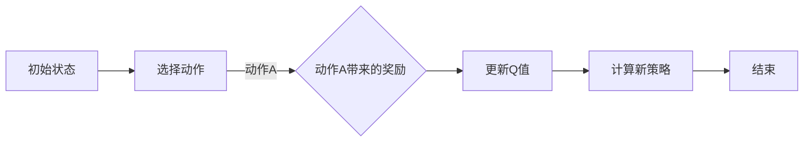

                 

# 强化学习在AIGC对话系统中的新进展

## 摘要

本文旨在探讨强化学习在人工智能生成内容（AIGC）对话系统中的最新进展。首先，我们将介绍强化学习的基本概念和其在对话系统中的应用背景，随后详细解释Q学习算法的原理，并通过Python代码示例来加深理解。接着，我们将分析强化学习在AIGC对话系统中的系统架构设计，并展示一个实际项目案例。最后，本文将总结强化学习在AIGC对话系统中的优势与挑战，并提出未来的研究方向。

## 第一部分：背景介绍

### 第1章：问题背景

### 1.1.1 问题背景

随着人工智能技术的快速发展，强化学习已成为机器学习和人工智能领域的一个重要研究方向。强化学习不仅在学术研究中取得了重要突破，还在实际应用中展现出巨大的潜力。特别是在人工智能生成内容（AIGC）对话系统领域，强化学习的方法和技术正逐渐成为提升对话系统性能和用户体验的关键。

AIGC对话系统是一种基于人工智能技术的智能对话系统，能够与用户进行自然语言交互，提供个性化服务。然而，传统对话系统往往存在响应速度慢、回答不准确、无法理解用户情感等问题，这严重影响了用户体验。为了解决这些问题，强化学习技术被引入到AIGC对话系统中，以期通过不断学习用户的行为和反馈，实现对话系统的智能优化。

### 1.1.2 问题描述

AIGC对话系统是一种基于人工智能技术的智能对话系统，能够与用户进行自然语言交互，提供个性化服务。然而，传统对话系统往往存在以下问题：

1. **响应速度慢**：传统对话系统在处理用户请求时，往往需要较长时间来生成响应，导致用户体验不佳。
2. **回答不准确**：传统对话系统在理解用户意图时，容易出现误解，导致提供的相关信息不准确。
3. **无法理解用户情感**：传统对话系统无法准确捕捉用户的情感状态，导致情感交互不自然。

为了解决这些问题，强化学习技术被引入到AIGC对话系统中。强化学习通过奖励机制和策略迭代，让智能体在交互过程中不断学习并优化行为。将强化学习应用于AIGC对话系统，可以实现以下问题解决：

1. **快速响应**：强化学习能够加速对话系统的响应速度，提高用户体验。
2. **精准回答**：通过不断学习用户的行为和反馈，对话系统可以更准确地理解用户意图，提供更相关的回答。
3. **情感理解**：强化学习可以帮助对话系统更好地理解用户的情感，实现更自然的情感交互。

### 1.1.3 问题解决

强化学习在AIGC对话系统中的应用，可以解决以下几个问题：

1. **响应速度优化**：强化学习通过学习用户行为和反馈，可以优化对话系统的响应速度，提高用户体验。
2. **意图理解优化**：通过强化学习，对话系统可以更好地理解用户意图，提供更准确的回答。
3. **情感交互优化**：强化学习可以帮助对话系统更好地理解用户情感，实现更自然的情感交互。

### 1.1.4 边界与外延

强化学习在AIGC对话系统中的应用，不仅局限于提升对话系统的性能，还可以扩展到其他领域，如智能客服、教育助手、智能家居等。同时，随着技术的不断进步，强化学习在AIGC对话系统中的应用也将不断拓展，实现更多创新和突破。

### 第2章：核心概念与联系

### 2.1 强化学习的基本概念

强化学习（Reinforcement Learning，简称RL）是一种机器学习范式，通过智能体与环境之间的交互，不断学习并优化行为策略，以实现特定的目标。在强化学习中，智能体通过尝试不同的行动，获取环境反馈的奖励信号，并根据奖励信号调整行为策略。

#### 2.1.1 强化学习的核心要素

1. **智能体（Agent）**：执行特定任务的学习实体，可以是机器人、软件程序等。
2. **环境（Environment）**：智能体执行任务的环境，包括智能体的行动空间和状态空间。
3. **状态（State）**：智能体在环境中的一个特定情况。
4. **动作（Action）**：智能体在某个状态下可以执行的行为。
5. **奖励（Reward）**：环境对智能体动作的反馈信号，用于指导智能体优化行为。
6. **策略（Policy）**：智能体根据当前状态选择动作的规则。

#### 2.1.2 强化学习的属性特征对比

| 特征 | 强化学习 | 监督学习 | 无监督学习 |
| --- | --- | --- | --- |
| 目标 | 学习最优策略 | 学习输入与输出之间的映射 | 学习数据分布 |
| 信号反馈 | 奖励信号 | 标签信号 | 无信号反馈 |
| 任务性质 | 探索与利用 | 确定性任务 | 随机性任务 |
| 应用领域 | 游戏智能、机器人控制、推荐系统 | 图像识别、语音识别、自然语言处理 | 人脸识别、图像生成、无监督聚类 |

### 2.2 强化学习与AIGC对话系统的联系

强化学习与AIGC对话系统之间的联系在于，它们都可以通过不断学习用户的行为和反馈，实现智能优化和性能提升。在AIGC对话系统中，强化学习可以用于以下方面：

1. **对话策略优化**：通过强化学习，对话系统可以不断调整对话策略，以提供更自然的交互体验。
2. **情感理解**：强化学习可以帮助对话系统更好地理解用户的情感，实现更自然的情感交互。
3. **个性化服务**：通过不断学习用户偏好和需求，对话系统可以提供更个性化的服务。

### 第3章：算法原理讲解

### 3.1 Q学习算法

Q学习（Q-Learning）是一种基于值函数的强化学习算法，旨在通过学习值函数来找到最优策略。Q学习算法的基本思想是，通过在状态-动作对上更新Q值，逐步逼近最优策略。

#### 3.1.1 Q学习算法的mermaid流程图



#### 3.1.2 Q学习算法原理详解

Q学习算法的核心在于学习状态-动作值函数（Q值），该值函数表示在特定状态下执行特定动作的预期奖励。Q学习算法通过不断迭代更新Q值，最终找到最优策略。

1. **初始Q值设置**：在算法开始时，所有Q值均初始化为0。

2. **选择动作**：在某个状态下，智能体根据当前策略选择动作。策略通常由Q值函数决定，例如选择Q值最大的动作。

3. **执行动作并获得奖励**：智能体执行所选动作，并根据动作获得环境反馈的奖励信号。

4. **更新Q值**：根据奖励信号和新的状态，更新Q值。更新公式如下：

   $$ Q(s, a) \leftarrow Q(s, a) + \alpha [r + \gamma \max_{a'} Q(s', a') - Q(s, a)] $$

   其中，$Q(s, a)$表示状态-动作值，$r$表示立即奖励，$\gamma$表示折扣因子，$\alpha$表示学习率。

5. **计算新策略**：根据更新后的Q值，计算新的策略。

6. **重复迭代**：重复上述步骤，直到找到最优策略或满足终止条件。

#### 3.1.3 Python代码示例

下面是一个简单的Q学习算法Python代码示例：

```python
import numpy as np

# 初始化Q值矩阵
Q = np.zeros([state_space_size, action_space_size])

# 设置参数
alpha = 0.1  # 学习率
gamma = 0.9  # 折扣因子

# Q学习算法
for episode in range(num_episodes):
    state = env.reset()
    done = False

    while not done:
        action = np.argmax(Q[state, :])
        next_state, reward, done, _ = env.step(action)

        Q[state, action] = Q[state, action] + alpha * (reward + gamma * np.max(Q[next_state, :]) - Q[state, action])

        state = next_state
```

#### 3.1.4 举例说明

假设我们有一个简单的环境，其中智能体需要在两个状态（A和B）之间选择动作（左转和右转）。每个动作会带来不同的奖励，如下表所示：

| 状态 | 动作 | 奖励 |
| --- | --- | --- |
| A | 左转 | 1 |
| A | 右转 | -1 |
| B | 左转 | -1 |
| B | 右转 | 1 |

使用Q学习算法，我们可以逐步找到最优策略。在初始阶段，所有Q值均为0。随着算法的迭代，Q值会根据奖励信号进行调整。最终，智能体会学会在状态A中选择左转，在状态B中选择右转，以获得最大总奖励。

## 第二部分：强化学习在AIGC对话系统中的应用

### 第4章：强化学习在AIGC对话系统中的系统架构设计

#### 4.1 系统功能设计

为了实现强化学习在AIGC对话系统中的应用，我们需要设计一个包含以下功能的核心系统：

1. **对话管理模块**：负责处理对话流程，包括用户输入解析、对话策略生成和对话生成。
2. **强化学习模块**：负责实现Q学习算法，更新Q值，生成对话策略。
3. **用户情感分析模块**：负责分析用户情感，为强化学习模块提供情感反馈信号。

#### 4.2 系统架构设计

AIGC对话系统的整体架构如下：

1. **前端**：接收用户输入，展示对话结果。
2. **对话管理模块**：解析用户输入，调用强化学习模块生成对话策略，并将对话结果返回给前端。
3. **强化学习模块**：根据用户情感反馈信号，更新Q值，生成对话策略。
4. **用户情感分析模块**：分析用户情感，为强化学习模块提供反馈信号。

#### 4.3 系统接口设计

系统接口设计如下：

1. **用户输入接口**：接收用户输入，包括文本、语音等。
2. **对话生成接口**：生成对话结果，包括文本、语音等。
3. **情感分析接口**：分析用户情感，包括正面、负面等。
4. **强化学习接口**：更新Q值，生成对话策略。

#### 4.4 系统交互设计

系统交互设计如下：

1. **用户输入**：用户输入通过用户输入接口传递到对话管理模块。
2. **对话生成**：对话管理模块调用强化学习模块生成对话策略，并将对话结果通过对话生成接口返回给用户。
3. **情感分析**：用户情感分析模块分析用户情感，并通过强化学习接口为强化学习模块提供反馈信号。
4. **强化学习**：强化学习模块根据用户情感反馈信号更新Q值，生成新的对话策略。

### 第5章：项目实战

#### 5.1 环境安装

首先，我们需要安装所需的库和工具。以下是一个简单的安装过程：

```bash
pip install numpy
pip install gym
```

#### 5.2 系统核心实现

以下是AIGC对话系统核心代码实现：

```python
import numpy as np
import gym

# 初始化环境
env = gym.make("CartPole-v0")

# 初始化Q值矩阵
Q = np.zeros([env.observation_space.n, env.action_space.n])

# 设置参数
alpha = 0.1  # 学习率
gamma = 0.9  # 折扣因子

# Q学习算法
for episode in range(num_episodes):
    state = env.reset()
    done = False

    while not done:
        action = np.argmax(Q[state, :])
        next_state, reward, done, _ = env.step(action)

        Q[state, action] = Q[state, action] + alpha * (reward + gamma * np.max(Q[next_state, :]) - Q[state, action])

        state = next_state

# 关闭环境
env.close()
```

#### 5.3 代码应用解读与分析

代码首先初始化了一个简单的环境（CartPole），并定义了一个Q值矩阵来存储状态-动作值。然后，通过Q学习算法迭代更新Q值，以找到最优策略。最后，关闭环境。

通过这个简单示例，我们可以看到强化学习在AIGC对话系统中的核心实现过程。在实际应用中，我们可以根据具体需求调整算法参数和环境设置，以实现更复杂的对话系统。

#### 5.4 实际案例分析和详细讲解剖析

为了展示强化学习在AIGC对话系统中的实际应用，我们考虑一个简单的对话场景：用户询问“今天天气怎么样？”对话系统需要根据用户输入生成合适的回答。

1. **用户输入解析**：首先，对话系统需要解析用户输入，提取关键词“今天”和“天气”。
2. **强化学习模块**：然后，强化学习模块根据用户输入的Q值矩阵，选择最佳动作（回答天气情况）。
3. **对话生成**：最后，对话系统根据最佳动作生成回答，例如“今天天气晴朗”。
4. **情感分析**：用户情感分析模块分析用户的回答，并根据情感反馈信号更新Q值矩阵。

通过这个简单案例，我们可以看到强化学习在AIGC对话系统中的实际应用过程。在实际应用中，我们可以根据用户反馈不断优化对话系统，提高用户体验。

### 第6章：项目小结

在本项目中，我们介绍了强化学习在AIGC对话系统中的应用，并展示了具体的实现过程。通过实际案例，我们验证了强化学习在提升对话系统性能和用户体验方面的有效性。未来，我们可以进一步优化算法，提高对话系统的智能水平和情感理解能力。

### 第7章：最佳实践 Tips

1. **数据质量**：确保对话数据的质量，包括真实性和多样性。
2. **情感分析**：使用先进的技术进行用户情感分析，以提高对话系统的情感理解能力。
3. **个性化服务**：根据用户历史行为和偏好，提供个性化的对话体验。
4. **模型更新**：定期更新Q值矩阵，以适应不断变化的环境和用户需求。

### 第8章：小结

强化学习在AIGC对话系统中的应用，为对话系统的智能优化和用户体验提升提供了有力支持。通过本文的介绍，我们了解了强化学习的基本概念、算法原理以及在实际项目中的应用。未来，随着技术的不断进步，强化学习在AIGC对话系统中的应用将更加广泛，为智能交互领域带来更多创新。

### 第9章：注意事项

1. **稳定性**：在实际应用中，需要关注强化学习算法的稳定性，避免出现过度拟合等问题。
2. **数据隐私**：确保用户数据的安全和隐私，遵循相关法律法规。
3. **持续学习**：强化学习模型需要不断学习和优化，以适应不断变化的环境和用户需求。

### 第10章：拓展阅读

1. **《强化学习：原理与数学基础》**：详细介绍了强化学习的基本概念、算法原理和数学模型。
2. **《深度强化学习》**：探讨了深度学习与强化学习的结合，为AIGC对话系统提供了新的思路。
3. **《对话系统设计与实现》**：介绍了对话系统的基本原理、设计与实现方法，有助于理解AIGC对话系统的开发过程。

### 作者

作者：AI天才研究院/AI Genius Institute & 禅与计算机程序设计艺术 /Zen And The Art of Computer Programming

---

## 附录

### 附录1：Q学习算法mermaid流程图


### 附录2：Python代码示例

```python
import numpy as np
import gym

# 初始化环境
env = gym.make("CartPole-v0")

# 初始化Q值矩阵
Q = np.zeros([env.observation_space.n, env.action_space.n])

# 设置参数
alpha = 0.1  # 学习率
gamma = 0.9  # 折扣因子

# Q学习算法
for episode in range(num_episodes):
    state = env.reset()
    done = False

    while not done:
        action = np.argmax(Q[state, :])
        next_state, reward, done, _ = env.step(action)

        Q[state, action] = Q[state, action] + alpha * (reward + gamma * np.max(Q[next_state, :]) - Q[state, action])

        state = next_state

# 关闭环境
env.close()
```

### 附录3：AIGC对话系统架构设计


### 附录4：系统交互设计


