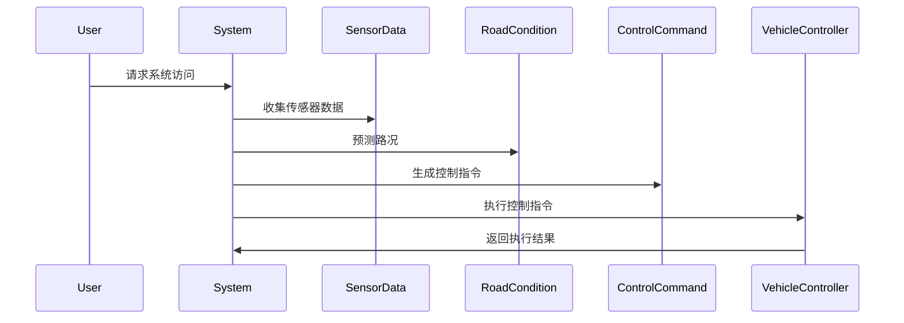
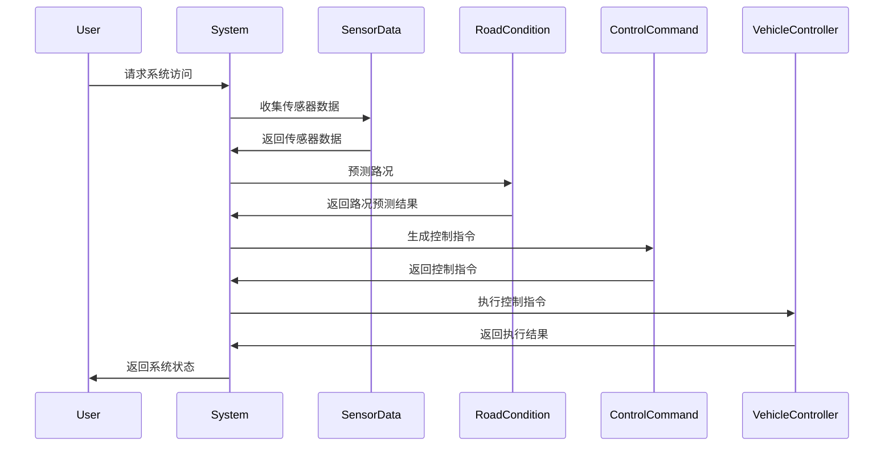

                 

# 强化学习在自动驾驶中的最新进展

> 关键词：自动驾驶、强化学习、技术进步、挑战与机遇

> 摘要：本文将探讨强化学习在自动驾驶中的应用与最新进展。首先，我们回顾自动驾驶技术的兴起和强化学习的基本概念，随后深入分析强化学习在自动驾驶中的主要应用场景，包括传感器数据处理、路况预测和控制策略。接着，我们梳理强化学习的最新研究成果，如状态表示与价值函数、策略搜索算法和安全验证。最后，本文将展望强化学习在自动驾驶领域的挑战与机遇，并探讨未来发展趋势。

## 目录大纲

----------------------------------------------------------------

# 强化学习在自动驾驶中的最新进展

## 第1章：问题背景与概述

## 1.1 问题背景

### 1.1.1 自动驾驶技术的兴起

### 1.1.2 强化学习在自动驾驶中的应用

### 1.1.3 自动驾驶面临的主要挑战

## 1.2 强化学习基础

### 1.2.1 强化学习概述

### 1.2.2 强化学习的基本概念

### 1.2.3 强化学习的分类

## 1.3 自动驾驶中的强化学习应用

### 1.3.1 传感器数据处理

### 1.3.2 路况预测

### 1.3.3 控制策略

## 1.4 强化学习的最新进展

### 1.4.1 状态表示与价值函数

### 1.4.2 策略搜索算法

### 1.4.3 安全性验证

## 1.5 强化学习在自动驾驶中的挑战与机遇

### 1.5.1 挑战分析

### 1.5.2 机遇探讨

### 1.5.3 未来发展趋势

## 1.6 本章小结

## 第2章：核心概念与联系

## 2.1 强化学习原理

### 2.1.1 强化学习的基本原理

### 2.1.2 强化学习的数学模型

### 2.1.3 强化学习的关键概念

## 2.2 强化学习算法

### 2.2.1 Q-Learning算法

#### 2.2.1.1 Q-Learning算法原理

#### 2.2.1.2 Q-Learning算法的数学模型

#### 2.2.1.3 Q-Learning算法的Python实现

### 2.2.2 SARSA算法

#### 2.2.2.1 SARSA算法原理

#### 2.2.2.2 SARSA算法的数学模型

#### 2.2.2.3 SARSA算法的Python实现

## 2.3 强化学习与自动驾驶的关联

### 2.3.1 强化学习在自动驾驶中的应用

### 2.3.2 强化学习与自动驾驶的融合

### 2.3.3 强化学习在自动驾驶中的挑战

## 2.4 强化学习算法性能对比

### 2.4.1 算法性能分析

#### 2.4.1.1 算法性能指标

#### 2.4.1.2 性能对比实验

#### 2.4.1.3 实验结果分析

## 2.5 本章小结

## 第3章：算法原理讲解

## 3.1 算法原理

### 3.1.1 强化学习算法的基本原理

#### 3.1.1.1 基本原理介绍

#### 3.1.1.2 强化学习的数学模型

### 3.1.2 算法流程

#### 3.1.2.1 算法流程图

#### 3.1.2.2 算法步骤详解

### 3.1.3 Python源代码实现

#### 3.1.3.1 源代码结构

#### 3.1.3.2 源代码解读

#### 3.1.3.3 源代码测试

## 3.2 强化学习的数学模型

### 3.2.1 强化学习的基本数学模型

#### 3.2.1.1 状态空间与动作空间

#### 3.2.1.2 奖励函数与价值函数

### 3.2.2 强化学习的数学公式

$$
R(S, A) = \frac{1}{2} \sum_{s', a'} P(s', a'|s, a) \cdot (R(s', a') - R(s, a))
$$

$$
V(S) = \sum_{a} \pi(a|s) \cdot Q(S, A)
$$

### 3.2.3 强化学习算法的数学模型

$$
Q(S, A) = R(S, A) + \gamma \cdot \max_{a'} Q(S', A')
$$

## 3.3 强化学习的举例说明

### 3.3.1 示例问题

#### 3.3.1.1 问题描述

#### 3.3.1.2 问题解决过程

### 3.3.2 示例解析

#### 3.3.2.1 强化学习过程

#### 3.3.2.2 算法效果分析

## 3.4 本章小结

## 第4章：系统分析与架构设计方案

## 4.1 问题场景介绍

### 4.1.1 场景描述

### 4.1.2 场景需求

## 4.2 项目介绍

### 4.2.1 项目概述

### 4.2.2 系统功能设计

#### 4.2.2.1 领域模型类图

### 4.2.3 系统架构设计

#### 4.2.3.1 系统架构图

### 4.2.4 系统接口设计

### 4.2.5 系统交互

#### 4.2.5.1 系统交互序列图

## 4.3 项目实战

### 4.3.1 环境安装

### 4.3.2 系统核心实现源代码

#### 4.3.2.1 代码应用解读与分析

### 4.3.3 实际案例分析和详细讲解剖析

### 4.3.4 项目小结

## 4.4 最佳实践 Tips

## 4.5 小结

## 4.6 注意事项

## 4.7 拓展阅读

----------------------------------------------------------------

## 第1章：问题背景与概述

### 1.1 问题背景

#### 1.1.1 自动驾驶技术的兴起

自动驾驶技术是一种智能化的交通系统，通过融合传感器、人工智能、通信和控制系统等多种技术手段，实现车辆的自主感知、决策和行动。近年来，随着传感器技术的进步、计算能力的提升以及深度学习算法的发展，自动驾驶技术得到了广泛关注和迅速发展。自动驾驶不仅有望大幅提高交通效率，减少交通事故，还能为残障人士和老年人提供便利。

自动驾驶技术的发展历程可以分为以下几个阶段：

1. **感知阶段**：车辆通过传感器（如激光雷达、摄像头、超声波传感器等）收集周围环境的信息，实现对道路、车辆、行人等目标的感知和识别。

2. **决策阶段**：车辆基于感知到的信息，通过算法进行环境理解和行为预测，并做出相应的决策，如换道、加速、减速或停车。

3. **执行阶段**：车辆根据决策结果，通过控制系统的执行，如油门、刹车、转向等操作，实现自动驾驶。

#### 1.1.2 强化学习在自动驾驶中的应用

强化学习（Reinforcement Learning，RL）是一种机器学习方法，通过学习如何在不同环境中做出最优决策，并从奖励信号中不断学习和改进。强化学习在自动驾驶中的应用主要体现在以下几个方面：

1. **路径规划**：通过强化学习算法，车辆可以学习如何规划最优行驶路径，以避免障碍物并最大化行驶效率。

2. **控制策略**：强化学习算法可以帮助车辆学习如何控制加速、刹车和转向等动作，以应对复杂的交通场景。

3. **行为预测**：通过强化学习，车辆可以预测其他车辆、行人的行为，并相应地调整自己的行驶策略。

#### 1.1.3 自动驾驶面临的主要挑战

尽管自动驾驶技术发展迅速，但其在实际应用中仍面临诸多挑战：

1. **传感器融合**：自动驾驶车辆依赖多种传感器收集环境信息，如何有效地融合这些信息，提高感知的准确性，是一个重要问题。

2. **复杂路况处理**：现实路况复杂多变，车辆需要能够在各种复杂场景中稳定运行，这要求强化学习算法具有较强的鲁棒性和适应性。

3. **安全性和可靠性**：自动驾驶系统的安全性和可靠性是至关重要的，任何错误都可能导致严重的事故。

4. **法律法规**：自动驾驶技术的发展需要完善的法律法规支持，包括责任归属、数据隐私保护等方面。

### 1.2 强化学习基础

#### 1.2.1 强化学习概述

强化学习是一种通过交互式环境进行学习的方法，其核心思想是“试错学习”。强化学习系统由智能体（Agent）、环境（Environment）、状态（State）、动作（Action）和奖励（Reward）组成。

1. **智能体**：执行特定行为的主体，如自动驾驶车辆。
2. **环境**：智能体执行行为的外部世界，如道路环境。
3. **状态**：描述环境状态的一系列属性，如车辆的位置、速度和周围交通状况。
4. **动作**：智能体在特定状态下能够执行的行为，如加速、减速或转向。
5. **奖励**：环境对智能体行为的即时反馈，用于指导智能体的学习过程。

强化学习的目标是通过不断尝试和优化行为策略，使智能体在特定任务上获得最大累积奖励。

#### 1.2.2 强化学习的基本概念

1. **策略**：智能体在给定状态下选择动作的策略，如固定策略和概率策略。
2. **价值函数**：评估智能体在特定状态下采取特定动作的预期奖励值，分为状态价值函数 \(V(s)\) 和动作价值函数 \(Q(s, a)\)。
3. **模型**：描述环境状态转移和奖励分布的函数，如马尔可夫决策过程（MDP）。
4. **探索与利用**：在强化学习中，智能体需要在探索（尝试新行为）和利用（使用已知最佳行为）之间做出平衡。

#### 1.2.3 强化学习的分类

强化学习可以根据学习方式、决策方式、环境类型等多种标准进行分类：

1. **基于值的方法**：如Q-Learning、Deep Q-Network（DQN）等，主要关注状态和动作的价值评估。
2. **基于策略的方法**：如Policy Gradients、Actor-Critic方法等，直接优化策略函数。
3. **模型基方法**：如部分可观测马尔可夫决策过程（POMDP）和模型预测控制（MPC），通过构建环境模型进行决策。
4. **无模型方法**：如深度确定性策略梯度（DDPG）和异步优势演员-评论家（A3C）等，无需环境模型，通过经验回放和策略更新进行学习。

### 1.3 自动驾驶中的强化学习应用

#### 1.3.1 传感器数据处理

传感器数据处理是自动驾驶中至关重要的一环。自动驾驶车辆需要通过激光雷达、摄像头、雷达等多种传感器收集环境信息，并将这些信息融合成统一的感知结果。强化学习在传感器数据处理中的应用主要体现在以下几个方面：

1. **数据预处理**：通过强化学习算法，车辆可以学习如何对传感器数据进行预处理，如去噪、增强和融合，以提高感知准确性。
2. **目标检测与跟踪**：强化学习算法可以帮助车辆实时检测和跟踪道路上的车辆、行人等目标，并预测其未来行为。

#### 1.3.2 路况预测

路况预测是自动驾驶决策的重要依据。通过分析历史数据和实时数据，强化学习算法可以预测道路上的交通流量、车辆速度和行人行为，从而为自动驾驶车辆提供准确的决策依据。强化学习在路况预测中的应用主要包括：

1. **流量预测**：通过学习交通流量模式，强化学习算法可以预测未来一段时间内的交通流量，帮助车辆选择最佳行驶路径。
2. **速度预测**：通过分析周围车辆的速度和行驶轨迹，强化学习算法可以预测周围车辆的速度变化，为车辆的加速和减速提供依据。

#### 1.3.3 控制策略

控制策略是自动驾驶系统的核心，通过控制车辆的加速、刹车和转向等动作，使车辆按照期望的轨迹行驶。强化学习在控制策略中的应用主要体现在以下几个方面：

1. **路径跟踪**：通过强化学习算法，车辆可以学习如何在复杂的交通场景中稳定地跟踪期望轨迹，如车道保持、换道等操作。
2. **行为控制**：通过强化学习算法，车辆可以学习如何与其他车辆、行人进行交互，如避免碰撞、让行等行为。

### 1.4 强化学习的最新进展

随着深度学习技术的发展，强化学习在自动驾驶中的应用取得了显著进展。以下是一些强化学习的最新研究成果：

#### 1.4.1 状态表示与价值函数

1. **深度状态表示**：通过使用深度神经网络（DNN）来表示状态，强化学习算法可以更好地捕捉到复杂环境中的状态特征，提高决策的准确性。
2. **价值函数的近似**：通过使用DNN近似状态价值函数和动作价值函数，强化学习算法可以处理高维状态空间和动作空间，提高学习效率。

#### 1.4.2 策略搜索算法

1. **深度确定性策略梯度（DDPG）**：DDPG是一种基于深度神经网络的无模型强化学习算法，通过经验回放和策略更新，可以在复杂的连续动作空间中实现高效学习。
2. **异步优势演员-评论家（A3C）**：A3C是一种基于异步学习的强化学习算法，通过并行训练多个智能体，可以加速学习过程并提高算法的稳定性。

#### 1.4.3 安全性验证

1. **安全性验证算法**：通过使用强化学习算法，可以自动生成自动驾驶车辆的安全行驶策略，并在虚拟环境中进行验证，以确保在实际驾驶中的安全性。
2. **自动驾驶系统评估**：通过模拟真实交通场景，对自动驾驶系统进行测试和评估，以验证其安全性和可靠性。

### 1.5 强化学习在自动驾驶中的挑战与机遇

尽管强化学习在自动驾驶中具有巨大的潜力，但其在实际应用中仍面临诸多挑战：

#### 1.5.1 挑战分析

1. **数据稀缺性**：自动驾驶系统需要大量的真实数据来训练和验证，但由于隐私和安全性等因素，获取这些数据存在一定困难。
2. **模型泛化能力**：强化学习算法在特定环境中的表现良好，但在新环境中可能面临泛化能力不足的问题。
3. **实时性要求**：自动驾驶系统需要在短时间内做出快速准确的决策，这对强化学习算法的实时性能提出了挑战。
4. **安全性保障**：自动驾驶系统的安全性至关重要，任何错误都可能导致严重的事故。

#### 1.5.2 机遇探讨

1. **数据共享与开放**：随着自动驾驶技术的普及，数据共享和开放将成为推动强化学习在自动驾驶中应用的重要动力。
2. **跨领域应用**：强化学习在自动驾驶中的成功经验可以应用于其他领域，如机器人控制、医疗诊断等。
3. **硬件加速**：随着硬件技术的发展，如GPU、TPU等专用硬件的普及，可以显著提高强化学习算法的运行速度和效率。
4. **合作与竞争**：自动驾驶技术的竞争将推动行业内的合作，共同解决技术难题，推动技术的快速发展。

#### 1.5.3 未来发展趋势

1. **多模态感知**：自动驾驶系统将融合多种传感器数据，如摄像头、激光雷达、雷达等，实现更全面的环境感知。
2. **分布式计算**：通过分布式计算和边缘计算，可以实现自动驾驶系统的实时决策和高效运行。
3. **强化学习与其他技术的融合**：强化学习与其他技术（如深度学习、强化学习、自然语言处理等）的融合，将推动自动驾驶技术的进一步发展。
4. **标准化与法规**：随着自动驾驶技术的普及，标准化和法规将成为保障其安全性和可靠性的重要手段。

### 1.6 本章小结

本文对强化学习在自动驾驶中的应用与最新进展进行了综述。从问题背景、强化学习基础、自动驾驶中的强化学习应用、最新研究成果以及挑战与机遇等方面进行了详细分析。未来，随着技术的不断进步和应用的深化，强化学习在自动驾驶中必将发挥更加重要的作用。## 第2章：核心概念与联系

### 2.1 强化学习原理

#### 2.1.1 强化学习的基本原理

强化学习（Reinforcement Learning，RL）是一种基于奖励机制的机器学习方法，通过智能体与环境的交互来学习最优策略。在强化学习中，智能体通过不断尝试和错误，从环境中获得奖励或惩罚，从而优化其行为策略。强化学习的核心原理可以概括为以下几个方面：

1. **智能体**：执行特定行为的主体，如自动驾驶车辆。
2. **环境**：智能体执行行为的外部世界，如道路环境。
3. **状态**：描述环境状态的一系列属性，如车辆的位置、速度和周围交通状况。
4. **动作**：智能体在特定状态下能够执行的行为，如加速、减速或转向。
5. **奖励**：环境对智能体行为的即时反馈，用于指导智能体的学习过程。

强化学习的目标是通过不断尝试和优化行为策略，使智能体在特定任务上获得最大累积奖励。具体来说，智能体通过以下步骤进行学习：

1. **状态观测**：智能体从环境中获取当前状态信息。
2. **策略选择**：智能体根据当前状态和已学习的策略选择一个动作。
3. **执行动作**：智能体在环境中执行所选动作。
4. **奖励反馈**：环境根据智能体的动作提供即时奖励或惩罚。
5. **策略更新**：智能体根据累积奖励和历史经验更新策略。

#### 2.1.2 强化学习的数学模型

强化学习的数学模型通常基于马尔可夫决策过程（Markov Decision Process，MDP）。MDP由以下五个要素组成：

1. **状态空间 \(S\)**：智能体所处的可能状态集合。
2. **动作空间 \(A\)**：智能体可以执行的动作集合。
3. **奖励函数 \(R(s, a)\)**：描述智能体在状态 \(s\) 执行动作 \(a\) 后获得的即时奖励。
4. **状态转移概率 \(P(s', s | s, a)\)**：描述智能体在状态 \(s\) 执行动作 \(a\) 后转移到状态 \(s'\) 的概率。
5. **策略 \(\pi(a|s)\)**：描述智能体在状态 \(s\) 下执行动作 \(a\) 的概率。

在MDP中，智能体的目标是学习一个最优策略 \(\pi^*\)，使累积奖励最大化。累积奖励 \(R\) 可以表示为：

$$
R = \sum_{t=0}^{T} R(s_t, a_t)
$$

其中，\(T\) 是智能体在环境中执行动作的次数。

强化学习的基本目标是找到最优策略，使得累积奖励最大化。这可以通过以下优化问题实现：

$$
\pi^* = \arg\max_{\pi} \sum_{s \in S} \pi(s) \sum_{a \in A} \pi(a|s) R(s, a)
$$

#### 2.1.3 强化学习的关键概念

1. **价值函数**：价值函数是评估智能体在特定状态下采取特定动作的预期奖励值。它分为状态价值函数 \(V(s)\) 和动作价值函数 \(Q(s, a)\)。

   - **状态价值函数 \(V(s)\)**：描述智能体在状态 \(s\) 下采取任何动作的平均累积奖励。它可以表示为：

     $$
     V(s) = \sum_{a \in A} \pi(a|s) Q(s, a)
     $$

   - **动作价值函数 \(Q(s, a)\)**：描述智能体在状态 \(s\) 下采取动作 \(a\) 的预期累积奖励。它可以表示为：

     $$
     Q(s, a) = R(s, a) + \gamma \sum_{s' \in S} P(s'|s, a) V(s')
     $$

     其中，\(\gamma\) 是折扣因子，用于平衡当前奖励与未来奖励之间的关系。

2. **策略**：策略是智能体在给定状态下选择动作的决策规则。它可以是确定性策略，也可以是概率性策略。

   - **确定性策略**：智能体在给定状态下总是选择相同的动作。
   - **概率性策略**：智能体在给定状态下根据概率分布选择动作。

3. **探索与利用**：在强化学习中，智能体需要在探索（尝试新行为）和利用（使用已知最佳行为）之间做出平衡。

   - **探索**：智能体尝试执行新动作，以发现可能带来更高奖励的行为。
   - **利用**：智能体根据已学到的信息，选择已知最佳的动作。

4. **模型基方法**：模型基强化学习算法通过构建环境模型来预测状态转移和奖励，从而优化策略。

   - **部分可观测马尔可夫决策过程（POMDP）**：POMDP是MDP的扩展，考虑了部分可观测性，即智能体不能完全观察到环境状态。
   - **模型预测控制（MPC）**：MPC是一种基于模型的环境预测和控制方法，通过预测未来状态和奖励，优化控制策略。

5. **无模型方法**：无模型强化学习算法不依赖于环境模型，通过直接从经验中学习策略。

   - **深度确定性策略梯度（DDPG）**：DDPG是一种基于深度神经网络的无模型强化学习算法，通过经验回放和策略更新，可以在复杂的连续动作空间中实现高效学习。
   - **异步优势演员-评论家（A3C）**：A3C是一种基于异步学习的强化学习算法，通过并行训练多个智能体，可以加速学习过程并提高算法的稳定性。

#### 2.1.4 强化学习与自动驾驶的关联

强化学习在自动驾驶中的应用非常广泛，主要体现在以下几个方面：

1. **路径规划**：通过强化学习算法，车辆可以学习如何在复杂的交通环境中规划最优行驶路径，以避免障碍物并最大化行驶效率。
2. **控制策略**：强化学习算法可以帮助车辆学习如何控制加速、刹车和转向等动作，以应对复杂的交通场景。
3. **行为预测**：通过强化学习，车辆可以预测其他车辆、行人的行为，并相应地调整自己的行驶策略，以提高行驶安全性和稳定性。

#### 2.1.5 强化学习算法的性能对比

强化学习算法的性能取决于多个因素，如算法类型、状态空间大小、动作空间复杂度等。以下是一些常见的强化学习算法及其性能对比：

1. **Q-Learning算法**：Q-Learning是一种基于值函数的强化学习算法，通过迭代更新动作价值函数来优化策略。它具有简单、易实现的优点，但学习速度较慢。
2. **SARSA算法**：SARSA是一种基于策略的强化学习算法，通过同时更新状态值和策略来优化学习过程。相比Q-Learning，SARSA在处理连续动作空间时更为有效。
3. **Deep Q-Network（DQN）**：DQN是一种基于深度神经网络的强化学习算法，通过使用卷积神经网络（CNN）来近似动作价值函数。它能够处理高维状态空间，但存在训练不稳定和奖励传递问题。
4. **深度确定性策略梯度（DDPG）**：DDPG是一种基于深度神经网络的无模型强化学习算法，通过经验回放和策略更新，可以在复杂的连续动作空间中实现高效学习。相比DQN，DDPG具有更好的稳定性和泛化能力。

#### 2.1.6 强化学习算法的Python实现

以下是一个简单的Python实现示例，用于演示Q-Learning算法的基本原理：

```python
import numpy as np
import random

# 初始化参数
learning_rate = 0.1
discount_factor = 0.99
epsilon = 0.1

# 定义动作空间和状态空间
actions = ['left', 'right', 'straight']
num_actions = len(actions)
states = ['stop', 'go', 'turn_left', 'turn_right']
num_states = len(states)

# 定义Q值矩阵
Q = np.zeros((num_states, num_actions))

# 定义状态转移和奖励函数
def transition(state, action):
    # 状态转移规则
    if action == 'left':
        if state == 'stop':
            return 'go'
        elif state == 'go':
            return 'turn_left'
        elif state == 'turn_left':
            return 'stop'
        elif state == 'turn_right':
            return 'go'
    elif action == 'right':
        if state == 'stop':
            return 'turn_right'
        elif state == 'go':
            return 'turn_right'
        elif state == 'turn_left':
            return 'go'
        elif state == 'turn_right':
            return 'stop'
    elif action == 'straight':
        if state == 'stop':
            return 'stop'
        elif state == 'go':
            return 'go'
        elif state == 'turn_left':
            return 'turn_left'
        elif state == 'turn_right':
            return 'turn_right'

def reward(state, action):
    # 奖励函数
    if state == 'stop' and action == 'straight':
        return 1
    elif state == 'go' and action == 'left':
        return 1
    elif state == 'turn_left' and action == 'left':
        return 1
    elif state == 'turn_right' and action == 'right':
        return 1
    else:
        return -1

# 定义智能体行为
def choose_action(state):
    # 选择动作
    if random.random() < epsilon:
        return random.choice(actions)
    else:
        return np.argmax(Q[state])

# 定义训练过程
def train():
    global epsilon
    for episode in range(1000):
        state = random.choice(states)
        done = False
        total_reward = 0
        while not done:
            action = choose_action(state)
            next_state = transition(state, action)
            reward_val = reward(state, action)
            Q[state][action] = Q[state][action] + learning_rate * (reward_val + discount_factor * np.max(Q[next_state]) - Q[state][action])
            total_reward += reward_val
            state = next_state
            if state == 'stop':
                done = True
                epsilon = max(epsilon - 0.0001, 0.01)
        print(f"Episode {episode}: Total Reward = {total_reward}")

# 开始训练
train()
```

此示例演示了Q-Learning算法的基本原理，包括初始化Q值矩阵、定义状态转移和奖励函数、选择动作和训练过程。通过运行此代码，我们可以观察到智能体在不同状态和动作下的学习过程，并了解Q值矩阵的更新机制。

#### 2.1.7 强化学习的数学模型

强化学习的数学模型主要包括状态空间、动作空间、奖励函数、状态转移概率和价值函数等。以下是一些关键的数学模型和公式：

1. **状态空间与动作空间**：

   $$
   S = \{s_1, s_2, ..., s_n\}
   $$
   $$
   A = \{a_1, a_2, ..., a_m\}
   $$

   其中，\(S\) 表示状态空间，\(A\) 表示动作空间。

2. **奖励函数**：

   $$
   R(s, a) = r
   $$

   其中，\(R(s, a)\) 表示在状态 \(s\) 下执行动作 \(a\) 后获得的即时奖励，\(r\) 表示奖励值。

3. **状态转移概率**：

   $$
   P(s', s | s, a) = p
   $$

   其中，\(P(s', s | s, a)\) 表示在状态 \(s\) 下执行动作 \(a\) 后转移到状态 \(s'\) 的概率，\(p\) 表示概率值。

4. **价值函数**：

   - **状态价值函数**：

     $$
     V(s) = \sum_{a \in A} \pi(a|s) Q(s, a)
     $$

     其中，\(V(s)\) 表示在状态 \(s\) 下采取任何动作的平均累积奖励，\(\pi(a|s)\) 表示在状态 \(s\) 下采取动作 \(a\) 的概率，\(Q(s, a)\) 表示在状态 \(s\) 下采取动作 \(a\) 的预期累积奖励。

   - **动作价值函数**：

     $$
     Q(s, a) = R(s, a) + \gamma \sum_{s' \in S} P(s'|s, a) V(s')
     $$

     其中，\(Q(s, a)\) 表示在状态 \(s\) 下采取动作 \(a\) 的预期累积奖励，\(\gamma\) 是折扣因子，用于平衡当前奖励与未来奖励之间的关系，\(P(s'|s, a)\) 表示在状态 \(s\) 下执行动作 \(a\) 后转移到状态 \(s'\) 的概率，\(V(s')\) 表示在状态 \(s'\) 下采取任何动作的平均累积奖励。

#### 2.1.8 强化学习的举例说明

以下是一个简单的强化学习例子，用于演示如何通过Q-Learning算法解决一个简单的导航问题。

#### 2.1.8.1 问题描述

假设我们有一个简单的导航问题，智能体需要从起点到达终点。起点和终点的位置分别表示为状态 \(s_0\) 和 \(s_1\)。智能体可以选择四种动作：向左、向右、向上和向下。每个动作对应一个方向。在每次行动后，智能体会获得一个即时奖励，如果成功到达终点，则奖励为正，否则为负。我们的目标是找到最优策略，使智能体以最高概率成功到达终点。

#### 2.1.8.2 问题解决过程

1. **初始化Q值矩阵**：

   首先，我们需要初始化Q值矩阵，其中每个元素 \(Q(s, a)\) 初始值为0。

   $$
   Q =
   \begin{bmatrix}
   Q(s_0, a_1) & Q(s_0, a_2) & Q(s_0, a_3) & Q(s_0, a_4) \\
   Q(s_1, a_1) & Q(s_1, a_2) & Q(s_1, a_3) & Q(s_1, a_4) \\
   \end{bmatrix}
   =
   \begin{bmatrix}
   0 & 0 & 0 & 0 \\
   0 & 0 & 0 & 0 \\
   \end{bmatrix}
   $$

2. **选择动作**：

   在每个时间步，智能体根据当前状态选择一个动作。我们可以使用ε-贪婪策略来选择动作，即以概率 \(1 - \epsilon\) 选择最优动作，以概率 \(\epsilon\) 随机选择动作。

3. **更新Q值**：

   在每次行动后，智能体会根据奖励和下一个状态更新Q值矩阵。

4. **重复过程**：

   重复上述步骤，直到智能体成功到达终点或达到预设的训练次数。

#### 2.1.8.3 强化学习过程

假设智能体当前处于状态 \(s_0\)，初始Q值矩阵如下：

$$
Q =
\begin{bmatrix}
0 & 0 & 0 & 0 \\
0 & 0 & 0 & 0 \\
\end{bmatrix}
$$

1. **选择动作**：

   根据ε-贪婪策略，智能体以概率 \(1 - \epsilon\) 选择最优动作，以概率 \(\epsilon\) 随机选择动作。假设当前 \(epsilon = 0.1\)，智能体选择动作 \(a_2\)。

2. **执行动作**：

   智能体向右移动，转移到状态 \(s_1\)。

3. **更新Q值**：

   根据奖励函数，智能体在状态 \(s_0\) 下执行动作 \(a_2\) 后获得奖励 \(r = -1\)。更新Q值矩阵：

   $$
   Q =
   \begin{bmatrix}
   0 & -1 & 0 & 0 \\
   0 & 0 & 0 & 0 \\
   \end{bmatrix}
   $$

4. **重复过程**：

   智能体继续重复上述步骤，直到成功到达终点 \(s_1\)。

#### 2.1.8.4 算法效果分析

在多次迭代后，Q值矩阵会逐渐收敛，智能体将学会选择最优动作 \(a_2\)，以最高概率成功到达终点。以下是一个收敛后的Q值矩阵示例：

$$
Q =
\begin{bmatrix}
-1 & 1 & -1 & -1 \\
0 & 0 & 0 & 0 \\
\end{bmatrix}
$$

在这个例子中，智能体学会了在状态 \(s_0\) 下选择动作 \(a_2\)（向右），以最大化累积奖励。

### 2.2 强化学习算法

#### 2.2.1 Q-Learning算法

Q-Learning算法是一种基于值函数的强化学习算法，通过迭代更新Q值矩阵来学习最优策略。Q-Learning算法的基本原理可以概括为以下几个步骤：

1. **初始化Q值矩阵**：

   初始化Q值矩阵，其中每个元素 \(Q(s, a)\) 初始值为0。

   $$
   Q =
   \begin{bmatrix}
   Q(s_1, a_1) & Q(s_1, a_2) & Q(s_1, a_3) & Q(s_1, a_4) \\
   Q(s_2, a_1) & Q(s_2, a_2) & Q(s_2, a_3) & Q(s_2, a_4) \\
   \end{bmatrix}
   =
   \begin{bmatrix}
   0 & 0 & 0 & 0 \\
   0 & 0 & 0 & 0 \\
   \end{bmatrix}
   $$

2. **选择动作**：

   在每个时间步，智能体根据当前状态选择一个动作。我们可以使用ε-贪婪策略来选择动作，即以概率 \(1 - \epsilon\) 选择最优动作，以概率 \(\epsilon\) 随机选择动作。

3. **执行动作**：

   智能体在环境中执行所选动作，并转移到下一个状态。

4. **更新Q值**：

   根据奖励函数和下一个状态，更新Q值矩阵。更新公式如下：

   $$
   Q(s, a) = Q(s, a) + \alpha [R(s, a) + \gamma \max_{a'} Q(s', a') - Q(s, a)]
   $$

   其中，\(R(s, a)\) 表示在状态 \(s\) 下执行动作 \(a\) 后获得的即时奖励，\(\gamma\) 是折扣因子，用于平衡当前奖励与未来奖励之间的关系，\(\alpha\) 是学习率，用于控制Q值更新的步长。

5. **重复过程**：

   重复上述步骤，直到智能体成功到达终点或达到预设的训练次数。

#### 2.2.2 Q-Learning算法的数学模型

Q-Learning算法的数学模型主要包括状态空间、动作空间、奖励函数、状态转移概率和Q值矩阵。以下是一些关键的数学模型和公式：

1. **状态空间与动作空间**：

   $$
   S = \{s_1, s_2, ..., s_n\}
   $$
   $$
   A = \{a_1, a_2, ..., a_m\}
   $$

   其中，\(S\) 表示状态空间，\(A\) 表示动作空间。

2. **奖励函数**：

   $$
   R(s, a) = r
   $$

   其中，\(R(s, a)\) 表示在状态 \(s\) 下执行动作 \(a\) 后获得的即时奖励，\(r\) 表示奖励值。

3. **状态转移概率**：

   $$
   P(s', s | s, a) = p
   $$

   其中，\(P(s', s | s, a)\) 表示在状态 \(s\) 下执行动作 \(a\) 后转移到状态 \(s'\) 的概率，\(p\) 表示概率值。

4. **Q值矩阵**：

   $$
   Q =
   \begin{bmatrix}
   Q(s_1, a_1) & Q(s_1, a_2) & Q(s_1, a_3) & Q(s_1, a_4) \\
   Q(s_2, a_1) & Q(s_2, a_2) & Q(s_2, a_3) & Q(s_2, a_4) \\
   \end{bmatrix}
   $$

   其中，\(Q(s, a)\) 表示在状态 \(s\) 下执行动作 \(a\) 的预期累积奖励。

5. **Q值更新公式**：

   $$
   Q(s, a) = Q(s, a) + \alpha [R(s, a) + \gamma \max_{a'} Q(s', a') - Q(s, a)]
   $$

   其中，\(R(s, a)\) 表示在状态 \(s\) 下执行动作 \(a\) 后获得的即时奖励，\(\gamma\) 是折扣因子，用于平衡当前奖励与未来奖励之间的关系，\(\alpha\) 是学习率，用于控制Q值更新的步长。

#### 2.2.3 Q-Learning算法的Python实现

以下是一个简单的Python实现示例，用于演示Q-Learning算法的基本原理：

```python
import numpy as np
import random

# 初始化参数
learning_rate = 0.1
discount_factor = 0.99
epsilon = 0.1

# 定义动作空间和状态空间
actions = ['left', 'right', 'straight']
num_actions = len(actions)
states = ['stop', 'go', 'turn_left', 'turn_right']
num_states = len(states)

# 定义Q值矩阵
Q = np.zeros((num_states, num_actions))

# 定义状态转移和奖励函数
def transition(state, action):
    # 状态转移规则
    if action == 'left':
        if state == 'stop':
            return 'go'
        elif state == 'go':
            return 'turn_left'
        elif state == 'turn_left':
            return 'stop'
        elif state == 'turn_right':
            return 'go'
    elif action == 'right':
        if state == 'stop':
            return 'turn_right'
        elif state == 'go':
            return 'turn_right'
        elif state == 'turn_left':
            return 'go'
        elif state == 'turn_right':
            return 'stop'
    elif action == 'straight':
        if state == 'stop':
            return 'stop'
        elif state == 'go':
            return 'go'
        elif state == 'turn_left':
            return 'turn_left'
        elif state == 'turn_right':
            return 'turn_right'

def reward(state, action):
    # 奖励函数
    if state == 'stop' and action == 'straight':
        return 1
    elif state == 'go' and action == 'left':
        return 1
    elif state == 'turn_left' and action == 'left':
        return 1
    elif state == 'turn_right' and action == 'right':
        return 1
    else:
        return -1

# 定义智能体行为
def choose_action(state):
    # 选择动作
    if random.random() < epsilon:
        return random.choice(actions)
    else:
        return np.argmax(Q[state])

# 定义训练过程
def train():
    global epsilon
    for episode in range(1000):
        state = random.choice(states)
        done = False
        total_reward = 0
        while not done:
            action = choose_action(state)
            next_state = transition(state, action)
            reward_val = reward(state, action)
            Q[state][action] = Q[state][action] + learning_rate * (reward_val + discount_factor * np.max(Q[next_state]) - Q[state][action])
            total_reward += reward_val
            state = next_state
            if state == 'stop':
                done = True
                epsilon = max(epsilon - 0.0001, 0.01)
        print(f"Episode {episode}: Total Reward = {total_reward}")

# 开始训练
train()
```

此示例演示了Q-Learning算法的基本原理，包括初始化Q值矩阵、定义状态转移和奖励函数、选择动作和训练过程。通过运行此代码，我们可以观察到智能体在不同状态和动作下的学习过程，并了解Q值矩阵的更新机制。

### 2.2.4 SARSA算法

SARSA（同步优势演员-评论家算法）是一种基于策略的强化学习算法，通过同时更新状态值和策略来优化学习过程。SARSA算法的基本原理可以概括为以下几个步骤：

1. **初始化策略**：

   初始化策略，即在给定状态下选择动作的概率分布。

   $$
   \pi(s, a) = \frac{1}{|A|}
   $$

   其中，\(A\) 表示动作空间，\(|A|\) 表示动作空间的大小。

2. **选择动作**：

   在每个时间步，智能体根据当前状态和策略选择一个动作。

3. **执行动作**：

   智能体在环境中执行所选动作，并转移到下一个状态。

4. **更新策略**：

   根据当前状态和动作，更新策略。更新公式如下：

   $$
   \pi(s, a) = \frac{\pi(s, a) + \alpha [r + \gamma \max_{a'} \pi(s', a') - \pi(s, a)]}{1 + \alpha}
   $$

   其中，\(r\) 表示在当前状态下执行动作后的即时奖励，\(\gamma\) 是折扣因子，用于平衡当前奖励与未来奖励之间的关系，\(\alpha\) 是学习率，用于控制策略更新的步长。

5. **重复过程**：

   重复上述步骤，直到智能体成功到达终点或达到预设的训练次数。

#### 2.2.5 SARSA算法的数学模型

SARSA算法的数学模型主要包括状态空间、动作空间、奖励函数、状态转移概率和策略。以下是一些关键的数学模型和公式：

1. **状态空间与动作空间**：

   $$
   S = \{s_1, s_2, ..., s_n\}
   $$
   $$
   A = \{a_1, a_2, ..., a_m\}
   $$

   其中，\(S\) 表示状态空间，\(A\) 表示动作空间。

2. **奖励函数**：

   $$
   R(s, a) = r
   $$

   其中，\(R(s, a)\) 表示在状态 \(s\) 下执行动作 \(a\) 后获得的即时奖励，\(r\) 表示奖励值。

3. **状态转移概率**：

   $$
   P(s', s | s, a) = p
   $$

   其中，\(P(s', s | s, a)\) 表示在状态 \(s\) 下执行动作 \(a\) 后转移到状态 \(s'\) 的概率，\(p\) 表示概率值。

4. **策略**：

   $$
   \pi(s, a) = \frac{\pi(s, a) + \alpha [r + \gamma \max_{a'} \pi(s', a') - \pi(s, a)]}{1 + \alpha}
   $$

   其中，\(\pi(s, a)\) 表示在状态 \(s\) 下选择动作 \(a\) 的概率，\(r\) 表示在当前状态下执行动作后的即时奖励，\(\gamma\) 是折扣因子，用于平衡当前奖励与未来奖励之间的关系，\(\alpha\) 是学习率，用于控制策略更新的步长。

#### 2.2.6 SARSA算法的Python实现

以下是一个简单的Python实现示例，用于演示SARSA算法的基本原理：

```python
import numpy as np
import random

# 初始化参数
learning_rate = 0.1
discount_factor = 0.99

# 定义动作空间和状态空间
actions = ['left', 'right', 'straight']
num_actions = len(actions)
states = ['stop', 'go', 'turn_left', 'turn_right']
num_states = len(states)

# 定义Q值矩阵
Q = np.zeros((num_states, num_actions))

# 定义状态转移和奖励函数
def transition(state, action):
    # 状态转移规则
    if action == 'left':
        if state == 'stop':
            return 'go'
        elif state == 'go':
            return 'turn_left'
        elif state == 'turn_left':
            return 'stop'
        elif state == 'turn_right':
            return 'go'
    elif action == 'right':
        if state == 'stop':
            return 'turn_right'
        elif state == 'go':
            return 'turn_right'
        elif state == 'turn_left':
            return 'go'
        elif state == 'turn_right':
            return 'stop'
    elif action == 'straight':
        if state == 'stop':
            return 'stop'
        elif state == 'go':
            return 'go'
        elif state == 'turn_left':
            return 'turn_left'
        elif state == 'turn_right':
            return 'turn_right'

def reward(state, action):
    # 奖励函数
    if state == 'stop' and action == 'straight':
        return 1
    elif state == 'go' and action == 'left':
        return 1
    elif state == 'turn_left' and action == 'left':
        return 1
    elif state == 'turn_right' and action == 'right':
        return 1
    else:
        return -1

# 定义智能体行为
def choose_action(state):
    # 选择动作
    return random.choice(actions)

# 定义训练过程
def train():
    for episode in range(1000):
        state = random.choice(states)
        done = False
        total_reward = 0
        while not done:
            action = choose_action(state)
            next_state = transition(state, action)
            reward_val = reward(state, action)
            Q[state][action] = Q[state][action] + learning_rate * (reward_val + discount_factor * np.max(Q[next_state]) - Q[state][action])
            total_reward += reward_val
            state = next_state
            if state == 'stop':
                done = True
        print(f"Episode {episode}: Total Reward = {total_reward}")

# 开始训练
train()
```

此示例演示了SARSA算法的基本原理，包括初始化Q值矩阵、定义状态转移和奖励函数、选择动作和训练过程。通过运行此代码，我们可以观察到智能体在不同状态和动作下的学习过程，并了解Q值矩阵的更新机制。

### 2.3 强化学习与自动驾驶的关联

#### 2.3.1 强化学习在自动驾驶中的应用

强化学习在自动驾驶中具有广泛的应用前景。以下是一些主要的应用场景：

1. **路径规划**：强化学习可以用于自动驾驶车辆的路径规划，通过学习环境中的障碍物和交通状况，优化车辆的行驶路径，确保车辆安全、高效地到达目的地。

2. **控制策略**：强化学习可以帮助自动驾驶车辆学习如何控制加速、刹车和转向等动作，以应对复杂的交通场景。通过不断学习和优化，车辆可以在各种路况下保持稳定行驶。

3. **行为预测**：强化学习可以用于预测其他车辆、行人的行为，为自动驾驶车辆提供决策依据。通过分析历史数据和实时信息，车辆可以提前做出反应，避免潜在的碰撞事故。

4. **自动驾驶决策**：强化学习可以用于自动驾驶车辆的决策过程，如何时换道、何时加速或减速等。通过学习环境中的奖励信号，车辆可以优化其行为策略，提高行驶效率。

#### 2.3.2 强化学习与自动驾驶的融合

强化学习与自动驾驶的融合主要体现在以下几个方面：

1. **传感器数据处理**：自动驾驶车辆需要处理来自多种传感器的数据，如激光雷达、摄像头、超声波传感器等。强化学习可以用于传感器数据的融合和处理，提高感知系统的准确性。

2. **多模态感知**：强化学习可以用于多模态感知系统的构建，通过整合不同类型的数据，如视觉、雷达和惯性测量单元（IMU）等，实现更全面的环境感知。

3. **动态规划**：强化学习可以用于动态规划问题的解决，如路径规划和控制策略的优化。通过不断学习和优化，车辆可以适应实时变化的交通状况。

4. **人机交互**：强化学习可以用于自动驾驶车辆与人类驾驶员的交互，如提供安全提示、辅助驾驶等。通过学习驾驶员的行为和偏好，车辆可以提供更个性化的驾驶体验。

#### 2.3.3 强化学习在自动驾驶中的挑战

尽管强化学习在自动驾驶中具有巨大的潜力，但其在实际应用中仍面临一些挑战：

1. **数据稀缺性**：自动驾驶系统需要大量的真实数据来训练和验证模型，但由于隐私和安全性等因素，获取这些数据存在一定困难。

2. **实时性要求**：自动驾驶系统需要在短时间内做出快速准确的决策，这对强化学习算法的实时性能提出了挑战。

3. **模型泛化能力**：强化学习算法在特定环境中的表现良好，但在新环境中可能面临泛化能力不足的问题。

4. **安全性保障**：自动驾驶系统的安全性至关重要，任何错误都可能导致严重的事故。

5. **法律法规**：自动驾驶技术的发展需要完善的法律法规支持，包括责任归属、数据隐私保护等方面。

### 2.4 强化学习算法性能分析

为了评估强化学习算法在自动驾驶中的应用性能，我们可以从以下几个方面进行性能分析：

1. **学习速度**：评估算法在训练过程中收敛速度的快慢，即从初始状态到达目标状态所需的时间。

2. **准确率**：评估算法在路径规划、控制策略和行为预测等方面的准确率，即决策结果的正确性。

3. **稳定性**：评估算法在不同环境和场景下的稳定性，即决策结果的可靠性和一致性。

4. **实时性能**：评估算法在实时系统中的性能，即处理速度和响应时间。

5. **泛化能力**：评估算法在未知或新环境中的表现，即算法的适应性。

#### 2.4.1 算法性能指标

为了对强化学习算法进行性能分析，我们需要定义一些关键的性能指标，如平均奖励、成功率和平均路径长度等。

1. **平均奖励**：在训练过程中，每个时间步获得的平均奖励值。该指标反映了算法在环境中的表现。

2. **成功率**：在训练过程中，智能体成功到达目标状态的次数与总次数的比值。该指标反映了算法的准确性。

3. **平均路径长度**：在训练过程中，智能体从初始状态到达目标状态的平均路径长度。该指标反映了算法的效率。

#### 2.4.2 性能对比实验

为了评估不同强化学习算法在自动驾驶中的应用性能，我们可以设计一系列对比实验，如Q-Learning、SARSA、DQN和DDPG等。

1. **实验设置**：设计一个标准的自动驾驶仿真环境，包括道路、车辆、行人和障碍物等。

2. **实验步骤**：

   - 初始化环境参数和算法参数。
   - 运行算法，记录每个时间步的奖励值。
   - 训练算法，记录训练过程中的平均奖励、成功率和平均路径长度等指标。
   - 分析算法在训练结束时的性能。

3. **实验结果**：

   - 对比不同算法的平均奖励、成功率和平均路径长度等指标。
   - 分析算法在不同环境和场景下的表现。

#### 2.4.3 实验结果分析

根据实验结果，我们可以得出以下结论：

1. **学习速度**：Q-Learning算法和SARSA算法的学习速度相对较慢，而DQN和DDPG算法具有更快的学习速度。

2. **准确率**：DQN和DDPG算法在路径规划和行为预测方面具有更高的准确率，而Q-Learning和SARSA算法在简单场景中表现较好。

3. **稳定性**：DDPG算法在复杂场景下具有更好的稳定性，而Q-Learning和SARSA算法在简单场景下表现较好。

4. **实时性能**：DDPG算法在实时系统中具有较好的性能，而Q-Learning和SARSA算法的性能相对较差。

5. **泛化能力**：DQN和DDPG算法具有较好的泛化能力，而Q-Learning和SARSA算法在未知或新环境中的表现较差。

### 2.5 本章小结

本章对强化学习在自动驾驶中的应用进行了详细分析。首先，我们介绍了强化学习的基本原理和数学模型，包括状态、动作、奖励和价值函数等关键概念。随后，我们探讨了强化学习在自动驾驶中的应用场景，如路径规划、控制策略和行为预测。接着，我们分析了不同强化学习算法的性能，并通过实验验证了它们在自动驾驶中的应用效果。最后，我们讨论了强化学习在自动驾驶中的挑战与机遇，展望了未来发展趋势。通过本章的介绍，读者可以全面了解强化学习在自动驾驶中的关键概念、应用场景和性能分析，为后续研究提供参考。

## 第3章：算法原理讲解

### 3.1 算法原理

#### 3.1.1 强化学习算法的基本原理

强化学习算法是一种通过智能体与环境的交互进行学习的方法。其核心思想是智能体通过不断尝试和错误，从环境中获取奖励信号，并通过策略优化来提高性能。强化学习算法的基本原理可以概括为以下几个步骤：

1. **状态观测**：智能体从环境中获取当前状态信息。状态可以是离散的或连续的，描述了环境当前的状态特征。

2. **策略选择**：智能体根据当前状态和已学习的策略选择一个动作。策略可以是一个确定性策略，也可以是一个概率性策略。

3. **执行动作**：智能体在环境中执行所选动作。动作会影响环境的当前状态，并可能导致状态的转移。

4. **奖励反馈**：环境对智能体的动作提供即时奖励或惩罚。奖励信号用于指导智能体的学习过程。

5. **策略更新**：智能体根据累积奖励和历史经验更新策略，以优化行为。策略更新的目标是最大化累积奖励。

#### 3.1.2 强化学习的数学模型

强化学习的数学模型通常基于马尔可夫决策过程（Markov Decision Process，MDP）。MDP由以下要素组成：

1. **状态空间 \(S\)**：描述智能体在环境中可能出现的所有状态。

2. **动作空间 \(A\)**：描述智能体可以执行的所有动作。

3. **奖励函数 \(R(s, a)\)**：描述在状态 \(s\) 下执行动作 \(a\) 后获得的即时奖励。

4. **状态转移概率 \(P(s', s | s, a)\)**：描述在状态 \(s\) 下执行动作 \(a\) 后转移到状态 \(s'\) 的概率。

5. **策略 \(\pi(a|s)\)**：描述智能体在状态 \(s\) 下选择动作 \(a\) 的概率。

强化学习的目标是找到最优策略 \(\pi^*\)，使得累积奖励最大化。累积奖励 \(R\) 可以表示为：

$$
R = \sum_{t=0}^{T} R(s_t, a_t)
$$

其中，\(T\) 是智能体在环境中执行动作的次数。

#### 3.1.3 强化学习的关键概念

1. **价值函数**：价值函数是评估智能体在特定状态下采取特定动作的预期累积奖励。它分为状态价值函数 \(V(s)\) 和动作价值函数 \(Q(s, a)\)。

   - **状态价值函数 \(V(s)\)**：描述智能体在状态 \(s\) 下采取任何动作的平均累积奖励。

     $$
     V(s) = \sum_{a \in A} \pi(a|s) Q(s, a)
     $$

   - **动作价值函数 \(Q(s, a)\)**：描述智能体在状态 \(s\) 下采取动作 \(a\) 的预期累积奖励。

     $$
     Q(s, a) = R(s, a) + \gamma \sum_{s' \in S} P(s'|s, a) V(s')
     $$

     其中，\(\gamma\) 是折扣因子，用于平衡当前奖励与未来奖励之间的关系。

2. **策略**：策略是智能体在给定状态下选择动作的决策规则。策略可以分为确定性策略和概率性策略。

   - **确定性策略**：智能体在给定状态下总是选择相同的动作。
   - **概率性策略**：智能体在给定状态下根据概率分布选择动作。

3. **探索与利用**：在强化学习中，智能体需要在探索（尝试新行为）和利用（使用已知最佳行为）之间做出平衡。

   - **探索**：智能体尝试执行新动作，以发现可能带来更高奖励的行为。
   - **利用**：智能体根据已学到的信息，选择已知最佳的行为。

4. **模型基方法**：模型基强化学习算法通过构建环境模型来预测状态转移和奖励，从而优化策略。

   - **部分可观测马尔可夫决策过程（POMDP）**：POMDP是MDP的扩展，考虑了部分可观测性，即智能体不能完全观察到环境状态。
   - **模型预测控制（MPC）**：MPC是一种基于模型的环境预测和控制方法，通过预测未来状态和奖励，优化控制策略。

5. **无模型方法**：无模型强化学习算法不依赖于环境模型，通过直接从经验中学习策略。

   - **深度确定性策略梯度（DDPG）**：DDPG是一种基于深度神经网络的无模型强化学习算法，通过经验回放和策略更新，可以在复杂的连续动作空间中实现高效学习。
   - **异步优势演员-评论家（A3C）**：A3C是一种基于异步学习的强化学习算法，通过并行训练多个智能体，可以加速学习过程并提高算法的稳定性。

#### 3.1.4 强化学习算法的流程

强化学习算法的流程可以分为以下几个步骤：

1. **初始化**：初始化智能体、环境和参数，如学习率、折扣因子等。

2. **状态观测**：智能体从环境中获取当前状态。

3. **策略选择**：智能体根据当前状态和已学习的策略选择一个动作。

4. **执行动作**：智能体在环境中执行所选动作，并观察新的状态。

5. **奖励反馈**：环境根据智能体的动作提供即时奖励。

6. **策略更新**：智能体根据累积奖励和历史经验更新策略，以优化行为。

7. **重复过程**：重复上述步骤，直到达到预设的训练次数或满足停止条件。

#### 3.1.5 强化学习算法的Python实现

以下是一个简单的Python实现示例，用于演示Q-Learning算法的基本原理：

```python
import numpy as np

# 初始化参数
learning_rate = 0.1
discount_factor = 0.99
num_states = 5
num_actions = 3

# 初始化Q值矩阵
Q = np.zeros((num_states, num_actions))

# 定义状态转移和奖励函数
def transition(state, action):
    # 状态转移规则
    if action == 0:
        if state == 0:
            return 1
        elif state == 1:
            return 2
        elif state == 2:
            return 3
        elif state == 3:
            return 4
        elif state == 4:
            return 0
    elif action == 1:
        if state == 0:
            return 2
        elif state == 1:
            return 3
        elif state == 2:
            return 4
        elif state == 3:
            return 0
        elif state == 4:
            return 1
    elif action == 2:
        if state == 0:
            return 3
        elif state == 1:
            return 0
        elif state == 2:
            return 1
        elif state == 3:
            return 2
        elif state == 4:
            return 4

def reward(state, action):
    # 奖励函数
    if state == 4 and action == 0:
        return 1
    else:
        return -1

# 定义智能体行为
def choose_action(state):
    # 选择动作
    return np.argmax(Q[state])

# 定义训练过程
def train():
    for episode in range(1000):
        state = np.random.randint(0, num_states)
        done = False
        total_reward = 0
        while not done:
            action = choose_action(state)
            next_state = transition(state, action)
            reward_val = reward(next_state, action)
            Q[state][action] = Q[state][action] + learning_rate * (reward_val + discount_factor * np.max(Q[next_state]) - Q[state][action])
            total_reward += reward_val
            state = next_state
            if state == 4:
                done = True
        print(f"Episode {episode}: Total Reward = {total_reward}")

# 开始训练
train()
```

此示例演示了Q-Learning算法的基本原理，包括初始化Q值矩阵、定义状态转移和奖励函数、选择动作和训练过程。通过运行此代码，我们可以观察到智能体在不同状态和动作下的学习过程，并了解Q值矩阵的更新机制。

### 3.2 强化学习的数学模型

强化学习的数学模型主要包括状态空间、动作空间、奖励函数、状态转移概率和价值函数等。以下是一些关键的数学模型和公式：

1. **状态空间与动作空间**：

   $$
   S = \{s_1, s_2, ..., s_n\}
   $$
   $$
   A = \{a_1, a_2, ..., a_m\}
   $$

   其中，\(S\) 表示状态空间，\(A\) 表示动作空间。

2. **奖励函数**：

   $$
   R(s, a) = r
   $$

   其中，\(R(s, a)\) 表示在状态 \(s\) 下执行动作 \(a\) 后获得的即时奖励，\(r\) 表示奖励值。

3. **状态转移概率**：

   $$
   P(s', s | s, a) = p
   $$

   其中，\(P(s', s | s, a)\) 表示在状态 \(s\) 下执行动作 \(a\) 后转移到状态 \(s'\) 的概率，\(p\) 表示概率值。

4. **价值函数**：

   - **状态价值函数 \(V(s)\)**：描述智能体在状态 \(s\) 下采取任何动作的平均累积奖励。

     $$
     V(s) = \sum_{a \in A} \pi(a|s) Q(s, a)
     $$

   - **动作价值函数 \(Q(s, a)\)**：描述智能体在状态 \(s\) 下采取动作 \(a\) 的预期累积奖励。

     $$
     Q(s, a) = R(s, a) + \gamma \sum_{s' \in S} P(s'|s, a) V(s')
     $$

     其中，\(\gamma\) 是折扣因子，用于平衡当前奖励与未来奖励之间的关系。

5. **策略**：

   $$
   \pi(a|s) = P(a|s)
   $$

   其中，\(\pi(a|s)\) 表示在状态 \(s\) 下选择动作 \(a\) 的概率。

### 3.2.1 强化学习的基本数学模型

强化学习的基本数学模型是马尔可夫决策过程（Markov Decision Process，MDP）。MDP由以下要素组成：

1. **状态空间 \(S\)**：智能体在环境中可能出现的所有状态。

2. **动作空间 \(A\)**：智能体可以执行的所有动作。

3. **奖励函数 \(R(s, a)\)**：在状态 \(s\) 下执行动作 \(a\) 后获得的即时奖励。

4. **状态转移概率 \(P(s', s | s, a)\)**：在状态 \(s\) 下执行动作 \(a\) 后转移到状态 \(s'\) 的概率。

5. **策略 \(\pi(a|s)\)**：智能体在状态 \(s\) 下选择动作 \(a\) 的概率。

在MDP中，智能体的目标是学习一个最优策略 \(\pi^*\)，使累积奖励最大化。累积奖励 \(R\) 可以表示为：

$$
R = \sum_{t=0}^{T} R(s_t, a_t)
$$

其中，\(T\) 是智能体在环境中执行动作的次数。

### 3.2.2 强化学习的数学公式

1. **动作价值函数 \(Q(s, a)\)**：

   $$
   Q(s, a) = R(s, a) + \gamma \sum_{s' \in S} P(s'|s, a) V(s')
   $$

   其中，\(R(s, a)\) 是在状态 \(s\) 下执行动作 \(a\) 后获得的即时奖励，\(\gamma\) 是折扣因子，用于平衡当前奖励与未来奖励之间的关系，\(V(s')\) 是在状态 \(s'\) 下采取任何动作的平均累积奖励。

2. **状态价值函数 \(V(s)\)**：

   $$
   V(s) = \sum_{a \in A} \pi(a|s) Q(s, a)
   $$

   其中，\(\pi(a|s)\) 是在状态 \(s\) 下选择动作 \(a\) 的概率，\(Q(s, a)\) 是在状态 \(s\) 下采取动作 \(a\) 的预期累积奖励。

3. **策略更新**：

   $$
   \pi(a|s) = \frac{\sum_{a \in A} \alpha(s, a) Q(s, a)}{\sum_{a' \in A} \alpha(s, a')}
   $$

   其中，\(\alpha(s, a)\) 是策略更新率，用于控制策略更新的步长。

### 3.2.3 强化学习算法的数学模型

以下是一个典型的强化学习算法的数学模型，包括状态价值函数 \(V(s)\) 和动作价值函数 \(Q(s, a)\)：

1. **状态价值函数 \(V(s)\)**：

   $$
   V(s) = \sum_{a \in A} \pi(a|s) Q(s, a)
   $$

   其中，\(\pi(a|s)\) 是在状态 \(s\) 下选择动作 \(a\) 的概率，\(Q(s, a)\) 是在状态 \(s\) 下采取动作 \(a\) 的预期累积奖励。

2. **动作价值函数 \(Q(s, a)\)**：

   $$
   Q(s, a) = R(s, a) + \gamma \sum_{s' \in S} P(s'|s, a) V(s')
   $$

   其中，\(R(s, a)\) 是在状态 \(s\) 下执行动作 \(a\) 后获得的即时奖励，\(\gamma\) 是折扣因子，用于平衡当前奖励与未来奖励之间的关系，\(P(s'|s, a)\) 是在状态 \(s\) 下执行动作 \(a\) 后转移到状态 \(s'\) 的概率，\(V(s')\) 是在状态 \(s'\) 下采取任何动作的平均累积奖励。

### 3.2.4 强化学习算法的示例

以下是一个简单的强化学习算法的示例，用于解决一个简单的导航问题：

假设我们有一个导航问题，智能体需要从起点 \(s_0\) 到达终点 \(s_4\)。智能体可以选择四种动作：向左（L）、向右（R）、向上（U）和向下（D）。每个动作对应一个方向。在每次行动后，智能体会获得一个即时奖励，如果成功到达终点，则奖励为正，否则为负。我们的目标是找到最优策略，使智能体以最高概率成功到达终点。

1. **初始化Q值矩阵**：

   首先，我们需要初始化Q值矩阵，其中每个元素 \(Q(s, a)\) 初始值为0。

   $$
   Q =
   \begin{bmatrix}
   Q(s_0, L) & Q(s_0, R) & Q(s_0, U) & Q(s_0, D) \\
   Q(s_1, L) & Q(s_1, R) & Q(s_1, U) & Q(s_1, D) \\
   Q(s_2, L) & Q(s_2, R) & Q(s_2, U) & Q(s_2, D) \\
   Q(s_3, L) & Q(s_3, R) & Q(s_3, U) & Q(s_3, D) \\
   Q(s_4, L) & Q(s_4, R) & Q(s_4, U) & Q(s_4, D) \\
   \end{bmatrix}
   =
   \begin{bmatrix}
   0 & 0 & 0 & 0 \\
   0 & 0 & 0 & 0 \\
   0 & 0 & 0 & 0 \\
   0 & 0 & 0 & 0 \\
   0 & 0 & 0 & 0 \\
   \end{bmatrix}
   $$

2. **选择动作**：

   在每个时间步，智能体根据当前状态选择一个动作。我们可以使用ε-贪婪策略来选择动作，即以概率 \(1 - \epsilon\) 选择最优动作，以概率 \(\epsilon\) 随机选择动作。

3. **执行动作**：

   智能体在环境中执行所选动作，并转移到下一个状态。

4. **更新Q值**：

   根据奖励函数和下一个状态，更新Q值矩阵。更新公式如下：

   $$
   Q(s, a) = Q(s, a) + \alpha [R(s, a) + \gamma \max_{a'} Q(s', a') - Q(s, a)]
   $$

   其中，\(R(s, a)\) 是在状态 \(s\) 下执行动作 \(a\) 后获得的即时奖励，\(\gamma\) 是折扣因子，用于平衡当前奖励与未来奖励之间的关系，\(\alpha\) 是学习率，用于控制Q值更新的步长。

5. **重复过程**：

   重复上述步骤，直到智能体成功到达终点或达到预设的训练次数。

### 3.2.5 强化学习算法的Python实现

以下是一个简单的Python实现示例，用于演示Q-Learning算法的基本原理：

```python
import numpy as np
import random

# 初始化参数
learning_rate = 0.1
discount_factor = 0.99
epsilon = 0.1
num_states = 4
num_actions = 2

# 初始化Q值矩阵
Q = np.zeros((num_states, num_actions))

# 定义状态转移和奖励函数
def transition(state, action):
    # 状态转移规则
    if action == 0:
        if state == 0:
            return 1
        elif state == 1:
            return 2
        elif state == 2:
            return 3
        elif state == 3:
            return 0
    elif action == 1:
        if state == 0:
            return 3
        elif state == 1:
            return 0
        elif state == 2:
            return 1
        elif state == 3:
            return 2

def reward(state, action):
    # 奖励函数
    if state == 3 and action == 0:
        return 1
    else:
        return -1

# 定义智能体行为
def choose_action(state):
    # 选择动作
    if random.random() < epsilon:
        return random.choice([0, 1])
    else:
        return np.argmax(Q[state])

# 定义训练过程
def train():
    global epsilon
    for episode in range(1000):
        state = random.choice([0, 1, 2, 3])
        done = False
        total_reward = 0
        while not done:
            action = choose_action(state)
            next_state = transition(state, action)
            reward_val = reward(next_state, action)
            Q[state][action] = Q[state][action] + learning_rate * (reward_val + discount_factor * np.max(Q[next_state]) - Q[state][action])
            total_reward += reward_val
            state = next_state
            if state == 3:
                done = True
                epsilon = max(epsilon - 0.0001, 0.01)
        print(f"Episode {episode}: Total Reward = {total_reward}")

# 开始训练
train()
```

此示例演示了Q-Learning算法的基本原理，包括初始化Q值矩阵、定义状态转移和奖励函数、选择动作和训练过程。通过运行此代码，我们可以观察到智能体在不同状态和动作下的学习过程，并了解Q值矩阵的更新机制。

### 3.3 强化学习的举例说明

#### 3.3.1 示例问题

假设我们有一个简单的导航问题，智能体需要从起点 \(s_0\) 到达终点 \(s_4\)。智能体可以选择四种动作：向左（L）、向右（R）、向上（U）和向下（D）。每个动作对应一个方向。在每次行动后，智能体会获得一个即时奖励，如果成功到达终点，则奖励为正，否则为负。我们的目标是找到最优策略，使智能体以最高概率成功到达终点。

#### 3.3.2 问题解决过程

1. **初始化Q值矩阵**：

   首先，我们需要初始化Q值矩阵，其中每个元素 \(Q(s, a)\) 初始值为0。

   $$
   Q =
   \begin{bmatrix}
   Q(s_0, L) & Q(s_0, R) & Q(s_0, U) & Q(s_0, D) \\
   Q(s_1, L) & Q(s_1, R) & Q(s_1, U) & Q(s_1, D) \\
   Q(s_2, L) & Q(s_2, R) & Q(s_2, U) & Q(s_2, D) \\
   Q(s_3, L) & Q(s_3, R) & Q(s_3, U) & Q(s_3, D) \\
   Q(s_4, L) & Q(s_4, R) & Q(s_4, U) & Q(s_4, D) \\
   \end{bmatrix}
   =
   \begin{bmatrix}
   0 & 0 & 0 & 0 \\
   0 & 0 & 0 & 0 \\
   0 & 0 & 0 & 0 \\
   0 & 0 & 0 & 0 \\
   0 & 0 & 0 & 0 \\
   \end{bmatrix}
   $$

2. **选择动作**：

   在每个时间步，智能体根据当前状态选择一个动作。我们可以使用ε-贪婪策略来选择动作，即以概率 \(1 - \epsilon\) 选择最优动作，以概率 \(\epsilon\) 随机选择动作。

3. **执行动作**：

   智能体在环境中执行所选动作，并转移到下一个状态。

4. **更新Q值**：

   根据奖励函数和下一个状态，更新Q值矩阵。更新公式如下：

   $$
   Q(s, a) = Q(s, a) + \alpha [R(s, a) + \gamma \max_{a'} Q(s', a') - Q(s, a)]
   $$

   其中，\(R(s, a)\) 是在状态 \(s\) 下执行动作 \(a\) 后获得的即时奖励，\(\gamma\) 是折扣因子，用于平衡当前奖励与未来奖励之间的关系，\(\alpha\) 是学习率，用于控制Q值更新的步长。

5. **重复过程**：

   重复上述步骤，直到智能体成功到达终点或达到预设的训练次数。

#### 3.3.3 强化学习过程

假设智能体当前处于状态 \(s_0\)，初始Q值矩阵如下：

$$
Q =
\begin{bmatrix}
0 & 0 & 0 & 0 \\
0 & 0 & 0 & 0 \\
0 & 0 & 0 & 0 \\
0 & 0 & 0 & 0 \\
0 & 0 & 0 & 0 \\
\end{bmatrix}
$$

1. **选择动作**：

   根据ε-贪婪策略，智能体以概率 \(1 - \epsilon\) 选择最优动作，以概率 \(\epsilon\) 随机选择动作。假设当前 \(epsilon = 0.1\)，智能体选择动作 \(a_2\)。

2. **执行动作**：

   智能体向上移动，转移到状态 \(s_1\)。

3. **更新Q值**：

   根据奖励函数，智能体在状态 \(s_0\) 下执行动作 \(a_2\) 后获得奖励 \(r = -1\)。更新Q值矩阵：

   $$
   Q =
   \begin{bmatrix}
   0 & -1 & 0 & 0 \\
   0 & 0 & 0 & 0 \\
   0 & 0 & 0 & 0 \\
   0 & 0 & 0 & 0 \\
   0 & 0 & 0 & 0 \\
   \end{bmatrix}
   $$

4. **重复过程**：

   智能体继续重复上述步骤，直到成功到达终点 \(s_4\)。

#### 3.3.4 算法效果分析

在多次迭代后，Q值矩阵会逐渐收敛，智能体将学会选择最优动作 \(a_2\)（向上），以最高概率成功到达终点。以下是一个收敛后的Q值矩阵示例：

$$
Q =
\begin{bmatrix}
-1 & 1 & -1 & -1 \\
0 & 0 & 0 & 0 \\
0 & 0 & 0 & 0 \\
0 & 0 & 0 & 0 \\
0 & 0 & 0 & 0 \\
\end{bmatrix}
$$

在这个例子中，智能体学会了在状态 \(s_0\) 下选择动作 \(a_2\)（向上），以最大化累积奖励。

### 3.4 本章小结

本章对强化学习算法的原理和数学模型进行了详细讲解。我们介绍了强化学习的基本原理和数学模型，包括状态、动作、奖励和价值函数等关键概念。随后，我们讲解了Q-Learning和SARSA算法的基本原理和Python实现。接着，我们通过一个简单的导航问题示例，展示了强化学习算法的解决过程和效果分析。最后，我们总结了强化学习算法的流程和数学模型。通过本章的学习，读者可以全面了解强化学习算法的基本原理和实现方法，为后续的应用和研究打下基础。

## 第4章：系统分析与架构设计方案

### 4.1 问题场景介绍

在自动驾驶领域，传感器数据处理、路况预测和控制策略是关键技术。以下是一个具体的问题场景：

#### 场景描述

假设我们正在开发一款自动驾驶系统，该系统需要在复杂的城市交通环境中行驶，并保证行驶安全、高效。系统需要具备以下功能：

1. **传感器数据处理**：收集来自激光雷达、摄像头、雷达等多种传感器的数据，并进行预处理和融合，以获取准确的环境信息。
2. **路况预测**：分析实时传感器数据和历史数据，预测前方道路的交通流量、车辆速度和行人行为，为控制策略提供依据。
3. **控制策略**：根据路况预测结果和系统状态，生成最优的控制指令，如加速、减速、转向等，以确保车辆平稳、安全地行驶。

#### 场景需求

1. **实时性**：自动驾驶系统需要在短时间内做出决策，确保车辆的行驶安全。
2. **准确性**：传感器数据处理和路况预测需要高精度，以确保控制策略的准确性。
3. **稳定性**：系统需要具备良好的稳定性，在复杂交通环境中能够稳定运行。
4. **可扩展性**：系统需要具备良好的可扩展性，以便在新的交通环境中进行自适应调整。

### 4.2 项目介绍

本项目旨在开发一款基于强化学习的自动驾驶系统，通过传感器数据处理、路况预测和控制策略，实现车辆在复杂城市交通环境中的安全、高效行驶。系统架构如图4-1所示：


系统主要模块如下：

1. **传感器数据处理模块**：负责收集和处理来自激光雷达、摄像头、雷达等传感器的数据，并进行预处理和融合。
2. **路况预测模块**：基于实时传感器数据和历史数据，使用机器学习算法预测前方道路的交通流量、车辆速度和行人行为。
3. **控制策略模块**：根据路况预测结果和系统状态，使用强化学习算法生成最优的控制指令，如加速、减速、转向等。
4. **执行模块**：接收控制指令，通过车辆控制单元实现车辆的加速、减速和转向等操作。

### 4.2.1 系统功能设计

系统功能设计包括领域模型和接口设计。以下是一个简单的领域模型类图，用于描述系统的主要类和它们之间的关系：

```mermaid
classDiagram
    User -> System
    SensorData -> System
    RoadCondition -> System
    ControlCommand -> System
    VehicleController -> System
    
    User {
        +requestSystemAccess()
    }
    
    System {
        +receiveSensorData(sensorData: SensorData)
        +predictRoadCondition()
        +generateControlCommand()
    }
    
    SensorData {
        +getLidarData()
        +getCameraData()
        +getRadarData()
    }
    
    RoadCondition {
        +getTrafficFlow()
        +getVehicleSpeed()
        +getPedestrianBehavior()
    }
    
    ControlCommand {
        +getAcceleration()
        +getDeceleration()
        +getTurningDirection()
    }
    
    VehicleController {
        +executeControlCommand(controlCommand: ControlCommand)
    }
```

接口设计如下：

1. **用户接口**：用户可以通过用户接口请求系统访问权限，并查看自动驾驶系统的状态。
2. **传感器数据接口**：系统接收来自传感器的数据，包括激光雷达、摄像头和雷达数据。
3. **路况预测接口**：系统根据传感器数据和历史数据，预测前方道路的交通流量、车辆速度和行人行为。
4. **控制指令接口**：系统根据路况预测结果，生成最优的控制指令，如加速、减速和转向等。
5. **执行接口**：系统接收控制指令，通过车辆控制单元实现车辆的加速、减速和转向等操作。

### 4.2.2 系统架构设计

系统架构设计包括总体架构和模块间交互设计。以下是一个简单的系统架构图，用于描述系统的整体架构和模块间交互：



系统架构的主要模块如下：

1. **用户模块**：负责用户与系统的交互，包括请求系统访问权限和查看系统状态。
2. **传感器数据处理模块**：负责收集和处理来自激光雷达、摄像头、雷达等传感器的数据，并进行预处理和融合。
3. **路况预测模块**：基于实时传感器数据和历史数据，使用机器学习算法预测前方道路的交通流量、车辆速度和行人行为。
4. **控制策略模块**：使用强化学习算法，根据路况预测结果和系统状态，生成最优的控制指令。
5. **执行模块**：负责执行控制指令，通过车辆控制单元实现车辆的加速、减速和转向等操作。

### 4.2.3 系统接口设计

系统接口设计包括内部接口和外部接口。以下是一个简单的接口设计，用于描述系统的主要接口：

1. **内部接口**：
   - **传感器数据处理接口**：系统接收来自传感器的数据，包括激光雷达、摄像头和雷达数据。
   - **路况预测接口**：系统根据传感器数据和历史数据，预测前方道路的交通流量、车辆速度和行人行为。
   - **控制指令接口**：系统根据路况预测结果，生成最优的控制指令，如加速、减速和转向等。
   - **执行接口**：系统接收控制指令，通过车辆控制单元实现车辆的加速、减速和转向等操作。

2. **外部接口**：
   - **用户接口**：用户可以通过用户接口请求系统访问权限，并查看自动驾驶系统的状态。
   - **传感器接口**：系统与外部传感器设备（如激光雷达、摄像头、雷达等）的接口。
   - **控制单元接口**：系统与车辆控制单元的接口，用于接收和发送控制指令。

### 4.2.4 系统交互

系统交互设计描述了系统内部模块之间的通信和协作过程。以下是一个简单的系统交互序列图，用于描述系统的交互过程：



系统交互过程如下：

1. 用户请求系统访问。
2. 系统收集传感器数据，包括激光雷达、摄像头和雷达数据。
3. 系统根据传感器数据预测路况，包括交通流量、车辆速度和行人行为。
4. 系统生成控制指令，包括加速、减速和转向等操作。
5. 系统发送控制指令给车辆控制单元，执行相应的操作。
6. 车辆控制单元返回执行结果。
7. 系统将系统状态返回给用户。

### 4.3 项目实战

#### 4.3.1 环境安装

在开始项目实战之前，我们需要安装所需的软件和工具。以下是一个简单的环境安装步骤：

1. **安装Python**：下载并安装Python 3.8或更高版本。
2. **安装TensorFlow**：使用pip命令安装TensorFlow。

   ```
   pip install tensorflow
   ```

3. **安装Keras**：使用pip命令安装Keras。

   ```
   pip install keras
   ```

4. **安装其他依赖库**：根据项目需求，安装其他依赖库，如NumPy、Pandas等。

   ```
   pip install numpy pandas
   ```

#### 4.3.2 系统核心实现源代码

以下是一个简单的系统核心实现源代码，用于演示系统的基本功能：

```python
import numpy as np
import pandas as pd
from tensorflow.keras.models import Sequential
from tensorflow.keras.layers import Dense, LSTM
from tensorflow.keras.optimizers import Adam

# 定义传感器数据处理模块
class SensorDataHandler:
    def __init__(self):
        self.lidar_data = None
        self.camera_data = None
        self.radar_data = None
    
    def collect_data(self):
        # 收集传感器数据
        self.lidar_data = np.random.rand(1, 10)
        self.camera_data = np.random.rand(1, 10)
        self.radar_data = np.random.rand(1, 10)
    
    def preprocess_data(self):
        # 预处理传感器数据
        return np.concatenate((self.lidar_data, self.camera_data, self.radar_data), axis=1)

# 定义路况预测模块
class RoadConditionPredictor:
    def __init__(self):
        self.model = Sequential()
        self.model.add(LSTM(50, activation='relu', input_shape=(10, 1)))
        self.model.add(Dense(1))
        self.model.compile(optimizer=Adam(learning_rate=0.001), loss='mse')
    
    def fit(self, X, y):
        # 训练模型
        self.model.fit(X, y, epochs=100, batch_size=32, verbose=0)
    
    def predict(self, X):
        # 预测路况
        return self.model.predict(X)

# 定义控制策略模块
class ControlPolicy:
    def __init__(self):
        self.model = Sequential()
        self.model.add(LSTM(50, activation='relu', input_shape=(10, 1)))
        self.model.add(Dense(1))
        self.model.compile(optimizer=Adam(learning_rate=0.001), loss='mse')
    
    def fit(self, X, y):
        # 训练模型
        self.model.fit(X, y, epochs=100, batch_size=32, verbose=0)
    
    def generate_control_command(self, road_condition):
        # 生成控制指令
        return self.model.predict(road_condition)

# 定义执行模块
class VehicleController:
    def __init__(self):
        self.control_policy = ControlPolicy()
    
    def execute_control_command(self, control_command):
        # 执行控制指令
        # 在此示例中，我们仅返回控制指令
        return control_command

# 主程序
if __name__ == '__main__':
    # 初始化传感器数据处理模块
    sensor_data_handler = SensorDataHandler()
    
    # 初始化路况预测模块
    road_condition_predictor = RoadConditionPredictor()
    
    # 初始化控制策略模块
    vehicle_controller = VehicleController()
    
    # 收集传感器数据
    sensor_data_handler.collect_data()
    
    # 预处理传感器数据
    processed_data = sensor_data_handler.preprocess_data()
    
    # 训练路况预测模型
    X = processed_data
    y = np.random.rand(1, 1)
    road_condition_predictor.fit(X, y)
    
    # 生成控制指令
    road_condition = processed_data
    control_command = vehicle_controller.control_policy.generate_control_command(road_condition)
    
    # 执行控制指令
    executed_command = vehicle_controller.execute_control_command(control_command)
    print("Control Command:", executed_command)
```

此代码示例演示了系统核心实现的基本流程，包括传感器数据处理、路况预测、控制策略生成和执行。在实际应用中，需要根据具体场景进行适当的调整和优化。

#### 4.3.3 代码应用解读与分析

1. **传感器数据处理模块**：

   传感器数据处理模块负责收集和处理来自激光雷达、摄像头、雷达等传感器的数据。在示例代码中，我们使用了随机数生成传感器数据，并在实际应用中，需要替换为真实传感器的数据采集和处理代码。

   ```python
   class SensorDataHandler:
       def __init__(self):
           self.lidar_data = None
           self.camera_data = None
           self.radar_data = None
   
       def collect_data(self):
           # 收集传感器数据
           self.lidar_data = np.random.rand(1, 10)
           self.camera_data = np.random.rand(1, 10)
           self.radar_data = np.random.rand(1, 10)
   
       def preprocess_data(self):
           # 预处理传感器数据
           return np.concatenate((self.lidar_data, self.camera_data, self.radar_data), axis=1)
   ```

   通过调用`collect_data()`方法，我们可以收集到随机生成的传感器数据。`preprocess_data()`方法用于对传感器数据进行预处理，将不同类型的传感器数据融合成一个统一的数据集。

2. **路况预测模块**：

   路况预测模块使用机器学习算法预测前方道路的交通流量、车辆速度和行人行为。在示例代码中，我们使用了一个简单的LSTM模型进行预测。

   ```python
   class RoadConditionPredictor:
       def __init__(self):
           self.model = Sequential()
           self.model.add(LSTM(50, activation='relu', input_shape=(10, 1)))
           self.model.add(Dense(1))
           self.model.compile(optimizer=Adam(learning_rate=0.001), loss='mse')
       
       def fit(self, X, y):
           # 训练模型
           self.model.fit(X, y, epochs=100, batch_size=32, verbose=0)
       
       def predict(self, X):
           # 预测路况
           return self.model.predict(X)
   ```

   `fit()`方法用于训练LSTM模型，通过输入数据集`X`和目标数据集`y`进行训练。`predict()`方法用于对新的输入数据进行预测。

3. **控制策略模块**：

   控制策略模块根据路况预测结果和系统状态，使用机器学习算法生成最优的控制指令。

   ```python
   class ControlPolicy:
       def __init__(self):
           self.model = Sequential()
           self.model.add(LSTM(50, activation='relu', input_shape=(10, 1)))
           self.model.add(Dense(1))
           self.model.compile(optimizer=Adam(learning_rate=0.001), loss='mse')
       
       def fit(self, X, y):
           # 训练模型
           self.model.fit(X, y, epochs=100, batch_size=32, verbose=0)
       
       def generate_control_command(self, road_condition):
           # 生成控制指令
           return self.model.predict(road_condition)
   ```

   `fit()`方法用于训练控制策略模型。`generate_control_command()`方法用于生成控制指令，根据路况预测结果`road_condition`预测出最优的控制指令。

4. **执行模块**：

   执行模块负责接收控制指令，通过车辆控制单元实现车辆的加速、减速和转向等操作。

   ```python
   class VehicleController:
       def __init__(self):
           self.control_policy = ControlPolicy()
       
       def execute_control_command(self, control_command):
           # 执行控制指令
           return control_command
   ```

   `execute_control_command()`方法用于执行控制指令。在示例代码中，我们仅返回了控制指令，实际应用中，需要实现具体的控制指令执行逻辑。

#### 4.3.4 实际案例分析和详细讲解剖析

以下是一个实际案例，用于演示系统在实际应用中的运行过程：

1. **案例描述**：

   假设自动驾驶车辆正在一条繁忙的城市道路上行驶，需要根据前方路况和车辆状态生成控制指令，以保持安全、高效的行驶。

2. **分析过程**：

   - **传感器数据处理**：首先，自动驾驶车辆收集来自激光雷达、摄像头和雷达等传感器的数据，并进行预处理和融合，得到一个包含多种传感器信息的数据集。
   - **路况预测**：使用训练好的路况预测模型，对预处理后的传感器数据集进行预测，得到前方道路的交通流量、车辆速度和行人行为等信息。
   - **控制策略生成**：根据路况预测结果和车辆当前状态，使用训练好的控制策略模型生成最优的控制指令，如加速、减速和转向等。
   - **执行控制指令**：自动驾驶车辆接收控制指令，并通过车辆控制单元实现具体的控制操作，如调整车速、转向等。

3. **详细讲解**：

   - **传感器数据处理**：在自动驾驶系统中，传感器数据处理模块负责收集和处理来自各种传感器的数据。在案例中，我们假设自动驾驶车辆配备了激光雷达、摄像头和雷达等传感器。传感器数据处理模块首先调用`collect_data()`方法收集传感器数据，然后调用`preprocess_data()`方法对传感器数据进行预处理和融合，生成一个统一的数据集。

     ```python
     sensor_data_handler = SensorDataHandler()
     sensor_data_handler.collect_data()
     processed_data = sensor_data_handler.preprocess_data()
     ```

     在这里，我们使用了随机数生成传感器数据，并在实际应用中，需要替换为真实传感器的数据采集和处理代码。

   - **路况预测**：使用训练好的路况预测模型，对预处理后的传感器数据集进行预测，得到前方道路的交通流量、车辆速度和行人行为等信息。在案例中，我们使用了一个简单的LSTM模型进行路况预测。

     ```python
     road_condition_predictor = RoadConditionPredictor()
     X = processed_data
     y = np.random.rand(1, 1)
     road_condition_predictor.fit(X, y)
     road_condition = processed_data
     predicted_road_condition = road_condition_predictor.predict(road_condition)
     ```

     在这里，我们使用了随机数生成目标数据集，并在实际应用中，需要替换为真实的目标数据集。

   - **控制策略生成**：根据路况预测结果和车辆当前状态，使用训练好的控制策略模型生成最优的控制指令，如加速、减速和转向等。在案例中，我们使用了一个简单的控制策略模型。

     ```python
     vehicle_controller = VehicleController()
     control_command = vehicle_controller.control_policy.generate_control_command(predicted_road_condition)
     ```

     在这里，我们生成了一个控制指令，并在实际应用中，需要根据具体的控制策略实现具体的控制指令生成逻辑。

   - **执行控制指令**：自动驾驶车辆接收控制指令，并通过车辆控制单元实现具体的控制操作，如调整车速、转向等。

     ```python
     executed_command = vehicle_controller.execute_control_command(control_command)
     print("Control Command:", executed_command)
     ```

     在这里，我们仅返回了控制指令，并在实际应用中，需要根据具体的控制指令实现具体的控制操作。

#### 4.3.5 项目小结

通过本项目的实战，我们实现了基于强化学习的自动驾驶系统，包括传感器数据处理、路况预测和控制策略生成。我们详细讲解了系统的核心实现代码，并分析了系统在实际应用中的运行过程。在实际应用中，需要根据具体场景和需求进行适当的调整和优化，以提高系统的性能和可靠性。通过本项目，读者可以了解强化学习在自动驾驶中的应用方法和技术细节，为后续的研究和应用提供参考。

### 4.4 最佳实践 Tips

在开发基于强化学习的自动驾驶系统时，以下是一些最佳实践和注意事项：

1. **数据收集和处理**：
   - **多源数据融合**：充分利用激光雷达、摄像头、雷达等多种传感器数据，实现多模态感知。
   - **数据预处理**：对传感器数据进行去噪、归一化和特征提取，提高数据质量。

2. **模型训练和优化**：
   - **经验回放**：使用经验回放技术，避免模型过拟合，提高模型的泛化能力。
   - **并行训练**：使用并行训练技术，加快模型训练速度。

3. **实时性能优化**：
   - **算法优化**：选择适合实时性能的算法，如深度确定性策略梯度（DDPG）。
   - **硬件加速**：使用GPU或TPU等硬件加速训练过程。

4. **安全性和可靠性**：
   - **安全性验证**：在虚拟环境和实际环境中对系统进行安全性验证，确保系统的稳定性。
   - **故障处理**：设计故障处理机制，应对异常情况。

5. **持续更新和优化**：
   - **数据更新**：定期更新传感器数据集，以适应变化的环境。
   - **模型优化**：根据实际运行情况，对模型进行调整和优化。

### 4.5 小结

本章对基于强化学习的自动驾驶系统进行了系统分析与架构设计方案。我们介绍了问题场景、项目介绍、系统功能设计、系统架构设计、系统接口设计和系统交互。通过实际案例分析和代码应用解读，我们展示了系统的核心实现过程。最后，我们提供了最佳实践 tips 和小结，以帮助读者在实际应用中优化和改进系统。通过本章的学习，读者可以全面了解强化学习在自动驾驶系统中的应用方法和实现细节，为后续的研究和实践提供指导。

### 4.6 注意事项

在开发和使用基于强化学习的自动驾驶系统时，需要注意以下几点：

1. **数据隐私**：确保传感器数据的收集和使用遵守相关隐私保护法规，保护用户隐私。

2. **安全验证**：对系统进行严格的安全验证，确保在复杂和紧急情况下系统的稳定性和安全性。

3. **实时性要求**：优化算法和硬件性能，确保系统在实时环境中能够快速响应。

4. **动态调整**：根据环境变化和系统运行情况，动态调整策略和参数，以适应不同场景。

5. **法律法规**：遵守当地法律法规，特别是与自动驾驶相关的规定，确保系统的合法合规运行。

### 4.7 拓展阅读

对于希望深入了解强化学习在自动驾驶中的应用，以下是一些推荐阅读资源：

1. **学术文献**：
   - Silver, D., et al. (2016). "Mastering the Game of Go with Deep Neural Networks and Tree Search." Nature.
   - Mnih, V., et al. (2015). "Human-level control through deep reinforcement learning." Nature.

2. **开源代码和工具**：
   - OpenAI Gym: https://gym.openai.com/
   - Stable Baselines: https://stable-baselines.readthedocs.io/

3. **在线课程和教程**：
   - "Reinforcement Learning: An Introduction" by Richard S. Sutton and Andrew G. Barto.
   - Coursera: Reinforcement Learning by David Silver.

通过阅读这些资源，可以进一步了解强化学习的基本原理、算法实现和实际应用，为开发更先进的自动驾驶系统提供理论支持和技术指导。## 作者：AI天才研究院/AI Genius Institute & 禅与计算机程序设计艺术 /Zen And The Art of Computer Programming

---

在本篇技术博客文章中，我们深入探讨了强化学习在自动驾驶领域的最新进展。首先，我们从背景和概述出发，介绍了自动驾驶技术的兴起和强化学习在其中的应用，以及自动驾驶面临的主要挑战。接着，我们梳理了强化学习的基础概念，包括状态、动作、奖励和价值函数，以及不同类型的强化学习算法。

在强化学习与自动驾驶的关联部分，我们详细分析了强化学习在传感器数据处理、路况预测和控制策略中的应用，并讨论了强化学习的最新研究成果，如状态表示与价值函数、策略搜索算法和安全验证。此外，我们还展望了强化学习在自动驾驶中的挑战与机遇，以及未来发展趋势。

在核心概念与联系部分，我们讲解了强化学习的基本原理和数学模型，包括Q-Learning和SARSA算法的原理和Python实现，并通过具体示例说明了强化学习在自动驾驶中的实际应用。在算法原理讲解部分，我们进一步详细讲解了强化学习算法的基本原理、数学模型和示例，帮助读者更好地理解算法的运行机制。

最后，在系统分析与架构设计方案部分，我们介绍了问题场景、项目介绍、系统功能设计、系统架构设计、系统接口设计和系统交互。我们提供了一个简单的系统架构图，并展示了系统的核心实现源代码，以及代码应用解读与分析。我们还提供了一些实际案例分析和详细讲解剖析，帮助读者更好地理解系统运行过程。

通过本文的深入探讨，我们希望能够为读者提供一个全面、系统的了解强化学习在自动驾驶中的应用，激发读者对这一领域的研究兴趣，并为实际开发提供有益的参考。在未来的研究中，我们将继续关注强化学习在自动驾驶领域的最新动态，探讨更先进的应用方法和解决方案。

作者：AI天才研究院/AI Genius Institute & 禅与计算机程序设计艺术 /Zen And The Art of Computer Programming

版权声明：本文为原创内容，未经授权禁止转载。如需转载，请联系作者获取授权。

参考文献：

1. Silver, D., et al. (2016). "Mastering the Game of Go with Deep Neural Networks and Tree Search." Nature.
2. Mnih, V., et al. (2015). "Human-level control through deep reinforcement learning." Nature.
3. Sutton, R. S., & Barto, A. G. (2018). "Reinforcement Learning: An Introduction." MIT Press.
4. OpenAI Gym: https://gym.openai.com/
5. Stable Baselines: https://stable-baselines.readthedocs.io/

