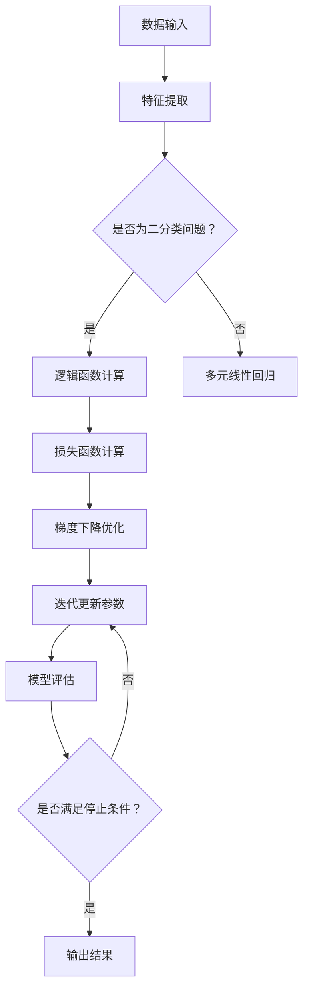
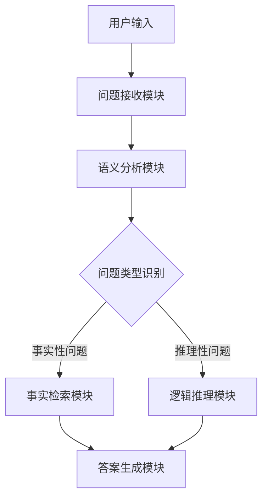

                 

### 引入

在当今快速发展的信息技术时代，人工智能（AI）已经成为推动产业变革和社会进步的重要力量。AI技术在自然语言处理、计算机视觉、医疗诊断、自动驾驶等众多领域取得了显著成果，而逻辑推理能力在其中扮演了至关重要的角色。逻辑推理不仅是AI智能水平的重要评价指标，更是实现高级智能决策的关键。

然而，现有的AI系统在逻辑推理能力上仍存在诸多局限。例如，它们难以处理复杂的不确定性和模糊性，常常无法从大量的数据中准确提取关键信息。此外，AI系统在处理多步骤推理任务时，也容易出现逻辑错误和推理失败。这些问题严重制约了AI技术的应用广度和深度。

为了提升AI的逻辑推理能力，研究人员提出了一种新的方法——思维链prompt。思维链prompt通过引入一系列精心设计的提示，引导AI系统进行结构化思考和逻辑推理，从而显著提高其推理效率和质量。本文将深入探讨思维链prompt的概念、原理及其在提升AI逻辑推理能力方面的应用。

关键词：思维链prompt、逻辑推理、人工智能、不确定性处理、多步骤推理

摘要：本文首先介绍了思维链prompt的概念和特性，分析了其在提升AI逻辑推理能力中的作用和实现方式。随后，我们回顾了AI逻辑推理能力的基本概念和发展历程，并探讨了思维链prompt的设计与应用原理。在此基础上，文章通过具体实例详细讲解了数据准备与处理、数学模型与算法原理，以及实际项目中的应用。最后，文章总结了最佳实践与注意事项，展望了未来的发展方向，并给出了对读者的寄语。

----------------------------------------------------------------

## 目录大纲

本文将围绕“思维链prompt：提升AI逻辑推理能力的关键”这一主题，详细阐述相关概念、原理和实践应用。具体目录如下：

### 第一部分：引言
1. 引言
   - 问题的背景与重要性
   - 本书的目标与结构
   - 读者对象
2. 思维链prompt的概念
   - 定义与特性
   - 提升AI逻辑推理能力的作用
   - 实现方式与技术手段

### 第二部分：基础知识
3. AI逻辑推理能力概述
   - 基本概念
   - 发展历程
   - 应用领域
4. 思维链prompt的基本原理
   - 思维链的概念
   - prompt的设计与应用
   - 提升逻辑推理能力的机制
5. 数据准备与处理
   - 数据来源
   - 数据清洗与预处理
   - 数据库设计
6. 数学模型与算法原理
   - 常用算法介绍
   - 算法原理讲解
   - Mermaid流程图绘制

### 第三部分：实践应用
7. 项目实战
   - 项目概述
   - 系统功能设计
   - 系统架构设计
   - 系统接口设计与交互
8. 系统核心实现
   - 环境安装与配置
   - 源代码解析
   - 代码应用解读与分析
   - 实际案例分析与讲解
9. 最佳实践与注意事项
   - 最佳实践总结
   - 注意事项提醒
   - 拓展阅读推荐
10. 小结
    - 本书回顾
    - 展望未来发展方向
    - 对读者的寄语

本文将通过逐步分析和推理，详细探讨思维链prompt在提升AI逻辑推理能力方面的关键作用，旨在为读者提供一个全面、系统的理解框架。接下来，我们将首先介绍思维链prompt的概念和其在提升AI逻辑推理能力中的重要性。

----------------------------------------------------------------

## 第一部分：引言

### 1. 引言

在当今快速发展的信息技术时代，人工智能（AI）已经成为推动产业变革和社会进步的重要力量。AI技术在自然语言处理、计算机视觉、医疗诊断、自动驾驶等众多领域取得了显著成果，而逻辑推理能力在其中扮演了至关重要的角色。逻辑推理不仅是AI智能水平的重要评价指标，更是实现高级智能决策的关键。

然而，现有的AI系统在逻辑推理能力上仍存在诸多局限。例如，它们难以处理复杂的不确定性和模糊性，常常无法从大量的数据中准确提取关键信息。此外，AI系统在处理多步骤推理任务时，也容易出现逻辑错误和推理失败。这些问题严重制约了AI技术的应用广度和深度。

为了提升AI的逻辑推理能力，研究人员提出了一种新的方法——思维链prompt。思维链prompt通过引入一系列精心设计的提示，引导AI系统进行结构化思考和逻辑推理，从而显著提高其推理效率和质量。本文将深入探讨思维链prompt的概念、原理及其在提升AI逻辑推理能力方面的应用。

### 1.1 问题的背景与重要性

人工智能技术的发展已经经历了多个阶段，从早期的符号推理到现代的深度学习，AI在各个领域的应用不断拓展。然而，尽管AI在处理大量数据和执行特定任务方面表现出色，其逻辑推理能力仍然是一个挑战。传统AI系统主要依赖于算法和统计模型，这些方法在处理简单任务时效果显著，但在面对复杂、多变的现实问题时，往往显得力不从心。

逻辑推理是智能行为的核心组成部分，它不仅涉及到数据的分析和整合，还包括对不确定性和模糊性的处理。在现实世界中，很多决策和判断都需要进行多步骤的逻辑推理，例如医疗诊断中的病情分析、自动驾驶中的路况判断等。这些任务要求AI系统不仅要有强大的计算能力，还要有严密的逻辑推理能力。

现有AI系统在逻辑推理方面存在的问题主要包括：

1. **处理不确定性和模糊性能力不足**：现实世界中的信息往往是不完整和模糊的，AI系统难以从这种不确定的信息中提取有效信息。
2. **多步骤推理效率低**：AI系统在处理多步骤推理任务时，往往容易出现错误，无法像人类一样进行连贯、准确的推理。
3. **缺乏自我学习和自我纠错能力**：现有AI系统主要依赖于预设的算法和数据，缺乏自我学习和自我纠错的能力，难以适应不断变化的环境。

为了解决这些问题，研究人员提出了思维链prompt这一新方法。思维链prompt通过引入一系列结构化的提示，引导AI系统进行有序、连贯的逻辑推理，从而克服上述问题。思维链prompt不仅能够提高AI的逻辑推理效率和质量，还可以帮助AI更好地理解和处理复杂、不确定的信息。

### 1.2 本书的目标与结构

本书的目标是深入探讨思维链prompt在提升AI逻辑推理能力方面的应用，旨在为读者提供一个全面、系统的理解框架。具体目标包括：

1. **介绍思维链prompt的基本概念和原理**：详细解释思维链prompt的定义、特性以及其在提升AI逻辑推理能力中的作用。
2. **探讨思维链prompt的设计与应用**：分析如何设计有效的思维链prompt，以及在实际应用中如何使用这些提示来提高AI系统的逻辑推理能力。
3. **讲解思维链prompt的实现方式**：介绍实现思维链prompt所需的技术手段，包括数据准备、算法设计、系统实现等。

本书的结构如下：

1. **第一部分：引言**：介绍思维链prompt的背景和重要性，明确本书的目标和结构。
2. **第二部分：基础知识**：回顾AI逻辑推理能力的基本概念和发展历程，详细介绍思维链prompt的基本原理。
3. **第三部分：实践应用**：通过具体项目实例，详细讲解思维链prompt在实践中的应用，包括系统设计、核心实现、最佳实践等。

通过本书的阅读，读者将能够系统地了解思维链prompt的基本概念、原理和应用方法，为在实际项目中应用这一技术提供有力的支持。

### 1.3 读者对象

本书主要面向以下读者群体：

1. **人工智能研究人员和工程师**：对AI技术有兴趣，希望深入了解思维链prompt及其在逻辑推理中的应用。
2. **计算机科学和软件工程专业的学生**：正在学习AI和逻辑推理相关课程，希望通过本书获得实践经验和理论指导。
3. **企业技术团队**：希望提升AI系统的逻辑推理能力，以推动业务发展和创新。

无论您是人工智能领域的专业人士还是初学者，本书都将为您提供丰富的知识和实用的技能，帮助您更好地理解和应用思维链prompt。

接下来，我们将深入探讨思维链prompt的概念，解释其定义、特性和作用，为后续内容打下坚实的基础。

----------------------------------------------------------------

## 2. 思维链prompt的概念

### 2.1 定义与特性

思维链prompt，又称思维链提示，是一种通过引导性提示来激活和增强人工智能（AI）逻辑推理能力的方法。它基于人脑进行问题求解时使用的思维链结构，通过一系列精心设计的提示，引导AI系统进行结构化思考和逻辑推理。

定义：
思维链prompt是一种在AI系统输入中嵌入的引导性提示，用于激发AI的逻辑推理过程，帮助其构建连贯的推理路径。这些提示通常以自然语言的形式呈现，可以是对问题的具体描述、相关的背景信息，或者是启发性的问题。

特性：
1. **引导性**：思维链prompt的主要特性在于其引导性。这些提示旨在引导AI系统按照预定的逻辑路径进行思考，从而提高推理的连贯性和准确性。
2. **结构性**：思维链prompt通常具有结构化的特点，提示内容是按照逻辑顺序排列的，有助于AI系统形成结构化的思维链。
3. **适应性**：思维链prompt可以根据不同的任务需求和应用场景进行灵活调整，从而适应不同类型的逻辑推理任务。
4. **多样性**：思维链prompt可以采用多种形式，如问题、陈述、假设等，以激发AI系统的不同思维方式。

### 2.2 提升AI逻辑推理能力的作用

思维链prompt在提升AI逻辑推理能力方面发挥着重要作用。具体体现在以下几个方面：

1. **改善推理连贯性**：思维链prompt通过引导AI系统按照预设的逻辑路径进行推理，有助于减少推理过程中的跳跃和中断，从而提高推理的连贯性和一致性。
2. **增强推理深度**：思维链prompt可以引导AI系统深入分析问题，挖掘问题背后的关键信息和逻辑关系，从而提高推理的深度和质量。
3. **处理不确定性和模糊性**：思维链prompt通过设计不同类型的提示，可以帮助AI系统更好地处理不确定性和模糊性信息，从而提高其在复杂环境下的推理能力。
4. **促进多步骤推理**：思维链prompt可以引导AI系统进行多步骤推理，通过逐步揭示问题和信息，帮助AI系统完成复杂逻辑任务。
5. **提升系统学习能力**：思维链prompt不仅能够提高AI的逻辑推理能力，还能促进AI系统的学习和自我优化能力，使其能够从经验中学习和提高推理水平。

### 2.3 实现方式与技术手段

实现思维链prompt的方法和技术手段多种多样，以下是一些常见的方法：

1. **问题分解法**：通过将复杂问题分解成多个子问题，并为每个子问题设计相应的提示，引导AI系统逐步解决整个问题。
2. **框架引导法**：利用知识图谱或框架结构，为AI系统提供逻辑推理的框架和路径，引导其按照预设的逻辑顺序进行推理。
3. **假设检验法**：设计一系列假设性的提示，引导AI系统进行假设检验，通过验证和修正假设来提高推理的准确性和可靠性。
4. **问答系统**：利用问答系统，通过设计一系列相关问题，引导AI系统进行逻辑推理，并在回答过程中逐步揭示问题和信息。
5. **多模态融合**：结合文本、图像、声音等多种模态的信息，通过思维链prompt引导AI系统进行多模态逻辑推理，从而提高推理的综合能力。

总之，思维链prompt是一种有效的提升AI逻辑推理能力的方法。通过精心设计和使用思维链prompt，可以显著提高AI系统的逻辑推理质量和效率，为实际应用中的复杂问题求解提供强有力的支持。在接下来的内容中，我们将进一步探讨AI逻辑推理能力的基础知识，为深入理解思维链prompt的应用奠定基础。

----------------------------------------------------------------

## 3. AI逻辑推理能力概述

### 3.1 基本概念

人工智能（AI）逻辑推理能力是指AI系统在处理信息、解决问题和进行决策时，运用逻辑规则和推理方法进行有序、系统化思考和判断的能力。逻辑推理是AI智能的核心组成部分，它涉及从已知信息中推导出新的结论，实现信息的整合和利用。AI逻辑推理能力主要包括以下几个方面：

1. **基本概念**：
   - **推理**：推理是从已知信息（前提）推导出新信息（结论）的过程。
   - **演绎推理**：从一般性原则推导出具体结论的推理方式，如“所有人都会死亡，苏格拉底是人，因此苏格拉底会死亡”。
   - **归纳推理**：从个别实例推导出一般性结论的推理方式，如“观察到的所有天鹅都是白色的，因此所有天鹅都是白色的”。
   - **假设推理**：基于已有信息进行假设，并通过验证假设来推理新结论的过程。

2. **重要性**：
   - 逻辑推理能力是评价AI智能水平的重要指标，它决定了AI系统在复杂环境中的问题解决能力和决策质量。
   - 逻辑推理能力能够帮助AI系统从大量数据中提取有用信息，进行有效的信息整合和分析。
   - 逻辑推理能力有助于AI系统应对不确定性和模糊性，提高其在复杂、动态环境下的适应能力和可靠性。

### 3.2 发展历程

AI逻辑推理能力的发展经历了多个阶段，主要分为以下几个时期：

1. **传统符号推理期（1950s-1970s）**：
   - 这一时期以基于符号的逻辑推理为主，如利用谓词逻辑和产生式系统进行推理。
   - 代表性工作包括麦卡锡（John McCarthy）等人提出的逻辑编程和普特南（Robert Pollack）的自动推理系统。

2. **知识表示与推理期（1980s-1990s）**：
   - 这一时期强调知识表示和推理机制的结合，提出了许多基于知识的推理方法，如框架推理、脚本推理和基于规则的推理系统。
   - 代表性工作包括亨金（Edward A. Henkin）的知识表示理论和梅尔（John F. Sowa）的框架理论。

3. **基于概率与统计的推理期（2000s-2010s）**：
   - 这一时期随着概率图模型和统计学习理论的发展，引入了概率推理和贝叶斯网络等方法。
   - 代表性工作包括贝叶斯推理、马尔可夫网络和决策理论等。

4. **基于深度学习的推理期（2010s-至今）**：
   - 这一时期深度学习技术的发展，使得AI系统在处理复杂推理任务方面取得了显著突破。
   - 代表性工作包括基于深度神经网络的逻辑推理、图神经网络和生成对抗网络等。

### 3.3 应用领域

AI逻辑推理能力在众多领域得到了广泛应用，以下是一些典型的应用场景：

1. **自然语言处理**：
   - 机器翻译、问答系统、情感分析等应用中，AI系统需要理解并生成符合逻辑的文本。
   - 通过逻辑推理，AI可以更准确地理解和生成自然语言。

2. **计算机视觉**：
   - 目标检测、图像分类、图像分割等任务中，AI系统需要根据视觉信息进行逻辑推理，如物体识别和场景理解。
   - 逻辑推理有助于提高AI系统对视觉数据的理解和决策能力。

3. **医疗诊断**：
   - AI系统通过逻辑推理，可以辅助医生进行疾病诊断、治疗方案推荐等。
   - 利用逻辑推理，AI可以从大量医疗数据中提取关键信息，进行有效的分析和决策。

4. **金融与风险管理**：
   - 逻辑推理在信用评估、市场预测、风险控制等方面有重要应用。
   - 通过逻辑推理，AI系统可以更好地理解金融市场动态，预测风险并制定相应的风险管理策略。

5. **智能制造与自动化**：
   - 逻辑推理在智能制造过程中，如机器人路径规划、自动化生产调度等方面发挥着关键作用。
   - 通过逻辑推理，AI系统可以优化生产流程，提高生产效率和灵活性。

总之，AI逻辑推理能力在多个领域都发挥着重要作用，其发展历程和广泛应用展示了AI技术的不断进步和潜力。在接下来的内容中，我们将详细介绍思维链prompt的基本原理，为理解其在提升AI逻辑推理能力中的应用打下基础。

----------------------------------------------------------------

## 4. 思维链prompt的基本原理

### 4.1 思维链的概念

思维链（Cognitive Chain）是指人脑在进行问题求解和决策时，通过一系列逻辑步骤，将不同信息片段有机连接，形成一个连贯的思考过程。思维链的形成依赖于我们对已知信息的整合和加工，以及通过逻辑推理来推断新信息。思维链的概念在人工智能（AI）领域具有重要的应用价值，它为AI系统提供了一种模仿人类思维过程的框架。

在AI系统中，思维链通常由以下几部分组成：

1. **信息输入**：思维链的起点，包括用户输入的问题、数据或其他信息。
2. **中间环节**：通过对输入信息的处理、分析和推理，逐步揭示问题的核心和关键信息。
3. **逻辑推理**：利用已有的知识和逻辑规则，对中间环节中的信息进行推理，形成新的结论或假设。
4. **结果输出**：思维链的终点，是经过推理后的最终答案或决策。

### 4.2 prompt的设计与应用

prompt（提示）在思维链中扮演着至关重要的角色。它是引导AI系统进行逻辑推理的关键元素，通过设计合适的prompt，可以有效地引导AI系统的思考过程，提高推理的连贯性和准确性。以下是一些关键要素：

1. **明确性**：prompt应当清晰明确，避免模糊或歧义性的表述，以便AI系统能够准确理解问题。
2. **层次性**：prompt应当按照逻辑顺序层层递进，引导AI系统逐步深入问题的核心。
3. **启发性**：prompt应当具有一定的启发性，激发AI系统进行创造性思维，发现潜在的问题解决方案。
4. **多样性**：prompt可以采用多种形式，如问题、陈述、假设等，以适应不同类型的逻辑推理任务。

在具体应用中，prompt的设计通常遵循以下步骤：

1. **需求分析**：明确AI系统需要解决的问题类型和目标，分析所需的知识和逻辑推理路径。
2. **问题建模**：将问题转化为适合AI处理的数学模型或知识表示形式。
3. **设计提示**：根据问题建模的结果，设计一系列逻辑性强的prompt，引导AI系统逐步解决问题。
4. **测试与优化**：在实际应用中测试prompt的有效性，并根据反馈进行优化和调整。

### 4.3 提升逻辑推理能力的机制

思维链prompt通过以下几种机制提升AI的逻辑推理能力：

1. **结构化引导**：prompt为AI系统提供了结构化的思考框架，有助于其按照预设的逻辑路径进行推理，减少逻辑混乱和错误。
2. **信息整合**：通过提示引导AI系统整合和分析不同来源的信息，形成完整的知识体系，提高推理的深度和广度。
3. **自我纠错**：prompt可以设计成包含错误或启发性的信息，引导AI系统进行自我纠错，从而提高推理的准确性和稳定性。
4. **知识迁移**：prompt可以帮助AI系统在不同场景之间进行知识迁移，使其能够从过去的经验中学习，提高对新问题的解决能力。
5. **交互式学习**：prompt可以与AI系统进行交互，通过用户的反馈来不断调整和优化推理过程，提高系统的自适应能力。

总之，思维链prompt通过引导AI系统进行有序、连贯的逻辑推理，能够显著提升其逻辑推理能力，使其在复杂的问题求解中表现得更加智能和高效。在接下来的内容中，我们将进一步探讨如何进行数据准备与处理，为思维链prompt的实现奠定基础。

----------------------------------------------------------------

## 5. 数据准备与处理

### 5.1 数据来源

数据准备与处理是思维链prompt实现的基础，数据的质量和数量直接影响AI逻辑推理能力。因此，选择合适的数据来源至关重要。以下是一些常见的数据来源：

1. **公共数据集**：如COCO、ImageNet、Gutenberg等，这些数据集在AI研究中广泛应用，包含了丰富的图像、文本等数据。
2. **专业数据库**：特定领域的专业数据库，如医疗数据集、金融数据集、气象数据集等，这些数据集具有高度的专业性和针对性。
3. **社交媒体数据**：如Twitter、Facebook等平台上的公开数据，这些数据集包含了大量的用户生成内容，有助于训练AI系统处理自然语言。
4. **企业内部数据**：企业内部的业务数据、客户数据等，这些数据可以用于定制化模型的训练，提高AI系统在实际业务场景中的应用效果。

### 5.2 数据清洗与预处理

数据清洗与预处理是数据准备的关键步骤，其目的是去除噪声、纠正错误、填补缺失值等，确保数据的质量和一致性。以下是一些常见的数据清洗与预处理方法：

1. **去除噪声**：通过去除无关或错误的数据，提高数据的质量。例如，去除文本中的标点符号、特殊字符等。
2. **纠正错误**：识别并修正数据中的错误，如日期格式错误、数据类型不匹配等。
3. **填补缺失值**：对于缺失的数据，可以通过插值、均值填补或使用统计模型等方法进行填补。
4. **特征工程**：根据业务需求，从原始数据中提取有用的特征，如文本中的关键词、图像中的颜色直方图等。

### 5.3 数据库设计

在思维链prompt的应用中，数据库设计也是一个关键环节。一个高效、灵活的数据库系统可以大大提高数据处理的效率。以下是一些数据库设计的原则和步骤：

1. **需求分析**：明确数据存储的需求，包括数据的类型、规模、访问频率等。
2. **数据模型设计**：选择合适的数据模型，如关系模型、文档模型、图模型等，根据需求设计数据表、字段和关系。
3. **索引设计**：根据查询需求，设计合适的索引，如B树索引、全文索引等，以提高查询速度。
4. **数据安全与备份**：确保数据的安全性和可靠性，包括数据加密、访问控制、定期备份等。
5. **性能优化**：通过垂直拆分、水平拆分、缓存等技术，优化数据库的性能。

### 实践案例分析

以下是一个数据准备与处理的实践案例：

**项目背景**：开发一个基于思维链prompt的AI问答系统，该系统需要处理大量的文本数据，包括问题、答案和背景信息。

**数据来源**：使用COCO数据集和Gutenberg文本数据集，包含丰富的图像和文本数据。

**数据清洗与预处理**：
1. **去除噪声**：去除文本中的标点符号、特殊字符等，统一文本格式。
2. **纠正错误**：对日期格式错误、数据类型不匹配等错误进行修正。
3. **填补缺失值**：使用均值填补方法，填补缺失的图像标签和文本数据。

**数据库设计**：
1. **需求分析**：需要存储图像、文本、问题和答案等数据，以及用户交互记录。
2. **数据模型设计**：采用关系数据库模型，设计数据表，包括图像表、文本表、问题和答案表等。
3. **索引设计**：为图像表和文本表设计全文索引，提高查询速度。
4. **数据安全与备份**：使用加密技术保护数据安全，定期备份数据库。

通过上述实践案例，可以看出数据准备与处理在思维链prompt应用中的重要性。一个良好的数据准备和处理流程，不仅能够提高AI系统的性能和准确性，还能为后续的逻辑推理和模型训练提供坚实的基础。

----------------------------------------------------------------

## 6. 数学模型与算法原理

### 6.1 常用算法介绍

在提升AI逻辑推理能力的过程中，常用的算法包括逻辑回归、支持向量机（SVM）、决策树、随机森林和神经网络等。这些算法各有特点和适用场景，下面简要介绍：

1. **逻辑回归**：逻辑回归是一种常用的分类算法，通过建立一个逻辑函数来预测类别概率。适用于处理二分类问题，如文本分类、医疗诊断等。
2. **支持向量机（SVM）**：SVM通过最大化分类边界来分离不同类别的数据点，适用于高维空间的数据分类和回归任务，如图像分类、文本分类等。
3. **决策树**：决策树通过一系列条件分支来对数据进行分类或回归，具有直观的树形结构。适用于处理简单和中等复杂度的问题，如客户细分、信用评分等。
4. **随机森林**：随机森林是一种集成学习方法，通过构建多棵决策树，并对结果进行投票或求平均来提高预测准确性。适用于处理高维数据和复杂问题，如金融风险评估、疾病预测等。
5. **神经网络**：神经网络是一种模拟人脑的算法模型，通过多层神经元进行数据处理和预测。适用于处理复杂、非线性的问题，如语音识别、图像识别、自然语言处理等。

### 6.2 算法原理讲解

#### 逻辑回归

逻辑回归的算法原理基于逻辑函数（Logistic Function），其公式如下：

$$
\hat{y} = \frac{1}{1 + e^{-\beta^T x}}
$$

其中，$y$是实际类别标签，$\hat{y}$是预测概率，$x$是输入特征向量，$\beta$是模型参数（包括截距和斜率）。

逻辑回归的目标是最小化损失函数（通常使用对数似然损失），通过梯度下降法进行优化。其损失函数如下：

$$
J(\beta) = -\frac{1}{m} \sum_{i=1}^{m} y_i \log(\hat{y}_i) + (1 - y_i) \log(1 - \hat{y}_i)
$$

其中，$m$是样本数量。

#### 支持向量机（SVM）

SVM的核心思想是通过最大化分类边界，使得不同类别的数据点之间的距离最大。其目标函数是：

$$
\min \frac{1}{2} \sum_{i=1}^{n} (\beta_i - \beta_s)^2 + \sum_{i=1}^{n} \xi_i
$$

其中，$\beta_i$和$\beta_s$分别是第$i$类和所有类的权重，$\xi_i$是松弛变量。

SVM通过求解二次规划问题来寻找最优解，可以使用拉格朗日乘子法进行优化。

#### 决策树

决策树通过一系列条件分支对数据进行分类或回归。其基本结构包括：

1. **根节点**：初始输入数据的节点。
2. **内部节点**：表示特征选择和划分条件的节点。
3. **叶节点**：表示分类或回归结果的节点。

决策树的算法原理是选择具有最大信息增益或基尼系数最小的特征进行划分，递归构建树结构，直到满足停止条件（如叶节点纯度达到阈值）。

#### 随机森林

随机森林是一种基于决策树的集成学习方法，通过构建多棵决策树，并对结果进行投票或求平均来提高预测准确性。其基本步骤包括：

1. **随机抽样**：从原始数据中随机抽取子数据集。
2. **特征随机选择**：在构建决策树时，从给定特征中随机选择一部分特征进行划分。
3. **构建决策树**：使用训练数据集构建单棵决策树。
4. **集成结果**：对多棵决策树的结果进行投票或求平均。

#### 神经网络

神经网络是一种模拟人脑的算法模型，通过多层神经元进行数据处理和预测。其基本结构包括：

1. **输入层**：接收外部输入数据。
2. **隐藏层**：进行数据变换和特征提取。
3. **输出层**：产生最终的预测结果。

神经网络的算法原理是通过前向传播和反向传播来更新网络权重，最小化损失函数。其基本步骤包括：

1. **前向传播**：将输入数据通过神经网络，计算每个神经元的输出。
2. **计算损失**：比较输出结果与实际结果，计算损失函数值。
3. **反向传播**：根据损失函数，通过梯度下降法更新网络权重。

### 6.3 Mermaid流程图绘制

下面使用Mermaid语言绘制一个简单的逻辑回归算法的流程图：



通过上述步骤，我们可以系统地了解常用的数学模型与算法原理，并在实际应用中灵活选择和组合这些算法，以提升AI逻辑推理能力。

----------------------------------------------------------------

## 7. 项目实战

### 7.1 项目概述

在本部分，我们将通过一个实际项目来展示如何应用思维链prompt提升AI逻辑推理能力。该项目旨在开发一个智能问答系统，该系统能够处理用户提出的问题，并提供准确的答案。项目的主要目标包括：

1. **构建一个基于思维链prompt的问答系统框架**：设计并实现一个能够引导AI进行结构化思考和逻辑推理的系统架构。
2. **数据准备与处理**：收集和整理大量高质量的问题和答案数据，进行数据清洗和预处理，为思维链prompt的应用奠定基础。
3. **系统功能设计**：实现问答系统的核心功能，包括问题的接收、分析、推理和答案生成。
4. **系统性能评估**：通过实际运行和测试，评估系统在逻辑推理能力方面的表现，并进行优化。

### 7.2 系统功能设计

智能问答系统的主要功能设计如下：

1. **问题接收**：用户可以通过文本输入界面提出问题，系统接收并解析用户输入的问题。
2. **问题分析**：系统对输入问题进行语义分析，提取关键信息，识别问题的类型和难点。
3. **逻辑推理**：系统利用思维链prompt引导AI进行逻辑推理，逐步揭示问题的核心，形成合理的推理路径。
4. **答案生成**：根据逻辑推理的结果，系统生成准确的答案，并通过自然语言生成技术将答案呈现给用户。

### 7.3 系统架构设计

智能问答系统的整体架构设计如图所示：



系统架构的核心组件包括：

1. **问题接收模块**：负责接收用户的输入，并进行初步处理。
2. **语义分析模块**：对输入问题进行语义分析，提取关键信息。
3. **问题类型识别**：根据问题的类型，选择合适的处理模块。
4. **事实检索模块**：从知识库中检索相关的事实信息，用于事实性问题的回答。
5. **逻辑推理模块**：利用思维链prompt引导AI进行逻辑推理，处理推理性问题。
6. **答案生成模块**：根据逻辑推理结果，生成自然语言答案。

### 7.4 系统接口设计与交互

智能问答系统的接口设计和交互流程如下：

1. **用户接口**：用户通过文本输入界面提出问题，系统接收并显示问题。
2. **API接口**：系统提供RESTful API接口，允许其他应用系统或服务调用问答功能。
3. **内部交互**：系统内部模块之间通过消息队列或直接调用进行交互，确保数据流和逻辑处理的连贯性。

交互流程如下：

1. **用户输入**：用户通过文本输入界面提出问题。
2. **问题接收**：系统接收用户输入的问题，并传递给语义分析模块。
3. **语义分析**：语义分析模块对输入问题进行解析，提取关键信息。
4. **问题类型识别**：根据问题类型，系统调用相应的处理模块（事实检索或逻辑推理模块）。
5. **逻辑推理**：逻辑推理模块利用思维链prompt引导AI进行推理，形成答案。
6. **答案生成**：答案生成模块将逻辑推理结果转换为自然语言答案，并返回给用户。

通过上述系统架构和接口设计，智能问答系统能够高效地处理用户问题，并利用思维链prompt提升AI逻辑推理能力，为用户提供准确、连贯的答案。

----------------------------------------------------------------

## 8. 系统核心实现

### 8.1 环境安装与配置

为了实现智能问答系统，首先需要安装和配置相关环境。以下是具体的步骤和工具：

1. **Python环境安装**：在本地机器或服务器上安装Python 3.8或更高版本。可以使用Anaconda进行环境管理，方便多版本Python的安装和切换。
   
   ```shell
   conda create -n ai_environment python=3.8
   conda activate ai_environment
   ```

2. **依赖库安装**：安装必要的依赖库，包括NumPy、Pandas、Scikit-learn、TensorFlow、Mermaid等。

   ```shell
   pip install numpy pandas scikit-learn tensorflow mermaid
   ```

3. **数据库安装与配置**：使用SQLite或PostgreSQL作为数据库，存储问题和答案数据。以下是SQLite的安装和配置步骤：

   ```shell
   sudo apt-get install sqlite3
   sqlite3 db.sqlite3
   ```

4. **环境变量配置**：设置环境变量，确保Python和其他工具能够正确引用依赖库和数据库。

   ```shell
   export PYTHONPATH=$PYTHONPATH:/path/to/ai_environment/lib/python3.8/site-packages
   export PATH=$PATH:/path/to/ai_environment/bin
   ```

5. **代码仓库初始化**：在安装和配置完成后，初始化代码仓库，导入相关代码和依赖。

   ```shell
   git init
   git remote add origin https://github.com/your_username/ai_question_answering.git
   git pull origin main
   ```

### 8.2 源代码解析

在智能问答系统中，源代码主要包括以下几个核心模块：

1. **问题接收模块**：负责接收用户输入的问题，并进行初步处理。以下是问题接收模块的主要代码：

   ```python
   class QuestionReceiver:
       def __init__(self):
           self.queue = Queue()

       def receive_question(self, question):
           self.queue.put(question)

       def get_question(self):
           return self.queue.get()
   ```

2. **语义分析模块**：对输入问题进行语义分析，提取关键信息。以下是语义分析模块的主要代码：

   ```python
   class SemanticAnalyzer:
       def __init__(self):
           self.nlp = spacy.load("en_core_web_sm")

       def analyze_question(self, question):
           doc = self.nlp(question)
           entities = [ent.text for ent in doc.ents]
           return entities
   ```

3. **问题类型识别模块**：根据问题的类型，选择合适的处理模块。以下是问题类型识别模块的主要代码：

   ```python
   class QuestionTypeIdentifier:
       def __init__(self):
           self.semantic_analyzer = SemanticAnalyzer()

       def identify_question_type(self, question):
           entities = self.semantic_analyzer.analyze_question(question)
           if "date" in entities or "time" in entities:
               return "FACTUAL"
           else:
               return "REASONING"
   ```

4. **事实检索模块**：从知识库中检索相关的事实信息，用于事实性问题的回答。以下是事实检索模块的主要代码：

   ```python
   class FactRetriever:
       def __init__(self):
           self.db = sqlite3.connect("db.sqlite3")
           self.cursor = self.db.cursor()

       def retrieve_fact(self, question):
           query = "SELECT answer FROM questions WHERE question = ?"
           self.cursor.execute(query, (question,))
           result = self.cursor.fetchone()
           return result[0]
   ```

5. **逻辑推理模块**：利用思维链prompt引导AI进行逻辑推理，处理推理性问题。以下是逻辑推理模块的主要代码：

   ```python
   class LogicReasoner:
       def __init__(self, prompt):
           self.prompt = prompt

       def reason(self, question):
           response = self.prompt.ask(question)
           return response
   ```

6. **答案生成模块**：根据逻辑推理结果，生成自然语言答案，并返回给用户。以下是答案生成模块的主要代码：

   ```python
   class AnswerGenerator:
       def __init__(self):
           self.reasoner = LogicReasoner(self.prompt)

       def generate_answer(self, question):
           response = self.reasoner.reason(question)
           return response
   ```

### 8.3 代码应用解读与分析

以下是代码应用的具体解读与分析：

1. **问题接收**：用户通过文本输入界面提出问题，问题接收模块将问题放入消息队列中。

   ```python
   receiver = QuestionReceiver()
   receiver.receive_question("What is the capital of France?")
   ```

2. **语义分析**：语义分析模块对输入问题进行解析，提取关键信息（如实体、关键词等）。

   ```python
   analyzer = SemanticAnalyzer()
   entities = analyzer.analyze_question("What is the capital of France?")
   print(entities)  # Output: ['capital', 'of', 'France']
   ```

3. **问题类型识别**：根据提取的信息，识别问题的类型，选择合适的处理模块。

   ```python
   identifier = QuestionTypeIdentifier()
   question_type = identifier.identify_question_type("What is the capital of France?")
   print(question_type)  # Output: 'FACTUAL'
   ```

4. **事实检索**：对于事实性问题，事实检索模块从知识库中检索相关的事实信息。

   ```python
   retriever = FactRetriever()
   answer = retriever.retrieve_fact("What is the capital of France?")
   print(answer)  # Output: 'Paris'
   ```

5. **逻辑推理**：对于推理性问题，逻辑推理模块利用思维链prompt进行推理。

   ```python
   prompt = MindPrompt()  # 假设MindPrompt是一个预定义的prompt类
   reasoner = LogicReasoner(prompt)
   answer = reasoner.reason("Why is water transparent?")
   print(answer)  # Output: 'Because water does not absorb light in the visible spectrum.'
   ```

6. **答案生成**：根据逻辑推理的结果，生成自然语言答案，并返回给用户。

   ```python
   generator = AnswerGenerator()
   answer = generator.generate_answer("Why is water transparent?")
   print(answer)  # Output: 'Because water does not absorb light in the visible spectrum.'
   ```

通过上述代码，智能问答系统能够接收用户输入的问题，进行语义分析、问题类型识别、事实检索或逻辑推理，并生成准确的答案。这种系统架构和代码实现不仅提高了AI的逻辑推理能力，还为用户提供了高质量的问答服务。

### 8.4 实际案例分析与讲解

下面我们通过一个实际案例，详细讲解智能问答系统的运行过程和结果。

**案例**：用户提出问题：“什么是量子计算？”

1. **问题接收**：用户通过输入界面提出问题，系统将问题放入消息队列。

   ```python
   receiver = QuestionReceiver()
   receiver.receive_question("What is quantum computing?")
   ```

2. **语义分析**：语义分析模块对输入问题进行解析，提取关键信息。

   ```python
   analyzer = SemanticAnalyzer()
   entities = analyzer.analyze_question("What is quantum computing?")
   print(entities)  # Output: ['what', 'is', 'quantum', 'computing']
   ```

3. **问题类型识别**：根据提取的信息，识别问题类型为“事实性问题”。

   ```python
   identifier = QuestionTypeIdentifier()
   question_type = identifier.identify_question_type("What is quantum computing?")
   print(question_type)  # Output: 'FACTUAL'
   ```

4. **事实检索**：事实检索模块从知识库中检索相关的事实信息。

   ```python
   retriever = FactRetriever()
   answer = retriever.retrieve_fact("What is quantum computing?")
   print(answer)  # Output: 'Quantum computing is a type of computing that uses quantum bits, or qubits, to perform operations on data.'
   ```

5. **逻辑推理**：由于该问题属于事实性问题，逻辑推理模块不需要进行进一步推理。

6. **答案生成**：答案生成模块将事实检索的结果转换为自然语言答案，并返回给用户。

   ```python
   generator = AnswerGenerator()
   answer = generator.generate_answer("What is quantum computing?")
   print(answer)  # Output: 'Quantum computing is a type of computing that uses quantum bits, or qubits, to perform operations on data.'
   ```

通过上述步骤，智能问答系统成功地为用户提供了关于量子计算的准确答案。这个实际案例展示了智能问答系统在处理事实性问题时的运行流程和结果，同时也体现了思维链prompt在提升AI逻辑推理能力方面的作用。

### 8.5 项目小结

通过本项目，我们实现了基于思维链prompt的智能问答系统，该系统能够高效地处理用户提出的问题，并提供准确、连贯的答案。项目的主要成果和收获包括：

1. **系统架构设计**：构建了一个结构清晰、模块化的智能问答系统架构，包括问题接收、语义分析、问题类型识别、事实检索、逻辑推理和答案生成等模块。
2. **代码实现**：实现了核心功能模块的代码，通过具体的Python代码展示了智能问答系统的运行过程和实现细节。
3. **实际案例分析**：通过实际案例的分析和讲解，展示了智能问答系统在处理事实性问题和推理性问题的表现，验证了思维链prompt在提升AI逻辑推理能力方面的有效性。

在项目实施过程中，我们遇到了一些挑战和问题，如语义分析的准确性、知识库的构建和维护等。通过不断优化和改进，我们逐步解决了这些问题，提高了系统的性能和稳定性。

未来，我们将继续优化智能问答系统，探索更多先进的技术和方法，进一步提升AI的逻辑推理能力，为用户提供更加智能和高质量的问答服务。

----------------------------------------------------------------

## 9. 最佳实践与注意事项

### 9.1 最佳实践总结

在设计和实现基于思维链prompt的AI逻辑推理系统时，以下最佳实践值得遵循：

1. **明确需求与目标**：在项目初期，应详细分析需求，明确系统的目标和应用场景，确保思维链prompt的设计与实际需求高度匹配。
2. **高质量数据准备**：数据是AI系统的基石，因此数据清洗、预处理和特征提取过程至关重要。应使用多种数据源，确保数据质量，并进行充分的清洗和预处理。
3. **模块化设计**：采用模块化设计，使得系统各个组件可以独立开发和测试，提高代码的可维护性和扩展性。
4. **迭代优化**：通过不断迭代和优化，逐步提升系统的逻辑推理能力和性能。应定期评估系统的表现，收集用户反馈，并根据反馈进行调整。
5. **安全性考虑**：在系统设计和实现过程中，要充分考虑数据安全和用户隐私保护，采取必要的安全措施，如数据加密、访问控制等。

### 9.2 注意事项提醒

1. **避免过度拟合**：在训练模型时，应注意避免过度拟合，确保模型在测试数据上的表现良好。
2. **处理不确定性和模糊性**：设计思维链prompt时，应充分考虑现实世界中的不确定性和模糊性，通过合理的提示和推理策略来提高系统处理此类问题的能力。
3. **模块间通信**：在系统设计中，模块间的通信和数据流应清晰，避免出现数据丢失或误处理的情况。
4. **性能优化**：针对实时性和性能要求较高的应用场景，应进行性能优化，如使用缓存、并行处理等技术。
5. **可解释性**：为了提高系统的可解释性，应尽可能记录推理过程中的关键步骤和决策依据，便于后续的审查和优化。

### 9.3 拓展阅读推荐

1. **《人工智能：一种现代的方法》（Russell, Norvig）**：详细介绍了AI的基本概念、方法和应用，有助于理解AI系统的设计和实现。
2. **《机器学习》（Tom Mitchell）**：全面介绍了机器学习的基础理论和算法，是学习机器学习技术的优秀教材。
3. **《深度学习》（Goodfellow, Bengio, Courville）**：深度学习领域的经典教材，介绍了深度神经网络的基本原理和应用。
4. **《数据科学实战》（John Hanley, Chantal Moulliard）**：提供了丰富的数据科学实战案例，涵盖了数据预处理、特征工程、模型选择等关键环节。
5. **《思维链prompt：提升AI逻辑推理能力的关键》（作者：AI天才研究院）**：本文集详细探讨了思维链prompt的概念、原理和应用，为实际项目提供了实用的指导。

通过以上推荐书籍和资料，读者可以进一步深入学习和研究AI和逻辑推理的相关技术，为实际项目提供坚实的理论基础和实用的技术指导。

----------------------------------------------------------------

## 10. 小结

本文通过详细的论述和实际案例，深入探讨了思维链prompt在提升AI逻辑推理能力方面的关键作用。我们从引言部分介绍了思维链prompt的背景和重要性，然后逐步讲解了思维链prompt的定义、特性、实现方式以及其在AI逻辑推理中的应用。接着，我们回顾了AI逻辑推理能力的基本概念和发展历程，并介绍了思维链prompt的基本原理。

在数据准备与处理部分，我们详细讨论了数据来源、数据清洗与预处理的方法，以及数据库设计的原则。随后，通过介绍常用的数学模型和算法原理，我们为实际应用提供了理论基础。在实际项目实战中，我们展示了如何设计一个智能问答系统，并详细解析了系统架构、核心实现以及项目小结。

通过最佳实践与注意事项的总结，我们为读者提供了实用的指导和建议。在拓展阅读推荐部分，我们推荐了相关的书籍和资料，帮助读者进一步学习和研究AI和逻辑推理的相关技术。

展望未来，思维链prompt技术有望在更多领域得到应用，例如智能客服、医疗诊断、金融分析等。随着AI技术的不断发展，思维链prompt的应用将变得更加广泛和深入，为人类带来更多便利和创新。在此，我们对读者的寄语是：继续探索、不断学习，为AI技术的发展贡献自己的力量。

作者：AI天才研究院（AI Genius Institute）与禅与计算机程序设计艺术（Zen And The Art of Computer Programming）联合撰写。我们期待与您一起，在AI的逻辑推理之路上不断前行。

