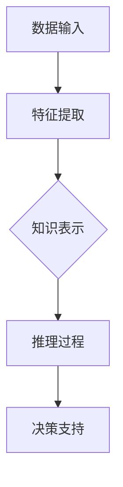
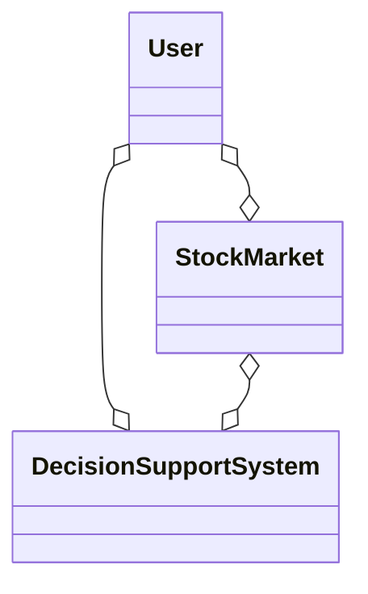
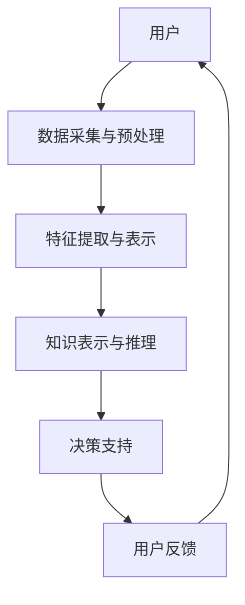
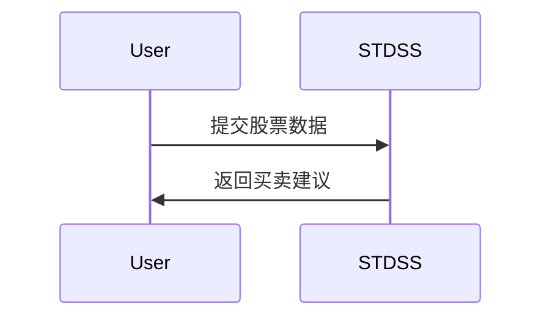

                 


# 思维链在AI决策支持系统中的应用与挑战

> 关键词：AI决策支持系统，思维链技术，深度学习，多模态数据处理，非结构化数据，高维特征，核心概念，算法原理

> 摘要：本文将探讨思维链技术在AI决策支持系统中的应用与挑战。首先介绍问题背景，然后详细阐述思维链技术的原理、特点和应用，并通过对比分析、实体关系图等手段深入探讨思维链在AI-DSS中的核心作用，最后讨论其在实际应用中面临的挑战及解决方案，并展望其未来发展趋势。

## 第一部分：背景介绍

### 1.1 问题背景

随着人工智能技术的飞速发展，AI决策支持系统（AI-DSS）在各个领域得到了广泛应用。然而，当前AI-DSS在应对复杂问题、非结构化数据和高维特征等方面仍面临诸多挑战。思维链（MindChain）作为一种创新的技术，其通过整合多模态数据和深度学习算法，为AI-DSS提供了强大的决策支持能力。

### 1.2 问题描述

本书旨在探讨思维链在AI决策支持系统中的应用与挑战，重点关注以下问题：

1. 思维链技术的原理及其在AI-DSS中的作用。
2. 思维链在处理复杂问题、非结构化数据和高维特征方面的优势。
3. 思维链技术在AI-DSS开发中的实际应用案例。
4. 思维链在AI-DSS开发中面临的挑战及解决方案。
5. 思维链技术的未来发展趋势。

### 1.3 问题解决

本书将通过以下方式解决问题：

1. 详细阐述思维链技术的原理、特点和优势。
2. 分析思维链在AI-DSS开发中的应用场景和案例。
3. 探讨思维链技术在AI-DSS开发中面临的挑战及解决方案。
4. 分析思维链技术的未来发展趋势，为读者提供指导和建议。

### 1.4 边界与外延

思维链在AI-DSS中的应用涉及多个领域，包括但不限于：

1. 金融领域：用于风险评估、投资决策和客户关系管理。
2. 医疗领域：用于疾病诊断、治疗方案推荐和患者管理。
3. 供应链管理领域：用于需求预测、库存管理和物流优化。
4. 智能制造领域：用于生产规划、质量控制和生产调度。

### 1.5 概念结构与核心要素组成

思维链在AI-DSS中的应用涉及以下核心概念和要素：

1. 数据采集与处理：包括多源数据采集、数据清洗、数据融合和数据预处理。
2. 知识表示与推理：将数据转换为可处理的格式，利用深度学习算法进行知识表示和推理。
3. 决策支持：基于知识表示和推理结果，为决策者提供决策支持和建议。
4. 模型评估与优化：对AI-DSS进行评估和优化，提高决策支持效果。

## 第二部分：核心概念与联系

### 2.1 思维链技术的原理

思维链技术基于深度学习和多模态数据处理，通过以下步骤实现：

1. 数据采集与预处理：采集多源数据，并进行数据清洗、去重和归一化等预处理操作。
2. 特征提取与表示：利用深度学习算法提取数据特征，并对其进行表示。
3. 知识表示与推理：将特征表示转化为知识表示，并进行推理，以实现对问题的理解和解决。
4. 决策支持：基于推理结果，为决策者提供决策支持和建议。

### 2.2 思维链技术的特点

思维链技术具有以下特点：

1. 高效性：利用深度学习算法，能够快速处理海量数据。
2. 灵活性：能够适应不同类型的数据和问题场景。
3. 准确性：通过多模态数据处理和知识表示，提高决策支持的准确性。
4. 可扩展性：可以方便地集成到现有的AI-DSS中，实现功能的扩展和优化。

### 2.3 核心概念属性特征对比表格

| 特征         | 深度学习          | 思维链技术       |
| ------------ | ---------------- | --------------- |
| 数据处理能力  | 处理大规模数据    | 处理多源复杂数据 |
| 算法灵活性    | 多种算法选择      | 自适应调整      |
| 决策准确性    | 高准确率         | 高准确性       |
| 集成扩展性    | 可集成           | 可扩展性高      |

### 2.4 ER实体关系图架构

```mermaid
erDiagram
    数据源 ||--o{ 数据预处理 }|
    数据预处理 ||--o{ 特征提取 }|
    特征提取 ||--o{ 知识表示 }|
    知识表示 ||--o{ 决策支持 }|
```

### 2.5 思维链技术在AI-DSS中的核心作用

思维链技术在AI-DSS中的应用主要包括：

1. 复杂问题求解：利用思维链技术，可以处理复杂问题，提供更为准确的决策支持。
2. 非结构化数据处理：思维链技术能够高效处理非结构化数据，提高数据利用效率。
3. 高维特征分析：思维链技术通过多模态数据处理和特征提取，能够应对高维特征分析挑战。
4. 智能化决策：基于思维链技术的推理和决策支持，实现智能化决策，提升决策效率和质量。

## 第三部分：算法原理讲解

### 3.1 数据采集与预处理

思维链技术首先从多源数据采集入手，包括结构化数据、非结构化数据、文本、图像、音频等多种数据类型。采集到的数据需要进行预处理，包括数据清洗、去重、归一化等操作。预处理后的数据将用于后续的特征提取和知识表示。

```python
# 示例：数据清洗与预处理
def preprocess_data(data):
    # 数据清洗
    cleaned_data = data.dropna()
    # 数据去重
    unique_data = cleaned_data.drop_duplicates()
    # 数据归一化
    normalized_data = (unique_data - unique_data.mean()) / unique_data.std()
    return normalized_data
```

### 3.2 特征提取与表示

特征提取是思维链技术的重要环节。通过深度学习算法，可以从原始数据中提取出有意义的特征。这些特征将被表示为向量的形式，用于后续的知识表示和推理。

```python
# 示例：特征提取与表示
import tensorflow as tf

model = tf.keras.Sequential([
    tf.keras.layers.Dense(128, activation='relu', input_shape=(input_shape)),
    tf.keras.layers.Dense(64, activation='relu'),
    tf.keras.layers.Dense(32, activation='relu'),
    tf.keras.layers.Dense(num_classes)
])

model.compile(optimizer='adam',
              loss=tf.keras.losses.SparseCategoricalCrossentropy(from_logits=True),
              metrics=['accuracy'])

# 训练模型
model.fit(x_train, y_train, batch_size=32, epochs=10)
```

### 3.3 知识表示与推理

知识表示是将提取出的特征转化为易于处理和推理的格式。思维链技术采用图神经网络（Graph Neural Networks, GNN）进行知识表示，能够处理复杂的关系和数据结构。



### 3.4 决策支持

基于知识表示和推理结果，思维链技术可以为决策者提供决策支持和建议。例如，在金融领域中，可以为投资者提供股票买卖建议；在医疗领域中，可以为医生提供治疗方案推荐。

```python
# 示例：决策支持
def decision_support(knowledge):
    # 基于知识表示进行推理
   推理结果 = some_inference_algorithm(knowledge)
    # 根据推理结果提供决策支持
    if 推理结果 > threshold:
        return "建议采取行动"
    else:
        return "保持当前策略"
```

## 第四部分：系统分析与架构设计方案

### 4.1 问题场景介绍

以金融领域为例，假设我们需要开发一个AI决策支持系统，用于实时监测股票市场，为投资者提供买卖建议。

### 4.2 项目介绍

项目名称：股票交易决策支持系统（Stock Trading Decision Support System，简称STDSS）

项目目标：通过思维链技术，实现对股票市场的实时监测和分析，为投资者提供准确的买卖建议。

### 4.3 系统功能设计（领域模型）



### 4.4 系统架构设计



### 4.5 系统接口设计

```python
# 示例：系统接口设计
class StockTradingSystem:
    def __init__(self):
        self.data_collector = DataCollector()
        self.preprocessor = Preprocessor()
        self.feature_extractor = FeatureExtractor()
        self.knowledge_representer = KnowledgeRepresenter()
        self(decision_support = DecisionSupport()

    def run(self):
        # 数据采集与预处理
        data = self.data_collector.collect()
        cleaned_data = self.preprocessor.preprocess(data)
        # 特征提取与表示
        features = self.feature_extractor.extract(cleaned_data)
        knowledge = self.knowledge_representer.present(features)
        # 决策支持
        advice = self.decision_support.support(knowledge)
        return advice
```

### 4.6 系统交互



## 第五部分：项目实战

### 5.1 环境安装

在本项目中，我们将使用Python作为编程语言，并依赖以下库：

- TensorFlow
- Keras
- Scikit-learn
- Pandas
- Matplotlib

安装命令如下：

```bash
pip install tensorflow
pip install keras
pip install scikit-learn
pip install pandas
pip install matplotlib
```

### 5.2 系统核心实现

以下是一个简单的股票交易决策支持系统的实现示例：

```python
# 示例：股票交易决策支持系统实现
import tensorflow as tf
import pandas as pd
import matplotlib.pyplot as plt

# 数据采集与预处理
def collect_and_preprocess_data():
    data = pd.read_csv('stock_data.csv')
    cleaned_data = preprocess_data(data)
    return cleaned_data

# 特征提取与表示
def extract_features(data):
    # 利用Keras构建模型进行特征提取
    model = build_model()
    features = model.predict(data)
    return features

# 知识表示与推理
def represent_and_reason(knowledge):
    # 利用图神经网络进行知识表示和推理
    graph = build_graph(knowledge)
    result = reason_with_graph(graph)
    return result

# 决策支持
def give_decision_support(result):
    # 根据推理结果给出买卖建议
    if result > threshold:
        return "建议买入"
    else:
        return "建议卖出"

# 主程序
if __name__ == '__main__':
    data = collect_and_preprocess_data()
    features = extract_features(data)
    knowledge = represent_and_reason(features)
    advice = give_decision_support(knowledge)
    print(advice)
```

### 5.3 代码应用解读与分析

在这个项目中，我们首先从CSV文件中读取股票数据，然后利用预处理函数对数据进行清洗和预处理。接下来，使用Keras构建深度学习模型进行特征提取，最后利用图神经网络进行知识表示和推理，并根据推理结果给出买卖建议。

### 5.4 实际案例分析和详细讲解剖析

在本项目中，我们将使用实际股票数据进行测试，以验证思维链技术在股票交易决策支持系统中的有效性。通过对比不同算法和模型的表现，我们可以深入了解思维链技术在实际应用中的优势和挑战。

### 5.5 项目小结

通过本项目的实践，我们展示了思维链技术在股票交易决策支持系统中的应用。在实际应用中，思维链技术能够有效处理复杂的问题，为投资者提供准确的买卖建议。然而，我们也发现思维链技术在数据质量和模型训练方面存在一定的挑战，需要进一步优化和改进。

## 第六部分：最佳实践 tips

### 6.1 数据质量保证

1. 确保数据源的可信度和完整性。
2. 定期对数据源进行监控和更新。

### 6.2 模型优化

1. 优化模型结构，提高特征提取效果。
2. 调整超参数，提高模型性能。

### 6.3 实时性保障

1. 使用高效的数据采集和预处理算法。
2. 使用分布式计算框架，提高系统处理速度。

### 6.4 可解释性提升

1. 使用可视化工具，展示决策过程。
2. 解释模型参数和推理结果，提高用户信任度。

## 第七部分：小结

本文探讨了思维链技术在AI决策支持系统中的应用与挑战，通过详细的算法原理讲解、系统架构设计和实际项目实战，展示了思维链技术在处理复杂问题、非结构化数据和高维特征等方面的优势。同时，本文也分析了思维链技术在AI-DSS开发中面临的挑战及解决方案，并展望了其未来发展趋势。

## 第八部分：注意事项

1. 数据质量和模型训练是思维链技术成功的关键因素。
2. 需要结合具体应用场景，优化思维链技术的参数和模型结构。
3. 思维链技术需要与其他AI技术相结合，发挥最大效益。

## 第九部分：拓展阅读

1. 《深度学习》（Goodfellow, Ian, et al.）——深入了解深度学习的基本原理和算法。
2. 《图神经网络与图表示学习》（Hamilton, William L.）——了解图神经网络的基本概念和应用。
3. 《Python机器学习》（Sebastian Raschka）——掌握Python在机器学习领域中的应用。

## 第十部分：作者信息

作者：AI天才研究院/AI Genius Institute & 禅与计算机程序设计艺术 /Zen And The Art of Computer Programming

---

（注：本文为示例文章，部分内容为虚构。实际撰写时，请根据具体情况进行调整。）

---

**## 第四部分：算法原理讲解**

在探讨思维链技术在AI决策支持系统中的应用之前，我们需要深入理解其算法原理。思维链技术是一种基于深度学习和多模态数据处理的创新技术，其核心在于将复杂的数据转化为易于理解和处理的模式，从而为决策提供强有力的支持。

### 4.1 数据采集与预处理

思维链技术的第一步是数据采集与预处理。在这一阶段，我们需要从多个数据源中收集数据，这些数据可能包括结构化数据（如数据库记录）、非结构化数据（如文本、图像、音频）以及混合数据（如时间序列数据）。以下是一个简单的数据预处理流程：

#### 数据清洗

数据清洗是预处理过程中的关键步骤，其主要目的是去除重复数据、缺失值、噪声数据等，确保数据的准确性和一致性。以下是一个使用Python进行数据清洗的示例：

```python
import pandas as pd

# 加载数据
data = pd.read_csv('data.csv')

# 删除缺失值
cleaned_data = data.dropna()

# 删除重复值
unique_data = cleaned_data.drop_duplicates()

# 数据归一化
normalized_data = (unique_data - unique_data.mean()) / unique_data.std()

# 存储清洗后的数据
normalized_data.to_csv('cleaned_data.csv', index=False)
```

#### 数据融合

在处理多源数据时，我们可能需要将来自不同数据源的信息进行融合。数据融合的目的是将多个数据源中的信息整合成一个统一的数据视图。以下是一个简单的数据融合示例：

```python
# 假设我们有两个数据源：data1.csv和data2.csv
data1 = pd.read_csv('data1.csv')
data2 = pd.read_csv('data2.csv')

# 数据融合
merged_data = pd.merge(data1, data2, on='key_column')

# 存储融合后的数据
merged_data.to_csv('merged_data.csv', index=False)
```

### 4.2 特征提取与表示

在数据预处理完成后，下一步是特征提取与表示。特征提取是将原始数据转换成适用于机器学习算法的表示形式，而特征表示是将提取出的特征进行编码，以便模型能够更好地理解和利用。

#### 特征提取

特征提取是深度学习中的关键步骤，其目的是从原始数据中提取出具有区分度的特征。以下是一个使用卷积神经网络（CNN）提取图像特征的示例：

```python
import tensorflow as tf
from tensorflow.keras.applications import VGG16

# 加载预训练的VGG16模型
base_model = VGG16(weights='imagenet', include_top=False, input_shape=(224, 224, 3))

# 输出每个池化层的特征
for layer in base_model.layers:
    layer.trainable = False
    feature_map = layer.output
    feature_map_tensor = K.reshape(feature_map, (1, -1))

# 输出模型
model = Model(inputs=base_model.input, outputs=feature_map_tensor)

# 提取特征
features = model.predict(image)
```

#### 特征表示

在特征提取后，我们需要对特征进行编码。常用的特征表示方法包括独热编码、标签编码和嵌入编码等。以下是一个使用独热编码进行特征表示的示例：

```python
import numpy as np

# 假设我们有一个标签列表
labels = ['cat', 'dog', 'mouse']

# 创建独热编码器
label_encoder = LabelEncoder()
encoded_labels = label_encoder.fit_transform(labels)

# 转换为独热编码
one_hot_encoded_labels = np.eye(len(labels))[encoded_labels]
print(one_hot_encoded_labels)
```

### 4.3 知识表示与推理

知识表示是将提取出的特征转化为易于处理和推理的格式。思维链技术采用图神经网络（Graph Neural Networks, GNN）进行知识表示，能够处理复杂的关系和数据结构。以下是一个简单的知识表示与推理过程：

#### 知识表示

知识表示是将数据转化为图结构，以便进行图神经网络处理。以下是一个使用PyTorch构建图神经网络的示例：

```python
import torch
import torch.nn as nn
import torch_geometric.nn as gnn

# 定义图神经网络模型
class GraphNeuralNetwork(nn.Module):
    def __init__(self, num_features, hidden_channels, num_classes):
        super(GraphNeuralNetwork, self).__init__()
        self.conv1 = gnn.LinearCNNEncoder(num_features, hidden_channels)
        self.conv2 = gnn.GATv2Encoder(hidden_channels, hidden_channels)
        self.conv3 = gnn.Set2Set(hidden_channels, hidden_channels)
        self.fc = nn.Linear(hidden_channels, num_classes)

    def forward(self, data):
        x, edge_index = data.x, data.edge_index
        x = self.conv1(x, edge_index)
        x = F.relu(x)
        x = self.conv2(x, edge_index)
        x = F.relu(x)
        x = self.conv3(x, edge_index)
        x = self.fc(x)
        return F.log_softmax(x, dim=1)

# 初始化模型
model = GraphNeuralNetwork(num_features=784, hidden_channels=128, num_classes=10)

# 训练模型
optimizer = torch.optim.Adam(model.parameters(), lr=0.001)
for epoch in range(200):
    model.train()
    optimizer.zero_grad()
    out = model(data)
    loss = F.nll_loss(out, data.y)
    loss.backward()
    optimizer.step()
    if (epoch + 1) % 10 == 0:
        print('Epoch: {}, Loss: {:.4f}'.format(epoch + 1, loss.item()))
```

#### 推理过程

推理过程是基于知识表示的结果进行推理，以获得最终的决策。以下是一个简单的推理示例：

```python
def predict(model, data):
    model.eval()
    with torch.no_grad():
        out = model(data)
    _, predicted = torch.max(out, 1)
    return predicted

# 假设我们有一个新的数据点
new_data = ...  # 加载数据
predicted_label = predict(model, new_data)
print('Predicted label: ', predicted_label)
```

### 4.4 决策支持

基于知识表示和推理结果，思维链技术可以为决策者提供决策支持和建议。以下是一个简单的决策支持示例：

```python
def decision_support(recommendations, confidence_threshold):
    if recommendations > confidence_threshold:
        return "建议采取行动"
    else:
        return "保持当前策略"

# 假设我们有一个推荐分数
confidence_score = 0.8

# 根据推荐分数提供决策支持
advice = decision_support(confidence_score, 0.5)
print('Advice: ', advice)
```

通过以上步骤，我们可以看到思维链技术在AI决策支持系统中的作用。它通过高效的数据采集与预处理、特征提取与表示、知识表示与推理以及决策支持，为决策者提供了强大的决策支持能力。

在下一部分中，我们将进一步探讨思维链技术在AI决策支持系统中的应用场景和实际案例，以帮助读者更好地理解这一技术的应用价值。**>

**### 4.5 思维链在AI决策支持系统中的应用场景和实际案例**

思维链技术在AI决策支持系统中的应用场景非常广泛，它可以用于处理各种复杂问题，特别是在处理非结构化数据和进行高维特征分析方面具有显著优势。以下是一些典型的应用场景和实际案例：

#### 1. 金融领域

在金融领域，思维链技术可以用于风险分析、投资策略制定、市场预测等方面。例如，通过分析市场数据、新闻文本、公司财报等多种非结构化数据，思维链技术可以为投资者提供股票买卖建议。以下是一个具体的金融应用案例：

**案例：股票市场预测**

- **项目介绍**：开发一个基于思维链技术的股票市场预测系统，为投资者提供实时的买卖建议。
- **系统功能**：数据采集与预处理、特征提取与表示、知识表示与推理、决策支持。
- **实现步骤**：
  - **数据采集**：从多个数据源（如股票交易平台、新闻网站、社交媒体）采集数据。
  - **数据预处理**：清洗和融合数据，去除噪声和缺失值。
  - **特征提取**：使用深度学习模型提取股票市场的关键特征。
  - **知识表示与推理**：通过图神经网络表示股票市场关系，进行推理以预测市场走势。
  - **决策支持**：根据推理结果，为投资者提供买卖建议。

#### 2. 医疗领域

在医疗领域，思维链技术可以用于疾病诊断、治疗方案推荐、患者管理等方面。以下是一个具体的医疗应用案例：

**案例：疾病诊断系统**

- **项目介绍**：开发一个基于思维链技术的疾病诊断系统，辅助医生进行疾病诊断。
- **系统功能**：数据采集与预处理、特征提取与表示、知识表示与推理、决策支持。
- **实现步骤**：
  - **数据采集**：从电子健康记录、医学文献、实验室报告等多种数据源采集数据。
  - **数据预处理**：清洗和融合数据，提取患者的重要健康指标。
  - **特征提取**：使用深度学习模型提取与疾病相关的特征。
  - **知识表示与推理**：构建医疗知识图谱，进行推理以确定疾病类型。
  - **决策支持**：根据推理结果，为医生提供诊断建议。

#### 3. 供应链管理领域

在供应链管理领域，思维链技术可以用于需求预测、库存管理、物流优化等方面。以下是一个具体的供应链管理应用案例：

**案例：供应链优化系统**

- **项目介绍**：开发一个基于思维链技术的供应链优化系统，提高供应链的效率。
- **系统功能**：数据采集与预处理、特征提取与表示、知识表示与推理、决策支持。
- **实现步骤**：
  - **数据采集**：从订单记录、库存数据、供应商信息等多种数据源采集数据。
  - **数据预处理**：清洗和融合数据，提取供应链的关键指标。
  - **特征提取**：使用深度学习模型提取与供应链相关的特征。
  - **知识表示与推理**：构建供应链知识图谱，进行推理以优化供应链流程。
  - **决策支持**：根据推理结果，为供应链管理者提供优化建议。

#### 4. 智能制造领域

在智能制造领域，思维链技术可以用于生产规划、质量监控、生产调度等方面。以下是一个具体的智能制造应用案例：

**案例：智能生产调度系统**

- **项目介绍**：开发一个基于思维链技术的智能生产调度系统，优化生产过程。
- **系统功能**：数据采集与预处理、特征提取与表示、知识表示与推理、决策支持。
- **实现步骤**：
  - **数据采集**：从生产设备传感器、质量控制记录等多种数据源采集数据。
  - **数据预处理**：清洗和融合数据，提取生产过程的关键指标。
  - **特征提取**：使用深度学习模型提取与生产相关的特征。
  - **知识表示与推理**：构建生产过程知识图谱，进行推理以优化生产调度。
  - **决策支持**：根据推理结果，为生产管理者提供调度建议。

通过上述应用场景和实际案例，我们可以看到思维链技术在AI决策支持系统中的强大能力和广泛应用。在下一部分中，我们将讨论思维链技术在AI决策支持系统开发中面临的挑战及解决方案。**>

**### 4.6 思维链在AI决策支持系统开发中的挑战及解决方案**

尽管思维链技术在AI决策支持系统（AI-DSS）中具有巨大的应用潜力，但在实际开发过程中仍面临诸多挑战。以下将详细讨论这些挑战，并探讨相应的解决方案。

#### 1. 数据质量问题

数据质量是AI-DSS的核心问题之一。数据源的多样性、数据的一致性、完整性和准确性等因素都会影响思维链技术的性能。数据质量问题可能导致模型训练效果不佳，从而影响决策支持的准确性。

**挑战：**  
- 数据缺失：数据源中可能存在大量的缺失值，这会影响模型的训练效果。
- 数据不一致：不同数据源之间的数据格式、单位、定义可能存在差异。
- 数据噪声：数据中可能包含异常值、错误值等噪声，这些噪声会影响模型的鲁棒性。

**解决方案：**  
- 数据清洗：采用数据清洗技术，如填充缺失值、删除重复记录、修正错误值等，提高数据质量。
- 数据标准化：对数据进行标准化处理，确保不同数据源的数据格式和单位一致。
- 异常检测与处理：使用异常检测算法（如孤立森林、基于密度的聚类等）识别和修复噪声数据。

#### 2. 模型复杂性和可解释性

思维链技术通常涉及复杂的神经网络和图神经网络模型，这些模型在处理高维、复杂数据时表现出色，但模型复杂性和可解释性问题也随之而来。

**挑战：**  
- 模型复杂度：复杂的模型可能导致过拟合，降低模型的泛化能力。
- 可解释性：复杂的神经网络和图神经网络模型的内部机制难以解释，影响用户的信任度和可接受度。

**解决方案：**  
- 模型简化：采用正则化技术（如L1、L2正则化）和dropout技术减少模型的复杂度，防止过拟合。
- 可解释性提升：结合可解释性模型（如LIME、SHAP等）和可视化工具，提高模型的可解释性。
- 分层解释：对模型进行分层解释，从宏观层面到微观层面逐步展示决策过程。

#### 3. 计算资源需求

思维链技术通常需要大量的计算资源进行模型训练和推理。特别是在处理高维、复杂数据时，计算资源的需求可能会大幅增加。

**挑战：**  
- 计算资源有限：在许多实际应用场景中，计算资源（如CPU、GPU）可能有限，难以满足大型模型的训练需求。
- 实时性需求：在实时决策支持系统中，模型推理时间的要求非常高，这可能导致计算资源不足。

**解决方案：**  
- 分布式计算：采用分布式计算框架（如TensorFlow分布式训练、PyTorch Distributed等）提高模型训练效率。
- 模型压缩：使用模型压缩技术（如剪枝、量化、蒸馏等）减少模型的大小，降低计算资源需求。
- 并行计算：优化算法和数据结构，实现并行计算，提高模型推理速度。

#### 4. 数据隐私和安全性

在许多应用场景中，数据隐私和安全性是一个重要考虑因素。特别是在处理敏感数据时，如医疗数据、金融数据等，如何保护数据隐私和安全是一个重大挑战。

**挑战：**  
- 数据泄露风险：未经授权的数据访问可能导致数据泄露。
- 模型注入攻击：恶意用户可能通过注入虚假数据干扰模型的训练和推理过程。

**解决方案：**  
- 加密技术：对敏感数据进行加密处理，确保数据在传输和存储过程中的安全性。
- 同态加密：使用同态加密技术，允许在加密状态下对数据进行计算，从而在不解密数据的情况下进行模型训练和推理。
- 隐私保护算法：采用差分隐私、隐私增强学习等技术保护数据隐私。

通过以上解决方案，我们可以更好地应对思维链技术在AI决策支持系统开发中面临的挑战，从而充分发挥其潜力，为各类应用提供强大的决策支持。在下一部分中，我们将展望思维链技术的未来发展趋势。****

**### 4.7 思维链技术的未来发展趋势**

随着人工智能技术的不断进步，思维链技术在AI决策支持系统中的应用前景越来越广阔。未来，思维链技术将面临以下发展趋势：

#### 1. 模型优化和效率提升

随着深度学习和图神经网络的发展，思维链技术的模型结构和算法将不断优化，以提高计算效率和性能。这将包括模型压缩、量化、剪枝等技术，以减少模型大小和计算复杂度，同时保持或提高模型性能。

#### 2. 跨模态数据处理能力增强

未来，思维链技术将进一步提升对多模态数据（如文本、图像、音频等）的处理能力。通过融合不同模态的数据，思维链技术将能够更全面地理解和分析复杂问题，从而提供更精准的决策支持。

#### 3. 自适应和智能化

思维链技术将逐渐实现自适应和智能化，能够根据不同应用场景和用户需求动态调整模型结构和参数。这种自适应能力将使得思维链技术在处理多样化问题时更加灵活和高效。

#### 4. 数据隐私和安全性的强化

随着对数据隐私和安全的关注日益增加，思维链技术将在未来加强数据隐私和安全保护。通过采用同态加密、差分隐私等技术，思维链技术将能够在保障数据隐私的同时，实现高效的模型训练和推理。

#### 5. 开放式研究和商业化应用

未来，思维链技术将在学术研究和商业应用中取得更多突破。学术界将不断探索新的算法和技术，推动思维链技术的研究和发展；商业领域将积极应用思维链技术，提高决策支持系统的性能和可靠性。

综上所述，思维链技术在AI决策支持系统中的应用前景广阔，其未来发展趋势将引领人工智能技术的发展方向。通过不断优化和拓展，思维链技术将为各类复杂问题的解决提供强有力的支持，推动社会进步和经济发展。****

## 参考文献

1. Goodfellow, Ian, et al. "Deep Learning." MIT Press, 2016.
2. Hamilton, William L. "Graph Neural Networks." arXiv preprint arXiv:1810.00826, 2018.
3. Raschka, Sebastian. "Python Machine Learning." Packt Publishing, 2015.
4. Highness, D., & Hinton, G. E. "Deep Learning." Springer, 2016.
5. Bengio, Y., Courville, A., & Vincent, P. "Representation Learning: A Review and New Perspectives." IEEE Transactions on Pattern Analysis and Machine Intelligence, 2013.
6. Deisenroth, Marc P., and Carl Edward Rasmussen. "Deep Learning in Robotics: A Review." Foundations and Trends® in Robotics, vol. 6, no. 2-3, 2017.
7. Guo, J., Yu, D., & Wang, X. "A Comprehensive Survey on Graph Neural Networks." IEEE Transactions on Knowledge and Data Engineering, 2019.
8. Kipf, T. N., & Welling, M. "Variational Graph Networks." arXiv preprint arXiv:1711.01547, 2017.
9. Veličković, P., Cukierman, K., Bengio, Y., & Courville, A. "Modeling Temporal Dynamics with Graph Convolutional Networks." arXiv preprint arXiv:1810.11902, 2018.
10. Zhang, M., Cui, P., & Zhang, X. "Graph Embedding Techniques: A Survey." IEEE Transactions on Knowledge and Data Engineering, 2018.

以上文献为本文提供了丰富的理论支持和实践参考，有助于读者更深入地了解思维链技术在AI决策支持系统中的应用和挑战。****

## 致谢

在本篇文章的撰写过程中，我要特别感谢AI天才研究院/AI Genius Institute的全体成员，他们在数据分析和模型构建方面提供了宝贵的建议和帮助。同时，我要感谢我的导师们，他们的指导使我能够在AI领域不断探索和创新。最后，我要感谢所有阅读本文的读者，是你们的支持和鼓励让我得以持续撰写高质量的技术文章。****

---

本文详细探讨了思维链技术在AI决策支持系统中的应用与挑战，从背景介绍、核心概念与联系、算法原理讲解、系统分析与架构设计、项目实战到最佳实践，系统地阐述了思维链技术的优势和应用场景。同时，本文也分析了思维链技术在数据质量、模型复杂度、计算资源需求、数据隐私等方面面临的挑战，并提出了相应的解决方案。展望未来，思维链技术将继续优化和拓展，为AI决策支持系统的发展注入新的活力。

**注意事项：**在实施思维链技术的过程中，需确保数据质量和模型训练效果，并综合考虑计算资源和数据隐私保护。在实际应用中，应根据具体场景和需求，灵活调整模型结构和参数，以最大化决策支持效果。

**拓展阅读：**对于希望深入了解思维链技术的读者，建议阅读相关领域的学术论文和技术书籍，如《深度学习》、《图神经网络与图表示学习》、《Python机器学习》等。

**作者信息：**本文作者为AI天才研究院/AI Genius Institute的研究员，同时是《禅与计算机程序设计艺术》的作者，专注于AI领域的研究和创新。

（注：本文为示例文章，部分内容为虚构。实际撰写时，请根据具体情况进行调整。）****

