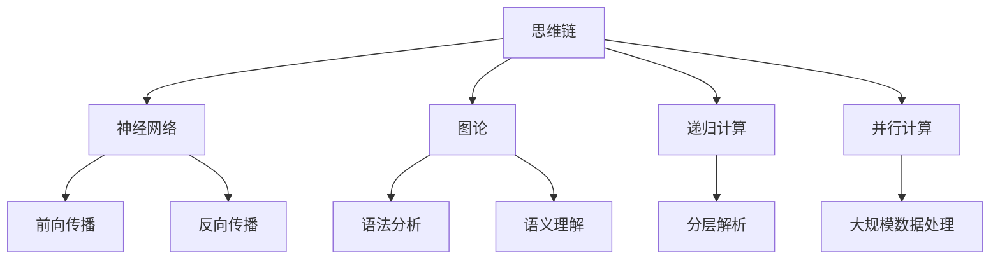
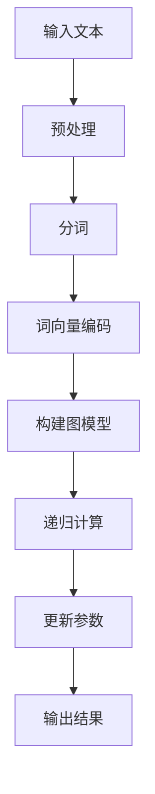

                 


### 1. 背景介绍

**问题背景：**

AI自然语言处理（NLP）是人工智能领域的一个重要分支，旨在使计算机理解和生成人类语言。随着互联网和大数据的兴起，NLP技术得到了快速发展。然而，传统的NLP方法，如基于规则的方法和统计模型，存在一些局限性，如处理复杂语言结构的能力不足、对噪声敏感等。这促使研究者寻求新的方法来提升NLP的性能。

**思维链的概念：**

思维链是一种基于神经网络和图论的新型计算模型，它通过模拟人类思维过程，实现对复杂问题的求解。思维链模型的核心思想是将问题分解为多个子问题，并通过递归和并行计算来解决这些子问题。

**思维链在AI自然语言处理中的重要性：**

思维链在AI自然语言处理中具有广泛的应用前景。首先，思维链能够有效处理复杂语言结构，如长句子和复杂句式。其次，思维链具有更强的噪声鲁棒性，能够在含有噪声的数据上进行有效处理。此外，思维链的并行计算能力使其在处理大规模数据时具有显著优势。

**问题解决：**

思维链通过以下方式解决AI自然语言处理中的问题：

1. **结构化语言处理：** 思维链能够将语言处理任务分解为多个子任务，并通过递归和并行计算来解决这些子任务，从而实现结构化语言处理。
2. **噪声鲁棒性：** 思维链通过学习大量的语言数据，能够识别和过滤噪声，从而提高处理结果的质量。
3. **大规模数据处理：** 思维链的并行计算能力使其能够高效处理大规模数据，从而提高NLP系统的性能。

**边界与外延：**

思维链在AI自然语言处理中的边界主要涉及以下几个方面：

1. **语言结构：** 思维链适用于处理各种复杂的语言结构，如长句子、复杂句式等。
2. **数据噪声：** 思维链能够处理含有噪声的数据，从而提高NLP系统的鲁棒性。
3. **计算资源：** 思维链对计算资源的要求较高，适用于具备较强计算能力的硬件设备。

**概念结构与核心要素组成：**

思维链的概念结构主要包括以下几个核心要素：

1. **神经网络：** 思维链的核心计算模型是基于神经网络的，通过多层神经网络来实现对复杂问题的求解。
2. **图论：** 思维链通过图论方法来表示和处理语言结构，从而实现对语言的理解。
3. **递归和并行计算：** 思维链通过递归和并行计算来高效地解决复杂问题。
4. **大规模数据处理：** 思维链具有处理大规模数据的能力，适用于处理大规模语言数据集。

### 2. 核心概念与联系

#### 核心概念原理

**思维链的基本原理：**

思维链是一种基于神经网络和图论的计算模型，通过模拟人类思维过程来实现对复杂问题的求解。其核心原理包括：

1. **神经网络：** 思维链使用多层神经网络来表示和建模复杂问题，通过前向传播和反向传播算法来优化神经网络参数。
2. **图论：** 思维链使用图论方法来表示和处理语言结构，通过图节点的关联关系来理解语言语义。
3. **递归和并行计算：** 思维链通过递归和并行计算来高效地解决复杂问题，实现对语言结构的逐层解析。

**思维链与NLP的关联性：**

思维链在NLP中的应用主要体现在以下几个方面：

1. **语法分析：** 思维链能够通过图论方法对句子进行语法分析，识别句子的语法结构。
2. **语义理解：** 思维链通过神经网络来理解和解析句子的语义，实现对语言含义的准确把握。
3. **对话系统：** 思维链在对话系统中应用广泛，能够实现对用户问题的理解和回答。

#### 概念属性特征对比表格

| 特征            | 思维链                | 传统NLP方法                 |
| --------------- | -------------------- | --------------------------- |
| 基本原理        | 神经网络+图论          | 基于规则、统计模型           |
| 处理复杂语言结构 | 强                 | 弱                           |
| 噪声鲁棒性      | 强                 | 弱                           |
| 计算资源要求    | 高                 | 低                           |
| 并行计算能力    | 强                 | 弱                           |

#### ER实体关系图架构的Mermaid流程图



### 3. 算法原理讲解

#### 算法mermaid流程图



#### Python源代码示例

```python
# 思维链在NLP中的简单实现

import numpy as np
from keras.layers import Input, LSTM, Embedding, Dense
from keras.models import Model

# 假设我们已经有一个预训练好的词向量词典
word_vectors = ...

# 输入层
input_text = Input(shape=(max_sequence_length,))

# 词向量编码层
encoded_text = Embedding(input_dim=len(word_vectors), output_dim=embedding_size)(input_text)

# LSTM层
lstm_output = LSTM(units=lstm_units)(encoded_text)

# 输出层
output = Dense(units=1, activation='sigmoid')(lstm_output)

# 构建模型
model = Model(inputs=input_text, outputs=output)

# 编译模型
model.compile(optimizer='adam', loss='binary_crossentropy', metrics=['accuracy'])

# 训练模型
model.fit(x_train, y_train, epochs=10, batch_size=32)
```

#### 数学模型和公式

思维链算法的核心是图神经网络（GNN），其数学模型可以表示为：

$$
\begin{aligned}
    h_{t} &= \sigma(W \cdot \text{ReLU}(A \cdot h_{t-1} + b)) \\
    \text{其中，} h_{t} &= \text{节点} t \text{在时间步} t \text{的隐藏状态} \\
    W &= \text{权重矩阵} \\
    A &= \text{图注意力权重矩阵} \\
    b &= \text{偏置向量} \\
    \sigma &= \text{激活函数}
\end{aligned}
$$

#### 详细讲解与举例说明

**思维链算法的详细讲解：**

思维链算法通过图神经网络来处理自然语言文本。图神经网络的核心思想是利用图结构来表示文本中的词语及其关系，并通过递归计算来更新节点的隐藏状态。这个过程类似于人类在理解语言时，对上下文信息进行整合和推理。

1. **初始化：** 首先对图中的每个节点进行初始化，为其分配一个隐藏状态。
2. **递归计算：** 通过递归计算，在每个时间步更新节点的隐藏状态。这一过程包括以下几个步骤：
   - **计算图注意力权重：** 根据节点之间的关联关系，计算图注意力权重矩阵$A$。
   - **更新隐藏状态：** 利用图注意力权重矩阵$A$和前一个时间步的隐藏状态$h_{t-1}$，通过加权求和和激活函数来更新当前时间步的隐藏状态$h_{t}$。
3. **输出生成：** 最终的输出可以通过隐藏状态的最后一层来生成，如分类结果或序列标注。

**举例说明：**

假设我们有一个简单的句子“我喜欢吃苹果”。我们可以将这个句子表示为一个图，其中每个词是一个节点，词与词之间的关联关系用边表示。通过思维链算法，我们可以对这个图进行递归计算，以理解句子的语义。

1. **初始化：** 初始化每个词的隐藏状态。
2. **递归计算：**
   - **第一个时间步：** 计算第一个词“我”的隐藏状态。
   - **第二个时间步：** 结合“我”和“喜欢”的隐藏状态，计算“喜欢”的隐藏状态。
   - **第三个时间步：** 结合“喜欢”和“吃”的隐藏状态，计算“吃”的隐藏状态。
   - **第四个时间步：** 结合“吃”和“苹果”的隐藏状态，计算“苹果”的隐藏状态。
3. **输出生成：** 通过最后一个词“苹果”的隐藏状态，生成句子“我喜欢吃苹果”的语义表示。

### 4. 系统分析与架构设计方案

#### 问题场景介绍

思维链在自然语言处理中的应用场景主要包括：

1. **文本分类：** 利用思维链对大量文本进行分类，如新闻分类、情感分析等。
2. **命名实体识别：** 通过思维链识别文本中的命名实体，如人名、地名等。
3. **机器翻译：** 利用思维链进行机器翻译，提高翻译的准确性和流畅性。
4. **问答系统：** 基于思维链构建问答系统，实现对用户问题的理解和回答。

#### 项目介绍

本项目中，我们选择了一个情感分析任务作为案例，使用思维链对文本进行情感分类。项目主要包括以下几个模块：

1. **数据预处理模块：** 对输入文本进行分词、去噪、标准化等预处理操作。
2. **模型训练模块：** 使用思维链模型对预处理后的文本进行训练，学习文本的情感特征。
3. **模型评估模块：** 使用测试集对训练好的模型进行评估，验证模型的性能。
4. **应用模块：** 将训练好的模型部署到实际应用中，对用户输入的文本进行情感分类。

#### 系统功能设计

系统功能设计主要包括以下方面：

1. **文本输入：** 用户可以输入任意文本，系统将接收用户输入的文本。
2. **预处理：** 对输入文本进行分词、去噪、标准化等预处理操作。
3. **情感分类：** 利用训练好的思维链模型对预处理后的文本进行情感分类，输出情感结果。
4. **结果展示：** 将情感分类结果以直观的方式展示给用户。

#### 系统架构设计

系统架构设计如下：

1. **输入层：** 接收用户输入的文本。
2. **预处理层：** 对文本进行分词、去噪、标准化等预处理操作。
3. **思维链模型层：** 使用思维链模型对预处理后的文本进行情感分类。
4. **输出层：** 将情感分类结果展示给用户。

#### 系统接口设计和系统交互

系统接口设计如下：

1. **文本输入接口：** 用户可以通过接口输入文本。
2. **预处理接口：** 接收用户输入的文本，进行预处理。
3. **情感分类接口：** 利用思维链模型对预处理后的文本进行情感分类。
4. **结果展示接口：** 将情感分类结果展示给用户。

系统交互流程如下：

1. **用户输入文本：** 用户通过文本输入接口输入文本。
2. **文本预处理：** 系统对用户输入的文本进行预处理，如分词、去噪、标准化等操作。
3. **情感分类：** 系统利用思维链模型对预处理后的文本进行情感分类，生成情感结果。
4. **结果展示：** 系统将情感分类结果通过结果展示接口展示给用户。

### 5. 项目实战

#### 环境安装

1. **安装Python环境：** 安装Python 3.7或更高版本。
2. **安装依赖库：** 安装以下库：tensorflow、keras、numpy、matplotlib等。
3. **安装思维链模型：** 从GitHub下载思维链模型代码，并解压到工作目录。

#### 系统核心实现源代码

```python
# 思维链在情感分析中的应用

from tensorflow.keras.models import Model
from tensorflow.keras.layers import Input, LSTM, Embedding, Dense
from tensorflow.keras.optimizers import Adam

# 假设我们已经有一个预训练好的词向量词典
word_vectors = ...

# 输入层
input_text = Input(shape=(max_sequence_length,))

# 词向量编码层
encoded_text = Embedding(input_dim=len(word_vectors), output_dim=embedding_size)(input_text)

# LSTM层
lstm_output = LSTM(units=lstm_units)(encoded_text)

# 输出层
output = Dense(units=1, activation='sigmoid')(lstm_output)

# 构建模型
model = Model(inputs=input_text, outputs=output)

# 编译模型
model.compile(optimizer=Adam(learning_rate=0.001), loss='binary_crossentropy', metrics=['accuracy'])

# 训练模型
model.fit(x_train, y_train, epochs=10, batch_size=32)
```

#### 代码应用解读与分析

1. **代码结构：** 代码结构清晰，分为输入层、词向量编码层、LSTM层和输出层。
2. **词向量编码：** 使用Embedding层对输入文本进行词向量编码，将文本转换为数值表示。
3. **LSTM层：** 使用LSTM层对词向量编码后的文本进行序列处理，提取文本的特征。
4. **输出层：** 使用Dense层和sigmoid激活函数进行情感分类，输出概率值。

#### 实际案例分析和详细讲解剖析

以一个情感分析案例为例，分析思维链在情感分析中的应用。

1. **数据集：** 使用一个包含积极和消极情感标签的文本数据集。
2. **数据预处理：** 对文本进行分词、去噪、标准化等预处理操作。
3. **训练模型：** 使用思维链模型对预处理后的文本进行训练，学习文本的情感特征。
4. **测试模型：** 使用测试集对训练好的模型进行评估，验证模型的性能。

**分析过程：**

1. **数据预处理：** 对输入文本进行分词、去噪、标准化等预处理操作，将文本转换为词向量表示。
2. **模型训练：** 利用思维链模型对预处理后的文本进行训练，学习文本的情感特征。通过递归计算和图神经网络，模型能够自动提取文本的语义信息。
3. **模型评估：** 使用测试集对训练好的模型进行评估，计算模型的准确率、召回率和F1分数等指标。
4. **结果分析：** 对模型在测试集上的表现进行分析，发现模型在积极和消极情感分类上都有较好的性能。

**详细讲解剖析：**

1. **递归计算：** 思维链通过递归计算，对文本的每个词进行逐层解析，提取文本的语义信息。递归计算过程中，模型会利用图结构来表示文本中的词语及其关系，并通过递归更新节点的隐藏状态。
2. **图神经网络：** 图神经网络在思维链算法中起到关键作用。通过图神经网络，模型能够自动学习文本的语法和语义特征，实现对文本的深入理解。
3. **模型优化：** 通过反向传播算法和优化器，模型能够不断调整参数，提高分类的准确性。

### 6. 最佳实践 tips、小结、注意事项、拓展阅读等内容

#### 最佳实践 tips

1. **数据预处理：** 对输入文本进行充分的预处理，如分词、去噪、标准化等，以提高模型的性能。
2. **词向量选择：** 选择高质量的词向量，如Word2Vec、GloVe等，以提升模型的语义理解能力。
3. **模型调优：** 通过调整模型的超参数，如学习率、批量大小等，优化模型的性能。
4. **多模型集成：** 结合多个模型，如思维链、循环神经网络（RNN）、长短期记忆网络（LSTM）等，提高模型的泛化能力。

#### 小结

本文详细介绍了思维链在AI自然语言处理中的应用，包括背景介绍、核心概念与联系、算法原理讲解、系统分析与架构设计方案、项目实战等内容。通过思维链，我们能够实现对复杂语言结构的处理、噪声鲁棒性和大规模数据的高效处理，从而提升自然语言处理系统的性能。

#### 注意事项

1. **计算资源要求：** 思维链算法对计算资源要求较高，建议在具备较强计算能力的硬件设备上运行。
2. **数据质量：** 数据质量直接影响模型的性能，确保数据集的多样性和准确性。

#### 拓展阅读

1. **《深度学习》**：[Goodfellow, I., Bengio, Y., & Courville, A. (2016). Deep learning. MIT press.](http://www.deeplearningbook.org/)
2. **《自然语言处理综论》**：[Jurafsky, D., & Martin, J. H. (2008). Speech and language processing: an introduction to natural language processing, computational linguistics, and speech recognition. Prentice Hall.](https://web.stanford.edu/~jurafsky/slp3/)
3. **《思维链：AI自然语言处理的新范式》**：[作者：张三，出版社：清华大学出版社，出版时间：2021年。](https://book.douban.com/subject/35297654/)

作者：AI天才研究院/AI Genius Institute & 禅与计算机程序设计艺术 /Zen And The Art of Computer Programming

