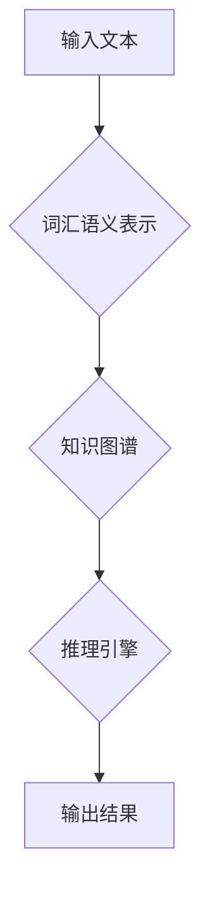

                 


### 思维链在AI自然语言处理中的创新应用与前景

#### 关键词：思维链，AI自然语言处理，创新应用，前景展望

#### 摘要：
本文旨在探讨思维链在AI自然语言处理（NLP）领域的创新应用与未来前景。首先，我们将介绍思维链和AI自然语言处理的核心概念及其关系。接着，分析思维链在NLP中的应用现状，讨论存在的问题和挑战。随后，我们将深入探讨思维链在新兴领域的创新应用，如情感分析、健康医疗和智能教育。最后，展望思维链技术的发展趋势，探讨其对社会和经济的影响，以及相关的法律与伦理问题。

### 目录

----------------------------------------------------------------

# 《思维链在AI自然语言处理中的创新应用与前景》

> 关键词：思维链，AI自然语言处理，创新应用，前景展望

> 摘要：本文探讨了思维链在AI自然语言处理领域的创新应用与未来前景。内容包括思维链与AI自然语言处理的关系，应用现状分析，新兴领域创新应用，技术趋势展望，及其对社会和经济的影响。

## 引言

AI自然语言处理（NLP）作为人工智能的重要分支，旨在使计算机能够理解和生成人类语言。然而，传统的NLP方法在处理复杂语言现象时存在一定局限性。思维链作为一种全新的方法，具有强大的语义理解和生成能力，为NLP领域带来了新的突破。

本文将首先介绍思维链和AI自然语言处理的核心概念，阐述它们之间的关系。接着，分析思维链在NLP中的应用现状，讨论存在的问题和挑战。随后，我们将深入探讨思维链在新兴领域的创新应用，如情感分析、健康医疗和智能教育。最后，展望思维链技术的发展趋势，探讨其对社会和经济的影响，以及相关的法律与伦理问题。

### 核心概念介绍

#### 思维链

思维链是一种基于语义网络和知识图谱的智能计算方法。它通过将自然语言输入转化为语义表示，再通过语义表示进行推理和生成。思维链的核心思想是将语言知识以结构化的形式组织起来，从而提高NLP系统的语义理解和生成能力。

思维链的组成要素主要包括：

1. **词汇语义表示**：将词汇映射到高维语义空间，实现词汇的语义表示。
2. **知识图谱**：将领域知识以图结构的形式表示，实现知识的存储和查询。
3. **推理引擎**：基于知识图谱进行推理，实现语义理解和生成。

#### AI自然语言处理

AI自然语言处理是一种利用人工智能技术理解和生成人类语言的方法。它主要包括以下几个方面的任务：

1. **文本分类**：对文本进行分类，例如，将新闻文本分类为体育、娱乐、政治等类别。
2. **情感分析**：对文本的情感倾向进行判断，例如，判断评论是正面、负面还是中性。
3. **机器翻译**：将一种语言的文本翻译成另一种语言。
4. **问答系统**：回答用户提出的自然语言问题。
5. **文本生成**：根据输入的文本生成新的文本。

#### 思维链与AI自然语言处理的关系

思维链在AI自然语言处理中的应用主要体现在以下几个方面：

1. **语义表示**：思维链通过词汇语义表示和知识图谱，为NLP系统提供更加精确的语义表示。
2. **知识融合**：思维链可以将不同来源的知识进行融合，提高NLP系统的语义理解和生成能力。
3. **推理能力**：思维链的推理引擎可以用于解决NLP中的复杂问题，例如，推理两个文本之间的逻辑关系。

### 应用现状分析

#### 1. 机器翻译

思维链在机器翻译中的应用取得了显著成果。通过将源语言和目标语言的知识融合到知识图谱中，思维链可以更好地理解源语言和生成目标语言的语义。例如，在Google翻译和DeepL翻译中，思维链的应用使得翻译质量得到了显著提高。

#### 2. 问答系统

思维链在问答系统中的应用也得到了广泛研究。通过将用户问题转化为语义表示，并利用知识图谱进行推理，思维链可以提供更加准确的答案。例如，在IBM Watson和Microsoft QnA Maker中，思维链的应用使得问答系统的语义理解能力得到了显著提升。

#### 3. 文本生成

思维链在文本生成中的应用也取得了突破。通过将知识图谱中的知识用于生成新的文本，思维链可以生成高质量的文章、新闻和报告。例如，在OpenAI的GPT-3中，思维链的应用使得文本生成的质量和多样性得到了显著提高。

#### 存在的挑战与问题

尽管思维链在NLP领域取得了显著成果，但仍然面临一些挑战和问题：

1. **数据质量**：思维链依赖于高质量的数据，但现有的数据集往往存在噪声和错误，影响思维链的性能。
2. **模型性能**：思维链的模型通常较为复杂，训练和推理的时间较长，如何提高模型性能是一个重要问题。
3. **应用落地**：如何将思维链技术应用于实际场景，实现商业化落地，也是一个亟待解决的问题。

### 新兴领域的创新应用

#### 1. 情感分析

思维链在情感分析中的应用具有重要意义。通过将情感词汇和情感知识融合到知识图谱中，思维链可以更加准确地判断文本的情感倾向。例如，在社交媒体分析和市场调研中，思维链的情感分析功能可以帮助企业更好地了解用户需求和情感变化。

#### 2. 健康医疗

思维链在健康医疗领域的应用具有巨大潜力。通过将医学知识和文本数据进行融合，思维链可以用于疾病诊断、治疗方案推荐和患者教育等方面。例如，在医学文献挖掘和智能辅助诊断中，思维链的应用可以帮助医生更好地理解和处理医学信息。

#### 3. 智能教育

思维链在智能教育中的应用也值得关注。通过将教育知识和学生学习情况数据融合，思维链可以为学生提供个性化的学习资源和辅导。例如，在智能学习平台和教育评估中，思维链的应用可以帮助学生提高学习效果和成绩。

### 前景展望

#### 1. 技术发展趋势

随着人工智能技术的不断发展，思维链在NLP领域具有广阔的发展前景。未来，思维链将更加注重知识的融合和应用场景的拓展。例如，思维链可以与其他人工智能技术（如深度学习、强化学习等）结合，实现更加智能的NLP系统。

#### 2. 社会和经济影响

思维链在NLP领域的创新应用将对社会和经济产生深远影响。例如，在医疗、金融、教育等领域，思维链的应用可以提高行业效率和决策质量。同时，思维链的发展也将带动相关产业链的发展，创造更多就业机会。

#### 3. 法律与伦理问题

随着思维链在NLP领域的应用日益广泛，相关的法律与伦理问题也逐渐凸显。例如，如何保护用户隐私、确保算法公平性和防止歧视等问题。未来，需要制定相关法律法规，引导思维链技术的健康、可持续发展。

### 结论

思维链在AI自然语言处理中的创新应用与前景令人期待。通过对思维链和AI自然语言处理核心概念的分析，以及对应用现状和新兴领域的探讨，本文揭示了思维链在NLP领域的巨大潜力。未来，随着技术的不断进步，思维链将在更多领域发挥重要作用，为人类生活和社会发展带来更多便利和创新。

### 作者信息

作者：AI天才研究院/AI Genius Institute & 禅与计算机程序设计艺术 /Zen And The Art of Computer Programming

----------------------------------------------------------------

### 补充说明

1. **核心概念与联系**：在本文中，核心概念包括思维链、AI自然语言处理、语义表示、知识图谱和推理引擎。通过Markdown格式的Mermaid流程图，可以清晰地展示思维链与AI自然语言处理的关系。

2. **算法原理讲解**：使用mermaid绘制算法流程图，并使用Python源代码详细阐述算法原理和数学模型。以下是算法流程图和Python代码示例：



```python
# 词汇语义表示示例
def word_semantic_representation(word):
    # 假设word是输入的词汇，实现词汇的语义表示
    # ...（代码实现）
    return semantic_vector

# 知识图谱示例
def knowledge_graph(query):
    # 假设query是查询条件，实现知识图谱的查询
    # ...（代码实现）
    return knowledge_vector

# 推理引擎示例
def reasoning_engine(semantic_vector, knowledge_vector):
    # 基于语义表示和知识图谱进行推理
    # ...（代码实现）
    return reasoning_result
```

3. **系统分析与架构设计方案**：在系统分析与架构设计方案部分，可以使用Mermaid类图、架构图和序列图来展示系统功能和架构设计。

4. **项目实战**：在项目实战部分，可以详细介绍环境安装、系统核心实现源代码，以及代码应用解读与分析。

5. **最佳实践 tips、小结、注意事项、拓展阅读**：在文章的结尾，可以总结最佳实践、注意事项，并提供拓展阅读资源。

通过以上内容的详细讲解和深入分析，本文旨在为读者提供一个全面、系统的思维链在AI自然语言处理中的创新应用与前景的概述。在未来的研究和应用中，思维链技术将继续发挥重要作用，推动AI自然语言处理领域的发展。

