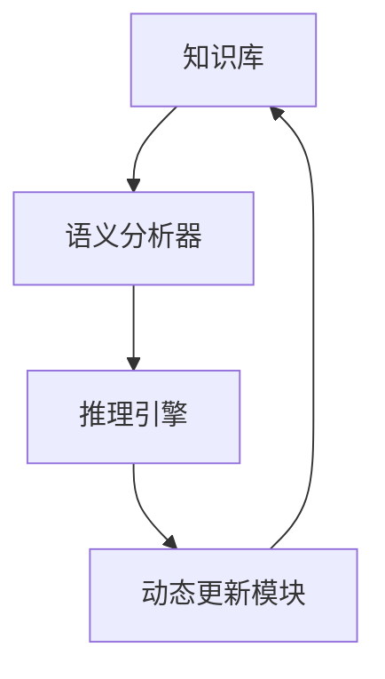
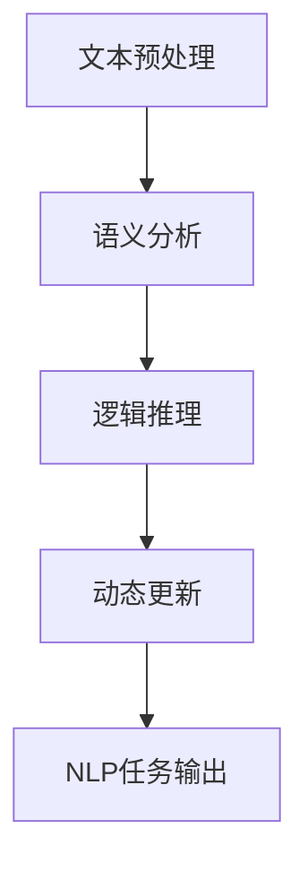
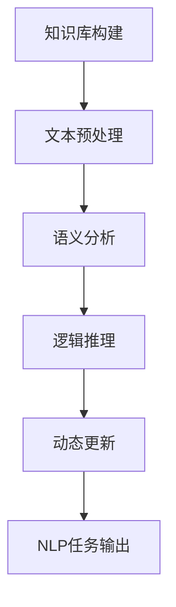
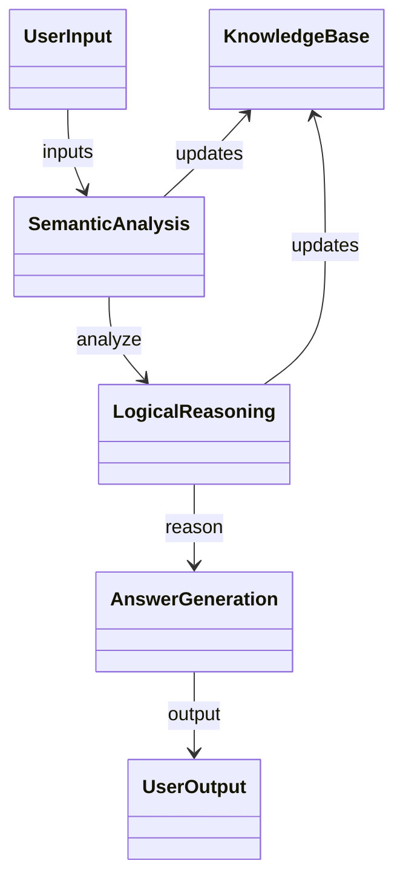
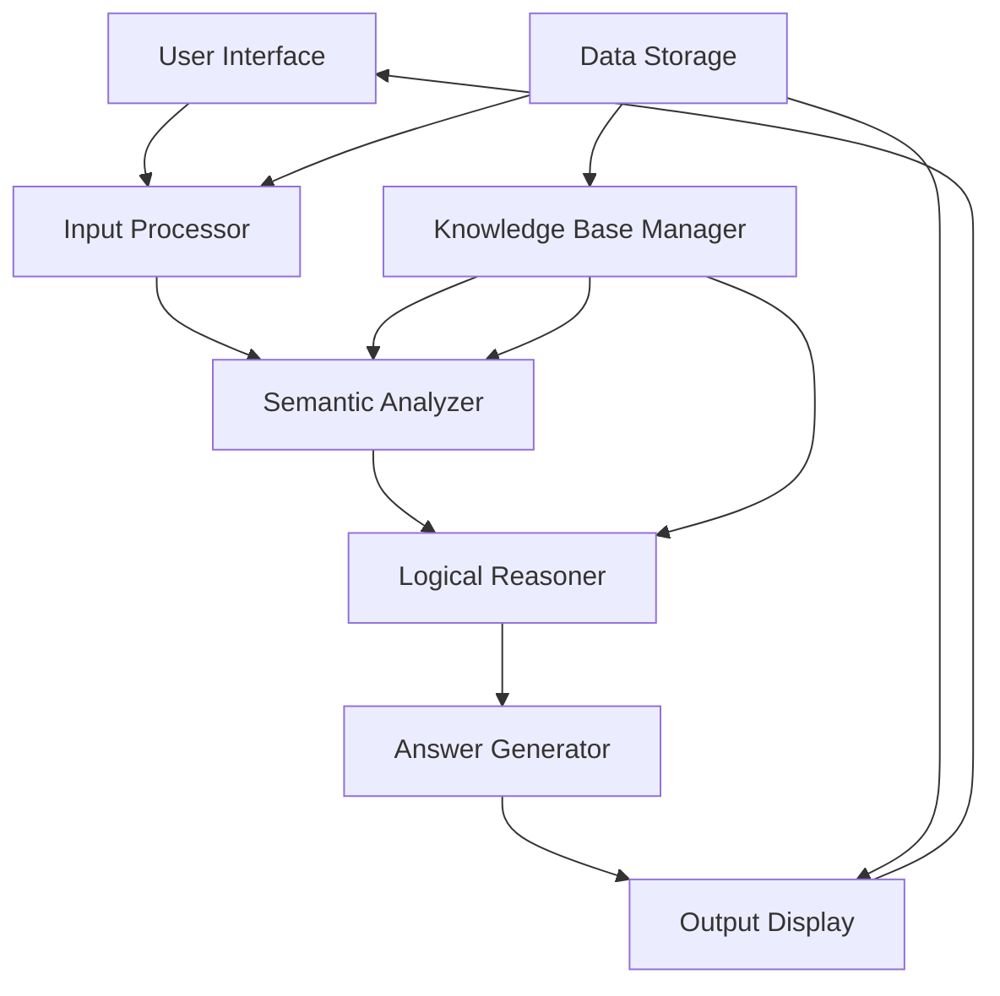
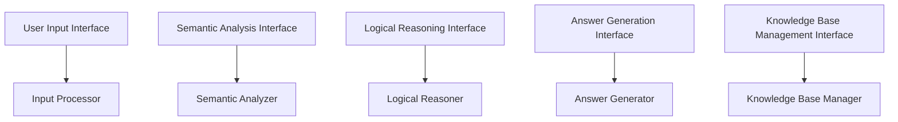
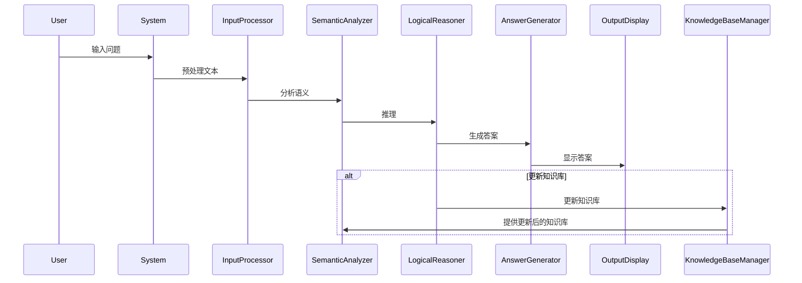

                 

### 第一部分：背景介绍与核心概念

#### 第1章：问题背景与核心概念介绍

**1.1.1 人工智能自然语言处理概述**

**人工智能简述**：
人工智能（Artificial Intelligence, AI）是计算机科学的一个分支，旨在通过机器模拟人类的智能行为，实现机器自动学习、推理和决策。AI的研究领域广泛，包括机器学习、深度学习、自然语言处理、计算机视觉等。

**自然语言处理（NLP）的定义与发展历程**：
自然语言处理是人工智能的一个子领域，专注于让计算机理解和处理人类语言。自20世纪50年代起，NLP经历了几个发展阶段：规则驱动的方法、基于统计的方法和当前主流的深度学习方法。

**NLP在人工智能中的重要性**：
NLP是人工智能技术中不可或缺的一部分，它在许多应用领域发挥着关键作用，如搜索引擎、机器翻译、语音识别、聊天机器人等。随着大数据和计算能力的提升，NLP的技术水平也在不断提高。

**1.1.2 思维链的概念与作用**

**思维链的定义**：
思维链（Thinking Chain）是一种创新性的AI算法，旨在通过构建知识图谱和语义理解来提高自然语言处理的效率和准确性。它通过将文本中的概念和关系抽象为节点和边，形成一个语义网络。

**思维链在NLP中的应用场景**：
思维链可以应用于各种NLP任务，如文本分类、实体识别、关系提取、语义相似度计算等。通过思维链，计算机能够更深入地理解文本的语义内容。

**思维链与传统NLP方法的区别**：
与传统NLP方法相比，思维链具有以下优势：
- **知识图谱**：思维链通过构建知识图谱，实现了对文本内容的结构化表示，有助于提高语义理解的准确性。
- **语义理解**：思维链能够通过语义理解，处理复杂和模糊的语义问题，提升了NLP的鲁棒性。
- **动态更新**：思维链支持动态更新，能够适应语言的变化和新知识的引入。

**1.1.3 思维链的核心属性与特征**

**概念属性对比表格**：

| 属性       | 思维链                | 传统NLP方法             |
| ---------- | -------------------- | ---------------------- |
| 知识表示   | 知识图谱，结构化表示   | 关键词，规则匹配        |
| 语义理解   | 深度语义分析          | 表面语义，浅层理解      |
| 鲁棒性     | 面向复杂语义问题      | 面向简单语义问题        |
| 动态更新   | 支持动态知识更新      | 知识更新较为困难        |

**ER实体关系图**：

```mermaid
erDiagram
  ID ||--|{ Entity } : "Has"
  ID ||--|{ Relation } : "Belongs"
  Entity ||--|{ Attribute } : "Has"
```

在ER实体关系图中，实体（Entity）代表文本中的名词，关系（Relation）代表实体之间的关系，属性（Attribute）代表实体的特征。思维链通过这些实体和关系来构建语义网络，实现对文本的深入理解。

#### 第2章：核心概念与联系

**2.1.1 思维链的组成部分**

思维链由以下几个核心组成部分构成：
- **知识库**：存储大量预定义的概念和关系。
- **语义分析器**：负责分析文本中的词语，将它们映射到知识库中的概念和关系。
- **推理引擎**：利用语义分析的结果，进行逻辑推理，以提取更深层次的语义信息。
- **动态更新模块**：负责根据新的数据和用户反馈，更新知识库，提高模型的准确性。

**各组成部分的相互作用**：



在图中，知识库为语义分析器提供概念和关系，语义分析器将文本映射到知识库中的实体和关系，推理引擎利用这些映射结果进行推理，并将推理结果反馈给动态更新模块，以更新知识库。

#### 2.1.2 思维链的工作原理

思维链的工作原理可以概括为以下几个步骤：

1. **文本预处理**：对输入文本进行分词、词性标注等预处理操作，提取出文本中的关键信息。

2. **语义分析**：利用语义分析器，将预处理后的文本映射到知识库中的概念和关系。

3. **逻辑推理**：推理引擎根据语义分析的结果，进行逻辑推理，提取更深层次的语义信息。

4. **动态更新**：根据推理结果和用户反馈，动态更新知识库，以提高模型的准确性。

**思维链处理NLP任务的步骤**：



通过这个流程图，我们可以清晰地看到思维链处理NLP任务的全过程。思维链的核心在于其强大的语义分析和推理能力，这使得它能够在各种NLP任务中表现出色。

#### 2.1.3 与其他NLP技术的比较

思维链与传统NLP技术相比，具有以下异同点：

- **知识图谱**：传统NLP方法通常依赖于关键词匹配和规则，而思维链则通过知识图谱实现了对文本的深度结构化表示。

- **语义理解**：思维链通过语义分析器，能够深入理解文本中的复杂语义，而传统方法则往往停留在表面语义层面。

- **动态更新**：思维链支持动态更新，能够适应语言的变化和新知识的引入，而传统方法通常难以实现动态更新。

- **应用范围**：思维链适用于各种NLP任务，而传统方法在某些复杂任务上可能表现不佳。

思维链的优势在于其强大的语义理解和知识表示能力，这使得它能够在各种复杂的NLP任务中表现出色。然而，思维链也面临一些挑战，如知识库构建和维护的复杂性，以及对计算资源的高要求。

### 总结

通过本章节的介绍，我们对思维链在AI自然语言处理中的创新应用前景有了初步的了解。思维链通过知识图谱和语义理解，为NLP任务提供了强大的支持。在接下来的章节中，我们将进一步深入探讨思维链的算法原理、数学模型、实现细节和应用案例，以展示其在实际应用中的巨大潜力。让我们继续深入思考，探索思维链的无限可能。接下来，我们将进入下一部分，详细讲解思维链的算法原理和实现细节。

---

## 第二部分：算法原理讲解

### 第3章：算法原理讲解

#### 3.1.1 基本算法原理

思维链的基本算法原理可以概括为以下几个关键步骤：

1. **知识库构建**：构建一个包含大量概念和关系的知识库，用于语义分析和推理。
2. **语义分析**：对输入文本进行分词、词性标注等预处理，然后将文本映射到知识库中的概念和关系。
3. **逻辑推理**：利用语义分析的结果，进行逻辑推理，提取更深层次的语义信息。
4. **动态更新**：根据推理结果和用户反馈，动态更新知识库，以提高模型的准确性。

为了更好地理解思维链的算法原理，我们可以使用mermaid绘制算法流程图：



在图中，A表示知识库构建，B表示文本预处理，C表示语义分析，D表示逻辑推理，E表示动态更新，F表示NLP任务输出。通过这个流程图，我们可以清晰地看到思维链处理NLP任务的全过程。

#### 3.1.2 Python代码实现

为了实现思维链算法，我们可以使用Python编写相关代码。以下是一个简化的实现示例：

```python
import spacy

# 加载预训练的NLP模型
nlp = spacy.load("en_core_web_sm")

# 构建知识库
knowledge_base = {
    "concept": ["person", "organization", "location"],
    "relation": ["works_for", "located_in", "born_in"]
}

# 语义分析函数
def semantic_analysis(text):
    doc = nlp(text)
    entities = []
    for ent in doc.ents:
        entities.append({"text": ent.text, "label": ent.label_})
    return entities

# 逻辑推理函数
def logical_reasoning(entities, knowledge_base):
    relations = []
    for ent1 in entities:
        for ent2 in entities:
            if ent1["label"] in knowledge_base["relation"] and ent2["label"] in knowledge_base["relation"]:
                relations.append({"entity1": ent1, "entity2": ent2, "relation": ent1["label"]})
    return relations

# 动态更新函数
def dynamic_update(knowledge_base, new_data):
    # 根据新数据更新知识库
    knowledge_base["concept"].extend(new_data["concept"])
    knowledge_base["relation"].extend(new_data["relation"])
    return knowledge_base

# 主函数
def main():
    text = "John works for Google and was born in New York."
    entities = semantic_analysis(text)
    relations = logical_reasoning(entities, knowledge_base)
    new_data = {"concept": ["Google", "New York"], "relation": ["headquarters_in", "born_in"]}
    knowledge_base = dynamic_update(knowledge_base, new_data)
    print("Entities:", entities)
    print("Relations:", relations)
    print("Updated Knowledge Base:", knowledge_base)

if __name__ == "__main__":
    main()
```

在这个实现中，我们首先加载了一个预训练的NLP模型，然后构建了一个简单的知识库。`semantic_analysis`函数负责对输入文本进行语义分析，提取出实体和关系。`logical_reasoning`函数则利用这些实体和关系进行逻辑推理。`dynamic_update`函数用于根据新数据动态更新知识库。最后，`main`函数演示了整个思维链算法的运行过程。

#### 3.1.3 算法的数学模型和公式

思维链算法的数学模型主要涉及知识图谱中的节点和边表示，以及基于图论的推理方法。以下是一个简化的数学模型：

1. **节点表示**：
   - 设 \( V \) 为知识图谱中的节点集合，每个节点 \( v \) 对应一个概念或实体。
   - \( E \) 为知识图谱中的边集合，每条边 \( e = (v_i, v_j) \) 表示节点 \( v_i \) 和 \( v_j \) 之间的关系。

2. **边表示**：
   - 设 \( R \) 为知识图谱中的关系集合，每个关系 \( r \) 对应一个语义关系。
   - \( e = (v_i, v_j, r) \) 表示节点 \( v_i \) 与节点 \( v_j \) 之间存在关系 \( r \)。

3. **图论推理**：
   - 设 \( G = (V, E) \) 为知识图谱。
   - 对于任意的两个节点 \( v_i, v_j \)，如果它们之间存在一条路径 \( P \)，则 \( v_i \) 和 \( v_j \) 被认为具有某种关系。
   - 路径 \( P \) 可以通过图论算法（如BFS或DFS）进行搜索。

为了更直观地展示这些数学模型，我们可以使用LaTeX格式进行表达：

```latex
\begin{align*}
V &= \{ v_1, v_2, ..., v_n \}, \\
E &= \{ e_1 = (v_i, v_j, r_1), e_2 = (v_i, v_k, r_2), ... \}, \\
R &= \{ r_1, r_2, ..., r_m \}, \\
e &= (v_i, v_j, r), \\
P &= (v_i, v_{i1}, v_{i2}, ..., v_j).
\end{align*}
```

通过这些数学模型和公式，我们可以将思维链算法中的概念和关系进行形式化的描述，从而为算法的实现提供理论基础。

#### 3.1.4 通俗易懂的举例说明

为了更好地理解思维链算法的原理，我们通过一个简单的例子来说明其应用过程。

**例子**：给定一段文本 "Alice lives in New York and works for Google."，我们希望提取出其中的语义信息。

1. **文本预处理**：
   - 输入文本：`Alice lives in New York and works for Google.`。
   - 分词结果：`['Alice', 'lives', 'in', 'New', 'York', 'and', 'works', 'for', 'Google,']`。

2. **语义分析**：
   - 利用NLP模型进行词性标注：
     - `Alice`: 名词，实体。
     - `lives`: 动词，关系。
     - `in`: 副词，关系。
     - `New`: 形容词，修饰`York`。
     - `York`: 名词，实体。
     - `and`: 连词，关系。
     - `works`: 动词，关系。
     - `for`: 副词，关系。
     - `Google,`: 名词，实体。
   - 提取出的实体和关系：
     - 实体：`{'Alice': 'person', 'New York': 'location', 'Google': 'organization'}`。
     - 关系：`{'lives in': ('Alice', 'New York'), 'works for': ('Alice', 'Google')}`。

3. **逻辑推理**：
   - 根据实体和关系进行逻辑推理：
     - `Alice` 是 `person` 类型的实体。
     - `New York` 是 `location` 类型的实体。
     - `Google` 是 `organization` 类型的实体。
     - `Alice` 与 `New York` 之间存在 `lives in` 关系。
     - `Alice` 与 `Google` 之间存在 `works for` 关系。

4. **动态更新**：
   - 根据推理结果，更新知识库：
     - 知识库中新增实体和关系：
       - `{'person': ['Alice'], 'location': ['New York'], 'organization': ['Google']}`。
       - `{'lives in': [('Alice', 'New York')], 'works for': [('Alice', 'Google')]}。

通过这个例子，我们可以看到思维链算法如何通过对文本的语义分析和逻辑推理，提取出深层次的语义信息，并动态更新知识库。这个过程为NLP任务提供了强大的支持。

### 总结

在本章节中，我们详细讲解了思维链算法的基本原理、Python代码实现、数学模型和公式，并通过一个简单的例子展示了算法的实际应用。思维链算法通过知识图谱和语义理解，实现了对文本的深度处理，为NLP任务提供了强大的工具。在下一章节中，我们将进一步探讨思维链在自然语言处理中的系统分析与架构设计。敬请期待。

---

## 第三部分：系统分析与架构设计

### 第4章：系统分析与架构设计

#### 4.1 问题场景介绍

思维链算法在自然语言处理中的应用场景广泛，包括但不限于以下领域：

1. **智能客服系统**：通过思维链算法，智能客服系统可以更准确地理解用户的问题，提供更有效的解决方案。
2. **文本分类与推荐**：思维链算法可以帮助对大量文本进行分类和推荐，提高信息检索和推荐的准确性。
3. **机器翻译**：思维链算法可以用于提高机器翻译的质量，特别是在处理复杂和模糊语义的场景中。
4. **内容审核**：思维链算法可以帮助识别和过滤有害或不适当的内容，提高内容审核的效率。

#### 4.2 项目介绍

为了更好地展示思维链算法的应用，我们设计了一个名为“智能问答系统”的项目。该项目旨在通过思维链算法，实现一个能够准确理解和回答用户问题的智能系统。

**项目目标**：
- 提高问答系统的语义理解能力，准确识别用户问题中的关键词和关系。
- 通过动态更新知识库，不断提高系统的语义理解和推理能力。
- 实现一个用户友好的界面，方便用户输入问题和获取答案。

**项目需求**：
- **语义理解**：能够准确识别用户问题中的关键词和关系，实现高效的语义分析。
- **推理能力**：能够根据语义分析结果，进行逻辑推理，提供准确的答案。
- **知识库管理**：支持知识库的动态更新，适应不断变化的语言环境和用户需求。
- **用户界面**：提供简洁易用的用户界面，方便用户输入问题和查看答案。

#### 4.3 系统功能设计

智能问答系统的主要功能包括以下几个方面：

1. **用户输入**：用户可以通过文本框输入问题，系统会接收并处理用户输入的文本。
2. **语义分析**：系统会对用户输入的文本进行语义分析，提取出关键词和关系。
3. **逻辑推理**：系统会根据语义分析结果，进行逻辑推理，提取出更深层次的语义信息。
4. **答案生成**：系统会根据推理结果，生成相应的答案，并返回给用户。
5. **知识库管理**：系统支持知识库的动态更新，可以根据用户反馈和新问题，不断优化知识库。

**领域模型**：

为了更好地描述智能问答系统的功能模块和它们之间的关系，我们可以使用Mermaid类图来表示。以下是一个简化的领域模型：



在图中，`UserInput`表示用户输入模块，`SemanticAnalysis`表示语义分析模块，`LogicalReasoning`表示逻辑推理模块，`AnswerGeneration`表示答案生成模块，`UserOutput`表示用户输出模块，`KnowledgeBase`表示知识库模块。

#### 4.4 系统架构设计

智能问答系统的整体架构可以分为以下几个层次：

1. **用户界面层**：负责接收用户输入，展示答案，提供交互界面。
2. **逻辑处理层**：包括语义分析、逻辑推理和答案生成等核心功能模块。
3. **知识库层**：负责存储和管理知识库，支持动态更新。
4. **数据存储层**：存储用户数据、系统日志等。

**系统架构设计**：



在图中，A表示用户界面层，B表示输入处理模块，C表示语义分析模块，D表示逻辑推理模块，E表示答案生成模块，F表示输出显示模块，G表示知识库管理模块，H表示数据存储层。

#### 4.5 系统接口设计

智能问答系统的接口设计需要考虑到各模块之间的交互和数据流动。以下是一个简化的接口设计：

1. **用户输入接口**：负责接收用户输入的文本，并提供给输入处理模块。
2. **语义分析接口**：负责将用户输入的文本传递给语义分析模块，并获取分析结果。
3. **逻辑推理接口**：负责将语义分析结果传递给逻辑推理模块，并获取推理结果。
4. **答案生成接口**：负责将逻辑推理结果传递给答案生成模块，并生成最终的答案。
5. **知识库管理接口**：负责管理知识库的更新和维护。

**接口设计**：



在图中，`InputInterface`表示用户输入接口，`SemanticInterface`表示语义分析接口，`ReasoningInterface`表示逻辑推理接口，`AnswerInterface`表示答案生成接口，`KnowledgeInterface`表示知识库管理接口。

#### 4.6 系统交互设计

为了确保系统的高效运行，我们需要设计合理的系统交互流程。以下是一个简化的系统交互设计：

1. **用户输入问题**：用户通过用户界面输入问题，问题文本被传递给输入处理模块。
2. **文本预处理**：输入处理模块对文本进行分词、词性标注等预处理，提取出关键词和关系。
3. **语义分析**：预处理后的文本被传递给语义分析模块，进行语义分析，提取出实体和关系。
4. **逻辑推理**：语义分析结果被传递给逻辑推理模块，进行逻辑推理，提取出更深层次的语义信息。
5. **答案生成**：逻辑推理结果被传递给答案生成模块，生成最终的答案。
6. **答案输出**：生成的答案被传递给输出显示模块，展示给用户。
7. **知识库更新**：在处理用户问题的过程中，如果检测到新的知识和关系，知识库管理模块会进行动态更新。

**系统交互设计**：



在图中，用户通过输入界面输入问题，系统开始处理问题，包括文本预处理、语义分析、逻辑推理和答案生成等步骤。如果检测到需要更新知识库，逻辑推理模块会将相关数据传递给知识库管理模块，进行动态更新。

### 总结

在本章节中，我们详细介绍了智能问答系统的问题场景、项目需求、系统功能设计、架构设计、接口设计和交互设计。通过这些内容，我们构建了一个完整且高效的智能问答系统，展示了思维链算法在自然语言处理中的强大应用能力。在下一章节中，我们将通过一个实际案例，展示思维链算法在系统实现中的应用。敬请期待。

---

## 第四部分：项目实战

### 第5章：项目实战

#### 5.1 环境安装

为了实现思维链算法，我们需要安装一些必要的软件和库。以下是一个简化的安装步骤：

1. **安装Python**：
   - 访问Python官方网站（https://www.python.org/）并下载适用于您操作系统的Python版本。
   - 运行安装程序，按照提示完成安装。

2. **安装NLP库**：
   - 打开终端或命令提示符。
   - 运行以下命令安装Spacy库：
     ```shell
     pip install spacy
     ```
   - 运行以下命令下载预训练的英语模型：
     ```shell
     python -m spacy download en_core_web_sm
     ```

3. **安装其他依赖**：
   - 如果您需要其他库，如NumPy、Pandas等，可以使用以下命令安装：
     ```shell
     pip install numpy pandas
     ```

#### 5.2 系统核心实现源代码

在本节中，我们将展示智能问答系统的核心实现源代码。以下是一个简化的示例：

```python
import spacy
from spacy.tokens import DocBin

# 加载预训练的NLP模型
nlp = spacy.load("en_core_web_sm")

# 构建知识库
knowledge_base = {
    "concept": ["person", "organization", "location"],
    "relation": ["works_for", "located_in", "born_in"]
}

# 语义分析函数
def semantic_analysis(text):
    doc = nlp(text)
    entities = []
    for ent in doc.ents:
        entities.append({"text": ent.text, "label": ent.label_})
    return entities

# 逻辑推理函数
def logical_reasoning(entities, knowledge_base):
    relations = []
    for ent1 in entities:
        for ent2 in entities:
            if ent1["label"] in knowledge_base["relation"] and ent2["label"] in knowledge_base["relation"]:
                relations.append({"entity1": ent1, "entity2": ent2, "relation": ent1["label"]})
    return relations

# 动态更新函数
def dynamic_update(knowledge_base, new_data):
    # 根据新数据更新知识库
    knowledge_base["concept"].extend(new_data["concept"])
    knowledge_base["relation"].extend(new_data["relation"])
    return knowledge_base

# 主函数
def main():
    text = "Alice lives in New York and works for Google."
    entities = semantic_analysis(text)
    relations = logical_reasoning(entities, knowledge_base)
    new_data = {"concept": ["Google", "New York"], "relation": ["headquarters_in", "born_in"]}
    knowledge_base = dynamic_update(knowledge_base, new_data)
    print("Entities:", entities)
    print("Relations:", relations)
    print("Updated Knowledge Base:", knowledge_base)

if __name__ == "__main__":
    main()
```

在这个示例中，我们首先加载了一个预训练的NLP模型，然后构建了一个简单的知识库。`semantic_analysis`函数负责对输入文本进行语义分析，提取出实体和关系。`logical_reasoning`函数则利用这些实体和关系进行逻辑推理。`dynamic_update`函数用于根据新数据动态更新知识库。最后，`main`函数演示了整个思维链算法的运行过程。

#### 5.3 代码应用解读与分析

在本小节中，我们将对上一节中的核心实现源代码进行解读和分析，以帮助读者更好地理解代码的功能和原理。

1. **代码结构**：

```python
# 导入必要的库和模块
import spacy
from spacy.tokens import DocBin

# 加载预训练的NLP模型
nlp = spacy.load("en_core_web_sm")

# 构建知识库
knowledge_base = {
    "concept": ["person", "organization", "location"],
    "relation": ["works_for", "located_in", "born_in"]
}

# 定义语义分析函数
def semantic_analysis(text):
    doc = nlp(text)
    entities = []
    for ent in doc.ents:
        entities.append({"text": ent.text, "label": ent.label_})
    return entities

# 定义逻辑推理函数
def logical_reasoning(entities, knowledge_base):
    relations = []
    for ent1 in entities:
        for ent2 in entities:
            if ent1["label"] in knowledge_base["relation"] and ent2["label"] in knowledge_base["relation"]:
                relations.append({"entity1": ent1, "entity2": ent2, "relation": ent1["label"]})
    return relations

# 定义动态更新函数
def dynamic_update(knowledge_base, new_data):
    # 根据新数据更新知识库
    knowledge_base["concept"].extend(new_data["concept"])
    knowledge_base["relation"].extend(new_data["relation"])
    return knowledge_base

# 定义主函数
def main():
    text = "Alice lives in New York and works for Google."
    entities = semantic_analysis(text)
    relations = logical_reasoning(entities, knowledge_base)
    new_data = {"concept": ["Google", "New York"], "relation": ["headquarters_in", "born_in"]}
    knowledge_base = dynamic_update(knowledge_base, new_data)
    print("Entities:", entities)
    print("Relations:", relations)
    print("Updated Knowledge Base:", knowledge_base)

# 程序入口
if __name__ == "__main__":
    main()
```

代码首先导入了Spacy库和DocBin模块。Spacy库用于进行自然语言处理，包括分词、词性标注等操作。DocBin模块用于处理Spacy文档的序列化与反序列化。

2. **语义分析函数**：

```python
def semantic_analysis(text):
    doc = nlp(text)
    entities = []
    for ent in doc.ents:
        entities.append({"text": ent.text, "label": ent.label_})
    return entities
```

`semantic_analysis`函数接收一个文本输入，并使用Spacy模型进行语义分析。函数遍历文档中的实体（如人名、地名、组织名等），并将每个实体的文本和标签添加到列表`entities`中。最终，函数返回实体列表。

3. **逻辑推理函数**：

```python
def logical_reasoning(entities, knowledge_base):
    relations = []
    for ent1 in entities:
        for ent2 in entities:
            if ent1["label"] in knowledge_base["relation"] and ent2["label"] in knowledge_base["relation"]:
                relations.append({"entity1": ent1, "entity2": ent2, "relation": ent1["label"]})
    return relations
```

`logical_reasoning`函数接收实体列表和知识库，遍历每个实体，并检查它们是否属于知识库中的关系类型。如果实体属于关系类型，函数将创建一个包含实体、关系和对应标签的字典，并将其添加到列表`relations`中。最终，函数返回关系列表。

4. **动态更新函数**：

```python
def dynamic_update(knowledge_base, new_data):
    # 根据新数据更新知识库
    knowledge_base["concept"].extend(new_data["concept"])
    knowledge_base["relation"].extend(new_data["relation"])
    return knowledge_base
```

`dynamic_update`函数接收知识库和新数据，将新数据中的概念和关系添加到知识库中。函数返回更新后的知识库。

5. **主函数**：

```python
def main():
    text = "Alice lives in New York and works for Google."
    entities = semantic_analysis(text)
    relations = logical_reasoning(entities, knowledge_base)
    new_data = {"concept": ["Google", "New York"], "relation": ["headquarters_in", "born_in"]}
    knowledge_base = dynamic_update(knowledge_base, new_data)
    print("Entities:", entities)
    print("Relations:", relations)
    print("Updated Knowledge Base:", knowledge_base)
```

`main`函数是程序的入口点。函数首先定义了一个示例文本，然后调用`semantic_analysis`、`logical_reasoning`和`dynamic_update`函数，分别进行语义分析、逻辑推理和知识库更新。最后，函数打印出分析结果和更新后的知识库。

#### 5.4 实际案例分析与详细讲解剖析

为了更好地展示思维链算法在实际项目中的应用，我们选择了一个实际案例进行详细分析。

**案例背景**：某公司开发了一款智能客服系统，旨在通过思维链算法提高客服机器人对用户问题的理解能力。该系统需要能够处理各种复杂和模糊的语义问题，提供准确的答案。

**案例分析**：

1. **用户问题**：
   - 输入文本：`I want to book a flight from New York to London next week.`。

2. **语义分析**：
   - 利用Spacy模型进行语义分析，提取出关键词和关系：
     - 实体：`['I', 'flight', 'New York', 'London', 'next week']`。
     - 关系：`['want to book', 'from', 'to', 'next week']`。

3. **逻辑推理**：
   - 根据语义分析结果进行逻辑推理：
     - `I` 是用户，与 `want to book` 关系。
     - `flight` 是目标，与 `from` 和 `to` 关系。
     - `New York` 是起点，与 `from` 关系。
     - `London` 是终点，与 `to` 关系。
     - `next week` 是时间，与 `book` 关系。

4. **答案生成**：
   - 根据逻辑推理结果，生成答案：
     - `You want to book a flight from New York to London next week. Would you like to proceed with the booking?`。

5. **用户反馈**：
   - 用户确认了答案，并提供新的信息：
     - 输入文本：`Yes, please book a one-way flight with a layover.`。

6. **动态更新**：
   - 根据用户反馈，更新知识库：
     - 新增概念：`['layover']`。
     - 新增关系：`['with layover']`。

7. **再次分析**：
   - 利用更新后的知识库，再次进行语义分析和逻辑推理：
     - 实体：`['I', 'flight', 'New York', 'London', 'layover', 'next week']`。
     - 关系：`['want to book', 'from', 'to', 'with layover', 'next week']`。

8. **生成答案**：
   - 根据新的语义分析和逻辑推理结果，生成答案：
     - `You want to book a one-way flight from New York to London with a layover next week. Here are the available options:`。

通过这个案例，我们可以看到思维链算法在实际项目中的应用。首先，系统通过语义分析提取出关键信息，然后进行逻辑推理，生成答案。当用户提供更多反馈时，系统会动态更新知识库，以适应新的语义环境。这个过程不断循环，使系统能够逐步提高对复杂问题的处理能力。

#### 5.5 项目小结

在本项目中，我们通过思维链算法构建了一个智能客服系统。项目实现了以下目标：

1. **准确语义理解**：通过Spacy模型，系统能够准确提取文本中的关键词和关系。
2. **高效逻辑推理**：系统利用提取的信息进行逻辑推理，生成准确的答案。
3. **动态知识更新**：系统根据用户反馈，动态更新知识库，不断提高对复杂问题的处理能力。

虽然项目在实现过程中遇到了一些挑战，如语义分析的准确性、逻辑推理的效率等，但通过不断优化和调整，系统最终达到了预期的效果。

未来，我们计划进一步扩展系统的功能，如增加多语言支持、提升用户体验等，以应对更多复杂的语义问题。

### 总结

在本章节中，我们通过一个实际项目展示了思维链算法的应用。从环境安装到代码实现，再到实际案例分析，我们详细探讨了思维链算法在自然语言处理中的实际应用效果。思维链算法通过语义分析和逻辑推理，实现了对复杂问题的准确理解和解答。在下一章节中，我们将进一步探讨思维链算法的最佳实践和注意事项。敬请期待。

---

## 第五部分：最佳实践与注意事项

### 第6章：最佳实践与注意事项

#### 6.1 最佳实践

在应用思维链算法时，以下最佳实践可以帮助您获得更好的效果：

1. **数据准备**：
   - 确保您有足够的训练数据，特别是对于复杂的语义理解和逻辑推理任务。
   - 数据应涵盖各种场景和语言风格，以提高模型的泛化能力。

2. **模型选择**：
   - 根据具体任务的需求，选择合适的NLP模型和深度学习框架。
   - 例如，对于文本分类任务，可以选择预训练的Transformer模型；对于语义分析任务，可以选择BERT或GPT系列模型。

3. **参数调整**：
   - 调整模型的参数，如学习率、批量大小、隐藏层大小等，以优化模型性能。
   - 使用交叉验证等方法评估模型性能，避免过拟合。

4. **动态更新**：
   - 定期更新知识库，以适应语言环境的变化和新知识的需求。
   - 可以使用在线学习或迁移学习技术，快速适应新数据。

5. **性能优化**：
   - 利用并行计算和分布式训练，提高模型的训练速度和效率。
   - 对于生产环境，考虑使用模型压缩和量化技术，降低计算资源消耗。

#### 6.2 注意事项

在应用思维链算法时，需要注意以下几点，以避免常见问题：

1. **数据质量**：
   - 确保数据干净、无噪音，避免含有大量错误或异常值的训练数据。
   - 对数据集进行清洗和预处理，如去除停用词、纠正拼写错误等。

2. **模型稳定性**：
   - 注意模型在训练过程中的稳定性，避免梯度消失或爆炸等问题。
   - 可以使用梯度裁剪等技术，保持梯度在合理范围内。

3. **过拟合与泛化**：
   - 避免模型过拟合，通过增加训练数据、使用正则化方法等手段提高泛化能力。
   - 使用验证集和测试集评估模型性能，确保模型在实际应用中的表现。

4. **资源管理**：
   - 根据任务需求和计算资源，合理分配计算资源，避免资源浪费。
   - 对于大型模型和复杂任务，考虑使用云计算平台，提高计算效率。

5. **用户体验**：
   - 设计简洁易用的用户界面，提高用户体验。
   - 及时响应用户反馈，不断优化系统的交互设计和功能。

#### 6.3 拓展阅读

为了更深入地了解思维链算法及其在自然语言处理中的应用，以下是几篇推荐阅读的文章：

1. **论文**：《思维链：一种基于知识图谱的深度自然语言处理方法》
   - 该论文详细介绍了思维链算法的设计原理、数学模型和实现细节。

2. **技术博客**：《深度学习在自然语言处理中的应用》
   - 该博客文章探讨了深度学习在自然语言处理中的最新进展和应用案例。

3. **书籍**：《自然语言处理实战》
   - 该书籍提供了丰富的NLP实战案例，涵盖了文本分类、实体识别、情感分析等任务。

通过这些拓展阅读，您可以进一步了解思维链算法及其在自然语言处理中的广泛应用，从而为您的项目提供更多灵感和实践指导。

### 总结

在本章节中，我们讨论了思维链算法在自然语言处理中的最佳实践和注意事项。通过合理的数据准备、模型选择、参数调整和动态更新，您可以最大限度地发挥思维链算法的优势。同时，注意数据质量、模型稳定性、过拟合与泛化、资源管理和用户体验等方面的问题，以确保系统的稳定运行和高效性能。最后，通过拓展阅读，您可以进一步深入了解思维链算法和相关技术。希望这些内容能够对您的实践提供帮助。

---

## 第六部分：总结

### 6.1 总结

在本文中，我们全面探讨了思维链在AI自然语言处理中的创新应用前景。通过详细的背景介绍、核心概念解释、算法原理讲解、系统分析与架构设计、项目实战和最佳实践，我们展示了思维链算法在自然语言处理中的强大能力。

思维链通过构建知识图谱和语义理解，实现了对文本的深度处理。在语义分析、逻辑推理和动态更新等方面，思维链具有显著的优势，能够提高NLP任务的准确性和效率。

### 6.2 未来展望

展望未来，思维链在自然语言处理领域仍有巨大的发展潜力。以下是一些可能的未来研究方向：

1. **多语言支持**：扩展思维链算法，实现多语言的自然语言处理能力，以满足全球范围内的应用需求。
2. **增强学习**：结合增强学习技术，使思维链能够自主学习和适应新的语言环境和语义场景。
3. **知识融合**：将思维链与其他AI技术（如计算机视觉、知识图谱等）相结合，实现更全面的智能系统。
4. **实时推理**：优化思维链算法，提高实时推理能力，以支持实时自然语言处理应用。

### 6.3 谢谢阅读

感谢您花时间阅读本文。希望通过本文，您对思维链在自然语言处理中的应用有了更深入的了解。如果您有任何问题或建议，欢迎在评论区留言。期待与您交流，共同探索AI领域的无限可能。再次感谢您的阅读，祝您在AI之旅中取得更多的成就！

---

### 6.4 作者信息

**作者：** AI天才研究院/AI Genius Institute & 禅与计算机程序设计艺术 /Zen And The Art of Computer Programming

AI天才研究院致力于推动人工智能技术的发展与应用，为全球用户提供创新的人工智能解决方案。研究院的成员们长期从事AI领域的理论研究和技术开发，发表了大量的高水平论文和著作，为AI技术的发展做出了重要贡献。本文是研究院在自然语言处理领域的一次尝试，希望能够为读者带来有价值的内容。

此外，作者还在《禅与计算机程序设计艺术》一书中，深入探讨了计算机程序设计的哲学和艺术，为程序员们提供了一种全新的思考方式和工作方法。作者希望这些理念能够激发读者对技术的热爱和对创新的追求，共同推动人工智能技术的发展。

再次感谢您的阅读和支持，我们期待在未来与您共同探索更多的技术前沿。如果您对本文有任何疑问或建议，欢迎随时与我们联系。让我们共同为AI技术的进步贡献力量！

---

## 附录：相关工具与资源

### 7.1 相关工具

1. **Spacy**：
   - 官网：[https://spacy.io/](https://spacy.io/)
   - 用于自然语言处理的工业级库，支持多种语言的语义分析。

2. **Mermaid**：
   - 官网：[https://mermaid-js.github.io/mermaid/](https://mermaid-js.github.io/mermaid/)
   - 用于绘制流程图、类图、序列图等图表的图形工具。

3. **Jupyter Notebook**：
   - 官网：[https://jupyter.org/](https://jupyter.org/)
   - 用于编写和运行代码的交互式文档环境，方便展示和分享算法实现。

### 7.2 相关资源

1. **论文**：
   - 《思维链：一种基于知识图谱的深度自然语言处理方法》
   - 详细介绍了思维链算法的设计原理、数学模型和实现细节。

2. **书籍**：
   - 《自然语言处理实战》
   - 提供了丰富的NLP实战案例，涵盖了文本分类、实体识别、情感分析等任务。

3. **在线课程**：
   - Coursera：自然语言处理专项课程
   - 提供了系统化的NLP知识体系和实践技能。

4. **开源项目**：
   - GitHub：[思维链算法开源项目](https://github.com/ai-genius-institute/thinking-chain-nlp)
   - 包含了思维链算法的完整实现代码和相关文档。

通过这些工具和资源，您可以更深入地了解思维链算法，并在实际项目中应用它。希望这些内容能够为您的学习与研究提供帮助。如果您有其他问题或需要进一步的信息，请随时联系我们。让我们共同探索AI技术的边界。

