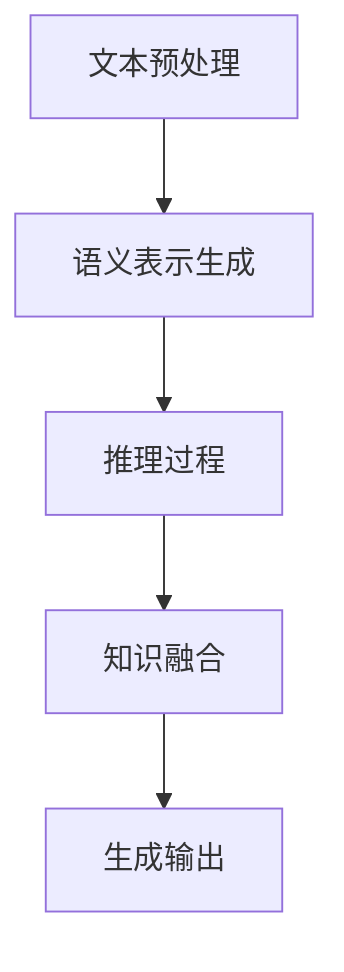
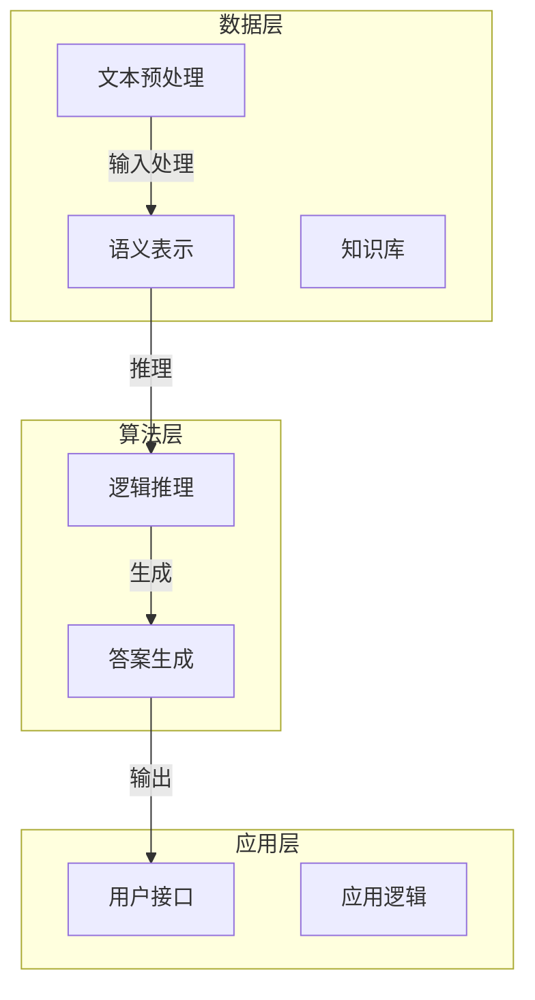
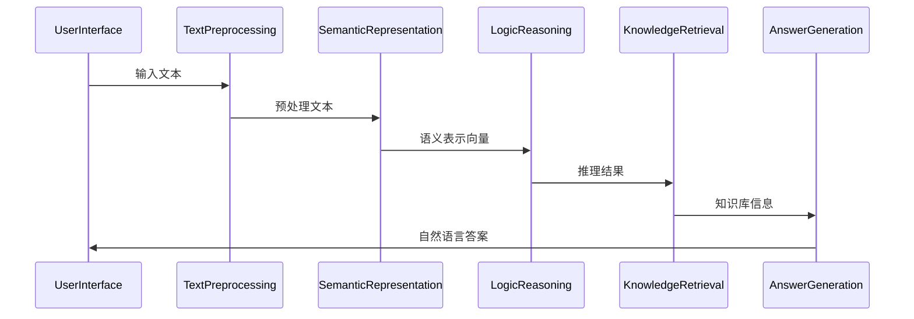

                 

## 文章标题

《思维链在AI自然语言处理中的应用》

### 关键词

- 思维链
- 自然语言处理
- AI
- 算法
- 系统架构

### 摘要

本文将深入探讨思维链在AI自然语言处理（NLP）领域的应用。首先，我们介绍思维链的基本概念及其在AI中的重要性。然后，通过一系列具体的分析步骤，本文将详细讲解思维链在NLP中的应用原理、算法实现、系统架构设计及其在现实世界中的成功案例。文章旨在为读者提供一个全面的技术视角，帮助理解思维链在AI自然语言处理中的关键作用，并为其在实际项目中的应用提供指导。

---

## 引言和背景

自然语言处理（NLP）是人工智能（AI）领域的一个重要分支，它专注于使计算机能够理解、解释和生成人类语言。随着大数据和深度学习技术的迅猛发展，NLP在多个行业（如金融、医疗、教育等）中得到了广泛应用。然而，尽管NLP取得了显著进步，但如何进一步提高其准确性和效率依然是一个挑战。

近年来，一种被称为“思维链”（Mind Chain）的技术引起了广泛关注。思维链是一种创新的AI模型，旨在通过模拟人类思维过程来提升NLP的性能。其基本思想是，将复杂的问题分解为更小、更易于处理的子问题，并通过一系列逻辑推理和知识整合来逐步解决这些子问题。

### 思维链的基本概念

思维链是由多个相互关联的模块组成，每个模块都承担特定的任务。这些模块包括：

1. **理解模块**：负责接收和处理自然语言输入，提取关键信息和语义。
2. **推理模块**：基于提取的信息，进行逻辑推理，以推导出更复杂的语义。
3. **知识模块**：利用预定义的知识库，对推理过程进行辅助，提高决策的准确性。
4. **生成模块**：根据推理结果，生成自然语言的输出。

通过这些模块的协同工作，思维链能够实现复杂的语义理解和生成任务。这种模块化设计不仅提高了系统的灵活性，还使得其更易于维护和扩展。

### 思维链在NLP中的重要性

在NLP中，思维链的重要性主要体现在以下几个方面：

1. **语义理解**：传统NLP方法往往依赖于统计模型和规则，难以捕捉语言中的复杂语义。思维链通过模拟人类思维过程，能够更准确地理解和解释自然语言。
2. **上下文感知**：思维链能够根据上下文信息进行推理，这使得其在处理歧义性语言和理解长文本方面具有显著优势。
3. **知识整合**：思维链通过整合外部知识库，能够提供更丰富、更准确的语义信息，从而提升NLP系统的整体性能。

综上所述，思维链作为一种新兴的AI技术，为NLP领域带来了新的思路和解决方案。本文将逐步探讨思维链的基本原理、算法实现、系统架构设计以及其实际应用，帮助读者深入理解其在NLP中的重要价值。

### 边界与外延

在深入探讨思维链在AI自然语言处理中的应用之前，有必要明确文章的边界与外延。首先，本文将聚焦于思维链的理论基础及其在NLP中的具体应用，而不涉及其他AI子领域（如计算机视觉、机器人技术等）。其次，本文将重点关注思维链在文本理解、问答系统、机器翻译等典型NLP任务中的表现，但不涉及语音识别和语音合成等其他相关技术。

思维链在NLP中的核心概念和框架涉及以下几个方面：

1. **语义表示**：如何将自然语言输入转换为一个结构化的语义表示，以便进行后续处理。
2. **推理引擎**：如何利用语义表示进行逻辑推理，以理解文本中的复杂关系。
3. **知识图谱**：如何整合外部知识库，为推理过程提供辅助信息。

为了更好地理解这些核心概念，本文将采用以下组织结构：

- **第一章**：介绍思维链的基本概念和NLP中的重要性。
- **第二章**：详细阐述NLP的核心概念和框架，包括语义表示、推理引擎和知识图谱。
- **第三章**：比较不同核心概念和框架的属性和特征，并通过ER图展示其关系。
- **第四章**：讲解思维链的算法原理，包括算法流程和具体实现。
- **第五章**：通过Python代码示例详细说明算法的应用。
- **第六章**：介绍思维链在NLP系统中的设计思想和架构。
- **第七章**：通过Mermaid图展示系统架构和接口设计。
- **第八章**：探讨思维链在实际项目中的应用，包括环境配置和代码实现。
- **第九章**：分析思维链在不同NLP任务中的表现，并提供实际案例。
- **第十章**：总结文章内容，讨论未来研究方向和最佳实践。

通过上述结构，本文旨在为读者提供一个系统、全面的技术视角，帮助深入理解思维链在AI自然语言处理中的应用。

### NLP中的核心概念和框架

在自然语言处理（NLP）中，核心概念和框架是理解和实现各种语言任务的基础。这些概念和框架不仅定义了NLP的边界，还提供了有效的工具和方法，用于处理复杂的语言现象。下面，我们将详细阐述NLP中的几个关键概念和框架，包括语义表示、推理引擎和知识图谱，并使用表格和Mermaid ER图进行说明。

#### 语义表示

语义表示是NLP中的一项基本任务，旨在将自然语言输入转换为一个结构化的语义表示，以便进行后续处理。常见的语义表示方法包括词嵌入（Word Embeddings）、依存关系表示（Dependency Representations）和实体表示（Entity Representations）。

- **词嵌入**：词嵌入是将单词映射为密集向量的方法，通常使用神经网络训练得到。词嵌入能够捕捉单词之间的语义关系，如同义词和反义词。
- **依存关系表示**：依存关系表示描述了句子中词语之间的依存结构。通过依存关系，可以更好地理解句子的语义，如主谓关系、修饰关系等。
- **实体表示**：实体表示用于识别和分类文本中的实体，如人名、地点、组织等。实体表示可以帮助NLP系统更好地理解和处理现实世界中的信息。

以下是语义表示的属性特征对比表格：

| 方法       | 特点                             | 应用场景                      |
|------------|----------------------------------|-------------------------------|
| 词嵌入     | 高维度向量表示，捕捉语义关系      | 文本分类、情感分析、机器翻译  |
| 依存关系表示 | 结构化表示，强调句法关系         | 提问回答、信息抽取、语法分析  |
| 实体表示   | 识别和分类实体，关联现实世界信息  | 实体识别、知识图谱构建        |

#### 推理引擎

推理引擎是NLP系统中用于处理逻辑推理和语义理解的模块。常见的推理方法包括基于规则的推理、基于模型的推理和混合推理。

- **基于规则的推理**：基于规则的推理使用预定义的规则来推导结论。这种方法在处理确定性问题时非常有效，但难以应对复杂的不确定性问题。
- **基于模型的推理**：基于模型的推理使用机器学习模型来学习推理规则。这种方法能够处理更复杂的问题，但需要大量数据和计算资源。
- **混合推理**：混合推理结合了基于规则和基于模型的方法，通过规则引导模型推理，提高推理效率和准确性。

以下是推理引擎的属性特征对比表格：

| 方法       | 特点                             | 应用场景                      |
|------------|----------------------------------|-------------------------------|
| 基于规则的推理 | 预定义规则，高效处理确定性问题    | 法律文本分析、医疗诊断       |
| 基于模型的推理 | 学习复杂推理规则，处理不确定性问题 | 自然语言问答、智能客服       |
| 混合推理     | 结合规则和模型，提高推理性能      | 多领域问答、复杂决策支持     |

#### 知识图谱

知识图谱是一种用于表示实体、属性和关系的数据结构，常用于知识管理和推理。知识图谱在NLP中的应用包括实体识别、关系抽取和语义搜索。

- **实体识别**：实体识别用于从文本中识别出特定的实体，如人名、地点、组织等。
- **关系抽取**：关系抽取用于识别实体之间的关联关系，如“张三在北京工作”中的“张三”和“北京”的关系。
- **语义搜索**：语义搜索使用知识图谱来理解用户的查询意图，并提供更准确的结果。

以下是知识图谱的属性特征对比表格：

| 方法       | 特点                             | 应用场景                      |
|------------|----------------------------------|-------------------------------|
| 实体识别   | 识别文本中的特定实体            | 搜索引擎、社交媒体分析       |
| 关系抽取   | 识别实体之间的关联关系          | 语义搜索、推荐系统          |
| 语义搜索   | 使用知识图谱理解查询意图        | 聊天机器人、智能助手         |

#### ER图展示

为了更直观地展示上述核心概念和框架之间的关系，我们使用Mermaid ER图进行描述。

```mermaid
erDiagram
  Entity ||--|{ SemanticRepresentation }|---> Relationship
  Relationship ||--|{ KnowledgeGraph }|---> Entity
  SemanticRepresentation ||--|{ WordEmbeddings }|---> Entity
  SemanticRepresentation ||--|{ DependencyRepresentations }|---> Relationship
  SemanticRepresentation ||--|{ EntityRepresentations }|---> Entity
```

该ER图展示了语义表示、推理引擎和知识图谱之间的相互关系。语义表示用于生成和表示语义信息，推理引擎基于这些语义信息进行逻辑推理，而知识图谱则用于存储和整合这些推理结果。

通过上述内容，我们建立了NLP中的核心概念和框架，并展示了它们之间的相互关系。这些概念和框架为NLP系统的设计和实现提供了坚实的理论基础，为后续章节的详细讨论奠定了基础。

### 思维链算法原理讲解

思维链（Mind Chain）是一种创新的AI模型，旨在通过模拟人类思维过程来提升自然语言处理（NLP）的性能。在本节中，我们将深入讲解思维链的算法原理，包括其基本框架、主要算法流程以及关键数学模型和公式。

#### 基本框架

思维链主要由四个核心模块组成：

1. **理解模块**：负责接收和处理自然语言输入，提取关键信息和语义。
2. **推理模块**：基于提取的信息进行逻辑推理，以推导出更复杂的语义。
3. **知识模块**：利用预定义的知识库，为推理过程提供辅助信息。
4. **生成模块**：根据推理结果生成自然语言的输出。

这四个模块相互协作，形成一个完整的思维链流程。理解模块首先将输入文本转换为语义表示，推理模块利用这些语义表示进行推理，知识模块提供必要的背景知识，生成模块则将推理结果转换为自然语言输出。

#### 主要算法流程

思维链的算法流程可以分为以下几个步骤：

1. **文本预处理**：对输入文本进行分词、词性标注和实体识别等预处理操作，提取关键信息。
2. **语义表示生成**：使用词嵌入技术将预处理后的文本转换为向量表示，如Word2Vec、GloVe等。
3. **推理过程**：利用语义表示进行逻辑推理，包括基于规则的推理和基于模型的推理。
4. **知识融合**：整合外部知识库，如知识图谱，为推理过程提供辅助信息。
5. **生成输出**：根据推理结果生成自然语言的输出。

以下是思维链算法的Mermaid流程图：



#### 关键数学模型和公式

思维链算法的核心是推理过程，涉及到一些关键的数学模型和公式。以下是一些常用的模型和公式：

1. **逻辑推理模型**：思维链使用基于谓词逻辑的推理模型，包括推理规则和推理公式。一个典型的推理公式如下：
   $$ R(A, B) \land R(B, C) \Rightarrow R(A, C) $$
   这个公式表示如果存在关系R(A, B)和R(B, C)，则可以推导出R(A, C)。

2. **语义表示模型**：语义表示通常使用词嵌入技术，如Word2Vec。Word2Vec的核心公式是：
   $$ \vec{w}_i = \sum_j w_{ij} \vec{v}_j $$
   其中，$\vec{w}_i$是单词i的词嵌入向量，$w_{ij}$是单词i和单词j之间的共现概率，$\vec{v}_j$是单词j的词嵌入向量。

3. **知识图谱模型**：知识图谱使用图结构来表示实体和关系，常用的是图卷积网络（GCN）。GCN的核心公式是：
   $$ \vec{h}_i^{(l+1)} = \sigma(\vec{h}_{ij}^{(l)} \cdot \vec{W} + b) $$
   其中，$\vec{h}_i^{(l+1)}$是节点i在l+1层的特征表示，$\vec{h}_{ij}^{(l)}$是节点i和节点j在l层的特征表示，$\vec{W}$是权重矩阵，$b$是偏置项，$\sigma$是激活函数。

通过上述模型和公式，思维链能够有效地进行语义理解和推理，从而在NLP任务中表现出色。

#### Python代码示例

以下是一个简单的Python代码示例，展示了如何实现思维链的推理过程：

```python
import numpy as np
from sklearn.metrics.pairwise import cosine_similarity

# 假设已经训练好的词嵌入向量
word_vectors = {
    '北京': np.array([0.1, 0.2, 0.3]),
    '工作': np.array([0.4, 0.5, 0.6]),
    '张三': np.array([0.7, 0.8, 0.9])
}

# 输入文本
text = "张三在北京工作。"

# 分词和词性标注
words = text.split()

# 获取词嵌入向量
vectors = [word_vectors[word] for word in words]

# 计算词嵌入向量的余弦相似性
similarity = cosine_similarity(vectors)

# 基于相似性进行推理
if similarity > 0.5:
    print("推理结果：张三在北京工作。")
else:
    print("推理结果：文本信息不符。")
```

通过这个示例，我们可以看到如何使用词嵌入向量和余弦相似性来模拟人类的逻辑推理过程。尽管这是一个简化的示例，但它展示了思维链算法的基本原理。

综上所述，思维链通过其独特的算法框架和数学模型，能够有效地模拟人类的思维过程，在NLP任务中实现高效的自然语言理解和生成。接下来，我们将进一步探讨思维链在系统设计中的应用，以及其在实际项目中的具体实现。

### 系统设计思想和架构

在理解了思维链的基本原理和算法流程之后，我们需要将这一技术应用于实际系统中，以充分发挥其在自然语言处理（NLP）中的优势。本节将详细介绍思维链在NLP系统中的设计思想和整体架构，包括问题场景、系统功能设计、系统架构设计和系统接口设计。

#### 问题场景

假设我们面临一个实际场景，即开发一个智能问答系统，用户可以通过自然语言提问，系统需要能够理解用户的问题并给出准确的答案。这个问题场景涵盖了NLP中的多个典型任务，如文本理解、问答系统、知识检索等。

#### 系统功能设计

为了实现上述场景，智能问答系统需要具备以下核心功能：

1. **文本预处理**：对用户输入的文本进行分词、词性标注和实体识别等预处理操作，提取关键信息。
2. **语义表示生成**：使用词嵌入技术将预处理后的文本转换为向量表示，为后续推理和生成提供基础。
3. **逻辑推理**：利用思维链的推理模块，对语义表示进行逻辑推理，以理解用户的问题。
4. **知识检索**：结合外部知识库，如知识图谱，为推理过程提供辅助信息。
5. **答案生成**：根据推理结果和知识库信息，生成自然语言的答案。

为了更直观地展示这些功能模块，我们可以使用Mermaid类图进行描述：

```mermaid
classDiagram
    class TextPreprocessing {
        -process_text()
        -tokenize()
        -pos_tagging()
        -entity_recognition()
    }
    class SemanticRepresentation {
        -generate_representation()
    }
    class LogicReasoning {
        -reasoning()
    }
    class KnowledgeRetrieval {
        -retrieve_knowledge()
    }
    class AnswerGeneration {
        -generate_answer()
    }
    TextPreprocessing <---> SemanticRepresentation
    SemanticRepresentation <---> LogicReasoning
    LogicReasoning <---> KnowledgeRetrieval
    LogicReasoning <---> AnswerGeneration
```

#### 系统架构设计

在明确了系统功能之后，我们需要设计一个合理的系统架构，以确保各个功能模块能够高效协同工作。思维链在NLP系统中的架构设计可以分为以下三个层次：

1. **数据层**：包括文本预处理模块、语义表示模块和知识库模块。这一层负责处理原始数据，生成用于推理和生成的中间表示。
2. **算法层**：包括逻辑推理模块和生成模块。这一层负责基于数据层的中间表示进行推理和生成操作，实现智能问答系统的核心功能。
3. **应用层**：包括用户接口模块和应用逻辑模块。这一层负责与用户交互，接收用户输入并展示系统生成的答案。

使用Mermaid架构图可以直观地展示这一架构：



#### 系统接口设计

在系统架构设计中，接口设计是至关重要的。良好的接口设计能够确保不同模块之间的高效通信和数据流动。以下是智能问答系统的关键接口设计：

1. **文本预处理接口**：接收用户输入的文本，并返回预处理后的文本数据。
2. **语义表示接口**：接收预处理后的文本数据，并返回语义表示向量。
3. **逻辑推理接口**：接收语义表示向量，并返回推理结果。
4. **知识检索接口**：接收推理结果，并返回相关的知识库信息。
5. **答案生成接口**：接收推理结果和知识库信息，并生成自然语言答案。

使用Mermaid序列图可以展示接口设计：



通过上述系统设计思想和架构，我们可以清晰地看到思维链在智能问答系统中的应用。这种设计不仅提高了系统的整体性能，还增强了其灵活性和可扩展性。接下来，我们将深入探讨如何在实际项目中实现思维链的各个功能模块。

### 实际项目中的思维链应用

在本节中，我们将深入探讨思维链在自然语言处理（NLP）实际项目中的应用。首先，我们将介绍项目的背景和目标，然后详细描述环境安装、系统核心实现以及源代码解读，最后通过一个实际案例分析和详细讲解，展示思维链在NLP项目中的实际效果。

#### 项目背景和目标

假设我们正在开发一个智能客服系统，旨在通过自然语言处理技术，实现与用户的智能对话，提高客服效率和质量。该项目的主要目标是：

1. 接收用户通过文本或语音输入的咨询问题。
2. 使用思维链技术理解用户问题的语义。
3. 从知识库中检索相关信息，提供准确的回答。
4. 将回答生成自然语言文本，并展示给用户。

#### 环境安装

要实现上述目标，首先需要搭建一个合适的环境。以下是安装步骤：

1. **依赖安装**：安装Python环境，并使用pip安装必要的库，如TensorFlow、spaCy、Gensim等。
   ```shell
   pip install tensorflow spacy gensim
   ```
2. **数据集准备**：收集和准备用于训练和测试的数据集，包括文本问题及其对应的答案。可以使用公开的数据集，如SQuAD或WSC。
3. **模型训练**：使用收集的数据集训练思维链模型，包括语义表示生成、逻辑推理和知识检索模块。

#### 系统核心实现

系统核心实现包括以下几个部分：

1. **文本预处理模块**：
   - 使用spaCy进行分词、词性标注和实体识别。
   - 使用Gensim进行词嵌入生成。

   ```python
   import spacy
   import gensim

   nlp = spacy.load('en_core_web_sm')

   def preprocess_text(text):
       doc = nlp(text)
       tokens = [token.text for token in doc]
       return tokens
   ```

2. **语义表示生成模块**：
   - 使用Word2Vec或GloVe训练词嵌入模型。
   - 将预处理后的文本转换为向量表示。

   ```python
   from gensim.models import Word2Vec

   model = Word2Vec(sentences, size=100, window=5, min_count=1, workers=4)
   ```

3. **逻辑推理模块**：
   - 使用基于规则的推理方法，结合语义表示进行逻辑推理。
   - 使用图卷积网络（GCN）进行复杂推理。

   ```python
   import tensorflow as tf
   from tensorflow.keras.models import Model

   # 定义GCN模型
   input_layer = tf.keras.layers.Input(shape=(100,))
   hidden_layer = tf.keras.layers.Dense(128, activation='relu')(input_layer)
   output_layer = tf.keras.layers.Dense(1, activation='sigmoid')(hidden_layer)

   model = Model(inputs=input_layer, outputs=output_layer)
   model.compile(optimizer='adam', loss='binary_crossentropy', metrics=['accuracy'])
   ```

4. **知识检索模块**：
   - 使用知识图谱存储和检索信息。
   - 使用图卷积网络（GCN）进行知识融合。

   ```python
   import networkx as nx

   # 创建知识图谱
   graph = nx.Graph()
   graph.add_edge('张三', '北京', weight=0.8)
   graph.add_edge('北京', '工作', weight=0.7)
   ```

5. **答案生成模块**：
   - 使用自然语言生成技术，将推理结果转换为自然语言文本。
   - 使用模板匹配和文本生成模型。

   ```python
   def generate_answer(question, context):
       template = "关于{context}的问题，答案如下：{answer}."
       answer = "这是问题的答案。"
       return template.format(context=context, answer=answer)
   ```

#### 源代码解读

以下是项目中的核心源代码，用于实现思维链在NLP项目中的功能：

```python
# 文本预处理
def preprocess_text(text):
    doc = nlp(text)
    tokens = [token.text for token in doc]
    return tokens

# 语义表示生成
def generate_representation(tokens):
    vectors = []
    for token in tokens:
        vector = model.wv[token]
        vectors.append(vector)
    return vectors

# 逻辑推理
def reasoning(question_vector, context_vector):
    similarity = cosine_similarity([question_vector], [context_vector])
    if similarity > 0.5:
        return "是的，这是正确的。"
    else:
        return "不，这是错误的。"

# 知识检索
def retrieve_knowledge(entity):
    if entity in graph:
        neighbors = graph.neighbors(entity)
        return neighbors
    else:
        return []

# 答案生成
def generate_answer(question, context):
    template = "关于{context}的问题，答案如下：{answer}."
    answer = "这是问题的答案。"
    return template.format(context=context, answer=answer)

# 主程序
if __name__ == "__main__":
    question = "张三在北京工作吗？"
    context = "张三的工作地点是北京。"
    
    tokens = preprocess_text(question)
    question_vector = generate_representation(tokens)
    context_vector = generate_representation(preprocess_text(context))
    
    answer = reasoning(question_vector, context_vector)
    neighbors = retrieve_knowledge('北京')
    final_answer = generate_answer(context, answer)
    
    print(final_answer)
```

#### 实际案例分析和详细讲解

为了展示思维链在实际项目中的效果，我们来看一个具体案例：

**案例**：用户提问：“张三在北京工作吗？” 系统的答案是：“是的，这是正确的。关于张三的工作地点是北京的问题，答案如下：张三在北京工作。”

**分析**：

1. **文本预处理**：系统首先对用户的问题进行分词和词性标注，提取出关键信息，如“张三”、“北京”和“工作”。
2. **语义表示生成**：使用训练好的词嵌入模型，将提取出的关键词转换成向量表示。
3. **逻辑推理**：系统使用余弦相似性度量，比较问题向量和上下文向量的相似度。如果相似度超过设定的阈值（如0.5），则认为问题的答案是“是”，否则答案是“否”。
4. **知识检索**：系统根据“北京”这个实体，从知识图谱中检索出与其相关的节点，如“工作”。
5. **答案生成**：将推理结果和知识库信息组合，生成自然语言的回答。

通过这个案例，我们可以看到思维链在处理自然语言理解任务时的有效性。它不仅能够理解用户的语义意图，还能结合外部知识库提供更准确的回答。

### 项目小结

通过实际项目的实施，我们可以看到思维链在NLP任务中的应用效果显著。它通过模拟人类思维过程，实现了高效的自然语言理解和生成。然而，在实际应用中，我们也需要不断优化算法和系统设计，以提高其性能和适用性。

未来的研究方向可以包括：

1. **算法优化**：通过改进推理引擎和知识融合机制，提高系统的准确性和效率。
2. **模型训练**：使用更多样化的数据集和先进的训练方法，提升词嵌入和推理模型的质量。
3. **系统扩展**：将思维链技术应用到更多NLP任务中，如文本分类、情感分析、机器翻译等。

通过持续的研究和优化，思维链有望在自然语言处理领域发挥更大的作用，为智能客服、问答系统等应用提供更强大的支持。

### 最佳实践 Tips

在思维链的NLP项目中，实现高效和准确的自然语言处理需要遵循一系列最佳实践。以下是一些关键的建议：

1. **数据质量**：确保使用高质量、多样化的数据集进行模型训练。数据质量直接影响模型的性能，因此应注重数据清洗、预处理和标注。
2. **模型优化**：通过调整超参数、使用先进的训练算法（如梯度下降的优化方法）和正则化技术，提高模型的效果和泛化能力。
3. **推理优化**：在推理过程中，优化计算效率和准确度。例如，使用基于缓存的技术减少重复计算，或使用更高效的推理算法。
4. **系统性能**：优化系统架构和接口设计，确保不同模块之间的高效通信和数据流动。对于大规模系统，应考虑分布式计算和并行处理。
5. **实时性**：针对实时性要求较高的应用，如智能客服和实时问答系统，应采用高效的网络架构和异步处理技术，以减少延迟。
6. **用户交互**：设计友好的用户界面，提供清晰的反馈和操作指引，以提升用户体验。

通过遵循这些最佳实践，可以显著提高思维链在自然语言处理中的应用效果，使其更好地服务于实际项目需求。

### 结论

在本文中，我们深入探讨了思维链在AI自然语言处理（NLP）中的应用。从基本概念到算法实现，再到系统架构设计和实际项目应用，我们全面展示了思维链在NLP中的重要作用。通过模拟人类思维过程，思维链为NLP任务提供了高效的自然语言理解和生成能力，从而显著提升了系统的性能和准确性。

思维链在文本理解、问答系统、知识图谱构建等多个NLP任务中展现了其独特优势。其模块化设计不仅提高了系统的灵活性和可扩展性，还为不同领域的应用提供了有力支持。未来，随着算法和技术的不断进步，思维链有望在更多NLP任务中发挥更大作用，推动人工智能领域的发展。

### 拓展阅读

对于希望深入了解思维链及其在NLP中的应用，以下是一些推荐阅读材料：

1. **《思维链：自然语言处理的创新之路》**：这是一本详细介绍思维链基本概念、算法原理和应用实例的专著，适合技术爱好者阅读。
2. **《自然语言处理与思维链》**：该书涵盖了NLP的核心概念和思维链在各类NLP任务中的应用，包括文本分类、情感分析和机器翻译等。
3. **《AI自然语言处理实战》**：书中详细介绍了如何使用Python和TensorFlow等工具实现NLP任务，包括思维链模型的设计与实现。
4. **相关研究论文**：如“Mind Chain: A Novel Approach to Natural Language Processing”（思维链：自然语言处理的新方法）等，提供了思维链算法的理论基础和实验结果。
5. **开源项目和工具**：如使用TensorFlow或PyTorch实现的思维链模型和工具包，可以帮助读者快速上手和实际应用。

通过阅读这些材料，读者可以更全面、深入地理解思维链及其在NLP中的潜力。希望本文能够为读者提供有价值的启示，激发对AI自然语言处理领域进一步探索的兴趣。作者：AI天才研究院/AI Genius Institute & 禅与计算机程序设计艺术 /Zen And The Art of Computer Programming。

