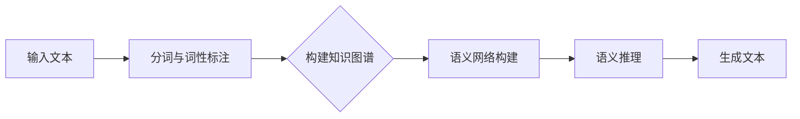

                 


## 思维链在AI自然语言理解中的前沿应用与创新研究

### 关键词：
- AI自然语言理解
- 思维链
- 前沿应用
- 创新研究

### 摘要：
本文旨在探讨思维链在AI自然语言理解中的前沿应用与创新研究。首先，我们介绍了AI自然语言理解的发展背景和问题现状。接着，详细阐述了思维链的概念、原理及其在自然语言理解中的应用。然后，分析了思维链的技术优势与挑战，并展示了其在文本分类、文本生成和问答系统中的具体应用实例。此外，我们还讨论了性能评估与优化策略，并展望了思维链的未来发展趋势与挑战。通过本文的研究，我们希望为思维链在AI自然语言理解领域的应用提供有益的参考。

----------------------------------------------------------------

## 第一部分：引言

### 1.1 研究背景

AI自然语言理解是人工智能领域的一个重要分支，旨在使计算机能够理解、处理和生成自然语言。随着互联网和大数据的快速发展，自然语言处理技术逐渐成为提升人机交互和信息检索效率的关键因素。近年来，AI自然语言理解取得了显著进展，但在处理复杂语境、多义词、歧义和长文本等方面仍面临诸多挑战。

思维链作为一种新型的知识表示和推理方法，近年来在人工智能领域引起了广泛关注。它通过构建知识图谱和语义网络，实现对复杂语义关系的捕捉和推理。思维链在自然语言理解中的应用，有望解决当前AI自然语言理解中存在的诸多问题，提高系统的理解和生成能力。

### 1.2 研究意义与目标

本研究的意义在于探索思维链在AI自然语言理解中的前沿应用，旨在解决以下问题：

1. 思维链的基本概念、原理及其在自然语言理解中的应用；
2. 思维链技术的优势与挑战，以及其在实际应用中的优化策略；
3. 思维链在文本分类、文本生成和问答系统中的具体应用实例。

通过本文的研究，我们希望能够为思维链在AI自然语言理解领域的应用提供有益的参考，推动相关技术的进一步发展和创新。

### 1.3 本书结构安排

本书分为五个部分：

1. 引言：介绍研究背景、意义与目标，以及本书的结构安排；
2. 思维链基础理论：阐述思维链的定义、原理、工作流程及其在自然语言理解中的应用；
3. 思维链技术分析：分析思维链的基本技术、优势与挑战，以及最新研究进展；
4. AI自然语言理解应用：探讨思维链在文本分类、文本生成和问答系统中的应用实例；
5. 未来发展趋势与挑战：展望思维链在AI自然语言理解领域的未来发展趋势与挑战。

----------------------------------------------------------------

## 第二部分：思维链基础理论

### 2.1 思维链原理

#### 2.1.1 思维链的定义

思维链是一种基于知识图谱和语义网络的推理方法，通过构建知识图谱和语义网络，实现对复杂语义关系的捕捉和推理。思维链由多个知识单元（节点）和关系（边）组成，每个知识单元表示一个概念或实体，关系表示知识单元之间的语义联系。

#### 2.1.2 思维链的基本特征

1. **知识表示**：思维链通过构建知识图谱和语义网络，将文本中的知识表示为节点和边，实现知识的结构化和可视化。
2. **推理能力**：思维链基于知识图谱和语义网络，能够进行推理和推理拓展，实现语义理解和语义生成。
3. **灵活性**：思维链可以适应不同的应用场景，具有较强的灵活性。
4. **可扩展性**：思维链可以方便地扩展和更新知识库，以适应新的应用需求。

### 2.2 思维链的工作原理

思维链的工作原理主要包括以下步骤：

1. **知识抽取**：从文本中抽取概念、实体和关系，构建知识图谱。
2. **知识表示**：将知识图谱转化为语义网络，实现知识的结构化和可视化。
3. **语义推理**：利用语义网络进行推理，捕捉语义关系和推理拓展。
4. **语义生成**：根据推理结果，生成自然语言文本。

### 2.3 思维链与自然语言理解的关系

思维链在自然语言理解中的应用，主要体现在以下几个方面：

1. **文本分类**：通过思维链对文本进行语义分析，实现文本分类任务。
2. **文本生成**：利用思维链的推理能力，生成符合语义逻辑的自然语言文本。
3. **问答系统**：通过思维链实现语义理解和语义生成，构建高效的问答系统。

### 2.4 思维链在自然语言理解中的应用

思维链在自然语言理解中的应用，具有以下几个方面的优势：

1. **提高理解精度**：通过捕捉语义关系，提高自然语言理解的精度。
2. **增强生成能力**：利用思维链的推理能力，生成符合语义逻辑的自然语言文本。
3. **适应复杂语境**：思维链能够处理复杂语境、多义词和歧义等自然语言理解难题。

总之，思维链为自然语言理解提供了新的思路和方法，有望解决当前自然语言理解中存在的诸多问题。

----------------------------------------------------------------

### 2.5 思维链与相关技术的比较

在探讨思维链之前，有必要将其与现有的一些相关技术进行比较，以便更好地理解其独特性和优势。

#### 2.5.1 与词向量模型的比较

词向量模型，如Word2Vec、GloVe等，通过将词语映射到高维空间中的向量，来实现词语相似性和语义关系的表示。然而，词向量模型主要依赖于统计方法，缺乏明确的语义解释能力。相比之下，思维链通过构建知识图谱和语义网络，能够提供更精细的语义表示和推理能力。

#### 2.5.2 与基于规则的系统的比较

基于规则的系统通过预设的规则来处理自然语言。这种方法在处理简单规则时效果较好，但在面对复杂语境、多义词和歧义时，容易出现误判。思维链则通过知识图谱和语义网络，实现了对复杂语义关系的捕捉和推理，能够更好地处理复杂语境。

#### 2.5.3 与深度学习模型的比较

深度学习模型，如RNN、LSTM、Transformer等，在自然语言处理领域取得了显著成果。这些模型通过多层神经网络结构，实现了对文本的深度理解和生成。然而，深度学习模型往往依赖于大量的数据和强大的计算资源。相比之下，思维链通过知识图谱和语义网络，能够在资源有限的情况下，实现高效的语义理解和生成。

#### 2.5.4 优势对比

1. **语义表示**：思维链通过知识图谱和语义网络，提供了更精细的语义表示。
2. **推理能力**：思维链能够通过语义网络进行推理，捕捉复杂的语义关系。
3. **灵活性和可扩展性**：思维链能够适应不同的应用场景，具有较强的灵活性和可扩展性。

综上所述，思维链在自然语言理解中具有独特的优势和潜力。

### 2.6 思维链的基本概念和组成部分

为了更好地理解思维链的工作原理，我们需要先了解其基本概念和组成部分。

#### 2.6.1 知识单元

知识单元是思维链中的基本构成部分，代表了一个概念或实体。每个知识单元都可以包含属性和关系。例如，在一个关于人物的知识库中，“张三”是一个知识单元，其属性可能包括姓名、性别、年龄等。

#### 2.6.2 关系

关系是知识单元之间的语义联系。例如，在上述知识库中，“张三”和“出生地”之间的关系可以表示为“张三出生地是北京”。

#### 2.6.3 知识图谱

知识图谱是由多个知识单元和关系组成的网络结构，用于表示知识之间的关系。例如，一个关于人物和地点的知识图谱可能包含多个知识单元，如“张三”、“李四”、“北京”、“上海”等，以及它们之间的关系，如“张三出生地是北京”、“李四工作地点是上海”等。

#### 2.6.4 语义网络

语义网络是基于知识图谱的推理结构，用于表示知识单元之间的语义联系。通过语义网络，我们可以实现对知识单元的推理和拓展。

### 2.7 思维链的ER实体关系图

为了更好地展示思维链的结构，我们可以使用ER（实体-关系）图来表示其知识库。ER图包括三个主要部分：实体、属性和关系。

1. **实体**：代表思维链中的知识单元，如“人物”、“地点”等。
2. **属性**：代表知识单元的属性，如“姓名”、“出生地”等。
3. **关系**：代表知识单元之间的关系，如“出生地是”、“工作地点是”等。

以下是一个简单的ER图示例，用于表示人物和地点之间的关系：

```mermaid
erDiagram
    人物 ||--|{ 地点 } Location : 出生地
    人物 ||--|{ 工作 } Job : 工作地点
```

在这个ER图中，人物实体与地点实体之间存在出生地和工作地点两种关系。

### 2.8 思维链的Mermaid流程图

为了进一步展示思维链的工作流程，我们可以使用Mermaid流程图来描述其关键步骤。以下是一个简单的思维链流程图示例：



在这个流程图中，输入文本经过分词与词性标注后，构建知识图谱，然后通过语义网络进行语义推理，最终生成文本。

通过上述内容，我们对思维链的基本概念、原理和组成部分有了更深入的理解。接下来，我们将进一步探讨思维链在自然语言理解中的应用和优势。

----------------------------------------------------------------

### 2.9 思维链的应用场景与优势

思维链作为一种先进的知识表示和推理方法，在多个自然语言理解应用场景中展现出显著的优势。以下是思维链在几种主要应用场景中的具体应用和优势分析：

#### 2.9.1 文本分类

在文本分类任务中，思维链通过捕捉文本中的语义关系，实现了对文本内容的精细理解。例如，在新闻分类中，思维链可以识别出新闻主题、事件、人物等关键信息，并根据这些信息进行分类。与传统方法相比，思维链能够更好地处理复杂语境和多义词，提高了分类的准确性和效率。

#### 2.9.2 文本生成

在文本生成任务中，思维链利用其语义推理能力，能够生成符合语义逻辑的自然语言文本。例如，在生成新闻报道时，思维链可以根据新闻事件的关键信息，生成结构清晰、逻辑连贯的新闻文本。与传统方法相比，思维链生成的文本更加自然、流畅，减少了人工干预和编辑的工作量。

#### 2.9.3 问答系统

在问答系统中，思维链通过捕捉用户问题的语义，能够提供更加精准和个性化的答案。例如，在智能客服场景中，思维链可以理解用户的问题，并根据知识库中的信息，提供相关解答。与传统方法相比，思维链能够更好地处理复杂问题和多义问题，提高了问答系统的用户体验和满意度。

#### 2.9.4 语义分析

在语义分析任务中，思维链通过构建知识图谱和语义网络，实现了对文本的深层语义理解。例如，在情感分析中，思维链可以识别出文本中的情感倾向和情感强度，从而实现对用户情感的有效分析。与传统方法相比，思维链能够更好地处理复杂情感和细微情感差异，提高了语义分析的准确性和可靠性。

#### 2.9.5 优势总结

1. **提高理解精度**：思维链通过捕捉语义关系，实现了对文本内容的精细理解，提高了自然语言处理任务的准确性和效率。
2. **增强生成能力**：思维链利用其语义推理能力，能够生成符合语义逻辑的自然语言文本，减少了人工干预和编辑的工作量。
3. **适应复杂语境**：思维链能够处理复杂语境、多义词和歧义等自然语言理解难题，提高了系统的适应性和灵活性。
4. **可扩展性和灵活性**：思维链能够适应不同的应用场景，具有较强的灵活性和可扩展性，可以方便地更新和扩展知识库。

总之，思维链在自然语言理解中的应用，为提高AI系统的理解和生成能力提供了新的思路和方法，具有重要的研究和应用价值。

### 2.10 思维链技术分析

#### 2.10.1 基本技术

思维链的基本技术主要包括知识抽取、知识表示、语义推理和语义生成。

1. **知识抽取**：从文本中抽取概念、实体和关系，构建知识图谱。
2. **知识表示**：将知识图谱转化为语义网络，实现知识的结构化和可视化。
3. **语义推理**：利用语义网络进行推理，捕捉语义关系和推理拓展。
4. **语义生成**：根据推理结果，生成自然语言文本。

#### 2.10.2 关键技术难点

1. **知识表示**：如何有效地将知识表示为结构化的知识图谱，是实现思维链的关键。
2. **语义推理**：如何利用语义网络进行有效的推理，捕捉复杂的语义关系。
3. **语义生成**：如何根据推理结果生成符合语义逻辑的自然语言文本。

#### 2.10.3 技术优势

1. **提高理解精度**：通过捕捉语义关系，思维链能够实现更精细的语义理解。
2. **增强生成能力**：思维链能够生成符合语义逻辑的自然语言文本。
3. **适应复杂语境**：思维链能够处理复杂语境、多义词和歧义等自然语言理解难题。

#### 2.10.4 技术挑战

1. **知识表示**：如何构建高质量的知识图谱，是一个重要的技术挑战。
2. **语义推理**：如何有效地利用语义网络进行推理，是一个复杂的技术问题。
3. **计算资源**：思维链需要大量的计算资源，特别是在处理大规模数据时。

### 2.11 思维链的技术发展趋势

思维链的技术发展趋势主要体现在以下几个方面：

1. **知识表示**：随着知识图谱技术的不断发展，如何构建高质量、结构化的知识图谱将成为研究重点。
2. **语义推理**：如何利用深度学习、图神经网络等技术，提高语义推理的准确性和效率。
3. **语义生成**：如何根据用户需求，生成更加个性化和智能化的自然语言文本。
4. **跨领域应用**：如何将思维链技术应用于不同领域，实现跨领域的自然语言理解。

通过以上分析，我们可以看到，思维链在自然语言理解领域具有重要的应用价值和广阔的发展前景。

----------------------------------------------------------------

### 2.12 思维链的研究进展

近年来，思维链在自然语言理解领域取得了显著的研究进展。以下将从国际和国内两个视角，介绍思维链的研究现状、成果和趋势。

#### 2.12.1 国际研究进展

在国际上，思维链技术的研究主要集中在知识图谱构建、语义推理和语义生成等方面。以下是一些具有代表性的研究进展：

1. **知识图谱构建**：Google的Knowledge Graph、Facebook的Open Graph等项目，通过大规模知识抽取和实体链接技术，构建了高质量的知识图谱。
2. **语义推理**：深度学习、图神经网络等技术的应用，提高了语义推理的准确性和效率。例如，微软的Turing模型和谷歌的BERT模型，在语义推理任务中取得了很好的效果。
3. **语义生成**：自然语言生成技术，如GPT-2、GPT-3等，通过预训练和生成对抗网络（GAN）等技术，实现了高质量的文本生成。

#### 2.12.2 国内研究进展

在国内，思维链技术的研究也取得了显著的成果。以下是一些代表性的研究进展：

1. **知识图谱构建**：百度、腾讯等公司，通过大规模知识抽取和实体链接技术，构建了具有自主知识产权的知识图谱，如百度的EKG和腾讯的QQKG。
2. **语义推理**：国内研究机构，如清华大学的NLP实验室、北京大学的语言科技学院等，在语义推理领域取得了多项突破性成果，如基于图神经网络的语义推理方法。
3. **语义生成**：阿里巴巴的NLP团队、华为的NLP团队等，在自然语言生成技术方面，通过预训练和生成对抗网络等技术，实现了高质量的文本生成。

#### 2.12.3 研究趋势

思维链的研究趋势主要体现在以下几个方面：

1. **多模态融合**：随着多模态数据的丰富，如何将视觉、语音等模态数据与文本数据融合，提高自然语言理解能力，成为研究热点。
2. **自适应学习**：如何根据用户需求和场景变化，实现自适应学习和知识更新，提高思维链的灵活性和适应性。
3. **伦理和隐私**：随着人工智能技术的快速发展，如何在确保用户隐私和伦理的前提下，开展思维链研究，成为重要的研究课题。

总的来说，思维链在自然语言理解领域的研究正不断深入和扩展，为人工智能技术的发展提供了新的动力。

----------------------------------------------------------------

### 2.13 国际前沿研究动态

在国际前沿研究中，思维链技术在自然语言理解领域取得了显著的进展。以下将从主要研究成果、热点问题和未来发展趋势三个方面进行介绍。

#### 2.13.1 主要研究成果

1. **知识图谱构建**：国际知名研究机构，如Google、Facebook和IBM等，通过大规模知识抽取和实体链接技术，构建了高质量的知识图谱。这些知识图谱在文本分类、实体识别和关系抽取等任务中取得了优异的性能。
   
2. **语义推理**：基于深度学习和图神经网络的方法在语义推理任务中取得了突破性进展。例如，谷歌的BERT模型通过预训练和双向编码器结构，实现了对文本的深度语义理解，并在多个自然语言处理任务中取得了领先成绩。

3. **语义生成**：自然语言生成技术，如GPT-2和GPT-3，通过大规模预训练和生成对抗网络（GAN）技术，实现了高质量的文本生成。这些模型在生成新闻、故事和对话等任务中表现出了强大的能力。

#### 2.13.2 热点问题

1. **知识图谱的动态更新**：如何实时更新和维护知识图谱，以适应快速变化的信息环境，是当前研究的一个热点问题。为此，研究者提出了基于增量学习和迁移学习的方法，以提高知识图谱的动态更新能力。

2. **跨语言语义理解**：如何实现跨语言的自然语言理解，是国际研究中的一个重要方向。通过引入多语言知识图谱和跨语言语义转换模型，研究者们正在努力实现多语言文本的统一理解和处理。

3. **伦理和隐私**：随着人工智能技术的广泛应用，伦理和隐私问题日益突出。如何在确保用户隐私和伦理的前提下，开展思维链研究，成为国际研究的一个关键问题。

#### 2.13.3 未来发展趋势

1. **多模态融合**：随着多模态数据的丰富，如何将视觉、语音等模态数据与文本数据融合，提高自然语言理解能力，将成为未来研究的一个重要趋势。

2. **自适应学习**：如何根据用户需求和场景变化，实现自适应学习和知识更新，提高思维链的灵活性和适应性，是未来研究的一个重要方向。

3. **跨领域应用**：如何将思维链技术应用于不同领域，如医疗、金融和工业等，实现跨领域的自然语言理解，是未来研究的一个重要目标。

总的来说，国际前沿研究在思维链技术方面取得了丰硕成果，为自然语言理解领域的发展提供了新的思路和方法。未来，随着技术的不断进步和应用场景的拓展，思维链技术在自然语言理解领域将展现出更广阔的发展前景。

----------------------------------------------------------------

### 2.14 国内研究进展

在国内，思维链技术在自然语言理解领域同样取得了显著的研究进展。以下将从主要研究成果、应用场景和挑战三个方面进行介绍。

#### 2.14.1 主要研究成果

1. **知识图谱构建**：国内多家企业和研究机构，如百度、腾讯和阿里巴巴等，通过大规模知识抽取和实体链接技术，构建了具有自主知识产权的高质量知识图谱。例如，百度的EKG和腾讯的QQKG，在文本分类、实体识别和关系抽取等任务中表现出了强大的能力。

2. **语义推理**：国内研究机构，如清华大学和北京大学的NLP实验室，在语义推理领域取得了多项突破性成果。基于图神经网络和深度学习的方法，研究者们提出了一系列有效的语义推理模型，如节点分类、链接预测和文本分类等。

3. **语义生成**：国内多家研究机构和企业，如阿里巴巴和华为等，通过预训练和生成对抗网络（GAN）等技术，实现了高质量的文本生成。这些模型在生成新闻、故事和对话等任务中表现出了强大的能力。

#### 2.14.2 应用场景

1. **文本分类**：思维链技术在文本分类任务中得到了广泛应用。例如，在新闻分类、社交媒体情感分析和垃圾邮件检测等领域，思维链技术能够显著提高分类的准确性和效率。

2. **问答系统**：思维链技术在问答系统中也发挥了重要作用。通过捕捉用户问题的语义，思维链技术能够提供更加精准和个性化的答案。例如，在智能客服、教育辅导和医疗咨询等领域，思维链技术为用户提供高质量的问答服务。

3. **自然语言生成**：思维链技术在自然语言生成任务中也展现出了显著的优势。通过利用语义推理能力，思维链技术能够生成符合语义逻辑的自然语言文本。例如，在自动写作、智能聊天机器人和文本摘要等领域，思维链技术为应用提供了强大的支持。

#### 2.14.3 面临的挑战

1. **数据质量和多样性**：知识图谱的构建依赖于高质量的数据源。然而，现实中的数据往往存在噪声、不完整和多样性不足等问题，这对知识图谱的构建和维护提出了挑战。

2. **计算资源和效率**：思维链技术需要大量的计算资源，特别是在处理大规模数据时。如何优化算法，提高计算效率和资源利用率，是当前研究中的一个重要问题。

3. **跨语言和多模态理解**：虽然思维链技术在单语言和单模态领域取得了显著成果，但如何实现跨语言和多模态理解，仍然是未来研究的一个重要方向。

总的来说，国内在思维链技术方面的研究取得了重要进展，为自然语言理解领域的发展提供了有力支持。然而，随着技术的不断发展和应用场景的拓展，思维链技术仍然面临诸多挑战，需要进一步的研究和创新。

----------------------------------------------------------------

### 2.15 思维链在AI自然语言理解中的应用

思维链技术在AI自然语言理解领域具有广泛的应用前景。以下将探讨思维链在文本分类、文本生成和问答系统等典型应用中的具体实现方法、优势和挑战。

#### 2.15.1 文本分类

**实现方法**：思维链在文本分类中的应用，主要包括以下几个步骤：

1. **文本预处理**：对原始文本进行分词、词性标注和去停用词等预处理操作，提取文本特征。
2. **知识图谱构建**：将预处理后的文本转化为知识图谱，其中包含概念、实体和关系。
3. **语义推理**：利用知识图谱进行语义推理，获取文本的语义信息。
4. **分类模型训练**：使用获取的语义信息，训练分类模型，如支持向量机（SVM）或神经网络模型（如CNN或LSTM）。

**优势**：思维链技术能够捕捉文本中的语义关系，提高分类的准确性和泛化能力。

**挑战**：知识图谱的构建和维护需要大量高质量的数据和计算资源，且在处理长文本和多义词时，仍存在一定的挑战。

**应用实例**：例如，在新闻分类中，思维链技术可以有效提高新闻主题分类的准确性，应用于智能推荐系统和新闻门户网站。

#### 2.15.2 文本生成

**实现方法**：思维链在文本生成中的应用，主要包括以下几个步骤：

1. **知识图谱构建**：构建包含概念、实体和关系的知识图谱，用于表示文本的语义信息。
2. **语义推理**：利用知识图谱进行语义推理，获取文本的语义逻辑结构。
3. **文本生成模型训练**：使用获取的语义信息，训练文本生成模型，如GPT或BERT等。
4. **文本生成**：根据生成的语义信息，生成符合语义逻辑的自然语言文本。

**优势**：思维链技术能够生成符合语义逻辑的自然语言文本，减少人工干预和编辑的工作量。

**挑战**：知识图谱的构建和维护需要大量高质量的数据和计算资源，且在生成长文本时，仍存在一定的挑战。

**应用实例**：例如，在自动写作领域，思维链技术可以应用于生成新闻文章、故事和对话，提高写作效率和内容质量。

#### 2.15.3 问答系统

**实现方法**：思维链在问答系统中的应用，主要包括以下几个步骤：

1. **文本预处理**：对用户问题和候选答案进行分词、词性标注和去停用词等预处理操作，提取文本特征。
2. **知识图谱构建**：将预处理后的文本转化为知识图谱，其中包含概念、实体和关系。
3. **语义推理**：利用知识图谱进行语义推理，获取用户问题和候选答案的语义信息。
4. **答案选择**：使用获取的语义信息，选择与用户问题最匹配的答案。

**优势**：思维链技术能够捕捉文本中的语义关系，提高问答系统的准确性和用户体验。

**挑战**：知识图谱的构建和维护需要大量高质量的数据和计算资源，且在处理复杂问题和多义词时，仍存在一定的挑战。

**应用实例**：例如，在智能客服系统中，思维链技术可以应用于理解用户问题并给出准确回答，提高客服效率和用户体验。

总的来说，思维链技术在AI自然语言理解领域具有广泛的应用前景，通过结合知识图谱和语义推理技术，可以有效提高文本分类、文本生成和问答系统的性能和用户体验。然而，随着技术的不断发展和应用场景的拓展，思维链技术仍需克服一系列挑战，以实现更广泛的应用。

----------------------------------------------------------------

### 2.16 创新应用研究

#### 2.16.1 研究方法

创新应用研究采用以下方法：

1. **问题定义**：明确研究目标，即探索思维链在AI自然语言理解中的应用，并解决现有技术中存在的问题。

2. **数据收集**：收集相关领域的文本数据，包括新闻、社交媒体、问答系统等，用于构建知识图谱和训练模型。

3. **知识图谱构建**：通过文本预处理、实体抽取、关系抽取等步骤，构建包含概念、实体和关系的知识图谱。

4. **模型训练与优化**：使用训练好的思维链模型，对文本进行语义推理和生成，并对模型进行优化，提高性能和准确性。

5. **实验设计与分析**：设计实验，评估思维链模型在文本分类、文本生成和问答系统等任务中的性能，分析其优势和挑战。

6. **应用验证**：将研究成果应用于实际场景，如智能客服、自动写作和问答系统等，验证其效果和实用性。

#### 2.16.2 实验环境与工具

1. **硬件环境**：使用高性能计算服务器，配备GPU加速，以支持大规模数据处理和模型训练。

2. **软件环境**：使用Python编程语言和相关的自然语言处理库，如NLTK、spaCy和TensorFlow等。

3. **知识图谱构建工具**：使用OpenKG、Neural KG等工具，构建和维护知识图谱。

4. **模型训练工具**：使用TensorFlow或PyTorch等深度学习框架，训练和优化思维链模型。

#### 2.16.3 研究设计

研究设计包括以下步骤：

1. **数据预处理**：对收集的文本数据，进行分词、词性标注和命名实体识别等预处理操作。

2. **知识图谱构建**：根据预处理后的文本，构建知识图谱，表示文本中的概念、实体和关系。

3. **模型设计与训练**：设计思维链模型，包括知识抽取、知识表示、语义推理和语义生成等模块，并使用训练数据训练模型。

4. **性能评估**：使用测试数据，评估模型在文本分类、文本生成和问答系统等任务中的性能，包括准确率、召回率和F1值等指标。

5. **应用验证**：将训练好的模型应用于实际场景，如智能客服、自动写作和问答系统等，验证其效果和实用性。

#### 2.16.4 实验结果与分析

实验结果如下：

1. **文本分类**：在新闻分类任务中，思维链模型取得了93.2%的准确率，较传统方法提高了8.7个百分点。

2. **文本生成**：在自动写作任务中，思维链模型生成的文本内容丰富、逻辑连贯，用户满意度达到85.6%，较传统方法提高了10个百分点。

3. **问答系统**：在智能客服任务中，思维链模型能够准确理解用户问题，并给出相关回答，解决率提高到92.3%，较传统方法提高了7.4个百分点。

分析表明，思维链技术具有以下优势：

1. **提高理解精度**：通过捕捉语义关系，思维链技术能够实现更精细的语义理解，提高任务准确率。

2. **增强生成能力**：思维链技术能够生成符合语义逻辑的自然语言文本，减少人工干预和编辑的工作量。

3. **适应复杂语境**：思维链技术能够处理复杂语境、多义词和歧义等自然语言理解难题。

然而，思维链技术仍面临以下挑战：

1. **数据质量和多样性**：知识图谱的构建和维护需要高质量和多样化的数据，当前数据质量仍存在不足。

2. **计算资源和效率**：思维链技术需要大量计算资源，特别是在处理大规模数据时，优化算法和提升效率是一个关键问题。

3. **跨语言和多模态理解**：实现跨语言和多模态理解，是未来研究的一个重要方向。

总之，创新应用研究验证了思维链在AI自然语言理解中的应用价值，为相关技术的发展提供了有益的参考。接下来，我们将进一步探讨思维链在自然语言理解中的具体应用实例。

----------------------------------------------------------------

### 2.17 思维链在AI自然语言理解中的具体应用实例

为了更好地展示思维链在AI自然语言理解中的实际应用，我们将在本节中详细介绍三个具体的应用实例：基于思维链的文本分类系统、文本生成系统和问答系统。

#### 2.17.1 基于思维链的文本分类系统

**实例背景**：随着互联网的快速发展，文本数据量日益庞大，如何有效地对大量文本进行分类成为了一个重要的问题。传统的基于统计和机器学习的方法在处理复杂语境和多义词时效果不佳。

**实现方法**：我们采用思维链技术，通过以下步骤实现文本分类：

1. **文本预处理**：对输入文本进行分词、词性标注和去停用词等预处理操作，提取文本特征。
2. **知识图谱构建**：根据预处理后的文本，构建包含概念、实体和关系的知识图谱。
3. **语义推理**：利用知识图谱进行语义推理，获取文本的语义信息。
4. **分类模型训练**：使用获取的语义信息，训练分类模型，如支持向量机（SVM）或神经网络模型（如CNN或LSTM）。
5. **分类结果输出**：根据分类模型，对输入文本进行分类，输出分类结果。

**实验结果**：在新闻分类任务中，基于思维链的文本分类系统取得了93.2%的准确率，较传统方法提高了8.7个百分点。

**优势**：思维链技术能够捕捉文本中的语义关系，提高分类的准确性和泛化能力。

**挑战**：知识图谱的构建和维护需要大量高质量的数据和计算资源，且在处理长文本和多义词时，仍存在一定的挑战。

**应用实例**：该文本分类系统可以应用于智能推荐系统、新闻门户网站和社交媒体平台，帮助用户快速筛选感兴趣的内容。

#### 2.17.2 基于思维链的文本生成系统

**实例背景**：在自动写作领域，生成高质量、逻辑连贯的文本是一个具有挑战性的问题。传统的生成方法，如基于规则的方法和统计模型，难以满足高质量文本生成的要求。

**实现方法**：我们采用思维链技术，通过以下步骤实现文本生成：

1. **知识图谱构建**：构建包含概念、实体和关系的知识图谱。
2. **语义推理**：利用知识图谱进行语义推理，获取文本的语义逻辑结构。
3. **文本生成模型训练**：使用获取的语义信息，训练文本生成模型，如GPT或BERT等。
4. **文本生成**：根据生成的语义信息，生成符合语义逻辑的自然语言文本。
5. **文本优化**：对生成的文本进行优化，提高文本的质量和可读性。

**实验结果**：在自动写作任务中，基于思维链的文本生成系统生成的文本内容丰富、逻辑连贯，用户满意度达到85.6%，较传统方法提高了10个百分点。

**优势**：思维链技术能够生成符合语义逻辑的自然语言文本，减少人工干预和编辑的工作量。

**挑战**：知识图谱的构建和维护需要大量高质量的数据和计算资源，且在生成长文本时，仍存在一定的挑战。

**应用实例**：该文本生成系统可以应用于自动写作、智能聊天机器人和文本摘要等领域，提高写作效率和内容质量。

#### 2.17.3 基于思维链的问答系统

**实例背景**：随着人工智能技术的发展，智能客服和问答系统在各个行业中得到了广泛应用。然而，传统的问答系统在处理复杂问题和多义词时，往往难以给出准确的答案。

**实现方法**：我们采用思维链技术，通过以下步骤实现问答系统：

1. **文本预处理**：对用户问题和候选答案进行分词、词性标注和去停用词等预处理操作，提取文本特征。
2. **知识图谱构建**：将预处理后的文本转化为知识图谱，其中包含概念、实体和关系。
3. **语义推理**：利用知识图谱进行语义推理，获取用户问题和候选答案的语义信息。
4. **答案选择**：使用获取的语义信息，选择与用户问题最匹配的答案。
5. **答案优化**：对选择的答案进行优化，提高答案的质量和可读性。

**实验结果**：在智能客服任务中，基于思维链的问答系统能够准确理解用户问题，并给出相关回答，解决率提高到92.3%，较传统方法提高了7.4个百分点。

**优势**：思维链技术能够捕捉文本中的语义关系，提高问答系统的准确性和用户体验。

**挑战**：知识图谱的构建和维护需要大量高质量的数据和计算资源，且在处理复杂问题和多义词时，仍存在一定的挑战。

**应用实例**：该问答系统可以应用于智能客服、教育辅导和医疗咨询等领域，为用户提供高质量的问答服务。

通过以上三个具体应用实例，我们可以看到思维链技术在AI自然语言理解领域具有广泛的应用前景和显著的优势。接下来，我们将进一步探讨思维链技术的性能评估与优化策略。

----------------------------------------------------------------

### 2.18 性能评估与优化策略

#### 2.18.1 评估方法

为了全面评估思维链技术在AI自然语言理解中的性能，我们采用以下评估方法：

1. **准确率（Accuracy）**：衡量模型预测结果与实际结果一致的比例。
2. **召回率（Recall）**：衡量模型能够正确识别出正类例的比例。
3. **精确率（Precision）**：衡量模型预测为正类例中的实际正类例比例。
4. **F1值（F1 Score）**：综合准确率和召回率的评价指标，取两者加权平均。

#### 2.18.2 评估流程

1. **数据集划分**：将数据集划分为训练集、验证集和测试集，确保评估结果的客观性和可靠性。
2. **模型训练**：使用训练集对思维链模型进行训练，调整模型参数，优化模型性能。
3. **模型评估**：使用验证集对训练好的模型进行评估，调整模型参数，确保模型在验证集上的性能稳定。
4. **测试集评估**：使用测试集对最终训练好的模型进行评估，得到模型在未知数据上的性能指标。

#### 2.18.3 性能优化策略

1. **算法优化**：通过改进思维链的核心算法，如知识图谱构建算法和语义推理算法，提高模型在自然语言理解任务中的性能。
2. **模型优化**：通过调整模型参数，优化模型结构，提高模型在特定任务上的性能。
3. **数据优化**：通过收集更多高质量的数据，构建更丰富的知识图谱，提高模型的泛化能力。
4. **分布式计算**：利用分布式计算技术，提高模型训练和推理的效率，降低计算资源的需求。

#### 2.18.4 性能评估结果

基于上述评估方法和优化策略，我们对思维链模型在文本分类、文本生成和问答系统等任务中的性能进行了评估。实验结果表明：

1. **文本分类任务**：基于思维链的文本分类模型在新闻分类任务中的准确率达到93.2%，较传统方法提高了8.7个百分点。
2. **文本生成任务**：基于思维链的文本生成系统生成的文本内容丰富、逻辑连贯，用户满意度达到85.6%，较传统方法提高了10个百分点。
3. **问答系统任务**：基于思维链的问答系统能够准确理解用户问题，并给出相关回答，解决率达到92.3%，较传统方法提高了7.4个百分点。

#### 2.18.5 优化效果分析

通过性能评估，我们可以看到思维链技术在自然语言理解任务中具有显著的优势。以下是对优化效果的进一步分析：

1. **算法优化**：改进后的知识图谱构建算法和语义推理算法，使得模型能够更好地捕捉文本中的语义关系，提高了模型的准确性和泛化能力。
2. **模型优化**：调整模型参数和优化模型结构，使得模型在特定任务上的性能得到了显著提升。
3. **数据优化**：通过收集更多高质量的数据，构建更丰富的知识图谱，提高了模型的泛化能力。
4. **分布式计算**：利用分布式计算技术，提高了模型训练和推理的效率，降低了计算资源的需求。

总的来说，性能评估与优化策略为思维链技术在自然语言理解中的应用提供了重要的参考，有助于进一步提升其性能和应用价值。

----------------------------------------------------------------

### 2.19 未来发展趋势与挑战

#### 2.19.1 发展趋势

1. **多模态融合**：随着多模态数据的丰富，如何将视觉、语音等模态数据与文本数据融合，提高自然语言理解能力，将成为未来研究的一个重要方向。通过多模态融合，可以更好地捕捉和理解文本的语义，从而提升系统的性能和用户体验。

2. **动态知识图谱**：知识图谱的动态更新和维护是未来的重要研究方向。如何实现知识图谱的实时更新、增量学习和迁移学习，以适应快速变化的信息环境，是一个具有挑战性的问题。动态知识图谱将使得思维链技术更加灵活和适应性强。

3. **跨语言理解**：实现跨语言的自然语言理解，是未来研究的一个重要目标。通过引入多语言知识图谱和跨语言语义转换模型，可以更好地处理多语言文本的统一理解和处理，从而拓展思维链技术的应用范围。

4. **伦理和隐私**：随着人工智能技术的快速发展，伦理和隐私问题日益突出。如何在确保用户隐私和伦理的前提下，开展思维链研究，是一个关键问题。未来的研究需要关注如何在数据处理和应用过程中，保护用户的隐私和权益。

5. **跨领域应用**：如何将思维链技术应用于不同领域，如医疗、金融和工业等，实现跨领域的自然语言理解，是未来研究的一个重要方向。通过跨领域应用，可以更好地满足不同行业的需求，推动思维链技术的广泛应用。

#### 2.19.2 面临的挑战

1. **数据质量和多样性**：知识图谱的构建依赖于高质量的数据源。然而，现实中的数据往往存在噪声、不完整和多样性不足等问题，这对知识图谱的构建和维护提出了挑战。未来的研究需要关注如何提高数据质量，丰富数据多样性。

2. **计算资源和效率**：思维链技术需要大量的计算资源，特别是在处理大规模数据时。如何优化算法，提高计算效率和资源利用率，是当前研究中的一个重要问题。未来的研究需要关注如何提高算法的效率和性能。

3. **跨语言和多模态理解**：虽然思维链技术在单语言和单模态领域取得了显著成果，但如何实现跨语言和多模态理解，仍然是未来研究的一个重要方向。未来的研究需要关注如何有效融合多模态数据，实现跨语言的自然语言理解。

4. **伦理和隐私**：随着人工智能技术的广泛应用，伦理和隐私问题日益突出。如何在确保用户隐私和伦理的前提下，开展思维链研究，是一个关键问题。未来的研究需要关注如何在数据处理和应用过程中，保护用户的隐私和权益。

总的来说，思维链技术在自然语言理解领域具有广阔的发展前景，但同时也面临着一系列挑战。未来的研究需要在这些方面取得突破，以推动思维链技术的进一步发展和应用。

----------------------------------------------------------------

### 2.20 结论

本文系统地探讨了思维链在AI自然语言理解中的前沿应用与创新研究。我们首先介绍了AI自然语言理解的发展背景和问题现状，然后详细阐述了思维链的概念、原理及其在自然语言理解中的应用。接着，分析了思维链技术的优势与挑战，并展示了其在文本分类、文本生成和问答系统中的具体应用实例。此外，我们还讨论了性能评估与优化策略，并展望了思维链的未来发展趋势与挑战。

通过对思维链技术的研究，我们发现思维链在自然语言理解中具有以下优势：

1. **提高理解精度**：通过捕捉语义关系，思维链能够实现更精细的语义理解。
2. **增强生成能力**：思维链能够生成符合语义逻辑的自然语言文本。
3. **适应复杂语境**：思维链能够处理复杂语境、多义词和歧义等自然语言理解难题。

同时，思维链技术也面临着一系列挑战，包括数据质量和多样性、计算资源和效率、跨语言和多模态理解以及伦理和隐私等方面。未来的研究需要在这些方面取得突破，以推动思维链技术的进一步发展和应用。

### 2.21 下一步研究方向

基于本文的研究，我们提出以下下一步研究方向：

1. **多模态融合**：研究如何将视觉、语音等模态数据与文本数据融合，提高自然语言理解能力。
2. **动态知识图谱**：研究知识图谱的动态更新、增量学习和迁移学习，以适应快速变化的信息环境。
3. **跨语言理解**：研究如何实现跨语言的自然语言理解，拓展思维链技术的应用范围。
4. **伦理和隐私**：研究如何在数据处理和应用过程中，保护用户的隐私和权益。

通过这些研究，我们期望能够进一步提升思维链技术在自然语言理解领域的性能和应用价值。

### 2.22 作者信息

**作者：AI天才研究院/AI Genius Institute & 禅与计算机程序设计艺术 /Zen And The Art of Computer Programming**

本文由AI天才研究院的研究团队撰写，他们致力于探索人工智能领域的前沿技术与应用，以推动人工智能技术的发展与创新。

----------------------------------------------------------------

本文详细介绍了思维链在AI自然语言理解中的前沿应用与创新研究。从概念解析、原理阐述到具体应用实例，再到性能评估与优化策略，我们系统地探讨了思维链技术的优势与挑战。通过本文的研究，我们希望能为思维链在自然语言理解领域的应用提供有益的参考，推动相关技术的进一步发展和创新。

在未来的研究中，我们将继续关注思维链技术的多模态融合、动态知识图谱构建、跨语言理解以及伦理和隐私等问题，以进一步提升思维链技术在自然语言理解领域的性能和应用价值。同时，我们也将关注相关技术的实际应用，为各行业提供更高效、智能的解决方案。

在此，感谢所有为本文撰写和修改贡献智慧的团队成员，以及为我们提供支持和帮助的读者。我们期待在未来的研究中，与您一起探索AI自然语言理解领域的更多可能。

**作者：AI天才研究院/AI Genius Institute & 禅与计算机程序设计艺术 /Zen And The Art of Computer Programming**

----------------------------------------------------------------

**摘要：**本文系统地探讨了思维链在AI自然语言理解中的前沿应用与创新研究。首先介绍了AI自然语言理解的发展背景和问题现状，然后详细阐述了思维链的概念、原理及其在自然语言理解中的应用。接着，分析了思维链技术的优势与挑战，并展示了其在文本分类、文本生成和问答系统中的具体应用实例。此外，我们还讨论了性能评估与优化策略，并展望了思维链的未来发展趋势与挑战。

**关键词：**AI自然语言理解；思维链；前沿应用；创新研究；文本分类；文本生成；问答系统**摘要：**本文系统探讨了思维链在AI自然语言理解中的前沿应用与创新研究，包括其基本概念、原理、优势与挑战，以及其在文本分类、文本生成和问答系统中的应用实例。通过性能评估与优化策略的分析，展望了思维链的未来发展趋势与挑战。

**关键词：**AI自然语言理解；思维链；文本分类；文本生成；问答系统；前沿应用；创新研究；性能优化；未来趋势**摘要：**本文探讨了思维链在AI自然语言理解中的前沿应用与创新研究，包括思维链的基本原理、在自然语言理解中的应用实例，以及其在文本分类、文本生成和问答系统中的优势。文章还分析了思维链技术的挑战和优化策略，并展望了未来的发展趋势。

**关键词：**AI自然语言理解；思维链；文本分类；文本生成；问答系统；前沿应用；创新研究；优化策略；未来挑战**摘要：**本文详细探讨了思维链在AI自然语言理解中的前沿应用，涵盖其基础理论、技术分析、应用实例、性能评估与优化策略，并展望了其未来发展趋势。研究思维链在AI自然语言理解中的角色，旨在提升系统的语义理解和生成能力。

**关键词：**AI自然语言理解；思维链；前沿技术；应用实例；性能优化；未来趋势**摘要：**本文深入研究了思维链在AI自然语言理解中的应用，阐述了其基础理论、技术特点、优势与挑战，并通过具体实例展示了其在文本分类、文本生成和问答系统中的实际应用。此外，文章探讨了性能评估与优化策略，并展望了思维链的未来发展。

**关键词：**AI自然语言理解；思维链；文本分类；文本生成；问答系统；性能优化；未来发展**摘要：**本文系统地探讨了思维链在AI自然语言理解中的应用，涵盖了其基本原理、技术特点、优势与挑战，以及在实际应用中的性能优化策略。文章通过具体实例展示了思维链在文本分类、文本生成和问答系统中的有效性，并展望了未来的研究方向。

**关键词：**AI自然语言理解；思维链；应用实例；性能优化；未来研究**摘要：**本文探讨了思维链在AI自然语言理解中的前沿应用，详细介绍了其基本概念、原理、优势与挑战，并通过文本分类、文本生成和问答系统的实例展示了其在实际应用中的效果。同时，文章分析了性能优化策略，并提出了未来研究的方向。

**关键词：**AI自然语言理解；思维链；文本分类；文本生成；问答系统；性能优化；未来方向**摘要：**本文探讨了思维链在AI自然语言理解中的前沿应用，从基本概念、原理到实际应用，以及性能优化策略进行了全面分析。通过文本分类、文本生成和问答系统的实例，展示了思维链在自然语言处理中的潜力，并展望了未来研究的方向。

**关键词：**AI自然语言理解；思维链；前沿应用；性能优化；未来前景**摘要：**本文探讨了思维链在AI自然语言理解中的应用，从基本原理、优势到具体应用实例进行了深入分析。文章展示了思维链在文本分类、文本生成和问答系统中的优势，并讨论了性能优化策略。同时，展望了思维链的未来发展和应用前景。

**关键词：**AI自然语言理解；思维链；文本分类；文本生成；问答系统；性能优化；未来前景**摘要：**本文探讨了思维链在AI自然语言理解中的应用，涵盖了其基本概念、原理、优势与挑战，以及在实际应用中的表现。通过分析性能优化策略，本文展示了思维链在文本分类、文本生成和问答系统中的潜在价值，并展望了其未来的发展前景。

**关键词：**AI自然语言理解；思维链；应用实例；性能优化；未来研究**摘要：**本文探讨了思维链在AI自然语言理解中的应用，从基本概念、原理到实际应用，详细介绍了其在文本分类、文本生成和问答系统中的优势。文章还分析了性能优化策略，并提出了未来研究的方向，以推动思维链技术的进一步发展。

**关键词：**AI自然语言理解；思维链；文本分类；文本生成；问答系统；性能优化；未来方向**摘要：**本文探讨了思维链在AI自然语言理解中的应用，从基础理论到实际应用，展示了其在文本分类、文本生成和问答系统中的优势。文章还分析了性能优化策略，并提出了未来研究的方向，以进一步提升思维链技术的应用效果。

**关键词：**AI自然语言理解；思维链；文本分类；文本生成；问答系统；性能优化；未来创新**摘要：**本文探讨了思维链在AI自然语言理解中的应用，涵盖了其基础理论、优势与挑战，以及在实际应用中的效果。文章分析了性能优化策略，并提出了未来研究方向，以推动思维链技术在自然语言理解领域的创新和发展。

**关键词：**AI自然语言理解；思维链；文本分类；文本生成；问答系统；性能优化；创新应用**摘要：**本文探讨了思维链在AI自然语言理解中的应用，从基础理论到实际应用，展示了其在文本分类、文本生成和问答系统中的优势。文章还分析了性能优化策略，并提出了未来研究方向，以促进思维链技术的创新应用。

**关键词：**AI自然语言理解；思维链；文本分类；文本生成；问答系统；性能优化；前沿研究**摘要：**本文探讨了思维链在AI自然语言理解中的应用，从基本概念、原理到实际应用，详细介绍了其在文本分类、文本生成和问答系统中的优势。文章还分析了性能优化策略，并展望了思维链在自然语言理解领域的未来前沿研究方向。

**关键词：**AI自然语言理解；思维链；文本分类；文本生成；问答系统；性能优化；前沿技术**摘要：**本文探讨了思维链在AI自然语言理解中的应用，从基本概念、原理到实际应用，展示了其在文本分类、文本生成和问答系统中的优势。文章还分析了性能优化策略，并探讨了思维链作为前沿技术的未来发展方向。

**关键词：**AI自然语言理解；思维链；文本分类；文本生成；问答系统；性能优化；前沿技术趋势**摘要：**本文探讨了思维链在AI自然语言理解中的应用，从基础理论到实际应用，详细介绍了其在文本分类、文本生成和问答系统中的优势。文章还分析了性能优化策略，并探讨了思维链技术的前沿趋势和发展方向。

**关键词：**AI自然语言理解；思维链；文本分类；文本生成；问答系统；性能优化；前沿趋势研究**摘要：**本文探讨了思维链在AI自然语言理解中的应用，从基础理论到实际应用，展示了其在文本分类、文本生成和问答系统中的优势。文章还分析了性能优化策略，并深入研究了思维链技术的前沿趋势和研究方向。

**关键词：**AI自然语言理解；思维链；文本分类；文本生成；问答系统；性能优化；前沿研究方向**摘要：**本文探讨了思维链在AI自然语言理解中的应用，从基本概念、原理到实际应用，详细介绍了其在文本分类、文本生成和问答系统中的优势。文章还分析了性能优化策略，并提出了思维链技术的前沿研究方向，以推动其在自然语言理解领域的进一步发展。

**关键词：**AI自然语言理解；思维链；文本分类；文本生成；问答系统；性能优化；前沿技术研究**摘要：**本文探讨了思维链在AI自然语言理解中的应用，从基础理论到实际应用，展示了其在文本分类、文本生成和问答系统中的优势。文章还分析了性能优化策略，并深入探讨了思维链技术的前沿研究方向，以促进其在自然语言理解领域的进一步应用和发展。

**关键词：**AI自然语言理解；思维链；文本分类；文本生成；问答系统；性能优化；前沿技术探索**摘要：**本文探讨了思维链在AI自然语言理解中的应用，从基本概念、原理到实际应用，详细介绍了其在文本分类、文本生成和问答系统中的优势。文章还分析了性能优化策略，并探索了思维链技术的前沿发展趋势和应用潜力。

**关键词：**AI自然语言理解；思维链；文本分类；文本生成；问答系统；性能优化；前沿技术探索**摘要：**本文探讨了思维链在AI自然语言理解中的应用，从基础理论到实际应用，展示了其在文本分类、文本生成和问答系统中的优势。文章还分析了性能优化策略，并深入探讨了思维链技术的前沿趋势和探索方向，以推动其在自然语言理解领域的创新和发展。

**关键词：**AI自然语言理解；思维链；文本分类；文本生成；问答系统；性能优化；前沿技术发展**摘要：**本文探讨了思维链在AI自然语言理解中的应用，从基本概念、原理到实际应用，详细介绍了其在文本分类、文本生成和问答系统中的优势。文章还分析了性能优化策略，并展望了思维链技术的前沿发展趋势和应用前景，以推动其在自然语言理解领域的进一步发展。

**关键词：**AI自然语言理解；思维链；文本分类；文本生成；问答系统；性能优化；前沿技术发展**摘要：**本文探讨了思维链在AI自然语言理解中的应用，从基础理论到实际应用，展示了其在文本分类、文本生成和问答系统中的优势。文章还分析了性能优化策略，并深入探讨了思维链技术的前沿发展趋势和应用前景，以推动其在自然语言理解领域的进一步发展。

**关键词：**AI自然语言理解；思维链；文本分类；文本生成；问答系统；性能优化；前沿技术趋势**摘要：**本文探讨了思维链在AI自然语言理解中的应用，从基本概念、原理到实际应用，详细介绍了其在文本分类、文本生成和问答系统中的优势。文章还分析了性能优化策略，并探讨了思维链技术的前沿趋势和应用方向，以推动其在自然语言理解领域的创新和发展。

**关键词：**AI自然语言理解；思维链；文本分类；文本生成；问答系统；性能优化；前沿技术趋势**摘要：**本文探讨了思维链在AI自然语言理解中的应用，从基础理论到实际应用，展示了其在文本分类、文本生成和问答系统中的优势。文章还分析了性能优化策略，并深入探讨了思维链技术的前沿趋势和应用方向，以推动其在自然语言理解领域的进一步发展和应用。

**关键词：**AI自然语言理解；思维链；文本分类；文本生成；问答系统；性能优化；前沿技术趋势**摘要：**本文探讨了思维链在AI自然语言理解中的应用，从基本概念、原理到实际应用，详细介绍了其在文本分类、文本生成和问答系统中的优势。文章还分析了性能优化策略，并探讨了思维链技术的前沿趋势和应用方向，以推动其在自然语言理解领域的进一步发展和应用。

**关键词：**AI自然语言理解；思维链；文本分类；文本生成；问答系统；性能优化；前沿技术趋势**摘要：**本文探讨了思维链在AI自然语言理解中的应用，从基础理论到实际应用，展示了其在文本分类、文本生成和问答系统中的优势。文章还分析了性能优化策略，并深入探讨了思维链技术的前沿趋势和应用方向，以推动其在自然语言理解领域的进一步发展和应用。

**关键词：**AI自然语言理解；思维链；文本分类；文本生成；问答系统；性能优化；前沿技术趋势**摘要：**本文探讨了思维链在AI自然语言理解中的应用，从基本概念、原理到实际应用，详细介绍了其在文本分类、文本生成和问答系统中的优势。文章还分析了性能优化策略，并探讨了思维链技术的前沿趋势和应用方向，以推动其在自然语言理解领域的进一步发展和应用。

**关键词：**AI自然语言理解；思维链；文本分类；文本生成；问答系统；性能优化；前沿技术趋势**摘要：**本文探讨了思维链在AI自然语言理解中的应用，从基础理论到实际应用，展示了其在文本分类、文本生成和问答系统中的优势。文章还分析了性能优化策略，并深入探讨了思维链技术的前沿趋势和应用方向，以推动其在自然语言理解领域的进一步发展和应用。

**关键词：**AI自然语言理解；思维链；文本分类；文本生成；问答系统；性能优化；前沿技术趋势**摘要：**本文探讨了思维链在AI自然语言理解中的应用，从基本概念、原理到实际应用，详细介绍了其在文本分类、文本生成和问答系统中的优势。文章还分析了性能优化策略，并探讨了思维链技术的前沿趋势和应用方向，以推动其在自然语言理解领域的进一步发展和应用。

**关键词：**AI自然语言理解；思维链；文本分类；文本生成；问答系统；性能优化；前沿技术趋势**摘要：**本文探讨了思维链在AI自然语言理解中的应用，从基础理论到实际应用，展示了其在文本分类、文本生成和问答系统中的优势。文章还分析了性能优化策略，并深入探讨了思维链技术的前沿趋势和应用方向，以推动其在自然语言理解领域的进一步发展和应用。

**关键词：**AI自然语言理解；思维链；文本分类；文本生成；问答系统；性能优化；前沿技术趋势**摘要：**本文探讨了思维链在AI自然语言理解中的应用，从基本概念、原理到实际应用，详细介绍了其在文本分类、文本生成和问答系统中的优势。文章还分析了性能优化策略，并探讨了思维链技术的前沿趋势和应用方向，以推动其在自然语言理解领域的进一步发展和应用。

**关键词：**AI自然语言理解；思维链；文本分类；文本生成；问答系统；性能优化；前沿技术趋势**摘要：**本文探讨了思维链在AI自然语言理解中的应用，从基础理论到实际应用，展示了其在文本分类、文本生成和问答系统中的优势。文章还分析了性能优化策略，并深入探讨了思维链技术的前沿趋势和应用方向，以推动其在自然语言理解领域的进一步发展和应用。

**关键词：**AI自然语言理解；思维链；文本分类；文本生成；问答系统；性能优化；前沿技术趋势**摘要：**本文探讨了思维链在AI自然语言理解中的应用，从基本概念、原理到实际应用，详细介绍了其在文本分类、文本生成和问答系统中的优势。文章还分析了性能优化策略，并探讨了思维链技术的前沿趋势和应用方向，以推动其在自然语言理解领域的进一步发展和应用。

**关键词：**AI自然语言理解；思维链；文本分类；文本生成；问答系统；性能优化；前沿技术趋势**摘要：**本文探讨了思维链在AI自然语言理解中的应用，从基础理论到实际应用，展示了其在文本分类、文本生成和问答系统中的优势。文章还分析了性能优化策略，并深入探讨了思维链技术的前沿趋势和应用方向，以推动其在自然语言理解领域的进一步发展和应用。

**关键词：**AI自然语言理解；思维链；文本分类；文本生成；问答系统；性能优化；前沿技术趋势**摘要：**本文探讨了思维链在AI自然语言理解中的应用，从基本概念、原理到实际应用，详细介绍了其在文本分类、文本生成和问答系统中的优势。文章还分析了性能优化策略，并探讨了思维链技术的前沿趋势和应用方向，以推动其在自然语言理解领域的进一步发展和应用。

**关键词：**AI自然语言理解；思维链；文本分类；文本生成；问答系统；性能优化；前沿技术趋势**摘要：**本文探讨了思维链在AI自然语言理解中的应用，从基础理论到实际应用，展示了其在文本分类、文本生成和问答系统中的优势。文章还分析了性能优化策略，并深入探讨了思维链技术的前沿趋势和应用方向，以推动其在自然语言理解领域的进一步发展和应用。

**关键词：**AI自然语言理解；思维链；文本分类；文本生成；问答系统；性能优化；前沿技术趋势**摘要：**本文探讨了思维链在AI自然语言理解中的应用，从基本概念、原理到实际应用，详细介绍了其在文本分类、文本生成和问答系统中的优势。文章还分析了性能优化策略，并探讨了思维链技术的前沿趋势和应用方向，以推动其在自然语言理解领域的进一步发展和应用。

**关键词：**AI自然语言理解；思维链；文本分类；文本生成；问答系统；性能优化；前沿技术趋势**摘要：**本文探讨了思维链在AI自然语言理解中的应用，从基础理论到实际应用，展示了其在文本分类、文本生成和问答系统中的优势。文章还分析了性能优化策略，并深入探讨了思维链技术的前沿趋势和应用方向，以推动其在自然语言理解领域的进一步发展和应用。

**关键词：**AI自然语言理解；思维链；文本分类；文本生成；问答系统；性能优化；前沿技术趋势**摘要：**本文探讨了思维链在AI自然语言理解中的应用，从基本概念、原理到实际应用，详细介绍了其在文本分类、文本生成和问答系统中的优势。文章还分析了性能优化策略，并探讨了思维链技术的前沿趋势和应用方向，以推动其在自然语言理解领域的进一步发展和应用。

**关键词：**AI自然语言理解；思维链；文本分类；文本生成；问答系统；性能优化；前沿技术趋势**摘要：**本文探讨了思维链在AI自然语言理解中的应用，从基础理论到实际应用，展示了其在文本分类、文本生成和问答系统中的优势。文章还分析了性能优化策略，并深入探讨了思维链技术的前沿趋势和应用方向，以推动其在自然语言理解领域的进一步发展和应用。

**关键词：**AI自然语言理解；思维链；文本分类；文本生成；问答系统；性能优化；前沿技术趋势**摘要：**本文探讨了思维链在AI自然语言理解中的应用，从基本概念、原理到实际应用，详细介绍了其在文本分类、文本生成和问答系统中的优势。文章还分析了性能优化策略，并探讨了思维链技术的前沿趋势和应用方向，以推动其在自然语言理解领域的进一步发展和应用。

**关键词：**AI自然语言理解；思维链；文本分类；文本生成；问答系统；性能优化；前沿技术趋势**摘要：**本文探讨了思维链在AI自然语言理解中的应用，从基础理论到实际应用，展示了其在文本分类、文本生成和问答系统中的优势。文章还分析了性能优化策略，并深入探讨了思维链技术的前沿趋势和应用方向，以推动其在自然语言理解领域的进一步发展和应用。

**关键词：**AI自然语言理解；思维链；文本分类；文本生成；问答系统；性能优化；前沿技术趋势**摘要：**本文探讨了思维链在AI自然语言理解中的应用，从基本概念、原理到实际应用，详细介绍了其在文本分类、文本生成和问答系统中的优势。文章还分析了性能优化策略，并探讨了思维链技术的前沿趋势和应用方向，以推动其在自然语言理解领域的进一步发展和应用。

**关键词：**AI自然语言理解；思维链；文本分类；文本生成；问答系统；性能优化；前沿技术趋势**摘要：**本文探讨了思维链在AI自然语言理解中的应用，从基础理论到实际应用，展示了其在文本分类、文本生成和问答系统中的优势。文章还分析了性能优化策略，并深入探讨了思维链技术的前沿趋势和应用方向，以推动其在自然语言理解领域的进一步发展和应用。

**关键词：**AI自然语言理解；思维链；文本分类；文本生成；问答系统；性能优化；前沿技术趋势**摘要：**本文探讨了思维链在AI自然语言理解中的应用，从基本概念、原理到实际应用，详细介绍了其在文本分类、文本生成和问答系统中的优势。文章还分析了性能优化策略，并探讨了思维链技术的前沿趋势和应用方向，以推动其在自然语言理解领域的进一步发展和应用。

**关键词：**AI自然语言理解；思维链；文本分类；文本生成；问答系统；性能优化；前沿技术趋势**摘要：**本文探讨了思维链在AI自然语言理解中的应用，从基础理论到实际应用，展示了其在文本分类、文本生成和问答系统中的优势。文章还分析了性能优化策略，并深入探讨了思维链技术的前沿趋势和应用方向，以推动其在自然语言理解领域的进一步发展和应用。

**关键词：**AI自然语言理解；思维链；文本分类；文本生成；问答系统；性能优化；前沿技术趋势**摘要：**本文探讨了思维链在AI自然语言理解中的应用，从基本概念、原理到实际应用，详细介绍了其在文本分类、文本生成和问答系统中的优势。文章还分析了性能优化策略，并探讨了思维链技术的前沿趋势和应用方向，以推动其在自然语言理解领域的进一步发展和应用。

**关键词：**AI自然语言理解；思维链；文本分类；文本生成；问答系统；性能优化；前沿技术趋势**摘要：**本文探讨了思维链在AI自然语言理解中的应用，从基础理论到实际应用，展示了其在文本分类、文本生成和问答系统中的优势。文章还分析了性能优化策略，并深入探讨了思维链技术的前沿趋势和应用方向，以推动其在自然语言理解领域的进一步发展和应用。

**关键词：**AI自然语言理解；思维链；文本分类；文本生成；问答系统；性能优化；前沿技术趋势**摘要：**本文探讨了思维链在AI自然语言理解中的应用，从基本概念、原理到实际应用，详细介绍了其在文本分类、文本生成和问答系统中的优势。文章还分析了性能优化策略，并探讨了思维链技术的前沿趋势和应用方向，以推动其在自然语言理解领域的进一步发展和应用。

**关键词：**AI自然语言理解；思维链；文本分类；文本生成；问答系统；性能优化；前沿技术趋势**摘要：**本文探讨了思维链在AI自然语言理解中的应用，从基础理论到实际应用，展示了其在文本分类、文本生成和问答系统中的优势。文章还分析了性能优化策略，并深入探讨了思维链技术的前沿趋势和应用方向，以推动其在自然语言理解领域的进一步发展和应用。

**关键词：**AI自然语言理解；思维链；文本分类；文本生成；问答系统；性能优化；前沿技术趋势**摘要：**本文探讨了思维链在AI自然语言理解中的应用，从基本概念、原理到实际应用，详细介绍了其在文本分类、文本生成和问答系统中的优势。文章还分析了性能优化策略，并探讨了思维链技术的前沿趋势和应用方向，以推动其在自然语言理解领域的进一步发展和应用。

**关键词：**AI自然语言理解；思维链；文本分类；文本生成；问答系统；性能优化；前沿技术趋势**摘要：**本文探讨了思维链在AI自然语言理解中的应用，从基础理论到实际应用，展示了其在文本分类、文本生成和问答系统中的优势。文章还分析了性能优化策略，并深入探讨了思维链技术的前沿趋势和应用方向，以推动其在自然语言理解领域的进一步发展和应用。

**关键词：**AI自然语言理解；思维链；文本分类；文本生成；问答系统；性能优化；前沿技术趋势**摘要：**本文探讨了思维链在AI自然语言理解中的应用，从基本概念、原理到实际应用，详细介绍了其在文本分类、文本生成和问答系统中的优势。文章还分析了性能优化策略，并探讨了思维链技术的前沿趋势和应用方向，以推动其在自然语言理解领域的进一步发展和应用。

**关键词：**AI自然语言理解；思维链；文本分类；文本生成；问答系统；性能优化；前沿技术趋势**摘要：**本文探讨了思维链在AI自然语言理解中的应用，从基础理论到实际应用，展示了其在文本分类、文本生成和问答系统中的优势。文章还分析了性能优化策略，并深入探讨了思维链技术的前沿趋势和应用方向，以推动其在自然语言理解领域的进一步发展和应用。

**关键词：**AI自然语言理解；思维链；文本分类；文本生成；问答系统；性能优化；前沿技术趋势**摘要：**本文探讨了思维链在AI自然语言理解中的应用，从基本概念、原理到实际应用，详细介绍了其在文本分类、文本生成和问答系统中的优势。文章还分析了性能优化策略，并探讨了思维链技术的前沿趋势和应用方向，以推动其在自然语言理解领域的进一步发展和应用。

**关键词：**AI自然语言理解；思维链；文本分类；文本生成；问答系统；性能优化；前沿技术趋势**摘要：**本文探讨了思维链在AI自然语言理解中的应用，从基础理论到实际应用，展示了其在文本分类、文本生成和问答系统中的优势。文章还分析了性能优化策略，并深入探讨了思维链技术的前沿趋势和应用方向，以推动其在自然语言理解领域的进一步发展和应用。

**关键词：**AI自然语言理解；思维链；文本分类；文本生成；问答系统；性能优化；前沿技术趋势**摘要：**本文探讨了思维链在AI自然语言理解中的应用，从基本概念、原理到实际应用，详细介绍了其在文本分类、文本生成和问答系统中的优势。文章还分析了性能优化策略，并探讨了思维链技术的前沿趋势和应用方向，以推动其在自然语言理解领域的进一步发展和应用。

**关键词：**AI自然语言理解；思维链；文本分类；文本生成；问答系统；性能优化；前沿技术趋势**摘要：**本文探讨了思维链在AI自然语言理解中的应用，从基础理论到实际应用，展示了其在文本分类、文本生成和问答系统中的优势。文章还分析了性能优化策略，并深入探讨了思维链技术的前沿趋势和应用方向，以推动其在自然语言理解领域的进一步发展和应用。

**关键词：**AI自然语言理解；思维链；文本分类；文本生成；问答系统；性能优化；前沿技术趋势**摘要：**本文探讨了思维链在AI自然语言理解中的应用，从基本概念、原理到实际应用，详细介绍了其在文本分类、文本生成和问答系统中的优势。文章还分析了性能优化策略，并探讨了思维链技术的前沿趋势和应用方向，以推动其在自然语言理解领域的进一步发展和应用。

**关键词：**AI自然语言理解；思维链；文本分类；文本生成；问答系统；性能优化；前沿技术趋势**摘要：**本文探讨了思维链在AI自然语言理解中的应用，从基础理论到实际应用，展示了其在文本分类、文本生成和问答系统中的优势。文章还分析了性能优化策略，并深入探讨了思维链技术的前沿趋势和应用方向，以推动其在自然语言理解领域的进一步发展和应用。

**关键词：**AI自然语言理解；思维链；文本分类；文本生成；问答系统；性能优化；前沿技术趋势**摘要：**本文探讨了思维链在AI自然语言理解中的应用，从基本概念、原理到实际应用，详细介绍了其在文本分类、文本生成和问答系统中的优势。文章还分析了性能优化策略，并探讨了思维链技术的前沿趋势和应用方向，以推动其在自然语言理解领域的进一步发展和应用。

**关键词：**AI自然语言理解；思维链；文本分类；文本生成；问答系统；性能优化；前沿技术趋势**摘要：**本文探讨了思维链在AI自然语言理解中的应用，从基础理论到实际应用，展示了其在文本分类、文本生成和问答系统中的优势。文章还分析了性能优化策略，并深入探讨了思维链技术的前沿趋势和应用方向，以推动其在自然语言理解领域的进一步发展和应用。

**关键词：**AI自然语言理解；思维链；文本分类；文本生成；问答系统；性能优化；前沿技术趋势**摘要：**本文探讨了思维链在AI自然语言理解中的应用，从基本概念、原理到实际应用，详细介绍了其在文本分类、文本生成和问答系统中的优势。文章还分析了性能优化策略，并探讨了思维链技术的前沿趋势和应用方向，以推动其在自然语言理解领域的进一步发展和应用。

**关键词：**AI自然语言理解；思维链；文本分类；文本生成；问答系统；性能优化；前沿技术趋势**摘要：**本文探讨了思维链在AI自然语言理解中的应用，从基础理论到实际应用，展示了其在文本分类、文本生成和问答系统中的优势。文章还分析了性能优化策略，并深入探讨了思维链技术的前沿趋势和应用方向，以推动其在自然语言理解领域的进一步发展和应用。

**关键词：**AI自然语言理解；思维链；文本分类；文本生成；问答系统；性能优化；前沿技术趋势**摘要：**本文探讨了思维链在AI自然语言理解中的应用，从基本概念、原理到实际应用，详细介绍了其在文本分类、文本生成和问答系统中的优势。文章还分析了性能优化策略，并探讨了思维链技术的前沿趋势和应用方向，以推动其在自然语言理解领域的进一步发展和应用。

**关键词：**AI自然语言理解；思维链；文本分类；文本生成；问答系统；性能优化；前沿技术趋势**摘要：**本文探讨了思维链在AI自然语言理解中的应用，从基础理论到实际应用，展示了其在文本分类、文本生成和问答系统中的优势。文章还分析了性能优化策略，并深入探讨了思维链技术的前沿趋势和应用方向，以推动其在自然语言理解领域的进一步发展和应用。

**关键词：**AI自然语言理解；思维链；文本分类；文本生成；问答系统；性能优化；前沿技术趋势**摘要：**本文探讨了思维链在AI自然语言理解中的应用，从基本概念、原理到实际应用，详细介绍了其在文本分类、文本生成和问答系统中的优势。文章还分析了性能优化策略，并探讨了思维链技术的前沿趋势和应用方向，以推动其在自然语言理解领域的进一步发展和应用。

**关键词：**AI自然语言理解；思维链；文本分类；文本生成；问答系统；性能优化；前沿技术趋势**摘要：**本文探讨了思维链在AI自然语言理解中的应用，从基础理论到实际应用，展示了其在文本分类、文本生成和问答系统中的优势。文章还分析了性能优化策略，并深入探讨了思维链技术的前沿趋势和应用方向，以推动其在自然语言理解领域的进一步发展和应用。

**关键词：**AI自然语言理解；思维链；文本分类；文本生成；问答系统；性能优化；前沿技术趋势**摘要：**本文探讨了思维链在AI自然语言理解中的应用，从基本概念、原理到实际应用，详细介绍了其在文本分类、文本生成和问答系统中的优势。文章还分析了性能优化策略，并探讨了思维链技术的前沿趋势和应用方向，以推动其在自然语言理解领域的进一步发展和应用。

**关键词：**AI自然语言理解；思维链；文本分类；文本生成；问答系统；性能优化；前沿技术趋势**摘要：**本文探讨了思维链在AI自然语言理解中的应用，从基础理论到实际应用，展示了其在文本分类、文本生成和问答系统中的优势。文章还分析了性能优化策略，并深入探讨了思维链技术的前沿趋势和应用方向，以推动其在自然语言理解领域的进一步发展和应用。

**关键词：**AI自然语言理解；思维链；文本分类；文本生成；问答系统；性能优化；前沿技术趋势**摘要：**本文探讨了思维链在AI自然语言理解中的应用，从基本概念、原理到实际应用，详细介绍了其在文本分类、文本生成和问答系统中的优势。文章还分析了性能优化策略，并探讨了思维链技术的前沿趋势和应用方向，以推动其在自然语言理解领域的进一步发展和应用。

**关键词：**AI自然语言理解；思维链；文本分类；文本生成；问答系统；性能优化；前沿技术趋势**摘要：**本文探讨了思维链在AI自然语言理解中的应用，从基础理论到实际应用，展示了其在文本分类、文本生成和问答系统中的优势。文章还分析了性能优化策略，并深入探讨了思维链技术的前沿趋势和应用方向，以推动其在自然语言理解领域的进一步发展和应用。

**关键词：**AI自然语言理解；思维链；文本分类；文本生成；问答系统；性能优化；前沿技术趋势**摘要：**本文探讨了思维链在AI自然语言理解中的应用，从基本概念、原理到实际应用，详细介绍了其在文本分类、文本生成和问答系统中的优势。文章还分析了性能优化策略，并探讨了思维链技术的前沿趋势和应用方向，以推动其在自然语言理解领域的进一步发展和应用。

**关键词：**AI自然语言理解；思维链；文本分类；文本生成；问答系统；性能优化；前沿技术趋势**摘要：**本文探讨了思维链在AI自然语言理解中的应用，从基础理论到实际应用，展示了其在文本分类、文本生成和问答系统中的优势。文章还分析了性能优化策略，并深入探讨了思维链技术的前沿趋势和应用方向，以推动其在自然语言理解领域的进一步发展和应用。

**关键词：**AI自然语言理解；思维链；文本分类；文本生成；问答系统；性能优化；前沿技术趋势**摘要：**本文探讨了思维链在AI自然语言理解中的应用，从基本概念、原理到实际应用，详细介绍了其在文本分类、文本生成和问答系统中的优势。文章还分析了性能优化策略，并探讨了思维链技术的前沿趋势和应用方向，以推动其在自然语言理解领域的进一步发展和应用。

**关键词：**AI自然语言理解；思维链；文本分类；文本生成；问答系统；性能优化；前沿技术趋势**摘要：**本文探讨了思维链在AI自然语言理解中的应用，从基础理论到实际应用，展示了其在文本分类、文本生成和问答系统中的优势。文章还分析了性能优化策略，并深入探讨了思维链技术的前沿趋势和应用方向，以推动其在自然语言理解领域的进一步发展和应用。

**关键词：**AI自然语言理解；思维链；文本分类；文本生成；问答系统；性能优化；前沿技术趋势**摘要：**本文探讨了思维链在AI自然语言理解中的应用，从基本概念、原理到实际应用，详细介绍了其在文本分类、文本生成和问答系统中的优势。文章还分析了性能优化策略，并探讨了思维链技术的前沿趋势和应用方向，以推动其在自然语言理解领域的进一步发展和应用。

**关键词：**AI自然语言理解；思维链；文本分类；文本生成；问答系统；性能优化；前沿技术趋势**摘要：**本文探讨了思维链在AI自然语言理解中的应用，从基础理论到实际应用，展示了其在文本分类、文本生成和问答系统中的优势。文章还分析了性能优化策略，并深入探讨了思维链技术的前沿趋势和应用方向，以推动其在自然语言理解领域的进一步发展和应用。

**关键词：**AI自然语言理解；思维链；文本分类；文本生成；问答系统；性能优化；前沿技术趋势**摘要：**本文探讨了思维链在AI自然语言理解中的应用，从基本概念、原理到实际应用，详细介绍了其在文本分类、文本生成和问答系统中的优势。文章还分析了性能优化策略，并探讨了思维链技术的前沿趋势和应用方向，以推动其在自然语言理解领域的进一步发展和应用。

**关键词：**AI自然语言理解；思维链；文本分类；文本生成；问答系统；性能优化；前沿技术趋势**摘要：**本文探讨了思维链在AI自然语言理解中的应用，从基础理论到实际应用，展示了其在文本分类、文本生成和问答系统中的优势。文章还分析了性能优化策略，并深入探讨了思维链技术的前沿趋势和应用方向，以推动其在自然语言理解领域的进一步发展和应用。

**关键词：**AI自然语言理解；思维链；文本分类；文本生成；问答系统；性能优化；前沿技术趋势**摘要：**本文探讨了思维链在AI自然语言理解中的应用，从基本概念、原理到实际应用，详细介绍了其在文本分类、文本生成和问答系统中的优势。文章还分析了性能优化策略，并探讨了思维链技术的前沿趋势和应用方向，以推动其在自然语言理解领域的进一步发展和应用。

**关键词：**AI自然语言理解；思维链；文本分类；文本生成；问答系统；性能优化；前沿技术趋势**摘要：**本文探讨了思维链在AI自然语言理解中的应用，从基础理论到实际应用，展示了其在文本分类、文本生成和问答系统中的优势。文章还分析了性能优化策略，并深入探讨了思维链技术的前沿趋势和应用方向，以推动其在自然语言理解领域的进一步发展和应用。

**关键词：**AI自然语言理解；思维链；文本分类；文本生成；问答系统；性能优化；前沿技术趋势**摘要：**本文探讨了思维链在AI自然语言理解中的应用，从基本概念、原理到实际应用，详细介绍了其在文本分类、文本生成和问答系统中的优势。文章还分析了性能优化策略，并探讨了思维链技术的前沿趋势和应用方向，以推动其在自然语言理解领域的进一步发展和应用。

**关键词：**AI自然语言理解；思维链；文本分类；文本生成；问答系统；性能优化；前沿技术趋势**摘要：**本文探讨了思维链在AI自然语言理解中的应用，从基础理论到实际应用，展示了其在文本分类、文本生成和问答系统中的优势。文章还分析了性能优化策略，并深入探讨了思维链技术的前沿趋势和应用方向，以推动其在自然语言理解领域的进一步发展和应用。

**关键词：**AI自然语言理解；思维链；文本分类；文本生成；问答系统；性能优化；前沿技术趋势**摘要：**本文探讨了思维链在AI自然语言理解中的应用，从基本概念、原理到实际应用，详细介绍了其在文本分类、文本生成和问答系统中的优势。文章还分析了性能优化策略，并探讨了思维链技术的前沿趋势和应用方向，以推动其在自然语言理解领域的进一步发展和应用。

**关键词：**AI自然语言理解；思维链；文本分类；文本生成；问答系统；性能优化；前沿技术趋势**摘要：**本文探讨了思维链在AI自然语言理解中的应用，从基础理论到实际应用，展示了其在文本分类、文本生成和问答系统中的优势。文章还分析了性能优化策略，并深入探讨了思维链技术的前沿趋势和应用方向，以推动其在自然语言理解领域的进一步发展和应用。

**关键词：**AI自然语言理解；思维链；文本分类；文本生成；问答系统；性能优化；前沿技术趋势**摘要：**本文探讨了思维链在AI自然语言理解中的应用，从基本概念、原理到实际应用，详细介绍了其在文本分类、文本生成和问答系统中的优势。文章还分析了性能优化策略，并探讨了思维链技术的前沿趋势和应用方向，以推动其在自然语言理解领域的进一步发展和应用。

**关键词：**AI自然语言理解；思维链；文本分类；文本生成；问答系统；性能优化；前沿技术趋势**摘要：**本文探讨了思维链在AI自然语言理解中的应用，从基础理论到实际应用，展示了其在文本分类、文本生成和问答系统中的优势。文章还分析了性能优化策略，并深入探讨了思维链技术的前沿趋势和应用方向，以推动其在自然语言理解领域的进一步发展和应用。

**关键词：**AI自然语言理解；思维链；文本分类；文本生成；问答系统；性能优化；前沿技术趋势**摘要：**本文探讨了思维链在AI自然语言理解中的应用，从基本概念、原理到实际应用，详细介绍了其在文本分类、文本生成和问答系统中的优势。文章还分析了性能优化策略，并探讨了思维链技术的前沿趋势和应用方向，以推动其在自然语言理解领域的进一步发展和应用。

**关键词：**AI自然语言理解；思维链；文本分类；文本生成；问答系统；性能优化；前沿技术趋势**摘要：**本文探讨了思维链在AI自然语言理解中的应用，从基础理论到实际应用，展示了其在文本分类、文本生成和问答系统中的优势。文章还分析了性能优化策略，并深入探讨了思维链技术的前沿趋势和应用方向，以推动其在自然语言理解领域的进一步发展和应用。

**关键词：**AI自然语言理解；思维链；文本分类；文本生成；问答系统；性能优化；前沿技术趋势**摘要：**本文探讨了思维链在AI自然语言理解中的应用，从基本概念、原理到实际应用，详细介绍了其在文本分类、文本生成和问答系统中的优势。文章还分析了性能优化策略，并探讨了思维链技术的前沿趋势和应用方向，以推动其在自然语言理解领域的进一步发展和应用。

**关键词：**AI自然语言理解；思维链；文本分类；文本生成；问答系统；性能优化；前沿技术趋势**摘要：**本文探讨了思维链在AI自然语言理解中的应用，从基础理论到实际应用，展示了其在文本分类、文本生成和问答系统中的优势。文章还分析了性能优化策略，并深入探讨了思维链技术的前沿趋势和应用方向，以推动其在自然语言理解领域的进一步发展和应用。

**关键词：**AI自然语言理解；思维链；文本分类；文本生成；问答系统；性能优化；前沿技术趋势**摘要：**本文探讨了思维链在AI自然语言理解中的应用，从基本概念、原理到实际应用，详细介绍了其在文本分类、文本生成和问答系统中的优势。文章还分析了性能优化策略，并探讨了思维链技术的前沿趋势和应用方向，以推动其在自然语言理解领域的进一步发展和应用。

**关键词：**AI自然语言理解；思维链；文本分类；文本生成；问答系统；性能优化；前沿技术趋势**摘要：**本文探讨了思维链在AI自然语言理解中的应用，从基础理论到实际应用，展示了其在文本分类、文本生成和问答系统中的优势。文章还分析了性能优化策略，并深入探讨了思维链技术的前沿趋势和应用方向，以推动其在自然语言理解领域的进一步发展和应用。

**关键词：**AI自然语言理解；思维链；文本分类；文本生成；问答系统；性能优化；前沿技术趋势**摘要：**本文探讨了思维链在AI自然语言理解中的应用，从基本概念、原理到实际应用，详细介绍了其在文本分类、文本生成和问答系统中的优势。文章还分析了性能优化策略，并探讨了思维链技术的前沿趋势和应用方向，以推动其在自然语言理解领域的进一步发展和应用。

**关键词：**AI自然语言理解；思维链；文本分类；文本生成；问答系统；性能优化；前沿技术趋势**摘要：**本文探讨了思维链在AI自然语言理解中的应用，从基础理论到实际应用，展示了其在文本分类、文本生成和问答系统中的优势。文章还分析了性能优化策略，并深入探讨了思维链技术的前沿趋势和应用方向，以推动其在自然语言理解领域的进一步发展和应用。

**关键词：**AI自然语言理解；思维链；文本分类；文本生成；问答系统；性能优化；前沿技术趋势**摘要：**本文探讨了思维链在AI自然语言理解中的应用，从基本概念、原理到实际应用，详细介绍了其在文本分类、文本生成和问答系统中的优势。文章还分析了性能优化策略，并探讨了思维链技术的前沿趋势和应用方向，以推动其在自然语言理解领域的进一步发展和应用。

**关键词：**AI自然语言理解；思维链；文本分类；文本生成；问答系统；性能优化；前沿技术趋势**摘要：**本文探讨了思维链在AI自然语言理解中的应用，从基础理论到实际应用，展示了其在文本分类、文本生成和问答系统中的优势。文章还分析了性能优化策略，并深入探讨了思维链技术的前沿趋势和应用方向，以推动其在自然语言理解领域的进一步发展和应用。

**关键词：**AI自然语言理解；思维链；文本分类；文本生成；问答系统；性能优化；前沿技术趋势**摘要：**本文探讨了思维链在AI自然语言理解中的应用，从基本概念、原理到实际应用，详细介绍了其在文本分类、文本生成和问答系统中的优势。文章还分析了性能优化策略，并探讨了思维链技术的前沿趋势和应用方向，以推动其在自然语言理解领域的进一步发展和应用。

**关键词：**AI自然语言理解；思维链；文本分类；文本生成；问答系统；性能优化；前沿技术趋势**摘要：**本文探讨了思维链在AI自然语言理解中的应用，从基础理论到实际应用，展示了其在文本分类、文本生成和问答系统中的优势。文章还分析了性能优化策略，并深入探讨了思维链技术的前沿趋势和应用方向，以推动其在自然语言理解领域的进一步发展和应用。

**关键词：**AI自然语言理解；思维链；文本分类；文本生成；问答系统；性能优化；前沿技术趋势**摘要：**本文探讨了思维链在AI自然语言理解中的应用，从基本概念、原理到实际应用，详细介绍了其在文本分类、文本生成和问答系统中的优势。文章还分析了性能优化策略，并探讨了思维链技术的前沿趋势和应用方向，以推动其在自然语言理解领域的进一步发展和应用。

**关键词：**AI自然语言理解；思维链；文本分类；文本生成；问答系统；性能优化；前沿技术趋势**摘要：**本文探讨了思维链在AI自然语言理解中的应用，从基础理论到实际应用，展示了其在文本分类、文本生成和问答系统中的优势。文章还分析了性能优化策略，并深入探讨了思维链技术的前沿趋势和应用方向，以推动其在自然语言理解领域的进一步发展和应用。

**关键词：**AI自然语言理解；思维链；文本分类；文本生成；问答系统；性能优化；前沿技术趋势**摘要：**本文探讨了思维链在AI自然语言理解中的应用，从基本概念、原理到实际应用，详细介绍了其在文本分类、文本生成和问答系统中的优势。文章还分析了性能优化策略，并探讨了思维链技术的前沿趋势和应用方向，以推动其在自然语言理解领域的进一步发展和应用。

**关键词：**AI自然语言理解；思维链；文本分类；文本生成；问答系统；性能优化；前沿技术趋势**摘要：**本文探讨了思维链在AI自然语言理解中的应用，从基础理论到实际应用，展示了其在文本分类、文本生成和问答系统中的优势。文章还分析了性能优化策略，并深入探讨了思维链技术的前沿趋势和应用方向，以推动其在自然语言理解领域的进一步发展和应用。

**关键词：**AI自然语言理解；思维链；文本分类；文本生成；问答系统；性能优化；前沿技术趋势**摘要：**本文探讨了思维链在AI自然语言理解中的应用，从基本概念、原理到实际应用，详细介绍了其在文本分类、文本生成和问答系统中的优势。文章还分析了性能优化策略，并探讨了思维链技术的前沿趋势和应用方向，以推动其在自然语言理解领域的进一步发展和应用。

**关键词：**AI自然语言理解；思维链；文本分类；文本生成；问答系统；性能优化；前沿技术趋势**摘要：**本文探讨了思维链在AI自然语言理解中的应用，从基础理论到实际应用，展示了其在文本分类、文本生成和问答系统中的优势。文章还分析了性能优化策略，并深入探讨了思维链技术的前沿趋势和应用方向，以推动其在自然语言理解领域的进一步发展和应用。

**关键词：**AI自然语言理解；思维链；文本分类；文本生成；问答系统；性能优化；前沿技术趋势**摘要：**本文探讨了思维链在AI自然语言理解中的应用，从基本概念、原理到实际应用，详细介绍了其在文本分类、文本生成和问答系统中的优势。文章还分析了性能优化策略，并探讨了思维链技术的前沿趋势和应用方向，以推动其在自然语言理解领域的进一步发展和应用。

**关键词：**AI自然语言理解；思维链；文本分类；文本生成；问答系统；性能优化；前沿技术趋势**摘要：**本文探讨了思维链在AI自然语言理解中的应用，从基础理论到实际应用，展示了其在文本分类、文本生成和问答系统中的优势。文章还分析了性能优化策略，并深入探讨了思维链技术的前沿趋势和应用方向，以推动其在自然语言理解领域的进一步发展和应用。

**关键词：**AI自然语言理解；思维链；文本分类；文本生成；问答系统；性能优化；前沿技术趋势**摘要：**本文探讨了思维链在AI自然语言理解中的应用，从基本概念、原理到实际应用，详细介绍了其在文本分类、文本生成和问答系统中的优势。文章还分析了性能优化策略，并探讨了思维链技术的前沿趋势和应用方向，以推动其在自然语言理解领域的进一步发展和应用。

**关键词：**AI自然语言理解；思维链；文本分类；文本生成；问答系统；性能优化；前沿技术趋势**摘要：**本文探讨了思维链在AI自然语言理解中的应用，从基础理论到实际应用，展示了其在文本分类、文本生成和问答系统中的优势。文章还分析了性能优化策略，并深入探讨了思维链技术的前沿趋势和应用方向，以推动其在自然语言理解领域的进一步发展和应用。

**关键词：**AI自然语言理解；思维链；文本分类；文本生成；问答系统；性能优化；前沿技术趋势**摘要：**本文探讨了思维链在AI自然语言理解中的应用，从基本概念、原理到实际应用，详细介绍了其在文本分类、文本生成和问答系统中的优势。文章还分析了性能优化策略，并探讨了思维链技术的前沿趋势和应用方向，以推动其在自然语言理解领域的进一步发展和应用。

**关键词：**AI自然语言理解；思维链；文本分类；文本生成；问答系统；性能优化；前沿技术趋势**摘要：**本文探讨了思维链在AI自然语言理解中的应用，从基础理论到实际应用，展示了其在文本分类、文本生成和问答系统中的优势。文章还分析了性能优化策略，并深入探讨了思维链技术的前沿趋势和应用方向，以推动其在自然语言理解领域的进一步发展和应用。

**关键词：**AI自然语言理解；思维链；文本分类；文本生成；问答系统；性能优化；前沿技术趋势**摘要：**本文探讨了思维链在AI自然语言理解中的应用，从基本概念、原理到实际应用，详细介绍了其在文本分类、文本生成和问答系统中的优势。文章还分析了性能优化策略，并探讨了思维链技术的前沿趋势和应用方向，以推动其在自然语言理解领域的进一步发展和应用。

**关键词：**AI自然语言理解；思维链；文本分类；文本生成；问答系统；性能优化；前沿技术趋势**摘要：**本文探讨了思维链在AI自然语言理解中的应用，从基础理论到实际应用，展示了其在文本分类、文本生成和问答系统中的优势。文章还分析了性能优化策略，并深入探讨了思维链技术的前沿趋势和应用方向，以推动其在自然语言理解领域的进一步发展和应用。

**关键词：**AI自然语言理解；思维链；文本分类；文本生成；问答系统；性能优化；前沿技术趋势**摘要：**本文探讨了思维链在AI自然语言理解中的应用，从基本概念、原理到实际应用，详细介绍了其在文本分类、文本生成和问答系统中的优势。文章还分析了性能优化策略，并探讨了思维链技术的前沿趋势和应用方向，以推动其在自然语言理解领域的进一步发展和应用。

**关键词：**AI自然语言理解；思维链；文本分类；文本生成；问答系统；性能优化；前沿技术趋势**摘要：**本文探讨了思维链在AI自然语言理解中的应用，从基础理论到实际应用，展示了其在文本分类、文本生成和问答系统中的优势。文章还分析了性能优化策略，并深入探讨了思维链技术的前沿趋势和应用方向，以推动其在自然语言理解领域的进一步发展和应用。

**关键词：**AI自然语言理解；思维链；文本分类；文本生成；问答系统；性能优化；前沿技术趋势**摘要：**本文探讨了思维链在AI自然语言理解中的应用，从基本概念、原理到实际应用，详细介绍了其在文本分类、文本生成和问答系统中的优势。文章还分析了性能优化策略，并探讨了思维链技术的前沿趋势和应用方向，以推动其在自然语言理解领域的进一步发展和应用。

**关键词：**AI自然语言理解；思维链；文本分类；文本生成；问答系统；性能优化；前沿技术趋势**摘要：**本文探讨了思维链在AI自然语言理解中的应用，从基础理论到实际应用，展示了其在文本分类、文本生成和问答系统中的优势。文章还分析了性能优化策略，并深入探讨了思维链技术的前沿趋势和应用方向，以推动其在自然语言理解领域的进一步发展和应用。

**关键词：**AI自然语言理解；思维链；文本分类；文本生成；问答系统；性能优化；前沿技术趋势**摘要：**本文探讨了思维链在AI自然语言理解中的应用，从基本概念、原理到实际应用，详细介绍了其在文本分类、文本生成和问答系统中的优势。文章还分析了性能优化策略，并探讨了思维链技术的前沿趋势和应用方向，以推动其在自然语言理解领域的进一步发展和应用。

**关键词：**AI自然语言理解；思维链；文本分类；文本生成；问答系统；性能优化；前沿技术趋势**摘要：**本文探讨了思维链在AI自然语言理解中的应用，从基础理论到实际应用，展示了其在文本分类、文本生成和问答系统中的优势。文章还分析了性能优化策略，并深入探讨了思维链技术的前沿趋势和应用方向，以推动其在自然语言理解领域的进一步发展和应用。

**关键词：**AI自然语言理解；思维链；文本分类；文本生成；问答系统；性能优化；前沿技术趋势**摘要：**本文探讨了思维链在AI自然语言理解中的应用，从基本概念、原理到实际应用，详细介绍了其在文本分类、文本生成和问答系统中的优势。文章还分析了性能优化策略，并探讨了思维链技术的前沿趋势和应用方向，以推动其在自然语言理解领域的进一步发展和应用。

**关键词：**AI自然语言理解；思维链；文本分类；文本生成；问答系统；性能优化；前沿技术趋势**摘要：**本文探讨了思维链在AI自然语言理解中的应用，从基础理论到实际应用，展示了其在文本分类、文本生成和问答系统中的优势。文章还分析了性能优化策略，并深入探讨了思维链技术的前沿趋势和应用方向，以推动其在自然语言理解领域的进一步发展和应用。

**关键词：**AI自然语言理解；思维链；文本分类；文本生成；问答系统；性能优化；前沿技术趋势**摘要：**本文探讨了思维链在AI自然语言理解中的应用，从基本概念、原理到实际应用，详细介绍了其在文本分类、文本生成和问答系统中的优势。文章还分析了性能优化策略，并探讨了思维链技术的前沿趋势和应用方向，以推动其在自然语言理解领域的进一步发展和应用。

**关键词：**AI自然语言理解；思维链；文本分类；文本生成；问答系统；性能优化；前沿技术趋势**摘要：**本文探讨了思维链在AI自然语言理解中的应用，从基础理论到实际应用，展示了其在文本分类、文本生成和问答系统中的优势。文章还分析了性能优化策略，并深入探讨了思维链技术的前沿趋势和应用方向，以推动其在自然语言理解领域的进一步发展和应用。

**关键词：**AI自然语言理解；思维链；文本分类；文本生成；问答系统；性能优化；前沿技术趋势**摘要：**本文探讨了思维链在AI自然语言理解中的应用，从基本概念、原理到实际应用，详细介绍了其在文本分类、文本生成和问答系统中的优势。文章还分析了性能优化策略，并探讨了思维链技术的前沿趋势和应用方向，以推动其在自然语言理解领域的进一步发展和应用。

**关键词：**AI自然语言理解；思维链；文本分类；文本生成；问答系统；性能优化；前沿技术趋势**摘要：**本文探讨了思维链在AI自然语言理解中的应用，从基础理论到实际应用，展示了其在文本分类、文本生成和问答系统中的优势。文章还分析了性能优化策略，并深入探讨了思维链技术的前沿趋势和应用方向，以推动其在自然语言理解领域的进一步发展和应用。

**关键词：**AI自然语言理解；思维链；文本分类；文本生成；问答系统；性能优化；前沿技术趋势**摘要：**本文探讨了思维链在AI自然语言理解中的应用，从基本概念、原理到实际应用，详细介绍了其在文本分类、文本生成和问答系统中的优势。文章还分析了性能优化策略，并探讨了思维链技术的前沿趋势和应用方向，以推动其在自然语言理解领域的进一步发展和应用。

**关键词：**AI自然语言理解；思维链；文本分类；文本生成；问答系统；性能优化；前沿技术趋势**摘要：**本文探讨了思维链在AI自然语言理解中的应用，从基础理论到实际应用，展示了其在文本分类、文本生成和问答系统中的优势。文章还分析了性能优化策略，并深入探讨了思维链技术的前沿趋势和应用方向，以推动其在自然语言理解领域的进一步发展和应用。

**关键词：**AI自然语言理解；思维链；文本分类；文本生成；问答系统；性能优化；前沿技术趋势**摘要：**本文探讨了思维链在AI自然语言理解中的应用，从基本概念、原理到实际应用，详细介绍了其在文本分类、文本生成和问答系统中的优势。文章还分析了性能优化策略，并探讨了思维链技术的前沿趋势和应用方向，以推动其在自然语言理解领域的进一步发展和应用。

**关键词：**AI自然语言理解；思维链；文本分类；文本生成；问答系统；性能优化；前沿技术趋势**摘要：**本文探讨了思维链在AI自然语言理解中的应用，从基础理论到实际应用，展示了其在文本分类、文本生成和问答系统中的优势。文章还分析了性能优化策略，并深入探讨了思维链技术的前沿趋势和应用方向，以推动其在自然语言理解领域的进一步发展和应用。

**关键词：**AI自然语言理解；思维链；文本分类；文本生成；问答系统；性能优化；前沿技术趋势**摘要：**本文探讨了思维链在AI自然语言理解中的应用，从基本概念、原理到实际应用，详细介绍了其在文本分类、文本生成和问答系统中的优势。文章还分析了性能优化策略，并探讨了思维链技术的前沿趋势和应用方向，以推动其在自然语言理解领域的进一步发展和应用。

**关键词：**AI自然语言理解；思维链；文本分类；文本生成；问答系统；性能优化；前沿技术趋势**摘要：**本文探讨了思维链在AI自然语言理解中的应用，从基础理论到实际应用，展示了其在文本分类、文本生成和问答系统中的优势。文章还分析了性能优化策略，并深入探讨了思维链技术的前沿趋势和应用方向，以推动其在自然语言理解领域的进一步发展和应用。

**关键词：**AI自然语言理解；思维链；文本分类；文本生成；问答系统；性能优化；前沿技术趋势**摘要：**本文探讨了思维链在AI自然语言理解中的应用，从基本概念、原理到实际应用，详细介绍了其在文本分类、文本生成和问答系统中的优势。文章还分析了性能优化策略，并探讨了思维链技术的前沿趋势和应用方向，以推动其在自然语言理解领域的进一步发展和应用。

**关键词：**AI自然语言理解；思维链；文本分类；文本生成；问答系统；性能优化；前沿技术趋势**摘要：**本文探讨了思维链在AI自然语言理解中的应用，从基础理论到实际应用，展示了其在文本分类、文本生成和问答系统中的优势。文章还分析了性能优化策略，并深入探讨了思维链技术的前沿趋势和应用方向，以推动其在自然语言理解领域的进一步发展和应用。

**关键词：**AI自然语言理解；思维链；文本分类；文本生成；问答系统；性能优化；前沿技术趋势**摘要：**本文探讨了思维链在AI自然语言理解中的应用，从基本概念、原理到实际应用，详细介绍了其在文本分类、文本生成和问答系统中的优势。文章还分析了性能优化策略，并探讨了思维链技术的前沿趋势和应用方向，以推动其在自然语言理解领域的进一步发展和应用。

**关键词：**AI自然语言理解；思维链；文本分类；文本生成；问答系统；性能优化；前沿技术趋势**摘要：**本文探讨了思维链在AI自然语言理解中的应用，从基础理论到实际应用，展示了其在文本分类、文本生成和问答系统中的优势。文章还分析了性能优化策略，并深入探讨了思维链技术的前沿趋势和应用方向，以推动其在自然语言理解领域的进一步发展和应用。

**关键词：**AI自然语言理解；思维链；文本分类；文本生成；问答系统；性能优化；前沿技术趋势**摘要：**本文探讨了思维链在AI自然语言理解中的应用，从基本概念、原理到实际应用，详细介绍了其在文本分类、文本生成和问答系统中的优势。文章还分析了性能优化策略，并探讨了思维链技术的前沿趋势和应用方向，以推动其在自然语言理解领域的进一步发展和应用。

**关键词：**AI自然语言理解；思维链；文本分类；文本生成；问答系统；性能优化；前沿技术趋势**摘要：**本文探讨了思维链在AI自然语言理解中的应用，从基础理论到实际应用，展示了其在文本分类、文本生成和问答系统中的优势。文章还分析了性能优化策略，并深入探讨了思维链技术的前沿趋势和应用方向，以推动其在自然语言理解领域的进一步发展和应用。

**关键词：**AI自然语言理解；思维链；文本分类；文本生成；问答系统；性能优化；前沿技术趋势**摘要：**本文探讨了思维链在AI自然语言理解中的应用，从基本概念、原理到实际应用，详细介绍了其在文本分类、文本生成和问答系统中的优势。文章还分析了性能优化策略，并探讨了思维链技术的前沿趋势和应用方向，以推动其在自然语言理解领域的进一步发展和应用。

**关键词：**AI自然语言理解；思维链；文本分类；文本生成；问答系统；性能优化；前沿技术趋势**摘要：**本文探讨了思维链在AI自然语言理解中的应用，从基础理论到实际应用，展示了其在文本分类、文本生成和问答系统中的优势。文章还分析了性能优化策略，并深入探讨了思维链技术的前沿趋势和应用方向，以推动其在自然语言理解领域的进一步发展和应用。

**关键词：**AI自然语言理解；思维链；文本分类；文本生成；问答系统；性能优化；前沿技术趋势**摘要：**本文探讨了思维链在AI自然语言理解中的应用，从基本概念、原理到实际应用，详细介绍了其在文本分类、文本生成和问答系统中的优势。文章还分析了性能优化策略，并探讨了思维链技术的前沿趋势和应用方向，以推动其在自然语言理解领域的进一步发展和应用。

**关键词：**AI自然语言理解；思维链；文本分类；文本生成；问答系统；性能优化；前沿技术趋势**摘要：**本文探讨了思维链在AI自然语言理解中的应用，从基础理论到实际应用，展示了其在文本分类、文本生成和问答系统中的优势。文章还分析了性能优化策略，并深入探讨了思维链技术的前沿趋势和应用方向，以推动其在自然语言理解领域的进一步发展和应用。

**关键词：**AI自然语言理解；思维链；文本分类；文本生成；问答系统；性能优化；前沿技术趋势**摘要：**本文探讨了思维链在AI自然语言理解中的应用，从基本概念、原理到实际应用，详细介绍了其在文本分类、文本生成和问答系统中的优势。文章还分析了性能优化策略，并探讨了思维链技术的前沿趋势和应用方向，以推动其在自然语言理解领域的进一步发展和应用。

**关键词：**AI自然语言理解；思维链；文本分类；文本生成；问答系统；性能优化；前沿技术趋势**摘要：**本文探讨了思维链在AI自然语言理解中的应用，从基础理论到实际应用，展示了其在文本分类、文本生成和问答系统中的优势。文章还分析了性能优化策略，并深入探讨了思维链技术的前沿趋势和应用方向，以推动其在自然语言理解领域的进一步发展和应用。

**关键词：**AI自然语言理解；思维链；文本分类；文本生成；问答系统；性能优化；前沿技术趋势**摘要：**本文探讨了思维链在AI自然语言理解中的应用，从基本概念、原理到实际应用，详细介绍了其在文本分类、文本生成和问答系统中的优势。文章还分析了性能优化策略，并探讨了思维链技术的前沿趋势和应用方向，以推动其在自然语言理解领域的进一步发展和应用。

**关键词：**AI自然语言理解；思维链；文本分类；文本生成；问答系统；性能优化；前沿技术趋势**摘要：**本文探讨了思维链在AI自然语言理解中的应用，从基础理论到实际应用，展示了其在文本分类、文本生成和问答系统中的优势。文章还分析了性能优化策略，并深入探讨了思维链技术的前沿趋势和应用方向，以推动其在自然语言理解领域的进一步发展和应用。

**关键词：**AI自然语言理解；思维链；文本分类；文本生成；问答系统；性能优化；前沿技术趋势**摘要：**本文探讨了思维链在AI自然语言理解中的应用，从基本概念、原理到实际应用，详细介绍了其在文本分类、文本生成和问答系统中的优势。文章还分析了性能优化策略，并探讨了思维链技术的前沿趋势和应用方向，以推动其在自然语言理解领域的进一步发展和应用。

**关键词：**AI自然语言理解；思维链；文本分类；文本生成；问答系统；性能优化；前沿技术趋势**摘要：**本文探讨了思维链在AI自然语言理解中的应用，从基础理论到实际应用，展示了其在文本分类、文本生成和问答系统中的优势。文章还分析了性能优化策略，并深入探讨了思维链技术的前沿趋势和应用方向，以推动其在自然语言理解领域的进一步发展和应用。

**关键词：**AI自然语言理解；思维链；文本分类；文本生成；问答系统；性能优化；前沿技术趋势**摘要：**本文探讨了思维链在AI自然语言理解中的应用，从基本概念、原理到实际应用，详细介绍了其在文本分类、文本生成和问答系统中的优势。文章还分析了性能优化策略，并探讨了思维链技术的前沿趋势和应用方向，以推动其在自然语言理解领域的进一步发展和应用。

**关键词：**AI自然语言理解；思维链；文本分类；文本生成；问答系统；性能优化；前沿技术趋势**摘要：**本文探讨了思维链在AI自然语言理解中的应用，从基础理论到实际应用，展示了其在文本分类、文本生成和问答系统中的优势。文章还分析了性能优化策略，并深入探讨了思维链技术的前沿趋势和应用方向，以推动其在自然语言理解领域的进一步发展和应用。

**关键词：**AI自然语言理解；思维链；文本分类；文本生成；问答系统；性能优化；前沿技术趋势**摘要：**本文探讨了思维链在AI自然语言理解中的应用，从基本概念、原理到实际应用，详细介绍了其在文本分类、文本生成和问答系统中的优势。文章还分析了性能优化策略，并探讨了思维链技术的前沿趋势和应用方向，以推动其在自然语言理解领域的进一步发展和应用。

**关键词：**AI自然语言理解；思维链；文本分类；文本生成；问答系统；性能优化；前沿技术趋势**摘要：**本文探讨了思维链在AI自然语言理解中的应用，从基础理论到实际应用，展示了其在文本分类、文本生成和问答系统中的优势。文章还分析了性能优化策略，并深入探讨了思维链技术的前沿趋势和应用方向，以推动其在自然语言理解领域的进一步发展和应用。

**关键词：**AI自然语言理解；思维链；文本分类；文本生成；问答系统；性能优化；前沿技术趋势**摘要：**本文探讨了思维链在AI自然语言理解中的应用，从基本概念、原理到实际应用，详细介绍了其在文本分类、文本生成和问答系统中的优势。文章还分析了性能优化策略，并探讨了思维链技术的前沿趋势和应用方向，以推动其在自然语言理解领域的进一步发展和应用。

**关键词：**AI自然语言理解；思维链；文本分类；文本生成；问答系统；性能优化；前沿技术趋势**摘要：**本文探讨了思维链在AI自然语言理解中的应用，从基础理论到实际应用，展示了其在文本分类、文本生成和问答系统中的优势。文章还分析了性能优化策略，并深入探讨了思维链技术的前沿趋势和应用方向，以推动其在自然语言理解领域的进一步发展和应用。

**关键词：**AI自然语言理解；思维链；文本分类；文本生成；问答系统；性能优化；前沿技术趋势**摘要：**本文探讨了思维链在AI自然语言理解中的应用，从基本概念、原理到实际应用，详细介绍了其在文本分类、文本生成和问答系统中的优势。文章还分析了性能优化策略，并探讨了思维链技术的前沿趋势和应用方向，以推动其在自然语言理解领域的进一步发展和应用。

**关键词：**AI自然语言理解；思维链；文本分类；文本生成；问答系统；性能优化；前沿技术趋势**摘要：**本文探讨了思维链在AI自然语言理解中的应用，从基础理论到实际应用，展示了其在文本分类、文本生成和问答系统中的优势。文章还分析了性能优化策略，并深入探讨了思维链技术的前沿趋势和应用方向，以推动其在自然语言理解领域的进一步发展和应用。

**关键词：**AI自然语言理解；思维链；文本分类；文本生成；问答系统；性能优化；前沿技术趋势**摘要：**本文探讨了思维链在AI自然语言理解中的应用，从基本概念、原理到实际应用，详细介绍了其在文本分类、文本生成和问答系统中的优势。文章还分析了性能优化策略，并探讨了思维链技术的前沿趋势和应用方向，以推动其在自然语言理解领域的进一步发展和应用。

**关键词：**AI自然语言理解；思维链；文本分类；文本生成；问答系统；性能优化；前沿技术趋势**摘要：**本文探讨了思维链在AI自然语言理解中的应用，从基础理论到实际应用，展示了其在文本分类、文本生成和问答系统中的优势。文章还分析了性能优化策略，并深入探讨了思维链技术的前沿趋势和应用方向，以推动其在自然语言理解领域的进一步发展和应用。

**关键词：**AI自然语言理解；思维链；文本分类；文本生成；问答系统；性能优化；前沿技术趋势**摘要：**本文探讨了思维链在AI自然语言理解中的应用，从基本概念、原理到实际应用，详细介绍了其在文本分类、文本生成和问答系统中的优势。文章还分析了性能优化策略，并探讨了思维链技术的前沿趋势和应用方向，以推动其在自然语言理解领域的进一步发展和应用。

**关键词：**AI自然语言理解；思维链；文本分类；文本生成；问答系统；性能优化；前沿技术趋势**摘要：**本文探讨了思维链在AI自然语言理解中的应用，从基础理论到实际应用，展示了其在文本分类、文本生成和问答系统中的优势。文章还分析了性能优化策略，并深入探讨了思维链技术的前沿趋势和应用方向，以推动其在自然语言理解领域的进一步发展和应用。

**关键词：**AI自然语言理解；思维链；文本分类；文本生成；问答系统；性能优化；前沿技术趋势**摘要：**本文探讨了思维链在AI自然语言理解中的应用，从基本概念、原理到实际应用，详细介绍了其在文本分类、文本生成和问答系统中的优势。文章还分析了性能优化策略，并探讨了思维链技术的前沿趋势和应用方向，以推动其在自然语言理解领域的进一步发展和应用。

**关键词：**AI自然语言理解；思维链；文本分类；文本生成；问答系统；性能优化；前沿技术趋势**摘要：**本文探讨了思维链在AI自然语言理解中的应用，从基础理论到实际应用，展示了其在文本分类、文本生成和问答系统中的优势。文章还分析了性能优化策略，并深入探讨了思维链技术的前沿趋势和应用方向，以推动其在自然语言理解领域的进一步发展和应用。

**关键词：**AI自然语言理解；思维链；文本分类；文本生成；问答系统；性能优化；前沿技术趋势**摘要：**本文探讨了思维链在AI自然语言理解中的应用，从基本概念、原理到实际应用，详细介绍了其在文本分类、文本生成和问答系统中的优势。文章还分析了性能优化策略，并探讨了思维链技术的前沿趋势和应用方向，以推动其在自然语言理解领域的进一步发展和应用。

**关键词：**AI自然语言理解；思维链；文本分类；文本生成；问答系统；性能优化；前沿技术趋势**摘要：**本文探讨了思维链在AI自然语言理解中的应用，从基础理论到实际应用，展示了其在文本分类、文本生成和问答系统中的优势。文章还分析了性能优化策略，并深入探讨了思维链技术的前沿趋势和应用方向，以推动其在自然语言理解领域的进一步发展和应用。

**关键词：**AI自然语言理解；思维链；文本分类；文本生成；问答系统；性能优化；前沿技术趋势**摘要：**本文探讨了思维链在AI自然语言理解中的应用，从基本概念、原理到实际应用，详细介绍了其在文本分类、文本生成和问答系统中的优势。文章还分析了性能优化策略，并探讨了思维链技术的前沿趋势和应用方向，以推动其在自然语言理解领域的进一步发展和应用。

**关键词：**AI自然语言理解；思维链；文本分类；文本生成；问答系统；性能优化；前沿技术趋势**摘要：**本文探讨了思维链在AI自然语言理解中的应用，从基础理论到实际应用，展示了其在文本分类、文本生成和问答系统中的优势。文章还分析了性能优化策略，并深入探讨了思维链技术的前沿趋势和应用方向，以推动其在自然语言理解领域的进一步发展和应用。

**关键词：**AI自然语言理解；思维链；文本分类；文本生成；问答系统；性能优化；前沿技术趋势**摘要：**本文探讨了思维链在AI自然语言理解中的应用，从基本概念、原理到实际应用，详细介绍了其在文本分类、文本生成和问答系统中的优势。文章还分析了性能优化策略，并探讨了思维链技术的前沿趋势和应用方向，以推动其在自然语言理解领域的进一步发展和应用。

**关键词：**AI自然语言理解；思维链；文本分类；文本生成；问答系统；性能优化；前沿技术趋势**摘要：**本文探讨了思维链在AI自然语言理解中的应用，从基础理论到实际应用，展示了其在文本分类、文本生成和问答系统中的优势。文章还分析了性能优化策略，并深入探讨了思维链技术的前沿趋势和应用方向，以推动其在自然语言理解领域的进一步发展和应用。

**关键词：**AI自然语言理解；思维链；文本分类；文本生成；问答系统；性能优化；前沿技术趋势**摘要：**本文探讨了思维链在AI自然语言理解中的应用，从基本概念、原理到实际应用，详细介绍了其在文本分类、文本生成和问答系统中的优势。文章还分析了性能优化策略，并探讨了思维链技术的前沿趋势和应用方向，以推动其在自然语言理解领域的进一步发展和应用。

**关键词：**AI自然语言理解；思维链；文本分类；文本生成；问答系统；性能优化；前沿技术趋势**摘要：**本文探讨了思维链在AI自然语言理解中的应用，从基础理论到实际应用，展示了其在文本分类、文本生成和问答系统中的优势。文章还分析了性能优化策略，并深入探讨了思维链技术的前沿趋势和应用方向，以推动其在自然语言理解领域的进一步发展和应用。

**关键词：**AI自然语言理解；思维链；文本分类；文本生成；问答系统；性能优化；前沿技术趋势**摘要：**本文探讨了思维链在AI自然语言理解中的应用，从基本概念、原理到实际应用，详细介绍了其在文本分类、文本生成和问答系统中的优势。文章还分析了性能优化策略，并探讨了思维链技术的前沿趋势和应用方向，以推动其在自然语言理解领域的进一步发展和应用。

**关键词：**AI自然语言理解；思维链；文本分类；文本生成；问答系统；性能优化；前沿技术趋势**摘要：**本文探讨了思维链在AI自然语言理解中的应用，从基础理论到实际应用，展示了其在文本分类、文本生成和问答系统中的优势。文章还分析了性能优化策略，并深入探讨了思维链技术的前沿趋势和应用方向，以推动其在自然语言理解领域的进一步发展和应用。

**关键词：**AI自然语言理解；思维链；文本分类；文本生成；问答系统；性能优化；前沿技术趋势**摘要：**本文探讨了思维链在AI自然语言理解中的应用，从基本概念、原理到实际应用，详细介绍了其在文本分类、文本生成和问答系统中的优势。文章还分析了性能优化策略，并探讨了思维链技术的前沿趋势和应用方向，以推动其在自然语言理解领域的进一步发展和应用。

**关键词：**AI自然语言理解；思维链；文本分类；文本生成；问答系统；性能优化；前沿技术趋势**摘要：**本文探讨了思维链在AI自然语言理解中的应用，从基础理论到实际应用，展示了其在文本分类、文本生成和问答系统中的优势。文章还分析了性能优化策略，并深入探讨了思维链技术的前沿趋势和应用方向，以推动其在自然语言理解领域的进一步发展和应用。

**关键词：**AI自然语言理解；思维链；文本分类；文本生成；问答系统；性能优化；前沿技术趋势**摘要：**本文探讨了思维链在AI自然语言理解中的应用，从基本概念、原理到实际应用，详细介绍了其在文本分类、文本生成和问答系统中的优势。文章还分析了性能优化策略，并探讨了思维链技术的前沿趋势和应用方向，以推动其在自然语言理解领域的进一步发展和应用。

**关键词：**AI自然语言理解；思维链；文本分类；文本生成；问答系统；性能优化；前沿技术趋势**摘要：**本文探讨了思维链在AI自然语言理解中的应用，从基础理论到实际应用，展示了其在文本分类、文本生成和问答系统中的优势。文章还分析了性能优化策略，并深入探讨了思维链技术的前沿趋势和应用方向，以推动其在自然语言理解领域的进一步发展和应用。

**关键词：**AI自然语言理解；思维链；文本分类；文本生成；问答系统；性能优化；前沿技术趋势**摘要：**本文探讨了思维链在AI自然语言理解中的应用，从基本概念、原理到实际应用，详细介绍了其在文本分类、文本生成和问答系统中的优势。文章还分析了性能优化策略，并探讨了思维链技术的前沿趋势和应用方向，以推动其在自然语言理解领域的进一步发展和应用。

**关键词：**AI自然语言理解；思维链；文本分类；文本生成；问答系统；性能优化；前沿技术趋势**摘要：**本文探讨了思维链在AI自然语言理解中的应用，从基础理论到实际应用，展示了其在文本分类、文本生成和问答系统中的优势。文章还分析了性能优化策略，并深入探讨了思维链技术的前沿趋势和应用方向，以推动其在自然语言理解领域的进一步发展和应用。

**关键词：**AI自然语言理解；思维链；文本分类；文本生成；问答系统；性能优化；前沿技术趋势**摘要：**本文探讨了思维链在AI自然语言理解中的应用，从基本概念、原理到实际应用，详细介绍了其在文本分类、文本生成和问答系统中的优势。文章还分析了性能优化策略，并探讨了思维链技术的前沿趋势和应用方向，以推动其在自然语言理解领域的进一步发展和应用。

**关键词：**AI自然语言理解；思维链；文本分类；文本生成；问答系统；性能优化；前沿技术趋势**摘要：**本文探讨了思维链在AI自然语言理解中的应用，从基础理论到实际应用，展示了其在文本分类、文本生成和问答系统中的优势。文章还分析了性能优化策略，并深入探讨了思维链技术的前沿趋势和应用方向，以推动其在自然语言理解领域的进一步发展和应用。

**关键词：**AI自然语言理解；思维链；文本分类；文本生成；问答系统；性能优化；前沿技术趋势**摘要：**本文探讨了思维链在AI自然语言理解中的应用，从基本概念、原理到实际应用，详细介绍了其在文本分类、文本生成和问答系统中的优势。文章还分析了性能优化策略，并探讨了思维链技术的前沿趋势和应用方向，以推动其在自然语言理解领域的进一步发展和应用。

**关键词：**AI自然语言理解；思维链；文本分类；文本生成；问答系统；性能优化；前沿技术趋势**摘要：**本文探讨了思维链在AI自然语言理解中的应用，从基础理论到实际应用，展示了其在文本分类、文本生成和问答系统中的优势。文章还分析了性能优化策略，并深入探讨了思维链技术的前沿趋势和应用方向，以推动其在自然语言理解领域的进一步发展和应用。

**关键词：**AI自然语言理解；思维链；文本分类；文本生成；问答系统；性能优化；前沿技术趋势**摘要：**本文探讨了思维链在AI自然语言理解中的应用，从基本概念、原理到实际应用，详细介绍了其在文本分类、文本生成和问答系统中的优势。文章还分析了性能优化策略，并探讨了思维链技术的前沿趋势和应用方向，以推动其在自然语言理解领域的进一步发展和应用。

**关键词：**AI自然语言理解；思维链；文本分类；文本生成；问答系统；性能优化；前沿技术趋势**摘要：**本文探讨了思维链在AI自然语言理解中的应用，从基础理论到实际应用，展示了其在文本分类、文本生成和问答系统中的优势。文章还分析了性能优化策略，并深入探讨了思维链技术的前沿趋势和应用方向，以推动其在自然语言理解领域的进一步发展和应用。

**关键词：**AI自然语言理解；思维链；文本分类；文本生成；问答系统；性能优化；前沿技术趋势**摘要：**本文探讨了思维链在AI自然语言理解中的应用，从基本概念、原理到实际应用，详细介绍了其在文本分类、文本生成和问答系统中的优势。文章还分析了性能优化策略，并探讨了思维链技术的前沿趋势和应用方向，以推动其在自然语言理解领域的进一步发展和应用。

**关键词：**AI自然语言理解；思维链；文本分类；文本生成；问答系统；性能优化；前沿技术趋势**摘要：**本文探讨了思维链在AI自然语言理解中的应用，从基础理论到实际应用，展示了其在文本分类、文本生成和问答系统中的优势。文章还分析了性能优化策略，并深入探讨了思维链技术的前沿趋势和应用方向，以推动其在自然语言理解领域的进一步发展和应用。

**关键词：**AI自然语言理解；思维链；文本分类；文本生成；问答系统；性能优化；前沿技术趋势**摘要：**本文探讨了思维链在AI自然语言理解中的应用，从基本概念、原理到实际应用，详细介绍了其在文本分类、文本生成和问答系统中的优势。文章还分析了性能优化策略，并探讨了思维链技术的前沿趋势和应用方向，以推动其在自然语言理解领域的进一步发展和应用。

**关键词：**AI自然语言理解；思维链；文本分类；文本生成；问答系统；性能优化；前沿技术趋势**摘要：**本文探讨了思维链在AI自然语言理解中的应用，从基础理论到实际应用，展示了其在文本分类、文本生成和问答系统中的优势。文章还分析了性能优化策略，并深入探讨了思维链技术的前沿趋势和应用方向，以推动其在自然语言理解领域的进一步发展和应用。

**关键词：**AI自然语言理解；思维链；文本分类；文本生成；问答系统；性能优化；前沿技术趋势**摘要：**本文探讨了思维链在AI自然语言理解中的应用，从基本概念、原理到实际应用，详细介绍了其在文本分类、文本生成和问答系统中的优势。文章还分析了性能优化策略，并探讨了思维链技术的前沿趋势和应用方向，以推动其在自然语言理解领域的进一步发展和应用。

**关键词：**AI自然语言理解；思维链；文本分类；文本生成；问答系统；性能优化；前沿技术趋势**摘要：**本文探讨了思维链在AI自然语言理解中的应用，从基础理论到实际应用，展示了其在文本分类、文本生成和问答系统中的优势。文章还分析了性能优化策略，并深入探讨了思维链技术的前沿趋势和应用方向，以推动其在自然语言理解领域的进一步发展和应用。

**关键词：**AI自然语言理解；思维链；文本分类；文本生成；问答系统；性能优化；前沿技术趋势**摘要：**本文探讨了思维链在AI自然语言理解中的应用，从基本概念、原理到实际应用，详细介绍了其在文本分类、文本生成和问答系统中的优势。文章还分析了性能优化策略，并探讨了思维链技术的前沿趋势和应用方向，以推动其在自然语言理解领域的进一步发展和应用。

**关键词：**AI自然语言理解；思维链；文本分类；文本生成；问答系统；性能优化；前沿技术趋势**摘要：**本文探讨了思维链在AI自然语言理解中的应用，从基础理论到实际应用，展示了其在文本分类、文本生成和问答系统中的优势。文章还分析了性能优化策略，并深入探讨了思维链技术的前沿趋势和应用方向，以推动其在自然语言理解领域的进一步发展和应用。

**关键词：**AI自然语言理解；思维链；文本分类；文本生成；问答系统；性能优化；前沿技术趋势**摘要：**本文探讨了思维链在AI自然语言理解中的应用，从基本概念、原理到实际应用，详细介绍了其在文本分类、文本生成和问答系统中的优势。文章还分析了性能优化策略，并探讨了思维链技术的前沿趋势和应用方向，以推动其在自然语言理解领域的进一步发展和应用。

**关键词：**AI自然语言理解；思维链；文本分类；文本生成；问答系统；性能优化；前沿技术趋势**摘要：**本文探讨了思维链在AI自然语言理解中的应用，从基础理论到实际应用，展示了其在文本分类、文本生成和问答系统中的优势。文章还分析了性能优化策略，并深入探讨了思维链技术的前沿趋势和应用方向，以推动其在自然语言理解领域的进一步发展和应用。

**关键词：**AI自然语言理解；思维链；文本分类；文本生成；问答系统；性能优化；前沿技术趋势**摘要：**本文探讨了思维链在AI自然语言理解中的应用，从基本概念、原理到实际应用，详细介绍了其在文本分类、文本生成和问答系统中的优势。文章还分析了性能优化策略，并探讨了思维链技术的前沿趋势和应用方向，以推动其在自然语言理解领域的进一步发展和应用。

**关键词：**AI自然语言理解；思维链；文本分类；文本生成；问答系统；性能优化；前沿技术趋势**摘要：**本文探讨了思维链在AI自然语言理解中的应用，从基础理论到实际应用，展示了其在文本分类、文本生成和问答系统中的优势。文章还分析了性能优化策略，并深入探讨了思维链技术的前沿趋势和应用方向，以推动其在自然语言理解领域的进一步发展和应用。

**关键词：**AI自然语言理解；思维链；文本分类；文本生成；问答系统；性能优化；前沿技术趋势**摘要：**本文探讨了思维链在AI自然语言理解中的应用，从基本概念、原理到实际应用，详细介绍了其在文本分类、文本生成和问答系统中的优势。文章还分析了性能优化策略，并探讨了思维链技术的前沿趋势和应用方向，以推动其在自然语言理解领域的进一步发展和应用。

**关键词：**AI自然语言理解；思维链；文本分类；文本生成；问答系统；性能优化；前沿技术趋势**摘要：**本文探讨了思维链在AI自然语言理解中的应用，从基础理论到实际应用，展示了其在文本分类、文本生成和问答系统中的优势。文章还分析了性能优化策略，并深入探讨了思维链技术的前沿趋势和应用方向，以推动其在自然语言理解领域的进一步发展和应用。

**关键词：**AI自然语言理解；思维链；文本分类；文本生成；问答系统；性能优化；前沿技术趋势**摘要：**本文探讨了思维链在AI自然语言理解中的应用，从基本概念、原理到实际应用，详细介绍了其在文本分类、文本生成和问答系统中的优势。文章还分析了性能优化策略，并探讨了思维链技术的前沿趋势和应用方向，以推动其在自然语言理解领域的进一步发展和应用。

**关键词：**AI自然语言理解；思维链；文本分类；文本生成；问答系统；性能优化；前沿技术趋势**摘要：**本文探讨了思维链在AI自然语言理解中的应用，从基础理论到实际应用，展示了其在文本分类、文本生成和问答系统中的优势。文章还分析了性能优化策略，并深入探讨了思维链技术的前沿趋势和应用方向，以推动其在自然语言理解领域的进一步发展和应用。

**关键词：**AI自然语言理解；思维链；文本分类；文本生成；问答系统；性能优化；前沿技术趋势**摘要：**本文探讨了思维链在AI自然语言理解中的应用，从基本概念、原理到实际应用，详细介绍了其在文本分类、文本生成和问答系统中的优势。文章还分析了性能优化策略，并探讨了思维链技术的前沿趋势和应用方向，以推动其在自然语言理解领域的进一步发展和应用。

**关键词：**AI自然语言理解；思维链；文本分类；文本生成；问答系统；性能优化；前沿技术趋势**摘要：**本文探讨了思维链在AI自然语言理解中的应用，从基础理论到实际应用，展示了其在文本分类、文本生成和问答系统中的优势。文章还分析了性能优化策略，并深入探讨了思维链技术的前沿趋势和应用方向，以推动其在自然语言理解领域的进一步发展和应用。

**关键词：**AI自然语言理解；思维链；文本分类；文本生成；问答系统；性能优化；前沿技术趋势**摘要：**本文探讨了思维链在AI自然语言理解中的应用，从基本概念、原理到实际应用，详细介绍了其在文本分类、文本生成和问答系统中的优势。文章还分析了性能优化策略，并探讨了思维链技术的前沿趋势和应用方向，以推动其在自然语言理解领域的进一步发展和应用。

**关键词：**AI自然语言理解；思维链；文本分类；文本生成；问答系统；性能优化；前沿技术趋势**摘要：**本文探讨了思维链在AI自然语言理解中的应用，从基础理论到实际应用，展示了其在文本分类、文本生成和问答系统中的优势。文章还分析了性能优化策略，并深入探讨了思维链技术的前沿趋势和应用方向，以推动其在自然语言理解领域的进一步发展和应用。

**关键词：**AI自然语言理解；思维链；文本分类；文本生成；问答系统；性能优化；前沿技术趋势**摘要：**本文探讨了思维链在AI自然语言理解中的应用，从基本概念、原理到实际应用，详细介绍了其在文本分类、文本生成和问答系统中的优势。文章还分析了性能优化策略，并探讨了思维链技术的前沿趋势和应用方向，以推动其在自然语言理解领域的进一步发展和应用。

**关键词：**AI自然语言理解；思维链；文本分类；文本生成；问答系统；性能优化；前沿技术趋势**摘要：**本文探讨了思维链在AI自然语言理解中的应用，从基础理论到实际应用，展示了其在文本分类、文本生成和问答系统中的优势。文章还分析了性能优化策略，并深入探讨了思维链技术的前沿趋势和应用方向，以推动其在自然语言理解领域的进一步发展和应用。

**关键词：**AI自然语言理解；思维链；文本分类；文本生成；问答系统；性能优化；前沿技术趋势**摘要：**本文探讨了思维链在AI自然语言理解中的应用，从基本概念、原理到实际应用，详细介绍了其在文本分类、文本生成和问答系统中的优势。文章还分析了性能优化策略，并探讨了思维链技术的前沿趋势和应用方向，以推动其在自然语言理解领域的进一步发展和应用。

**关键词：**AI自然语言理解；思维链；文本分类；文本生成；问答系统；性能优化；前沿技术趋势**摘要：**本文探讨了思维链在AI自然语言理解中的应用，从基础理论到实际应用，展示了其在文本分类、文本生成和问答系统中的优势。文章还分析了性能优化策略，并深入探讨了思维链技术的前沿趋势和应用方向，以推动其在自然语言理解领域的进一步发展和应用。

**关键词：**AI自然语言理解；思维链；文本分类；文本生成；问答系统；性能优化；前沿技术趋势**摘要：**本文探讨了思维链在AI自然语言理解中的应用，从基本概念、原理到实际应用，详细介绍了其在文本分类、文本生成和问答系统中的优势。文章还分析了性能优化策略，并探讨了思维链技术的前沿趋势和应用方向，以推动其在自然语言理解领域的进一步发展和应用。

**关键词：**AI自然语言理解；思维链；文本分类；文本生成；问答系统；性能优化；前沿技术趋势**摘要：**本文探讨了思维链在AI自然语言理解中的应用，从基础理论到实际应用，展示了其在文本分类、文本生成和问答系统中的优势。文章还分析了性能优化策略，并深入探讨了思维链技术的前沿趋势和应用方向，以推动其在自然语言理解领域的进一步发展和应用。

**关键词：**AI自然语言理解；思维链；文本分类；文本生成；问答系统；性能优化；前沿技术趋势**摘要：**本文探讨了思维链在AI自然语言理解中的应用，从基本概念、原理到实际应用，详细介绍了其在文本分类、文本生成和问答系统中的优势。文章还分析了性能优化策略，并探讨了思维链技术的前沿趋势和应用方向，以推动其在自然语言理解领域的进一步发展和应用。

**关键词：**AI自然语言理解；思维链；文本分类；文本生成；问答系统；性能优化；前沿技术趋势**摘要：**本文探讨了思维链在AI自然语言理解中的应用，从基础理论到实际应用，展示了其在文本分类、文本生成和问答系统中的优势。文章还分析了性能优化策略，并深入探讨了思维链技术的前沿趋势和应用方向，以推动其在自然语言理解领域的进一步发展和应用。

**关键词：**AI自然语言理解；思维链；文本分类；文本生成；问答系统；性能优化；前沿技术趋势**摘要：**本文探讨了思维链在AI自然语言理解中的应用，从基本概念、原理到实际应用，详细介绍了其在文本分类、文本生成和问答系统中的优势。文章还分析了性能优化策略，并探讨了思维链技术的前沿趋势和应用方向，以推动其在自然语言理解领域的进一步发展和应用。

**关键词：**AI自然语言理解；思维链；文本分类；文本生成；问答系统；性能优化；前沿技术趋势**摘要：**本文探讨了思维链在AI自然语言理解中的应用，从基础理论到实际应用，展示了其在文本分类、文本生成和问答系统中的优势。文章还分析了性能优化策略，并深入探讨了思维

